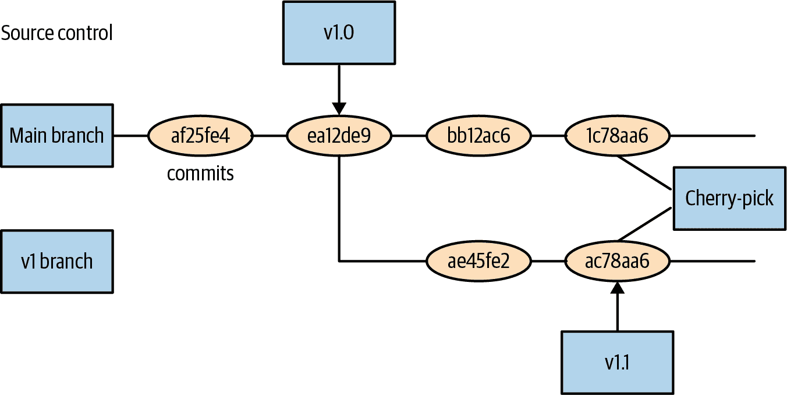
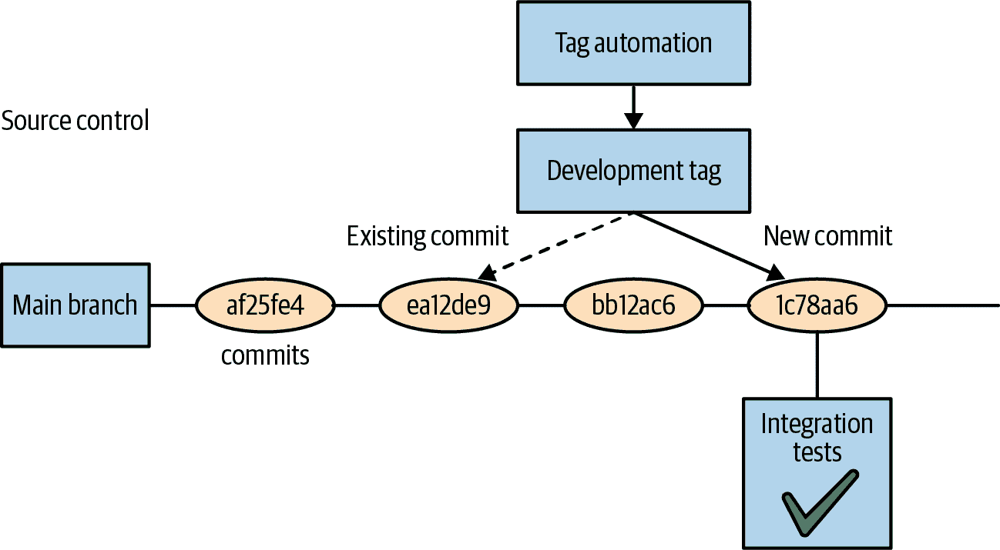

# 第二十二章：组织您的应用程序

在本书中，我们描述了构建在 Kubernetes 之上的应用程序的各种组件。我们描述了如何将程序封装为容器，将这些容器放置在 Pod 中，使用 ReplicaSets 复制这些 Pod，并使用 Deployments 进行部署。我们甚至描述了如何部署有状态和真实世界的应用程序，将这些对象收集到一个单一的分布式系统中。但是，我们并没有讨论如何实际操作这样的应用程序。您如何布置、共享、管理和更新构成您应用程序的各种配置？这就是本章的主题。

# 引导我们的原则

在深入探讨如何构建您的应用程序结构的具体细节之前，考虑一下驱动这种结构的目标是值得的。显然，可靠性和敏捷性是在 Kubernetes 中开发云原生应用程序的一般目标，但这与您如何设计应用程序的维护和部署有什么关系？以下部分描述了可以指导您设计最适合这些目标的结构的三个原则。这些原则是：

+   将文件系统视为真实性的源头

+   进行代码审查以确保变更的质量

+   使用功能标志来分阶段部署和回滚

## 文件系统作为真相的源头

当您开始探索 Kubernetes 时，就像我们在本书的开头所做的那样，通常会以命令式的方式与其进行交互。您会运行诸如 `kubectl run` 或 `kubectl edit` 的命令来创建和修改运行在集群中的 Pod 或其他对象。即使在我们开始探索如何编写和使用 YAML 文件时，这也是以一种临时的方式呈现的，好像文件本身只是修改集群状态道路上的一个途径。实际上，在一个真正生产化的应用程序中，相反的情况应该是真实的。

与其将集群的状态——存储在 `etcd` 中的数据——视为真实性的源头，不如将 YAML 对象的文件系统视为应用程序的真实性的最佳源头。部署到您的 Kubernetes 集群中的 API 对象然后是文件系统中存储的真实性的反映。

这是正确观点的众多理由。首要的是，它在很大程度上使您能够将您的集群视为不可变基础设施。随着我们进入云原生架构，我们越来越习惯于将我们的应用程序及其容器视为不可变基础设施，但将集群视为这样的基础设施则较少见。然而，将我们的应用程序迁移到不可变基础设施的相同理由也适用于我们的集群。如果您的集群是通过随意应用从互联网下载的随机 YAML 文件制造的雪花，那么它与通过命令式 bash 脚本构建的虚拟机一样危险。

此外，通过文件系统管理集群状态使得与多个团队成员协作变得非常容易。源代码控制系统被广泛理解，并且可以轻松地使多人同时编辑集群状态，同时使冲突（以及解决这些冲突）对每个人都清晰可见。

###### 注意

所有部署到 Kubernetes 的应用程序都应首先在文件系统中的文件中进行描述，这绝对是一个第一原则。然后，实际的 API 对象只是这个文件系统投射到特定集群的一部分。

## 代码审查的作用

不久以前，对应用程序源代码进行代码审查还是一个新颖的想法。但现在很明显，在将代码提交到应用程序之前，多人审查代码是生产高质量、可靠代码的最佳实践。

因此令人惊讶的是，对于用于部署这些应用程序的配置来说，同样的情况相对较少。代码审查的所有理由都直接适用于应用程序配置。但是当你考虑它时，审查这些配置对于可靠部署服务同样至关重要是显而易见的。根据我们的经验，大多数服务中断是自我造成的，由于意外后果、拼写错误或其他简单错误。确保至少有两个人查看任何配置更改，显著降低了此类错误发生的概率。

###### 注意

我们应用程序布局的第二个原则是，它必须促进对合并到代表我们集群真实源的文件集的每个更改的审查。

## 功能门

一旦你的应用源代码和部署配置文件都在源代码控制中，其中一个最常见的问题是这些仓库如何相互关联。你应该将应用程序源代码和配置文件放在同一个仓库中吗？对于小项目来说这可能行得通，但在大项目中通常更合理地将它们分开。即使是同一组人负责构建和部署应用程序，构建者和部署者的视角有足够大的不同，以至于这种关注点的分离是有道理的。

如果是这种情况，那么如何在源代码控制中开发新功能并将这些功能部署到生产环境中呢？这就是功能门控的重要作用所在。

思想是，当开发某个新功能时，该开发完全在功能标志或门后进行。这个门看起来像这样：

```
if (featureFlags.myFlag) {
    // Feature implementation goes here
}
```

这种方法有许多好处。首先，它允许团队在功能准备好发货之前长时间提交到生产分支。这使得功能开发能够与仓库的`HEAD`更紧密地对齐，因此可以避免长期分支的可怕合并冲突。

在功能标志背后工作还意味着启用功能只需进行配置更改即可激活标志。这使得在生产环境中明确了哪些内容发生了变化，并且如果功能激活导致问题，回滚功能激活也非常简单。

使用功能标志既简化了调试，又确保禁用功能不需要二进制回滚到较旧版本的代码，从而删除所有由新版本带来的错误修复和其他改进。

###### 注意

应用程序布局的第三个原则是代码默认存储在源代码控制中，通过功能标志关闭，并且只能通过代码审查的配置文件更改来激活。

# 在源代码控制中管理您的应用程序

现在我们已确定文件系统应该代表集群的真实来源，下一个重要问题是如何实际布置文件系统中的文件。显然，文件系统包含层次目录，并且源代码控制系统添加了标签和分支等概念，因此本节描述如何将它们结合在一起以表示和管理您的应用程序。

## 文件系统布局

本节描述如何为单个集群设置应用程序实例的布局。在后续章节中，我们将描述如何为多个实例参数化此布局。在开始时正确地组织这一点非常重要。就像修改源代码控制中包的布局一样，修改部署配置后进行的复杂且昂贵的重构可能永远都不会完成。

组织应用程序的第一个基数是语义组件或层（例如*前端*或*批处理工作队列*）。尽管在早期可能看起来有些过度，因为一个团队管理所有这些组件，但这为团队扩展奠定了基础——最终，不同的团队（或子团队）可能负责每个组件。

因此，对于一个使用两个服务的前端的应用程序，文件系统可能如下所示：

```
frontend/
service-1/
service-2/
```

在每个目录中，存储每个应用程序的配置。这些是直接表示集群当前状态的 YAML 文件。通常将服务名称和对象类型包含在同一个文件中非常有用。

###### 注意

虽然 Kubernetes 允许你在同一个文件中创建多个对象的 YAML 文件，但这通常是一个反模式。将多个对象分组放在同一个文件中的唯一好理由是它们在概念上是相同的。在决定将什么内容放入单个 YAML 文件时，考虑类似于定义类或结构体的设计原则。如果将这些对象组合在一起不形成一个单一的概念，它们可能不应该在同一个文件中。

因此，延伸我们之前的例子，文件系统可能如下所示：

```
frontend/
   frontend-deployment.yaml
   frontend-service.yaml
   frontend-ingress.yaml
service-1/
   service-1-deployment.yaml
   service-1-service.yaml
   service-1-configmap.yaml
...
```

## 管理周期版本

那么如何管理版本？能够回顾和查看应用程序之前的部署情况非常有用。同样，能够在保持稳定发布配置的同时将配置向前迭代也非常有用。

因此，能够同时存储和维护配置的多个修订版本非常方便。我们在这里列出的文件和版本控制系统有两种不同的方法可以使用。第一种是使用标签、分支和源控制功能。这种方法很方便，因为它与人们在源代码控制中管理修订版本的方式相匹配，并且导致更简化的目录结构。另一种选择是在文件系统内克隆配置，并使用不同修订版本的目录。这样可以非常直观地同时查看配置。

这些方法在管理不同的发布版本方面具有相同的能力，因此最终是在两者之间的美学选择。我们将讨论这两种方法，让您或您的团队决定哪种更合适。

### 使用分支和标签进行版本控制

当您使用分支和标签管理配置修订版本时，目录结构不会与前一节中的示例不同。当您准备发布时，您会在配置源控制系统中放置一个源控制标签（例如`git tag v1.0`）。该标签代表了该版本使用的配置，源控制的`HEAD`继续向前迭代。

更新发布配置略微复杂，但方法模拟了源控制中的操作。首先，您将更改提交到仓库的`HEAD`。然后，您在`v1.0`标签处创建一个名为`v1`的新分支。您将所需的更改挑选到发布分支上（`git cherry-pick *<edit>*`），最后，您使用`v1.1`标签标记此分支以指示一个新的点发布。此方法在图 22-1 中有所说明。



###### 图 22-1\. 挑选工作流程

###### 注

在将修复内容挑选到发布分支时，一个常见的错误是只将更改挑选到最新的发布中。最好将其挑选到所有活动的发布中，以防需要回滚版本但仍需要此修复。

### 版本控制与目录

使用文件系统功能的另一种选择是使用源控制功能。在这种方法中，每个版本化的部署都存在于其自己的目录中。例如，您的应用程序文件系统可能如下所示：

```
frontend/
  v1/
    frontend-deployment.yaml
    frontend-service.yaml
  current/
    frontend-deployment.yaml
    frontend-service.yaml
service-1/
  v1/
     service-1-deployment.yaml
     service-1-service.yaml
  v2/
     service-1-deployment.yaml
     service-1-service.yaml
  current/
     service-1-deployment.yaml
     service-1-service.yaml
...
```

因此，每个修订版本存在于与发布关联的目录内的并行目录结构中。所有部署都来自`HEAD`，而不是特定的修订版本或标签。您将向*当前*目录中的文件添加新配置。

在创建新版本时，您可以复制*当前*目录以创建与新版本关联的新目录。

当您对发布进行错误修复时，您的拉取请求必须修改所有相关发布目录中的 YAML 文件。这比之前描述的挑选方法稍好，因为在单个更改请求中明确指出正在更新所有相关版本，而不是需要每个版本都进行挑选。

# 为开发、测试和部署结构化您的应用程序

除了为周期性发布节奏构建应用程序外，您还希望为敏捷开发、质量测试和安全部署构建应用程序。这使得开发人员能够快速地对分布式应用程序进行更改和测试，并安全地将这些更改推向客户。

## 目标

关于开发和测试，您的应用程序有两个目标。首先，每个开发人员都应能轻松地为应用程序开发新功能。在大多数情况下，开发人员仅在一个组件上工作，但该组件与集群中的所有其他微服务都是相互连接的。因此，为了促进开发，开发人员能够在自己的环境中使用所有服务是至关重要的。

另一个目标是为了在部署前轻松准确地为应用程序进行结构化测试。这对于快速推出功能同时保持高可靠性至关重要。

## 发布进程

要实现这两个目标，将开发阶段与前述的发布版本阶段相关联是非常重要的。发布的阶段包括：

`HEAD`

配置的最前沿；最新的更改。

开发

主要是稳定的，但尚未准备部署。适合开发人员用于构建功能。

预发布

测试的开始，除非发现问题，否则不太可能更改。

金丝雀发布

面向用户的第一个真正发布版本，用于测试真实流量中的问题，并让用户有机会测试即将推出的内容。

发布

当前的生产发布版本。

### 引入开发标签

无论您是使用文件系统还是版本控制来构建发布版本，建模开发阶段的正确方式是通过源代码控制标签。这是因为开发必须跟踪稳定性，仅略微滞后于`HEAD`。

要引入开发阶段，您需要向源代码控制系统添加一个新的`development`标签，并使用自动化流程将此标签向前推进。定期，您将通过自动化集成测试测试`HEAD`。如果这些测试通过，则将`development`标签向前推进到`HEAD`。因此，开发人员可以在部署其自己的环境时跟踪最新的更改，但同时可以确保已部署的配置至少通过了有限的冒烟测试。这种方法在图 22-2 中有所体现。



###### 图 22-2\. 开发标签工作流程

### 将各个阶段映射到修订版

或许诱人的是为每个阶段引入一组新的配置，但实际上，每个版本和阶段的每种组合都会造成混乱，这将非常难以理解。相反，正确的做法是引入一个将修订版与阶段进行映射的方法。

无论您是使用文件系统还是源控制修订版来表示不同的配置版本，都可以轻松实现从阶段到修订版的映射。在文件系统情况下，可以使用符号链接将阶段名称映射到修订版：

```
frontend/
   canary/ -> v2/
   release/ -> v1/
   v1/
     frontend-deployment.yaml
...
```

对于版本控制而言，它只是与适当版本相同修订版的附加标签。

在任一情况下，版本控制都是使用先前描述的过程进行的，并且根据需要将阶段移动到新版本。实际上，这意味着存在两个同时进行的过程：第一个用于生成新的发布版本，第二个用于将发布版本合格化为应用程序生命周期中特定阶段的版本。

# 使用模板参数化您的应用程序

一旦您拥有环境和阶段的笛卡尔乘积，保持它们完全相同变得不切实际或不可能。然而，努力使环境尽可能相似是很重要的。在不同环境之间的变化和漂移会产生雪花和难以理解的系统。如果您的演示环境与发布环境不同，您真的能相信您在演示环境中运行的负载测试来验证发布吗？为了确保您的环境保持尽可能相似，使用参数化环境非常有用。参数化环境使用*模板*来处理大部分配置，但是混入一小部分*参数*以生成最终配置。这种方式，大部分配置包含在共享模板中，而参数化范围有限，并且在一个小的参数文件中维护，便于可视化不同环境之间的差异。

## 使用 Helm 和模板进行参数化

有各种不同的语言用于创建参数化配置。通常它们将文件分为*模板*文件，其中包含大部分配置，以及*参数*文件，可以与模板结合以生成完整的配置。除了参数外，大多数模板语言允许参数具有默认值，如果未指定值，则使用默认值。

以下示例展示了如何使用[Helm](https://helm.sh)，这是 Kubernetes 的包管理器，来参数化配置。尽管各种语言的信徒可能会说些不同，但所有参数化语言在很大程度上是相等的，与编程语言一样，你偏爱哪一种很大程度上是个人或团队风格的问题。因此，这里描述的 Helm 模式适用于您选择的任何模板语言。

Helm 模板语言使用“mustache”语法：

```
metadata:
  name: {{ .Release.Name }}-deployment
```

这表明`Release.Name`应该用部署的名称替换。

要为此值传递参数，您可以使用名为*values.yaml*的文件，其内容如下：

```
Release:
  Name: my-release
```

参数替换后，结果如下：

```
metadata:
  name: my-release-deployment
```

## 参数化的文件系统布局

现在你了解如何为你的配置参数化了，那么如何将其应用到文件系统布局中呢？不要将每个部署生命周期阶段都视为指向某个版本的指针，而是将每个部署生命周期阶段视为参数文件和指向特定版本的组合。例如，在基于目录的布局中，可能如下所示：

```
frontend/
  staging/
    templates -> ../v2
    staging-parameters.yaml
  production/
    templates -> ../v1
    production-parameters.yaml
  v1/
    frontend-deployment.yaml
    frontend-service.yaml
  v2/
    frontend-deployment.yaml
    frontend-service.yaml
...
```

使用版本控制执行此操作看起来类似，只是每个生命周期阶段的参数保留在配置目录树的根目录下：

```
frontend/
  staging-parameters.yaml
  templates/
    frontend-deployment.YAML
...
```

# 在全球范围内部署您的应用程序

现在，您的应用程序有多个版本在多个部署阶段中运行，配置结构化的最后一步是在全球范围内部署您的应用程序。但不要认为这些方法仅适用于大型应用程序。您可以使用它们从两个不同的区域扩展到全球范围内的十个或数百个区域。在云中，整个区域可能会失败，因此部署到多个区域（以及管理该部署）是满足要求用户需求的唯一方法。

## 全球部署架构

通常情况下，每个 Kubernetes 集群旨在位于单个区域，并包含应用程序的单个完整部署。因此，应用程序的全球部署由多个不同的 Kubernetes 集群组成，每个集群都有其自己的应用程序配置。描述如何实际构建全球应用程序，特别是涉及数据复制等复杂主题，超出了本章的范围，但我们将描述如何在文件系统中安排应用程序配置。

特定区域的配置在概念上与部署生命周期中的阶段相同。因此，将多个区域添加到配置中等同于添加新的生命周期阶段。例如，不是：

+   开发

+   演练

+   金丝雀

+   生产

您可能会有：

+   开发

+   演练

+   金丝雀

+   东部美国

+   西部美国

+   欧洲

+   亚洲

配置文件系统中的建模看起来像：

```
frontend/
  staging/
    templates -> ../v3/
    parameters.yaml
  eastus/
    templates -> ../v1/
    parameters.yaml
  westus/
    templates -> ../v2/
    parameters.yaml
  ...
```

如果你使用版本控制和标签，文件系统将如下所示：

```
frontend/
  staging-parameters.yaml
  eastus-parameters.yaml
  westus-parameters.yaml
  templates/
    frontend-deployment.yaml
...
```

使用这种结构，您将为每个区域引入一个新标签，并使用该标签下的文件内容部署到该区域。

## 实施全球部署

现在您已经为世界各地的每个区域配置了配置，问题变成了如何更新这些不同的区域。使用多个区域的主要目标之一是确保非常高的可靠性和正常运行时间。虽然人们可能会认为云和数据中心的宕机是停机的主要原因，但事实上，宕机通常是由新版本的软件发布引起的。因此，构建高可用系统的关键是限制您可能进行的任何更改的影响，或者说“爆炸半径”。因此，在跨多个区域推出版本时，逐个区域谨慎移动、验证并确保信心，显得十分合理。

在全球范围内推出软件通常看起来更像是一个工作流程，而不是单一的声明性更新：您首先将版本更新到最新版本，并在所有区域中进行逐步推进，直到在所有地方都推出为止。但是，您应该如何结构化各个区域，以及在各区域之间进行验证之间应该等待多长时间呢？

###### 注意

您可以使用诸如[GitHub Actions](https://oreil.ly/BhWxi)之类的工具自动化部署工作流程。它们提供了一种声明性语法来定义您的工作流程，并且也存储在源代码控制中。

要确定在各个区域之间推出的时间间隔，考虑软件的“烟雾平均时间”。这是一个新版本在推出到一个区域后，平均需要多长时间才能发现问题（如果存在问题）。显然，每个问题都是独特的，可能需要不同的时间才能被发现，这就是为什么您要了解*平均*时间。在规模化管理软件时，这是一种概率而非确定性的业务，因此您希望等待一个使错误概率低到足够让您放心继续向下一个区域推进的时间。例如，两到三倍的平均烟雾时间可能是一个合理的起点，但这取决于您的应用程序，因此会有很大的变化。

要确定各地区的顺序，重要的是考虑各个地区的特点。例如，您可能会有高流量地区和低流量地区。根据您的应用程序，某些功能在一个地理区域比另一个地方更受欢迎。在制定发布时间表时应考虑所有这些特征。您可能希望首先在低流量地区进行推出。这样可以确保您发现的早期问题仅限于影响不大的地区。尽管这不是一个硬性规则，但早期问题通常最为严重，因为它们会在您首次推出的地区迅速显现出来。因此，减少此类问题对客户的影响是有意义的。接下来，推出到高流量地区。一旦您通过低流量地区成功验证了发布的正确性，就要验证其在大规模上的正确性。唯一的方法是将其推出到单个高流量地区。当您成功推出到低流量和高流量地区时，您可以相信您的应用程序可以安全地在所有地方推出。然而，如果存在区域性差异，您可能还想在更广泛地推出发布之前在各种地理区域逐渐测试。

制定发布时间表时，重要的是无论发布的大小如何，都要完全遵循它。许多停机事件是因为人们加速发布，要么是为了解决其他问题，要么是因为他们认为是“安全”的。

## 全球部署的仪表板和监控

当您在小规模开发时，这可能是一个奇怪的概念，但在中等或大规模时，您可能会遇到的一个重要问题是，不同版本的应用程序部署到不同的地区。这可能由于各种原因发生（例如，因为发布失败、被中止或在特定地区出现问题），如果您不仔细追踪，您可能会迅速遇到在全球各地部署不同版本的难以管理的问题。此外，随着客户询问他们正在经历的错误的修复情况，一个常见的问题将是：“它已经部署了吗？”

因此，开发仪表板是至关重要的，它可以让您一眼看出各个地区运行的哪个版本，以及警报功能，当您的应用程序部署了太多版本时将触发警报。最佳实践是将活跃版本数量限制在不超过三个：一个用于测试，一个正在推出，一个正在被推出的版本所替代。如果活跃版本超过这个数量，将会带来麻烦。

# 总结

本章提供了关于如何通过软件版本、部署阶段和全球各地区来管理 Kubernetes 应用程序的指导。它强调了组织应用程序基础的原则：依赖文件系统进行组织、使用代码审查来确保质量变更，并依赖于功能标志或门控，以便逐步添加和删除功能。

和其他所有内容一样，本章中的示例应视为灵感，而非绝对真理。阅读指南，找到最适合您应用程序特定情况的方法组合。但请记住，在部署应用程序时，您正在设定一个可能需要多年维护的过程。
