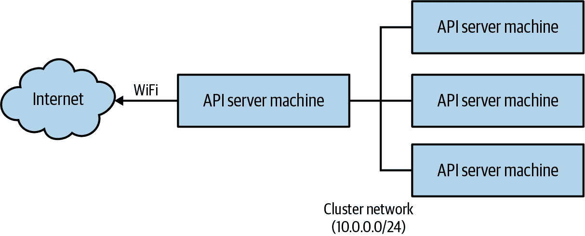

# 附录. 搭建你自己的 Kubernetes 集群

Kubernetes 通常通过公共云计算的虚拟世界来体验，你只需在网页浏览器或终端中操作，距离你的集群非常近。但在裸机上物理搭建一个 Kubernetes 集群可能会带来非常丰富的体验。同样地，看到你随意断开某个节点的电源或网络，然后观察 Kubernetes 如何恢复你的应用程序，你会深信其实用性。

自己搭建集群可能看起来既具有挑战性又昂贵，但幸运的是实际上都不是。购买低成本的片上系统计算机板的能力，以及社区为了让 Kubernetes 更易安装而做出的大量工作，意味着你可以在几个小时内建立一个小型 Kubernetes 集群。

在接下来的说明中，我们专注于搭建一组 Raspberry Pi 机器的集群，但稍作调整，同样的说明也可以用于各种不同的单板机器或者你周围的任何其他计算机。

# 零件清单

搭建集群的第一步是准备好所有的零件。在这里的所有示例中，我们假设是一个四节点的集群。你也可以建立一个三节点或者甚至一百节点的集群，但四节点是一个相当好的选择。首先，你需要购买（或者搜刮到）搭建集群所需的各种零件。

这里是购物清单，列出了一些写作时的大致价格：

1.  四台 Raspberry Pi 4 机器，每台至少配备 2 GB 内存— $180

1.  四张至少 8 GB 的 SDHC 存储卡（务必购买高质量的！）— $30–50

1.  四根 12 英寸 Cat. 6 以太网线— $10

1.  四根 12 英寸 USB-A 到 USB-C 电缆— $10

1.  一个 5 端口 10/100 快速以太网交换机— $10

1.  一个 5 端口 USB 充电器— $25

1.  一个能容纳四个 Pi 的 Raspberry Pi 堆叠盒子— $40（或者自己动手建造）

1.  一个用于给以太网交换机供电的 USB 到插口插头（可选）— $5

整个集群的总成本约为$300，如果你建立一个三节点集群并且跳过盒子和交换机的 USB 电源电缆，你可以将成本降低到$200（尽管盒子和电缆确实能使整个集群更加整洁）。

关于存储卡的另一个注意事项：不要省钱在这里。低端存储卡表现不可预测，会使你的集群非常不稳定。如果你想节省一些钱，可以购买较小但高质量的存储卡。在线购买高质量的 8 GB 存储卡大约每张约$7。

一旦你准备好了所有零件，你就可以继续搭建集群了。

###### 注意

这些说明还假设你有一个能够刷写 SDHC 卡的设备。如果没有，你需要购买一个 USB 存储卡读写器。

# 刷写镜像

默认的 Ubuntu 20.04 镜像支持 Raspberry Pi 4，也是许多 Kubernetes 集群常用的操作系统。安装它的最简单方法是使用由[Raspberry Pi 项目](https://oreil.ly/4s8Wa)提供的 Raspberry Pi Imager：

+   [macOS](https://oreil.ly/g7Lzw)

+   [Windows](https://oreil.ly/Y7CD3)

+   [Linux](https://oreil.ly/u4YvC)

使用映像工具将 Ubuntu 20.04 映像写入每张存储卡。在映像工具中，Ubuntu 可能不是默认的映像选择，但您可以选择它作为选项。

# 首次启动

首先要做的是仅启动 API 服务器节点。组装您的集群，并决定哪一个将是 API 服务器节点。插入存储卡，将板子插入 HDMI 输出，并将键盘插入 USB 端口。

接下来，连接电源以启动板子。

在提示符下使用用户名**`ubuntu`**和密码**`ubuntu`**登录。

###### 警告

您的 Raspberry Pi（或任何新设备）的第一件事是更改默认密码。每种安装的默认密码都是众所周知的，这使得那些有意恶作剧的人可以访问系统的默认登录。这会让互联网对所有人都不安全。请更改默认密码！

为您集群中的每个节点重复这些步骤。

## 设置网络

下一步是在 API 服务器上设置网络。为 Kubernetes 集群设置网络可能会很复杂。在以下示例中，我们正在设置一个网络，其中一台机器通过无线网络连接到互联网；这台机器还通过有线以太网连接到集群网络，并提供 DHCP 服务器以向集群中的其余节点提供网络地址。此网络的示例如下图所示：



决定哪个板子将托管 API 服务器和`etcd`。通常最容易记住这一点的方法是将其设置为堆栈中的顶部或底部节点，但也可以使用某种标签。

要做到这一点，请编辑文件*/etc/netplan/50-cloud-init.yaml*。如果不存在此文件，您可以创建它。文件的内容应如下所示：

```
network:
    version: 2
    ethernets:
        eth0:
            dhcp4: false
            dhcp6: false
            addresses:
            - '10.0.0.1/24'
            optional: true
    wifis:
        wlan0:
            access-points:
                <your-ssid-here>:
                    password: '<your-password-here>'
            dhcp4: true
            optional: true
```

这将使主要以太网接口具有静态分配的地址 10.0.0.1，并设置 WiFi 接口以连接到您的本地 WiFi。然后运行`sudo netplan apply`来应用这些新变更。

重新启动机器以获取 10.0.0.1 地址。您可以通过运行`ip addr`并查看`eth0`接口的地址来验证设置是否正确。还要验证与互联网的连接是否正常。

接下来，我们将在此 API 服务器上安装 DHCP，以便为工作节点分配地址。运行:

```
$ apt-get install isc-dhcp-server
```

然后按以下方式配置 DHCP 服务器（*/etc/dhcp/dhcpd.conf*）：

```
# Set a domain name, can basically be anything
option domain-name "cluster.home";

# Use Google DNS by default, you can substitute ISP-supplied values here
option domain-name-servers 8.8.8.8, 8.8.4.4;

# We'll use 10.0.0.X for our subnet
subnet 10.0.0.0 netmask 255.255.255.0 {
    range 10.0.0.1 10.0.0.10;
    option subnet-mask 255.255.255.0;
    option broadcast-address 10.0.0.255;
    option routers 10.0.0.1;
}
default-lease-time 600;
max-lease-time 7200;
authoritative;
```

您可能还需要编辑*/etc/default/isc-dhcp-server*以将`INTERFACES`环境变量设置为`eth0`。使用`sudo systemctl restart isc-dhcp-server`重新启动 DHCP 服务器。现在您的机器应该正在分配 IP 地址。您可以通过通过以太网连接第二台机器到交换机来测试这一点。第二台机器应该从 DHCP 服务器获得 10.0.0.2 地址。

记得编辑 */etc/hostname* 文件，将此机器重命名为 `node-1`。为了帮助 Kubernetes 进行网络设置，还需要设置 `iptables`，使其能够看到桥接网络流量。在 */etc/modules-load.d/k8s.conf* 创建一个文件，只包含 `br_netfilter`。这将在您的内核中加载 `br_netfilter` 模块。

接下来，您需要为网络桥接和地址转换（NAT）启用一些 `systemctl` 设置，以使 Kubernetes 网络正常工作，并且您的节点能够访问公共互联网。创建名为 */etc/sysctl.d/k8s.conf* 的文件，并添加以下内容：

```
net.ipv4.ip_forward=1
net.bridge.bridge-nf-call-ip6tables=1
net.bridge.bridge-nf-call-iptables=1
```

然后编辑 */etc/rc.local* 文件（或等效文件），添加 `iptables` 规则以从 `eth0` 转发到 `wlan0`（以及反向）：

```
iptables -t nat -A POSTROUTING -o wlan0 -j MASQUERADE
iptables -A FORWARD -i wlan0 -o eth0 -m state \
  --state RELATED,ESTABLISHED -j ACCEPT
iptables -A FORWARD -i eth0 -o wlan0 -j ACCEPT
```

到这一步，基本的网络设置应该已经完成。插入并启动其余两个板（应该看到它们被分配了地址 10.0.0.3 和 10.0.0.4）。在每台机器上编辑 */etc/hostname* 文件，分别命名为 `node-2` 和 `node-3`。

首先查看 */var/lib/dhcp/dhcpd.leases* 验证，然后 SSH 到节点（记得首先更改默认密码）。确认节点能够连接到外部互联网。

## 安装容器运行时

在安装 Kubernetes 之前，您需要先安装一个容器运行时。有几种可能的运行时可供选择，但最广泛采用的是来自 Docker 的 `containerd`。`containerd` 由标准的 Ubuntu 软件包管理器提供，但其版本有点滞后。虽然需要多做一些工作，但我们建议从 Docker 项目自身安装它。

第一步是将 Docker 设置为系统上安装软件包的仓库：

```
# Add some prerequisites
sudo apt-get install ca-certificates curl gnupg lsb-release

# Install Docker's signing key
curl -fsSL https://download.docker.com/linux/ubuntu/gpg | sudo gpg --dearmor \
-o /usr/share/keyrings/docker-archive-keyring.gpg
```

最后一步，创建文件 */etc/apt/sources.list.d/docker.list*，内容如下：

```
deb [arch=arm64 signed-by=/usr/share/keyrings/docker-archive-keyring.gpg] \
https://download.docker.com/linux/ubuntu   focal stable
```

现在您已经安装了 Docker 软件包仓库，可以通过运行以下命令安装 `containerd.io`。重要的是要安装 `containerd.io`，而不是 `containerd`，以获取 Docker 软件包，而不是默认的 Ubuntu 软件包：

```
sudo apt-get update; sudo apt-get install containerd.io
```

到这一步，`containerd` 已经安装完毕，但您需要配置它，因为软件包提供的配置不能满足 Kubernetes 的需求：

```
containerd config default > config.toml
sudo mv config.toml /etc/containerd/config.toml

# Restart to pick up the config
sudo systemctl restart containerd
```

现在您已经安装了容器运行时，可以继续安装 Kubernetes 自身了。

## 安装 Kubernetes

此时，所有节点应该已经启动，并具有 IP 地址，并且能够访问互联网。现在是在所有节点上安装 Kubernetes 的时候了。使用 SSH，在所有节点上运行以下命令安装 `kubelet` 和 `kubeadm` 工具。

首先，添加软件包的加密密钥：

```
# curl -s https://packages.cloud.google.com/apt/doc/apt-key.gpg \
| sudo apt-key add -
```

然后将该仓库添加到您的仓库列表中：

```
# echo "deb http://apt.kubernetes.io/ kubernetes-xenial main" \
  | sudo tee /etc/apt/sources.list.d/kubernetes.list
```

最后，更新并安装 Kubernetes 工具。这也会更新系统上的所有软件包，以确保一切正常：

```
# sudo apt-get update
$ sudo apt-get upgrade
$ sudo apt-get install -y kubelet kubeadm kubectl kubernetes-cni
```

## 配置集群

在运行 DHCP 和连接到互联网的 API 服务器节点上运行：

```
$ sudo kubeadm init --pod-network-cidr 10.244.0.0/16 \
        --apiserver-advertise-address 10.0.0.1 \
        --apiserver-cert-extra-sans kubernetes.cluster.home
```

请注意，您正在广告您的内部 IP 地址，而不是外部地址。

最终，这将打印出一个命令，用于将节点加入到您的集群中。它看起来会像这样：

```
$ kubeadm join --token=*<token>* 10.0.0.1
```

SSH 到集群中每个工作节点，并运行该命令。

当所有这些都完成后，您应该能够运行此命令并查看您的工作集群：

```
$ kubectl get nodes
```

## 设置集群网络

您已经设置好了节点级网络，但仍然需要设置 Pod 到 Pod 的网络。由于集群中的所有节点都在同一物理以太网网络上运行，因此您可以简单地在主机内核中设置正确的路由规则。

管理此操作的最简单方法是使用由 CoreOS 创建并现在由 [Flannel 项目](https://oreil.ly/RHfMH) 支持的 [Flannel 工具](https://oreil.ly/ltaOv)。Flannel 支持多种不同的路由模式；我们将使用 `host-gw` 模式。您可以从 [Flannel 项目页面](https://github.com/coreos/flannel) 下载一个示例配置文件。

```
$ curl https://oreil.ly/kube-flannelyml \
  > kube-flannel.yaml
```

Flannel 提供的默认配置使用 `vxlan` 模式。要修复此问题，请在您喜欢的编辑器中打开该配置文件；将 `vxlan` 替换为 `host-gw`。

您还可以使用 `sed` 工具来完成此操作：

```
$ curl https://oreil.ly/kube-flannelyml \
  | sed "s/vxlan/host-gw/g" \
  > kube-flannel.yaml
```

一旦您更新了 *kube-flannel.yaml* 文件，您就可以使用以下命令创建 Flannel 网络设置：

```
$ kubectl apply -f kube-flannel.yaml
```

这将创建两个对象，一个用于配置 Flannel 的 ConfigMap 和一个运行实际 Flannel 守护程序的 DaemonSet。您可以使用以下命令检查它们：

```
$ kubectl describe --namespace=kube-system configmaps/kube-flannel-cfg
$ kubectl describe --namespace=kube-system daemonsets/kube-flannel-ds
```

# 摘要

此时，您应该已经在您的树莓派上运行一个工作的 Kubernetes 集群。这对于探索 Kubernetes 非常有用。安排一些任务，打开 UI，并尝试通过重新启动机器或断开网络来破坏您的集群。
