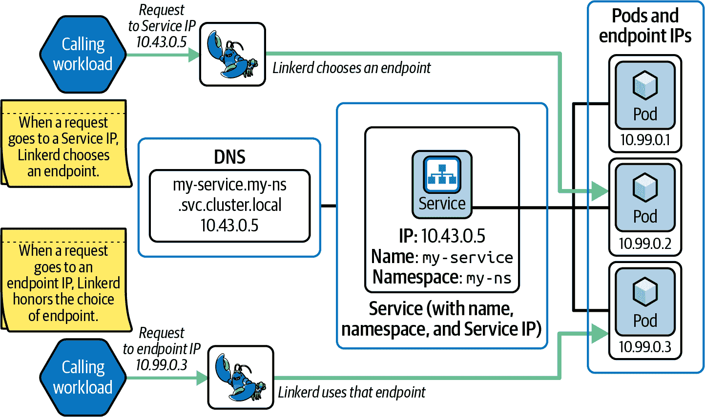
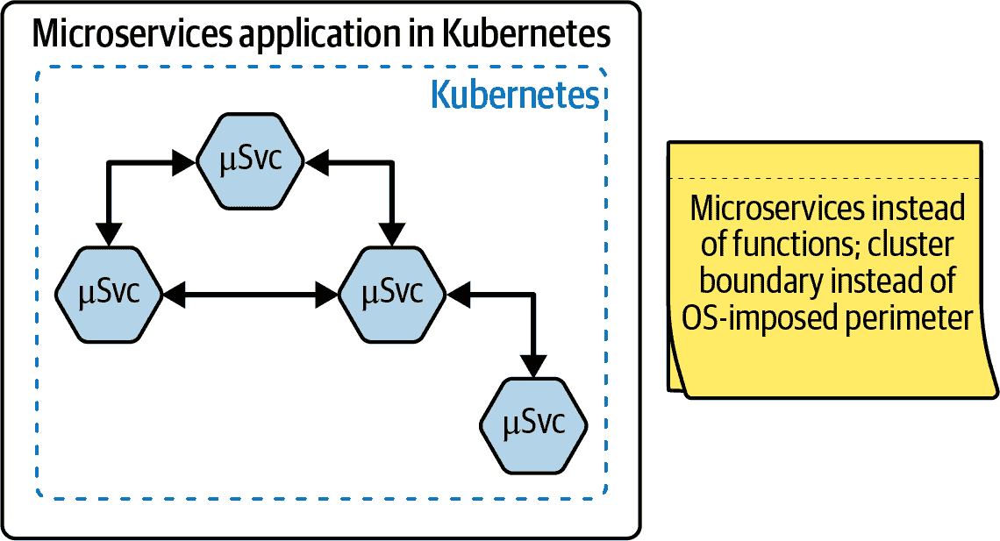
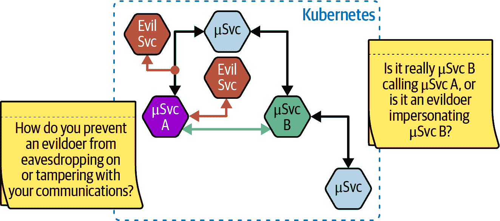
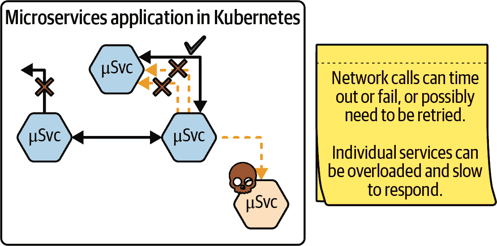
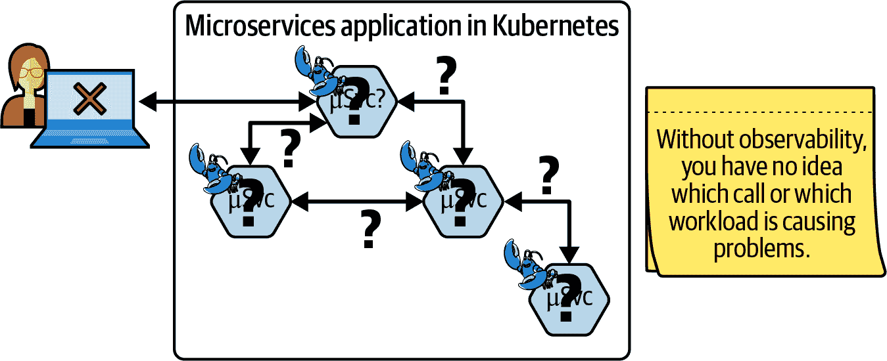
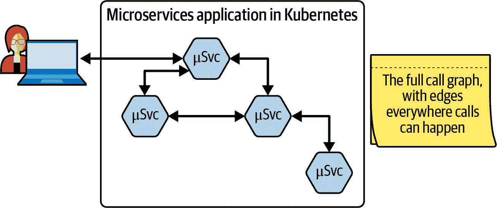
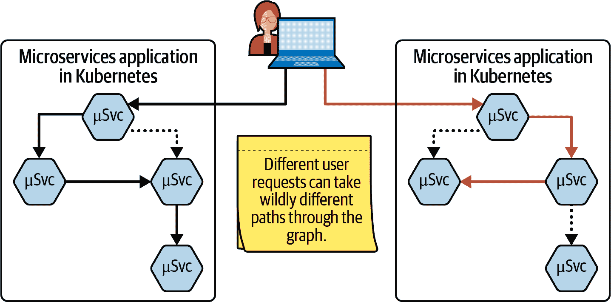
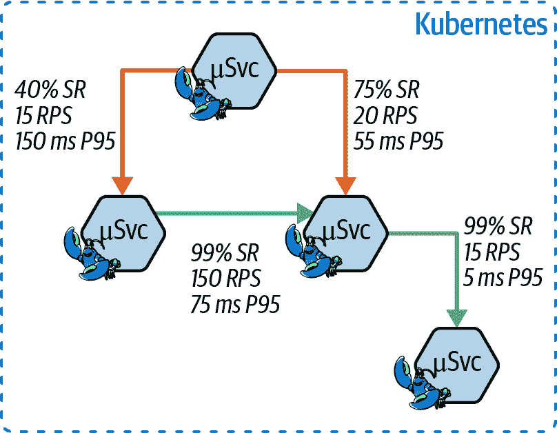
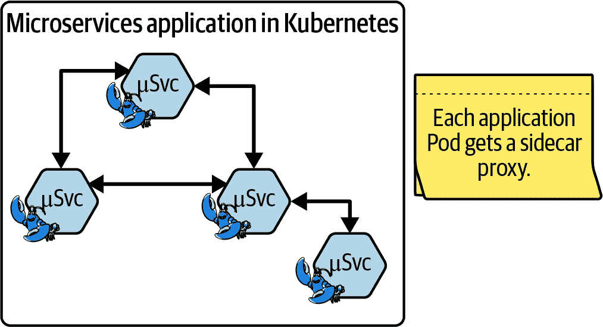

# 第一章：服务网格 101

[Linkerd](https://oreil.ly/dgNqN) 是第一个服务网格，事实上，它是首个提出“服务网格”这个术语的项目。它由 Buoyant, Inc. 在 2015 年创建，正如我们将在 第二章 中进一步讨论的那样，至今一直致力于使得生产和运行真正优秀的云原生软件变得更加容易。

但究竟什么是服务网格呢？我们可以从 [CNCF 术语表](https://oreil.ly/dgNqN) 中的定义开始。

> 在微服务世界中，应用程序被分解成多个较小的服务，它们通过网络进行通信。就像您的 wifi 网络一样，计算机网络本质上是不可靠的、可黑客的，并且通常速度较慢。服务网格通过管理服务之间的流量（即通信），并在所有服务中统一添加可靠性、可观察性和安全性功能，来应对这一新的一套挑战。

云原生世界涉及从开发中在您的笔记本电脑上运行的小集群到谷歌和亚马逊管理的大规模基础设施的计算。当应用程序采用微服务架构时效果最佳，但微服务架构本质上比单体架构更加脆弱。

从根本上说，服务网格是关于将应用程序开发者和应用程序本身隐藏起来的脆弱性。它们通过将几个关键的特性从应用程序移到基础设施中来实现这一点。这使得应用程序开发者能够专注于使他们的应用程序独特的东西，而不必花费所有时间来担心如何提供应该在所有应用程序中都相同的关键功能。

在本章中，我们将高层次地了解服务网格的作用、工作原理及其重要性。在此过程中，我们将为您提供本书其余部分关于 Linkerd 的更详细讨论所需的背景。

# 基本的网格功能

服务网格提供的关键功能可以大致分为三大类：*安全性*、*可靠性* 和 *可观察性*。在我们分析这三个类别时，我们将比较它们在典型单体应用和微服务应用中的表现。

当然，“单体”可以指代几种不同的东西。 图 1-1 显示了我们将考虑的“典型”单体应用程序的图表。

###### 图 1-1\. 单体应用程序

单体应用是操作系统中的一个单一进程，这意味着它可以利用操作系统提供的所有保护机制；其他进程无法看到单体应用内部的任何内容，也*绝对*不能修改其中任何内容。单体应用内不同部分之间的通信通常是单体应用单一内存空间内的函数调用，因此其他进程无法查看或更改这些通信。确实，单体应用的某个区域可以修改其他部分正在使用的内存—事实上，这是错误的一个重要来源！—但这些通常只是错误，而不是攻击。

# 多进程对比多机器

“但等等！”我们听到你们在呼喊。“任何名副其实的操作系统都可以提供跨越一个以上进程的保护！那么内存映射文件或者 System V 共享内存段怎么办？环回接口和 Unix 域套接字（稍作拓展）呢？”

你是对的：这些机制可以允许多个进程在仍然受操作系统保护的情况下合作和共享信息。然而，它们必须明确编码到应用程序中，并且它们仅在*单台机器*上运行。像 Kubernetes 这样的云原生编排系统的一部分优势在于，它们可以在集群中的任何机器上调度 Pod，而你事先不知道哪台机器。这是极其灵活的，但也意味着那些假设一切都在单一机器上的机制在云原生世界中根本行不通。

相比之下，图 1-2 显示了对应的微服务应用程序。

###### 图 1-2\. 微服务应用程序

在微服务中，情况有所不同。每个微服务都是一个独立的进程，微服务之间仅通过网络进行通信—但操作系统提供的保护机制仅在*进程内部*有效。在需要微服务之间通信的世界中，这些机制是不够的。

当开发微服务应用程序时，依赖不可靠且不安全的网络进行通信会引发*很多*问题。

## 安全性

让我们从网络本身不安全的事实开始。这引发了许多可能的问题，其中一些如图 1-3 所示。

###### 图 1-3\. 通信是一项风险重重的业务

一些最重要的安全问题包括*窃听*、*篡改*、*身份盗窃*和*越权*：

窃听

恶意用户可能会拦截两个微服务之间的通信，阅读并非面向他们的通信。根据恶意用户学到的具体内容，这可能只是轻微烦恼，也可能是重大灾难。

防止窃听的典型方法是*加密*，它会将数据加密，以便只有预期的接收者能够理解。

篡改

恶意者还可能能够修改网络传输中的数据。在其最简单的形式中，篡改攻击将简单地破坏传输中的数据；在其最微妙的形式中，它将修改数据以有利于攻击者。

*极其*重要的是要理解，仅仅靠加密是*无法*防止篡改的！正确的保护方法是使用像校验和这样的*完整性检查*；所有设计良好的加密系统都将完整性检查作为其协议的一部分。

身份盗窃

当你把信用卡详细信息交给支付微服务时，你怎么能确信你确实在与你的支付微服务交流？如果恶意者成功假装成你的某个微服务，那将为各种麻烦可能性打开大门。

强大的*身份验证*对于防范此类攻击至关重要。这是确保你正在交流的微服务确实是你所认为的那个的唯一方法。

过度扩展

与身份盗窃相反，恶意者可能会利用微服务允许执行本不应允许的操作的地方。例如，想象一下，一个恶意者发现支付微服务可以毫不犹豫地接受来自本应只列出待售物品的微服务的请求。

在这里，注意*授权*至关重要。在理想情况下，每个微服务将能够严格按需操作，而且不多不少（*最小特权原则*）。

## 可靠性

在单体架构世界中，可靠性通常指的是单体功能的良好运行：当单体的不同部分通过函数调用进行通信时，通常不必担心调用丢失或者其中一个函数突然无响应！但是，正如在图 1-4 中所示，与微服务相比，不可靠的通信实际上是*常态*。

###### 图 1-4\. 不可靠的通信是常态

微服务可能不可靠的方式有很多，包括：

请求失败

有时网络请求会失败。可能的原因有很多，从崩溃的微服务到网络过载或分区。无论是应用程序还是基础设施都需要采取措施来处理失败的请求。

在最简单的情况下，网格可以简单地为应用程序管理*重试*：如果调用失败是因为被调用服务崩溃或超时，则只需重新发送请求。当然，这种方法并不总是有效：并非所有请求都适合重试，也并非每次故障都是暂时性的。但在许多情况下，简单的重试逻辑可以取得很好的效果。

服务故障

在某些请求失败的特殊情况下，不仅一个微服务实例会崩溃，而是*所有*实例都可能崩溃。也许是部署了错误版本，或者整个集群崩溃了。在这些情况下，服务网格可以通过*故障转移*到备用集群或已知良好的服务实现来提供帮助。

同样地，如果没有应用程序的帮助，这并非总能实现（例如，有状态服务的故障转移可能非常复杂）。但是，微服务通常设计为在无状态情况下运行，这种情况下，服务网格的故障转移可以提供极大的帮助。

服务超载

另一种特殊情况：有时故障发生是因为太多请求堆积在同一个服务上。在这些情况下，*熔断*可以帮助避免级联故障：如果网格快速拒绝一些请求，防止其依赖服务介入并造成更多麻烦，就可以帮助限制损害。这是一个激进的技术，但这种强制性的负载控制可以极大地提高整体应用程序的可靠性。

## 可观测性

在任何计算应用中，要看清楚发生了什么是很困难的：即使是一台慢机器，如今的操作时间比我们人类生活的时间尺度快上十亿倍！在单体应用程序中，通常通过内部日志记录或仪表板来处理可观测性问题，这些仪表板从单体的多个不同区域收集全局指标。但在微服务架构中，这显然不太可行，正如 图 1-5 中所示——即使可行，也不能完全反映实际情况。

###### 图 1-5\. 在黑暗中工作是困难的

在微服务世界中，“可观测性”往往更加关注*调用图*和*黄金指标*：

调用图

当查看微服务应用时，通常首要的事情是了解哪些服务被其他哪些服务调用。这就是*调用图*，如 图 1-6 所示，而服务网格的一个关键功能是提供有关每条边的流量量、成功率、失败率等指标。

###### 图 1-6\. 应用程序的调用图

调用图是一个关键的起点，因为用户从集群外部看到的问题实际上可能是由于图中深埋的单个服务出现了问题。具备整个图的可见性非常重要，以便能够解决问题。

值得注意的是，在特定情况下，图中的特定路径将会相关，如 图 1-7 所示。例如，用户的不同请求可能会在图中使用不同的路径，从而激活工作负载的不同方面。

###### 图 1-7\. 通过调用图的不同路径

黄金指标

对于每个微服务，我们可以收集大量的指标。随着时间的推移，其中三个指标在各种情况下反复证明特别有用，以至于我们现在将它们称为“黄金指标”（如图 1-8 所示）：

延迟

请求完成需要多长时间？通常报告为某个百分比请求完成所需的时间。例如，P95 延迟表示 95% 的请求完成所需的时间，因此，“5 ms P95”可以解释为 95% 的请求在 5 毫秒或更短的时间内完成。

流量

给定服务处理多少请求？通常报告为每秒请求次数，或 RPS。

成功率

有多少请求成功？（这也可以报告为其反向值，*错误率*。）通常报告为总请求数的百分比，其中“成功率”通常缩写为 SR。

###### 图 1-8\. 三个黄金指标

# 原始“黄金信号”

最初在 Google 的[“监控分布式系统”文章](https://oreil.ly/TGgBm)中描述这些内容为四个“黄金信号”：延迟、请求速率、错误率和饱和度。我们更喜欢“黄金指标”，因为指标是您可以直接测量的东西；您从指标（如“饱和度”）中得出信号。

我们将在第十章中更详细地讨论这些内容，但现在值得注意的是，这些指标已被证明非常有用，许多服务网格都花费了大量精力来记录它们，而服务网格正是跟踪它们的理想场所。

# 网格实际上是如何工作的？

最后，让我们快速看看服务网格的实际功能。

从高层次来看，所有的网格基本上都在做同样的工作：它们插入到操作系统的网络堆栈中，接管应用程序正在使用的低级网络，并调解应用程序在网络上的所有操作。这是唯一的实际方法，可以使网格提供其设计的所有功能，而无需对应用程序本身进行更改。

大多数服务网格，包括 Linkerd，使用 *sidecar* 模型，在每个应用程序容器旁边注入一个代理容器（参见图 1-9）。^(1) 一旦运行，代理会重新配置主机的网络路由规则，以便所有进出应用程序容器的流量都通过代理。这允许代理控制网格功能所需的所有内容。

###### 图 1-9\. Linkerd 和 sidecar 模型

还有其他模型，但 sidecar 模型在操作简易性和安全性方面具有巨大优势：

+   从系统的其他基本一切的角度来看，sidecar 的作用就像它*是*应用程序的一部分。特别是这意味着操作系统为保证应用程序安全所做的所有事情也适用于 sidecar。这是一个非常非常重要的特征：将 sidecar 限制在完全一个安全上下文内大大减少了 sidecar 的攻击面，并且使得判断 sidecar 所做的事情是否安全变得更加容易。

+   以同样的方式，管理 sidecar 与管理任何其他应用程序或服务完全相同。例如，`kubectl rollout restart` 将像单元一样工作来重新启动应用程序 Pod *及其 sidecar*。

当然，它也有一些缺点。最大的问题是*每个*应用 Pod 都需要一个 sidecar 容器——即使你的应用有成千上万个 Pod。另一个普遍关注的问题是延迟：sidecar 根据定义需要一些时间来处理网络流量。再次强调，我们稍后会详细讨论这个问题，但值得注意的是，Linkerd 致力于最大程度地减少 sidecar 的影响，在实践中，Linkerd 非常快速且非常轻量级。

# 那么我们为什么需要这个呢？

简单来说，*网格提供的功能不是可选的*。你永远不会听到工程团队说“哦，我们不需要安全性”或者“哦，可靠性不重要”（尽管你可能需要说服人们理解可观察性的必要性——希望本书能帮到你！）。

换句话说，选择不是是否拥有这三个特性，而是这些特性是由网格提供还是需要在应用程序中提供。

在应用程序中提供它们是昂贵的。你的开发人员可以手工编写它们，但这意味着在每个微服务中复制大量繁琐的应用程序代码，这很容易出错（特别是因为总是有诱惑让资深开发人员专注于与你的业务相关的核心逻辑，而不是那些沉闷、不太显眼但同样关键的重试工作）。你可能还会遇到应用程序各部分之间的不兼容性问题，尤其是当应用程序规模扩大时。

或者，你可以找到为你实现功能的库，这确实节省了开发时间。另一方面，你仍然需要每个开发人员学习如何使用这些库，你受限于可以找到这些库的语言和运行时，而不兼容性仍然是一个严重的问题（假设一个微服务在另一个微服务之前升级了库）。

随着时间的推移，我们非常清楚，将所有这些功能推入网格中，即使应用开发人员不一定需要知道其存在，也是提供它的明智方式。我们认为，Linkerd 是现有各种网格中最好的选择。如果到本书结束时我们还没有说服您，请联系我们，告诉我们哪里做得不够！

# 摘要

总之，服务网格是平台级基础设施，能够在整个应用程序上提供安全性、可靠性和可观察性，而无需对应用程序本身进行更改。Linkerd 是第一个服务网格，我们认为它仍然是权力、速度和操作简易性最佳平衡的选择。

^(1) 这个名字的灵感来自于在摩托车上安装边车的类比。
