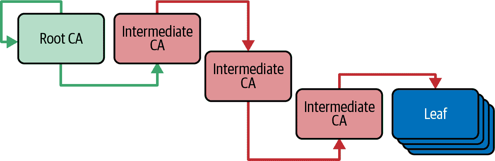

# 第二章：介绍 Linkerd

2015 年是云原生计算非常重要的一年：第一个 Kubernetes 版本发布、Cloud Native Computing Foundation（CNCF）的创建以及 Linkerd 的诞生。Linkerd 是最早捐赠给 CNCF 的五个项目之一，也是首个提出“服务网格”概念的项目之一。

在本章中，您将更多地了解 Linkerd 的起源、其特点以及其工作原理。我们将简要、有用且有趣地介绍其历史，但如果您想直接获取重要信息，可以随时跳过。

# Linkerd 的起源

Linkerd 项目由前 Twitter 工程师 William Morgan 和 Oliver Gould 于 2015 年在 Buoyant, Inc.创建。Linkerd 的第一个公开发布是在 2016 年 2 月。您可以在图 2-1 中看到其历史的简要总结。

###### 图 2-1 Linkerd 简要时间轴

## Linkerd1

最初版本的 Linkerd，现在称为“Linkerd1”，主要使用 Scala 编写，主要基于 Twitter 创建的 Finagle RPC 库。它是一个多平台网格，支持多种容器调度器，并提供了许多强大的功能。然而，使用 Finagle 需要 Linkerd1 在 Java 虚拟机（JVM）上运行，而最终 JVM 的性能成本太高。

Linkerd1 已经正式停止支持。今后，当我们谈论“Linkerd”时，我们将指的是现代 Linkerd——Linkerd2。

## Linkerd2

2018 年，Linkerd 项目基于从 Linkerd1 在实际应用中积累的经验，进行了从头重写，告别了 Scala 世界。该项目放弃了对其他容器编排引擎的支持，全面转向支持 Kubernetes，大部分代码采用 Go 语言编写。此外，开发者选择编写一个小巧、快速、专为目的设计的 Rust 代理（创意命名为`linkerd2-proxy`），用于管理应用程序通信，而不是采用 Envoy 代理。

# Linkerd 与 Rust

当 Linkerd2 重写开始时，Rust 编程语言因其内存安全性而受到关注，这使开发者能够编写避免 C 和 C++中许多内存管理漏洞的代码，同时编译成本地代码以实现高性能。不过，Rust 在网络支持方面有时缺少 Linkerd2 所需的功能；在许多情况下，Linkerd2 开发者不得不向 Rust crate（如`hyper`和`tokio`）添加这些功能。

决定专注于 Kubernetes 并创建一个专为目的设计的代理的驱动力是“操作简易性”：即一个项目应能够在保持简单易学易用的同时提供功能和性能。这一概念对整个 Linkerd 项目产生了巨大影响，并继续是 Linkerd 开发的主要关注点。

## Linkerd 代理

值得重申，`linkerd2-proxy` *并非*通用代理；它是专门为 Linkerd 设计的。它非常快速轻巧，并且作为 Linkerd 用户，您几乎永远不需要直接与其交互——在正常使用中它几乎是不可见的，大多数 Linkerd 用户从不需要调整或调试`linkerd2-proxy`。（事实上，Linkerd 的维护人员喜欢开玩笑说，地球上唯一的`linkerd2-proxy`专家是...Linkerd 的维护人员。）

在下一节介绍的 Linkerd 控制平面将成为您与 Linkerd 互动的主要接口。

# Linkerd 架构

由于 Linkerd 设计为符合 Kubernetes 本地化，其所有控制界面均通过 Kubernetes 对象公开。您将通过 Kubernetes API 管理、配置和排查 Linkerd。

与其他服务网格类似，Linkerd 被分为两个主要组件：*数据平面*，即直接处理应用程序数据的网格部分（主要由代理组成），和*控制平面*，负责管理数据平面。这种架构在 图 2-2 中展示。

Linkerd 利用 Kubernetes 侧车的概念工作，这允许每个应用程序容器都与一个专用代理配对，负责处理其所有网络流量。这些代理——网格的数据平面——实现了网格本身的高级功能，中介和测量所有通过它们的流量。

###### 图 2-2\. Linkerd 的内部架构

# Kubernetes 侧车容器

直到 Kubernetes 1.28 采纳 [KEP-753](https://oreil.ly/ShohB) 之前，Kubernetes 没有正式的侧车容器类型。尽管如此，侧车的*概念*已经存在多年了。

在 Linkerd `edge-23.11.4` 版本起，Linkerd 确实支持 KEP-753 侧车容器，如果您运行的是 Kubernetes 1.28 或更高版本。

Linkerd 还支持*扩展*的概念，即作为控制平面的额外微服务，用于实现可选功能（无论是在集群中还是在 Linkerd CLI 中）。一些扩展（如 Viz 和 Multicluster 扩展）已经与官方的 Linkerd 构建捆绑在一起；尽管它们必须单独安装到集群中，但您无需额外的工具即可执行此操作。其他一些扩展（如 SMI 扩展）必须单独获取，然后才能安装；扩展的文档应告诉您如何执行此操作。

## mTLS 和证书

Linkerd 在网络安全方面高度依赖传输层安全性（TLS），如 图 2-3 所示，几乎所有在 图 2-2 中展示的通信都受到 TLS 保护。

###### 图 2-3\. TLS 架构

TLS 技术在过去的四分之一世纪中支撑了互联网上的数据安全和隐私，通过允许在不安全网络上进行安全通信，即使通信双方以前从未这样做过。这是一个*巨大*的话题，值得单独一本书来讨论。我们将在第七章中更详细地讨论它，但在架构层面上，理解 Linkerd 使用 TLS 来加密集群内的通信，并作为网格内身份的基础（特别使用*双向 TLS*或*mTLS*）非常重要。

在 TLS 中，加密和身份验证都依赖于*密钥对*。密钥对由*公钥*和*私钥*组成，其中：

+   *私钥*必须只有标识密钥对的单个实体知道。

+   *公钥*必须为需要与该实体通信的所有人所知。

密钥对允许一个实体（比如 Linkerd 网格中的工作负载）使用私钥来证明其身份；其他实体可以使用公钥来验证这一声明。

关于密钥对的重要说明是，它们需要有限的生命周期，因此我们需要定期更换任何给定实体正在使用的密钥的方法。这被称为*轮换*密钥。

## 认证机构

由于始终单独跟踪公钥和私钥非常繁琐，TLS 使用捆绑在*X.509 证书*（通常只称为证书）中的密钥，这为我们提供了保存密钥的标准格式以及允许使用一个证书来证明另一个证书有效的标准方法。这称为*签发*证书或*签署*证书。支持签发证书过程的组织称为*认证机构*或*CA*。有些公司将成为 CA 视为其业务的核心部分（如 Let’s Encrypt、Venafi 和大多数云提供商），还有软件允许在我们自己的组织内建立 CA。

使用证书来签发其他证书自然地创建了一组证书的层次结构，形成了从单个根证书的信任链，如图 2-4 所示。

###### 图 2-4. 证书信任层次结构

像使用 TLS 的所有其他东西一样，Linkerd 需要一个正确配置的证书层次结构才能正常工作。我们将在第三章和第七章中更详细地讨论这个问题。

## Linkerd 控制平面

截至目前为止，Linkerd 核心控制平面由三个主要组件组成，如 图 2-5 所示：*代理注入器*、*身份控制器* 和 *目标控制器*。我们将在 第 15 章 中详细讨论这些组件。从根本上说，它们负责允许你将个别应用程序添加到服务网格中，并启用 Linkerd 提供的核心安全性、可靠性和可观察性功能。为了提供这些功能，这些组件直接与 Linkerd 的 TLS 证书交互。

###### 图 2-5\. Linkerd 控制平面

## Linkerd 扩展

图 2-5 展示了一些在侧边运行的扩展部署。Linkerd 扩展没有特权；特别地，它们与控制平面或代理的交互方式仅限于公开的 API。这使得任何人都可以编写这些扩展。

Linkerd 维护人员维护了几个扩展，以提供许多用户需要的功能，但并非每个 Linkerd 安装都*必须*使用；其中包括 Linkerd Viz、Linkerd Multicluster、Linkerd Jaeger、Linkerd CNI 和 Linkerd SMI。

### Linkerd Viz

Linkerd Viz 扩展提供了 Linkerd 仪表盘及其相关组件，如 图 2-6 所示。它还提供了一些额外的 CLI 选项，在集群中调试应用程序时非常有用。

###### 图 2-6\. Linkerd Viz 扩展

Viz 由以下部分组成，我们将在后续章节中描述这些部分。

#### Web

Linkerd Viz 的 Web 组件提供了许多 Linkerd 运营商使用的仪表盘 GUI。实际上，你并不需要 GUI —— 它显示的所有内容都可以通过命令行访问 —— 但它被广泛使用，并且非常有用。

# Linkerd Viz 仪表盘不需要身份验证

Linkerd Viz 仪表盘不进行用户身份验证 —— 使用的身份验证系统太多，无法实现。如果选择将 Linkerd Viz 暴露给网络，你需要使用 API 网关或类似工具来根据自己的策略保护对 Linkerd Viz 的访问。仪表盘无法更改集群中的任何内容，但确实公开了大量信息。

你也可以选择让仪表盘*在集群外部无法访问*，只需使用 `linkerd viz dashboard` CLI 命令通过端口转发在 web 浏览器中打开仪表盘。

#### Tap

Tap 允许 Linkerd 显示流经应用程序之间的请求的元数据。Tap 数据在实时环境中调试应用程序问题时非常有用，因为它允许实时观察请求和响应数据。

# Tap 不显示请求主体

Tap 只能显示 *元数据*：路径、标头等，无法显示请求 *主体*。当然，在许多情况下，元数据就足以理解应用程序中发生的情况。

要访问请求主体，您需要整合应用程序级别的请求日志记录。即使在这种情况下，Tap 在检查更详细的日志时也可以帮助缩小感兴趣的微服务和请求 ID 的范围。

#### Tap 注入器

要使 Linkerd Viz 显示有关请求的元数据，必须从系统中的各个代理中收集元数据。Tap 注入器修改了代理注入器，以便新代理允许此元数据收集。

请注意，代理注入器无法影响任何已经运行的代理！在安装扩展之前启动的工作负载需要重新启动，以便为 Linkerd Viz 提供 Tap 数据。

#### 指标 API

指标 API 参与了为 Linkerd 仪表板收集指标的过程。它为 Linkerd 仪表板以及 Linkerd CLI 提供了底层的摘要数据。与所有仪表板组件一样，它不参与向 Linkerd 代理提供信息。

#### Prometheus 和 Grafana

Linkerd 的 Viz 扩展附带了一个 Prometheus 实例。如果选择安装 Grafana（如 [Linkerd 文档](https://oreil.ly/FB_XN) 中所述），Linkerd 还发布了几个开源的 Grafana 仪表板。

实际上，您并不需要 Linkerd Viz 来使用 Prometheus 和 Grafana。Linkerd 代理原生支持 Prometheus，因此如果愿意，可以安装 Prometheus 并配置它直接抓取代理。不过，Linkerd Viz 更简单。

# 始终使用自己的 Prometheus

默认情况下，安装 Linkerd Viz 将安装一个内部的 Prometheus 实例。*不要在生产环境中使用此 Prometheus*，因为它没有配置持久存储；相反，请参阅 [Linkerd 文档](https://oreil.ly/hI6eF) 和 示例 10-9 了解如何使用外部的 Prometheus 实例。

### Linkerd 多集群

Linkerd 多集群扩展允许用户通过任何公共或私有网络连接集群，如 图 2-7 所示。多集群扩展通过一个特殊的网关连接集群，使所有流量看起来像是在本地集群中发起的。这使用户在连接集群时无需配置任何特殊的网络设置。我们将在 第十二章 深入探讨多集群连接。

###### 图 2-7\. Linkerd 多集群架构

### Linkerd Jaeger

Linkerd Jaeger 扩展允许 Linkerd 参与分布式跟踪，如[Jaeger 项目](https://oreil.ly/Dly9D)所体现的那样。具体而言，它允许 Linkerd 发出和转发分布式跟踪 span，以便您可以在分布式跟踪中查看代理活动。如图 2-8 所示，Linkerd Jaeger 提供了一个收集器，用于将 span 转发至 Jaeger 实例，并提供了一个注入器，用于修改代理注入器，以便新的代理将数据发送到收集器。与 Linkerd Viz 一样，您需要重新启动在安装 Linkerd Jaeger 之前运行的所有工作负载！

需要理解的是，虽然 Linkerd 可以通过提供有关代理如何对分布式应用程序的流量做出贡献的细节来帮助您的应用程序跟踪，但它不能为您的应用程序添加跟踪仪器。为了利用 Linkerd 进行分布式跟踪，您的应用程序必须首先配置为传播跟踪标头并创建和发出自己的 span。

# 始终使用您自己的 Jaeger 实例

默认情况下，Linkerd Jaeger 会安装一个内部的 Jaeger 实例。请勿在生产环境中使用此 Jaeger 实例，因为它不提供持久存储；而是参阅[Linkerd 文档](https://oreil.ly/QgDXC)，了解如何使用外部 Jaeger 实例的信息。

###### 图 2-8\. Linkerd Jaeger 架构

### Linkerd CNI

当 Linkerd 代理开始运行时，它需要重新配置内核的网络层，以便代理可以拦截和调节应用程序的网络通信。Linkerd 有两种可能的方式来实现这一点：Linkerd *init 容器*或 Linkerd *容器网络接口（CNI）插件*。

我们将在第十三章中详细讨论这个问题，但值得注意的是，在某些环境中，使用 init 容器可能不可行或不合适，此时 CNI 插件与 Kubernetes CNI 协作以重新配置网络堆栈。如果您计划使用 CNI，则必须在安装任何其他 Linkerd 组件之前安装 Linkerd CNI 插件。这是唯一必须在 Linkerd 核心控制平面之前安装的扩展。

### Linkerd SMI

服务网格接口（SMI）是 CNCF 推出的一个项目，旨在提供一个标准的、跨平台的 API 来控制服务网格的行为。Linkerd SMI 扩展允许 Linkerd 使用 SMI TrafficSplit 自定义资源定义（CRD）进行流量分割。^(1)

SMI 在整体上的采用情况有些参差不齐，截至 2023 年 10 月，SMI 项目已归档，其中许多概念和目标被用来指导[网关 API 内的 GAMMA 倡议](https://oreil.ly/J1BOK)，Linkerd 从版本 2.14 开始支持该倡议。

# 摘要

Linkerd 在 2015 年开始，并在 2018 年基于 Rust 和 Go 发展成现代形式。它的运作简单的理念推动了其发展，这一点在 Linkerd 的架构中得到了体现，包括一个小型的、专门构建的 Rust 数据平面代理，一个专注于关键功能的 Go 控制平面，以及一组用于可选功能的扩展。

^(1) 除了 TrafficSplit 之外，还有其他 SMI CRD，但它们复制了 Linkerd 已经具有 API 的功能。
