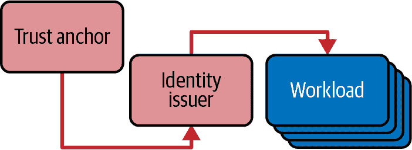

# 第三章：部署 Linkerd

现在您了解了 Linkerd 是什么以及它的工作原理的一些知识，是时候深入到您的环境中部署 Linkerd 中了。我们将在本章中深入探讨安装 Linkerd 的内容及其背后的原因和方式。您还可以查阅官方 Linkerd 文档，查看[入门指南](https://oreil.ly/Pyiwx)。

# 考虑因素

安装 Linkerd 通常可以快速、简便且无痛。不幸的是，这种易用性有时会掩盖真正的陷阱，你应该避免。我们将在进入安装部分时更详细地探讨具体内容——现在，简单来说，当你在实际非演示环境中安装 Linkerd 时，你需要计划生成和存储我们在 第二章 中简要描述的 TLS 证书。你还需要确保对应用程序使用的所有非 HTTP 端口有很好的理解，以便可以为它们正确配置*协议发现*（这在 第四章 中有更详细的介绍）。

## Linkerd 版本控制

我们在 第二章 中提到，本书专注于 Linkerd2，即 Linkerd 的第二个主要版本，实质上是项目的重写。为此，Linkerd 使用一个看起来像 [语义版本控制](https://semver.org) 的版本系统，但实际上是独特的。Linkerd 有两个主要发布通道：*稳定* 和 *边缘*。您可以在 [官方 Linkerd 文档](https://oreil.ly/7igL_) 中详细了解这种版本控制方案和发布模型。

### 稳定

稳定通道用于供应商发布，例如 Buoyant 为 Linkerd 提供的企业版（毫不奇怪，由 Buoyant 提供）。该通道使用修改后的语义版本方案：

```
stable-2.*`<major>`*.*`<minor>`*.*`<patch>`*
```

这意味着，例如，“Linkerd 2.12.3”，主版本号是 12，次版本号是 3。此版本没有补丁号。

语义版本控制规则是，主版本变更表示 Linkerd 引入了破坏性变更或重大新功能，而仅次版本变更表示新版本与上一版本完全兼容，并包括改进或错误修复。补丁发布很少见，表明已为给定次版本发布了安全修复。

### 边缘

边缘发布通道是您可以找到纯开源 Linkerd 发布的地方，构建于 Linkerd 最新可用更改的基础上。边缘发布通常每周提供一次，采用以下版本控制方案：

```
edge-*`<two digit year>`*.*`<month>`*.*`<number within the month>`*
```

例如，`edge-24.1.1` 将是 2024 年第一个月的第一个 edge 版本发布。

# 边缘版本不使用语义版本控制

显然，边缘版本通道不使用语义版本控制，但重申这一点是很重要的。您必须阅读安装的每个边缘版本的发布说明，并向 Linkerd 团队提供您的使用反馈。

## 工作负载、Pod 和服务

Linkerd 是围绕 Kubernetes 设计的服务网格。这意味着，与许多其他服务网格选项不同，您可以在不与任何自定义资源定义互动的情况下使用 Linkerd。Linkerd 使用 Kubernetes 构建如工作负载、Pod 和服务来管理大部分的路由和配置选项。因此，如果您今天在 Kubernetes 中运行某些东西，您可以将 Linkerd 添加到其中，并且它应该表现出相同的行为，只是具备了 Linkerd 的优势（参见 图 3-1）。当然，也有一些例外情况，我们将在 第四章 中详细介绍。


###### 图 3-1\. 添加 Linkerd 不应该破坏您的应用程序

## TLS 证书

正如我们在 第二章 中提到的，Linkerd 依赖于 TLS 证书来在网格中提供身份验证。具体来说，Linkerd 需要一个信任锚证书，它签署一个身份发行者证书，后者签署工作负载证书（网格中每个工作负载一个）。这在 图 3-2 中有所体现。



###### 图 3-2\. Linkerd 信任层级

Linkerd 会为您管理工作负载证书，但您需要与认证机构合作管理信任锚和身份发行者证书。在本章中，我们将介绍 CLI 和 Helm 安装是如何工作的。

## Linkerd Viz

我们在 第二章 中简要提到了 Linkerd Viz：它是 Linkerd 的开源仪表板组件，提供了一个易于使用的指标收集和展示系统。它可以收集有关所有网格化工作负载的有用指标，并在简单的 Web UI 中呈现。仪表板可以提供有关您的 Linkerd 环境的以下详细信息：

+   详细的应用程序指标，按以下内容细分：

    +   命名空间

    +   工作负载

    +   Pod

    +   服务

+   关于工作负载之间连接的信息，包括：

    +   TLS 状态

    +   网格状态

    +   工作负载身份

    +   使用的路径和头部（通过 Viz Tap）

    +   基于路径的指标细分

我们将在 第十章 中详细讨论如何使用 Linkerd Viz，并在 第十四章 中讨论 Linkerd Viz 的生产环境问题。

# Linkerd Viz 仪表板不需要身份验证

正如在 第二章 中讨论的那样，Linkerd Viz 仪表板不进行用户身份验证。如何向用户提供访问权限完全取决于您的设置。

Linkerd Viz 被认为是 Linkerd 核心的一部分，但必须单独安装，因为某些 Linkerd 安装完全替换了 Viz 与自定义构建系统。一般来说，我们强烈建议安装 Viz，除非有强烈的理由不这样做。在接下来的说明中，我们将包括安装 Viz。

# 始终使用您自己的 Prometheus

默认情况下，安装 Linkerd Viz 将安装一个内部的 Prometheus 实例。*不要在生产环境中使用这个 Prometheus*，因为它没有配置持久存储；相反，请参阅 [Linkerd 文档](https://oreil.ly/hI6eF) 和 Example 10-9 了解如何使用外部 Prometheus 实例的信息。

# 部署 Linkerd

要部署 Linkerd，您需要一个可用的 Kubernetes 集群。本指南将使用本地部署的 [k3s](https://k3s.io) 集群，使用 [k3d](https://k3d.io) 工具。如果您已经熟悉安装和部署 Linkerd，请随意跳到 第四章。

## 必需工具

在本书的其余部分，我们假设您已经具备以下工具：

+   [`kubectl`](https://oreil.ly/WPcEB)

+   [Helm](https://oreil.ly/HMIQw)

+   [`linkerd` CLI](https://oreil.ly/OjxD2)

+   [k3d](https://k3d.io)

+   [step 命令行界面](https://oreil.ly/Y40gA)

## 配置 Kubernetes 集群

首先创建一个 k3d 集群：

```
$ k3d cluster create linkerd
```

k3d 将为您的 Kubernetes 集群进行配置，并更新您的 `KUBECONFIG`。您可以通过运行以下命令测试与新集群的连接：

```
$ kubectl get nodes
```

您还应该验证集群是否正确配置，并且您是否具有安装所需权限，通过 Linkerd CLI 运行预安装检查：

```
$ linkerd check --pre
```

## 通过 CLI 安装 Linkerd

Linkerd CLI 可以轻松帮助您开始 Linkerd 安装。它将生成安装 Linkerd 所需的 Kubernetes 清单，并允许您轻松地将它们应用到您的集群中。

运行以下命令来通过 CLI 安装 Linkerd：

```
$ linkerd install --crds | kubectl apply -f -
```

这将在您的集群中安装 Linkerd CRD。从 Linkerd 2.12 开始，安装 Linkerd 的 CRD 使用单独的图表完成，并在运行安装时需要其自己的命令。安装完 CRD 后，您需要继续安装核心 Linkerd 控制平面：

```
$ linkerd install | kubectl apply -f -
```

完成这些步骤后，Linkerd 控制平面将开始在您的集群中设置自身。您很快将可以访问运行最小 Linkerd 服务网格所需的所有工具。您可以通过运行以下命令确认安装是否成功：

```
$ linkerd check
```

# 生产集群需要生产证书

再次强调，如果您没有明确说明，`linkerd install` 将悄悄为您创建证书。这对于演示是可以的，但*不适用于生产*。

安装完核心 Linkerd 控制平面后，您可以安装 Linkerd Viz：

```
$ linkerd viz install | kubectl apply -f -
```

与 Linkerd 本身一样，这将启动安装并立即返回。要等待安装完成并确认安装成功，运行：

```
$ linkerd check
```

# 始终使用您自己的 Prometheus

默认情况下，安装 Linkerd Viz 将会安装一个内部的 Prometheus 实例。*不要在生产环境中使用此 Prometheus*，因为它没有配置持久存储；相反，请查看[Linkerd 文档](https://oreil.ly/hI6eF)和示例 10-9 了解如何使用外部的 Prometheus 实例。

## 通过 Helm 安装 Linkerd

Buoyant 公司，Linkerd 的开发者，在他们的[生产运行手册](https://oreil.ly/ZjDzr)中建议你使用 Helm 在生产环境中安装和管理 Linkerd。Helm 提供了一个经过充分测试、有文档支持的安装和升级路径（实际上，Linkerd CLI 在底层使用 Helm 模板生成其 Kubernetes 清单）。

使用基于 Helm 的安装也需要你提前考虑证书管理问题，这简化了稍后更新证书的流程。我们将在第七章详细介绍证书；现在，让我们通过手动生成证书来简单演示 Helm 安装过程。

### 生成 Linkerd 证书

使用 Helm 最简单的安装方式是手动生成 Linkerd 所需的两个证书：信任锚点和身份发行者。我们将使用 Smallstep CLI，`step`，来完成此操作，如 示例 3-1 所示。

# 证书与安全性

我们在这里生成证书时，并未真正考虑如何安全地管理私钥。这对于演示来说是可以接受的，但*不能*用于生产环境。我们将在第七章进一步探讨这个问题。

##### 示例 3-1\. 为 Linkerd 创建证书

```
# Start by creating your root certificate, which Linkerd refers to
# as the trust anchor certificate.
$ step certificate create root.linkerd.cluster.local ca.crt ca.key \
  --profile root-ca --no-password --insecure

# Next, create the intermediary certificate. Linkerd refers to this
# as the identity issuer certificate.
$ step certificate create identity.linkerd.cluster.local issuer.crt issuer.key \
  --profile intermediate-ca --not-after 8760h --no-password --insecure \
  --ca ca.crt --ca-key ca.key
```

运行这些命令后，你将得到如 图 3-4 所示的信任层级。你的笔记本将保存信任锚点和身份发行者的公钥和私钥，而身份发行者的证书将由信任锚点签名。（尚未有工作负载证书：当 Linkerd 安装在集群中时，将会创建这些证书。）


###### 图 3-4\. 使用 `step` 命令创建的信任层级

# 保管好你的密钥！

记住，在实际场景中，保护私钥的安全性非常重要。即使在我们这里更加学术化的使用中，也要妥善保管——在我们讨论第七章中的证书轮换时会用到它。

Linkerd 文档详细介绍了如何创建证书的过程，请在遇到任何困难时参考最新版本的文档。

### Helm 安装

生成证书后，可以使用 示例 3-2 中的命令使用 Helm 安装 Linkerd。再次强调，官方文档中包含最新的指令；但是，了解 示例 3-2 中的 `--set-file` 参数的作用非常重要：

+   `--set-file identityTrustAnchorsPEM` 告诉 Helm 从中复制信任锚点的公钥的文件。这是我们需要的信任锚点的唯一密钥。

+   `--set-file identity.issuers.tls.crtPEM` 和 `--set-file identity.issuers.tls.keyPEM` 告诉 Helm 从中复制身份颁发者的公钥和私钥文件，两者都是必需的。

##### 示例 3-2\. 使用 Helm 安装 Linkerd

```
# Add the Linkerd stable repo
$ helm repo add linkerd https://helm.linkerd.io/stable

# Update your Helm repositories
$ helm repo update

# Install the Linkerd CRDs
$ helm install linkerd-crds linkerd/linkerd-crds \
  -n linkerd --create-namespace

# Install the Linkerd control plane
$ helm install linkerd-control-plane \
  -n linkerd \
  --set-file identityTrustAnchorsPEM=ca.crt \
  --set-file identity.issuer.tls.crtPEM=issuer.crt \
  --set-file identity.issuer.tls.keyPEM=issuer.key \
  linkerd/linkerd-control-plane

# Ensure your install was successful
$ linkerd check
```

`linkerd check` 命令将告诉您集群中 Linkerd 的当前状态。用于确保您的安装成功完成。

一旦`helm install`完成，集群将拥有 Linkerd 运行所需的密钥副本，如图 3-5 所示。当然，这些密钥仍然存在于您的笔记本上，所以请小心处理它们！

# 权限很重要！

注意，信任锚点的私钥*不*在集群中，但身份颁发者的私钥*在*集群中。这对于 Linkerd 的运行是必需的。在现实世界中，您需要确保只有 Linkerd 本身能够看到该密钥。更详细的内容在第七章中有所涵盖。


###### 图 3-5\. `helm install` 后创建的信任层次结构

最后，我们可以使用其 Helm 图表安装 Linkerd Viz：

```
$ helm install linkerd-viz linkerd/linkerd-viz \
-n linkerd-viz --create-namespace
```

与之前一样，我们将监视安装以确保其成功：

```
$ linkerd check
```

# 始终使用您自己的 Prometheus

默认情况下，安装 Linkerd Viz 将安装一个内部的 Prometheus 实例。*在生产环境中不要使用此 Prometheus*，因为它没有配置持久存储；而是参见[Linkerd 文档](https://oreil.ly/hI6eF)和示例 10-9 以获取关于使用外部 Prometheus 实例的信息。

# 配置 Linkerd

现在，您已完成 Linkerd 核心控制平面的安装，我们将暂停一下，并查看您在集群中配置 Linkerd 控制平面的选项。这必然会是一个控制平面常见配置点的摘要，而不是详尽的列表。

从 Linkerd 2.12 开始，控制平面通过`linkerd-control-plane` Helm 图表进行管理和配置。以下设置为 Linkerd 提供了重要的配置点。通过以下命令查看当前 Helm 图表值来找到特定的设置：

```
$ helm show values linkerd/linkerd-control-plane
```

我们将讨论一般设置，您需要将它们映射到您值文件中的适当位置。参见第十四章中 Linkerd Helm 值文件的一些示例。

## 集群网络

Linkerd 在安装时没有办法读取您的集群网络设置，因此`linkerd-control-plane` Helm 图表假设您的集群正在使用常见的网络范围之一作为其集群网络。如果您的集群 IP 地址不在以下范围内，您需要在安装时覆盖 IP 范围：

```
10.0.0.0/8, 100.64.0.0/10, 172.16.0.0/12, 192.168.0.0/16
```

## Linkerd 控制平面资源

Linkerd 的默认安装不设置资源请求或限制。您应考虑为控制平面组件设置请求和限制，以帮助调度 Pod 并确保 Linkerd 具有所需的资源。请注意：从 Linkerd 2.12 开始，Linkerd 目标组件具有相对固定的内存占用量，随着集群中端点数量的增加而扩展。如果您设置的内存限制过低，可能会发现目标组件被“内存耗尽杀死”或 OOMKilled。

## 不透明端口和跳过端口

不透明端口和跳过端口是 Linkerd 对应的端口名称，应用特殊规则。您将希望查阅[相关 Linkerd 文档](https://oreil.ly/_H929)获取有关该主题的最新信息。我们将在此处简要概述这些概念；您将在第四章中找到更多细节。

在 Linkerd 中，*不透明* 端口是指应将其视为通用 TCP 连接的端口。Linkerd 仍将在不透明流量上使用 mTLS，但不会执行协议检测或任何类型的协议特定逻辑，因此最终结果类似于简单的基于连接的网络负载均衡工作方式。如果您知道端口将成为网格的一部分并提供非 HTTP TCP 流量，则应在安装时将其标记为不透明。

请记住，在不透明端口上*没有*协议检测，因此也*没有*请求度量或每请求负载平衡。

本节旨在讨论全局、安装时 Linkerd 配置值。任何在安装时设置为不透明端口的端口将全局应用于所有工作负载。

# 默认不透明端口

以下端口是安装时配置的默认值：

+   SMTP：25 和 587

+   MySQL：3306 和，与 Galera 一起使用时，4444 端口。（4567 和 4568 端口也可能被 Galera 使用，但默认情况下不透明。）

+   PostgreSQL：5432

+   Redis：6379

+   Elasticsearch：9300

+   Memcached：11211

相比之下，*跳过* 端口是指您指示 Linkerd 完全忽略的端口。跳过的流量将完全绕过代理；网格将不会处理它。值得注意的是，*Linkerd 无法加密跳过端口上的流量*。

与不透明端口不同，您需要告知 Linkerd 跳过端口是指入站流量、出站流量还是两者兼有。

# 默认跳过端口

在标准 Linkerd 安装中，默认情况下会忽略 4567 和 4568 端口（Galera）。

# 总结

您现在应该对如何安装 Linkerd 有了良好的理解，以及对 Linkerd 的主要配置点有了理解。您还应该对安装 Linkerd 可能存在的摩擦点有了良好的掌握：具体而言，生成证书和处理非 HTTP 流量。您可以使用 Linkerd CLI 或 Linkerd Helm 图表安装 Linkerd，我们建议您默认使用 Helm。
