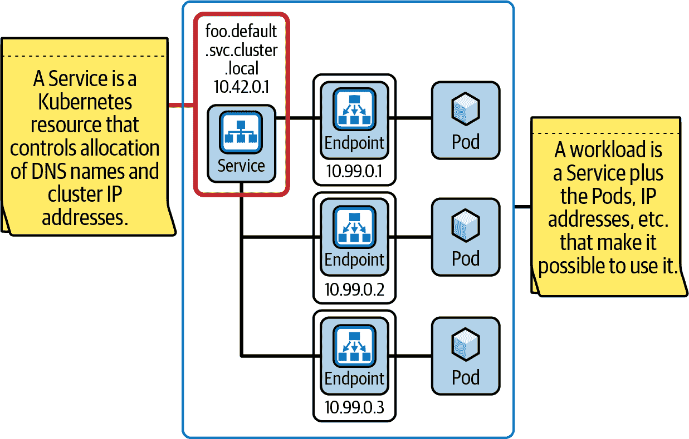
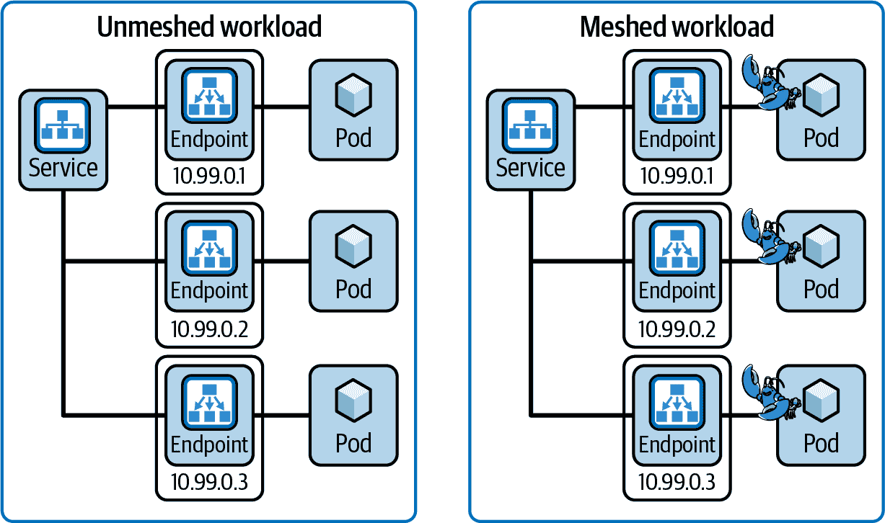
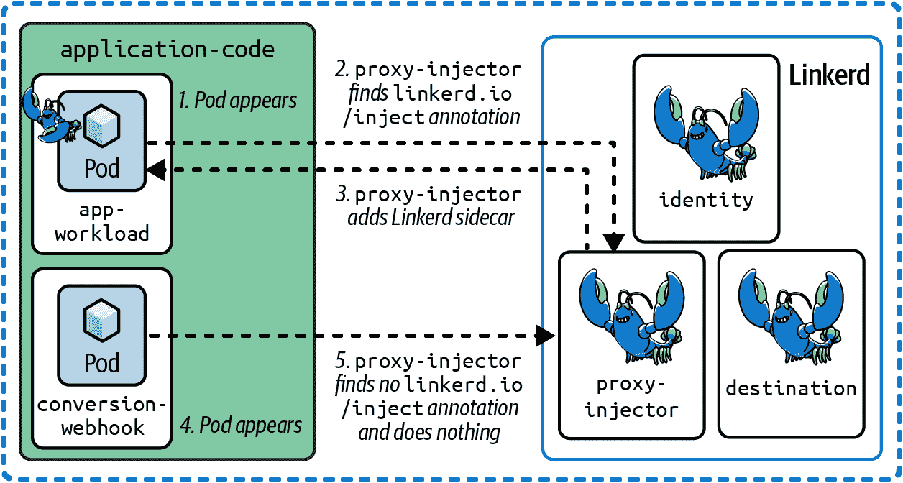
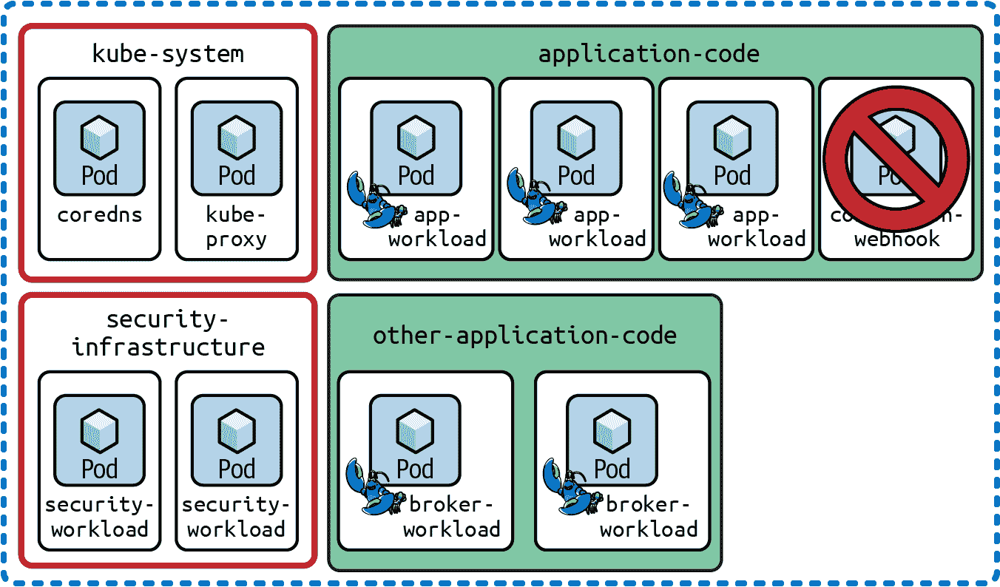
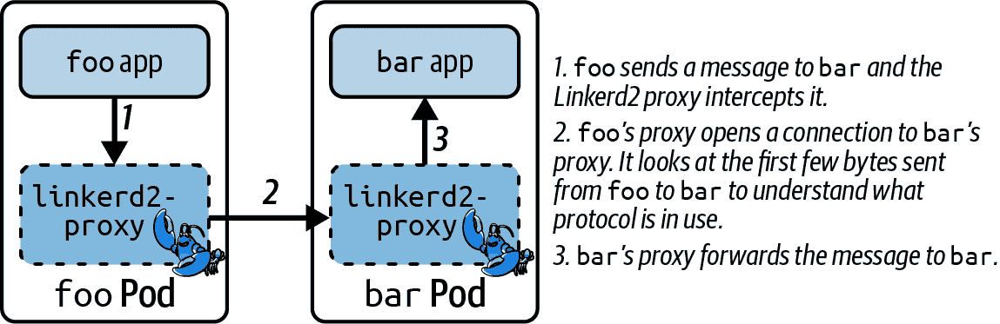
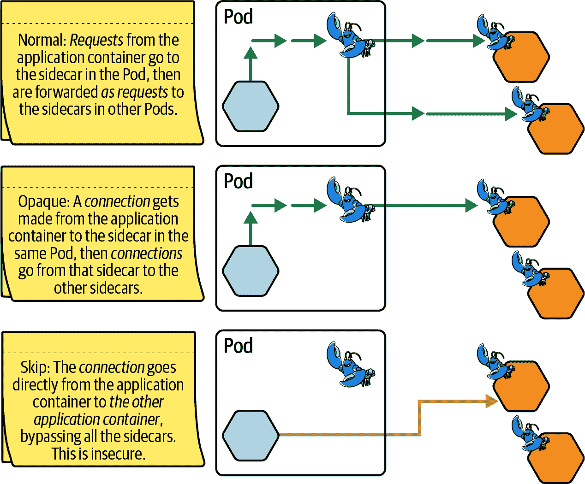

# 第四章：向网格添加工作负载

在你的集群中运行 Linkerd 是一个很好的第一步。但是单独运行 Linkerd 是没有意义的：要从你的 Linkerd 集群中获得实际价值，你需要让工作负载在服务网格中运行。在本章中，我们将向你展示如何实现这一点。

# 工作负载与服务的区别

在本章中，我们将经常讨论“工作负载”——但有时我们也会讨论“服务”，以及“Services”。不幸的是，这三个概念在某些情况下有些微的不同含义：

服务

一个广泛用于控制 Kubernetes 为服务分配 DNS 名称和 IP 地址的 Kubernetes 资源（参见 图 4-1）。

工作负载

一个实际代表你执行工作的东西。工作负载通过网络接收请求并执行代码以执行操作。在 Kubernetes 中，它通常是一个或多个 Pod（提供计算），通常由 Deployment 或 DaemonSet 资源管理，再加上一个或多个服务（管理名称和 IP 地址），如 图 4-1 所示。

服务

一个不太正式的术语，根据上下文可能指代服务或工作负载。这种不精确性正是 Kubernetes 术语比我们希望的更加混乱的一个例子。

###### 图 4-1\. 工作负载与服务的区别

作为应用开发者，你通常可以只说“服务”，并相信人们能够接受这种含糊。不幸的是，在谈论服务网格时，我们经常需要更加精确，因此这里讨论的是 *工作负载* 而不是 *服务*。

# 向网格添加工作负载意味着什么？

“向网格添加工作负载”实际上意味着“向每个工作负载的 Pod 添加 Linkerd sidecar”，如 图 4-2 所示。

最终，这意味着更改 Pod 的定义以包含 sidecar 容器。虽然你*可以*通过手动编辑定义 Pod 的 YAML 来实现这一点，但让 Linkerd 来完成这些繁重的工作会更容易、更安全。

Linkerd 包含一个名为 `linkerd-proxy-injector` 的 Kubernetes 准入控制器。它的工作，不出所料，就是向工作负载的 Pod 注入 Linkerd 代理。当然，它不是盲目地执行此操作；相反，它会查找告诉它哪些 Pod 需要注入的 Kubernetes 注解，如 图 4-3 所示。

###### 图 4-2\. 向网格添加工作负载

###### 图 4-3\. 代理注入器

# 注入单个工作负载

处理注入的最常见方式是直接将 `linkerd.io/inject: enabled` 注解添加到 Pod 本身，通常通过向 Deployment、DaemonSet 等的 Pod 模板添加此注解来实现。每当 `linkerd-proxy-injector` 看到具有此注解的新 Pod 时，它将为你注入代理 sidecar 到该 Pod 中。

值得指出的是注解的值很重要：`enabled` 表示进行正常的边车注入。我们很快会看到其他值。

# 所有 Pod 都是平等的

不管使用何种资源创建 Pod，都无关紧要。部署、守护进程集、手工制作的复制集、Argo Rollouts 资源——它们都以完全相同的方式创建它们的 Pod。Linkerd 注入器注意到的是存在新 Pod，而不是造成其创建的原因。

# 在命名空间中注入所有工作负载

您可以将 `linkerd.io/inject` 注解添加到命名空间，而不是 Pod。一旦完成这个操作，该命名空间中创建的每个新 Pod 都将被注入（而且再次强调，导致新 Pod 创建的原因是无关紧要）。

这在自动化创建 Pod 的情况下非常有用，但在修改 Pod 自身的注解时可能会很困难或容易出错。例如，某些入口控制器每次更改资源时都会重新创建部署；与其费力地修改入口控制器使用的 Pod 模板（如果可能的话），不如只是注释将要创建部署的命名空间。

# linkerd.io/inject 值

`linkerd.io/inject` 注解的值确实很重要——这不仅仅是有一个非空字符串的问题。有三个具体的值是有意义的：

`linkerd.io/inject: enabled`

最常见的情况：`linkerd-proxy-injector` 将在 Pod 中添加一个代理容器，并告知代理以“正常”模式运行。

`linkerd.io/inject: ingress`

`linkerd-proxy-injector` 将在 Pod 中添加一个代理容器，但代理将以“ingress”模式运行（我们将在第五章讨论）。

`linkerd.io/inject: disabled`

这明确告诉 `linkerd-proxy-injector` 即使有一个命名空间注解要求添加边车，也*不*添加代理边车。

我们将在第五章更详细地讨论入口模式：这是为只知道如何直接路由到工作负载端点的入口控制器而设置的一种解决方案。在大多数情况下，您应该使用 `linkerd.io/inject: enabled` 以获得“正常”模式。

# 为什么可能决定不将工作负载添加到网格中？

一般来说：

+   您总是希望将应用工作负载添加到网格中。

+   您永远不希望将集群基础设施添加到网格中。

因此，例如，`kube-system` 命名空间中的内容永远不会被注入。所有这些 Pod 都被设计为无论发生什么，都能保护自己，并且其中一些需要确保没有任何东西位于它们和网络层之间，因此不应该对它们进行注入。

同样，Kubernetes 转换 webhook（如在图 4-3 中的`application-code`命名空间中显示的）通常不应该位于网格中。webhook 机制本身已经对 TLS 提出了具体要求，而网格对此无济于事。这可能不会有害，但实际上没有意义。这里的另一个很好的例子是 CNI 实现：这些需要直接访问网络层，不应该被注入。

另一方面，运行在集群中的应用程序的工作负载应始终被注入到网格中。所有这些准则都显示在图 4-4 中。

###### 图 4-4\. 注入应用程序，而不是基础设施

# 其他代理配置选项

尽管基本的`linkerd.io/inject`注释是您*必须*提供的唯一代理配置选项，但实际上还有许多其他可以配置代理的内容。完整列表可在[Linkerd 代理配置文档](https://oreil.ly/9FiJF)中找到，但从一开始就非常值得学习的两个领域是*协议检测*和*Kubernetes 资源限制*。

# 协议检测

正如我们在第一章中讨论的那样，Linkerd 非常注重操作简易性；在可能的情况下，Linkerd 尽量确保当您将应用程序引入网格时事情能够顺利进行。协议检测是这一点的关键部分，因为 Linkerd 必须了解连接上使用的协议，以正确管理连接，如图 4-5 所示。

###### 图 4-5\. 协议检测

Linkerd（或任何其他网格）需要了解在传输过程中使用的协议的几个原因。我们将仅触及其中的一些：

可观测性

如果 Linkerd 不理解协议流，就无法提供适当的指标。识别请求的开始和结束对于测量请求率和延迟至关重要。读取请求状态对于测量成功率至关重要。

可靠性

任何超出基本功能的可靠性特性都要求理解飞行中的协议。例如，考虑负载平衡：如果 Linkerd 不知道协议，它只能进行基于连接的负载平衡，其中传入的 TCP 连接分配给特定的工作负载 Pod。

然而，对于诸如 HTTP/2 和 gRPC 之类的协议，基于连接的负载平衡效果并不好。在这些协议中，单个长连接可以携带多个请求，并且多个请求可以同时活动。通过将单独的请求分配给工作负载 Pod，而不是将整个连接固定到一个 Pod，Linkerd 可以显著提高可靠性和性能。（有趣的是，Linkerd 会自动执行此操作，无需任何配置；只需安装 Linkerd，即可免费获取此功能。）

安全性

如果一个工作负载向另一个工作负载发起了 TLS 连接，Linkerd 不应尝试重新加密它。它也不应尝试在负载均衡中做任何复杂的事情，因为它无法看到连接内部的任何内容。（这意味着当工作负载之间连接时，最好让 Linkerd 为你执行 mTLS，而不是让它尝试处理 TLS 连接！）

## 当协议检测出现问题时

自动协议检测有一个主要限制：它只能用于那些连接建立和数据发送者是同一方的协议（*客户端先发起*协议）。对于数据接收者先发送数据的协议（*服务器先发起*协议），它将失败。

这种限制的原因是在 Linkerd 知道协议之前，它无法合理地决定如何进行负载均衡，因此无法确定连接哪个服务器，也无法知道服务器将会返回什么！每个代理都面临这种令人沮丧的循环问题。

在云原生世界中，许多——也许是大多数？——常见协议都是客户端先发起的协议；例如，HTTP、gRPC 和 TLS 本身都是客户端先发起的。不幸的是，还存在一些重要的服务器先发起的协议：SMTP、MySQL 和 Redis 就是例子。

如果 Linkerd 无法检测到协议，它将假定这是一个原始的 TCP 连接，因为这是始终可用的最低公共分母。问题在于对于服务器先发起通信的协议，Linkerd 将等待 10 秒钟，然后才假定无法检测到协议，而这显然不是你想要的。为了避免这种情况，你需要告诉 Linkerd 要么跳过这个连接，要么将其视为不透明。

## 不透明端口与跳过端口

当你告诉 Linkerd *跳过*一个连接时，你实际上是告诉它完全不涉及该连接。事实上，Linkerd 代理根本不会触碰该连接：数据包直接从工作负载流向另一个工作负载。

这意味着 Linkerd 不能进行 mTLS、负载均衡、指标收集或者*任何其他操作*。连接实际上完全发生在网格之外。

另一方面，*不透明*连接会经过 Linkerd 代理，这意味着它会通过 mTLS 进行传输。它仍然被加密，并且 Linkerd 仍会执行已配置的任何策略，但你只会得到每个连接的指标和负载均衡（因为 Linkerd 知道它无法查看单个请求的内容）。

这一区别显示在图 4-6 中。

###### 图 4-6\. 不透明端口与跳过端口

这一切都意味着，如果您需要使用服务器先说话的协议，最好将它们标记为不透明，而不是完全跳过它们。仅在流量的目的地不是您的网格的一部分时才需要跳过。由于不透明连接仍然依赖于 Linkerd 代理执行 mTLS，如果没有代理接收连接，它们将无法工作！

## 配置协议检测

有两种方法可以告诉 Linkerd 有关协议的信息。您可以使用服务器资源，在我们讨论策略时会介绍（参见第八章），或者您可以使用以下注释来标记特定端口为不透明或跳过：

`config.linkerd.io/opaque-ports`

这些端口的连接始终将被视为不透明。

`config.linkerd.io/skip-inbound-ports`

在这些端口进入此工作负载的连接将始终被跳过。

`config.linkerd.io/skip-outbound-ports`

离开这个工作负载的连接在这些端口上将始终被跳过。

所有这些都接受逗号分隔的端口号或端口范围列表，因此以下所有内容都是合法的：

`config.linkerd.io/opaque-ports: 25`

这将只将端口 25 视为不透明。

`config.linkerd.io/skip-inbound-ports: 3300,9900`

这将跳过在端口 3300 或 9900 上进入的连接。

`config.linkerd.io/skip-inbound-ports: 8000-9000`

这将跳过任何端口在 8000 到 9000 之间（包括端口 8000 和 9000）收到的连接。

`config.linkerd.io/skip-outbound-ports: 25,587,8000-9000`

这将跳过在端口 25、端口 587 或 8000 到 9000 之间的任何端口上的连接。

还有一个`config.linkerd.io/skip-subnets`选项，它会跳过与任何列出的子网之间的任何连接。其参数是一个逗号分隔的[无类别域间路由（CIDR）](https://oreil.ly/soiAU)范围列表，例如`config.linkerd.io/skip-subnets: 10.0.0.0/8,192.168.1.0/24`。

## 默认不透明端口

从 Linkerd 2.12 开始，默认情况下，几个端口被标记为默认不透明（详见“默认不透明端口”）。

默认端口旨在允许各种服务器先说话的协议（如 MySQL 和 SMTP）与 Linkerd 无缝工作。如果您将这些端口用于客户端先说话的协议，您需要使用服务器资源来覆盖端口默认设置（或者更好的选择是为您的客户端先说话的协议选择一个不同的端口！）。

# Kubernetes 资源限制

与协议检测相比，Kubernetes 资源限制要简单得多。有一组简单的注释设置，允许您指定资源请求和限制，如表 4-1 所示。

表 4-1. 资源请求和限制的 Linkerd 注释

| 注释 | 效果 |
| --- | --- |
| `config.linkerd.io/proxy-cpu-limit` | 代理边车可以使用的最大 CPU 单位数量 |
| `config.linkerd.io/proxy-cpu-request` | 代理边车请求的 CPU 单位数量 |
| `config.linkerd.io/proxy-ephemeral-storage-limit` | 用于覆盖 `limitEphemeralStorage` 配置 |
| `config.linkerd.io/proxy-ephemeral-storage-request` | 用于覆盖 `requestEphemeralStorage` 配置 |
| `config.linkerd.io/proxy-memory-limit` | 代理侧车可以使用的最大内存量 |
| `config.linkerd.io/proxy-memory-request` | 代理侧车请求的内存量 |

# 总结

所以，这就是：从头到尾指南，让您的工作负载成为 Linkerd 网格的有效组成部分。希望现在您已经很好地理解了如何使一切正常运作，以及沿途的要点（例如服务器优先协议）。接下来是让 Linkerd 和入口控制器良好协同工作。
