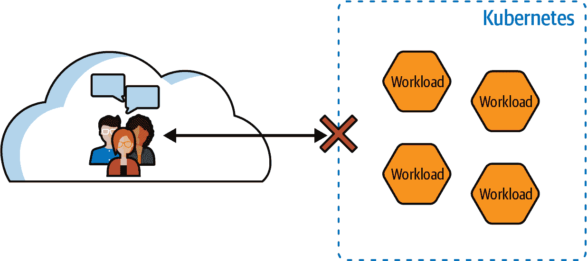
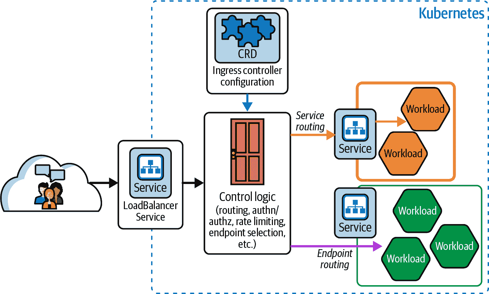
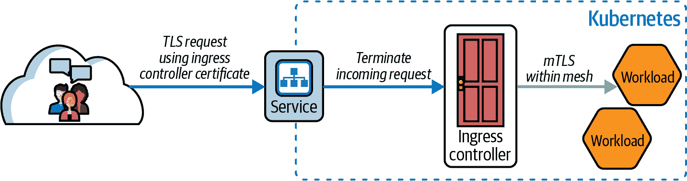
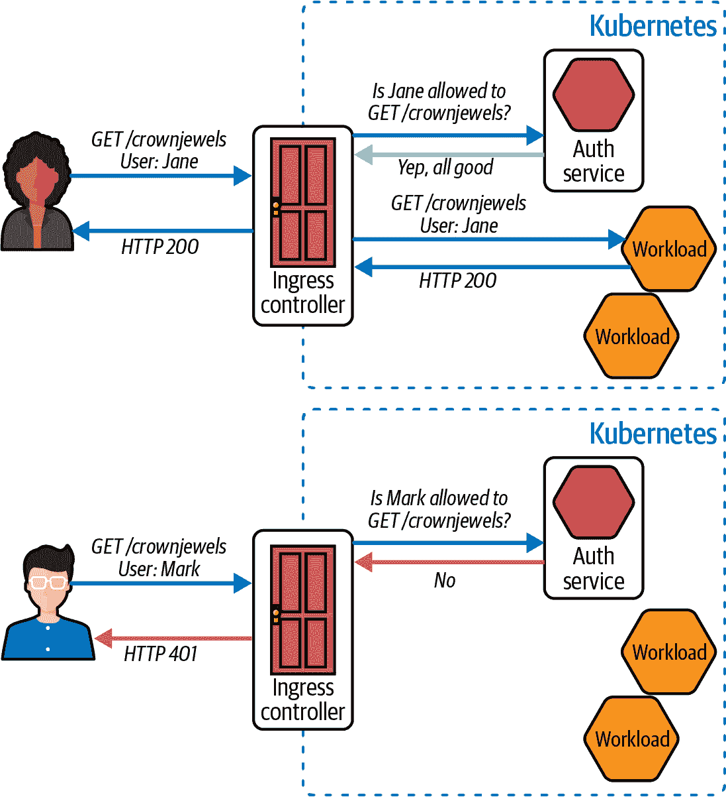
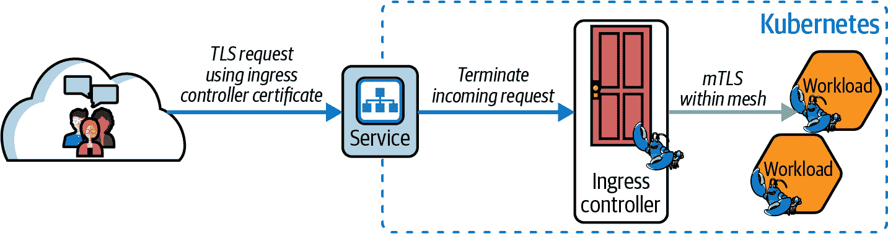
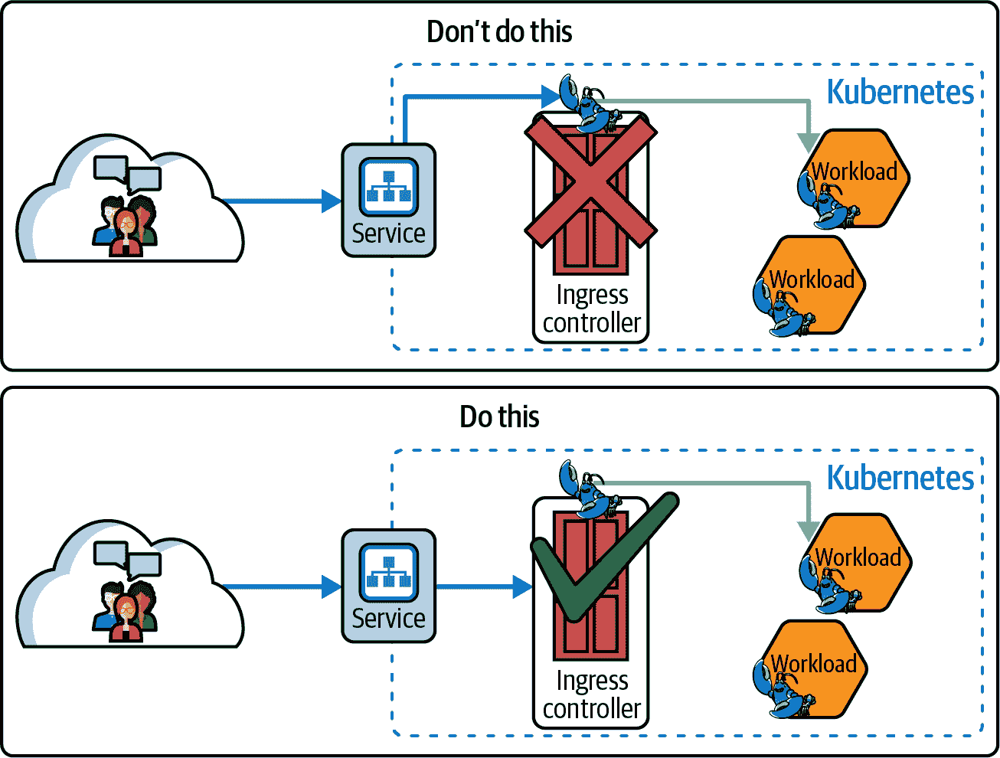
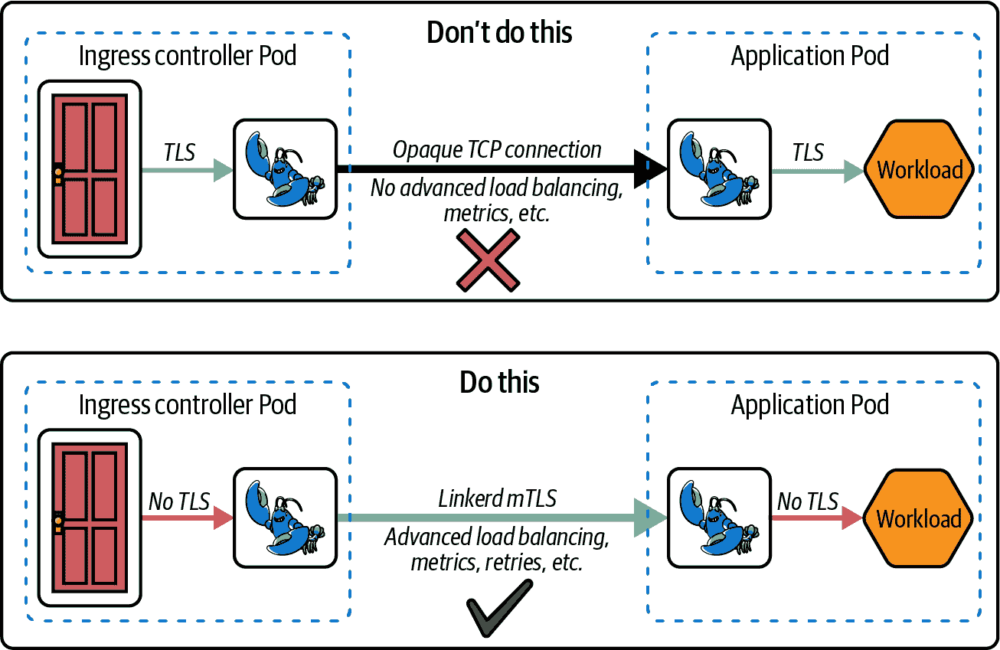
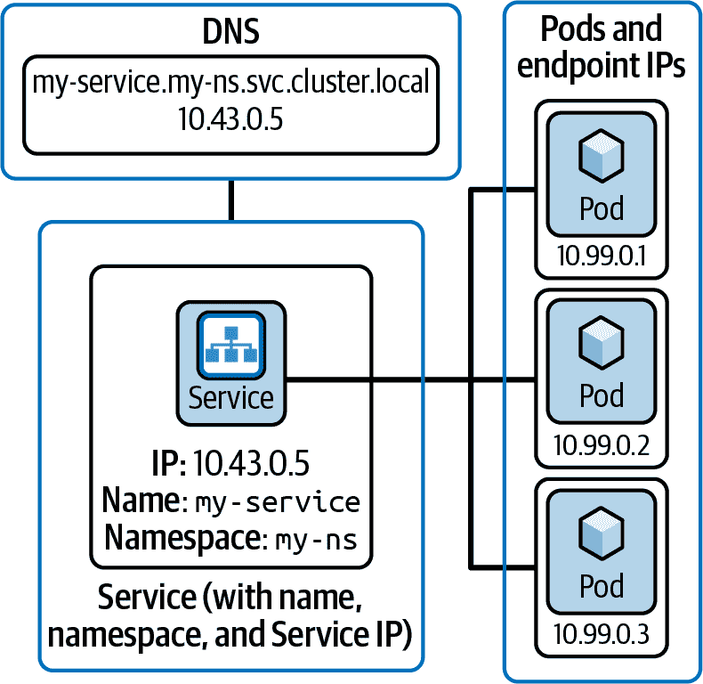
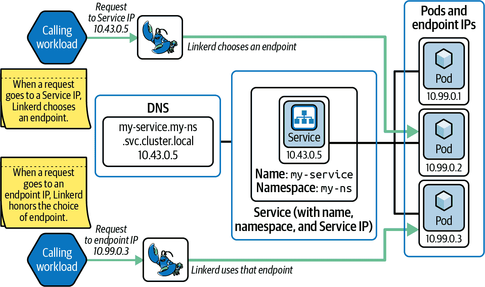
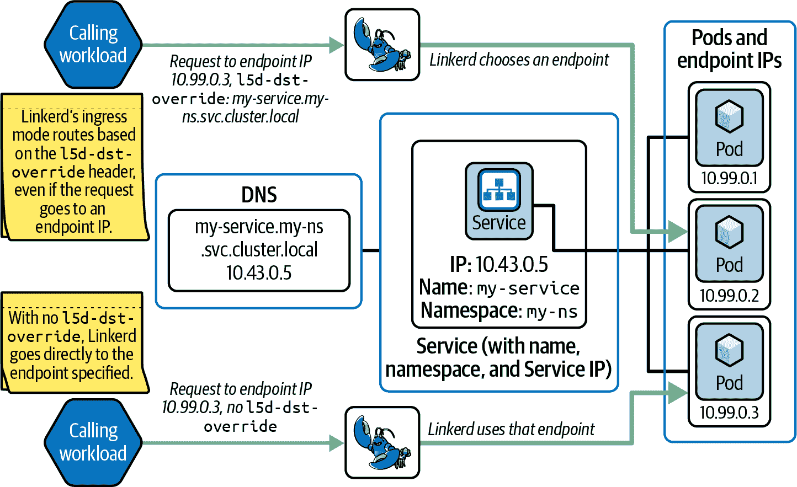

# 第五章：入口和 Linkerd

每当您使用 Kubernetes 时，您总是需要找到一种方式，使得您集群外部的用户能够向运行在您集群内部的某些服务发出请求。这就是*入口问题*（参见图 5-1）：集群希望保护内部的所有内容免受大可怕的互联网的侵害，但这却是您的合法用户所在之处。



###### 图 5-1。入口问题

显然有一整类应用程序称为*入口控制器*，其唯一目的是解决入口问题。Linkerd 不包括入口控制器；相反，它允许您网状化任何喜欢的入口控制器，只要遵循某些规则。在本章中，您将学习如何使 Linkerd 与您选择的入口控制器相互配合。

有许多不同的入口控制器，它们以迷人的不同方式解决入口问题。然而，所有这些控制器都有一些共同的主题，如图 5-2 所示。



###### 图 5-2。入口控制器高级架构

这些共同的主题包括：

+   它们都设计为位于集群边缘（通常是在`LoadBalancer`类型的 Kubernetes 服务之后），直接暴露在互联网上，以便其客户端可以访问它们。安全性始终是入口控制器的主要关注点。

+   他们总是有一种方法来控制外部的哪些请求被路由到内部的哪些服务。这是另一个关键的安全问题：安装入口控制器不能意味着集群中的所有服务都向互联网开放。

    所有流行的入口控制器在[OSI 层 7](https://oreil.ly/S-sjB)支持复杂的路由控制，通常专注于 HTTP 和 gRPC。许多还支持对 OSI 层 4 连接进行更有限的路由控制：

    +   在 OSI 层 7（应用层），入口控制器可能具有诸如“将主机名为`foo.example.com`且`路径`以`/bar/`开头的 HTTP 请求路由到名为`bar-service`的服务”的能力。

    +   在 OSI 层 4（传输层），其功能更可能是“将到达端口 1234 的 TCP 连接路由到名为`bar-service`的服务”。

    根据使用的入口控制器的不同，用户配置路由的实际方式可能会有很大差异。

+   入口控制器始终可以终止和发起 TLS 连接（主要是 HTTPS），以处理集群边缘的安全性。这并不扩展 Linkerd 的 mTLS 到入口控制器的客户端；相反，它创建了两个 TLS 操作的分离领域，并要求入口控制器在它们之间进行转换，如图 5-3 所示。

    

    ###### 图 5-3。入口控制器和 TLS

    通常将两个 TLS 世界分开是有道理的，因为 Ingress 控制器需要向用户呈现与用户期望的证书匹配的证书，但当其代理与 Linkerd 交互时，需要提供一个正确配置的工作负载身份。这两者并不相同，不应混淆。允许 Ingress 控制器与其客户端管理 TLS，同时允许 Linkerd 在集群内部管理 mTLS，这是一个强大的组合。

+   最后，许多 Ingress 控制器提供诸如最终用户认证、断路器、速率限制等功能。这些 Ingress 控制器也可能被称为*API 网关*。如何处理最终用户认证的示例在 图 5-4 中展示。

    

    ###### 图 5-4\. 提供最终用户认证的 API 网关

    API 网关可以对用户请求发生的具体情况有很大的灵活性，确实可以实现非常复杂的功能——尽管这显然超出了本书的范围。

# 使用 Linkerd 的 Ingress 控制器

Linkerd 在使用哪种 Ingress 控制器方面没有太多限制；几乎任何一个都能正常工作，通常不会出现太多问题。从 Linkerd 的角度来看，Ingress 只是另一个网格工作负载，而从 Ingress 控制器的角度来看，Linkerd 大部分时候是不可见的。

# 其他网格中的 Ingress 控制器

在这里，一些网格采取了非常不同的方法：它们配备了一个与网格紧密集成的 Ingress 控制器。Linkerd 采用了非常与 Ingress 无关的方法，因为这往往增加了灵活性，减少了操作复杂性，并使得在不同时间采用 Ingress 控制器和服务网格更加容易。

# Ingress 控制器只是另一个网格工作负载

从 Linkerd 的角度来看，Ingress 控制器大部分时间只是网格中的一个工作负载，如 图 5-5 所示。Linkerd 并不担心客户端在集群外部与 Ingress 控制器通信的事情：你仍然需要将一个 Sidecar 注入 Ingress 控制器，所有常规的 Linkerd 功能如 mTLS 和度量都能正常工作。



###### 图 5-5\. Ingress 控制器只是另一个工作负载

Ingress 控制器几乎总是需要特殊处理的一种方式是，你几乎总是希望告诉 Linkerd 跳过 Ingress 控制器的入站端口。这是因为 Ingress 控制器可能需要访问客户端的 IP 地址进行路由或授权，但如果 Linkerd 处理连接，那么 Ingress 控制器将看到的唯一 IP 地址是 Linkerd 代理的 IP 地址。参见 图 5-6。



###### 图 5-6\. 跳过 Ingress 控制器的入站流量

# Ingress 控制器专为边缘设计

记住，入口控制器的工作之一是位于集群边缘，因此它已经被设计为安全处理直接来自互联网的连接。告诉 Linkerd 不处理入口控制器的传入连接在安全性上不应该存在任何问题。

您将使用我们在 第四章 中介绍的 `config.linkerd.io/skip-inbound-ports` 注释来跳过传入端口。请注意端口号 - 您需要跳过实际上入口控制器 Pod 在其上监听的端口（通常不是客户端使用的端口！）。例如，如果您将您的入口控制器与此类服务关联：

```
apiVersion: v1
kind: Service
metadata:
  name: myservice
spec:
  type: LoadBalancer
  ports:
  - name: http
    port: 80
    protocol: TCP
    targetPort: 8080
```

您需要跳过入站端口 8080；尝试跳过入站端口 80 将毫无效果。因此，正确的注释应该是：

```
config.linkerd.io/skip-inbound-ports: 8080
```

# Linkerd 几乎是不可见的

从入口控制器的角度来看，Linkerd 基本上是不可见的。这是设计上的：将 Linkerd 添加到运行中的应用程序意味着一切都能正常工作！但是为了确保一切尽可能顺利地工作，有两件事需要注意：入口控制器应在集群内使用明文，并且应路由到服务而不是端点。

## 在集群内使用明文

我们知道：这可能是多年来您第一次看到有人建议使用明文而不是 TLS。明确一下，我们 *不* 是在讨论从客户端到入口控制器的连接！（那绝对要使用 HTTPS。）这里，我们谈论的是从入口控制器到集群中的网格工作负载建立的连接，如 图 5-7 所示。



###### 图 5-7\. 让 Linkerd 在集群内处理 mTLS

对于这些连接，应使用明文。如果入口控制器向工作负载发起 TLS 连接，Linkerd 将无法执行更多操作，只能进行每连接代理；您将错过每请求负载均衡、正确的请求指标以及 Linkerd 提供的许多其他非常有用的功能。使用明文连接可以享受所有高级功能，并且仍然安全，因为 Linkerd 的 mTLS 将保护连接。

## 路由到服务，而不是端点

这是 Kubernetes 术语和概念特别具有挑战性的一个领域。Kubernetes 服务实际上有三个完全不同的部分，这三个部分对于这一点都是相关的：

+   服务会导致集群的 DNS 服务中出现一个名称。

+   该 DNS 名称与服务本身的单个 IP 地址相关联。

+   该服务还与一组 Pod 相关联，每个 Pod 的 IP 地址与其他任何 Pod 的 IP 地址以及服务的 IP 地址都不同。

Pod 的 IP 地址的集合称为服务的 *终端节点*（Endpoints）。（Kubernetes 也有称为 Endpoints 和 EndpointSlices 的资源，但我们目前只讨论 Pod IP 地址的集合。）

这些部分在 图 5-8 中显示。再次强调，在考虑服务网格路由时，这三个部分都是相关的。



###### 图 5-8\. Kubernetes 服务的三个独立部分

入口控制器使用哪个 IP 地址进行连接是很重要的，因为通常 Linkerd 只会对连接到服务 IP 地址的连接进行负载均衡，*而不是* 直接连接到端点 IP 地址的连接，如图 5-9 所示。



###### 图 5-9\. Linkerd 如何选择路由的方式

Linkerd 以这种方式处理路由，以最大化应用设计者的选择：通过将路由到服务 IP 的方式，让入口控制器简单地将所有负载均衡决策交给 Linkerd 是很容易的，同时仍然可以让入口控制器自行进行负载均衡（通过直接路由到端点 IP）。

在大多数常见情况下，让入口控制器路由到服务 IP 是充分利用 Linkerd 的最简单方式。

# 网关 API 和服务路由

Gateway API 对此建议引入了一个变数：它需要支持云网关控制器，这些控制器实际上并未在集群中运行，因此无法在其旁边运行 Linkerd 代理。与此同时，这些云网关控制器可能极度敏感于延迟，因此它们不太可能支持服务路由。

这是 GAMMA 计划和 Gateway API 整体中的一个活跃工作领域。

根据使用的入口控制器不同，您可能需要特别配置入口控制器来执行此操作——或者您可能会发现无法配置您的入口控制器将路由到服务 IP。对于这些入口控制器，您将需要使用 Linkerd 的 *入口模式*。

## 入口模式

当入口模式激活并且 Linkerd 收到一个带有 `l5d-dst-override` 头部设置为完全限定的服务 DNS 名称的端点 IP 的请求时，Linkerd 将会将该请求路由到由 `l5d-dst-override` 头部指定的服务 IP 地址，如图 5-10 所示。

例如，给定命名空间 `my-ns` 中的服务 `my-service`，如果您直接向 `my-service` 的其中一个端点 IP 发送请求，但设置其如下所示的 `l5d-dst-override` 头部，那么 Linkerd 将会将此连接视为已连接到 `my-service` 的服务 IP：

```
l5d-dst-override: my-service.my-ns.svc.cluster.local
```



###### 图 5-10\. Linkerd 入口模式路由

# 入口控制器必须注入 l5d-dst-override

要有效使用入口模式，入口控制器必须将 `l5d-dst-override` 头部注入每个请求中。不能注入此头部的入口控制器与 Linkerd 入口模式不兼容。Linkerd 无法自行创建 `l5d-dst-override` 头部，因为通常情况下，无法从其端点 IP 地址确定服务的名称。这是因为给定的 Pod 可能属于多个服务。

如果可能的话，通常最好配置入口控制器来路由到 Services，而不是使用入口模式。

要使用入口模式，请注入代理：

```
linkerd.io/inject: ingress
```

而不是：

```
linkerd.io/inject: enabled
```

# 具体的入口控制器示例

这里有一些具体的示例，展示了不同入口控制器与 Linkerd 配合使用的配置。这并不是一个详尽的列表，仅仅是一个方便的集合，展示了一些可能性。更多关于此主题的信息，请参阅[Linkerd 入口文档](https://oreil.ly/Nl7MR)。

对于我们这里的示例，我们将看看 Emissary-ingress、NGINX 和 Envoy Gateway。

## Emissary-ingress

[使者入口](https://oreil.ly/vHmjZ) 是一个自 2017 年以来存在的开源、Kubernetes 原生的 API 网关。它构建在 Envoy 代理之上，专注于操作简易性和自助配置，并且自 2021 年以来一直是 CNCF 的孵化项目。它定义了自己的本地配置 CRD，但也可以使用 Ingress 资源或 Gateway API。(完整披露：Flynn 是 Emissary 的原始作者。)

就设置 Emissary 与 Linkerd 一起使用而言，实际上没有太多需要深入挖掘的地方；它基本上只是工作而已。Emissary 默认路由到 Services，因此在将 Emissary 添加到 Linkerd 网格时唯一需要考虑的是，如果需要 Emissary 知道客户端 IP 地址，则跳过 Emissary 的传入端口。并且您需要确保 Emissary 不会向工作负载发起 TLS。

## NGINX

NGINX 是一个开源的 API 网关和 Web 服务器，早在 Kubernetes 出现之前就已存在。虽然它本身不是 CNCF 项目，但它作为 [`ingress-nginx` Kubernetes 入口控制器](https://oreil.ly/m-O2N) 的核心服务，是最早使用 Ingress 资源的入口控制器之一，并且已经足够流行，以至于当人们谈论在 Kubernetes 中运行 NGINX 时，通常指的是 `ingress-nginx`。

默认情况下，`ingress-nginx` 将路由到端点 IP，而不是服务 IP。要告诉它改为路由到服务 IP，您需要在您的 Ingress 资源上包含一个 `ingress-nginx` 注解：

```
nginx.ingress.kubernetes.io/service-upstream: "true"
```

安装和网格化 `ingress-nginx` 之后，应该是无痛的。记得查看跳过传入端口的设置！

## Envoy Gateway

截至目前，Envoy Gateway 最近已达到版本 1.0。它提供了一个有趣的机会，可以探索使用 Gateway API 来管理 Linkerd 集群中的入口和网格。

Gateway API 具有一个有趣的特性，即用户不直接安装处理数据的 Pod（数据平面），而是安装了一个理解如何监视 Gateway 资源的 Gateway API 控制平面。因此，当用户创建 Gateway 时，Gateway API 控制平面会创建数据平面的 Pods。

Envoy Gateway 作为 Gateway API 控制平面，解释了这种设计特性意味着每当它看到对其 Gateway 资源的更改时，实际上会删除并重新创建数据平面的 Pods。这使得管理将 Envoy Gateway 数据平面注入到网格中变得有些具有挑战性！处理这个问题的最有效方式是在 `envoy-gateway-system` 命名空间中应用 `linkerd.io/inject` 注释，这是数据平面部署将被创建的地方。

此外，Envoy Gateway 总是路由到版本 1.0 中的端点 IP 地址。在未来版本的 Envoy Gateway 中解决此问题之前，这限制了 Linkerd 在使用 Envoy Gateway 时进行高级路由的能力。（目前可以在入口模式中混入 Envoy Gateway，然后配置 HTTPRoutes 来注入 `l5d-dst-override` 头，但目前还有些手动操作。）

由于 Linkerd 总是负责管理安全性（包括加密和策略），Envoy Gateway 与 Linkerd 的结合仍然是一种实用且有趣的组合。只需注意入站端口，就像处理其他入口控制器一样！

# 总结

Linkerd 的一个优点是其能够与各种入口控制器协同工作。只要特定的入口控制器可以接受 Linkerd sidecar 并路由到 Services，它应该可以与 Linkerd 无缝配合。这让你可以自由选择适合团队和应用的任何入口控制器，并确信它能与 Linkerd 兼容。
