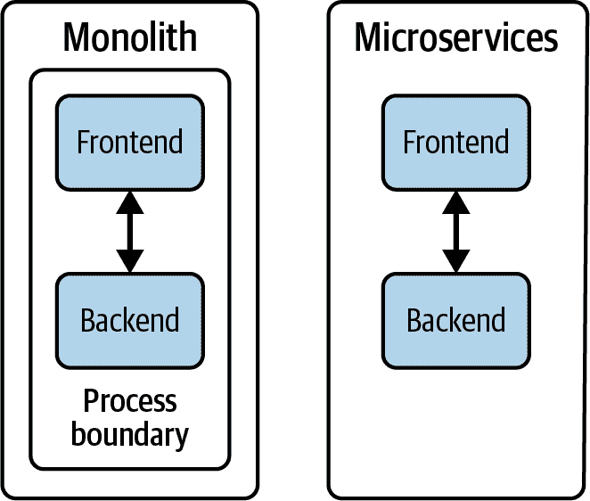
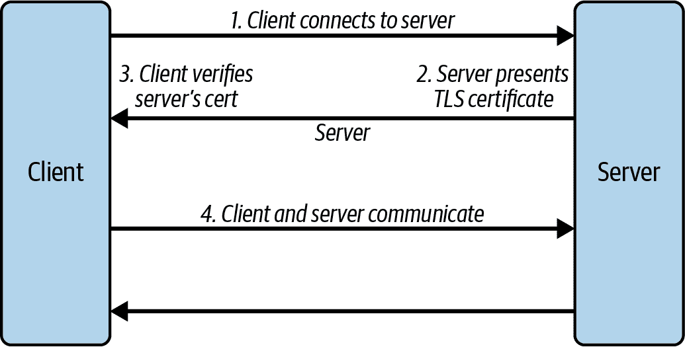
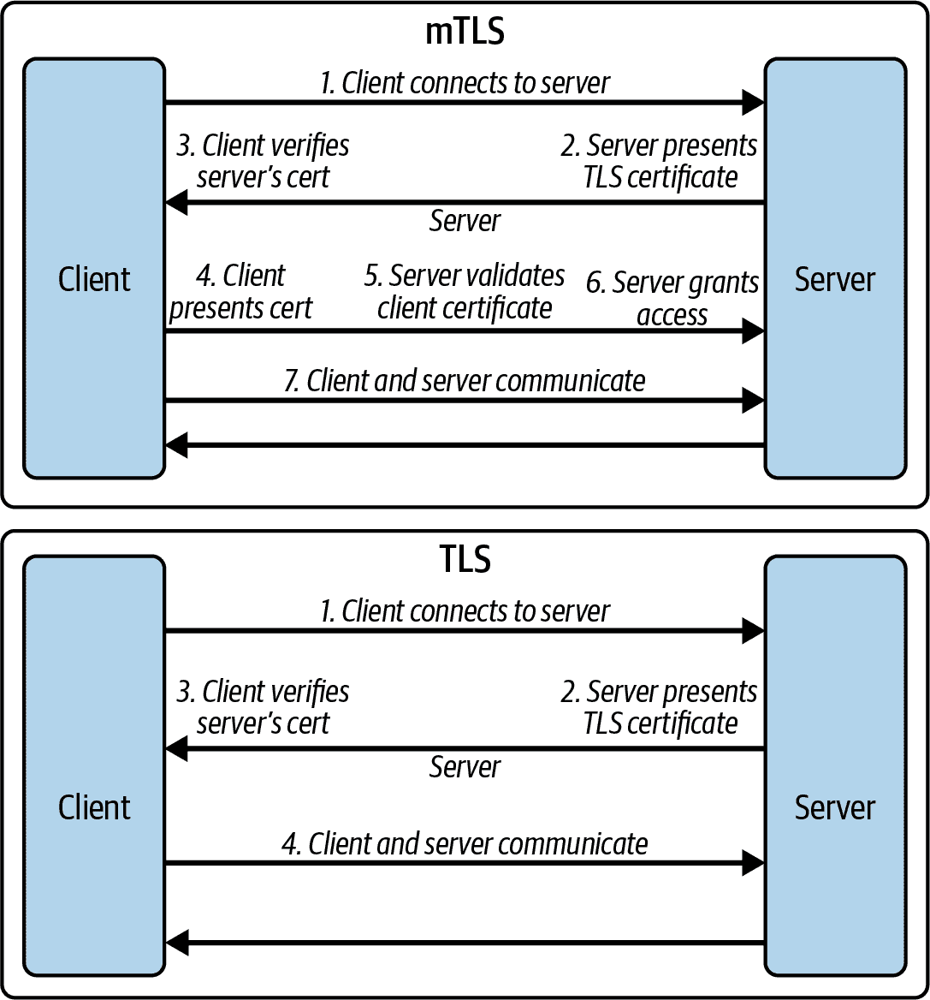
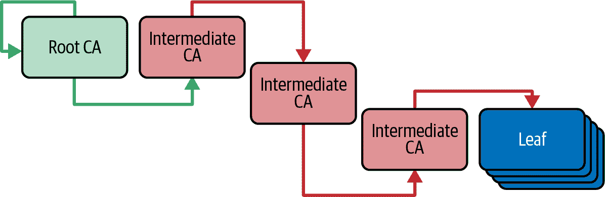
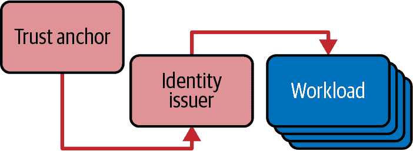
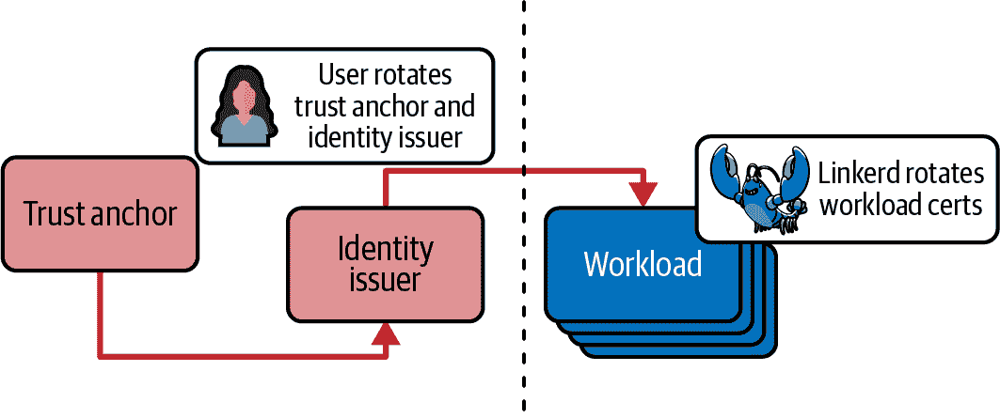
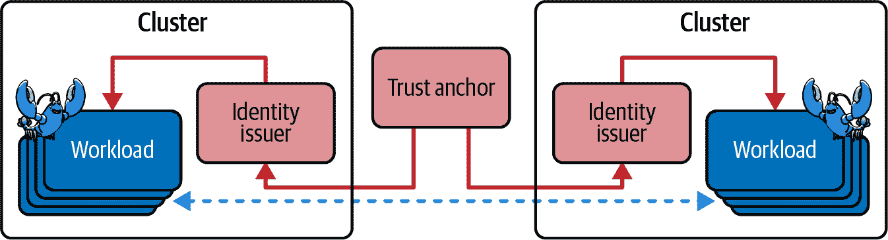
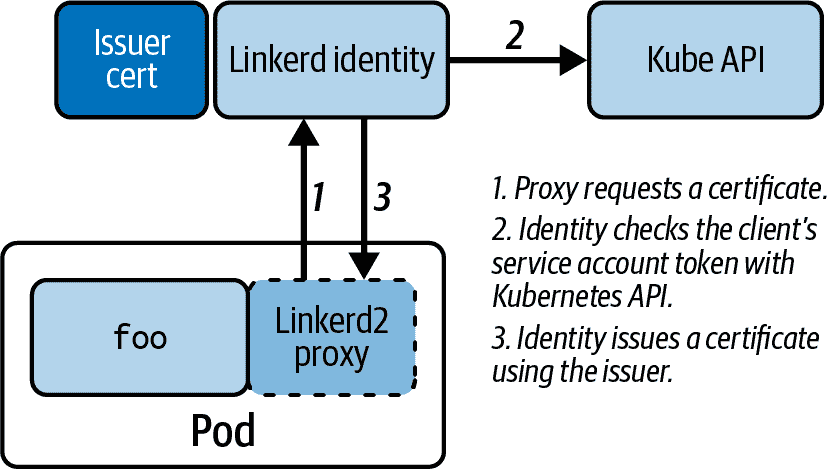
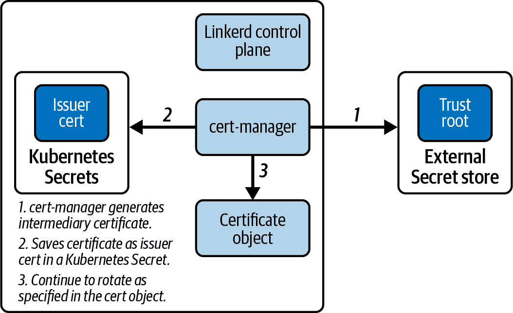

# 第七章：mTLS、Linkerd 和证书

从单体应用转向微服务应用，在安全方面使我们处于一个非常有趣的位置。单体应用在其进程边缘提供了一个自然的安全边界，而微服务应用则完全没有自然的安全边界。以前通过在进程内部的函数调用中传递的敏感信息现在必须通过网络发送，如图 7-1 所示。



###### 图 7-1\. 单体与微服务应用中的安全立场

此外，微服务通常运行在由外部团队、组织甚至公司提供的基础设施和网络资源上。如果不采取措施来抵御威胁，攻击者很容易在访问网络的情况下读取、拦截和修改微服务之间的通信。这显然是一个严重的问题。

最后，网络甚至没有提供任何安全的方式让特定的微服务知道是谁在调用它。被调用的微服务可以找出调用者的 IP 和 MAC 地址，但这些并不是真正安全的——例如，伪造发送者的 IP 地址非常容易。当应用运行在它无法控制的网络上时，情况只会变得更糟。

# 安全通信

为了使任何微服务应用程序正常工作，我们需要*安全通信*。真正安全通信有三个不同的要素：

真实性

我们必须确信我们与我们认为正在交谈的人在交谈。

保密性

我们必须确信没有人能读取发送到连接上的数据。

完整性

我们必须确信我们的消息在传输过程中没有被篡改。

这些并不是新问题，而且已经有许多不同的技术以各种方式演变来解决它们。Linkerd 依赖于其中一个最值得信赖的技术之一：*双向 TLS*，或者*mTLS*。

## TLS 和 mTLS

TLS 由[RFC 8446](https://oreil.ly/K6Wwg)定义，是一个经过实战检验的行业标准安全通信机制，可以追溯到 1999 年。这是 Web 浏览器多年来与银行、购物网站等进行安全通信所使用的相同机制。现代互联网已经依赖 TLS 近 25 年了，而密码分析学家至少有这么长时间在尝试找到它的弱点。TLS 使用图 7-2 所示的架构提供真实性、保密性和完整性。



###### 图 7-2\. TLS 架构

（Linkerd 特别使用 TLS 版本 1.3，但所有 TLS 版本都使用相同的架构。）

TLS 通过在传输中加密数据和添加消息摘要（加密校验和），确保了机密性和完整性，以便接收方可以验证发送的数据未被修改。这解决了我们三个关注点中的两个。

真实性更加复杂。TLS 使用*证书*来加密验证发送方和接收方的身份。TLS 标准始终要求接收端通过发送证书来识别自己。在许多情况下，这已经足够了；例如，当您使用网页浏览器访问购物网站时，浏览器发送证书并不是非常有用，因为购物网站会要求您单独登录。

对于服务网格来说，我们需要验证连接的双端。这意味着我们需要双方发送证书以进行身份验证。当我们像这样使用 TLS（就像 Linkerd 那样），我们称之为双向 TLS 或 mTLS，以区别于只有接收端进行身份验证的情况。这在图 7-3 中有所展示。



###### 图 7-3\. TLS 与 mTLS 比较

在双向使用证书的情况下，mTLS 利用了 TLS 提供的保证：它不仅为客户端和服务器提供了经过加密验证的身份，同时还保持了传输中的加密。对于 Linkerd，这意味着 mTLS 可以确保您的工作负载知道它们在与谁通信，且没有第三方能够拦截或监听它们的通信。

## mTLS 和证书

正如我们在第二章中首次讨论的那样，mTLS 依赖的证书是建立在公钥和私钥对上的。私钥（当然）需要保密：只有标识该密钥对的实体可以知道它。另一方面，公钥应该广泛分发：这就是验证持有私钥实体身份的依据，因此每个需要与该实体通信的人都需要这个公钥。

证书使我们能够将*名称*和其他元数据与密钥对关联起来，这非常有用，因为它使我们人类更容易处理证书。它们还使得一个证书可以证明另一个证书的有效性（*签名*或*发布*证书），这非常有用，因为它大大简化了我们是否信任证书的判断。

使用证书签署其他证书会创建一个*信任层级*，如图 7-4 所示。这种层级非常重要：mTLS 可以通过访问层级结构中更高的任何公钥来验证证书的有效性，而建立在 mTLS 之上的系统（包括 Linkerd）利用了这一特性。



###### 图 7-4\. 证书信任层级

最后，限制给定密钥对的使用寿命非常重要：密钥使用越长时间，如果被泄露，危险越大。因此，我们需要定期更换正在使用的证书密钥。这涉及创建新的密钥对，然后生成新的证书，并最终确保它得到正确签名。整个过程称为 *轮换* 证书；这是在处理证书时的主要操作复杂性来源。

## Linkerd 和 mTLS

Linkerd 透明地为所有应用间通信添加了 mTLS。这意味着所有网格化的流量都受到拦截和篡改的保护。这还意味着您的工作负载可以确保它们始终知道正在与哪些工作负载通信。

仅当每个网格化工作负载都有与该工作负载相关联的有效 TLS 证书，并且所有这些 *工作负载证书* 都属于相同的信任层次结构时，才能正常工作。手动管理这些将非常困难，因此 Linkerd 帮助自动化了这一过程。

我们在 第四章 中讨论了如何将工作负载添加到网格中，但让我们稍微详细地重新讨论一下。当将工作负载添加到网格中时，会向其 Pod 添加一个 `linkerd2-proxy` 容器。该容器将被配置为拦截进出 Pod 的所有 TCP 流量，并且在与另一个 Pod 建立连接时始终尝试建立 mTLS 会话。如果另一个 Pod 也有 `linkerd2-proxy` —— 意味着它是网格的一部分！—— 那么连接将受到 mTLS 保护。

由于此 mTLS 连接是从代理到代理的，Pod 中的应用容器甚至不知道 mTLS 是如何进行的：从应用程序的角度来看，Pod 之间的所有通信看起来都像是使用明文。这意味着应用 Pod 看不到 Linkerd 使用的任何证书信息，进而意味着它们不需要任何特殊的代码来处理证书信息。

# 协议检测和代理

代理拦截 *所有* 与 Pod 之间的通信意味着，有时您可能需要向其提供有关协议的额外信息，或者确实不尝试使用 mTLS。在 第四章 中详细讨论了所有这些内容，但一个很好的经验法则是，只要客户端先发言，那么一切都会正常。如果服务器先发言，则需要进行一些配置。

当然，这仅适用于服务器在网格中的情况！如果您尝试从网格化 Pod 向非网格化 Pod 进行通信，您将始终需要告诉 Linkerd 跳过此流量：否则，它将无法在目标 Pod 不在网格中时执行 mTLS。

# 证书和 Linkerd

我们在 第三章 中讨论了 Linkerd 证书。在本节中，我们将详细介绍这些证书的具体用途、创建方法以及在需要旋转时的操作。我们将涵盖 Linkerd 使用的三个层次的证书：信任锚、身份签发者和工作负载证书。

从 Linkerd 的角度来看，信任始于其信任锚证书，如 图 7-5 所示。信任锚当然可以由其他更高级的证书签名——然而对于 Linkerd 来说，信任在信任锚止步。



###### 图 7-5\. Linkerd 信任层次结构

Linkerd 自动处理工作负载证书的生成、分发和旋转，同时依赖用户管理信任锚和身份签发者。这在 图 7-6 中有所展示。



###### 图 7-6\. Linkerd 证书管理

# 永远不要让您的证书过期。

因为 Linkerd 默认要求 Pod 之间进行 mTLS 连接，所以它使用的证书的健康和安全性对网格的正常运行以及您的平台至关重要。如果证书过期或无法为新的 Pod 生成，*您将遭受停机*。

这是生产 Linkerd 集群中停机的最常见原因。了解和监控您的 Linkerd 证书至关重要。

## Linkerd 信任锚

Linkerd *信任锚* 是您的集群中所有信任的基础证书。它仅用于两件事：

+   安装 Linkerd 时，您将使用信任锚来发布 Linkerd 身份签发者证书，我们将在下一节中讨论这一点。这需要在安装之前，在 Linkerd 之外访问信任锚的私钥和公钥。

+   每当工作负载与另一个工作负载进行 mTLS 连接时，两个工作负载都使用身份签发者和信任锚来验证对方的身份。这需要访问信任锚的公钥，并在网格运行时不断进行。

因为只有在集群内操作时需要公钥（上述列表中的第二个小点），我们建议您永远不要将信任锚的私钥存储在 Kubernetes 集群中。相反，将信任锚存储在 Kubernetes 之外的安全系统中，并仅将其公钥复制到集群中，正如我们将在本章中介绍的那样。

非常重要的一点是，信任锚点与集群没有固有的联系：它完全独立于网络拓扑或集群边界。这意味着如果你给多个集群相同的信任锚点，它们将能够在不同集群中的工作负载之间进行安全的 mTLS，如图 7-7 所示。这非常强大，因为它使多集群网格设置变得非常容易。



###### 图 7-7\. 多集群信任层次

相应地，两个不应该相互通信的集群*不*应该共享信任锚点！对于大多数组织来说，这意味着不应该跨环境层次共享信任锚点——也就是说，测试集群不应该与开发或生产集群共享相同的信任锚点。

## Linkerd 身份颁发者

在 Linkerd 信任层次的第二级是身份颁发者证书，正如我们在第三章中简要提到的那样。身份颁发者由 Linkerd 控制平面的身份控制器用于颁发工作负载证书，如图 7-8 所示。由于身份颁发者用于签署证书，Linkerd 必须可以访问身份颁发者证书的私钥和公钥，这意味着它必须存储在集群中的一个秘密位置。



###### 图 7-8\. 颁发者证书和身份控制器

身份颁发者必须由信任锚点签署，并且由于它必须存储在集群中，每个集群必须有自己的身份颁发者。

# Linkerd 无法警告您如果共享身份颁发者证书

如果你不小心在两个集群中使用相同的身份颁发者证书，Linkerd 没有任何良好的方法来警告你，实际上一切都会正常运行。*不要这样做*。如果你这样做了，两个集群将变得无法区分，恶意用户有可能利用一个集群创建一个绕过另一个集群授权策略的工作负载证书。

确保每个集群都有一个唯一的身份颁发者。

## Linkerd 工作负载证书

最后，我们来到实际执行应用程序之间提供 mTLS 功能的证书。当一个工作负载被添加到 Linkerd 网格中时，与每个工作负载 Pod 关联的 Linkerd 代理会自动向 Linkerd 身份控制器请求一个工作负载证书。这个工作负载证书是工作负载身份的基础。它将由身份颁发者证书签署，由于每个其他工作负载都可以访问身份颁发者和信任锚点的公钥，可以验证工作负载证书的有效性直到信任锚点。

每个 Pod 的工作负载证书都与分配给 Pod 的 Kubernetes ServiceAccount 在密码学上相关联，其名称包括 ServiceAccount 和命名空间的名称。这使得在它们彼此通信时能够唯一标识您的 Pods。当我们建立策略时，这也为我们提供了稍后将需要的身份。身份名称的基本格式为：

```
$serviceAccountName.$namespace.serviceaccount.identity.linkerd.$clusterDomain
```

当 `$clusterDomain` 没有被覆盖时，它将是 `cluster.local`。（大多数单集群 Linkerd 安装不需要覆盖此设置。）

Linkerd 完全自动处理工作负载证书；您不应该担心管理它们。

## 证书的生命周期和旋转

正如我们之前提到的，使用特定密钥的时间越长，突破该密钥的价值就越大。因此，证书被赋予固定的寿命，并且在其到期之前必须替换。用新证书替换证书称为*旋转*证书。

如前所述，选择证书旋转的频率是一种权衡。频繁旋转最安全，但可能会干扰正常运作并需要不切实际的努力。很少或不旋转非常简单，但也非常不安全。

Linkerd 会自动为您旋转工作负载证书：默认情况下，工作负载证书每 24 小时过期一次。然而，身份发行者和信任锚点证书的旋转由您决定，因为通常您的组织政策会决定您需要多频繁地旋转。需要考虑的关键因素是：

每次你旋转信任锚点时，你*必须*同时旋转身份发行者。

这是因为信任锚点必须签署身份发行者。如果你刚刚生成了一个新的信任锚点，旧的身份发行者无法由新的信任锚点签署，因此你也需要一个新的身份发行者。

换句话说，这意味着你*不能*比身份发行者更频繁地旋转信任锚点。

每次你旋转身份发行者时，你*可能*也要旋转工作负载证书。

由于 Linkerd 自动处理工作负载证书的旋转，当你旋转身份发行者时，你可以选择等待 Linkerd 自动旋转工作负载证书。如果你希望立即确保它们被旋转，请重新启动工作负载。

旋转证书的方式取决于它是哪种证书：

旋转信任锚点

实际上，本书的内容不涵盖旋转信任锚点：实践中，如果你遵循集群本身应该是临时的原则，那么将信任锚点的生命周期与集群的生命周期保持一致可能更实际。你可以在 [官方 Linkerd 文档](https://oreil.ly/9fAPV) 中找到更多关于旋转信任锚点的信息。

旋转身份发行者

在 Linkerd 中，轮换身份颁发者是一项基本的操作任务。理想情况下，您将使用诸如 Venafi 的[cert-manager](https://cert-manager.io)之类的工具自动化轮换身份颁发者，并且我们在本章中展示了如何操作。您还可以根据[官方 Linkerd 文档](https://oreil.ly/CN9IB)中的过程手动轮换信任锚。

无论您是自动化身份颁发者轮换还是手动进行，重要的是在身份颁发者到期之前*练习*轮换身份颁发者。拥有一个从未测试过的机制可能比根本没有设置更糟糕。

轮换工作负载证书

工作负载证书由 Linkerd 控制平面自动轮换，因此您几乎不需要处理它们。（正如之前提到的，如果您确实希望轮换工作负载证书，只需重新启动工作负载。）

默认情况下，工作负载证书有效期为 24 小时，控制平面将在其有效生命周期的 70%后开始尝试轮换工作负载证书。

# 调整工作负载证书

如果需要，您可以通过在安装 Linkerd 时设置`issuanceLifetime`值来调整工作负载证书的生命周期，但要注意，如果您缩短此值，则存在两个重要的操作问题。

首先，您增加了 Pod 与身份控制器通信的频率，这会增加身份控制器的负载。

其次，您减少了解决更新问题的时间。代理将开始尝试在生命周期的 70%进行更新：对于 24 小时的生命周期，这意味着在证书过期前大约还有 7 小时开始尝试更新，如果出现任何问题，您将有大约 7 小时来解决。如果整个生命周期只有 2 小时，如果出现任何问题，您将只有大约半小时来解决。

正如您可能已经推测到的那样，我们只是浅显地介绍了证书的一般工作原理，特别是在 Linkerd 中，但是现在您应该已经有足够的信息来理解在 Linkerd 中如何使用证书。

## 在 Linkerd 中的证书管理

在这一点上，明显应该清楚证书管理是保护生产 Linkerd 安装的关键部分。正确管理证书是减少事件发生可能性的重要方式。它还可以帮助最小化恢复时间和如果发生故障的整体影响。

有了这些信息，我们建议所有使用 Linkerd 进行任何类型的生产使用的人：

将信任锚的生命周期与集群的生命周期耦合。

虽然可以轮换信任锚，但将整个集群视为临时的并定期轮换整个集群通常会使灾难恢复和提供者迁移变得更简单。

自动化轮换身份颁发者。

确实可以手动管理身份发行者，但我们*强烈建议*使用类似 cert-manager 的工具来定期轮换身份发行者证书，例如每隔几天一次。这种更短的身份发行者寿命可以大大限制任何事故的范围，而使用 cert-manager 几乎是不可察觉的。

## 使用 cert-manager 进行自动证书管理

Venafi 的 cert-manager 是一个 CNCF 项目，用于管理自动证书生成和轮换，如图 7-9 所示。我们不会详细介绍 cert-manager 的内部工作原理（这超出了本书的范围）；相反，我们将重点放在理解如何与 Linkerd 一起使用 cert-manager 的概念上。



###### 图 7-9\. 使用 cert-manager 自动轮换发行者证书

### 安装 cert-manager

我们首先通过 Helm 安装 cert-manager 来管理我们的安装，如示例 7-1 所示。要跟进操作，您需要在环境中准备以下工具：

+   `kubectl`

+   使用 `k3d` 或其他工具获取本地 Kubernetes 集群

+   `helm3`

##### 示例 7-1\. 安装 cert-manager

```
# Start by creating the cluster
$ k3d cluster create luar

# Add the jetstack Helm repo if you don't already have it
$ helm repo add jetstack https://charts.jetstack.io

# Make sure your Helm repositories are up-to-date
$ helm repo update

# Install cert-manager
$ helm install \
  cert-manager jetstack/cert-manager \
  --namespace cert-manager \
  --create-namespace \
  --version v1.12.0 \
  --set installCRDs=true

# Check out your cert-manager Pods
$ kubectl get pods -n cert-manager
```

# 软件版本

请注意，我们的示例使用特定版本，以确保在撰写本文时工作正常。但是，在您阅读本文时可能已有更新版本，请确保使用适当的版本。

### 配置 Linkerd 的 cert-manager

尽管本书不涵盖 cert-manager 的深入介绍，但讨论其整体架构对我们的使用场景是非常值得的。cert-manager 配置了 Issuer 和 Certificate 资源：Issuer 资源告诉 cert-manager 在哪里找到其需要发行证书的密钥，而 Certificate 资源告诉 cert-manager 使用哪个 Issuer 为特定证书发行证书。

在我们的案例中，如图 7-9 所示，我们将创建一个持有信任锚点密钥的 Issuer，并且一个描述如何使用该 Issuer 获取 Linkerd 发行者证书的 Certificate。

我们在本章开头提到，永远不要将根 CA 的私钥添加到 Kubernetes 集群中。由于在本书范围内部署外部密钥存储是不切实际的，我们将在示例 7-2 中违反此规则，并使用 cert-manager 将信任锚点存储在 Kubernetes Secret 中。在任何真实的生产环境中，您都*不应*这样做，但总体设置将保持不变，一个 Issuer 和一个 Certificate：只需将 Issuer 定义更改为使用您的外部代理即可（cert-manager 支持许多不同的外部代理；参见[文档](https://oreil.ly/f5354)）。

# 将信任锚点密钥保持在集群外！

再次强调，不要在生产中使用此设置。它可以更安全，但是您的信任锚点密钥存在集群中永远不会像仅存在于外部存储中那样安全。

##### 示例 7-2\. 为 Linkerd 生成证书

```
# Start by generating a trust anchor for the cluster.
$ step certificate create root.linkerd.cluster.local ca.crt ca.key \
  --profile root-ca --no-password --insecure --not-after=87600h

# Create the linkerd namespace so that we have a place to install
# the trust anchor Secret.
$ kubectl create ns linkerd

# Save the trust anchor as a Secret in the linkerd namespace.
#
# During your real-world installs, you'd instead use an external
# cert-manager-compatible Secret store (like Vault) to store the
# trust anchor.
$ kubectl create secret tls linkerd-trust-anchor \
  --cert=ca.crt \
  --key=ca.key \
  --namespace=linkerd

# Create a cert-manager Issuer that uses the trust anchor Secret
# to issue certificates. This Issuer must be in the same namespace
# as the trust anchor Secret.
#
# During your real-world installs, you'd instead change this
# Issuer to connect to your external Secret store.
$ kubectl apply -f - <<EOF
apiVersion: cert-manager.io/v1
kind: Issuer
metadata:
 name: linkerd-trust-anchor
 namespace: linkerd
spec:
 ca:
 secretName: linkerd-trust-anchor
EOF

```

```
# With the Issuer created, we will now use a Certificate to instruct
# cert-manager to create our identity issuer certificate. We will
# also instruct it to automatically rotate that certificate every 48
# hours. This Certificate must be in the same namespace as the Secret
# it is writing, which (again) is the linkerd namespace.
$ kubectl apply -f - <<EOF
apiVersion: cert-manager.io/v1
kind: Certificate
metadata:
 name: linkerd-identity-issuer
 namespace: linkerd
spec:
 secretName: linkerd-identity-issuer
 duration: 48h
 issuerRef:
 name: linkerd-trust-anchor
 kind: Issuer
 commonName: identity.linkerd.cluster.local
 dnsNames:
 - identity.linkerd.cluster.local
 isCA: true
 privateKey:
 algorithm: ECDSA
 usages:
 - cert sign
 - crl sign
 - server auth
 - client auth
EOF
```

让我们回顾一下刚才的步骤。我们首先将 cert-manager 安装到我们的集群中，这将自动化证书的发布和轮换过程。然后我们创建了一个信任锚点，并告诉 cert-manager 使用该证书来自动创建和轮换 Linkerd 的颁发者证书。颁发者证书是 Linkerd 将用来创建、分发和轮换各个工作负载证书的中间 CA。cert-manager 将按照我们在其证书对象中定义的每 48 小时轮换一次颁发者证书。

让我们快速浏览一下我们的集群，如示例 7-3 所示，看看 cert-manager 实际上如何处理这个设置。

##### 示例 7-3\. 四处看看

```
# First, let's validate that the trust anchor Secret exists and
# has some information in it.
$ kubectl get secret linkerd-trust-anchor -n linkerd

# Given that, we can use the step CLI to examine the public part
# of the certificate itself. The way this works is that the public
# part is stored, base-64 encoded, in the "tls.crt" key of the
# Secret, so we extract that, decode it, and hand it to step.
$ kubectl get secret linkerd-trust-anchor -n linkerd \
    -o jsonpath='{.data.tls\.crt}' \
    | base64 -d \
    | step certificate inspect -

# Next, let's check to see if cert-manager was able to create
# our issuer certificate. We should see a Certificate named
# linkerd-identity-issuer with a "ready" status of True.
$ kubectl get certificate -n linkerd

# Following that, we'll check in on the identity issuer Secret.
# This is just like what we did for the trust anchor, with a
# different name for the Secret.
$ kubectl get secret linkerd-identity-issuer -n linkerd \
    -o jsonpath='{.data.tls\.crt}' \
    | base64 -d \
    | step certificate inspect -
```

有了这些，现在我们可以安装 Linkerd 了。

### 使用 cert-manager 安装 Linkerd

一旦 cert-manager 设置好发布证书，我们需要安装 Linkerd，以便它知道使用 cert-manager 管理的证书，如图 7-9 所示。

你会记得，在第三章中，我们讨论了安装 Linkerd 的各种方法。我们将使用 Helm 进行安装，如示例 7-4 所示，因为我们建议希望在生产环境中运行 Linkerd 的人使用 Helm 来安装 Linkerd。

##### 示例 7-4\. 使用 cert-manager 安装 Linkerd

```
# Configure our Linkerd Helm repo.
$ helm repo add linkerd https://helm.linkerd.io/stable

# Update our repos.
$ helm repo update

# Install the Linkerd CRDs.
$ helm install linkerd-crds -n linkerd --version 1.6.1 linkerd/linkerd-crds

# Install Linkerd's control plane.
#
# Unlike in earlier chapters, this install will not have us specifying
# the issuer certificate. Instead, we instruct Linkerd to use the
# existing certificate by setting the identity.issuer.scheme to
# kubernetes.io/tls.
$ helm install linkerd-control-plane -n linkerd \
  --set-file identityTrustAnchorsPEM=ca.crt \
  --set identity.issuer.scheme=kubernetes.io/tls \
  --version 1.12.4 \
  linkerd/linkerd-control-plane

# Validate the Linkerd install.
$ linkerd check

# You'll see warnings letting you know your Linkerd issuer certificate isn't
# valid for more than 60 days. That's to be expected, as you are now actively
# rotating the issuer certificate with cert-manager.
```

有了这些，您现在拥有一个完全功能的 Linkerd 实例，并且具有主动和自动轮换颁发者证书。您已经为您的环境添加了大量安全性，并确保您的集群定期获得新的证书。积极监控 cert-manager 并检查您的证书是否定期轮换非常重要。过期的颁发者证书是 Linkerd 可以主动关闭您的应用程序的少数方式之一，其健康和安全对您的平台至关重要。

# 总结

我们在本章中涵盖了大量内容。即使 mTLS 和证书处理已经存在很长时间，但它们仍然是复杂的主题。挑战在于，为了正确保护云原生应用程序，您现在需要比您可能希望了解更多关于这些内容。

Linkerd 简化您强化环境流程的一种方式是使 mTLS 成为有效自动化，允许任何 Linkerd 用户依赖于 mTLS 的广受信任的身份验证和加密机制来进行安全通信。另一种方式是，Linkerd 让您控制关键的证书管理操作：Linkerd 能够为您的应用程序工作负载颁发证书，然后频繁且自动地轮换它们，为您减少安全事件的可能性和影响提供了一些强大的工具。
