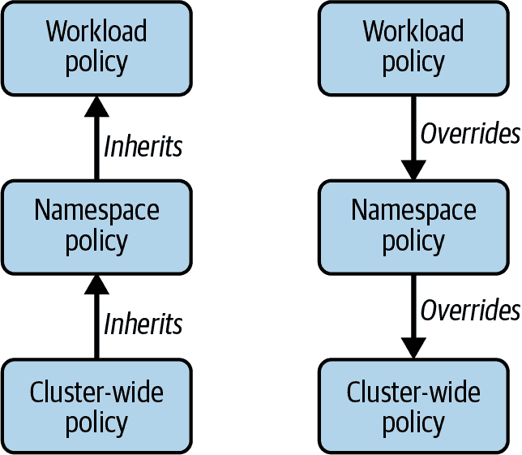
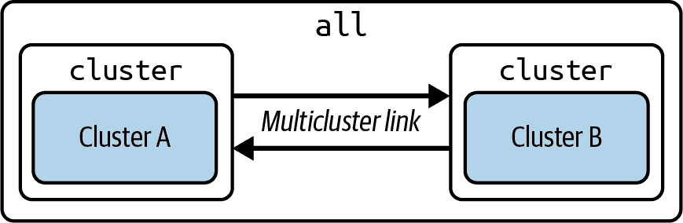
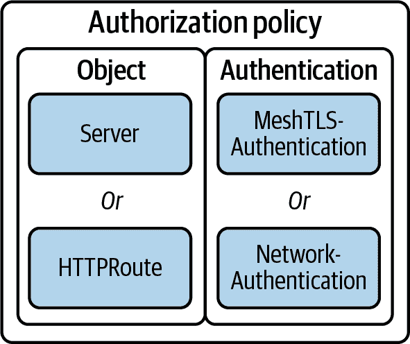
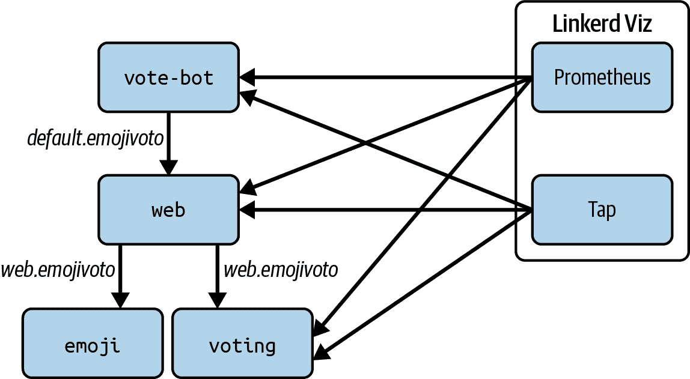
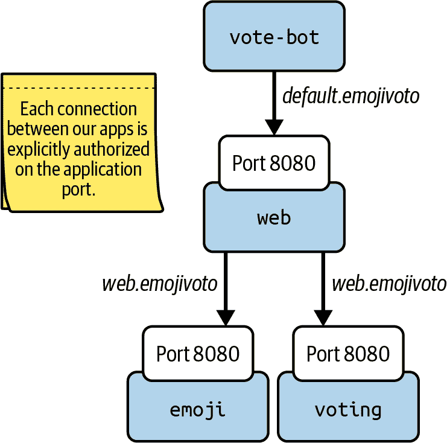
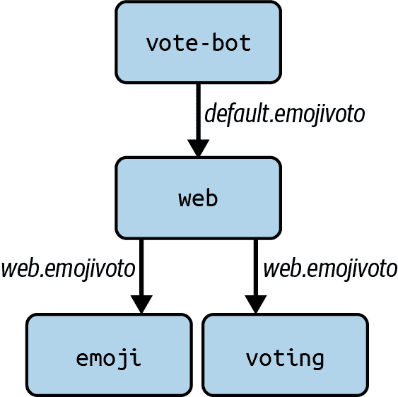

# 第八章：Linkerd 策略：概述和基于服务器的策略

正如我们在第七章中讨论的那样，微服务应用需要比传统的单体应用更高级别的网络安全性。mTLS 提供了你需要的安全通信和工作负载身份，但是正是 Linkerd 的*策略*机制提供了利用这些身份来控制环境中工作负载如何相互通信的能力。

Linkerd 支持两种策略机制：*基于服务器*和*基于路由*。由于策略是 Linkerd 最复杂的领域，我们将提供概述，并在本章节讨论基于服务器的策略，然后在第九章中介绍基于路由的策略。

# Linkerd 策略概述

所有 Linkerd 策略机制都基于*显式授权*：Linkerd 最初假定不应允许任何事情，必须明确告知允许哪些请求。这与零信任模型完全一致，并且使得权限推理变得简单，因为策略资源始终在*允许*某些操作。

不过，不要惊慌；这并不意味着策略总是由数百个资源构成的一团乱麻。Linkerd 允许在集群、命名空间和 Pod 级别设置*默认策略*，并且更具体级别的策略设置会覆盖更一般级别的策略设置：Pod 覆盖命名空间，命名空间覆盖集群范围的设置，正如图 8-1 所示。



###### 图 8-1\. 不同的 Linkerd 默认策略设置

谈论默认覆盖默认可能看起来很奇怪。这里，“默认”是指 Linkerd 支持的另一种策略设置类型的对比：使用*动态策略资源*。默认策略就是在没有针对特定请求的动态资源存在时应用的策略。

策略始终沿 Pod 边界执行，因为 Pod 是由 Linkerd 管理的基本单元。例如，不可能编写一个会影响 Pod 中单个容器通信的策略。

## Linkerd 默认策略

Linkerd 有以下默认策略选项：

`all-unauthenticated`

允许所有流量，无论是否经过身份验证。

`cluster-unauthenticated`

允许来自*本集群*的所有流量。

`all-authenticated`

允许来自所有网格化客户端的流量。

`cluster-authenticated`

允许来自*本集群*中的网格化客户端的流量。

`deny`

否认一切。

`all` 和 `cluster` 的区别仅在于当你使用多集群时才相关（正如我们在第十二章中讨论的那样）。在多集群设置中，`all` 包括来自其他集群的客户端，而 `cluster` 则不包括，如图 8-2 所示。如果不使用多集群，则两者是等效的。



###### 图 8-2\. `all` vs `cluster`

集群默认策略在安装时使用`proxy.defaultInboundPolicy`值设置，如示例 8-1 所示。如果未设置，集群默认策略将是`all-unauthenticated`：这允许绝对任何请求，反映了 Kubernetes 的默认宽松姿态。Linkerd 使用此默认值确保在安装 Linkerd 时不想或不需要使用策略（或者只是还没有加固集群到达该点的用户）不会受到负面影响。

# 为什么采用宽松的默认策略？

Linkerd 的默认`all-unauthenticated`显然对安全性不利，我们*强烈*建议您选择不同的集群默认值用于生产安装。

然而，实际上，几乎任何其他的基本默认都几乎可以确保在运行中的应用程序中安装 Linkerd 会导致问题。最终，`all-unauthenticated`作为基本默认是在首次引入应用程序时确保 Linkerd 不会造成任何伤害的唯一方法，这就是*为什么*它是基本默认。

##### 示例 8-1\. 设置集群默认策略

```
# We can set the cluster's default policy with Helm...
$ helm install linkerd-control-plane -n linkerd \
     ... \
     --set proxy.defaultInboundPolicy=all-authenticated \
     ...

# ...or with the Linkerd CLI.
$ linkerd install \
        ...
        --set proxy.defaultInboundPolicy=all-authenticated \
        ... \
    | kubectl install -
```

要覆盖命名空间、工作负载或 Pod 的默认值，您将使用`config.linkerd.io/default-inbound-policy`注释，将其设置为前面列出的值之一，如下所示：

```
$ kubectl annotate namespace *`your-namespace`* \
        config.linkerd.io/default-inbound-policy=all-authenticated
```

## Linkerd 策略资源

要覆盖默认策略，您将使用策略资源，这些资源是 CRD，配置应该允许哪些请求：

Server

描述一个或多个 Pod 及其上的一个端口

HTTP 路由

描述给定 Server 的 HTTP 流量子集

MeshTLSAuthentication

描述一个或多个网格身份

网络认证

描述一个或多个 IP 地址

AuthorizationPolicy

将 Server 或 HTTPRoute 绑定到网格或网络认证

这些资源如图 8-3 所示共同工作；例如，一个 AuthorizationPolicy 可以将 Server 和 MeshTLSAuthentication 链接起来，以允许特定集合的网格身份访问 Server。



###### 图 8-3\. Linkerd 策略资源

让我们更详细地查看每个资源以及它们如何用于配置 Linkerd 策略。

### Server

我们在第四章简要讨论了 Server 资源。Server 资源是 Linkerd 特有的；它们允许描述工作负载的单个特定端口。例如，示例 8-2 中的 Server 描述了`foo`工作负载的`http`端口，该工作负载是具有`app: foo`标签的 Pod 集合。该 Server 还指出该端口处理 HTTP/1.1 流量。

##### 示例 8-2\. 一个 Server 资源

```
apiVersion: policy.linkerd.io/v1beta1
kind: Server
metadata:
  name: foo
  namespace: foo-ns
spec:
  podSelector:
    matchLabels:
      app: foo
  port: http
  proxyProtocol: HTTP/1
```

注意，Server 是一个命名空间资源，必须出现在与其需要匹配的 Pod 相同的命名空间中。

### HTTP 路由

HTTPRoute 是一个 Gateway API 资源，描述特定的 HTTP 请求。我们将在第九章更详细地讨论 HTTPRoute。

### MeshTLSAuthentication

MeshTLSAuthentication 描述了一组特定的网格标识。任何具有列出的标识之一的工作负载都将匹配 MeshTLSAuthentication。例如，示例 8-3 显示了用于单个标识 `foo.foo-ns.serviceaccount.identity.linkerd.cluster.local` 的 MeshTLSAuthentication。

##### 示例 8-3\. 一个 MeshTLSAuthentication 资源

```
apiVersion: policy.linkerd.io/v1alpha1
kind: MeshTLSAuthentication
metadata:
  name: foo
  namespace: foo-ns
spec:
  identities:
    - "foo.foo-ns.serviceaccount.identity.linkerd.cluster.local"
```

MeshTLSAuthentication 是一个命名空间资源。通常会放置在与其相关的工作负载相同的命名空间中，尽管这不是一个严格的要求。

### NetworkAuthentication

NetworkAuthentication 资源描述一组 IP 地址 CIDR 范围。来自列出范围中任何一个的请求都将匹配 NetworkAuthentication。

考虑到 Linkerd 强调使用工作负载标识而不是网络标识，可能会觉得 NetworkAuthentication 资源存在有些奇怪；然而，在管理未网格化的客户端时，它在某些时候确实很有用。

NetworkAuthentication 是一个命名空间资源。通常会放置在与其相关的工作负载相同的命名空间中，尽管这不是一个严格的要求。

### 授权策略

Linkerd 授权策略资源 *允许访问* 目标以进行一些 *必需的身份验证*。目标目前必须是服务器或 HTTP 路由之一。所需的身份验证必须是一个或多个 MeshTLSAuthentication 或 NetworkAuthentication 资源。

授权策略是一个命名空间资源。通常会放置在与其相关的工作负载相同的命名空间中，尽管这不是一个严格的要求。

当我们开始实际使用策略来锁定我们的集群时，我们将深入研究各个对象。

## 基于服务器的策略与基于路由的策略的比较

基于服务器的策略得名于它依赖于 Linkerd 服务器资源。您会注意到，虽然服务器资源描述了工作负载和端口，但并没有 *描述* 请求的任何内容。这意味着基于服务器的策略无法区分发往给定服务器的单独请求，而是要求发往服务器的每个请求都遵循相同的策略。

另一方面，路由策略（我们将在第九章讨论）确实会考虑请求细节。这是一种更强大、也更复杂的机制。

# 基于 emojivoto 应用程序的基于服务器的策略

我们将使用 [emojivoto 示例应用程序](https://oreil.ly/g7fDb) 来说明在 Linkerd 中使用策略。作为参考，图 8-4 显示了我们的最终目标：整个 emojivoto 应用程序将受到保护，防止未授权的访问。


###### 图 8-4\. emojivoto 策略概览

在本章中，我们将引导您通过几种不同的模式来设置您的集群，每种模式都将逐步限制应用程序及其通信能力。

## 配置默认策略

我们可以采取的第一步来锁定我们的集群之一也是影响力和广泛性最大的措施之一。Linkerd 提供了一个简单的机制来设置所有代理的默认入站策略。在本节中，我们将展示如何在集群和命名空间级别设置默认的入站策略。

### 集群默认策略

让我们从设置整个集群的默认策略开始。记住，当你安装 Linkerd 时，整个集群的默认策略是`all-unauthenticated`，允许绝对任何请求，这与 Kubernetes 的默认开放态度一致。

我们首先将集群的默认策略切换为`all-authenticated`。这将要求所有连接到网络内的 Pod 的连接都来自于网络内的其他 Pod。这对安全性有好处，但会增加一些运维开销，因为你需要为任何想要继续与网络内的 Pod 进行通信的非网络化应用程序划出例外。例如，想象一下，你有一个非网络化的监控工具：当你将默认设置为`all-authenticated`时，它将突然无法与你的网络内的 Pod 进行通信，你要么需要将监控工具加入到网络中，要么为它添加 Linkerd 策略的例外。

# 是拒绝还是不拒绝

在理想情况下，整个集群的默认策略应设置为`deny`。从安全的角度来看，这绝对是最佳实践，但如果你正在处理现有的应用程序，并且将 Linkerd 的默认设置为`deny`，很可能会导致一些问题，除非你已经知道所有需要允许的不同流量。实际上，如果你没有使用精细化安全工具来工作，这种情况是很少见的。

一个有效且实际的妥协可以是从`all-unauthenticated`开始，然后使用 Linkerd 的可观察性工具确定哪些流量应被允许，然后逐步通过`all-authenticated`或`cluster-authenticated`来加强安全性，最终达到`deny`。还要记住，你可以将特定的命名空间切换到`deny`，作为逐步使整个集群达到`deny`的步骤之一。

在*非生产*环境中，当然，简单地将所有东西都切换到`deny`并观察可能会发生什么问题是了解哪些通信正在进行而你还没有考虑到的一个*很好的*方法。但在生产环境中不要这样做！

因为集群范围的策略是一个全局设置，我们将使用 Helm 进行配置。在示例 8-4 中，我们将使用`helm upgrade`来修改 Linkerd 的设置，而不改变你已安装的 Linkerd 版本。这个示例假设你正在使用 Linkerd 2.13.4。

##### 示例 8-4\. 集群策略

```
# Use helm upgrade to set the global inbound policy to all-authenticated.
$ helm upgrade linkerd-control-plane -n linkerd \
  --set proxy.defaultInboundPolicy=all-authenticated \
  --version  1.12.4 \
  --reuse-values \
  linkerd/linkerd-control-plane

# Now we can install the emojivoto app in our cluster to validate that it
# can operate normally while meshed.
$ curl --proto '=https' --tlsv1.2 -sSfL https://run.linkerd.io/emojivoto.yml \
  | linkerd inject - | kubectl apply -f -

# Once your Pods are up and running, test the emojivoto application to see
# if it's still working.
$ kubectl -n emojivoto port-forward svc/web-svc 8080:80

# Now browse to localhost:8080 and look at the emojivoto app. You should
# see the normal voting page.
```

### 命名空间默认策略

更进一步，我们可以将`emojivoto`命名空间切换到`deny`，以进一步保护我们的应用程序，如示例 8-5 所示。一旦这样做，该命名空间内的所有流量都将被拒绝，除非我们明确授权。

##### 示例 8-5\. 命名空间策略

```
# Start by using kubectl to annotate the namespace. We're going to set it
# to deny all traffic that hasn't been explicitly authorized.
$ kubectl annotate namespace emojivoto config.linkerd.io/default-inbound-policy=deny

# With that done, the policy changes won't have any impact on the Pods that
# are already running. You will need to perform a rollout restart for the
# new default policy to take effect.
$ kubectl rollout restart deploy -n emojivoto

# Once your Pods are up and running, test the emojivoto application to see
# if it's still working.
$ kubectl -n emojivoto port-forward svc/web-svc 8080:80

# Now browse to localhost:8080 and look at the emojivoto app. You should now
# see the page load, but all the emojis are gone. That is because the web
# frontend can no longer talk to either of its backends, voting or emoji.
```

# 时间很重要

Linkerd 的默认入站策略在代理启动时由您的代理读取。它不是动态读取的。这对操作员来说很重要，因为这意味着您所做的任何更改只有在创建 Pod 时才会生效。如果您更改了集群或命名空间的默认入站策略，则这些更改仅在重新创建命名空间中的 Pod 后才会生效。Pod 级别的入站策略更改将在 Kubernetes API 重新启动修改的 Pod 时生效，因此它们将在您修改相关的 Deployments、StatefulSets 或 DaemonSets 后立即生效。

有了这些设置，我们成功地阻止了`emojivoto`命名空间中工作负载之间的通信……而*一切*都瘫痪了。为了使应用程序重新正常工作，我们需要开始再次允许必要的流量，采用*动态策略*。

## 配置动态策略

如示例所示，仅仅使用默认设置来阻止所有内容并不是很有用。现在是时候看看如何使用我们的动态策略资源来允许有用的、必要的流量流动了。我们将从一个相当简单的概念开始：许多组织将命名空间视为应用程序或团队之间的逻辑边界，因此通常允许同一命名空间中的工作负载相互通信是有意义的。这通常被称为*命名空间隔离*。

### 命名空间隔离

使用命名空间隔离，我们可以轻松地限制命名空间中的流量仅限于共享该命名空间的工作负载。在我们的示例中，我们将开始允许`emojivoto`命名空间内的流量，只要源和目标身份都在同一个命名空间中。对于 emojivoto 应用程序来说，这是有意义的，因为其命名空间中运行的唯一内容是 emojivoto 本身的部分：这是该应用程序仅包含在单个命名空间中的自然结果。

# 身份而非 IP 地址

请注意，我们说的是“源和目的地*身份*”。Linkerd 对策略的所有操作都基于工作负载身份，而不是工作负载的 IP 地址或网络的任何其他内容。只要身份匹配，工作负载甚至不需要在同一个集群中，也可以正常运行。

我们将在示例 8-6 中为`emojivoto`设置命名空间隔离。公平警告：这看起来很复杂。内联注释对完全理解此示例的所有内容非常重要。

##### 示例 8-6\. 对`emojivoto`进行命名空间隔离

```
# To start applying policies to the emojivoto workloads, we need to create
# Server objects. A Server object selects a single named port on one or more
# Pods.
#
# We'll start by setting up a Server that matches the Linkerd admin port,
# used for metrics, for every Pod in our namespace.
$ kubectl apply -f - <<EOF
apiVersion: policy.linkerd.io/v1beta1
kind: Server
metadata:
 namespace: emojivoto
 name: linkerd-admin
spec:
 podSelector:
 matchLabels: {}
 port: linkerd-admin
 proxyProtocol: HTTP/2
EOF

# This object, a Server called linkerd, will, due to our matchLabels selector,
# match every Pod in our namespace. On each Pod it will bind to a port named
# linkerd-admin and allow us to apply policy to it.
#
# Next, we will create a Server object for each part of our application,
# starting with the web service (which serves the GUI).
$ kubectl apply -f - <<EOF
apiVersion: policy.linkerd.io/v1beta1
kind: Server
metadata:
 namespace: emojivoto
 name: web-http
 labels:
 app.kubernetes.io/part-of: emojivoto
 app.kubernetes.io/name: web
 app.kubernetes.io/version: v11
spec:
 podSelector:
 matchLabels:
 app: web-svc
 port: http
 proxyProtocol: HTTP/1
EOF

```

```
# The Server web-http matches the HTTP port for Pods that are part of the
# web service by selecting any Pods with the app=web-svc label. It also has
# the added benefit of allowing us to skip protocol detection on this port
# by specifying the protocol as HTTP/1.
#
# Now we'll create the Servers for emojivoto's backing services,
# voting and emoji.
$ kubectl apply -f - <<EOF
---
apiVersion: policy.linkerd.io/v1beta1
kind: Server
metadata:
 namespace: emojivoto
 name: emoji-grpc
 labels:
 app.kubernetes.io/part-of: emojivoto
 app.kubernetes.io/name: emoji
 app.kubernetes.io/version: v11
 app: emoji-svc
 emojivoto/api: internal-grpc
spec:
 podSelector:
 matchLabels:
 app: emoji-svc
 port: grpc
 proxyProtocol: gRPC
---
apiVersion: policy.linkerd.io/v1beta1
kind: Server
metadata:
 namespace: emojivoto
 name: voting-grpc
 labels:
 app: voting-svc
 emojivoto/api: internal-grpc
spec:
 podSelector:
 matchLabels:
 app: voting-svc
 port: grpc
 proxyProtocol: gRPC
EOF

```

```
# These are basically the same idea as the web Server, just with different
# label selectors. Also, since emojivoto uses gRPC for these workloads, we
# set the protocol to gRPC.
#
# With that, all of our Servers have been created, and we are ready to begin
# to allow communication within our namespace. We'll next define a single
# MeshTLSAuthentication resource that matches all service accounts within
# the emojivoto namespace.
$ kubectl apply -f - <<EOF
apiVersion: policy.linkerd.io/v1alpha1
kind: MeshTLSAuthentication
metadata:
 name: emojivoto-accounts
 namespace: emojivoto
spec:
 identities:
 - "*.emojivoto.serviceaccount.identity.linkerd.cluster.local"
EOF

# Then, we will bind that MeshTLSAuthentication to our Servers. We could do it
# individually on a port-by-port basis, but in this case it's simpler to bind
# to every policy object in the namespace.
$ kubectl apply -f - <<EOF
apiVersion: policy.linkerd.io/v1alpha1
kind: AuthorizationPolicy
metadata:
 name: emojivoto-only
 namespace: emojivoto
 labels:
 app.kubernetes.io/part-of: emojivoto
 project: emojivoto
spec:
 targetRef:
 kind: Namespace
 name: emojivoto
 requiredAuthenticationRefs:
 - name: emojivoto-accounts
 kind: MeshTLSAuthentication
 group: policy.linkerd.io
EOF

# With that, we should see that the emojivoto workloads are able to communicate
# with each other once again. You can check this by using a port forward to
# look at the emojivoto app's GUI: start this forwarder, then open
# http://localhost:8080/ in your browser.
$ kubectl -n emojivoto port-forward svc/web-svc 8080:80
```

# 名字的重要性

Linkerd 服务器对象是允许我们对应用程序应用策略的核心构造。它们通过基于某些选择标准匹配 Pod，然后选择一个端口*根据端口的名称*。Kubernetes 允许您创建没有将名称添加到端口的 Pod，因此在使用 Linkerd 策略时，必须确保应用程序中的每个端口都为其名称设置了一个值。

我们知道这是大量的 YAML！策略定义是您在使用 Linkerd 时需要承担的最费力的任务。幸运的是，策略是一个可选择的功能，您可以在启用之前提前准备好。我们*强烈建议*您在将所有策略对象应用于生产环境之前，在非生产环境中彻底测试它们。

# **早期测试，经常测试**

这点需要重申。*策略很复杂*，容易出错。我们*强烈建议*在将策略定义应用于生产环境之前，在非生产环境中测试您的策略定义。

### 允许 Linkerd Viz

目前，我们已经在集群中隔离了`emojivoto`命名空间：来自命名空间外部的任何内容都无法与命名空间内部的任何内容通信。不幸的是，这会导致监控应用程序和入口控制器等功能中断。这显然不是理想的状态：虽然我们已经做了很多工作来保护我们的`emojivoto`命名空间，但却导致了其他问题。例如，我们让任何潜在的操作人员几乎无法监控我们的 emojivoto 工作负载在做什么。

要解决这个问题，我们可以使用引用来自*命名空间外部*身份的动态策略资源。在示例 8-7 中，我们将指导您安装 Linkerd Viz 并允许其轮询您的应用程序，如图 8-5 所示。



###### 图 8-5\. emojivoto 策略允许 Linkerd Viz

##### 示例 8-7\. 让 Viz 来临吧！

```
# Let's install the Linkerd Viz extension. We'll continue our theme of
# installing things with Helm.
$ helm install linkerd-viz linkerd/linkerd-viz \
  -n linkerd-viz \
  --create-namespace \
  --version 30.8.4

# This command will install the linkerd 2.13.4 version of Linkerd's Viz
# extension.
#
# Once that's done, wait for Viz to be ready.
$ linkerd check

# We now want to restart our emojivoto workloads so that they start
# collecting Tap data. This is critical for observability.
$ kubectl rollout restart deploy -n emojivoto

# With that complete, we can now move on to validating that the Linkerd
# Viz extension is unable to talk to our workloads.
$ linkerd viz stat deploy -n emojivoto

# You should see all your deployments with no statistics associated with
# them. That's because Linkerd's Prometheus instance is located in the
# linkerd-viz namespace, and it hasn't been given permission to talk to
# anything in the emojivoto namespace.
```

```
# Let's fix that now. First, we define a MeshTLSAuthentication resource
# that matches the identities used by Tap and Prometheus, which are the
# parts of Linkerd Viz that collect data.
$ kubectl apply -f - <<EOF
apiVersion: policy.linkerd.io/v1alpha1
kind: MeshTLSAuthentication
metadata:
 name: linkerd-viz
 namespace: emojivoto
spec:
 identities:
 - "tap.linkerd-viz.serviceaccount.identity.linkerd.cluster.local"
 - "prometheus.linkerd-viz.serviceaccount.identity.linkerd.cluster.local"
EOF

# Next, we permit that MeshTLSAuthentication to talk to Pods in the
# emojivoto namespace, using an AuthorizationPolicy as before.
$ kubectl apply -f - <<EOF
apiVersion: policy.linkerd.io/v1alpha1
kind: AuthorizationPolicy
metadata:
 name: allow-viz
 namespace: emojivoto
spec:
 targetRef:
 kind: Namespace
 name: emojivoto
 requiredAuthenticationRefs:
 - name: linkerd-viz
 kind: MeshTLSAuthentication
 group: policy.linkerd.io
EOF

# At this point, Tap and Prometheus should be happily collecting data.
# Give them a minute or so to get something substantive, then you should
# be able to see good results from a second "linkerd viz stat" command.
$ linkerd viz stat deploy -n emojivoto
```

完成这些步骤后，我们已经详细介绍了如何在命名空间内部隔离流量，但仍允许外部监控工具（如 Linkerd Viz 扩展）进入。您现在具备开始使用 Linkerd 的策略工具隔离自己工作负载所需的基本知识。接下来，我们将更详细地说明只允许特定服务账户访问我们的工作负载。

### 按端口和身份锁定

命名空间隔离在进一步加固我们环境方面发挥了重要作用，但我们可以做得更多。到目前为止，我们已经应用的隔离允许任何请求，只要调用工作负载和被调用工作负载都在`emojivoto`命名空间内部即可，但这可能比我们实际需要的更宽松。为了更进一步，我们可以明确指出哪些账户被允许与哪些工作负载通信——但这当然需要准确了解应用程序真正需要的通信情况。

通过检查代码来弄清楚这些需求是繁琐且容易出错的，但幸运的是，我们可以利用像 Linkerd Viz（或其商业版本 Buoyant 的衍生产品）这样的工具来帮助我们映射应用程序的通信并构建我们的策略对象。

在`emojivoto`命名空间中，我们只需使用一个 Linkerd Viz CLI 命令即可查看哪些工作负载正在相互通信。

```
$ linkerd viz edges deploy -n emojivoto
```

这将生成一个在此命名空间中相互通信的部署列表。在 `SRC` 列下列出的部署是请求的源（客户端）；在 `DST` 列下列出的是目标（服务器）。

如果您更喜欢使用 Viz 仪表板而不是其 CLI 进行调查，您可以运行：

```
$ linkerd viz dashboard
```

Viz 仪表板不在本书的讨论范围内，但它相当直观，我们鼓励您在没有使用过的情况下去试试。

从输出中，我们可以看到我们的 emojivoto 工作负载之间的连接，如 图 8-6 所示。



###### 图 8-6\. emojivoto 工作负载间通信

emojivoto 是一个非常简单的应用程序，因此只有三个连接：

+   `vote-bot` 与 `web` 部署进行通信。

+   `web` 与 `voting` 进行通信。

+   `web` 与 `emoji` 进行通信。

有了这些，我们可以开始构建策略。我们将从收集各自工作负载上的主体名称开始，如 示例 8-8 所示。我们需要收集 `vote-bot` 和 `web` 的名称。我们不需要允许 `voting` 或 `emoji` 与任何其他服务通信，因为它们都不作为任何其他服务的客户端。

##### 示例 8-8\. 收集主体名称

```
# Start by grabbing the name of the first vote-bot Pod (which should
# be the only vote-bot Pod).
#
# This kubectl command uses -l app=vote-bot to pick all Pods with the
# "app: vote-bot" label, then uses JSONPath to pick the metadata.name
# of the first Pod in the list.
$ VOTEBOTPOD=$(kubectl get pods -n emojivoto -l app=vote-bot \
             -o jsonpath='{ .items[0].metadata.name }')

# Now use the Pod name for vote-bot to get the Subject name.
$ linkerd identity $VOTEBOTPOD -n emojivoto | grep Subject:

# This will print out the Subject name for the vote-bot Pod, which is
# the name of that Pod's identity. It will look like:
#
#   Subject: CN=default.emojivoto.serviceaccount.identity.linkerd.cluster.local
#
# We only want the part after CN=, so
# default.emojivoto.serviceaccount.identity.linkerd.cluster.local.

# Repeat for the web Pod, which we can find using the "app: web-svc" label.
$ WEBPOD=$(kubectl get pods -n emojivoto -l app=web-svc \
         -o jsonpath='{ .items[0].metadata.name }')

$ linkerd identity $WEBPOD -n emojivoto | grep Subject:

# It should output a name like:
#    Subject: CN=web.emojivoto.serviceaccount.identity.linkerd.cluster.local
#
# and again, we'll want the part after CN=:
# web.emojivoto.serviceaccount.identity.linkerd.cluster.local
```

# 名字的含义？

为什么 `vote-bot` 工作负载得到一个名为“default”的身份，而 `web` 工作负载得到一个名为`web`的身份？如果您仔细查看 `vote-bot` 和 `web` 的部署，您会发现 `web` 指定了要使用的 ServiceAccount，但 `vote-bot` 没有……所以 `vote-bot` 得到了默认的。*这不是最佳实践*。在理想的情况下，每个工作负载都应该有自己的 ServiceAccount。

我们展示这个是因为尽管这不是理想的，但在试图为未设计为零信任的应用程序设置策略时，看到这种默认 ServiceAccount 的使用是*非常*常见的，并且您可能需要创建新的 ServiceAccount 以及创建策略资源！

有了这两个主体名称，我们可以更新我们的策略，更明确地规定在 `emojivoto` 命名空间中允许谁与谁通信。值得记住，在前一节中，我们创建了多个策略对象，允许 emojivoto 工作负载相互通信。在 示例 8-9 中，我们将重新使用一些并删除其他对象，以从更宽松的安全姿态转向更少宽松的姿态，如 图 8-7 所示。



###### 图 8-7\. emojivoto 较不宽松的模型

# 服务器端策略

在 Linkerd 中，基于工作负载的策略引擎在服务器端执行所有策略决策。当我们在环境中将 `deny` 配置为默认选项时，我们必须逐个检查每台服务器，确保其所有客户端都已明确允许。

##### 示例 8-9\. 限制应用间通信

```
# We'll start by creating two new MeshTLSAuthentication objects. The
# first allows only the default identity (currently used by the vote-bot);
# the second allows only the web identity.
$ kubectl apply -f - <<EOF
apiVersion: policy.linkerd.io/v1alpha1
kind: MeshTLSAuthentication
metadata:
 name: default
 namespace: emojivoto
spec:
 identities:
 - 'default.emojivoto.serviceaccount.identity.linkerd.cluster.local'
---
apiVersion: policy.linkerd.io/v1alpha1
kind: MeshTLSAuthentication
metadata:
 name: web
 namespace: emojivoto
spec:
 identities:
 - 'web.emojivoto.serviceaccount.identity.linkerd.cluster.local'
EOF

```

```
# Each object corresponds to either the vote-bot or web application. We
# inserted the names we gathered in Example 8-8 to populate these
# objects. It's a good practice to name them after the identity they
# represent, rather than the workload -- in particular, the "default"
# identity is probably used by more than just the vote-bot, so we don't
# want to name that MeshTLSAuthentication "vote-bot" as that might give
# the impression that we need only think about the vote-bot when using
# that!

# With that done, we can begin binding those authentications to our servers.
# We'll start with allowing vote-bot (using the default identity) to talk
# to web.
$ kubectl apply -f - <<EOF
apiVersion: policy.linkerd.io/v1alpha1
kind: AuthorizationPolicy
metadata:
 labels:
 app.kubernetes.io/part-of: emojivoto
 project: emojivoto
 name: allow-default-to-web
 namespace: emojivoto
spec:
 requiredAuthenticationRefs:
 - group: policy.linkerd.io
 kind: MeshTLSAuthentication
 name: default
 targetRef:
 group: policy.linkerd.io
 kind: Server
 name: web-http
EOF

```

```
# This AuthorizationPolicy will allow any workload using the default
# identity to talk to the web workload, using the "web-http" Server we
# already created.

# Now we will give the web application access to emoji and voting. In
# order to accomplish this we will need to create two AuthorizationPolicy
# objects, one for each Server.
$ kubectl apply -f - <<EOF
apiVersion: policy.linkerd.io/v1alpha1
kind: AuthorizationPolicy
metadata:
 labels:
 app.kubernetes.io/part-of: emojivoto
 project: emojivoto
 name: allow-web-to-voting
 namespace: emojivoto
spec:
 requiredAuthenticationRefs:
 - group: policy.linkerd.io
 kind: MeshTLSAuthentication
 name: web
 targetRef:
 group: policy.linkerd.io
 kind: Server
 name: voting-grpc
---
apiVersion: policy.linkerd.io/v1alpha1
kind: AuthorizationPolicy
metadata:
 labels:
 app.kubernetes.io/part-of: emojivoto
 project: emojivoto
 name: allow-web-to-emoji
 namespace: emojivoto
spec:
 requiredAuthenticationRefs:
 - group: policy.linkerd.io
 kind: MeshTLSAuthentication
 name: web
 targetRef:
 group: policy.linkerd.io
 kind: Server
 name: emoji-grpc
EOF

```

```
# Here, the allow-web-to-voting AuthorizationPolicy allows any workload
# using the web identity to talk to the voting workload; allow-web-to-emoji
# does the same for the emoji workload. Again, we're using Servers we created
# earlier.

# Now that we have our new policies in place, we can delete the policies that
# allow all the apps in the emojivoto namespace to talk to one another.
$ kubectl delete authorizationpolicies.policy.linkerd.io emojivoto-only -n emojivoto

# Finally, we'll use a port forward to test the emojivoto app and be sure it
# still operates normally.
$ kubectl -n emojivoto port-forward svc/web-svc 8080:80
```

# 操作顺序

在我们从命名空间范围的权限转向更具体的权限时，我们在移除命名空间范围的权限之前创建了新的策略对象。如果我们颠倒了顺序，就可能会破坏 emojivoto 工作负载之间的通信。

您现在进一步限制了对 `emojivoto` 命名空间中应用程序的访问。现在，只有在您的平台团队明确授权的情况下，您的工作负载之间才会发生通信。Linkerd 代理会记录每次拒绝，并且您的安全团队可以使用这些日志来识别集群中的恶意行为。希望您能看到这种加固方式如何显著降低环境中入侵的风险，并且通过适当的监控和日志记录，显著增加捕捉可疑行为的可能性。

# 总结

Linkerd 的基于服务器的策略是其最古老的策略机制，但在许多情况下仍然非常有效。基于服务器的策略使您能够设置已知的、可信的默认值，同时也可以简单地调整应用程序的所有内容，Linkerd 的 Tap 功能使您能够快速了解需要解决的问题。
