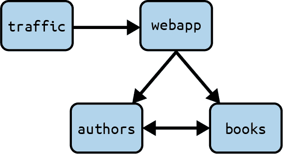
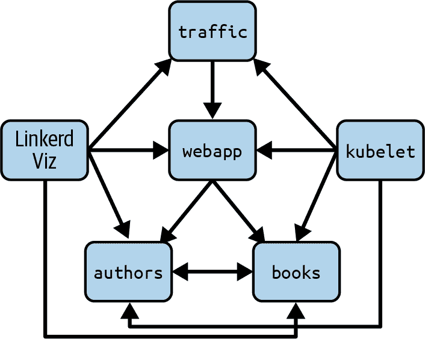
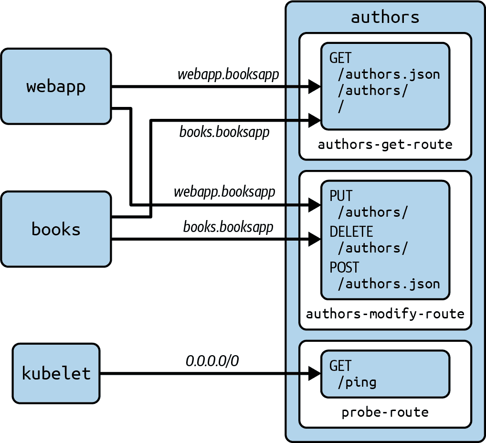

# 第九章：Linkerd 基于路由的策略

在 第八章 中，我们讨论了实施基于 Linkerd 服务器的策略以增强 emojivoto 应用程序的安全性。该策略确保 Linkerd 有效地保护应用程序的工作负载，防止未经授权的工作负载发出请求。然而，如果我们希望更进一步呢？例如，考虑一个敏感应用程序的情况。您需要确保只有特定的 ServiceAccounts 被允许进行更改，并且只有特定的其他人员可以访问读取。

这就是 Linkerd 路由策略机制的作用所在。在本章中，我们将更详细地探讨路由策略的功能和使用方法。

# 基于路由的策略概述

基于路由的策略为 Linkerd 提供了一种方式来表达策略，这不仅依赖于参与的工作负载，还依赖于正在进行的特定请求。这些特定的 HTTP 请求通过使用 Gateway API HTTPRoute 资源来指定对 HTTP 路径、方法、头部等的匹配来识别。几乎可以使用任何内容，除了请求体。请求仍然使用 mTLS 身份进行验证。

Gateway API HTTPRoute 资源的工作原理是将一个或多个*父资源*与一个或多个*规则*关联起来。当使用 Gateway API 进行入口控制时，HTTPRoute 的父资源将是 Gateway 资源；然而，当使用 Gateway API 配置服务网格时，这样做并没有太多意义。在使用 Linkerd 时，将父资源指定为服务，HTTPRoute 将仅适用于流量被定向到父 Service *并且* 符合 HTTPRoute 指定的规则。

# HTTPRoutes、Gateway API 和你

Linkerd 2.13 支持 HTTPRoute 对象，但实际上使用的是 `policy.linkerd.io/v1` API 组中的副本，而不是官方的 `gateway.networking.k8s.io/v1beta1` HTTPRoute。这样可以避开与 Gateway API 一致性相关的问题。

在 Linkerd 2.13 发布时，服务网格无法符合 Gateway API 标准。到了 Linkerd 2.14，Gateway API 定义了 `Mesh` *一致性配置文件*，指定了服务网格符合 Gateway API 的含义。Linkerd 2.14 及更高版本符合 `Mesh` 配置文件，并支持 `gateway.networking.k8s.io/v1beta1` HTTPRoute（以及 Linkerd 2.13 支持的旧副本）。最终结果是一些依赖于 HTTPRoute 对象的工具与 Linkerd 2.13 不完全兼容，但与 Linkerd 2.14 及更高版本兼容性更好。

（如果您想了解更多相关内容，请查看 [Gateway API 介绍](https://oreil.ly/n0mtd) 并阅读关于 Gateway API 和 GAMMA 计划的信息。）

基于路由的策略是 Linkerd 中最详细和最精细的策略级别，使用它需要大量规划和大量的 YAML。当您准备以这种程度保护您的环境时，您需要意识到在工程时间和精力方面的成本。我们还 *强烈* 建议，在构建任何类型的策略时使用多个环境——至少一个用于构建和测试策略，另一个用于执行策略。理想情况下，您将把策略的创建、审计和推广整合到您的标准应用程序开发生命周期中。

# booksapp 示例应用程序

我们将使用 [booksapp 示例应用程序](https://oreil.ly/qf8il) 来展示如何使用基于路由的策略来限制调用，不仅基于工作负载，还基于特定的端点访问。

如 图 9-1 所示，该应用程序与 emojivoto 非常相似。



###### 图 9-1\. booksapp 应用程序间连接

在 booksapp 中，我们的两个后端服务（`books` 和 `authors`）需要互相通信，但它们不应该有无限制的访问权限。例如，`authors` 工作负载应该能够从 `books` 工作负载读取，以便显示每个作者写过的书籍。`authors` 的用户界面还允许您为当前查看的作者添加新书籍，因此 `authors` 需要能够向 `books` POST 新书籍。但它不能修改或删除书籍。

最终，我们希望只允许以下请求，不允许其他请求：

+   基础设施:

    +   `kubelet` 需要能够运行所有工作负载的健康检查。

    +   Linkerd Viz 需要能够从所有工作负载中提取指标。

+   核心应用功能：

    +   `webapp` 需要能够读取、创建、删除和更新 `authors` 和 `books`。

    +   `authors` 需要能够读取和创建 `books`。

    +   `books` 需要能够读取和创建 `authors`。

+   流量生成器：

    +   `traffic` 需要完全访问 `webapp`。

这可以在 图 9-2 中看到。



###### 图 9-2\. booksapp 应用程序策略概述

## 安装 booksapp

设置非常简单。我们将拉取最新版本的 booksapp 应用程序，添加 Linkerd 代理，并将其应用到我们的集群中，如示例 9-1 所示。

##### 示例 9-1\. 设置

```
# Install booksapp...
$ kubectl create ns booksapp && \
  curl --proto '=https' --tlsv1.2 -sSfL https://run.linkerd.io/booksapp.yml \
  | linkerd inject - \
  | kubectl -n booksapp apply -f -

# Wait for Pods to be running...
$ kubectl rollout status -n booksapp deploy

# ...then test using a port forward.
$ kubectl -n booksapp port-forward svc/webapp 8080:80

# Now browse to localhost:8080.
```

# 配置 booksapp 策略

目前为止，booksapp 没有任何限制：所有内容可以互相访问。这通常是开始使用策略时最简单的地方；一旦确认应用程序运行正常，就可以开始加强安全性。

我们将逐步处理我们的 booksapp 策略：

1.  在开始阶段，我们将处理低级基础设施，切换到默认拒绝并仍然允许 Linkerd Viz 工作。我们将使用基于服务器的策略；它不需要路由策略的精细度，因此我们将避免复杂性。

1.  接下来我们将配置最小的基于路由的策略，以允许对应用程序进行只读访问。

1.  然后我们将允许对`authors`工作负载和`books`工作负载进行写入。

1.  最后，我们将允许流量生成器访问`webapp`。

按此顺序操作的好处是，它应该能够快速使至少部分应用程序运行，并且我们可以进行增量测试。在进行复杂配置时，这通常是一个很好的想法，并且（正如我们之前所说）基于路由的策略非常复杂。

## 基础设施策略

第一步是基础设施策略。我们将使用基于服务器的策略将`booksapp`命名空间切换为默认拒绝。这将要求我们显式允许 Linkerd Viz 继续工作。所有这些都在示例 9-2 中显示。

##### 示例 9-2\. books-infra-policy.yaml

```
# Create books-infra-policy.yaml.
$ cat <<EOF > books-infra-policy.yaml
---
apiVersion: policy.linkerd.io/v1beta1
kind: Server
metadata:
 namespace: booksapp
 name: linkerd-admin
spec:
 podSelector:
 matchLabels: {}
 port: linkerd-admin
 proxyProtocol: HTTP/2
---
apiVersion: policy.linkerd.io/v1alpha1
kind: AuthorizationPolicy
metadata:
 name: allow-viz
 namespace: booksapp
spec:
 targetRef:
 kind: Namespace
 name: booksapp
 requiredAuthenticationRefs:
 - name: linkerd-viz
 kind: MeshTLSAuthentication
 group: policy.linkerd.io
---
apiVersion: policy.linkerd.io/v1alpha1
kind: MeshTLSAuthentication
metadata:
 name: linkerd-viz
 namespace: booksapp
spec:
 identities:
 - "tap.linkerd-viz.serviceaccount.identity.linkerd.cluster.local"
 - "prometheus.linkerd-viz.serviceaccount.identity.linkerd.cluster.local"
EOF
```

这类似于我们在第八章中允许 Linkerd Viz 所做的操作。让我们继续应用基础设施策略 YAML，然后将`booksapp`命名空间切换为默认拒绝，如示例 9-3 中所示。

##### 示例 9-3\. 设置基础设施策略

```
# Apply the YAML we just created...
$ kubectl apply -f books-infra-policy.yaml

# Switch `booksapp` to default deny...
$ kubectl annotate namespace booksapp config.linkerd.io/default-inbound-policy=deny

# ...and finally, restart the booksapp workloads.
$ kubectl rollout restart deployment -n booksapp
```

# 健康检查呢？

敏锐的观察者将注意到，尽管我们的 Pod 配置了就绪和活动探测，它们仍在启动并保持就绪，即使我们还没有为`kubelet`授权探测我们的 Pod。这是因为 Linkerd 默认会寻找您的应用程序的活动状态和就绪探测，并创建一个默认的 HTTPRoute 来允许该流量，但只要您没有自己创建 HTTPRoutes。

一旦开始为您的应用程序创建自己的 HTTPRoutes，Linkerd 将删除其默认路由，这意味着您需要确保为活动状态和就绪探测创建路由。

此时，由于将`booksapp`命名空间切换为默认拒绝，并且仅授权了 Viz，我们的应用程序将完全无法工作。让我们继续使我们的应用程序运行起来。

## 只读访问

接下来我们将使用基于路由的策略来允许对应用程序进行只读访问。我们可以使用 Web 浏览器查找书籍和作者，但无法更改任何内容。

从现在开始，我们所做的一切只是应用 YAML，因此我们将展示您需要应用的 YAML。我们将从内部向外做这些事情，所以我们的第一步是允许`books`工作负载从`authors`工作负载获取`/authors.json`和`/authors/`，这需要四个资源。

首先，我们需要在`books`命名空间中为`authors`工作负载定义一个服务器，如示例 9-4 所示。这将允许我们使用 HTTPRoute 来配置对发送到`authors`工作负载的特定请求的策略。

##### 示例 9-4\. `authors` 服务器

```
---
apiVersion: policy.linkerd.io/v1beta1
kind: Server
metadata:
  namespace: booksapp
  name: authors
  labels:
    app: authors
    app.kubernetes.io/part-of: booksapp
    project: booksapp
spec:
  podSelector:
    matchLabels:
      app: authors
      project: booksapp
  port: service
  proxyProtocol: HTTP/1
```

接下来，我们将创建一个 HTTPRoute，指定我们想要允许的两个请求，如 9-5 所示。

##### Example 9-5\. `authors` HTTPRoute

```
---
apiVersion: policy.linkerd.io/v1beta1
kind: HTTPRoute
metadata:
  name: authors-get-route
  namespace: booksapp
  labels:
    app.kubernetes.io/part-of: booksapp
    project: booksapp
spec:
  parentRefs:
    - name: authors
      kind: Server
      group: policy.linkerd.io
  rules:
    - matches:
      - path:
          value: "/authors.json"
        method: GET
      - path:
          value: "/authors/"
          type: "PathPrefix"
        method: GET
```

# 哪个 HTTPRoute？

我们已经使用了 `policy.linkerd.io` HTTPRoutes 来适应使用较旧版本 Linkerd 的读者。但是，如果您使用的是 Linkerd 2.14 或更新版本，可以切换到 `gateway.network⁠ing.k8s.io/v1beta1` HTTPRoutes！

最后，我们可以指定一个 AuthorizationPolicy/MeshTLSAuthentication 对，其中 AuthorizationPolicy 的 `targetRef` 是我们刚刚定义的 HTTPRoute，以定义哪些身份可以使用这个 HTTPRoute，如 9-6 所示。

##### Example 9-6\. `authors` AuthorizationPolicy 和 MeshTLSAuthentication

```
---
apiVersion: policy.linkerd.io/v1alpha1
kind: AuthorizationPolicy
metadata:
  name: allow-books-to-authors
  namespace: booksapp
  labels:
    app.kubernetes.io/part-of: booksapp
    project: booksapp
spec:
  targetRef:
    group: policy.linkerd.io
    kind: HTTPRoute
    name: authors-get-route
  requiredAuthenticationRefs:
    - name: books
      kind: MeshTLSAuthentication
      group: policy.linkerd.io
---
apiVersion: policy.linkerd.io/v1alpha1
kind: MeshTLSAuthentication
metadata:
  name: books
  namespace: booksapp
spec:
  identities:
    - "books.booksapp.serviceaccount.identity.linkerd.cluster.local"
```

一旦应用了这些资源，`books` 工作负载将能够与 `authors` 工作负载通信。然而，正如我们之前指出的那样，我们刚刚破坏了 `authors` 工作负载的健康检查。当我们将我们的 HTTPRoute 附加到 `authors` 服务器后，Linkerd 生成的探针路由就消失了。

为了允许这些探针请求，我们将使用一个单独的 HTTPRoute，这将允许我们使用 NetworkAuthorization 允许来自集群任何地方的未认证探针请求。我们绝对不希望允许任何其他请求使用该 NetworkAuthorization，所以我们确实需要一个单独的 HTTPRoute 用于探针！如 9-7 所示。

##### Example 9-7\. 重新允许 `authors` 健康探针

```
---
apiVersion: policy.linkerd.io/v1beta1
kind: HTTPRoute
metadata:
  name: books-probes
  namespace: booksapp
spec:
  parentRefs:
    - name: authors
      kind: Server
      group: policy.linkerd.io
  rules:
    - matches:
      - path:
          value: "/ping"
        method: GET
---
apiVersion: policy.linkerd.io/v1alpha1
kind: AuthorizationPolicy
metadata:
  name: authors-probe
  namespace: booksapp
spec:
  targetRef:
    group: policy.linkerd.io
    kind: HTTPRoute
    name: books-probes
  requiredAuthenticationRefs:
    - name: probe-authn
      kind: NetworkAuthentication
      group: policy.linkerd.io
---
apiVersion: policy.linkerd.io/v1alpha1
kind: NetworkAuthentication
metadata:
  name: probe-authn
  namespace: booksapp
spec:
  networks:
  - cidr: 0.0.0.0/0
  - cidr: ::/0
```

# CIDR 是什么？

`probe-authn` NetworkAuthorization 的范围过于广泛；它真的应该仅限于您集群的 Pod CIDR 范围。我们无法预测这一点，所以您可以随意将 `probe-authn` NetworkAuthentication 资源中的 CIDR 范围替换为您集群的适当值。

现在，`books` 工作负载应能够从 `authors` 工作负载读取，并且对 `authors` 工作负载的探针也应该工作正常。现在我们需要重复这一切，以允许 `authors` 工作负载与 `books` 通信，如示例 9-8 所示。

##### Example 9-8\. 允许 `authors` 从 `books` 读取

```
---
apiVersion: policy.linkerd.io/v1beta1
kind: Server
metadata:
  namespace: booksapp
  name: books
  labels:
    app: books
    app.kubernetes.io/part-of: booksapp
    project: booksapp
spec:
  podSelector:
    matchLabels:
      app: books
      project: booksapp
  port: service
  proxyProtocol: HTTP/1
---
apiVersion: policy.linkerd.io/v1beta1
kind: HTTPRoute
metadata:
  name: books-get-route
  namespace: booksapp
  labels:
    app.kubernetes.io/part-of: booksapp
    project: booksapp
spec:
  parentRefs:
    - name: books
      kind: Server
      group: policy.linkerd.io
  rules:
    - matches:
      - path:
          value: "/books.json"
        method: GET
      - path:
          value: "/books/"
          type: "PathPrefix"
        method: GET
---
apiVersion: policy.linkerd.io/v1alpha1
kind: AuthorizationPolicy
metadata:
  name: allow-authors-to-books
  namespace: booksapp
  labels:
    app.kubernetes.io/part-of: booksapp
    project: booksapp
spec:
  targetRef:
    group: policy.linkerd.io
    kind: HTTPRoute
    name: books-get-route
  requiredAuthenticationRefs:
    - name: authors
      kind: MeshTLSAuthentication
      group: policy.linkerd.io
---
apiVersion: policy.linkerd.io/v1alpha1
kind: MeshTLSAuthentication
metadata:
  name: authors
  namespace: booksapp
spec:
  identities:
    - "authors.booksapp.serviceaccount.identity.linkerd.cluster.local"
---
apiVersion: policy.linkerd.io/v1beta1
kind: HTTPRoute
metadata:
  name: authors-probes
  namespace: booksapp
spec:
  parentRefs:
    - name: authors
      kind: Server
      group: policy.linkerd.io
  rules:
    - matches:
      - path:
          value: "/ping"
        method: GET
---
apiVersion: policy.linkerd.io/v1alpha1
kind: AuthorizationPolicy
metadata:
  name: authors-probe
  namespace: booksapp
spec:
  targetRef:
    group: policy.linkerd.io
    kind: HTTPRoute
    name: authors-probes
  requiredAuthenticationRefs:
    - name: probe-authn
      kind: NetworkAuthentication
      group: policy.linkerd.io
```

最后，我们需要允许 `webapp` 与 `authors` 和 `books` 进行通信。我们可以在这里使用我们现有的 HTTPRoutes，而且我们不需要另一个服务器。我们需要做的只是添加新的 AuthorizationPolicy 和 MeshTLSAuthentication 资源，如 9-9 所示。

# 身份包含什么？

我们也可以通过向现有的 `authors` 和 `books` MeshTLSAuthentications 添加另一个身份来实现这一点。但是，基于路由的策略提供的细粒度是其优势的一个主要点，使用单独的 AuthorizationPolicy 和 MeshTLSAu⁠thentication 有助于保持这种优势。

##### Example 9-9\. 允许 Web 访问

```
---
apiVersion: policy.linkerd.io/v1alpha1
kind: AuthorizationPolicy
metadata:
  name: allow-webapp-to-books
  namespace: booksapp
  labels:
    app.kubernetes.io/part-of: booksapp
    project: booksapp
spec:
  targetRef:
    group: policy.linkerd.io
    kind: HTTPRoute
    name: authors-get-route
  requiredAuthenticationRefs:
    - name: webapp
      kind: MeshTLSAuthentication
      group: policy.linkerd.io
---
apiVersion: policy.linkerd.io/v1alpha1
kind: AuthorizationPolicy
metadata:
  name: allow-webapp-to-authors
  namespace: booksapp
  labels:
    app.kubernetes.io/part-of: booksapp
    project: booksapp
spec:
  targetRef:
    group: policy.linkerd.io
    kind: HTTPRoute
    name: authors-get-route
  requiredAuthenticationRefs:
    - name: webapp
      kind: MeshTLSAuthentication
      group: policy.linkerd.io
---
apiVersion: policy.linkerd.io/v1alpha1
kind: MeshTLSAuthentication
metadata:
  name: webapp
  namespace: booksapp
spec:
  identities:
    - "webapp.booksapp.serviceaccount.identity.linkerd.cluster.local"
```

此时，我们应该能够使用 Web 浏览器查看 booksapp GUI，并且应该能够阅读一切，但不能修改任何内容。

## 启用写访问

booksapp 应用程序应允许更新书籍和作者，因此我们的下一个任务将是允许对 `authors` 工作负载进行写入。完成后，我们将能够对作者进行更改（包括更新、添加和删除），但仍然无法更改任何书籍。

booksapp 的构建方式是，`webapp` 和 `books` 都需要能够对 `authors` 进行写入。我们将从创建一个 HTTPRoute 开始，如 示例 9-10 中所示，描述我们要允许的修改请求类型。

##### 示例 9-10\. 对 `authors` 的修改请求

```
---
apiVersion: policy.linkerd.io/v1beta1
kind: HTTPRoute
metadata:
  name: authors-modify-route
  namespace: booksapp
spec:
  parentRefs:
    - name: authors
      kind: Server
      group: policy.linkerd.io
  rules:
    - matches:
      - path:
          value: "/authors/"
          type: "PathPrefix"
        method: DELETE
      - path:
          value: "/authors/"
          type: "PathPrefix"
        method: PUT
      - path:
          value: "/authors.json"
        method: POST
      - path:
          value: "/"
---
```

这个 HTTPRoute 附加到我们现有的 `authors` 服务器，因为它描述了对 `authors` 工作负载发出的请求。鉴于这个 HTTPRoute，我们希望允许 `books` 和 `webapp` 都发出这些请求，如 示例 9-11 中所示。

##### 示例 9-11\. 允许修改

```
---
apiVersion: policy.linkerd.io/v1alpha1
kind: AuthorizationPolicy
metadata:
  name: authors-modify-policy
  namespace: booksapp
spec:
  targetRef:
    group: policy.linkerd.io
    kind: HTTPRoute
    name: authors-modify-route
  requiredAuthenticationRefs:
    - name: webapp-books
      kind: MeshTLSAuthentication
      group: policy.linkerd.io
---
apiVersion: policy.linkerd.io/v1alpha1
kind: MeshTLSAuthentication
metadata:
  name: webapp-books
  namespace: booksapp
spec:
  identities:
    - "webapp.booksapp.serviceaccount.identity.linkerd.cluster.local"
    - "books.booksapp.serviceaccount.identity.linkerd.cluster.local"
```

在这里，我们使用了在同一个 MeshTLSAu⁠thentication 中列出多个身份的技术，因为在这个示例中，`webapp` 和 `books` 需要*完全相同*的权限。

完成所有这些后，我们有了在 图 9-3 中显示的策略设置。



###### 图 9-3\. 设置了 `authors` 策略后的 `books`

## 允许对书籍进行写入

我们将通过允许对 `books` 工作负载进行写入来完成 booksapp 的功能，如 示例 9-12 中所示。这与允许对 `authors` 进行写入完全相同，最终将允许 booksapp 完全运行。

##### 示例 9-12\. 对 `books` 的修改请求

```
---
apiVersion: policy.linkerd.io/v1beta1
kind: HTTPRoute
metadata:
  name: books-modify-route
  namespace: booksapp
spec:
  parentRefs:
    - name: books
      kind: Server
      group: policy.linkerd.io
  rules:
    - matches:
      - path:
          value: "/books/"
          type: "PathPrefix"
        method: DELETE
      - path:
          value: "/books/"
          type: "PathPrefix"
        method: PUT
      - path:
          value: "/books.json"
        method: POST
      - path:
          value: "/"
---
apiVersion: policy.linkerd.io/v1alpha1
kind: AuthorizationPolicy
metadata:
  name: books-modify-policy
  namespace: booksapp
spec:
  targetRef:
    group: policy.linkerd.io
    kind: HTTPRoute
    name: books-modify-route
  requiredAuthenticationRefs:
    - name: webapp-authors
      kind: MeshTLSAuthentication
      group: policy.linkerd.io
---
apiVersion: policy.linkerd.io/v1alpha1
kind: MeshTLSAuthentication
metadata:
  name: webapp-authors
  namespace: booksapp
spec:
  identities:
    - "webapp.booksapp.serviceaccount.identity.linkerd.cluster.local"
    - "authors.booksapp.serviceaccount.identity.linkerd.cluster.local"
```

## 重新启用流量生成器

最后，我们将为 `traffic` 工作负载添加权限，该工作负载始终生成一些负载，以访问 `webapp` 工作负载。booksapp 应用程序实际上不需要流量生成器，但对于调试和演示非常有用！所以让我们再次运行它。

我们将从 `webapp` 的服务器开始（这是我们以前不需要的），以便我们可以编写允许请求的策略。这在 示例 9-13 中显示。

##### 示例 9-13\. 为 `webapp` 创建服务器

```
---
apiVersion: policy.linkerd.io/v1beta1
kind: Server
metadata:
  namespace: booksapp
  name: webapp-server
  labels:
    app: webapp
    app.kubernetes.io/part-of: booksapp
    project: booksapp
spec:
  podSelector:
    matchLabels:
      app: webapp
      project: booksapp
  port: service
  proxyProtocol: HTTP/1
```

有了这个服务器，允许 `traffic` 访问它就很简单了。我们将采取懒惰的方式，在这里编写基于服务器的策略，如 示例 9-14 中所示，因为我们确实希望 `traffic` 能够基本上做任何事情。

##### 示例 9-14\. 允许流量生成器

```
---
apiVersion: policy.linkerd.io/v1alpha1
kind: AuthorizationPolicy
metadata:
  name: allow-traffic
  namespace: booksapp
  labels:
    app.kubernetes.io/part-of: booksapp
    project: booksapp
spec:
  targetRef:
    group: policy.linkerd.io
    kind: Server
    name: webapp
  requiredAuthenticationRefs:
    - name: traffic
      kind: MeshTLSAuthentication
      group: policy.linkerd.io
---
apiVersion: policy.linkerd.io/v1alpha1
kind: MeshTLSAuthentication
metadata:
  name: traffic
  namespace: booksapp
spec:
  identities:
    - "traffic.booksapp.serviceaccount.identity.linkerd.cluster.local"
```

# 摘要

Linkerd 的基于路由的策略机制是 Linkerd 中最复杂的部分，因此实际上有许多强大的工具，无论是开源还是商业，都可以用来创建和调试 Linkerd 中的策略。Linkerd Viz 的 Tap 组件在这里是最简单、最常用的工具；同样，我们在 第六章 中讨论过的 `linkerd diagnostics` 命令也有很多优点。在商业领域，如果不提及 Buoyant Enterprise 为 Linkerd 提供的策略工具，我们就不全面了。

总体而言，在 Linkerd 中，策略是管理集群中流量的一种强大且可扩展的工具，特别是基于路由的策略不仅是一个非常强大的机制，而且是一个非常专注的工具。这是进一步优化使用服务器端机制建立的策略的绝佳方式。
