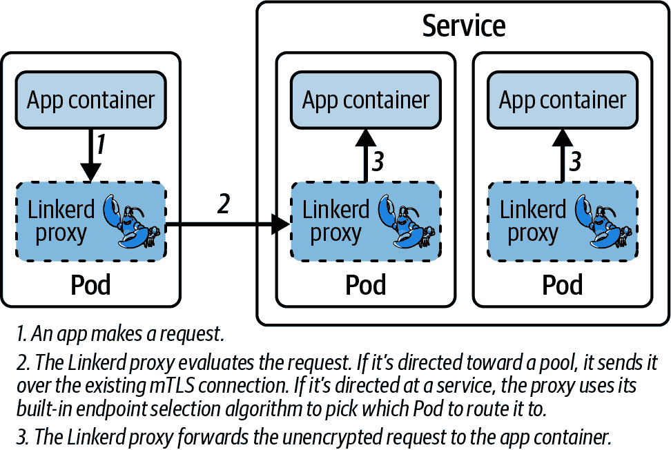
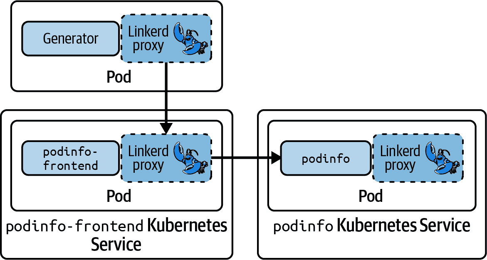
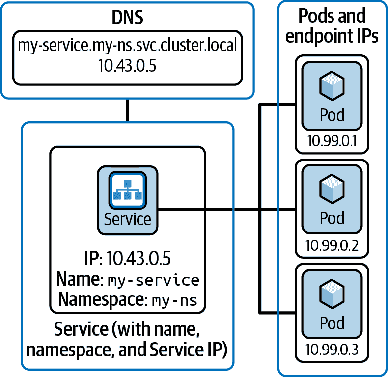

# 第十一章：通过 Linkerd 确保可靠性

正如从一开始讨论的那样，在第一章中，微服务应用程序对于其所有通信完全依赖于网络。网络比进程内通信更慢且不太可靠，这引入了新的故障模式，并向我们的应用程序提出了新的挑战。

对于服务网格用户，其中网格中介所有应用程序流量，可靠性的好处在于网格可以在发生故障时做出智能选择。在本章中，我们将讨论 Linkerd 提供的机制，以减轻网络不可靠性问题，帮助解决微服务应用程序固有的不稳定性。

# 负载均衡

负载均衡可能看起来像一个奇怪的可靠性特性，因为许多人认为 Kubernetes 已经处理了它。正如我们在第五章中首次讨论的那样，Kubernetes 服务在服务的 IP 地址和与服务关联的 Pod 的 IP 地址之间进行区分。当流量发送到 ClusterIP 时，它最终会被重定向到其中一个端点 IP。

然而，在 Kubernetes 中，内置的负载均衡仅限于整个连接。Linkerd 通过使用理解连接所涉及协议的代理来改进这一点，为每个请求选择端点，如图 11-1 所示。



###### 图 11-1。Linkerd 中的服务发现

正如您可以从图 11-1 看到的那样，Linkerd 将使用给定请求的目标地址，并根据它所引用的对象类型调整其端点选择算法以选择目标。

# 请求级负载均衡

这种连接级负载均衡与请求级负载均衡之间的区别比起初看起来更为重要。在底层，Linkerd 实际上维护了您的工作负载之间的连接池，让它能够快速分派请求到它认为合适的工作负载，而无需连接开销，从而负载均衡各个请求，使负载均匀高效地分布。

您可以在[Kubernetes 博客](https://oreil.ly/FMALe)了解有关 Kubernetes 连接级负载均衡的更多信息。

Linkerd 控制平面中恰如其名的目标控制器使所有这些成为可能。对于网格中的每个服务，它维护服务当前端点列表以及它们的健康和相对性能。Linkerd 代理使用这些信息来智能决策何时以及如何发送给定的请求。

# 重试

有时，由于网络问题或间歇性应用程序故障，请求可能会失败。在这种情况下，Linkerd 代理可以为您*重试*请求，自动重复以给工作负载另一次处理成功的机会。当然，并非每个请求都可以安全地重试，因此只有在为特定路由显式配置了重试时，Linkerd 代理才会执行自动重试，并且只有在确定安全时才应配置重试。

# 不要盲目重试！

在为特定请求启用重试之前，请三思！并非所有请求都可以安全地重试 —— 比如一个从账户中取款的请求，在请求成功但响应丢失或提款服务在转移资金后崩溃之前无法发送响应的场景中，是不应该重试的。

## 重试预算

许多服务网格和 API 网关使用*计数重试*，您在此定义请求在返回给调用者之前可以重试的最大次数。相比之下，Linkerd 使用*预算重试*，重试持续进行直到重试与原始请求的比率超出预算为止。

默认情况下，预算为 20%，每秒额外增加 10 次“免费”重试，平均分布在 10 秒内。例如，如果您的工作负载每秒处理 100 个请求（RPS），那么 Linkerd 将允许每秒添加 30 次额外重试（100 的 20%为 20，再加上额外的 10 次）。

# 预算重试与计数重试

Linkerd 使用预算重试，因为它们通常能让您更直接地控制真正关心的事情：重试将为系统增加多少额外负载？通常情况下，选择特定数量的重试并不能真正帮助控制负载：如果每秒处理 10 个请求并允许 3 次重试，则负载达到 40 RPS；但如果每秒处理 100 个请求并允许 3 次重试，则可能达到*400* RPS。预算重试可以更直接地控制额外负载，同时倾向于避免在高负载下可能发生的重试风暴（其中大量重试本身可能会导致 Pod 崩溃，进而引发更多的重试……）。

## 配置重试

用`linkerd viz`分析从`books`到`authors`的流量需要花一分钟：

```
$ linkerd viz -n booksapp routes deploy/books --to svc/authors
```

你会发现`books`工作负载仅向`authors`服务的一个单一路由发送请求：`HEAD /authors/{id}.json`。这些请求失败率达到一半，非常适合重试 — `HEAD`请求始终是幂等的（即可以重复执行而不会改变结果），因此我们可以安全地在该路由上启用重试。

在 Linkerd 中，我们通过 ServiceProfile 资源来控制重试行为。在本例中，我们将使用`authors`服务的 ServiceProfile，因为我们将在与`authors`工作负载交流时启用重试。

# 重试、ServiceProfiles、HTTPRoutes 和 Linkerd

正如前面提到的，Linkerd 项目正在全面采用[Gateway API](https://oreil.ly/a-Xug)，这意味着很快你将看到一些 Linkerd 自定义资源，包括 ServiceProfile，开始被弃用。

在 Linkerd 2.13 和 2.14 中，ServiceProfile 和 HTTPRoute 经常具有互斥功能，因此在开始为您的应用程序构建重试时，审查 [重试和超时文档](https://oreil.ly/1EPEX) 尤为重要。

从使用 `kubectl get` 查看现有的 ServiceProfile 开始：

```
$ kubectl get serviceprofile -n booksapp \
    authors.booksapp.svc.cluster.local
```

此 ServiceProfile 应该与 Example 11-1 中的一个非常相似。

##### 示例 11-1\. `authors` ServiceProfile

```
apiVersion: linkerd.io/v1alpha2
kind: ServiceProfile
metadata:
  name: authors.booksapp.svc.cluster.local
  namespace: booksapp
spec:
  routes:
  - condition:
      method: GET
      pathRegex: /authors\.json
    name: GET /authors.json
  - condition:
      method: POST
      pathRegex: /authors\.json
    name: POST /authors.json
  - condition:
      method: DELETE
      pathRegex: /authors/[^/]*\.json
    name: DELETE /authors/{id}.json
  - condition:
      method: GET
      pathRegex: /authors/[^/]*\.json
    name: GET /authors/{id}.json
  - condition:
      method: HEAD
      pathRegex: /authors/[^/]*\.json
    name: HEAD /authors/{id}.json
```

您可以看到 ServiceProfile 中列出了五条路由。我们将重点放在最后一条路由上，即 `HEAD /authors/{id}.json`。

我们可以通过在 ServiceProfile 条目中添加 `isRetryable: true` 属性，为每个路由单独配置重试。除此之外，每个 ServiceProfile 对象还可以为 ServiceProfile 中所有路由定义重试预算。

添加此属性的最简单方法是交互式地编辑 ServiceProfile：

```
$ kubectl edit serviceprofiles authors.booksapp.svc.cluster.local -n booksapp
```

使用编辑器修改 ServiceProfile，使 `HEAD /authors/{id}.json` 路由的 `isRetryable` 属性设置为 `true`，如 Example 11-2 所示。

##### 示例 11-2\. 带有重试的 `authors` ServiceProfile

```
apiVersion: linkerd.io/v1alpha2
kind: ServiceProfile
metadata:
  name: authors.booksapp.svc.cluster.local
  namespace: booksapp
spec:
  routes:
  - condition:
      method: GET
      pathRegex: /authors\.json
    name: GET /authors.json
  - condition:
      method: POST
      pathRegex: /authors\.json
    name: POST /authors.json
  - condition:
      method: DELETE
      pathRegex: /authors/[^/]*\.json
    name: DELETE /authors/{id}.json
  - condition:
      method: GET
      pathRegex: /authors/[^/]*\.json
    name: GET /authors/{id}.json
  - condition:
      method: HEAD
      pathRegex: /authors/[^/]*\.json
    name: HEAD /authors/{id}.json
    isRetryable: true
```

保存您对 `authors` ServiceProfile 的更改，并再次使用 `linkerd viz routes` 检查路由，如下所示：

```
$ linkerd viz -n booksapp routes deploy/books --to svc/authors -o wide
```

使用 `-o wide` 切换输出格式告诉 `linkerd viz routes` 命令显示有效成功率（重试后）以及实际成功率（不考虑重试之前）。如果在启用重试后重复运行此命令，您将看到有效成功率将随着总体延迟的增加而上升。随着时间的推移，有效成功率应该会达到 100%，尽管实际成功率保持约 50%：`authors` 工作负载仍然在大约一半的时间内失败，尽管重试可以掩盖来自调用者的失败。

# watch 命令

如果您拥有 `watch` 命令，那么现在正是使用它的好时机。它会每两秒重新运行该命令，直到被中断，为您提供一个轻松的方式来查看变化情况。

```
$ watch linkerd viz -n booksapp \
    routes deploy/books --to svc/authors -o wide
```

您还可以看到有效和实际 RPS 之间的差异。有效 RPS 约为 2.2，但实际 RPS 将接近其两倍——这是因为*重试增加了对故障服务的负载*，通过额外的请求来掩盖失败。

# 为什么我们看到两倍的因素？

我们经常引用默认的重试预算为 20%——那么在这种情况下，我们怎么可能看到两倍的流量呢？事实上，我们如何看到 Linkerd 在 *50%* 请求失败时掩盖所有故障？

这两个问题的答案在于默认预算中包含的每秒“免费”10 次请求。由于实际负载远低于 10 次每秒，“免费”的额外 10 次请求足以有效允许重试实际流量的 100%，使得 Linkerd 能够掩盖所有故障……代价是流量翻倍。

这些“免费”的 10 次每秒也意味着，即使在轻度使用的服务中，您也不必担心 Linkerd 的预算会让故障泄漏出来，即使在重度使用的服务上，预算也可以保护您免受重试风暴的影响。

## 配置预算

对许多应用程序来说，Linkerd 的默认预算实际上运作良好，但如果您需要更改它，则需要在您的 ServiceProfile 中编辑`retryBudget`部分，如示例 11-3 所示。

##### 示例 11-3\. 一个重试预算的示例

```
...
spec:
  ...
  # This retryBudget stanza is AN EXAMPLE ONLY
  retryBudget:
    retryRatio: 0.3
    minRetriesPerSecond: 50
    ttl: 60s
  ...
```

在示例 11-3 中显示的`retryBudget`部分将允许在整个一分钟内对原始请求的 30%进行重试，再加上每秒*50*次的“免费”请求，平均计算。

# 不要盲目使用这个预算！

在示例 11-3 中显示的预算*只是一个例子*。请不要假设它对任何实际应用程序有帮助！

# 超时

超时是一种工具，允许我们在给定请求花费过长时间时强制失败。当与重试一起使用时效果尤为显著，因此，如果请求时间过长，它将被重试——但您不必将它们一起使用！有很多情况下，明智地设置超时可以帮助应用程序做出智能决策，提供更好的用户体验。

当配置了超时并且请求时间过长时，Linkerd 代理将返回 HTTP 504 状态码。对于 Linkerd 的可观察性功能来说，超时会被视为任何其他请求失败（包括触发重试，如果启用了重试），并计入给定路由的有效失败率。

## 配置超时

让我们从查看从`webapp`到`books`的请求开始，看看用户请求的平均延迟如何：

```
$ linkerd viz -n booksapp routes deploy/webapp --to svc/books
```

让我们关注`PUT /books/{id}.json`路由。延迟因环境而异，但我们将从示例的延迟 25 毫秒开始；这可能导致大多数环境中触发一些超时。您可以使用结果的成功率来调整集群中的超时时间。

就像重试一样，超时是通过 Linkerd 中的 ServiceProfiles 进行配置的。与重试一样，我们将首先查看现有的配置文件。我们可以使用以下命令获取`books`的 ServiceProfile：

```
$ kubectl get sp/books.booksapp.svc.cluster.local -n booksapp -o yaml
```

这个 ServiceProfile 应该与示例 11-4 中的那个非常相似。

##### 示例 11-4\. `books`的 ServiceProfile

```
apiVersion: linkerd.io/v1alpha2
kind: ServiceProfile
metadata:
  name: books.booksapp.svc.cluster.local
  namespace: booksapp
spec:
  routes:
  - condition:
      method: GET
      pathRegex: /books\.json
    name: GET /books.json
  - condition:
      method: POST
      pathRegex: /books\.json
    name: POST /books.json
  - condition:
      method: DELETE
      pathRegex: /books/[^/]*\.json
    name: DELETE /books/{id}.json
  - condition:
      method: GET
      pathRegex: /books/[^/]*\.json
    name: GET /books/{id}.json
  - condition:
      method: PUT
      pathRegex: /books/[^/]*\.json
    name: PUT /books/{id}.json
```

我们通过将`timeout`属性添加到路由条目来配置超时，将其值设置为可以被 Go 的`time.ParseDuration`解析的时间规范。

# 超时，ServiceProfiles，HTTPRoutes 和 Linkerd

如前所述，Linkerd 项目正在全面采用[Gateway API](https://oreil.ly/6XTtV)，因此一些 Linkerd 自定义资源，包括 ServiceProfile，很快将开始被弃用。

ServiceProfile 和 HTTPRoute 从 Gateway API 1.0.0 开始具有重叠的超时功能，但在撰写本文时尚未得到稳定的 Linkerd 版本的支持。在开始向应用程序添加重试时，重要的是特别审查[重试和超时文档](https://oreil.ly/41V-2)以验证 ServiceProfile 的当前状态。

特别注意的是，HTTPRoute 超时的语法，由[GEP-2257](https://oreil.ly/lxLGa)指定，比 Go 的`time.ParseDu⁠ration`更为严格，后者用于 ServiceProfile 超时。为了将来最大的兼容性，您可能需要考虑更新您的 ServiceProfile 超时以符合 GEP-2257。

向`PUT /books/{id}.json`路由添加超时的最简单方法是通过交互式编辑 ServiceProfile 完成，您可以使用以下命令完成：

```
$ kubectl edit serviceprofiles.linkerd.io \
  books.booksapp.svc.cluster.local -n booksapp
```

您需要将`timeout`元素添加到`PUT /books/{id}.json`路由中，并设置值为`25ms`。示例在 Example 11-5 中展示。

##### 示例 11-5\. 带有超时的`books` ServiceProfile

```
apiVersion: linkerd.io/v1alpha2
kind: ServiceProfile
metadata:
  name: books.booksapp.svc.cluster.local
  namespace: booksapp
spec:
  routes:
  - condition:
      method: GET
      pathRegex: /books\.json
    name: GET /books.json
  - condition:
      method: POST
      pathRegex: /books\.json
    name: POST /books.json
  - condition:
      method: DELETE
      pathRegex: /books/[^/]*\.json
    name: DELETE /books/{id}.json
  - condition:
      method: GET
      pathRegex: /books/[^/]*\.json
    name: GET /books/{id}.json
  - condition:
      method: PUT
      pathRegex: /books/[^/]*\.json
    name: PUT /books/{id}.json
    timeout: 25ms
```

设置了超时后，您将希望观察从`webapp`到`books`服务的流量，以查看超时对服务整体可用性的影响。再次强调，`linkerd viz routes`是最简单的方法之一：

```
$ linkerd viz -n booksapp routes deploy/webapp --to svc/books
```

（如果您愿意，可以使用`-o wide`—这不会直接帮助您观察延迟，但肯定也不会有害。）

超时为确保应用程序整体可用性提供了宝贵的工具。它们允许您控制延迟，并确保应用程序在等待下游服务响应时不会挂起。

# 流量转移

*流量转移* 指的是根据外部条件更改请求的目标。通常这是两个或多个目的地的加权分割（*金丝雀*），或者基于头部匹配、用户名等的分割（*A/B 分割*），尽管还有许多其他类型的分割是可能的。流量转移是渐进式交付的重要组成部分，通过仔细地将流量转移到新版本并验证功能，您可以滚动部署新的应用程序版本。但是，即使不进行渐进式交付，也可以从流量转移中受益。

## 流量转移，Gateway API 和 Linkerd SMI 扩展

从 Linkerd 2.13 开始，Linkerd 原生支持使用 Gateway API HTTPRoute 资源进行流量转移，因此流量转移是我们将使用 Gateway API 资源配置 Linkerd 的第一个领域。

# HTTPRoutes 与 Linkerd SMI

在 Linkerd 2.13 之前的版本中，您仍然可以进行流量转移，但需要使用 Linkerd SMI 扩展（我们在第二章中提到过）。有关 SMI 扩展及其传统的 TrafficSplit 资源的信息，请查阅[Linkerd 官方关于 SMI 的文档](https://oreil.ly/56HlN)。我们建议使用 2.13 及更高版本中的 Gateway API。

当我们探索 Linkerd 中的流量转移时，我们将看到两种基本的方法：基于权重和基于标头。

## 配置您的环境

在这一节中，我们将演示使用一个完全不同的应用程序[Podinfo](https://oreil.ly/1IL4K)来进行流量转移。为了跟随流量转移演示，请您开始一个新的集群；如果您需要任何帮助，请参考第三章中的材料。

一旦您有了新的集群，您可以跟着示例 11-6 开始使用 Podinfo 进行流量转移。

##### 示例 11-6\. 启动 Podinfo

```
# Start in a clean working directory, as we will be cloning the
# linkerd-book/luar Git repository.
$ git clone https://github.com/linkerd-book/luar.git

# First, we'll create our namespace, podinfo, with the
# linkerd.io/inject: enabled annotation set on it. This will
# ensure our Pods get Linkerd proxies attached to them.
$ kubectl apply -f luar/reliability/ns.yaml

# Next, we'll install the podinfo application using Helm.
$ helm repo add podinfo https://stefanprodan.github.io/podinfo
$ helm repo up

# Install 3 versions of podinfo:
# - podinfo is our "version 1" Pod.
# - podinfo-2 is our "version 2" Pod.
# - frontend is a frontend to the whole thing.
$ helm install podinfo \
     --namespace podinfo \
     --set ui.message="hello from v1" \
     podinfo/podinfo

```

```
$ helm install podinfo-2 \
     --namespace podinfo \
     --set ui.message="hello from v2" \
     podinfo/podinfo

$ helm install frontend \
     --namespace podinfo \
     --set backend=http://podinfo:9898/env \
     podinfo/podinfo

# Create a traffic generator for podinfo.
$ kubectl apply -f luar/reliability/generator.yaml

# Check that the applications are ready.
$ linkerd check --proxy -n podinfo

# Verify that both versions of the podinfo workload are running.
$ kubectl get pods -n podinfo

# Verify that each version of podinfo has its own Service.
$ kubectl get svc -n podinfo
```

有了这个，我们的基础演示应用程序已经准备好进行流量分流了。我们应用程序的基本布局如图 11-2 所示。



###### 图 11-2\. Podinfo 应用程序架构

接下来，您可以观察流量如何在您的集群中移动。建议您在一个单独的窗口中运行，就像示例 11-7 中展示的那样，这样您就可以看到随着资源操作的变化。

##### 示例 11-7\. 观察 Podinfo 的流量

```
# If you have the watch command, it works well for this.
$ watch linkerd viz stat deploy -n podinfo

# If you don't have watch, it's simple enough to emulate.
$ while true; do
  clear
  date
  linkerd viz stat deploy -n podinfo
  sleep 2
done
```

这将展示您的集群中的流量路由情况。您应该看到两个 Podinfo 部署，`podinfo` 和 `podinfo-v2`。此刻 `podinfo-v2` 应该接收到的流量非常少，因为我们还没有将任何流量转移到它。

## 基于权重的路由（金丝雀发布）

*基于权重的路由* 是一种根据简单的百分比选择请求目标位置的流量转移方法：一定百分比的可用流量发送到一个目标，剩余的流量发送到另一个目标。基于权重的路由允许我们将一小部分流量转移到服务的新版本，以查看其行为。

在渐进式交付中，这被称为 *金丝雀路由*，得名于煤矿中的“金丝雀”，当空气变坏时会死去，从而提醒矿工。这里的想法是，您可以将一小部分流量转移以测试新版本的工作负载是否会失败或成功，然后再转移更多流量。成功的金丝雀发布会在所有流量都转移完成后结束，并且旧版本可以被废弃。

要启动金丝雀发布，我们需要创建一个 HTTP 路由，如示例 11-8 所示。

# 哪个 HTTP 路由？

我们将使用`policy.linkerd.io` HTTPRoutes 来适应使用旧版 Linkerd 的读者。然而，重要的是要注意，像 Flagger 和 Argo Rollouts *不*支持`policy.linkerd.io`！如果您使用这些工具之一，您需要使用要求 Linkerd 2.14 或更高版本的`gateway.networking.k8s.io` HTTPRoutes。

##### Example 11-8\. [canary HTTPRoute](https://wiki.example.org/canary_http_route)

```
---
apiVersion: policy.linkerd.io/v1beta2
kind: HTTPRoute
metadata:
  name: podinfo-route
  namespace: podinfo
spec:
  parentRefs:
    - name: podinfo
      namespace: podinfo
      kind: Service
      group: core
      port: 9898
  rules:
  - backendRefs:
    - name: podinfo
      namespace: podinfo
      port: 9898
      weight: 5
    - name: podinfo-v2
      namespace: podinfo
      port: 9898
      weight: 5
```

这个 HTTPRoute 将把流量分配到`podinfo`和`podinfo-v2`服务之间。我们为两个服务设置权重为 5，这将导致 50%的流量转移到`podinfo-v2`，而将另外 50%保留在我们原来的`podinfo`。

# 比例才是重要的

权重的绝对值通常不重要 —— 它们不需要加起来等于任何特定的数字。重要的是权重的*比例*，因此使用权重为 5 和 5、100 和 100 或 1 和 1 都会得到 50/50 的分流。

另一方面，权重为 0 明确表示*不*向该后端发送任何流量，所以不要试图使用 0/0 来进行 50/50 的分流。

### 服务对服务：ClusterIPs、端点和 HTTPRoutes

机智的读者会注意到我们在`parentRefs`和`backendRefs`中都使用了`podinfo`两次。这不会导致路由循环吗？我们难道安排流量来到`podinfo`，然后再次定向到`podinfo`，并且永远这样重复，直到最终它最终被转移到`podinfo-v2`吗？

放心，那是不会发生的。如果我们回到图 11-3（#k8s-service-architecture-3）展示的 Kubernetes 服务架构，关键点在于：

+   当一个服务在`parentRefs`中使用时，这意味着 HTTPRoute 将控制定向到该服务的流量。

+   当一个服务在`backendRefs`中使用时，它允许 HTTPRoute 将流量定向到与该服务连接的 Pod。



###### 图 11-3\. Kubernetes 服务的三个独立部分

所以，我们用`podinfo-route`实际上表明 95%的流量将被定向到`podinfo`服务 IP 的`podinfo`*端点*，另外 5%将被定向到`podinfo-v2`*端点*，因此没有环路。这种行为在 GAMMA 倡议的[GEP-1426](https://oreil.ly/uYWpL)中定义。

# 你不能将路由发送到另一个路由

GEP-1426 也阻止 HTTPRoutes 的“堆叠”。假设我们应用了像 Example 11-8 中展示的`podinfo-route`，然后再应用另一个 HTTPRoute（`podinfo-v2-canary`）来尝试将流量分流到`podinfo-v2`。在这种情况下：

+   直接发送到`podinfo-v2`的流量将由`podinfo-v2-canary`进行分流。

+   发送到`podinfo`的流量，然后由`podinfo-route`重定向到`podinfo-v2`的将*不*会分流。

这是因为`podinfo-route`将其流量直接发送到`podinfo-v2`的*端点*。由于该流量绕过了`podinfo-v2`服务 IP，`podinfo-v2-canary`永远没有机会处理它。

将 `podinfo-route` 应用于您的集群，并查看在观察流量的终端窗口中流量如何转移。您将看到每秒约 25 个请求转移到 v2 部署（请记住，`linkerd viz` 观察到的指标需要一些时间才能跟上）。

您可以修改权重并实时查看流量如何变动：只需像这样使用 `kubectl edit`：

```
$ kubectl edit httproute -n podinfo podinfo-route
```

一旦保存了编辑版本，新的权重应立即生效，更改您在观察流量的窗口中看到的内容。

完成后，请继续使用以下命令删除 `podinfo-route` 路由：

```
$ kubectl delete httproute -n podinfo podinfo-route
```

您应该看到所有流量都转移到 `podinfo`，为我们的基于标头的路由实验做准备。

## 基于标头的路由（A/B 测试）

*基于标头的路由* 允许您根据请求中包含的标头做出路由决策。这通常用于 A/B 测试。例如，如果您有两个版本的用户界面，您通常不希望每次用户加载页面时随机选择它们之一。相反，您可以使用某个标头来标识用户，以确定性方式选择 UI 的版本，这样给定用户将始终看到一致的 UI，但不同用户可能会看到不同的 UI。

我们将使用基于标头的路由来允许使用标头选择 `podinfo` 的版本。首先应用一个新的 `podinfo-route` HTTPRoute，如示例 11-9 所示。（再次使用 `policy.linkerd.io` HTTPRoutes；有关此选择的警告，请参阅 “哪个 HTTPRoute？”。）

##### 示例 11-9\. 基于标头的路由

```
apiVersion: policy.linkerd.io/v1beta2
kind: HTTPRoute
metadata:
  name: podinfo-route
  namespace: podinfo
spec:
  parentRefs:
    - name: podinfo
      kind: Service
      group: core
      port: 9898
  rules:
    - matches:
      - headers:
        - name: "x-request-id"
          value: "alternative"
      backendRefs:
        - name: "podinfo-v2"
          port: 9898
    - backendRefs:
      - name: "podinfo"
        port: 9898
```

（如果您刚刚按照权重路由的说明操作，那很好；如果您还没有删除，此 `podinfo-route` 将覆盖该部分的内容。）

此版本具有新的 `matches` 部分，用于标头匹配。我们还将 `podinfo-v2` 的引用从主 `backendRefs` 部分移动到 `matches` 下的新 `backendRefs`。效果是，只有当具有值为 `alternative` 的 `x-request-id` 标头时，流量才会转移到 `podinfo-v2`。

由于我们安装的流量生成器不发送任何带有正确标头的请求，因此当您应用此 HTTPRoute 时，您应立即看到所有流量从 `podinfo-v2` 中消失。我们可以使用 `curl` 发送带有正确标头的流量以路由到 `podinfo-v2`，如 示例 11-10 所示。

##### 示例 11-10\. 使用 `curl` 测试基于标头的路由

```
# Start by forwarding traffic to your frontend service.
$ kubectl port-forward svc/frontend-podinfo 9898:9898 &

# Now send a request to the service and see what message you get back.
# You should see "hello from v1" since this request didn't include the
# header.
$ curl -sX POST localhost:9898/echo \
  | jq -r ".[]" | grep MESSAGE

# Now try again, setting the x-request-id header.
# You should see "hello from v2" since this request does include the
# header.
$ curl -H 'x-request-id: alternative' -sX POST localhost:9898/echo \
  | jq -r ".[]" | grep MESSAGE
```

## 流量转移总结

现在你对如何使用 HTTPRoute 对象在集群中操作流量有了了解。虽然暂时还可以使用 Linkerd SMI 扩展，但我们强烈建议改用 Gateway API —— 如果你正在使用像 Flagger 或 Argo Rollouts 这样的渐进交付工具与 Linkerd 一起使用，使用 Gateway API 可以显著简化与该工具的接口（尽管如前所述，你可能需要使用支持官方 Gateway API 类型的 Linkerd 2.14）。

# 熔断

当你在规模上运行应用程序时，自动隔离和将流量从任何遇到问题的 Pod 中转移可能是有帮助的。Linkerd 倾向于自动路由到表现不佳的 Pod，通过使用指数加权移动平均的延迟来选择接收给定请求的 Pod。通过熔断，你可以明确地让 Linkerd 避免路由到任何遇到问题的 Pod。

## 启用熔断

当你在一个服务上启用熔断时，Linkerd 将有选择地隔离那些经历了多次连续失败的终端点。像所有高级特性一样，请确保在将其应用于你的环境之前阅读[最新的 Linkerd 熔断文档](https://oreil.ly/33gHv)。

我们将演示如何使用 Linkerd 的熔断通过安装一个故意不良的 Pod：

```
$ kubectl apply -f luar/reliability/podinfo-v3.yaml
```

在你监控流量的终端中，现在应该看到三个 `podinfo` 部署正在运行。流量应该大致均匀地分配在 `podinfo` 和 `podinfo-v3` 之间，因为 `podinfo-v3` 被精心设置为与 `podinfo` 同一服务的一部分。

# 看到 podinfo-v2 吗？

如果你看到任何流量进入 `podinfo-v2`，请确保没有任何 HTTPRoutes 仍在通过运行 `kubectl get httproute -n podinfo` 来分流流量。

你还应该注意 `podinfo-v3` 的成功率不到 100%。按照这里展示的方法为 `podinfo` 服务添加一个熔断器应该会改善情况：

```
$ kubectl annotate -n podinfo svc/podinfo \
  balancer.linkerd.io/failure-accrual=consecutive
```

这告诉 Linkerd 在 `podinfo` 服务上应用熔断策略。它会寻找连续的失败并停止路由到任何有问题的 Pod。如果你回看你监控流量的窗口，很快你就会发现 `podinfo-v3` 不再接收太多的流量。

# 为什么使用注释？

Linkerd 的熔断器仍然相对较新，因此目前只能使用注释进行配置。随着开发的进行，请密切关注[最新的 Linkerd 熔断文档](https://oreil.ly/bdiFR)以保持最新！

## 调整熔断

我们可以通过服务上的附加注释进一步调整熔断器：

`balancer.linkerd.io/failure-accrual-consecutive-max-failures`

设置需要在终端点被隔离之前看到的失败次数。默认为`7`。

`balancer.linkerd.io/failure-accrual-consecutive-min-penalty`

设置端点应该被隔离的最短时间。GEP-2257 持续时间，默认为一秒 (`1s`)。

`balancer.linkerd.io/failure-accrual-consecutive-max-penalty`

设置隔离期的上限（端点在网格再次测试之前被隔离的最长时间）。GEP-2257 持续时间，默认为一分钟 (`1m`)。

`balancer.linkerd.io/failure-accrual-consecutive-jitter-ratio`

添加一些随机性到隔离和测试时间框架中。默认为 `0.5`；很少需要调整。

查看流量时，您可能仍然会看到 `podinfo-v3` 显示过多的失败。通过像示例 11-11 所示，使断路器对失败更加敏感，将允许断路器更积极地将 `podinfo-v3` 从使用中移出，这应该有助于改善情况。

##### 示例 11-11\. 调整断路器

```
# First, we'll set the number of failures we need to see to quarantine
# the endpoints. In this case, we'll change it from the default of 7 to 3.
$ kubectl annotate -n podinfo svc/podinfo \
  balancer.linkerd.io/failure-accrual-consecutive-max-failures=3

# Next, we'll change the minimum quarantine time to 30 seconds from 1 second.
$ kubectl annotate -n podinfo svc/podinfo \
  balancer.linkerd.io/failure-accrual-consecutive-min-penalty=30s

# Finally, we change the max penalty time to 2 minutes.
$ kubectl annotate -n podinfo svc/podinfo \
  balancer.linkerd.io/failure-accrual-consecutive-max-penalty=2m
```

有了这个设置，我们应该看到通过到 `podinfo-v3` 的错误大大减少。

# 断路器不会隐藏所有故障

当 Linkerd 检查一个给定的端点是否已恢复时，它通过允许一个实际用户请求通过来进行。如果此请求失败，该故障将一直传递回调用者（除非还启用了重试）。

在我们的示例中，这意味着一个潜在的失败请求每 30 秒就会到达 `podinfo-v3`，以便 Linkerd 检查断路器是否可以被重置。

# 摘要

有了这个设置，我们已经介绍了 Linkerd 如何帮助提升应用程序的可靠性。您可以在网络和 API 的瞬时故障发生时重试，添加请求超时以保持总体可用性，将流量分割到服务的不同版本中以执行更安全的发布，设置断路器来保护服务免受失败 Pod 的影响。有了这些，您就可以很好地运行一个可靠和弹性的平台。
