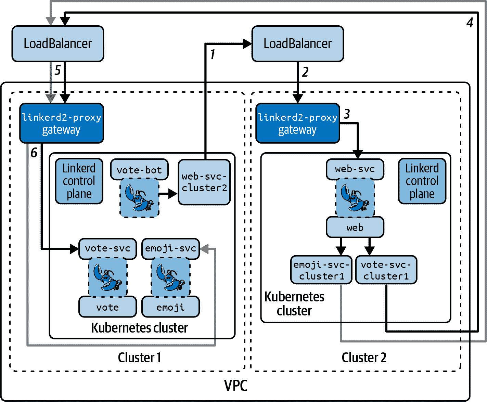
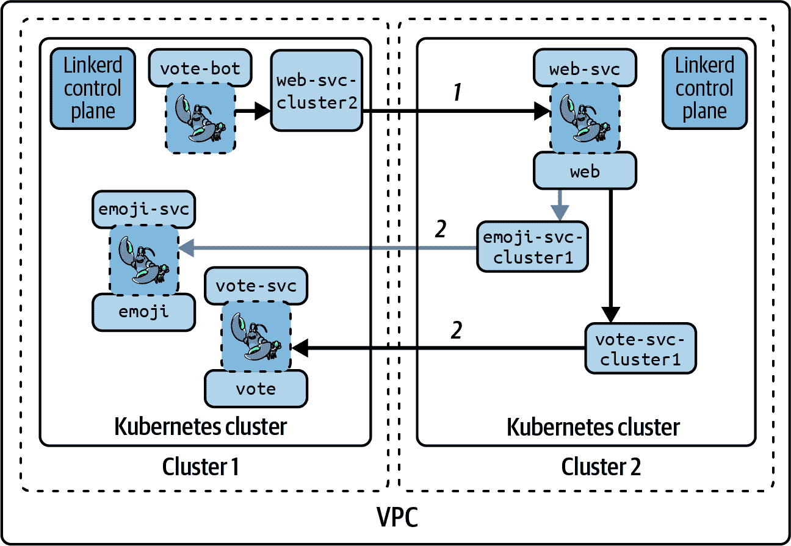

# 第十二章：使用 Linkerd 进行多集群通信

每个 Kubernetes 集群都代表着一个单一的安全和操作故障域。当你考虑扩展你的平台以适应更多团队、更多客户和更多用例时，你将不可避免地遇到一个问题：你希望如何分布你的应用程序？你想要使用大型区域性集群将所有生产应用程序放在一个地方吗？还是想要为每个应用程序或每个团队使用专门构建的集群？大多数团队最终会在中间某个地方，一些集群是共享的，而另一些是为某些应用程序或应用程序类别专门构建的。

Linkerd 的目标是简化运行多个集群时围绕技术实施问题的解决方案。

# 多集群配置类型

Linkerd 支持两种多集群配置风格：*基于网关的多集群* 和 *Pod-to-Pod 多集群*。基于网关的多集群设置更容易部署；Pod-to-Pod 设置提供更高级的功能。你可以根据具体情况选择最合适的方式，并且如果需要的话，甚至可以在同一集群中同时使用两种方式。

## 基于网关的多集群

Linkerd 的基于网关的多集群设置通过 Linkerd 称为网关的特殊工作负载路由集群之间的通信，这些网关可通过 LoadBalancer 服务访问。这意味着基于网关的多集群连接不需要特别复杂的网络配置：基于网关的多集群通信所需的只是集群中的 Pod 能够连接到另一个集群网关的 LoadBalancer，不管连接方式如何。网络也不需要安全：Linkerd 将通过其通常的 mTLS 处理此问题。

图表 12-1 显示了基于网关的多集群架构。



###### 图表 12-1\. 网关多集群架构

图表中的数字显示了当 cluster 1 中的 `vote-bot` 与 cluster 2 中的 `web` 交流时所需的网络跳数，然后再回到 cluster 1 中的 `vote`。 （实际上在 emojivoto 中发生了这种情况。）沿着这条路径，你会看到总共六个跳跃。这有时可能会复杂化事物，因此产生了 Pod-to-Pod 多集群的发展。

## Pod-to-Pod 多集群

相比之下，Pod-to-Pod 多集群配置要求你的 Pod 能够**直接**互相通信，甚至跨集群边界。这可能更具挑战性，因为你的集群供应商需要支持此功能。如果你正在创建自己的裸金属集群，这可能是完全可行的。如果你使用的是云提供商，则取决于提供商。

图表 12-2 显示了 Pod-to-Pod 多集群架构。



###### 图表 12-2\. Pod-to-Pod 多集群架构

沿着从`vote-bot`到`web`再到`vote`的路径，我们只看到两次跳转，与单个集群中看到的相同。

## 网关与 Pod 到 Pod

像计算中的许多事物一样，选择的模式取决于您的情况：

+   基于网关的多集群模式无疑比 Pod 到 Pod 模式更容易设置；Pod 到 Pod 需要更高级的网络支持。

+   Pod 到 Pod 比基于网关的方式稍快，因为没有经过网关的跳转。不过，使用 Linkerd 时这种差异往往可以忽略不计。

+   可能更重要的一个问题是，在基于网关的多集群设置中，来自另一个集群的任何调用都将显示为具有网关的身份，而不是实际的原始工作负载。

+   另一个重要的问题是，在 Pod 到 Pod 模式下，Linkerd 的`destination`服务也需要能够连接到远程 Kubernetes API 服务器。

记住，只要有正确的 IP 连接性，两种模式可以在同一个集群中共存。在处理多集群通信时，您有极大的灵活性。

# 多集群证书

无论您决定使用哪种多集群设置，您的集群信任层级都需要 Linkerd 之间建立多集群连接的共同根。迄今为止，最简单的方法是让它们共享一个共同的信任锚点，如图 12-3 所示。这也意味着，如果您希望集群彼此隔离，它们*绝对不能*共享相同的信任锚点！


###### 图 12-3\. 多集群信任层级

通常，管理这个最简单的方法是每个环境级别（开发、UAT、生产、测试等）拥有一个单一的信任锚点，因此，例如，开发集群可以互相对等，但不能与生产集群对等。同样，每个级别设置 CA 通常也是最简单的方式之一，这样每个 CA 只需关注一种证书类型。

# 不共享身份发行者

即使在多集群设置中，您的集群也不应共享身份发行者证书。保持身份发行者分离对于确保工作负载身份的来源以及简化身份发行者轮换的操作方面都至关重要。

最终，您的环境需求将决定您如何设置证书和 CA。

# 跨集群服务发现

多集群难题的最后一部分是服务发现：一个集群中的工作负载如何知道如何找到其他集群中的工作负载？Linkerd 通过*服务镜像*解决了这个问题，它是 Multicluster 扩展提供的控制平面的一部分。

正如其名称所示，服务镜像安排一个集群中的服务在其他集群中出现。它如何设置镜像服务取决于您使用的多集群配置类型：

基于网关的多集群

连接到镜像服务将被重定向到原始服务前面的网关。然后，网关知道如何将请求传递给真实的 Pod，包括端点选择、策略执行等。

Pod 到 Pod 多集群

连接到镜像服务将直接通过网络转发到另一个 Pod。在与进行连接的工作负载旁边的 Linkerd 代理知道直接可用的端点，因此它处理负载均衡、策略执行等。

服务镜像不会盲目地镜像每个服务；它只会镜像那些带有 `mirror.linkerd.io/exported` 标签的服务。标签的值，再次强调，取决于多集群模式：

`mirror.linkerd.io/exported: true`

适用于基于网关的多集群配置。服务镜像将期望远程集群有一个网关，并将设置镜像服务来使用它。

`mirror.linkerd.io/exported: remote-discovery`

适用于 Pod 到 Pod 多集群配置。服务镜像将设置镜像服务直接转发到原始 Pod。

还值得注意的是，服务镜像需要权限与远程集群的 Kubernetes API 服务器通信。此权限由 Linkerd Link 资源处理，通过 `linkerd multicluster link` CLI 命令创建。

# 链接和 GitOps

链接资源实际上比它们应该的要更加紧急：运行 `linkerd multicluster link` 命令会创建一个凭据密钥、一个链接资源和服务镜像控制器。不幸的是，目前在没有实际运行该命令的情况下复制所有内容非常困难。

有了这些背景知识，我们可以开始设置一个示例多集群架构。

# 设置多集群环境

多集群 Linkerd *始终* 要求您能够在集群之间路由 IP 流量。在某些情况下，它还要求所有集群具有不同且不重叠的集群和服务 CIDR 范围。

显然，确保满足这些要求有点超出了服务网格的范围！但是，在本章中演示多集群设置时，我们将创建两个 k3d 集群，并在执行时确保满足这些要求。我们将在进行 k3d 特定基础设施操作时进行说明。

首先，如 示例 12-1 所示，我们将创建两个连接到同一 Docker 网络的 k3d 集群，并给它们分配独立的集群和服务 CIDR，以便我们可以在基于网关的多集群或 Pod 到 Pod 多集群模式中使用此设置。

这整个区块显然是 k3d 特定的！

##### 示例 12-1\. 创建集群

```
# Create cluster1
$ k3d cluster create cluster1 \
    --servers=1 \
    --network=mc-network \
    --k3s-arg '--disable=traefik@server:*' \
    --k3s-arg '--cluster-cidr=10.23.0.0/16@server:*' \
    --k3s-arg '--service-cidr=10.247.0.0/16@server:*' \
    --wait

# Create cluster2
$ k3d cluster create cluster2 \
    --servers=1 \
    --network=mc-network \
    --k3s-arg '--disable=traefik@server:*' \
    --k3s-arg '--cluster-cidr=10.22.0.0/16@server:*' \
    --k3s-arg '--service-cidr=10.246.0.0/16@server:*' \
    --wait
```

注意，两个集群都被告知使用相同的 Docker 网络 (`--network=mc-network`)，但它们具有独立且不重叠的 CIDR 范围。

我们将继续通过设置集群之间的 IP 路由来进行，如 示例 12-2 所示。这里的 `docker exec` 命令是特定于 k3d 的，但在节点上运行 `ip route add` 命令的思路实际上并非特定于 k3d。

##### 示例 12-2\. 设置 IP 路由

```
# For each cluster, we need its Node IP and Pod CIDR range.
$ cluster1_node_ip=$(kubectl --context k3d-cluster1 get node k3d-cluster1-server-0 \
  -o jsonpath='{.status.addresses[?(.type=="InternalIP")].address}')
$ cluster1_pod_cidr=$(kubectl --context k3d-cluster1 get node k3d-cluster1-server-0 \
  -o jsonpath='{.spec.podCIDR}')

$ cluster2_node_ip=$(kubectl --context k3d-cluster2 get node k3d-cluster2-server-0 \
  -o jsonpath='{.status.addresses[?(.type=="InternalIP")].address}')
$ cluster2_pod_cidr=$(kubectl --context k3d-cluster2 get node k3d-cluster2-server-0 \
  -o jsonpath='{.spec.podCIDR}')

# Once that's done, we'll run `ip route add` on each Node to set up IP
# routing. We only need to do this once per cluster because these are
# single-Node clusters.
$ docker exec -it k3d-cluster1-server-0 \
  ip route add ${cluster2_pod_cidr} via ${cluster2_node_ip}
$ docker exec -it k3d-cluster2-server-0 \
  ip route add ${cluster1_pod_cidr} via ${cluster1_node_ip}
```

一旦我们设置好路由，就可以使用 `step` 创建新的证书，如 示例 12-3 所示。如前所述，无论您使用什么类型的集群，您都需要使用相同的信任锚。

##### 示例 12-3\. 为多集群创建证书

```
# First, create a trust anchor. This will be shared across all clusters.
$ step certificate create root.linkerd.cluster.local ca.crt ca.key \
  --profile root-ca --no-password --insecure

# Next, use the trust anchor to create identity issuer certificates
# (one for each cluster).
$ step certificate create identity.linkerd.cluster.local issuer1.crt issuer1.key \
  --profile intermediate-ca --not-after 8760h --no-password --insecure \
  --ca ca.crt --ca-key ca.key

$ step certificate create identity.linkerd.cluster.local issuer2.crt issuer2.key \
  --profile intermediate-ca --not-after 8760h --no-password --insecure \
  --ca ca.crt --ca-key ca.key
```

最后，考虑到我们的证书，我们可以安装 Linkerd 和 Viz 扩展！这在 示例 12-4 中显示。

# 要注意上下文！

在处理多集群设置时，我们个人犯了比愿意承认的更多错误。尴尬的是，大部分问题是因为我们对错误的集群运行了 `kubectl` 命令，所以请注意那些 `--context` 参数！

或者，为每个集群设置一个窗口并进行工作。如果您有单独的 Kubernetes 配置文件，并且可以根据需要设置 `KUBECONFIG` 变量，那么这种方法效果很好。

##### 示例 12-4\. 安装 Linkerd

```
# Install Linkerd in cluster1...
$ linkerd install --context k3d-cluster1 --crds \
  | kubectl apply --context k3d-cluster1 -f -

$ linkerd install --context k3d-cluster1 \
  --identity-trust-anchors-file ca.crt \
  --identity-issuer-certificate-file issuer1.crt \
  --identity-issuer-key-file issuer1.key \
  | kubectl apply --context k3d-cluster1 -f -

$ linkerd viz install --context k3d-cluster1 |
  kubectl apply --context k3d-cluster1 -f -

$ linkerd check --context k3d-cluster1

# ...then repeat for cluster2.
$ linkerd install --context k3d-cluster2 --crds \
  | kubectl apply --context k3d-cluster2 -f -

$ linkerd install --context k3d-cluster2 \
  --identity-trust-anchors-file ca.crt \
  --identity-issuer-certificate-file issuer2.crt \
  --identity-issuer-key-file issuer2.key \
  | kubectl apply --context k3d-cluster2 -f -

$ linkerd viz install --context k3d-cluster2 |
  kubectl apply --context k3d-cluster2 -f -

$ linkerd check --context k3d-cluster2
```

此时，我们必须决定是否使用基于网关或 Pod 到 Pod 的多集群架构，因为从这一点开始我们的做法会发生变化。

## 继续使用基于网关的设置

如果您想要一个 Pod 到 Pod 的设置，请跳到 “继续使用 Pod 到 Pod 的设置”。

要继续使用基于网关的多集群模式，请按照 示例 12-5 中所示安装 Linkerd Multicluster 扩展。此扩展还随着核心 Linkerd CLI 一起提供，因此您无需安装额外的命令来使用它。这是安装 Linkerd Multicluster 的默认方式，因为基于网关的多集群模式早于 Pod 到 Pod。

##### 示例 12-5\. 使用网关安装 Linkerd Multicluster

```
$ linkerd multicluster install --context k3d-cluster1 |
  kubectl apply --context k3d-cluster1 -f -
$ linkerd multicluster check --context k3d-cluster1

$ linkerd multicluster install --context k3d-cluster2 |
  kubectl apply --context k3d-cluster2 -f -
$ linkerd multicluster check --context k3d-cluster2
```

接下来，我们需要使用网关将我们的集群连接在一起，如 示例 12-6 所示。

# k3d 和 --api-server-address

k3d 集群很奇怪：它们总是创建 Kubernetes 上下文，说 Kubernetes API 服务器在 localhost 上。在同一个 Docker 网络上进行我们的多集群设置时，我们的 `cluster1` 不能使用 localhost 与 `cluster2` 或反之间进行通信。

因此，对于 k3d，我们必须使用 `--api-server-address` 来覆盖地址，使用可路由的 IP 地址用于其他集群。这是特定于 k3d 的。

##### 示例 12-6\. 使用网关连接集群

```
# Link cluster1 to cluster2\. Again, --api-server-address is k3d-specific.
# PAY ATTENTION TO CONTEXTS! We run `linkerd multicluster link` in the
# cluster1 context, then apply it in the cluster2 context.
$ linkerd multicluster link --context k3d-cluster1 \
  --api-server-address https://${cluster1_node_ip}:6443 \
  --cluster-name k3d-cluster1 |
  kubectl apply --context k3d-cluster2 -f -

```

```
# Link cluster2 to cluster1\. Again, --api-server-address is k3d-specific.
# PAY ATTENTION TO CONTEXTS! We run `linkerd multicluster link` in the
# cluster2 context, then apply it in the cluster1 context.
$ linkerd multicluster link --context k3d-cluster2 \
  --api-server-address https://${cluster2_node_ip}:6443 \
  --cluster-name k3d-cluster2 |
  kubectl apply --context k3d-cluster1 -f -

# Ensure everything is healthy (note that this will fail for k3d, even
# though things are working).
$ linkerd multicluster check

# Check on the gateways.
$ linkerd multicluster gateways --context k3d-cluster1
$ linkerd multicluster gateways --context k3d-cluster2
```

此时，请跳到 “多集群注意事项”。

## 继续使用 Pod 到 Pod 的设置

如果你想要一个基于网关的设置，请回到 “继续使用基于网关的设置”。

要继续使用 Pod 对 Pod 多集群模式，我们按照示例 12-7 中显示的方法安装 Linkerd 多集群扩展，使用`--gateway false`标志。

##### 示例 12-7\. 安装 Linkerd 多集群 Pod 对 Pod

```
$ linkerd multicluster install --gateway false --context k3d-cluster1 |
  kubectl apply --context k3d-cluster1 -f -
$ linkerd multicluster check --context k3d-cluster1

$ linkerd multicluster install  --gateway false --context k3d-cluster2 |
  kubectl apply --context k3d-cluster2 -f -
$ linkerd multicluster check --context k3d-cluster2
```

现在，我们需要链接我们的集群，如示例 12-8 所示。再次需要`--gateway false`标志（并且我们只需要`--api-server-address`用于 k3d）。

##### 示例 12-8\. Pod 对 Pod 链接集群

```
# Link cluster1 to cluster2\. Again, --api-server-address is k3d-specific.
# PAY ATTENTION TO CONTEXTS! We run `linkerd multicluster link` in the
# cluster1 context, then apply it in the cluster2 context.
$ linkerd multicluster link --gateway false --context k3d-cluster1 \
  --api-server-address https://${cluster1_node_ip}:6443 \
  --cluster-name k3d-cluster1 |
  kubectl apply --context k3d-cluster2 -f -

```

```
# Link cluster2 to cluster1\. Again, --api-server-address is k3d-specific.
# PAY ATTENTION TO CONTEXTS! We run `linkerd multicluster link` in the
# cluster2 context, then apply it in the cluster1 context.
$ linkerd multicluster link --gateway false --context k3d-cluster2 \
  --api-server-address https://${cluster2_node_ip}:6443 \
  --cluster-name k3d-cluster2 |
  kubectl apply --context k3d-cluster1 -f -

# Ensure everything is healthy (note that this will fail for k3d, even
# though things are working).
$ linkerd multicluster check
```

## 多集群问题

无论您是为基于网关的多集群还是 Pod 对 Pod 多集群设置，有两件事情始终非常重要需要记住：

方向、上下文和链接

每个`linkerd multicluster link`命令都创建一个单向链接。在`cluster1`上下文中运行`link`命令，并将其应用于`cluster2`上下文，是将权限和 DNS 信息提供给`cluster2`，以便与`cluster1`通信。基本上，在`cluster1`上下文中运行`link`命令收集关于`cluster1`的信息和凭据；在`cluster2`上下文中应用它则将所有内容提供给`cluster2`。

在我们的示例设置中（无论是基于网关还是 Pod 对 Pod），我们分别运行两个链接。在大多数双集群设置中，这是有道理的，但绝对不是必需的。

检查您的连接

我们帮助过很多人解决他们的多集群设置问题，最常见的问题是集群之间的连接问题。在调试多集群设置时，首先要检查的*总是*确保您的集群之间有适当的连接。

通常，您可以通过在一个集群中运行一个带有`curl`、`dig`等工具的 Pod，然后尝试向另一个集群发出简单的 HTTP 调用来非常有效地进行此操作。

# 部署和连接应用

此时，我们的集群已经连接，我们需要开始利用我们的链接。在示例 12-9 中，我们将在两个集群中部署[emojivoto 示例应用程序](https://oreil.ly/qfGlx)。

##### 示例 12-9\. 部署多集群应用程序

```
# Pull down the luar repo if you don't already have it.
$ git clone https://github.com/linkerd-book/luar.git

# Create the emojivoto ns in each cluster.
$ kubectl apply --context k3d-cluster1 -f luar/multicluster/ns.yaml
$ kubectl apply --context k3d-cluster2 -f luar/multicluster/ns.yaml

# This will ensure that all new Pods come up with
# the Linkerd proxy.

# Start the backing services in cluster2.
$ kubectl apply --context k3d-cluster2 -f luar/multicluster/emoji.yaml
$ kubectl apply --context k3d-cluster2 -f luar/multicluster/voting.yaml

# Start the web frontend and traffic generator in
# cluster1.
$ kubectl apply --context k3d-cluster1 -f luar/multicluster/web.yaml

# Check on the Pods in each cluster.
$ kubectl get pods -n emojivoto --context k3d-cluster1
$ kubectl get pods -n emojivoto --context k3d-cluster2
```

此时，Pod 将在每个集群中运行，但它们没有关于如何相互通信的信息。您可以简单地查看每个集群中的服务来验证这一点，如示例 12-10 所示。

##### 示例 12-10\. 检查每个集群中的服务

```
$ kubectl get svc -n emojivoto --context k3d-cluster1
$ kubectl get svc -n emojivoto --context k3d-cluster2
```

要使 emojivoto 在我们的场景中工作，我们需要在集群之间镜像服务。对于每个要导出的服务，我们将为其添加`mirror.link⁠erd.io/exported`标签：

+   如果您正在使用基于网关的多集群模式，请使用`mirror.link⁠erd.io/exported: true`，如示例 12-11 所示。

+   如果您正在使用 Pod 对 Pod 多集群模式，请使用`mirror.link⁠erd.io/exported: remote-discovery`，如示例 12-12 所示。

##### 示例 12-11\. 使用网关导出服务

```
$ kubectl --context=k3d-cluster1 label svc web-svc \
  -n emojivoto mirror.linkerd.io/exported=true
$ kubectl --context=k3d-cluster2 label svc emoji-svc \
  -n emojivoto mirror.linkerd.io/exported=true
$ kubectl --context=k3d-cluster2 label svc voting-svc \
  -n emojivoto mirror.linkerd.io/exported=true
```

##### 示例 12-12\. 导出 Pod-to-Pod 服务

```
$ kubectl --context=k3d-cluster1 label svc web-svc \
  -n emojivoto mirror.linkerd.io/exported=remote-discovery
$ kubectl --context=k3d-cluster2 label svc emoji-svc \
  -n emojivoto mirror.linkerd.io/exported=remote-discovery
$ kubectl --context=k3d-cluster2 label svc voting-svc \
  -n emojivoto mirror.linkerd.io/exported=remote-discovery
```

无论哪种情况，如果您检查 `emojivoto` 命名空间中的服务，如 示例 12-13 所示，您将看到镜像服务。

##### 示例 12-13\. 检查镜像服务

```
$ kubectl get svc -n emojivoto --context k3d-cluster1
$ kubectl get svc -n emojivoto --context k3d-cluster2
```

如果使用 Pod-to-Pod 多集群模式，您还可以使用 `linkerd diagnostics endpoints` 来检查一切是否正常工作，如 示例 12-14 所示。

##### 示例 12-14\. 检查服务端点

```
# Any valid Service DNS name should work here.
$ linkerd diagnostics endpoints --context k3d-cluster1 \
  emoji-svc-cluster2.linkerd-multicluster.svc.cluster.local
$ linkerd diagnostics endpoints --context k3d-cluster2 \
  web-svc-cluster1.linkerd-multicluster.svc.cluster.local
```

如 示例 12-14 所示，镜像服务显示为 `*serviceName-clusterName*`；例如，从 `cluster2` 镜像到 `cluster1` 的 `emoji-svc` 将显示为 `emoji-svc-cluster2`。

这是一个罕见的情况，默认情况下，应用可能必须更改以与 Linkerd 协同工作。我们在 示例 12-9 中应用的清单已经过调整，以便 emojivoto 应用程序使用镜像服务名称，但您也可以使用 HTTPRoute 和占位符服务来重定向流量。

例如，假设我们希望将所有 `emoji-svc` 的流量重定向到 `emoji-svc-cluster2`。我们可以首先创建一个名为 `emoji-svc` 的服务，没有 `selector`，这样该服务就无法匹配任何 Pod。这在 示例 12-15 中展示。

##### 示例 12-15\. 占位符 `emoji-svc` 服务

```
---
apiVersion: v1
kind: Service
metadata:
  name: emoji-svc
  namespace: emojivoto
spec:
  type: ClusterIP
  ports:
  - port: 80
    targetPort: http
```

然后，我们可以将一个 HTTPRoute 与占位符服务关联起来，以重定向所有流量，如 示例 12-16 所示。

##### 示例 12-16\. 将所有流量重定向到占位符 `emoji-svc` 服务

```
---
apiVersion: policy.linkerd.io/v1beta3
kind: HTTPRoute
metadata:
  name: emoji-svc-route
  namespace: emojivoto
spec:
  parentRefs:
    - name: emoji-svc
      kind: Service
      group: ""
      port: 80
  rules:
  - backendRefs:
    - name: emoji-svc-cluster2
      port: 80
      weight: 100
    timeouts:
      request: 5s
```

# 检查流量

此时，流量应该在集群之间流动，并且 emojivoto 应用程序应该工作正常，您可以通过将 Web 浏览器指向 `cluster1` 中的 `web-svc` 服务来查看，如 示例 12-17 所示。

##### 示例 12-17\. 使用浏览器查看 emojivoto

```
$ kubectl --context k3d-cluster1 port-forward -n emojivoto web-svc 8080:80 &

# Open a browser to http://localhost:8000/ here
```

您还可以观察 Linkerd Viz 仪表板中的流量流动，通过运行 示例 12-18 中显示的任一命令，或者使用 示例 12-19 中的 CLI 命令。

##### 示例 12-18\. 多集群 Linkerd Viz 仪表板

```
$ linkerd  --context k3d-cluster1 viz dashboard
$ linkerd  --context k3d-cluster2 viz dashboard
```

##### 示例 12-19\. 多集群 Linkerd Viz CLI

```
$ linkerd viz stat service -n emojivoto --context k3d-cluster1
$ linkerd viz stat service -n emojivoto --context k3d-cluster2
```

无论如何查看，您都应该能够看到跨集群的流量流动。

# 多集群环境中的策略

在结束本章之前，还有一件事要讨论。Linkerd 策略不仅适用于集群内部，还适用于集群之间。然而，正如您在图 12-1 和 12-2 中看到的那样，这两种模式的工作方式是不同的。在使用基于网关的多集群模式时，您需要在网关本身应用任何跨集群策略。它将接受类似于网格中的任何其他工作负载的策略配置。

Pod-to-Pod 多集群模式的优势在于在进行多集群请求时保留了原始工作负载的身份。这意味着您可以直接在目标工作负载上设置策略，仅允许来自需要访问它的服务的请求。

# 摘要

本章介绍了 Linkerd 中多集群架构的工作原理，并展示了如何在本地环境中进行设置。Linkerd 的多集群功能稳健、强大，并且被全球一些最大的组织广泛使用。请考虑多集群设置如何影响您的环境，以及它是否对您的平台是一个良好的补充。
