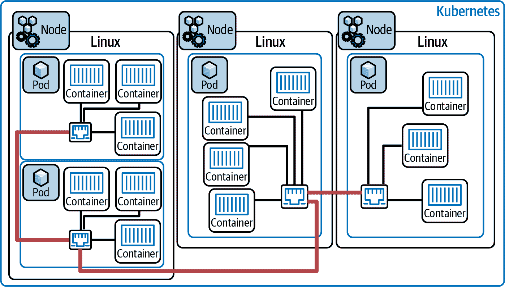
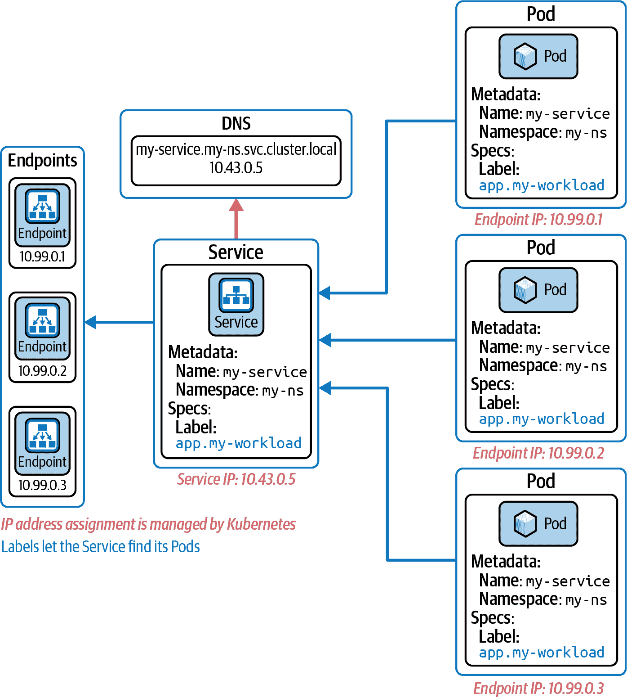
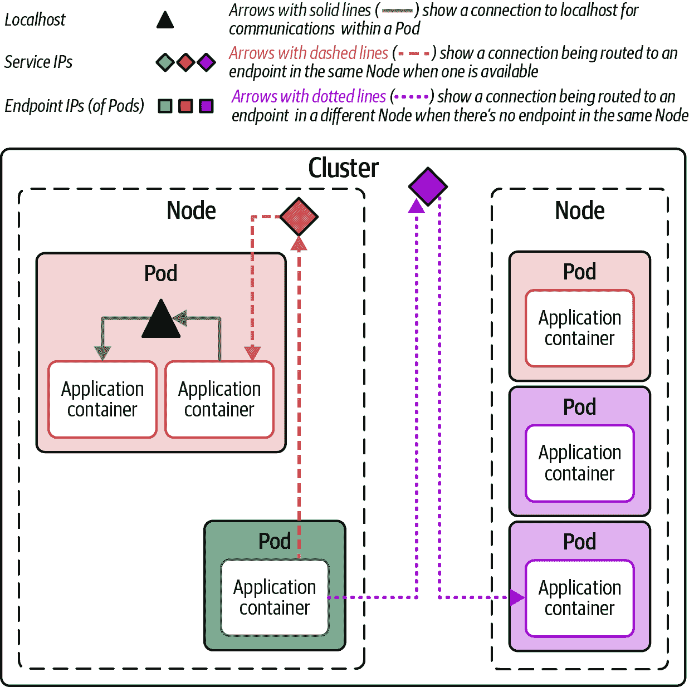
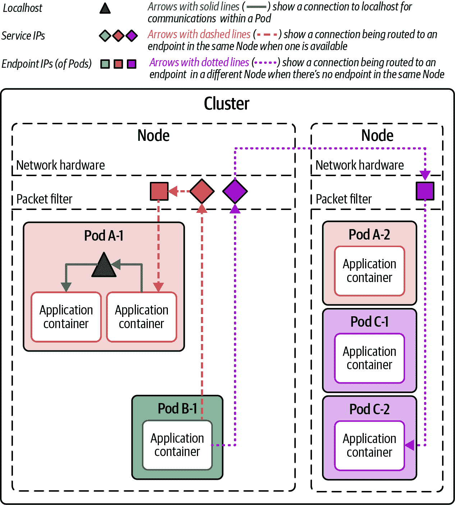
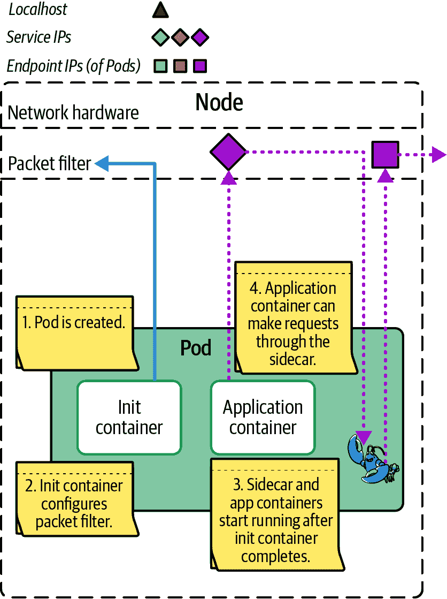
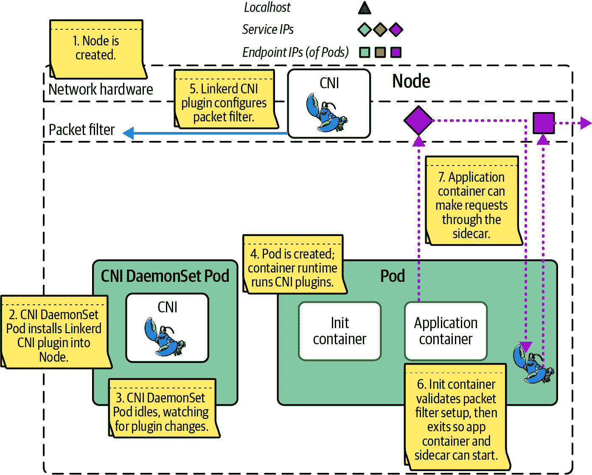

# 第十三章：Linkerd CNI 与初始化容器对比

在 第二章 中，我们多次提到了初始化容器，但从未详细讨论过它。初始化容器是 Linkerd 在 Kubernetes 中处理网格网络的两种机制之一，另一种是 Linkerd CNI 插件。要理解它们的作用以及为什么选择其中之一，您需要了解网格化 Pod 启动时发生的情况。

恰巧，这比你预期的要复杂得多。我们将首先看看原生 Kubernetes，*没有* Linkerd。

# Kubernetes 无 Linkerd

Kubernetes 的核心目标是管理用户工作负载，以便开发人员可以集中精力于 Pod 和服务，而无需过多关注底层硬件。这是一件容易描述，使用起来相对容易，但在实施上极其复杂的事情。Kubernetes 依赖于多种不同的开源技术来完成所有这些任务。请记住，此时我们谈论的是 *没有* Linkerd 的 Kubernetes 标准功能。

## 节点、Pod 和更多内容

Kubernetes 首先需要管理的是在集群内部执行工作负载的编排。它对此依赖于操作系统级别的隔离机制。以下是需要记住的一些关键点：

+   集群由一个或多个 *节点* 组成，这些节点是物理或虚拟机器，运行着 Kubernetes 本身。我们在这里讨论 Linux 节点。

+   由于节点彼此完全不同，一个节点上的所有内容都与其他节点隔离开来。

+   Pod 由一个或多个 *容器* 组成，并且它们在同一个节点上通过 Linux [`cgroup`s](https://oreil.ly/K1z3T) 和 `namespace`s 进行隔离。

+   同一 Pod 中的容器可以使用 *loopback* 网络进行通信。不同 Pod 中的容器需要使用非 loopback 地址，因为 Pod 之间是相互隔离的。无论 Pod 是否在同一节点上，Pod 与 Pod 之间的通信方式都是相同的。

+   一个重要的观点是 Linux 本身是在节点级别运行的：Pod 和容器不必运行单独的操作系统实例。这就是它们之间隔离如此重要的原因。

这种分层方法如 图 13-1 所示，允许 Kubernetes 在集群内部编排工作负载的分布，同时关注资源的可用性和使用情况：工作负载容器映射到 Pod，Pod 被调度到节点上，而所有节点连接到单一平面网络。



###### 图 13-1\. 集群、节点、Pod 和容器

（那么部署、副本集、守护集等呢？它们都是在提示 Kubernetes 创建的 Pod 应该被调度到哪里；底层的调度机制是相同的。）

## Kubernetes 中的网络

Kubernetes 管理的另一个主要领域是网络，从基本原则开始，即每个 Pod 必须看到一个平坦透明的网络。每个 Pod 应能够与任何节点上的所有其他 Pod 通信。这意味着每个 Pod 必须有自己的 IP 地址（Pod IP）。

# 容器还是 Pod？

实际要求是*任何两个容器*必须能够互相通信，但 IP 地址是在 Pod 级别分配的——一个 Pod 内的多个容器共享同一个 IP 地址。

虽然可能让工作负载直接使用 Pod IP 与其他工作负载通信，但由于 Pod IP 的动态性，这不是个好主意：随着 Pod 的循环，它们会变化。在大多数情况下，使用 Kubernetes 服务是一个更好的选择。

服务相当复杂，正如我们在第五章中简要讨论的：

+   创建服务会触发 DNS 条目的分配，因此工作负载可以通过名称引用服务。

+   创建服务还会触发为服务分配独特的 IP 地址，与集群中的任何其他 IP 地址都不同。我们称之为服务 IP。

+   服务包括一个*选择器*，定义了哪些 Pod 将与该服务关联。

+   最后，服务收集其所有匹配 Pod 的 Pod IP 地址，并将它们维护为其端点。

这一切都显示在图 13-2 中——不幸的是，这仍然是对服务的一个*简化*视图。



###### 图 13-2\. Kubernetes 服务与寻址

当工作负载尝试连接到服务时，默认情况下 Kubernetes 将选择服务的其中一个端点并将连接路由到那里。这使 Kubernetes 能够执行连接的基本负载平衡，如图 13-3 所示：

+   Pod 内部的连接发生在本地主机上，因此它们保持在 Pod 内部。

+   到同一节点上托管的其他工作负载的连接保持在节点内部。

+   到托管在其他节点上的工作负载的连接是唯一经过网络的连接。



###### 图 13-3\. Kubernetes 基本网络路由

要使所有这些工作正常运行，Kubernetes 依赖于内置在 Linux 内核核心中的网络机制。

## 包过滤器的角色

Linux 内核长期以来一直包含一个强大的*数据包过滤器*机制，用于检查网络数据包并决定如何处理每个数据包。数据包过滤系统可以采取的可能操作包括让数据包继续原样传输、修改数据包、重新路由数据包，甚至完全丢弃数据包。

Kubernetes 充分利用包过滤器来处理集群中不断变化的一组 Pods 之间流量路由的复杂性。例如，过滤器可以拦截发送到 Service 的包，并重写为发送到特定 Pod IP。它还可以区分与发送方在同一节点上的 Pod IP 和不同节点上的 Pod IP，并适当管理路由。如果我们稍微放大一下图 13-3，我们可以得到更详细的视图在图 13-4 中。



###### 图 13-4。Kubernetes 和包过滤器

让我们跟随图 13-4 中显示的虚线连接，从 Pod B-1 一路到 Pod C-2：

+   Pod B-1 中的应用容器连接到 Service C 的服务 IP 地址。

+   包过滤器看到从本地容器到服务 IP 的连接，因此它将该连接重定向到 Pod C-1 或 Pod C-2 的 Pod IP。默认情况下，每个新连接的选择是随机的（尽管集群网络层的确切配置可以改变这一点）。

+   在这种情况下，Pod IP 在不同的节点上，因此网络硬件参与进来，与第二个节点的网络通信。

+   在第二个节点上，包过滤器看到来自网络的连接到达 Pod IP 地址，因此它直接将连接交给 Pod，选择一个基于端口号的容器。

对于图中 Pod B-1 和 Pod A-1 之间的虚线连接，过程是相同的，只是网络硬件没有角色，因为连接完全在一个节点内。在所有情况下，容器看到的是一个简单的平面网络，所有容器都在相同的 IP 地址范围内——这当然需要 Kubernetes 在 Pod 创建和删除时持续更新包过滤器规则。

# 字母汤：iptables、nftables 和 eBPF

随着时间的推移，包过滤器已经有了几种实现方式，当人们谈论这个话题时，你可能会听到他们使用特定实现的名称。就目前而言，最常见的是`iptables`，但一个更新的`nftables`实现正变得越来越流行。

你也许会发现这一切让你想起了被称为 eBPF 的过滤技术，这也很合理，因为 eBPF 特别擅长这类包的神奇操作。然而，许多实现早于 eBPF，并不依赖于它。

## 容器网络接口

由于网络配置是 Kubernetes 的一个比较低级的方面，具体细节往往取决于使用的 Kubernetes 实现方式。容器网络接口（CNI）是一个标准，旨在提供管理动态网络配置的一致接口；例如，CNI 提供了在特定范围内分配和释放 IP 地址的机制，Kubernetes 利用这些机制来管理与服务和 Pod 关联的 IP 地址。

CNI 并不直接提供管理数据包过滤功能的机制，但它确实允许使用 *CNI 插件*。包括 Linkerd 在内的服务网格可以使用这些插件来实现它们需要的数据包过滤配置。

# CNI 与 CNI

CNI 有许多实现方式，对于给定的 Kubernetes 解决方案，通常可以在几种不同的 CNI 实现中进行选择（例如，k3d 默认使用 [Flannel](https://oreil.ly/GIVvg) 作为其网络层，但可以轻松切换到 [Calico](https://oreil.ly/YSSts)）。

## Kubernetes Pod 启动过程

最终，Kubernetes 需要做以下操作来启动一个 Pod：

1.  找到一个节点来托管新的 Pod。

1.  运行由节点定义的任何 CNI 插件，插件必须在新 Pod 的上下文中工作。如果任何插件无法工作，则该进程失败。

1.  执行为新 Pod 定义的任何 init 容器，按照它们定义的顺序进行。同样地，如果任何一个 init 容器无法工作，则启动过程失败。

1.  启动由 Pod 定义的所有容器。

在 Pod 容器初始化过程中，重要的是要注意容器会按照 Pod 的 `spec` 中规定的顺序启动。然而，Kubernetes 不会等待一个容器启动完成再启动下一个容器，除非一个容器定义了 `postStartHook`。在这种情况下，Kubernetes 将启动该容器，运行 `postStartHook` 直到完成，然后才会继续启动下一个容器。我们将在 “容器顺序” 中详细讨论这一点。

# Kubernetes 和 Linkerd

任何服务网格在启动过程中都会引入复杂性，Linkerd 也不例外。首要问题是 Linkerd 必须将其代理注入到应用 Pod 中，并且代理必须拦截进出 Pod 的网络流量。注入由一个 mutating admission 控制器管理。拦截更为复杂，Linkerd 有两种管理方式：可以使用 init 容器或 CNI 插件。

## init 容器方法

Linkerd 配置网络的最直接方式是通过一个 init 容器，如 图 13-5 所示。Kubernetes 确保所有 init 容器按照 Pod 的 `spec` 中指定的顺序完成运行，然后再启动其他容器。这使得 init 容器成为配置数据包过滤器的理想方式。



###### 图 13-5\. 使用 init 容器进行启动

这里的缺点是 init 容器需要 `NET_ADMIN` 权限来执行所需的配置。在许多 Kubernetes 运行时中，这种权限可能根本不可用，因此您需要使用 Linkerd CNI 插件。

此外，某些 Kubernetes 集群中使用的操作系统可能不支持 Linkerd 默认使用的较旧的 `iptables` 二进制文件（这通常发生在 Red Hat 家族中）。在这些情况下，您需要设置 `proxyInit.iptablesMode=nft`，以指示 Linkerd 使用 `iptables-nft`。这不是默认设置，因为 `iptables-nft` 尚未普遍支持。

## Linkerd CNI 插件方法

相比之下，Linkerd CNI 插件只需要在安装 Linkerd 之前安装插件即可。它不需要任何特殊的功能，并且每次 Pod 启动时 CNI 插件都会起作用，根据需要配置数据包过滤器，如 图 13-6 所示。



###### 图 13-6\. 使用 CNI 插件启动

主要的复杂性在于 CNI 最初设计是为了在创建集群之后使用而不是在创建集群时使用。因此，CNI 假设 CNI 插件的顺序完全由 Kubernetes 环境之外的人员处理。这证明并不理想，因此大多数 CNI 插件（包括 Linkerd CNI 插件）现在都编写成尝试无论集群操作者做了什么都能正常工作的方式。

在启用 Linkerd CNI 插件的情况下，Linkerd 将安装一个 DaemonSet，设计用于始终在最后运行 Linkerd CNI 插件。这允许其他插件在 Linkerd 开始拦截流量之前配置它们所需的内容。

使用 CNI 插件时，Linkerd 仍会注入一个 init 容器。如果您使用的是 `stable-2.13.0` 版本之前的 Linkerd 版本，则这将是一个基本不执行操作的 init 容器，正如其名称所示。从 `stable-2.13.0` 版本开始，init 容器将验证数据包过滤器是否正确配置。如果配置不正确，容器将失败，促使 Kubernetes 重新启动 Pod。这有助于避免启动时的竞争条件（更多详细信息请参阅下一节）。

## 竞争和排序

如您所见，Kubernetes 中的启动过程可能很复杂，这意味着事情可能会以几种不同的方式失败。

### 容器排序

如前所述，容器按照 Pod 的 `spec` 中的顺序启动，但 Kubernetes 在启动下一个容器之前不会等待特定容器启动（除了 init 容器）。这可能在 Linkerd 启动过程中造成麻烦：如果应用容器开始运行并尝试在 Linkerd 代理容器正常运行之前使用网络，会怎么样？

从 Linkerd 2.12 开始，Linkerd 代理容器具有`postStartHook`来处理此问题。当容器具有`postStartHook`时，Kubernetes 会先启动容器，然后完整运行`postStartHook`，然后再启动下一个容器。这为容器提供了一种简单的方法来确保顺序。

Linkerd 代理的`postStartHook`在代理实际运行之前不会完成，这迫使 Kubernetes 等待代理正常运行后才启动应用容器。如有必要，可以通过设置注解`config.linkerd.io/proxy-await=disabled`来禁用此功能。但我们建议除非有充分理由，否则保持启用！

### CNI 插件排序

CNI 插件排序可能会造成混淆的几种方式：

守护集与其他 Pods

Kubernetes 将守护集 Pods 与任何其他 Pods 一样对待，这意味着应用 Pod 可能会在 Linkerd CNI DaemonSet 安装 Linkerd CNI 插件之前被调度！这意味着 Linkerd CNI 插件将不会为应用 Pod 运行，进而意味着应用容器将没有正常运行的 Linkerd 代理。

在 Linkerd `stable-2.13.0`之前，没有办法捕获这一问题，应用容器可能根本不会出现在网格中。但是，从`stable-2.13.0`开始，初始化容器会检查数据包过滤器是否配置正确。如果未配置正确，初始化容器将退出，从 Kubernetes 的角度看，这会导致崩溃循环，从而明显地显示出失败。

多个 CNI 插件

在大多数情况下，给定的 Kubernetes 安装将使用多个 CNI 插件。虽然 Linkerd CNI DaemonSet 竭尽全力确保 Linkerd CNI 插件最后运行，并且不会干扰其他 CNI 插件，但并非完美无缺。如果出现问题，Pod 可能（再次）永远不会出现在网格中。

配置错误的 CNI

当您首次安装 Linkerd CNI 插件时，很可能会简单地配置错误。例如，在运行 k3d 时，需要向插件提供某些路径，如果这些路径错误，插件本身将无法工作。这可能导致应用 Pods 在静默失败启动，或者在代理日志中显示“损坏消息”错误。

```
{ "message": "Failed to connect", "error": "received corrupt message" }
```

CNI 问题的唯一真正救赎在于它们通常是非常明显、显眼的错误：您将看到`linkerd check`失败，或者 Pods 无法启动，或类似的问题。另一方面，解决这些故障可能会很棘手，并且在很大程度上取决于具体的 CNI 插件，因此一般情况下，我们建议尽可能坚持使用初始化容器机制。

# 总结

Kubernetes 启动过程非常复杂，特别是涉及 Linkerd 时，但也有一些简单的建议可以帮助一切顺利进行：

+   保持 Linkerd 更新！最新版本已经添加了一些对启动非常有帮助的功能。

+   使用 `proxy-await`，除非你有一个*非常*好的理由禁用它。这将确保你的应用程序在启动之前具有一个可用的网格。

+   如果可能的话，请坚持使用初始化容器。如果不能，只需使用 CNI 插件，但如果你的集群可以运行初始化容器，那么这可能是最简单的方式。
