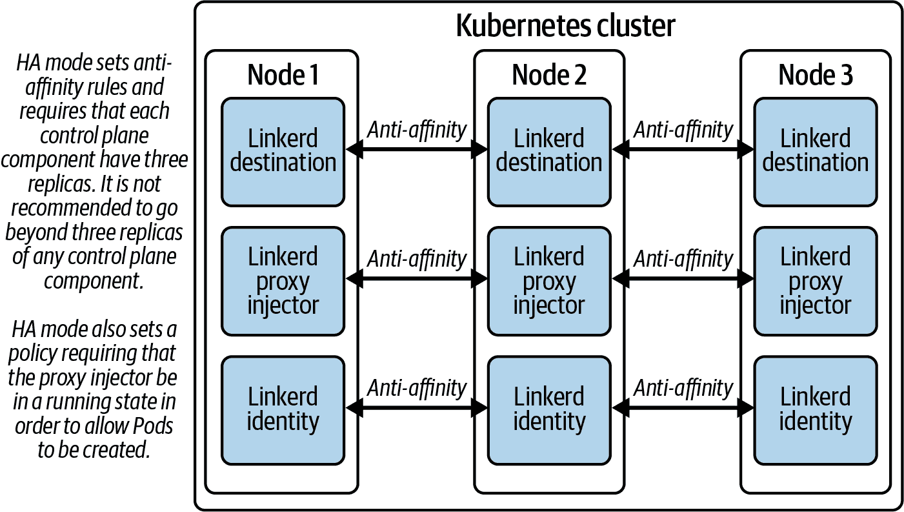
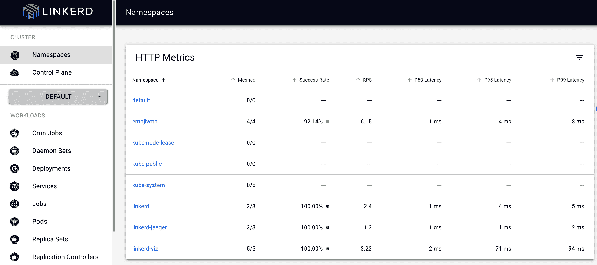

# 第十四章：Linkerd 准备生产环境

一旦您部署了 Linkerd，您的下一个任务是为生产使用适当地加固您的环境。在准备过程中，熟悉您可以使用的资源非常有价值。Linkerd 用户可以访问两组基本资源：

+   社区提供的资源是免费使用的，对于每个人来说都是一个很好的信息来源。

+   Buoyant 提供的商业资源，Linkerd 的创建者

为了本书的目的，我们将避免涉及付费资源。如果您想了解更多关于 Buoyant 的商业产品信息，请访问 [Buoyant 网站](https://buoyant.io)。

# Linkerd 社区资源

Linkerd 社区活跃在 [GitHub](https://oreil.ly/n6j1e)，[Slack](https://slack.linkerd.io) 和 [CNCF 邮件列表](https://oreil.ly/w5dIi) 上。此外，在线上还有许多有用的指南和资源。

如果您希望了解有关在生产环境中运行 Linkerd 的更多信息，请查看 [Buoyant 生产操作手册](https://oreil.ly/kCfO5)，该手册在 Linkerd 版本更改时进行了更新，并包含大量重要信息。

## 获取帮助

Linkerd 的社区支持主要由志愿社区成员在 Linkerd Slack 或直接在 GitHub 上的维护者和贡献者社区提供。重要的是，试图从开源社区获取帮助的用户理解，您有责任仔细测试对 Linkerd 所做的所有更改。在寻求 Linkerd 帮助时，您应确保清楚地阐明您面临的问题，并在可能的情况下提供重现问题的明确步骤。对于维护者或志愿社区成员来说，最困难的任务始终是理解和测试出现的任何特定问题。

## 负责任的披露

如果您在使用 Linkerd 过程中遇到安全问题，请您发送私人邮件至 cncf-linkerd-maintainers@lists.cncf.io，项目维护者将会确认您的报告，并在调查披露内容时提供额外信息。您可以订阅 Linkerd 漏洞通知，请访问 [cncf-linkerd-announce 邮件列表](https://oreil.ly/HIc0c)。

## Kubernetes 兼容性

Linkerd 已测试通过所有当前活动的 Kubernetes 版本。每个版本的发布说明包含支持的最低 Kubernetes 版本。

# 使用 Linkerd 进入生产环境

现在一切都准备好了，我们可以深入探讨如何使用 Linkerd 进入生产环境。

## 稳定版还是边缘版？

对于生产使用，您最简单的方法将是从稳定渠道运行发布，例如 Buoyant Enterprise for Linkerd。虽然在生产中运行边缘渠道版本是完全可能的。

如果你决定在生产环境中运行边缘版本，*非常重要* 的是要仔细阅读你考虑的每个发布版本的发布说明，并向 Linkerd 维护人员反馈你的体验。最简单的方法是通过 [社区 Slack](https://slack.linkerd.io) 进行反馈。在 [GitHub](https://oreil.ly/y0Zut) 上的讨论或问题也是与 Linkerd 团队联系的好方式。

## 准备你的环境

确保你的环境为 Linkerd 准备好的第一步始终是运行 CLI 的预检查：

```
$ linkerd check --pre
```

确保你的环境已经准备好运行 Linkerd，特别是要注意 Kubernetes 权限。

除了预检之外，你还需要确保理解你的环境特定的安全需求。例如：

+   如果你不能允许你的 Pods 具有 `NET_ADMIN` 权限，那么你将需要使用 Linkerd CNI 插件。

+   如果你正在使用 Kubernetes 的污点机制，并且已经在将运行 Linkerd 控制平面的节点上应用了自定义的污点，那么你需要为 Linkerd 的部署添加容忍（tolerations）。

+   如果你使用网络策略来隔离流量，你需要确保你的策略允许 Linkerd 控制平面和其代理之间的通信。你可能还想考虑使用 Linkerd 的策略机制来进行应用程序感知的策略执行。

除了通信之外，你还需要考虑如何将你的应用程序添加到网格中，如在 第四章 中讨论的那样。例如，你会使用命名空间注入还是工作负载注入？这些决策可能不会非常复杂，但提前考虑它们仍然是个好主意。

总结一下，通过指示 Linkerd 代理注入器在 Pod 创建时为 Pod 添加代理来将工作负载添加到网格中。可以通过在命名空间、工作负载或 Pod 级别添加注释来传递该指令：

```
linkerd.io/inject: enabled
```

对于生产使用，我们建议你在命名空间或工作负载级别添加注释。这通常是管理网格化应用程序工作负载的最简单方法，因为它不需要修改单个 Pod 清单。（虽然在某些情况下，你可能需要直接向 Pod 添加代理，如在 第六章 中讨论的那样，但这些情况并不多见。）

无论哪种情况，你都需要配置你的部署工具，在部署过程中添加适当的注释，以确保你的工作负载都被适当地网格化。这也是添加任何集群范围配置的跳过和不透明端口的异常的时机，如在 第四章 中讨论的那样。

# 明确启用注入

请记住，如果你在命名空间级别添加了 Linkerd 代理注入的注解，你仍然可以通过将以下注解添加到 Deployment 中的单个工作负载来覆盖注入行为：

```
linkerd.io/inject: disabled
```

## 配置 Linkerd 实现高可用性

如果你在生产环境中部署 Linkerd，这意味着你决定为你的生产应用程序添加关键的安全性、可观察性和可靠性功能。做得好！不幸的是，所有这些新功能都伴随着一些非常真实的成本。Linkerd 现在处于你最关键工作负载的关键运行路径。如果 Linkerd 遭遇灾难性故障，你很可能会遭受非常真实的应用程序停机，或者至少会服务质量下降。

为了减少这些风险，Linkerd 项目定义并支持*高可用性*（HA）模式。HA 模式修改了部署 Linkerd 的方式，如图 14-1 所示。



###### 图 14-1\. Linkerd 高可用模式

# 无论何时在生产环境中都要运行 HA

我们*强烈*建议在任何生产环境中使用 Linkerd 的 HA 模式。如果你没有显式地安装 HA 模式，你的 Linkerd 安装将存在几个单点故障，可能会导致应用程序的停机时间。

### HA 模式的作用是什么？

高可用性模式对你的 Linkerd 控制平面安装进行了一些重要的更改。你可以在[最新文档](https://oreil.ly/eDjOq)中找到有关 HA 模式确切变更的所有详细信息，我们强烈建议你在升级时查阅此文档，以确保使用的是最新信息。

尽管基本配置一直比较一致，但在大体上，HA 模式：

运行三个副本

在 HA 模式下，每个控制平面组件运行三个副本，而不仅仅是一个，以防止单个副本故障导致整个网格崩溃。

设置反亲和性

此外，HA 模式创建反亲和规则，防止任何单个节点运行控制平面组件的多个副本。这样可以防止单个节点故障导致整个网格崩溃。

加强资源限制

HA 模式建立了比非 HA 模式更为激进的 CPU 和内存资源请求和限制，以防止任何失控进程对整个集群造成更广泛的问题。

# 验证请求和限制

这些由 HA 模式设置的更为激进的限制对许多组织都能很好地发挥作用，但你应该把它们视为一个起点：它们可能不是你的组织所需的。重要的是要积极监控 Linkerd 控制平面的实际资源使用情况，并根据需要调整请求和限制。

特别是，控制平面组件如果达到其内存限制将被 OOMKilled，然后重新启动。如果这种情况不经常发生，可能会被忽略，但如果频繁发生，你可能会遭受生产事故。

使`proxy-injector`成为强制项

在 HA 模式下，Linkerd 控制平面的`proxy-injector`组件在*任何* Pod 允许被调度之前*必须*保持健康。这反映了 Linkerd 通常负责确保应用程序内安全通信的事实。与其允许未经 Linkerd 代理的应用程序 Pod 运行，不如失败启动它们。

但要意识到，此要求是使用集群范围的入场 Webhook 强制执行的，因此它影响*每个*集群中的 Pod，而不仅仅是应用工作负载。这意味着您*必须*豁免关键的集群基础设施命名空间，例如`kube-system`，以免强制执行策略。

要豁免一个命名空间，请将以下标签应用于命名空间：

```
config.linkerd.io/admission-webhooks: disabled
```

# 基础设施无入场 Webhook！

您*必须*豁免基础设施命名空间免受 HA 入场 Webhook 的影响。如果不这样做，您很容易陷入僵局状态，Linkerd 正在等待系统基础设施，而系统基础设施正在等待 Linkerd。

### 使用 Helm 进行高可用安装

我们建议在生产环境中使用 Helm 安装 Linkerd，包括高可用安装。一个复杂因素是，与其他安装方式相比，高可用安装更有可能需要定制的 Helm 值。为了让这一过程更加简化，Linkerd Helm 图表包含一个值文件，您可以将其用作高可用安装的基础。

我们建议您在使用 Helm 部署 Linkerd HA 时始终参考[最新的高可用安装说明](https://oreil.ly/GLiFw)。在撰写本文时，过程的简要概述显示在示例 14-1 中。

##### 示例 14-1\. 使用 Helm 在 HA 模式下安装 Linkerd

```
# Add the Linkerd stable repo
$ helm repo add linkerd https://helm.linkerd.io/stable

# Update your Helm repositories
$ helm repo update

# Pull down the latest version of the chart
$ helm fetch --untar linkerd/linkerd-control-plane

# Examine linkerd-control-plane/values-ha.yaml and edit if needed. The
# edited file should be placed in version control and, as new charts are
# released, periodically compared with the new values-ha.yaml files.

# Install the Linkerd CRDs
$ helm install linkerd-crds linkerd/linkerd-crds \
  -n linkerd --create-namespace

# Install the Linkerd control plane
# Note the added reference to the values-ha.yaml file
$ helm install linkerd-control-plane \
  -n linkerd \
  --set-file identityTrustAnchorsPEM=ca.crt \
  --set-file identity.issuer.tls.crtPEM=issuer.crt \
  --set-file identity.issuer.tls.keyPEM=issuer.key \
  -f linkerd-control-plane/values-ha.yaml \
  linkerd/linkerd-control-plane

# Ensure your install was successful
$ linkerd check
```

如评论中所述，您应将您的*values-ha.yaml*版本控制起来。这是重要的资源，用于重新安装和灾难恢复。

### 使用 CLI 进行高可用安装

虽然我们通常不建议在生产环境中使用基于 CLI 的安装，但您可以使用 Linkerd CLI 输出配置了所有 HA 选项的部署 YAML，并将此 YAML 作为实际安装过程的基础。

要实现这一点，请使用`linkerd install`命令和`--ha`标志，并将生成的 YAML 保存到文件中：

```
$ linkerd install --ha > linkerd-ha.yaml
```

您可以将*linkerd-ha.yaml*放入版本控制，并根据需要进行编辑。

# [Linkerd 监控](https://oreil.ly/GLiFw)的注意事项

有一些商业供应商会自动配置 Linkerd 的监控和警报。对于那些希望自行监控 Linkerd 的用户，我们建议您建立监控程序，以确保 Linkerd 在您的环境中保持高可用性。

## 证书健康和到期

Linkerd 中断的最常见原因是证书过期。信任锚点和身份签发者证书必须始终有效，以避免停机时间。因此，仔细监控您的证书确保在其到期之前始终更新至关重要。

当您的根证书或发行者证书将在 60 天内过期时，`linkerd check`命令将开始警告您。

# 绝不让您的证书过期

因为 Linkerd 默认需要 Pod 之间的 mTLS 连接，它使用的证书的健康和安全对网格的正常运行至关重要，从而影响您的平台。如果证书过期或无法为新 Pod 生成，*您将遭受停机时间*。

这是生产 Linkerd 集群停机时间最常见的原因。理解和监控您的 Linkerd 证书至关重要。

## 控制平面

Linkerd 的控制平面对于您平台的正常运行至关重要。您应收集和测量控制平面的 Linkerd 代理指标，如成功率、延迟和每秒请求。对异常行为发出警报，并调查成功率低于 100%的情况。

您还应密切监视控制平面的资源消耗，并确保其永远不会接近 CPU 或内存限制。

## 数据平面

Linkerd 代理通常非常简单和直接易操作。尽管如此，确保代理未消耗比其应有的更多资源仍然非常重要：如果消耗过多，可能表示存在过多流量或其他问题。监视代理的资源使用情况，并确保其资源请求和限制与其处理应用程序流量所需的匹配。

确保监控您环境中 Linkerd 代理的版本是明智的。代理将使用代理注入器在创建 Pod 时定义的版本部署。如果您的 Pods 不定期重启，代理版本可能会与控制平面不同步。您需要确保您的代理始终至少与控制平面的一个主要版本保持一致。

## 指标收集

任何 Linkerd 的生产安装还需要考虑如何处理 Linkerd 生成的指标数据。Linkerd 代理不断收集有关其 Pod 进出的流量的有用信息，所有这些信息都以一种方式提供，任何兼容 OpenTelemetry 的工具应该能够访问它。 （Linkerd 长期以来还提供了配置 Prometheus 从 Linkerd 中抓取指标的开源配置详细信息。）

Linkerd 本身并不是监控工具（尽管 Linkerd Viz 可以消耗度量标准并显示有关它们的许多有用信息）；相反，它设计用于向您环境中已有的监控解决方案提供度量标准。无论那是什么，对于负责生产 Linkerd 安装的平台工程师来说，创建一个用于收集、存储和使用 Linkerd 生成的所有度量标准的计划是最重要的长期任务之一，因为有效的长期监控对于理解应用程序的行为和健康非常有价值。

## 用于生产的 Linkerd Viz

Linkerd Viz 扩展消耗由 Linkerd 提供的度量标准，利用它们为 Linkerd 启用一些强大的诊断功能，并提供一个基本的开源仪表板（在图 14-2 中显示），以便更轻松地可视化一些这些度量标准。从 Linkerd 2.12 开始，从 CLI 可用的核心可见性数据——从度量标准到多集群网关的状态——需要安装 Linkerd Viz 扩展。



###### 图 14-2。Linkerd Viz 仪表板

虽然 Linkerd Viz 并非*必需*用于生产使用，但我们通常建议安装它。在生产环境中运行 Viz 需要特别关注三个领域：

Prometheus 和 Linkerd Viz

安装 Linkerd Viz 时，它可以为您安装一个 Prometheus 实例。*此 Prometheus 实例不建议用于生产使用*，因为它使用内存数据存储，随着保存更多的度量标准数据，它会填满可用内存并崩溃，丢失所有到目前为止保存的度量标准数据。在繁忙的生产系统中，这可能每天发生多次。

因此，要在生产环境中使用 Linkerd Viz，您需要使用带有持久化存储的不同 Prometheus 实例。有关外部化 Prometheus 的完整流程在示例 10-9 中展示。您还可以查阅关于[外部化 Prometheus](https://oreil.ly/i5knP)的官方文档。

# 始终使用自己的 Prometheus

我们再说一遍：*不要在生产中使用 Linkerd Viz 安装的 Prometheus*。它只将您的度量标准存储在内存中，当其重新启动时，您*将*丢失所有历史数据。

第十章详细介绍了处理度量标准的正确方法。

保护 Linkerd Viz 仪表板

开源的 Linkerd Viz 仪表板提供对集群重要信息的访问，包括度量标准、Linkerd Tap 等。为了方便实验，它不包含任何身份验证机制；因此，我们*不建议*将此配置用于生产环境。

如果您计划在生产环境中提供 Linkerd Viz 仪表板，我们*强烈建议*使用您的入口控制器以及 Linkerd 授权策略来限制对其的访问。您可以在第五章中了解更多关于入口控制器的信息，以及如何确切地保护 Linkerd Viz 仪表板的详细信息可在[Linkerd 文档](https://oreil.ly/Ivenb)中找到。

保护 Linkerd Tap

Linkerd Tap 允许操作员查看环境中应用程序之间请求的元数据。尽管它永远不会访问未加密的消息正文，但仍然很重要确保安全访问 Linkerd Tap，因为许多组织在其 URL 或标头中包含可能敏感的信息，不应向所有访问集群的人员公开。可以通过`linkerd-linkerd-tap-admin` ClusterRole 提供对 Linkerd Tap 的访问权限。

您可以在[Linkerd 文档](https://oreil.ly/wjWnb)中了解更多关于保护 Tap 流量的信息，但这里最基本的操作是授予 Kubernetes 帐户访问 Linkerd Tap 的权限。可以通过示例 14-2 中显示的角色绑定来完成。

##### 示例 14-2\. 访问 Linkerd Tap

```
$ export USER=<target_username>
$ kubectl create clusterrolebinding \
  "${USER}"-tap-admin \
  --clusterrole=linkerd-linkerd-viz-tap-admin \
  --user="${USER}"
```

## 访问 Linkerd 日志

Linkerd 控制平面和 Linkerd 代理均会发出日志信息，可通过`kubectl logs`访问，这些信息对于排除任何活动事件或调查异常行为可能非常有价值。每个发出的日志消息都有相关的*日志级别*：

`错误`

指示必须解决以继续操作网格的 Linkerd 存在严重问题的消息

`警告`

指示应解决但不会阻止网格正常运行的问题的消息

`信息`

信息性消息

`调试`

仅用于调试的消息，通常需要了解 Linkerd 才能解释

默认情况下，Linkerd 组件配置为以`INFO`级别及更高级别发出消息。必要时，您可以覆盖此配置以便 Linkerd 也发出`DEBUG`消息。（不建议关闭`INFO`级别的消息。）切换日志级别需要重新启动控制平面，尽管 Linkerd 代理可以在运行时更改其日志级别。

您应仅在积极排除故障时将 Linkerd 切换为发出`DEBUG`级别的日志消息；发出`DEBUG`级别的日志对 Linkerd 本身有实际的性能影响，并且额外的日志量可能会快速压倒日志聚合器。

在此期间，当监视您的 Linkerd 环境时，监视 Linkerd 组件的日志级别是值得的，以确保它们没有错误地继续发出`DEBUG`日志。

# 升级 Linkerd

Linkerd 的设计旨在安全运行和升级。在同一个主要版本内进行升级通常是安全的，并且如果配置了高可用模式，则可以放心地执行升级而不会丢失任何功能。尽管如此，在所有情况下，都应该在非生产环境中测试您的升级和升级过程，然后再转移到生产环境。

当使用稳定通道的发布时，请记住，与次要版本升级不同，主要版本升级可能包含破坏性变更。例如，Linkerd 2.10、2.11 和 2.12 都包含了对 Linkerd 操作的显著更改，需要许多用户更改其部署策略或仔细测试其应用程序的行为。作为平台运营商，您有责任在部署之前仔细阅读新主要版本的发布说明，并测试您的升级过程，然后再转移到生产环境。

# 永远不要跳过主要版本

在进行升级时，*绝对不要*跳过主要版本；例如，从 2.12.5 升级到 2.14.3 *不受支持*。升级仅在单个主要版本内进行测试；尝试跳过可能会导致未知问题并且很可能会导致停机时间。

请务必*始终*在升级之前阅读特定版本的升级说明；例如，Linkerd 2.12 添加了一个新步骤到流程中。当使用边缘通道的发布时，这一点尤为重要！您可以在[Linkerd 升级文档](https://oreil.ly/Mmou7)中找到最新的说明。

与 Linkerd 安装一样，该项目支持两种主要的升级路径。

## 通过 Helm 进行升级

使用 Helm 是生产安装和升级的推荐方法。

# 阅读说明书

在开始升级之前，请务必阅读[Linkerd 升级说明](https://oreil.ly/7IhPt)！

下面是具体的过程：

1.  确保控制平面本身健康，并且 Linkerd 正常运行：

    ```
    $ linkerd check
    ```

1.  如果 `linkerd check` 显示任何问题，请在继续之前解决它们。在控制平面运行不正确时尝试升级可能会导致重大问题。

1.  一旦确认控制平面运行正常，请更新您的 Helm 仓库：

    ```
    $ helm repo update
    ```

1.  接下来，更新 Linkerd Helm 图表。请注意，从 Linkerd 2.12 开始，有两个独立的 Helm 图表，您需要对两者都运行升级操作。

    首先，升级 Linkerd CRD：

    ```
    $ helm upgrade linkerd-crds -n linkerd linkerd/linkerd-crds
    ```

    完成后，请升级控制平面本身：

    ```
    $ helm upgrade linkerd-control-plane \
      -n linkerd linkerd/linkerd-control-plane
    ```

1.  再次确保控制平面健康：

    ```
    $ linkerd check
    ```

## 通过 CLI 进行升级

Linkerd 的 CLI 提供了一个 `upgrade` 命令，将输出 YAML，可直接应用于您的 Kubernetes 集群以升级 Linkerd 控制平面。虽然我们通常建议使用 Helm 来升级 Linkerd，但 Linkerd CLI 可能更适合某些工作流程。

# 阅读说明书

在开始升级之前，请务必阅读[Linkerd 升级说明](https://oreil.ly/7IhPt)！

通过 CLI 进行升级的基本过程是：

1.  确保控制平面本身健康运行，确保 Linkerd 运行正常：

    ```
    $ linkerd check
    ```

1.  如果 `linkerd check` 显示任何问题，请在继续之前解决它们。当控制平面功能不正常时进行升级可能会导致严重问题。

1.  通过安装最新版本的 Linkerd CLI 来启动升级过程本身。这使得 CLI 可以获取各种 Linkerd 安装资源的最新版本：

    ```
    $ curl --proto '=https' --tlsv1.2 -sSfL https://run.linkerd.io/install | sh
    ```

    确认你正在运行最新版本：

    ```
    $ linkerd version --client
    ```

1.  升级运行在集群中的控制平面：

    ```
    $ linkerd upgrade \
        | kubectl apply --prune -l linkerd.io/control-plane-ns=linkerd -f -
    ```

    使用 `--prune` 标志确保从集群中删除不再需要的资源。

    # 认真，读取说明！

    作为阅读说明书重要性的例证，升级到 Linkerd 2.12 需要将更复杂的修剪指令传递给 `kubectl apply`！

    升级说明可能会随每个主要版本而变化，这就是为什么你应该在升级之前*始终*阅读[最新文档](https://oreil.ly/o_Aef)。

1.  再次确保控制平面正常运行：

    ```
    $ linkerd check
    ```

# 就绪检查清单

一个小型演示环境与一个重要的生产环境有很多差异，正如我们刚刚提到的！以下检查清单涵盖了在将 Linkerd 投入生产时需要考虑的一些最重要的事项：

+   我已经使用我的安装凭据运行了 Linkerd 的预检查。

+   我正在将 Linkerd 镜像镜像到我的内部注册表中。

+   我确信我的集群有能力以高可用模式运行 Linkerd 的控制平面。

+   我有计划以高可用模式运行 Linkerd。

+   我已为 Linkerd 创建了自己的证书。

    +   我有计划安全地存储和轮换这些证书。

    +   我已经创建了监控，以确保在证书过期之前我会收到通知。

+   我已确定我环境中使用的各种非 HTTP 工作负载。

    +   我知道哪些工作负载已经加入了网格，哪些没有。

+   我已注释 `kube-system` 命名空间，以确保它在没有代理注入器可用时能够正常运行。

+   我已确保 `linkerd` 命名空间不会配置为自动注入。

+   我已确保 `kube-system` 命名空间不会配置为自动注入。

+   我知道还有其他命名空间需要确保不被代理注入。

    +   我已将它们从注入器故障策略中豁免。

+   我有计划为我的工作负载添加适当的注释。

+   我有一个收集和存储 Linkerd 指标的计划。

+   我已经设置了工具，以确保 Linkerd 健康，并且如果有问题我会收到通知。

如果你能够勾选大部分或全部这些项目，那么你就能够自信地在生产环境中运行 Linkerd。

# 总结

在本章中，我们涵盖了许多与在生产环境中运行 Linkerd 相关的核心任务和关注点。没有两个组织具有相同的操作限制和要求，因此，与技术的其他方面一样，您应该准备好根据您的实际情况调整这些建议。如果您有特定的操作上的顾虑，或者需要帮助运行 Linkerd，我们建议您与 Linkerd 社区联系，或者建立与提供 Linkerd 支持或管理的供应商之间的商业关系。
