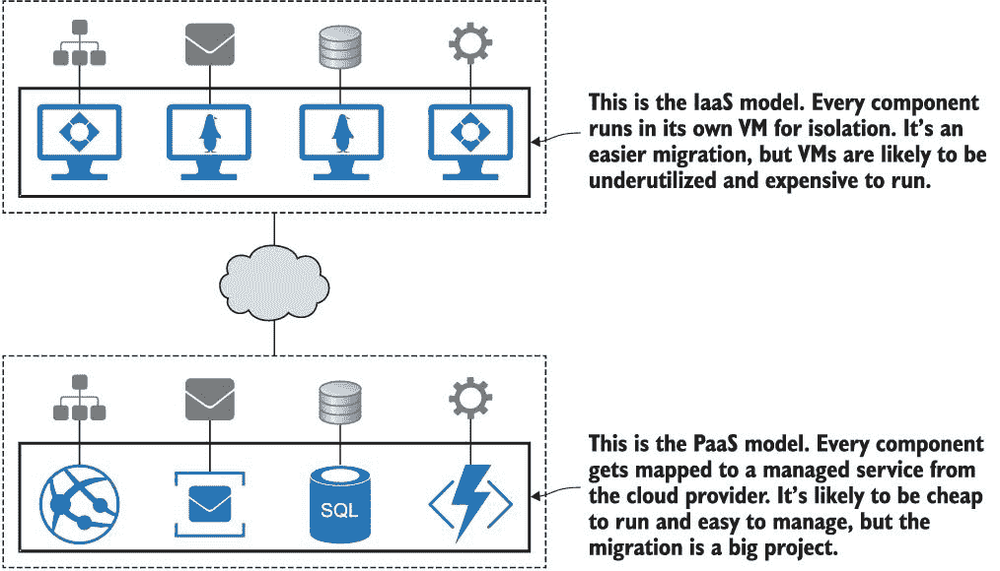
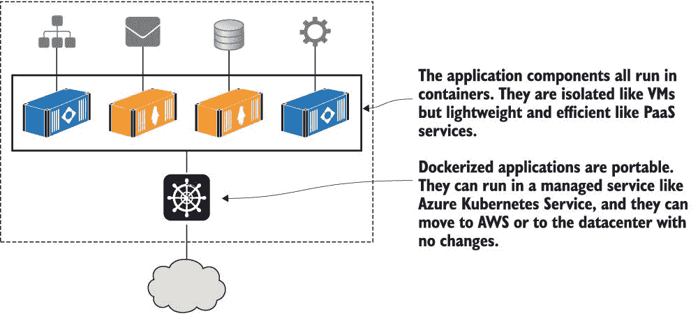
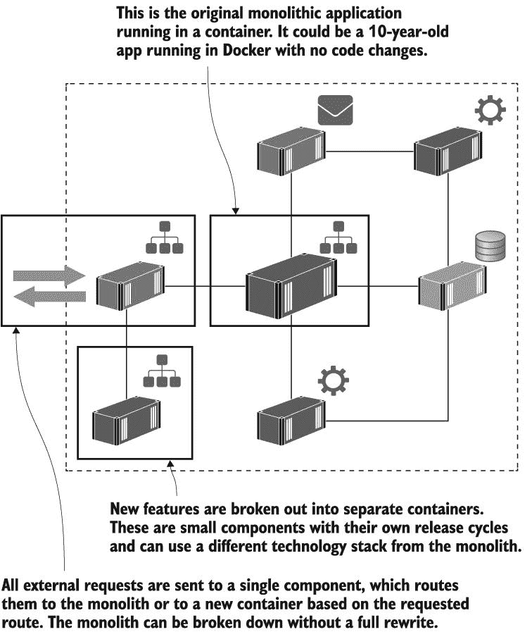
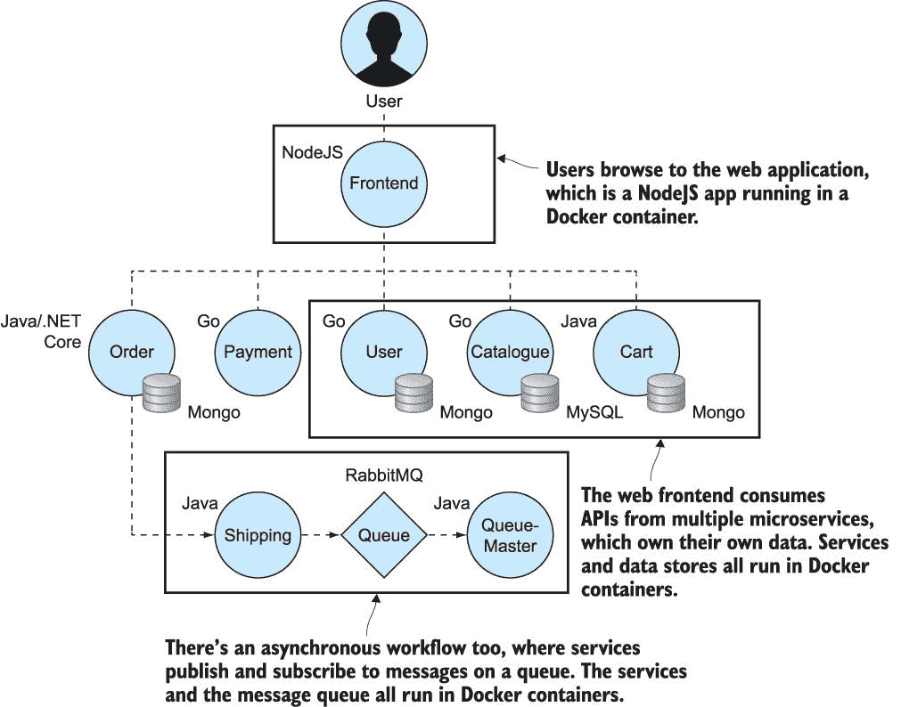
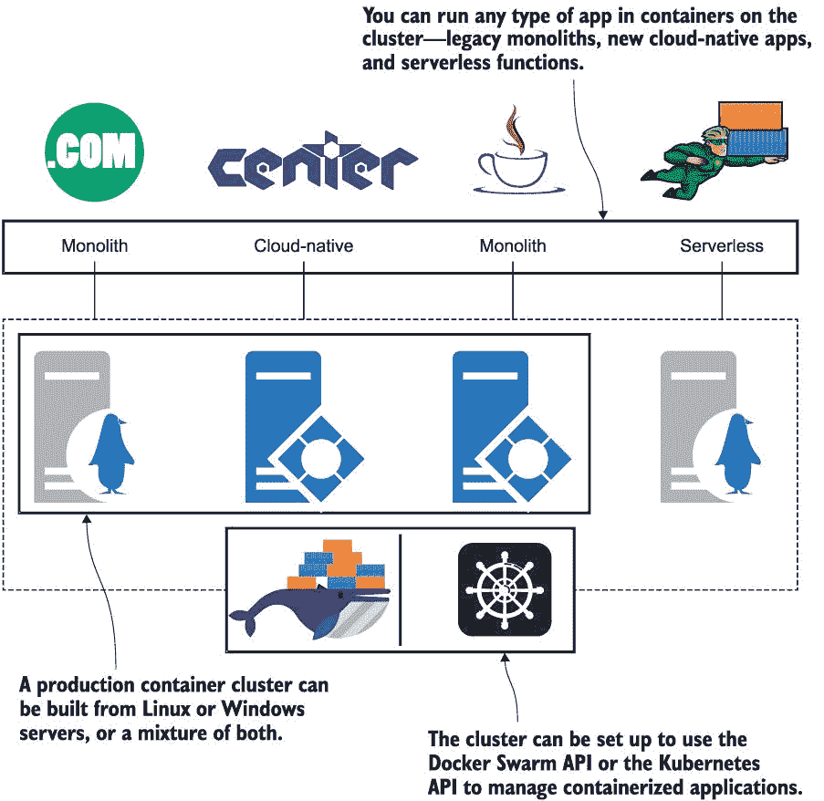

# 1 在开始之前

Docker 是一个在轻量级单元（称为容器）中运行应用程序的平台。容器在软件的各个领域都取得了成功，从云中的无服务器函数到企业的战略规划。Docker 正在成为整个行业操作员和开发者的核心能力——在 2019 年 Stack Overflow 调查中，Docker 被评为人们最想要的“最想拥有的”技术（*[`mng.bz/04lW`](https://shortener.manning.com/04lW)*）。

Docker 是一种易于学习的简单技术。你可以作为一个完全的初学者拿起这本书，你将在第二章中运行容器，在第三章中打包应用程序以便在 Docker 中运行。每一章都专注于实际任务，包含任何运行 Docker 的机器上的示例和实验室——欢迎 Windows、Mac 和 Linux 用户。

在这本书中，你将跟随的旅程是我教授 Docker 多年来的经验结晶。每一章都是实战性的——除了这一章。在你开始学习 Docker 之前，了解容器在现实世界中的使用方式和它们解决的问题类型非常重要——这正是我将在这里介绍的内容。本章还将描述我将如何教授 Docker，这样你可以判断这本书是否适合你。

现在，让我们看看人们正在用容器做什么——我将介绍五个主要场景，在这些场景中，组织使用 Docker 取得了巨大的成功。你将看到你可以用容器解决的问题的广泛范围，其中一些无疑会映射到你自己的工作场景。到本章结束时，你将了解为什么 Docker 是你需要了解的技术，你还将看到这本书将如何帮助你达到这个目标。

## 1.1 为什么容器将统治世界

我的 Docker 之旅始于 2014 年，当时我正在为一个为 Android 设备提供 API 的项目工作。我们开始使用 Docker 作为开发工具——源代码和构建服务器。然后我们获得了信心，开始在测试环境中将 API 运行在容器中。到项目结束时，每个环境都由 Docker 支持，包括对可用性和扩展性有严格要求的生成环境。

当我离开项目时，将项目交接给新团队的方式是在 GitHub 仓库中的一个单独的 README 文件。构建、部署和管理应用程序（在任何环境中）的唯一要求是 Docker。新开发者只需获取源代码并运行一个命令即可在本地构建和运行一切。管理员使用完全相同的工具在生产集群中部署和管理容器。

通常，在那个规模的项目中，交接需要两周时间。新开发者需要安装半打工具的特定版本，管理员需要安装完全不同的半打工具。Docker 集中了工具链，让每个人都变得如此容易，以至于我认为有一天每个项目都将不得不使用容器。

我于 2016 年加入 Docker，并在过去几年中见证了这一愿景的实现。Docker 正变得无处不在，部分原因是因为它使交付变得如此简单，部分原因是因为它非常灵活——您可以将它带入所有项目，无论是新的还是旧的，Windows 还是 Linux。让我们看看容器在这些项目中的位置。

### 1.1.1 将应用程序迁移到云端

将应用程序迁移到云端是许多组织的首要任务。这是一个有吸引力的选择——让微软、亚马逊或谷歌来担心服务器、磁盘、网络和电力问题。在全球数据中心托管您的应用程序，几乎具有无限的可扩展潜力。几分钟内部署到新的环境，并且只需为使用的资源付费。但您如何将应用程序迁移到云端呢？

过去，将应用程序迁移到云端有两种选择：基础设施即服务（IaaS）和平台即服务（PaaS）。这两种选择都不太理想。您的选择基本上是一种妥协——选择 PaaS，并运行一个项目将应用程序的所有部分迁移到云中的相关托管服务。这是一个困难的项目，并且会将您锁定在单个云中，但它确实可以降低运行成本。另一种选择是 IaaS，您需要为应用程序的每个组件启动一个虚拟机。您可以在云之间获得可移植性，但运行成本会高得多。图 1.1 显示了使用 IaaS 和 PaaS 进行云迁移的典型分布式应用程序的外观。

图 1.1 迁移到云端的原始选项——使用 IaaS 并运行大量效率低下的虚拟机，每月成本高昂，或使用 PaaS 以降低运行成本，但花费更多时间在迁移上。

Docker 提供了一种没有妥协的第三种选择。您将应用程序的每个部分迁移到容器中，然后您可以使用 Azure Kubernetes 服务或亚马逊的弹性容器服务，或在数据中心您自己的 Docker 集群中运行整个应用程序。您将在第七章中学习如何将此类分布式应用程序打包和运行在容器中，在第十三章和第十四章中您将看到如何在生产中大规模运行。图 1.2 显示了 Docker 选项，它使您能够以低成本在任何云中运行可移植的应用程序——或在数据中心，或在您的笔记本电脑上。

图 1.2 在迁移到云端之前将相同的应用程序迁移到 Docker。此应用程序具有 PaaS 的成本效益，以及 IaaS 的可移植性效益，以及只有 Docker 才能提供的易用性。

迁移到容器确实需要一些投资：您需要将现有的安装步骤构建到名为 Dockerfile 的脚本中，并将部署文档构建到使用 Docker Compose 或 Kubernetes 格式的描述性应用程序清单中。您不需要更改代码，并且最终结果将在每个环境中以相同的方式运行，从您的笔记本电脑到云端。

### 1.1.2 现代化遗留应用程序

您几乎可以在云中运行任何应用，但如果没有使用较旧的、单体式设计，您将无法获得 Docker 或云平台的全部价值。单体在容器中运行得很好，但它们限制了您的敏捷性。您可以使用容器在 30 秒内自动分阶段推出一个新功能到生产环境中。但如果该功能是构建自两百万行代码的单体的一部分，您可能不得不经历两周的回归测试周期，才能达到发布阶段。

将您的应用迁移到 Docker 是现代化架构、采用新模式而不需要全面重写应用的绝佳第一步。方法很简单——您首先使用本书中将学习的 Dockerfile 和 Docker Compose 语法将您的应用移动到一个单独的容器中。现在您有一个容器中的单体。

容器在自己的虚拟网络中运行，因此它们可以相互通信而无需暴露给外部世界。这意味着您可以从拆分应用程序开始，将功能移动到它们自己的容器中，这样您的单体就可以逐渐演变成一个分布式应用，整个功能集由多个容器提供。图 1.3 显示了这在一个示例应用架构中的样子。

图 1.3 将单体分解为分布式应用，而不需要重写整个项目。所有组件都在 Docker 容器中运行，一个路由组件决定请求是由单体还是新的微服务来满足。

这为您带来了微服务架构的许多好处。您的主要功能被封装在小型、独立的单元中，您可以独立管理它们。这意味着您可以快速测试更改，因为您不是在更改单体，而是在运行您功能的容器。您可以按需扩展和缩减功能，并且可以使用不同的技术来满足需求。

使用 Docker 现代化较老的应用架构很容易——您将在第二十章和第二十一章中通过实际示例自己完成这项工作。您可以交付一个更敏捷、可扩展和有弹性的应用，并且您可以在多个阶段完成它，而不是停下来进行为期 18 个月的全面重写。

### 1.1.3 构建新的云原生应用

Docker 帮助您将现有应用迁移到云端，无论它们是分布式应用还是单体应用。如果您有单体应用，Docker 可以帮助您将其拆分为现代架构，无论您是在云端运行还是在数据中心。而且，基于云原生原则构建的新项目通过 Docker 得到了极大的加速。

云原生计算基金会（CNCF）将这些新架构描述为使用“开源软件堆栈来部署作为微服务应用，将每个部分打包到自己的容器中，并动态编排这些容器以优化资源利用。”

图 1.4 展示了一个新的微服务应用程序的典型架构——这是一个来自社区的演示应用程序，您可以在 GitHub 上找到，网址为 *[`github.com/microservices-demo`](https://github.com/microservices-demo)* 。

图 1.4 展示了云原生应用程序是使用微服务架构构建的，其中每个组件都在容器中运行。

如果您想了解微服务是如何实际实现的，这是一个很好的示例应用程序。每个组件都拥有自己的数据并通过 API 暴露。前端是一个消耗所有 API 服务的 Web 应用程序。演示应用程序使用各种编程语言和不同的数据库技术，但每个组件都有一个 Dockerfile 来打包它，整个应用程序在 Docker Compose 文件中定义。

您将在第四章中学习如何使用 Docker 编译代码，作为打包应用程序的一部分。这意味着您不需要安装任何开发工具来构建和运行此类应用程序。开发者只需安装 Docker，克隆源代码，然后通过单个命令构建和运行整个应用程序。

Docker 还使将第三方软件引入您的应用程序变得容易，无需编写自己的代码即可添加功能。Docker Hub 是一个公共服务，团队在此共享在容器中运行的软件。CNCF 发布了一个开源项目地图，您可以使用它进行从监控到消息队列的任何事情，并且所有这些都可以从 Docker Hub 免费获得。

### 1.1.4 技术创新：无服务器及其他

现代 IT 的一个关键驱动因素是一致性：团队希望为所有项目使用相同的工具、流程和运行时。您可以使用 Docker 实现，使用容器从在 Windows 上运行的旧 .NET 单体应用到在 Linux 上运行的新 Go 应用程序。您可以构建一个 Docker 集群来运行所有这些应用程序，这样您就可以以相同的方式构建、部署和管理整个应用程序景观。

技术创新不应与常规应用分离。Docker 是一些最大创新的核心，因此您可以在探索新领域的同时继续使用相同的工具和技术。最令人兴奋的创新之一（当然是在容器之后）是无服务器函数。图 1.5 展示了您如何在一个 Docker 集群上运行所有应用程序——遗留的单体应用、新的云原生应用和无服务器函数——这个集群可以运行在云端或数据中心。

无服务器完全是关于容器的。无服务器的目标是让开发者编写函数代码，将其推送到服务，然后该服务构建和打包代码。当消费者使用该函数时，服务启动一个函数实例来处理请求。没有构建服务器、管道或生产服务器需要管理；这一切都由平台负责。

在底层，所有云无服务器选项都使用 Docker 来打包代码和容器以运行函数。但云中的函数不可移植——你不能将你的 AWS Lambda 函数带到 Azure 中运行，因为没有无服务器的开放标准。如果你想要无服务器且不锁定云，或者你在数据中心运行，你可以使用 Nuclio、OpenFaaS 或 Fn Project 等流行的开源无服务器框架在自己的 Docker 平台上托管平台。

其他主要创新，如机器学习、区块链和物联网，都受益于 Docker 一致的打包和部署模型。你会发现主要项目都部署到 Docker Hub 上——TensorFlow 和 Hyperledger 是很好的例子。物联网尤其有趣，因为 Docker 与 Arm 合作，使容器成为边缘和物联网设备的默认运行时。

图 1.5 运行 Docker 的单个服务器集群可以运行任何类型的应用程序，无论它们使用什么架构或技术栈，你都可以以相同的方式构建、部署和管理它们。

### 1.1.5 使用 DevOps 进行数字化转型

所有这些场景都涉及技术，但许多组织面临的最大问题是运营问题——尤其是对于更大、更老的企业。团队已经被分割成“开发者”和“运营商”，负责项目生命周期的不同部分。发布时的问题变成了一种指责循环，并设置了质量关卡以防止未来的失败。最终，你会有如此多的质量关卡，你一年只能管理两到三个发布，而且它们是风险和劳动密集型的。

DevOps 旨在通过让一个团队拥有整个应用程序的生命周期，将“开发”和“运维”结合成一个可交付成果，从而提高软件部署和维护的敏捷性。DevOps 主要关于文化变革，它可以将组织从巨大的季度发布转变为每日的小规模部署。但是，如果不改变团队使用的科技，很难做到这一点。

运营商可能在 Bash、Nagios、PowerShell 和 System Center 等工具方面有背景。开发者使用 Make、Maven、NuGet 和 MSBuild。当团队不使用共同的技术时，很难将团队聚集在一起，这正是 Docker 真正帮助的地方。你可以通过转向容器来支撑你的 DevOps 转型，突然之间，整个团队都在使用 Dockerfile 和 Docker Compose 文件，说着相同的语言，使用相同的工具。

这还远不止于此。有一个强大的框架用于实现 DevOps，称为 CALMS——文化、自动化、精益、指标和共享。Docker 在所有这些倡议上都发挥作用：自动化是运行容器的核心，分布式应用程序基于精益原则构建，生产应用程序和部署过程的指标可以轻松发布，而 Docker Hub 完全是关于共享，而不是重复工作。

## 1.2 这本书适合你吗？

我在前一节中概述的五个场景涵盖了目前 IT 行业几乎所有正在进行的活动，我希望很清楚的是，Docker 是这一切的关键。如果你想要将 Docker 应用于这类现实世界的问题，这本书就是为你准备的。它将带你从零基础开始，直到在生产级集群上运行容器中的应用程序。

这本书的目标是教你如何使用 Docker，因此我不会过多地详细介绍 Docker 本身是如何工作的。我不会详细讨论`containerd`或更底层的细节，如 Linux 的`cgroups`和`namespaces`或 Windows 主机计算服务。如果你想要了解内部结构，Jeff Nickoloff 和 Stephen Kuenzli 合著的 Manning 的《Docker in Action》第二版是一个很好的选择。

这本书中的所有示例都是跨平台的，所以你可以使用 Windows、Mac 或 Linux 进行工作——包括 Arm 处理器，因此你也可以使用树莓派。我使用了几种编程语言，但只使用那些跨平台的，所以除了其他语言之外，我还使用.NET Core 而不是.NET Framework（它只能在 Windows 上运行）。如果你想要深入了解 Windows 容器，我的博客是一个很好的资源（*[`blog.sixeyed.com`](https://blog.sixeyed.com)*）。

最后，这本书专门讲述 Docker，所以在生产部署方面，我将使用内置在 Docker 中的集群技术 Docker Swarm。在第十二章中，我会谈到 Kubernetes 以及如何在 Swarm 和 Kubernetes 之间进行选择，但不会深入探讨 Kubernetes。Kubernetes 本身就需要一个月的午餐时间，但 Kubernetes 只是运行 Docker 容器的一种不同方式，所以这本书中学到的所有内容都适用。

## 1.3 创建您的实验室环境

现在让我们开始吧。跟随这本书你需要的是 Docker 和示例的源代码。

### 1.3.1 安装 Docker

免费的 Docker 社区版适用于开发和甚至生产使用。如果你正在运行 Windows 10 的最新版本或 macOS，最佳选择是 Docker Desktop；较旧版本可以使用 Docker Toolbox。Docker 还为所有主要的 Linux 发行版提供了安装包。首先，使用最适合你的选项安装 Docker——你需要创建一个 Docker Hub 账户来下载，这是免费的，并允许你分享为 Docker 构建的应用程序。

#### 在 Windows 10 上安装 Docker Desktop

要使用 Docker Desktop，你需要 Windows 10 专业版或企业版，并确保你已经安装了所有 Windows 更新——至少应该是发布`1809`（从命令行运行`winver`来检查你的版本）。浏览到*[www.docker.com/products/docker-desktop](http://www.docker.com/products/docker-desktop)*并选择安装稳定版本。下载安装程序并运行它，接受所有默认设置。当 Docker Desktop 运行时，你会在 Windows 时钟附近的任务栏中看到 Docker 的海豚图标。

#### 在 macOS 上安装 Docker Desktop

要使用 Docker Desktop for Mac，你需要 macOS Sierra 10.12 或更高版本--点击菜单栏左上角的苹果图标，选择“关于本机”以查看你的版本。浏览到*[www.docker.com/products/docker-desktop](http://www.docker.com/products/docker-desktop)*并选择安装稳定版本。下载安装程序并运行它，接受所有默认设置。当 Docker Desktop 运行时，你会在 Mac 菜单栏靠近时钟的位置看到 Docker 的海豚图标。

#### 安装 Docker Toolbox

如果你正在使用较旧的 Windows 或 OS X 版本，你可以使用 Docker Toolbox。使用 Docker 的最终体验是相同的，但幕后有一些额外的组件。浏览到*[`docs.docker.com/toolbox`](https://docs.docker.com/toolbox)*并按照说明操作--你首先需要设置虚拟机软件，如 VirtualBox（如果你可以使用 Docker Desktop，它是一个更好的选择，因为你不需要单独的 VM 管理器）。

#### 安装 Docker 社区版和 Docker Compose

如果你正在运行 Linux，你的发行版可能自带了一个可以安装的 Docker 版本，但你不想使用它。这很可能是非常旧的 Docker 版本，因为 Docker 团队现在提供他们自己的安装包。你可以使用 Docker 在每个新版本中更新的脚本，在非生产环境中安装 Docker--浏览到*[`get.docker.com`](https://get.docker.com)*并按照说明运行脚本，然后访问*[`docs.docker.com/compose/install`](https://docs.docker.com/compose/install)*来安装 Docker Compose。

#### 在 Windows Server 或 Linux 服务器发行版上安装 Docker

Docker 的生产部署可以使用社区版，但如果你需要一个受支持的容器运行时，你可以使用 Docker 提供的商业版本，称为 Docker Enterprise。Docker Enterprise 建立在社区版之上，所以你在本书中学到的所有内容都可以与 Docker Enterprise 兼容。它适用于所有主要的 Linux 发行版以及 Windows Server 2016 和 2019。你可以在 Docker Hub 上找到所有 Docker Enterprise 版本以及安装说明，网址为*[`mng.bz/K29E`](https://shortener.manning.com/K29E)*。

### 1.3.2 验证你的 Docker 设置

Docker 平台由几个组件组成，但在这本书中，你只需要验证 Docker 正在运行，并且 Docker Compose 已安装。

首先使用`docker` `version`命令检查 Docker 本身：

`PS> docker version` `Client: Docker Engine - Community` `  Version:                   19.03.5` `  API version:               1.40` `  Go version:                go1.12.12` `  Git commit:                633a0ea` `  Built:                     Wed Nov 13 07:22:37 2019` `  OS/Arch:                   windows/amd64` `  Experimental:              false` `Server: Docker Engine - Community` `  Engine:` `    Version:                 19.03.5` `    API version:             1.40 (minimum version 1.24)` `    Go version:              go1.12.12` `    Git commit:              633a0ea` `    Built:                   Wed Nov 13 07:36:50 2019` `    OS/Arch:                 windows/amd64` `     Experimental: false`

您的输出将与我不同，因为版本可能会发生变化，您可能使用的是不同的操作系统，但只要您能看到客户端和服务器版本号，Docker 就运行正常。现在不必担心客户端和服务器是什么，您将在下一章学习 Docker 的架构。

接下来，您需要测试 Docker Compose，这是一个独立的命令行工具，也用于与 Docker 交互。运行 `docker-compose` `version` 检查：

`PS> docker-compose version` `docker-compose version 1.25.4, build 8d51620a` `docker-py version: 4.1.0` `CPython version: 3.7.4` ` OpenSSL version: OpenSSL 1.1.1c 28 May 2019`

再次强调，您的确切输出将与我不同，但只要您得到一个没有错误的版本列表，您就可以继续。

### 1.3.3 下载本书的源代码

本书源代码位于 GitHub 上的公共 Git 仓库中。如果您已安装 Git 客户端，只需运行此命令：

`git clone https://github.com/sixeyed/diamol.git`

如果您没有 Git 客户端，请浏览到 *[`github.com/sixeyed/diamol`](https://github.com/sixeyed/diamol)* 并点击克隆或下载按钮，将源代码的 zip 文件下载到您的本地计算机，并解压缩存档。

### 1.3.4 记住清理命令

Docker 不会自动为您清理容器或应用程序包。当您退出 Docker Desktop（或停止 Docker 服务）时，所有容器都会停止，并且它们不会使用任何 CPU 或内存，但如果您愿意，您可以在每个章节结束时通过运行此命令来清理：

`docker container rm -f $(docker container ls -aq)`

如果您在完成练习后想要回收磁盘空间，可以运行此命令：

`docker image rm -f $(docker image ls -f reference='diamol/*' -q)`

Docker 在下载所需内容方面很智能，因此您可以在任何时候安全地运行这些命令。下次您运行容器时，如果 Docker 在您的机器上找不到所需内容，它会为您下载。

## 1.4 立即生效

“立即生效”是《午餐月系列》的另一个原则。在接下来的所有章节中，重点是学习技能并将它们付诸实践。

每一章都从对该主题的简要介绍开始，接着是“现在就试”练习，在这里你将使用 Docker 将这些想法付诸实践。然后是一个总结，其中包含更多细节，以填补你从深入研究过程中可能产生的疑问。最后，有一个动手实验室，让你进入下一个阶段。

所有主题都围绕在现实世界中真正有用的任务展开。你将在本章中学习如何立即有效地掌握该主题，并通过理解如何应用新技能来结束学习。让我们开始运行一些容器吧！
