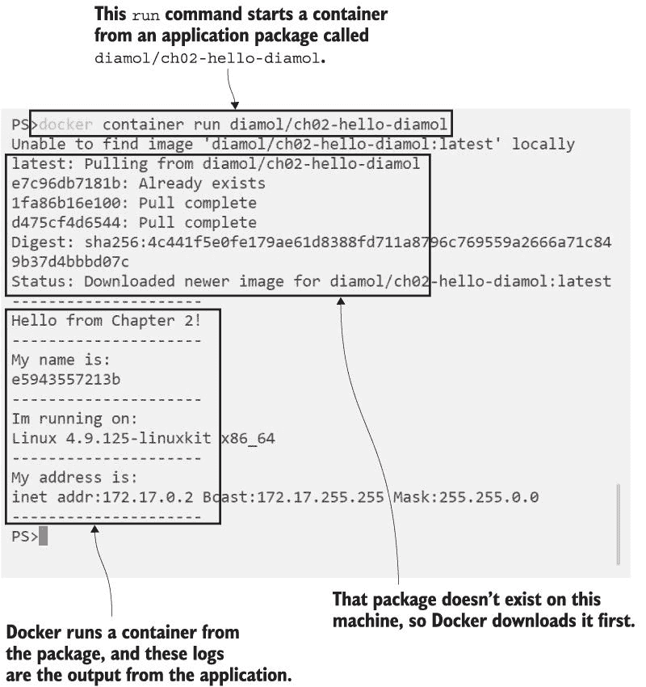
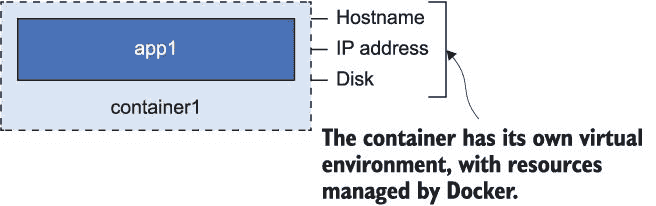
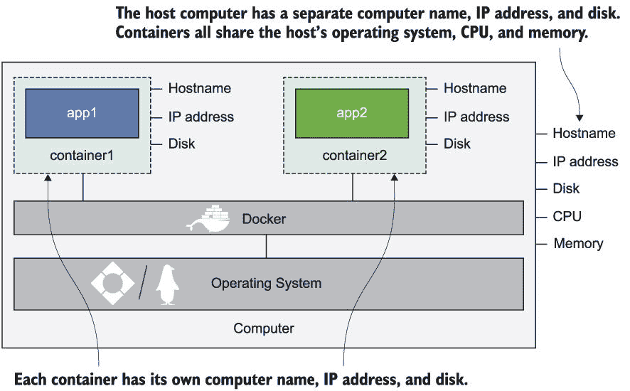
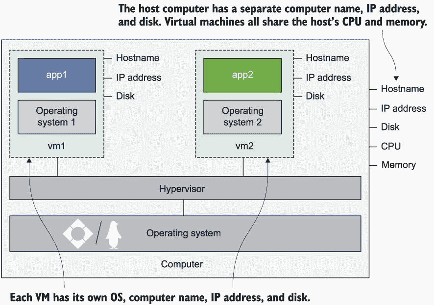
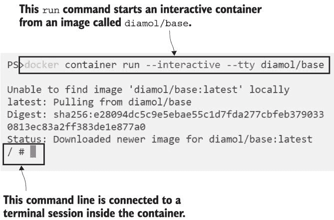
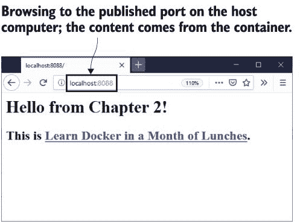
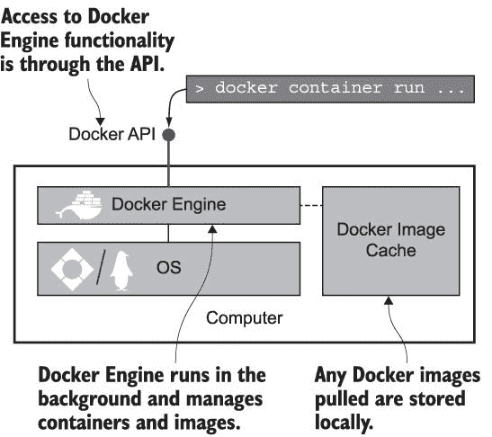
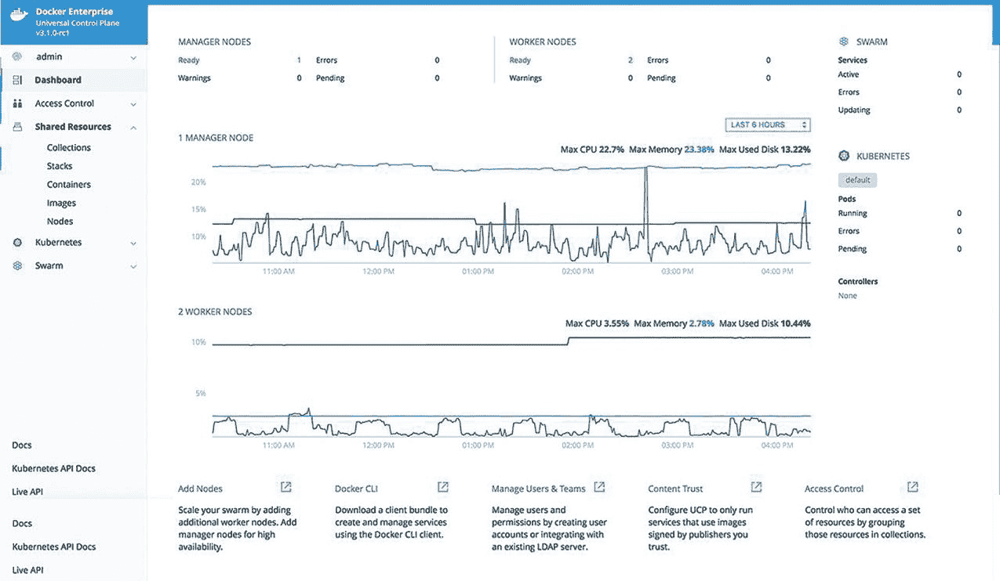

# 2 理解 Docker 和运行 Hello World

是时候亲自动手使用 Docker 了。在这一章中，你将获得大量使用 Docker 核心功能（在容器中运行应用程序）的经验。我还会介绍一些背景知识，这将帮助你确切地了解什么是容器，以及为什么容器是运行应用程序如此轻量级的方式。大部分时间你将跟随“试试看”练习，运行简单的命令，以获得这种新的应用程序工作方式的感觉。

## 2.1 在容器中运行 Hello World

让我们以运行 Hello World 的方式开始使用 Docker，就像我们开始任何新的计算概念一样：运行 Hello World。你从第一章开始就有 Docker 在运行，所以打开你最喜欢的终端--这可能是 Mac 上的 Terminal 或 Linux 上的 Bash shell，我推荐 Windows 上的 PowerShell。

你将向 Docker 发送一个命令，告诉它运行一个打印一些简单“Hello, World”文本的容器。

现在试试吧 输入以下命令，这将运行 Hello World 容器：

`docker container run diamol/ch02-hello-diamol`

当我们完成这一章时，你会确切地了解这里发生了什么。现在，只需看看输出。它将类似于图 2.1。

图 2.1 运行 Hello World 容器的输出。你可以看到 Docker 正在下载应用程序包（称为“镜像”），在一个容器中运行应用程序，并显示输出。

输出中有很多内容。我将缩短未来的代码列表以保持它们简短，但这是第一个，我想完整地展示它，这样我们就可以分析它。

首先，实际上发生了什么？`docker` `container` `run` 命令告诉 Docker 在一个容器中运行一个应用程序。这个应用程序已经被打包以在 Docker 中运行，并且已经发布在一个任何人都可以访问的公共网站上。容器包（Docker 称之为“镜像”）的名称为`diamol/ ch02-hello-diamol`（我在整本书中都会使用这个缩写 diamol--它代表 Docker In A Month Of Lunches）。你刚刚输入的命令告诉 Docker 从这个镜像中运行一个容器。

Docker 在运行使用该镜像的容器之前，需要在本地有一个该镜像的副本。第一次运行这个命令时，你不会有该镜像的副本，你可以在第一行输出中看到：`unable` `to` `find` `image` `locally` 。然后 Docker 下载该镜像（Docker 称之为“pull”），你可以看到该镜像已经被下载。

现在 Docker 使用该镜像启动一个容器。该镜像包含了应用程序的所有内容，以及告诉 Docker 如何启动应用程序的指令。这个镜像中的应用程序只是一个简单的脚本，你可以看到输出结果，它启动了`Hello` `from` `Chapter` `2!` 它写出了关于它在上面运行的计算机的一些详细信息：

+   机器名称，在这个例子中是`e5943557213b`

+   操作系统，在这个例子中是`Linux` `4.9.125-linuxkit` `x86_64`

+   网络地址，在这个例子中是`172.17.0.2`

我说你的输出将“类似于这样”——它不会完全相同，因为容器获取的一些信息取决于你的计算机。我在一个运行 Linux 操作系统和 64 位 Intel 处理器的机器上运行了这个命令。如果你使用 Windows 容器运行它，`I'm` `running` `on`行将显示以下内容：

` ---------------------` ` 我在以下系统上运行:` ` Microsoft Windows [Version 10.0.17763.557]` ` ---------------------`

如果你正在使用树莓派，输出将显示它使用的是不同的处理器（`armv7l`是 ARM 32 位处理器的代号，而`x86_64`是 Intel 64 位处理器的代号）：

` ---------------------` ` 我在以下系统上运行:` ` Linux 4.19.42-v7+ armv7l` ` ---------------------`

这是一个非常简单的示例应用程序，但它展示了 Docker 的核心工作流程。有人将他们的应用程序打包到容器中运行（我为这个应用程序做了这件事，但你在下一章中会自己做），然后发布它，使其可供其他用户使用。然后任何有权访问的人都可以在容器中运行该应用程序。Docker 称这为构建、共享、运行。

这是一个非常强大的概念，因为无论应用程序有多复杂，工作流程都是相同的。在这种情况下，它是一个简单的脚本，但它也可以是一个具有多个组件、配置文件和库的 Java 应用程序。工作流程将完全相同。而且 Docker 镜像可以打包在支持 Docker 的任何计算机上运行，这使得应用程序完全可移植——可移植性是 Docker 的关键优势之一。

如果你使用相同的命令运行另一个容器会发生什么？

现在试试看，重复执行完全相同的 Docker 命令：

`` `docker container run diamol/ch02-hello-diamol` ``

你将看到与第一次运行类似的输出，但会有所不同。Docker 已经在本地有了一个镜像的副本，因此它不需要首先下载镜像；它直接运行容器。容器输出显示了相同的操作系统详细信息，因为你使用的是同一台计算机，但容器的计算机名和 IP 地址将不同：

`*---------------------*` `Hello from Chapter 2!` `---------------------` `My name is:` `858a26ee2741` `---------------------` `Im running on:` `Linux 4.9.125-linuxkit x86_64` `---------------------` `My address is:` `inet addr:172.17.0.5 Bcast:172.17.255.255 Mask:255.255.0.0` `---------------------`

现在我的应用程序正在名为`858a26ee2741`的机器上运行，IP 地址为`172.17.0.5`。机器名会每次改变，IP 地址也经常改变，但每个容器都在同一台计算机上运行，那么这些不同的机器名和网络地址是从哪里来的？我们将在下一部分理论中探讨这一点，然后回到练习。

## 2.2 容器是什么？

Docker 容器与物理容器有相同的概念——想象它就像一个装有应用程序的盒子。在盒子内部，应用程序似乎拥有自己的计算机：它有自己的机器名和 IP 地址，它还有一个自己的磁盘驱动器（Windows 容器还有自己的 Windows 注册表）。图 2.2 显示了应用程序是如何被容器封装的。

图 2.2 容器环境中的应用程序

这些都是虚拟资源——主机名、IP 地址和文件系统都是由 Docker 创建的。它们是由 Docker 管理的逻辑对象，它们都被组合在一起，以创建一个应用程序可以运行的环境。这就是容器的“盒子”。

盒子内的应用程序看不到盒子外面的任何东西，但盒子是在计算机上运行的，而这个计算机也可以运行许多其他盒子。这些盒子中的应用程序拥有它们各自独立的环境（由 Docker 管理），但它们都共享计算机的 CPU 和内存，并且它们都共享计算机的操作系统。您可以在图 2.3 中看到同一台计算机上的容器是如何隔离的。

图 2.3 一台计算机上的多个容器共享相同的操作系统、CPU 和内存。

这为什么如此重要呢？它解决了计算中的两个相互冲突的问题：隔离和密度。密度意味着尽可能在您的计算机上运行尽可能多的应用程序，以利用您拥有的所有处理器和内存。但是应用程序可能与其他应用程序不兼容——它们可能使用不同的 Java 或.NET 版本，它们可能使用不兼容的工具或库版本，或者其中一个可能具有繁重的工作负载，从而耗尽其他应用程序的处理能力。应用程序确实需要相互隔离，这阻止了您在单个计算机上运行大量应用程序，因此您无法获得密度。

解决该问题的最初尝试是使用虚拟机（VM）。虚拟机在概念上与容器相似，因为它们为你提供了一个运行应用程序的盒子，但虚拟机的盒子需要包含自己的操作系统——它不会共享虚拟机运行所在计算机的操作系统。比较图 2.3，它显示了多个容器，与图 2.4，它显示了同一台计算机上的多个虚拟机。

图 2.4 一台计算机上的多个虚拟机各自拥有自己的操作系统。

这在图中可能看起来只是微小的差异，但它有着巨大的影响。每个虚拟机（VM）都需要自己的操作系统，而这个操作系统可能需要使用数 GB 的内存和大量的 CPU 时间——消耗了本应可用于应用程序的计算能力。还有其他一些问题，比如操作系统的许可费用和维护更新时的负担。虚拟机以牺牲密度为代价提供了隔离。

容器为你提供了这两者。每个容器都共享运行容器的计算机的操作系统，这使得它们非常轻量级。容器启动迅速且运行高效，因此你可以在同一硬件上运行比虚拟机更多的容器——通常是五到十倍。你得到了密度，但每个应用程序都在自己的容器中，因此你也得到了隔离。这是 Docker 的另一个关键特性：效率。

现在你已经知道了 Docker 是如何施展其魔法的。在下一个练习中，我们将更紧密地与容器一起工作。

## 2.3 像远程计算机一样连接到容器

我们运行的第一个容器只做了一件事——应用程序打印了一些文本然后结束。有很多情况下，你只想要做一件事。也许你有一套完整的脚本来自动化某个过程。这些脚本需要特定的工具集来运行，所以你不能只是与同事分享脚本；你还需要分享一个描述设置所有工具的文档，而你的同事需要花费数小时来安装它们。相反，你可以将工具和脚本打包到 Docker 镜像中，分享镜像，然后你的同事可以在不需要额外设置工作的情况下在容器中运行你的脚本。

你还可以以其他方式使用容器。接下来，你将看到如何运行一个容器并连接到容器内部的终端，就像你连接到远程机器一样。你使用相同的`docker` `container` `run`命令，但你需要传递一些额外的标志来运行一个带有连接终端会话的交互式容器。

现在试试 Run the following command in your terminal session:

`docker container run --interactive --tty diamol/base`

`--interactive`标志告诉 Docker 你想要设置与容器的连接，而`--tty`标志意味着你想要连接到容器内部的终端会话。输出将显示 Docker 正在拉取镜像，然后你将留下一个命令提示符。这个命令提示符是容器内部的终端会话，如图 2.5 所示。

图 2.5 运行交互式容器并连接到容器的终端。

与 Windows 上的 Docker 命令完全相同，但你会进入一个 Windows 命令行会话：

` Microsoft Windows [版本 10.0.17763.557]` `(c) 2018 Microsoft Corporation. All rights reserved.` ` C:\>`

无论哪种方式，你现在都在容器内部，你可以运行在命令行中通常可以运行的任何操作系统命令。

现在试试 Run the commands `hostname` and `date` and you’ll see details of the container’s environment:

`/ # hostname` `f1695de1f2ec` `/ # date` `Thu Jun 20 12:18:26 UTC 2019`

如果你想要进一步探索，你需要对你的命令行有所熟悉，但这里你所拥有的是一个连接到远程机器的本地终端会话——这个机器恰好是一个运行在你电脑上的容器。例如，如果你使用安全外壳（SSH）连接到远程 Linux 机器，或者使用远程桌面协议（RDP）连接到远程 Windows Server Core 机器，你将获得与这里使用 Docker 完全相同的体验。

记住，容器是共享你的电脑操作系统的，这就是为什么如果你运行 Linux，你会看到一个 Linux shell；如果你使用 Windows，你会看到一个 Windows 命令行。有些命令对两者都相同（试试 `ping` `google.com` ），但有些则有不同的语法（在 Linux 中，你使用 `ls` 来列出目录内容，而在 Windows 中，你使用 `dir`）。

无论你使用的是哪种操作系统或处理器，Docker 本身都有相同的行为。是容器内的应用程序看到它正在运行在基于 Intel 的 Windows 机器上，或者基于 Arm 的 Linux 机器上。无论容器内运行的是什么，你都可以用 Docker 以相同的方式管理容器。

现在试试打开一个新的终端会话，你可以使用这个命令获取所有运行容器的详细信息：

`docker container ls`

输出显示了每个容器的信息，包括它所使用的镜像、容器 ID 以及 Docker 在容器启动时运行的命令——这是部分缩略输出：

` CONTAINER ID IMAGE        COMMAND  CREATED        STATUS` ` f1695de1f2ec diamol/base "/bin/sh" 16 minutes ago Up 16 minutes`

如果你有一双敏锐的眼睛，你会注意到容器 ID 与容器内部的 hostname 相同。Docker 为它创建的每个容器分配一个随机 ID，其中一部分用于 hostname。有许多 `docker` `container` 命令可以用来与特定的容器交互，你可以使用你想要识别的容器 ID 的前几个字符来识别。

现在试试 `docker` `container` `top` 命令列出了容器中运行的进程。我正在使用 `f1` 作为容器 ID `f1695de1f2ec` 的简称：

` > docker container top f1` ` PID     USER     TIME     COMMAND` ` 69622   root     0:00     /bin/sh`

如果容器中运行着多个进程，Docker 会显示它们所有。对于 Windows 容器来说，情况也是如此，除了容器应用程序外，它们总是有几个后台进程在运行。

现在试试 `docker` `container` `logs` 命令，它会显示容器收集到的任何日志条目：

` > docker container logs f1` ` / # hostname` ` f1695de1f2ec`

Docker 使用容器中应用程序的输出收集日志条目。在这个终端会话的情况下，我看到我运行的命令及其结果，但对于一个真实的应用程序，你会看到你的代码的日志条目。例如，一个 Web 应用程序可能会为每个处理的 HTTP 请求写入一个日志条目，这些条目将显示在容器日志中。

现在试试这个命令：`docker container inspect`会显示一个容器的所有详细信息：

`> docker container inspect f1` `` `    {` `         "Id": "f1695de1f2ecd493d17849a709ffb78f5647a0bcd9d10f0d97ada0fcb7b05e98",` `         "Created": "2019-06-20T12:13:52.8360567Z"`

完整的输出显示了大量的底层信息，包括容器虚拟文件系统的路径、容器内运行的命令以及容器连接到的虚拟 Docker 网络--如果你在追踪应用程序的问题时，这些信息都可能很有用。它以大量 JSON 的形式出现，非常适合用脚本自动化，但不太适合在书中的代码列表中，所以我只展示了前几行。

当你与容器一起工作时，需要解决应用程序问题，想要检查进程是否使用了大量 CPU，或者想要查看 Docker 为容器设置的联网情况时，你将经常使用这些命令。

这些练习的另一个目的是帮助你意识到，从 Docker 的角度来看，所有容器看起来都是一样的。Docker 在每个应用程序之上添加了一个一致的管理层。你可以在 Linux 容器中运行一个 10 年的 Java 应用程序，在一个 Windows 容器中运行一个 15 年的.NET 应用程序，在一个树莓派上运行一个全新的 Go 应用程序。你将使用完全相同的命令来管理它们--`run`来启动应用程序，`logs`来读取日志，`top`来查看进程，以及`inspect`来获取详细信息。

你现在已经看到了更多你可以用 Docker 做到的事情；我们将以一些练习来结束，以使应用更加有用。你可以关闭你打开的第二个终端窗口（在那里你运行了`docker container logs`），回到第一个终端，它仍然连接到容器，并运行`exit`来关闭终端会话。

## 2.4 在容器中托管网站

到目前为止，我们已经运行了一些容器。前几个容器运行了一个打印一些文本然后退出的任务。下一个使用了交互标志，并连接我们到容器中的终端会话，该会话一直运行，直到我们退出会话。`docker container ls`将显示你没有容器，因为该命令只显示正在运行的容器。

现在试试这个命令：`docker container ls --all`，它会显示所有状态的容器：

`> docker container ls --all` `CONTAINER ID IMAGE                    COMMAND                     CREATED              STATUS` `f1695de1f2ec diamol/base              "/bin/sh"                   About an hour ago    Exited (0)` `858a26ee2741 diamol/ch02-hello-diamol "/bin/sh -c ./cmd.sh"       3 hours ago          Exited (0)` `2cff9e95ce83 diamol/ch02-hello-diamol "/bin/sh -c ./cmd.sh"       4 hours ago          Exited (0)`

容器的状态为`Exited`。这里有几个关键点需要理解。

首先，容器仅在容器内的应用程序运行时才会运行。一旦应用程序进程结束，容器就会进入退出状态。当脚本完成后，“Hello World”容器会自动退出。我们连接的交互式容器在我们退出终端应用程序后立即退出。

其次，容器在退出后不会消失。处于退出状态的容器仍然存在，这意味着你可以再次启动它们，检查日志，并将文件复制到容器文件系统。你只能通过`docker container ls`看到正在运行的容器，但 Docker 不会删除退出状态的容器，除非你明确告诉它这样做。退出状态的容器仍然占用磁盘空间，因为它们的文件系统保留在计算机的磁盘上。

那么，关于启动那些在后台运行并持续运行的容器，又是怎样的情况呢？这实际上是 Docker 的主要用途：运行服务器应用程序，如网站、批处理和数据库。

现在就试试吧，这里有一个简单的例子，在一个容器中运行网站：

`docker container run --detach --publish 8088:80 diamol/ch02-hello- diamol-web`

这一次，你唯一会看到的输出是一个长的容器 ID，然后你会回到你的命令行。容器仍在后台运行。

现在就试试吧，运行`docker container ls`，你会看到新容器状态为`Up`：

`> docker container ls` `CONTAINER ID IMAGE                        COMMAND                   CREATED        STATUS                 PORTS                NAMES` `e53085ff0cc4 diamol/ch02-hello-diamol-web "bin\\httpd.exe -DFOR..." 52 seconds ago Up 50 seconds 443/tcp, 0.0.0.0:8088->80/tcp reverent_dubinsky`

你刚刚使用的镜像为`diamol/ch02-hello-diamol-web`。这个镜像包含了 Apache 网络服务器和一个简单的 HTML 页面。当你运行这个容器时，你将有一个完整的网络服务器在运行，托管一个自定义网站。位于后台并监听网络流量（在这种情况下是 HTTP 请求）的容器需要在`container run`命令中添加一些额外的标志：

+   `--detach`--在后台启动容器并显示容器 ID

+   `--publish`--将容器的一个端口发布到计算机

运行一个分离的容器只是将容器置于后台，使其启动并保持隐藏，就像 Linux 守护进程或 Windows 服务一样。发布端口需要更多的解释。当你安装 Docker 时，它会将自己注入到你的计算机的网络层。进入你的计算机的流量可以被 Docker 拦截，然后 Docker 可以将这些流量发送到容器。

容器默认情况下不会暴露给外部世界。每个容器都有自己的 IP 地址，但这是一个 Docker 为 Docker 管理的网络创建的 IP 地址——容器没有连接到计算机的物理网络。发布容器端口意味着 Docker 会在计算机端口上监听网络流量，然后将它发送到容器。在先前的例子中，发送到端口 8088 的计算机上的流量将被发送到端口 80 的容器中——你可以在图 2.6 中看到流量流向。

![图片图 2.6 计算机和容器的物理和虚拟网络在这个例子中，我的电脑是运行 Docker 的机器，它的 IP 地址是 `192.168.2.150`。这是我的物理网络的 IP 地址，当我的电脑连接时由路由器分配。Docker 在该电脑上运行了一个容器，该容器的 IP 地址是 `172.0.5.1`。这个地址是由 Docker 为 Docker 管理的虚拟网络分配的。我的网络中的其他电脑无法连接到容器的 IP 地址，因为它只存在于 Docker 中，但它们可以向容器发送流量，因为端口已经被发布。现在试试看 在浏览器中浏览到 *http://localhost:8088*。这是一个对本地计算机的 HTTP 请求，但响应（见图 2.7）来自容器。（这本书绝对不会教你有效的网站设计。）

图 2.7 在本地机器上由容器提供服务的 Web 应用程序

这是一个非常简单的网站，但即便如此，这个应用程序仍然受益于 Docker 带来的可移植性和效率。网页内容与网页服务器打包在一起，因此 Docker 镜像包含了它所需的一切。网页开发者可以在他们的笔记本电脑上运行一个容器，整个应用程序——从 HTML 到网页服务器堆栈——将和在生产环境中由操作员在服务器集群上运行的 100 个容器上运行的应用程序完全相同。

这个容器中的应用程序会无限期地运行，因此容器也会持续运行。你可以使用我们之前使用的 `docker` `container` 命令来管理它。

现在试试看 `docker` `container` `stats`，这也是一个很有用的命令：它显示了容器正在使用的 CPU、内存、网络和磁盘的使用情况。对于 Linux 和 Windows 容器，输出略有不同：

`> docker container stats e53` `CONTAINER ID NAME CPU % PRIV WORKING SET NET I/O` `BLOCK I/O` `e53085ff0cc4 reverent_dubinsky 0.36% 16.88MiB 250kB / 53.2kB` `19.4MB / 6.21MB`

当你完成与容器的操作后，你可以使用 `docker` `container` `rm` 和容器 ID 来删除它，如果容器仍在运行，可以使用 `--force` 标志强制删除。

我们将以一个你将习惯定期运行的最后一个命令结束这个练习。

现在试试 Run this command to remove all your containers:

`docker container rm --force $(docker container ls --all --quiet)`

`$()` 语法将一个命令的输出传递给另一个命令--它在 Linux 和 Mac 终端以及 Windows PowerShell 上都同样有效。结合这些命令可以获取你电脑上所有容器的 ID 列表，并删除它们。这是一种整理容器的不错方法，但请谨慎使用，因为它不会要求确认。

## 2.5 理解 Docker 运行容器的方式

在本章中，我们已经进行了很多“试试看”练习，现在你应该对使用容器的基本操作感到满意了。

在本章的第一个“试试看”中，我谈到了 Docker 核心的构建、共享、运行工作流程。这个工作流程使得软件的分发变得非常容易--我已经构建了所有示例容器镜像并分享了它们，知道你可以在 Docker 中运行它们，并且它们对你和我都会产生相同的效果。现在有大量的项目使用 Docker 作为发布软件的首选方式。你可以尝试新的软件--比如，Elasticsearch、SQL Server 的最新版本，或者 Ghost 博客引擎--使用你在这里使用过的相同类型的 `docker` `container` `run` 命令。

我们将以一些额外的背景知识结束本章，这样你就能对使用 Docker 运行应用程序时实际发生的事情有一个扎实的理解。安装 Docker 和运行容器看似简单--实际上涉及几个不同的组件，如图 2.8 所示。

+   Docker 引擎是 Docker 的管理组件。它负责本地镜像缓存，当你需要时下载镜像，如果已经下载则重用它们。它还与操作系统协同工作以创建容器、虚拟网络以及其他 Docker 资源。引擎是一个始终在后台运行的进程（类似于 Linux 守护进程或 Windows 服务）。

+   Docker 引擎通过 Docker API 提供所有功能，这是一个基于标准的 HTTP REST API。你可以配置引擎，使其 API 只在本地计算机上可用（这是默认设置），或者使其对网络上的其他计算机可用。

+   Docker 命令行界面（CLI）是 Docker API 的客户端。当你运行 Docker 命令时，CLI 实际上会将它们发送到 Docker API，然后 Docker 引擎执行工作。

了解 Docker 的架构是很好的。与 Docker 引擎交互的唯一方式是通过 API，并且有不同选项可以用来访问 API 和保护它。CLI 通过向 API 发送请求来工作。

到目前为止，我们使用 CLI 来管理运行 Docker 的同一台计算机上的容器，但你可以将你的 CLI 指向运行 Docker 的远程计算机上的 API，并控制该机器上的容器——这就是你管理不同环境中的容器（如你的构建服务器、测试和生产环境）的方法。Docker API 在每个操作系统上都是相同的，因此你可以使用你的 Windows 笔记本电脑上的 CLI 来管理你的 Raspberry Pi 上的容器，或者云中的 Linux 服务器上的容器。

图 2.8 Docker 的组件

Docker API 有一个已发布的规范，Docker CLI 不仅仅是唯一的客户端。有几个图形用户界面连接到 Docker API，并为你提供了一个与容器交互的视觉方式。API 揭示了关于容器、镜像和其他 Docker 管理的资源的所有细节，因此它可以支持如图 2.9 所示的丰富仪表板。

图 2.9 Docker 通用控制平面，容器图形用户界面

这是通用控制平面（UCP），Docker 背后公司的商业产品（*[`docs.docker.com/ee/ucp/`](https://docs.docker.com/ee/ucp/)*）。Portainer 是另一个选择，它是一个开源项目。UCP 和 Portainer 都作为容器本身运行，因此它们易于部署和管理。

我们不会比这更深入地探讨 Docker 架构。Docker 引擎使用一个名为 containerd 的组件来实际管理容器，而 containerd 又利用操作系统功能来创建容器所代表的虚拟环境。

你不需要理解容器的底层细节，但了解这一点是好的：containerd 是一个由云原生计算基金会监管的开源组件，运行容器的规范是开放和公共的；它被称为开放容器倡议（OCI）。

Docker 是迄今为止最受欢迎且易于使用的容器平台，但它不是唯一的。你可以放心地投资容器，而不用担心你会被锁定在某个供应商的平台。

## 2.6 实验室：探索容器文件系统

这是本书的第一个实验室，所以这就是它的全部内容。实验室为你设定了一个任务，让你自己完成，这将真正帮助你巩固你在本章中学到的知识。会有一些指导和几个提示，但大部分是关于你超越规定的“现在试试”练习，找到自己的解决问题的方法。

每个实验室在本书的 GitHub 仓库中都有一个示例解决方案。花些时间自己尝试一下是值得的，但如果你想检查我的解决方案，你可以在这里找到：*[`github.com/sixeyed/diamol/tree/master/ch02/lab`](https://github.com/sixeyed/diamol/tree/master/ch02/lab)*。

我们开始吧：你的任务是运行本章中的网站容器，但替换 `index.html` 文件，这样当你浏览到容器时，你会看到一个不同的主页（你可以使用你喜欢的任何内容）。记住，容器有自己的文件系统，在这个应用程序中，网站正在提供位于容器文件系统上的文件。

这里有一些提示来帮助你开始：

+   您可以通过运行 `docker` `container` 来获取您可以在容器上执行的所有操作的列表。

+   在任何 `docker` 命令中添加 `--help`，你将看到更详细的帮助文本。

+   在 `diamol/ch02-hello-diamol-web` Docker 镜像中，网站内容是从目录 `/usr/local/apache2/htdocs`（在 Windows 上是 `C:\usr\local\apache2\htdocs`）提供的。

祝你好运 :)
