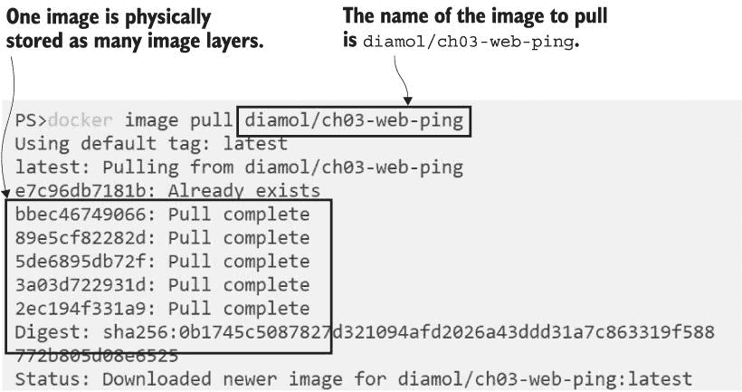
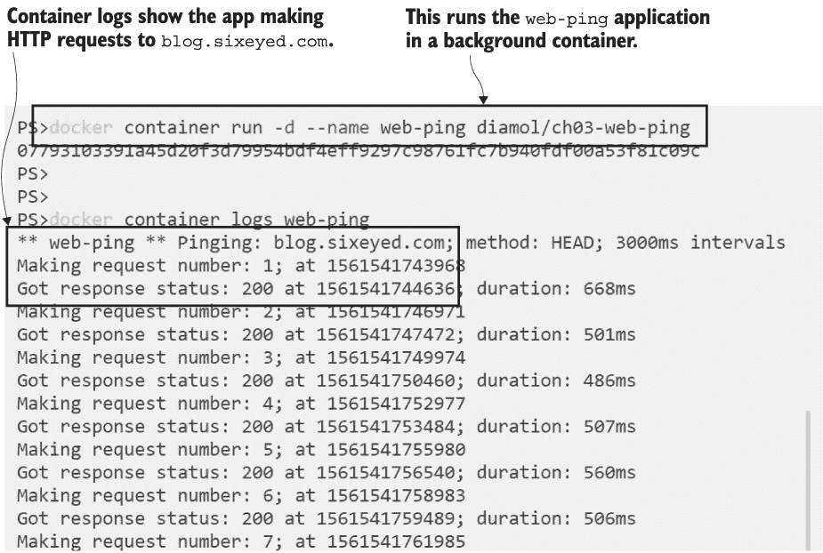
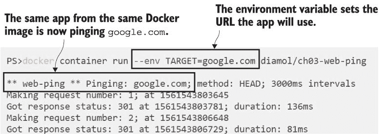
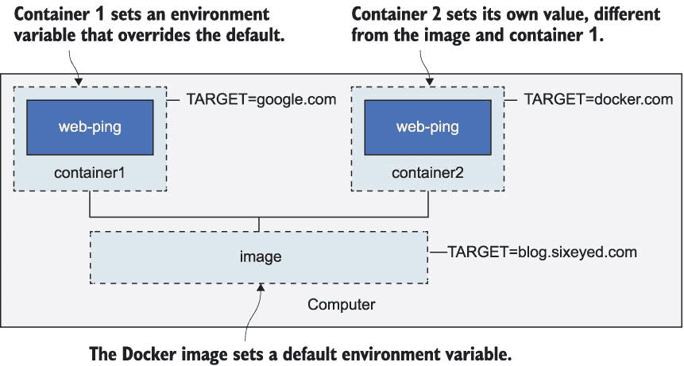
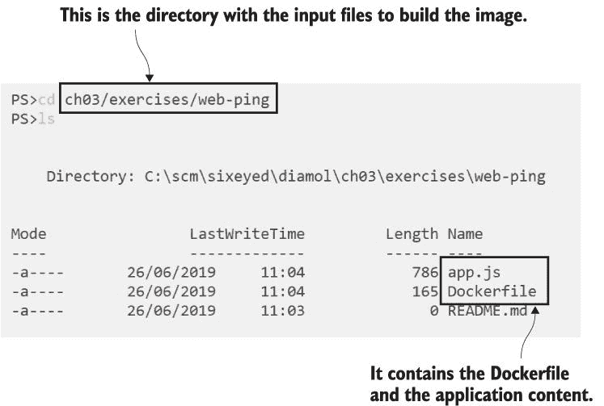
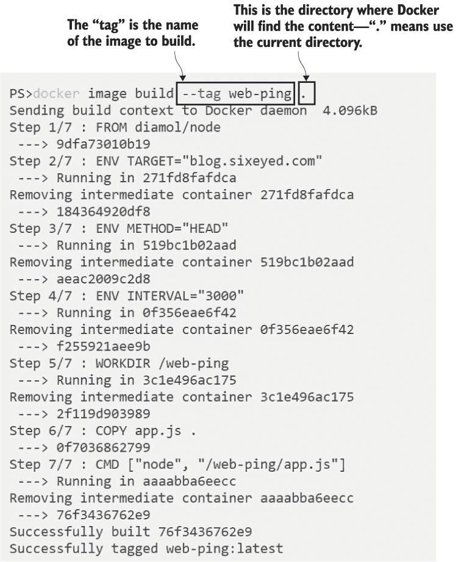
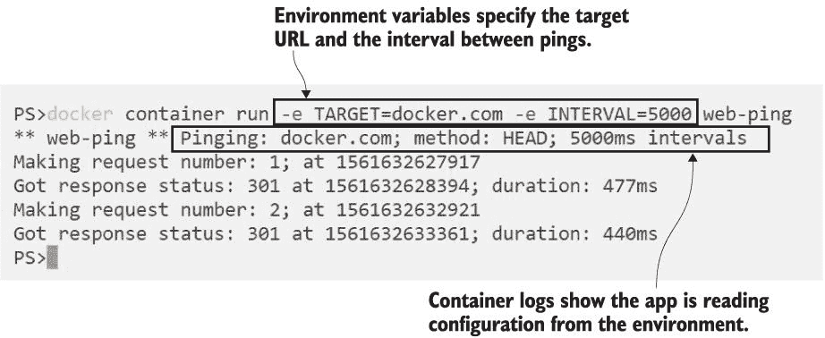
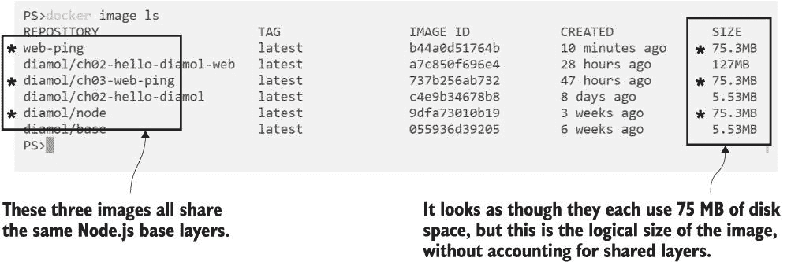
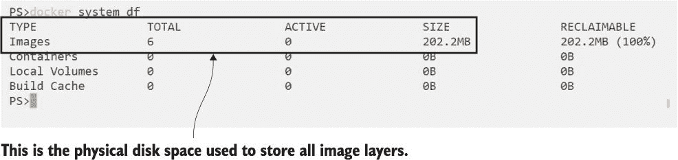
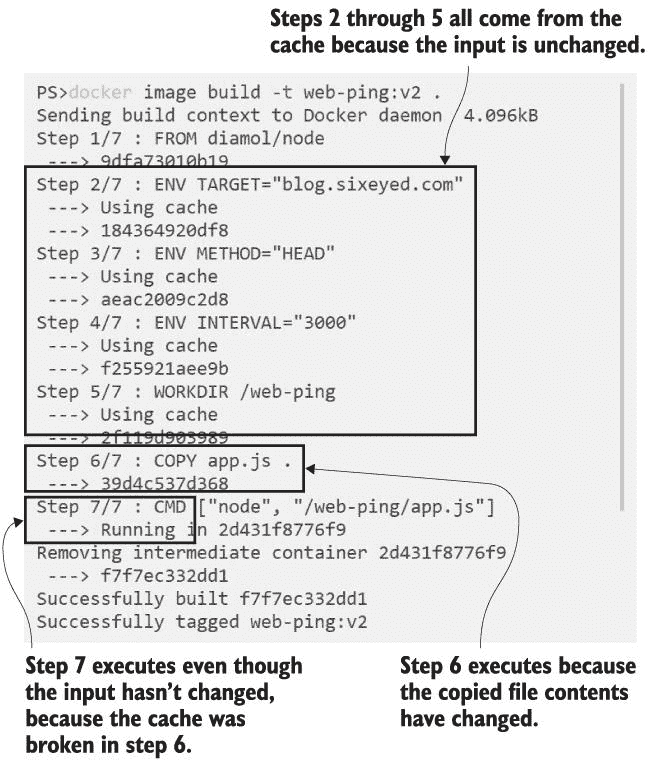

# 3 构建自己的 Docker 镜像

在上一章中，你已经运行了一些容器并使用 Docker 来管理它们。容器无论应用程序使用什么技术栈，都能提供一致的应用体验。到目前为止，你使用的是我构建和分享的 Docker 镜像；在本章中，你将了解如何构建自己的镜像。这里你将学习 Dockerfile 语法，以及你在容器化自己的应用程序时始终会使用的某些关键模式。

## 3.1 从 Docker Hub 使用容器镜像

我们将从本章中构建的镜像的最终版本开始，这样你可以看到它是如何设计得与 Docker 一起良好工作的。现在试试看的练习都使用一个名为 web-ping 的简单应用程序，该应用程序检查网站是否运行。该应用程序将在容器中运行，并每三秒向我的博客的 URL 发送 HTTP 请求，直到容器停止。

你可以从第二章了解到，如果容器镜像尚未在您的机器上，`docker container run` 会本地下载该镜像。这是因为软件分发已经内置到 Docker 平台中。你可以让 Docker 为你管理这些，当需要时它会拉取镜像，或者你可以使用 Docker CLI 明确地拉取镜像。

现在试试看 拉取 web-ping 应用程序的容器镜像：

`docker image pull diamol/ch03-web-ping`

你会看到类似于图 3.1 中的我的输出。

图 3.1 从 Docker Hub 拉取镜像

镜像名称是 `diamol/ch03-web-ping`，它存储在 Docker Hub 上，这是 Docker 默认查找镜像的位置。镜像服务器被称为注册表，Docker Hub 是一个你可以免费使用的公共注册表。Docker Hub 还有一个网页界面，你可以在 *[`hub.docker.com/r/diamol/ch03-web-ping`](https://hub.docker.com/r/diamol/ch03-web-ping)* 找到关于这个镜像的详细信息。

`docker image pull` 命令有一些有趣的输出，它显示了镜像是如何存储的。Docker 镜像在逻辑上是一件事——你可以把它想象成一个包含整个应用程序堆栈的大 zip 文件。这个镜像包含了 Node.js 运行时以及我的应用程序代码。

在拉取过程中，你不会看到单个文件被下载；你会看到许多正在进行的下载。这些被称为镜像层。Docker 镜像在物理上存储为许多小文件，Docker 将它们组装在一起以创建容器的文件系统。当所有层都被拉取后，完整的镜像就可以使用了。

现在试试看 让我们从这个镜像中运行一个容器，看看应用程序做了什么：

`docker container run -d --name web-ping diamol/ch03-web-ping`

`-d` 标志是 `--detach` 的简写，因此这个容器将在后台运行。应用程序像批处理作业一样运行，没有用户界面。与第二章中我们运行的分离的网站容器不同，这个容器不接受传入流量，因此你不需要发布任何端口。

在这个命令中有一个新的标志，就是`--name`。你知道你可以使用 Docker 生成的 ID 来处理容器，但你也可以给它们一个友好的名称。这个容器被称为`web-ping`，你可以使用这个名字来引用容器而不是使用随机的 ID。

我的博客现在正被你容器中运行的应用程序 ping。该应用程序在一个无限循环中运行，你可以使用与第二章中熟悉相同的`docker` `container`命令来查看它在做什么。

现在试试看 查看应用程序的日志，这些日志正在由 Docker 收集：

`docker container logs web-ping`

你将看到图 3.2 中的输出，显示应用程序正在向*[blog.sixeyed.com](http://blog.sixeyed.com)* 发送 HTTP 请求。

图 3.2 网络 ping 容器正在运行，向我的博客发送持续流量

一个能够发送网络请求并记录响应时间的应用程序非常有用——你可以将其用作监控网站运行时间的依据。但这个应用程序看起来是硬编码来使用我的博客，所以除了我之外对任何人来说都几乎毫无用处。

除了它不是之外。该应用程序实际上可以被配置为使用不同的 URL，请求之间的不同间隔，甚至是不同类型的 HTTP 调用。这个应用程序从系统的环境变量中读取它应该使用的配置值。

环境变量是操作系统提供的关键/值对。在 Windows 和 Linux 上它们以相同的方式工作，并且是存储小块数据的非常简单的方式。Docker 容器也有环境变量，但它们不是来自计算机的操作系统，而是由 Docker 以创建容器的主机名和 IP 地址相同的方式设置。

web-ping 镜像为环境变量设置了一些默认值。当你运行一个容器时，Docker 会填充这些环境变量，这就是应用程序用来配置网站 URL 的方式。你可以在创建容器时指定不同的环境变量值，这将改变应用程序的行为。

现在试试看 移除现有的容器，并运行一个新的容器，为`TARGET`环境变量指定一个值：

` docker rm -f web-ping` ` docker container run --env TARGET=google.com diamol/ch03-web-ping`

你这次的输出将看起来像图 3.3 中的我的输出。

图 3.3 来自同一镜像的容器，向 Google 发送流量

这个容器正在做不同的事情。首先，它正在交互式运行，因为你没有使用`--detach`标志，所以应用程序的输出显示在你的控制台上。容器将继续运行，直到你通过按 Ctrl-C 结束应用程序。其次，它现在正在 ping google.com 而不是 blog.sixeyed.com。

这将是本章中你将获得的主要收获之一--Docker 镜像可能包含应用程序的默认配置值集，但你应该能够在运行容器时提供不同的配置设置。

环境变量是一种非常简单的方式来实现这一点。web-ping 应用程序代码会查找一个键为 `TARGET` 的环境变量。该键在镜像中设置为 `blog.sixeyed.com` 的值，但你可以通过使用 `docker container run` 命令中的 `--env` 标志来提供不同的值。图 3.4 显示了容器有自己的设置，彼此不同，也与镜像不同。

主机计算机也有它自己的环境变量集，但它们与容器是分开的。每个容器只包含 Docker 填充的环境变量。图 3.4 中的重要之处在于，每个容器中的 web-ping 应用程序是相同的--它们使用相同的镜像，因此应用程序运行的是完全相同的二进制文件集，但由于配置不同，行为不同。

图 3.4 Docker 镜像和容器中的环境变量

提供这种灵活性的责任在于 Docker 镜像的作者，你现在将看到如何做到这一点，因为你将从一个 Dockerfile 构建你的第一个 Docker 镜像。

## 3.2 编写你的第一个 Dockerfile

Dockerfile 是你编写的一个简单的脚本，用于打包应用程序--它是一组指令，Docker 镜像是输出结果。Dockerfile 语法易于学习，你可以使用 Dockerfile 打包任何类型的应用程序。就脚本语言而言，它非常灵活。常见任务有自己的命令，而对于任何需要定制的任务，你可以使用标准 shell 命令（Linux 上的 Bash 或 Windows 上的 PowerShell）。列表 3.1 展示了打包 web-ping 应用程序的完整 Dockerfile。

列表 3.1 web-ping Dockerfile

` FROM diamol/node` ` ENV TARGET="blog.sixeyed.com"` ` ENV METHOD="HEAD"` ` ENV INTERVAL="3000"` ` WORKDIR /web-ping` ` COPY app.js .` ` CMD ["node", "/web-ping/app.js"]`

即使这是你第一次看到 Dockerfile，你也许可以很好地猜测这里发生了什么。Dockerfile 指令是 `FROM`、`ENV`、`WORKDIR`、`COPY` 和 `CMD`；它们是大写字母，但这是一种约定，不是必需的。以下是每个指令的分解：

+   `FROM` --每个镜像都必须从一个镜像开始。在这种情况下，`web-ping` 镜像将使用 `diamol/node` 镜像作为其起点。该镜像已安装 Node.js，这是 web-ping 应用程序运行所需的一切。

+   `ENV` -- 设置环境变量的值。语法是 `[key]="[value]"`，这里有三个 `ENV` 指令，分别设置三个不同的环境变量。

+   `WORKDIR` -- 在容器镜像文件系统中创建一个目录，并将其设置为当前工作目录。正斜杠语法适用于 Linux 和 Windows 容器，因此这将在 Linux 上创建 `/web-ping`，在 Windows 上创建 `C:\web-ping`。

+   `COPY` -- 从本地文件系统复制文件或目录到容器镜像。语法是 `[source path] [target path]` -- 在这种情况下，我正在将 app.js 从我的本地机器复制到镜像中的工作目录。

+   `CMD` -- 指定在 Docker 从镜像启动容器时要运行的命令。这会运行 Node.js，启动 app.js 中的应用程序代码。

就这些了。这些指令几乎就是您在 Docker 中打包自己的应用程序所需的所有内容，并且在这五行中已经包含了一些良好的实践。

现在试试看。您不需要复制和粘贴这个 Dockerfile；它都在本书的源代码中，您在第一章中克隆或下载了它。导航到您下载它的位置，并检查您是否拥有构建此镜像所需的所有文件：

`cd ch03/exercises/web-ping` `ls`

您应该看到您有三个文件：

+   Dockerfile（没有文件扩展名），其内容与列表 3.1 相同

+   app.js，其中包含 web-ping 应用的 Node.js 代码

+   README.md，它只是使用镜像的文档

您可以在图 3.5 中看到这些内容。

您不需要了解 Node.js 或 JavaScript 就可以打包此应用并在 Docker 中运行它。如果您查看 app.js 中的代码，您会看到它相当基础，并且它使用标准的 Node.js 库来执行 HTTP 调用并从环境变量中获取配置值。

在这个目录中，您拥有构建 web-ping 应用程序镜像所需的一切。

图 3.5 构建 Docker 镜像所需的内容

## 3.3 构建自己的容器镜像

Docker 在从 Dockerfile 构建镜像之前需要知道一些事情。它需要一个镜像的名称，并且它需要知道所有将要打包到镜像中的文件的存储位置。您已经在正确的目录中打开了一个终端，所以您已经准备好了。

现在试试看。通过运行 `docker image build` 将这个 Dockerfile 转换为 Docker 镜像：

`docker image build --tag web-ping .`

`--tag` 参数是镜像的名称，最后一个参数是 Dockerfile 和相关文件所在的目录。Docker 将此目录称为“上下文”，点号表示“使用当前目录”。您将看到 `build` 命令的输出，执行 Dockerfile 中的所有指令。我的构建过程如图 3.6 所示。

如果你从`build`命令收到了任何错误，你首先需要检查 Docker Engine 是否已启动。你需要确保 Windows 或 Mac 上的 Docker Desktop 应用程序正在运行（检查任务栏中的鲸鱼图标）。然后检查你是否在正确的目录中。你应该在`ch03-web-ping`目录中，那里有 Dockerfile 和 app.js 文件。最后，检查你是否正确输入了`build`命令--命令末尾的点号是必需的，它告诉 Docker 构建上下文是当前目录。

图 3.6 构建 web-ping Docker 镜像的输出

如果在构建过程中收到关于文件权限的警告，那是因为你正在使用 Windows 上的 Docker 命令行来构建 Linux 容器，这是由于 Docker Desktop 的 Linux 容器模式所致。Windows 不会像 Linux 那样记录文件权限，所以这个警告是在告诉你，从你的 Windows 机器复制过来的所有文件在 Linux Docker 镜像中都被设置为具有完全的读写权限。

当你在输出中看到“成功构建”和“成功标记”的消息时，你的镜像就构建完成了。它存储在本地镜像缓存中，你可以使用 Docker 命令来列出镜像。

TRY IT NOW 列出所有以“w”开头的标签名的镜像：

`docker image ls 'w*'`

你将看到你的 web-ping 镜像被列出：

` > docker image ls w*` ` REPOSITORY TAG    IMAGE ID     CREATED        SIZE` ` web-ping   latest f2a5c430ab2a 14 minutes ago 75.3MB`

你可以使用这个镜像，就像你从 Docker Hub 下载的那个一样。应用程序的内容是相同的，配置设置可以通过环境变量应用。

现在试试 Run a container from your own image to ping Docker’s website every five seconds:

`docker container run -e TARGET=docker.com -e INTERVAL=5000 web-ping`

你的输出将像我图 3.7 中的那样，第一条日志确认目标 Web URL 是 docker.com，ping 间隔是 5000 毫秒。

图 3.7 从你的镜像运行 web-ping 容器

该容器正在前台运行，所以你需要使用 Ctrl-C 来停止它。这会结束应用程序，容器将进入退出状态。

你已经打包了一个简单的应用程序，使其在 Docker 中运行，对于更复杂的应用程序，这个过程也是完全相同的。你编写 Dockerfile，包含所有打包应用程序的步骤，收集需要放入 Docker 镜像中的资源，并决定你希望你的镜像用户如何配置应用程序的行为。

## 3.4 理解 Docker 镜像和镜像层

你将在阅读这本书的过程中构建很多镜像。对于本章，我们将坚持使用这个简单的镜像，并使用它来更好地理解镜像的工作原理，以及镜像和容器之间的关系。

Docker 镜像包含你打包的所有文件，这些文件成为容器的文件系统，它还包含关于镜像本身的许多元数据。这包括镜像构建的简要历史。你可以用它来查看镜像的每一层以及构建层的命令。

现在试试看。检查你的 web-ping 镜像的历史：

`docker image history web-ping`

你将看到每个镜像层的输出行；这些是我镜像的前几行（缩略）：

` > docker image history web-ping` ` IMAGE        CREATED      CREATED BY` ` 47eeeb7cd600 30 hours ago /bin/sh -c #(nop) CMD "node" "/web-ping/ap...` ` <missing>    30 hours ago /bin/sh -c #(nop) COPY file:a7cae366c9996502...` ` <missing>    30 hours ago /bin/sh -c #(nop) WORKDIR /web-ping`

`CREATED` 和 `BY` 命令是 Dockerfile 指令——存在一对一的关系，所以 Dockerfile 中的每一行都创建一个镜像层。我们将深入一点理论，因为理解镜像层是您高效使用 Docker 的关键。

Docker 镜像是一组逻辑上的镜像层。层是物理存储在 Docker Engine 缓存中的文件。这为什么很重要：镜像层可以在不同的镜像和不同的容器之间共享。如果你有很多运行 Node.js 应用的容器，它们将共享包含 Node.js 运行时的同一组镜像层。图 3.8 展示了这是如何工作的。

![图 3.8 镜像层如何逻辑地构建到 Docker 镜像中`diamol/node` 镜像有一个精简的操作系统层，然后是 Node.js 运行时。Linux 镜像占用大约 75 MB 的磁盘空间（Windows 容器的基 OS 层更大，所以镜像的 Windows 版本使用接近 300 MB）。你的`web-ping`镜像基于`diamol/node`，所以它从该镜像的所有层开始——这就是 Dockerfile 中的`FROM`指令给你提供的。你打包在基础镜像之上的`app.js`文件只有几 KB 大小，所以`web-ping`镜像的总大小是多少？现在试试看。你可以使用 `docker image ls` 来列出镜像，这也会显示镜像的大小。如果你在命令中不包含过滤器，你会看到所有镜像：`docker image ls`你的输出将像我图 3.9 中展示的那样。

图 3.9 列出镜像以查看它们的大小

看起来所有的 Node.js 镜像占用的空间相同——Linux 上每个 75 MB。有三个这样的镜像：`diamol/node`，这是你在`diamol/ch03-web-ping`从 Docker Hub 拉取的原始示例应用，以及你在`web-ping`中自己构建的版本。它们应该共享基础镜像层，但`docker image ls`的输出表明它们每个都是 75 MB 大小，所以总共是 75 * 3 = 225 MB。

但并不完全是这样。你看到的尺寸列是镜像的逻辑大小——这是如果没有其他镜像在你的系统上，该镜像将使用的磁盘空间量。如果你有其他共享层的镜像，Docker 使用的磁盘空间要小得多。你无法从镜像列表中看到这一点，但有一些 Docker 系统命令可以告诉你更多信息。

现在试试。我的镜像列表显示总共有 363.96 MB 的镜像，但这只是逻辑大小。`system df`命令显示了 Docker 实际使用的磁盘空间：

`docker system df`

你可以在图 3.10 中看到，我的镜像缓存实际上使用了 202.2 MB，这意味着 163 MB 的镜像层在镜像之间被共享，节省了 45%的磁盘空间。当你有大量应用程序镜像都共享相同的运行时基础层时，通过重用节省的磁盘空间量通常要大得多。这些基础层可能有 Java、.NET Core、PHP——无论你使用什么技术栈，Docker 的行为都是相同的。

图 3.10 检查 Docker 的磁盘空间使用情况

最后一点理论。如果镜像层被共享，它们不能被编辑——否则一个镜像的变化会级联到所有共享更改层的其他镜像。Docker 通过使镜像层只读来强制执行这一点。一旦通过构建镜像创建了一个层，该层就可以被其他镜像共享，但不能被更改。你可以通过优化你的 Dockerfile 来利用这一点，使你的 Docker 镜像更小，构建更快。

## 3.5 优化 Dockerfile 以使用镜像层缓存

你的`web-ping`镜像中有一层包含应用程序的 JavaScript 文件。如果你修改了该文件并重新构建你的镜像，你将得到一个新的镜像层。Docker 假设 Docker 镜像中的层按照一个定义的顺序排列，所以如果你在序列中间修改了一个层，Docker 不会假设它可以重用序列中的后续层。

现在试试。修改`ch03-web-ping`目录中的`app.js`文件。不需要是代码更改；只需在文件末尾添加一个新空行即可。然后构建你 Docker 镜像的新版本：

`docker image build -t web-ping:v2 .`

你将看到与我图 3.11 中相同的输出。构建步骤 2 到 5 使用缓存中的层，步骤 6 和 7 生成新的层。

图 3.11 构建可以使用缓存的层的镜像

每个 Dockerfile 指令都会生成一个镜像层，但如果指令在构建之间没有变化，并且进入指令的内容相同，Docker 知道它可以使用缓存中的先前层。这样可以节省再次执行 Dockerfile 指令并生成重复层。输入是相同的，所以输出也将是相同的，因此 Docker 可以使用缓存中已有的内容。

Docker 通过生成一个哈希值来判断输入是否与缓存中的内容匹配，这个哈希值就像输入的数字指纹。哈希值是由 Dockerfile 指令和任何被复制的文件的内容生成的。如果现有镜像层中没有与该哈希值匹配的内容，Docker 将执行指令，这会破坏缓存。一旦缓存被破坏，Docker 将执行后续的所有指令，即使它们没有发生变化。

即使在这个小示例镜像中，这也产生了影响。`app.js`文件自上次构建以来已更改，因此步骤 6 中的`COPY`指令需要运行。步骤 7 中的`CMD`指令与上次构建相同，但由于步骤 6 中缓存被破坏，该指令也会运行。

你编写的任何 Dockerfile 都应该进行优化，以便指令按照它们变化的频率进行排序——在 Dockerfile 的开始处放置不太可能改变的指令，在末尾放置最可能改变的指令。目标是让大多数构建只需要执行最后的指令，其他所有内容都使用缓存。当你开始共享你的镜像时，这可以节省时间、磁盘空间和网络带宽。

web-ping Dockerfile 中只有七个指令，但它仍然可以进行优化。`CMD`指令不需要放在 Dockerfile 的末尾；它可以在`FROM`指令之后任何位置，并且仍然会产生相同的结果。由于它不太可能改变，所以你可以将它移动到更靠近顶部的地方。并且可以使用一个`ENV`指令来设置多个环境变量，所以三个单独的`ENV`指令可以合并。优化后的 Dockerfile 显示在列表 3.2 中。

列表 3.2 优化后的 web-ping Dockerfile

` FROM diamol/node` ` CMD ["node", "/web-ping/app.js"]` ` ENV TARGET="blog.sixeyed.com" \` `       METHOD="HEAD" \` `       INTERVAL="3000"` ` WORKDIR /web-ping` ` COPY app.js .`

现在尝试一下 优化后的 Dockerfile 也包含在本章的源代码中。切换到`web-ping-optimized`文件夹，并从新的 Dockerfile 构建镜像：

` cd ../web-ping-optimized` ` docker image build -t web-ping:v3 .`

与之前的构建相比，你不会注意到太大的差异。现在有五个步骤而不是七个，但最终结果是一样的——你可以从这个镜像运行容器，它的行为就像其他版本一样。但现在，如果你更改了`app.js`中的应用程序代码并重新构建，除了最后的步骤之外，所有步骤都来自缓存，这正是你想要的，因为这就是你更改的全部内容。

本章关于构建镜像的内容到此结束。你已经看到了 Dockerfile 的语法和需要了解的关键指令，并且学习了如何从 Docker CLI 构建和使用镜像。

从本章中还可以提取两个重要的事项，这些事项将有助于您构建的每一个镜像：优化您的 Dockerfile，并确保您的镜像具有可移植性，以便在部署到不同环境时使用相同的镜像。这实际上意味着您应该注意如何结构化您的 Dockerfile 指令，并确保应用程序可以从容器中读取配置值。这意味着您可以快速构建镜像，并且在部署到生产环境时，您使用的是在测试环境中经过质量审核的完全相同的镜像。

## 3.6 实验室

好的，现在是实验室时间。这里的目的是回答这个问题：如何在没有 Dockerfile 的情况下创建 Docker 镜像？Dockerfile 用于自动化应用程序的部署，但您并不总是能够自动化一切。有时您需要手动运行应用程序并完成一些步骤，而这些步骤无法被脚本化。

这个实验室是这个更简单版本的。您将从一个 Docker Hub 上的镜像开始：`diamol/ch03-lab`。这个镜像在路径 `/diamol/ch03.txt` 处有一个文件。您需要更新这个文本文件并在末尾添加您的名字。然后使用您更改的文件创建自己的镜像。不允许使用 Dockerfile。

如果需要，可以在本书的 GitHub 仓库中找到示例解决方案。您可以在以下链接找到它：*[`github.com/sixeyed/diamol/tree/master/ch03/lab`](https://github.com/sixeyed/diamol/tree/master/ch03/lab)*。

这里有一些提示来帮助您开始：

+   记住 `-it` 标志可以让您以交互方式运行到容器中。

+   容器的文件系统在退出时仍然存在。

+   还有许多您尚未使用的命令。`docker container --help` 将显示两个可能帮助您解决实验室问题的命令。
