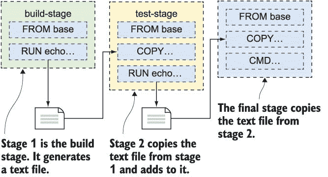
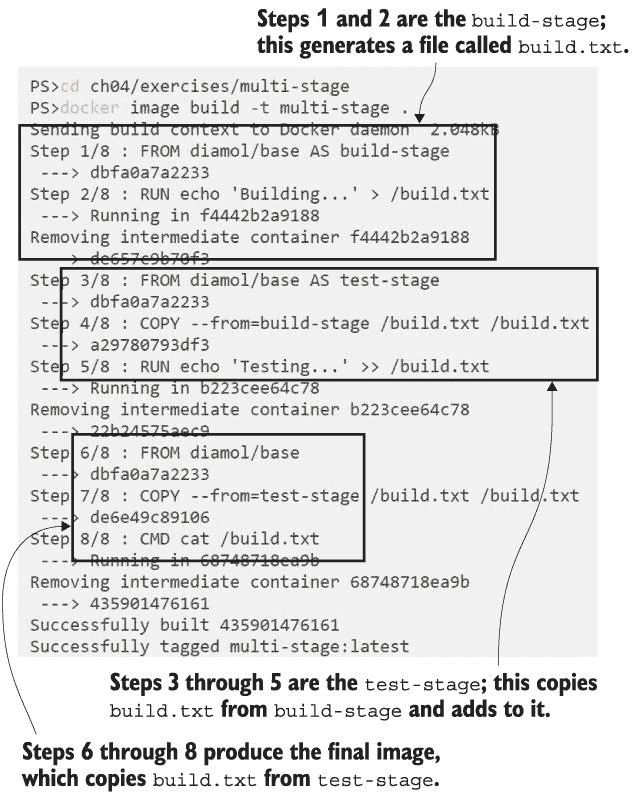
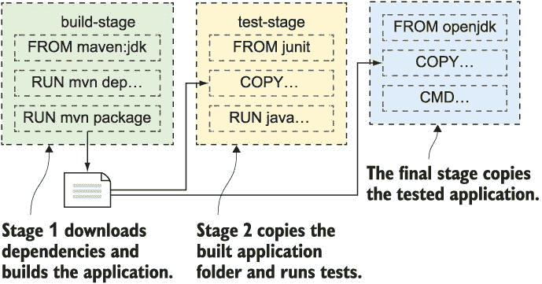
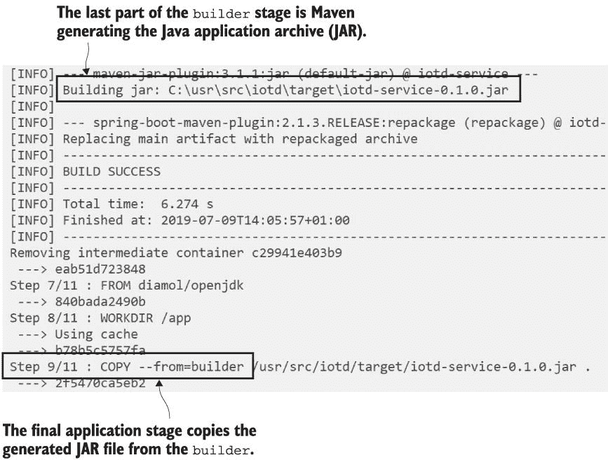
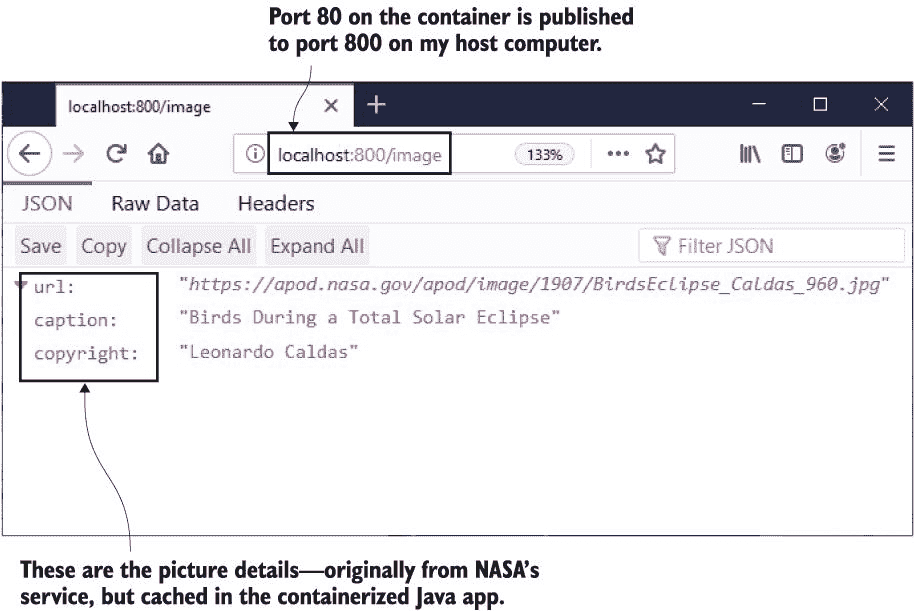
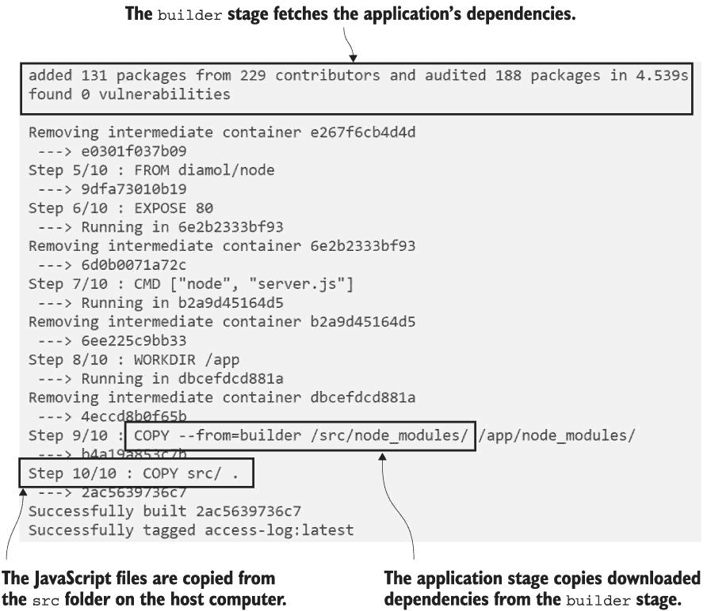
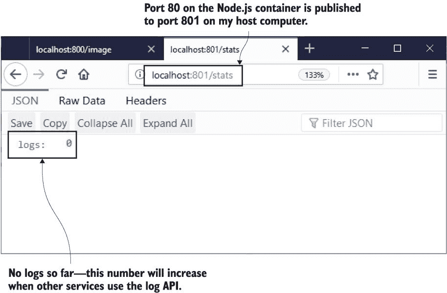
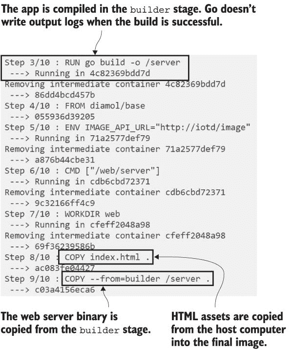
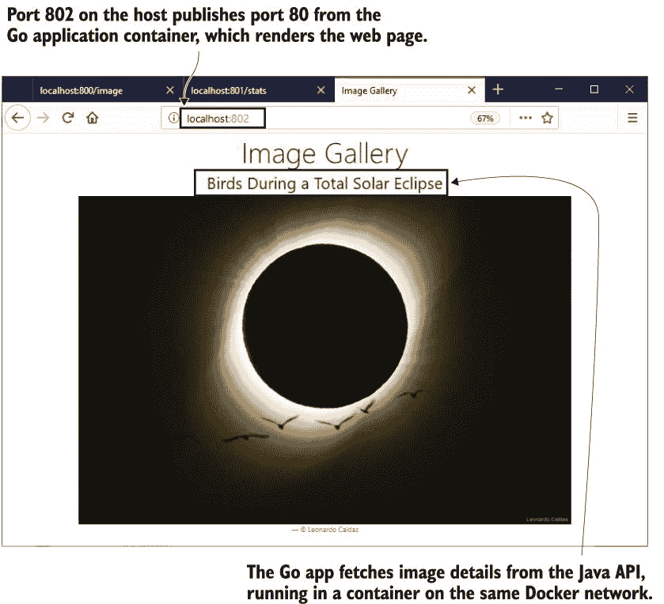

# 4 从源代码打包应用程序到 Docker 镜像

构建 Docker 镜像很容易。在第三章中，你学习了只需要在 Dockerfile 中添加一些指令就可以打包一个在容器中运行的应用程序。你需要知道另一件事来打包你自己的应用程序：你还可以在 Dockerfile 中运行命令。

命令在构建过程中执行，并且任何来自命令的文件系统更改都将保存在镜像层中。这使得 Dockerfile 变成了最灵活的打包格式之一；你可以展开 zip 文件，运行 Windows 安装程序，以及做几乎所有其他事情。在本章中，你将利用这种灵活性来从源代码打包应用程序。

## 4.1 当你有 Dockerfile 时，还需要构建服务器吗？

在你的笔记本电脑上构建软件是你在本地开发时做的事情，但当你在一个团队中工作时，有一个更严格的交付过程。有一个共享的源代码控制系统，如 GitHub，每个人都在那里推送他们的代码更改，通常还有一个单独的服务器（或在线服务），当更改被推送时，它会构建软件。

该过程存在是为了尽早发现问题。如果一个开发者在推送代码时忘记添加文件，构建将在构建服务器上失败，并且团队将会被通知。它保持了项目的健康，但代价是必须维护一个构建服务器。大多数编程语言需要很多工具来构建项目--图 4.1 展示了一些示例。

图 4.1 每个人都需要相同的工具集来构建一个软件项目。

这里有很大的维护开销。团队的新成员将花费他们第一天的时间来安装工具。如果一个开发者更新了他们的本地工具，使得构建服务器运行的是不同版本，构建可能会失败。即使你使用的是托管构建服务，你也会遇到同样的问题，在那里你可能只能安装有限的一组工具。

一次性打包构建工具集并共享它将更加干净利落，这正是你可以使用 Docker 实现的。你可以编写一个 Dockerfile 来脚本化所有工具的部署，并将其构建成一个镜像。然后你可以在你的应用程序 Dockerfile 中使用该镜像来编译源代码，最终的输出是你的打包应用程序。

让我们从一个非常简单的例子开始，因为在这个过程中有几个新事物需要理解。列表 4.1 展示了一个具有基本工作流程的 Dockerfile。

列表 4.1 一个多阶段 Dockerfile

` FROM diamol/base AS build-stage` ` RUN echo 'Building...' > /build.txt` ` FROM diamol/base AS test-stage`  ` COPY --from=build-stage /build.txt /build.txt` ` RUN echo 'Testing...' >> /build.txt`  ` FROM diamol/base` ` COPY --from=test-stage /build.txt /build.txt` ` CMD cat /build.txt`

这被称为多阶段 Dockerfile，因为构建有几个阶段。每个阶段都以`FROM`指令开始，你可以使用`AS`参数为阶段命名。列表 4.1 有三个阶段：`build-stage`、`test-stage`和最终的未命名阶段。尽管有多个阶段，但输出将是一个包含最终阶段内容的单个 Docker 镜像。

每个阶段都是独立运行的，但你可以从之前的阶段复制文件和目录。我使用带有`--from`参数的`COPY`指令，这告诉 Docker 从 Dockerfile 中的早期阶段复制文件，而不是从宿主机的文件系统中复制。在这个例子中，我在构建阶段生成一个文件，将其复制到测试阶段，然后将文件从测试阶段复制到最终阶段。

这里有一个新的指令，`RUN`，我使用它来写入文件。`RUN`指令在构建过程中在容器内执行一个命令，并且该命令的任何输出都保存在镜像层中。你可以在`RUN`指令中执行任何操作，但你想运行的命令需要存在于你在`FROM`指令中使用的 Docker 镜像中。在这个例子中，我使用了`diamol/base`作为基础镜像，它包含`echo`命令，所以我确定我的`RUN`指令会工作。

图 4.2 显示了构建此 Dockerfile 时将要发生的情况--Docker 将按顺序运行阶段。

理解各个阶段是隔离的很重要。你可以使用不同基础镜像和安装了不同工具集的集合，并运行你喜欢的任何命令。最终阶段的输出将只包含你从早期阶段显式复制的文件。如果任何阶段的命令失败，整个构建将失败。

现在尝试一下 打开一个终端会话到存储本书源代码的文件夹，并构建此多阶段 Dockerfile：

` cd ch04/exercises/multi-stage` ` docker image build -t multi-stage .`

你会看到构建会按照 Dockerfile 中的顺序执行步骤，这通过图 4.3 中可以看到的阶段进行顺序构建。

这是一个简单的例子，但构建任何复杂性的应用程序的单个 Dockerfile 的模式是相同的。图 4.4 显示了 Java 应用程序的工作流程。

在构建阶段，您使用一个已安装应用程序构建工具的基础镜像。您从主机机器复制源代码并运行 `build` 命令。您可以在测试阶段添加一个运行单元测试的步骤，该步骤使用已安装测试框架的基础镜像，从构建阶段复制编译的二进制文件，并运行测试。最终阶段从一个仅安装应用程序运行时的基础镜像开始，并从构建阶段复制在测试阶段成功测试的二进制文件。

这种方法使您的应用程序真正具有可移植性。您可以在任何地方运行应用程序，也可以在任何地方构建应用程序——Docker 是唯一的前提条件。您的构建服务器只需要安装 Docker；新团队成员可以在几分钟内设置好，构建工具都集中存储在 Docker 镜像中，因此不会出现不同步的情况。

所有主要的应用程序框架已经在 Docker Hub 上发布了带有构建工具的公共镜像，并且有单独的应用程序运行时镜像。您可以直接使用这些镜像或将其封装在自己的镜像中。您将能够使用由项目团队维护的最新更新的镜像。

## 4.2 应用程序概述：Java 源代码

现在我们将转向一个真实示例，我们将使用 Docker 构建和运行一个简单的 Java Spring Boot 应用程序。您不需要是 Java 开发者或在其机器上安装任何 Java 工具即可使用此应用程序；您所需的一切都将包含在 Docker 镜像中。如果您不使用 Java，您也应该阅读本节内容——它描述了一个适用于其他编译语言（如.NET Core 和 Erlang）的模式。

源代码位于本书的仓库中，路径为 `ch04/ exercises/image-of-the-day` 。应用程序使用了一套相当标准的 Java 工具：Maven，用于定义构建过程和获取依赖项，以及 OpenJDK，它是一个可自由分发的 Java 运行时和开发工具包。Maven 使用 XML 格式来描述构建，Maven 命令行称为 `mvn` 。这些信息应该足以理解列表 4.2 中的应用程序 Dockerfile。

列表 4.2 使用 Maven 构建 Java 应用程序的 Dockerfile

` FROM diamol/maven AS builder`  ` WORKDIR /usr/src/iotd` ` COPY pom.xml .` ` RUN mvn -B dependency:go-offline`  ` COPY . .` ` RUN mvn package`  ` # app` ` FROM diamol/openjdk`  ` WORKDIR /app` ` COPY --from=builder /usr/src/iotd/target/iotd-service-0.1.0.jar .`  ` EXPOSE 80` ` ENTRYPOINT ["java", "-jar", "/app/iotd-service-0.1.0.jar"]`

这里的大多数 Dockerfile 指令都是您之前见过的，模式与您构建的示例相似。这是一个多阶段 Dockerfile，您可以通过存在多个 `FROM` 指令来判断，步骤安排旨在从 Docker 的镜像层缓存中获得最大效益。

第一个阶段被称为 `builder` 。以下是构建阶段发生的情况：

+   它使用 `diamol/maven` 镜像作为基础。该镜像已安装了 OpenJDK Java 开发套件以及 Maven 构建工具。

+   构建阶段的开始是在镜像中创建一个工作目录，然后复制进 `pom.xml` 文件，这是 Maven 对 Java 构建的定义。

+   第一个 `RUN` 语句执行 Maven 命令，获取所有应用程序依赖项。这是一个昂贵的操作，因此它有自己的步骤来利用 Docker 层缓存。如果有新的依赖项，XML 文件将发生变化，该步骤将运行。如果依赖项没有变化，则使用层缓存。

+   接下来，将剩余的源代码复制进来-- `COPY` `.` `.` 表示“从 Docker 构建运行的位置，将所有文件和目录复制到镜像中的工作目录。”

+   构建阶段的最后一步是运行 `mvn` `package` ，它编译并打包应用程序。输入是一组 Java 源代码文件，输出是一个名为 JAR 文件的 Java 应用程序包。

当这个阶段完成后，编译的应用程序将存在于构建阶段的文件系统中。如果 Maven 构建过程中出现任何问题--如果网络离线且获取依赖项失败，或者源代码中存在编码错误--`RUN` 指令将失败，整个构建将失败。

如果构建阶段成功完成，Docker 将继续执行最终阶段，该阶段生成应用程序镜像：

+   它从 `diamol/openjdk` 开始，该镜像包含 Java 11 运行时，但没有 Maven 构建工具。

+   这个阶段创建了一个工作目录，并将构建阶段的编译 JAR 文件复制进来。Maven 将应用程序及其所有 Java 依赖项打包在这个单一的 JAR 文件中，因此从构建阶段只需要这个。

+   该应用程序是一个监听 80 端口的网络服务器，因此该端口在 `EXPOSE` 指令中明确列出，告诉 Docker 该端口可以被发布。

+   `ENTRYPOINT` 指令是 `CMD` 指令的替代方案--它告诉 Docker 从镜像启动容器时要做什么，在这种情况下是运行 Java 并指定应用程序 JAR 的路径。

现在尝试一下 浏览到 Java 应用程序源代码并构建镜像：

` cd ch04/exercises/image-of-the-day` ` docker image build -t image-of-the-day .`

由于你会看到 Maven 的所有日志、获取依赖项以及 Java 构建过程中的日志，所以这个构建过程会产生大量的输出。图 4.5 显示了构建过程的简略部分。

图 4.5 在 Docker 中运行 Maven 构建的输出

你刚刚构建了什么？这是一个简单的 REST API，它封装了对 NASA 天文图片每日服务的访问（*[`apod.nasa.gov`](https://apod.nasa.gov)*）。Java 应用程序从 NASA 获取当天图片的详细信息并将其缓存，这样你就可以重复调用此应用程序，而无需反复调用 NASA 的服务。

Java API 只是你将在本章中运行的全应用程序的一部分——它实际上会使用多个容器，并且它们需要相互通信。容器通过虚拟网络访问彼此，使用 Docker 在创建容器时分配的虚拟 IP 地址。你可以通过命令行创建和管理虚拟 Docker 网络。

现在尝试一下：为容器创建一个 Docker 网络以进行通信：

` docker network create nat`

如果你看到该命令的错误，那是因为你的设置已经有一个名为`nat`的 Docker 网络，你可以忽略该消息。现在，当你运行容器时，你可以使用`--network`标志显式地将它们连接到该 Docker 网络，并且该网络上的任何容器都可以通过容器名称相互访问。

现在尝试一下：从图像运行一个容器，将端口 80 发布到主机计算机，并连接到`nat`网络：

` docker container run --name iotd -d -p 800:80 --network nat image-of-the-day`

现在，你可以浏览到 http:/ /localhost:800/image，你将看到关于 NASA 每日图像的一些 JSON 详细信息。在我运行容器的那天，图像来自日食——图 4.6 显示了从我 API 获取的细节。

图 4.6 我的应用程序容器中从 NASA 缓存的详细信息

容器中的实际应用程序并不重要（但不要现在就删除它——我们将在本章后面使用它）。重要的是，你可以在安装了 Docker 的任何机器上构建它，只需有一个包含 Dockerfile 的源代码副本。你不需要安装任何构建工具，也不需要特定的 Java 版本——你只需克隆代码仓库，然后通过几个 Docker 命令就可以运行应用程序。

这里还有另一件需要非常清楚的事情：构建工具不是最终应用程序图像的一部分。你可以从新的`image-of-the-day` Docker 图像中运行一个交互式容器，你会发现里面没有`mvn`命令。只有 Dockerfile 中的最终阶段的全部内容被制作成应用程序图像；任何你想要从之前阶段的内容都需要在最终阶段显式复制。

## 4.3 应用程序概述：Node.js 源代码

我们将再次通过一个多阶段 Dockerfile 进行操作，这次是为一个 Node.js 应用程序。随着组织越来越多地使用多样化的技术栈，了解不同构建在 Docker 中的样子是很有帮助的。Node.js 是一个很好的选择，因为它很受欢迎，而且它也是一个不同类型构建的例子——这种模式也适用于其他脚本语言，如 Python、PHP 和 Ruby。这个应用的源代码位于文件夹路径 `ch04/exercises/access-log` 中。

Java 应用程序是编译的，因此源代码被复制到构建阶段，从而生成一个 JAR 文件。JAR 文件是编译后的应用程序，它被复制到最终应用程序镜像中，但源代码不是。.NET Core 也是如此，编译后的工件是 DLL（动态链接库）。Node.js 不同，它使用 JavaScript，这是一种解释型语言，因此没有编译步骤。Docker 化的 Node.js 应用程序需要在应用程序镜像中包含 Node.js 运行时和源代码。

尽管如此，仍然需要一个多阶段 Dockerfile：它优化了依赖项加载。Node.js 使用一个名为 npm（Node 包管理器）的工具来管理依赖项。列表 4.3 显示了本章 Node.js 应用程序的完整 Dockerfile。

列表 4.3 构建 Node.js 应用程序的 npm Dockerfile

` FROM diamol/node AS builder`  ` WORKDIR /src` ` COPY src/package.json .`  ` RUN npm install`  ` # app` ` FROM diamol/node`  ` EXPOSE 80` ` CMD ["node", "server.js"]`  ` WORKDIR /app` ` COPY --from=builder /src/node_modules/ /app/node_modules/` ` COPY src/ .`

这里的目标与 Java 应用程序相同——仅通过安装 Docker 来打包和运行应用程序，而无需安装任何其他工具。两个阶段的基镜像都是 `diamol/node`，其中包含 Node.js 运行时和 npm。Dockerfile 中的构建阶段会复制 `package.json` 文件，这些文件描述了应用程序的所有依赖项。然后它运行 `npm install` 来下载依赖项。因为没有编译，所以它只需要做这些。

这个应用程序是另一个 REST API。在最终应用程序阶段，步骤会公开 HTTP 端口并指定 `node` 命令行作为启动命令。最后一件事情是创建一个工作目录并复制应用程序工件。下载的依赖项从构建阶段复制，源代码从主机计算机复制。`src` 文件夹包含 JavaScript 文件，包括 `server.js`，这是由 Node.js 进程启动的入口点。

我们在这里有一个不同的技术栈，有一个不同的应用程序打包模式。Node.js 应用程序的基镜像、工具和命令都与 Java 应用程序不同，但这些差异都记录在 Dockerfile 中。构建和运行应用程序的过程完全相同。

现在尝试一下：浏览到 Node.js 应用程序源代码并构建镜像：

` cd ch04/exercises/access-log` ` docker image build -t access-log .`

你会看到很多来自 npm 的输出（也可能显示一些错误和警告消息，但你可以忽略那些）。图 4.7 显示了我构建的部分输出。下载的包被保存在 Docker 镜像层缓存中，所以如果你只对应用程序进行代码更改，下一次构建将非常快。

图 4.7 为 Node.js 应用程序构建多阶段 Dockerfile

你刚刚构建的 Node.js 应用程序并不有趣，但你仍然应该运行它以检查它是否正确打包。它是一个 REST API，其他服务可以调用它来记录日志。有一个 HTTP `POST`端点用于记录新的日志，还有一个`GET`端点显示已记录的日志数量。

现在试试看 运行来自日志 API 镜像的容器，将端口 80 发布到主机，并将其连接到相同的`nat`网络：

` docker container run --name accesslog -d -p 801:80 --network nat access-log`

现在，浏览到 http:/ /localhost:801/stats，你会看到服务已记录了多少日志。图 4.8 显示我目前还没有日志——Firefox 很好地格式化了 API 响应，但你在其他浏览器中可能会看到原始的 JSON。

图 4.8 在容器中运行 Node.js API

日志 API 正在运行在 Node.js 版本 10.16，但就像 Java 示例一样，你不需要安装任何版本的 Node.js 或其他工具来构建和运行此应用程序。在这个 Dockerfile 中的工作流程首先下载依赖项，然后将脚本文件复制到最终镜像中。你可以使用与 Python 相同的精确方法，使用 Pip 进行依赖项，或者使用 Ruby 使用 Gems。

## 4.4 应用程序概述：Go 源代码

我们有一个多阶段 Dockerfile 的最后一个示例——用于用 Go 编写的 Web 应用程序。Go 是一种现代、跨平台的编程语言，可以编译成原生二进制文件。这意味着你可以将你的应用程序编译成在任何平台上运行（Windows、Linux、Intel 或 Arm），编译后的输出是完整的应用程序。你不需要像 Java、.NET Core、Node.js 或 Python 那样安装单独的运行时，这使得 Docker 镜像非常小。

还有几种其他语言也可以编译成原生二进制文件——Rust 和 Swift 很受欢迎——但 Go 具有最广泛的平台支持，它也是云原生应用程序（Docker 本身是用 Go 编写的）非常流行的语言。在 Docker 中构建 Go 应用程序意味着使用类似于你为 Java 应用程序使用的方法的多阶段 Dockerfile 方法，但有一些重要的区别。列表 4.4 显示了完整的 Dockerfile。

列表 4.4 从源代码构建 Go 应用程序的 Dockerfile

` FROM diamol/golang AS builder` ` COPY main.go .`  ` RUN go build -o /server`  ` # app` ` FROM diamol/base` ` ENV IMAGE_API_URL="http://iotd/image" \` `       ACCESS_API_URL="http://accesslog/access-log"` ` CMD ["/web/server"]`  ` WORKDIR web` ` COPY index.html .` ` COPY --from=builder /server .` ` RUN chmod +x server`

Go 编译成原生二进制文件，所以 Dockerfile 中的每个阶段都使用不同的基础镜像。构建阶段使用`diamol/golang`，其中安装了所有 Go 工具。Go 应用程序通常不会获取依赖项，所以这个阶段直接构建应用程序（这只是一个代码文件，`main.go`）。最终的应用程序阶段使用最小镜像，它只包含最小的操作系统工具层，称为`diamol/base`。

Dockerfile 捕获了一些配置设置作为环境变量，并指定启动命令为编译的二进制文件。应用程序阶段通过从主机复制应用程序所服务的 HTML 文件和构建阶段的 Web 服务器二进制文件结束。在 Linux 中，需要显式标记二进制文件为可执行，这就是最终`chmod`命令的作用（在 Windows 上没有影响）。

现在尝试一下 浏览到 Go 应用程序源代码并构建镜像：

` cd ch04/exercises/image-gallery` ` docker image build -t image-gallery .`

这次编译输出不会很多，因为 Go 很安静，只有在失败时才写入日志。你可以在图 4.9 中看到我的简略输出。

图 4.9 在多阶段 Dockerfile 中构建 Go 应用程序

这个 Go 应用程序确实做了些有用的事情，但在运行它之前，看看输入和输出的镜像大小是值得的。

现在尝试一下 比较 Go 应用程序镜像大小与 Go 工具集镜像：

` docker image ls -f reference=diamol/golang -f reference=image-gallery`

许多 Docker 命令允许您过滤输出。此命令列出所有镜像，并过滤输出以仅包括具有`diamol/golang`或`image-gallery`引用的镜像——引用实际上只是镜像名称。当你运行这个命令时，你会看到选择正确的 Dockerfile 阶段的基础镜像是多么重要：

` REPOSITORY TAG IMAGE ID CREATED SIZE` ` image-gallery latest b41869f5d153 20 minutes ago 25.3MB` ` diamol/golang latest ad57f5c226fc 2 hours ago 774MB`

在 Linux 上，安装了所有 Go 工具的镜像大小超过 770MB；实际的 Go 应用程序镜像仅为 25MB。记住，这是虚拟镜像大小，所以很多层可以在不同的镜像之间共享。重要的节省并不是磁盘空间，而是最终镜像中不包含的所有软件。应用程序在运行时不需要任何 Go 工具。通过为应用程序使用最小的基础镜像，我们节省了近 750MB 的软件，这大大减少了潜在攻击的表面积。

现在，你可以运行应用程序了。这总结了本章的工作，因为 Go 应用程序实际上使用了你构建的其他应用程序的 API。你应该确保那些容器正在运行，并且具有之前“尝试一下”练习中正确的名称。如果你运行 `docker container ls`，你应该看到本章的两个容器--名为 `accesslog` 的 Node.js 容器和名为 `iotd` 的 Java 容器。当你运行 Go 容器时，它将使用其他容器的 API。

现在尝试一下 运行 Go 应用程序镜像，发布主机端口并连接到 `nat` 网络：

`docker container run -d -p 802:80 --network nat image-gallery`

你可以浏览到 http://localhost:802/ 并看到 NASA 的每日天文图片。图 4.10 显示了我运行容器时的图像。

图 4.10 Go 网络应用程序，显示从 Java API 获取的数据

目前你正在三个容器中运行一个分布式应用程序。Go 网络应用程序调用 Java API 获取要显示的图像详情，然后调用 Node.js API 记录网站已被访问。你不需要为这些语言中的任何一种安装任何工具来构建和运行所有应用程序；你只需要源代码和 Docker。

多阶段 Dockerfile 使你的项目完全可移植。你可能现在使用 Jenkins 来构建应用程序，但你可以尝试 AppVeyor 的托管 CI 服务或 Azure DevOps，而无需编写任何新的管道代码--它们都支持 Docker，所以你的管道只是 `docker image build`。

## 4.5 理解多阶段 Dockerfile

在本章中，我们覆盖了很多内容，我将以一些关键点结束，以便你真正清楚地了解多阶段 Dockerfile 的工作原理，以及为什么在容器内构建应用程序非常有用。

第一点是关于标准化。我知道当你运行本章的练习时，你的构建将成功，你的应用程序将工作，因为你正在使用与我完全相同的工具集。无论你有什么操作系统或你的机器上安装了什么，所有构建都在 Docker 容器中运行，容器镜像都包含所有正确版本的工具。在你的真实项目中，你会发现这极大地简化了新开发者的入职流程，消除了构建服务器的维护负担，并消除了用户拥有不同版本工具时可能出现的故障风险。

第二点是性能。多阶段构建中的每个阶段都有自己的缓存。Docker 在每个指令中都会在镜像层缓存中寻找匹配项；如果没有找到，缓存就会损坏，并且所有其余的指令都会执行--但仅限于该阶段。下一个阶段将从缓存重新开始。你将花费时间仔细构建你的 Dockerfile，当你完成优化后，你会发现 90% 的构建步骤都使用了缓存。

最后一点是，多阶段 Dockerfile 让你可以精细调整构建过程，使得最终的应用程序镜像尽可能精简。这不仅仅适用于编译器——你需要的任何工具都可以在早期阶段进行隔离，因此工具本身不会出现在最终镜像中。一个很好的例子是 curl——一个流行的命令行工具，你可以用它从互联网上下载内容。你可能需要它来下载你的应用程序需要的文件，但你可以在 Dockerfile 的早期阶段完成这个操作，这样 curl 本身就不会安装在你的应用程序镜像中。这有助于减小镜像大小，意味着更快的启动时间，但也意味着你的应用程序镜像中可用的软件更少，这意味着攻击者有更少的潜在漏洞可以利用。

## 4.6 实验室

实验时间！你将把关于多阶段构建和优化 Dockerfile 所学的知识付诸实践。在本书的源代码中，你会在`ch04/lab`文件夹中找到一个起点。这是一个简单的 Go 网络服务器应用程序，它已经有一个 Dockerfile，因此你可以在 Docker 中构建和运行它。但 Dockerfile 急需优化，这就是你的任务。

本实验有具体的目标：

+   首先，使用现有的 Dockerfile 构建一个镜像，然后优化 Dockerfile 以生成一个新的镜像。

+   当前在 Linux 上的图像大小为 800 MB，在 Windows 上为 5.2 GB。你的优化图像在 Linux 上应约为 15 MB，在 Windows 上约为 260 MB。

+   如果你使用当前的 Dockerfile 更改 HTML 内容，构建将执行七个步骤。

+   当你更改 HTML 时，你的优化 Dockerfile 应只执行一个步骤。

和往常一样，在本书的 GitHub 仓库中有一个示例解决方案。但这是一个你应该真正尝试并找到时间做的实验，因为优化 Dockerfile 是一项非常有价值的技能，你将在每个项目中使用它。不过，如果你需要，我的解决方案在这里：*[`github.com/sixeyed/diamol/blob/master/ch04/lab/Dockerfile.optimized`](https://github.com/sixeyed/diamol/blob/master/ch04/lab/Dockerfile.optimized)*。

这次没有提示，尽管我会说这个示例应用程序看起来非常类似于你在本章中已经构建的一个。
