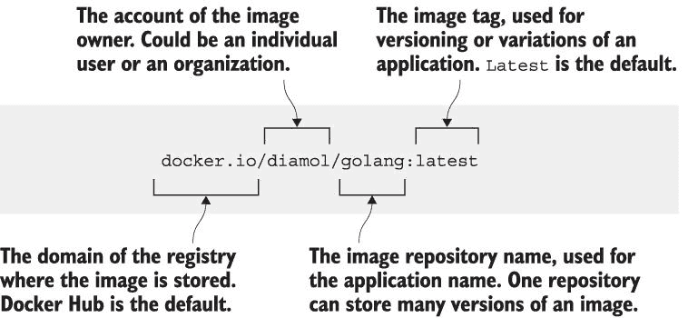
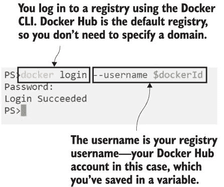
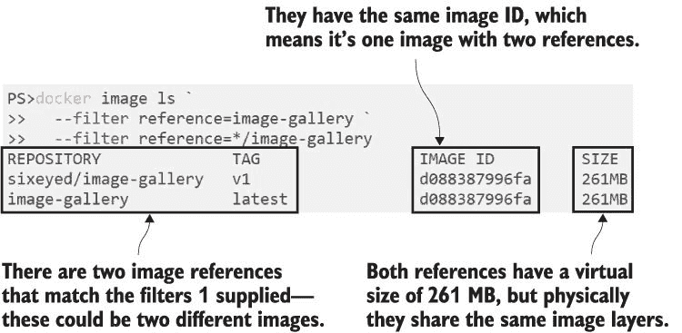
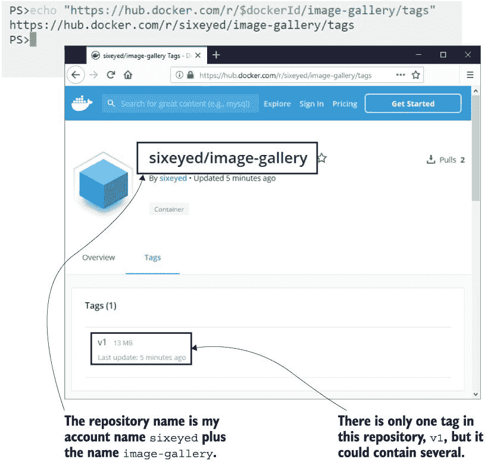
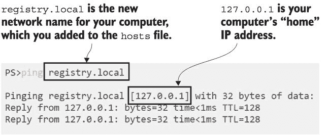
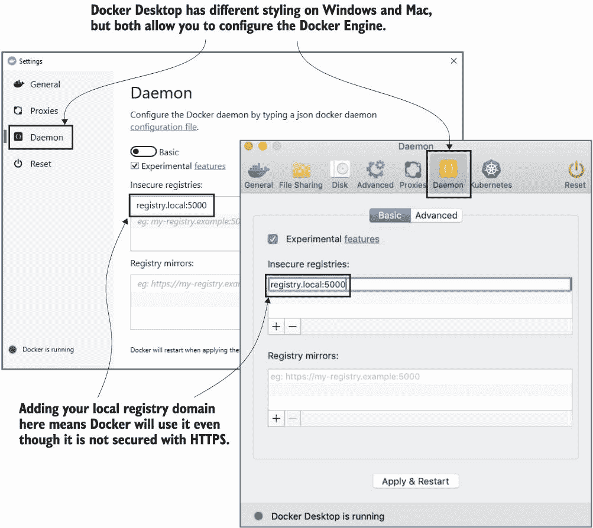
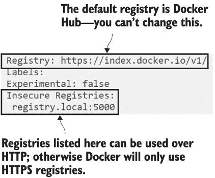
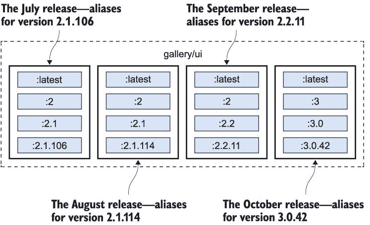
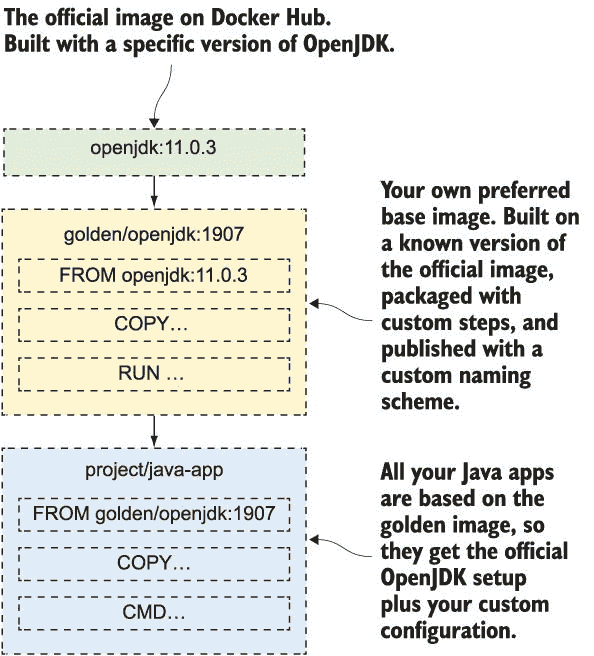

# 5 使用 Docker Hub 和其他注册表共享镜像

在过去的几章中，你已经对 Docker 工作流程的构建和运行部分有了很好的理解——现在是时候分享你的成果了。分享就是将你在本地机器上构建的镜像提供给其他人使用。我真的认为这是 Docker 公式中最重要的一部分。将你的软件及其所有依赖项打包在一起意味着任何人都可以轻松地在任何机器上使用它——环境之间没有差距，因此不再有浪费在设置软件或追踪实际上是部署问题的错误的日子。

## 5.1 与注册表、存储库和镜像标签一起工作

软件分发是 Docker 平台内置的功能。你已经看到你可以从一个镜像运行容器，如果你本地没有这个镜像，Docker 会下载它。存储镜像的中央服务器称为 Docker 注册表。Docker Hub 是最受欢迎的镜像注册表，每月托管数十万个镜像，这些镜像被下载数十亿次。它也是 Docker 引擎的默认注册表，这意味着它是 Docker 首先查找本地不可用镜像的地方。

Docker 镜像需要一个名称，并且这个名称包含足够的信息，以便 Docker 能够找到你正在寻找的确切镜像。到目前为止，我们使用的是非常简单的名称，通常由一到两个部分组成，例如 `image-gallery` 或 `diamol/golang`。实际上，一个完整的镜像名称由四个部分组成（通常称为镜像引用）。图 5.1 展示了 `diamol/golang` 的完整引用中的所有这些部分：

图 5.1 Docker 镜像引用的解剖结构

当你开始管理自己的应用程序镜像时，你将使用到镜像引用的所有部分。在你的本地机器上，你可以随意命名镜像，但当你想在注册表上共享它们时，你需要添加更多细节，因为镜像引用是注册表上特定镜像的唯一标识符。

如果你没有为镜像引用的部分提供值，Docker 会使用一些默认值。默认注册表是 Docker Hub，默认标签是 `latest`。Docker Hub 的域名是 `docker.io`，因此我的镜像 `diamol/golang` 是 `docker.io/diamol/golang:latest` 的简写版本。你可以使用这两种引用中的任何一种。`diamol` 账户是 Docker Hub 上的一个组织，而 `golang` 是该组织内的一个存储库。这是一个公开的存储库，因此任何人都可以拉取镜像，但你需要成为 `diamol` 组织的成员才能推送镜像。

大型公司通常在自己的云环境或本地网络中拥有自己的 Docker 注册表。你通过在引用的第一部分包含域名来针对自己的注册表，这样 Docker 就知道不要使用 Docker Hub。如果我在 `r.sixeyed.com` 上托管自己的注册表，我的图像可以存储在 `r.sixeyed .com/diamol/golang` 。这一切都很简单，但图像引用最重要的部分是标签。

到目前为止，你还没有使用图像标签，因为没有它们开始起来更简单，但当你开始构建自己的应用程序图像时，你应该始终为它们添加标签。标签用于识别同一应用程序的不同版本。官方 Docker OpenJDK 图像有数百个标签-- `openjdk:13` 是最新版本，`openjdk:8u212-jdk` 是 Java 8 的一个特定版本，还有更多针对不同的 Linux 发行版和 Windows 版本。如果你在创建图像时没有指定标签，Docker 将使用默认标签 `latest` 。这个名字可能会误导，因为标记为`latest`的图像可能实际上并不是最新的图像版本。当你推送自己的图像时，你应该始终使用明确的版本进行标记。

## 5.2 推送自己的图像到 Docker Hub

我们将开始推送第四章中构建的一个图像到 Docker Hub。你需要一个 Docker Hub 账户来做到这一点--如果你还没有，请浏览到 *[`hub.docker.com`](https://hub.docker.com)* 并点击链接注册一个账户（它是免费的，并且不会让你的邮箱收到大量的垃圾邮件）。

要将图像推送到注册表，你需要做两件事。首先，你需要使用 Docker 命令行登录到注册表，这样 Docker 就可以检查你的用户账户是否有权推送图像。然后，你需要给你的图像提供一个包含你有权限推送的账户名称的引用。

每个读者都会有自己的 Docker Hub 用户名，为了更容易地跟随练习，让我们首先在你的终端会话中捕获你的 Docker ID。之后，你将能够复制粘贴本章剩余的命令。

现在试试看 打开一个终端会话并将你的 Docker Hub ID 保存在一个变量中。你的 Docker ID 是你的用户名，而不是你的电子邮件地址。这是一条在 Windows 和 Linux 上不同的命令，所以你需要选择正确的选项：

` # 在 Windows 上使用 PowerShell` ` $dockerId="<your-docker-id-goes-here>"`  ` # 在 Linux 或 Mac 上使用 Bash` ` export dockerId="<your-docker-id-goes-here>"`

我目前运行的是 Windows，我的 Docker Hub 用户名是 `sixeyed` ，所以我运行的命令是 `$dockerId="sixeyed"` ；在 Linux 上我会运行 `dockerId="sixeyed"` 。在任何系统上，你都可以运行 `echo` `$dockerId` 并应该看到你的用户名显示。从现在开始，你可以复制练习中的命令，它们将使用你的 Docker ID。

首先登录到 Docker Hub。实际上，是 Docker Engine 推送和拉取镜像，但你使用 Docker 命令行进行认证——当你运行`login`命令时，它会要求你的密码，这是你的 Docker Hub 密码。

现在试试看，登录到 Docker Hub。Hub 是默认的仓库，所以你不需要指定域名：

` docker login --username $dockerId`

你会在图 5.2 中看到类似我的输出——合乎逻辑地，当你输入密码时，Docker 不会显示它。

现在你已经登录，你可以将镜像推送到你自己的账户或你能够访问的任何组织。我不认识你，但如果我想请你帮忙照看这本书的镜像，我可以将你的账户添加到`diamol`组织，你将能够推送以`diamol/`开头的镜像。如果你不是任何组织的成员，你只能将镜像推送到你自己的账户中的仓库。

图 5.2 登录到 Docker Hub

在第四章中，你构建了一个名为`image-gallery`的 Docker 镜像。这个镜像引用没有账户名，所以你不能将其推送到任何仓库。不过，你不需要重新构建镜像来给它一个新的引用——镜像可以有多个引用。

现在试试看，为你的现有镜像创建一个新的引用，将其标记为版本 1：

` docker image tag image-gallery $dockerId/image-gallery:v1`

现在你有两个引用；一个有账户和版本号，但两个引用都指向同一个镜像。镜像也有一个唯一的 ID，当你列出它们时，你可以看到单个镜像 ID 是否有多个引用。

现在试试看，列出`image-gallery`镜像引用：

` docker image ls --filter reference=image-gallery --filter reference='*/image-gallery'`

你会在图 5.3 中看到与我类似的输出，但你的标记镜像将显示你的 Docker Hub 用户名而不是`sixeyed`。

图 5.3 一个镜像有两个引用

现在你有一个包含你的 Docker ID 的账户名的镜像引用，你已经登录到 Docker Hub，所以你准备好分享你的镜像了！`docker image push`命令是`pull`命令的对应命令；它将你的本地镜像层上传到仓库。

现在试试看，列出`image-gallery`镜像引用：

` docker image push $dockerId/image-gallery:v1`

Docker 仓库在镜像层级别上工作，与本地 Docker Engine 的方式相同。你推送一个镜像，但 Docker 实际上上传的是镜像层。在输出中，你会看到一个层 ID 列表及其上传进度。在我的（缩略的）输出中，你可以看到正在推送的层：

` The push refers to repository [docker.io/sixeyed/image-gallery]` ` c8c60e5dbe37: Pushed` ` 2caab880bb11: Pushed` ` 3fcd399f2c98: Pushed` ` ...` ` v1: digest: sha256:127d0ed6f7a8d1... size: 2296`

注册表与镜像层协同工作的事实是你需要花时间优化你的 Dockerfile 的另一个原因。只有当该层的哈希值没有现有匹配时，层才会物理上传到注册表。这就像你的本地 Docker Engine 缓存，但应用于注册表上的所有镜像。如果你优化到在构建时 90% 的层来自缓存，那么在推送时，90% 的这些层已经存在于注册表中。优化的 Dockerfile 可以减少构建时间、磁盘空间和网络带宽。

你现在可以浏览到 Docker Hub 并检查你的镜像。Docker Hub UI 使用与镜像引用相同的仓库名称格式，因此你可以从你的账户名称中确定你镜像的 URL。

现在试试这个小程序，它会将你的镜像页面的 URL 写入：

`echo "https://hub.docker.com/r/$dockerId/image-gallery/tags"`

当你浏览到该 URL 时，你会看到类似于图 5.4 的内容，显示你的镜像标签和最后更新时间。

图 5.4 Docker Hub 上的镜像列表

推送镜像就这么简单。如果镜像不存在，Docker Hub 会为它创建一个新的仓库，默认情况下，该仓库具有公共读权限。现在任何人都可以找到、拉取和使用你的 `image-gallery` 应用程序。他们需要自己找出如何使用它，但你也可以在 Docker Hub 上放置文档。

Docker Hub 是最容易开始的注册表，并且它以零成本提供大量功能——尽管你可以支付每月订阅费以获得额外功能，如私有仓库。还有很多替代的注册表。注册表是一个开放的 API 规范，核心注册表服务器是 Docker 的开源产品。所有云服务提供商都有自己的注册表服务，你可以使用像 Docker Trusted Registry 这样的商业产品在数据中心管理自己的注册表，或者在一个容器中运行一个简单的注册表。

## 5.3 运行和使用自己的 Docker 注册表

在本地网络中运行自己的注册表很有用。它可以减少带宽使用和传输时间，并让你拥有环境中自己的数据。即使你不关心这一点，了解你可以快速启动本地注册表也是好的，这样你就可以在主注册表离线时将其用作备份选项。

Docker 在 GitHub 上的源代码仓库 `docker/distribution` 中维护核心注册表服务器。它为你提供了推送和拉取镜像的基本功能，并使用与 Docker Hub 相同的层缓存系统，但它不提供 Hub 上的 Web UI。这是一个超级轻量级的服务器，我已经将其打包到 `diamol` 镜像中，因此你可以在容器中运行它。

现在运行 Docker 注册表容器，使用我的镜像：

` # 运行注册表时带有重启标志，这样容器在重启 Docker 时也会重启:` ` docker container run -d -p 5000:5000 --restart always diamol/registry`

你现在在你的本地机器上有一个注册表服务器。服务器的默认端口是 `5000`，这个命令会发布它。你可以使用域名 `localhost:5000` 对镜像进行打标签并将它们推送到这个注册表，但这并不是很有用——你只能在你的本地机器上使用注册表。相反，最好给你的机器一个别名，这样你就可以为你的注册表使用一个合适的域名。

下一个命令会创建这个别名。它会给你的电脑一个 `registry.local` 的名字，以及它可能拥有的任何其他网络名字。它是通过写入电脑的 `hosts` 文件来做到这一点的，这是一个简单的文本文件，它将网络名字链接到 IP 地址。

现在尝试一下 Windows、Linux 和 Mac 机器都使用相同的 hosts 文件格式，但文件路径不同。Windows 上的命令也不同，所以你需要选择正确的一个：

` # 在 Windows 上使用 PowerShell` ` Add-Content -Value "127.0.0.1 registry.local" -Path /windows/system32/drivers/etc/hosts`  ` # 在 Linux 或 Mac 上使用 Bash` `echo $'\n127.0.0.1 registry.local' | sudo tee -a /etc/hosts`

如果你从这个命令中得到权限错误，你需要在 Windows 上的提升 PowerShell 会话中用管理员权限登录，或者在 Linux 或 Mac 上使用 `sudo`。当你成功运行了命令后，你应该能够运行 `ping registry.local` 并看到来自你电脑的本地 IP 地址 127.0.0.1 的响应，如图 5.5 所示。

图 5.5 为你的电脑添加新的网络别名

现在，你可以在你的镜像引用中使用域名 `registry.local:5000` 来使用你的注册表。将域名添加到镜像涉及的过程与你在 Docker Hub 上已经执行过的打标签过程相同。这次你只需在新的镜像引用中包含注册表域名即可。

现在尝试一下给你的 `image-gallery` 镜像打上你的注册表域名标签：

` docker image tag image-gallery registry.local:5000/gallery/ui:v1`

你本地的注册表没有设置任何认证或授权。这显然不是生产质量，但它可能适用于一个小团队，并且它确实让你可以使用自己的镜像命名方案。第四章中的 NASA 每日图像应用由三个容器组成——你可以使用 `gallery` 作为项目名称来对所有的镜像进行打标签，以将它们分组在一起：

+   `registry.local:5000/gallery/ui:v1` -- Go 网页 UI

+   `registry.local:5000/gallery/api:v1` -- Java API

+   `registry.local:5000/gallery/logs:v1` -- Node.js API

在您可以将此镜像推送到本地注册表之前，您还需要做一件事。注册表容器正在使用纯文本 HTTP 而不是加密的 HTTPS 来推送和拉取镜像。默认情况下，Docker 不会与未加密的注册表通信，因为它不安全。在 Docker 允许您使用它之前，您需要明确将您的注册表域名添加到允许的非安全注册表列表中。

这就引出了配置 Docker 的问题。Docker 引擎使用 JSON 配置文件来设置各种配置，包括 Docker 在磁盘上存储镜像层的位置、Docker API 监听连接的位置以及哪些非安全注册表被允许。该文件名为 `daemon.json`，通常位于 Windows Server 的 `C:\ProgramData\docker\config` 文件夹中，以及 Linux 的 `/etc/docker` 文件夹中。您可以直接编辑该文件，但如果您在 Mac 或 Windows 上使用 Docker Desktop，您将需要使用 UI，在那里您可以更改主要配置设置。

现在尝试一下：在任务栏中右键单击 Docker 鲸鱼图标，选择设置（或在 Mac 上选择首选项）。然后打开守护进程选项卡，并在非安全注册表列表中输入 `registry.local:5000`--您可以在图 5.6 中看到我的设置。

图 5.6 允许 Docker Desktop 使用非安全注册表

Docker 引擎需要重新启动以加载任何新的配置设置，当您应用更改时，Docker Desktop 会为您完成此操作。

如果您没有运行 Docker Desktop，您将需要手动进行此操作。首先，在文本编辑器中打开 `daemon.json` 文件--如果它不存在，则创建它--并以 JSON 格式添加非安全注册表详情。配置设置看起来像这样--但如果您正在编辑现有文件，请确保保留原始设置：

` {` `       "insecure-registries": [` `               "registry.local:5000"` `       ]` ` }`

然后，在 Windows Server 上使用 `Restart-Service docker` 或在 Linux 上使用 `service docker restart` 重新启动 Docker。您可以使用 `info` 命令检查 Docker 引擎允许的非安全注册表以及其他信息。

现在尝试一下：列出 Docker 引擎的信息并检查您的注册表是否在非安全注册表列表中：

` docker info`

在输出末尾，您将看到注册表配置，其中应包括您的非安全注册表--您可以在图 5.7 中看到我的配置。

图 5.7 允许 Docker 使用的非安全注册表

您应该小心地将非安全注册表添加到 Docker 配置中。您的连接可能会被破坏，攻击者可以在您推送镜像时读取层。更糟糕的是，他们可以在您拉取镜像时注入自己的数据。所有商业注册表服务器都运行在 HTTPS 上，您也可以配置 Docker 的开源注册表使用 HTTPS。然而，为了在本地服务器上进行演示，这是一个可接受的风险。

你现在可以将你的标记过的镜像推送到你自己的注册表。注册表域名是图像引用的一部分，所以 Docker 知道要使用除 Docker Hub 之外的东西，并且你的在容器中运行的 HTTP 注册表已从不安全注册表列表中清除。

现在试试看 Push 你的标记过的镜像：

` docker image push registry.local:5000/gallery/ui:v1`

当你第一次运行 `push` 命令时，你的注册表是空的，所以你会看到所有层正在上传。如果你然后重复 `push` 命令，你会看到所有层已经存在，没有任何内容被上传。这就是你需要在容器中运行自己的 Docker 注册表所需要做的全部。你可以通过你的机器的 IP 地址或真实域名来在你的网络上共享它。

## 5.4 有效使用图像标签

你可以将任何字符串放入 Docker 图像标签中，正如你之前看到的，你可以为同一镜像拥有多个标签。你将使用它来对图像中的软件进行版本控制，并让用户了解他们想要使用的内容——以及当你使用他人的图像时，你可以做出自己的明智选择。

许多软件项目使用带有小数点的数字版本控制方案来表示版本之间的变化有多大，你可以在你的图像标签中这样做。基本想法类似于 `[major].[minor].[patch]`，它有一些隐含的保证。仅增加补丁号的发布可能包含错误修复，但它应该与上一个版本具有相同的功能；增加次要版本的发布可能添加功能，但不应该删除任何功能；而主要发布可能具有完全不同的功能。

如果你使用相同的方法处理你的图像标签，你可以让用户选择是否坚持使用主版本或次要版本，或者总是拥有最新的发布版本。

现在试试看 为你打包在镜像中的 Go 应用程序创建一些新的标签，以表示主要、次要和补丁发布版本：

` docker image tag image-gallery registry.local:5000/gallery/ui:latest` ` docker image tag image-gallery registry.local:5000/gallery/ui:2` ` docker image tag image-gallery registry.local:5000/gallery/ui:2.1` ` docker image tag image-gallery registry.local:5000/gallery/ui:2.1.106`

现在想象一个应用程序每月发布，版本号递增。图 5.8 展示了从 7 月到 10 月发布过程中图像标签可能如何演变。

你可以看到，这些图像标签中的一些是移动的目标。`gallery/ui:2.1` 是 7 月份 2.1.106 版本的别名，但在 8 月份，相同的 2.1 标签是 2.1.114 版本的别名。`gallery/ui:2` 也是 7 月份 2.1.106 版本的别名，但到了 9 月，2 标签是 2.2.11 版本的别名。最新的标签变动最大——7 月份 `gallery/ui` 是 2.1.106 版本的别名，但在 10 月份它变成了 3.0.42 版本的别名。

这是您将看到的典型的 Docker 图像版本方案。您应该自己采用这个方案，因为它允许您的图像用户选择他们想要保持的当前程度。他们可以在他们的图像拉取命令中固定到特定的补丁版本，或者在他们的 Dockerfile 中的`FROM`指令中，并确保他们使用的图像始终相同。在这个例子中的 2.1.106 标签是从 7 月到 10 月的相同图像。如果他们想要获取补丁更新，他们可以使用 2.1 标签，如果他们想要获取小版本发布，他们可以使用 2 标签。

图 5.8 软件发布期间图像标签的演变

任何这些选择都是可以的；这只是平衡风险的问题——使用特定的补丁版本意味着应用程序每次使用时都将保持相同，但您不会获得安全修复。使用主要版本意味着您将获得所有最新的修复，但可能会有意外的功能更改。

在您的 Dockerfile 中使用特定的图像标签对于基础图像尤为重要。使用产品团队的构建工具图像来构建您的应用程序以及它们的运行时图像来打包您的应用程序是很好的，但如果您在标签中不指定版本，您将来可能会遇到麻烦。构建图像的新版本可能会破坏您的 Docker 构建。或者更糟的是，运行时的新版本可能会破坏您的应用程序。

## 5.5 将官方图像转换为黄金图像

当您查看 Docker Hub 和其他注册表时，还有最后一件事需要理解：您能否信任您在那里找到的图像？任何人都可以将图像推送到 Docker Hub 并使其公开可用。对于黑客来说，这是一种很好的分发恶意软件的方式；您只需给您的图像一个无辜的名称和虚假的描述，然后等待人们开始使用它。Docker Hub 通过验证发布者和官方图像来解决这个问题。

验证发布者是像微软、甲骨文和 IBM 这样的公司，他们在 Docker Hub 上发布图像。他们的图像经过一个包括漏洞安全扫描的审批流程；它们也可能获得认证，这意味着它们得到了 Docker 和发布者的支持。如果您想在容器中运行现成的软件，来自验证发布者的认证图像是最佳选择。

官方图像是不同的事物——它们通常是开源项目，由项目团队和 Docker 共同维护。它们经过安全扫描并定期更新，并符合 Dockerfile 最佳实践。所有官方图像的内容都是开源的，因此您可以在 GitHub 上查看 Dockerfile。大多数人开始使用官方图像作为他们自己图像的基础，但最终发现他们需要更多的控制。然后他们引入他们自己的首选基础图像，称为黄金图像——图 5.9 展示了它是如何工作的。

图 5.9 使用黄金图像封装官方图像

黄金镜像以官方镜像为基础，然后添加它们需要的任何自定义设置，例如安装安全证书或配置默认环境设置。黄金镜像位于公司的 Docker Hub 仓库或他们自己的仓库中，所有应用程序镜像都基于黄金镜像。这种方法提供了官方镜像的好处——由项目团队通过最佳实践设置——但增加了你需要额外配置。

现在试试看。本章源代码中有两个 Dockerfile，可以作为.NET Core 应用程序的黄金镜像构建。浏览到每个文件夹并构建镜像：

` cd ch05/exercises/dotnet-sdk` ` docker image build -t golden/dotnetcore-sdk:3.0 .`  ` cd ../aspnet-runtime` ` docker image build -t golden/aspnet-core:3.0 .`

黄金镜像并没有什么特别之处。它们从一个 Dockerfile 开始，并使用你自己的参考和命名方案构建一个镜像。如果你查看你构建的 Dockerfile，你会发现它们使用`LABEL`指令向镜像添加了一些元数据，并设置了一些常见配置。现在你可以在一个多阶段 Dockerfile 中使用这些镜像来构建.NET Core 应用程序，这看起来可能像列表 5.1。

列表 5.1 使用.NET Core 黄金镜像的多阶段 Dockerfile

` FROM golden/dotnetcore-sdk:3.0 AS builder` ` COPY . .` ` RUN dotnet publish -o /out/app app.csproj`  ` FROM golden/aspnet-core:3.0` ` COPY --from=builder /out /app` ` CMD ["dotnet", "/app/app.dll"]`

Dockerfile 的应用格式与任何多阶段构建相同，但现在你拥有基础镜像。官方镜像可能每月都会有一个新版本发布，但你可以选择将你的黄金镜像限制为每季度更新一次。黄金镜像还打开了一种其他可能性——你可以通过持续集成（CI）管道中的工具强制使用它们：Dockerfile 可以被扫描，如果有人尝试构建一个不使用黄金镜像的应用程序，那么构建将失败。这是一种锁定团队可以使用源镜像的好方法。

## 5.6 实验室

这个实验室需要一些侦探工作，但最终会值得。你需要深入研究 Docker Registry API v2 规范（*[`docs.docker.com/registry/spec/api/`](https://docs.docker.com/registry/spec/api/)*），因为 REST API 是唯一你可以与你的本地 Docker 仓库交互的方式——你无法使用 Docker CLI（目前）搜索或删除镜像。

本实验的目标是将你的`gallery/ui`镜像的所有标签推送到本地仓库，检查它们是否都在那里，然后删除它们并检查它们是否已消失。我们不会包括`gallery/api`或`gallery/logs`镜像，因为本实验专注于具有多个标签的镜像，而我们已经有`gallery/ui`的这些镜像。以下是一些提示：

+   你可以使用单个`image` `push`命令推送所有这些标签。

+   你本地注册表的 API URL 是*[`registry.local:5000/v2`](http://registry.local:5000/v2)*。

+   首先列出存储库的镜像标签。

+   然后你需要获取镜像清单。

+   你可以通过 API 删除镜像，但你需要使用清单。

+   读取文档——在你的 HEAD 请求中需要使用特定的请求头。

解决方案在书的 GitHub 仓库中，这是一个可以稍微作弊的罕见案例。前几个步骤应该对你来说很容易解决，但之后会变得有些尴尬，所以如果你最终来到这里：*[`github.com/sixeyed/diamol/tree/master/ch05/lab`](https://github.com/sixeyed/diamol/tree/master/ch05/lab)*，请不要感到太难过。

祝你好运。并且记得阅读文档。
