# 6 使用 Docker 卷进行持久化存储

容器是状态无状态应用的理想运行时环境。您可以通过在您的集群上运行多个容器来满足增加的需求，知道每个容器将以相同的方式处理请求。您可以通过自动滚动升级来发布更新，这样您的应用程序在整个过程中都保持在线状态。

但您的应用程序的并非所有部分都是无状态的。将会有一些组件使用磁盘来提高性能或进行永久数据存储。您也可以在 Docker 容器中运行这些组件。

存储确实增加了复杂性，因此您需要了解如何 Docker 化有状态应用程序。本章将带您了解 Docker 卷和挂载，并展示容器文件系统是如何工作的。

## 6.1 为什么容器中的数据不是永久的

Docker 容器有一个包含单个磁盘驱动器的文件系统，该驱动器的内容由镜像中的文件组成。您已经看到了这一点：当您在 Dockerfile 中使用 `COPY` 指令时，您复制到镜像中的文件和目录在您从镜像运行容器时是存在的。而且您知道 Docker 镜像是存储为多个层，因此容器的磁盘实际上是一个 Docker 通过合并所有镜像层构建的虚拟文件系统。

每个容器都有自己的文件系统，与其他容器独立。您可以从相同的 Docker 镜像运行多个容器，它们都将使用相同的磁盘内容启动。应用程序可以更改一个容器中的文件，这不会影响其他容器中的文件--或镜像中的文件。通过运行几个写入数据的容器并查看它们的输出，可以直观地看到这一点。

现在尝试一下 打开一个终端会话并运行两个来自同一镜像的容器。镜像中的应用程序将随机数字写入容器中的文件：

` docker container run --name rn1 diamol/ch06-random-number` ` docker container run --name rn2 diamol/ch06-random-number`

该容器在启动时运行一个脚本，该脚本将一些随机数据写入文本文件然后结束，因此这些容器处于已退出状态。这两个容器是从相同的镜像启动的，但它们将具有不同的文件内容。您在第二章中学到，Docker 在退出时不会删除容器的文件系统--它被保留下来，这样您仍然可以访问文件和文件夹。

Docker CLI 有 `docker` `container` `cp` 命令，用于在容器和本地机器之间复制文件。您指定容器的名称和文件路径，可以使用它将生成的随机数字文件从这些容器复制到您的宿主机上，以便您读取其内容。

现在尝试一下 使用 `docker` `container` `cp` 将每个容器中的随机数字文件复制出来，然后检查其内容：

` docker container cp rn1:/random/number.txt number1.txt`  ` docker container cp rn2:/random/number.txt number2.txt`  ` cat number1.txt`  ` cat number2.txt`

您的输出将类似于图 6.1 中的我的输出。每个容器都在相同的路径上写了一个文件，即`/random/number.txt`，但当文件被复制到本地机器上时，您可以看到内容是不同的。这是一种简单的方法来展示每个容器都有一个独立的文件系统。在这种情况下，它是一个不同的单个文件，但这也可能是以相同的 SQL 引擎启动但存储完全不同数据的数据库容器。

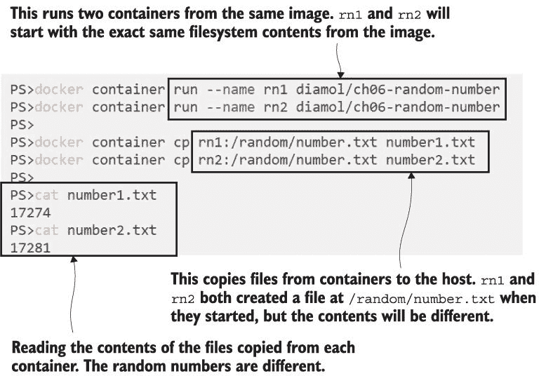

图 6.1 运行写入数据的容器并检查数据

容器内的文件系统看起来像是一个单独的磁盘：Linux 容器上的`/dev/sda1`和 Windows 容器上的`C:\`。但这个磁盘是一个虚拟文件系统，Docker 从几个来源构建它，并将其作为一个单一单元呈现给容器。该文件系统的基本来源是图像层，这些层可以在容器之间共享，以及容器的可写层，它是每个容器独有的。

图 6.2 展示了随机数字图像和两个容器的外观。您应该从图 6.2 中提取两个重要信息：图像层是共享的，因此它们必须是只读的，每个容器都有一个可写层，其生命周期与容器相同。图像层有自己的生命周期——您拉取的任何图像都将保留在您的本地缓存中，直到您将其删除。但是，容器可写层是在容器启动时由 Docker 创建的，当容器被移除时由 Docker 删除。（停止容器不会自动移除它，因此停止容器的文件系统仍然存在。）

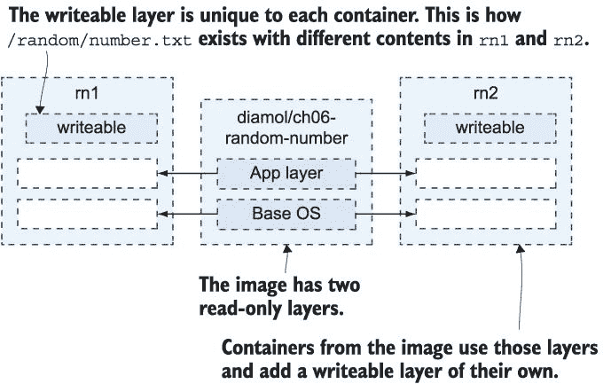

图 6.2 容器文件系统是由图像层和可写层构建的。

当然，可写层不仅仅用于创建新文件。容器可以编辑来自图像层的现有文件。但图像层是只读的，所以 Docker 进行了一些特殊的操作来实现这一点。它使用写时复制的过程来允许编辑来自只读层的文件。当容器尝试编辑图像层中的文件时，Docker 实际上会将该文件复制到可写层，并在那里进行编辑。对于容器和应用程序来说，这一切都是无缝的，但这是 Docker 高效使用存储的基石。

在我们继续运行一些更有用的有状态容器之前，让我们通过一个更简单的例子来分析这个问题。在这个练习中，您将运行一个容器，该容器从图像层打印出文件内容。然后您将更新文件内容并再次运行容器以查看发生了什么变化。

现在尝试一下 运行以下命令以启动一个打印其文件内容的容器，然后更改文件，并再次启动容器以打印新文件内容：

` docker container run --name f1 diamol/ch06-file-display`  ` echo "http://eltonstoneman.com" > url.txt`  ` docker container cp url.txt f1:/input.txt`  ` docker container start --attach f1`

这次你使用 Docker 将文件从你的主机计算机复制到容器中，目标路径是容器显示的文件。当你再次启动容器时，相同的脚本运行，但现在它打印出不同的内容——你可以在图 6.3 中看到我的输出。

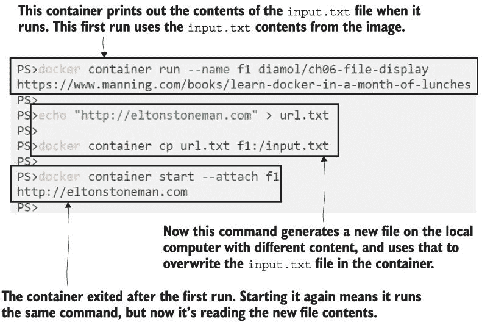

图 6.3 修改容器的状态并再次运行

修改容器中的文件会影响该容器的运行方式，但不会影响镜像或该镜像的任何其他容器。更改的文件仅存在于该容器的可写层中——新的容器将使用镜像中的原始内容，当容器`f1`被移除时，更新的文件将消失。

现在试试看 启动一个新的容器来检查镜像中的文件是否未更改。然后移除原始容器并确认数据已消失：

` docker container run --name f2 diamol/ch06-file-display` ` docker container rm -f f1` ` docker container cp f1:/input.txt .`

你会看到与我图 6.4 中相同的输出。新的容器使用镜像中的原始文件，当你移除原始容器时，其文件系统被移除，更改的文件将永远消失。

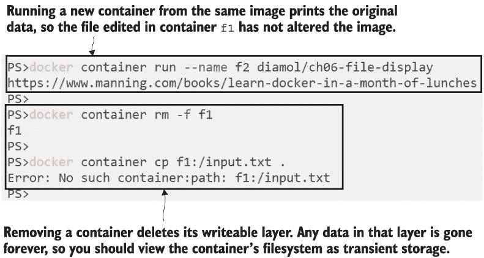

图 6.4 在容器中修改文件不会影响镜像，容器中的数据是瞬时的。

容器文件系统与容器的生命周期相同，因此当容器被移除时，可写层也会被移除，容器中任何更改的数据都会丢失。移除容器是你将要做很多事情之一。在生产中，你通过构建新的镜像、移除旧容器并用更新镜像的新容器替换它们来升级应用程序。你在原始应用程序容器中写入的任何数据都会丢失，替换容器将以镜像中的静态数据开始。

在某些情况下，这是可以的，因为你的应用程序只写入瞬态数据——可能是为了保持一个本地缓存，该缓存的数据计算或检索成本高昂——并且对于替换容器以空缓存开始是可行的。在其他情况下，那将是一场灾难。你可以在容器中运行数据库，但你不会期望在推出更新的数据库版本时丢失所有数据。

Docker 也为你覆盖了这些场景。容器的虚拟文件系统始终由镜像层和可写层构建，但也可能有其他来源。这些是 Docker 卷和挂载。它们有独立的生命周期，因此可以用来存储在容器替换之间持久化的数据。

## 6.2 使用 Docker 卷运行容器

Docker 卷是存储单元--你可以将其视为容器的 USB 棒。卷独立于容器存在，有自己的生命周期，但可以附加到容器。当数据需要持久化时，卷是管理状态化应用存储的方式。你创建一个卷并将其附加到你的应用程序容器；它作为容器文件系统中的一个目录出现。容器将数据写入目录，实际上数据存储在卷中。当你用新版本更新你的应用时，你将相同的卷附加到新容器，所有原始数据都可用。

使用容器与卷有两种方式：你可以手动创建卷并将其附加到容器，或者你可以在 Dockerfile 中使用 `VOLUME` 指令。这会构建一个在启动容器时创建卷的镜像。语法很简单：`VOLUME` `<target-directory>` 。列表 6.1 展示了镜像 `diamol/ch06-todo-list` 的多阶段 Dockerfile 的部分，这是一个使用卷的状态化应用。

列表 6.1 使用卷的 Dockerfile 的部分

` FROM diamol/dotnet-aspnet` ` WORKDIR /app`  ` ENTRYPOINT ["dotnet", "ToDoList.dll"]` ` VOLUME /data` ` COPY --from=builder /out/ .`

当你从这个镜像运行容器时，Docker 将自动创建一个卷并将其附加到容器。容器将有一个位于 `/data`（或 Windows 容器上的 `C:\data`）的目录，它可以像通常一样从中读取和写入。但实际上数据是存储在卷中的，卷将在容器删除后继续存在。如果你从这个镜像运行一个容器并检查卷，你可以看到这一点。

现在试试 Run 一个待办事项应用的容器，并查看 Docker 创建的卷：

` docker container run --name todo1 -d -p 8010:80 diamol/ch06-todo-list` ` docker container inspect --format '{{.Mounts}}' todo1` ` docker volume ls`

你会在图 6.5 中看到类似我的输出。Docker 为此容器创建了一个卷，并在容器运行时将其附加。我已经过滤了卷列表，只显示我的容器的卷。

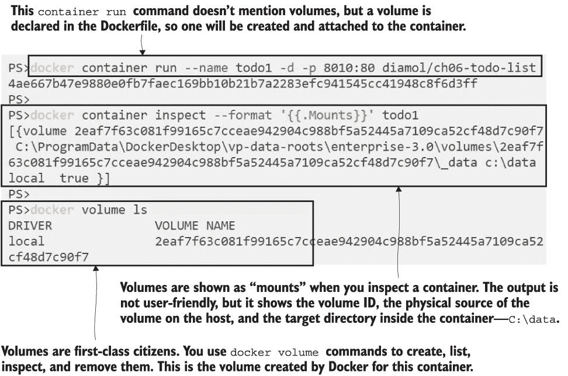

图 6.5 在 Dockerfile 中声明卷的容器运行

Docker 卷对容器中运行的应用程序是完全透明的。浏览到 http: */ /* localhost:8010，你会看到待办事项应用。该应用将数据存储在 `/data` 目录下的文件中，因此当你通过网页添加项目时，它们实际上被存储在 Docker 卷中。图 6.6 展示了应用的实际运行情况--这是一个非常适合像我这样工作负载的人的特殊待办事项列表；你可以添加项目，但你永远无法删除它们。

图 6.6 永无止境的待办事项列表，在容器中使用 Docker 卷运行

在 Docker 镜像中声明的卷为每个容器创建为单独的卷，但你也可以在容器之间共享卷。如果你启动一个新的运行待办事项应用程序的容器，它将有自己的卷，待办事项列表将从空开始。但是，你可以使用带有 `volumes-from` 标志的容器来附加另一个容器的卷。在这个例子中，你可以有两个共享相同数据的待办事项应用程序容器。

现在试试看：运行第二个待办事项列表容器并检查数据目录的内容。然后将其与另一个新容器进行比较，该容器共享第一个容器的卷（Windows 和 Linux 上的 `exec` 命令略有不同）：

` # 这个新容器将有自己的卷` ` docker container run --name todo2 -d diamol/ch06-todo-list`  ` # 在 Linux 上：` ` docker container exec todo2 ls /data`  ` # 在 Windows 上：` ` docker container exec todo2 cmd /C "dir C:\data"`  ` # 这个容器将共享 todo1 的卷` ` docker container run -d --name t3 --volumes-from todo1 diamol/ch06-todo-list`  ` # 在 Linux 上：` ` docker container exec t3 ls /data`  ` # 在 Windows 上：` ` docker container exec t3 cmd /C "dir C:\data"`

输出将类似于图 6.7（本例中我在 Linux 上运行）。第二个容器以新卷开始，因此 `/data` 目录为空。第三个容器使用第一个容器的卷，因此可以看到原始应用程序容器的数据。

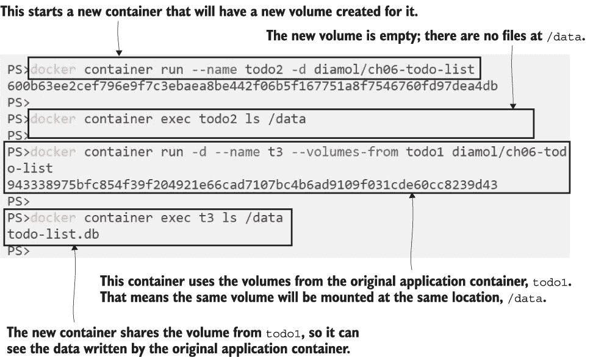

图 6.7 运行具有专用和共享卷的容器

在容器之间共享卷很简单，但这可能不是你想要做的。通常，写入数据的应用程序期望对文件有独占访问权限，如果另一个容器同时读取和写入同一文件，它们可能无法正确工作（或根本无法工作）。卷更适合在应用程序升级之间保留状态，此时最好显式管理卷。你可以创建一个命名卷并将其附加到应用程序容器的不同版本。

现在试试看：创建一个卷并在待办事项应用程序的版本 1 中使用它。然后在用户界面中添加一些数据并将应用程序升级到版本 2。容器的文件系统路径需要与操作系统匹配，所以我使用变量来简化复制和粘贴：

` # 将目标文件路径保存到变量中：` ` target='/data' # 对于 Linux 容器` ` $target='c:\data' # 对于 Windows 容器`  ` # 创建一个卷来存储数据：` ` docker volume create todo-list`  ` # 运行 v1 应用，使用卷进行应用存储：` ` docker container run -d -p 8011:80 -v todo-list:$target --name todo-v1 diamol/ch06-todo-list`  ` # 通过 http://localhost:8011 的 Web 应用添加一些数据`  ` # 删除 v1 应用容器：` ` docker container rm -f todo-v1`  ` # 并运行一个使用相同卷进行存储的 v2 容器：` ` docker container run -d -p 8011:80 -v todo-list:$target --name todo-v2 diamol/ch06-todo-list:v2`

图 6.8 的输出显示卷有其自己的生命周期。它在创建任何容器之前就存在，当使用它的容器被移除时它仍然存在。应用程序在升级之间保留数据，因为新的容器使用与旧容器相同的卷。

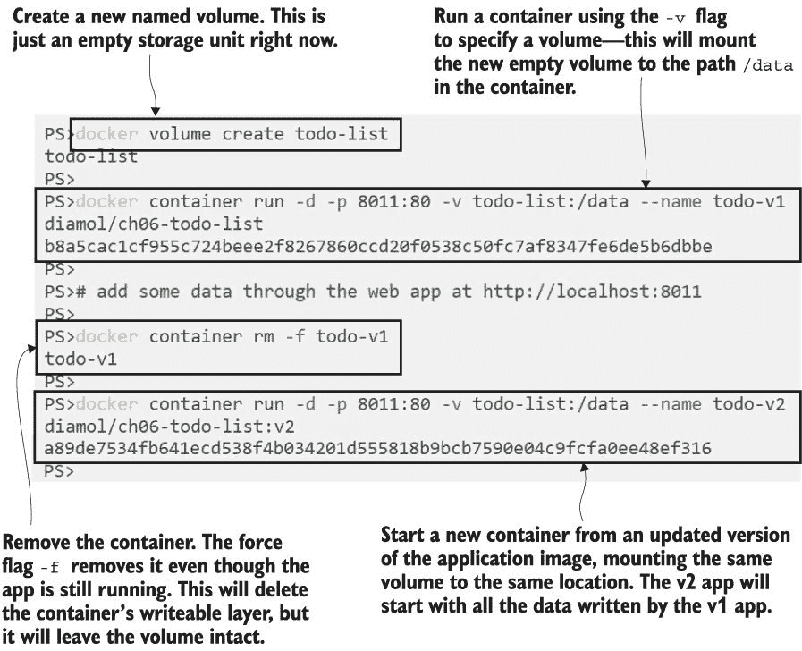

图 6.8 创建命名卷并使用它来在容器更新之间持久化数据

现在当你浏览到 http: */ /* localhost:8011 时，你会看到待办事项应用的第二个版本，它已经从一家昂贵的创意机构那里得到了界面改造。图 6.9 显示它现在已准备好投入生产。

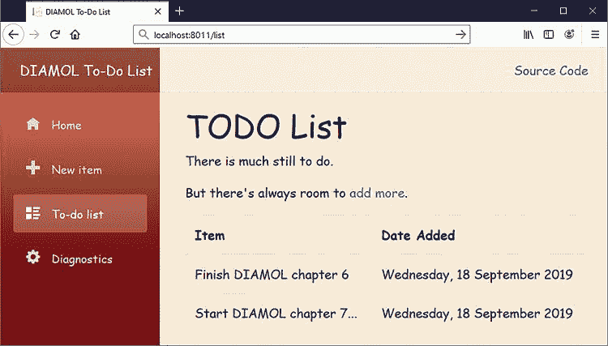

图 6.9 全新的待办事项应用 UI

在我们继续之前，有一件事需要明确关于 Docker 卷。Dockerfile 中的 `VOLUME` 指令和运行容器的 `volume`（或 `v`）标志是两个不同的功能。使用 `VOLUME` 指令构建的镜像，如果 `run` 命令中没有指定卷，将始终为容器创建一个卷。卷将有一个随机 ID，因此容器消失后你可以使用它，但前提是你能够确定哪个卷包含你的数据。

`volume` 标志无论镜像是否指定了卷，都会将卷挂载到容器中。如果镜像确实有卷，卷标志可以通过使用相同目标路径的现有卷来覆盖它，因此不会创建新的卷。这就是待办事项列表容器发生的情况。

对于在镜像中没有指定卷的容器，你可以使用完全相同的语法并获得相同的结果。作为镜像的作者，你应该使用 `VOLUME` 指令作为有状态应用程序的备用选项。这样，即使用户没有指定 `volume` 标志，容器也会始终将数据写入持久卷。但是，作为镜像的使用者，最好不要依赖默认设置，而应该使用命名卷。

## 6.3 使用文件系统挂载运行容器

卷非常适合分离存储的生命周期，同时让 Docker 为你管理所有资源。卷位于宿主机上，因此它们与容器解耦。Docker 还提供了使用绑定挂载在容器和宿主机之间共享存储的更直接方式。绑定挂载将宿主机上的目录作为容器上的路径提供。绑定挂载对容器是透明的--它只是容器文件系统的一部分目录。但这意味着你可以从容器访问宿主机文件，反之亦然，这解锁了一些有趣的模式。

绑定挂载允许你显式地使用宿主机上的文件系统作为容器数据。这可以是快速固态硬盘、高可用性磁盘阵列，甚至是跨网络可访问的分布式存储系统。如果你可以访问宿主机上的文件系统，你就可以为容器使用它。我可能有一个带有 RAID 阵列的服务器，并使用它作为待办事项应用数据库的可靠存储。

现在试试吧，我确实有一个带有 RAID 阵列的服务器，但你可能没有，所以我们将在你的宿主机计算机上创建一个本地目录并将其绑定挂载到容器中。再次强调，文件系统路径需要与宿主机操作系统匹配，因此我已经为你的机器上的源路径和容器的目标路径声明了变量。注意 Windows 和 Linux 的不同行：

` $source="$(pwd)\databases".ToLower(); $target="c:\data" # Windows` ` source="$(pwd)/databases" && target='/data'             # Linux` `  mkdir ./databases`  ` docker container run --mount type=bind,source=$source,target=$target -d -p 8012:80 diamol/ch06-todo-list`  ` curl http://localhost:8012` ` ls ./databases`

这个练习使用`curl`命令（该命令在 Linux、Mac 和 Windows 系统上都有）向待办事项应用发送 HTTP 请求。这会导致应用启动，从而创建数据库文件。最后的命令列出了宿主机上本地数据库目录的内容，这将显示应用程序的数据库文件实际上就在你的宿主机计算机上，如图 6.10 所示。

绑定挂载是双向的。你可以在容器中创建文件并在宿主机上编辑它们，或者创建宿主机上的文件并在容器中编辑它们。这里有一个安全方面，因为容器通常应该以最小权限账户运行，以最小化攻击者利用系统的风险。但是，容器需要提升权限来读取和写入宿主机上的文件，因此这个镜像在 Dockerfile 中使用了`USER`指令来赋予容器管理员权限--它使用 Linux 内置的`root`用户和 Windows 的`ContainerAdministrator`用户。

如果你不需要写入文件，你可以在容器内部将主机目录绑定挂载为只读。这是从主机将配置设置暴露到应用程序容器的一个选项。待办事项应用程序映像包含一个默认配置文件，该文件将应用程序的日志级别设置为最小值。你可以从相同的映像运行容器，但将本地配置目录挂载到容器中，并覆盖应用程序的配置而不更改映像。

现在尝试一下：待办事项应用程序如果存在，将从 `/app/config` 路径加载额外的配置文件。运行一个将本地目录绑定挂载到该位置的容器，应用程序将使用主机的配置文件。首先导航到你的 DIAMOL 源代码的本地副本，然后运行以下命令：

` cd ./ch06/exercises/todo-list`  ` # 将源路径保存为变量：` ` $source="$(pwd)\config".ToLower(); $target="c:\app\config" # Windows` ` source="$(pwd)/config" && target='/app/config'             # Linux`  ` # 使用挂载运行容器：` ` docker container run --name todo-configured -d -p 8013:80 --mount type=bind,source=$source,target=$target,readonly diamol/ch06-todo-list`  ` # 检查应用程序：` ` curl http://localhost:8013`  ` # 以及容器日志：` ` docker container logs todo-configured`

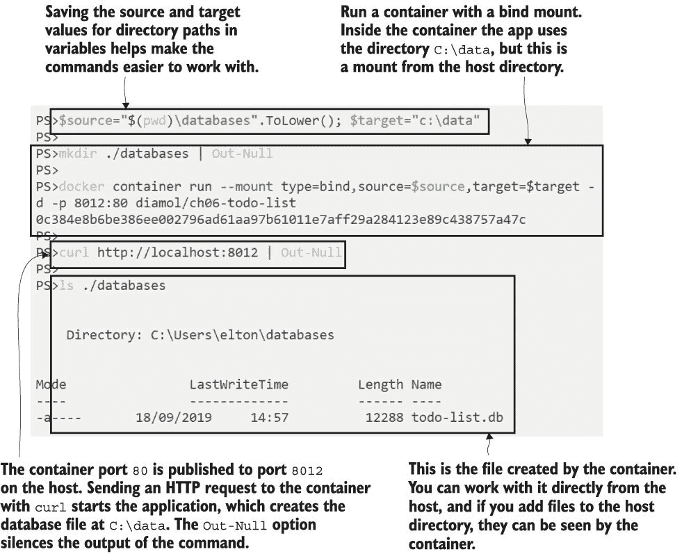

图 6.10 使用绑定挂载在主机上与容器共享目录

主机上的目录中的配置文件被设置为使用更详细的日志记录。当容器启动时，它会映射该目录，应用程序看到配置文件并加载日志配置。在图 6.11 所示的最终输出中，有很多调试日志行，这些日志行在标准配置下应用程序不会写入。

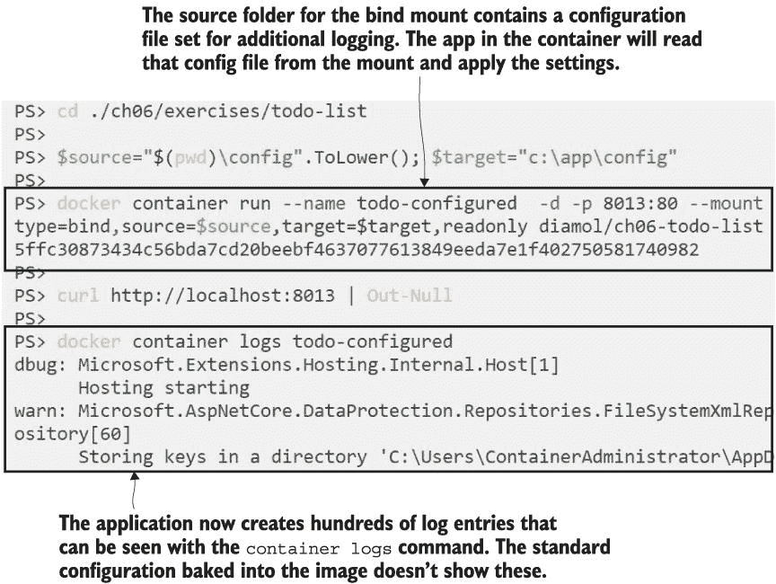

图 6.11 使用绑定挂载将只读配置文件加载到容器中

你可以绑定挂载主机计算机可访问的任何源。你可以在 Linux 主机上挂载到 `/mnt/nfs` 的共享网络驱动器，或者在 Windows 主机上映射到 `X:` 驱动器。这两个都可以作为绑定挂载的源，并以相同的方式暴露给容器。这是一种非常有用的方式，可以为在容器中运行的有状态应用程序提供可靠甚至分布式的存储，但你需要了解一些限制。

## 6.4 文件系统挂载的限制

要有效地使用绑定挂载和卷，你需要了解一些关键场景和限制，其中一些是微妙的，并且只会在容器和文件系统的非寻常组合中出现。

第一个场景很简单：当你运行一个带有挂载的容器，而挂载的目标目录已经存在并且包含镜像层的文件时，会发生什么？你可能认为 Docker 会将源合并到目标中。在容器内部，你期望看到目录包含来自镜像的所有现有文件和来自挂载的所有新文件。但这并不是事实。当你挂载一个已经包含数据的目标时，源目录会替换目标目录——因此，镜像中的原始文件不可用。

你可以通过一个简单的练习看到这一点，使用一个在运行时列出目录内容的镜像。对于 Linux 和 Windows 容器，行为是相同的，但命令中的文件系统路径需要与操作系统匹配。

现在试试看。运行一个没有挂载的容器，它将列出镜像中的目录内容。再次运行时使用挂载，它将列出源目录的内容（这里再次有变量以支持 Windows 和 Linux）：

` cd ./ch06/exercises/bind-mount`  ` $source="$(pwd)\new".ToLower(); $target="c:\init" # Windows` ` source="$(pwd)/new" && target='/init'             # Linux`  ` docker container run diamol/ch06-bind-mount`  ` docker container run --mount type=bind,source=$source,target=$target diamol/ch06-bind-mount`

你会看到在第一次运行时，容器列出了两个文件：`abc.txt` 和 `def.txt`。这些文件是从镜像层加载到容器中的。第二个容器用挂载的源替换了目标目录，因此这些文件没有列出。只显示了`123.txt` 和 `456.txt` 这两个文件，它们来自主机上的源目录。图 6.12 显示了我的输出。

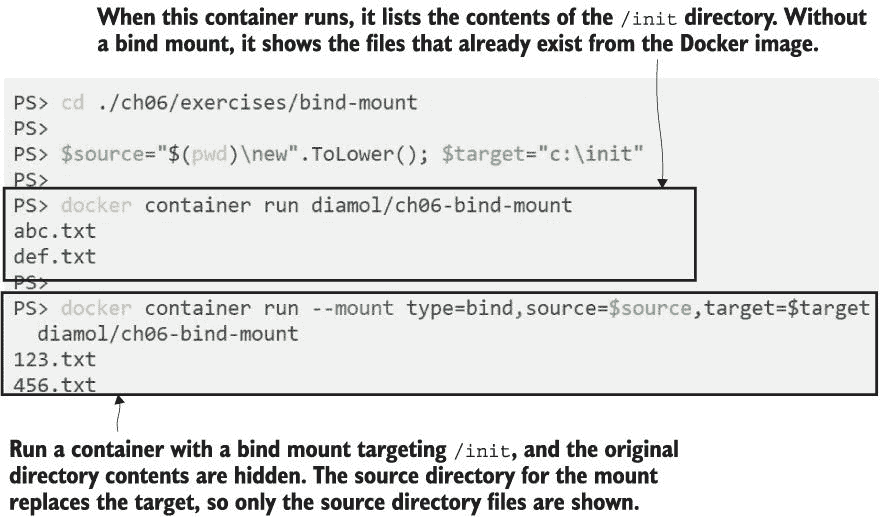

图 6.12 显示了绑定挂载目录如果目标目录存在，会覆盖目标目录。

第二个场景是对第一个场景的变体：如果你从主机挂载单个文件到容器文件系统中已存在的目标目录，会发生什么？这次目录内容会被合并，所以你会看到来自镜像的原始文件和来自主机的新文件——除非你在运行 Windows 容器，因为在这个功能上 Windows 容器根本不支持。

容器文件系统是 Windows 容器与 Linux 容器不同之处之一。有些事情以相同的方式工作。你可以在 Dockerfile 中使用标准的 Linux 风格路径，所以`/data`对 Windows 容器有效，并成为`C:\data`的别名。但这对于卷挂载和绑定挂载不适用，这就是为什么本章的练习使用变量为 Linux 用户提供`/data`和 Windows 的`C:\data`。

单个文件挂载的限制更为明确。如果你有 Windows 和 Linux 机器，或者如果你在 Windows 上运行支持 Linux 和 Windows 容器的 Docker Desktop，你可以亲自尝试这个实验。

现在尝试一下 单文件挂载在 Linux 和 Windows 上的行为不同。如果您有 Linux 和 Windows 容器可用，您可以看到实际效果：

` cd ./ch06/exercises/bind-mount`  ` # on Linux:` ` docker container run --mount type=bind,source="$(pwd)/new/123.txt",target=/init/123.txt diamol/ch06-bind-mount`  ` # on Windows:`  ` docker container run --mount type=bind,source="$(pwd)/new/123.txt",target=C:\init\123.txt diamol/ch06-bind-mount`  ` docker container run diamol/ch06-bind-mount`  ` docker container run --mount type=bind,source="$(pwd)/new/123.txt",target=/init/123.txt diamol/ch06-bind-mount`

Docker 镜像和命令都是相同的——除了针对特定操作系统的目标文件系统路径。但当你运行这个命令时，你会看到 Linux 示例按预期工作，但在 Windows 上你会从 Docker 获得错误，如图 6.13 所示。

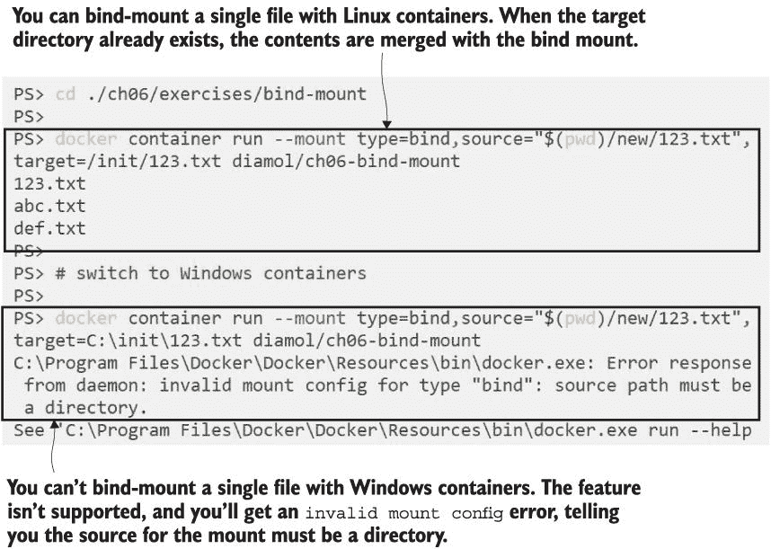

图 6.13 使用单个文件作为源绑定挂载在 Linux 上有效，但在 Windows 上无效。

第三个场景较为少见。没有设置很多移动部件很难重现，因此不会有练习涵盖这个场景——你只能相信我的话。这个场景是，如果你将分布式文件系统绑定挂载到容器中会发生什么？容器中的应用程序是否仍然可以正确工作？看，连这个问题都很复杂。

分布式文件系统允许您从网络上的任何机器访问数据，并且它们通常使用与操作系统本地文件系统不同的存储机制。这可能是在本地网络上的 SMB 文件共享、Azure Files 或云中的 AWS S3 等技术。您可以将这些分布式存储系统中的位置挂载到容器中。挂载将看起来像文件系统的一个正常部分，但如果它不支持相同的操作，您的应用程序可能会失败。

图 6.14 中有一个具体的例子，尝试在云上的容器中运行 Postgres 数据库系统，使用 Azure Files 作为容器存储。Azure Files 支持常规的文件系统操作，如读取和写入，但它不支持应用程序可能使用的某些更不寻常的操作。在这种情况下，Postgres 容器尝试创建一个文件链接，但 Azure Files 不支持该功能，因此应用程序崩溃。

图 6.14 分布式存储系统可能不会提供所有常规的文件系统功能。

这种情况是一个例外，但你需要意识到它，因为如果发生这种情况，实际上没有其他解决办法。你的绑定挂载的源可能不支持容器中应用程序期望的所有文件系统功能。这是你无法计划的事情--你只有在尝试使用你的存储系统运行你的应用程序时才会知道。如果你想为容器使用分布式存储，你应该意识到这个风险，并且你还需要了解分布式存储的性能特征将与本地存储非常不同。如果你在一个使用分布式存储的容器中运行一个使用大量磁盘的应用程序，那么每次文件写入都会通过网络进行，这可能会导致应用程序运行缓慢。

## 6.5 理解容器文件系统的构建

我们在本章中涵盖了大量的内容。存储是一个重要的主题，因为容器与物理计算机或虚拟机上的存储选项非常不同。我将通过综合回顾我们所涵盖的所有内容，并提供一些使用容器文件系统的最佳实践指南来完成本章节。

每个容器只有一个磁盘，这是一个由 Docker 从多个来源拼接而成的虚拟磁盘。Docker 称这为联合文件系统。我不会探讨 Docker 如何实现联合文件系统，因为不同的操作系统有不同的技术。当你安装 Docker 时，它会为你的操作系统做出正确的选择，因此你不需要担心细节。

联合文件系统允许容器看到一个单一的磁盘驱动器，并以相同的方式处理文件和目录，无论它们在磁盘上的位置如何。但是，磁盘上的位置可以物理存储在不同的存储单元中，如图 6.15 所示。

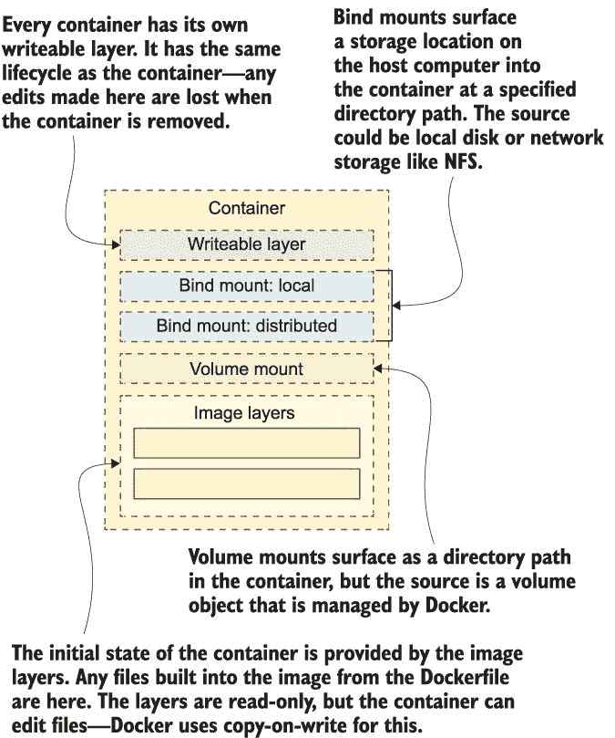

图 6.15 容器文件系统是由多个来源的联合创建的。

容器内的应用程序看到一个单一的磁盘，但作为镜像作者或容器用户，你选择该磁盘的来源。容器中可以有多个镜像层、多个卷挂载和多个绑定挂载，但它们将始终只有一个可写层。以下是一些关于如何使用存储选项的一般性指南：

+   可写层 -- 适用于短期存储，例如将数据缓存到磁盘以节省网络调用或计算。这些是每个容器独有的，但容器被移除后它们将永远消失。

+   本地绑定挂载 -- 用于在主机和容器之间共享数据。开发者可以使用绑定挂载将他们的计算机上的源代码加载到容器中，这样当他们修改 HTML 或 JavaScript 文件时，更改会立即反映在容器中，而无需构建新的镜像。

+   分布式绑定挂载--用于在网络存储和容器之间共享数据。这些很有用，但你需要意识到网络存储的性能可能不会与本地磁盘相同，并且可能不会提供完整的文件系统功能。它们可以用作只读源来存储配置数据或共享缓存，或者用作读写来存储可以被同一网络上的任何机器上的任何容器使用的数据。

+   卷挂载--用于在容器和由 Docker 管理的存储对象之间共享数据。这些对于持久化存储很有用，其中应用程序将数据写入卷。当你用新容器升级应用程序时，它将保留之前版本写入卷的数据。

+   镜像层--这些提供了容器的初始文件系统。层是堆叠的，最新层覆盖了早期层，因此 Dockerfile 开始时写入层的文件可以被随后写入相同路径的层覆盖。层是只读的，并且可以在容器之间共享。

## 6.6 实验室

我们将在本实验室中把这些部分组合起来。它回到了那个好用的待办事项列表应用程序，但这次有所不同。应用程序将在容器中运行，并从一组已创建的任务开始。你的任务是使用相同的镜像但不同的存储选项运行应用程序，这样待办事项列表就可以从空开始，当你保存项目时，它们会被存储到 Docker 卷中。本章的练习应该能帮助你做到这一点，但这里有一些提示：

+   记住，删除所有现有容器的方法是`docker rm -f $(docker ps -aq)`。

+   首先从`diamol/ch06-lab`运行应用程序来检查任务。

+   然后你需要从相同的镜像运行一个带有一些挂载点的容器。

+   应用程序使用配置文件--里面不仅有日志的设置。

如果你需要，我的示例解决方案在书的 GitHub 仓库上，但你应该尝试完成这个任务，因为如果你没有太多经验，容器存储可能会让你感到困惑。有几种方法可以解决这个问题。

我的解决方案在这里：*[`github.com/sixeyed/diamol/blob/master/ch06/lab/README.md`](https://github.com/sixeyed/diamol/blob/master/ch06/lab/README.md)*。
