# 7 使用 Docker Compose 运行多容器应用程序

大多数应用程序不是在一个单一组件中运行的。即使是大型老式应用程序，通常也是作为前端和后端组件构建的，这些组件是物理上分布在不同组件中的独立逻辑层。Docker 极其适合运行分布式应用程序--从多层单体到现代微服务。每个组件都在自己的轻量级容器中运行，Docker 使用标准网络协议将它们连接起来。你可以使用 Docker Compose 以这种方式定义和管理多容器应用程序。

Compose 是一种描述分布式 Docker 应用程序的文件格式，也是管理它们的工具。在本章中，我们将回顾书中早些时候的一些应用程序，并看看 Docker Compose 如何使它们的使用更加容易。

## 7.1 Docker Compose 文件的解剖结构

你已经与许多 Dockerfile 一起工作过，你知道 Dockerfile 是一个打包应用程序的脚本。但对于分布式应用程序，Dockerfile 实际上只是用于打包应用程序的一部分。对于一个具有前端网站、后端 API 和数据库的应用程序，你可能需要三个 Dockerfile--每个组件一个。你将如何在这个容器中运行该应用程序？

你可以使用 Docker CLI 逐个启动每个容器，指定应用程序运行所需的全部选项。这是一个手动过程，可能会成为故障点，因为如果你有任何选项错误，应用程序可能无法正确运行，或者容器可能无法相互通信。相反，你可以使用 Docker Compose 文件描述应用程序的结构。

Docker Compose 文件描述了应用程序的期望状态--当一切运行时它应该看起来是什么样子。这是一个简单的文件格式，其中你将所有会放在 `docker` `container` `run` 命令中的选项放入 Compose 文件中。然后你使用 Docker Compose 工具运行应用程序。它会计算出 Docker 需要的资源，这些资源可能是容器、网络或卷--然后向 Docker API 发送请求以创建它们。

列表 7.1 展示了一个完整的 Docker Compose 文件--你可以在书籍源代码的“`exercises`”文件夹中找到这个文件。

列表 7.1 运行第六章待办事项应用程序的 Docker Compose 文件

` version: '3.7'` ` services:` `   todo-web:` `       image: diamol/ch06-todo-list` `       ports:` `           - "8020:80"` `       networks:` `           - app-net` ` networks:` `   app-net:` `       external:` `             name: nat`

此文件描述了一个简单的应用程序，其中一个 Docker 容器连接到一个 Docker 网络。Docker Compose 使用 YAML，这是一种人类可读的文本格式，因其易于转换为 JSON（这是 API 的标准语言）而广泛使用。在 YAML 中，空格很重要--缩进用于标识对象及其对象的子属性。

在这个例子中，有三个顶级语句：

+   `version`是此文件中使用的 Docker Compose 格式的版本。功能集在许多版本中已经演变，因此这里的版本标识了哪些版本与此定义兼容。

+   `services`列出了构成应用程序的所有组件。Docker Compose 使用服务而非实际容器的概念，因为一个服务可以以多个容器从同一镜像的规模运行。

+   `networks`列出了服务容器可以连接的所有 Docker 网络。

您可以使用 Compose 运行此应用程序，并且它将启动单个容器以到达所需状态。图 7.1 显示了应用程序资源的架构图。

在我们实际运行此应用程序之前，有几件事情需要更仔细地查看。名为`todo-web`的服务将从一个名为`diamol/ch06-todo-list`的镜像运行单个容器。它将在主机上发布端口`8020`到容器的端口`80`，并且它将连接容器到在 Compose 文件中称为`app-net`的 Docker 网络。最终结果将与运行`docker` `container` `run` `-p` `8020:80` `--name` `todo-web` `--network` `nat` `diamol/ch06-todo-list`相同。

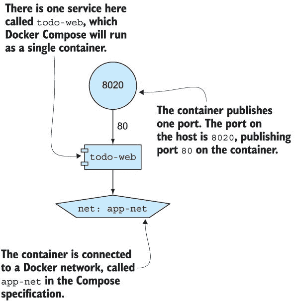

图 7.1 简单 Compose 文件的一个服务和网络架构

在服务名称下方是属性，这些属性与`docker` `container` `run`命令中的选项相当接近：`image`是要运行的镜像，`ports`是要发布的端口，而`networks`是要连接的网络。服务名称成为容器名称和容器的 DNS 名称，其他容器可以使用它来在 Docker 网络上进行连接。服务中的网络名称是`app-net`，但在网络部分，该网络被指定为映射到名为`nat`的外部网络。`external`选项意味着 Compose 期望`nat`网络已经存在，并且它不会尝试创建它。

您可以使用`docker-compose`命令行来管理应用程序，该命令行与 Docker CLI 分开。`docker-compose`命令使用不同的术语，因此您使用`up`命令启动应用程序，该命令告诉 Docker Compose 检查 Compose 文件并创建任何需要的内容以将应用程序带到所需状态。

现在尝试一下 打开终端并创建 Docker 网络。然后浏览到包含 7.1 列表中 Compose 文件的文件夹，然后使用`docker-compose`命令行运行应用程序：

` docker network create nat`  ` cd ./ch07/exercises/todo-list`  ` docker-compose up`

你并不总是需要为 Compose 应用程序创建 Docker 网络，你可能已经从第四章的练习中运行了`nat`网络，在这种情况下，你会得到一个可以忽略的错误。如果你使用 Linux 容器，Compose 可以为你管理网络，但如果你使用 Windows 容器，你需要使用 Docker 在 Windows 上安装时创建的默认网络`nat`。我正在使用`nat`网络，所以无论你运行 Linux 容器还是 Windows 容器，相同的 Compose 文件都会为你工作。

Compose 命令行期望在当前目录中找到一个名为`docker-compose.yml`的文件，因此在这种情况下，它加载了待办事项列表应用程序定义。对于`todo-web`服务，你不会有任何匹配所需状态的容器，所以 Compose 将启动一个容器。当 Compose 运行容器时，它会收集所有应用程序日志并将它们按容器分组显示，这对于开发和测试非常有用。

运行上一个命令的输出结果在图 7.2 中——当你自己运行时，你也会看到从 Docker Hub 拉取的镜像，但我在运行命令之前已经拉取了它们。

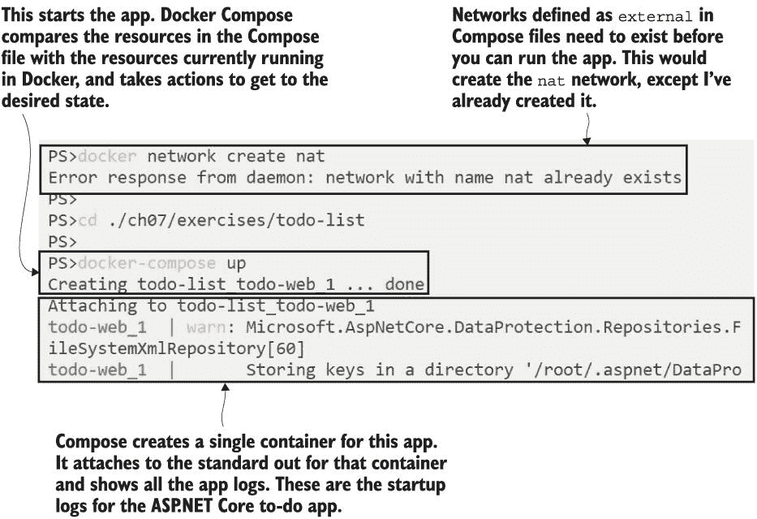

图 7.2 使用 Docker Compose 启动应用程序，它创建了 Docker 资源

现在，你可以浏览到 http: */ /* localhost:8020 来查看待办事项列表应用程序。它的工作方式与第六章完全相同，但 Docker Compose 为你提供了启动应用程序的更稳健的方式。Docker Compose 文件将位于源代码控制中，与应用程序代码和 Dockerfile 一起，并成为描述应用程序所有运行时属性的单一位置。你不需要在 README 文件中记录镜像名称或发布的端口，因为所有这些都在 Compose 文件中。

Docker Compose 格式记录了你配置应用程序所需的所有属性，它还可以记录其他顶级 Docker 资源，如卷和机密。这个应用程序只有一个服务，即使在这种情况下，也最好有一个可以用来运行应用程序和记录其设置的 Compose 文件。但当你运行多容器应用程序时，Compose 才真正有意义。

## 7.2 使用 Compose 运行多容器应用程序

在第四章中，我们构建了一个分布式应用程序，该程序展示了来自 NASA 每日天文图片 API 的图片。该应用程序包含一个 Java 前端网站，一个用 Go 编写的 REST API，以及一个用 Node.js 编写的日志收集器。我们通过依次启动每个容器来运行应用程序，并且必须将容器连接到相同的网络并使用正确的容器名称，以便组件能够相互找到。这正是 Docker Compose 为我们解决的问题之一。

在列表 7.2 中，你可以看到描述图像库应用程序的 Compose 文件的`services`部分。我已经移除了网络配置，以便专注于服务属性，但服务就像待办事项应用程序示例中一样连接到`nat`网络。

列表 7.2 多容器图像画廊应用程序的 Compose 服务

` accesslog:` `   image: diamol/ch04-access-log` ` iotd:` `   image: diamol/ch04-image-of-the-day` `   ports:` `       - "80"`  ` image-gallery:` `   image: diamol/ch04-image-gallery` `   ports:` `       - "8010:80"` `   depends_on:` `       - accesslog` `         - iotd`

这是一个配置不同类型服务的良好示例。`accesslog` 服务不发布任何端口或使用任何其他从 `docker` `container` `run` 命令捕获的属性，因此唯一记录的值是镜像名称。`iotd` 服务是 REST API--Compose 文件记录了镜像名称，并在容器上发布了端口 `80` 到主机的随机端口。`image-gallery` 服务具有镜像名称和特定的发布端口：主机上的 `8010` 端口映射到容器中的端口 `80`。它还有一个 `depends_on` 部分，说明此服务依赖于其他两个服务，因此 Compose 应该确保在启动此服务之前那些服务正在运行。

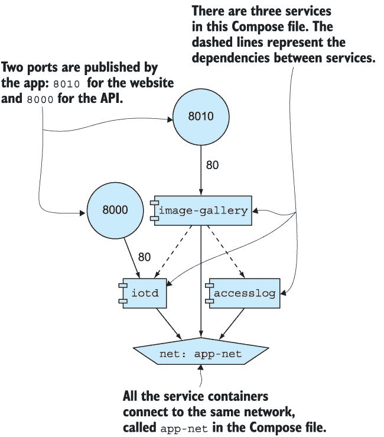

图 7.3 一个更复杂的 Compose 文件，指定了连接到同一网络的三种服务

图 7.3 展示了此应用程序的架构。我使用一个读取 Compose 文件并生成架构 PNG 图像的工具生成了本章中的图表。这是一个保持文档更新的好方法--每次有更改时，您都可以从 Compose 文件生成图表。该图表工具当然运行在 Docker 容器中--您可以在 GitHub 上找到它，网址为 *[`github.com/pmsipilot/docker-compose-viz`](https://github.com/pmsipilot/docker-compose-viz)* 。

我们将使用 Docker Compose 来运行应用程序，但这次我们将以分离模式运行。Compose 仍然会为我们收集日志，但容器将在后台运行，这样我们就可以恢复终端会话，并使用 Compose 的更多功能。

现在尝试一下 打开终端会话到您的 DIAMOL 源代码根目录，然后导航到图像画廊文件夹并运行应用程序：

` cd ./ch07/exercises/image-of-the-day` ` docker-compose up --detach`

您的输出将像我图 7.4 中的那样。您可以看到，由于 Compose 文件中记录的依赖关系，`accesslog` 和 `iotd` 服务在 `image-gallery` 服务之前启动。

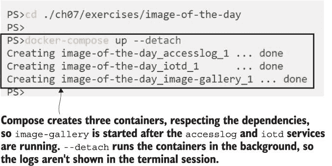

图 7.4 使用 Docker Compose 指定依赖关系启动多容器应用程序

当应用程序运行时，你可以浏览到 http: */ /* localhost:8010\. 它与第四章中的操作一样，但现在你在 Docker Compose 文件中有明确的定义，说明容器需要如何配置才能一起工作。你还可以使用 Compose 文件来管理整个应用程序。API 服务实际上是无状态的，因此你可以将其扩展到在多个容器上运行。当 Web 容器从 API 请求数据时，Docker 会将这些请求共享到正在运行的 API 容器中。

现在尝试一下 在相同的终端会话中，使用 Docker Compose 增加*iotd*服务的扩展规模，然后刷新网页几次并检查*iotd*容器的日志：

` docker-compose up -d --scale iotd=3`  ` # 浏览到 http://localhost:8010 并刷新`  ` docker-compose logs --tail=1 iotd`

你会在输出中看到 Compose 创建了两个新的容器来运行图像 API 服务，因此现在它的扩展规模为三。当你刷新显示照片的网页时，Web 应用程序会从 API 请求数据，这个请求可以由任何 API 容器处理。API 在处理请求时写入日志条目，你可以在容器日志中看到。Docker Compose 可以显示所有容器的所有日志条目，或者你可以使用它来过滤输出--`--tail=1`参数仅从每个`iotd`服务容器中获取最后一个日志条目。

我的输出在图 7.5 中--你可以看到容器 1 和 3 已被 Web 应用程序使用，但容器 2 迄今为止还没有处理任何请求。

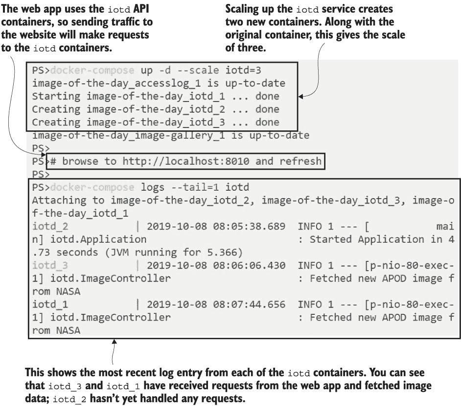

图 7.5 使用 Docker Compose 扩展应用程序组件并检查其日志

Docker Compose 现在正在为我管理五个容器。我可以使用 Compose 控制整个应用程序；我可以停止所有容器以节省计算资源，当我需要应用程序运行时再次启动它们。但这些都是我可以使用 Docker CLI 进行操作的普通 Docker 容器。Compose 是一个用于管理容器的独立命令行工具，但它以与 Docker CLI 相同的方式使用 Docker API。你可以使用 Compose 来管理你的应用程序，但仍然可以使用标准的 Docker CLI 来与 Compose 创建的容器进行交互。

现在尝试一下 在相同的终端会话中，使用 Docker Compose 命令停止和启动应用程序，然后使用 Docker CLI 列出所有正在运行的容器：

` docker-compose stop`  ` docker-compose start`  ` docker container ls`

你的输出将像我图 7.6 中的那样。你会看到当停止应用程序时，Compose 会列出单个容器，但当它再次启动应用程序时，它只列出服务，并且服务以正确的依赖顺序启动。在容器列表中，你会看到 Compose 重新启动了现有的容器，而不是创建新的容器。所有我的容器都显示它们是在 30 分钟前创建的，但它们只运行了几秒钟。

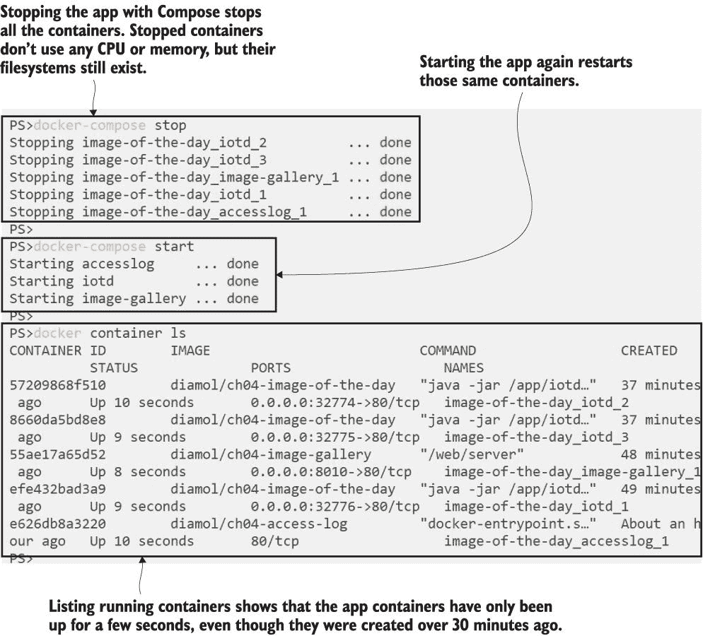

图 7.6 使用 Docker Compose 停止和启动多容器应用程序

Compose 有许多其他功能——运行 `docker-compose` 而不带任何选项以查看完整的命令列表——但在你进一步操作之前，有一个非常重要的考虑因素。Docker Compose 是一个客户端工具。它是一个命令行，根据 Compose 文件的内容向 Docker API 发送指令。Docker 本身只是运行容器；它没有意识到许多容器代表一个单一的应用程序。只有 Compose 知道这一点，而 Compose 只是通过查看 Docker Compose YAML 文件来了解你的应用程序结构，因此你需要有这个文件来管理你的应用程序。

有可能使你的应用程序与 Compose 文件不同步，例如当 Compose 文件更改或你更新正在运行的应用程序时。当你返回使用 Compose 管理应用程序时，这可能会导致意外的行为。我们已经自己做过这件事了——我们将 `iotd` 服务扩展到三个容器，但这个配置没有在 Compose 文件中捕获。当你关闭应用程序然后重新创建它时，Compose 会将其恢复到原始的缩放级别。

现在尝试一下，在同一个终端会话中——因为 Compose 需要使用相同的 YAML 文件——使用 Docker Compose 将应用程序关闭并重新启动。然后通过列出运行中的容器来检查缩放情况：

`docker-compose down`  `docker-compose up -d`  `docker container ls`

`down` 命令删除应用程序，因此 Compose 会停止并删除容器——如果它们在 Compose 文件中记录并且未标记为 `external`，它也会删除网络和卷。然后 `up` 命令启动应用程序，因为没有正在运行的容器，Compose 会创建所有服务——但它使用 Compose 文件中的应用程序定义，该定义没有记录缩放，因此 API 服务使用一个容器启动，而不是我们之前运行的三个容器。

你可以在图 7.7 的输出中看到。这里的目的是重新启动应用程序，但我们意外地将 API 服务缩放到了更低的级别。

Docker Compose 使用简单且功能强大，但你需要注意它是一个客户端工具，因此它依赖于对应用程序定义 YAML 文件的良好管理。当你使用 Compose 部署应用程序时，它会创建 Docker 资源，但 Docker 引擎并不知道这些资源是相关的——只有当你有 Compose 文件来管理它们时，它们才是一个应用程序。

## 7.3 Docker 如何连接容器

分布式应用程序中的所有组件都运行在 Compose 的 Docker 容器中，但它们如何相互通信呢？您知道容器是一个具有自己网络空间的虚拟化环境。每个容器都由 Docker 分配一个虚拟 IP 地址，连接到同一 Docker 网络的容器可以使用它们的 IP 地址相互通信。但是容器在应用程序生命周期中会被替换，新的容器将拥有新的 IP 地址，因此 Docker 也支持使用 DNS 进行服务发现。

DNS 是域名系统，它将名称链接到 IP 地址。它在公共互联网和私有网络上工作。当您将浏览器指向 blog.sixeyed.com 时，您正在使用域名，该域名解析为托管我的博客的 Docker 服务器之一的 IP 地址。您的机器实际上使用 IP 地址获取内容，但作为用户，您与域名一起工作，这要友好得多。

Docker 内置了自己的 DNS 服务。运行在容器中的应用程序在尝试访问其他组件时进行域名查找。Docker 中的 DNS 服务执行该查找——如果域名实际上是一个容器名称，Docker 返回容器的 IP 地址，消费者可以直接在 Docker 网络中工作。如果域名不是容器，Docker 将请求转发到 Docker 运行的服务器，因此它将进行标准的 DNS 查找以在您的组织网络或公共互联网上找到 IP 地址。

您可以通过 `image-gallery` 应用程序看到这一过程。Docker 的 DNS 服务响应将包含单个 IP 地址，用于在单个容器中运行的服务，或者如果服务在多个容器中跨规模运行，则包含多个 IP 地址。

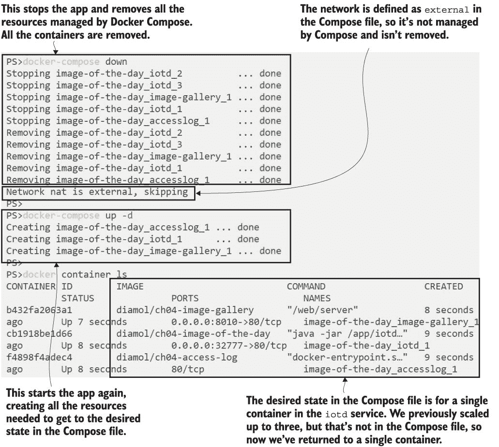

图 7.7 移除和重新创建应用程序将其重置为 Docker Compose 文件中的状态。

现在尝试一下。在相同的终端会话中，使用 Docker Compose 以 API 运行三倍的规模启动应用程序。然后连接到 Web 容器中的会话——选择要运行的 Linux 或 Windows 命令——并执行 DNS 查找：

` docker-compose up -d --scale iotd=3`  ` # 对于 Linux 容器：` ` docker container exec -it image-of-the-day_image-gallery_1 sh`  ` # 对于 Windows 容器：` ` docker container exec -it image-of-the-day_image-gallery_1 cmd`  ` nslookup accesslog`  ` exit`

`nslookup` 是网络应用程序基本镜像的一部分的小工具——它为您提供的名称执行 DNS 查找，并打印出 IP 地址。我的输出在图 7.8 中——您可以看到 `nslookup` 的错误消息，您可以忽略（这与 DNS 服务器本身有关），然后是容器的 IP 地址。我的 `accesslog` 容器的 IP 地址是 `172.24.0.2` 。

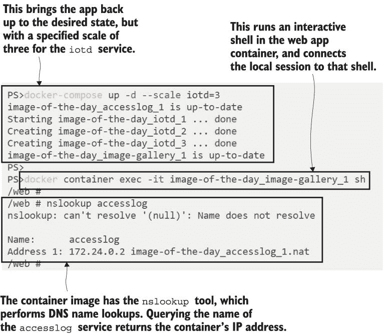

图 7.8 使用 Docker Compose 缩放服务并执行 DNS 查找

连接到同一 Docker 网络的容器将获得相同网络范围内的 IP 地址，并且它们通过该网络连接。使用 DNS 意味着当您的容器被替换且 IP 地址发生变化时，您的应用程序仍然可以工作，因为 Docker 中的 DNS 服务将始终从域名查找中返回当前容器的 IP 地址。

您可以通过使用 Docker CLI 手动删除`accesslog`容器来验证这一点，然后使用 Docker Compose 再次启动应用程序。Compose 会看到没有正在运行的`accesslog`容器，因此它会启动一个新的容器。该容器可能从 Docker 网络获得新的 IP 地址——这取决于正在创建的其他容器——因此当您进行域名查找时，您可能会看到不同的响应。

现在尝试一下 仍然在同一个终端会话中，使用 Docker CLI 删除`accesslog`容器，然后使用 Docker Compose 将应用程序恢复到所需状态。然后再次连接到 Web 容器，使用 Linux 中的`sh`或 Windows 中的`cmd`，并运行更多的 DNS 查找：

` docker container rm -f image-of-the-day_accesslog_1` ` docker-compose up -d --scale iotd=3`  ` # 对于 Linux 容器：` ` docker container exec -it image-of-the-day_image-gallery_1 sh`  ` # 对于 Windows 容器：` ` docker container exec -it image-of-the-day_image-gallery_1 cmd`  ` nslookup accesslog`  ` nslookup iotd`  ` exit`

您可以在图 7.9 中看到我的输出。在我的情况下，没有其他进程创建或删除容器，因此相同的 IP 地址`172.24.0.2`被用于新的`accesslog`容器。在`iotd` API 的 DNS 查找中，您可以看到返回了三个 IP 地址，每个服务中的三个容器对应一个。

DNS 服务器可以为域名返回多个 IP 地址。Docker Compose 使用此机制进行简单的负载均衡，为服务返回所有容器的 IP 地址。处理多个响应的方式取决于执行 DNS 查找的应用程序；一些应用程序采用简单的方法，使用列表中的第一个地址。为了尝试在所有容器之间提供负载均衡，Docker DNS 每次都会以不同的顺序返回列表。您会看到，如果您重复对`iotd`服务进行`nslookup`调用——这是一个尝试在所有容器之间分配流量的基本方法。

Docker Compose 记录了您容器的所有启动选项，并在运行时处理容器之间的通信。您还可以使用它来设置环境的配置。

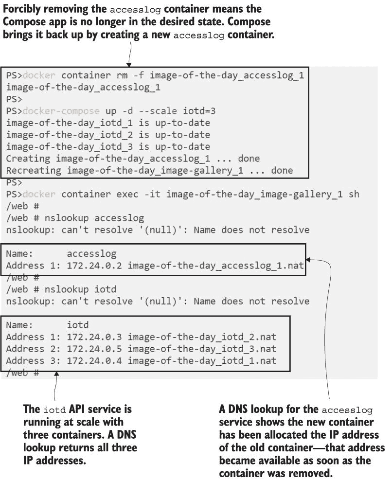

图 7.9 服务与多个容器一起扩展——查找中返回了每个容器的 IP 地址。

## 7.4 Docker Compose 中的应用程序配置

第六章中的待办事项应用可以以不同的方式使用。您可以将其作为一个单独的容器运行，在这种情况下，它将在 SQLite 数据库中存储数据——这只是一个容器内的文件。您在第六章中看到了如何使用卷来管理该数据库文件。SQLite 适用于小型项目，但大型应用程序将使用单独的数据库，并且待办事项应用可以配置为使用远程 Postgres SQL 数据库而不是本地 SQLite。

Postgres 是一个强大且流行的开源关系型数据库。它在 Docker 中运行良好，因此您可以在一个容器中运行应用程序，在另一个容器中运行数据库的分布式应用程序。此待办事项应用的 Docker 镜像是根据本书中的指南构建的，因此它包含开发环境的默认配置集，但配置设置可以应用，以便与其他环境兼容。我们可以使用 Docker Compose 应用这些配置设置。

查看列表 7.3 中的 Compose 文件的服务——这些指定了 Postgres 数据库服务和待办事项应用程序服务。

列表 7.3 带有 Postgres 数据库的待办事项应用的 Compose 服务

` services:`    `   todo-db:` `       image: diamol/postgres:11.5` `       ports:` `           - "5433:5432"` `       networks:` `           - app-net`  `   todo-web:` `       image: diamol/ch06-todo-list` `       ports:` `           - "8020:80"` `       environment:` `           - Database:Provider=Postgres` `       depends_on:` `           - todo-db` `       networks:` `           - app-net` `       secrets:` `           - source: postgres-connection` `                 target: /app/config/secrets.json`

数据库的规范很简单——它使用 `diamol/postgres:11.5` 镜像，将容器中的标准 Postgres 端口 `5342` 发布到主机上的端口 `5433`，并使用服务名称 `todo-db`，这将是服务的 DNS 名称。Web 应用程序有一些新的配置部分：

+   `environment` 设置在容器内创建的环境变量。当此应用运行时，容器内将设置一个名为 `Database:Provider` 的环境变量，其值为 `Postgres`。

+   `secrets` 可以从运行时环境读取，并在容器内作为文件填充。此应用将在 `/app/config/secrets.json` 文件中包含名为 `postgres-connection` 的秘密内容。

在集群环境中，秘密通常由容器平台提供——这可能是 Docker Swarm 或 Kubernetes。它们存储在集群数据库中，可以进行加密，因此对于敏感配置数据（如数据库连接字符串、证书或 API 密钥）非常有用。在运行 Docker 的单台机器上，没有集群数据库用于秘密，因此使用 Docker Compose 可以从文件中加载秘密。此 Compose 文件的末尾有一个 `secrets` 部分，如列表 7.4 所示。

列表 7.4 在 Docker Compose 中从本地文件加载秘密

` secrets:` `   postgres-connection:` `         file: ./config/secrets.json`

这告诉 Docker Compose 从名为`secrets.json`的主机文件中加载名为`postgres-connection`的秘密。这种场景类似于我们在第六章中提到的绑定挂载——实际上，主机上的文件被暴露到容器中。但将其定义为秘密，您可以选择在集群环境中迁移到真正的加密秘密。

将应用程序配置插入到 Compose 文件中，让您以不同的方式使用相同的 Docker 镜像，并对每个环境的设置进行明确说明。您可以为开发和测试环境分别创建不同的 Compose 文件，发布不同的端口并触发应用程序的不同功能。此 Compose 文件设置环境变量和秘密，以便在 Postgres 模式下运行待办事项应用程序，并提供连接到 Postgres 数据库的详细信息。

当您运行应用程序时，您会看到它的行为方式相同，但现在数据存储在可以单独管理（与应用程序分开）的 Postgres 数据库容器中。

现在尝试一下 打开代码根目录的终端会话，并切换到本练习的目录。在那个目录中，您将看到 Docker Compose 文件以及包含要加载到应用程序容器中的秘密的 JSON 文件。使用`docker-compose` `up`命令以常规方式启动应用程序：

` cd ./ch07/exercises/todo-list-postgres`  ` # for Linux containers:` ` docker-compose up -d`  ` # OR for Windows containers (which use different file paths):`  ` docker-compose -f docker-compose-windows.yml up -d`  ` docker-compose ps`

图 7.10 显示了我的输出。那里没有新的内容，除了`docker-compose` `ps`命令，它列出了所有作为此 Compose 应用程序一部分运行的容器。

图 7.10 使用 Docker Compose 运行新应用程序并列出其容器

您可以通过 http: */ /* localhost:8030 访问此版本的待办事项应用程序。功能相同，但现在数据正在 Postgres 数据库容器中保存。您可以使用数据库客户端进行检查——我使用 Sqlectron，这是一个快速的开源、跨平台 UI，用于连接到 Postgres、MySQL 和 SQL Server 数据库。服务器的地址是`localhost:5433`，这是容器公开的端口；数据库名为`todo`，用户名为`postgres`，没有密码。您可以在图 7.11 中看到，我已经向 Web 应用程序添加了一些数据，并且我可以在 Postgres 中查询它。

将应用程序包与运行时配置分离是 Docker 的一个关键优势。你的应用程序镜像将由你的构建管道生成，并且相同的镜像将经过测试环境直到它准备好投入生产。每个环境都会应用自己的配置设置，使用环境变量或绑定挂载或机密信息--这些都可以轻松地捕获在 Docker Compose 文件中。在每一个环境中，你都在使用相同的 Docker 镜像，因此你可以确信你正在将所有其他环境中测试通过的精确二进制文件和依赖项发布到生产环境中。

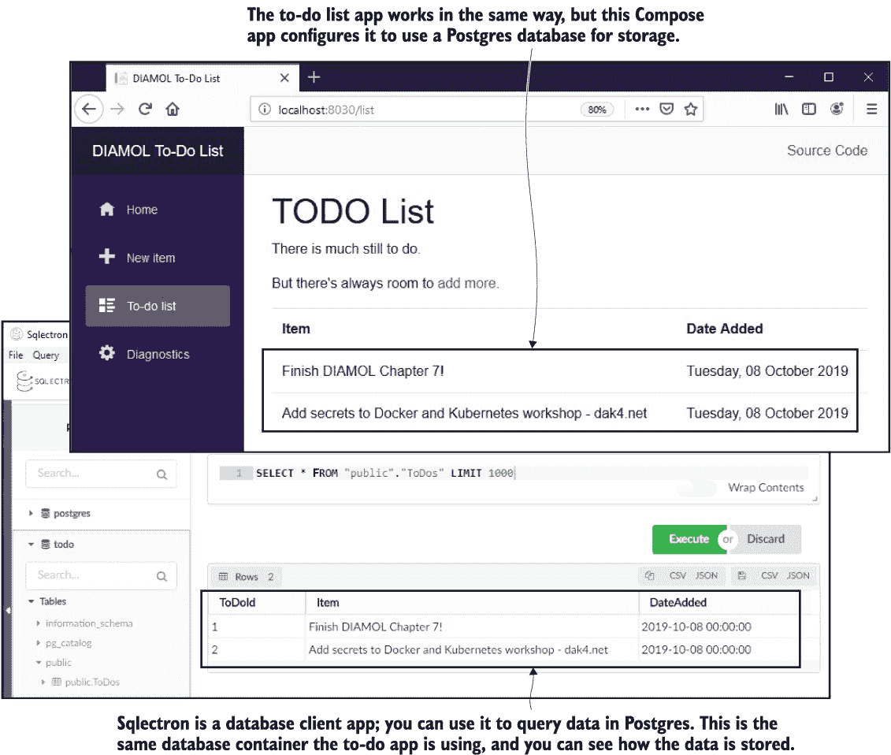

图 7.11 在容器中运行待办事项应用程序，使用 Postgres 数据库并查询数据

## 7.5 理解 Docker Compose 解决的问题

Docker Compose 是一种非常整洁的方式来描述复杂分布式应用程序的设置，使用的是小型、清晰的文件格式。Compose YAML 文件实际上是你应用程序的部署指南，但它比用 Word 文档编写的指南要先进得多。在以前，那些 Word 文档描述了应用程序发布的每一步，它们有数十页，充满了不准确描述和过时信息。Compose 文件简单且可操作--你用它来运行你的应用程序，因此不存在过时的风险。

当你开始更多地使用 Docker 容器时，Compose 是你工具箱中的一个有用部分。但了解 Docker Compose 的确切用途及其局限性非常重要。Compose 允许你定义你的应用程序并将定义应用到运行 Docker 的单台机器上。它会将该机器上实时 Docker 资源与 Compose 文件中描述的资源进行比较，并将向 Docker API 发送请求以替换已更新的资源，并在需要的地方创建新资源。

当你运行 `docker-compose` `up` 命令时，你将获得应用程序期望的状态，但 Docker Compose 的任务就到这里结束了。它不是一个像 Docker Swarm 或 Kubernetes 那样的完整容器平台--它不会持续运行以确保你的应用程序保持期望的状态。如果容器失败或你手动删除它们，Docker Compose 将不会重新启动或替换它们，直到你再次明确运行 `docker-compose` `up` 命令。图 7.12 展示了 Compose 在应用程序生命周期中的位置。

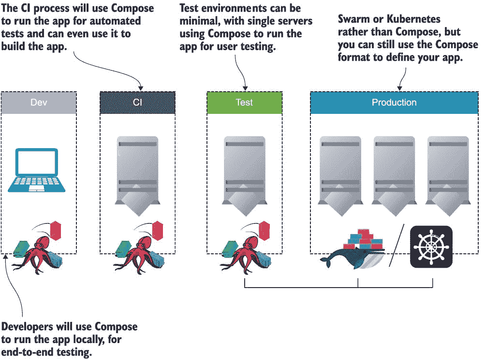

图 7.12 在应用程序生命周期中从开发到生产使用 Docker Compose 的位置

这并不是说 Docker Compose 不适合生产环境。如果您刚开始使用 Docker，并且正在将工作负载从单个虚拟机迁移到容器，它可能是一个不错的起点。在那个 Docker 机器上，您不会获得高可用性、负载均衡或故障转移，但您在单个应用程序虚拟机上也没有这些。您将为所有应用程序获得一致的工具集--所有内容都有 Dockerfile 和 Docker Compose 文件--并且您将获得一致的工具来部署和管理您的应用程序。这可能足以在您考虑运行容器集群之前开始。

## 7.6 实验室

Docker Compose 中有一些有用的功能，可以为运行您的应用程序提供可靠性。在这个实验中，我希望您创建一个 Compose 定义，以便在测试环境中更可靠地运行待办事项 Web 应用程序：

+   如果机器重新启动或 Docker 引擎重新启动，应用程序容器将重新启动。

+   数据库容器将使用绑定挂载来存储文件，因此您可以停用并重新启动应用程序，同时保留您的数据。

+   Web 应用程序应监听标准端口 80 进行测试。

对于这一点，只有一个提示：

+   您可以在 Docker 的参考文档中找到 Docker Compose 文件规范：*[`docs.docker.com/compose/compose-file`](https://docs.docker.com/compose/compose-file)*。它定义了您可以在 Compose 中捕获的所有设置。

我的示例解决方案始终在书的 GitHub 仓库中。希望这个示例不会太复杂，这样您就不需要它了：*[`github.com/sixeyed/diamol/blob/master/ch07/lab/README.md`](https://github.com/sixeyed/diamol/blob/master/ch07/lab/README.md)*。
