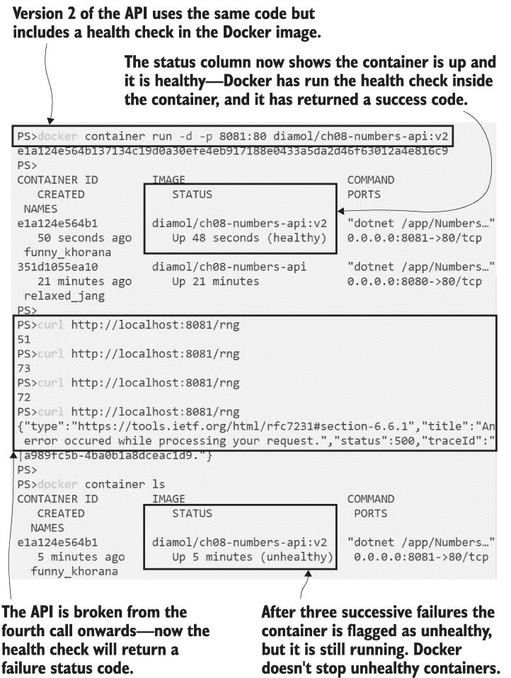
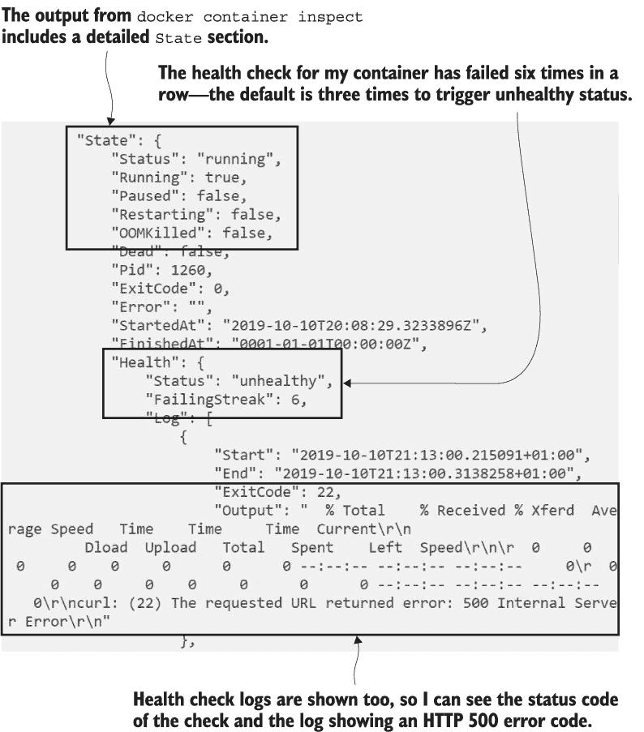
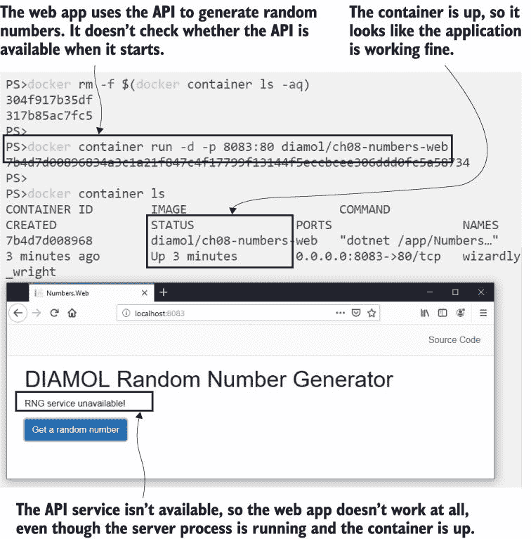
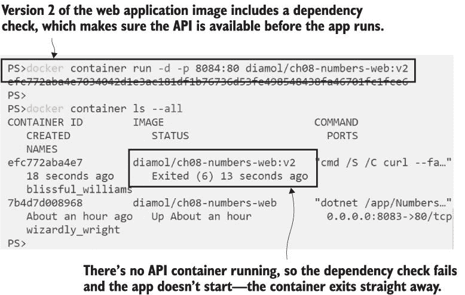
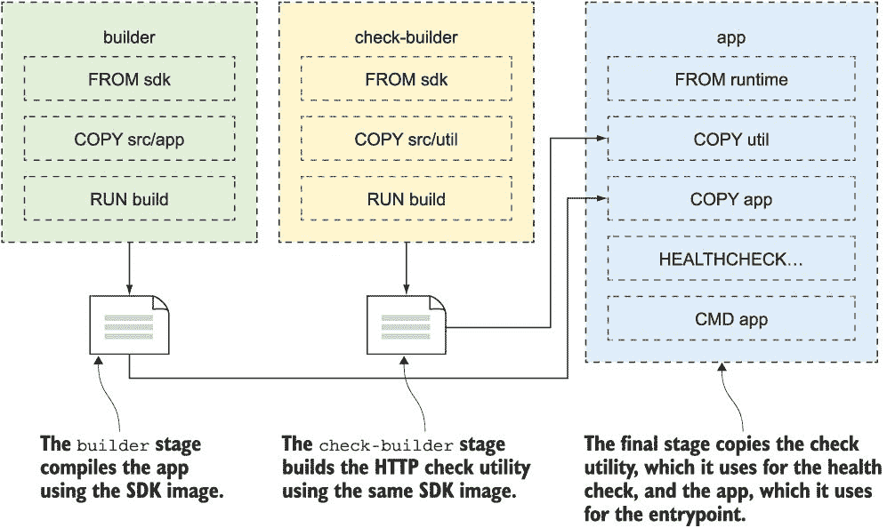
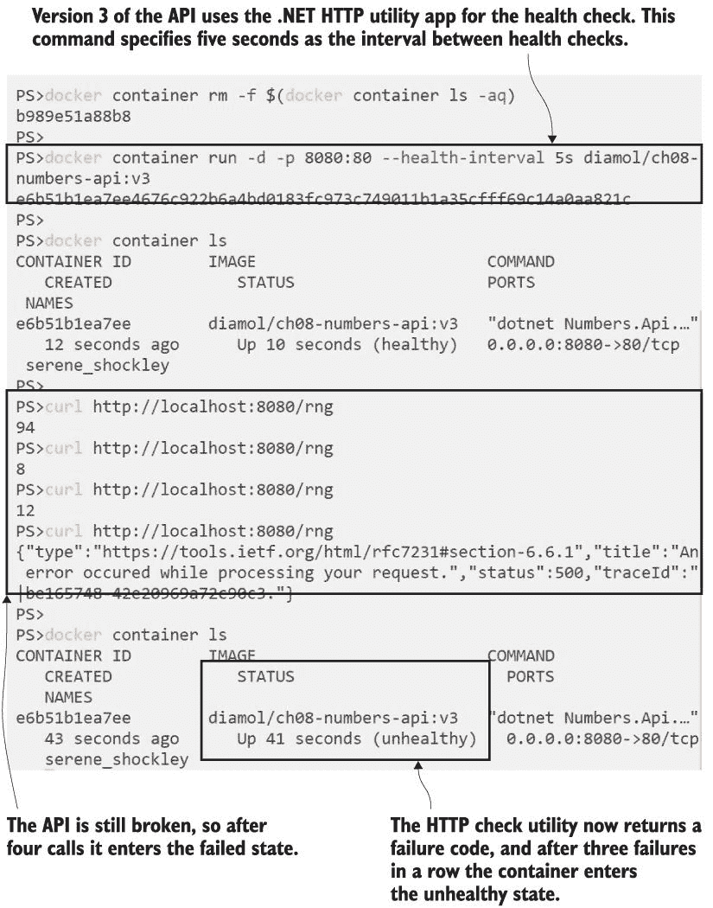
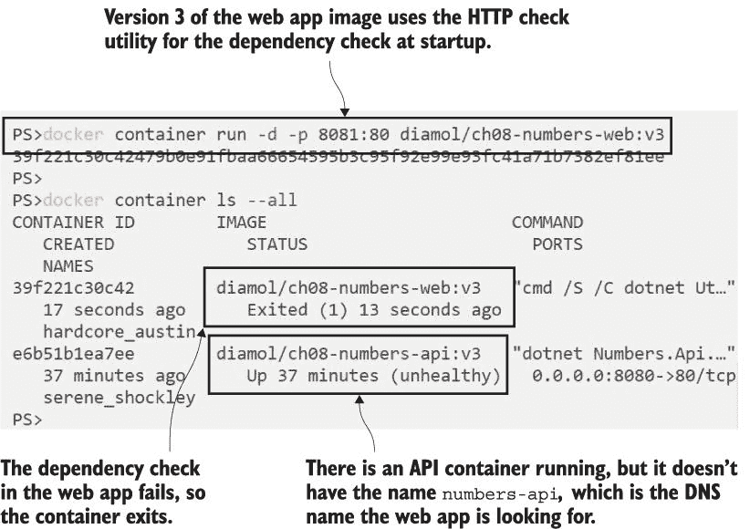
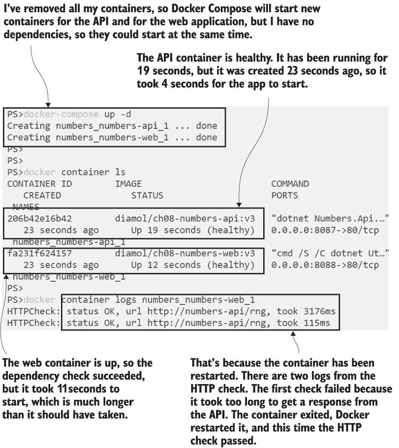
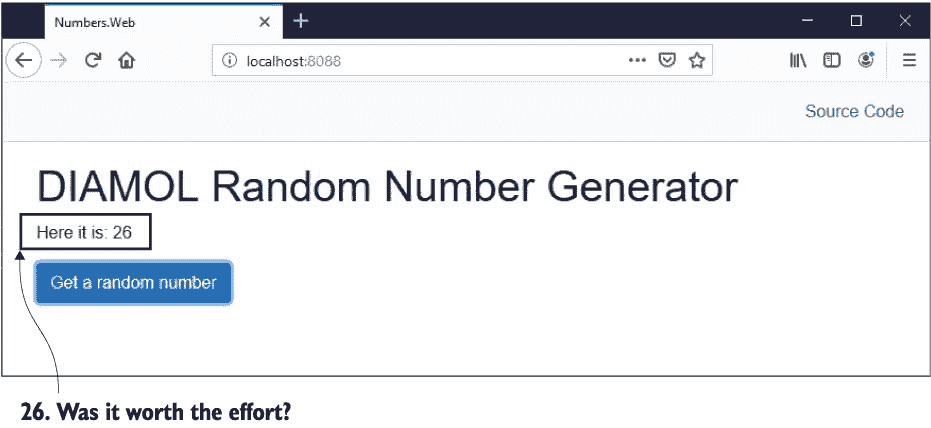
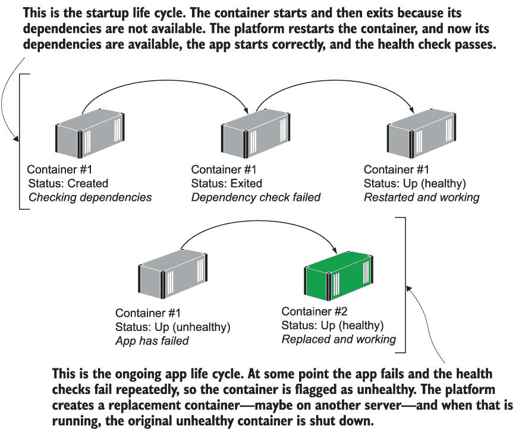

# 8 使用健康检查和依赖检查支持可靠性

我们正在朝着在容器中使软件生产就绪的目标前进。您已经看到将应用打包到 Docker 镜像中、在容器中运行它们以及使用 Docker Compose 定义多容器应用是多么简单。在生产中，您将在 Docker Swarm 或 Kubernetes 等容器平台上运行您的应用，这些平台具有帮助您部署自愈应用的功能。您可以将容器打包成平台使用的信息，以检查容器中的应用是否健康。如果应用停止正常工作，平台可以移除一个故障容器，并用一个新的容器替换它。

在本章中，您将学习如何将这些检查打包到您的容器镜像中，以帮助平台保持您的应用在线。

## 8.1 将健康检查构建到 Docker 镜像中

每次运行容器时，Docker 都会在基本层面上监控您的应用健康。容器启动时会运行一个特定的进程，这可能是 Java 或.NET Core 运行时、shell 脚本或应用程序二进制文件。Docker 会检查该进程是否仍在运行，如果停止，容器就会进入已退出的状态。

这为您提供了一个适用于所有环境的健康检查基础。如果进程失败并且容器退出，开发者可以看到他们的应用不健康。在集群环境中，容器平台可以重新启动已退出的容器或创建一个替换容器。但这只是一个非常基础的检查——它确保进程正在运行，但并不能保证应用实际上健康。一个容器中的 Web 应用可能会达到最大容量，并开始向每个请求返回 HTTP 503“服务不可用”的响应，但只要容器中的进程仍在运行，Docker 就会认为容器是健康的，尽管应用已经停滞。

Docker 提供了一种巧妙的方法，只需在 Dockerfile 中添加逻辑，就可以将真实的应用健康检查直接构建到 Docker 镜像中。我们将使用一个简单的 API 容器来实现这一点，但首先我们将不运行任何健康检查以确保我们理解了问题。

现在试试 Run 一个托管简单 REST API 并返回随机数的容器。该应用有缺陷，所以当 API 被调用三次后，它变得不健康，后续的每次调用都会失败。打开一个终端，运行容器，并使用 API——这是一个新镜像，所以您会在运行容器时看到 Docker 将其拉取：

` # 启动 API 容器` ` docker container run -d -p 8080:80 diamol/ch08-numbers-api`  ` # 重复三次 - 它返回一个随机数` ` curl http://localhost:8080/rng` ` curl http://localhost:8080/rng` ` curl http://localhost:8080/rng`  ` # 从第四次调用开始，API 总是失败` ` curl http://localhost:8080/rng`  ` # 检查容器状态` ` docker container ls`

你可以在图 8.1 中看到我的输出。API 在前三次调用时表现正确，然后返回 HTTP 500“内部服务器错误”响应。代码中的错误意味着它将始终返回 500。实际上，这并不是一个错误；应用程序是故意这样编写的。如果你想查看它是如何工作的，源代码在本书第八章的源代码中（`ch08/exercises/numbers/numbers-api/Dockerfile.v2`）。在容器列表中，API 容器状态为`Up`。容器内的进程仍在运行，所以从 Docker 的角度来看，看起来一切正常。容器运行时无法知道该进程内部发生了什么，以及应用程序是否仍然表现正确。

图 8.1 Docker 检查应用程序进程，即使应用程序处于失败状态，容器也能正常运行。

输入`HEALTHCHECK`指令，你可以将其添加到 Dockerfile 中，以告诉运行时如何确切地检查容器中的应用程序是否仍然健康。`HEALTHCHECK`指令指定了 Docker 在容器内运行的命令，该命令将返回一个状态码——命令可以是任何你需要检查应用程序是否健康的命令。Docker 将在容器中以定时间隔运行该命令。如果状态码表明一切正常，则容器是健康的。如果状态码连续几次失败，则容器被标记为不健康。

列表 8.1 显示了为随机数 API 创建的新 Dockerfile 中的`HEALTHCHECK`命令，我将构建为版本 2（完整文件在本书源代码的`ch08/exercises/numbers/numbers-api/Dockerfile.v2`中）。这个健康检查使用了一个类似于我在主机上使用的`curl`命令，但这次它在容器内运行。`/health` URL 是应用程序中的另一个端点，用于检查是否触发了错误；如果应用程序运行正常，它将返回 200“OK”状态码；如果应用程序损坏，它将返回 500“内部服务器错误”。

列表 8.1 Dockerfile 中的`HEALTHCHECK`指令

` FROM diamol/dotnet-aspnet`  ` ENTRYPOINT ["dotnet", "/app/Numbers.Api.dll"]` ` HEALTHCHECK CMD curl --fail http://localhost/health`  ` WORKDIR /app` ` COPY --from=builder /out/ .`

Dockerfile 的其余部分相当简单。这是一个.NET Core 应用程序，所以`ENTRYPOINT`运行`dotnet`命令，Docker 监控的就是这个`dotnet`进程，以检查应用程序是否仍在运行。健康检查通过 HTTP 调用`/health`端点，这是 API 提供的用于测试应用程序是否健康的端点。使用`--fail`参数意味着`curl`命令会将状态码传递给 Docker——如果请求成功，它返回数字 0，Docker 将其读取为成功的检查。如果失败，它返回一个非 0 的数字，这意味着健康检查失败。

我们将构建该镜像的新版本，以便你可以看到`build`命令与不同文件结构一起是如何工作的。通常你会在应用程序源文件夹中有一个 Dockerfile，Docker 会找到它并运行构建。在这种情况下，Dockerfile 有一个不同的名称，并且位于源代码的单独文件夹中，所以你需要在`build`命令中显式指定路径。

现在试试看 运行一个终端，浏览到包含书籍源代码的文件夹。然后使用 v2 标签构建新的镜像，使用 v2 Dockerfile：

` # 浏览到根路径，该路径包含源代码和 Dockerfile 文件夹：` ` cd ./ch08/exercises/numbers`  ` # 使用-f 标志指定 Dockerfile 的路径来构建镜像：` ` docker image build -t diamol/ch08-numbers-api:v2 -f ./numbers-api/Dockerfile.v2 .`

一旦构建了镜像，你就可以运行应用并进行健康检查。你可以配置健康检查的运行频率以及连续失败多少次意味着应用不健康。默认情况下，每 30 秒运行一次，连续三次失败将触发不健康状态。API 镜像的 v2 版本已经内置了健康检查，所以当你重复测试时，你会发现在容器中报告了容器的健康状态。

现在试试看 运行相同的测试，但使用 v2 镜像标签，并在命令之间留出一些时间，让 Docker 在容器内触发健康检查。

` # 启动 API 容器，v2` ` docker container run -d -p 8081:80 diamol/ch08-numbers-api:v2`  ` # 等待大约 30 秒，然后列出容器` ` docker container ls`  ` # 重复四次 - 它返回三个随机数字然后失败` ` curl http://localhost:8081/rng` ` curl http://localhost:8081/rng` ` curl http://localhost:8081/rng` ` curl http://localhost:8081/rng`  ` # 现在应用处于失败状态 - 等待 90 秒并检查` ` docker container ls`

我的输出在图 8.2 中。你可以看到 API 容器的新版本最初显示为健康状态——如果镜像内置了健康检查，Docker 会显示运行容器的健康检查状态。在我触发错误一段时间后，容器显示为不健康。

图 8.2 一个损坏的应用显示为不健康的容器，但容器仍然在运行。

不健康状态作为 Docker API 的事件发布，因此运行容器的平台会收到通知并可以采取行动修复应用程序。Docker 还会记录最近的健康检查结果，你可以在检查容器时看到这些结果。你已经看到了`docker container inspect`的输出，它显示了 Docker 知道的关于容器的一切。如果正在进行健康检查，它也会显示出来。

现在试试看。我们有两个正在运行的 API 容器，我们在创建它们时没有命名，但我们可以使用带有 `--last` 标志的 `container ls` 命令找到最新创建的容器的 ID。您可以将它输入到 `container inspect` 中，以查看最新容器的状态：

`docker container inspect $(docker container ls --last 1 --format '{{.ID}}')`

这里返回的是 JSON 数据的页面，如果您滚动到 `State` 字段，您会看到有一个 `Health` 部分。它包含健康检查的当前状态、连续失败的次数（即“failing streak”）以及最近健康检查调用的日志。在图 8.3 中，您可以看到我的容器状态的摘录。健康检查正处于连续失败的第六次，这触发了容器进入不健康状态，您可以看到健康检查命令的日志，当它们得到 HTTP 状态码为 500 的结果时，这些命令会失败。

图 8.3 显示了具有健康检查的容器的健康状态和健康检查日志。

健康检查正在做它应该做的事情：测试容器内的应用程序，并向 Docker 标记应用程序不再健康。但您也可以在图 8.3 中看到，我的不健康容器有一个“运行”状态，所以尽管 Docker 知道它运行不正确，它仍然在运行。为什么 Docker 没有重新启动或替换那个容器？

简单的答案是 Docker 无法安全地这样做，因为 Docker 引擎是在单个服务器上运行的。Docker 可以停止并重新启动该容器，但这意味着在容器被回收期间，您的应用程序将出现停机时间。或者 Docker 可以删除该容器并从相同的设置中启动一个新的容器，但如果您的应用程序在容器内写入数据，那么这将意味着停机时间和数据丢失。Docker 无法确定采取行动修复不健康的容器不会使情况变得更糟，因此它广播容器不健康的信息，但仍然让它运行。健康检查也会继续，所以如果失败是暂时的，并且下一次检查通过，容器状态会再次变为健康。

在由 Docker Swarm 或 Kubernetes 管理的多个服务器上运行的 Docker 集群中，健康检查变得非常有用。如果容器不健康，容器平台会收到通知并采取行动。因为集群中有多余的容量，可以在不健康的容器仍在运行时启动一个替换容器，所以不应该有任何应用程序的停机时间。

## 8.2 使用依赖检查启动容器

健康检查是一个持续进行的测试，有助于容器平台保持应用程序运行。具有多个服务器的集群可以通过启动新的容器来处理暂时性故障，因此即使一些容器停止响应，也不会丢失服务。但是，跨集群运行为分布式应用程序带来了新的挑战，因为你无法控制可能相互依赖的容器的启动顺序。

我们的随机数生成器 API 伴随有一个网站。该 Web 应用程序在其自己的容器中运行，并使用 API 容器生成随机数。在单个 Docker 服务器上，你可以确保在 Web 容器启动之前创建 API 容器，这样当 Web 应用程序启动时，它就有所有可用的依赖项。你甚至可以使用 Docker Compose 明确捕获这一点。然而，在集群容器平台上，你无法指定容器的启动顺序，因此 Web 应用程序可能会在 API 可用之前启动。

那么接下来会发生什么取决于你的应用程序。随机数应用程序处理得不是很好。

现在尝试一下：移除所有正在运行的容器，因此现在你没有 API 容器。然后运行 Web 应用程序容器并浏览到它。容器已启动，应用程序可用，但你发现它实际上并不工作。

`docker container rm -f $(docker container ls -aq)` `docker container run -d -p 8082:80 diamol/ch08-numbers-web` `docker container ls`

现在，浏览到 http: */ /* localhost:8082。你会看到一个看起来正常的简单 Web 应用程序，但如果你点击随机数按钮，你会看到图 8.4 中显示的错误。

图 8.4 未验证其依赖项是否可用的应用程序可能看起来正常，但实际上处于失败状态。

这正是你不想发生的事情。容器看起来没问题，但应用程序不可用，因为它的关键依赖项不可用。一些应用程序可能内置了逻辑来验证它们在启动时所需的依赖项是否存在，但大多数应用程序没有，随机数 Web 应用程序就是其中之一。它假设 API 在需要时将可用，因此它不会进行任何依赖性检查。

你可以在 Docker 镜像内部添加依赖性检查。依赖性检查与健康检查不同--它在应用程序启动之前运行，并确保应用程序所需的一切都可用。如果一切都在那里，依赖性检查将成功完成，应用程序启动。如果依赖项不存在，检查将失败，容器退出。Docker 没有内置的类似 `HEALTHCHECK` 指令的依赖性检查功能，但你可以在启动命令中放入该逻辑。

列表 8.2 显示了 Web 应用程序的新 Dockerfile 的最终应用程序阶段（完整文件位于 `ch08/exercises/numbers/numbers-web/Dockerfile.v2`）--`CMD` 指令在启动应用程序之前验证 API 是否可用。

列表 8.2 一个在启动命令中进行依赖性检查的 Dockerfile

` FROM diamol/dotnet-aspnet`  ` ENV RngApi:Url=http://numbers-api/rng`  ` CMD curl --fail http://numbers-api/rng && \` `       dotnet Numbers.Web.dll`  ` WORKDIR /app`  ` COPY --from=builder /out/ .`

此检查再次使用 curl 工具，它是基础镜像的一部分。`CMD`指令在容器启动时运行，并调用 API 进行 HTTP 调用，这是一个简单的检查，以确保其可用性。双与号`&&`在 Linux 和 Windows 命令行中工作方式相同——如果左侧的命令成功，它将运行右侧的命令。

如果我的 API 可用，curl 命令将成功，应用程序将被启动。这是一个.NET Core Web 应用程序，因此 Docker 将监控`dotnet`进程以验证应用程序是否仍然存活（在这个 Dockerfile 中没有健康检查）。如果 API 不可用，curl 命令将失败，`dotnet`命令将不会运行，容器中不会发生任何事情，因此它将退出。

现在试试看：从随机数字 Web 镜像的 v2 标签运行一个容器。目前还没有 API 容器，所以当这个容器启动时，它会失败并退出：

` docker container run -d -p 8084:80 diamol/ch08-numbers-web:v2` ` docker container ls --all`

你可以在图 8.5 中看到我的输出。v2 容器在启动后仅几秒钟就退出了，因为 curl 命令未能找到 API。原始的 Web 应用程序容器仍在运行，但它仍然不可用。

图 8.5 启动时进行依赖性检查的容器在检查失败时退出。

这看起来有些反直觉，但在这种情况下，有一个退出的容器比一个正在运行的容器更好。这是一种快速失败的行为，当你大规模运行时，这正是你想要的。当容器退出时，平台可以调度一个新的容器来启动并替换它。也许 API 容器启动需要很长时间，所以在 Web 容器运行时不可用；在这种情况下，Web 容器会退出，调度一个替换，当它启动时 API 已经运行。

通过健康和依赖性检查，我们可以将应用程序打包成容器平台中的良好公民。到目前为止，我们使用的检查方法非常基础，是使用 curl 进行的 HTTP 测试。这证明了我们想要做的事情，但这是一种简单的方法，而且最好不要依赖外部工具进行你的检查。

## 8.3 为应用程序检查逻辑编写自定义实用工具

Curl 是测试 Web 应用程序和 API 的非常有用的工具。它是跨平台的，因此可以在 Linux 和 Windows 上运行，它是我的黄金镜像的基础，也就是我使用的.NET Core 运行时镜像的一部分，所以我知道它将用于运行我的检查。然而，实际上我并不需要在镜像中包含 curl 来运行我的应用程序，安全审查可能会要求将其删除。

我们在第四章中讨论了这一点——你的 Docker 镜像应该包含运行应用程序所需的最小内容。任何额外的工具都会增加镜像的大小，它们还会增加更新的频率和安全攻击面。所以虽然 curl 是开始容器检查的绝佳工具，但最好是用与你的应用程序相同的语言编写自定义实用工具进行检查——Java 应用程序使用 Java，Node.js 应用程序使用 Node.js，等等。

这有很多优点：

+   你可以减少镜像中的软件需求——你不需要安装任何额外的工具，因为检查实用工具运行所需的一切都已经为应用程序准备好了。

+   你可以在检查中使用更复杂的条件逻辑，包括重试或分支，这在 shell 脚本中很难表达，特别是如果你正在发布适用于 Linux 和 Windows 的跨平台 Docker 镜像。

+   你的实用工具可以使用与你的应用程序相同的配置，这样你就不需要在多个地方指定设置，如 URL，从而降低它们不同步的风险。

+   你可以执行所需的任何测试，检查数据库连接或文件路径是否存在你期望平台加载到容器中的证书——所有这些都可以使用你的应用程序使用的相同库。

实用工具也可以被设计成通用的，以便在多种情况下使用。我编写了一个简单的.NET Core HTTP 检查实用工具，我可以用它来在 API 镜像中进行健康检查，以及在 Web 镜像中进行依赖项检查。每个应用程序都有多阶段 Dockerfile，其中一个阶段编译应用程序，另一个阶段编译检查实用工具，最后一个阶段将应用程序和实用工具复制进来。图 8.6 展示了这个过程的外观。

图 8.6 使用多阶段构建编译和打包与应用程序一起的实用工具

API 的`Dockerfile.v3`的最终阶段在列表 8.3 中展示。健康检查现在使用检查实用工具，这是一个.NET Core 应用程序，因此检查不再需要在镜像中安装 curl。

列表 8.3 使用自定义实用工具进行健康检查以消除对 curl 的需求

` FROM diamol/dotnet-aspnet` ` ENTRYPOINT ["dotnet", "Numbers.Api.dll"]` ` HEALTHCHECK CMD ["dotnet", "Utilities.HttpCheck.dll", "-u", "http://localhost/health"]` ` WORKDIR /app` ` COPY --from=http-check-builder /out/ .` ` COPY --from=builder /out/ .`

新的健康检查行为基本上相同；与 curl 版本相比，唯一的区别是当你检查容器时，输出中不会看到那么多冗长的日志。每个检查只有一行，说明它是成功还是失败。应用程序最初应该仍然报告为健康；在你对 API 进行几次调用后，它将被标记为不健康。

现在尝试一下 删除您现有的所有容器，并运行随机数 API 的版本 3。这次我们将指定健康检查的间隔，以便它更快地触发。检查容器是否被列为健康，然后使用 API 并检查容器是否变为不健康：

` # 清除现有容器` ` docker container rm -f $(docker container ls -aq)`  ` # 启动 API 容器，v3` ` docker container run -d -p 8080:80 --health-interval 5s diamol/ch08-numbers-api:v3`  ` # 等待大约五秒钟，然后列出容器` ` docker container ls`  ` # 重复四次 - 它返回三个随机数然后失败` ` curl http://localhost:8080/rng` ` curl http://localhost:8080/rng` ` curl http://localhost:8080/rng` ` curl http://localhost:8080/rng`  ` # 现在应用程序处于失败状态 - 等待 15 秒钟再次检查` ` docker container ls`

图 8.7 显示了我的输出。行为与版本 2 相同，健康检查在 API 中的错误被触发后失败，因此 HTTP 检查实用工具正在正常工作。

图 8.7 使用打包在 Docker 镜像中的实用工具进行的容器健康检查

HTTP 检查实用工具有很多选项，使其适用于不同的场景。在 Web 应用程序的`Dockerfile.v3`中，我使用相同的实用工具在启动时进行依赖项检查，以查看 API 是否可用。

表 8.4 显示了 Dockerfile 的最终阶段。在这种情况下，我使用`-t`标志来设置实用工具等待响应的时间，`-c`标志告诉实用工具加载与应用程序相同的配置文件，并从应用程序配置中获取 API 的 URL。

表 8.4 在容器启动时使用实用工具进行依赖项检查

` FROM diamol/dotnet-aspnet`  ` ENV RngApi:Url=http://numbers-api/rng`  ` CMD dotnet Utilities.HttpCheck.dll -c RngApi:Url -t 900 && \` `       dotnet Numbers.Web.dll`  ` WORKDIR /app`  ` COPY --from=http-check-builder /out/ .` ` COPY --from=builder /out/ .`

再次，这消除了在应用程序镜像中需要 curl 的要求，但与启动命令中的 HTTP 实用工具的行为几乎相同。

现在尝试一下 运行 Web 应用程序的版本 3，您会看到容器几乎立即退出，因为 HTTP 检查实用工具在执行 API 检查时失败：

` docker container run -d -p 8081:80 diamol/ch08-numbers-web:v3` ` docker container ls --all`

您的输出将像我图 8.8 中的那样。您会看到 API 容器仍在运行，但它仍然不健康。Web 容器没有找到它，因为它正在寻找 DNS 名称`numbers-api`，而我们运行 API 容器时没有指定该名称。如果我们为 API 容器使用该名称，Web 应用程序就会连接并能够使用它，尽管它仍然会显示错误，因为 API 中的错误已被触发，它没有响应。

在实用程序中编写自己的检查的另一个好处是它使得你的镜像可移植。不同的容器平台有不同的声明和使用健康检查和依赖检查的方式，但如果你在你的镜像中的实用程序中拥有所有需要的逻辑，你就可以让它在 Docker Compose、Docker Swarm 和 Kubernetes 上以相同的方式工作。

## 8.4 在 Docker Compose 中定义健康检查和依赖检查

如果你还没有确信容器在依赖不可用时失败和退出是一个好主意，你很快就会看到为什么这样做是有效的。Docker Compose 可以在一定程度上修复不可靠的应用程序，但它不会替换不健康的容器，原因与 Docker Engine 不会替换的原因相同：你正在单个服务器上运行，修复可能会造成停机。但它可以设置容器在退出时重启，并且如果镜像中还没有的话，它可以添加一个健康检查。

图 8.8 使用打包到 Docker 镜像中的实用程序作为依赖检查工具

列表 8.5 显示了随机数 API 在 Docker Compose 文件中声明为服务（完整的文件位于`ch08/exercises/numbers/docker-compose.yml`）。它指定了 v3 容器镜像，该镜像使用 HTTP 实用程序进行健康检查，并添加了配置健康检查应该如何工作的设置。

列表 8.5 在 Docker Compose 文件中指定健康检查参数

`   numbers-api:` `       image: diamol/ch08-numbers-api:v3` `       ports:` `           - "8087:80"` `       healthcheck:` `           interval: 5s` `           timeout: 1s` `           retries: 2` `           start_period: 5s` `       networks:` `            - app-net`

你可以对健康检查有细粒度的控制。我正在使用 Docker 镜像中定义的实际健康检查命令，但使用自定义设置来运行它：

+   `interval`是检查之间的时间间隔——在这种情况下是五秒。

+   `timeout`是在检查被认为失败之前允许其运行的时间。

+   `retries`是在容器被标记为不健康之前允许连续失败的次数。

+   `start_period`是在触发健康检查之前需要等待的时间，这让你可以在健康检查运行之前给你的应用程序一些启动时间。

这些设置可能因每个应用程序和每个环境而异——在快速发现应用程序失败和允许暂时性故障之间需要平衡，这样你就不必触发关于不健康容器的误报。我设置的 API 相当激进；运行健康检查会消耗 CPU 和内存，所以在生产环境中你可能会使用更长的间隔。

你也可以在你的 Compose 文件中为那些在镜像中没有声明的容器添加健康检查。列表 8.6 显示了同一 Docker Compose 文件中的 Web 应用服务，而我正在为该服务添加一个健康检查。我指定了与 API 服务相同的选项集，但还有一个 `test` 字段，它提供了 Docker 运行的健康检查命令。

列表 8.6 在 Docker Compose 中添加健康检查

`   numbers-web:` `       image: diamol/ch08-numbers-web:v3` `       restart: on-failure` `       ports:` `           - "8088:80"` `       healthcheck:` `           test: ["CMD", "dotnet", "Utilities.HttpCheck.dll", "-t", "150"]` `           interval: 5s` `           timeout: 1s` `           retries: 2` `           start_period: 10s` `       networks:` `            - app-net`

为所有容器添加健康检查是个好主意，但这个例子结合了镜像中的依赖检查和 `restart:` `on-failure` 设置，这意味着如果容器意外退出，Docker 将重新启动它（如果你还没有完成第七章的实验，这是其中一个答案）。没有 `depends_on` 设置，所以 Docker Compose 可以以任何顺序启动容器。如果 Web 容器在 API 容器准备好之前启动，依赖检查将失败，Web 容器将退出。同时，API 容器已经启动，所以当 Web 应用容器重新启动时，依赖检查将成功，应用将完全运行。

现在试试看 清除正在运行的容器，并使用 Docker Compose 启动随机数应用。列出容器以查看 Web 应用是否首先启动，然后重新启动：

` # 浏览到 Compose 文件` ` cd ./ch08/exercises/numbers` ` # 清除现有容器` ` docker container rm -f $(docker container ls -aq)` ` # 启动应用` ` docker-compose up -d` ` # 等待大约五秒钟，然后列出容器` ` docker container ls` ` # 检查 Web 应用日志` ` docker container logs numbers_numbers-web_1`

我的输出在图 8.9 中，你的输出应该非常相似。Compose 同时创建了两个容器，因为没有指定依赖关系。当 API 容器启动时——在应用准备好处理请求之前——Web 容器的依赖检查会运行。你可以在我的日志中看到 HTTP 检查返回成功代码，但耗时 3176 毫秒，而检查被设置为要求在 150 毫秒内得到响应，所以检查失败，容器退出。Web 服务被配置为在失败时重启，所以相同的容器再次启动。这次 API 检查在 115 毫秒内得到成功状态代码，所以检查通过，应用处于工作状态。

图 8.9 Docker Compose 增强了容器的弹性——Web 容器在第一次检查失败后重新启动。

浏览到 *http://localhost:8088*，您最终可以通过 Web 应用程序获取一个随机数。至少，您可以点击按钮三次并得到一个数字——在第四次点击时，您将触发 API 错误，之后您将只会收到错误。图 8.10 显示了其中一次罕见的成功。

图 8.10 应用程序终于正常运行，容器中的健康和依赖性检查已完成。

您可能会问，为什么要在容器启动时构建依赖性检查，当 Docker Compose 可以用`depends_on`标志为您完成这项工作时？答案是，Compose 只能管理单台机器上的依赖项，而您的应用程序在生产集群上的启动行为远没有那么可预测。

## 8.5 理解检查如何为自愈应用程序提供动力

将您的应用程序构建为一个由许多小型组件组成的分布式系统可以增加您的灵活性和敏捷性，但这确实会使管理变得更加复杂。组件之间将有许多依赖关系，您可能会想声明组件启动的顺序，以便您可以模拟依赖关系。但这样做实际上并不是一个好主意。

在单台机器上，我可以告诉 Docker Compose 我的 Web 容器依赖于我的 API 容器，并且它会按照正确的顺序启动它们。在生产环境中，我可能在几十台服务器上运行 Kubernetes，我可能需要 20 个 API 容器和 50 个 Web 容器。如果我模拟启动顺序，容器平台会先启动所有 20 个 API 容器，然后再启动任何 Web 容器吗？如果前 19 个容器都能正常运行，但第 20 个容器有问题，需要 5 分钟才能启动怎么办？我没有 Web 容器，所以我的应用程序无法运行，但所有 50 个 Web 容器都在运行，即使有一个 API 容器不可用，它也能正常工作。

这就是依赖性检查和健康检查发挥作用的地方。您不需要平台来保证启动顺序——您让它尽可能快地启动尽可能多的容器，分布在尽可能多的服务器上。如果其中一些容器无法访问其依赖项，它们会迅速失败并重新启动，或者被其他容器替换。在大型应用程序达到 100%服务之前，可能需要几分钟的调整时间，但在这几分钟内，应用程序将一直在线并服务于用户。图 8.11 展示了生产集群中容器生命周期的一个示例。

图 8.11 生产集群中的自愈应用程序--容器可以被重新启动或替换。

自愈应用程序的想法是，平台可以处理任何瞬态故障。如果您的应用程序有一个导致其耗尽内存的严重错误，平台将关闭容器，并用一个具有新鲜内存分配的新容器替换它。它不会修复错误，但会保持应用程序的正常运行。

虽然你需要对你的检查非常小心。健康检查会定期运行，因此它们不应该做太多工作。你需要找到平衡点，以便检查能够测试你的应用程序的关键部分是否正常工作，同时运行时间不要太长或使用太多的计算资源。依赖性检查仅在启动时运行，因此你不需要过于担心它们使用的资源，但你需要小心检查的内容。一些依赖性超出了你的控制范围，如果平台无法解决问题，那么如果你的容器失败，这也不会有帮助。

确定检查中要使用的逻辑是难点。Docker 使捕获这些检查并为你执行它们变得容易，如果你做对了，你的容器平台会为你保持应用程序的运行。

## 8.6 实验室

一些应用程序会持续使用资源，因此初始的依赖性检查和持续的健康检查正在测试相同的内容。这个实验室就是这样。这是一个模拟内存消耗者的应用程序--只要它在运行，它就会不断分配并保留更多的内存。这是一个 Node.js 应用程序，它需要一些检查：

+   在启动时，它应该检查是否有足够的内存来运行；如果没有，它应该退出。

+   在运行时，它应该每 5 秒检查一次，看它是否分配了比允许的更多的内存；如果是，它需要标记它不健康。

+   测试逻辑已经编写在`memory-check.js`脚本中。它只需要被连接到 Dockerfile 中。

+   脚本和初始的 Dockerfile 位于源文件夹`ch08/lab`中。

注意：应用程序实际上并没有分配任何内存。容器中的内存管理因不同环境而复杂化--Windows 上的 Docker Desktop 与 Linux 上的 Docker Community Edition 表现不同。对于这个实验室，应用程序只是假装使用内存。

这个实验室相当直接。我只想指出，Node.js 应用程序不需要编译，因此你不需要多个阶段。我的示例在同一目录中，名为`Dockerfile.solution`，你可以在书籍的 GitHub 存储库中找到说明：*[`github.com/sixeyed/diamol/blob/master/ch08/lab/README.md`](https://github.com/sixeyed/diamol/blob/master/ch08/lab/README.md)*。
