# 10 使用 Docker Compose 运行多个环境

我们在第七章中探讨了 Docker Compose，并且你对如何使用 YAML 描述多容器应用程序以及如何使用 Compose 命令行来管理它有了很好的理解。从那时起，我们已经增强了我们的 Docker 应用程序，通过健康检查和监控使它们为生产做好准备。现在，是时候回到 Compose 了，因为我们不需要在每个环境中都使用所有那些生产功能。可移植性是 Docker 的主要优势之一。当你将应用程序打包到容器中运行时，它在任何部署的地方都以相同的方式工作，这是很重要的，因为它消除了环境之间的 Drift。

Drift 是在手动过程用于部署软件时总会发生的事情。一些更新被遗漏了，或者一些新的依赖项被忘记了，因此生产环境与用户测试环境不同，而系统测试环境又与用户测试环境不同。当部署失败时，通常是因为 Drift，追踪缺失的部分并纠正它们需要花费大量的时间和精力。转向 Docker 解决了这个问题，因为每个应用程序都已经打包了其依赖项，但你仍然需要灵活性来支持不同环境的不同行为。Docker Compose 通过本章将要介绍的高级功能提供了这种灵活性。

## 10.1 使用 Docker Compose 部署多个应用程序

Docker Compose 是一个在单个 Docker 引擎上运行多容器应用程序的工具。它非常适合开发者，并且在非生产环境中也被广泛使用。组织通常在不同的环境中运行应用程序的多个版本——比如版本 1.5 在生产环境中运行，版本 1.5.1 在热修复环境中进行测试，版本 1.6 正在完成用户测试，而版本 1.7 正在进行系统测试。这些非生产环境不需要生产环境的规模和性能，因此 Docker Compose 运行这些环境并从硬件中获得最大利用率是一个很好的用例。

为了使其工作，环境之间需要有一些差异。不能有多个容器试图监听端口 80 的流量，或者向服务器上的同一文件写入数据。你可以设计你的 Docker Compose 文件来支持这一点，但首先你需要了解 Compose 如何识别哪些 Docker 资源属于同一应用程序的一部分。它是通过命名约定和标签来做到这一点的，如果你想要运行相同应用程序的多个副本，你需要绕过默认设置。

现在尝试一下 打开终端并浏览到本章的练习。运行我们已经使用过的两个应用程序，然后尝试运行待办事项应用程序的另一个实例：

` cd ./ch10/exercises`  ` # 运行第八章中的随机数应用：` ` docker-compose -f ./numbers/docker-compose.yml up -d`  ` # 运行第六章中的待办事项列表应用：` ` docker-compose -f ./todo-list/docker-compose.yml up -d`  ` # 并尝试另一个待办事项列表的副本：` ` docker-compose -f ./todo-list/docker-compose.yml up -d`

你的输出将与我的图 10.1 中的输出相同。你可以从不同文件夹中的 Compose 文件启动多个应用，但你不能通过从同一文件夹运行`up`来启动应用的第二个实例。Docker Compose 认为你要求它运行一个已经运行的应用，因此它不会启动任何新的容器。

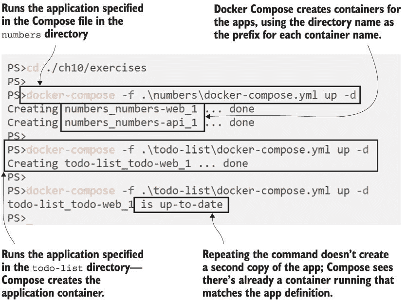

图 10.1 重复执行 Docker Compose 命令以启动应用不会运行应用的第二个副本。

Docker Compose 使用项目概念来识别各种资源是同一应用的一部分，并且它使用包含 Compose 文件的目录名称作为默认项目名称。当创建资源时，Compose 会在项目名称前加前缀，对于容器，它还会添加一个数字计数器作为后缀。所以如果你的 Compose 文件在一个名为`app1`的文件夹中，并且定义了一个名为`web`的服务和一个名为`disk`的卷，Compose 将通过创建一个名为`app1_disk`的卷和一个名为`app1_web_1`的容器来部署它。容器名称末尾的计数器支持扩展，所以如果你将 web 服务的实例扩展到两个，新的容器将被命名为`app1_web_2`。图 10.2 显示了待办事项应用容器名称的构建方式。

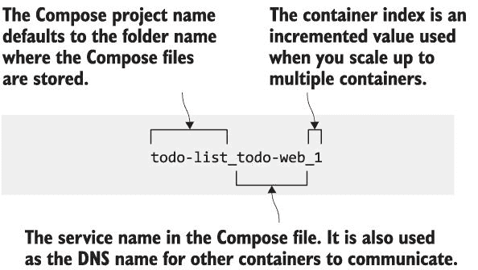

图 10.2 Docker Compose 通过包含项目名称为它管理的资源构建名称。

你可以覆盖 Docker Compose 使用的默认项目名称，这就是你如何在单个 Docker Engine 上以不同的容器集运行同一应用多个副本的方法。

现在尝试一下 你已经有一个待办事项应用的实例正在运行；你可以通过指定不同的项目名称来启动另一个。网站使用随机端口，所以如果你想实际尝试这些应用，你需要找到分配的端口：

` docker-compose -f ./todo-list/docker-compose.yml -p todo-test up -d`  ` docker container ls`  ` docker container port todo-test_todo-web_1 80`

我的输出在图 10.3 中。指定项目名称意味着在 Compose 看来这是一个不同的应用，没有资源与这个项目名称匹配，所以 Compose 创建了一个新的容器。命名模式是可预测的，所以我知道新的容器将被命名为`todo-test_todo-web_1`。Docker CLI 有`container` `port`命令来查找容器的已发布端口，我可以使用生成的容器名称来查找应用端口。

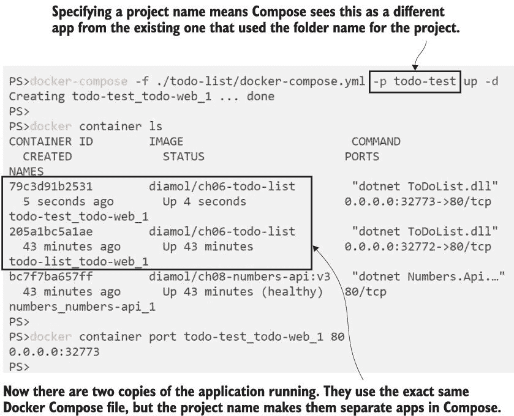

图 10.3 指定项目名称允许你使用一个 Compose 文件运行同一应用的多个副本。

这种方法允许你运行许多不同应用程序的多个副本。我也可以使用相同的 Compose 文件部署我的随机数应用程序的另一个实例，只需指定不同的项目名称即可。这很有用，但对于大多数情况，你可能需要更多的控制——对于运维或测试团队来说，找出每个版本要使用的随机端口并不是一个很好的工作流程。为了支持不同环境中的不同设置，你可以创建重复的 Compose 文件并编辑需要更改的属性，但 Compose 提供了一种更好的方法来管理覆盖。

## 10.2 使用 Docker Compose 覆盖文件

团队面临在 Docker Compose 中尝试运行不同的应用程序配置的问题，通常最终会有许多 Compose 文件——每个环境一个。这可以工作，但不可维护，因为这些 Compose 文件通常是 90% 的重复内容，这意味着它们会失去同步，你又会回到漂移状态。覆盖文件是一种更整洁的方法。Docker Compose 允许你合并多个文件，其中较后文件中的属性会覆盖合并中较早的属性。

图 10.4 展示了如何使用覆盖来构建一组易于维护的 Compose 文件。你从一个包含应用基本结构的核心 `docker-compose.yml` 文件开始，其中定义并配置了适用于所有环境的通用服务属性。然后每个环境都有自己的覆盖文件，它添加了特定的设置，但不会复制核心文件中的任何配置。

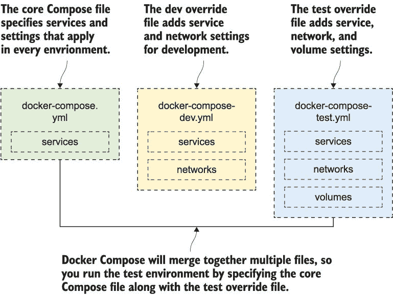

图 10.4 使用添加环境特定设置的覆盖文件消除重复

这种方法是可维护的。如果你需要做出适用于所有环境的更改——比如更改镜像标签以使用最新版本——你只需在核心文件中做一次更改，它就会过滤到每个环境。如果你只需要更改一个环境，你只需更改那个单一文件。每个环境拥有的覆盖文件也充当了环境之间差异的清晰文档。

列表 10.1 展示了一个非常简单的示例，其中核心 Compose 文件指定了大多数应用程序属性，而覆盖则更改了镜像标签，因此这次部署将使用待办事项应用程序的 v2 版本。

列表 10.1 一个更新单个属性的 Docker Compose 覆盖文件

` # 来自 docker-compose.yml - 核心应用程序规范:` ` services:` `   todo-web:` `       image: diamol/ch06-todo-list` `       ports:` `           - 80` `       environment:` `           - Database:Provider=Sqlite` `       networks:` `           - app-net`  ` # 来自 docker-compose-v2.yml - 版本覆盖文件:` ` services:` `   todo-web:` `         image: diamol/ch06-todo-list:v2`

在覆盖文件中，你只需指定你关心的属性，但需要保留主 Compose 文件的结构，以便 Docker Compose 可以将定义链接在一起。本例中的覆盖文件仅更改`image`属性的值，但需要在`services`块下的`todo-web`块中指定，以便 Compose 可以将其与核心文件中的完整服务定义相匹配。

当你在`docker-compose`命令中指定多个文件路径时，Docker Compose 会合并文件。`config`命令在这里非常有用--它验证输入文件的内容，如果输入有效，则输出最终结果。你可以使用它来查看应用覆盖文件时会发生什么。

现在试试看 在本章的练习文件夹中，使用 Docker Compose 合并列表 10.1 中的文件并打印输出：

`docker-compose -f ./todo-list/docker-compose.yml -f ./todo-list/docker-compose-v2.yml config`

`config` 命令实际上并不部署应用程序；它只是验证配置。你会在输出中看到两个文件已经被合并。所有属性都来自核心 Docker Compose 文件，除了`image`标签，其值已被第二个文件覆盖--你可以在图 10.5 中看到这一点。

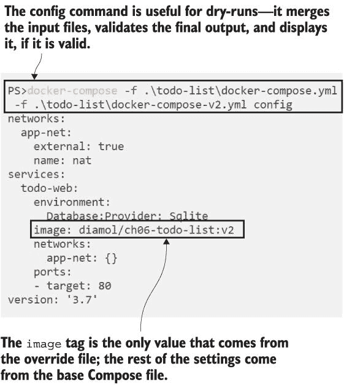

图 10.5 合并 Compose 文件与覆盖文件并显示输出

Docker Compose 按照命令中文件列表的顺序应用覆盖，右侧的文件覆盖左侧的文件。这很重要，因为如果你顺序错误，你会得到意外的结果--`config`命令在这里很有用，因为它显示了完整的 Compose 文件的预览。输出按字母顺序排序，所以你会看到网络、然后是服务、然后是 Compose 版本号，一开始可能会感到不安，但很有用。你可以将此命令作为部署过程的一部分进行自动化，并将合并后的文件提交到源代码控制中--这样按字母顺序比较版本就变得容易了。

使用覆盖来更改图像标签只是一个快速示例。在`numbers`文件夹中有一个更现实的随机数应用程序的 Compose 文件集：

+   `docker-compose.yml` -- 核心应用程序定义。它指定了 Web 和 API 服务，但没有指定任何端口或网络定义。

+   `docker-compose-dev.yml` -- 用于在开发中运行应用程序。它指定了一个 Docker 网络，并为服务添加了发布端口，并禁用了健康和依赖性检查。这样开发者可以快速启动和运行。

+   `docker-compose-test.yml` -- 用于在测试环境中运行。它指定了一个网络，添加了健康检查参数，并为 Web 应用程序发布了一个端口，但通过不发布任何端口，保持了 API 服务的内部性。

+   `docker-compose-uat.yml` -- 用于用户验收测试环境。它指定了一个网络，发布标准端口 80 用于网站，设置服务始终重启，并指定更严格的健康检查参数。

列表 10.2 显示了开发覆盖文件的内容——很明显，它不是一个完整的应用程序规范，因为没有指定镜像。这里的值将被合并到核心 Compose 文件中，如果核心文件中有匹配的键，则会添加新的属性或覆盖现有的属性。

列表 10.2 一个覆盖文件仅指定了与主 Compose 文件的不同之处

` services:` `   numbers-api:` `       ports:` `           - "8087:80"` `       healthcheck:` `           disable: true`  `   numbers-web:` `       entrypoint:` `           - dotnet` `           - Numbers.Web.dll` `       ports:` `           - "8088:80"`  ` networks:` `   app-net:` `         name: numbers-dev`

其他覆盖文件遵循相同的模式。每个环境使用不同的端口来运行 Web 应用和 API，因此可以在单个机器上运行所有这些应用。

现在尝试一下：首先删除所有现有的容器，然后在多个环境中运行随机数应用。每个环境需要一个项目名称和正确的 Compose 文件集：

` # 删除任何现有容器` ` docker container rm -f $(docker container ls -aq)`  ` # 在开发配置下运行应用：` ` docker-compose -f ./numbers/docker-compose.yml -f ./numbers/docker-compose-dev.yml -p numbers-dev up -d`  ` # 以及测试设置：` ` docker-compose -f ./numbers/docker-compose.yml -f ./numbers/docker-compose-test.yml -p numbers-test up -d`  ` # 以及 UAT：` ` docker-compose -f ./numbers/docker-compose.yml -f ./numbers/docker-compose-uat.yml -p numbers-uat up -d`

现在，你有三个应用程序副本正在运行，它们彼此之间都是隔离的，因为每个部署都在使用自己的 Docker 网络。在一个组织中，这些应用将运行在一台服务器上，团队可以通过浏览到正确的端口来使用他们想要的任何环境。例如，你可以使用端口 80 进行 UAT，端口 8080 进行系统测试，端口 8088 用于开发团队的集成环境。图 10.6 显示了我的输出，其中包含了创建的网络和容器。

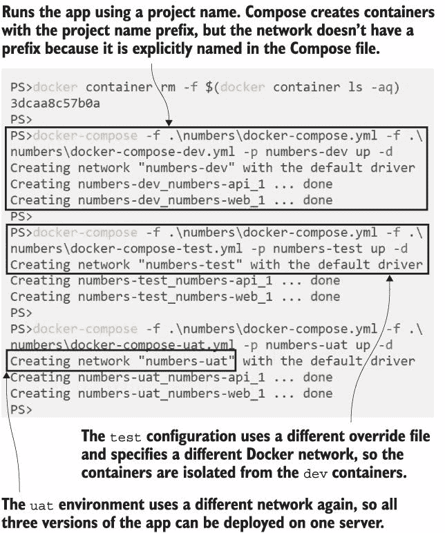

图 10.6 在单个机器上运行多个隔离的应用程序环境

现在你有三个部署，它们作为独立的环境运行：http: */ /* localhost 是 UAT，http: */ /* localhost:8080 是系统测试，而*http://localhost:8088*是开发环境。浏览到任何一个，你都会看到相同的应用，但每个 Web 容器只能看到其网络中的 API 容器。这保持了应用的分离，所以如果你在开发环境中持续获取随机数字，API 将会崩溃，但系统测试和 UAT 环境仍然在运行。每个环境中的容器使用 DNS 名称进行通信，但 Docker 限制了容器网络内的流量。图 10.7 展示了网络隔离如何保持所有环境分离。

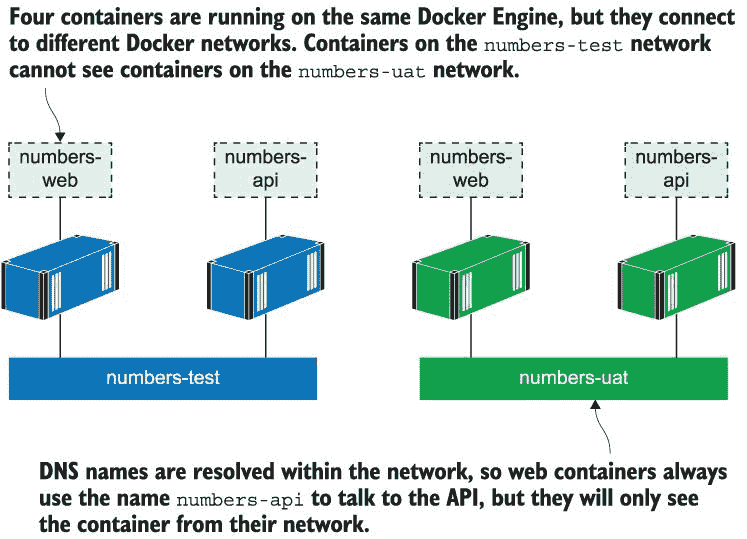

图 10.7 在一个 Docker Engine 上运行多个环境，使用网络进行隔离

现在是时候提醒你了，Docker Compose 是一个客户端工具，你需要访问所有你的 Compose 文件来管理你的应用。你还需要记住你使用的项目名称。如果你想清除测试环境，移除容器和网络，你通常会只运行`docker-compose down`，但这对这些环境不起作用，因为 Compose 需要你在`up`命令中使用的所有相同文件和项目信息来匹配资源。

现在尝试一下 让我们移除那个测试环境。你可以尝试不同的`down`命令变体，但唯一能工作的是具有与原始`up`命令相同文件列表和项目名称的那个：

` # 如果我们使用了默认的 docker-compose.yml 文件，这将有效：` ` docker-compose down`  ` # 如果我们使用了没有项目名称的覆盖文件，这将有效：` ` docker-compose -f ./numbers/docker-compose.yml -f ./numbers/docker-compose-test.yml down`  ` # 但我们指定了项目名称，所以我们也需要包含它：` ` docker-compose -f ./numbers/docker-compose.yml -f ./numbers/docker-compose-test.yml -p numbers-test down`

你可以在图 10.8 中看到我的输出。你可能已经猜到，除非你提供匹配的文件和项目名称，否则 Compose 无法识别应用的运行资源，所以在第一个命令中它不会删除任何内容。在第二个命令中，Compose 确实尝试删除连接到该网络的容器网络。

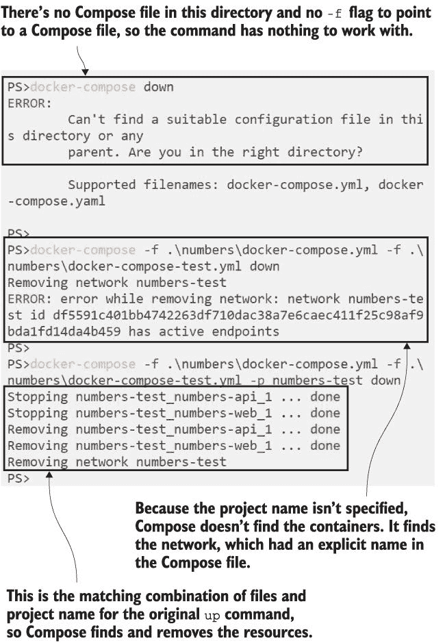

图 10.8 你需要使用相同的文件和项目名称来使用 Compose 管理应用。

那些错误发生是因为在 Compose 覆盖文件中明确命名了网络。我在第二个 `down` 命令中没有指定项目名称，所以它使用了默认值，即文件夹名称 `numbers`。Compose 寻找名为 `numbers_numbers-web_1` 和 `numbers_numbers-api_1` 的容器，但找不到它们，因为它们实际上是使用项目前缀 `numbers-test` 创建的。Compose 认为那些容器已经不存在了，它只需要清理网络，而它确实找到了，因为 Compose 文件中的显式网络名称没有使用项目前缀。Compose 尝试删除那个网络，但幸运的是，Docker 不允许你删除仍有容器附加的网络。

这是一种长篇大论的方式来告诉你，你需要小心使用 Docker Compose。它是一个非生产环境中的优秀工具，通过在单台机器上部署成百上千的应用程序，使你从计算资源中获得最大价值。覆盖文件让你可以重用应用程序定义并识别不同环境之间的差异，但你需要注意管理开销。你应该考虑为你的部署和拆卸编写脚本和自动化。

## 10.3 使用环境变量和密钥注入配置

你可以使用 Docker 网络隔离应用程序，并使用 Compose 覆盖来捕捉环境之间的差异，但你还需要在不同环境之间更改应用程序配置。大多数应用程序可以从环境变量或文件中读取配置设置，而 Compose 对这两种方法都有良好的支持。

我将在本节中涵盖所有选项，所以我们将比之前更深入地研究 Compose。这将帮助你了解你可以选择的配置设置应用选项，你将能够选择适合你的选项。

这些练习又回到了待办事项应用。该应用的 Docker 镜像被构建为读取环境变量和配置设置所需的文件。有三个项目需要在不同环境之间进行变化：

+   记录--日志详细程度应该有多详细。这将在开发环境中非常详细，在测试和生产环境中则不那么详细。

+   数据库提供者--是否在应用程序容器内部使用简单的数据文件，或者使用单独的数据库（该数据库可能或可能不在容器中运行）。

+   数据库连接字符串--如果应用程序不使用本地数据文件，连接到数据库的详细信息。

我使用覆盖文件为不同的环境注入配置，并且为每个项目使用不同的方法，这样我可以向你展示 Docker Compose 提供的选项。列表 10.3 展示了核心的 Compose 文件；这只是一个设置了作为密钥的配置文件的 Web 应用程序的基本信息。

列表 10.3 Compose 文件指定了带有密钥的 Web 服务

`services:` `   todo-web:` `       image: diamol/ch06-todo-list` `       secrets:` `           - source: todo-db-connection` `                 target: /app/config/secrets.json`

密钥是一种有用的注入配置的方式——它们在 Docker Compose、Docker Swarm 和 Kubernetes 中都有支持。在 Compose 文件中，你指定密钥的源和目标。源是从容器运行时加载密钥的地方，而目标是密钥在容器内部暴露的文件路径。

此密钥指定为来自源 `todo-db-connection`，这意味着在 Compose 文件中需要定义具有该名称的密钥。密钥的内容将被加载到目标路径 `/app/config/secrets.json`，这是应用程序搜索配置设置的位置之一。

上述 Compose 文件本身是无效的，因为没有密钥部分，而 `todo-db-connection` 密钥在服务定义中是必需的。列表 10.4 展示了开发覆盖文件，它为服务设置了一些更多的配置并指定了密钥。

列表 10.4 开发覆盖文件添加了配置设置和密钥设置

` services:` `   todo-web:` `       ports:` `           - 8089:80` `       environment:` `           - Database:Provider=Sqlite` `       env_file:` `           - ./config/logging.debug.env`  ` secrets:` `   todo-db-connection:` `         file: ./config/empty.json`

在此覆盖文件中有三个属性，用于注入应用程序配置并改变容器中应用程序的行为。你可以使用它们的任何组合，但每种方法都有其优点：

+   `environment` 在容器内添加一个环境变量。此设置配置应用程序使用 SQLite 数据库，这是一个简单的数据文件。这是设置配置值的最简单方式，从 Compose 文件中可以清楚地看到正在配置的内容。

+   `env_file` 包含一个文本文件的路径，文本文件的内容将被加载到容器中作为环境变量。文本文件中的每一行都被读取为一个环境变量，名称和值由等号分隔。此文件的内容设置了日志配置。使用环境变量文件是共享多个组件设置的一种简单方式，因为每个组件都引用该文件而不是复制环境变量列表。

+   `secrets` 是 Compose YAML 文件中的顶级资源，类似于 `services` 和 `networks`。它包含 `todo-db-connection` 的实际源，这是一个本地文件系统上的文件。在这种情况下，应用程序没有单独的数据库要连接，因此它使用一个空的 JSON 文件作为密钥。应用程序将读取该文件，但没有配置设置要应用。

现在试试看。你可以使用 Compose 文件和 `todo-list-configured` 目录中的覆盖配置来以开发配置运行应用。使用 curl 向 Web 应用发送请求并检查容器是否正在记录大量详细信息：

` # 移除现有容器:` ` docker container rm -f $(docker container ls -aq)` ` # 使用配置覆盖启动应用 - 对于 Linux 容器:` ` docker-compose -f ./todo-list-configured/docker-compose.yml -f ./todo-list-configured/docker-compose-dev.yml -p todo-dev up -d` ` # 或者对于 Windows 容器，使用不同的文件路径存储密钥:` ` docker-compose -f ./todo-list-configured/docker-compose.yml -f ./todo-list-configured/docker-compose-dev.yml -f ./todo-list-configured/docker-compose-dev-windows.yml -p todo-dev up -d` ` # 向应用发送一些流量:` ` curl http://localhost:8089/list` ` # 检查日志:` ` docker container logs --tail 4 todo-dev_todo-web_1`

你可以在图 10.9 中看到我的输出。Docker Compose 总是为每个应用程序使用一个网络，因此它会创建一个默认网络并将容器连接到它，即使 Compose 文件中没有指定网络。在我的情况下，最新的日志行显示了应用程序使用的 SQL 数据库命令。你的输出可能不同，但如果你检查整个日志，你应该会看到 SQL 语句。这表明增强了日志配置。

开发者部署使用环境变量和密钥进行应用配置--在 Compose 文件和配置文件中指定的值被加载到容器中。

此外，还有一个使用另一种由 Compose 支持的方法的测试部署：使用主机机器上的环境变量为容器提供值。这使得部署更加便携，因为你可以更改环境而无需更改 Compose 文件本身。如果你想在配置不同的服务器上启动第二个测试环境，这将非常有用。列表 10.5 展示了 `todo-web` 服务的规范。

列表 10.5 在 Compose 文件中使用环境变量作为值

`   todo-web:` `       ports:` `           - "${TODO_WEB_PORT}:80"` `       environment:` `           - Database:Provider=Postgres` `       env_file:` `           - ./config/logging.information.env` `       networks:` `             - app-net`

端口的美元和花括号设置会被替换为具有该名称的环境变量。所以如果我在运行 Docker Compose 的机器上设置了一个名为 `TODO_WEB_PORT` 的变量，其值为 `8877`，那么 Compose 会注入这个值，端口规范实际上变为 `"8877:80"`。这个服务规范在文件 `docker-compose-test.yml` 中，该文件还包括一个数据库服务和一个用于连接数据库容器的密钥。

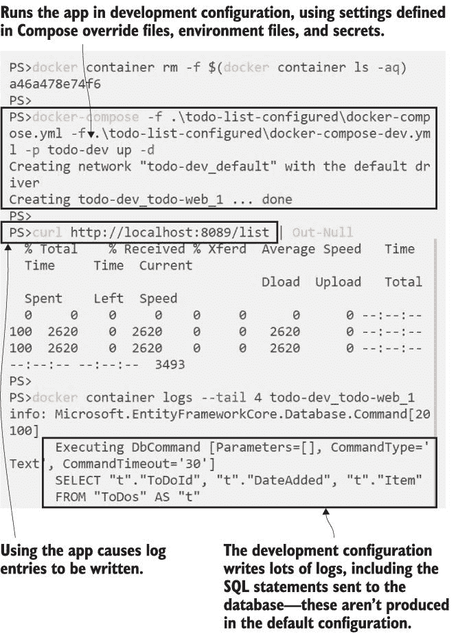

图 10.9 通过在 Docker Compose 中应用配置设置来更改应用程序行为

你可以通过与开发环境相同的方式指定 Compose 文件和项目名称来运行测试环境，但 Compose 有一个使事情更简单的最终配置功能。如果 Compose 在当前文件夹中找到一个名为`.env`的文件，它将将其视为环境文件，并在运行命令之前读取其内容作为一组环境变量，填充它们。

现在尝试一下 导航到配置好的待办事项应用程序的目录，并运行它，无需向 Docker Compose 指定任何参数：

` cd ./todo-list-configured`  ` # 或者对于 Windows 容器 - 使用不同的文件路径：` ` cd ./todo-list-configured-windows`  ` docker-compose up -d`

图 10.10 显示，Compose 已创建了 Web 和数据库容器，尽管核心 Compose 文件没有指定数据库服务。它还使用了项目名称`todo_ch10`，尽管我没有指定名称。`.env`文件设置 Compose 配置以默认运行测试环境，无需你指定测试覆盖文件。

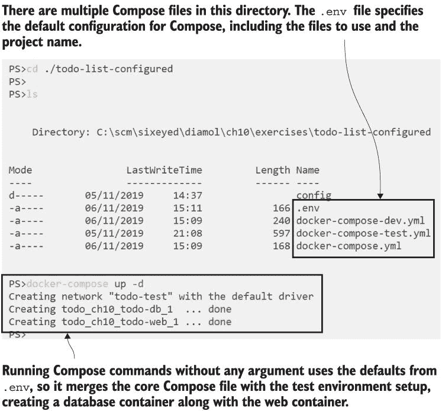

图 10.10 使用环境文件指定 Docker Compose 文件和项目名称的默认值

在这里，你可以使用一个简单的命令而不指定文件名，因为`.env`文件包含了一组环境变量，这些变量可以用来配置 Docker Compose。第一次使用是用于容器配置设置，例如 Web 应用的端口；第二次是用于 Compose 命令本身，列出要使用的文件和项目名称。列表 10.6 显示了完整的`.env`文件。

列表 10.6 使用环境文件配置容器和 Compose

` # 容器配置 - 发布的端口：` ` TODO_WEB_PORT=8877` ` TODO_DB_PORT=5432`  ` # Compose 配置 - 文件和项目名称：` ` COMPOSE_PATH_SEPARATOR=;` ` COMPOSE_FILE=docker-compose.yml;docker-compose-test.yml` ` COMPOSE_PROJECT_NAME=todo_ch10`

环境文件捕获了测试配置中应用程序的默认 Compose 设置--你可以轻松地修改它，以便开发配置成为默认设置。将环境文件与你的 Compose 文件一起保存有助于记录哪些文件集代表哪个环境，但请注意，Docker Compose 只寻找名为`.env`的文件。你不能指定文件名，因此你不能轻松地在多个环境文件之间切换。

探索 Docker Compose 的配置选项花了一些时间。在你的 Docker 使用过程中，你将处理很多 Compose 文件，所以你需要熟悉所有选项。我将在这里总结它们，但其中一些比其他更有用：

+   使用 `environment` 属性来指定环境变量是最简单的选项，它使得从 Compose 文件中读取应用程序配置变得容易。然而，这些设置是纯文本，因此你不应该将它们用于敏感数据，如连接字符串或 API 密钥。

+   使用具有 `secret` 属性的配置文件进行加载是最灵活的选项，因为它被所有容器运行时支持，并且可以用于敏感数据。当使用 Compose 时，秘密的来源可以是本地文件，也可以是存储在 Docker Swarm 或 Kubernetes 集群中的加密秘密。无论来源如何，秘密的内容都会被加载到应用程序容器的文件中。

+   当服务之间有很多共享设置时，使用 `environment_file` 属性将设置存储在文件中并将它们加载到容器中非常有用。Compose 会本地读取该文件，并将单个值设置为环境属性，因此当你连接到远程 Docker Engine 时，可以使用本地环境文件。

+   Compose 环境文件 `.env` 对于捕获你想要作为默认部署目标的任何环境的设置非常有用。

## 10.4 使用扩展字段减少重复

到目前为止，你可能认为 Docker Compose 已经有足够的配置选项来满足任何情况。但实际上，它是一个非常简单的规范，并且在使用过程中你会遇到一些限制。其中最常见的问题之一是如何在服务共享大量相同设置时减少 Compose 文件的冗余。在本节中，我将介绍 Docker Compose 的一个最终特性，它可以解决这个问题——使用扩展字段在单个位置定义 YAML 块，你可以在整个 Compose 文件中重用这些块。扩展字段是 Compose 中一个强大但使用较少的功能。它们消除了许多重复和潜在的错误，一旦你习惯了 YAML 合并语法，它们的使用就非常直接。

在本章练习的 `image-gallery` 文件夹中，有一个 `docker-compose-prod.yml` 文件，它使用了扩展字段。列表 10.7 展示了如何定义扩展字段，将它们声明在任何顶级块（服务、网络等）之外，并使用带符号的命名法给它们命名。

列表 10.7 在 Docker Compose 文件顶部定义扩展字段

` x-labels: &logging` `   logging:` `       options:` `           max-size: '100m'` `           max-file: '10'`  ` x-labels: &labels` `     app-name: image-gallery`

扩展字段是自定义定义；在这个文件中，有两个被称为 `logging` 和 `labels`。按照惯例，你需要在块名称前加上一个“x”，因此 `x-labels` 块定义了一个名为 `labels` 的扩展。日志扩展指定了容器日志的设置，并且可以在服务定义中使用。标签扩展指定了一个键/值对，该键/值对可以在服务定义中现有的 `labels` 字段中使用。

你应该注意这些定义之间的区别——日志字段包括日志属性，这意味着它可以直接在服务中使用。标签字段不包括标签属性，因此需要在现有的标签集中使用。列表 10.8 清楚地说明了这一点，其中包含了一个使用这两个扩展的服务定义。

列表 10.8 在服务定义中使用 YAML 合并扩展

` services:` `   iotd:` `       ports:` `           - 8080:80` `       <<: *logging` `       labels:` `           <<: *labels` `             public: api`

扩展字段与 YAML 合并语法 `<<:` 一起使用，后跟字段名称，该名称以星号开头。因此 `<<:` `*logging` 将合并 YAML 文件该点的 `logging` 扩展字段的值。当 Compose 处理此文件时，它将添加来自日志扩展的日志部分到服务中，并且它将在现有的标签部分中添加一个额外的标签，合并来自 `labels` 扩展字段的值。

现在尝试一下 我们不需要运行此应用程序来查看 Compose 如何处理文件。只需运行 `config` 命令即可。这将验证所有输入并打印出最终的 Compose 文件，其中扩展字段已合并到服务定义中：

` # 浏览到 ch10/exercises 下的 image-gallery 文件夹：` ` cd ../image-gallery`  ` # 检查生产覆盖的配置：` ` docker-compose -f ./docker-compose.yml -f ./docker-compose-prod.yml config`

我的输出在图 10.11 中——我没有显示完整的输出，只是足够的服务定义来显示扩展字段是如何合并的。

图 10.11 使用 `config` 命令处理具有扩展字段的文件并检查结果

扩展字段是确保 Compose 文件中最佳实践的有用方式——使用相同的日志设置和容器标签是设置所有服务标准的好例子。这不是你会在每个应用程序中都使用的东西，但当你准备复制和粘贴大块 YAML 时，拥有它是很好的。现在你有一个更好的方法。尽管如此，有一个大限制：扩展字段不适用于多个 Compose 文件，因此你无法在核心 Compose 文件中定义一个扩展并在覆盖中使用它。这是 YAML 而不是 Compose 的限制，但这是你应该注意的事情。

## 10.5 理解 Docker 的配置工作流程

将整个部署配置捕获在源控制中存在的一系列工件集中是非常有价值的。它允许您通过获取该版本的源代码并运行部署脚本来部署应用程序的任何版本。它还允许开发人员通过在本地运行生产堆栈并再现他们自己环境中的错误来快速修复问题。

环境之间总是存在差异，Docker Compose 允许您在仍然提供存在于源控制中的部署工件集的同时，捕获环境之间的差异。在本章中，我们探讨了使用 Docker Compose 定义不同的环境，并重点关注了三个关键领域：

+   应用程序组合 -- 并非每个环境都会运行整个堆栈。例如，监控仪表板可能不会被开发人员使用，或者应用程序可能在测试环境中使用容器化数据库，但在生产环境中连接到云数据库。覆盖文件允许您整洁地完成这项工作，共享通用服务并在每个环境中添加特定的服务。

+   容器配置 -- 属性需要更改以匹配环境和功能的要求。发布的端口需要是唯一的，以免与其他容器冲突，并且卷路径可能在测试环境中使用本地驱动器，但在生产环境中使用共享存储。覆盖功能可以实现这一点，以及为每个应用程序提供隔离的 Docker 网络，允许您在单个服务器上运行多个环境。

+   应用程序配置 -- 容器内应用程序的行为将在不同环境之间发生变化。这可能会改变应用程序所做的日志记录量，或它用于存储本地数据的缓存大小，或者整个功能可能会被打开或关闭。您可以使用 Compose 通过任何组合的覆盖文件、环境文件和密钥来实现这一点。

图 10.12 显示了我们在第 10.3 节中运行的待办事项列表应用程序。开发和测试环境完全不同：在 dev 中，应用程序配置为使用本地数据库文件，而在测试中，Compose 还运行了一个数据库容器，应用程序配置为使用该容器。但每个环境都使用隔离的网络和唯一的端口，因此它们可以在同一台机器上运行，这对于开发人员需要启动本地测试环境并查看其与开发版本的比较来说非常完美。

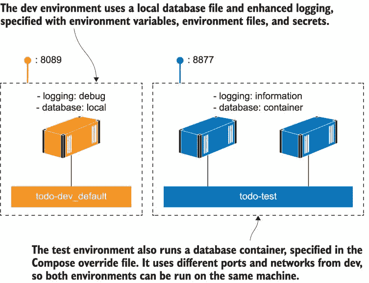

图 10.12 使用 Docker Compose 为同一应用程序定义非常不同的环境

从这个实验中最重要的收获是配置工作流程在每一个环境中都使用相同的 Docker 镜像。构建过程将生成通过所有自动化测试的容器镜像的标记版本。这是一个发布候选版本，您将使用 Compose 文件中的配置将其部署到烟雾测试环境。当它通过烟雾测试后，它将进入下一个环境，该环境使用相同的镜像集并应用来自 Compose 的新配置。最终，如果所有测试都通过，您将发布该版本，并将相同的容器镜像部署到生产环境中，使用您的 Docker Swarm 或 Kubernetes 部署清单。发布的软件正是通过所有测试的相同软件，但现在它具有来自容器平台的生产行为。

## 10.6 实验室

在这个实验室中，我希望您为待办事项应用程序构建自己的环境定义集。您将组合一个开发环境和测试环境，并确保它们都可以在同一台机器上运行。

开发环境应该是默认的，您可以使用 `docker-compose` `up` 来运行它。设置应该是

+   使用本地数据库文件

+   发布到端口 `8089`

+   运行待办事项应用程序的 v2 版本

测试环境需要使用特定的 Docker Compose 文件和项目名称来运行。其设置应该是

+   使用独立的数据库容器

+   使用卷来存储数据库

+   发布到端口 `8080`

+   使用最新的待办事项应用程序镜像

在这里与本章`todo-list-configured`练习中的 Compose 文件有相似之处。主要区别在于容量——数据库容器使用名为 `PGDATA` 的环境变量来设置数据文件应该写入的位置。您可以在您的 Compose 文件中使用该变量以及卷规格。

正如您在本章中看到的，您有多种方法可以解决这个问题。我的解决方案在 GitHub 上：*[`github.com/sixeyed/diamol/blob/master/ch10/lab/README.md`](https://github.com/sixeyed/diamol/blob/master/ch10/lab/README.md)*。
