# 11 使用 Docker 和 Docker Compose 构建和测试应用程序

自动化是 Docker 的核心。你通过 Dockerfile 描述将组件打包的步骤，并使用 Docker 命令行来执行这些步骤；你通过 Docker Compose 文件描述你的应用程序架构，并使用 Compose 命令行来启动和停止应用程序。命令行工具非常适合与自动化流程配合，比如每天定时运行或开发者推送代码更改时运行的作业。无论你使用哪种工具来运行这些作业，它们都允许你运行脚本命令，这样你就可以轻松地将 Docker 工作流程与自动化服务器集成。

在本章中，你将学习如何使用 Docker 进行持续集成（CI）。CI 是一个定期运行的自动化过程，用于构建应用程序并执行一系列测试。当 CI 作业健康时，这意味着应用程序的最新代码是好的，已经被打包，并作为发布候选准备部署。设置和管理 CI 服务器和作业曾经是耗时且密集的工作——“构建经理”在大型项目中是一个全职角色。Docker 简化了 CI 过程的每个部分，并让人们有更多时间从事更有趣的工作。

## 11.1 Docker 中 CI 过程的工作原理

CI 过程是一个从代码开始，执行一系列步骤，并以经过测试的可部署工件结束的管道。CI 的一个挑战是，每个项目的管道都是独特的——不同的技术堆栈在步骤中执行不同的操作并产生不同类型的工件。CI 服务器需要适用于所有这些独特的管道，因此服务器上可以安装所有编程语言和构建框架的组合，这可能会变得难以管理。

Docker 为 CI 过程带来了一致性，因为每个项目都遵循相同的步骤并产生相同类型的工件。图 11.1 展示了使用 Docker 的典型管道——它由代码更改或定时计划触发，并生成一系列 Docker 镜像。这些镜像包含最新版本的代码——编译、测试、打包，并推送到注册表以进行分发。

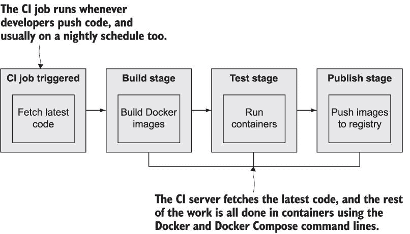

图 11.1 使用 Docker 构建、测试和发布应用程序的基本 CI 管道步骤。

CI 管道中的每一步都使用 Docker 或 Docker Compose 运行，所有工作都在容器内完成。你使用容器来编译应用程序，因此 CI 服务器不需要安装任何编程语言或构建 SDK。自动单元测试作为镜像构建的一部分运行，所以如果代码有误，构建将失败，CI 作业将停止。你还可以通过启动整个应用程序（使用 Docker Compose）以及一个运行测试的独立容器来运行更复杂的端到端测试，该容器模拟用户工作流程。

在 Docker 化的 CI 流程中，所有艰苦的工作都在容器中完成，但你仍然需要一些基础设施组件来将一切整合在一起：一个集中的源代码系统、一个用于存储镜像的 Docker 注册库，以及一个自动化服务器来运行 CI 作业。你可以从众多支持 Docker 的托管服务中选择，这些服务都可以混合搭配——你可以将 GitHub 与 Azure DevOps 和 Docker Hub 结合使用，或者你可以使用 GitLab，它提供了一站式解决方案。或者你也可以在 Docker 容器中运行自己的 CI 基础设施。

## 11.2 使用 Docker 启动构建基础设施

当你可以免费获得可靠的托管服务时，没有人愿意运行自己的基础设施组件，但了解在 Docker 中运行构建系统是一个非常实用的替代方案。如果你希望将源代码和打包的镜像完全保留在自己的网络内——为了数据主权或传输速度——这是理想的。即使你使用服务处理所有事情，当 GitHub 或 Docker Hub 出现故障，或者你的互联网连接断开时，拥有一个简单的备份选项也是极好的。

你需要的三个组件可以很容易地在容器中使用企业级开源软件运行。你可以使用一条命令运行自己的设置，使用 Gogs 进行源代码控制，开源 Docker 注册库进行分发，以及 Jenkins 作为自动化服务器。

现在尝试一下 在本章的`exercises`文件夹中，有一个定义构建基础设施的 Docker Compose 文件。设置的一部分对于 Linux 和 Windows 容器是不同的，所以你需要选择正确的文件。如果你在 5.3 节中没有这样做，你还需要在你的 hosts 文件中添加一个条目，用于 DNS 名称`registry.local`。

` cd ch11/exercises/infrastructure`  ` # 使用 Linux 容器启动应用:` ` docker-compose -f docker-compose.yml -f docker-compose-linux.yml up -d`  ` # 或者使用 Windows 容器启动:` ` docker-compose -f docker-compose.yml -f docker-compose-windows.yml up -d`  ` # 在 Mac 或 Linux 上向本地 hosts 文件添加注册库域名:` ` echo $'\n127.0.0.1 registry.local' | sudo tee -a /etc/hosts`  ` # 或者 Windows 上:` ` Add-Content -Value "127.0.0.1 registry.local" -Path /windows/system32/drivers/etc/hosts`  ` # 检查容器:` ` docker container ls`

你可以在图 11.2 中看到我的输出。Linux 和 Windows 上的命令不同，但结果相同——你将拥有发布到端口 3000 的 Gogs Git 服务器，发布到端口 8080 的 Jenkins，以及发布到端口 5000 的注册库。

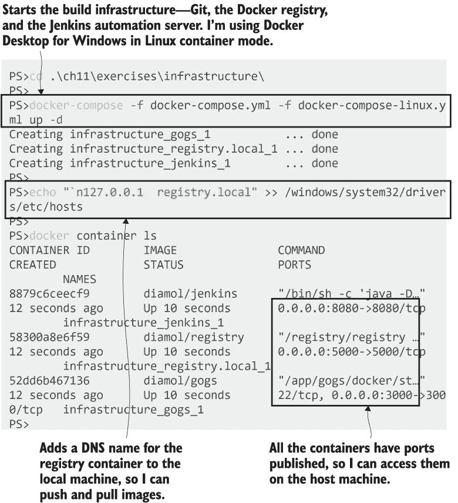

图 11.2 使用一条命令在容器中运行整个构建基础设施

这三个工具很有趣，因为它们支持不同级别的自动化。注册服务器在容器中运行，无需任何额外设置，因此现在您可以使用 `registry.local:5000` 作为您的镜像标签中的域名来推送和拉取镜像。Jenkins 使用插件系统来添加功能，您可以手动设置它，或者您可以在 Dockerfile 中捆绑一组脚本来自动化设置。Gogs 并没有很好的自动化故事，所以尽管它在运行，但仍需要一些手动配置。

现在试试吧 浏览到 http: */ /* localhost:3000，您将看到 Gogs 的 Web UI。第一页是初始安装，如图 11.3 所示。这仅在首次使用新容器时显示。所有值都已正确配置；您只需向下滚动并点击安装 Gogs。

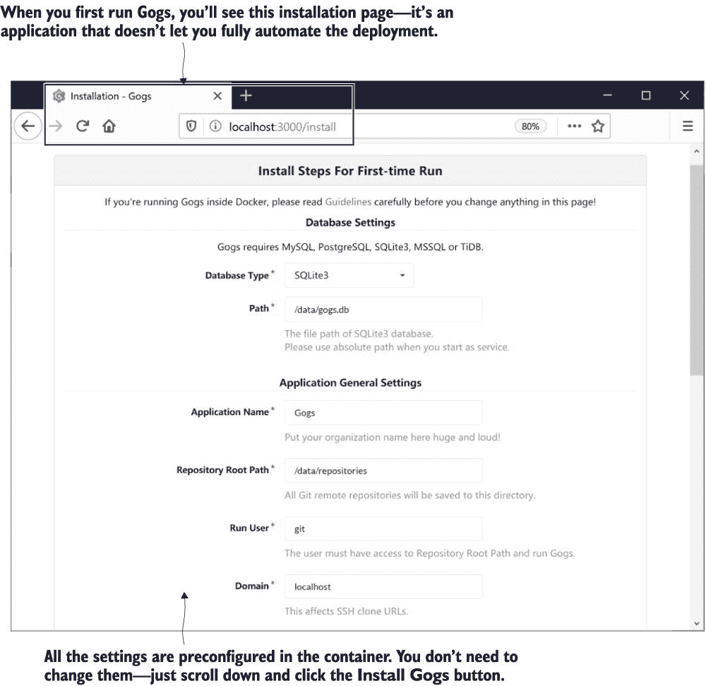

图 11.3 在容器中运行 Gogs。它是一个需要一些手动设置的开源 Git 服务器。

安装非常快速，您将进入登录页面。没有默认账户，因此您需要点击注册来创建一个。创建一个用户名为 `diamol` 的用户，如图 11.4 所示--您可以使用任何电子邮件地址或密码，但 Jenkins CI 作业期望 Gogs 用户名为 `diamol`。

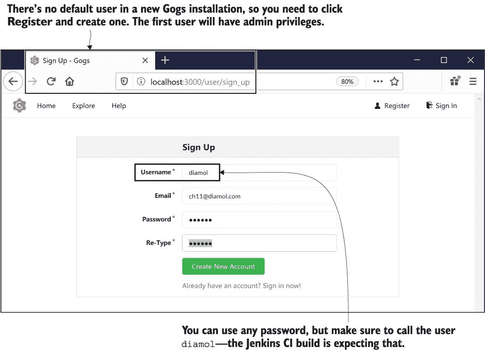

图 11.4 创建一个新用户在 Gogs 中，您可以使用该用户将源代码推送到服务器

点击创建新账户，然后使用 `diamol` 用户名和您的密码登录。最后一步是创建一个仓库--这是我们将会推送触发 CI 作业的代码的地方。浏览到 http:/ /localhost:3000/repo/create 并创建一个名为 `diamol` 的仓库--其他细节可以留空，如图 11.5 所示。

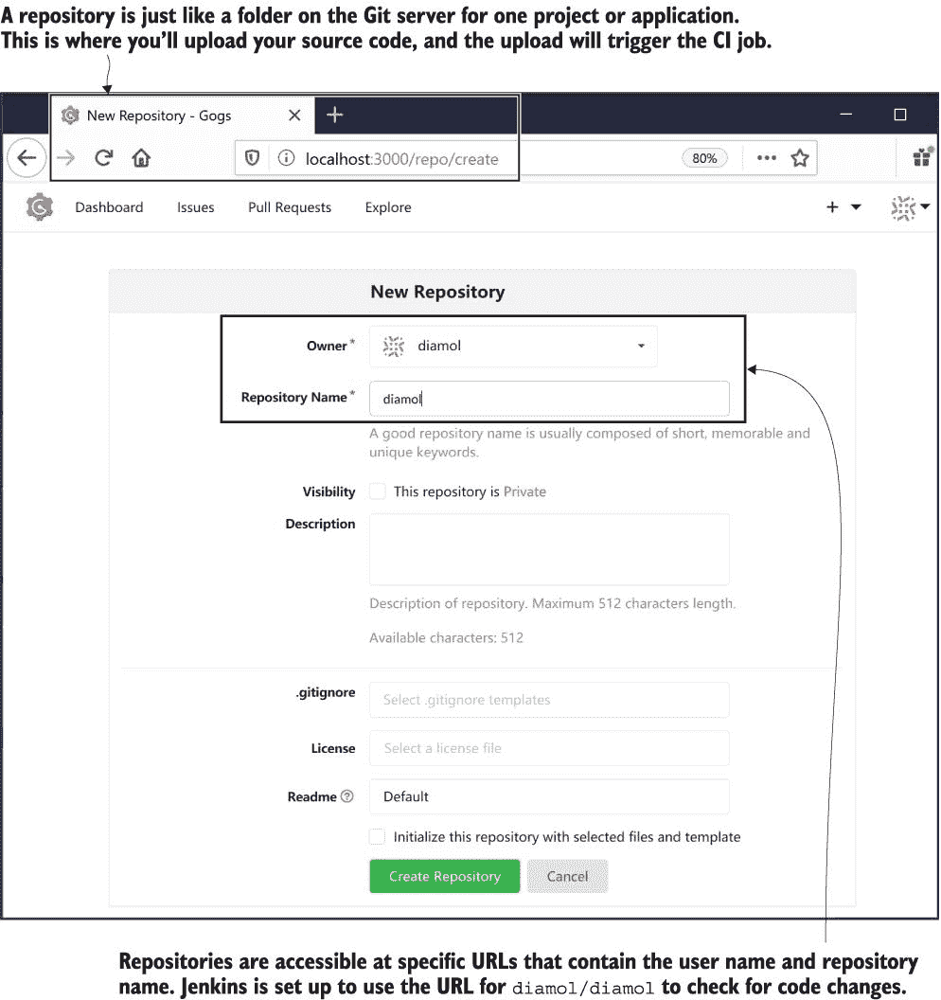

图 11.5 在 Gogs 中创建 Git 仓库，您可以在此处上传您应用的源代码

当您在 Docker 中运行软件时需要手动配置软件，这相当令人沮丧，而且更令人沮丧的是需要将截图复制粘贴到书中，但并非每个应用程序都允许您完全自动化安装。我本可以构建一个包含这些设置步骤的定制镜像，但重要的是让您看到您并不总能将事物优雅地打包到 `docker` `container` `run` 工作流程中。

Jenkins 提供了更好的体验。Jenkins 是一个 Java 应用程序，您可以使用一组在容器启动时运行的脚本将其打包为 Docker 镜像。这些脚本几乎可以完成任何事情--安装插件、注册用户和创建管道作业。这个 Jenkins 容器做了所有这些，因此您可以直接登录并开始使用它。

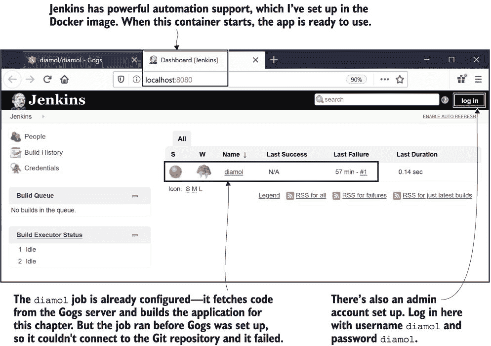

图 11.6 在容器中运行 Jenkins -- 它已经完全配置好，包括用户和 CI 作业已经设置好。

现在试试看。浏览到 http://localhost:8080。你会看到图 11.6 中的屏幕——那里已经有一个名为 `diamol` 的配置好的作业，它处于失败状态。点击右上角的“登录”链接，使用用户名 *diamol* 和密码 *diamol* 登录。

Jenkins 作业失败是因为它被配置为从 Gogs Git 服务器获取代码，但目前还没有代码。这本书的源代码已经是一个 Git 仓库，你最初是从 GitHub 克隆的。你可以将你的本地 Gogs 容器作为另一个 Git 服务器添加到仓库中，并将书籍的代码推送到你自己的基础设施。

现在试试看。你可以使用 `git remote add` 添加一个额外的 Git 服务器，然后推送远程。这会将你本地机器上的代码上传到 Gogs 服务器，而 Gogs 服务器恰好也是你机器上的一个容器：

` git remote add local http://localhost:3000/diamol/diamol.git`  ` git push local`  ` # Gogs 将要求你登录 -` ` # 使用你在 Gogs 中注册的 diamol 用户名和密码`

现在你已经将整本书的源代码放在了你的本地 Git 服务器上。Jenkins 作业被配置为每分钟检查代码的更改，如果有更改，它将触发 CI 管道。第一次作业运行失败是因为代码仓库不存在，所以 Jenkins 已经暂停了计划。你需要手动运行作业以再次启动计划。

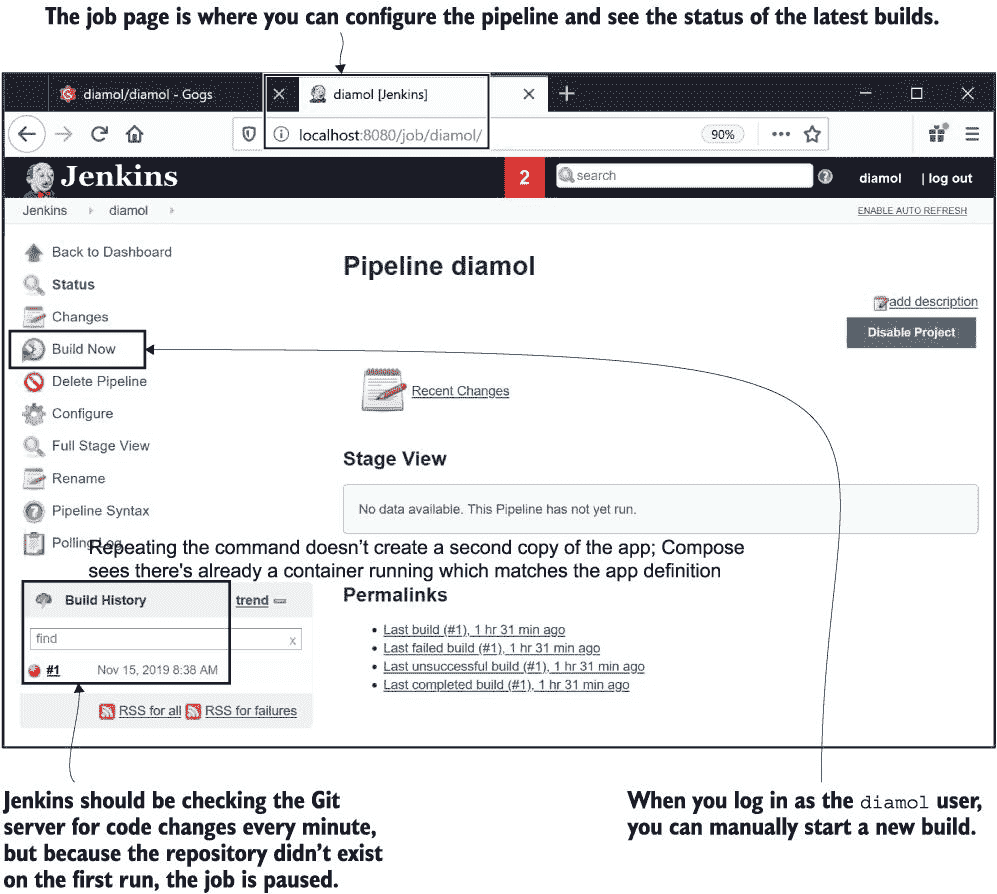

图 11.7 Jenkins 的工作页面显示了作业的当前状态，并允许你手动启动构建。

现在试试看。浏览到 http://localhost:8080/job/diamol。你会看到图 11.7 中的屏幕，你可以在左侧菜单中点击“现在构建”来运行作业。如果你看不到“现在构建”选项，请确保你已经使用 `diamol` 凭据登录到 Jenkins。

大约一分钟后，构建将成功完成，网页将刷新，你将在图 11.8 中看到输出。

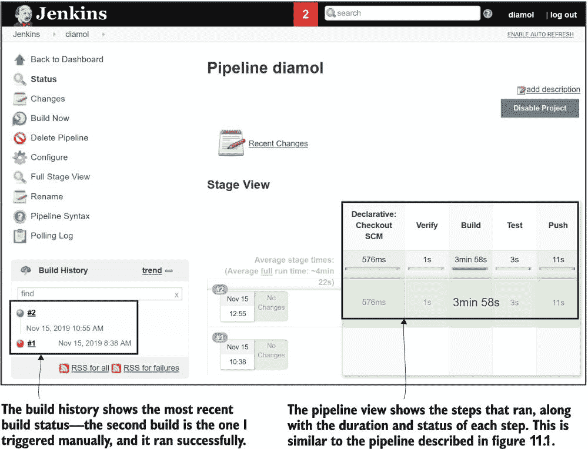

图 11.8 Jenkins 的工作页面显示了最近构建的状态和管道步骤。

这个管道的每一部分都是使用 Docker 容器运行的，利用了一个巧妙的小技巧：在 Docker 中运行的容器可以连接到 Docker API 并在它们运行的同一个 Docker 引擎上启动新的容器。Jenkins 镜像安装了 Docker CLI，而 Compose 文件中的配置设置了 Jenkins，当它运行 Docker 命令时，这些命令会被发送到你机器上的 Docker 引擎。这听起来很奇怪，但实际上只是利用了 Docker CLI 调用 Docker API 的这一事实，因此来自不同地方的 CLI 可以连接到同一个 Docker 引擎。图 11.9 展示了它是如何工作的。

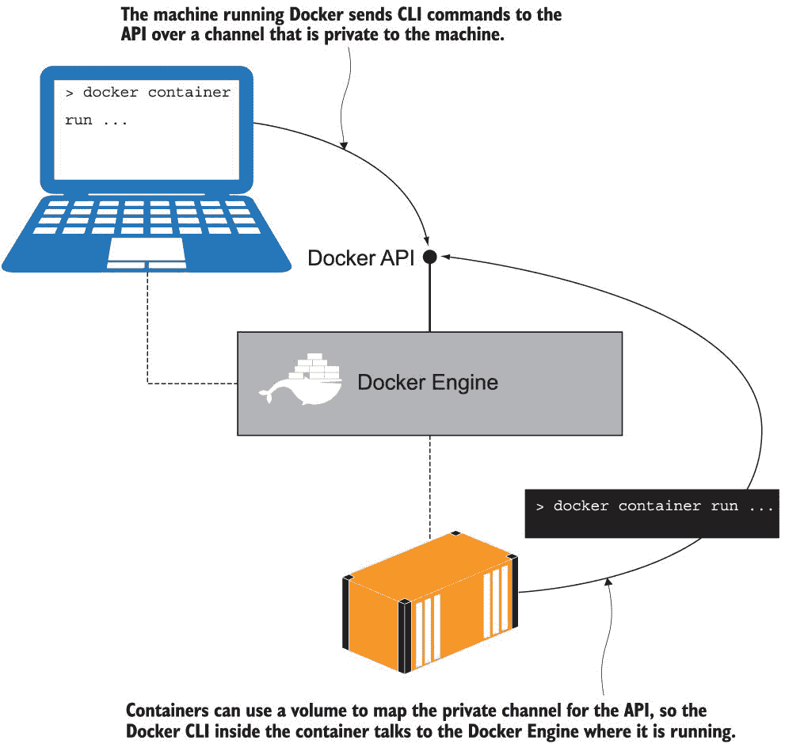

图 11.9 使用卷绑定 Docker API 的私有通道运行容器

Docker CLI 默认通过本地 Docker API 连接，使用一个仅限于您机器的私有通信通道——Linux 上的套接字或 Windows 上的命名管道。这个通信通道可以用作容器的绑定挂载，因此当容器中的 CLI 运行时，它实际上是在连接到您机器上的套接字或命名管道。这解锁了一些有用的场景，其中容器内的应用程序可以查询 Docker 以找到其他容器，或启动和停止新的容器。这里也存在一个安全问题，因为容器中的应用程序可以完全访问主机上的所有 Docker 功能，所以您需要谨慎使用您信任的 Docker 镜像——当然，您可以信任我的 `diamol` 镜像。

列表 11.1 展示了您启动基础设施容器时运行的 Docker Compose 文件的部分内容，重点关注 Jenkins 规范。您可以看到卷绑定到了 Linux 版本的 Docker 套接字和 Windows 版本的命名管道——这是 Docker API 的地址。

列表 11.1 将 Jenkins 中的 Docker CLI 绑定到 Docker 引擎

` # docker-compose.yml` ` services:` `   jenkins:` `       image: diamol/jenkins` `       ports:` `           - "8080:8080"` `       networks:` `           - infrastructure`  ` # docker-compose-linux.yml` ` jenkins:` `   volumes:` `       - type: bind` `           source: /var/run/docker.sock` `           target: /var/run/docker.sock`  ` # docker-compose-windows.yml` ` jenkins:` `   volumes:` `       - type: npipe` `           source: \\.\pipe\docker_engine` `             target: \\.\pipe\docker_engine`

这就是您需要的所有基础设施。Jenkins 通过连接到 Docker 引擎来运行 Docker 和 Docker Compose 命令，并且因为它与 Git 服务器和 Docker 仓库都在同一个 Docker 网络中，所以它可以通过 DNS 连接到它们。CI 流程运行单个命令来构建应用程序，所有构建的复杂性都记录在 Dockerfile 和 Docker Compose 文件中。

## 11.3 使用 Docker Compose 捕获构建设置

Jenkins 运行的作业构建了第八章中随机数应用程序的新版本。您在第十章中看到过如何将应用程序定义拆分到多个 Compose 文件中，这个应用程序就是使用这种方法来捕获构建设置的细节。列表 11.2 来自 `ch11/exercises` 文件夹中的基本 `docker-compose.yml` 文件——它包含带有环境变量的镜像名称的 Web 和 API 服务定义。

列表 11.2 使用镜像标签中的变量作为核心 Docker Compose 文件

` services:` `   numbers-api:` `       image: ${REGISTRY:-docker.io}/diamol/ch11-numbers-api:v3-build-${BUILD_NUMBER:-local}` `       networks:` `           - app-net`  `   numbers-web:` `       image: ${REGISTRY:-docker.io}/diamol/ch11-numbers-web:v3-build-${BUILD_NUMBER:-local}` `       environment:` `           - RngApi__Url=http://numbers-api/rng` `       networks:` `             - app-net`

这里环境变量语法包括使用 `:-` 设置的默认值，所以 `${REGISTRY:-docker.io}` 告诉 Compose 在运行时将此占位符替换为名为 `REGISTRY` 的环境变量的值。如果该环境变量不存在或为空，它将使用默认值 `docker.io`，这是 Docker Hub 的域名。我使用相同的方法处理镜像标签，所以如果设置了环境变量 `BUILD_NUMBER`，该值将用于标签；否则使用 `local`。

这是一个非常有用的模式，用于支持使用相同的一组工件进行 CI 流程和本地开发者构建。当开发者构建 API 镜像时，他们不会设置任何环境变量，所以镜像将被命名为 `docker.io/diamol/ ch11-numbers-api:v3-build-local` 。但 `docker.io` 是 Docker Hub，这是默认域名，所以镜像将仅显示为 `diamol/ch11-numbers-api:v3-build-local` 。当相同的构建在 Jenkins 上运行时，变量将被设置为使用本地 Docker 注册表和作业的实际构建号，Jenkins 将其设置为递增的数字，所以镜像名称将是 `registry.local:5000/` `diamol/ ch11-numbers-api:v3-build-2` 。

设置灵活的镜像名称是 CI 设置的一个重要部分，但关键信息在覆盖文件 `docker-compose-build.yml` 中指定，它告诉 Compose 在哪里找到 Dockerfile。

现在试试看 你可以使用与 CI 构建管道相同的步骤在本地构建应用程序。从一个终端会话开始，浏览到章节目录，并使用 Docker Compose 构建应用程序：

` cd ch11/exercises`  ` # build both images:` ` docker-compose -f docker-compose.yml -f docker-compose-build.yml build`  ` # check the labels for the web image:` ` docker image inspect -f '{{.Config.Labels}}' diamol/ch11-numbers-api:v3-build-local`

你可以在图 11.10 中看到我的输出。

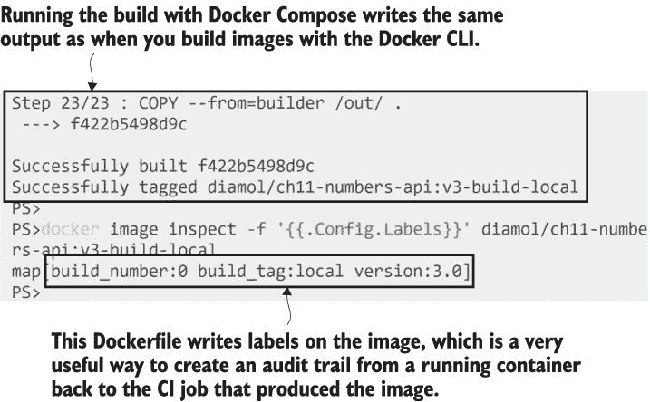

图 11.10 使用 Docker Compose 构建镜像并检查镜像标签

通过 Docker Compose 构建应用程序实际上为每个指定了构建设置的服务运行一个 `docker` `image` `build` 命令。这可能是一打镜像或一个镜像——即使是单个镜像，使用 Compose 构建也是一个好习惯，因为这样你的 Compose 文件就指定了构建镜像时想要的标签。在这个构建过程中还有一些其他事情是成功 CI 管道的一部分——你可以在列出镜像标签的最终 `inspect` 命令中看到这些。

Docker 允许你将标签应用于大多数资源--容器、镜像、网络和卷。它们是简单的键/值对，你可以存储有关资源的额外数据。标签在镜像中非常有用，因为它们被嵌入到镜像中并随其移动--当你推送或拉取镜像时，标签也会随之移动。当你使用 CI 管道构建应用程序时，有一个审计跟踪对于追踪从运行容器到创建它的构建作业非常重要，镜像标签可以帮助你做到这一点。

列表 11.3 展示了随机数 API 的 Dockerfile 的一部分（完整的文件可以在本章的练习中找到，位于`numbers/numbers-api/Dockerfile.v4`）。这里有两个新的 Dockerfile 指令-- `ARG` 和 `LABEL`。

列表 11.3 在 Dockerfile 中指定镜像标签和构建参数

` # 应用程序镜像` ` FROM diamol/dotnet-aspnet`  ` ARG BUILD_NUMBER=0` ` ARG BUILD_TAG=local`  ` LABEL version="3.0"` ` LABEL build_number=${BUILD_NUMBER}` ` LABEL build_tag=${BUILD_TAG}`  ` ENTRYPOINT ["dotnet", "Numbers.Api.dll"]`

`LABEL` 指令只是在构建时将 Dockerfile 中的键/值对应用到镜像上。你可以在 Dockerfile 中看到指定的 `version=3.0`，这与图 11.10 中的标签输出相匹配。其他两个 `LABEL` 指令使用环境变量来设置标签值，这些环境变量由 `ARG` 指令提供。

`ARG` 与 `ENV` 指令非常相似，不同之处在于它是在构建图像时而不是在容器运行时起作用。它们都设置环境变量的值，但对于 `ARG` 指令，这种设置只存在于构建期间，因此从该镜像运行的任何容器都不会看到该变量。这是一个将不适用于运行容器的数据传递到构建过程的好方法。我在这里使用它来提供要放入镜像标签中的值--在 CI 过程中，这些记录了构建的编号和完整的构建名称。`ARG` 指令还设置默认值，因此当你本地构建镜像而不传递任何变量时，你会在镜像标签中看到 `build_number:0` 和 `build_tag:local`。

你可以看到 CI 管道中的环境设置是如何传递到 Compose 覆盖文件中的 Docker `build` 命令的。列表 11.4 展示了包含所有构建设置的`docker-compose-build.yml`文件内容。

列表 11.4 在 Docker Compose 中指定构建设置和可重用参数

` x-args: &args` `   args:` `       BUILD_NUMBER: ${BUILD_NUMBER:-0}` `       BUILD_TAG: ${BUILD_TAG:-local}` ` services:` `   numbers-api:` `       build:` `           context: numbers` `           dockerfile: numbers-api/Dockerfile.v4` `           <<: *args`  `   numbers-web:` `       build:` `           context: numbers` `           dockerfile: numbers-web/Dockerfile.v4` `             <<: *args`

这个 Compose 文件不应该太复杂，除非你跳过了第十章，在这种情况下，你应该回去阅读它。这不会花你超过一顿午餐的时间。

Compose 规范中的`build`块有三个部分：

+   `context` -- 这是 Docker 将用作构建工作目录的路径。这通常是当前目录，你通过在`docker image build`命令中使用点来传递它，但在这里是`numbers`目录——路径相对于 Compose 文件的位置。

+   `dockerfile` -- Dockerfile 的路径，相对于上下文。

+   `args` -- 需要传递的任何构建参数，这些参数需要与 Dockerfile 中`ARG`指令指定的键匹配。这个应用的两个 Dockerfile 都使用相同的`BUILD_NUMBER`和`BUILD_TAG`参数，所以我使用 Compose 扩展字段一次性定义这些值，并使用 YAML 合并将其应用到两个服务中。

你会在很多不同的地方看到指定的默认值，这是为了确保对 CI 过程的支撑不会破坏其他工作流程。你应该始终追求一个单一的 Dockerfile，无论以何种方式构建，都能以相同的方式进行构建。Compose 文件中的默认参数意味着在 CI 环境外运行时构建成功，而 Dockerfile 中的默认参数意味着即使不使用 Compose，镜像也能正确构建。

现在尝试一下 你可以使用正常的`image build`命令构建随机数 API 镜像，绕过 Compose 文件中的设置。你可以将镜像命名为你喜欢的任何名称——构建成功并且标签被应用，因为 Dockerfile 中的默认值：

` # 将目录更改为数字目录`  ` # (这是通过 Compose 中的上下文设置完成的)：` ` cd ch11/exercises/numbers`  ` # 构建镜像，指定 Dockerfile 路径和构建参数：` ` docker image build -f numbers-api/Dockerfile.v4 --build-arg BUILD_TAG=ch11 -t numbers-api .`  ` # 检查标签：` ` docker image inspect -f '{{.Config.Labels}}' numbers-api`

我的输出在图 11.11 中——你可以在标签中看到，`build_tag:ch11`的值是由我的`build`命令设置的，但`build_number:0`的值是由 Dockerfile 中`ARG`的默认值设置的。

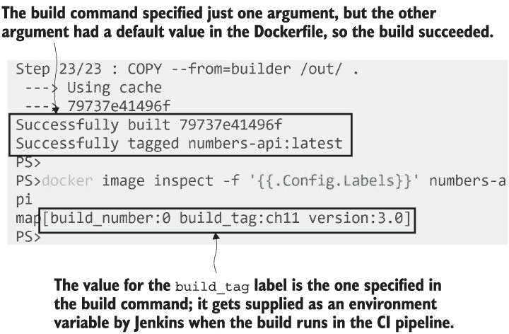

图 11.11 包含构建参数的默认值支持开发人员构建工作流程。

这里有很多细节级别，只是为了将标签放入镜像中，但这是正确设置的重要事情。你应该能够运行`docker image inspect`并找到那个镜像的确切来源，追踪回生成它的 CI 作业，这反过来又追踪回触发构建的确切代码版本。这是从任何环境中的运行容器回源代码的审计跟踪。

## 11.4 使用除 Docker 之外无依赖项的 CI 作业编写

在本章中，您已经愉快地使用 Docker 和 Docker Compose 为随机数应用程序构建镜像，而无需在您的机器上安装任何其他工具。该应用程序有两个组件，两者都使用 .NET Core 3.0 编写，但您不需要在您的机器上安装 .NET Core SDK 来构建它们。它们使用第四章中提到的多阶段 Dockerfile 方法来编译和打包应用程序，因此您只需要 Docker 和 Compose。

这是容器化 CI 的一个主要优势，并且所有托管构建服务（如 Docker Hub、GitHub Actions 和 Azure DevOps）都支持它。这意味着您不再需要一个安装了大量工具的构建服务器，并且工具需要与所有开发者保持更新。这也意味着您的构建脚本变得非常简单——开发者可以在本地使用完全相同的构建脚本，并获得与 CI 管道相同的输出，因此在不同构建服务之间移动变得容易。

我们使用 Jenkins 进行 CI 流程，并且 Jenkins 作业可以通过一个简单的文本文件进行配置，该文件位于源代码控制中，与应用程序代码、Dockerfile 和 Compose 文件一起。列表 11.5 显示了管道的一部分（来自文件 `ch11/exercises/Jenkinsfile`），以及管道步骤执行的批处理脚本。

列表 11.5：Jenkinsfile 中的构建步骤，描述 CI 作业

` # Jenkinsfile 中的构建阶段 - 它切换目录，然后运行两个` ` # shell 命令 - 第一个设置一个脚本文件以便执行` ` # 第二个调用脚本:` ` stage('Build') {` `   steps {` `       dir('ch11/exercises') {` `           sh 'chmod +x ./ci/01-build.bat'` `           sh './ci/01-build.bat'` `           }` `   }` ` }`  ` # 这是 01-build.bat 脚本中的内容:` ` docker-compose` `   -f docker-compose.yml` `   -f docker-compose-build.yml` `     build --pull`

好吧，看看这个——这正是您在本地运行的相同的 `docker-compose` `build` 命令。只不过它添加了 `pull` 标志，这意味着 Docker 将在构建过程中拉取它需要的任何镜像的最新版本。当您进行构建时，养成这个习惯是很好的，因为它意味着您将始终从包含所有最新安全修复的基础镜像构建您的镜像。在 CI 流程中，这尤其重要，因为 Dockerfile 使用的镜像可能会发生变化，这可能会破坏您的应用程序，并且您希望尽快发现这一点。

构建步骤运行一个简单的脚本文件——文件名以 `.bat` 结尾，以便在 Windows 容器中的 Jenkins 下运行良好，但它也可以在 Linux 容器中正常运行。这一步骤执行构建，因为它是一个简单的命令行调用，所以 Docker Compose 的所有输出（也是 Docker 的输出）都被捕获并存储在构建日志中。

现在尝试一下 你可以在 Jenkins UI 中查看日志。浏览到 http:/ /localhost :8080/job/diamol 以查看作业，然后在管道视图中单击作业 #2 的构建步骤。然后单击日志。你可以展开构建步骤，你会看到常规的 Docker 构建输出；我的输出在图 11.12 中。

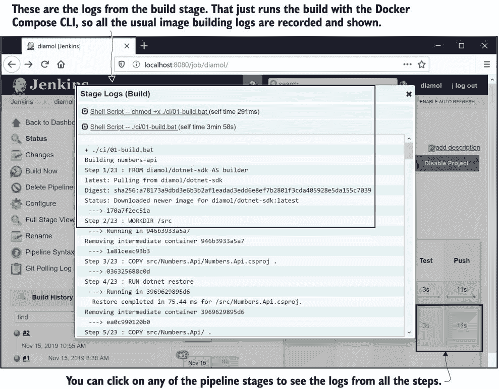

图 11.12 显示了在 Jenkins 中查看管道构建输出的结果，显示了常规的 Docker 日志。

构建管道中的每个步骤都遵循相同的模式；它只是调用一个批处理脚本，通过运行 Docker Compose 命令来完成实际工作。这种方法使得在不同构建服务之间切换变得容易；而不是在专有管道语法中编写逻辑，你编写脚本，并使用管道来调用脚本。我可以添加管道文件以在 GitLab 或 GitHub Actions 中运行构建，并且它们会调用相同的批处理脚本。

Jenkins 构建的所有阶段都由容器驱动：

+   Verify 调用脚本 `00-verify.bat`，该脚本仅打印 Docker 和 Docker Compose 的版本信息。这是一种启动管道的有用方式，因为它验证了 Docker 依赖项是否可用，并记录了构建镜像的工具版本。

+   Build 调用 `01-build.bat`，你之前已经看到过；它使用 Docker Compose 构建镜像。`REGISTRY` 环境变量在 Jenkinsfile 中指定，以便为本地注册表标记镜像。

+   Test 调用 `02-test.bat`，该脚本使用 Docker Compose 启动整个应用程序，然后列出容器并将应用程序关闭。这只是简单的说明，但它确实证明了容器可以正常运行而不会失败。在实际项目中，你会在另一个容器中启动应用程序并运行端到端测试。

+   Push 调用 `03-push.bat`，该脚本使用 Docker Compose 推送所有构建的镜像。镜像标签包含本地注册表域名，因此如果构建和测试阶段成功，镜像将被推送到注册表。

CI 管道中的阶段是顺序的，所以如果在任何地方出现失败，作业就会结束。这意味着注册表只存储潜在发布候选人的镜像--任何推送到注册表的镜像都必须成功通过构建和测试阶段。

现在尝试一下 你从 Jenkins 中有一个成功的构建--构建编号 1 失败是因为没有源代码，然后构建编号 2 成功。你可以使用 REST API 查询你的本地注册表容器，你应该看到每个随机数镜像只有一个版本 2 标签：

` # 目录端点显示所有镜像仓库：` ` curl http://registry.local:5000/v2/_catalog` ` # 标签端点显示一个仓库的各个标签：` ` curl http://registry.local:5000/v2/diamol/ch11-numbers-api/tags/list` ` curl http://registry.local:5000/v2/diamol/ch11-numbers-web/tags/list`

你可以在图 11.13 中看到我的输出--有 Web 和 API 镜像的存储库，但每个都只有一个`build-2`标签，因为第一次构建失败，没有推送任何镜像。

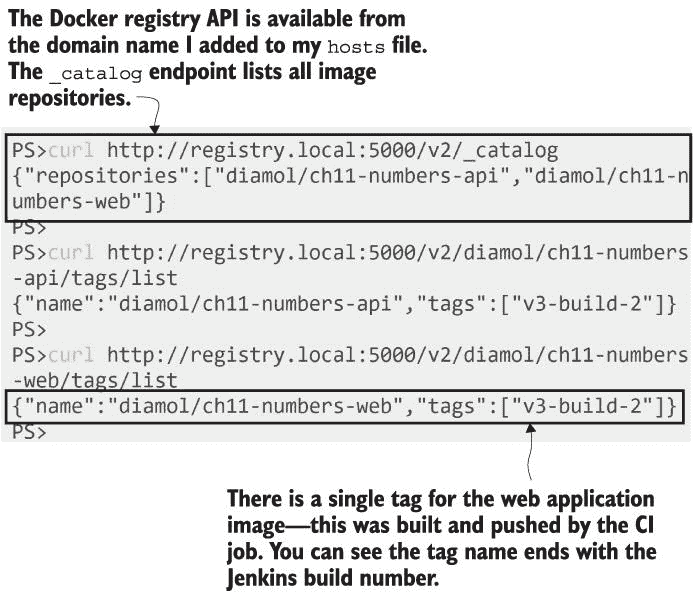

图 11.13 向注册表 API 发送 Web 请求以查询容器中存储的镜像

这是一个相当简单的 CI 管道，但它展示了构建的所有关键阶段和一些重要的最佳实践。关键是要让 Docker 做艰苦的工作，并在脚本中构建你的管道阶段。然后你可以使用任何 CI 工具，只需将你的脚本插入工具的管道定义中。

## 11.5 理解 CI 过程中的容器

在容器中编译和运行应用程序只是你在 CI 管道中使用 Docker 的开始。Docker 在你的所有应用程序构建之上添加了一层一致性，你可以利用这层一致性为你的管道添加许多有用的功能。图 11.14 展示了更广泛的 CI 流程，其中包括对已知漏洞进行安全扫描的容器镜像和为镜像进行数字签名以声明其来源。

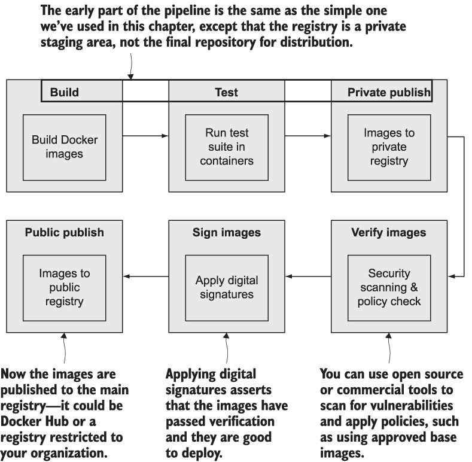

Docker 将这种方法称为安全软件供应链，对于所有规模的组织都至关重要，因为它让你有信心，你即将部署的软件是安全的。你可以在管道中运行工具来检查已知的安全漏洞，并在有问题时失败构建。你可以配置你的生产环境，只运行已数字签名的镜像--这个过程发生在构建成功结束时。当你的容器部署到生产环境时，你可以确信它们正在运行来自你的构建过程的镜像，并且包含通过了所有测试且没有安全问题的软件。

你在管道中添加的检查和平衡在容器和镜像上工作，因此它们以相同的方式应用于所有应用程序平台。如果你在项目中使用多种技术，你将使用不同的基础镜像和不同的 Dockerfile 构建步骤，但 CI 管道都将相同。

## 11.6 实验室

实验时间！你将构建自己的 CI 管道--但不要害怕。我们将使用本章中的想法和练习，但管道阶段将会更简单。

在本章的实验室文件夹中，你可以找到第六章待办事项应用程序的源代码副本。该应用程序的构建几乎可以立即使用--Jenkinsfile 已经存在，CI 脚本也存在，核心 Docker Compose 文件也存在。你只需要做几件事情：

+   编写一个名为`docker-compose-build.yml`的覆盖文件，包含构建设置。

+   创建一个 Jenkins 作业来运行管道。

+   将你的更改推送到`diamol`存储库的 Gogs。

只需完成三个任务，但如果你的前几次构建失败，需要检查日志并调整一些设置，请不要气馁。历史上没有人第一次运行就能成功编写一个 Jenkins 作业，所以这里有一些提示：

+   你的 Compose 覆盖设置将与练习中的类似——指定上下文和构建编号标签的构建参数。

+   在 Jenkins UI 中，你点击“新建项目”来创建一个作业，并且你可以从现有的 `diamol` 作业中复制内容。

+   新的作业设置将与 Jenkinsfile 的路径相同，除了你需要指定 `lab` 文件夹而不是 `exercises` 文件夹。

如果你在这方面进展不大，你可以在实验室文件夹中的“read-me”文件中找到更多信息，其中包含 Jenkins 步骤的截图以及 Docker Compose 文件的示例构建配置：*[`github.com/sixeyed/diamol/blob/master/ch11/lab/README.md`](https://github.com/sixeyed/diamol/blob/master/ch11/lab/README.md)*。
