# 12 理解编排：Docker Swarm 和 Kubernetes

我们一起的容器之旅已经过半，到现在您应该已经非常熟悉使用 Docker 和 Docker Compose 打包和运行应用程序了。下一步是了解这些应用程序如何在生产环境中运行，在那里有许多机器运行 Docker，以提供高可用性和处理大量 incoming traffic 的能力。

在那个环境中，您的应用程序仍然使用与您本地运行相同的 Docker 镜像在容器中运行，但有一个管理层负责协调所有机器并为您运行容器。这被称为编排，两个主要的容器编排器是 Docker Swarm 和 Kubernetes。它们共享许多相同的功能和能力，但 Kubernetes 是一个复杂的系统，有自己的学习路径——《一个月午餐学 Kubernetes》将是您的指南。在本章中，您将学习如何使用 Docker Swarm 进行编排，这是一个内置在 Docker 中的强大生产级容器编排器。即使您的最终目标是学习 Kubernetes，从 Swarm 开始也是好的——Kubernetes 的学习曲线很陡峭，但如果你已经知道 Swarm，那么学习起来会容易得多。

## 12.1 容器编排器是什么？

Docker Compose 适用于在单台机器上运行容器，但在生产环境中并不适用——如果该机器离线，您将丢失所有应用程序。生产系统需要高可用性，这就是编排发挥作用的地方。编排器基本上是将许多机器分组在一起形成一个集群；编排器管理容器，在所有机器之间分配工作，平衡网络流量，并替换任何变得不健康的容器。

您可以通过在每个机器上安装 Docker 来创建一个集群，然后使用编排平台——Swarm 或 Kubernetes 将它们连接起来。从那时起，您可以使用命令行工具或 Web UI 远程管理集群。图 12.1 展示了从基础设施视图看它是如何呈现的。

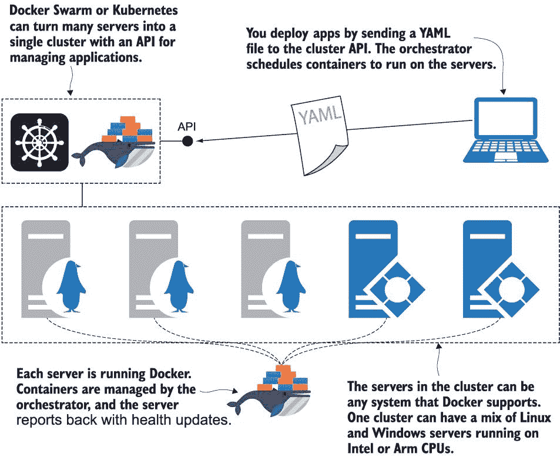

图 12.1 一个编排器将许多服务器转换成一个单一的集群，并为您管理容器。

Orchestrator 提供了一套额外的功能，将你的容器提升到新的水平。集群中有一个分布式数据库，存储了你部署的所有应用程序的信息。然后有一个调度器来确定容器的运行位置，还有一个系统在集群中的所有服务器之间发送心跳。这些都是可靠性的基本构建块。你通过将 YAML 文件发送到集群来部署应用程序；它存储这些信息，然后调度容器运行应用程序——将工作分配给具有可用容量的服务器。当应用程序运行时，集群确保它持续运行。如果服务器离线并且你丢失了一大批容器，集群将在其他服务器上启动替换容器。

Orchestrators 负责管理容器的所有繁重工作；你只需在 YAML 文件中定义所需的状态，无需了解或关心集群中有多少服务器或容器运行的位置。orchestrator 还提供了网络、配置应用程序和存储数据的功能。图 12.2 展示了网络流量如何路由到集群内部以及容器如何读取配置对象和秘密，并将数据写入共享存储。

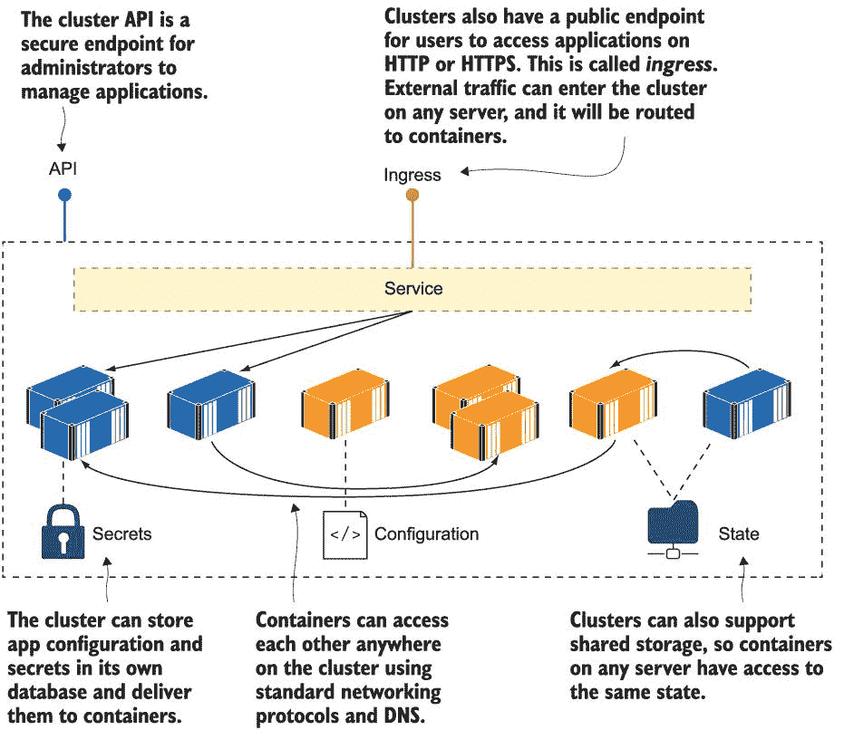

图 12.2 orchestrators 为容器提供了额外的功能——网络、配置和存储。

图 12.2 中的图示缺少一个重要的元素——服务器。orchestrator 隐藏了单个机器、网络和存储设备的细节。你将集群作为一个单一单元来工作，通过 API 发送命令和运行查询，命令行连接到该 API。集群可以是 1000 台机器或一台机器——你以相同的方式与之交互，发送相同的命令和 YAML 文件来管理你的应用程序。你的应用程序的用户可以连接到集群中的任何服务器，编排层负责将流量路由到容器。

## 12.2 设置 Docker Swarm 集群

现在让我们开始吧。使用 Docker Swarm 部署容器 orchestrator 非常简单，因为所有功能都内置在 Docker Engine 中。你只需要通过初始化集群来切换到 Swarm 模式。

现在试试看。Docker CLI 有一组用于管理集群操作的命令。`swarm init`命令切换到 Swarm 模式。通常你可以在没有任何参数的情况下运行它，但如果你的机器连接到多个网络，你会得到一个错误，Docker 会询问你哪个 IP 地址用于 Swarm 通信：

` docker swarm init`

你可以在图 12.3 中看到我的输出，它告诉我 Swarm 已初始化，我的机器是管理器。集群中的机器可以有不同的角色：它们可以是管理器或工作节点。运行`swarm init`的输出显示了需要在其他机器上运行的命令，以便它们作为工作节点加入 Swarm。

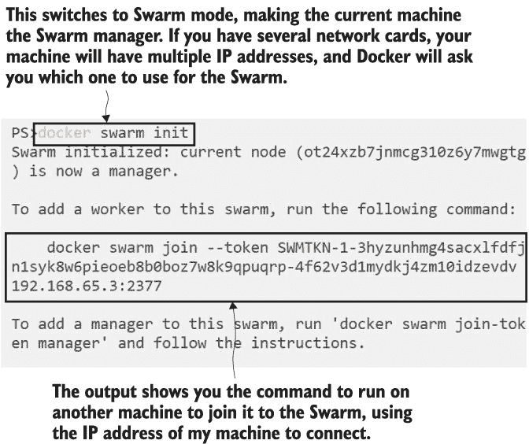

图 12.3 切换到 Swarm 模式创建了一个包含单个节点的集群，这个节点是管理员。

管理员和工人的区别在于管理员负责整个流程——集群数据库存储在管理员上，你将命令和 YAML 文件发送到托管在管理员上的 API，所有的调度和监控都由管理员完成。工人通常只在管理员调度时运行容器，并报告其状态，尽管你也可以让管理员运行工作负载（在这里插入你自己的笑话，将其与人类管理员进行比较）。

初始化 Swarm 是一次性完成的，然后你可以加入任意数量的机器——Docker 将 Swarm 中的机器称为节点。要将节点加入 Swarm，它需要处于同一网络中，并且你需要管理员的加入令牌，这就像是一个密码，用于保护 Swarm 免受恶意节点的侵害。如果你可以访问管理员，你可以打印出节点加入作为工作节点或额外管理员的令牌，并且你可以列出 Swarm 中的节点。

现在就试试看吧！一旦进入 Swarm 模式，Docker CLI 将提供更多命令。运行这些命令以找到工作节点或管理节点的加入令牌，并列出 Swarm 中的所有节点：

` # 打印加入新工作节点命令` ` docker swarm join-token worker`  ` # 打印加入新管理节点命令` ` docker swarm join-token manager`  ` # 列出 Swarm 中的所有节点` ` docker node ls`

你可以在图 12.4 中看到我的输出。我的 Swarm 中只有一个节点，但我可以使用`join`命令中的管理员的 IP 地址将网络上的任何其他机器添加到 Swarm 中。

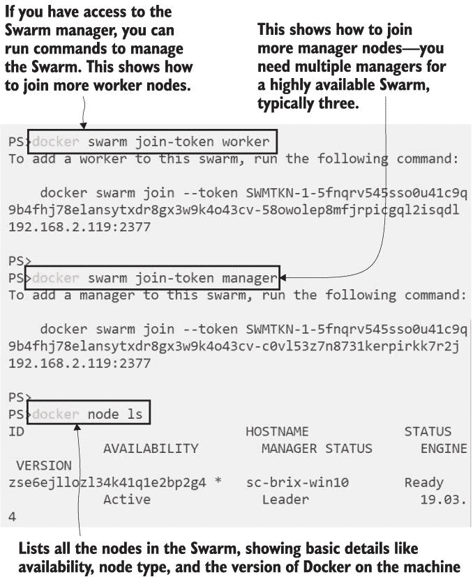

图 12.4 在 Swarm 模式下，你可以使用额外的命令来管理集群中的节点。

单节点 Swarm 的工作方式与多节点 Swarm 完全相同，只是你没有从备用机器中获得高可用性，或者将容器扩展到多个机器以使用其容量的选项。图 12.5 比较了单节点 Swarm 的架构，你可以用于开发和测试环境，以及多节点集群，你会在生产中使用。

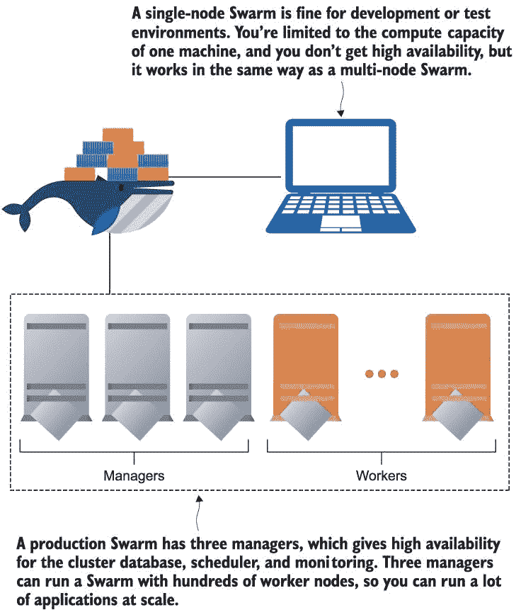

图 12.5 测试和生产 Swarm 具有不同数量的节点，但具有相同的功能集。

Docker Swarm 相对于 Kubernetes 的一个重大优势是集群设置和管理的简单性。你只需在每个服务器上安装 Docker，运行一次`docker swarm init`，然后对其他所有节点运行`docker swarm join`，就可以构建一个包含数十个节点的 Swarm。没有隐藏的复杂性——生产环境和测试环境的过程是相同的。

现在你有了单节点 Swarm，你可以探索当有编排器为你管理容器时应用程序是如何工作的。

## 12.3 以 Docker Swarm 服务运行应用程序

在 Docker Swarm 中，你不会直接运行容器——你部署服务，Swarm 会为你运行容器。服务只是对单个容器概念的抽象。Swarm 在这里使用与 Docker Compose 相同的术语，原因相同：服务可以部署为多个容器。

服务定义中包含了很多你用来运行容器时使用的信息。你指定要使用的镜像、要设置的环境变量、要发布的端口以及服务的名称，该名称将成为网络上的 DNS 名称。区别在于，一个服务可以有多个副本——这些副本是使用服务相同规范的单个容器，可以在 Swarm 中的任何节点上运行。

现在尝试一下：创建一个运行一个容器的服务，使用来自 Docker Hub 的简单应用程序镜像，然后列出服务以检查其是否正确运行：

` docker service create --name timecheck --replicas 1 diamol/ch12-timecheck:1.0` ` docker service ls`

在 Docker Swarm 中，服务是一等对象，但你需要运行在 Swarm 模式下——或者连接到 Swarm 管理器——才能与之交互。我的输出如图 12.6 所示，你可以看到服务被创建，并且从服务列表命令中显示了基本详情，显示有一个副本正在运行。

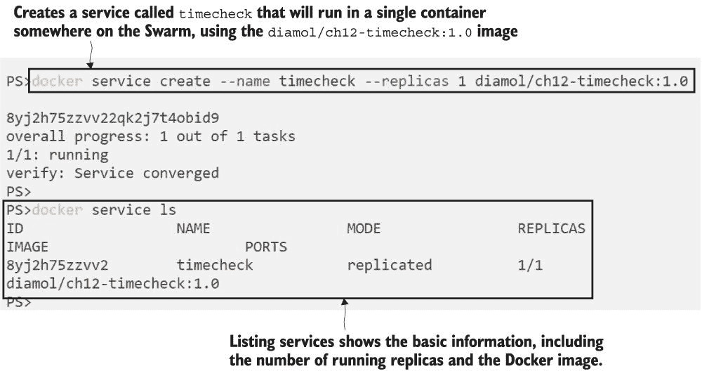

图 12.6 创建服务是请求 Swarm 为你运行容器的做法。

构成服务的容器被称为副本，但它们只是普通的 Docker 容器。你可以连接到运行副本的节点，并使用常规的 Docker 容器命令与之交互。在单节点 Swarm 中，每个副本都会在该机器上运行，因此你可以与刚刚创建的服务容器一起工作。尽管如此，这通常不是你想要做的事情，因为容器是由 Swarm 管理的。如果你尝试自己管理它们，结果可能不会如你所预期。

现在尝试一下：服务副本正在你的机器上运行，但它由 Swarm 管理。你可以删除容器，但 Swarm 会看到服务的副本数低于期望值，并将创建一个替代品。

` # 列出服务的副本：` ` docker service ps timecheck`  ` # 检查机器上的容器：` ` docker container ls`  ` # 删除最新的容器（即服务副本）：` ` docker container rm -f $( docker container ls --last 1 -q)`  ` # 再次检查副本：` ` docker service ps timecheck`

你可以在图 12.7 中看到我的输出。我有一个容器正在运行我的服务的副本，我手动将其删除。但是服务仍然存在于 Swarm 中，并且它应该有一个副本级别为 1。当我删除容器时，Swarm 看到运行的副本不足，并启动了一个替换。你在最终的副本列表中看到原始容器被显示为失败，因为 Swarm 不知道容器停止的原因。正在运行的副本是一个只运行了 10 秒的新容器。

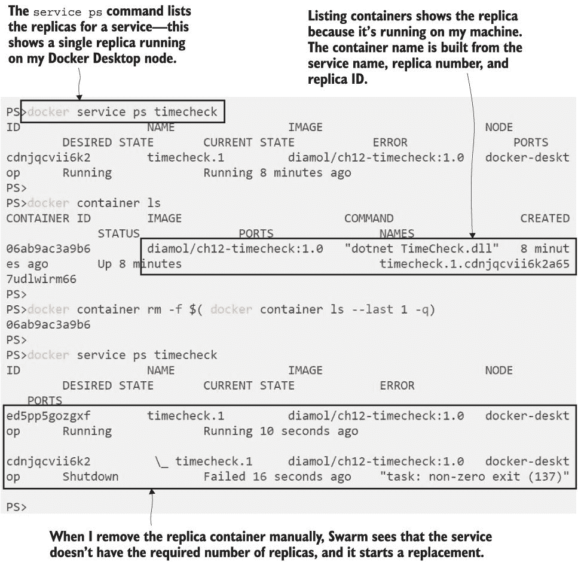

图 12.7 服务副本是普通容器，但它们是由 Swarm 管理的——而不是由你管理。

当你在 Swarm 模式下运行时，你将你的应用程序作为服务来管理，并且让 Swarm 管理单个容器。这必须是这样，因为自己管理容器是不可管理的——你不得不连接到 Swarm 中的每个节点，找出它是否运行了你的服务的副本，如果你想要检查状态或打印日志，你还需要直接与容器打交道。Docker 通过提供操作 Swarm 资源的命令来支持你。你可以使用`docker` `service`命令来打印出所有副本的日志条目，并检查服务以读取其规范。

现在试试看 The `docker` `service`命令是你在 Swarm 模式下应该使用的方式来处理应用程序。你可以从副本中获取信息，比如所有的日志条目，以及关于整个服务的相关信息：

` # 打印过去 10 秒的服务日志:` ` docker service logs --since 10s timecheck`  ` # 获取服务详情，仅显示镜像:` ` docker service inspect timecheck -f '{{.Spec.TaskTemplate.ContainerSpec.Image}}'`

我的输出在图 12.8 中。它显示了服务副本的最新日志条目以及部分服务规范。

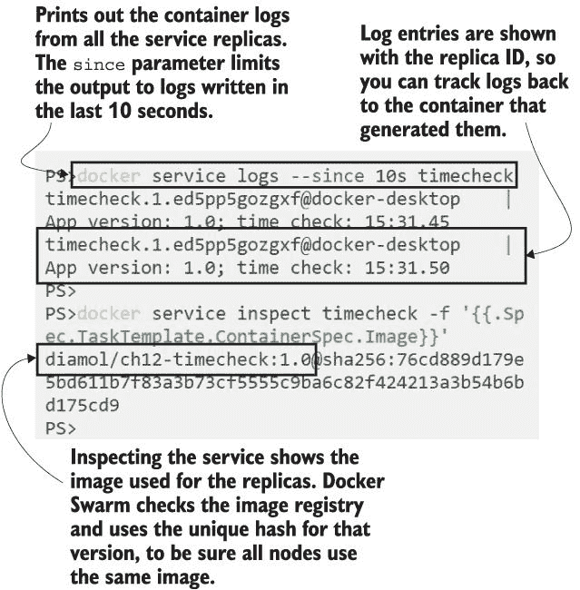

图 12.8 你将服务作为一个单一单元来打印副本日志或检查规范。

整个规范保存在集群中，你可以通过运行相同的`service` `inspect`命令（但不带格式参数）来查看它。那里有很多信息，安全地存储在集群数据库中，该数据库在所有管理节点之间进行了复制。这是 Docker Swarm 和 Docker Compose 之间的一大区别，因为 Docker Compose 没有用于应用程序定义的数据存储。只有当你有可用的 Compose 文件时，你才能使用 Docker Compose 来管理应用程序，因为那是应用程序定义的来源。在 Swarm 模式下，应用程序定义存储在集群中，因此你可以不使用本地 YAML 文件来管理应用程序。

您可以通过更新正在运行的服务来尝试此操作。您可以指定新的镜像版本，但不需要重复服务规范中的任何其他信息。这就是在集群中部署应用程序更新的方法。当您更新服务定义时，Swarm 会推出更改，通过移除旧容器并启动新的容器来替换副本。

现在尝试一下：将 timecheck 服务更新为使用新的镜像版本。这是一个简单的应用程序，每隔几秒写入一个时间戳，但更新会在日志中打印新的应用程序版本：

` # 更新服务以使用新的应用程序镜像:` ` docker service update --image diamol/ch12-timecheck:2.0 timecheck`  ` # 列出服务副本:` ` docker service ps timecheck`  ` # 并检查日志:` ` docker service logs --since 20s timecheck`

当您使用`service ps`列出副本时，您会看到有两个实例--一个是从镜像标签 1.0 运行的旧副本，另一个是从镜像标签 2.0 运行的替换副本。服务日志包括一个 ID，这样您就可以看到哪个副本产生了日志条目。这些只是被写入容器的应用程序日志，由 Swarm 收集，并带有副本 ID 显示出来。您可以在图 12.9 中看到我的示例。

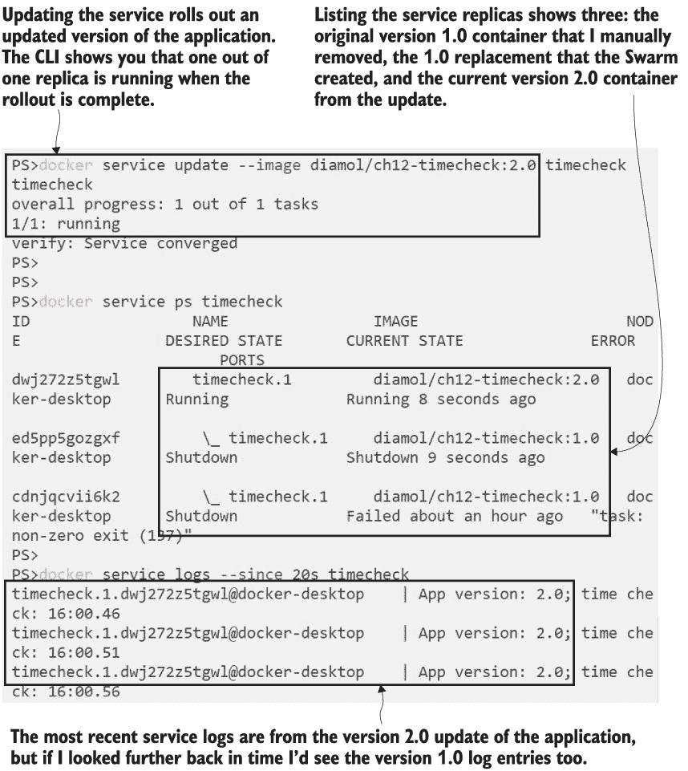

图 12.9 显示了更新服务开始逐步推出新的应用程序版本。

所有容器编排器都使用分阶段推出的方法来更新应用程序，这可以在升级期间保持您的应用程序在线。Swarm 通过一次替换一个副本来实现这一点，所以如果您有多个副本托管您的应用程序，总有容器在运行以处理传入的请求。实际滚动升级的行为可以为您自己的服务进行配置。您可能有 10 个副本提供您的 Web 应用程序，当您推出升级时，Docker 可以一次替换两个副本，在替换下一个两个副本之前检查新容器是否健康，直到所有 10 个副本都被替换。

图 12.10 显示了在部署过程中滚动升级的外观--一些副本正在运行应用程序镜像的旧版本，而一些副本正在运行新版本。在推出过程中，您的应用程序的两个版本都是活跃的，用户可能会击中任何一个--您需要自己管理更新的用户体验方面。

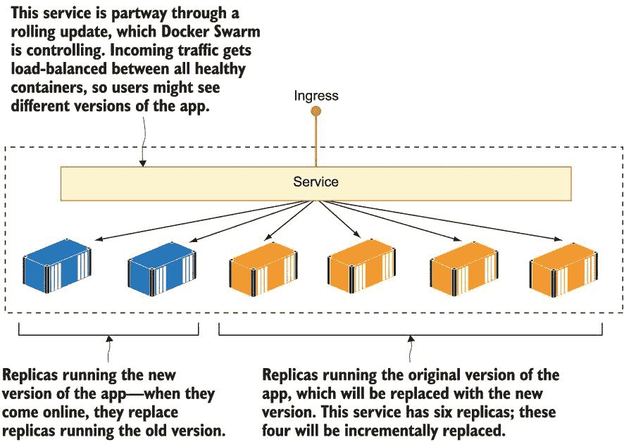

图 12.10 显示了在 Docker Swarm 和 Kubernetes 中，服务更新是增量进行的。

自动滚动更新是手动应用发布的一个巨大改进，并且它是支持自愈应用的另一个特性。在滚动部署新容器的同时，更新过程会检查这些新容器是否健康；如果新版本存在问题，并且容器正在失败，更新可以自动暂停以防止整个应用崩溃。Swarm 还会将其数据库中存储的服务的上一个版本规格，因此如果您需要手动回滚到上一个版本，您只需一个命令即可完成。

现在试试看 您通常使用 YAML 文件来管理应用部署，但如果部署出现错误，仅回滚到之前的状态就非常有用。Docker Swarm 可以做到这一点，因为它将其数据库中存储了服务的当前和上一个状态：

` # 回滚上一个更新：` ` docker service update --rollback timecheck`  ` # 列出所有服务副本：` ` docker service ps timecheck`  ` # 打印所有副本过去 25 秒的日志：` ` docker service logs --since 25s timecheck`

回滚过程与更新过程类似，采用分阶段部署，但它使用的是最近一次更新之前的服务的规格，因此您不需要提供镜像标签。这在更新以某种方式破坏了应用，而 Docker 没有注意到的情况下非常有用，这可能发生在您没有健康检查或检查不够详细的情况下。在这种情况下，当您发现应用已损坏时，只需运行回滚命令，您就不需要疯狂地尝试找到上一个服务规格的详细信息。我的输出如图 12.11 所示，您可以看到所有部署的副本，以及最近副本的服务日志——从 2.0 更新回滚到 1.0。

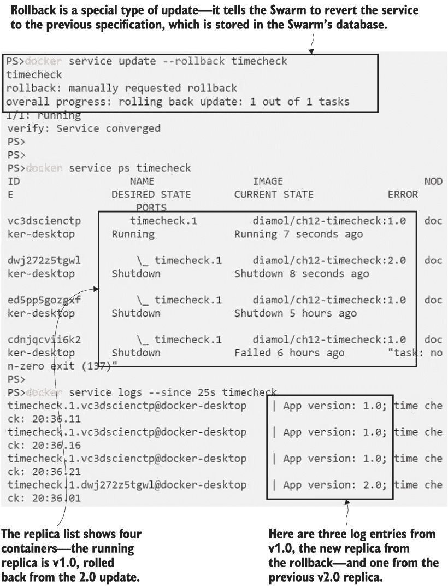

图 12.11 您可以使用一个命令回滚服务更新以返回到之前的规格。

在 Swarm 模式下，您管理的是服务资源，而不是容器。您还可以管理一些新的资源类型，但一些关键的 Docker 资源以相同的方式工作。当容器需要在 Swarm 模式下进行通信时，它们通过 Docker 网络进行通信，并且您发布端口以允许外部流量进入您的应用。

## 12.4 在集群中管理网络流量

在 Swarm 模式下，对于容器内的应用而言，网络是标准的 TCP/IP。组件通过 DNS 名称相互查找，Docker 中的 DNS 服务器返回一个 IP 地址，容器将网络流量发送到该 IP 地址。最终，流量被一个容器接收并响应。在 Swarm 模式下，发送请求的容器和发送响应的容器可能运行在不同的节点上，但对于容器以及容器内的应用来说，这一切都是透明的。

在幕后发生着各种巧妙的网络逻辑，以使跨集群通信无缝，但你不需要深入研究任何这些，因为“一切正常工作”。Swarm 模式提供了一种新的 Docker 网络类型，称为覆盖网络。这是一个跨越集群中所有节点的虚拟网络，当服务附加到覆盖网络时，它们可以使用服务名称作为 DNS 名称相互通信。

图 12.12 展示了两个支持不同应用程序的覆盖网络如何工作，其中每个应用程序在许多节点上的多个服务上运行。覆盖网络允许服务在形成同一应用程序的一部分时进行通信，但网络是隔离的，因此不同网络上的服务无法相互访问。

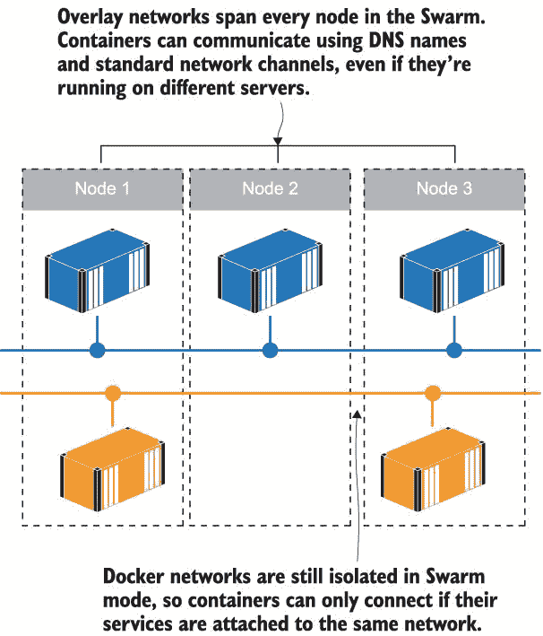

图 12.12 Swarm 中的网络覆盖整个集群，同时仍为应用程序提供隔离。

与普通 Docker 网络上的容器相比，覆盖网络上的服务还有一个不同之处。你在第七章中看到，你可以使用 Docker Compose 来扩展并运行单个 Compose 服务的一个容器实例的多个实例。对该 Compose 服务的 Docker 进行 DNS 查询将返回所有容器的 IP 地址，并且它将依赖于消费者选择一个来发送流量。当你有一个 Swarm 服务中有数百个副本时，这并不容易扩展，因此覆盖网络采用不同的方法，并为服务返回一个单独的虚拟 IP 地址。

现在尝试一下。让我们从之前的练习中删除简单的应用程序，并为我们在前几章中使用过的 NASA 每日图像应用程序创建网络和 API 服务。

` # 删除原始应用程序：` ` docker service rm timecheck` ` # 为新应用程序创建覆盖网络：` ` docker network create --driver overlay iotd-net` ` # 创建 API 服务，将其附加到网络：` ` docker service create --detach --replicas 3 --network iotd-net --name iotd diamol/ch09-image-of-the-day` ` # 以及日志 API，附加到同一网络：` ` docker service create --detach --replicas 2 --network iotd-net --name accesslog diamol/ch09-access-log` ` # 检查服务：` ` docker service ls`

现在你正在运行 NASA 每日图像 API 服务，并且这些服务附加到了覆盖网络上。正如你在图 12.13 的输出中可以看到的那样，有三个副本正在运行图像 API 服务，两个副本正在运行访问日志服务。这仍然是在我的单节点 Swarm 上使用 Docker Desktop 运行的，但我可以在有 500 个节点的 Swarm 上运行相同的命令集，输出将相同——只是副本将在不同的节点上运行。

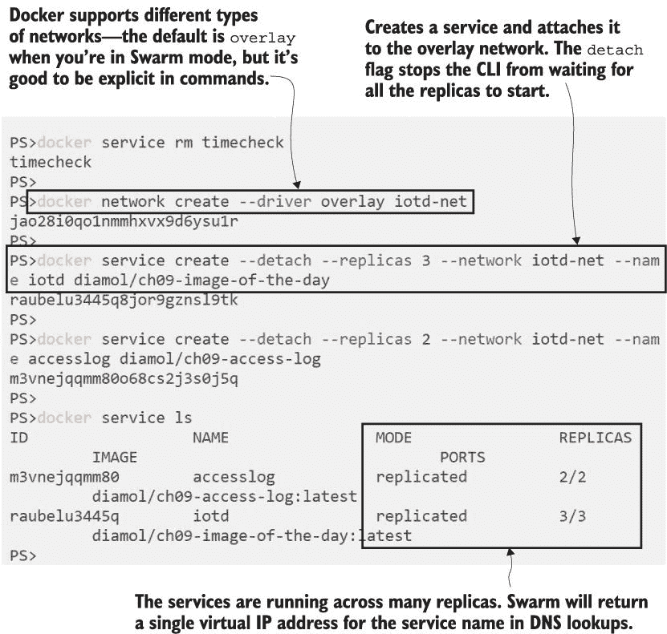

图 12.13 在 Swarm 模式下运行服务并将它们连接到覆盖网络

要查看虚拟 IP 地址（这称为 VIP 网络），最简单的方法是连接到任何容器副本的终端会话。您可以通过运行一些网络命令来对服务名称执行 DNS 查询，并检查返回的 IP 地址。

现在尝试一下：在最新的容器中执行一个交互式终端会话，并运行 API 服务的 DNS 查找。对于 Linux 和 Windows 容器，前几个命令是不同的，但一旦您连接到容器中的终端，它们就是相同的：

` # 运行终端会话 - Windows 容器：` ` docker container exec -it $(docker container ls --last 1 -q) cmd`  ` # 或者 Linux 容器：` ` docker container exec -it $(docker container ls --last 1 -q) sh`  ` # 运行 DNS 查找：` ` nslookup iotd` ` nslookup accesslog`

您可以从图 12.14 中的我的输出中看到，每个服务都有一个单独的 IP 地址，即使有多个容器运行这些服务。服务 IP 地址是一个虚拟 IP 地址，它在所有副本之间共享。

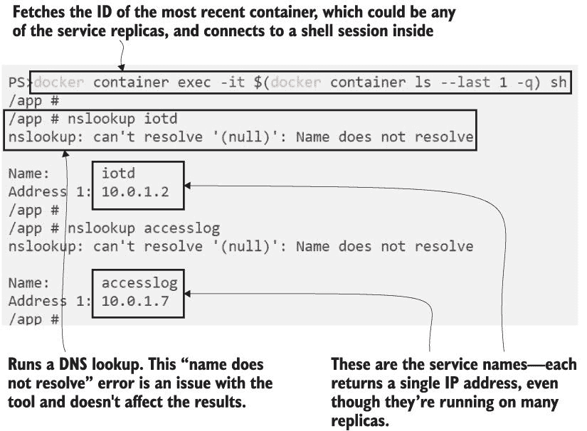

图 12.14：服务使用 VIP 网络，因此无论有多少副本，都有一个单独的 IP 地址。

这是 VIP 网络，它在 Linux 和 Windows 上得到支持，是一种更有效的负载均衡网络流量的方式。DNS 查找只有一个 IP 地址，即使服务扩展或缩减，这个地址也保持不变。客户端将流量发送到该 IP 地址，操作系统的网络层发现实际上有多个地址目标，并决定使用哪一个。

Docker Swarm 使用 VIP 网络在服务之间提供可靠和负载均衡的访问。您只需要知道这一点，因为如果您正在尝试调试通信问题，这会很有用——否则，您可能会对具有许多副本的服务运行 DNS 查找，并惊讶地看到一个 IP 地址返回。作为 Swarm 服务运行的应用程序将像往常一样使用 DNS 名称，因此覆盖网络的复杂性完全被隐藏。

Swarm 模式采用简化复杂网络模式的方法来处理进入集群的流量。如果您考虑集群的规模和应用程序的规模，这是一个更复杂的问题。您可能有 10 个副本运行的 Web 应用程序。如果您的集群中有 20 个节点，一些节点没有运行您的任何 Web 容器，Swarm 需要将请求定向到运行容器的节点。如果您的集群中只有五个节点，每个节点将运行多个副本，Swarm 需要在节点上的容器之间进行负载均衡。Swarm 使用入口网络来处理这个问题——图 12.15 中的图显示了入口的工作方式，每个节点在外部监听相同的端口，Docker 在集群内部内部转发流量。

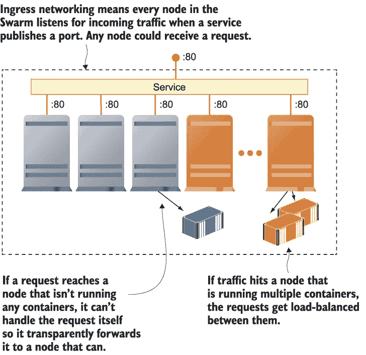

图 12.15 Docker Swarm 使用入口网络将流量路由到节点上的容器。

当您为服务发布端口时，入口网络是 Swarm 模式下的默认设置，所以它与 overlay 网络相同——这是一种复杂的技术，但使用起来却非常简单。您可以在创建服务时发布端口，这就是您需要做的全部事情来利用入口网络。

现在试试看图像库应用的最后一个组件就是网站本身。当您将其作为 Swarm 服务运行并发布端口时，它使用入口网络：

` # 为应用创建 Web 前端：` ` docker service create --detach --name image-gallery --network iotd-net --publish 8010:80 --replicas 2 diamol/ch09-image-gallery` ` # 列出所有服务：` ` docker service ls`

现在您有一个具有多个副本的服务，监听单个端口。您无法使用 Docker Compose 做到这一点，因为您不能让多个容器都监听相同的端口，但在 Docker Swarm 中可以，因为它是使用入口网络监听端口的那个服务。当一个请求进入集群时，入口网络会将它发送到服务的一个副本，这个副本可能运行在接收请求的节点上，也可能是集群中的另一个节点。图 12.16 显示了运行着两个副本并已发布端口的该服务。

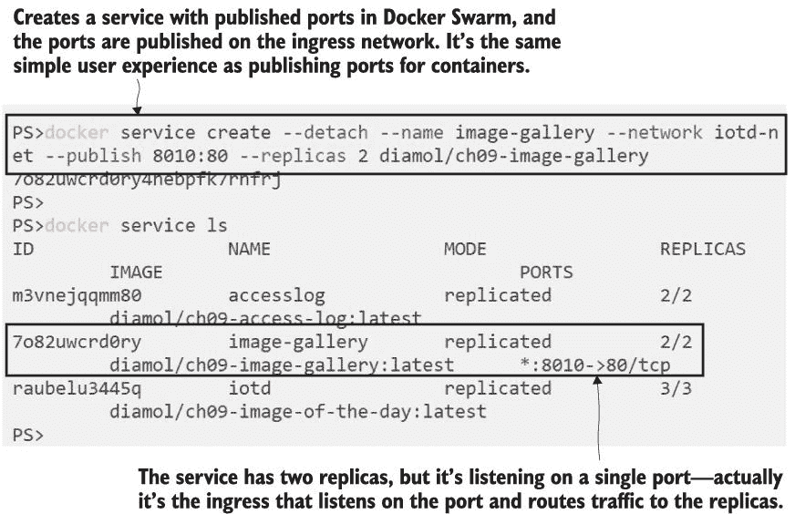

图 12.16 在入口网络中注册一个服务就像发布一个端口一样简单。

您可以浏览到该端口，并看到第四章中的 NASA 图像应用——除非您正在运行 Windows 容器。到目前为止，我设法避免了 Windows 和 Linux 读者之间任何大的差异，除了命令的细微差别，但这个问题是无法回避的。如果您正在运行 Linux 容器——在 Linux 机器上、Mac 上，或者在 Windows 10 上的 Linux 容器模式下——您可以直接浏览到 http://localhost:8010 来查看该应用。如果您正在运行 Windows 容器——无论是在 Windows Server 上还是在 Windows 10 的容器模式下——您无法这样做，因为 Swarm 服务无法通过 localhost 访问。

这是在 Windows 容器和 Linux 容器工作方式不完全相同的情况之一，这归因于 Windows 网络堆栈的限制。在实践中，这通常不是一个问题，因为您的 Swarm 集群将是测试或生产环境中的远程服务器，并且当您访问远程机器时，入口网络确实可以工作。但在您本地的单节点 Windows Swarm 上，您只能通过从不同的机器浏览来访问服务。我知道这并不好，但至少在我们遇到“Windows 上这很糟糕”的时刻之前，我们已经有 12 章了，而且我认为不会再有更多了。

我在本章中切换到了 Linux 容器，如图 12.17 所示，你可以看到 day 应用的镜像。我的网络请求被路由到 web 服务的两个副本之一，然后它会从 API 服务的三个副本之一获取数据。

图 12.17 服务中使用的发布端口使用 ingress 网络，Swarm 将请求路由到副本。

我在本章中已经说过，但再次强调——就部署和管理应用程序而言，集群的大小并不重要。我可以在运行在云中 50 个节点的集群上运行完全相同的命令，结果将会相同——两个我可以从任何节点访问的 web 服务副本，以及 web 容器可以在任何节点上访问的三个 API 服务副本。

## 12.5 理解 Docker Swarm 和 Kubernetes 之间的选择

Docker Swarm 被设计成一个简单的容器编排器。它从已经非常受欢迎的 Docker Compose 中吸取了网络和服务的概念，并将其构建成一个成为 Docker Engine 一部分的编排器。其他编排器作为商业或开源项目被发布，但其中大部分努力都已被搁置，现在选择就只剩下 Docker Swarm 和 Kubernetes。

Kubernetes 是更受欢迎的选择，因为它被所有主要公共云提供商作为托管服务提供。您只需从它们的 CLI 或在其网络门户上点击几个按钮，就可以在 Microsoft Azure、Amazon Web Services 或 Google Cloud 中启动一个多节点 Kubernetes 集群。它们负责初始化集群——这并不像 Docker Swarm 那样简单——以及管理作为节点的虚拟机。Kubernetes 易于扩展，因此云提供商可以将其与其其他产品（如负载均衡器和存储）集成，这使得部署功能齐全的应用程序变得容易。

Docker Swarm 不是云提供商提供的托管服务，部分原因是因为它包含的组件较少，因此更难与其他服务集成。如果您想在云中运行 Docker Swarm 集群，您将需要自行配置虚拟机并初始化 Swarm。所有这些都可以自动化，但并不像使用托管服务那样简单。图 12.18 显示了如果您想在 Azure 中运行 Docker Swarm 集群，您需要自行配置和管理的主要云资源。

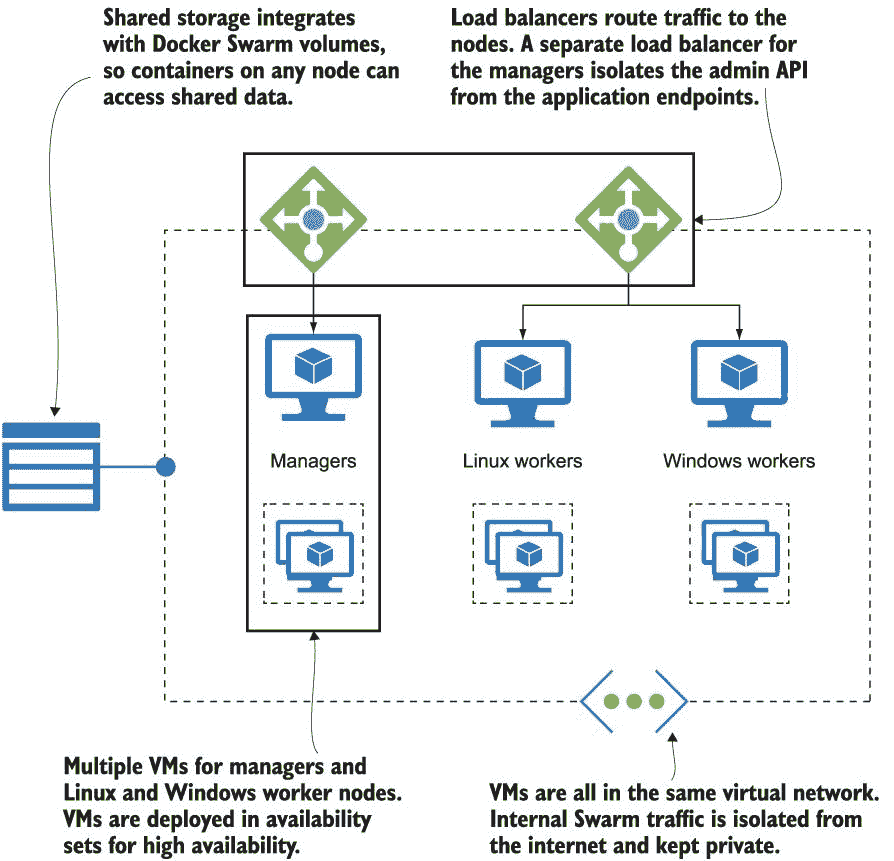

图 12.18 展示了您需要管理的部分云资源，以运行一个生产级别的 Swarm。

然而，您部署集群的频率将低于部署应用程序的频率，对于持续运营，Docker Swarm 要简单得多。它没有 Kubernetes 的所有功能，但它拥有大多数组织所需的一切，而 Kubernetes 的复杂性却小得多。您发送到 Swarm 集群的 YAML 是 Docker Compose 语法的扩展，它简洁且逻辑性强。Kubernetes 的 YAML 规范要复杂得多，部分原因是它支持了额外的资源。这两个编排器最终都有运行 Docker 容器的任务，并且使用相同的 Docker 镜像，但 Kubernetes 应用程序定义的版本可以包含 5 到 10 倍的 YAML。

对于刚开始使用编排的新团队，我的建议是先从 Docker Swarm 开始，如果需要 Swarm 没有的功能，再转向 Kubernetes。您必须对您的应用程序进行一些投资才能将它们迁移到 Docker，但如果转向 Kubernetes，这些投资就不会浪费--您将运行来自相同镜像的容器。但这并不是一个简单的决定，您还需要考虑以下几个因素：

+   基础设施 -- 如果您要将应用程序部署到云端，Kubernetes 是一个更简单的选择，但如果您在数据中心，Swarm 则更容易管理。此外，如果您的团队背景是 100% Windows，您可以使用 Swarm 而无需承担 Linux 的负担。

+   学习曲线 -- 转向 Swarm 很简单，因为它是对您已经拥有的 Docker 和 Compose 体验的扩展。Kubernetes 是一套全新的学习内容，团队中并非每个人都会做出这种投资。

+   功能集 -- Kubernetes 的复杂性部分是由于它具有巨大的可配置性。您可以使用 Kubernetes 做 Swarm 中难以做到的事情，比如蓝/绿部署、自动服务扩展和基于角色的访问控制。

+   未来投资 -- Kubernetes 拥有最大的开源社区之一，并且非常活跃。不断有变化和新功能出现，而 Swarm 已经是一个稳定的产品，一段时间以来没有推出大型新功能。

最终，您的路线图可能会通过《在一个月的午餐时间学习 Kubernetes》带您走向 Kubernetes，但到达那里并不急迫。Swarm 是一个优秀的产品，它将向您介绍生产中的容器编排，并使运行工作负载变得容易，无论它们可能有多大。Visa 在 Docker 的会议上谈到过使用他们的 Swarm 集群来支持他们系统中所有的支付，包括黑色星期五的巨大峰值。

## 12.6 实验室

这次实验室相当简单，只是为了增加您使用作为 Docker Swarm 服务的应用程序的工作经验。我希望您在 Swarm 集群中运行第八章中的随机数应用程序。您需要两个服务和连接它们的网络，并且这些服务需要使用以下 Docker 镜像（这些镜像在 Docker Hub 上，因此您不需要自己构建它们）：

+   `diamol/ch08-numbers-api:v3`

+   `diamol/ch08-numbers-web:v3`

我的解决方案在 GitHub 的常规位置，但只有几个命令，所以你实际上并不需要查找：*[`github.com/sixeyed/diamol/blob/master/ch12/lab/README.md`](https://github.com/sixeyed/diamol/blob/master/ch12/lab/README.md)*。
