# 13 在 Docker Swarm 中作为堆栈部署分布式应用程序

我有一个坦白——在上一章中，我让您花了很多时间学习如何使用命令行创建 Docker Swarm 服务，但在实际项目中您永远不会这样做。这是一种开始编排并理解自己运行容器和由编排器为您管理它们之间的区别的有用方法。但在实际系统中，您不会连接到管理器并发送命令来运行服务。相反，您将在 YAML 文件中描述您的应用程序，并将该文件发送给管理器；然后它将决定采取哪些行动来使您的应用程序运行。这与您在 Docker Compose 中看到的相同期望状态方法——YAML 文件指定了您想要的最终状态，编排器查看当前正在运行的内容，并确定它需要做什么才能达到该状态。

Docker Swarm 和 Kubernetes 都使用相同的期望状态方法，但 YAML 语法不同。Swarm 使用 Docker Compose 语法来定义您应用程序的所有组件，当您将您的 YAML 发送到管理器时，它会创建网络、服务以及您声明的任何其他内容。Compose 格式非常适合描述用于集群部署的分布式应用程序，但有些概念仅在 Swarm 模式下有意义，有些则仅在单个服务器上有意义。该规范足够灵活，可以支持两者，在本章中，我们将基于您对 Docker Compose 和 Docker Swarm 的了解，在集群中运行分布式应用程序。

## 13.1 使用 Docker Compose 进行生产部署

Docker Swarm 的真正力量来自 Compose——您的生产部署使用与您在开发和测试环境中使用的相同文件格式，因此您的每个环境和每个项目的工件和工具都保持一致性。Swarm 的最简单部署与简单的 Compose 文件相同——列表 13.1 显示了第六章中待办事项应用程序的基本部署，它仅指定了镜像名称和要发布的端口。

列表 13.1 可以部署到 Swarm 的 Compose 文件

` version: "3.7"` ` services:` `   todo-web:` `       image: diamol/ch06-todo-list` `       ports:` `             - 8080:80`

您可以使用 Docker Compose 在单个服务器上部署它，您将获得一个运行中的容器，并有一个已发布的端口来访问应用程序。您可以在 Swarm 上部署完全相同的文件，您将获得一个运行单个副本的服务，使用入口网络来发布端口。您通过创建一个堆栈来在 Swarm 模式下部署应用程序，这只是一个将许多其他资源（如服务、网络和卷）组合在一起的资源。

现在尝试一下 将这个简单的 Compose 文件作为堆栈部署。您需要初始化您的 Swarm 并切换到本章练习的文件夹。部署堆栈后，检查正在运行的内容：

` cd ch13/exercises`  ` # 从 Compose 文件部署堆栈：` ` docker stack deploy -c ./todo-list/v1.yml todo`  ` # 列出所有堆栈并查看新创建的堆栈：` ` docker stack ls`  ` # 列出所有服务并查看由部署创建的服务：` ` docker service ls`

您可以从图 13.1 中的我的输出中看到，行为非常类似于 Docker Compose，尽管您使用标准的 Docker CLI 将服务部署到 Swarm 中。我将 Compose 文件发送到我的集群，然后管理器创建了一个默认网络以将服务插入其中，并为我的应用程序创建了一个服务。在 Swarm 模式下，堆栈是一个一等资源；您可以使用 CLI 创建、列出和删除它们。在这个练习中部署堆栈创建了一个单一的服务。

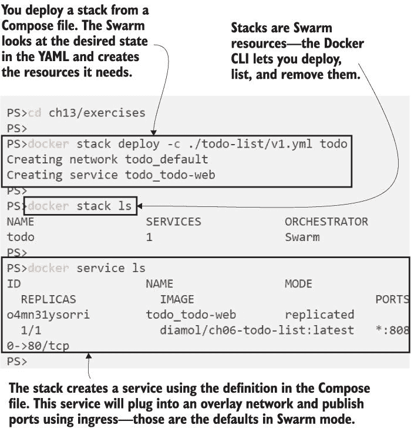

图 13.1 使用标准 Docker Compose 文件在 Swarm 模式下部署堆栈

如果您正在运行 Linux 容器，您可以通过访问 http: */ /* localhost:8080 来浏览应用程序，但如果您正在使用 Windows 容器，您仍然会遇到无法本地浏览到入口网络的问题，因此您需要从另一台机器上浏览。这个待办事项应用程序与之前一样工作，所以我们将跳过截图。从这个练习中您应该吸取的教训是，您已经使用了一个标准的 Docker Compose 文件，没有额外的配置来部署到 Swarm。如果您在 Swarm 中有多个节点，您将拥有高可用性--运行服务副本的节点可以离线，Swarm 将在另一个节点上启动一个替换来保持您的应用程序可用。

当然，Swarm 模式有一套额外的功能，您可以通过在您的 Compose 文件中的服务中添加一个`deploy`部分来在您的应用程序中使用它们。这些属性仅在您在集群中运行时才有意义，因此它们在部署堆栈时应用，但您可以使用相同的文件在单个服务器上使用 Docker Compose，并且`deploy`设置将被忽略。列表 13.2 显示了包含部署属性以运行多个副本并限制每个副本可以使用的计算资源的待办事项应用程序的更新服务定义。

列表 13.2 在您的 Docker Compose 文件中添加 Swarm 部署配置

` services:` `   todo-web:` `       image: diamol/ch06-todo-list` `       ports:` `           - 8080:80` `       deploy:` `           replicas: 2` `           resources:` `               limits:` `                   cpus: "0.50"` `                     memory: 100M`

这些是你希望在生产部署中包含的基本属性。运行多个副本意味着你的应用程序可以管理更多的负载，这也意味着如果一个副本因为服务器故障或服务更新而离线，另一个副本将可用于服务流量。你还应该在服务上线时为所有服务指定计算限制，以保护你的集群免受恶意副本消耗所有处理能力和内存的影响。确定限制需要一些努力，因为你需要知道应用程序在最繁忙时所需的 CPU 和内存量——第九章中看到的那些指标有助于这一点。在此应用程序规范中，资源限制将每个副本限制在一个 CPU 核心的最大 50% 和 100 MB 的内存。

将更新部署到 Swarm 堆栈与部署新应用程序相同——你将更新的 YAML 文件发送到管理器，它会为你进行更改。当你部署 v2 Compose 文件时，Swarm 将创建一个新的副本并替换现有的副本。

现在试试吧 使用新的 Compose 文件但原始堆栈名称运行 `stack deploy` 命令——这就像更新现有堆栈一样。列出服务任务，你会看到更新是如何发生的：

` # 部署更新后的堆栈 Compose 文件` ` docker stack deploy -c ./todo-list/v2.yml todo`  ` # 检查所有 Web 服务的副本:` ` docker service ps todo_todo-web`

我的输出在图 13.2 中。你可以看到堆栈更新了服务，并且服务有两个新的副本。原始副本被替换，因为将资源限制添加到 Compose 文件中会更改容器定义，而这需要通过一个新的容器来执行。

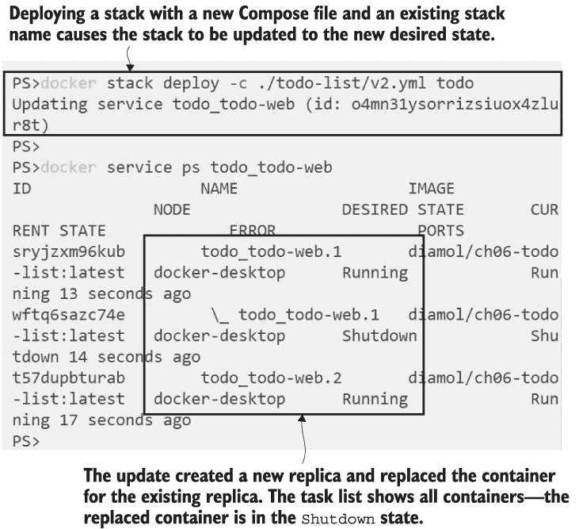

图 13.2 使用新的 Compose 文件更新堆栈将更新服务，如果定义已更改。

如果你没有指定限制，Docker 容器可以访问主机机器的所有 CPU 和内存。这是默认设置，对于你希望在服务器上尽可能多地运行应用程序的非生产环境来说，这是可以接受的。然而，在生产环境中，你希望限制来保护系统免受糟糕的代码或恶意用户试图耗尽系统资源的影响，但这些限制是在容器启动时建立的，所以如果你更新它们，你会得到一个新的容器，这在 Swarm 模式下是一个副本更新。

Swarm 堆栈是一种将应用程序分组的好方法，因为你通常需要在一个集群中运行许多应用程序。你可以使用 Docker CLI 中的 `stack` 命令来整体管理应用程序，列出单个服务及其副本，或者完全删除应用程序。

现在试试吧 堆栈是应用程序的管理单元。它们为你提供了一个简单的方式来处理可能运行多个服务（每个服务可能有多个副本）的应用程序。检查待办事项应用程序堆栈中正在运行的内容，然后将其删除：

` # 列出堆栈中的所有服务:` ` docker stack services todo`  ` # 列出堆栈中所有服务的所有副本:` ` docker stack ps todo`  ` # 删除堆栈:` ` docker stack rm todo`

这个应用程序是一个带有 Docker 网络、一个服务和两个副本的非常简单的示例。更大的分布式应用程序可以在 Swarm 中运行数十个服务，跨越数百个副本，并且您仍然可以使用 Compose 文件以相同的方式部署它们，并使用`docker` `stack`命令来管理它们。图 13.3 显示了我的输出，最终删除了整个堆栈。

图 13.3 使用 Docker CLI 与堆栈一起工作——您可以列出资源并删除它们。

您可以管理堆栈中的所有资源，而无需需要 Compose 文件，因为所有规范都存储在集群数据库中。该共享数据库在 Swarm 管理器之间进行复制，因此它是一个安全的地方来存储其他资源。这就是您在 Swarm 中存储应用程序配置文件的方式，您可以在 Compose 文件中将这些文件提供给服务。

## 13.2 使用配置对象管理应用程序配置

在容器中运行的应用程序需要能够从运行容器的平台加载其配置设置。我使用带有环境变量的 Docker Compose 在本地开发和测试环境中解决了这个问题。现在我们可以通过使用存储在集群中的 Docker 配置对象来完善生产环境。图 13.4 展示了它是如何工作的，这里重要的是每个环境中都是相同的 Docker 镜像。只是应用程序的行为发生了变化。

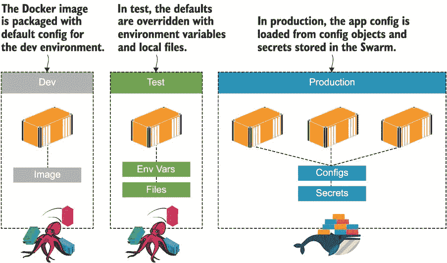

图 13.4 从平台应用配置；Swarm 模式使用配置对象和秘密。

配置是部署如此关键的一部分，所有编排器都有一个一等资源来保存应用程序配置。在 Swarm 中，这些是 Docker 配置对象。它们很强大，因为它们允许容器从集群加载其配置，但它们也解耦了应用程序部署与配置管理的作用。

组织通常有一个配置管理团队，可以访问所有秘密——API 密钥、数据库服务器密码、SSL 证书——并且这些秘密都存储在一个安全系统中。该系统通常与运行应用程序的环境完全分开，因此团队需要一种方法将中央系统中的配置应用到应用程序平台上。Docker Swarm 通过一种特定的资源类型——配置对象——支持这种工作流程，您可以从现有的配置文件中将这些对象加载到集群中。

现在尝试一下 待办事项应用程序使用 JSON 进行配置。镜像中的默认配置使用本地数据库文件进行存储，但如果你运行许多副本则不起作用--每个容器将有自己的数据库，并且用户将根据其请求的副本服务看到不同的列表。修复此问题的第一步是在集群中部署新的配置文件：

` # 从本地 JSON 文件创建配置对象：` ` docker config create todo-list-config ./todo-list/configs/config.json`  ` # 检查集群中的配置：` ` docker config ls`

配置对象通过名称和配置文件内容的路径来创建。此应用程序使用 JSON，但配置对象可以存储任何类型的数据--XML、键/值对，甚至是二进制文件。Swarm 将配置对象作为容器文件系统中的文件交付，因此应用程序看到的是你上传的确切相同数据。图 13.5 显示了我的输出--配置对象除了名称外还创建了一个长随机 ID。

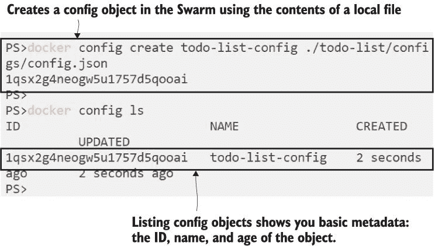

图 13.5 将本地文件加载到 Swarm 集群作为配置对象

你可以像处理其他 Docker 资源一样处理配置对象--有命令可以删除、检查以及创建它们。检查是有用的，因为它显示了配置文件的内容。这是关于配置对象的一个重要观点：它们不是为敏感数据设计的。文件内容在 Swarm 数据库中未加密，在从管理器移动到运行副本的节点时也不会在传输过程中加密。

现在尝试一下 你可以检查配置对象以读取其完整内容。这显示了当副本使用配置对象时在容器文件系统中将看到的内容：

` # 使用 pretty 标志检查配置以显示内容：` ` docker config inspect --pretty todo-list-config`

图 13.6 显示了我的输出，其中包含有关配置对象和文件内容的所有元数据，包括空白字符。

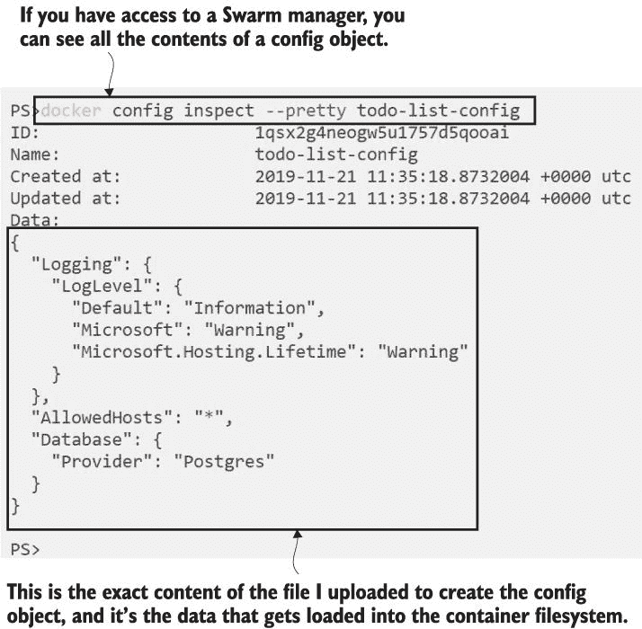

图 13.6 配置对象不安全--任何有权访问集群的人都可以看到内容。

管理配置对象是管理使用这些配置对象的应用程序的工作流程之外的独立流程。在 DevOps 工作流程中，所有这些都可以由同一个团队或一个自动化的管道来完成，但在大型企业中，如果这与你的现有流程相匹配，你可以保持功能分离。

服务通过在 Compose 文件中指定配置对象来消费配置对象。列表 13.3 显示了待办事项应用程序更新定义的一部分（完整文件名为 `v3.yml`），该应用程序从配置对象中加载配置。

列表 13.3 服务中的配置对象在容器文件系统中被暴露

` services:` `   todo-web:` `       image: diamol/ch06-todo-list` `       ports:` `           - 8080:80` `       configs:` `           - source: todo-list-config` `               target: /app/config/config.json`  ` #...` ` configs:` `   todo-list-config:` `         external: true`

当一个容器作为此服务的副本运行时，它将从 Swarm 加载配置对象的全部内容到 `/app/config/config.json` 文件中，这是应用程序用作配置源之一的路径。你可以使用更短的语法，只需指定配置对象的名字，Docker 就会使用默认的目标路径，但实际路径因不同的操作系统而异，所以最好明确指出你希望文件出现在哪个位置。（正斜杠目录路径在 Windows 和 Linux 容器中都有效。）

列表 13.3 中的 Compose 文件的第二部分显示了配置对象本身，包括其名称和 `external` 标志。`external` 是你指定此资源应该在集群中已经存在的方式。部署工作流程是首先部署配置对象，然后部署使用它们的应用程序。你可以通过部署 v3 Compose 文件来实现，它还包括一个用于 SQL 数据库的服务，这样多个 Web 容器就可以共享同一个数据库。

现在就试试吧！通过部署 YAML 文件来更新应用程序——`stack` 命令是一样的。Swarm 将为数据库服务创建一个新的副本，并为 Web 应用程序创建新的副本：

` # 部署更新的应用程序定义：` ` docker stack deploy -c ./todo-list/v3.yml todo` ` # 列出堆栈中的服务：` ` docker stack services todo`

在之前的练习中，你已经移除了旧的堆栈，所以这是一个新的部署。你会看到创建了一个网络和两个服务。我已经将 Web 组件的副本数减少到单个，这样我们就可以更容易地跟踪更新；现在每个服务都在运行单个副本。我的输出在图 13.7 中。

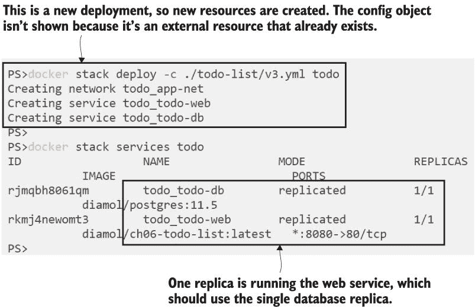

现在应用程序已配置为使用 Postgres 作为数据库，这是配置对象加载到副本中的设置。如果你浏览到 http: */ /* localhost:8080（或者如果你在 Windows 上，从另一台机器访问你的机器），你会看到应用程序没有工作。你可以检查 Web 服务的日志来查看原因，并且它将显示许多关于连接到数据库的错误。这次部署配置了 Web 应用程序使用 Postgres，但配置对象没有提供数据库的连接细节，所以连接失败——我们将在下一个练习中修复这个问题。

敏感数据不应存储在配置对象中，因为它们未加密，并且任何有权访问集群的人都可以读取。这包括可能包含用户名和密码的数据库连接字符串，以及生产服务的 URL 和 API 密钥。您应该在生产环境中追求深度防御，即使有人访问您的集群的机会很小，您也应该在集群内部加密敏感数据。Docker Swarm 提供密钥来存储此类配置。

## 13.3 使用密钥管理机密设置

密钥是 Swarm 中由集群管理的一种资源，它们几乎与配置对象完全相同。您可以从本地文件创建密钥，并将其存储在集群数据库中。然后，在服务规范中引用密钥，密钥的内容在运行时被加载到容器文件系统中。与密钥的关键区别在于，您只能在工作流程中的一个点上以纯文本形式读取它们：在容器内部，当它们从 Swarm 加载时。

密钥在其在集群中的整个生命周期内都是加密的。数据以加密形式存储在由管理器共享的数据库中，并且只有计划运行需要密钥的副本的节点才会接收密钥。密钥在从管理节点到工作节点的传输过程中加密，并且只有在容器内部才会解密，在那里它们会以原始文件内容的形式出现。我们将使用密钥来存储待办事项应用的数据库连接字符串。

现在尝试一下：从本地文件创建密钥，然后检查它以查看 Docker 提供的关于密钥的信息：

` # 从本地 JSON 文件创建密钥:` ` docker secret create todo-list-secret ./todo-list/secrets/secrets.json`  ` # 使用 pretty 标志检查密钥以查看数据:` ` docker secret inspect --pretty todo-list-secret`

使用密钥的用户体验与配置对象相同。唯一的区别是，一旦密钥被存储，您就无法读取其内容。您可以在图 13.8 中看到我的输出--检查密钥仅显示有关资源的元数据，而不是实际数据，如果您查看的是配置对象，您会看到这些数据。

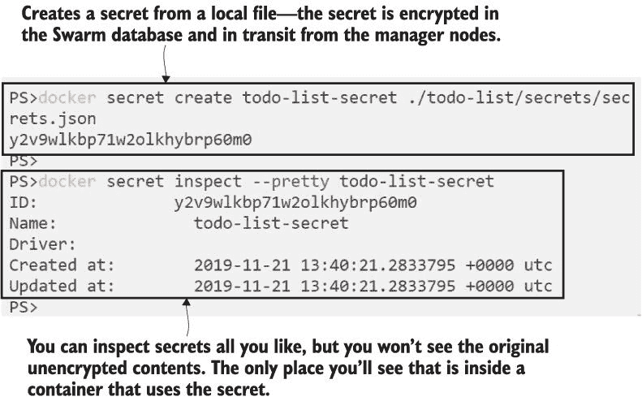

图 13.8 一旦密钥存储在 Swarm 中，您就无法读取原始未加密的内容。

现在，密钥已存储在 Swarm 中，我们可以使用包含密钥的服务规范部署应用的新版本。密钥的 Compose 语法与配置对象非常相似；您在服务定义中指定密钥的源和目标路径，然后密钥本身获得其自己的定义。列表 13.4 显示了新部署的关键部分，这些部分位于 `v4.yml` 文件中。

列表 13.4 指定应用配置的密钥和配置

` services:` `   todo-web:` `       image: diamol/ch06-todo-list` `       ports:` `           - 8080:80` `       configs:` `           - source: todo-list-config` `               target: /app/config/config.json` `       secrets:` `           - source: todo-list-secret` `               target: /app/config/secrets.json`  ` #...` ` secrets:` `   todo-list-secret:` 

那个秘密的内容是更多的 JSON，加载到另一个路径，应用程序会在这里查找配置源。这设置了应用程序使用 Postgres 容器作为其数据存储的连接细节，因此当你部署应用程序时，无论哪个 Web 副本提供服务，用户都会得到相同的物品列表。

现在尝试一下 部署应用程序的最新版本，它提供了缺少的数据库连接字符串并修复了 Web 应用程序。这将更新服务。

` # 部署应用程序的新版本:` ` docker stack deploy -c ./todo-list/v4.yml todo` ` # 检查堆栈的副本:` ` docker stack ps todo`

只有在 Compose 文件中的 Web 服务定义已更改，但当你运行它时，你会看到 Docker 状态更新了两个服务。实际上，它并没有对数据库服务进行任何更新，所以这是 CLI 的一个稍微误导性的输出--它将列出 Compose 文件中的所有服务作为“更新中”，即使它们不会全部更改。你可以在图 13.9 的输出中看到这一点。

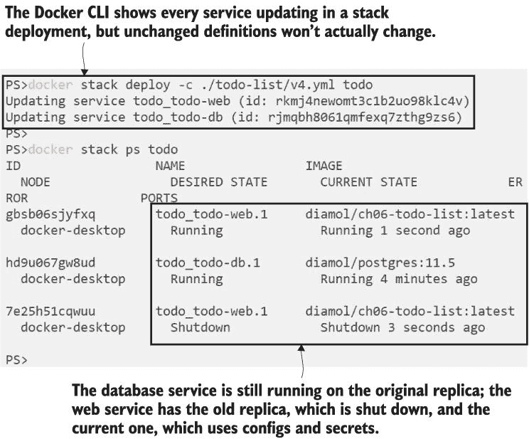

图 13.9 部署最新应用程序版本将纠正配置并修复应用程序。

现在，应用程序正在正常工作，如果你从远程机器（如果你使用 Windows 容器）或 localhost（如果你使用 Linux 容器）浏览到端口 8080，你会看到这一点。图 13.10 显示了基础设施设置，容器在 Docker 网络上连接，并且从 Swarm 加载了秘密。

图 13.10 中缺少的重要东西是硬件视图，这是因为这个应用程序在任何大小的 Swarm 上都有相同的部署架构。秘密和配置对象存储在管理员的分布式数据库中，并且对每个节点都是可用的。堆栈创建了一个覆盖网络，以便容器可以在它们运行的任何节点上相互连接，并且服务使用入口网络，以便消费者可以向任何节点发送流量，并由其中一个 Web 副本执行操作。

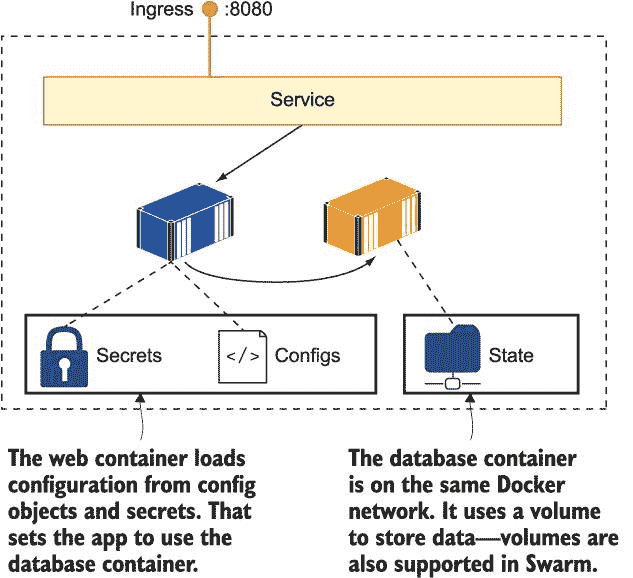

图 13.10 使用堆栈运行的任务应用程序使用了 Docker Swarm 的关键特性。

关于配置对象和秘密，你需要理解的一件事是：它们不能被更新。当你集群中创建它们时，内容总是相同的，如果你需要更新应用程序的配置，你需要替换它。这将涉及三个步骤：

+   使用更新的内容和一个不同于上一个对象的名称创建一个新的配置对象或秘密。

+   更新 Compose 文件中应用程序使用的配置对象或秘密的名称，并指定新名称。

+   从更新的 Compose 文件部署堆栈。

这个过程意味着每次你更改配置时都需要更新你的服务，这意味着正在运行的容器将被新的容器替换。这是编排器采取不同方法的一个领域——Kubernetes 允许你在集群中更新现有的配置和秘密对象。但这也会带来自己的问题，因为一些应用平台会监视它们的配置文件以查找更改，而其他平台则不会，因此更改可能会被忽略，你仍然需要替换容器。Swarm 是一致的——当你推出配置更改时，你总是需要更新你的服务。

尽管如此，更新服务不应该让你感到害怕。每次你有新功能要部署到你的应用中，或者当你在使用的依赖项或基于你镜像的操作系统中有安全更新时，你都会推出容器更新。至少，你应该预计每个月发布一次更新，这是大多数基于操作系统的镜像在 Docker Hub 上更新的频率。

这就引出了在 Swarm 模式下的有状态应用。你将定期替换容器，因此你需要使用 Docker 卷来持久化存储，而在 Swarm 中卷的工作方式略有不同。

## 13.4 在 Swarm 中使用卷存储数据

我们在第六章中就介绍了 Docker 卷——它们是具有独立生命周期的存储单元。任何你想容器化的有状态应用都可以使用卷进行存储。卷作为容器文件系统的一部分出现，但实际上它们存储在容器之外。应用升级会替换容器并将卷附加到新容器上，因此新容器启动时将具有前一个容器所有的数据。

在编排器中，卷的概念上是相同的；你在 Compose 文件中为服务添加卷挂载规范，副本将把该卷视为本地目录。然而，数据存储的方式有很大不同，这是你需要理解以确保你的应用按预期工作的事情。在一个集群中，你将有多节点可以运行容器，每个节点都有自己的磁盘，用于存储本地卷。在更新之间保持状态的最简单方法是使用本地卷。

然而，这种方法存在一个问题——替换副本可能被调度在原始节点之外的其他节点上运行，因此它将无法访问原始节点上的数据。你可以将服务固定到特定的节点上，这意味着更新将始终在具有数据的节点上运行。这对于你希望在容器外部存储应用数据以使其在更新中存活，但不需要运行多个副本且不需要允许服务器故障的场景有效。你给你的节点应用一个标签，并在你的 Compose 文件中限制副本只在那个节点上运行。

现在试试看 你有一个单节点 Swarm，所以每个副本无论如何都会在这个节点上运行，但标签过程对于多节点 Swarm 也是相同的。标签可以是任何键/值对；我们将使用这个来分配一个虚构的存储类：

` # 找到你的节点 ID 并更新它，添加一个标签：` ` docker node update --label-add storage=raid $(docker node ls -q)`

该命令的输出只是节点 ID，所以我们省略了截图。更有趣的是，你现在有了一种识别集群中节点的方法，这可以用来约束服务副本的调度位置。列表 13.5 显示了待办数据库服务定义中的 `constraint` 字段，该数据库现在也指定了卷--这位于 `v5.yml` 部署文件中。

列表 13.5 配置 Swarm 中服务的约束和卷

` services:` `   todo-db:` `       image: diamol/postgres:11.5` `       volumes:` `         - todo-db-data:/var/lib/postgresql/data` `       deploy:` `           placement:` `               constraints:` `                   - node.labels.storage == raid`  ` #...` ` volumes:` `     todo-db-data:`

我没有在列表末尾的 Compose 文件中缩减卷的指定部分--卷名就是所有内容。这个卷将使用 Swarm 的默认卷驱动程序创建，该驱动程序使用本地磁盘。当你将此部署到你的集群时，它将确保数据库副本在匹配存储标签的节点上运行，并且该节点将创建一个名为 `todo-db-data` 的本地卷，数据文件将存储在这里。

现在试试看 Compose 文件中的约束与你在 Swarm 节点上添加的标签相匹配，所以数据库容器将在这里运行并使用该节点上的本地卷。这些命令将在部署前后探索你节点上的卷：

` # 列出你节点上的所有卷，只显示 ID:` ` docker volume ls -q`  ` # 更新堆栈到 v5 - 对于 Linux 容器：` ` docker stack deploy -c ./todo-list/v5.yml todo`  ` # 或者使用 Windows 容器，使用 Windows 风格的路径来指定卷：` ` docker stack deploy -c ./todo-list/v5-windows.yml todo`  ` # 再次检查卷：` ` docker volume ls -q`

你会看到有很多卷（你可能比我多得多；我在这些练习之前用 `docker` `volume` `prune` 命令清除了我的卷）。镜像可以在 Dockerfile 中指定卷，如果服务使用带有卷的镜像，堆栈会为服务创建一个默认卷。这个卷的寿命与堆栈相同，所以如果你删除了堆栈，卷也会被删除，如果你更新了服务，它们将获得一个新的默认卷。如果你想使数据在更新之间持久化，你需要在 Compose 文件中使用一个命名的卷。你可以在图 13.11 中看到我的输出；部署堆栈创建了一个新的命名卷而不是默认卷。

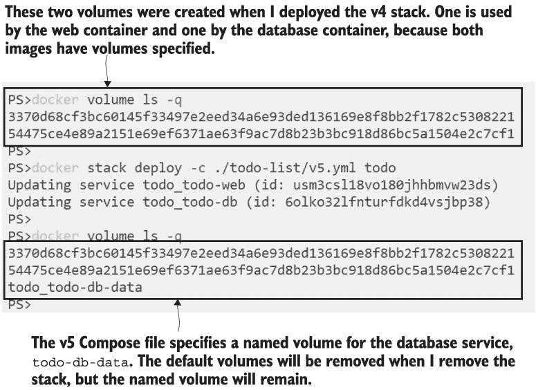

图 13.11 部署堆栈也会创建卷，这些卷可以是匿名的或命名的。

如果标记的节点本身可用，这种部署提供了数据可用性的保证。如果容器失败其健康检查并被替换，新的副本将在与先前副本相同的节点上运行，并附加到相同的命名卷。当你更新数据库服务规范时，你将获得相同的保证。这意味着数据库文件在容器之间持久化，你的数据是安全的。你可以通过 Web UI 添加项目到待办事项列表，升级数据库服务，并发现旧数据仍然在新数据库容器中的 UI 中。

现在试试看。自从我写第六章以来，Postgres 服务器已经发布了一个新版本，保持最新是个好主意，所以我们将更新数据库服务。`v6.yml`中的 Compose 规范与`v5.yml`相同，除了它使用了更新的 Postgres 版本：

` # 部署更新的数据库 - 对于 Linux 容器：` ` docker stack deploy -c ./todo-list/v6.yml todo`  ` # 或者对于 Windows 容器：` ` docker stack deploy -c ./todo-list/v6-windows.yml todo`  ` # 检查堆栈中的任务：` ` docker stack ps todo`  ` # 并检查卷：` ` docker volume ls -q`

你可以在图 13.12 中看到我的输出。新的数据库副本是从更新的 Docker 镜像运行的，但它附加到来自先前副本的卷，所以我的所有数据都得到了保留。

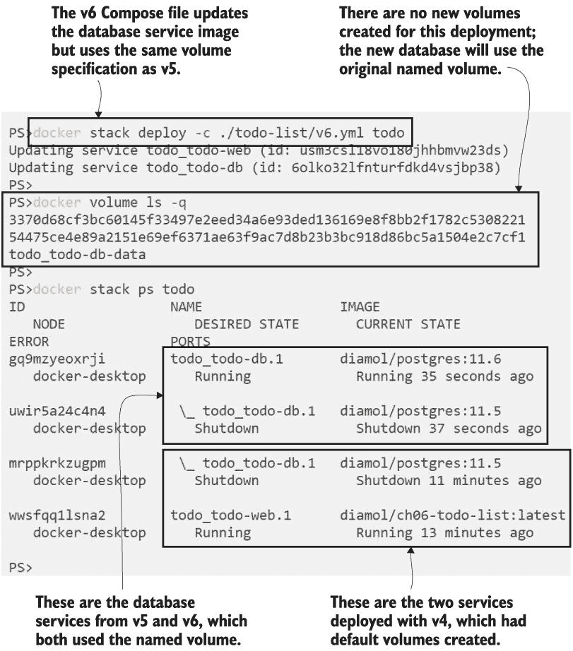

图 13.12 更新使用命名卷的服务可以保留新容器的数据。

这是一个简单的例子，当你为你的应用程序有不同的存储需求时，事情会变得更加复杂，因为本地卷中的数据不会在所有节点之间复制。使用磁盘作为数据缓存的程序对本地卷可以很好地工作，因为每个副本的数据可以不同，但这对于需要在整个集群中访问共享状态的程序来说是不行的。Docker 有一个用于卷驱动程序的插件系统，因此 Swarm 可以被配置为使用云存储系统或数据中心中的存储设备来提供分布式存储。配置这些卷取决于你使用的基础设施，但你可以以相同的方式消费它们，将卷附加到服务。

## 13.5 理解集群如何管理堆栈

Docker Swarm 中的堆栈只是集群为你管理的资源组。一个生产堆栈将包含许多资源，它们在编排器管理它们的方式上略有不同。图 13.13 显示了 Swarm 如何管理典型类型的资源。

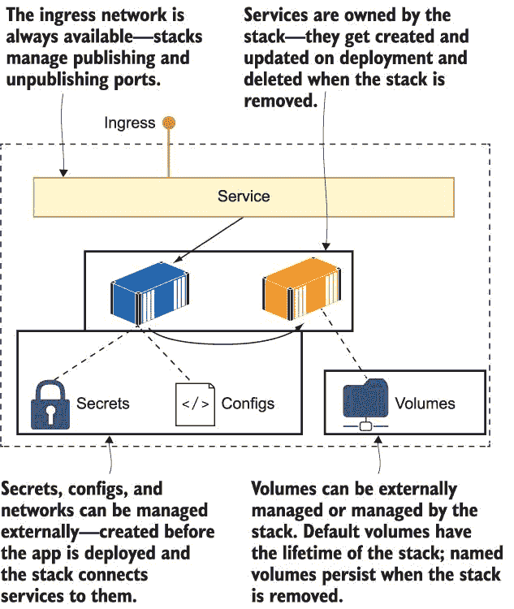

图 13.13 Docker Swarm 资源如何通过堆栈部署进行管理

从这个例子中我们可以得到一些启示。你已经在练习中处理了一些这些场景，但我们将完成这一章，使它们变得清晰：

+   Swarm 可以创建和删除卷。如果服务镜像指定了默认卷，堆栈将创建一个默认卷，并且当堆栈被删除时，该卷将被删除。如果您为堆栈指定了命名卷，则在部署时将创建它，但在删除堆栈时不会删除它。

+   当外部文件上传到集群时，会创建机密和配置。它们存储在集群数据库中，并交付到需要它们的容器中。它们是实际上写一次读多次的对象，并且不能更新。在 Swarm 中存储应用程序配置的管理员过程与应用程序部署过程是分开的。

+   网络可以独立于应用程序进行管理，管理员可以明确为应用程序创建网络，或者由 Swarm 管理，Swarm 将在必要时创建和删除它们。每个堆栈都将部署一个网络以附加服务，即使配置文件中没有指定也是如此。

+   当堆栈部署时，会创建或删除服务，并且在它们运行时，Swarm 会持续监控它们以确保达到期望的服务级别。失败健康检查的副本将被替换，当节点离线时丢失的副本也是如此。

堆栈是由组成应用程序的组件的逻辑组，但它不会映射出服务之间的依赖关系图。当您将堆栈部署到集群时，管理器将在集群中尽可能快地启动尽可能多的服务副本。您不能限制集群在启动另一个服务之前完全启动一个服务，如果可以，这可能会破坏部署性能。相反，您需要假设您的组件将以随机顺序启动，并在您的镜像中捕获健康和依赖性检查，以便如果应用程序无法运行，容器可以快速失败。这样，集群可以通过重启或替换容器来修复损坏，从而实现自我修复的应用程序。

## 13.6 实验室

实验室！这个实验将让您获得更多编写 Compose 文件以定义应用程序并将其作为堆栈在 Swarm 上部署的经验。我希望您为第九章中的图像库应用程序编写一个生产部署，该部署应在一个符合这些要求的单个 Compose 文件中：

+   访问日志 API 使用镜像`diamol/ch09-access-log`。它是一个仅由 Web 应用程序访问的内部组件，并且应该在三个副本上运行。

+   NASA API 使用镜像`diamol/ch09-image-of-the-day`。它应该在端口 8088 上公开访问，并运行在五个副本上以支持预期的入站负载。

+   Web 应用程序使用镜像`diamol/ch09-image-gallery`。它应该在标准的 HTTP 端口 80 上可用，并运行在两个副本上。

+   所有组件都应该有合理的 CPU 和内存限制（这可能需要几轮部署来确定安全最大值）。

+   当您部署堆栈时，应用程序应该能够运行。

使用此应用无需担心卷积、配置或秘密，因此它应该是一个相当简单的 Compose 文件。一如既往，您可以在 GitHub 上找到我的解决方案作为参考：*[`github.com/sixeyed/diamol/blob/master/ch13/lab/README.md`](https://github.com/sixeyed/diamol/blob/master/ch13/lab/README.md)* .
