# 14 自动化升级和回滚的发布

更新容器化应用程序应该是一个零停机时间的过程，由容器编排器管理。你通常在集群中有额外的计算能力，管理者可以使用这些能力在更新期间安排新的容器，并且你的容器镜像有健康检查，这样集群就知道新组件是否失败。这些都是零停机更新所必需的，你已经在第十三章中通过 Docker Swarm 堆栈部署的过程进行了这个过程。更新过程高度可配置，我们将在本章中花时间探索配置选项。

调整更新配置可能听起来像是一个你可以安全跳过的主题，但根据我自己的经验，如果你不了解如何进行滚动发布以及如何修改默认行为，这将会给你带来痛苦。本章专注于 Docker Swarm，但所有编排器都有一个分阶段滚动发布过程，其工作方式类似。了解更新和回滚的工作原理让你能够尝试找到适合你应用程序的设置，这样你就可以频繁地将应用程序部署到生产环境中，有信心更新要么成功执行，要么自动回滚到上一个版本。

## 14.1 使用 Docker 的应用程序升级过程

Docker 镜像是一种表面上简单的打包格式。你构建你的镜像，在容器中运行你的应用程序，感觉上你可以让它一直运行，直到你有新版本的应用程序要部署，但你需要考虑至少四种部署周期。首先是你的应用程序及其依赖项，然后是编译你的应用程序的 SDK，然后是运行应用程序的平台，最后是操作系统本身。图 14.1 显示了一个为 Linux 构建的.NET Core 应用程序的示例，实际上有六个更新周期。

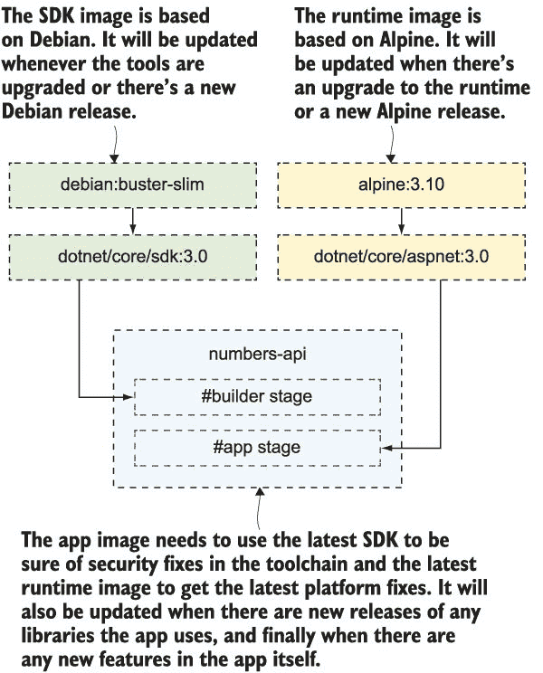

图 14.1 当你包含你使用的其他镜像时，你的 Docker 镜像有很多依赖项。

你可以看到，你确实应该计划每月部署更新，以覆盖操作系统更新，并且你应该能够随时启动一个临时的部署，以覆盖你应用程序使用的库中的安全修复。这就是为什么你的构建管道是项目的核心。每次源代码发生变化时，你的管道都应该运行——这将处理新应用程序功能和应用程序依赖项的手动更新。它还应该每晚构建，确保你总是有一个基于最新 SDK、应用程序平台和操作系统更新的可发布镜像。

无论应用程序是否发生变化，每月发布一次听起来可能很可怕，尤其是在发布仪式在时间和资源方面成本极高的组织中，你一年只做三次。但这种方法能让整个组织拥有更健康的心态：发布更新是一件无聊的事情，它经常发生，通常不需要任何人的参与。当你有定期的自动化发布时，每次更新都会增强对流程的信心，而且在你意识到之前，你就可以在完成新功能后立即发布，而不是等待下一个部署窗口。

只有在发布成功时，你才能获得这种信心，这就是为什么应用程序健康检查变得至关重要的原因。没有它们，你没有一个自我修复的应用程序，这意味着你不能进行安全更新和回滚。我们将通过本章中第八章的随机数应用来探讨这一点，利用你在第十章中学到的 Docker Compose 覆盖功能。这将使我们能够保持一个干净的 Compose 文件，其中包含核心应用程序定义，一个单独的 Compose 文件用于生产规范，以及用于更新的附加文件。但是，Docker 不支持从多个 Compose 文件中进行堆栈部署，所以首先你需要使用 Docker Compose 将覆盖文件合并在一起。

现在试试吧！让我们先部署随机数应用的第一个版本。我们将运行一个单独的 Web 容器和六个 API 容器的副本，这将帮助我们了解更新是如何分阶段实施的。你需要以 Swarm 模式运行；然后合并一些 Compose 文件并部署堆栈：

` cd ch14/exercises`  ` # 将核心 Compose 文件与生产覆盖文件合并:` ` docker-compose -f ./numbers/docker-compose.yml -f ./numbers/prod.yml config > stack.yml`  ` # 部署合并后的 Compose 文件:` ` docker stack deploy -c stack.yml numbers`  ` # 显示堆栈中的服务:` ` docker stack services numbers`

你可以在图 14.2 中看到我的输出--Docker Compose 命令将核心 Compose 文件与生产覆盖文件合并。使用 Docker Compose 合并覆盖文件很有用，因为它还验证了内容，这可能是持续部署管道的一部分。堆栈部署创建了一个覆盖网络和两个服务。

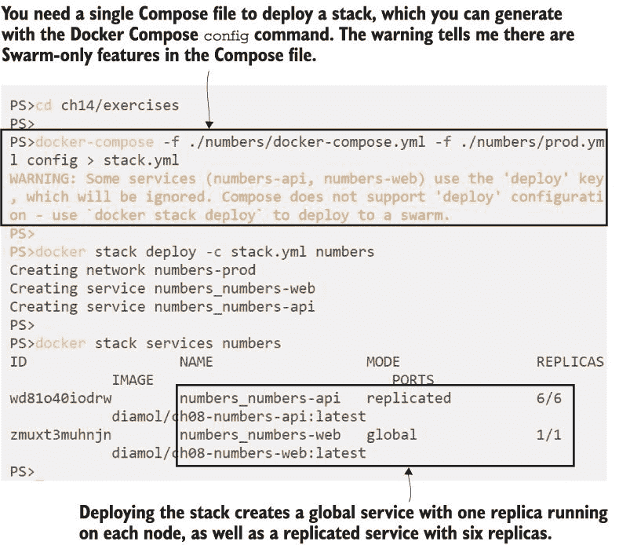

图 14.2 通过首先合并它们来从多个 Compose 文件部署堆栈

图 14.2 中您看到的堆栈有一个新特点--API 服务以正常复制模式运行，但 Web 服务以全局模式运行。全局服务在每个 Swarm 节点上运行一个副本，您可以使用此配置来绕过入口网络。在某些场景中，如反向代理，这是一个好的部署选项，但我在这里使用它，以便您可以看到它与复制服务在推出时的不同。Web 服务的设置在列表 14.1 中（这是 `prod.yml` 覆盖文件的摘录）。

列表 14.1 使用主机网络而不是入口网络的全球服务

`   numbers-web:` `       ports:` `           - target: 80` `               published: 80` `               mode: host` `       deploy:` `             mode: global`

在此新配置中，有两个字段用于配置全局服务：

+   `mode:` `global` -- 在 `deploy` 部分的此设置配置部署在 Swarm 的每个节点上运行一个容器。副本的数量将等于节点的数量，如果有任何节点加入，它们也将为服务运行一个容器。

+   `mode:` `host` -- 在 `ports` 部分的此设置配置服务直接绑定到主机的 80 端口，而不使用入口网络。如果您的 Web 应用程序足够轻量级，只需要每个节点一个副本，并且网络性能至关重要，您不想在入口网络中引入路由开销，这可以是一个有用的模式。

此部署使用原始应用程序镜像，这些镜像没有任何健康检查，并且这是 API 存在错误的那个应用程序，几次调用后就会停止工作。您可以通过 http: */ /* localhost（或从具有 Windows 容器的外部机器）浏览，并且可以请求大量的随机数字，因为调用在六个 API 服务副本之间进行负载均衡。最终它们都会崩溃，然后应用程序将停止工作并且永远不会自行修复--集群不会替换容器，因为它不知道它们是不健康的。这并不是一个安全的位置，因为如果您在没有健康检查的情况下推出更新版本，集群也无法知道更新是否成功。

因此，我们将继续部署应用程序镜像的版本 2，该版本内置了健康检查。v2 Compose 覆盖文件使用 v2 镜像标签，还有一个覆盖配置，用于设置健康检查的触发频率和触发纠正操作的失败次数。这位于正常的 `healthcheck` 块中，它在 Docker Compose 中的工作方式与之前相同，但 Compose 不会为您执行纠正操作。当此版本的应用程序部署到 Docker Swarm 时，集群将修复 API。当您破坏 API 容器时，它们将失败健康检查并被替换，然后应用程序将再次开始工作。

现在试试看。您需要将新的 v2 Compose 覆盖文件与健康检查和生产覆盖文件一起加入，以获取您的堆栈部署 YAML 文件。然后您只需再次部署堆栈即可：

` # 将健康检查和 v2 覆盖文件添加到之前的文件中：` ` docker-compose -f ./numbers/docker-compose.yml -f ./numbers/prod.yml -f ./numbers/prod-healthcheck.yml -f ./numbers/v2.yml --log-level ERROR config > stack.yml`  ` # 更新堆栈：` ` docker stack deploy -c stack.yml numbers`  ` # 检查堆栈的副本：` ` docker stack ps numbers`

此部署更新了 Web 和 API 服务到其镜像的版本 2。服务更新始终作为分阶段滚动发布完成，默认情况下是在启动新容器之前停止现有容器。这对于使用主机模式端口的全局服务来说是有意义的，因为新容器无法启动，直到旧容器退出并释放端口。如果您的应用程序期望最大扩展级别，这也可能对复制服务有意义，但您需要意识到，在更新期间，服务将在旧容器关闭和替换启动时处于容量不足状态。您可以在图 14.3 中看到这种行为。

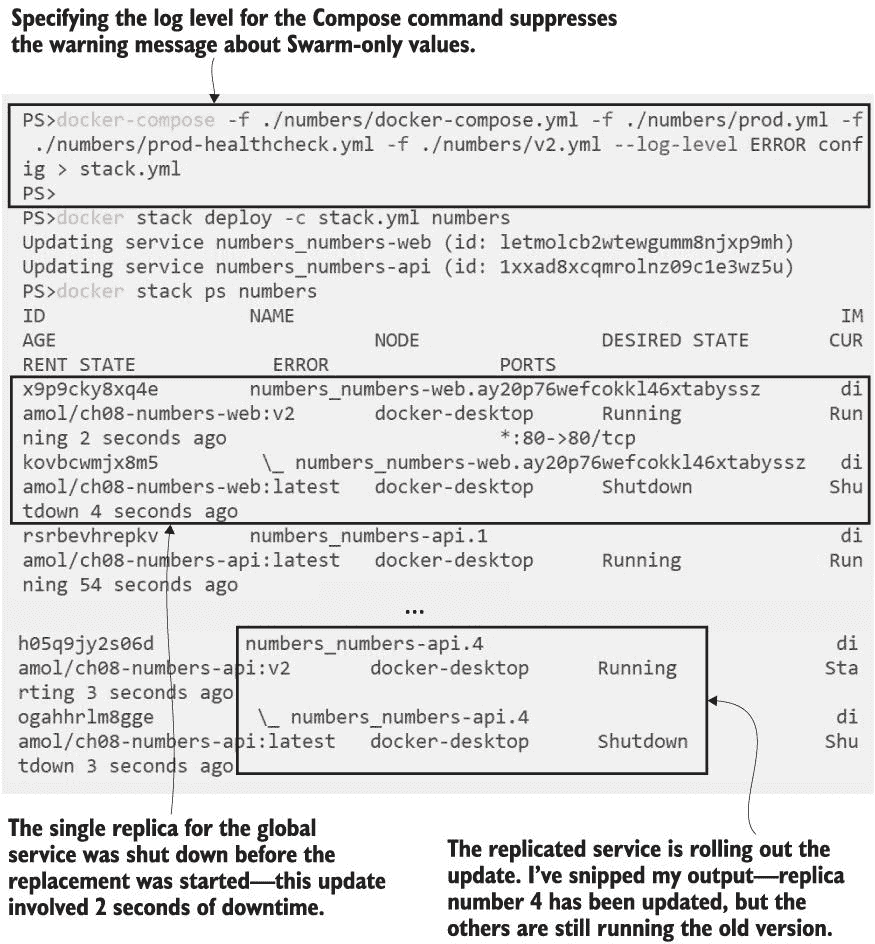

图 14.3 使用默认配置部署服务更新--每次只更新一个副本。

Docker Swarm 在服务更新的滚动发布中使用了谨慎的默认设置。它一次更新一个副本，并在移动到下一个副本之前确保容器正确启动。服务通过在启动替换容器之前停止现有容器来滚动发布，如果更新失败因为新容器无法正确启动，则滚动发布会暂停。当以权威的语气在书中呈现时，这似乎都是合理的，但实际上它相当奇怪。为什么在不知道新容器是否可以正常工作的情况下，默认先删除旧容器再启动新容器？为什么暂停失败的滚动发布，这可能会让您留下一个半损坏的系统，而不是自动回滚？幸运的是，滚动发布可以通过更合理的选项进行配置。

## 14.2 使用 Compose 配置生产滚动发布

随机数应用程序的版本 2 由于健康检查而具有自我修复功能。如果您通过 Web UI 请求大量随机数，API 副本都会崩溃，但等待大约 20 秒后，Swarm 会替换它们，应用程序将重新开始工作。这是一个极端的例子，但在实际应用程序偶尔出现故障的情况下，您可以看到集群如何根据健康检查监控容器并保持应用程序在线。

版本 2 的滚动发布使用了默认的更新配置，但我想 API 的滚动发布更快更安全。这种行为在 Compose 文件中服务的 `deploy` 部分被设置。列表 14.2 显示了我想要应用于 API 服务的 `update_config` 部分（这是 `prod-update-config.yml` 文件的一个摘录）。

列表 14.2 指定应用程序部署的自定义配置

`   numbers-api:` `       deploy:` `           update_config:` `               parallelism: 3` `               monitor: 60s` `               failure_action: rollback` `                 order: start-first`

更新配置部分的四个属性会改变部署流程的工作方式：

+   `parallelism` 表示并行替换的副本数量。默认值为 1，因此更新是逐个容器进行部署。这里显示的设置将同时更新三个容器。这会加快部署速度，并增加发现失败的机会，因为运行的新副本数量更多。

+   `monitor` 表示 Swarm 在继续部署之前等待监控新副本的时间段。默认值为 0，如果你的镜像有健康检查，你绝对需要更改这个设置，因为 Swarm 将会监控健康检查这个时间段。这增加了部署的信心。

+   `failure_action` 表示在 `monitor` 期间容器无法启动或健康检查失败时采取的操作。默认操作是暂停部署；我在这里将其设置为自动回滚到上一个版本。

+   `order` 表示替换副本的顺序。默认为 `stop-first`，这确保运行中的副本数量永远不会超过所需数量，但如果你的应用程序可以处理额外的副本，则 `start-first` 更好，因为新副本会在旧副本被移除之前创建和检查。

这种设置通常是大多数应用程序的良好实践，但你可能需要根据自己使用情况进行调整。并行度可以设置为全副本数量的约 30%，以便更新发生得更快，但你应该有一个足够长的监控时间段来运行多个健康检查，这样下一组任务只有在前一次更新成功后才会更新。

有一个重要的事情需要理解：当你向堆栈部署更改时，首先应用更新配置。然后，如果你的部署还包括服务更新，部署将使用新的更新配置进行。

现在尝试一下。下一次部署将设置更新配置并将服务更新到标签 v3。副本部署将使用新的更新配置：

` docker-compose -f ./numbers/docker-compose.yml -f ./numbers/prod.yml -f ./numbers/prod-healthcheck.yml -f ./numbers/prod-update-config.yml -f ./numbers/v3.yml --log-level ERROR config > stack.yml`  ` docker stack deploy -c stack.yml numbers`  ` docker stack ps numbers`

当您进行几次更新后，您会发现`stack` `ps`的副本列表变得难以管理。它显示了每个部署的所有副本，因此原始容器和已更新的 v2 容器以及新的 v3 副本都会显示出来。我在图 14.4 中裁剪了我的输出，但如果您在您的输出中向下滚动，您会看到 API 服务的三个副本已被更新，并在下一个集合更新之前正在被监控。

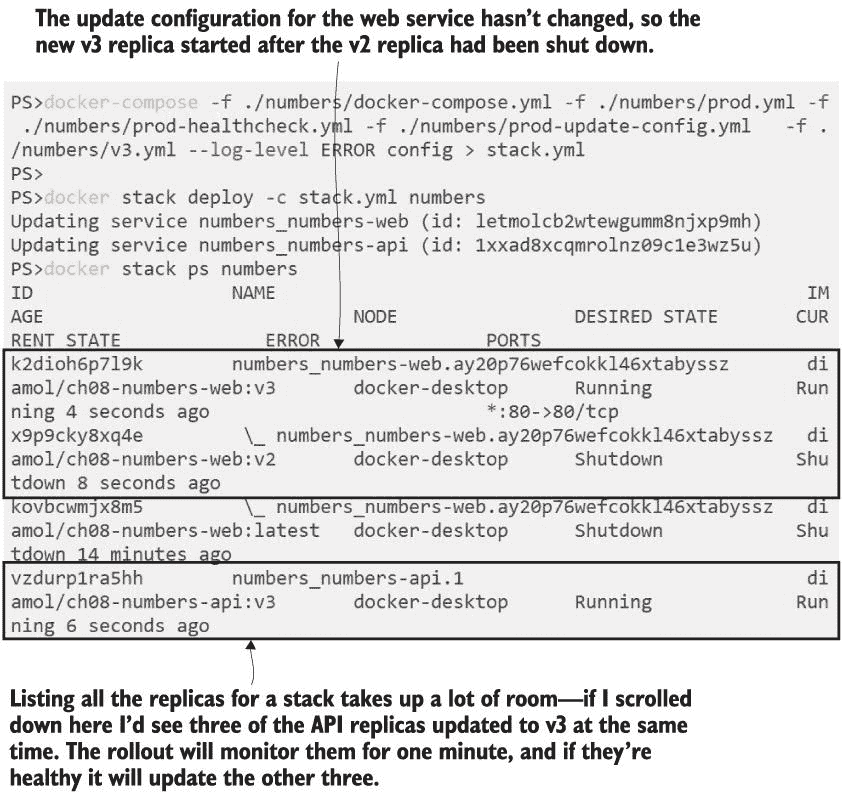

图 14.4 更新堆栈的新更新配置--滚动设置立即生效。

有一种更整洁的方式来报告 Swarm 服务，该服务可以识别服务规范、更新配置和最新的更新状态。这是使用带有`pretty`标志的`inspect`命令。由堆栈创建的服务使用命名约定`{stack-name}_{service-name}`，因此您可以直接处理堆栈服务。

现在尝试一下 检查随机数 API 服务以查看更新状态：

` docker service inspect --pretty numbers_numbers-api`

您可以在图 14.5 中看到我的输出。我已经再次进行了裁剪，只显示主要的信息部分，但如果您在输出中滚动，您也会看到健康检查配置、资源限制和更新配置。

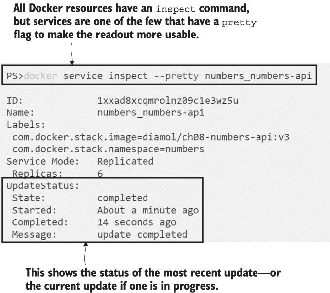

图 14.5 检查服务显示了当前配置和最新的更新状态。

当您更改默认更新配置设置时，您需要注意的一个重要事项是，您需要将这些设置包含在每次后续部署中。我的 v3 部署添加了自定义设置，但如果我不在下一个部署中包含相同的更新覆盖文件，Docker 会将服务回滚到默认更新设置。Swarm 首先更改更新配置，因此它会将更新配置重置为默认值，然后逐个副本推出下一个版本。

Swarm 滚动更新的更新配置设置有一个相同的集合适用于回滚，因此您也可以配置每次同时更新多少个副本以及在每个集合之间等待多长时间以进行自动回滚。这些可能看起来像是微调，但对于生产部署来说，指定更新和回滚过程并使用您的应用程序进行规模测试是非常重要的。您需要确信您可以在任何时间推出更新，并且它将快速应用，但在过程中有足够的检查以便在出现问题时自动回滚。您可以通过使用这些配置设置处理故障场景来获得这种信心。

## 14.3 配置服务回滚

没有名为 `docker` `stack` `rollback` 的命令；只有单个服务可以被回滚到之前的状态。除非出了严重错误，否则你通常不需要手动启动服务回滚。当集群执行滚动更新并识别到新副本在监控期间失败时，回滚应该自动发生。如果发生这种情况，并且你的配置正确，你直到疑惑为什么新功能没有显示出来时才会意识到回滚已经发生。

应用部署是导致停机时间的主要原因，因为即使一切自动化，仍然有人员编写自动化脚本和应用程序 YAML 文件，有时事情会被遗忘。我们可以通过随机数应用来体验这一点——一个新版本已经准备好部署，但它有一个必须设置的配置选项。如果没有设置，API 将会立即失败。

现在试试看。运行随机数应用的 v5 版本（v4 是我们在第十一章中用来演示持续集成的版本，但它使用了与 v3 相同的代码）。这次部署将会失败，因为 v5 需要的配置设置没有在 Compose 文件中提供：

` # 将多个 Compose 文件合并` ` docker-compose -f ./numbers/docker-compose.yml -f ./numbers/prod.yml -f ./numbers/prod-healthcheck.yml -f ./numbers/prod-update-config.yml -f ./numbers/v5-bad.yml config > stack.yml`  ` # 部署更新:` ` docker stack deploy -c stack.yml numbers`  ` # 等待一分钟并检查服务状态:` ` docker service inspect --pretty numbers_numbers-api`

这是一个典型的失败部署。新的 API 副本被成功创建并启动，但它们在健康检查中失败了——健康检查配置设置为每两秒运行一次，在标记容器为不健康之前进行两次重试。如果在滚动更新的监控期间，任何新的副本报告为不健康，这将触发回滚操作，我已经为这个服务设置了自动回滚。如果你在检查服务之前等待大约 30 秒，你将看到类似于图 14.6 中的输出，表明更新已经回滚，服务正在运行六个 v3 镜像的副本。

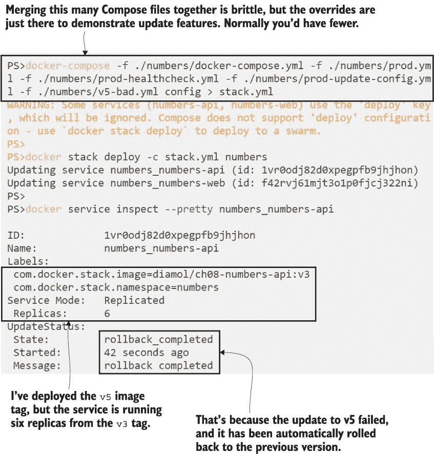

图 14.6 当你正确配置了配置时，失败的更新会被识别并回滚。

部署出错时没有乐趣，但像这样的失败更新会自动回滚，至少能保持你的应用运行。使用`start-first`部署策略有助于这一点。如果我使用默认的`stop-first`，那么在三个 v3 副本停止、三个 v5 副本启动并失败期间，会有一个容量减少的时期。在新副本标记自己为不健康和回滚完成所需的时间内，API 将只有三个活动副本。用户不会看到任何错误，因为 Docker Swarm 不会将流量发送到不健康的副本，但 API 将运行在 50%的容量。

此部署使用默认的回滚配置，这与更新默认配置相同：一次一个任务，使用`stop-first`策略，零监控时间，如果替换副本失败，回滚会暂停。我发现这太谨慎了，因为在你的应用运行正常而部署破坏了它的情况下，你通常希望尽可能快地回滚到之前的状态。列表 14.3 显示了此服务的首选回滚配置（来自`prod-rollback-config.yml`）：

列表 14.3 快速回滚失败更新的配置

`   numbers-api:` `       deploy:` `           rollback_config:` `               parallelism: 6` `               monitor: 0s` `               failure_action: continue` `                 order: start-first`

这里的目标是尽可能快地恢复——并行度为 6，所以所有失败的副本将一次性替换，使用`start-first`策略，这样旧版本的副本将在回滚担心关闭新版本副本之前启动。没有监控期，如果回滚失败（因为副本无法启动），它仍然会继续。这是一个激进的回滚策略，它假设上一个版本是好的，当副本启动时将再次变得良好。

现在试试看 我们将再次尝试 v5 更新，并指定自定义回滚配置。这次部署仍然会失败，但回滚将会更快，使应用回到 v3 API 的全容量状态：

` # 将更多的 Compose 文件合并在一起：` ` docker-compose -f ./numbers/docker-compose.yml -f ./numbers/prod.yml -f ./numbers/prod-healthcheck.yml -f ./numbers/prod-update-config.yml -f ./numbers/prod-rollback-config.yml -f ./numbers/v5-bad.yml config > stack.yml`  ` # 再次使用新的回滚配置部署更新：` ` docker stack deploy -c stack.yml numbers`  ` # 等待，你会看到它再次回滚：` ` docker service inspect --pretty numbers_numbers-api`

这次你会看到回滚发生得更快，但只是略微快一些，因为 API 服务中只有少数副本，所有副本都在我的单个节点上运行。你可以看到在一个可能跨越 20 个节点运行 100 个副本的更大部署中，这有多么重要——逐个回滚每个副本将延长你的应用在低于容量或不稳定状态下运行的时间。你可以在图 14.7 中看到我的输出——这次我足够快，能够捕捉到回滚刚刚触发时的状态，所以状态显示回滚已经开始。

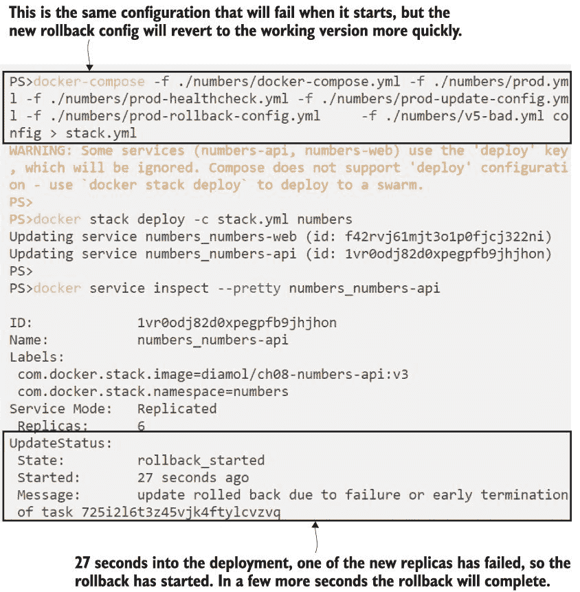

图 14.7 指定自定义回滚设置意味着失败的部署可以更快地得到修复。

当你自己运行这个操作时，请在回滚完成后查看完整的服务配置——你会看到回滚配置已重置为默认值。这肯定会引起混淆，因为你可能会认为回滚配置没有被应用。但实际上，这是因为整个服务配置都被回滚了，这包括回滚设置——副本按照新策略回滚，然后回滚策略也被回滚。下次你部署时，你需要确保继续添加更新和回滚配置，否则它们将被更新回默认设置。

这就是拥有多个覆盖文件变得危险的地方，因为它们都是必要的，并且它们都需要按照正确的顺序指定。通常你不会将一个环境的设置拆分到多个文件中；我只是这样做，以便使我们的更新和回滚过程更容易跟踪。通常，你会有一个核心 Compose 文件，一个环境覆盖文件，以及可能的一个版本覆盖文件。我们将采取这种方法进行最终部署，修复 v5 问题，并使应用恢复正常工作。

现在试试看 v5 更新失败并回滚了，所以我们召集了团队，意识到我们遗漏了一个关键的配置设置。`v5.yml` 覆盖文件添加了那个设置，而 `prod-full.yml` 覆盖文件将所有生产设置放在一个地方。现在我们可以成功部署 v5：

` # 这才是正确的做法 - 所有自定义配置都在 prod-full 文件中：` ` docker-compose -f ./numbers/docker-compose.yml -f ./numbers/prod-full.yml -f ./numbers/v5.yml --log-level ERROR config > stack.yml`  ` # 部署 v5 的工作版本：` ` docker stack deploy -c stack.yml numbers`  ` # 稍等片刻，检查部署是否成功：` ` docker service inspect --pretty numbers_numbers-api`

我的输出在图 14.8 中。我在部署和服务列表之间等待了几分钟，以确保更新已经成功，并且没有回滚。

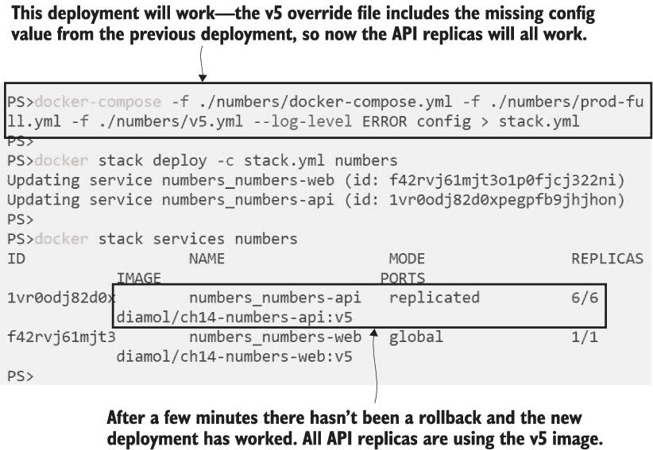

图 14.8 修复应用配置后的成功部署

现在，你已经在所有荣耀中运行了 v5——它实际上和之前的简单演示应用程序相同，但我们可以用它来说明关于回滚的最后一个要点。应用程序现在运行良好，健康检查已经到位，所以如果你继续使用 API 并破坏副本，它们将被替换，应用程序将重新开始工作。失败的健康检查不会触发最后一次更新的回滚；它们只会触发替换副本，除非失败发生在更新的监控期间。如果你部署 v5，并在 60 秒的监控期间破坏 API 容器，这将触发回滚。图 14.9 显示了从 v3 到 v5 更新的更新和回滚过程。

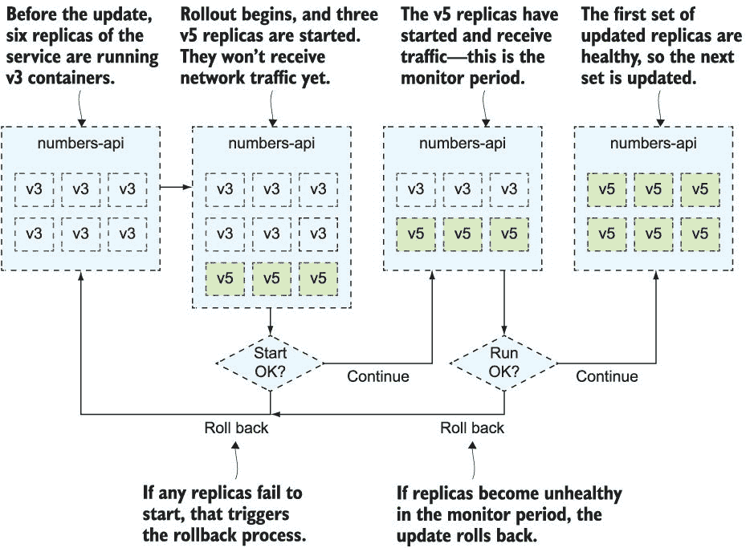

图 14.9 这看起来可疑地像流程图，但它只是建模更新过程的有用方式。

更新和回滚配置到此结束。这实际上只是在你的 Compose 文件部署部分设置几个值，并测试不同的变体以确保你的更新快速且安全，如果出现问题，它们可以快速回滚。这有助于你最大化应用程序的运行时间。剩下要做的就是了解当集群中的节点出现停机时，这种运行时间会受到怎样的影响。

## 14.4 管理集群的停机时间

容器编排器将一堆机器转换成一个强大的集群，但最终运行容器的是这些机器，它们容易出现停机。磁盘、网络和电源都可能在某个时刻出现故障——你的集群越大，出现故障的频率就越高。集群能够通过大多数故障来保持你的应用程序运行，但一些未计划的故障需要主动干预，如果你有计划的停机，你可以让 Swarm 更容易地绕过它们。

如果你想要跟随本节内容，你需要一个多节点 Swarm。如果你乐意构建虚拟机并在其上安装 Docker，你可以自己设置，或者你可以使用在线沙盒。Play with Docker 是一个不错的选择——你可以创建一个多节点 Swarm，并练习部署和节点管理，而不需要任何额外的机器。浏览到*[`labs.play-with-docker.com`](https://labs.play-with-docker.com)*，使用你的 Docker Hub ID 登录，然后点击添加新实例以将虚拟 Docker 服务器添加到你的在线会话中。我已经在我的会话中添加了五个实例，我将使用它们作为我的 Swarm。

现在尝试一下 启动你的 Play with Docker 会话并创建五个实例——你将在左侧导航中看到它们，你可以点击选择它们。在主窗口中，你会看到一个连接到你选择的节点的终端会话。

` # 选择节点 1 并使用节点的 IP 地址初始化 Swarm:` ` ip=$(hostname -i)` ` docker swarm init --advertise-addr $ip`  ` # 显示将管理器和工作节点加入 Swarm 的命令:` ` docker swarm join-token manager` ` docker swarm join-token worker`  ` # 选择节点 2 并粘贴管理器加入命令，然后在节点 3 上执行相同的操作` ` # 选择节点 4 并粘贴工作节点加入命令，然后在节点 5 上执行相同的操作` ` # 回到节点 1，确保所有节点都准备就绪:` ` docker node ls`

这为您提供了一个完全可丢弃的 Swarm。您可以造成尽可能多的损害，然后只需关闭会话，所有这些节点都将消失（它们实际上是运行 Docker-in-Docker 的容器，具有许多智能来管理会话和网络）。您可以在图 14.10 中看到我的输出，Swarm 已经准备就绪。

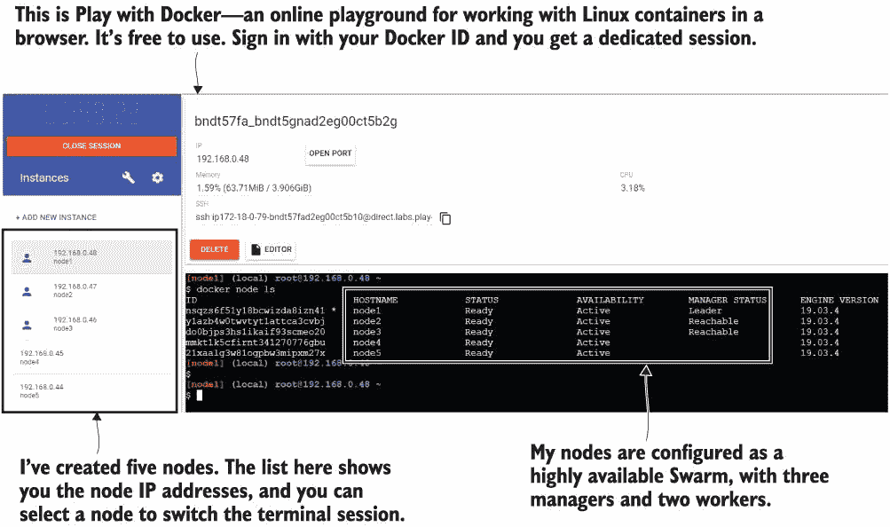

图 14.10 使用 Play with Docker 中的可丢弃实例初始化多节点 Swarm

首先，让我们从最简单的情况开始——您需要关闭一个节点以在服务器上进行操作系统更新或其他基础设施任务。该节点可能正在运行容器，您希望它们能够优雅地关闭，在其他节点上替换，并且让您的机器进入维护模式，这样 Docker 就不会在您需要重启的任何周期中尝试调度任何新的容器。Swarm 中的节点维护模式称为排空模式，您可以将管理器或工作节点放入排空模式。

现在尝试一下 切换到您的节点 1 管理器的终端会话，并将其他两个节点设置为排空模式：

` # 将一个工作节点和一个管理节点设置为排空模式:` ` docker node update --availability drain node5` ` docker node update --availability drain node3`  ` # 检查节点:` ` docker node ls`

对于工作节点和管理节点，排空模式意味着不同的事情。在两种情况下，节点上运行的所有副本都将关闭，并且不会为该节点调度更多副本。尽管如此，管理节点仍然是管理组的一部分，因此它们仍然同步集群数据库，提供对管理 API 的访问，并且可以是领导者。图 14.11 显示了我的集群中有两个排空节点。

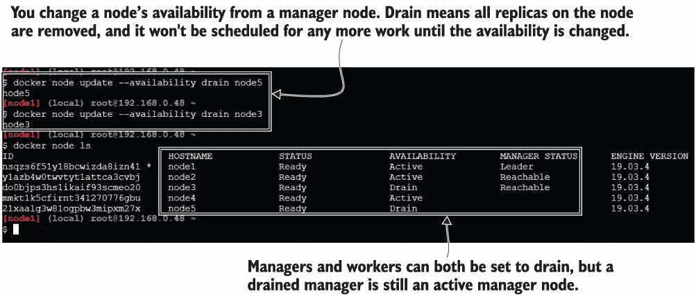

图 14.11 进入排空模式会移除所有容器，并允许您对节点进行维护。

这关于领导者管理器是什么意思？您需要多个管理器来实现高可用性，但这是一种活动-被动模型。只有一个管理器实际上在控制集群，那就是领导者。其他管理器保留集群数据库的副本，它们可以处理 API 请求，并且在领导者失败时可以接管。这发生在剩余管理器之间的选举过程中，需要多数投票，为此您始终需要奇数个管理器——对于较小的集群通常是三个，对于大型集群通常是五个。如果您永久丢失一个管理节点，发现自己有偶数个管理器，可以将工作节点提升为管理器。

现在试试看 在 Docker 中模拟节点故障并不容易，但你可以连接到领导者并手动将其从 Swarm 中移除。然后剩下的一个管理者成为领导者，你可以提升一个工作节点以保持管理者的奇数数量：

` # 在节点 1 上强制离开 Swarm：` ` docker swarm leave --force`  ` # 在节点 2 上使工作节点再次可用：` ` docker node update --availability active node5`  ` # 提升工作节点为管理者：` ` docker node promote node5`  ` # 检查节点：` ` docker node ls`

节点可以以两种方式离开 Swarm——管理者可以使用`node rm`命令启动它，或者节点本身可以使用`swarm leave`命令执行。如果节点自行离开，那与节点离线的情况类似——Swarm 管理者认为它应该还在那里，但它无法访问。你可以在图 14.12 的输出中看到这一点。原始节点 1 仍然被列为管理者，但状态是`Down`，管理者状态是`Unreachable`。

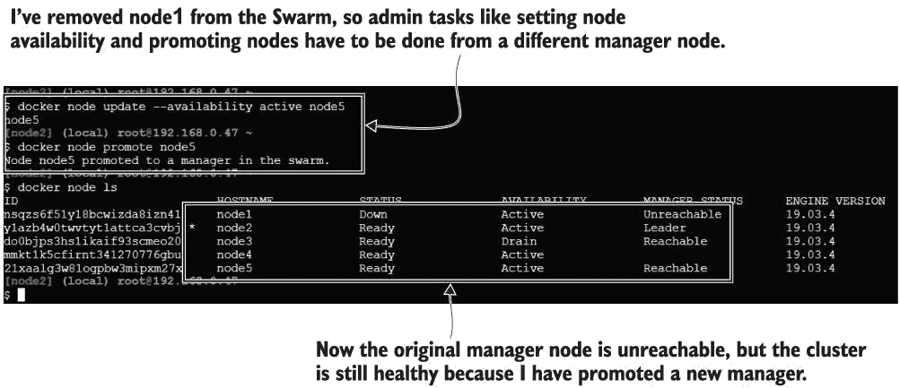

图 14.12 节点管理确保即使节点离线，Swarm 也能完全可用。

现在，Swarm 又有三个管理者了，这给它提供了高可用性。如果节点 1 意外离线，当它重新上线时，我可以通过运行`node demote`命令将其他管理者中的一个返回到工作池。这些几乎是你管理 Docker Swarm 集群所需的所有命令。

我们将结束几个不太常见的场景，这样你就知道如果你遇到它们时 Swarm 会如何表现：

+   所有管理者都离线 —— 如果所有管理者都离线但工作节点仍在运行，那么你的应用程序仍在运行。如果没有管理者，入口网络和工作节点上的所有服务副本将以相同的方式工作，但现在没有任何东西可以监控你的服务，所以如果容器失败，它将不会被替换。你需要修复这个问题，并将管理者上线，以使集群恢复健康。

+   领导者和除了一个管理者之外的所有管理者都离线 —— 如果除了一个管理者节点之外的所有管理者节点都离线，而剩下的管理者不是领导者，那么你可能会失去对集群的控制。管理者必须投票选举新的领导者，如果没有其他管理者，则无法选举领导者。你可以通过在剩下的管理者上运行带有`force-new-cluster`参数的`swarm init`命令来修复这个问题。这使得该节点成为领导者，但保留了所有集群数据和所有运行的任务。然后你可以添加更多管理者以恢复高可用性。

+   平衡副本以实现均匀分布 —— 当你添加新节点时，服务副本不会自动重新分配。如果你使用新节点增加了集群的容量，但没有更新任何服务，新节点将不会运行任何副本。你可以通过运行`service update --force`来重新平衡副本，使它们在集群周围均匀分布，而无需更改任何其他属性。

## 14.5 理解 Swarm 集群中的高可用性

在你的应用程序部署中，有多个层次需要考虑高可用性。我们已经在本章中讨论了很多：健康检查告诉集群你的应用程序是否正在运行，并且它会替换失败的容器以保持应用程序在线；多个工作节点为容器提供额外的容量，以便在节点离线时重新调度；多个管理者为调度容器和监控工作节点提供冗余。还有一个需要考虑的最终区域——集群运行的数据中心。

我只是简要地介绍这部分内容，以便完成本章，因为人们常常试图通过构建跨越几个数据中心的一个单一集群来实现区域之间的高可用性。从理论上讲，你可以这样做——你可以在数据中心 A 创建管理者，并在数据中心 A、B 和 C 中创建工作节点。这确实简化了你的集群管理，但问题是网络延迟。Swarm 中的节点非常健谈，如果 A 和 B 之间突然出现网络延迟，管理者可能会认为所有 B 节点都离线了，并将所有容器重新调度到 C 节点上。而且这些情况只会变得更糟，可能会出现脑裂现象：不同区域中的多个管理者都认为自己是领导者。

如果你真的需要在区域故障时保持应用程序运行，唯一安全的方法是使用多个集群。这会增加你的管理开销，并且存在集群和它们运行的应用程序之间的漂移风险，但这些是可管理的问题，与网络延迟不同。图 14.13 显示了这种配置的外观。

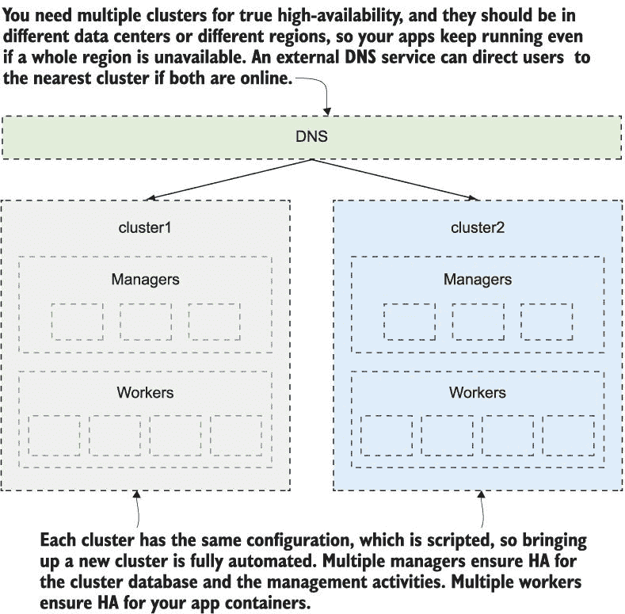

图 14.13 要实现数据中心冗余，需要在不同区域拥有多个集群。

## 14.6 实验室

这次实验室回到图像库应用程序，轮到你来构建一个具有合理的推出和回滚配置的堆栈部署，用于 API 服务。但是有一个转折——API 组件的 Docker 镜像中没有内置健康检查，所以你需要考虑如何在服务规范中添加健康检查。以下是要求：

+   编写一个堆栈文件，使用以下容器镜像部署图像库应用程序：`diamol/ch04-access-log`，`diamol/ch04-image-of-the-day`，和`diamol/ch04-image-gallery`。

+   API 组件是`diamol/ch04-image-of-the-day`，它应该运行四个副本，应该指定一个健康检查，并且应该使用一个快速但安全的更新配置和一个仅快速回滚的配置。

+   当你部署了应用程序后，准备另一个更新服务的堆栈文件，以更新以下镜像：`diamol/ch09-access-log`，`diamol/ch09-image-of-the-day`，和`diamol/ch09-image-gallery`。

+   部署你的堆栈更新，并确保 API 组件按照你预期的策略推出，并且不会因为不正确的健康检查而回滚。

这件事应该很有趣，如果你觉得这类事情有趣的话。无论如何，我的解决方案已经上传到 GitHub 上，你可以在通常的位置查看：*[`github.com/sixeyed/diamol/blob/master/ch14/lab/README.md`](https://github.com/sixeyed/diamol/blob/master/ch14/lab/README.md)*。祝更新愉快！
