# 15 配置 Docker 以实现安全的远程访问和 CI/CD

Docker 命令行提供了一个无缝的工作方式来处理容器，很容易忘记命令行本身并不真正做任何事情——它只是将指令发送到运行在 Docker 引擎上的 API。将命令行与引擎分离有两个主要好处——其他工具可以消费 Docker API，因此命令行并不是管理容器的唯一方式，你还可以配置你的本地命令行以与运行 Docker 的远程机器协同工作。你可以在不离开办公桌的情况下，从在笔记本电脑上运行容器切换到管理拥有数十个节点的集群，使用你习惯的所有 Docker 命令，这真是令人惊叹。

远程访问是管理测试环境或调试生产中问题的方法，也是你启用 CI/CD 管道中持续部署部分的方法。在管道的持续集成阶段成功完成后，你将有一个可能发布的版本的应用存储在 Docker 注册库中。持续部署是管道的下一阶段——连接到远程 Docker 引擎并部署应用的新版本。这一阶段可能是一个测试环境，它将运行一系列集成测试，然后最终阶段可能连接到生产集群并将应用部署到实时环境中。在本章中，你将学习如何公开 Docker API 并保护它，以及如何从你的机器和 CI/CD 管道连接到远程 Docker 引擎。

## 15.1 Docker API 的端点选项

当你安装 Docker 时，你不需要配置命令行来与 API 通信——默认设置是引擎监听本地通道，命令行使用相同的通道。本地通道使用 Linux 套接字或 Windows 命名管道，这两种都是限制流量到本地机器的网络技术。如果你想启用对 Docker 引擎的远程访问，你需要在配置中明确设置。有几种不同的选项可以设置远程访问的通道，但最简单的是允许未加密的 HTTP 访问。

启用未加密的 HTTP 访问是一个糟糕的主意。它将 Docker API 设置为监听正常的 HTTP 端点，任何有权访问你网络的用户都可以连接到你的 Docker 引擎并管理容器——无需任何身份验证。你可能认为在你的开发笔记本电脑上这并不是太糟糕，但它打开了一个很好的、简单的攻击向量。一个恶意网站可以构造一个请求到 http://localhost:2375，你的 Docker API 就在那里监听，并在你的机器上启动一个比特币挖矿容器——直到你好奇为什么你的 CPU 都去哪儿了，你才会知道。

我将带你完成启用纯 HTTP 访问的步骤，但前提是你承诺在这次练习之后不再这样做。在本节结束时，你将很好地理解远程访问是如何工作的，因此你可以禁用 HTTP 选项并转向更安全的选择。

现在尝试一下 远程访问是 Engine 的配置选项。你可以在 Windows 10 或 Mac 上的 Docker Desktop 中轻松设置它，通过鲸鱼菜单打开设置并选择在 tcp:/ /localhost:2375 上暴露守护进程，不使用 TLS。图 15.1 显示了该选项——一旦保存设置，Docker 将重新启动。

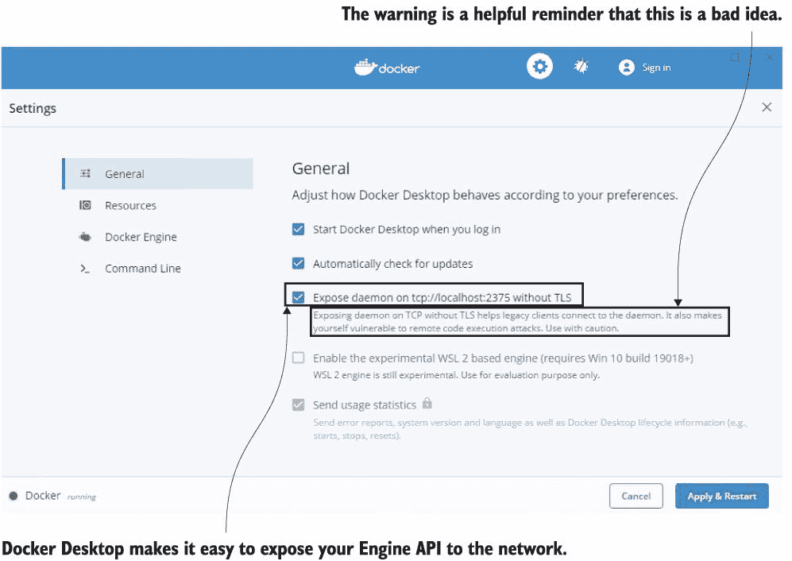

图 15.1 显示了启用对 Docker API 的纯 HTTP 访问——你应该努力忘记你看到了这个。

如果你正在使用 Linux 或 Windows Server 上的 Docker Engine，你需要编辑配置文件。在 Linux 上，你可以在 `/etc/docker/daemon.json` 找到它，或者在 Windows 上在 `C:\ProgramData\docker\config\daemon.json` 。你需要添加的字段是 `hosts` ，它包含要监听端点的列表。列表 15.1 展示了用于未加密 HTTP 访问的设置，使用 Docker 的传统端口 2375。

列表 15.1 通过 daemon.json 配置 Docker Engine 的纯 HTTP 访问

`{` `      "hosts": [` `      # 在端口 2375 上启用远程访问：` `      "tcp://0.0.0.0:2375",` `      # 并且继续监听本地通道 - Windows 管道：` `      "npipe://"` `      # 或者 Linux 套接字：` `      "fd://"` `      ],` `      "insecure-registries": [` `                "registry.local:5000"` `      ]` ` }`

你可以通过向 API 发送 HTTP 请求并使用 Docker CLI 中的 TCP 主机地址来检查 Engine 是否已配置为远程访问。

现在尝试一下 Docker 命令行可以使用 `host` 参数连接到远程机器。远程机器可以是 localhost，但通过 TCP 而不是本地通道：

`# 通过 TCP 连接到本地 Engine：` `docker --host tcp://localhost:2375 container ls` `# 使用 HTTP 通过 REST API：` `curl http://localhost:2375/containers/json`

Docker 和 Docker Compose 命令行都支持 `host` 参数，该参数指定了你想要发送命令的 Docker Engine 的地址。如果 Engine 配置为监听无安全性的本地地址，则 `host` 参数就是你所需要的；用户无需认证，网络流量也不会加密。你可以在图 15.2 中看到我的输出——我可以用 Docker CLI 或 API 列出容器。

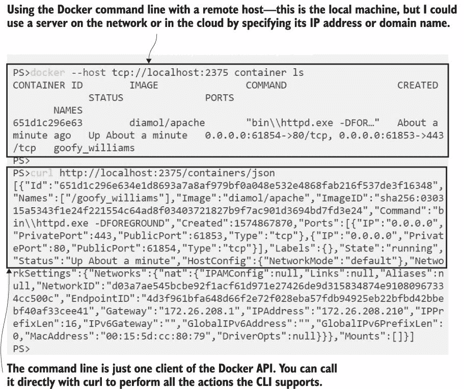

图 15.2 当 Docker Engine 通过 HTTP 可用时，任何拥有机器地址的人都可以使用它。

现在想象一下，如果运营团队得知你想要管理一个 Docker 服务器，因此需要他们启用远程访问——顺便说一句，这将允许任何人在该机器上对 Docker 进行任何操作，没有任何安全性和审计记录。不要低估这有多么危险。Linux 容器使用与主机服务器相同的用户账户，所以如果你以 Linux 管理员账户`root`运行容器，你几乎就有对服务器的管理员访问权限。Windows 容器的工作方式略有不同，所以你不会从容器中获得无限的服务器访问权限，但你仍然可以做一些不愉快的事情。

当你与远程 Docker Engine 一起工作时，你发送的任何命令都在该机器的上下文中执行。所以如果你运行一个容器并从本地磁盘挂载一个卷，容器看到的是远程机器的磁盘。如果你想在测试服务器上运行一个挂载本地机器源代码的容器，这可能会让你感到困惑。要么命令会失败，因为你要挂载的目录在服务器上不存在（这会令你困惑，因为你知道它在你的机器上确实存在），要么更糟糕的是，该路径在服务器上确实存在，但你不会理解为什么容器内的文件与你的磁盘不同。这也为那些没有服务器访问权限但有权访问 Docker Engine 的人提供了一个有用的快捷方式来浏览远程服务器的文件系统。

现在试试看，让我们看看为什么对 Docker Engine 的不安全访问如此糟糕。运行一个挂载 Docker 机器磁盘的容器，你就可以浏览主机的文件系统：

`# 使用 Linux 容器：` `docker --host tcp://localhost:2375 container run -it -v /:/host-drive diamol/base`  `# 或者 Windows 容器：` `docker --host tcp://localhost:2375 container run -it -v C:\:C:\host-drive diamol/base`  `# 在容器内浏览文件系统：` `ls` `ls host-drive`

你可以在图 15.3 中看到我的输出——运行容器的用户对主机上的文件有完全的读写访问权限。

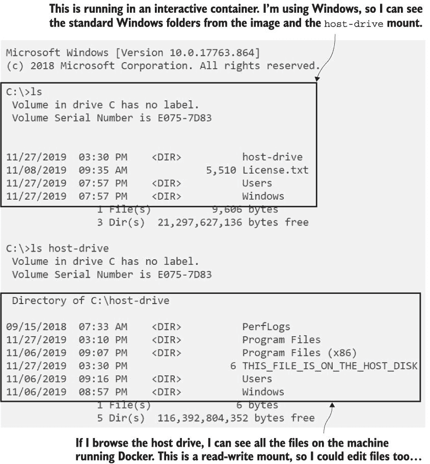

图 15.3 拥有对 Docker Engine 的访问权限意味着你可以访问主机的文件系统。

在这个练习中，你只是连接到自己的机器，所以你实际上并没有绕过安全措施。但如果你发现运行你容器化工资系统的服务器的名称或 IP 地址，并且该服务器对 Docker Engine 有未受保护的外部访问——那么，你可能会在预期之前更快地做出一些更改，并开始在新特斯拉车上工作。这就是为什么你不应该启用对 Docker Engine 的不安全访问，除非作为学习练习。

在我们继续之前，让我们摆脱我们创建的危险情况，回到 Docker Engine 的私有本地通道。您可以在 Docker Desktop 的设置中取消勾选 localhost 复选框，或者撤销您为 Docker 守护进程所做的配置更改，然后我们将继续探讨远程访问的更安全选项。

## 15.2 配置 Docker 以实现安全远程访问

Docker 支持 API 监听的其他两个通道，并且两者都是安全的。第一个使用传输层安全性（TLS）——与 HTTPS 网站使用的基于数字证书的加密技术相同。Docker API 使用相互 TLS，因此服务器有一个证书来识别自己并加密流量，客户端也有一个证书来识别自己。第二个选项使用安全外壳（SSH）协议，这是连接到 Linux 服务器的标准方式，但它也支持 Windows。SSH 用户可以使用用户名和密码或使用私钥进行认证。

安全选项为您提供了不同的方式来控制谁可以访问您的集群。相互 TLS 是最广泛使用的，但它需要在生成和轮换证书时承担管理开销。SSH 要求您在连接的机器上有一个 SSH 客户端，但大多数现代操作系统都有，它为您提供了管理谁可以访问您的机器的更简单方式。图 15.4 显示了 Docker API 支持的不同通道。

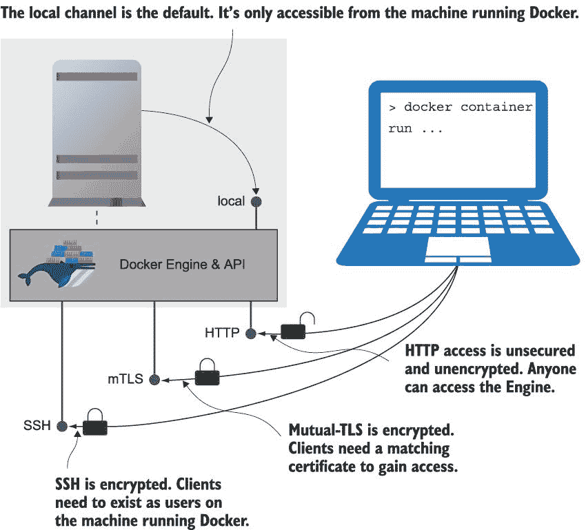

图 15.4 存在安全地暴露 Docker API、提供加密和认证的方法。

这里有一个重要的事情——如果您想配置对 Docker Engine 的安全远程访问，您需要能够访问运行 Docker 的机器。您无法通过 Docker Desktop 获得这一点，因为桌面实际上在您的机器上的虚拟机中运行 Docker，您无法配置该虚拟机的监听方式（除了我们刚刚使用的未加密的 HTTP 复选框）。不要尝试使用 Docker Desktop 执行下一个练习——您可能会收到一个错误，告诉您某些设置无法调整，或者更糟糕的是，它可能会让您调整它们，然后一切都会崩溃，您需要重新安装。在本节的其余部分，练习使用 Play with Docker (PWD)在线游乐场，但如果您有一台运行 Docker 的远程机器（这里就是您的树莓派发挥作用的地方），您可以在本章源代码的 readme 文件中找到如何在不使用 PWD 的情况下执行相同操作的详细信息。

我们将首先通过使用相互 TLS 来安全地访问远程 Docker Engine。为此，您需要生成证书和密钥文件对（密钥文件充当证书的密码）——一个用于 Docker API，另一个用于客户端。大型组织将有一个内部证书颁发机构（CA）和一个拥有证书并可以为您生成它们的团队。我已经完成了这项工作，生成了与 PWD 兼容的证书，因此您可以使用这些证书。

现在尝试一下 在*[`labs.play-with-docker.com`](https://labs.play-with-docker.com)*上登录 Play with Docker 并创建一个新的节点。在那个会话中，运行一个容器来部署证书，并配置 PWD 中的 Docker Engine 使用证书。然后重新启动 Docker：

`# 创建证书目录：` `mkdir -p /diamol-certs` `# 运行设置证书和配置的容器：` `docker container run -v /diamol-certs:/certs -v /etc/docker:/docker diamol/pwd-tls:server` `# 杀死 docker 并使用新配置重启：` `pkill dockerd` `dockerd &>/docker.log &`

您运行的容器从 PWD 节点挂载了两个卷，并将证书和新的`daemon.json`文件从容器镜像复制到节点上。如果您更改 Docker Engine 配置，则需要重新启动它，这就是`dockerd`命令所做的事情。您可以在图 15.5 中看到我的输出--此时引擎正在端口 2376 上监听（这是安全 TCP 访问的惯例）使用 TLS。

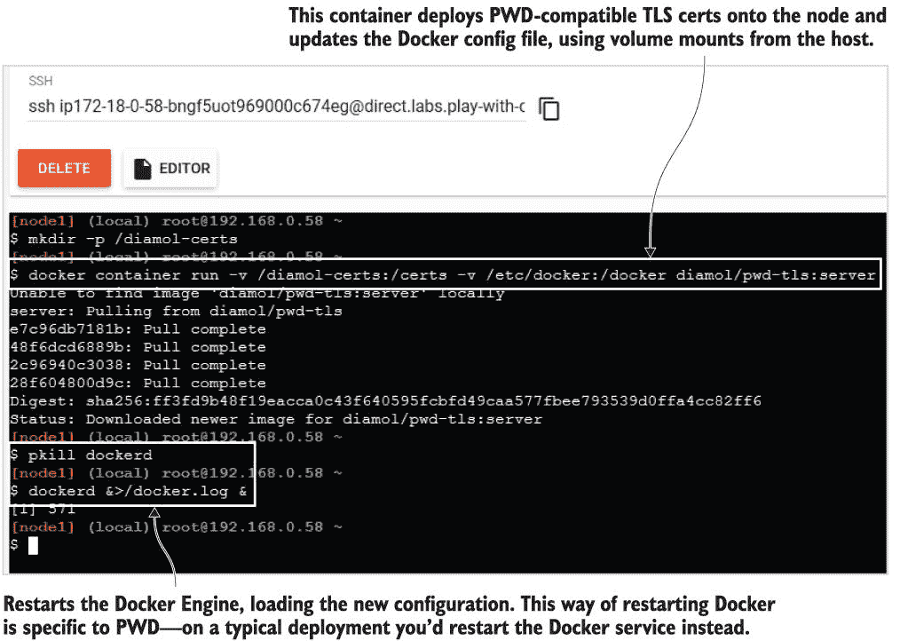

图 15.5 配置 Play with Docker 会话，使引擎使用相互 TLS 监听

在我们实际上从本地机器向 PWD 节点发送流量之前，还有最后一步。点击“打开端口”按钮并打开端口 2376。将打开一个新标签页，显示一个错误消息。忽略该消息，并将该新标签页的 URL 复制到剪贴板。这是您会话的独特 PWD 域名。它可能类似于`ip172-18-0-62-bo9pj8nad2eg008a76e0-2376.direct.labs.play-with-docker.com`，您将使用它从您的本地机器连接到 PWD 中的 Docker Engine。图 15.6 显示了如何打开端口。

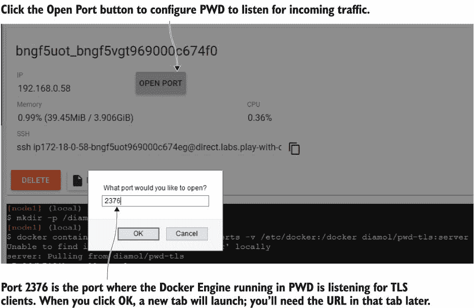

图 15.6 在 PWD 中打开端口，让您可以将外部流量发送到容器和 Docker Engine。

您的 PWD 实例现在可以远程管理。您使用的证书是我使用 OpenSSH 工具（在容器中运行--如果您想了解它是如何工作的，Dockerfile 在`images/cert-generator`文件夹中）生成的。我不会详细介绍 TLS 证书和 OpenSSH，因为这会是一个我们都不愿意的长篇大论。但是，了解 CA、服务器证书和客户端证书之间的关系很重要。图 15.7 显示了这一点。

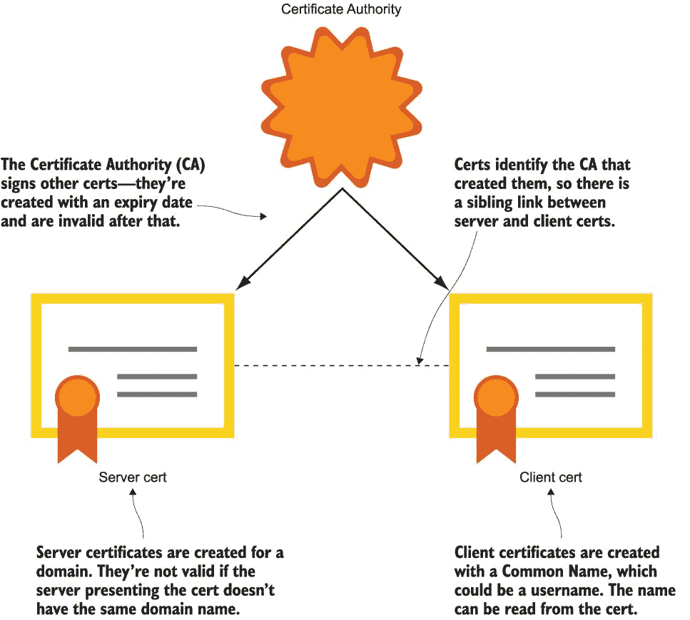

图 15.7 互信 TLS 快速指南--服务器证书和客户端证书标识持证人并共享 CA。

如果您打算使用 TLS 来保护您的 Docker Engine，您将为要保护的每个引擎生成一个 CA、一个服务器证书，并为每个您希望允许访问的用户生成一个客户端证书。证书有有效期，因此您可以创建短期客户端证书，以便临时访问远程引擎。所有这些都可以自动化，但管理证书仍然有开销。

当你配置 Docker 引擎使用 TLS 时，你需要指定 CA 证书、服务器证书和密钥对的路径。列表 15.2 展示了已部署在 PWD 节点上的 TLS 设置。

列表 15.2 启用 TLS 访问的 Docker 守护进程配置

`{` `    "hosts": ["unix:///var/run/docker.sock", "tcp://0.0.0.0:2376"],` `    "tls": true,` `    "tlscacert": "/diamol-certs/ca.pem",` `    "tlskey": "/diamol-certs/server-key.pem",` `    "tlscert": "/diamol-certs/server-cert.pem"` `}`

现在远程 Docker 引擎已加密，除非你提供 CA 证书、客户端证书和客户端密钥，否则你不能使用 curl 的 REST API 或通过 Docker CLI 发送命令。API 也不会接受任何旧的客户端证书——它需要使用与服务器相同的 CA 生成。尝试在没有客户端 TLS 的情况下使用 API 会被引擎拒绝。你可以使用你在 PWD 上运行的镜像的变体来下载本地机器上的客户端证书，并使用这些证书进行连接。

现在尝试一下 确保你有访问 PWD 端口 2376 的 URL ——这就是你从本地机器连接到 PWD 会话的方式。使用你之前打开端口 2376 时复制的会话域名。尝试连接到 PWD 引擎：

`# 从地址栏获取你的 PWD 域名 - 类似于` `# ip172-18-0-62-bo9pj8nad2eg008a76e0-6379.direct.labs.play-with-` `# docker.com` `# 将你的 PWD 域名存储在一个变量中 - 在 Windows 上：` `$pwdDomain="<your-pwd-domain-from-the-address-bar>"` `# OR Linux:` `pwdDomain="<your-pwd-domain-goes-here>"` `# 尝试直接访问 Docker API：` `curl "http://$pwdDomain/containers/json"` `# 现在尝试使用命令行：` `docker --host "tcp://$pwdDomain" container ls` `# 将 PWD 客户端证书提取到你的机器上：` `mkdir -p /tmp/pwd-certs` `cd ./ch15/exercises` `tar -xvf pwd-client-certs -C /tmp/pwd-certs` `# 使用客户端证书连接：` `docker --host "tcp://$pwdDomain" --tlsverify --tlscacert /tmp/pwd-certs/ca.pem --tlscert /tmp/pwd-certs/client-cert.pem --tlskey /tmp/pwd-certs/client-key.pem container ls` `# 你可以使用任何 Docker CLI 命令：` ` docker --host "tcp://$pwdDomain" --tlsverify --tlscacert /tmp/pwd-certs/ca.pem --tlscert /tmp/pwd-certs/client-cert.pem --tlskey /tmp/pwd-certs/client-key.pem container run -d -P diamol/apache`

将 TLS 参数传递给每个 Docker 命令有点繁琐，但你也可以将它们捕获在环境变量中。如果你没有提供正确的客户端证书，你会得到一个错误，当你提供证书时，你可以完全控制从本地机器运行的 PWD 中的 Docker 引擎。你可以在图 15.8 中看到这一点。

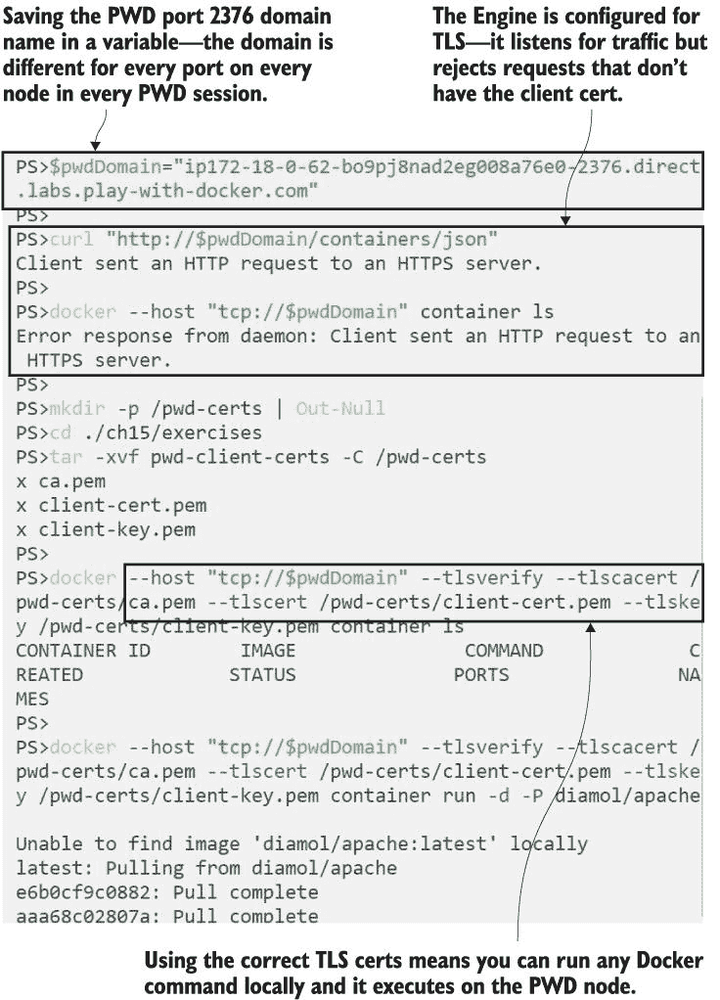

图 15.8 你只能在与 TLS 加密的 Docker 引擎一起工作时使用客户端证书。

另一种安全远程访问的选项是 SSH；这里的优势是 Docker CLI 使用标准的 SSH 客户端，并且不需要对 Docker 引擎进行任何配置更改。不需要创建或管理证书，因为认证由 SSH 服务器处理。在你的 Docker 机器上，你需要为每个你想允许远程访问的人创建一个系统用户；他们运行任何针对远程机器的 Docker 命令时使用这些凭据。

现在试试吧 在你的 PWD 会话中，记下 node1 的 IP 地址，然后点击创建另一个节点。运行以下命令，通过 SSH 从 node2 的命令行管理 node1 上的 Docker 引擎：

`# 将 node1 的 IP 地址保存到变量中:` `node1ip="<node1-ip-address-goes-here>"`   

Play with Docker 使这变得非常简单，因为它为节点提供了连接彼此所需的一切。在实际环境中，你需要创建用户，如果你想避免输入密码，你还需要生成密钥并将公钥分发到服务器，私钥分发给用户。你可以从图 15.9 中的我的输出中看到，所有这些都在 Play with Docker 会话中完成，并且无需特殊设置即可正常工作。

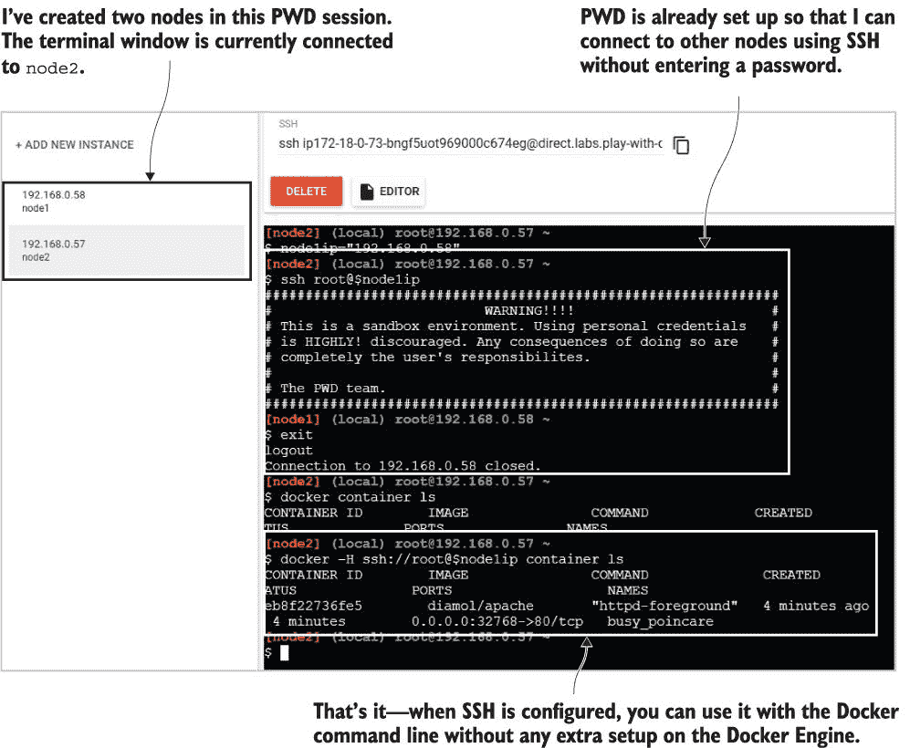

图 15.9 Play with Docker 配置了节点之间的 SSH 客户端，以便你可以与 Docker 一起使用。

系统管理员对于使用 SSH 通过 Docker 可能会有复杂的感受。一方面，它比管理证书要容易得多，如果你的组织有很多 Linux 管理员经验，这并不是什么新鲜事。另一方面，这意味着将服务器访问权限授予任何需要 Docker 访问的人，这可能是他们不需要的权限。如果你的组织主要是 Windows，你可以在 Windows 上安装 OpenSSH 服务器并使用相同的方法，但这与管理员通常管理 Windows 服务器访问的方式非常不同。尽管有证书开销，TLS 可能是一个更好的选择，因为所有操作都在 Docker 内部完成，并且不需要 SSH 服务器或客户端。

使用 TLS 或 SSH 保护对您的 Docker 引擎的访问提供了加密（CLI 和 API 之间的流量在网络中无法被读取）和身份验证（用户必须证明他们的身份才能连接）。这种安全性不提供授权或审计，因此您无法限制用户可以做什么，并且您没有他们做了什么的记录。在考虑谁需要访问哪些环境时，您需要意识到这一点。用户还需要小心使用哪些环境——Docker CLI 使切换到远程引擎变得非常容易，而且很容易因为误以为连接到笔记本电脑而删除包含重要测试数据的卷。

## 15.3 使用 Docker 上下文与远程引擎一起工作

您可以使用 `host` 参数将本地 Docker CLI 指向远程机器，如果您使用的是安全通道，还可以包括所有 TLS 证书路径，但为每个命令这样做会很麻烦。Docker 通过上下文使在 Docker 引擎之间切换变得更容易。您使用 CLI 创建 Docker 上下文，指定引擎的所有连接细节。您可以创建多个上下文，每个上下文的连接细节都存储在您的本地机器上。

现在试试看 创建一个上下文来使用在当前工作目录 (PWD) 中运行的远程 TLS 启用的 Docker 引擎：

`# 使用您的 PWD 域和证书创建上下文：` `docker context create pwd-tls --docker "host=tcp://$pwdDomain,ca=/tmp/pwd-certs/ca.pem,cert=/tmp/pwd-certs/client-cert.pem,key=/tmp/pwd-certs/client-key.pem"` `# 对于 SSH，将是：` `# docker context create local-tls --docker "host=ssh://user@server"` `# 列出上下文：` ` docker context ls`

您将在输出中看到有一个默认上下文，它使用私有通道指向您的本地引擎。我的图 15.10 的输出来自一台 Windows 机器，因此默认通道使用命名管道。您还会看到有一个 Kubernetes 端点选项——您还可以使用 Docker 上下文来存储 Kubernetes 集群的连接细节。

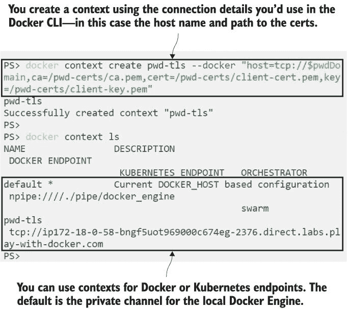

图 15.10 通过指定远程主机名和 TLS 证书路径添加新的上下文

上下文包含您在本地和远程 Docker 引擎之间切换所需的所有信息。本练习使用了 TLS 加密的引擎，但您可以通过替换主机参数和证书路径为您的 SSH 连接字符串，使用 SSH 加密的引擎运行相同的命令。

上下文可以将您的本地 CLI 连接到本地网络或公共互联网上的其他机器。有两种方式来切换上下文——您可以临时切换，在单个终端会话期间进行，或者永久切换，以便在您再次切换之前在所有终端会话中生效。

现在尝试一下 当您切换上下文时，您的 Docker 命令会发送到选定的引擎——您不需要指定主机参数。您可以使用环境变量临时切换，或使用`context use`命令永久切换：

`# 使用环境变量切换到命名上下文 - 这是切换上下文的` `# 建议方式，因为它只持续本次` `# 会话`   

输出可能不是您预期的，由于这些不同的设置方式，您需要小心处理上下文。图 15.11 显示了我的输出，尽管我已经切换回默认设置，但上下文仍然设置为 PWD 连接。

图 15.11 有两种切换上下文的方式，如果您混合使用它们，您会感到困惑。

使用`docker context use`设置的上下文成为系统默认。您打开的任何新终端窗口，或任何运行 Docker 命令的批处理进程，都将使用该上下文。您可以使用`DOCKER_CONTEXT`环境变量来覆盖它，它优先于选定的上下文，并且仅适用于当前终端会话。如果您经常在上下文之间切换，我发现始终使用环境变量选项并将默认上下文保留为您的本地 Docker Engine 是一个好习惯。否则，很容易在一天开始时清除所有正在运行的容器，忘记昨天您已经将上下文设置为使用生产服务器。

当然，您不应该需要定期访问生产 Docker 服务器。随着您在容器之旅中不断前进，您将更多地利用 Docker 带来的便捷自动化，并达到一个只有超级管理员和 CI/CD 管道的系统账户可以访问 Docker 的地方。

## 15.4 将持续部署添加到您的 CI 管道中

现在我们已经配置了具有安全访问的远程 Docker 机器，我们可以编写一个完整的 CI/CD 管道，基于第十一章中我们与 Jenkins 一起完成的工作。该管道涵盖了持续集成（CI）阶段——在容器中构建和测试应用程序，并将构建的镜像推送到 Docker 仓库。持续部署（CD）阶段在此基础上增加了部署到测试环境以进行最终确认，然后部署到生产环境。

CI 阶段和 CD 阶段之间的区别在于，CI 构建都是在构建机器上使用 Docker Engine 本地进行的，但部署需要通过远程 Docker Engine 进行。管道可以使用我们在练习中采取的相同方法，使用带有指向远程机器的主机参数的 Docker 和 Docker Compose 命令，并提供安全凭证。这些凭证需要存储在某个地方，绝对不能放在源代码控制中——需要与源代码工作的人与需要与生产服务器工作的人不是同一群人，因此生产凭证不应广泛可用。大多数自动化服务器都允许你在构建服务器内部存储机密，并在管道作业中使用它们，这样就将凭证管理从源代码控制中分离出来。

现在尝试一下 我们将启动一个类似于第十一章的本地构建基础设施，包括本地 Git 服务器、Docker 注册中心和 Jenkins 服务器，所有这些都在容器中运行。有一些脚本会在 Jenkins 容器启动时运行，从您本地的 PWD 证书文件中创建凭证，因此 CD 阶段将部署到 PWD：

`# 切换到包含 Compose 文件的文件夹：` `cd ch15/exercises/infrastructure`   `# 启动容器 - 使用 Windows 容器：` `docker-compose -f ./docker-compose.yml -f ./docker-compose-windows.yml up -d`   `# 或者使用 Linux 容器：` `docker-compose -f ./docker-compose.yml -f ./docker-compose-linux.yml up -d`

当容器运行时，浏览到 Jenkins 的 http://localhost:8080/credentials，使用用户名`diamol`和密码`diamol`登录。您会看到 Docker CA 证书和客户端连接的证书已经存储在 Jenkins 中——它们是从您的机器上的 PWD 证书加载的，并且可以在作业中使用。图 15.12 显示了作为 Jenkins 凭证加载的证书。

图 15.12 使用 Jenkins 凭证为管道提供 TLS 证书以连接到 PWD 的 Docker

这是一个全新的构建基础设施，在全新的容器中运行。由于使用了自动化脚本，Jenkins 已经配置完毕并准备就绪，但 Git 服务器需要一些手动设置。您需要浏览到 http://localhost:3000 并完成安装，创建一个名为`diamol`的用户，然后创建一个名为`diamol`的仓库。如果您需要复习，可以翻回到第十一章——第 11.3、11.4 和 11.5 节会向您展示如何操作。

本节中我们将运行的管道将构建第十二章中 timecheck 应用程序的新版本，该应用程序每 10 秒打印一次本地时间。该章节的源代码中已经准备好了所有脚本，但你需要对管道进行更改以添加自己的 PWD 域名。然后当构建运行时，它将运行 CI 阶段并将从你的本地容器部署到你的 PWD 会话。我们将假装 PWD 既是用户验收测试环境也是生产环境。

现在尝试一下 打开文件夹 `ch15/exercises` 中的管道定义文件 -- 如果你在运行 Linux 容器，请使用 `Jenkinsfile`；如果你使用的是 Windows 容器，请使用 `Jenkinsfile.windows`。在环境部分，有 Docker 注册域名和用户验收测试（UAT）以及生产 Docker 引擎的变量。将 `pwd-domain` 替换为你的实际 PWD 域名，并确保在域名后包含端口号 `:80` -- PWD 在外部监听端口 80，并将其映射到会话中的端口 2376：

`environment {` `      REGISTRY = "registry.local:5000"` `      UAT_ENGINE = "ip172-18-0-59-bngh3ebjagq000ddjbv0-2376.direct.labs.play-with-docker.com:80"` `      PROD_ENGINE = "ip172-18-0-59-bngh3ebjagq000ddjbv0-2376.direct.labs.play-with-docker.com:80"` `}`

现在，你可以将你的更改推送到你的本地 Git 服务器：

`git remote add ch15 http://localhost:3000/diamol/diamol.git`  `git commit -a -m 'Added PWD domains'`  `git push ch15`  `# Gogs will ask you to login -` `# use the diamol username and password you registered in Gogs`

现在，浏览到 Jenkins，网址为 http://localhost:8080/job/diamol/，然后点击“立即构建”。

此管道的启动方式与第十一章的管道相同：从 Git 获取代码，使用多阶段 Dockerfile 构建应用程序，运行应用程序以测试其启动，然后将镜像推送到本地注册库。然后是新部署阶段：首先是将应用程序部署到远程 UAT 引擎，然后管道停止，等待人工批准以继续。这是一种很好的开始 CD 的方式，因为每一步都是自动化的，但仍然有一个手动质量关卡，这对于不习惯自动部署到生产环境的组织来说可能是个安慰。你可以在图 15.13 中看到构建已通过到 UAT 阶段，现在它已停止在“等待批准”。

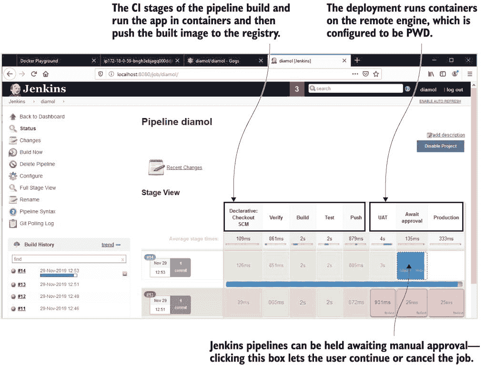

图 15.13 Jenkins 中的 CI/CD 管道已部署到 UAT 并正在等待批准以继续。

你的手动批准阶段可能涉及一个专门团队进行整整一天的性能测试，或者它可能只是对新的部署在类似生产环境中的外观进行快速检查。当你对部署满意时，返回 Jenkins 并发出你的批准信号。然后它将继续到最后一个阶段--部署到生产环境。

现在尝试一下 回到你的 PWD 会话中，检查 timecheck 容器是否正在运行，并且是否正在输出正确的日志：

`docker container ls` `docker container logs timecheck-uat_timecheck_1`

我相信一切都会顺利，所以回到 Jenkins 并点击“等待批准”阶段的蓝色框。一个窗口会弹出，要求确认部署——点击“执行”！管道将继续。

现在越来越激动人心了——我们的生产部署几乎完成了。您可以在图 15.14 中看到我的输出，UAT 测试在背景中，批准阶段在前景中。

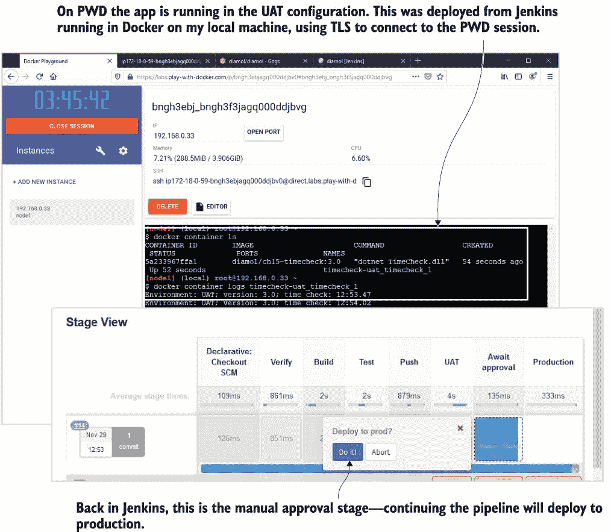

图 15.14 UAT 部署已正确完成，应用正在 PWD 中运行。接下来是生产环境！

管道中的 CD 阶段并不比 CI 阶段复杂。每个阶段都有一个脚本文件，使用单个 Docker Compose 命令执行工作，将相关的覆盖文件连接起来（如果远程环境是一个 Swarm 集群，这可以很容易地是一个 `docker` `stack` `deploy` 命令）。部署脚本期望 TLS 证书路径和 Docker 主机域名通过环境变量提供，这些变量在管道作业中已设置。

在使用 Docker 和 Docker Compose CLIs 实际执行的工作与管道中完成的工作的组织之间保持分离是很重要的。这减少了您对特定自动化服务器的依赖，并使得在它们之间切换变得容易。列表 15.3 显示了 Jenkinsfile 的一部分和部署到 UAT 的批处理脚本。

列表 15.3 使用 Jenkins 凭据将 Docker TLS 证书传递到脚本文件

`# Jenkinsfile 的部署阶段：` `stage('UAT') {` `    steps {` `        withCredentials(` `            [file(credentialsId: 'docker-ca.pem', variable: 'ca'),` `              file(credentialsId: 'docker-cert.pem', variable: 'cert'),` `              file(credentialsId: 'docker-key.pem', variable: 'key')]) {` `                  dir('ch15/exercises') {` `                      sh 'chmod +x ./ci/04-uat.bat'` `                      sh './ci/04-uat.bat'` `                      echo "Deployed to UAT"` `            }` `        }` `    }` `}` `# 实际的脚本仅使用 Docker Compose:` `docker-compose \` `    --host tcp://$UAT_ENGINE --tlsverify \` `    --tlscacert $ca --tlscert $cert --tlskey $key \` `    -p timecheck-uat -f docker-compose.yml -f docker-compose-uat.yml \` ` up -d`

Jenkins 从其自己的凭据提供 TLS 证书给 shell 脚本。您可以将此构建移至 GitHub Actions，并只需使用存储在 GitHub 仓库中的机密来模拟工作流程——构建脚本本身不需要更改。生产部署阶段几乎与 UAT 相同；它只是使用不同的 Compose 文件来指定环境设置。我们正在使用相同的 PWD 环境进行 UAT 和生产，因此当作业完成时，您将能够看到两个部署都在运行。

现在试试吧 返回 PWD 会话，最后一次，您可以检查您的本地 Jenkins 构建是否已正确部署到 UAT 和生产环境：

`docker container ls`   `docker container logs timecheck-prod_timecheck_1`

我的输出在图 15.15 中。我们有一个从 Jenkins 在本地容器中运行的成功的 CI/CD 流程，并部署到两个远程 Docker 环境（在这个例子中恰好是同一个）。

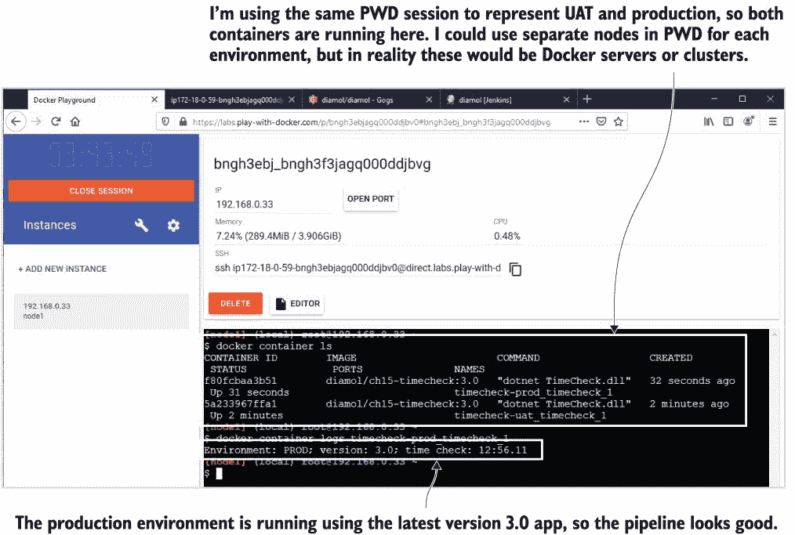

图 15.15 PWD 的部署。要使用实际的集群，我只需更改域名和证书。

这非常强大。运行不同环境的容器以及运行 CI/CD 基础设施机器不需要比 Docker 服务器更多的东西。您可以在一天内通过您自己的应用程序的流程来证明这一点（假设您已经将组件 Docker 化了），而通往生产的路径只需要启动集群并更改部署目标。

在规划您的生产流程之前，然而，当您将 Docker 引擎远程提供时，还有一件事需要您注意——即使它是受保护的。那就是 Docker 资源访问模型。

## 15.5 理解 Docker 的访问模型

这实际上不需要一个完整的章节，因为 Docker 资源访问模型非常简单，但它有自己的章节来帮助它突出。保护您的引擎主要涉及两个方面：加密 CLI 和 API 之间的流量，并验证以确保用户有权访问 API。没有授权——访问模型是全有或全无。如果您无法连接到 API，您将无法做任何事情，如果您可以连接到 API，您可以做任何事情。

您是否感到恐惧取决于您的背景、您的基础设施以及您安全模型的成熟度。您可能正在运行没有公开访问的内部集群，为您的管理者使用单独的网络，并限制对该网络的 IP 访问，您每天都会轮换 Docker CA。这为您提供了深度防御，但仍然需要考虑来自您自己的员工的攻击向量（是的，我知道 Stanley 和 Minerva 是优秀的团队成员，但您真的确定他们不是骗子吗？特别是 Stanley）。

有其他选择，但它们很快就会变得复杂。Kubernetes 和 Docker Enterprise 都有基于角色的访问控制模型，因此您可以限制哪些用户可以访问资源，以及他们可以使用这些资源做什么。或者有一种 GitOps 方法，它将 CI/CD 流程颠倒过来，使用基于拉的模型，以便集群在新的构建被批准时知道，并自行部署更新。图 15.16 展示了这一点——这里没有共享凭证，因为不需要任何东西连接到集群。

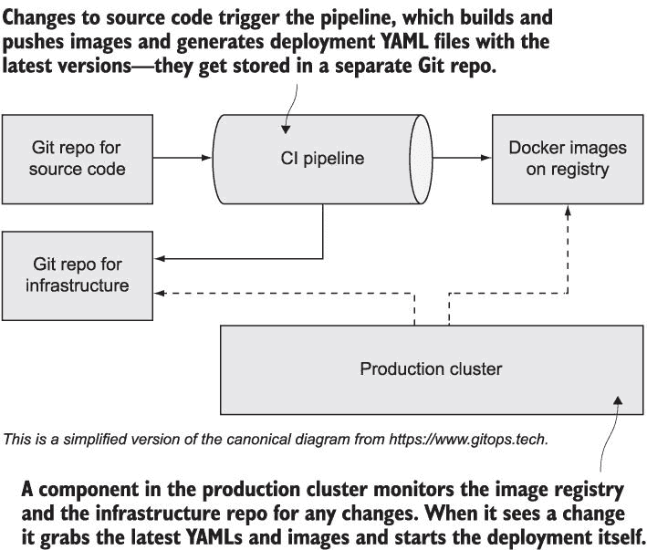

图 15.16 GitOps 的勇敢新世界——一切都在 Git 中存储，集群开始部署。

GitOps 是一个非常有趣的方法，因为它使一切可重复且可版本化——不仅包括你的应用程序源代码和部署 YAML 文件，还包括基础设施设置脚本。它为你提供了整个堆栈的单个真相来源，Git，你可以轻松审计和回滚。如果你对这个想法感兴趣，但你是从零开始的——好吧，这将花费你一段时间才能达到那里，但你可以从本章中我们讨论的非常简单的 CI/CD 管道开始，随着你获得信心，逐渐发展和完善你的流程和工具。

## 15.6 实验室

如果你跟随了第 15.4 节中的 CD 练习，你可能想知道部署是如何工作的，因为 CI 阶段将镜像推送到你的本地注册表，而 PWD 无法访问该注册表。它是如何将镜像拉取来运行容器的？好吧，它并没有。我作弊了。部署覆盖文件使用了一个不同的镜像标签，一个来自 Docker Hub 的标签，是我自己构建并推送的（如果你感到失望，我表示抱歉，但本书中的所有镜像都是使用 Jenkins 管道构建的，所以实际上是一样的）。在这个实验中，你将纠正这一点。

构建中缺失的部分在第三阶段，它只是将镜像推送到本地注册表。在一个典型的管道中，会有一个在本地服务器上的测试阶段，可以在推送到生产注册表之前访问该镜像，但我们将跳过这一阶段，直接添加另一个推送到 Docker Hub 的操作。这是目标：

+   为你的 CI 镜像打上标签，使其使用 Docker Hub 上的你的账户和简单的“3.0”标签。

+   将镜像推送到 Docker Hub，同时确保你的 Hub 凭证安全。

+   使用你自己的 Docker Hub 镜像部署到 UAT 和生产环境。

这里有几个需要考虑的环节，但仔细查看现有的流程，你就会知道你需要做什么。两个提示：首先，你可以在 Jenkins 中创建一个用户名/密码凭证，并在 Jenkinsfile 中使用`withCredentials`块使其可用。其次，到 PWD 会话的开放端口有时会停止监听，因此你可能需要在 Jenkinsfile 中启动新的会话，这些会话将需要新的 PWD 域。

我在 GitHub 上的解决方案最初是复制了练习文件夹，所以如果你想看看我做了哪些更改，你可以比较文件，以及检查方法：*[`github.com/sixeyed/diamol/blob/master/ch15/lab/README.md`](https://github.com/sixeyed/diamol/blob/master/ch15/lab/README.md)*。
