# 16 构建在任何地方运行的 Docker 镜像：Linux、Windows、Intel 和 Arm

本书中有数十个“现在就试”的练习，如果你使用不同的机器来跟随，你会发现这些练习在 Mac、Windows、Linux 和 Raspberry Pi 上工作方式相同。这不是偶然——我已经将本书中的每个 Docker 镜像构建为多架构镜像。多架构镜像以多种变体构建并推送到注册表，每种变体针对不同的操作系统或 CPU 架构，但都使用相同的镜像名称。当你使用这些镜像之一来运行容器或构建另一个镜像时，Docker 会根据你机器上的 CPU 和 OS 拉取匹配的变体。如果你在不同的架构上使用相同的镜像名称，你会得到不同的镜像变体，但它将是相同的应用程序，并且将以相同的方式工作。这对用户来说是一个超级简单的流程，但对镜像发布者来说则需要一些努力。

在本章中，你将学习到产生多架构构建的不同方法，但如果你因为不使用 Windows 或 Arm 而考虑跳过这一部分，至少应该阅读第一部分，了解为什么这是一个改变游戏规则的选择。

## 16.1 为什么多架构镜像很重要

亚马逊网络服务为使用 Intel、AMD 或 Arm 处理器的虚拟机提供不同的计算类别。Arm 选项（称为 A1 实例）的价格几乎比 Intel/AMD 选项便宜一半。AWS 是第一个支持 Arm 的主要云服务提供商，但你可以确信，如果其他云服务提供商因为 Arm CPU 的节省而开始失去工作负载，他们也会添加支持。如果你可以将你的应用程序运行在几乎一半的价格上，你为什么不这样做呢？嗯，因为很难让为 Intel 构建的应用程序在 Arm 上运行。

在另一端，物联网设备通常运行 Arm 处理器，因为它们在功耗上非常高效（因此云中的价格降低），如果能以容器镜像的形式将软件发送到设备上那就太好了。但是，Arm CPU 指令与 Intel 和 AMD 使用的标准 x64 指令不兼容。因此，为了在云或边缘（或在充满 Raspberry Pi 的数据中心）支持 Arm CPU，你需要使用一个可以在 Arm 上运行的应用程序平台，并且你需要使用 Arm 机器来构建你的应用程序。这就是 Docker 解决的问题，无论是对于生产构建农场还是对于开发者工作流程。Docker Desktop 支持仿真来构建带有 Arm 架构的 Docker 镜像和运行容器，即使在 Intel 机器上也是如此。

现在就试一试 这个可能不适合 Docker Engine 或 PWD 用户，因为仅 Docker Engine 本身没有 Arm 仿真——这只有在 Docker Desktop 中才有。你可以在 Mac 或 Windows 上这样做（在 Linux 容器模式下）。

首先，你需要从鲸鱼图标设置中启用实验模式——参见图 16.1。

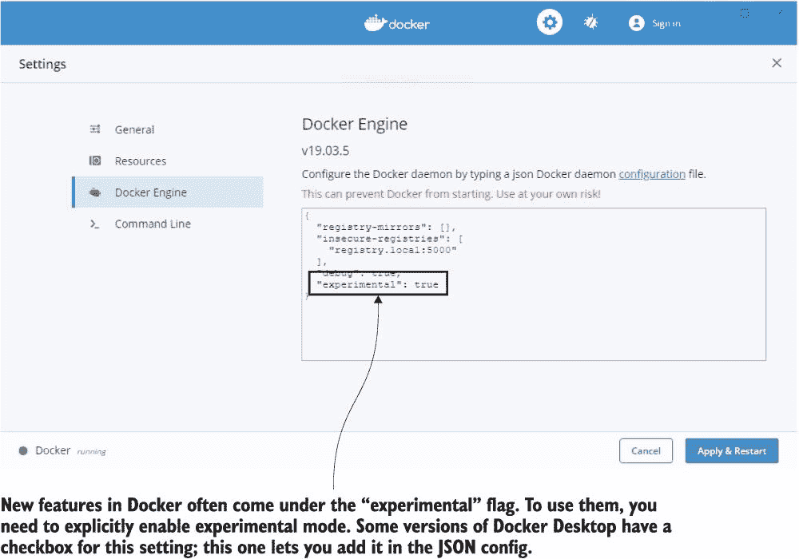

图 16.1 启用实验模式可以解锁仍在开发中的功能。

现在打开一个终端，使用 Arm 仿真构建一个图像：

` # 切换到练习文件夹：` ` cd ch16/exercises` ` # 为 64 位 Arm 构建：` ` docker build -t diamol/ch16-whoami:linux-arm64 --platform linux/arm64 ./whoami` ` # 检查图像的架构：` ` docker image inspect diamol/ch16-whoami:linux-arm64 -f '{{.Os}}/{{.Architecture}}'` ` # 以及您引擎的原生架构：` ` docker info -f '{{.OSType}}/{{.Architecture}}'`

您会看到您构建的图像针对的是 64 位 Arm 平台，尽管您的机器正在运行 64 位 Intel 或 AMD 机器。此图像使用多阶段 Dockerfile 来编译和打包.NET Core 应用程序。.NET Core 平台在 Arm 上运行，Dockerfile 中的基础镜像（对于 SDK 和运行时）有可用的 Arm 变体。这就是您需要支持跨平台构建的所有内容。

您可以将此图像推送到注册表，并在真实的 Arm 机器（如 Raspberry Pi 或 AWS 中的 A1 实例）上运行容器，它将正常工作。您可以在图 16.2 中看到我的输出，我在其中从一个 Intel 机器构建了一个 Arm 图像。

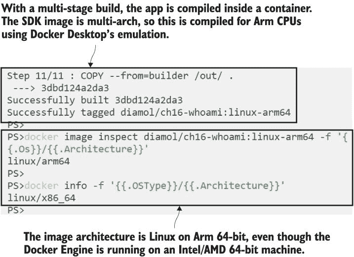

图 16.2 跨平台支持，使用仿真在 Intel 机器上构建 Arm 图像

Docker 了解您机器的许多信息，包括操作系统和 CPU 架构，当您尝试拉取图像时，它将使用这些信息作为匹配项。拉取图像不仅仅是下载层——还包括优化以扩展压缩层并使图像准备好运行。这种优化仅在您想要使用的图像与您正在运行的架构匹配时才有效，因此如果没有匹配项，您将得到一个错误——您甚至无法拉取图像来尝试运行容器。

现在试试看您可以使用运行 Linux 容器的任何 Docker Engine 来验证这一点——尝试下载一个 Microsoft Windows 图像：

` # 拉取 Windows Nano Server 图像：` ` docker image pull mcr.microsoft.com/windows/nanoserver:1809`

您可以在图 16.3 中看到我的输出——Docker 获取当前引擎的操作系统和 CPU，并检查注册表中是否有匹配的变体。没有匹配项，因此图像没有被拉取，我得到了一个错误。

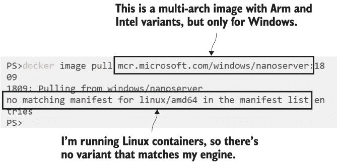

图 16.3 如果没有与您的操作系统和 CPU 相匹配的变体，您无法从注册表中拉取图像。

清单列表是镜像的变体集合。Windows Nano Server 镜像并不是真正的多架构，它只能在 Windows 容器上运行——清单列表中没有 Linux 变体。基本原理是镜像的架构必须与引擎的架构相匹配，但也有一些细微差别——Linux 镜像可以用于不匹配的 CPU 架构，但容器将因一个神秘的“用户进程导致‘exec 格式错误’”消息而失败。一些 Windows 引擎有一个名为 Windows 上的 Linux 容器（LCOW）的实验性功能，因此它们可以运行 Linux 容器（但复杂的应用程序将因更神秘的日志而失败）。最好坚持使用与引擎匹配的架构，而多架构镜像让您可以根据需要为每个操作系统和 CPU 定制镜像。

## 16.2 从一个或多个 Dockerfile 构建多架构镜像

构建多架构镜像有两种方法。在第一种方法中，您遵循本章练习中`whoami`应用程序的例子：编写一个多阶段 Dockerfile，从源代码编译应用程序并将其打包以在容器中运行。如果您使用的 SDK 和运行时镜像支持您想要支持的所有架构，那么您就可以开始了。

这种方法的巨大优势在于您只有一个 Dockerfile，您可以在不同的机器上构建它以获得您想要支持的架构。我使用这种方法来构建自己的.NET Core 堆栈的黄金镜像；图 16.4 显示了 SDK 的构建方法。

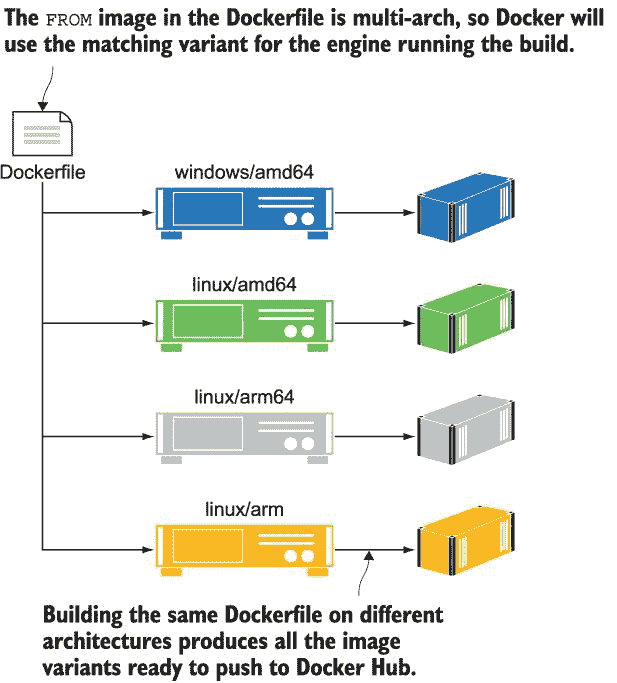

图 16.4 使用基于多架构镜像的多阶段 Dockerfile 构建自己的多架构镜像

如果您的源镜像不是多架构镜像，或者它不支持您想要支持的所有镜像，您就不能遵循这种方法。Docker Hub 上大多数官方镜像都是多架构的，但它们并不支持您可能想要的每一个变体。在这种情况下，您将需要不同的 Dockerfile，可能是一个用于 Linux 和一个用于 Windows，或者可能还需要额外的用于 Arm 32 位和 64 位的 Dockerfile。这种方法需要更多的管理，因为您有多个 Dockerfile 需要维护，但它为您提供了更多的自由来为每个目标架构调整行为。我使用这种方法为我的 Maven（一个用于构建 Java 应用程序的工具）黄金镜像——图 16.5 显示了堆栈。

在本章的练习中，有一个名为`folder-list`的应用程序非常简单——它只是打印一些关于运行时的一些基本信息，然后列出文件夹的内容。这里有四个 Dockerfile，每个对应本书中支持的架构：Intel 上的 Windows、Intel 上的 Linux、32 位 Arm 上的 Linux 和 64 位 Arm 上的 Linux。您可以使用 Docker Desktop 的 Linux 容器 CPU 模拟来构建和测试其中的三个。

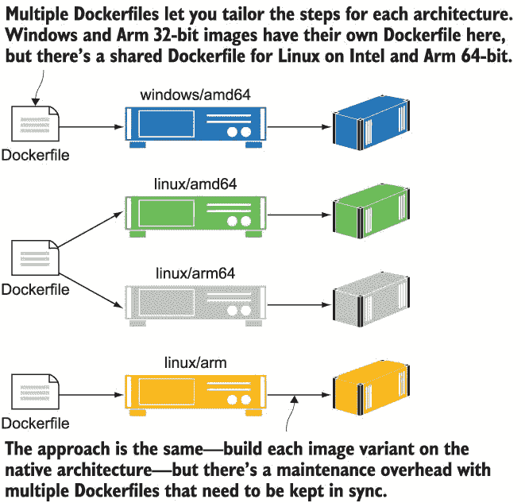

图 16.5 您还可以使用针对每个架构定制的 Dockerfile 构建多架构镜像。

现在试试看 使用每个平台的 Dockerfile 为不同的平台构建镜像。每个 Dockerfile 都略有不同，所以我们可以比较运行容器时的结果：

` cd ./folder-list`  ` # 为本地架构编译 - Intel/AMD:` ` docker image build -t diamol/ch16-folder-list:linux-amd64 -f ./Dockerfile.linux-amd64 .`  ` # 为 Arm 64 位编译:` ` docker image build -t diamol/ch16-folder-list:linux-arm64 -f ./Dockerfile.linux-arm64 --platform linux/arm64 .`  ` # 和 Arm 32 位` ` docker image build -t diamol/ch16-folder-list:linux-arm -f ./Dockerfile.linux-arm --platform linux/arm .`  ` # 运行所有容器并验证输出:` ` docker container run diamol/ch16-folder-list:linux-amd64` ` docker container run diamol/ch16-folder-list:linux-arm64` ` docker container run diamol/ch16-folder-list:linux-arm`

容器在运行时打印一些简单的文本--一个硬编码的字符串，声明它们应该使用的操作系统和架构，然后是操作系统报告的实际操作系统和 CPU，接着是一个包含单个文件的文件夹列表。您可以在图 16.6 中看到我的输出。Docker 在必要时使用仿真，所以在这种情况下，它使用 Arm 模拟器来运行 Arm-32 和 Arm-64 Linux 变体。

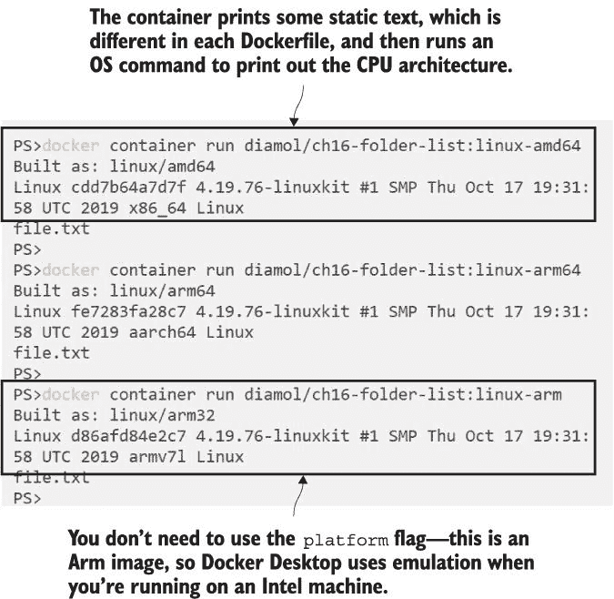

图 16.6 镜像是为特定架构构建的，但 Docker Desktop 也支持仿真。

Linux 变体的 Dockerfile 都非常相似，除了预期的架构的硬编码字符串。Windows 变体具有相同的行为，但 Windows 有不同的命令来打印输出。这就是为什么每个架构的多个 Dockerfile 都很有用；我可以有完全不同的 Dockerfile 指令，但仍然得到相同期望的输出。列表 16.1 比较了 64 位 Arm Linux 版本的 Dockerfile 和 64 位 Intel Windows 版本的 Dockerfile。

列表 16.1 Linux 和 Windows 镜像变体的 Dockerfile

` # linux` ` FROM diamol/base:linux-arm64`  ` WORKDIR /app` ` COPY file.txt .`  ` CMD echo "Built as: linux/arm64" && \` `       uname -a && \` `       ls /app` ` # windows` ``  # escape=` `` ` FROM diamol/base:windows-amd64`  ` WORKDIR /app` ` COPY file.txt .`  ``  CMD echo Built as: windows/amd64 && ` `` ``        echo %PROCESSOR_ARCHITECTURE% %PROCESSOR_IDENTIFIER% && ` `` `         dir /B C:\app`

每个版本都从一个不同的 `FROM` 镜像开始，这个镜像针对的是目标架构，而不是多架构镜像。Windows Dockerfile 使用 `escape` 关键字来更改换行符，将其更改为反引号而不是默认的反斜杠，这样我就可以在目录路径中使用反斜杠。Windows 没有与 Linux `uname` 命令等效的命令，所以为了打印 CPU 架构，我输出了 Windows 设置的一些环境变量。功能大致相同，但我可以采取不同的路径来实现，因为这是一个特定于 Windows 的 Dockerfile。

如果你想要构建第三方应用的多架构版本，通常需要多个 Dockerfile。本书中 Prometheus 和 Grafana 的黄金镜像就是很好的例子。项目团队发布了所有我想使用的 Linux 变体的多架构镜像，但没有为 Windows 发布。因此，我有一个基于项目镜像的 Linux Dockerfile 和一个从网络下载安装应用的 Windows Dockerfile。对于你自己的应用，应该很容易有一个单一的 Dockerfile 并避免额外的维护，但你需要小心，只使用你知道在所有目标架构上都能工作的操作系统命令子集。很容易不小心包含一个在某个架构上不工作的命令（比如`uname`），最终导致一个损坏的版本。

现在尝试一下：对于文件夹列表应用程序，还有一个 Dockerfile，它尝试创建一个多架构 Dockerfile。它使用多架构镜像作为基础，但它混合了 Linux 和 Windows 命令，因此构建的镜像将在每个架构上都会失败。

` # 构建多架构应用：` ` docker image build -t diamol/ch16-folder-list .`  ` # 尝试运行它：` ` docker container run diamol/ch16-folder-list`

你会发现构建过程成功完成，看起来你有一个好的镜像，但每次运行容器时都会失败。你可以看到我在图 16.7 中的输出——我运行了镜像的 Linux 和 Windows 版本，但两个容器都失败了，因为`CMD`指令包含无效的命令。

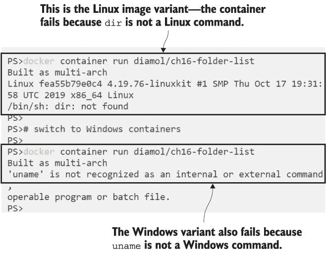

图 16.7 构建一个在部分平台上运行时失败的多架构镜像很容易。

这一点很重要，尤其是如果你使用复杂的启动脚本。如果你使用未知的操作系统命令，`RUN`指令将在构建时失败，但`CMD`指令不会被验证，所以你不知道镜像已损坏，直到你尝试运行一个容器。

在我们继续推进多架构镜像之前，有一件最后的事情需要了解，那就是要明白 Docker 支持哪些架构，以及当你开始使用它们时可能会遇到的各个奇怪的代号。表 16.1 显示了主要的操作系统和 CPU 架构组合及其别名。

表 16.1 Docker 支持的架构及其代号

| OS | CPU | 字长 | CPU 名称 | CPU 别名 |
| --- | --- | --- | --- | --- |
| Windows | Intel/AMD | 64 位 | amd64 | x86_64 |
| Linux | Intel/AMD | 64 位 | amd64 | x86_64 |
| Linux | Arm | 64 位 | arm64 | aarch64, armv8 |
| Linux | Arm | 32 位 | arm | arm32v7, armv7, armhf |

Docker 支持许多其他架构，但这些都是您会发现的主要架构。amd64 CPU 类型是 Intel 和 AMD 机器中相同的指令集，为几乎所有桌面、服务器和笔记本电脑提供动力（Docker 还支持 32 位 Intel x86 处理器）。32 位和 64 位 Arm CPU 存在于手机、物联网设备和单板计算机中；最著名的是树莓派，直到 Pi4 发布之前都是 32 位的，Pi4 是 64 位的。大型机用户也不会被排除在外——Docker 支持 Linux 的 IBM CPU 架构，所以如果您在地下室有一台 IBM Z、POWER 或 PowerPC 机器，您也可以将大型机应用程序迁移到 Docker 容器中。

## 16.3 将多架构图像推送到带有清单的注册表

您可以使用 Docker Desktop 构建不同 CPU 架构的 Linux 图像，但它们只有在您将它们与清单一起推送到注册表时才成为多架构图像。清单是一块元数据，它将多个图像变体链接到相同的图像标签。清单使用 Docker 命令行生成并推送到注册表。清单包含所有图像变体的列表，它们需要首先存在于注册表中，因此工作流程是创建和推送所有图像，然后创建和推送清单。

现在试试吧！推送您构建的文件夹列表应用的图像变体。首先，您需要用您的 Docker Hub ID 标记它们，以便将它们推送到您的账户——您没有权限将图像推送到 diamol 组织：

` # 将您的 Docker ID 存储在一个变量中 - 在 Windows 上：` ` $dockerId = '<your-docker-hub-id>'`  ` # 或者 Linux 上：` ` dockerId='<your-docker-hub-id>'`  ` # 使用您自己的账户名称标记图像：` ` docker image tag diamol/ch16-folder-list:linux-amd64 "$dockerId/ch16-folder-list:linux-amd64"` ` docker image tag diamol/ch16-folder-list:linux-arm64 "$dockerId/ch16-folder-list:linux-arm64"` ` docker image tag diamol/ch16-folder-list:linux-arm "$dockerId/ch16-folder-list:linux-arm"`  ` # 并推送到 Docker Hub（这将推送图像的所有标签）:` ` docker image push "$dockerId/ch16-folder-list"`

您将看到所有图像都推送到 Docker Hub。Docker 注册表与架构无关——图像规范对所有架构都是相同的，并且注册表以相同的方式存储它们。注册表知道图像是为哪个架构构建的，并在它们被拉取之前将其提供给 Docker Engine 作为检查。我的输出在图 16.8 中——每个图像的架构存储在图像元数据中。我也将其包含在标签中，但这不是必需的。

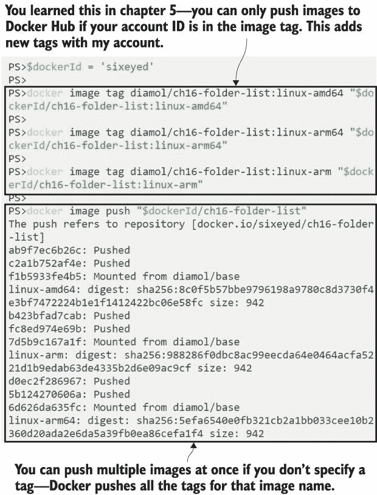

图 16.8 推送所有图像变体是使多架构图像可用的第一阶段。

管理 Docker 清单是命令行的一个功能，但它是一个新功能，因此您需要启用实验性功能。CLI 和 Docker 引擎都支持实验性功能，但您必须明确选择才能使用它们。您的引擎可能已经在使用它们，但您还需要为客户端启用它们。您可以在 Docker Desktop 的设置中这样做，或者对于 Docker 引擎在命令行上这样做。

现在尝试一下 如果您使用 Docker Desktop，从鲸鱼菜单打开设置，并导航到命令行部分。切换启用实验性功能标志，如图 16.9 所示。

图 16.9 启用 CLI 的实验性功能解锁了 Docker 清单命令。

如果您使用 Docker Community Engine（或企业引擎），从您的家目录编辑或创建 CLI 配置文件：`~/.docker/config.json`。您只需要一个设置：

` { "experimental":"enabled" }`

现在您的 CLI 处于实验模式，您已经解锁了 `docker` `manifest` 命令，您可以使用这些命令在本地创建清单，将它们推送到注册表，并且还可以检查注册表上现有的清单。检查清单是查看图像支持哪些架构的好方法，而无需导航 Docker Hub UI。您不需要在本地拉取任何图像--该命令会从注册表中读取所有元数据。

现在尝试一下 通过检查本书基础图像的已发布清单来验证您的 CLI 是否适用于清单命令：

` docker manifest inspect diamol/base`

`manifest` `inspect` 命令没有过滤器参数--您无法限制输出。它将显示所有图像清单，因此它适用于单个图像以及多架构图像。在输出中，您可以看到每个图像的唯一摘要，以及 CPU 架构和操作系统。我的输出在图 16.10 中。我使用了 `jq` 命令来过滤输出，但这只是为了更容易阅读；您不需要自己这样做。

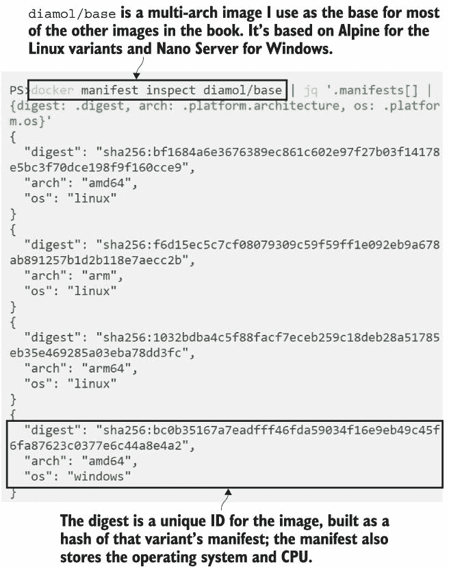

图 16.10 多架构图像有几个清单；每个清单都包含图像的架构。

现在您可以创建清单，就像图像一样，它首先存在于您的本地机器上，然后您将其推送到注册表。从技术上讲，您正在创建的是一个清单列表，它将一组图像组合在单个图像标签下。每个图像都已经有一个清单，您可以从注册表中检查它，但如果返回多个清单，您将有一个多架构图像。图 16.11 显示了图像、清单和清单列表之间的关系。

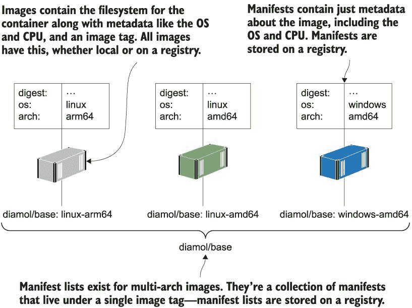

图 16.11 清单和清单列表存在于 Docker 注册表中，并包含有关图像的元数据。

你可以将清单列表视为镜像标签列表，清单列表的名称即为多架构镜像的名称。你迄今为止构建的所有镜像都有标签来标识操作系统和 CPU；你可以使用不带标签的相同镜像名称创建清单，这将作为使用默认 `latest` 标签的多架构镜像可用。你也可以使用包含版本号（除操作系统和 CPU 之外）的标签推送你的镜像，然后多架构标签将只是版本号。

现在尝试一下 创建一个清单以链接所有 Linux 变体，并将其推送到 Docker Hub。清单的名称成为多架构镜像的镜像标签。

` # 创建一个包含名称和所有标签的清单：` ` docker manifest create "$dockerId/ch16-folder-list" "$dockerId/ch16-folder-list:linux-amd64" "$dockerId/ch16-folder-list:linux-arm64" "$dockerId/ch16-folder-list:linux-arm"`  ` # 将清单推送到 Docker Hub：` ` docker manifest push "$dockerId/ch16-folder-list"`  ` # 现在浏览到 Docker Hub 上的你的页面并检查镜像`

当你浏览到 Docker Hub 上的镜像时，你会发现有一个 `latest` 标签，包含多个变体——UI 显示操作系统和 CPU 架构，以及唯一标识每个镜像的摘要。任何拥有 Linux Docker 引擎的人都可以从这个镜像运行容器，它将在英特尔或 AMD 机器上运行 amd64 变体，在 AWS A1 机器或最新的树莓派上运行 arm64 变体，以及在较旧的 Pi 上运行 arm 变体。你可以在图 16.12 中看到我在 Docker Hub 上的仓库。

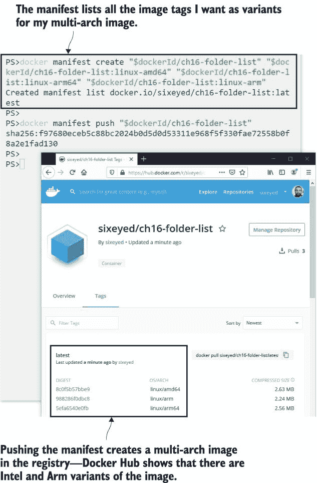

图 16.12 多架构镜像具有单个名称但许多变体。Docker Hub 显示所有变体。

这些 Arm 镜像是使用 Docker Desktop 中的模拟构建的，这仅适用于偶尔的构建。模拟很慢，并且不是每个指令在模拟中的工作方式都与在真实 CPU 中相同。如果你想支持多架构镜像，并且希望构建快速且针对目标 CPU 100% 准确，你需要一个构建农场。这就是我在本书中构建镜像的原因——几块具有不同 CPU 架构的单板计算机，配置了我要支持的所有操作系统。我的 Jenkins 作业连接到每台机器上的 Docker 引擎，为每个架构构建一个镜像变体并将其推送到 Docker Hub，然后作业创建并推送清单。

## 16.4 使用 Docker Buildx 构建多架构镜像

运行 Docker 构建农场还有另一种更高效且更易于使用的方法，那就是使用 Docker 的新功能 Buildx。Buildx 是 Docker 构建命令的扩展版本，它使用一个新的构建引擎，该引擎经过大量优化以提高构建性能。它仍然使用 Dockerfile 作为输入并生成镜像作为输出，因此您可以使用它作为 `docker` `image` `build` 的直接替代品。Buildx 在跨平台构建方面表现尤为出色，因为它与 Docker 上下文集成，并且可以通过单个命令在多个服务器之间分配构建。

Buildx 目前不支持 Windows 容器，并且它只支持从单个 Dockerfile 构建，因此它不会涵盖每个场景（我无法用它来构建这本书的镜像）。但如果您只需要支持 Linux 的 CPU 变体，它工作得非常好。您可以使用 Buildx 创建和管理构建农场，以及构建镜像。

我们将使用 Play with Docker 进行一个完整的端到端示例，这样您就可以尝试一个真实的分布式构建农场。第一步是为构建农场中的每个节点创建一个 Docker 上下文。

现在尝试一下，首先设置您的 PWD 会话。浏览到 *[`play-with-docker.com`](https://play-with-docker.com)* 并将两个实例添加到您的会话中。我们将使用 node1 来执行所有命令。首先存储 node2 的 IP 地址并验证 SSH 连接；然后为 node1 和 node2 创建上下文：

` # 存储 node2 的 IP 地址：` ` node2ip=<your-node-2-ip>`  ` # 验证 ssh 连接：` ` ssh $node2ip`  ` # 然后 exit 以返回到 node1` ` exit`  ` # 使用本地套接字为 node1 创建上下文：` ` docker context create node1 --docker "host=unix:///var/run/docker.sock"`  ` # 使用 SSH 为 node2 创建上下文：` ` docker context create node2 --docker "host=ssh://root@$node2ip"`  ` # 检查上下文是否存在：` ` docker context ls`

这些上下文是为了使 Buildx 设置更简单。您可以在图 16.13 中看到我的输出--node1 是我将运行 Buildx 的客户端，因此它使用本地通道，并且配置为通过 SSH 连接到 node2。

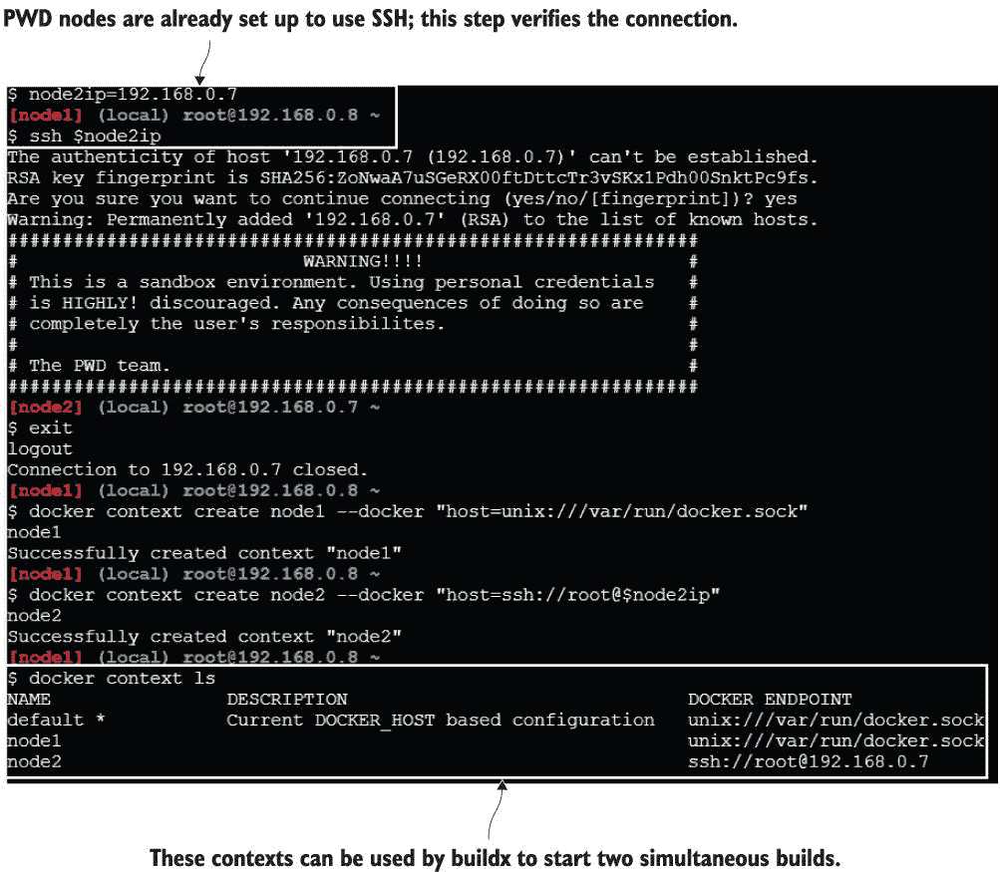

图 16.13 Buildx 可以使用 Docker 上下文来设置构建农场，因此创建上下文是第一步。

设置您的上下文是创建构建农场的第一步。在实际环境中，您的自动化服务器将是 Buildx 客户端，因此您会在 Jenkins（或您使用的任何系统）中创建 Docker 上下文。您将拥有一个或多个机器来支持您想要支持的每个架构，并且您将为它们中的每一个创建一个 Docker 上下文。这些机器不需要与 Swarm 或 Kubernetes 集群；它们可以是仅用于构建镜像的独立机器。

接下来，您需要安装和配置 Buildx。Buildx 是一个 Docker CLI 插件——客户端已经安装在 Docker Desktop 和最新的 Docker CE 版本中（您可以通过运行 `docker buildx` 来检查）。PWD 没有 Buildx，因此我们需要手动安装它，然后设置一个使用我们两个节点的构建器。

现在试试 Buildx，这是一个 Docker CLI 插件——要使用它，您需要下载二进制文件并将其添加到您的 CLI 插件文件夹中：

` # 下载最新的 Buildx 二进制文件：` ` wget -O ~/.docker/cli-plugins/docker-buildx https://github.com/docker/buildx/releases/download/v0.3.1/buildx-v0.3.1.linux-amd64`  ` # 将文件设置为可执行：` ` chmod a+x ~/.docker/cli-plugins/docker-buildx`  ` # 现在插件已经安装，使用它通过 node1 创建构建器：` ` docker buildx create --use --name ch16 --platform linux/amd64 node1`  ` # 并将 node2 添加到构建器中：` ` docker buildx create --append --name ch16 --platform linux/386 node2`  ` # 检查构建器设置：` ` docker buildx ls`

Buildx 非常灵活。它使用 Docker 上下文发现潜在的构建节点，并连接到它们以查看它们支持哪些平台。您创建一个构建器并将其节点添加到其中，您可以让 Buildx 确定每个节点可以构建的平台，或者您可以具体指定并将节点限制在特定平台上。这就是我在这里所做的那样，所以 node1 将只构建 x64 镜像，而 node2 将只构建 386 镜像。您可以在图 16.14 中看到这一点。

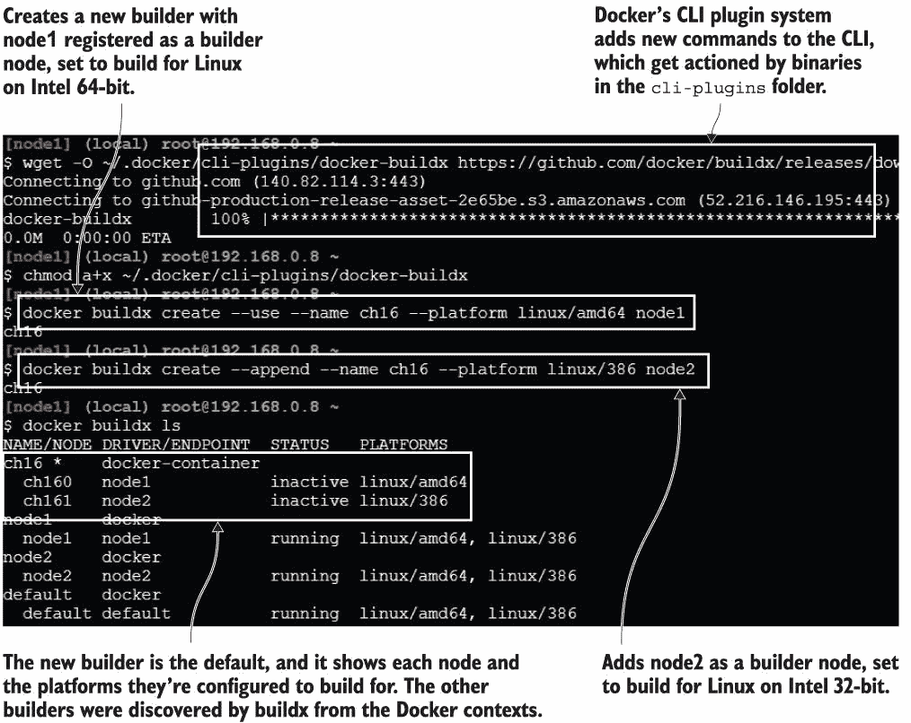

使用 Buildx 设置构建农场非常简单；它使用 Docker 上下文连接到引擎。

现在，构建农场已经准备好了。它可以构建可以以 32 位或 64 位 Intel Linux 容器运行的多架构镜像，只要构建的 Dockerfile 使用的镜像支持这两种架构。Buildx 在构建节点上并发启动构建，将 Dockerfile 和包含 Docker 构建上下文的文件夹（通常包含您的源代码）发送给它们。您可以在 PWD 会话中克隆这本书的 Git 仓库，然后使用单个 Buildx 命令构建和推送此练习的多架构镜像。

现在试试 Buildx。克隆源代码并切换到一个包含文件夹列表应用的多架构 Dockerfile 的文件夹。使用 Buildx 构建和推送多个变体：

` git clone https://github.com/sixeyed/diamol.git` ` cd diamol/ch16/exercises/folder-list-2/`  ` # 存储您的 Docker Hub ID 并登录，以便 Buildx 可以推送镜像：` ` dockerId=<your-docker-id>` ` docker login -u $dockerId`  ` # 使用 Buildx 通过 node1 和 node2 构建和推送两个变体：` ` docker buildx build -t "$dockerId/ch16-folder-list-2" --platform linux/amd64,linux/386 --push .`

Buildx 构建的输出令人印象深刻--当其他人可以看到你的屏幕时，让它运行是件好事。客户端显示了每个构建节点上的日志行，你得到了大量的快速输出，看起来你正在做一项非常技术性的工作。实际上，Buildx 做了所有的工作，你将从输出中看到它甚至为你推送镜像、创建清单并推送清单。图 16.15 显示了构建的结束和 Docker Hub 上的镜像标签。

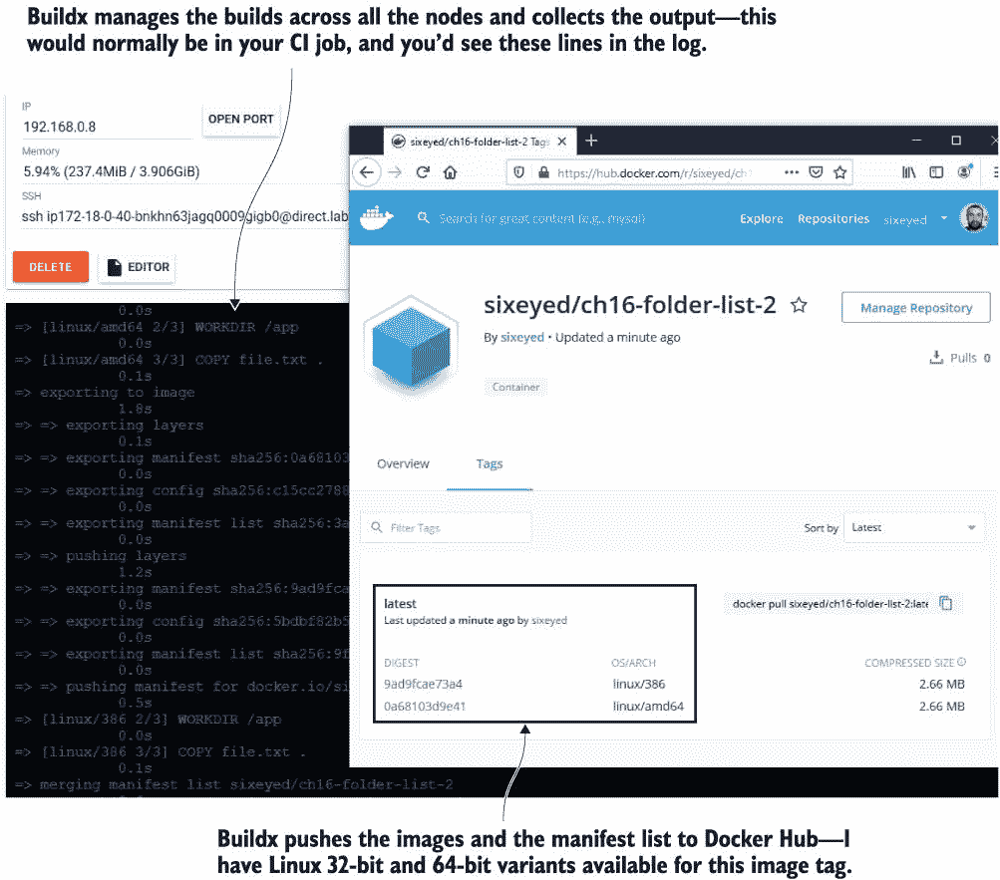

图 16.15 Buildx 分发 Dockerfile 和构建上下文，收集日志，并推送镜像。

Buildx 使这些多架构构建变得非常简单。你提供你想要支持的每个架构的节点，Buildx 可以使用它们全部，所以无论你是在为两个架构还是十个架构构建，你的构建命令都不会改变。与 Docker Hub 上的 Buildx 镜像有一个有趣的不同之处--没有为变体设置单独的镜像标签，只有一个单一的多架构标签。与之前我们手动推送变体并添加清单的部分相比--所有变体在 Docker Hub 都有自己的标签，随着你构建和部署更多镜像版本，这可能会让用户难以导航。如果你不需要支持 Windows 容器，Buildx 是目前构建多架构镜像的最佳方式。

## 16.5 理解多架构镜像在你的路线图中的位置

可能你现在不需要多架构镜像。没关系--无论如何，感谢你阅读了这一章。了解多架构镜像的工作原理以及如何构建自己的镜像绝对值得，即使你现在还没有计划这么做，因为它们很可能出现在你的路线图中。你可能承担了一个需要支持物联网设备的项目，或者你可能需要削减云运行成本，或者也许你的客户迫切需要 Windows 支持。图 16.16 显示了项目如何随着支持多架构镜像的需求而发展，在需要时在多年内添加更多变体。

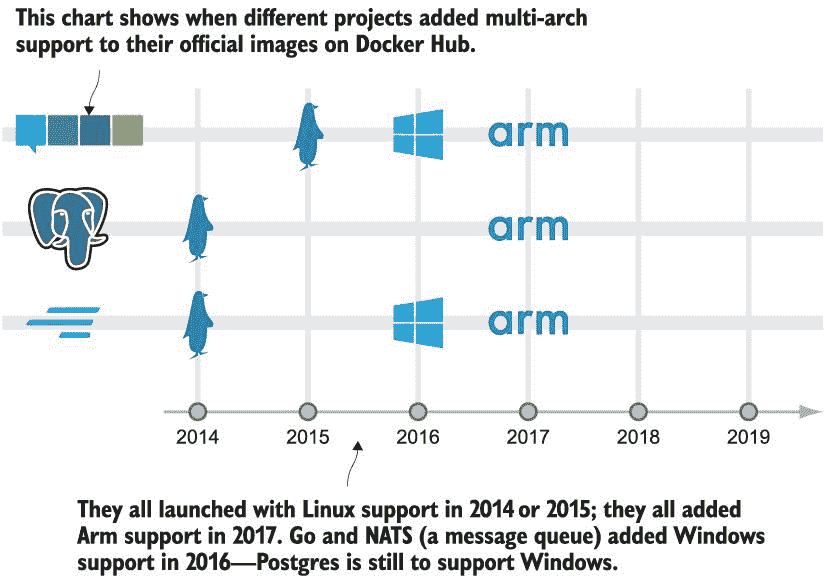

图 16.16 项目以 Linux Intel 支持启动，并随着其流行添加变体。

如果你坚持为所有 Dockerfile 遵循两个简单的规则，你可以确保自己的未来兼容性，并使多架构镜像的转换变得简单：在`FROM`指令中始终使用多架构镜像，不要在`RUN`或`CMD`指令中包含任何特定于操作系统的命令。如果你需要一些复杂的部署或启动逻辑，你可以使用与你的应用程序相同的语言构建一个简单的实用程序应用程序，并在构建的另一个阶段进行编译。

Docker Hub 上的所有官方镜像都是多架构的，所以使用这些作为你的基础镜像是一个好主意（或者你可以使用官方镜像创建自己的黄金基础镜像）。本书的所有黄金镜像也都是多架构的，如果你需要灵感，可以检查源代码中的`images`文件夹，那里有一系列大量的示例。作为一个粗略的指南，所有现代的应用平台都支持多架构（Go、Node.js、.NET Core、Java），如果你在寻找数据库，Postgres 是我找到的最佳多架构选项。

目前还没有支持所有架构的托管构建服务——一些支持 Linux 和 Windows，但如果你还需要 Arm，你需要自己设置。你可以在 AWS 上运行一个相当便宜的构建农场，使用安装了 Docker 的 Linux、Windows 和 Arm 虚拟机。如果你需要 Linux 和 Windows 但不需要 Arm，你可以使用像 Azure DevOps 或 GitHub Actions 这样的托管服务。重要的是不要假设你永远不会需要支持其他架构：遵循 Dockerfile 中的最佳实践，使多架构支持变得容易，并且知道如果你确实需要添加多架构支持，你需要采取哪些步骤来演进你的构建管道。

## 16.6 实验室

本章的实验要求你修复一个 Dockerfile，使其能够用于生成多架构镜像。如果你有一个没有遵循我的最佳实践建议的 Dockerfile，你可能会遇到这种情况——这个 Dockerfile 基于特定架构的镜像，并使用不兼容的操作系统命令。我希望你修复本章实验文件夹中的 Dockerfile，使其能够构建针对 Linux on Intel 或 Arm，以及 Windows on Intel 的镜像。解决这个问题有很多方法；这里只是给你提供一些建议：

+   一些 Dockerfile 指令是跨平台的，而`RUN`指令中的等效操作系统命令可能不是。

+   一些 Windows 命令与 Linux 相同，在本书的黄金基础镜像中，有一些别名使得其他 Linux 命令可以在 Windows 上运行。

你可以在 GitHub 上找到该章节的`Dockerfile.solution`文件，链接为：*[`github.com/sixeyed/diamol/blob/master/ch16/lab/README.md`](https://github.com/sixeyed/diamol/blob/master/ch16/lab/README.md)*。
