# 17 优化 Docker 镜像以实现大小、速度和安全性

一旦你的应用程序被容器化并在集群中运行良好，你可能认为你可以直接进入生产环境，但还有一些最佳实践你需要投入时间。优化你的 Docker 镜像是最重要的之一，因为你需要你的构建和部署要快，你的应用程序内容要安全，你的夜晚要自由——你不想在凌晨 2 点被叫醒，因为你的服务器磁盘空间已满。Dockerfile 语法小巧直观，但它隐藏了一些你需要理解以充分利用镜像构建的复杂性。

本章将带你深入了解镜像格式，让你知道如何以及为什么需要优化它。我们将基于第三章的内容，你学习了 Docker 镜像是从多个镜像层合并而成的。

## 17.1 如何优化 Docker 镜像

Docker 镜像格式高度优化。尽可能地在镜像之间共享层，这减少了构建时间、网络流量和磁盘使用。但 Docker 对数据持保守态度，它不会自动删除你拉取的镜像——这是你需要明确执行的事情。所以当你替换容器以更新你的应用程序时，Docker 会下载新的镜像层，但不会删除任何旧的镜像层。你的磁盘很容易被大量的旧镜像层吞噬，尤其是在经常更新的开发或测试机器上。

现在试试看 你可以使用 `system` `df` 命令查看你的镜像实际占用的磁盘空间，该命令还会显示容器、卷和构建缓存磁盘使用情况：

` docker system df`

如果你从未清理过 Docker 引擎中的旧镜像，你可能会对结果感到惊讶。我的输出在图 17.1 中——你可以看到有 185 个镜像，总共占用 7.5 GB 的存储空间，尽管我没有运行任何容器。

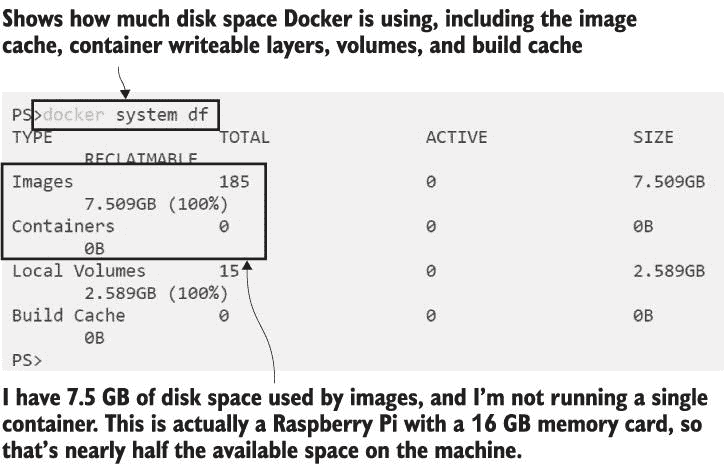

图 17.1 很容易看到你的磁盘被你甚至没有使用的 Docker 镜像吞噬了。

这个例子是一个轻微的例子——我见过一些被忽视的服务器已经运行 Docker 几年了，浪费了数百 GB 的空间在未使用的镜像上。定期运行 `docker` `system` `prune` 是一个好习惯——它清除镜像层和构建缓存，而不删除完整的镜像。你可以通过计划任务来运行它以删除未使用的层，但如果你的镜像已经优化，那么这不会成为一个大问题。优化你的技术栈的部分通常是一个周期性的过程，有很多小的改进，但使用 Docker，通过遵循一些简单的最佳实践，你可以很容易地做出大的改进。

第一条规则是除非你需要它们，否则不要将文件包含在你的镜像中。这听起来很明显，但你经常会编写一个 Dockerfile，复制整个文件夹结构，而没有意识到该文件夹包含文档或图像或其他在运行时不需要的二进制文件。明确列出你复制的文件可以是你节省的第一个大步骤。比较列表 17.1 中的 Dockerfile——第一个示例复制了整个文件夹，而第二个示例意识到复制添加了一些额外的文件，并包含了一个新步骤来删除它们。

列表 17.1 尝试通过删除文件优化 Dockerfile

` # Dockerfile v1 - 复制整个目录结构：` ` FROM diamol/base` ` CMD echo app- && ls app && echo docs- && ls docs` ` COPY . .` ` # Dockerfile v2 - 添加一个新步骤来删除未使用的文件` ` FROM diamol/base` ` CMD echo app- && ls app && echo docs- && ls docs` ` COPY . .` ` RUN rm -rf docs`

在 v2 Dockerfile 中，你会认为镜像大小会更小，因为它删除了额外的 `docs` 文件夹，但图像层的工作方式并非如此。图像是所有层的合并，所以文件仍然存在于 `COPY` 层；它们只是被隐藏在删除层中，所以总镜像大小并没有缩小。

现在试试看！构建这两个示例并比较大小

` cd ch17/exercises/build-context` ` docker image build -t diamol/ch17-build-context:v1 .` ` docker image build -t diamol/ch17-build-context:v2 -f ./Dockerfile.v2 .` ` docker image ls -f reference= diamol/ch17*`

你会发现 v2 图像的大小与 v1 图像完全相同，就像没有运行删除文件夹的 `rm` 命令一样。你可以看到我在图 17.2 中的输出——我正在使用 Linux 容器，所以大小非常小，但几乎一半的大小来自 `docs` 文件夹中的不必要文件。

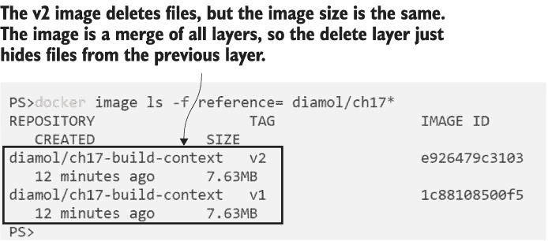

图 17.2 惊奇！如果删除操作在其自己的图层中，删除文件并不会减少图像大小。

Dockerfile 中的每条指令都会生成一个图像层，层合并在一起形成整个图像。如果你在层中写入文件，这些文件将永久存在；如果你在后续层中删除它们，Docker 只是在文件系统中隐藏它们。这是当你进行图像优化时需要理解的一个基本概念——试图在后续层中删除冗余是没有用的——你需要优化每个层。你可以通过从删除之前运行的层中运行图像来轻松地看到删除层只是通过隐藏文件来实现的。

现在试试看！如果你在缓存中有这些层，你可以从任何图像层运行容器。比较最终镜像与之前的图像层：

` # 从完成的镜像运行容器：` ` docker container run diamol/ch17-build-context:v2` ` # 检查图像历史记录以找到上一个层 ID：` ` docker history diamol/ch17-build-context:v2` ` # 从那个上一个层运行容器：` ` docker container run <previous-layer-id>`

镜像的最后一层没有特殊之处。你可以从图像堆栈中的某个层运行容器，并且你会看到文件系统合并到该层。我的输出在图 17.3 中--你可以看到当我从上一个镜像层运行容器时，所有已删除的文件都是可用的。

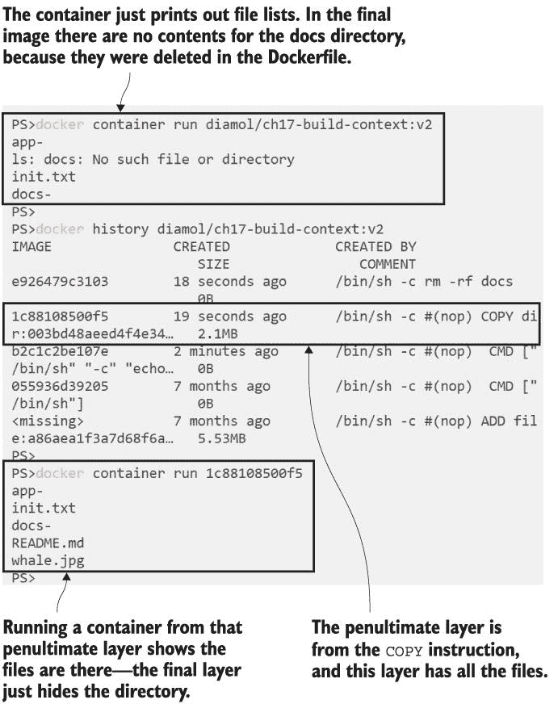

图 17.3 合并的文件系统隐藏了已删除的文件，但你仍然可以从之前的层访问它们。

这是关于优化的第一个要点--不要将不需要运行应用程序的任何内容复制到镜像中。即使你在后续指令中尝试删除它，它仍然会在镜像堆栈的某个地方存在，占用磁盘空间。在`COPY`指令中更精确地指定，只将你想要的文件带入镜像会更好。这会使镜像尺寸更小，并且也会使你的 Dockerfile 中的安装文档更加清晰。列表 17.2 显示了此简单应用程序的优化 v3 Dockerfile--与 v1 相比，唯一的更改是它复制了`app`子文件夹而不是整个目录。

列表 17.2 仅复制必要文件的优化 Dockerfile

` FROM diamol/base` ` CMD echo app- && ls app && echo docs- && ls docs` ` COPY ./app ./app`

当你构建这个项目时，你会发现图像的大小更小，但在这里你还可以进行另一种优化。Docker 在构建过程中会压缩构建上下文（即运行构建的文件夹）并将其与 Dockerfile 一起发送到引擎。这就是你如何从本地机器上的文件在远程引擎上构建镜像的方法。构建上下文通常包含你不需要的文件，因此你可以通过在名为`.dockerignore`的文件中列出文件路径或通配符来排除它们。

现在尝试一下：构建优化的 Docker 镜像，然后使用`.dockerignore`文件再次构建，以减小上下文的大小：

` # 构建优化后的镜像；这会将未使用的文件添加到上下文中：` ` docker image build -t diamol/ch17-build-context:v3 -f ./Dockerfile.v3 .`  ` # 现在重命名已准备好的忽略文件并检查其内容：` ` mv rename.dockerignore .dockerignore` ` cat .dockerignore`  ` # 再次运行相同的构建命令：` ` docker image build -t diamol/ch17-build-context:v3 -f ./Dockerfile.v3 .`

你会看到在第一个构建命令中，Docker 将 2 MB 的构建上下文发送到引擎。这没有压缩，所以它是该文件夹中文件的全尺寸--其中大部分是一个 2 MB 的鲸鱼图片。在第二个构建中，当前目录中有一个`.dockerignore`文件，它告诉 Docker 排除 docs 文件夹和 Dockerfile，因此构建上下文现在是 4 KB。你可以在图 17.4 中看到我的输出。

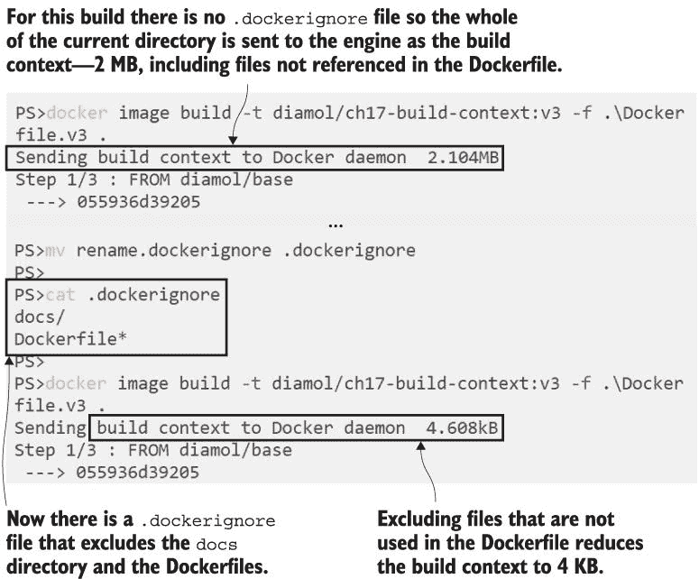

图 17.4 使用`.dockerignore`文件减小构建上下文的大小和发送时间。

`.dockerignore`文件在计算构建上下文中未使用数据的成本时可以节省你大量时间，并且它可以节省空间，即使你在 Dockerfile 中使用显式路径。可能你是在本地构建代码，同时也使用多阶段构建在 Docker 中编译--你可以在`.dockerignore`文件中指定构建的二进制文件，并确保它们不会被复制到镜像中。文件格式与 Git 的`.gitignore`文件相同，你可以从 GitHub 上的应用平台模板作为良好的起点（如果你的 Dockerfile 位于仓库的根目录，你应该包括 Git 历史文件夹`.git`）。

现在你已经看到了管理进入你的 Docker 镜像的文件的重要性，我们将退一步看看你用作基础的镜像。

## 17.2 选择合适的基镜像

基镜像大小的选择在安全性、磁盘空间和网络传输时间方面同样重要。如果你的基础操作系统镜像很大，它可能包含各种可能在真实机器上有用的工具，但在容器中可能成为安全漏洞。如果你的操作系统基础镜像安装了 curl，攻击者可能利用它下载恶意软件或将你的数据上传到他们的服务器，如果他们设法从你的应用程序容器中突破出来。

这也适用于应用平台基镜像。如果你正在运行 Java 应用程序，OpenJDK 官方镜像是一个好的基础，但有许多标签具有不同的 Java 运行时（JRE）和开发 SDK（JDK）配置。表 17.1 显示了 SDK 与运行时以及最精简版本的多架构镜像的大小差异：

表 17.1 Docker Hub 上兼容 Java 11 镜像的大小差异

|  | :11-jdk | :11-jre | :11-jre-slim | :11-jre-nanoserver-1809 |
| --- | --- | --- | --- | --- |
| Linux | 296 MB | 103 MB | 69 MB |  |
| Windows | 2.4 GB | 2.2 GB |  | 277 MB |

Linux 用户可以使用 69 MB 的基础镜像而不是 296 MB，Windows 用户可以使用 277 MB 而不是 2.4 GB，只需在 Docker Hub 上检查变体，选择具有最小操作系统镜像和最小 Java 安装的镜像。OpenJDK 团队对多架构镜像持谨慎态度。他们选择具有最广泛兼容性的镜像，但尝试使用较小的变体很简单。作为一个好的规则，使用 Alpine 或 Debian Slim 镜像作为 Linux 容器的基操作系统，对于 Windows 容器使用 Nano Server（另一种选择是 Windows Server Core，它几乎与完整的 Windows Server OS 相同--这就是磁盘空间达到数 GB 的原因）。并非每个应用程序都能与较小的变体一起工作，但很容易在`FROM`行中切换镜像并测试它。

大小不仅仅是关于磁盘空间，它还关乎占用空间的内容。最大的 OpenJDK 镜像包括了整个 Java SDK，因此如果有人设法破坏您的容器，这里就有一个很好的攻击向量。他们可以将一些 Java 源代码文件写入容器的磁盘，使用 SDK 编译它们，并运行一个在您的应用容器安全上下文中做任何他们想做的应用。

现在尝试一下 本章的练习之一是一个使用默认 JDK 镜像的 Java 应用程序。它运行一个非常简单的 REST API，总是返回值 `true`：

` cd ch17/exercises/truth-app`  ` # 构建镜像 - 基础镜像使用 :11-jdk 标签:` ` docker image build -t diamol/ch17-truth-app .`  ` # 运行应用并尝试使用它:` ` docker container run -d -p 8010:80 --name truth diamol/ch17-truth-app` ` curl http://localhost:8010/truth`

您正在运行的容器包含 Java REST API，该 API 在镜像中编译，但它也包含所有编译其他 Java 应用程序的工具。如果攻击者设法从应用中突破并运行任意命令，他们可以运行自己的代码，在您的应用容器安全上下文中做任何他们想做的事情。在这个镜像中，我“意外”包含了一个测试代码文件，恶意用户可以找到并运行它来改变应用的行为。

现在尝试一下 通过连接到您的 API 容器中的 shell 来模拟容器突破。然后使用 JDK 编译并运行测试代码，之后再次检查应用：

` # 连接到 API 容器 - 对于 Linux 容器:` ` docker container exec -it truth sh`  ` # 或者对于 Windows 容器:` ` docker container exec -it truth cmd`  ` # 在容器内编译并运行测试 Java 文件:` ` javac FileUpdateTest.java` ` java FileUpdateTest` ` exit`  ` # 回到您的机器上，再次尝试 API:` ` curl http://localhost:8010/truth`

您会看到应用的行为已经改变--测试用例将响应设置为 `false` 而不是 `true`。图 17.5 中的输出显示的是“黑客”之前的原始响应和改变后的响应。

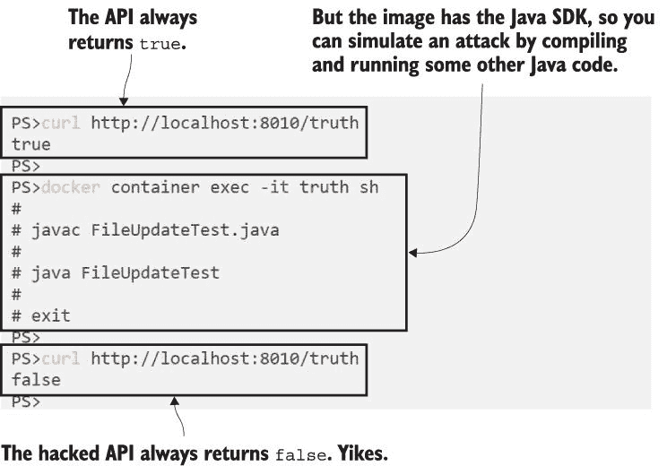

图 17.5 在您的应用镜像中包含 SDK 会让您面临任意代码执行攻击。

这是一个稍微有些牵强的例子，因为测试文件就在镜像中，使得事情变得简单，但容器突破是可能的，这展示了有趣的攻击选项。平台可以将容器锁定以防止网络访问，但这种攻击仍然有效。教训是，您的基镜像应该包含运行您的应用所需的一切，但不要包含构建应用（如 Node.js 和 Python 这样的解释型语言需要构建工具才能运行）的额外工具。

金色镜像是一种绕过这个问题的方法。你有一个团队选择合适的基镜像并为你组织构建自己的版本。我在这本书中采用了这种方法--我的 Java 应用程序是从 `diamol/openjdk` 构建的，这是一个多架构镜像，为每个操作系统使用最小的变体。我可以控制我的金色镜像更新的频率，并且可以在金色镜像构建后触发应用程序镜像的构建。自己构建金色镜像的另一个优点是，你可以在构建过程中使用第三方工具如 Anchore 在基层集成额外的安全检查。

现在试试看 Anchore 是一个用于分析 Docker 镜像的开源项目。分析组件在 Docker 容器中运行，但不幸的是，它们没有多架构支持。如果你在 Intel（使用 Docker Desktop 或 Community Engine）上运行 Linux 容器，你将得到支持；否则，你可以启动一个 PWD 会话并克隆这本书的 GitHub 仓库来完成这个练习。

` cd ch17/exercises/anchore`  ` # 启动所有 Anchore 组件:` ` docker-compose up -d`  ` # 等待 Anchore 下载其数据库 - 这可能需要 15 分钟，`  ` # 因此你可能想为这个命令打开一个新的终端窗口:` ` docker exec anchore_engine-api_1 anchore-cli system wait`  ` # 现在将我的 Java 金色镜像的 Dockerfile 复制到容器中:` ` docker container cp "$(pwd)/../../../images/openjdk/Dockerfile" anchore_engine-api_1:/Dockerfile`  ` # 为 Anchore 添加镜像和 Dockerfile 以进行分析:` ` docker container exec anchore_engine-api_1 anchore-cli image add diamol/openjdk --dockerfile /Dockerfile`  ` # 等待分析完成:` ` docker container exec anchore_engine-api_1 anchore-cli image wait diamol/openjdk`

Anchore 完全启动需要一段时间，因为第一次运行时会下载已知安全问题的数据库。通常，你会将 Anchore 集成到你的 CI/CD 流程中，所以这种影响只会发生在你第一次部署它时。`wait` 命令将保持你的会话阻塞，直到 Anchore 准备就绪--你可以在图 17.6 中看到我已经添加了我的 OpenJDK 镜像以进行扫描，但它还没有被分析。

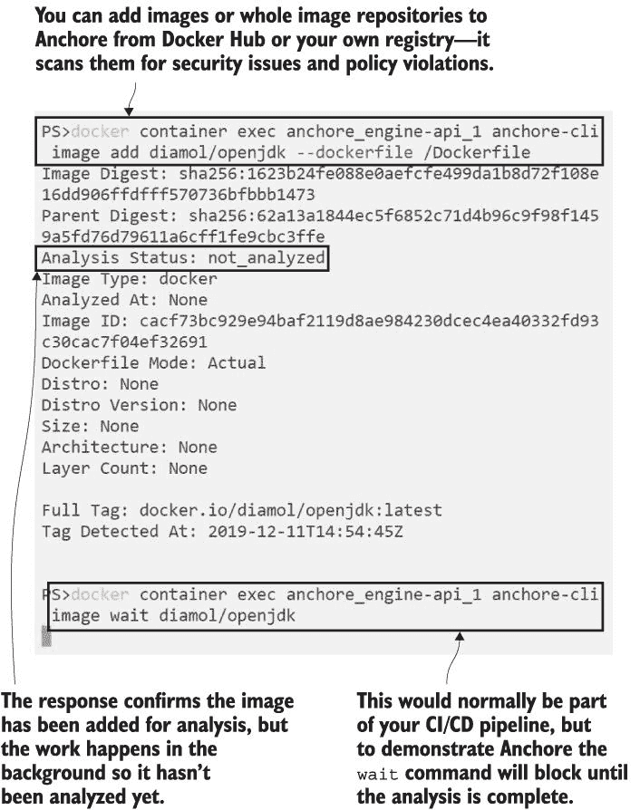

图 17.6 使用 Anchore 分析已知问题的 Docker 镜像

当 Anchore 完成分析后，它对你的镜像了解得很多，包括镜像中所有组件使用的开源许可证，一直到操作系统和应用程序平台细节，以及镜像中任何二进制的安全问题。这些发现都可能成为接受更新基镜像的质量关卡的一部分。如果新版本使用了你组织禁止的 OSS 许可证，或者它包括关键的安全漏洞，你可能会跳过这次更新。Anchore 为 Jenkins 等 CI/CD 工具提供了插件，因此你可以在你的管道中自动应用这些策略，你也可以直接使用 Anchore API 容器查询结果。

现在尝试一下 当上一个练习中的等待命令完成后，镜像已经被分析。检查 Anchore 关于应用程序平台和镜像安全问题的发现：

` # 检查 Anchore 在镜像中发现的 Java 组件：` ` docker container exec anchore_engine-api_1 anchore-cli image content diamol/openjdk java`  ` # 并检查已知的安全问题：` ` docker container exec anchore_engine-api_1 anchore-cli image vuln diamol/openjdk all`

这些只是 Anchore 可以提供的一些输出样本--在这种情况下，它提供了镜像中 Java 运行时的详细信息以及一个庞大的安全漏洞列表。在撰写本文时，这些漏洞的严重性都是可忽略的--这意味着它们不构成重大威胁，你可能在你的镜像中接受它们。输出包括一个链接到漏洞详细信息的链接，你可以阅读更多内容并自行决定。图 17.7 显示了扫描结果的局部输出。

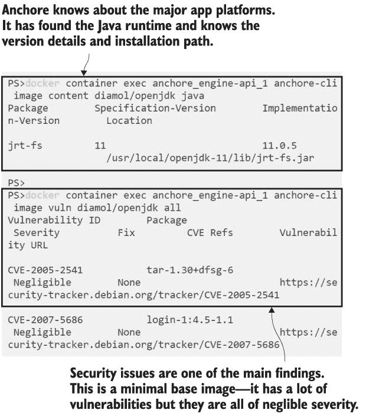

图 17.7 Anchore 将其数据库中的所有安全漏洞与镜像中的所有二进制文件进行比对。

这些结果是可接受的，因为我已经为我的黄金镜像选择了最小的 OpenJDK 基镜像。如果你将官方的`openjdk:11-jdk`镜像添加到 Anchore 并检查结果，你会看到它有更多的漏洞，很多是“未知”严重性，还有一个“低”严重性的核心 SSL 安全库。这可能不是可接受的，所以你可能希望阻止用户基于该镜像构建他们的应用，即使它是由 OpenJDK 团队维护的官方镜像。

Anchore 只是这个领域中的一个技术--你可以从你自己运行的开源项目中获得类似的功能（如 Clair），或者可以与你的 Docker 注册表集成的商业项目（如 Aqua）。这样的工具真的可以帮助你了解镜像的安全性，并对你构建的黄金镜像集有信心。你还可以在应用镜像上运行这些工具，你应该检查的一个策略是每个应用都应从你自己的黄金镜像中构建。这强制使用你精选和批准的镜像。

## 17.3 最小化镜像层数量和层大小

一个最小化和安全的基镜像是你优化应用镜像的前提。下一步真正要做的是设置包含你应用所需一切内容且不包含其他内容的镜像--这比听起来要深奥得多。许多安装软件的过程会在后面留下残留物，因为它们缓存了软件包列表或部署了额外的推荐软件包。你可以控制这些内容--对于不同的操作系统，细节可能不同，但总体方法是一样的。

现在试试看，Debian Linux 使用 APT（高级包工具）来安装软件。本练习通过一个简单的例子来展示如何移除不必要的软件包和清理软件包列表可以节省大量空间（本练习在 Windows 容器中无法工作--可以选择使用 Play with Docker）：

` cd ch17/exercises/socat` ` # v1 镜像使用标准的 apt-get 命令安装软件包：` ` docker image build -t diamol/ch17-socat:v1 .`  ` # v2 镜像安装相同的软件包，但使用了优化调整：` ` docker image build -t diamol/ch17-socat:v2 -f Dockerfile.v2 .`  ` # 检查镜像大小：` ` docker image ls -f reference=diamol/ch17-socat`

两个版本的 Dockerfile 都在相同的 Debian Slim 镜像上安装了相同的两个工具--curl 和 socat，并且它们的功能完全相同。但你将看到 v2 镜像几乎小了 20 MB，如图 17.8 所示。

我只是对安装命令进行了一些调整，就实现了节省空间。第一个调整是利用 APT 的一个特性，只安装列出的软件包而不安装任何推荐软件包。第二个调整是将安装步骤合并为一个 `RUN` 指令，该指令以删除软件包列表缓存并释放磁盘空间的命令结束。列表 17.3 展示了 Dockerfile 之间的差异。

列表 17.3 安装软件包--错误的方式和优化的方式

` # Dockerfile - 使用 APT 的简单安装：` ` FROM debian:stretch-slim` ` RUN apt-get update` ` RUN apt-get install -y curl=7.52.1-5+deb9u9` ` RUN apt-get install -y socat=1.7.3.1-2+deb9u1`  ` # Dockerfile.v2 - 优化安装步骤：` ` FROM debian:stretch-slim` ` RUN apt-get update \` ` && apt-get install -y --no-install-recommends \` `       curl=7.52.1-5+deb9u9 \` `       socat=1.7.3.1-2+deb9u1 \` `   && rm -rf /var/lib/apt/lists/*`

将多个步骤合并到一个 `RUN` 指令中的另一个优点是它会产生一个单独的镜像层。减少镜像层的数量并不是真正的优化。镜像层的最大数量是有限的，但通常足够大--通常是 127 层，这取决于操作系统。但拥有更少的层确实使得跟踪文件系统变得容易得多。将删除软件包列表的最终 `rm` 命令放入自己的 `RUN` 指令中是很简单的，并且可以说这使 Dockerfile 更易于阅读。但你从本章中知道，从之前的层中删除文件只是将它们从文件系统中隐藏起来，所以如果你这样做，就不会节省磁盘空间。

让我们再看看一个适用于所有平台的这种模式的例子。通常你需要从互联网下载一个压缩的软件包，然后展开它。当你正在处理 Dockerfile 时，将下载步骤放在单独的指令中是很诱人的，这样你可以使用缓存的下载层并加快你的开发时间。这很好，但一旦你的 Dockerfile 开始工作，你需要进行整理，将下载-展开-删除步骤合并成一个指令。

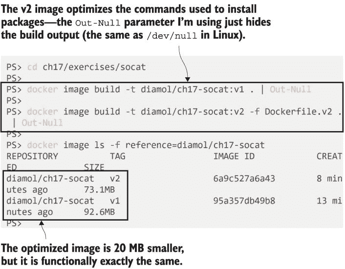

图 17.8 在这个练习中，优化软件安装将图像大小减少了 20%以上。

现在试试看 机器学习数据集是一个很好的例子，因为它们是大型下载，会扩展到更大的文件夹结构。在本章的练习中，有一个例子是从加州大学欧文分校（UCI）的存档中下载一个数据集，并从中提取一个文件。

` cd ch17/exercises/ml-dataset`  ` # v1 下载并展开存档，然后删除不必要的文件：` ` docker image build -t diamol/ch17-ml-dataset:v1 .`  ` # v2 下载存档，但只展开必要的文件：` ` docker image build -t diamol/ch17-ml-dataset:v2 -f Dockerfile.v2 .`  ` # 比较大小：` ` docker image ls -f reference=diamol/ch17-ml-dataset`

你会看到巨大的大小差异，这完全是由于相同的优化技术——确保层不需要比它们需要的更多文件。我的结果在图 17.9 中——两个图像都有从数据下载的单个文件，但一个接近 2.5 GB，另一个只有 24 MB。

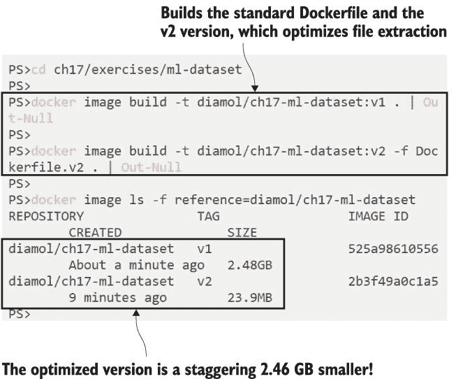

仔细关注你如何处理文件可以节省大量的磁盘空间。

这不是一个虚构的例子。当你迭代 Dockerfile 时，将指令分开是很常见的，因为这可以更容易地进行调试——你可以在构建过程中从某个层运行容器并调查文件系统，你可以在后续指令上工作，同时保留缓存的下载。当你将多个命令压缩到一个`RUN`指令中时，你无法这样做，但当你对构建满意时，进行这种优化是很重要的。列表 17.4 显示了优化的 Dockerfile，它为数据文件生成单个层（下载 URL 在此处被缩写，但你将在章节的源代码中看到它）。

列表 17.4 下载和提取文件的优化方法

` FROM diamol/base`  ` ARG DATASET_URL=https://archive.ics.uci.edu/.../url_svmlight.tar.gz`  ` WORKDIR /dataset`  ` RUN wget -O dataset.tar.gz ${DATASET_URL} && \` `       tar -xf dataset.tar.gz url_svmlight/Day1.svm && \` `         rm -f dataset.tar.gz`

在这里最大的节省实际上并不是来自删除存档；而是仅仅提取单个文件。v1 方法会展开整个存档（这就是 2GB 磁盘空间被占用的原因），然后删除所有文件，除了所需的那个。了解你的工具如何工作以及哪些特性可以最小化磁盘使用量，有助于你将层的大小控制在合理范围内，就像在这个例子中用 tar 和在之前的例子中使用 APT 所看到的那样。

对于这种情况，还有一种替代方法可以提供最佳的开发者工作流程和优化的最终镜像，那就是使用具有单独阶段的所有磁盘密集型步骤的多阶段 Dockerfile。

## 17.4 将你的多阶段构建提升到下一个水平

你第一次在第四章中看到多阶段构建，我们使用一个阶段从源代码编译应用程序，在后面的阶段中打包编译的二进制文件以供运行时使用。对于所有除了最简单的镜像之外的所有镜像，多阶段 Dockerfile 应该是一个最佳实践，因为它们使得优化最终的镜像变得容易得多。

我们可以重新审视数据集下载器，并为每个步骤使用单独的阶段。列表 17.5 显示了这样做的 Dockerfile 会更加易于阅读（下载 URL 再次被缩写）。

列表 17.5 多阶段 Dockerfile 有助于提高可读性并简化优化

` FROM diamol/base AS download` ` ARG DATASET_URL=https://archive.ics.uci.edu/.../url_svmlight.tar.gz` ` RUN wget -O dataset.tar.gz ${DATASET_URL}`  ` FROM diamol/base AS expand` ` COPY --from=download dataset.tar.gz .` ` RUN tar xvzf dataset.tar.gz`  ` FROM diamol/base` ` WORKDIR /dataset/url_svmlight` ` COPY --from=expand url_svmlight/Day1.svm .`

在每个阶段中都很清楚你在做什么，你不需要深入研究不寻常的命令优化来节省磁盘空间，因为最终的镜像将只包含从早期阶段显式复制进来的文件。当你构建 v3 版本时，你会发现它与优化后的 v2 版本大小相同，但它有一个优点，那就是易于调试。多阶段 Dockerfile 可以构建到特定的阶段，所以如果你需要在构建过程中检查文件系统，你可以轻松地做到这一点，而无需在镜像历史中搜索层 ID。

现在尝试一下 `target` 参数让你可以在特定阶段停止多阶段构建。尝试使用不同的目标构建那个 v3 镜像：

` cd ch17/exercises/ml-dataset`  ` # 构建完整的 v3 镜像：` ` docker image build -t diamol/ch17-ml-dataset:v3 -f Dockerfile.v3 .`  ` # 构建到 'download' 目标 - 相同的 Dockerfile，不同的标签：` ` docker image build -t diamol/ch17-ml-dataset:v3-download -f Dockerfile.v3 --target download .`  ` # 并构建到 'expand' 目标：` ` docker image build -t diamol/ch17-ml-dataset:v3-expand -f Dockerfile.v3 --target expand .`  ` # 检查镜像大小：` ` docker image ls -f reference=diamol/ch17-ml-dataset:v3*`

现在，你将拥有 v3 图像的三个变体。完整的构建与优化构建相同，都是 24 MB，所以我们没有在迁移到多阶段 Dockerfile 时丢失任何优化。其他变体在特定阶段停止构建，如果你需要调试文件系统，你可以从这些镜像之一运行容器。阶段构建还显示了磁盘空间的使用情况——你可以在图 17.10 中看到下载大约为 200 MB，并扩展到超过 2 GB。

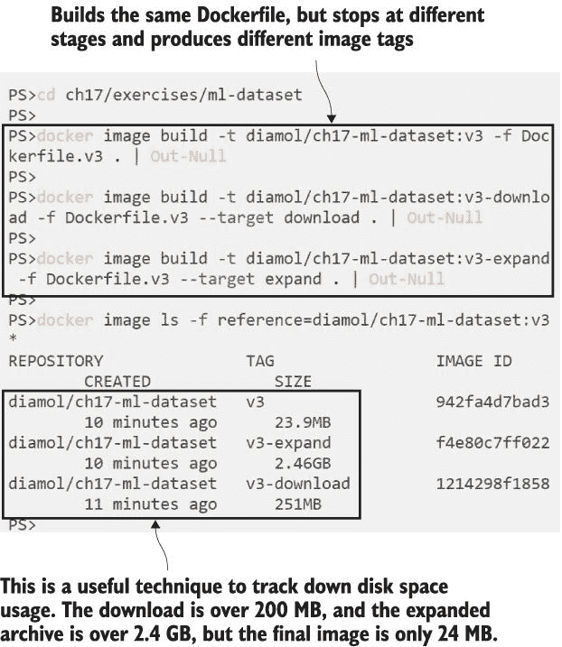

图 17.10 通过构建到特定阶段的多阶段 Dockerfile，你可以调试内容并检查大小。

这确实是最好的方法——你得到了一个优化的图像，但你仍然可以保持你的 Dockerfile 指令简单，因为你不需要在中间阶段清理磁盘。

多阶段构建的最后一个优点真正地让人印象深刻：每个阶段都有自己的构建缓存。如果你需要调整 `expand` 阶段，当你运行构建时，`download` 阶段仍然来自缓存。最大化构建缓存是优化的最后一部分，这完全关乎构建图像的速度。

充分利用构建缓存的基本方法是将你的 Dockerfile 中的指令排序，使变化最少的部分放在前面，变化最多的部分放在后面。这需要几次迭代才能正确设置，因为你需要了解步骤变化的频率，但通常你可以在文件开头放置静态设置，如暴露的端口、环境变量和应用程序入口点。变化最多的部分是你的应用程序二进制文件和配置文件，它们可以放在文件末尾。设置正确后，你可以显著减少构建时间。

现在试试看 这个练习构建了一个最小的 Jenkins 安装。它是不完整的，所以不要尝试运行它——我们只是用它来进行构建。Dockerfile 下载 Jenkins Java 文件并设置初始配置。v2 Dockerfile 充分利用了缓存，当你进行内容更改时你会看到：

` cd ch17/exercises/jenkins`  ` # 构建 v1 图像和优化的 v2 图像：` ` docker image build -t diamol/ch17-jenkins:v1 .` ` docker image build -t diamol/ch17-jenkins:v2 -f Dockerfile.v2 .`  ` # 现在更改两个 Dockerfile 都使用的配置文件：` ` echo 2.0 > jenkins.install.UpgradeWizard.state`  ` # 重复构建并查看它们运行的时间：` ` docker image build -t diamol/ch17-jenkins:v1 .` ` docker image build -t diamol/ch17-jenkins:v2 -f Dockerfile.v2 .`

第二轮构建是缓存发挥作用的地方。v1 Dockerfile 在下载 Jenkins 文件（这是一个 75 MB 的下载）之前将配置文件复制到镜像中，所以当配置文件发生变化时，它会破坏缓存，下载就会重新开始。v2 Dockerfile 使用多阶段构建并将指令顺序设置为将配置文件复制放在最后。我使用 PowerShell 中的`Measure-Command`函数来检查每个构建的持续时间（Linux 中有一个等效的`time`命令）。你可以在图 17.11 中看到，正确排序指令和使用多阶段 Dockerfile 可以将构建时间从 10 多秒缩短到不到一秒。

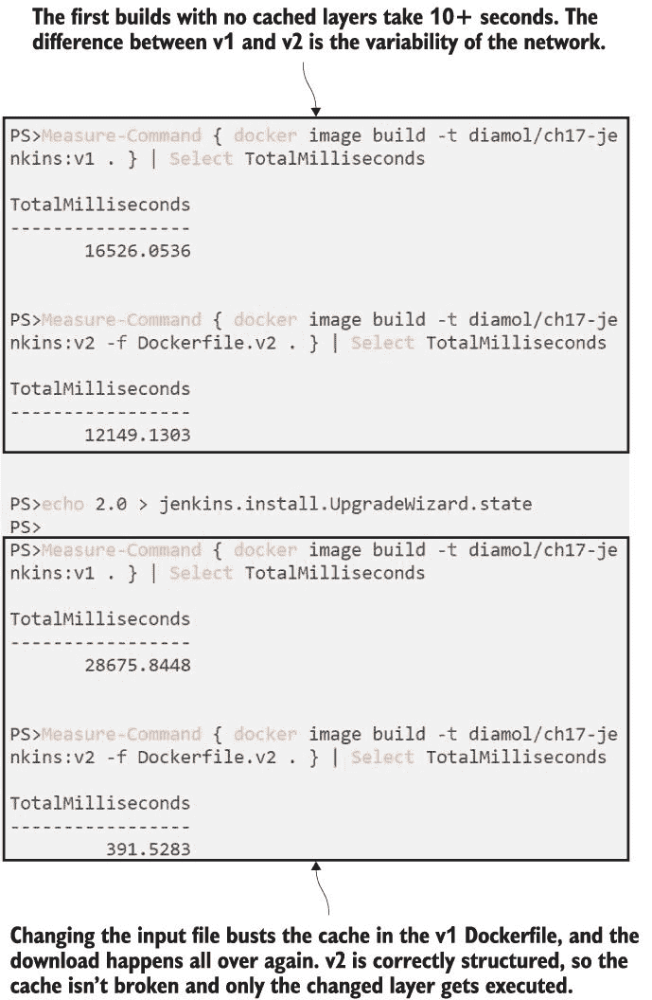

图 17.11 正确排序 Dockerfile 指令可以意味着在构建时间上的巨大节省。

充分利用缓存可以让你在每次从源代码控制中更改时构建和推送 Docker 镜像，而不会在 CI/CD 管道中消耗时间。不过，你确实需要确保不要过度缓存东西，因为如果你使用`RUN`指令安装或下载软件，它们将被缓存，直到 Dockerfile 中的指令发生变化（假设在那些指令之前缓存没有被破坏）。当你向你的镜像添加包时，你应该始终使用显式版本，这样你就能确切知道你在运行什么，并且你可以选择何时更新。列表 17.3 中的 socat 示例在 APT 命令中使用了显式版本号，而 Jenkins 示例使用了`ARG`指令来下载版本——这两种方法都让你能够在更改安装的版本之前使用缓存。

## 17.5 理解优化为何重要

你在本章中看到，你可以遵循一些简单的最佳实践，让你的 Dockerfile 变得易于使用。这些实践归结为

+   选择正确的基镜像——理想情况下，精心挑选你自己的黄金镜像集合。

+   对于所有除了最简单的应用之外，都使用多阶段 Dockerfile。

+   不要添加任何不必要的包或文件——关注层的大小。

+   按变更频率对 Dockerfile 指令进行排序——最大化缓存。

随着你将更多应用迁移到容器，构建、推送和拉取镜像成为你组织工作流程的核心部分。优化这些镜像可以消除许多痛点，加快工作流程，并防止更严重的问题。图 17.12 显示了镜像的典型生命周期以及优化起作用的地方。

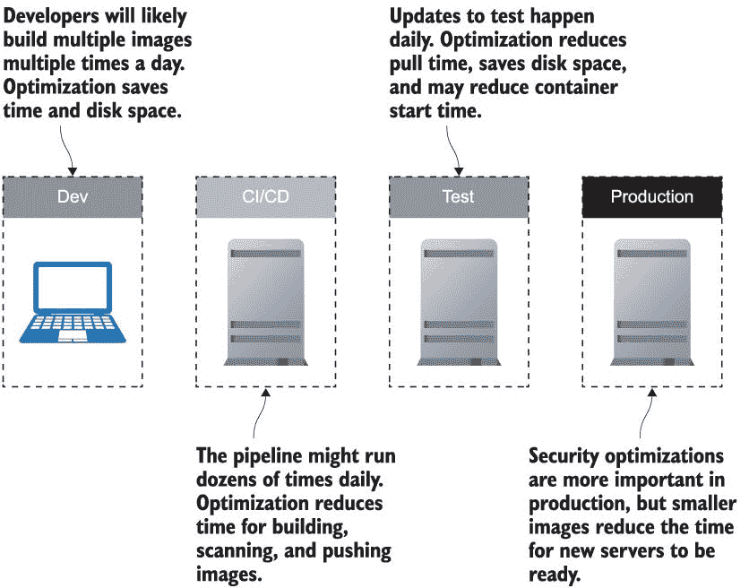

图 17.12 优化你的 Docker 镜像对你的项目生命周期有积极的影响。

## 17.6 实验室

现在是时候测试你的优化技能了。你的目标是优化一个安装 Docker 命令行的镜像。本章的实验室文件夹中有 Linux 和 Windows 的示例；Dockerfile 目前工作正常，但它们产生了不必要的大的镜像。你的目标是

+   优化文件系统，使得 Linux 容器镜像小于 80 MB，或 Windows 容器镜像小于 330 MB。

+   利用图像层缓存，这样你的图像重复构建所需时间将少于 1 秒。

+   生成一个能够正确写入 Docker CLI 版本的镜像，从`docker` `container` `run` `<image>` `docker` `version`（该命令会因为服务器未连接到 Docker Engine 而报错，但 CLI 版本应该能够正确打印）。

你可能不需要任何提示，但在查看原始 Docker 文件时需要具有创造性思维。你可能不会通过优化现有指令达到目标；可能从图像的目标反向工作会更好。

我的优化文件在同一个实验文件夹中--你还可以在 GitHub 上查看它们：[`github.com/sixeyed/diamol/blob/master/ch17/lab/README.md`](https://github.com/sixeyed/diamol/blob/master/ch17/lab/README.md)。

你已经有了知识，现在去优化吧！
