# 20 使用反向代理控制容器的 HTTP 流量

Docker 负责将外部流量路由到您的容器中，但您只能有一个容器监听网络端口。在非生产环境中使用任何旧的端口都是可以的——在这本书的一些章节中，我们使用了十个不同的端口来保持应用程序的分离——但您在上线时不能这样做。您可能希望许多应用程序在单个集群上运行，但您需要它们都能通过标准的 HTTP 和 HTTPS 端口，即 80 和 443 进行访问。

这就是反向代理发挥作用的地方。它是容器化环境架构中的一个关键部分，在本章中，您将了解它提供的所有功能和它启用的模式。我们将使用这个领域中最受欢迎的两种技术——Nginx（发音为“engine x”）和 Traefik——当然是在容器中运行。

## 20.1 什么是反向代理？

代理是一种网络组件，代表其他组件处理网络流量。您可能在公司网络中有一个代理，它会拦截您的浏览器请求并决定您是否允许访问某些网站，记录您的所有活动，并缓存响应，以便同一网站的其它用户获得更快的体验。反向代理做的是类似的事情，但方向相反。您运行反向代理作为多个 Web 应用的网关；所有流量都流向反向代理，它决定从哪个应用获取内容。它可以在发送回客户端之前缓存响应并对其进行修改。图 20.1 显示了容器中的反向代理看起来是什么样子。

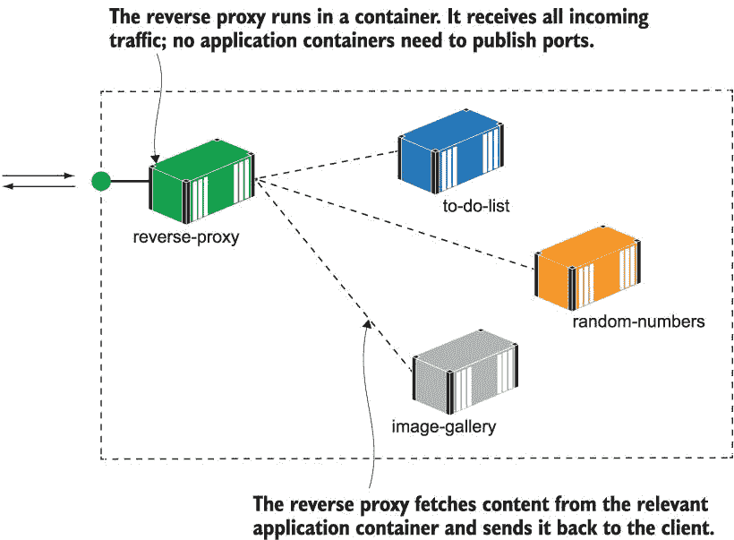

图 20.1 反向代理是您应用的网关；应用程序容器不公开。

反向代理是唯一一个公开端口的容器——它接收所有传入的请求并从其他容器中获取响应。这意味着您所有的应用程序容器都变成了内部组件，这可以使它们更容易进行扩展、更新和保障安全。反向代理不是一项新技术，但随着容器革命的兴起，它们已经向左移动。它们过去位于生产环境中，由运维团队管理，甚至开发者都不知道存在代理；现在它们运行在轻量级容器中，您可以在每个环境中使用相同的代理配置。

现在尝试一下 Nginx 多年来一直是一种流行的反向代理选择——它为互联网上的超过 30%提供服务。它是一个非常轻量级、快速且强大的 HTTP 服务器，既可以提供自己的内容，也可以代理其他服务器：

` # 为本章的应用创建一个网络 - 对于 Linux 容器:` ` docker network create ch20`  ` # 或者 Windows 容器:` ` docker network create --driver=nat ch20` ` cd ch20/exercises`  ` # 在 Linux 上使用绑定挂载到本地配置文件夹运行 Nginx -` ` # Linux:` ` docker-compose -f nginx/docker-compose.yml -f nginx/override-linux.yml up -d`  ` # 或者 Windows 容器:` ` docker-compose -f nginx/docker-compose.yml -f nginx/override-windows.yml up -d`  ` # 浏览到 http://localhost`

Nginx 为它服务的每个网站使用一个配置文件。这个容器有一个绑定挂载到名为`sites-enabled`的本地文件夹，但里面还没有配置文件。Nginx 有一个默认网站，是一个简单的 HTML 页面--你可以在图 20.2 中看到我的输出。

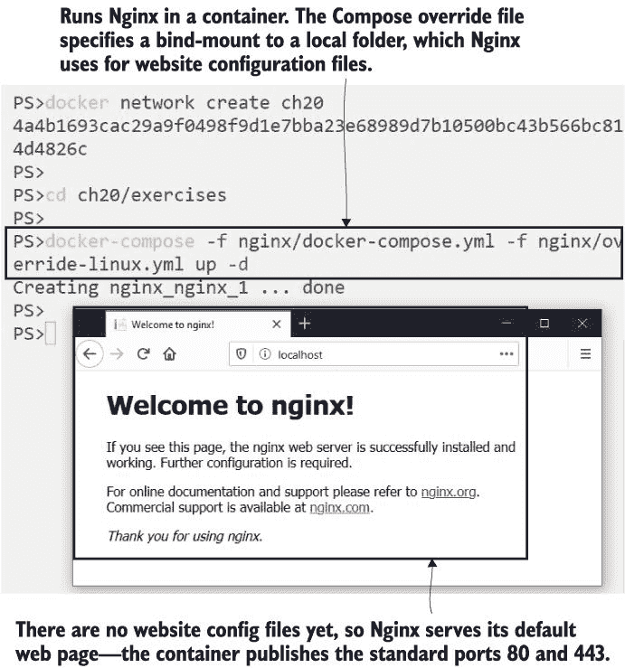

图 20.2 Nginx 是一个 HTTP 服务器--它可以提供静态内容并作为反向代理运行

我们目前还没有使用 Nginx 作为反向代理，但我们可以通过为另一个网站添加配置文件来设置它。当你在一个相同的端口上托管多个应用时，你需要一种方法来区分它们，通常是通过网站的域名。当你浏览到像*[`blog.sixeyed.com`](https://blog.sixeyed.com)* 这样的网站时，浏览器会在客户端请求中包含一个 HTTP 头：`Host=blog.sixeyed.com`。Nginx 使用这个主机头找到要服务的网站的配置文件。在你的本地机器上，你可以向你的 hosts 文件添加域名，这是一个简单的 DNS 查找，以便从你的 Nginx 容器中提供不同的应用。

现在试试看 我们将在容器中运行简单的 who-am-I 网络应用，不发布任何端口，并通过主机域名 whoami.local 通过 Nginx 提供服务：

` # 在 Mac 或 Linux 上向本地 hosts 文件添加 who-am-I 域名:` ` echo $'\n127.0.0.1 whoami.local' | sudo tee -a /etc/hosts`  ` # 或者 Windows 上:` ` Add-Content -Value "127.0.0.1 whoami.local" -Path /windows/system32/drivers/etc/hosts`  ` # 启动 who-am-I 容器:` ` docker-compose -f whoami/docker-compose.yml up -d`  ` # 将应用配置复制到 Nginx 配置文件夹:` ` cp ./nginx/sites-available/whoami.local ./nginx/sites-enabled/`  ` # 并重新启动 Nginx 以加载配置:` ` docker-compose -f nginx/docker-compose.yml restart nginx`  ` # 浏览到 http://whoami.local`

当你浏览到 http:/ /whoami.local 时，你的 hosts 文件中的条目会把你引导到你的本地机器，Nginx 容器接收这个请求。它使用 HTTP 头`Host=whoami.local`来找到正确的网站配置，然后从 who-am-I 容器加载内容并发送回来。你会在图 20.3 中看到，响应与直接从 who-am-I 应用容器返回的响应相同。

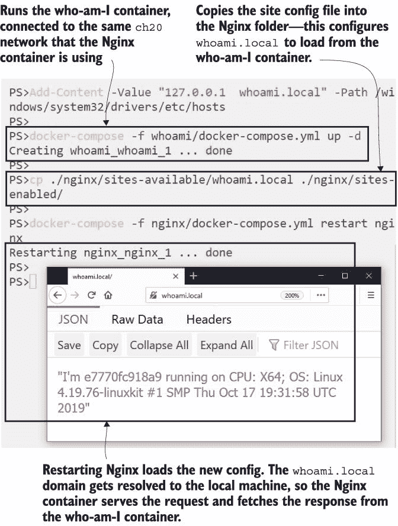

图 20.3 动态中的反向代理，从后台的应用容器加载内容

Nginx 是一个非常强大的服务器，具有庞大的功能集，但代理 Web 应用程序的基本配置文件非常简单。您需要指定服务器的域名和内容的位置，这可以是一个内部 DNS 名称。Nginx 容器将通过 Docker 网络使用容器名称作为 DNS 从应用容器获取内容。列表 20.1 显示了 who-am-I 网站的完整配置文件。

列表 20.1 who-am-I 网站的 Nginx 代理配置

` server {` `       server_name whoami.local; # 域名主机名` `       location / {` `               proxy_pass http://whoami; # 内容的源地址` `               proxy_set_header Host $host; # 设置源的域名` `               add_header X-Host $hostname; # 在响应中添加代理名称` `       }` ` }`

反向代理不仅适用于网站——它们适用于任何 HTTP 内容，因此 REST API 是很好的目标，也可能支持其他类型的流量（如纯 TCP/IP 或 gRPC）。这个简单的配置使 Nginx 的工作方式类似于透明代理，因此对于它收到的每个请求，它都会调用源容器（称为“上游”）并将响应发送回客户端（称为“下游”）。如果上游应用失败，Nginx 会将失败响应发送回下游客户端。

现在试试看：向您的 hosts 文件中添加另一个域名，并运行随机数应用的 API，使用 Nginx 进行代理。这是在几次调用后失败的 API，刷新后您会看到 Nginx 返回的 500 响应：

` # 在 Mac 或 Linux 上将 API 域名添加到本地 hosts 文件中：` ` echo $'\n127.0.0.1 api.numbers.local' | sudo tee -a /etc/hosts` ` # 或者 Windows 上：` ` Add-Content -Value "127.0.0.1 api.numbers.local" -Path /windows/system32/drivers/etc/hosts` ` # 运行 API：` ` docker-compose -f numbers/docker-compose.yml up -d` ` # 复制站点配置文件并重启 Nginx：` ` cp ./nginx/sites-available/api.numbers.local ./nginx/sites-enabled/` ` docker-compose -f nginx/docker-compose.yml restart nginx` ` # 浏览到 http://api.numbers.local/rng 并刷新，直到它崩溃`

您会从这次练习中看到，无论用户是直接访问应用还是通过 Nginx 访问，应用的用户体验都是相同的。您有两个由 Nginx 托管的 app，因此它正在管理到上游容器的路由，但它不处理流量，所以响应体与由应用容器发送的完全一样。图 20.4 展示了通过反向代理返回的 API 失败响应。

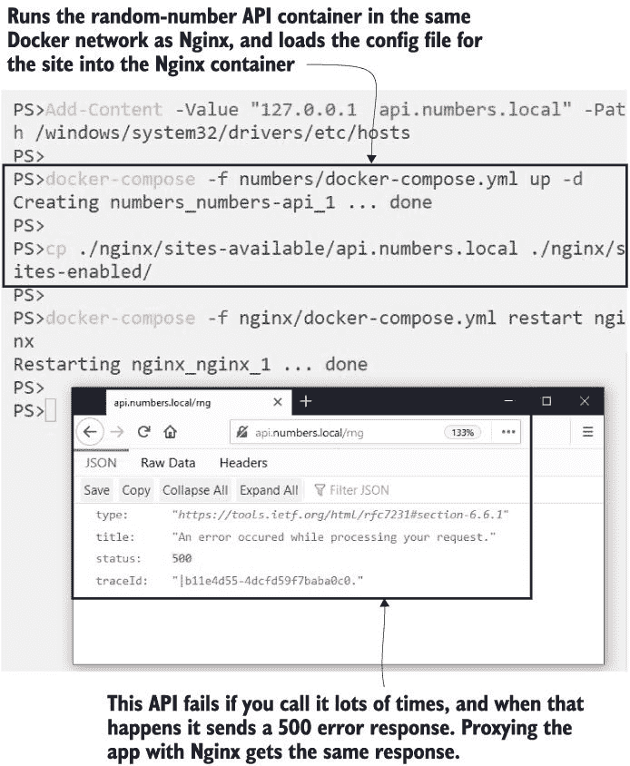

图 20.4 在简单的代理配置中，Nginx 会发送来自应用的响应——即使它是失败的。

反向代理可以做得更多。所有应用流量都进入代理，因此它可以是一个配置的中心位置，并且您可以保持许多基础设施级别的关注点远离应用容器。

## 20.2 在反向代理中处理路由和 SSL

我们一直遵循的过程是将新应用程序添加到 Nginx，即启动应用程序容器，复制配置文件，然后重启 Nginx。这个顺序很重要，因为当 Nginx 启动时，它会读取所有的服务器配置并检查它是否可以访问所有上游服务。如果有任何服务不可用，它会退出；如果所有服务都可用，它会构建一个内部路由列表，将主机名链接到 IP 地址。这是代理可以处理的第一项基础设施问题——如果有多个上游容器，它将进行负载均衡。

现在尝试一下 我们现在将运行图像库应用程序，通过 Nginx 代理主 Web 应用程序。我们可以扩展 Web 组件，Nginx 将在容器之间进行负载均衡：

` # 在 Mac 或 Linux 上向本地 hosts 文件添加域名：` ` echo $'\n127.0.0.1 image-gallery.local' | sudo tee -a /etc/hosts`  ` # 或者，在 Windows 上：` ` Add-Content -Value "127.0.0.1 image-gallery.local" -Path /windows/system32/drivers/etc/hosts`  ` # 使用 3 个 Web 容器运行应用程序：` ` docker-compose -f ./image-gallery/docker-compose.yml up -d --scale image-gallery=3`  ` # 添加配置文件并重启 Nginx：` ` cp ./nginx/sites-available/image-gallery.local ./nginx/sites-enabled/` ` docker-compose -f ./nginx/docker-compose.yml restart nginx`  ` # 几次调用网站：` ` curl -i --head http://image-gallery.local`

图像库网站的 Nginx 配置与列表 20.1 中的代理设置相同，使用不同的主机名和上游 DNS 名称。它还添加了一个额外的响应头`X-Upstream`，显示 Nginx 获取响应的容器的 IP 地址。你在图 20.5 中可以看到，对于我来说，上游 IP 地址在 172.20 范围内，这是 Docker 网络上应用程序容器的 IP 地址。如果你多次重复 curl 调用，你会看到不同的 IP 地址，因为 Nginx 在 Web 容器之间进行负载均衡。

现在，你可以在单个 Docker 机器上运行你的应用程序，并启用负载均衡——你不需要切换到 Swarm 模式或启动一个 Kubernetes 集群来测试你的应用程序在类似生产环境的配置。应用程序本身也不需要任何代码或配置更改；所有这些操作都由代理处理。

图 20.5 Nginx 负责负载均衡，因此你可以按比例运行应用程序容器。

到目前为止，我们使用 Nginx 通过不同的主机名在容器之间进行路由，这是在单个环境中运行多个应用程序的方法。你还可以为 Nginx 路由配置细粒度路径，所以如果你想选择性地公开应用程序的某些部分，你可以在同一个域名内做到这一点。

现在尝试一下 图像库应用程序使用 REST API，你可以配置 Nginx 使用 HTTP 请求路径代理 API。API 看起来是 Web UI 的一部分，尽管它实际上来自一个独立的容器：

` # 删除原始图像库配置：` ` rm ./nginx/sites-enabled/image-gallery.local`  ` # 复制新配置，其中包含 API，并重新启动 Nginx：` ` cp ./nginx/sites-available/image-gallery-2.local ./nginx/sites-enabled/image-gallery.local` ` docker-compose -f ./nginx/docker-compose.yml restart nginx` ` curl -i http://image-gallery.local/api/image`

这是一个非常棒的用于选择性地公开应用堆栈部分的模式，在同一域名下组装一个由许多组件组成的应用。图 20.6 显示了我的输出——响应来自 API 容器，但客户端正在使用与 Web UI 相同的`image-gallery.local`域名发起请求。

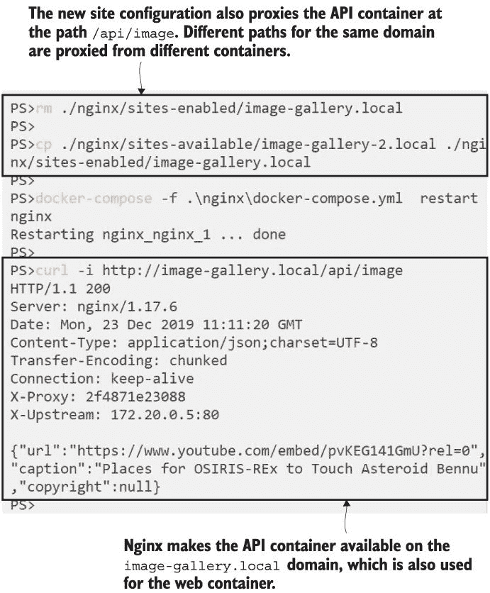

![图 20.6 Nginx 可以根据域名或请求路径路由请求到不同的容器]

负载均衡和路由功能让你可以在单个开发或测试机器上接近生产环境，并且反向代理还负责处理 SSL 终止。如果你的应用以 HTTPS 网站的形式发布（它们应该这样），配置和证书需要存储在某个地方，而且将它们放在你的中央代理中比放在每个应用组件中要好得多。Nginx 可以配置使用从域名提供商或类似 Let’s Encrypt 的服务获得的真实证书，但在非生产环境中，你可以创建自己的自签名证书并使用它们。

现在试试看：为图像库应用生成一个 SSL 证书，并通过 Nginx 代理它，使用证书将其作为 HTTPS 网站提供服务：

` # 在 Linux 上为应用生成自签名证书：` ` docker container run -v "$(pwd)/nginx/certs:/certs" -e HOST_NAME=image-gallery.local diamol/cert-generator`  ` # 或者 Windows 容器：` ` docker container run -v "$(pwd)/nginx/certs:C:\certs" -e HOST_NAME=image-gallery.local diamol/cert-generator`  ` # 删除现有的图像库配置：` ` rm ./nginx/sites-enabled/image-gallery.local`  ` # 复制包含 SSL 的新站点配置：` ` cp ./nginx/sites-available/image-gallery-3.local ./nginx/sites-enabled/image-gallery.local`  ` # 并重新启动 Nginx：` ` docker-compose -f nginx/docker-compose.yml restart nginx` ` # 浏览 http://image-gallery.local`

在这个练习中有很多事情要做。你运行的第一个容器使用 OpenSSL 工具生成自签名证书，并将它们复制到你的本地`certs`目录，该目录也被绑定挂载到 Nginx 容器中。然后你用使用这些证书的新配置文件替换图像库配置文件，并重新启动 Nginx。当你使用 HTTP 浏览到该网站时，你会被重定向到 HTTPS，并且你会收到浏览器的警告，因为自签名证书不受信任。在图 20.7 中，你可以看到 Firefox 的警告——我可以点击“高级”按钮忽略警告并继续查看网站。

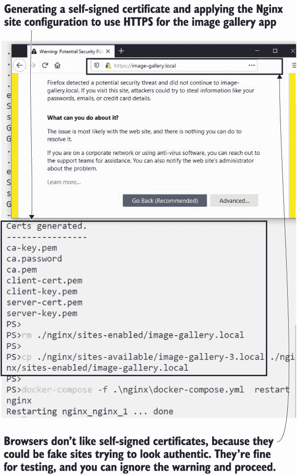

图 20.7 Nginx 将 HTTP 请求重定向到 HTTPS，并使用 SSL 证书提供服务。

Nginx 允许您为您的 SSL 设置配置各种细节，包括您支持的协议和加密算法（您可以从 *[www.ssllabs.com](http://www.ssllabs.com)* 检查您的网站并获取应用最佳实践的列表）。我不会深入所有这些细节，但 HTTPS 设置的核心部分在列表 20.2 中——您可以看到 HTTP 网站监听端口 80 并返回 HTTP 301 响应，将客户端重定向到监听端口 443 的 HTTPS 网站。

列表 20.2 使用 HTTP 重定向在 HTTPS 上提供服务

` server {` `       server_name image-gallery.local;` `       listen 80;` `       return 301 https://$server_name$request_uri;` ` }`  ` server {` `       server_name image-gallery.local;` `       listen 443 ssl;` `       ssl_certificate /etc/nginx/certs/server-cert.pem;` `       ssl_certificate_key /etc/nginx/certs/server-key.pem;` `       ssl_protocols TLSv1 TLSv1.1 TLSv1.2;` ` ...`

配置从容器的文件系统中加载证书和密钥文件。每个证书和密钥对仅适用于一个域名，因此您将为每个应用程序使用一组文件（尽管您可以生成一个覆盖多个子域的证书）。这些是机密文件，因此在生产环境中，您会使用集群中的机密来存储它们。将 HTTPS 从您的应用程序容器中排除意味着更少的配置和证书管理——这是一个基础设施问题，现在它存在于代理中——并且开发者可以为测试启动简单的 HTTP 版本。

我们在这里将介绍 Nginx 的最后一个特性，它可以大幅提升性能：缓存来自上游组件（即您的自己的网络应用程序）的响应。

## 20.3 使用代理提高性能和可靠性

Nginx 是一个非常高性能的 HTTP 服务器。您可以使用它来为简单的网站或单页应用程序提供静态 HTML，一个容器可以轻松处理每秒数千个请求。您也可以利用这种性能来提升您自己的应用程序——Nginx 可以作为一个缓存代理工作，因此当它从您的应用程序（称为“上游”）获取内容时，它会将其副本存储在本地磁盘或内存存储中。对于相同内容的后续请求将直接从代理服务器提供服务，而上游则不会被使用。图 20.8 展示了缓存的工作原理。

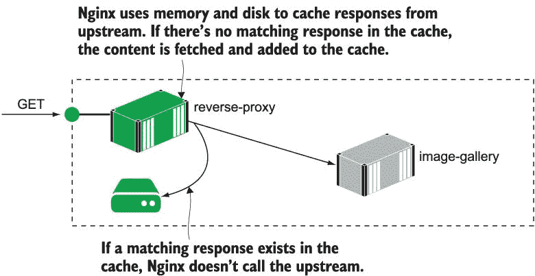

图 20.8 使用 Nginx 作为缓存代理可以减少应用程序容器的负载。

这样做有两个好处。首先，你减少了处理请求所需的时间，因为应用程序平台生成响应所需的时间肯定比 Nginx 从内存中读取缓存响应的时间要长。其次，你减少了发送到应用程序的总流量，因此你应该能够从相同的基础设施中处理更多的用户。你可以缓存非用户特定的内容，但这可能只是简单地绕过缓存，如果存在认证 cookie 的话。像图片库应用这样的通用站点可以完全由缓存提供服务。

现在试试看 使用 Nginx 作为图片库应用的缓存代理。此配置将 Web 应用程序和 API 都设置为使用 Nginx 缓存：

` # 删除当前站点配置：` ` rm ./nginx/sites-enabled/image-gallery.local`  ` # 复制缓存配置并重启 Nginx：` ` cp ./nginx/sites-available/image-gallery-4.local ./nginx/sites-enabled/image-gallery.local` ` docker-compose -f ./nginx/docker-compose.yml restart nginx`  ` # 向站点发送一些请求：` ` curl -i --head --insecure https://image-gallery.local` ` curl -i --head --insecure https://image-gallery.local`

新的代理配置设置了一个自定义的响应头，`X-Cache`，Nginx 会填充缓存查找的结果。如果没有匹配的缓存（这将是您第一次调用站点的情况），则响应头为`X-Cache:` `MISS`，表示缓存中没有匹配的响应，并且有一个带有容器 IP 地址的`X-Upstream`头，其中 Nginx 从该容器中获取了内容。当您重复调用时，响应确实来自缓存，因此您会看到`X-Cache:` `HIT`并且没有`X-Upstream`头，因为 Nginx 没有使用上游。我的输出在图 20.9 中。

图 20.9 如果代理在其缓存中有响应，它将发送它而不使用上游。

Nginx 允许您微调您如何使用缓存。在最新的配置中，我已将 API 设置为使用短期缓存，因此响应在分钟后就会过时，然后 Nginx 从 API 容器中获取最新的内容。这对于需要新鲜内容但负载非常高的内容来说是一个很好的设置——如果您的 API 每秒有 5,000 个请求，即使是一分钟的缓存也能节省 300,000 个请求到达 API。Web 应用程序设置为使用较长的缓存，因此响应保持新鲜六小时。列表 20.3 显示了缓存配置。

列表 20.3 Nginx 作为 API 和 Web 内容的缓存反向代理

`       ...` `       location = /api/image {` `               proxy_pass http://iotd/image;` `               proxy_set_header Host $host;` `               proxy_cache SHORT;` `               proxy_cache_valid 200 1m;` `               ...` `       }`  `       location / {` `               proxy_pass http://image-gallery;` `               proxy_set_header Host $host;` `               proxy_cache LONG;` `               proxy_cache_valid 200 6h;` `               proxy_cache_use_stale error timeout invalid_header updating` `                                                             http_500 http_502 http_503 http_504;` `               ...` `         }`

缓存，命名为`LONG`和`SHORT`，在`diamol/nginx`镜像中的核心 Nginx 配置中定义。缓存规范设置了用于响应的内存和磁盘使用量，以及陈旧项的驱逐时间。

我不想深入挖掘 Nginx 配置，但有一个非常有用的功能可以帮助提高应用可靠性，这个功能在`proxy_cache_use_stale`设置中定义，用于 Web 应用。这告诉 Nginx，即使上游不可用，它也可以使用陈旧的缓存响应。从缓存中的陈旧项提供服务意味着即使应用容器已关闭，您的应用仍然可以在线（尽管可能不完全功能），这是一个非常实用的备份，用于解决应用中的暂时性故障，或者需要回滚的应用部署。您需要仔细考虑可以从缓存中成功提供的内容路径，但在一个简单的演示应用中，您可以提供整个应用。

现在尝试一下：对图像库应用和 API 进行几次调用，以便 Nginx 将其响应保存到其缓存中。然后终止容器并再次请求内容：

` # 调用站点和 API:` ` curl -s --insecure https://image-gallery.local` ` curl -s --insecure https://image-gallery.local/api/image`  ` # 删除所有 Web 容器:` ` docker container rm -f $(docker container ls -f name=image-gallery_image-gallery_* -q)`  ` # 再次尝试 Web 应用:` ` curl -i --head --insecure https://image-gallery.local`  ` # 删除 API 容器:` ` docker container rm -f image-gallery_iotd_1`  ` # 再次尝试 API:` ` curl -i --head --insecure https://image-gallery.local/api/image`

您将在这里看到不同的缓存配置在实际中的应用。Web 缓存设置为六小时后过期，因此即使没有可用的 Web 容器，内容也会从 Nginx 的缓存中继续提供服务。API 响应缓存在一分钟后过期，并且未设置为使用陈旧缓存，因此您将从 Nginx 获得 HTTP 502 错误，这意味着它无法到达上游组件。我的输出在图 20.10 中。

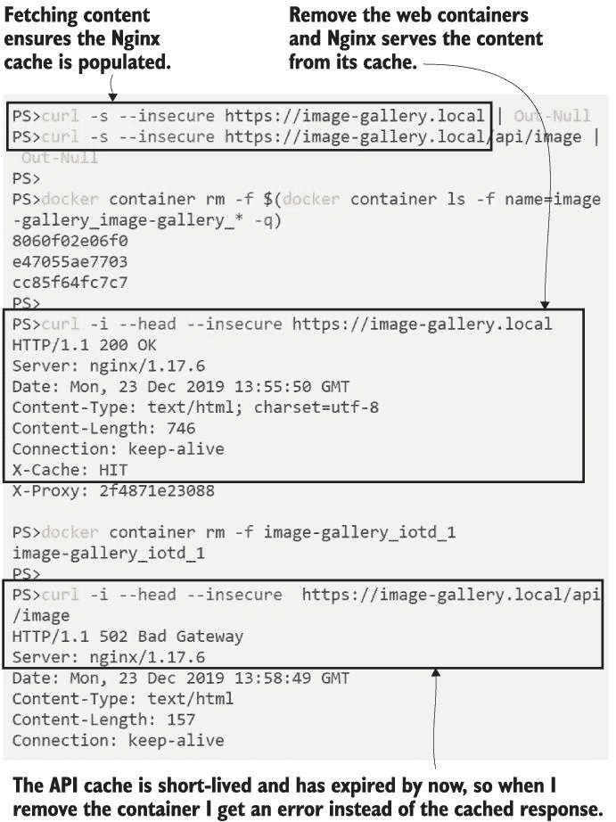

图 20.10 Nginx 缓存可以微调以保持内容新鲜或为您的应用增加可靠性。

我们将在这里结束对 Nginx 的练习。它是一个非常强大的反向代理，还有很多其他的事情可以做——比如为 HTTP 响应启用 GZip 压缩和添加客户端缓存头——这可以提高最终用户的性能并减少对应用程序容器的负载。它是在容器出现之前就存在的技术，所以它实际上并不与容器平台集成；它只是在网络级别上查找 DNS 名称的 IP 地址，这是 Docker 提供容器 IP 地址的地方。它运行得很好，但你需要为每个应用程序维护一个配置文件，并在配置更改时重新加载 Nginx。

我们将通过查看一个与现代替代方案结束本章，该方案具有容器感知性并且与 Docker 很好地集成。

## 20.4 使用云原生反向代理

在第十一章中，我们使用 Jenkins 构建了一个 CI 管道，该管道在一个容器中运行。这个容器连接到了它所运行的 Docker Engine，因此它可以构建和推送镜像。将容器连接到 Docker Engine 还允许应用程序查询 Docker API 以了解其他容器，这正是云原生反向代理 Traefik（大约发音为“traffic”）所依赖的。对于你想要在代理中提供的每个应用程序，都没有静态配置文件；相反，你给你的容器添加标签，Traefik 使用这些标签来构建自己的配置和路由图。

动态配置是像 Traefik 这样的容器感知代理的主要好处之一。在运行 Traefik 之前，您不需要启动上游应用程序，因为它在运行时会监视新的容器。您不需要重新启动 Traefik 或重新加载配置来更改应用程序设置——这一切都是您应用程序部署的一部分。Traefik 有自己的 API 和 Web UI，可以显示规则，因此您可以在没有其他容器的情况下运行 Traefik，然后部署一个应用程序并查看配置是如何构建的。

现在尝试一下：首先删除所有现有的容器；然后运行 Traefik 并检查 UI，以了解 Traefik 如何管理组件：

` docker container rm -f $(docker container ls -aq)`  ` # 启动 Traefik - 连接到 Linux Docker Engine:` ` docker-compose -f traefik/docker-compose.yml -f traefik/override-linux.yml up -d`  ` # 或者使用 Windows 容器:` ` docker-compose -f traefik/docker-compose.yml -f traefik/override-windows.yml up -d`  ` # 浏览到 http://localhost:8080`

由于 Linux 和 Windows 使用不同的私有通道将容器连接到 Docker Engine，因此有不同的覆盖文件。除此之外，Traefik 在所有平台上的行为都是完全相同的。仪表板是您查看 Traefik 代理的应用程序及其配置的地方。您可以在图 20.11 中看到 Traefik 配置代理所使用的资源。

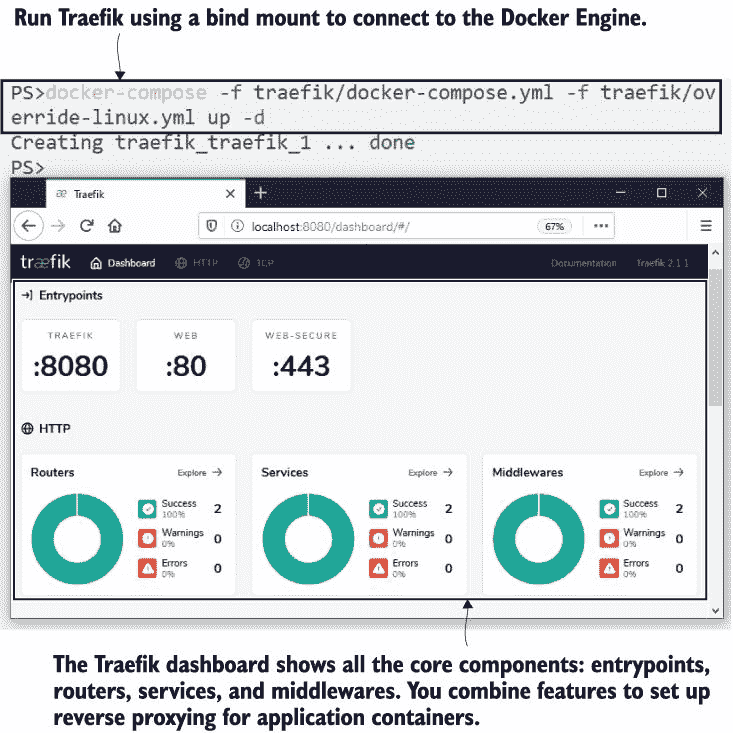

图 20.11 Traefik 仪表板显示了所有被代理的应用程序的配置。

Traefik 非常广泛地被使用，并且它具有与 Nginx 相似的操作模型 -- 有一个免费的开源产品，作为官方镜像发布在 Docker Hub 上，如果你需要支持运行，还有一个商业版本。如果你是反向代理的新手，Nginx 和 Traefik 是我推荐的两个选项；它将成为你基础设施的重要组成部分，因此你应该花些时间比较这两个。让我们深入了解一下 Traefik 的工作原理：

+   入口点 -- 这些是 Traefik 监听外部流量的端口，因此这些映射到容器的发布端口。我使用 80 和 443 用于 HTTP 和 HTTPS，以及 8080 用于 Traefik 仪表板。

+   路由器 -- 这些是匹配传入请求到目标容器的规则。HTTP 路由器有诸如主机名和路径等规则来识别客户端请求。

+   服务 -- 这些是上游组件 -- 实际向 Traefik 提供内容以便它可以向客户端返回响应的应用程序容器。

+   中间件 -- 这些是可以在请求发送到服务之前修改路由器请求的组件。你可以使用中间件组件来更改请求路径或头部，甚至强制执行身份验证。

最简单的配置只需要设置一个带有规则的路由器，以便将客户端请求匹配到路由器所连接的服务。

现在试试看 部署 who-am-I 应用程序，使用包含启用通过 Traefik 路由的标签的更新 Compose 定义：

` # 使用覆盖文件中的 Traefik 标签部署应用程序：` ` docker-compose -f whoami/docker-compose.yml -f whoami/override-traefik.yml up -d`  ` # 浏览到路由器的 Traefik 配置：`  ` # http://localhost:8080/dashboard/#/http/routers/whoami@docker`  ` # 并检查路由：` ` curl -i http://whoami.local`

这是一个非常简单的配置 -- 路由只是将入口点端口链接到上游服务，即 who-am-I 容器。你可以在图 20.12 中看到 Traefik 已经为路由器构建了配置，将主机域名 whoami.local 链接到 whoami 服务。

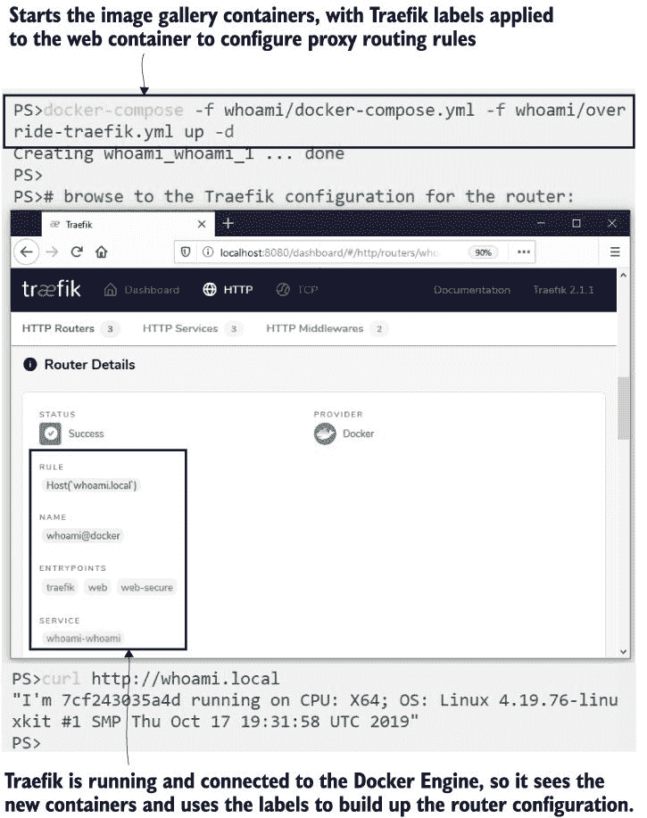

图 20.12 Traefik 使用 Docker API 来查找容器和标签，并使用它们来构建配置。

所有这些操作都是通过在容器上应用两个标签来完成的：一个用于为应用程序启用 Traefik，另一个用于指定要匹配的主机名。列表 20.4 显示了覆盖 Compose 文件中的这些标签。

列表 20.4 通过向应用程序容器添加标签来配置 Traefik

` services:` `   whoami:` `       labels:` `           - "traefik.enable=true"` ``             - "traefik.http.routers.whoami.rule=Host(`whoami.local`)"``

Traefik 支持一些非常复杂的路由选项。您可以通过主机名和路径，或者路径前缀进行匹配，然后使用中间件组件来去除前缀。这听起来很复杂，但这正是我们为图像库 API 所需要的，因此我们可以将其作为主图像库域中的路径暴露出来。我们可以配置 Traefik 监听带有“api”路径前缀的传入请求，并在调用服务之前从请求 URL 中去除前缀，因为服务本身不使用该前缀。

现在试试吧！图像库应用只需要一个带有指定标签的重写文件来启用 Traefik 支持。部署应用后，Traefik 将配置添加到其路由规则中：

` # 使用新的 Traefik 标签启动应用：` ` docker-compose -f image-gallery/docker-compose.yml -f image-gallery/override-traefik.yml up -d`  ` # 检查 Web 应用：` ` curl --head http://image-gallery.local`  ` # 以及 API：` ` curl -i http://image-gallery.local/api/image`

您将在输出中看到从 API 调用得到正确的响应——Traefik 在 http:/ /image-gallery.local/api/image 上接收外部请求，并使用路由器和中间件配置对 http:/ /iotd/image 上的容器进行内部调用。该配置稍微有些晦涩。您定义路由器，然后定义中间件组件，然后将中间件附加到路由器上——如果您想查看它，它位于`image-gallery/override-traefik.yml`文件中。

这种复杂性对消费者来说是完全透明的。您可以在图 20.13 中看到，响应看起来就像直接从 API 返回的一样。

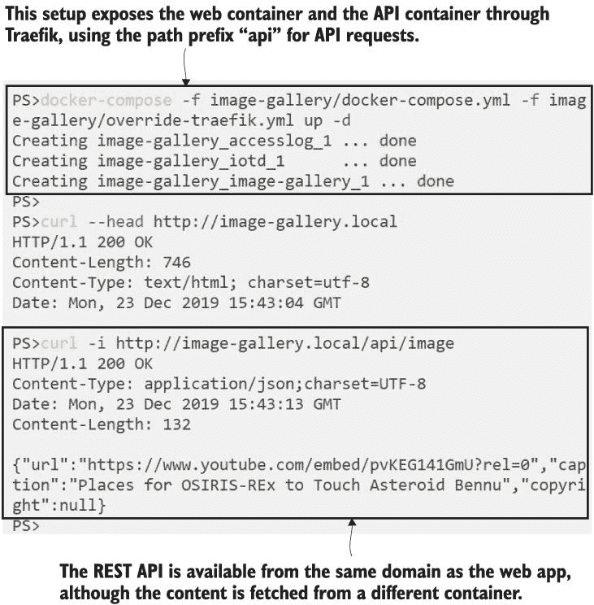

图 20.13 路由规则让您可以在单个域名下展示一个多容器应用。

反向代理并不都支持相同的功能集。截至版本 2.1，Traefik 没有缓存，所以如果您需要一个缓存代理，Nginx 是您的选择。但是，当涉及到 SSL 时，Traefik 有更好的支持——它默认集成了证书提供者，因此您可以自动连接到 Let’s Encrypt 并为您更新证书。或者，您可以使用默认的自签名证书提供者，在非生产环境中为您的网站添加 SSL，而无需任何证书管理。

现在为图像库应用和 API 添加 SSL 支持需要更复杂的 Traefik 设置。它需要监听 HTTPS 入口点以及 HTTP，并将 HTTP 调用重定向到 HTTPS。所有这些仍然是通过标签完成的，所以部署只是应用更新：

` # 使用 Traefik 标签启动 HTTPS 应用：` ` docker-compose -f image-gallery/docker-compose.yml -f image-gallery/override-traefik-ssl.yml up -d`  ` # 使用 HTTPS 检查网站：` ` curl --head --insecure https://image-gallery.local`  ` # 以及 API：` ` curl --insecure https://image-gallery.local/api/image`

如果你浏览到网站或 API，你将在浏览器中看到与使用 Nginx 进行 SSL 时相同的警告消息--证书不受已知证书机构的信任。但这次我们不需要创建自己的证书并仔细管理证书和密钥文件--Traefik 做了所有这些。你可以在图 20.14 中看到我的输出。使用带有 `insecure` 标志的 curl 告诉它即使证书不受信任也要继续。

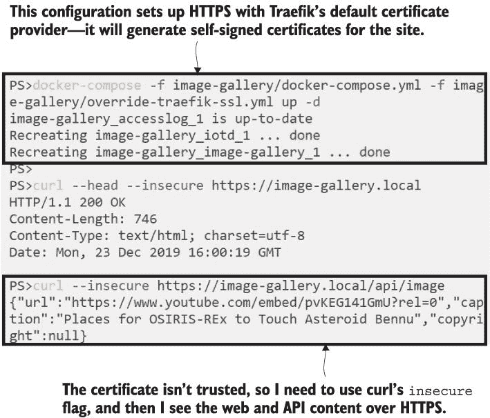

图 20.14 使用 Traefik 进行 HTTPS--它可以生成证书或从第三方提供商获取证书

路由、负载均衡和 SSL 终止是反向代理的主要功能，Traefik 通过容器标签提供动态配置来支持所有这些功能。如果你正在将其与 Nginx 进行比较，你需要记住 Traefik 不提供缓存--这是一个广受欢迎的功能，可能在未来的版本中添加到 Traefik 中。

我们将尝试的最后一个是 Traefik 中简单而在 Nginx 中困难的最后一个功能：粘性会话。现代应用程序被构建成尽可能多的无状态组件--当你大规模运行时，客户端请求可以被路由到任何容器，这样你可以从负载均衡中受益，并在扩展时立即看到结果。旧应用程序往往不是由无状态组件构建的，当你将这些应用程序迁移到容器中运行时，你可能希望用户每次都被路由到同一个容器。这被称为粘性会话，你可以在 Traefik 的服务设置中启用它。

现在试试 The whoami 应用程序是粘性会话的一个简单示例。你可以扩展当前的部署并重复调用--它们将由 Traefik 在容器之间进行负载均衡。部署带有粘性会话的新版本，所有请求都将由同一个容器处理：

` # 使用多个容器运行 who-am-I 应用程序：` ` docker-compose -f whoami/docker-compose.yml -f whoami/override-traefik.yml up -d --scale whoami=3`  ` # 检查请求是否在容器之间进行负载均衡：` ` curl -c c.txt -b c.txt http://whoami.local` ` curl -c c.txt -b c.txt http://whoami.local`  ` # 现在部署具有粘性会话支持的相同应用程序：` ` docker-compose -f whoami/docker-compose.yml -f whoami/override-traefik-sticky.yml up -d --scale whoami=3`  ` # 并检查请求是否由同一容器提供服务：` ` curl -c c.txt -b c.txt http://whoami.local` ` curl -c c.txt -b c.txt http://whoami.local`

启用粘性会话后，每次请求都由相同的容器提供服务，因为 Traefik 设置了一个 cookie 来标识它应该为该客户端使用哪个容器（你也会在浏览器中看到同样的行为）。如果你感兴趣，可以检查浏览器会话中的 cookie 或在`c.txt`文件中的 cookie，你会发现 Traefik 将容器的 IP 地址放入该 cookie 中。下次你发起调用时，它会使用 IP 地址来访问相同的容器。我的输出如图 20.15 所示。

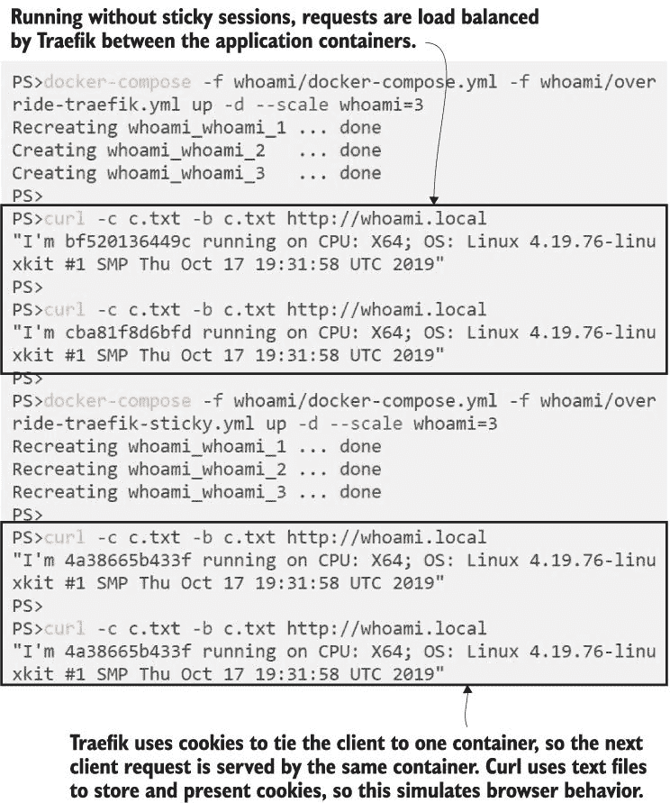

图 20.15 在 Traefik 中启用粘性会话——它使用 cookie 将客户端发送到相同的容器。

粘性会话是团队将旧应用程序迁移到容器时的一个主要需求，Traefik 使其变得相当简单。这并不完全等同于物理服务器或 VM 的粘性会话，因为容器更换得更频繁，所以客户端可能会被绑定到一个不再存在的容器上。如果 cookie 指示 Traefik 指向一个不可用的容器，它会选择另一个容器，所以用户会看到响应，但他们的会话已经结束。

## 20.5 理解反向代理所支持的模式

当你开始在生产中运行许多容器化应用程序时，反向代理几乎是必需的。我们在本章中介绍了一些更高级的功能——SSL、缓存和粘性会话——但即使没有这些，你也会发现你迟早需要反向代理。反向代理支持三种主要模式，我们将通过它们来结束本章。

第一种模式是在标准 HTTP 和 HTTPS 端口上托管多个 Web 应用程序，使用客户端请求中的主机名来获取正确的内容，如图 20.16 所示。

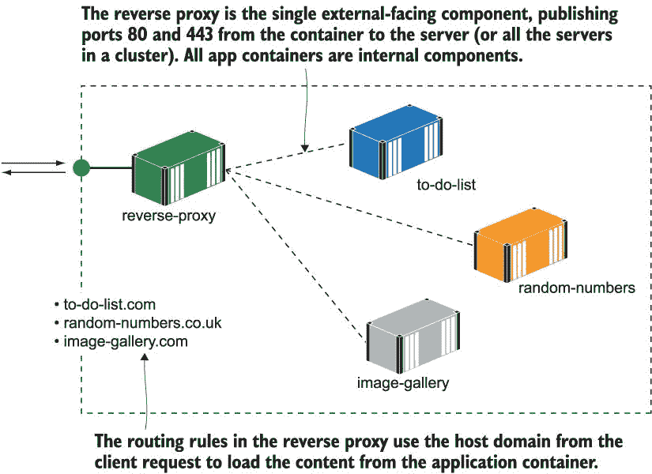

图 20.16 使用反向代理在一个集群中托管具有不同域名的大量应用程序

第二种模式是针对微服务架构，其中单个应用程序运行在多个容器上。你可以使用反向代理有选择地暴露单个微服务，通过 HTTP 请求路径进行路由。从外部来看，你的应用程序有一个单一的域名，但不同的路径由不同的容器提供服务。图 20.17 展示了这种模式。

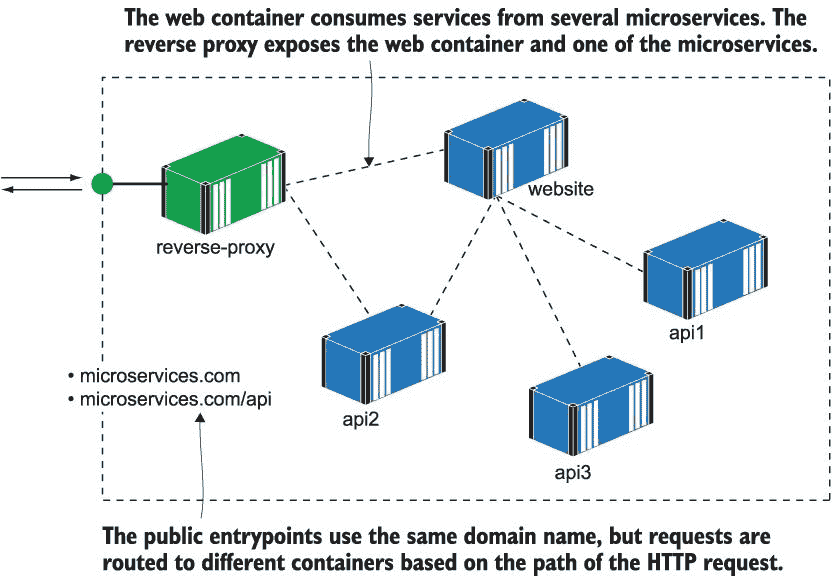

图 20.17 由反向代理暴露的微服务属于同一应用程序域。

如果你希望将旧的单体应用程序迁移到容器中，这种最终模式非常强大。你可以使用反向代理开始分解旧应用程序的单体前端，将功能拆分到新的容器中。这些新功能由反向代理路由，因为它们在独立的容器中，所以可以使用不同的、更现代的技术堆栈。图 20.18 展示了这一点。

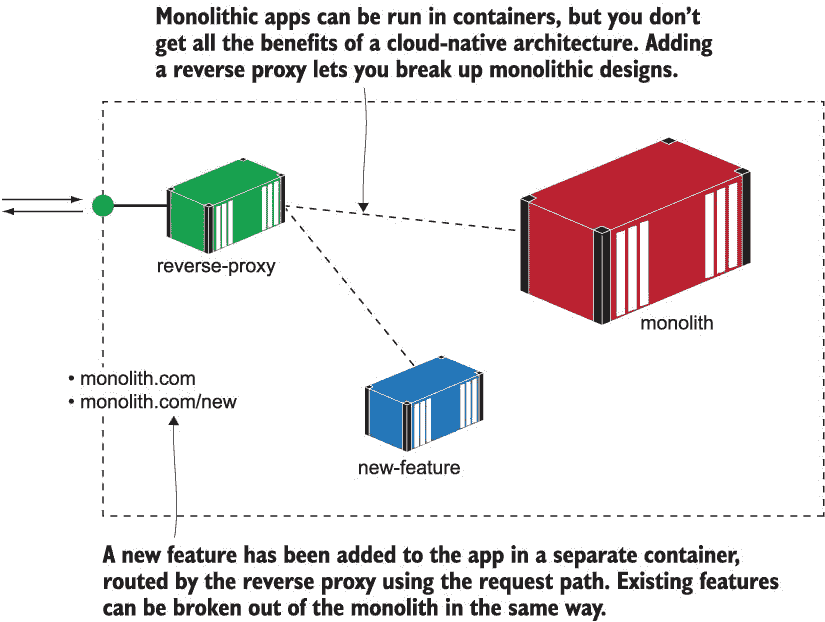

图 20.18 反向代理隐藏了单体架构，使其可以分解成更小的服务。

这些模式不是互斥的——在一个单独的集群中，你可以有一个反向代理驱动所有三个模式，托管多个域名，这些域名运行着混合了微服务和单体应用，这些应用都在容器中运行。

## 20.6 实验室

我们为这个实验室开发了一个全新的应用——一个将清楚地展示缓存反向代理强大功能的应用。这是一个简单的网站，可以计算到指定小数位数的π。在本章的实验室文件夹中，你可以使用 Docker Compose 运行该应用，并通过访问 http://localhost:8031/?dp=50000 来查看π看起来像什么，精确到 50,000 位小数。刷新浏览器，你会发现计算相同响应所需的时间是一样的。你的任务是运行一个反向代理后的应用：

+   应用应该可在`pi.local`域的常规 HTTP 端口上访问。

+   代理应缓存响应，所以当用户重复相同的请求时，响应将从缓存中提供，这比从应用中提供要快得多。

+   代理应增加容错性，所以如果你杀死了应用容器，任何缓存的响应仍然可以通过代理获得。

我的解决方案已上传至 GitHub，你会在那里发现使用这种计算密集型工作（如缓存代理）可以节省大量时间：*[`github.com/sixeyed/diamol/blob/master/ch20/lab/README.md`](https://github.com/sixeyed/diamol/blob/master/ch20/lab/README.md)*。
