# 21 使用消息队列进行异步通信

这是本书的最后一章完整章节，它介绍了一种新的系统组件通信方式：通过队列发送和接收消息。消息队列已经存在很长时间了——它们是一种解耦组件的方法，而不是直接连接以进行通信，而是向队列发送消息。队列可以将消息传递给一个或多个接收者，这为你的架构增加了许多灵活性。

在本章中，我们将关注当你向应用程序添加消息队列时启用的两种场景：提高系统性能和可伸缩性，以及在不中断服务的情况下添加新功能。我们将使用两个在现代 Docker 中运行得很好的现代消息队列：Redis 和 NATS。

## 21.1 什么是异步消息？

软件组件通常以同步方式通信——客户端连接到服务器，发送请求，等待服务器发送响应，然后关闭连接。这对于 REST API、SOAP Web 服务和 gRPC 都适用，它们都使用 HTTP 连接。

同步通信就像打电话一样：需要双方同时可用，因此需要仔细管理。服务器可能离线或满载运行，因此无法接受连接。服务可能需要很长时间才能处理，客户端连接可能在等待响应时超时。连接可能在网络级别失败，客户端需要知道是否可以安全地重复请求。你需要在应用程序代码或库中添加大量逻辑来处理所有故障模式。

异步通信在客户端和服务器之间增加了一层。如果客户端需要服务器执行某些操作，它会向队列发送一条消息。服务器监听队列，接收到消息后进行处理。服务器可以向队列发送响应消息，如果客户端需要响应，它将监听队列并接收消息。异步消息就像通过电子邮件进行通信——各方可以在有空时加入。如果服务器离线或超出容量，消息将留在队列中，直到有服务器可以处理它。如果消息处理时间较长，这不会影响客户端或队列。如果客户端发送消息时出现故障，消息不在队列中，客户端可以安全地再次发送。图 21.1 展示了使用异步消息的通信。

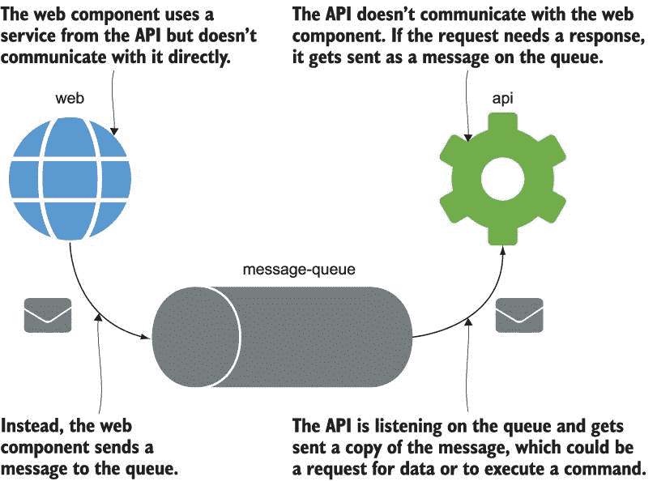

图 21.1 消息队列解耦组件，使它们不直接通信。

消息传递一直是集成架构师的首选选项，但过去它引发了一些难题——队列技术需要超级可靠，但企业队列在测试环境中运行成本太高，所以我们是否可以在不同的环境中使用不同的队列，或者在开发中完全跳过队列？Docker 解决了这个问题，使得轻松将企业级开源队列添加到您的应用程序中。在轻量级容器中运行队列意味着您可以针对每个应用程序运行一个专门的队列，而开源软件的免费使用意味着您可以在每个环境中使用相同的技术。Redis 是一个流行的消息队列选项（您也可以将其用作数据存储），您可以轻松尝试它来感受异步消息传递。

现在试试 Run the Redis server in a container, connected to a network where you can run other containers to send and receive messages:

` # 在 Linux 容器中创建网络：` ` docker network create ch21`  ` # 或者 Windows 容器：` ` docker network create -d nat ch21`  ` # 运行 Redis 服务器：` ` docker container run -d --name redis --network ch21 diamol/redis`  ` # 检查服务器是否正在监听：` ` docker container logs redis --tail 1`

消息队列是服务器组件，只需运行直到您停止它们。Redis 在端口 6379 上监听连接，并且相同的地址被客户端用于发送消息，以及服务器用于监听消息。您将从容器日志中看到，Redis 在您启动容器后仅几秒钟就开始运行了——我的输出在图 21.2 中。

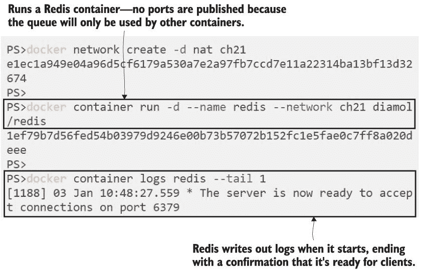

图 21.2 消息队列就像任何其他后台容器一样，等待连接。

客户端需要打开到队列的连接以发送他们的消息——如果您想知道这比直接调用 REST API 更好，那全在于速度。队列通常有自己的自定义通信协议，它高度优化，因此当客户端发送消息时，它只需传输请求的字节并等待确认它已被接收。队列不对消息进行任何复杂的处理，因此它们应该能够轻松处理每秒数千条消息。

现在试试 We won’t send thousands of requests, but we’ll use the Redis CLI to send a few messages. The command syntax is a bit involved, but this is going to publish the message “ping” on the channel called `channel21` , and it will repeat that message 50 times with a 5 second interval in between:

` # 在后台运行 Redis 客户端以发布消息：` ` docker run -d --name publisher --network ch21 diamol/redis-cli -r 50 -i 5 PUBLISH channel21 ping`  ` # 检查日志以查看消息是否正在发送：` ` docker logs publisher`

这个 Redis 客户端容器将在后台运行，每五秒发送一条消息。日志输出仅显示每次消息发送的响应代码，所以如果一切正常，你会看到很多零，这是“OK”响应。你可以在图 21.3 中看到我的示例。

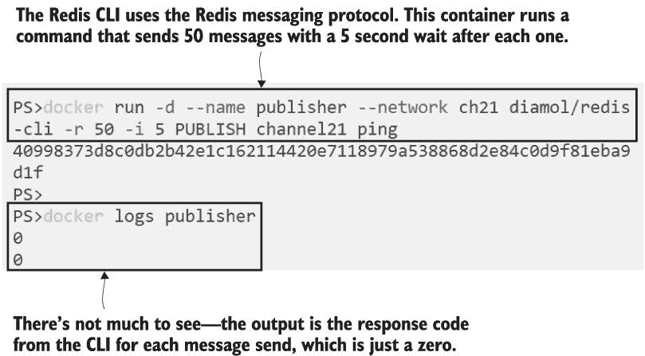

图 21.3 Redis CLI 是向运行在 Redis 容器中的队列发送消息的简单方法。

这里有一些新的术语，因为“客户端”和“服务器”在消息传递的术语中并不真正适用。每个组件都是消息队列的客户端；他们只是以不同的方式使用它。发送消息的组件是发布者，接收消息的组件是订阅者。可能有多个不同的系统使用队列，因此 Redis 使用通道来保持消息的分离。在这种情况下，发布者正在`channel21`通道上发送消息，因此为了使组件能够读取这些消息，它需要订阅相同的通道。

现在尝试一下 运行另一个带有 Redis CLI 的容器，这次订阅其他容器发布消息的通道：

`# 运行一个交互式订阅者，你将每五秒看到一次消息` `# 收到：` `docker run -it --network ch21 --name subscriber diamol/redis-cli SUBSCRIBE channel21`

我们正在使用 Redis CLI，这是一个使用 Redis 消息协议进行通信的简单客户端--对于所有主要的应用平台都有 Redis SDK，因此你也可以将其集成到自己的应用中。CLI 会在多行打印输出，所以你首先会看到订阅队列的输出。发布容器仍在后台运行，每次它发布消息时，Redis 都会将副本发送给订阅容器--然后你会在日志中看到消息详情。我的在图 21.4 中。

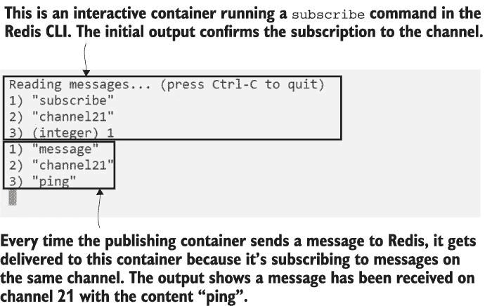

图 21.4 队列的订阅者接收了在通道上发布的每条消息的副本。

你可以用 Ctrl-C 退出容器，或者用`docker container rm -f subscriber`命令杀死容器。在此之前，它将继续监听消息。你可以看到这是一种异步通信：发布者在有订阅者监听之前就发送了消息，而订阅者将在没有发布者时继续监听消息。每个组件都与消息队列一起工作，并且不知道其他正在发送或接收消息的组件。

这个简单的原理，通过队列解耦发送者和接收者，有助于使你的应用性能更优和可扩展，你将在下一个版本的任务列表应用中看到这一点。

## 21.2 使用云原生消息队列

待办事项应用程序有一个 Web 前端和 SQL 数据库用于存储。在原始实现中，组件之间的所有通信都是同步的——当 Web 应用程序发送查询或插入数据时，它会打开到数据库的连接，并保持打开状态直到请求完成。这种架构扩展性不好。我们可以运行数百个 Web 容器来支持高用户负载，但最终我们会达到一个极限，即使用所有可用的数据库连接，应用程序将开始失败。

这就是消息队列如何帮助提高性能和扩展性的地方。待办事项应用程序的新版本使用异步消息进行保存工作流程——当用户添加新的待办事项时，Web 应用程序会在队列上发布消息。队列可以处理比数据库更多的连接，并且连接的生存周期要短得多，所以即使在非常高的用户负载下，队列也不会达到最大容量。我们将在这个练习中使用不同的队列技术：NATS，这是一个成熟且广泛使用的云原生计算基金会（CNCF）项目。它将消息存储在内存中，因此非常快，非常适合容器之间的通信。

现在尝试 Run NATS 在一个容器中。它有一个简单的管理 API，您可以使用它来查看连接到队列的客户数量：

` # 切换到练习文件夹:` ` cd ch21/exercises/todo-list`  ` # 启动消息队列:` ` docker-compose up -d message-queue`  ` # 检查日志:` ` docker container logs todo-list_message-queue_1`  ` # 并检查活动连接:` ` curl http://localhost:8222/connz`

连接 API 调用返回有关活动连接数量的 JSON 详细信息。可能会有成千上万，因此响应是分页的，但在这个案例中，只有一个数据页，因为没有任何连接。您可以在图 21.5 中看到我的输出。

图 21.5 NATS 是一个替代的消息队列；它非常轻量级，并有一个管理 API。

当您转向异步消息时，会涉及一些开发工作，对于待办事项应用程序来说，这意味着对 Web 应用程序的一些更改。现在当用户添加待办事项时，Web 应用程序会向 NATS 发布消息，而不是在数据库中插入数据。这些更改实际上相当小。即使您不熟悉.NET Core，您也可以在列表 21.1 中看到发布消息涉及的工作不多。

列表 21.1 替代将数据写入数据库发布消息

`public void AddToDo(ToDo todo)` `        {` `             MessageQueue.Publish(new NewItemEvent(todo));` `             _NewTasksCounter.Inc();` `        }`

NATS 不使用与 Redis 相同的通道概念。相反，每条消息都有一个主题，这是一个用于标识消息类型的字符串。你可以为消息主题选择自己的命名方案。这个主题是`events.todo` `.newitem`，表示这是待办应用中的新项目事件。如果订阅者对新项目事件感兴趣，他们将能够监听带有该主题的消息，但即使没有订阅者，应用仍然会发布消息。

现在试试看 运行待办 Web 应用的新版本和数据库。你会发现应用可以加载，你可以使用它而不会出现任何错误，但它并不完全正确地工作：

` # 启动 Web 和数据库容器：` ` docker-compose up -d todo-web todo-db`  ` # 浏览到 http://localhost:8080 并添加一些项目`

你会发现这个应用很乐意让你添加新项目，但当你浏览到列表时，却一个也没有。那是因为列表页面是从数据库中获取数据的，但新项目页面不再将数据插入数据库。新项目事件消息正在发布到 NATS 消息队列中，但没有人在监听它们。你可以在图 21.6 中看到我的空待办事项列表（这根本不代表现实生活）。

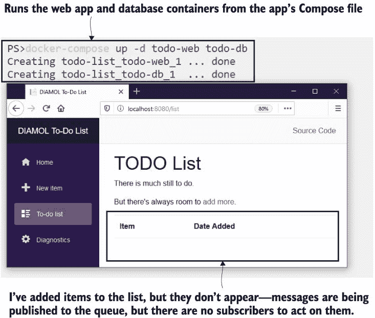

图 21.6 待办事项应用的消息发布；没有任何订阅者，缺少了功能。

有许多消息队列技术以不同的方式处理这种情况——即消息被发布但没有订阅者。有些队列将它们移动到死信队列供管理员管理，其他则存储消息以便在客户端连接并订阅时交付。Redis 和 NATS 有效地吞没了这些消息——它们向客户端确认收到，但没有地方可以发送，因此它们被丢弃。新订阅 Redis 或 NATS 队列的订阅者只会接收到它们开始监听后发布的消息。

现在试试看 GitHub 上的项目示例中有一个简单的 NATS 订阅者工具。你可以用它来监听特定主题的消息，这样我们就可以检查待办事件是否实际上被发布了：

` # 运行一个监听"events.todo.newitem"消息的订阅者` `docker container run -d --name todo-sub --network todo-list_app-net diamol/nats-sub events.todo.newitem`  ` # 检查订阅者日志：` ` docker container logs todo-sub`  ` # 浏览到 http://localhost:8080 并添加一些新项目`  ` # 检查新项目事件是否已发布：` ` docker container logs todo-sub`

用户体验完全相同——Web 应用仍然不起作用。它发布消息，但不知道它们会发生什么，但现在有一个订阅者接收了每条消息的副本。如果你在网站上输入一些待办事项，你将在订阅者的日志中看到它们被列出——我的显示在图 21.7 中。

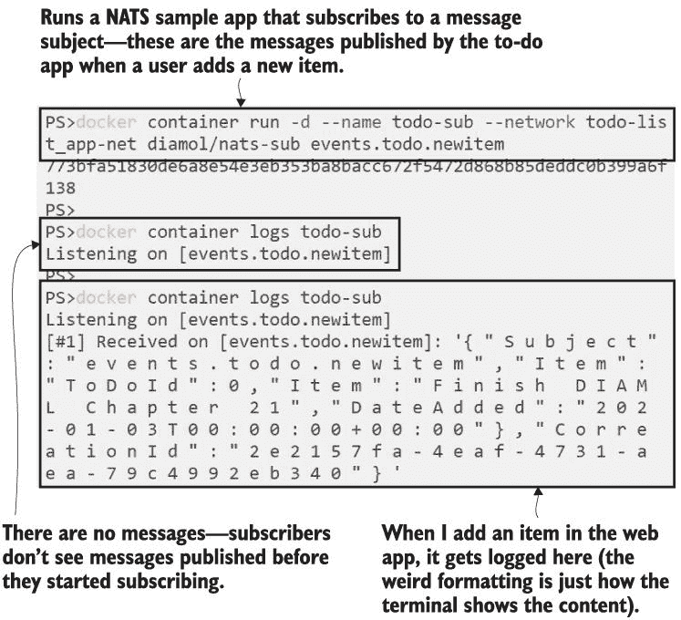

图 21.7 一个简单的记录消息的订阅者是一个很好的方法来检查它们是否被发布。

到现在为止，你应该已经意识到待办事项应用缺少一个对发布的消息进行操作的组件。你需要做三件工作来迁移到异步消息：运行消息队列，在有趣的事件发生时发布消息，并订阅这些消息，以便在事件发生时做一些工作。待办事项应用缺少最后一部分，我们将在下一部分添加。

## 21.3 消费和处理消息

订阅队列的组件被称为消息处理器，通常你会有一个处理器用于每种类型的消息（Redis 中的每个频道或 NATS 中的每个主题）。待办事项应用需要一个消息处理器来监听新项目事件并在数据库中插入数据。图 21.8 显示了完成的架构。

图 21.8 异步处理使用消息处理器以及事件发布者。

这种设计是可以扩展的，因为队列就像一个缓冲区，可以平滑掉来自用户负载的任何峰值。你可以有数百个 Web 容器，但只有 10 个消息处理器容器——处理器在一个组中，所以队列共享消息，每个消息由单个容器处理。容器一次处理一个消息，所以插入数据时使用的最大 SQL 连接数限制为 10，无论有多少用户疯狂点击按钮。如果进入的负载超过这 10 个处理器可以处理的，消息就会被保存在队列中，直到处理器准备好处理更多。应用会继续工作，数据最终会被保存。

现在试试看！待办事项应用的消息处理器已经构建并发布到 Docker Hub，所以它已经准备好了。现在运行它，看看应用如何使用异步消息工作：

` # 启动消息处理器：` ` docker-compose up -d save-handler`  ` # 检查容器日志中的连接：` ` docker logs todo-list_save-handler_1`  ` # 浏览到 http://localhost:8080 并添加一些新项目`    ` # 检查事件是否已被处理：` ` docker logs todo-list_save-handler_1`

应用再次工作！几乎。你会发现你可以添加新项目，它们会出现在列表页面上，但不是立即出现。当你保存一个项目时，Web 应用会重定向到列表页面，该页面在消息仍在队列中处理和处理器处理时加载。在数据库查询运行时，新项目还没有被保存，所以新数据不会显示。你可以在图 21.9 中看到我的输出——在这个时候，我的网页上没有显示任何项目，尽管已经保存了一个新项目。

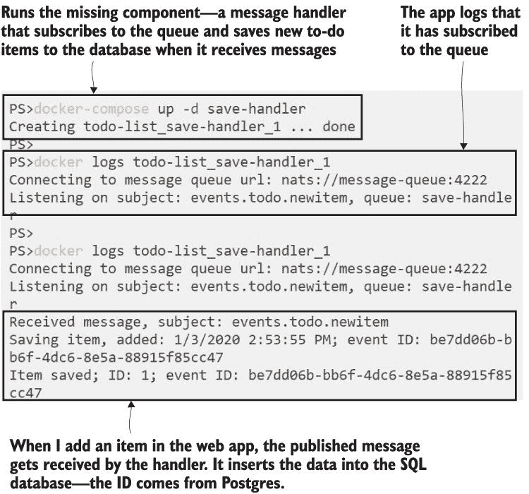

图 21.9 消息处理器订阅队列，接收每条消息的副本，并对其采取行动。

这是一种异步消息的副作用，称为最终一致性——当所有消息都已被处理时，您的应用程序数据的状态将是正确的，但在那时之前，您可能会得到不一致的结果。有方法可以解决这个问题，使整个 UI 异步，因此待办事项 Web 应用会监听一个表示列表已更改的事件，然后刷新自己。这种推送模型可能比轮询查询更有效率，但本书中涉及的内容太多。我们现在只需刷新即可。

将架构迁移到异步消息是一个相当大的变化，但它开辟了许多机会，所以了解它是绝对值得的。消息处理器是小型、专注的组件，可以独立于主应用程序或彼此进行更新或扩展。在这个练习中，我们使用队列来解决扩展问题，现在我们可以运行多个保存消息处理器的实例来处理传入的负载，同时有效地限制我们使用的 SQL 连接数量。

现在尝试一下 消息处理器是内部组件；它们不监听任何端口，因此您可以在单台机器上以多个容器的规模运行它们。如果运行了相同处理器的多个实例，NATS 支持负载均衡来共享消息：

` # 扩展处理器：` ` docker-compose up -d --scale save-handler=3`  ` # 检查是否有新的处理器已连接：` ` docker logs todo-list_save-handler_2`  ` # 浏览到 http://localhost:8080 并添加一些新项目`  ` # 查看哪些处理器已处理消息：` ` docker-compose logs --tail=1 save-handler`

您会看到消息被发送到不同的容器中。NATS 使用轮询负载均衡在连接的订阅者之间共享负载，您会发现您投入的负载越多，分布就越均匀。图 21.10 中的我的输出显示容器 1 和 2 已经处理了消息，但容器 3 没有。

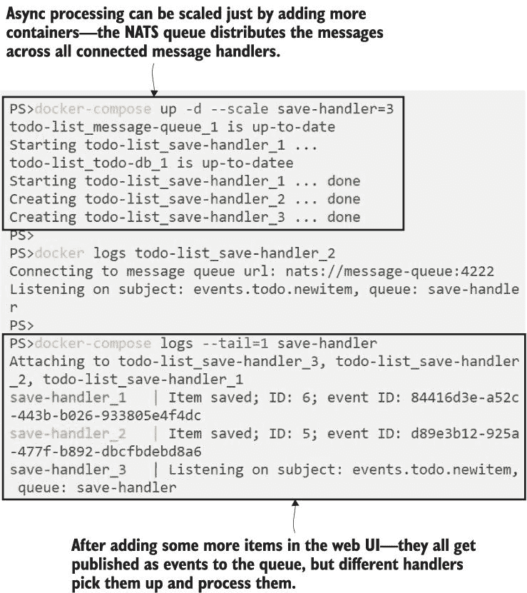

图 21.10 多个消息处理器分担工作负载，以便您可以根据需求进行扩展。

重要的是要意识到，我没有对我的新功能进行任何更改以获得三倍的处理能力——网站和消息处理器代码完全相同。我只是运行了更多相同消息处理器容器的实例。如果您有另一个由相同事件触发的功能，您可以运行一个订阅相同消息主题的不同消息处理器。这为在不更改现有代码的情况下将新功能部署到您的应用中提供了有趣的选择。

## 21.4 使用消息处理器添加新功能

我们将待办事项应用程序推向了事件驱动架构，这是一种设计，其中应用程序发布事件来说明事情已经发生，而不是立即处理所有事情。这是一种构建松散耦合应用程序的好方法，因为您可以在不更改发布事件的逻辑的情况下更改对事件的响应。我们只是在这个应用程序中使用它来处理一种类型的事件，但这仍然提供了在不更改现有应用程序的情况下添加新功能的灵活性。

要做到这一点，最简单的方法是在一个新组中添加一个新的消息处理器，该处理器接收每个事件的副本，但对其执行不同的操作。现有的消息处理器将数据保存到 SQL 数据库中；新的消息处理器可以将数据保存到 Elasticsearch 中，以便用户在 Kibana 中轻松查询，或者它可以将项目添加到 Google 日历中的提醒。我们为下一个练习有一个更简单的例子--一个像审计跟踪一样工作的处理器，为每个新的待办事项写入日志条目。

现在试试看 新的消息处理器位于一个 Compose 覆盖文件中。当你部署它时，你会发现这是一个增量部署。Compose 创建了一个新的容器，但其他所有容器都没有改变：

` # 运行审计消息处理器，保持保存处理器的相同规模`  ` # 处理器：` ` docker-compose -f docker-compose.yml -f docker-compose-audit.yml up -d --scale save-handler=3`  ` # 检查审计处理器是否正在监听：` ` docker logs todo-list_audit-handler_1`  ` # 浏览到 http://localhost:8080 并添加一些新项目`  ` # 检查审计记录：` ` docker logs todo-list_audit-handler_1`

这是一个零停机时间部署；原始的应用容器保持不变，新功能在一个新的容器中实现。审计处理器订阅与保存处理器相同的消息主题，因此它接收每条消息的副本，而另一份消息副本则发送到保存处理器容器之一。您可以在图 21.11 中看到我的输出，其中审计处理器写出了待办事项的日期和文本。

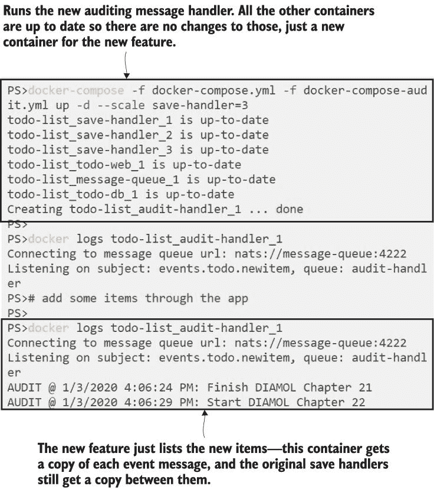

图 21.11 发布事件解耦了您的应用程序组件，并允许您添加新功能。

现在有两个进程在用户创建待办事项时被触发，并且它们都在不同的容器中运行的独立组件中执行。这些进程可能需要任何长度的时间，但这不会影响用户体验，因为 Web UI 不等待它们（甚至不知道它们）--它只是将事件发布到队列中，并且无论有多少订阅者监听，这种行为都具有相同的延迟。

您应该对这种架构的强大之处有一个大致的了解，即使是从这个简单的例子中也能看出。一旦您的应用程序将关键事件作为消息发布到队列中，您就可以在不接触现有组件的情况下构建全新的功能。新功能可以独立构建和测试，并且可以在不影响运行中的应用程序的情况下部署。如果功能存在问题，您只需停止消息处理程序即可取消部署。

我们将查看本章的最后一个练习，以帮助您相信异步消息是您应该考虑的应用程序模式。对于某种类型的事件，我们可以有多个订阅者，但也可以有多个发布者。新项事件在代码中是一个固定结构，因此任何组件都可以发布该事件，这为我们创建待办事项提供了新的选项。我们将利用这一点来部署应用程序的 REST API，而无需更改任何现有部分。

现在试试吧，待办事项列表 API 已经编写完毕并准备好部署。它监听 8081 端口，当用户发起 HTTP `POST`请求时，会发布一个新项事件：

` # 启动 API 容器，定义在覆盖文件中：` ` docker-compose -f docker-compose.yml -f docker-compose-audit.yml -f docker-compose-api.yml up -d todo-api`  ` # 通过 API 添加新项目：` ` curl http://localhost:8081/todo -d '{"item":"Record promo video"}' -H 'Content-Type: application/json'`  ` # 检查审计日志：` ` docker logs todo-list_audit-handler_1`

新的 API 是一个简单的 HTTP 服务器，其中唯一的真正逻辑是使用列表 21.1 中的相同消息队列方法将事件发布到队列中。您将看到通过 API 输入的新项目会被审计处理程序和保存处理程序处理，因此会有审计条目，当您刷新 Web 应用程序时，您会看到新项目已存在于数据库中。我的输出如图 21.12 所示。

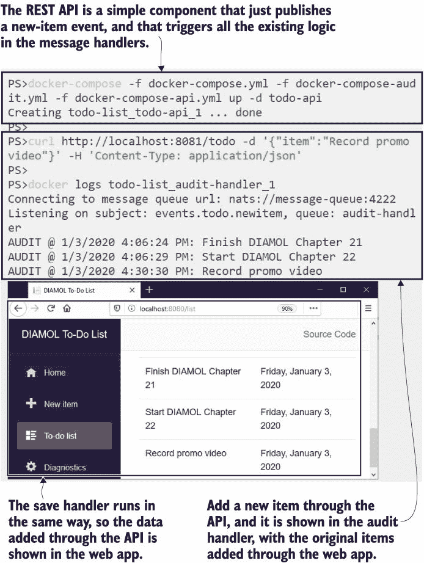

图 21.12 事件可以有多个订阅者和多个发布者，这实现了松耦合。

这是非常强大的功能，这一切都来自于应用程序中发布的一个单一事件。异步消息使您能够构建更灵活的应用程序，这些应用程序更容易扩展和更新，您还可以将所有这些优点添加到现有的应用程序中，只需从几个关键事件开始构建即可。

在您去白板之前，我们将通过更详细地研究消息模式来结束本章，让您了解您可能面临的情况。

## 21.5 理解异步消息模式

异步消息是一个高级话题，但 Docker 大大降低了入门门槛，因为运行队列在容器中非常容易，您可以快速原型化应用程序如何与事件发布一起工作。在队列上发送和接收消息有不同的方式，了解几种替代方案是值得的。

本章中使用的模式被称为发布-订阅（或“pub-sub”），它允许零个或多个订阅者接收发布的消息，如图 21.13 所示。

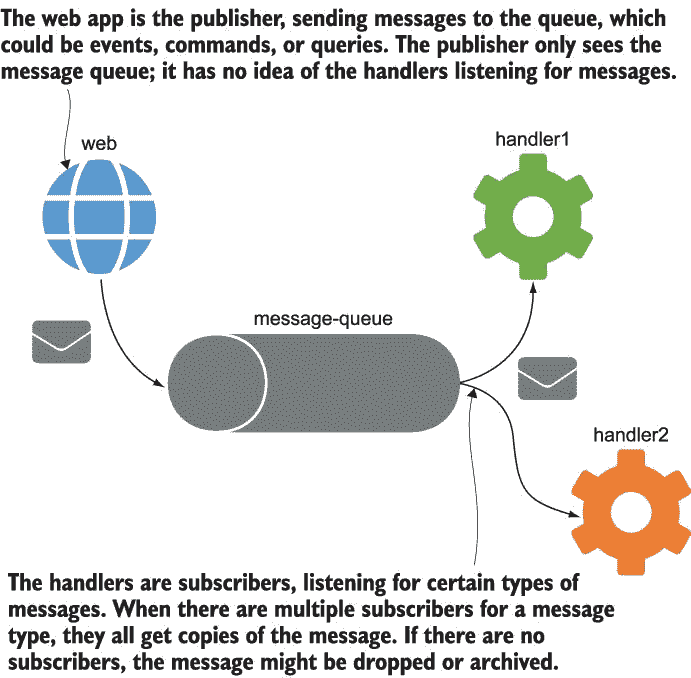

图 21.13 Pub-sub 消息允许许多进程对同一被发布的消息进行操作。

这种模式并不适合每个场景，因为消息发布者不知道谁消费了消息，他们如何处理它，或者他们何时完成。一个替代方案是请求-响应消息，客户端向队列发送消息并等待响应。处理器处理请求消息，然后发送一个响应消息，队列将其路由回客户端。这可以用来替换标准同步服务调用，其优点是处理器不会过载，客户端可以在等待响应时做其他工作。图 21.14 展示了这种模式。

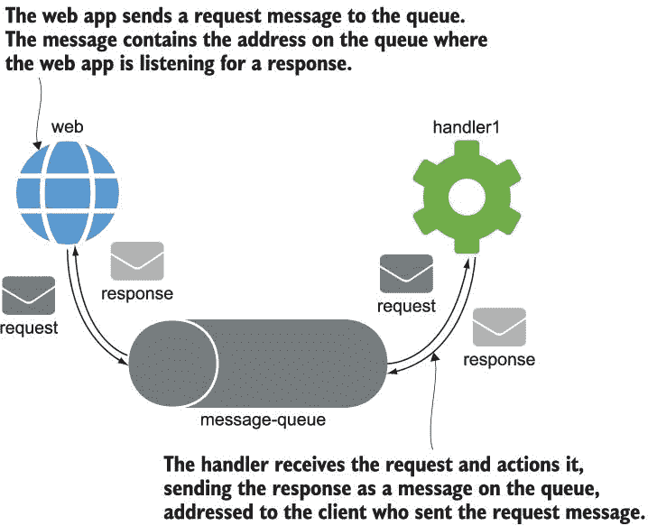

图 21.14 请求-响应消息是客户端-服务通信，没有直接连接。

几乎所有队列技术都支持这些模式，以及像“fire-and-forget”（客户端在消息中发送命令请求而不是发布事件，但不在乎响应）和“scatter-gather”（客户端发布一个消息，多个订阅者对其操作，然后汇总所有响应）这样的变体。我们在本章中探讨了 Redis 和 NATS，但还有一项技术你也应该考虑：RabbitMQ。RabbitMQ 是一个更高级的队列，支持复杂的路由和持久消息，因此消息被保存到磁盘上，队列内容在容器重启后仍然存在。所有这些队列技术都在 Docker Hub 上提供官方镜像。

消息队列技术可以解放你的应用程序设计。你可以从一开始就构建一个事件驱动的架构，或者逐渐向其演变，或者只是使用消息来处理关键事件。当你开始部署新功能而无需停机，或者缩小处理器的规模以保护数据库免受饥饿而不会崩溃应用程序时，你会意识到这些模式的力量，你也会为完成了这一章而感到高兴。

## 21.6 实验室

这是本书的最后一个实验室，这个实验室有点狡猾。目标是为待办事项应用程序添加另一个消息处理器——一个在项目保存后更改文本的处理器。这个处理器已经存在，所以这主要关于将新服务连接到 Docker Compose 文件，但还有一些配置设置你需要挖掘。

你的解决方案需要使用来自 Docker Hub 的镜像`diamol/ch21-mutating-handler`运行一个新的处理器，当你使其工作后，有几个问题需要调查：

+   新组件监听名为`events.todo.itemsaved`的事件，但目前还没有什么发布这些事件。你需要搜索一个可以应用于现有组件的配置设置，使其发布这些事件。

+   新组件有一组糟糕的默认配置，因此它没有使用正确的地址来访问消息队列。你需要搜索设置并修复它。

这并不像看起来那么糟糕；你需要的所有答案都在 Dockerfile 中，你只需在你的 Compose 文件中设置值——无需更改源代码或重建镜像。这是一个有用的练习，因为当你真正使用 Docker 时，你肯定会花一些时间试图弄清楚配置设置，并且最终的消息处理器为待办事项应用添加了一个有用的功能。

我的解决方案始终在 GitHub 上，附有截图以证明其工作：*[`github.com/sixeyed/diamol/blob/master/ch21/lab/README.md`](https://github.com/sixeyed/diamol/blob/master/ch21/lab/README.md)*。
