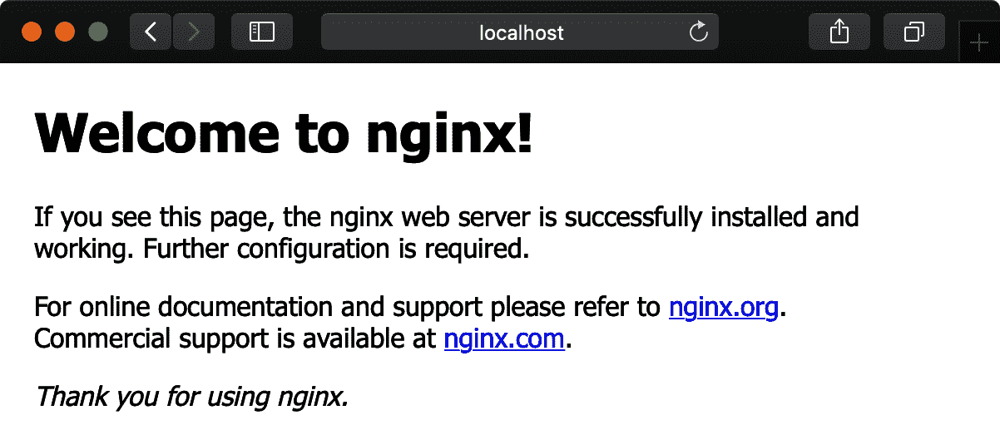

# 第四章：构建一个图表

图表是 Helm 的核心。除了将它们安装到 Kubernetes 集群中或管理已安装的图表实例外，您还可以创建新图表或更改现有图表。在接下来的三章中，我们将详细介绍有关图表的许多细节，包括创建图表、图表内的元素、为 Kubernetes 清单编写模板、测试图表、依赖关系等。

在本章中，您将学习如何创建一个新图表，并了解图表的许多部分。这将包括使用几个内置命令来帮助您进行图表开发过程。

图表是 Helm 处理的包。它们在概念上类似于 APT 用于 Debian 包或 Homebrew 用于 macOS 的 Formula。但概念上的相似之处仅此而已。图表旨在针对具有其独特风格的平台 Kubernetes。图表的核心是模板，用于生成可以在集群中安装和管理的 Kubernetes 清单。

在我们深入讨论第五章中的模板之前，让我们先创建一个基本的完全功能图表。为此，我们将涵盖一个名为*anvil*的示例图表。通过使用这个图表，您将了解如何使用 Helm 生成图表、图表及其内部文件的结构、打包图表以及检查图表的问题。有关此图表的在线来源，请参考[*https://github.com/Masterminds/learning-helm/tree/main/chapter4/anvil*](https://github.com/Masterminds/learning-helm/tree/main/chapter4/anvil)。

# 图表创建命令

Helm 包括`create`命令，使您能够轻松创建自己的图表，这是一个很好的起点。该命令会创建一个新的 Nginx 图表，您可以自行命名，遵循图表布局的最佳实践。由于 Kubernetes 集群可以使用不同的方法来公开应用程序，因此该图表使得 Nginx 如何暴露给网络流量可配置，以便在各种集群中进行公开。

`create`命令会为您创建一个图表，并包含所有所需的图表结构和文件。这些文件被记录下来，帮助您了解所需内容，提供的模板展示了多个 Kubernetes 清单如何协同工作以部署应用程序。此外，您可以立即安装和测试此图表。

在本章的整个过程中，我们将看一个名为*anvil*的示例应用程序。这是一个简单的应用程序，将向您展示图表的结构，并为您提供改变不同应用程序的图表的机会。要创建新图表，请从命令提示符中运行以下命令：

```
$ helm create anvil
```

这将在当前目录的子目录下创建一个名为*anvil*的新图表。

新图表是一个包含多个文件和文件夹的目录。这并不包括每个文件和文件夹——您将在接下来的几章中发现更多内容。这些是实现图表功能所需的基本文件。

```
anvil
├── Chart.yaml 
├── charts 
├── templates 
│   ├── NOTES.txt 
│   ├── _helpers.tpl
│   ├── deployment.yaml
│   ├── ingress.yaml
│   ├── service.yaml
│   ├── serviceaccount.yaml
│   └── tests
│       └── test-connection.yaml 
└── values.yaml 
```


*Chart.yaml* 文件包含图表的元数据和一些功能控制。


依赖图表可以选择性地存放在*charts*目录中。图表依赖关系在第 6 章中介绍。目前这将是一个空目录。


用于生成 Kubernetes 清单的模板存储在*templates*目录中。


*NOTES.txt* 文件是一个特殊的模板。安装图表时，会渲染并显示*NOTES.txt*模板，而不是将其安装到集群中。


模板可以包含测试，这些测试不会作为`install`或`upgrade`命令的一部分安装。此图表包含一个通过`helm test`命令使用的测试。有关测试的详细信息，请参阅第 6 章。


Helm 渲染清单时传递给模板的默认值存储在*values.yaml*文件中。在实例化图表时，可以覆盖这些值。

您可以通过运行以下命令安装此新创建的图表，无需任何修改：

```
$ helm install myapp anvil
```

运行此命令时，Helm 将在集群中使用当前配置的连接和上下文创建一个名为*myapp*的图表实例。Helm 使用的配置与你使用`kubectl`命令行应用程序时的配置相同。在该命令中，*anvil*的最后一个参数是图表所在目录。

此命令的输出包含通过渲染*NOTES.txt*模板生成的内容，如下所示：

```
NAME: myapp
LAST DEPLOYED: Sun Apr  5 08:12:59 2020
NAMESPACE: default
STATUS: deployed
REVISION: 1
NOTES:
1\. Get the application URL by running these commands:
  export POD_NAME=$(kubectl get pods --namespace default ↵
    -l "app.kubernetes.io/name=anvil,app.kubernetes.io/instance=myapp" ↵
    -o jsonpath="{.items[0].metadata.name}")
  echo "Visit http://127.0.0.1:8080 to use your application"
  kubectl --namespace default port-forward $POD_NAME 8080:80
```

`NOTES` 部分包含有关连接到应用程序的信息。根据实例化图表时传递的值，此信息可能会有所不同。此图表可以配置为使用 ClusterIP、NodePort、LoadBalancer 和 Ingress 公开应用程序。默认情况下使用 ClusterIP。

如果按照备注中的说明进行操作，您将看到默认的 Nginx 网页，以展示它正在运行，如图 4-1 所示。



###### 图 4-1\. 访问运行中应用程序时显示的默认 Nginx 网页

公开应用程序的方法与内置的 Kubernetes 资源类型相关，而不是应用程序的功能。这使它们可以轻松移植到您的自定义应用程序中。公开应用程序的方法包括：

ClusterIP

Kubernetes `Service` 资源类型的配置选项，用于在集群级内部 IP 地址上公开服务。

NodePort

Kubernetes `Service` 资源的替代选项，用于在每个节点的静态端口上公开服务。同时会自动创建 ClusterIP。

LoadBalancer

Kubernetes `Service` 配置选项，使用主机提供商提供的负载均衡器在外部公开应用程序。

Ingress

Ingress 资源是 `Service` 的附加资源，通过 HTTP 和 HTTPS 公开服务。要使其工作，需要一个 Ingress 控制器，比如 ingress-nginx。

如果你安装了这个图表到你的集群来测试它，你可以通过运行以下命令从你的集群中删除该实例：

```
$ helm delete myapp
```

###### 注意

当图表安装时，Nginx 使用的镜像默认是来自 [Docker Official Images](https://oreil.ly/YghQP) 的最新版本。如果你所使用的 Kubernetes 集群无法访问 *hub.docker.com*，你将无法安装该镜像。你需要将镜像设置为你的集群可以访问的镜像。

现在一个可工作的图表已经被搭建好了，让我们来看看里面有什么，并修改为 Anvil 应用程序。

# Chart.yaml 文件

在 *anvil* 目录中查看，你会找到一个名为 *Chart.yaml* 的文件。*Chart.yaml* 文件告诉 Helm 和其他工具有关你的图表的信息。其他工具包括 Kubeapps（本地目录和应用程序安装程序）、Artifact Hub（云原生工件列表）等等。

当你打开 *Chart.yaml* 文件时，你将看到示例 Example 4-1 中显示的内容。

##### 示例 4-1\. 生成的 Chart.yaml 文件

```
apiVersion: v2 
name: anvil 
description: A Helm chart for Kubernetes

# A chart can be either an 'application' or a 'library' chart.
#
# Application charts are a collection of templates that can be packaged into ↵
  versioned archives
# to be deployed.
#
# Library charts provide useful utilities or functions for the chart developer.↵
  They're included as
# a dependency of application charts to inject those utilities and functions ↵
  into the rendering
# pipeline. Library charts do not define any templates and therefore cannot be ↵
  deployed.
type: application

# This is the chart version. This version number should be incremented each ↵
  time you make changes
# to the chart and its templates, including the app version.
version: 0.1.0 

# This is the version number of the application being deployed. This version ↵
  number should be
# incremented each time you make changes to the application. Versions are not ↵
  expected to
# follow Semantic Versioning. They should reflect the version the application ↵
  is using.
appVersion: 1.16.0
```


`apiVersion` 告诉 Helm 图表使用的结构。`apiVersion` 的值为 `v2` 是为 Helm v3 设计的。


名称用于在各个地方标识图表。


图表可以有多个版本。Helm 使用版本信息来排序和识别图表。

这个 *Chart.yaml* 文件包含许多键，其中只有三个是必需的。`apiVersion` 属性告诉 Helm 这是哪个版本的图表。Helm v3 可以处理 `apiVersion` 是 `v1` 或 `v2` 的图表。`v1` 图表是设计用于 Helm 的早期版本。如果你的图表设计用于 Helm v3 或更新版本，你应该将其设置为 `v2`。`name` 的值通常用作 Kubernetes 资源名称的一部分。这意味着名称仅限于小写字母数字、`-` 和 `.` 字符，并且必须以字母数字字符开头和结尾。名称通常为小写字母数字字符。最后一个必需的键是 `version`，包含图表的版本。版本应遵循语义化版本控制，这在 Chapter 2 中有所涵盖。

你可能会注意到 *Chart.yaml* 文件的样式与 Kubernetes 清单文件类似但略有不同。*Chart.yaml* 文件与自定义资源的格式不同，但包含一些相同的属性。最初设计 *Chart.yaml* 文件是在 Kubernetes 自定义资源定义出现之前的 2015 年。尽管 Helm 在主要版本上有所进展，但随着时间的推移，它保持了一定程度的向后兼容性，以避免过度打扰用户。这导致了 *Chart.yaml* 文件格式与 Kubernetes 清单之间的差异。

*Chart.yaml* 文件还包含描述信息，这在用户界面中呈现时非常有用。示例 4-1 中的 `description` 字段就是这样一个字段，但你可以添加额外的字段，比如以下内容：

+   `home` 是图表或项目主页的 URL。

+   `icon` 是一个图像（如 PNG 或 SVG 文件），以 URL 形式表示。

+   `maintainers` 包含维护者列表。列表中的每个维护者可以有姓名、电子邮件和 URL。

+   `keywords` 可以包含有关项目的关键字列表。

+   `sources` 是项目或图表源代码的 URL 列表。

*Chart.yaml* 文件中属性的完整描述可以参考 附录 A。

生成的 *Chart.yaml* 文件可以用于修改 Anvil 应用程序。以下修改更新了所需字段，添加了一些描述性文件并删除了注释：

```
apiVersion: v2
name: anvil
description: A surprise to catch something speedy.
version: 0.1.0
appVersion: 9.17.49
icon: https://wile.example.com/anvil.svg
keywords:
  - road runner
  - anvil
home: https://wile.example.com/
sources:
  - https://github.com/Masterminds/learning-helm/tree/main/chapter4/anvil
maintainers:
  - name: ACME Corp
    email: maintainers@example.com
  - name: Wile E. Coyote
    email: wile@example.com
```

生成的 *Chart.yaml* 文件中的一个属性，但在 Anvil 的文件中没有的是 `type`。Anvil 是一个应用程序，`type` 字段的默认值是应用程序，因此 `type` 字段不是必需的。另一种类型的图表是库图表，详细说明在 第七章 中。

`appVersion` 属性是独特的。它既是描述性的，也经常在模板中使用。`appVersion` 属性代表主要或组合应用程序的版本。例如，如果打包的应用程序是 WordPress，则它将是 WordPress 的版本。

###### 提示

`icon` 属性是一个 URL，可以包含数据 URL。[数据 URL](https://oreil.ly/1gj45) 允许你在 URL 形式中嵌入小文件。如果 logo 是一个小的 SVG 文件，这尤其有用。如果图表可能在空隔离的本地环境中运行，或者你不希望用户界面不断从你的 Web 服务器下载文件，数据 URL 是一个有用的选择。

# 修改模板

要修改这个图表以适应 Anvil 应用程序或你自己的定制应用程序，你需要理解并修改模板。默认情况下，`helm create` 命令创建的模板将 Nginx 作为一个无状态应用程序运行。在我们正在处理的示例中，Nginx 将需要被 Anvil 替换。

Helm 是用 Go 编程语言编写的，Go 包含模板包。Helm 利用文本模板包作为其模板的基础。这种模板语言类似于其他模板语言，包括循环、if/then 逻辑、函数等。下面是一个 YAML 文件的示例模板：

```
product: {{ .Values.product | default "rocket" | quote }}
```

在这个 YAML 文件中，有一个名为 `product` 的键。该值是使用模板生成的。`{{` 和 `}}` 是进入和退出模板逻辑的开头和结尾括号。模板逻辑由三部分组成，通过 `|` 分隔。这称为管道，在类 Unix 系统中的管道中起作用。左侧函数的值或输出作为管道中下一个项目的最后一个参数传递。在这种情况下，管道从 `.Values.product` 属性中的值开始。这来自在渲染模板时传递的数据对象。将此数据的值作为最后一个参数传递给 `default` 函数，这是 Helm 提供的函数之一。如果传入的值为空，则 `default` 函数使用默认值 `"rocket"`，确保有一个值。然后将其发送到 `quote` 函数，该函数确保字符串在写入模板之前被包装在引号中。

在 `.Values.product` 开头的 `.` 很重要。这被认为是当前作用域中的根对象。`.Values` 是根对象上的一个属性。

## 部署

Helm 图表可以包含任何你可能使用的 Kubernetes 资源类型的模板。这包括 `StatefulSet`、`Job`、`PersistentVolumeClaim`、`Service` 等等。使用 `helm create` 创建的图表旨在作为 Kubernetes 部署运行无状态服务。我们在这里使用的示例应用程序是无状态应用程序，这意味着它将作为部署工作得很好。

要理解 `Deployment` 模板，我们可以查看图表的 *templates* 目录中的 *deployment.yaml* 文件。以下是 `Deployment` 的模板版本，包括 `spec` 部分：

```
apiVersion: apps/v1
kind: Deployment
metadata:
  name: {{ include "anvil.fullname" . }}
  labels:
    {{- include "anvil.labels" . | nindent 4 }}
```

这看起来非常类似于 Kubernetes 清单的开头。它具有 `apiVersion`、`kind` 和 `metadata`。一旦进入 `metadata`，你会注意到开始进行模板化。

###### 提示

如果你对 Kubernetes 部署的结构不熟悉，可以在 [Kubernetes 文档](https://oreil.ly/aIuIE) 中阅读相关内容。

`include` 模板函数可以在一个模板中包含另一个模板的输出，这在管道中起作用。`include` 函数的第一个参数是要使用的模板的名称。作为第二个参数传入的 `.` 是根对象。这样传入是为了在调用的模板中可以使用根对象上的属性和函数。

*anvil.fullname* 和 *anvil.labels* 是通过 *_helpers.tpl* 文件在图表中包含的两个可重用模板。（名称开头的下划线会使它在目录列表中排在顶部，因此您可以轻松找到它，尽管 Helm 不会将它们渲染为 Kubernetes 清单，但确实使这些模板可供使用。）*anvil.fullname* 提供基于实例化图表时选择的名称，而 *anvil.labels* 遵循 Kubernetes 最佳实践提供标签。这些函数在 第五章 中有更详细的介绍。

在模板的 `metadata` 部分之后是 `spec` 部分，内容如下：

```
spec:
  replicas: {{ .Values.replicaCount }}
  selector:
    matchLabels:
      {{- include "anvil.selectorLabels" . | nindent 6 }}
  template:
    metadata:
      labels:
        {{- include "anvil.selectorLabels" . | nindent 8 }}
    spec:
    {{- with .Values.imagePullSecrets }}
      imagePullSecrets:
        {{- toYaml . | nindent 8 }}
    {{- end }}
      serviceAccountName: {{ include "anvil.serviceAccountName" . }}
      securityContext:
        {{- toYaml .Values.podSecurityContext | nindent 8 }}
      containers:
        - name: {{ .Chart.Name }}
          securityContext:
            {{- toYaml .Values.securityContext | nindent 12 }}
          image: "{{ .Values.image.repository }}:{{ .Values.image.tag | default↵
            .Chart.AppVersion }}" 
          imagePullPolicy: {{ .Values.image.pullPolicy }}
          ports:
            - name: http
              containerPort: 80
              protocol: TCP
          livenessProbe:
            httpGet:
              path: /
              port: http
          readinessProbe:
            httpGet:
              path: /
              port: http
          resources:
            {{- toYaml .Values.resources | nindent 12 }}
      {{- with .Values.nodeSelector }}
      nodeSelector:
        {{- toYaml . | nindent 8 }}
      {{- end }}
    {{- with .Values.affinity }}
      affinity:
        {{- toYaml . | nindent 8 }}
    {{- end }}
    {{- with .Values.tolerations }}
      tolerations:
        {{- toYaml . | nindent 8 }}
    {{- end }}
```


容器镜像的位置和版本可以通过值进行配置。

`spec` 部分完成了部署。大部分内容填充在 `.Values` 的属性中。有一些元素是硬编码的，例如用于公开应用程序的端口。Anvil 在端口 80 上通过 HTTP 公开，因此我们不需要更改端口。如果您的容器公开在不同的端口上，您需要在这里进行更改。

容器的 `image` 值是使用值设置的。您不会在这里找到硬编码的镜像位置。这对于在实例化图表时需要将镜像位置设置为不同位置的情况非常有用。这意味着我们需要在默认值中更改位置。

`.Values` 上的属性是基于多个因素计算的。默认值和起点基于图表中 *values.yaml* 文件提供的值。*values.yaml* 文件将在下一节中介绍。这些值可以被在实例化图表时传入的值覆盖。*helm* CLI 有用于直接传递值的标志（即 `--set`、`--set-file` 和 `--set-string`），或者传递一个包含值的文件（即 `-f` 或 `--values`）。这些值被合并在一起，后传入的值优先。

模板是一个广泛的主题，通常占据图表的大部分。第五章 专门讨论模板。

# 使用 Values 文件

当有人在 Kubernetes 集群中从图表实例化应用程序时，并不需要提供模板中使用的所有值。如果他们这样做了，会导致用户体验困难。这就是 *values.yaml* 文件的作用所在。

图表包括一个 *values.yaml* 文件，与根目录中的 *Chart.yaml* 文件并列。*values.yaml* 文件包含图表使用的默认值，并且它是可以传递给图表的自定义值的一种形式文档化。

*values.yaml*是一个非结构化的 YAML 文件。有一些常见和有用的做法，很快将介绍，但格式中没有必需的内容。这使图表创建者能够提供适合他们的结构和信息。*values.yaml*文件可以包含许多内容，从用于 Kubernetes 清单属性的简单替换到需要特定于应用程序的业务逻辑元素。

## 容器镜像

`helm create`创建的*values.yaml*文件的开头部分包含有关图像信息以及一些开头文档和副本信息：

```
# Default values for anvil.
# This is a YAML-formatted file.
# Declare variables to be passed into your templates.

replicaCount: 1

image:
  repository: ghcr.io/masterminds/learning-helm/anvil-app 
  pullPolicy: IfNotPresent 
  # Overrides the image tag whose default is the chart version.
  tag: "" 

imagePullSecrets: [] 
```


镜像的位置。已更新以反映 Anvil 的位置。


`IfNotPresent`策略意味着将使用正在使用的版本在 Kubernetes 集群中缓存镜像。`Always`是另一个选项，它会绕过缓存并始终从存储库下载。


默认情况下，此图表使用`appVersion`作为标记。如果指定了镜像标记，则使用它而不是`appVersion`。


当需要凭据访问受用户名和密码保护的容器注册表位置时，使用拉取凭据列表。

此图表及其值代表打包为单个镜像的应用程序。在*values.yaml*文件中使用的模式考虑到这一点。例如，只有一个镜像位置。如果您的应用程序有多个镜像，则每个镜像将有一个包含大部分信息的部分。这包括`replicaCount`，这是创建`Deployment`时 Kubernetes 将使用的副本数。

`image`部分包含有关镜像的详细信息。`repository`包含要使用的镜像位置，而`pullPolicy`告诉 Kubernetes 多久获取或缓存镜像。如果使用像`stable`这样的移动标签，则应将`pullPolicy`设置为`Always`，以便捕获更改。由于正在使用版本，因此默认的`pullPolicy`设置为`IfNotPresent`，以便在可用时可以使用缓存版本。`tag`属性提供了设置与*Chart.yaml*文件中设置的`appVersion`不同的标记的机会。

您可能注意到在获取镜像时没有设置摘要的方法。当图像位于不同的存储库中时，摘要可能不同。例如，如果将 Anvil 镜像从 Docker Hub 复制到 Quay，另一个图像存储库，则对于相同的图像，即使标签和内容保持不变，摘要也会更改。如果需要，在图表中添加对摘要的支持的示例将在第五章中提供。

如果需要从带有访问控制的容器注册表中拉取图像，Kubernetes 需要知道如何执行此操作。这通过使用拉取密钥来完成。`imagePullSecrets`允许您列出具有访问私有注册表权限的拉取密钥的名称。参考[创建拉取密钥的文档](https://oreil.ly/BL-VO)。

生成的图表中内置了一些安全考虑，可以启用或者进行其他配置。图表实例的服务账户默认创建，而其他选项则是自选的。以下是`helm create`生成的内容：

```
serviceAccount:
  # Specifies whether a service account should be created
  create: true
  # Annotations to add to the service account
  annotations: {}
  # The name of the service account to use.
  # If not set and create is true, a name is generated using the fullname ↵
    template
  name:

podSecurityContext: {}
  # fsGroup: 2000

securityContext: {}
  # capabilities:
  #   drop:
  #   - ALL
  # readOnlyRootFilesystem: true
  # runAsNonRoot: true
  # runAsUser: 1000
```

您会注意到配置中的大多数属性都是注释并且是非活动状态的。当图表以注释值渲染时，这些属性没有值。值为空。通过将结构和值作为注释，图表记录了结构和默认值，可以使用但没有打开这些功能。

## 公开服务

*values.yaml*文件的下一部分处理将应用程序暴露给其他人消费的问题：

```
service:
  type: ClusterIP
  port: 80

ingress:
  enabled: false
  annotations: {}
    # kubernetes.io/ingress.class: nginx
    # kubernetes.io/tls-acme: "true"
  hosts:
    - host: chart-example.local
      paths: []
  tls: []
  #  - secretName: chart-example-tls
  #    hosts:
  #      - chart-example.local
```

在 Kubernetes 中，有两个内置对象可以用来公开应用程序。第一个是`Service`。`service`属性允许您选择使用的`Service`类型。默认情况下使用`ClusterIP`，还可以使用其他选项，如`NodePort`和`LoadBalancer`。在`service`部分的少量 YAML 行与生成的*service.yaml*模板配对，用于创建上传到 Kubernetes 的完整 Service 清单。

第二个内置对象是`Ingress`清单，可以与一个`Service`配对，而且图表有能力生成它们。`Ingress`配置提供了展示图表中常见模式的一种方式：使用`enabled`属性来控制功能的开启和关闭。在这种情况下，`ingress.enabled`被设置为`false`。当 Helm 渲染模板并看到 false 的值时，`Ingress`清单将被跳过。这是由于在生成的*ingress.yaml*文件中`Ingress`模板中使用了`if`逻辑语句。

## 资源限制

在生产环境中运行应用程序时，设置资源限制是一个好习惯。例如，防止一个容器中的内存泄漏影响其他容器。当图表作者创建一个他人将要使用的图表时，他们可能不知道它将安装在何处以及那里会有多少资源可用。这可能会安装在开发人员的笔记本电脑上，或者在大型生产服务器上安装？为了处理环境中的这种变化，建议设置资源限制，然后将其转换为注释。这可以在*values.yaml*文件的下一部分找到：

```
resources: {}
  # We usually recommend not to specify default resources and to leave this as
  # a conscious choice for the user. This also increases chances charts run on
  # environments with little resources, such as Minikube. If you do want to
  # specify resources, uncomment the following lines, adjust them as necessary,
  # and remove the curly braces after 'resources:'.
  # limits:
  #   cpu: 100m
  #   memory: 128Mi
  # requests:
  #   cpu: 100m
  #   memory: 128Mi
```

安装应用程序的人使用这些数字作为实例化图表时的推荐值。这些数字是为一个简单的 Nginx 设置而设置的默认值。它们适用于 Anvil 应用程序。如果你的应用程序需要不同的值，你需要更新这些值。

工作负载有能力通过设置节点选择器、容忍性和亲和性来指定它们在集群中执行的详细信息。尽管这些高级特性经常不被使用，但将它们包含在图表中对于那些需要它们的人是一个好主意。生成的 *values.yaml* 文件和模板考虑了这一点。以下示例生成了这些高级特性的 YAML 键。默认情况下，这些值为空，期望安装图表的人根据他们的安装情况设置适当的值：

```
nodeSelector: {}

tolerations: []

affinity: {}
```

# 打包图表

你可以将图表的文件和目录打包到单个存档文件中。这对许多情况都很有用，包括：

+   分发给其他人。包管理器的一个强大之处在于，了解如何运行应用程序的人能够打包它，以便其他没有平台或应用程序详细知识的人也能运行它。

+   当一个应用程序的版本需要经过多环境测试流程时。这种流程的一个示例是存在开发、质量保证（QA）和生产环境，应用程序需要在进入生产之前通过 QA。

+   当开发多服务应用程序时，开发人员需要在其开发设置中运行由其他人构建或处理的服务。

在这些情况下，将图表作为单个文件传递比传递目录结构通常更为简单。

图表版本带来了分发和消费图表的另一个考虑因素。你或者消费你的图表的人可能需要使用图表的不同版本。因此，使用图表仓库或开放容器倡议（OCI）注册表来存储和共享不同版本是很有用的，详见第七章。在这些环境中，为每个版本存储和共享多个文件的目录结构远非简单。

Helm 能够构建图表存档。每个图表存档都是一个带有扩展名 *.tgz* 的经过 gzip 压缩的 TAR 文件。任何能够创建、提取和处理 gzip 压缩的 TAR 文件的工具都可以与 Helm 的图表存档一起使用。

当 Helm 生成存档文件时，它们的命名模式为 *`chart name`-`version`.tgz*。Helm 在处理这些存档时期望使用相同的模式。*`chart name`* 是你在 *Chart.yaml* 文件中找到的名称，*`version`* 是图表的版本。这样可以使相同图表的多个版本并存。你可以通过运行以下命令将 Anvil 打包为存档文件：

```
$ helm package anvil
```

在这种情况下，`anvil`是位于*anvil*图表源位置的路径。默认情况下，当您运行命令时，`helm package`命令将把存档放置在您所在的目录中。

在打包图表时，您可以使用一些有用的标志：

`--dependency-update` (`-u`)

在创建存档之前，告诉 Helm 更新依赖图表。这将更新*Chart.lock*文件并将依赖图表的副本放置在*chart*目录中。有关详细信息，请参阅第六章。

`--destination` (`-d`)

允许您设置放置图表存档的位置，如果该位置与当前工作目录不同的话。

`--app-version`

可用于设置*Chart.yaml*文件的`appVersion`属性。如果您为容器内运行的应用程序的每个新版本创建图表的新版本而且没有其他更改，则特别有用。自动化过程可以使用类似此标志作为构建新版本的一部分。

`--version`

更新图表的版本。如果您正在使用命令行更新`appVersion`作为打包图表过程的一部分，则这很有用。

用于 Pretty Good Privacy（PGP）签署图表的标志

Helm 图表可以进行加密签名和验证。`package`命令具有用于签名过程的标志，而`install`和`upgrade`等命令具有用于验证过程的标志。有关此过程的详细信息，请参阅第六章。

有时您会在图表目录中有不想包含在图表存档中的文件。在图表目录中，可以选择有一个*.helmignore*文件。这类似于 Git 的*.gitignore*文件。之前使用的`helm create`命令创建了一个具有以下内容的文件：

```
# Patterns to ignore when building packages.
# This supports shell glob matching, relative path matching, and
# negation (prefixed with !). Only one pattern per line.
.DS_Store
# Common VCS dirs
.git/
.gitignore
.bzr/
.bzrignore
.hg/
.hgignore
.svn/
# Common backup files
*.swp
*.bak
*.tmp
*.orig
*~
# Various IDEs
.project
.idea/
*.tmproj
.vscode/
```

这些扩展和模式中的许多可能看起来很熟悉，因为它们来自各种版本控制系统和代码编辑器。

当创建图表存档时，通常不希望包含版本控制系统数据等元素。*.helmignore*文件提供了一个地方来指定要跳过的内容。此文件需要位于图表的顶层目录中。

Helm 旨在与存档文件的方式相同地与目录结构一起工作。像`helm install`和`helm lint`这样的命令可以传递一个存档文件，方式与传递目录相同，稍后会详细介绍。

# Linting Charts

在开发图表时，特别是在使用 YAML 模板时，很容易出错或遗漏某些内容。为帮助您捕捉错误、漏洞、样式问题和其他可疑元素，Helm 客户端包含一个 linter。此 linter 可用于图表开发以及任何测试过程的一部分。

要使用 linter，请在作为目录或打包存档的图表上使用`lint`命令：

```
$ helm lint anvil
==> Linting anvil

1 chart(s) linted, 0 chart(s) failed
```

第一行是您运行的命令，而以下几行是 Helm 输出的内容。在这种情况下，未发现任何问题。您可以在像前一节中的存档文件上使用此命令。为此，请将 `anvil` 参数更改为图表的目录位置，并设置为存档文件 *anvil-0.1.0.tgz*。

此命令能够在单个命令中检查多个图表。例如，如果您有第二个名为 *mychart* 的图表，并希望与 *anvil* 一起进行检查，您可以运行以下命令：

```
$ helm lint anvil mychart
```

Helm 提供的有关图表的三个可操作反馈级别是信息、警告和错误。信息级反馈是信息性的；可以使用信息级反馈安装图表。信息级反馈使 Helm 的退出代码为 0。错误级反馈意味着图表存在问题。如果图表生成了 Kubernetes 的无效清单，比如 YAML 无效，Helm 将生成错误。错误会导致 Helm 的退出代码为非零，这对于捕获自动化测试工具中的问题非常有用。中间是警告消息。这些消息涉及可能导致问题的发现。默认情况下，警告消息会使 Helm 的退出代码为 0，但 Helm 添加了一个 `--strict` 标志，使退出代码为非零。您可以选择如何在自动化中处理这些消息。

在这种情况下，*anvil* 图表没有发现任何问题。由 `helm create` 创建的默认图表会有一个关于 *Chart.yaml* 文件中缺少 `icon` 属性的信息提示。这是一个信息级别的通知，以便人们知道它确实缺少。缺少图标不会影响图表的操作，但会影响其在用户界面中的显示方式。

# 结论

当您使用 `helm create` 命令创建应用程序的简单图表时，过程非常简单。即使您的应用程序更复杂，图表的结构也能够容纳它们，并且 `helm create` 命令可以帮助您。通过本章中进行的一些小修改，您可以使用 `helm install` 安装 Anvil 图表，并在群集中查看自定义应用程序运行情况。您可以使用相同的流程创建自己的图表。

在下一章中，您将了解如何创建模板，重点介绍模板语言的工作原理以及如何将其应用于存储在图表中的 Kubernetes 模板。模板通常是图表中最大的部分，您在创建模板时将花费最多的时间。了解您在创建模板时可用的内容将使开发过程更快、更轻松。
