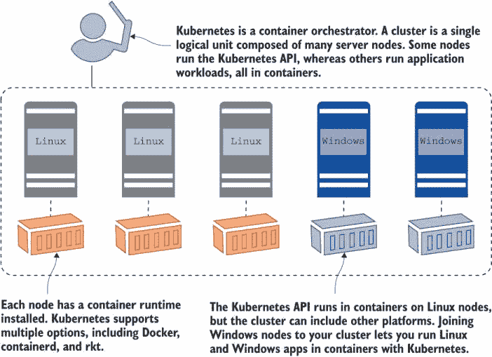
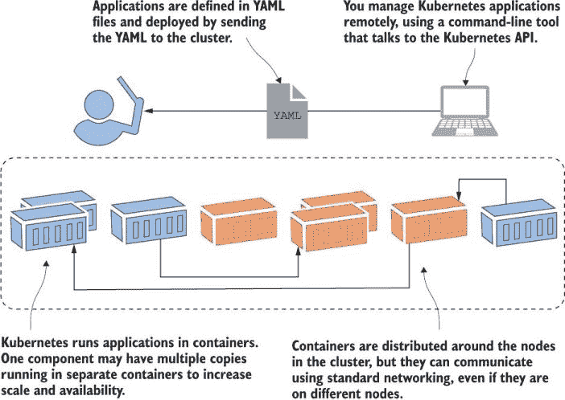
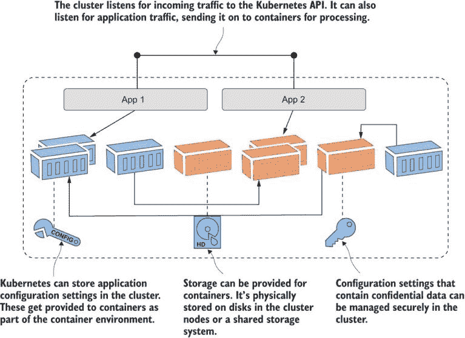
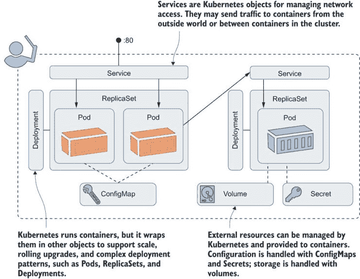
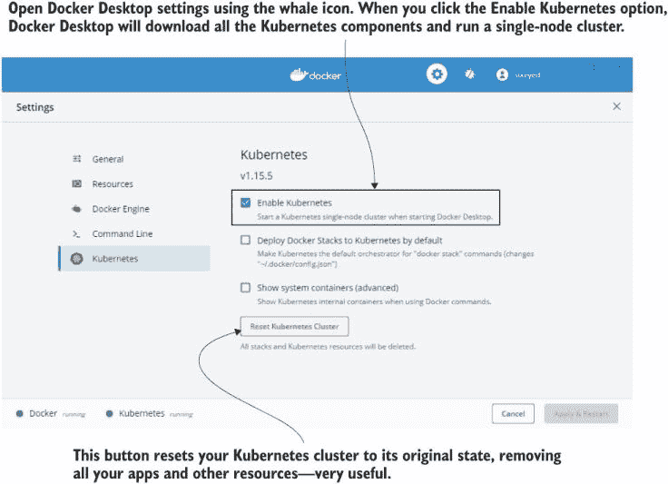
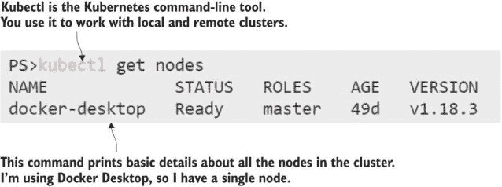

# 1 开始之前

Kubernetes 很大。真的很大。它在 2014 年作为 GitHub 上的开源项目发布，现在每周平均有来自全球 2,500 名贡献者的 200 次更改。KubeCon 年度会议从 2016 年的 1,000 名参与者增长到最近活动的超过 12,000 名，现在已成为一个全球系列，在美国、欧洲和亚洲都有活动。所有主要的云服务都提供托管 Kubernetes 服务，您可以在数据中心或您的笔记本电脑上运行 Kubernetes——*它们都是相同的 Kubernetes*。

独立性和标准化是 Kubernetes 如此受欢迎的主要原因。一旦您的应用程序在 Kubernetes 上运行良好，您就可以在任何地方部署它们，这对正在向云迁移的组织来说很有吸引力，因为它使他们能够在数据中心和其他云之间迁移而无需重写。它对从业者来说也非常有吸引力——一旦您掌握了 Kubernetes，您就可以在项目和组织之间迁移，并快速变得高效。

虽然达到这个目标很困难，因为 Kubernetes 本身就很复杂。即使是简单的应用程序也作为多个组件部署，这些组件以自定义的文件格式描述，很容易跨越数百行。Kubernetes 将基础设施级别的关注点，如负载均衡、网络、存储和计算，纳入应用程序配置中，这取决于您的 IT 背景，可能是一些新概念。此外，Kubernetes 始终在扩展——每个季度都会发布新版本，通常带来大量的新功能。

但这是值得的。我花费了许多年帮助人们学习 Kubernetes，一个常见的模式出现了：问题“*为什么这么复杂*？”转变为“*你可以做到这一点？这太神奇了!*” Kubernetes 确实是一项令人惊叹的技术。你了解得越多，你会越喜欢它——这本书将加速你通往 Kubernetes 精通的旅程。

## 1.1 理解 Kubernetes

这本书为您提供了 Kubernetes 的实战入门。每一章都提供了即学即用的练习和实验室，让您能够获得大量使用 Kubernetes 的经验。除了这一章。 :) 我们将在下一章开始实际工作，但在此之前我们需要一点理论知识。让我们先来了解一下 Kubernetes 实际上是什么以及它解决的问题。

Kubernetes 是一个运行容器的平台。它负责启动您的容器化应用程序、部署更新、维护服务级别、按需扩展、确保访问安全以及更多。Kubernetes 的两个核心概念是*API*，您使用它来定义您的应用程序，以及*集群*，它运行您的应用程序。集群是一组配置了容器运行时（如 Docker）的独立服务器，然后通过 Kubernetes 联合成一个单一的逻辑单元。图 1.1 显示了集群的高级视图。



图 1.1 Kubernetes 集群是一组可以运行容器的服务器，它们被联合成一个组。

集群管理员管理着称为 Kubernetes 中的 *节点* 的单个服务器。您可以通过添加节点来扩展集群的容量，将节点下线进行维护，或者在整个集群中推出 Kubernetes 的升级。在像 Microsoft Azure Kubernetes 服务 (AKS) 或 Amazon Elastic Kubernetes 服务 (EKS) 这样的托管服务中，这些功能都封装在简单的网页界面或命令行中。在正常使用中，您会忘记底层的节点，并将集群视为一个单一实体。

Kubernetes 集群的存在是为了运行您的应用程序。您在 YAML 文件中定义您的应用程序，并将这些文件发送到 Kubernetes API。Kubernetes 会查看您在 YAML 中请求的内容，并将其与集群中已运行的内容进行比较。它会进行任何必要的更改以到达期望的状态，这可能包括更新配置、删除容器或创建新的容器。容器被分布在整个集群中以实现高可用性，并且它们都可以通过 Kubernetes 管理的虚拟网络进行通信。图 1.2 展示了部署过程，但没有显示节点，因为我们在这个层面上并不真正关心它们。



图 1.2 当您将应用程序部署到 Kubernetes 集群时，通常可以忽略实际的节点。

定义应用程序的结构是您的职责，但运行和管理一切则是 Kubernetes 的工作。如果一个节点在集群中下线并带走了某些容器，Kubernetes 会注意到这一点，并在其他节点上启动替换容器。如果一个应用程序容器变得不健康，Kubernetes 可以重新启动它。如果一个组件因为高负载而处于压力之下，Kubernetes 可以在新的容器中启动该组件的额外副本。如果您在 Docker 镜像和 Kubernetes YAML 文件上投入了工作，您将得到一个自我修复的应用程序，该应用程序在任何 Kubernetes 集群上都能以相同的方式运行。

Kubernetes 管理的不仅仅是容器，这也是它成为一个完整应用程序平台的原因。集群有一个分布式数据库，您可以使用它来存储应用程序的配置文件以及像 API 密钥和连接凭证这样的机密信息。Kubernetes 将这些无缝地传递到您的容器中，让您可以在每个环境中使用相同的容器镜像，并从集群中应用正确的配置。Kubernetes 还提供存储，这样您的应用程序就可以在容器之外维护数据，为有状态应用程序提供高可用性。Kubernetes 还通过将其发送到正确的容器进行处理来管理进入集群的网络流量。图 1.3 展示了这些其他资源，它们是 Kubernetes 的主要功能。



图 1.3 Kubernetes 不仅管理容器，集群还管理其他资源。

我还没有谈论容器中的应用程序看起来是什么样子；这是因为 Kubernetes 实际上并不关心。你可以在多个容器中的微服务上运行使用云原生设计构建的新应用程序。你可以在一个大型容器中运行作为单体构建的遗留应用程序。它们可以是 Linux 应用程序或 Windows 应用程序。你可以使用相同的 API 在 YAML 文件中定义所有类型的应用程序，并在单个集群上运行它们。与 Kubernetes 一起工作的乐趣在于，它为所有应用程序添加了一层一致性——无论是旧的 .NET 和 Java 单体还是新的 Node.js 和 Go 微服务，都是以相同的方式进行描述、部署和管理的。

这就是我们需要开始学习 Kubernetes 的所有理论，但在我们继续之前，我想把我一直在谈论的概念用一些正确的名字来命名。那些 YAML 文件正确地被称为 *应用程序清单*，因为它们是所有组成应用的组件列表。这些组件是 Kubernetes *资源*；它们也有正确的名字。图 1.4 将图 1.3 中的概念应用于正确的 Kubernetes 资源名称。



图 1.4 真实的情况：这些是你需要掌握的最基本的 Kubernetes 资源。

我告诉你 Kubernetes 很难。 :) 但我们将在接下来的几章中逐一介绍这些资源，逐步加深理解。在你完成第六章时，那张图将完全有意义，你将在定义这些资源并在自己的 Kubernetes 集群中运行它们方面获得大量的经验。

## 1.2 这本书适合你吗？

本书的目标是加速你的 Kubernetes 学习，让你在完成本书后，能够自信地定义和运行自己的应用在 Kubernetes 中，并了解生产路径的样子。学习 Kubernetes 的最佳方式是实践，如果你遵循章节中的所有示例并完成实验室练习，那么在完成本书时，你将对 Kubernetes 的所有最重要的组成部分有一个坚实的理解。

但 Kubernetes 是一个庞大的主题，我不会涵盖所有内容。最大的差距在于管理。我不会深入探讨集群设置和管理，因为它们在不同的基础设施中各不相同。如果你计划在云中运行 Kubernetes 作为你的生产环境，那么许多这些担忧在托管服务中已经得到解决。如果你想获得 Kubernetes 认证，这本书是一个很好的起点，但它不会带你走完全程。有两个主要的 Kubernetes 认证：认证 Kubernetes 应用开发者（CKAD）和认证 Kubernetes 管理员（CKA）。本书涵盖了 CKAD 课程的大约 80% 和 CKA 的大约 50%。

此外，你还需要一定的背景知识才能有效地使用这本书。我将在遇到 Kubernetes 功能时解释许多核心原则，但不会填补关于容器的任何空白。如果你不熟悉像镜像、容器和注册表这样的概念，我建议从我的书《一个月午餐时间学习 Docker》（Manning，2020）开始。你不需要与 Kubernetes 一起使用 Docker，但它是最简单、最灵活的方式来打包你的应用程序，以便你可以在 Kubernetes 容器中运行它们。

如果你将自己归类为新手或正在提高的 Kubernetes 用户，并且对容器有合理的实际操作知识，那么这本书就是为你准备的。你的背景可能是开发、运维、架构、DevOps 或站点可靠性工程（SRE）——Kubernetes 触及了所有这些角色，所以所有这些角色都欢迎加入，你将学到大量的东西。

## 1.3 创建你的实验室环境

一个 Kubernetes 集群可以有数百个节点，但在这本书的练习中，单个节点集群就足够了。我们现在将设置你的实验室环境，以便你准备好在下一章开始。有数十种 Kubernetes 平台可供选择，这本书中的练习应该适用于任何认证的 Kubernetes 设置。我将描述如何在 Linux、Windows、Mac、Amazon Web Services（AWS）和 Azure 上创建你的实验室，这涵盖了所有主要选项。我使用的是 Kubernetes 版本 1.18，但早期或晚期的版本也应该没问题。

在本地运行 Kubernetes 最简单的方法是 Docker Desktop，这是一个包含 Docker、Kubernetes 以及所有命令行工具的单个包。它还很好地集成了你的计算机网络，并有一个方便的重置 Kubernetes 按钮，如果需要，可以清除所有内容。Docker Desktop 支持 Windows 10 和 macOS，如果这对你不起作用，我还会介绍一些替代方案。

你应该知道的一个要点是：Kubernetes 自身的组件需要以 Linux 容器的形式运行。你无法在 Windows 上运行 Kubernetes（尽管你可以在多节点 Kubernetes 集群中运行 Windows 应用程序的容器），所以如果你在 Windows 上工作，你需要一个 Linux 虚拟机（VM）。Docker Desktop 会为你设置并管理它。

对于 Windows 用户，请注意：请使用 PowerShell 来跟随练习。PowerShell 支持许多 Linux 命令，并且“立即尝试”练习是构建在 Linux（和 Mac）shell 以及 PowerShell 上运行的。如果你尝试使用经典的 Windows 命令行终端，你可能会从一开始就遇到问题。

### 1.3.1 下载本书的源代码

每个示例和练习都在 GitHub 上本书的源代码仓库中，包括所有实验室的示例解决方案。如果你熟悉 Git 并且安装了 Git 客户端，你可以使用以下命令将仓库克隆到你的计算机上：

```
git clone https://github.com/sixeyed/kiamol
```

如果你不是 Git 用户，你可以浏览到这本书的 GitHub 页面[`github.com/sixeyed/kiamol`](https://github.com/sixeyed/kiamol)并点击克隆或下载按钮来下载一个 zip 文件，然后你可以展开它。

源代码的根目录是一个名为`kiamol`的文件夹，其中包含每个章节的文件夹：`ch02`、`ch03`等等。章节中的第一个练习通常要求你打开一个终端会话并切换到`chXX`目录，所以你需要首先导航到你的`kiamol`文件夹。

GitHub 仓库是我发布任何练习更正的最快方式，所以如果你有任何问题，你应该检查章节文件夹中的更新 README 文件。

### 1.3.2 安装 Docker Desktop

Docker Desktop 可以在 Windows 10 或 macOS Sierra（版本 10.12 或更高）上运行。浏览到[`www.docker.com/products/docker-desktop`](https://www.docker.com/products/docker-desktop)并选择安装稳定版本。下载安装程序并运行它，接受所有默认设置。在 Windows 上，这可能包括重启以添加新的 Windows 功能。当 Docker Desktop 运行时，你会在 Windows 任务栏或 Mac 菜单栏附近看到 Docker 的海豚图标。如果你是 Windows 上的经验丰富的 Docker Desktop 用户，你需要确保你处于 Linux 容器模式（这是新安装的默认设置）。

Kubernetes 默认没有设置，所以你需要点击海豚图标打开菜单并点击设置。这会打开图 1.5 所示的窗口；从菜单中选择 Kubernetes 并选择启用 Kubernetes。



图 1.5 Docker Desktop 创建并管理一个 Linux 虚拟机来运行容器，并且它可以运行 Kubernetes。

Docker Desktop 下载 Kubernetes 运行时的所有容器镜像——这可能需要一段时间——然后启动一切。当你看到设置屏幕底部的两个绿色圆点时，你的 Kubernetes 集群就准备就绪了。Docker Desktop 安装了你需要的所有其他东西，所以你可以跳到 1.4.7 节。

其他 Kubernetes 发行版可以在 Docker Desktop 之上运行，但它们与 Docker Desktop 使用的网络设置集成得不好，所以你会在运行练习时遇到问题。Docker Desktop 中的 Kubernetes 选项具有这本书所需的所有功能，并且绝对是最佳选择。

### 1.3.3 安装 Docker 社区版和 K3s

如果你正在使用 Linux 机器或 Linux 虚拟机，运行单节点集群有多种选择。Kind 和 minikube 很受欢迎，但我的首选是 K3s，它是一个最小化安装，但包含了你进行练习所需的所有功能。（这个名字是对“K8s”的戏谑，K8s 是 Kubernetes 的缩写。K3s 精简了 Kubernetes 代码库，名字表明它的大小是 K8s 的一半。）

K3s 与 Docker 兼容，因此首先，您应该安装 Docker Community Edition。您可以在 [`rancher.com/docs/k3s/latest/en/quick-start/`](https://rancher.com/docs/k3s/latest/en/quick-start/) 查看完整的安装步骤，但这将帮助您启动并运行：

```
# install Docker:
curl -fsSL https://get.docker.com | sh

# install K3s:
curl -sfL https://get.k3s.io | sh -s - --docker --disable=traefik --write-kubeconfig-mode=644
```

如果您更喜欢在虚拟机中运行实验室环境，并且熟悉使用 Vagrant 来管理虚拟机，您可以使用以下 Vagrant 设置，其中包含 Docker 和 K3s，这些都可以在本书的源代码库中找到：

```
# from the root of the Kiamol repo:
cd ch01/vagrant-k3s

# provision the machine:
vagrant up

# and connect:
vagrant ssh
```

K3s 安装了您需要的所有其他内容，因此您可以跳到 1.4.7 节。

### 1.3.4 安装 Kubernetes 命令行工具

您可以使用名为 kubectl 的工具（发音为“cube-cuttle”，就像“章鱼”——不要让任何人告诉您不同）来管理 Kubernetes。它连接到 Kubernetes 集群并与 Kubernetes API 一起工作。Docker Desktop 和 K3s 都会为您安装 kubectl，但如果您正在使用以下描述的另一种选项，您需要自行安装它。

完整的安装说明请参阅[`kubernetes.io/docs/tasks/tools/install-kubectl/`](https://kubernetes.io/docs/tasks/tools/install-kubectl/). 您可以在 macOS 上使用 Homebrew，在 Windows 上使用 Chocolatey，而对于 Linux，您可以下载二进制文件：

```
# macOS:
brew install kubernetes-cli

# OR Windows:
choco install kubernetes-cli

# OR Linux:
curl -Lo ./kubectl https://storage.googleapis.com/kubernetes-release/release/v1.18.8/bin/linux/amd64/kubectl
chmod +x ./kubectl
sudo mv ./kubectl /usr/local/bin/kubectl
```

### 1.3.5 在 Azure 中运行单个节点 Kubernetes 集群

您可以使用 AKS 在 Microsoft Azure 中运行托管 Kubernetes 集群。如果您希望从多台机器访问集群或拥有 Azure 信用额的 MSDN 订阅，这可能是一个不错的选择。您可以运行一个最小化单节点集群，这不会花费太多，但请注意，没有停止集群的方法，您将全天候付费，直到您将其删除。

Azure 门户提供了一个很好的用户界面来创建 AKS 集群，但使用 `az` 命令会更简单。您可以在 [`docs.microsoft.com/en-us/azure/aks/kubernetes-walkthrough`](https://docs.microsoft.com/en-us/azure/aks/kubernetes-walkthrough) 查看最新文档，但您可以通过下载 az 命令行工具并运行几个命令来开始，如下所示：

```
# log in to your Azure subscription:
az login

# create a resource group for the cluster:
az group create --name kiamol --location eastus

# create a single-code cluster with 2 CPU cores and 8GB RAM:
az aks create --resource-group kiamol --name kiamol-aks --node-count 1
              --node-vm-size Standard_DS2_v2 --kubernetes-version 1.18.8 --generate-ssh-keys

# download certificates to use the cluster with kubectl:
az aks get-credentials --resource-group kiamol --name kiamol-aks
```

最后一条命令将下载凭证，以便从您的本地 kubectl 命令行连接到 Kubernetes API。

### 1.3.6 在 AWS 中运行单个节点 Kubernetes 集群

AWS 中的托管 Kubernetes 服务被称为弹性 Kubernetes 服务 (EKS)。您可以使用与 Azure 相同的注意事项创建单个节点的 EKS 集群——那就是您将一直为该节点及其相关资源付费，只要它在运行。

您可以使用 AWS 门户创建 EKS 集群，但推荐的方式是使用一个名为 eksctl 的专用工具。该工具的最新文档位于 [`eksctl.io`](https://eksctl.io)，但使用起来相当简单。首先，按照以下步骤安装适用于您操作系统的最新版本的工具：

```
# install on macOS:
brew tap weaveworks/tap
brew install weaveworks/tap/eksctl

# OR on Windows:
choco install eksctl

# OR on Linux:
curl --silent --location
 "https://github.com/weaveworks/eksctl/releases/download/latest/eksctl_$(uname -s)_amd64.tar.gz"
 | tar xz -C /tmp
sudo mv /tmp/eksctl /usr/local/bin
```

假设您已经安装了 AWS CLI，eksctl 将使用 CLI 的凭证（如果没有，请检查 eksctl 的认证指南）。然后按照以下步骤创建一个简单的单节点集群：

```
# create a single node cluster with 2 CPU cores and 8GB RAM:
eksctl create cluster --name=kiamol --nodes=1 --node-type=t3.large
```

工具设置了从您本地的 kubectl 到 EKS 集群的连接。

### 1.3.7 验证您的集群

现在您有一个正在运行的 Kubernetes 集群，无论您选择了哪个选项，它们都以相同的方式工作。运行以下命令以检查您的集群是否正在运行：

```
kubectl get nodes
```

您应该看到如图 1.6 所示的输出。这是一个包含您集群中所有节点及其一些基本详情（如状态和 Kubernetes 版本）的列表。您的集群详情可能不同，但只要您看到有节点列出并且处于就绪状态，那么您的集群就可以正常运行了。



图 1.6 如果您可以运行 kubectl 并且您的节点已就绪，那么您就可以继续进行了。

## 1.4 立即有效

“立即有效”是《午餐月系列》的核心原则。总的来说，重点是学习技能并将它们付诸实践，在接下来的每一章中都是如此。

每一章都从一个简短的主题介绍开始，然后是“立即尝试”练习，您可以使用自己的 Kubernetes 集群将这些想法付诸实践。然后是一个总结，其中包含更多细节，以填补您在深入研究时可能有的疑问。最后，有一个供您自己尝试的动手实验室，以真正增强您对新理解的自信。

所有主题都围绕在现实世界中真正有用的任务。您将在本章中学习如何立即有效地使用主题，并通过理解如何应用新技能来结束学习。让我们开始运行一些容器化应用程序吧！
