# 2 在 Kubernetes 中使用 Pods 和 Deployments 运行容器

Kubernetes 为您的应用程序工作负载运行容器，但容器本身不是您需要与之交互的对象。每个容器都属于一个 Pod，Pod 是 Kubernetes 对象，用于管理一个或多个容器，而 Pod 反过来由其他资源管理。这些高级资源抽象掉了容器的细节，这为自我修复应用程序提供了动力，并允许您使用期望状态工作流程：您告诉 Kubernetes 您想要发生什么，然后它决定如何实现。

在本章中，我们将从 Kubernetes 的基本构建块开始：Pods，它们运行容器，以及 Deployments，它们管理 Pods。我们将使用一个简单的 Web 应用程序进行练习，您将通过使用 Kubernetes 命令行工具来管理应用程序和使用 Kubernetes YAML 规范来定义应用程序来获得实践经验。

## 2.1 Kubernetes 如何运行和管理容器

容器是一个虚拟化环境，通常运行单个应用程序组件。Kubernetes 将容器包装在另一个虚拟化环境中：Pod。Pod 是一个计算单元，在集群的单个节点上运行。Pod 有自己的虚拟 IP 地址，由 Kubernetes 管理，集群中的 Pod 可以通过该虚拟网络与其他 Pod 进行通信，即使它们运行在不同的节点上。

您通常在 Pod 中运行单个容器，但您可以在一个 Pod 中运行多个容器，这为一些有趣的部署选项打开了大门。Pod 中的所有容器都是同一虚拟环境的一部分，因此它们共享相同的网络地址，可以使用 localhost 进行通信。图 2.1 显示了容器和 Pod 之间的关系。


图 2.1 容器在 Pod 内运行。您管理 Pod，Pod 管理容器。

这关于多容器 Pod 的业务在早期介绍可能有点多，但如果我略过了它，只谈论单容器 Pod，您会合理地询问为什么 Kubernetes 使用 Pod 而不是仅仅使用容器。让我们运行一个 Pod，看看与容器抽象交互是什么样的。

现在尝试一下 您可以使用 Kubernetes 命令行运行一个简单的 Pod，而无需 YAML 规范。语法类似于使用 Docker 运行容器：您指定要使用的容器镜像以及任何其他配置 Pod 行为的参数。

```
# run a Pod with a single container; the restart flag tells Kubernetes
# to create just the Pod and no other resources:
kubectl run hello-kiamol --image=kiamol/ch02-hello-kiamol --restart=Never

# wait for the Pod to be ready:
kubectl wait --for=condition=Ready pod hello-kiamol

# list all the Pods in the cluster:
kubectl get pods

# show detailed information about the Pod:
kubectl describe pod hello-kiamol
```

您可以在图 2.2 中看到我的输出，其中我简化了来自最终`describe pod`命令的响应。当您自己运行时，您会在其中看到很多听起来更晦涩的信息，比如节点选择器和容忍度。它们都是 Pod 规范的一部分，Kubernetes 为我们在`run`命令中未指定的所有内容都应用了默认值。

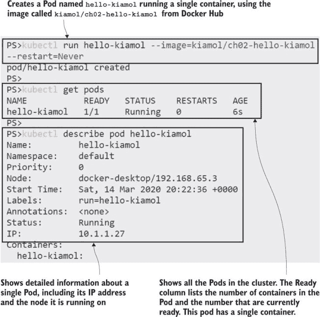

图 2.2 运行最简单的 Pod 并使用 kubectl 检查其状态

现在你的集群中有一个单独的应用容器，运行在单个 Pod 内部。如果你习惯于使用 Docker，这将是一个熟悉的流程，而且事实证明，Pod 并没有看起来那么复杂。你的大多数 Pod 将运行单个容器（直到你开始探索更高级的选项），因此你可以有效地将 Pod 视为 Kubernetes 用来运行容器的机制。

虽然 Kubernetes 实际上并不运行容器，但它将这项责任转交给节点上安装的容器运行时，这可能是 Docker、containerd 或更复杂的其他东西。这就是为什么 Pod 是一个抽象：它是 Kubernetes 管理的资源，而容器则由 Kubernetes 之外的东西管理。你可以通过使用 kubectl 获取有关 Pod 的特定信息来感受到这一点。

现在尝试一下 Kubectl 通过`get pod`命令返回基本信息，但你可以通过应用输出参数来请求更多信息。你可以在输出参数中命名你想要看到的单个字段，并且可以使用 JSONPath 查询语言或 Go 模板来获取复杂输出。

```
# get the basic information about the Pod:
kubectl get pod hello-kiamol

# specify custom columns in the output, selecting network details:
kubectl get pod hello-kiamol --output custom-columns=NAME:metadata.name,NODE_IP:status.hostIP,POD_IP:status.podIP 

# specify a JSONPath query in the output,
# selecting the ID of the first container in the Pod:
kubectl get pod hello-kiamol -o jsonpath='{.status.containerStatuses[0].containerID}'
```

我的输出显示在图 2.3 中。我正在使用 Windows 上的 Docker Desktop 运行一个单节点 Kubernetes 集群。第二个命令中的`node IP`是我的 Linux VM 的 IP 地址，而`Pod IP`是集群中 Pod 的虚拟地址。第三个命令返回的`container ID`前面带有容器运行时的名称；我的容器运行时是 Docker。

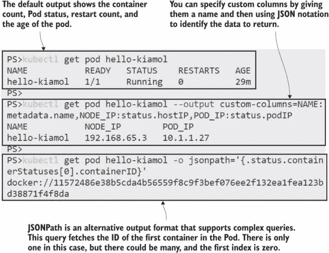

图 2.3 Kubectl 为 Pod 和其他对象提供了许多自定义输出的选项。

这可能感觉像是一项相当枯燥的练习，但它带来了两个重要的启示。第一个是 kubectl 是一个非常强大的工具——作为你与 Kubernetes 的主要接触点，你将花费大量时间与之打交道，因此了解它能够做什么是非常有价值的。查询命令的输出是一种查看你关心的信息的有用方式，而且因为你可以访问资源的所有详细信息，它对于自动化也非常有用。第二个启示是提醒我们，Kubernetes 并不运行容器——Pod 中的容器 ID 是另一个运行容器的系统的引用。

当 Pod 创建时，它们会被分配到一个节点上，并且管理 Pod 及其容器的责任属于该节点。它通过使用一个名为容器运行时接口（CRI）的已知 API 与容器运行时协作来完成这项工作。CRI 允许节点以相同的方式管理所有不同的容器运行时中的容器。它使用标准 API 来创建和删除容器，并查询它们的状态。当 Pod 运行时，节点会与容器运行时协作，确保 Pod 拥有它需要的所有容器。

现在尝试一下 所有 Kubernetes 环境都使用相同的 CRI 机制来管理容器，但并非所有容器运行时都允许您访问 Kubernetes 之外的容器。这个练习向您展示了 Kubernetes 节点如何保持 Pod 容器运行，但您只有在使用 Docker 作为容器运行时的情况下才能理解它。

```
# find the Pod’s container:
docker container ls -q --filter label=io.kubernetes.container.name=hello-kiamol

# now delete that container:
docker container rm -f $(docker container ls -q --filter label=io.kubernetes.container.name=hello-kiamol)

# check the Pod status:
kubectl get pod hello-kiamol

# and find the container again:
docker container ls -q --filter label=io.kubernetes.container.name=hello-kiamol
```

您可以从图 2.4 中看到，当我在删除我的 Docker 容器时，Kubernetes 做出了反应。一瞬间，Pod 中的容器数量为零，但 Kubernetes 立即创建了一个替换容器来修复 Pod 并将其恢复到正确状态。

是从容器到 Pod 的抽象让 Kubernetes 能够修复这类问题。失败的容器是一个暂时性的故障；Pod 仍然存在，并且可以通过一个新的容器将其恢复到规范状态。这只是 Kubernetes 提供的自我修复的一个层次，在 Pod 之上还有更多的抽象，这为您的应用程序提供了更多的弹性。

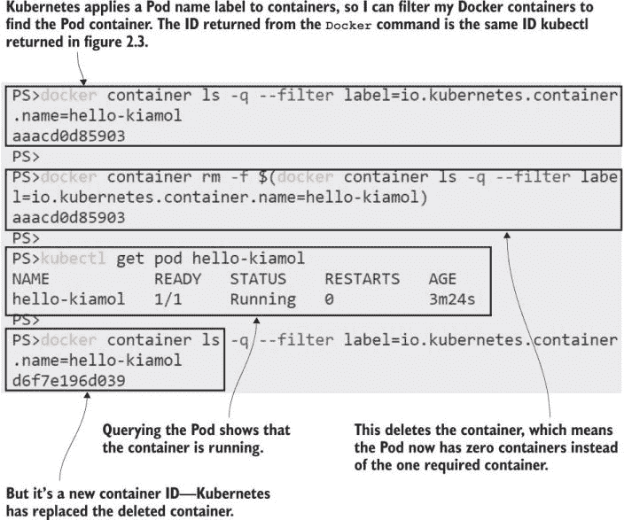

图 2.4 Kubernetes 确保 Pod 拥有所有需要的容器。

其中一个抽象是 Deployment，我们将在下一节中探讨。在继续之前，让我们看看 Pod 中实际运行的是什么。它是一个 Web 应用程序，但您无法浏览到它，因为我们还没有配置 Kubernetes 将网络流量路由到 Pod。我们可以使用 kubectl 的另一个功能来解决这个问题。

现在尝试一下 Kubectl 可以将节点流量转发到 Pod，这是一种从集群外部与 Pod 进行通信的快捷方式。您可以在您的机器上的特定端口上监听——这是您集群中的单个节点——并将流量转发到 Pod 中运行的应用程序。

```
# listen on port 8080 on your machine and send traffic
# to the Pod on port 80:
kubectl port-forward pod/hello-kiamol 8080:80

# now browse to http://localhost:8080

# when you’re done press ctrl-c to end the port forward
```

我的输出如图 2.5 所示，您可以看到它是一个非常基础的网站（不要联系我进行网页设计咨询）。Web 服务器和所有内容都打包在 Docker Hub 上的容器镜像中，这是公开可用的。所有兼容 CRI 的容器运行时都可以拉取这个镜像并从中运行容器，所以我知道，无论您使用的是哪种 Kubernetes 环境，当您运行应用程序时，它将以与我相同的方式为您工作。

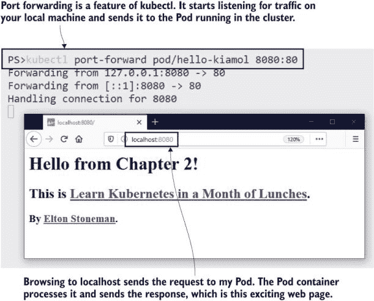

图 2.5 此应用程序未配置为接收网络流量，但 kubectl 可以转发它。

现在我们已经很好地掌握了 Pod，这是 Kubernetes 中最小的计算单元。您需要了解这一切是如何工作的，但 Pod 是一个原始资源，在正常使用中，您永远不会直接运行 Pod；您总是会创建一个控制器对象来为您管理 Pod。

## 2.2 使用控制器运行 Pod

这只是第二章的第二部分，我们已经开始接触到一个新的 Kubernetes 对象，它是对其他对象的抽象。Kubernetes 确实很快就会变得复杂，但这样的复杂性是这样一个强大且可配置的系统所必需的。学习曲线是进入世界级容器平台的入场费。

Pod 本身过于简单，单独使用没有太大用处；它们是应用程序的隔离实例，每个 Pod 都分配给一个节点。如果该节点离线，Pod 就会丢失，Kubernetes 不会替换它。你可以尝试通过运行多个 Pod 来获得高可用性，但无法保证 Kubernetes 不会将它们全部运行在同一个节点上。即使你确实将 Pod 分散在多个节点上，你也需要自己管理它们。为什么要在有可以为你管理它们的编排器的情况下还这么做呢？

正是在这里，控制器发挥了作用。*控制器*是 Kubernetes 资源，用于管理其他资源。它与 Kubernetes API 协同工作，监视系统的当前状态，将其与资源的期望状态进行比较，并做出必要的更改。Kubernetes 有许多控制器，但用于管理 Pod 的主要控制器是 Deployment，它解决了我刚才描述的问题。如果一个节点离线并且你丢失了一个 Pod，Deployment 将在另一个节点上创建一个替换 Pod；如果你想扩展你的 Deployment，你可以指定你想要的 Pod 数量，Deployment 控制器将在多个节点上运行它们。图 2.6 显示了 Deployment、Pod 和容器之间的关系。

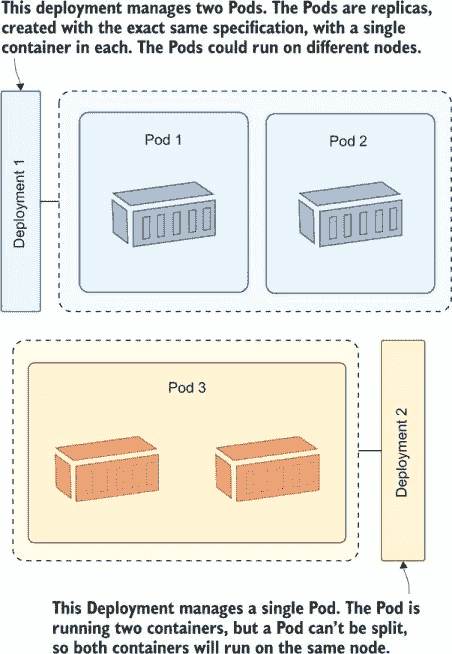

图 2.6 部署控制器管理 Pod，Pod 管理容器。

你可以使用 kubectl 创建 Deployment 资源，指定你想要运行的容器镜像和 Pod 的任何其他配置。Kubernetes 创建 Deployment，Deployment 创建 Pod。

现在尝试一下：创建另一个 Web 应用的实例，这次使用 Deployment。唯一必需的参数是 Deployment 的名称和要运行的镜像。

```
# create a Deployment called "hello-kiamol-2", running the same web app:
kubectl create deployment hello-kiamol-2 --image=kiamol/ch02-hello-kiamol

# list all the Pods:
kubectl get pods
```

你可以在图 2.7 中看到我的输出。现在你的集群中有两个 Pod：你使用 kubectl `run`命令创建的原始 Pod，以及由 Deployment 创建的新 Pod。由 Deployment 管理的 Pod 有一个由 Kubernetes 生成的名称，即 Deployment 的名称后跟一个随机后缀。

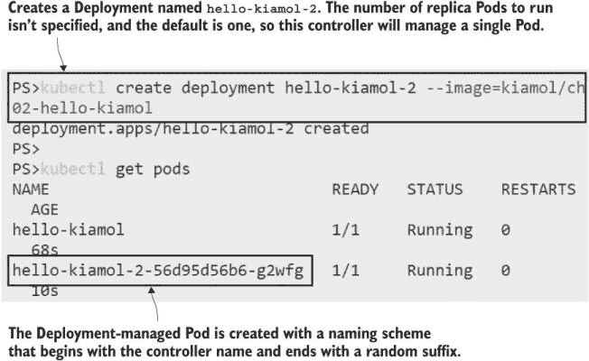

图 2.7 创建控制器资源，它将创建自己的资源——部署创建 Pod。

从这个练习中，你需要意识到的一个重要事情是：你创建了 Deployment，但你并没有直接创建 Pod。Deployment 规范描述了你想要的 Pod，Deployment 创建了那个 Pod。Deployment 是一个控制器，它会与 Kubernetes API 核对正在运行的资源，意识到它应该管理的 Pod 不存在，并使用 Kubernetes API 创建它。确切的机制并不重要；你只需与 Deployment 协同工作，并依赖它来创建你的 Pod。

虽然部署如何跟踪其资源确实很重要，因为这是 Kubernetes 大量使用的模式。任何 Kubernetes 资源都可以应用标签，这些标签是简单的键值对。你可以添加标签来记录自己的数据。例如，你可能会为部署添加一个名为 release 的标签，其值为 20.04，以指示此部署来自 20.04 发布周期。Kubernetes 还使用标签来松散耦合资源，映射部署和其 Pod 等对象之间的关系。

现在试试看 部署为它管理的 Pod 添加标签。使用以下 kubectl 命令来打印部署添加的标签，然后列出匹配该标签的 Pod：

```
# print the labels that the Deployment adds to the Pod:
kubectl get deploy hello-kiamol-2 -o jsonpath='{.spec.template.metadata.labels}'

# list the Pods that have that matching label:
kubectl get pods -l app=hello-kiamol-2
```

我的输出显示在图 2.8 中，你可以看到资源配置的一些内部细节。部署使用模板创建 Pod，该模板的一部分是元数据字段，它包括 Pod 的标签。在这种情况下，部署为 Pod 添加了一个名为*app*的标签，其值为*hello-kiamol-2*。查询具有匹配标签的 Pod 会返回由部署管理的单个 Pod。

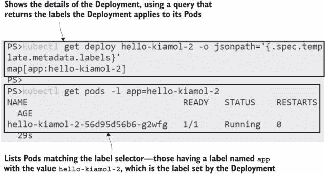

图 2.8 部署在创建 Pod 时添加标签，你可以使用这些标签作为过滤器。

使用标签来识别资源之间的关系是 Kubernetes 中的一个核心模式，值得展示一个图表以确保其清晰。资源可以在创建时应用标签，并在其生命周期内添加、删除或编辑。控制器使用标签选择器来识别它们管理的资源。这可以是一个简单的查询，匹配具有特定标签的资源，如图 2.9 所示。

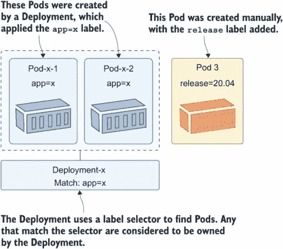

图 2.9 控制器通过使用标签和选择器来识别它们管理的资源。

这个过程是灵活的，因为它意味着控制器不需要维护它们管理的所有资源的列表；标签选择器是控制器规范的一部分，控制器可以通过查询 Kubernetes API 在任何时候找到匹配的资源。这也需要你小心处理，因为你可以编辑资源的标签，最终破坏它与控制器之间的关系。

现在试试看 部署与其创建的 Pod 没有直接关系；它只知道需要有一个 Pod 具有与它的标签选择器匹配的标签。如果你编辑 Pod 上的标签，部署将不再识别它。

```
# list all Pods, showing the Pod name and labels:
kubectl get pods -o custom-columns=NAME:metadata.name,LABELS:metadata.labels

# update the "app" label for the Deployment’s Pod:
kubectl label pods -l app=hello-kiamol-2 --overwrite app=hello-kiamol-x

# fetch Pods again:
kubectl get pods -o custom-columns=NAME:metadata.name,LABELS:metadata.labels
```

你期望发生什么？从图 2.10 所示的输出中可以看出，更改 Pod 标签实际上将 Pod 从部署中移除。此时，部署看到没有匹配其标签选择器的 Pod 存在，因此它创建了一个新的 Pod。部署已经完成了它的任务，但通过直接编辑 Pod，你现在有一个未管理的 Pod。

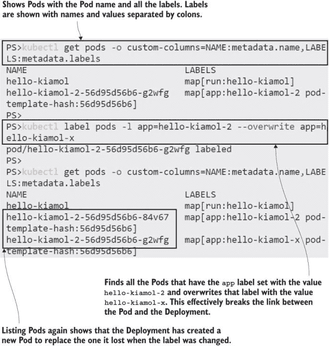

图 2.10 如果你干涉 Pod 上的标签，你可以将其从部署的控制中移除。

这可以是一种有用的调试技术——从控制器中移除一个 Pod，以便你可以连接并调查问题，同时控制器启动一个替换 Pod，保持你的应用程序以期望的规模运行。你也可以做相反的事情：编辑 Pod 的标签，让控制器误以为该 Pod 是它管理的集合的一部分。

现在尝试一下 通过设置应用程序标签使其与标签选择器匹配，将原始 Pod 返回到 Deployment 的控制之下。

```
# list all Pods with a label called "app," showing the Pod name and
# labels:
kubectl get pods -l app -o custom-columns=NAME:metadata.name,LABELS:metadata.labels

# update the "app" label for the the unmanaged Pod:
kubectl label pods -l app=hello-kiamol-x --overwrite app=hello-kiamol-2

# fetch the Pods again:
kubectl get pods -l app -o custom-columns=NAME:metadata.name,LABELS:metadata.labels
```

这个练习实际上逆转了之前的练习，将应用程序标签重新设置为 hello-kiamol-2，以便在 Deployment 中的原始 Pod。现在当 Deployment 控制器通过 API 检查时，它看到两个与它的标签选择器匹配的 Pods。然而，它应该只管理一个 Pod，因此它删除了一个（使用一系列删除规则来决定删除哪一个）。你可以在图 2.11 中看到 Deployment 删除了第二个 Pod 并保留了原始的。

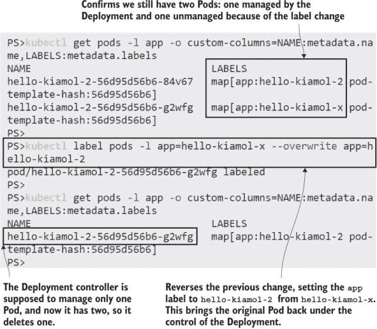


Pods 运行你的应用程序容器，但就像容器一样，Pods 的设计目的是短暂的。你通常会使用更高层次的资源，如 Deployment，来为你管理 Pods。这样做可以让 Kubernetes 在容器或节点出现问题时更好地保持你的应用程序运行，但最终 Pods 运行的是你将运行的相同容器，并且你的应用程序的用户体验将保持不变。

现在尝试一下 Kubectl 的 `port-forward` 命令将流量发送到 Pod，但你不需要为 Deployment 找到随机的 Pod 名称。你可以在 Deployment 资源上配置端口转发，并且 Deployment 会选择其 Pod 中的一个作为目标。

```
# run a port forward from your local machine to the Deployment:
kubectl port-forward deploy/hello-kiamol-2 8080:80

# browse to http://localhost:8080

# when you’re done, exit with ctrl-c
```

你可以看到我的输出，如图 2.12 所示，同一个应用程序在同一个 Docker 镜像中运行，但这次是在由 Deployment 管理的 Pod 中。

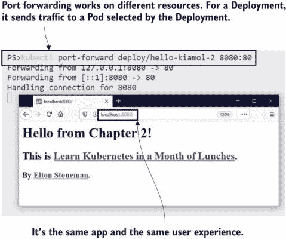


Pods 和 Deployments 是本章我们将涵盖的唯一资源。你可以通过使用 kubectl 的 `run` 和 `create` 命令来部署非常简单的应用程序，但对于更复杂的应用程序，需要更多的配置，而这些命令无法做到。现在是时候进入 Kubernetes YAML 的世界了。

## 2.3 在应用程序清单中定义 Deployment

应用程序清单是 Kubernetes 最吸引人的特性之一，但也是最具挫败感之一。当你正在处理数百行 YAML，试图找到导致你的应用程序崩溃的小错误配置时，可能会觉得 API 是故意编写来混淆和激怒你的。在这些时候，请记住 Kubernetes 清单是应用程序的完整描述，可以在源代码控制中进行版本控制和跟踪，并在任何 Kubernetes 集群上产生相同的部署。

清单可以写成 JSON 或 YAML；JSON 是 Kubernetes API 的本地语言，但 YAML 是清单的首选，因为它更容易阅读，允许你在单个文件中定义多个资源，最重要的是，可以在规范中记录注释。列表 2.1 是你能编写的最简单的应用程序清单。它使用我们在本章中已经使用过的相同容器镜像定义了一个单个 Pod。

列表 2.1 pod.yaml，一个运行单个容器的单个 Pod

```
# Manifests always specify the version of the Kubernetes API
# and the type of resource.
apiVersion: v1
kind: Pod

# Metadata for the resource includes the name (mandatory) 
# and labels (optional).
metadata:
 name: hello-kiamol-3

# The spec is the actual specification for the resource.
# For a Pod the minimum is the container(s) to run, 
# with the container name and image.
spec:
 containers:
  - name: web
    image: kiamol/ch02-hello-kiamol
```

这比 kubectl `run`命令所需的信息要多得多，但应用程序清单的大优点是它是声明性的。kubectl `run`和`create`是命令式操作——是你告诉 Kubernetes 做什么。清单是声明性的——你告诉 Kubernetes 你想要的结果是什么，然后它去决定需要做什么来实现这一点。

现在尝试一下：你仍然使用 kubectl 从清单文件部署应用程序，但使用`apply`命令，它告诉 Kubernetes 将文件中的配置应用到集群中。使用与列表 2.1 相同内容的 YAML 文件运行本章示例应用程序的另一个 Pod。

```
# switch from the root of the kiamol repository to the chapter 2 folder:
cd ch02

# deploy the application from the manifest file:
kubectl apply -f pod.yaml

# list running Pods:
kubectl get pods
```

新的 Pod 与使用 kubectl `run`命令创建的 Pod 工作方式相同：它被分配到一个节点上，并运行一个容器。图 2.13 中的输出显示，当我应用清单时，Kubernetes 决定需要创建一个 Pod 来将集群的当前状态提升到我所期望的状态。这是因为清单指定了一个名为 hello-kiamol-3 的 Pod，而这样的 Pod 并不存在。

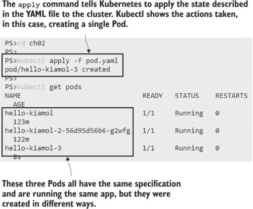

图 2.13 应用清单将 YAML 文件发送到 Kubernetes API，该 API 应用更改。

现在 Pod 正在运行，你可以使用 kubectl 以相同的方式管理它：通过列出 Pod 的详细信息并运行端口转发将流量发送到 Pod。最大的不同之处在于清单易于分享，并且基于清单的部署是可重复的。我可以多次运行相同的 kubectl `apply`命令和相同的清单，结果始终相同：一个名为 hello-kiamol-3 的 Pod 运行我的 Web 容器。

现在尝试一下：kubectl 甚至不需要本地清单文件的副本。它可以从任何公共 URL 读取内容。直接从 GitHub 上的文件部署相同的 Pod 定义。

```
# deploy the application from the manifest file:
kubectl apply -f https://raw.githubusercontent.com/sixeyed/kiamol/
master/ch02/pod.yaml
```

图 2.14 显示了输出。资源定义与集群中运行的 Pod 相匹配，因此 Kubernetes 不需要做任何事情，kubectl 显示匹配的资源没有变化。

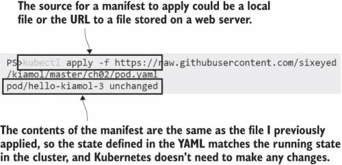

图 2.14 Kubectl 可以从 Web 服务器下载清单文件并将其发送到 Kubernetes API。

当你处理更高级的资源时，应用程序清单开始变得更有趣。当你在一个 YAML 文件中定义 Deployment 时，所需字段之一是 Deployment 应该运行的 Pod 的规范。这个 Pod 规范与定义 Pod 的相同 API，因此 Deployment 定义是一个组合，它包括 Pod 规范。列表 2.2 显示了 Deployment 资源的最小定义，运行的是同一网络应用的另一个版本。

列表 2.2 deployment.yaml，Deployment 和 Pod 规范

```
# Deployments are part of the apps version 1 API spec.
apiVersion: apps/v1
kind: Deployment
# The Deployment needs a name.
metadata:
 name: hello-kiamol-4
# The spec includes the label selector the Deployment uses 
# to find its own managed resources--I’m using the app label,
# but this could be any combination of key-value pairs.
spec:
 selector:
  matchLabels:
   app: hello-kiamol-4
 # The template is used when the Deployment creates a Pod
 template.
  # Pods in a Deployment don’t have a name, 
  # but they need to specify labels that match the selector
  # metadata.
   labels:
    app: hello-kiamol-4
  # The Pod spec lists the container name and image
  spec.
   containers:
    - name: web
      image: kiamol/ch02-hello-kiamol
```

这个清单是为一个完全不同的资源（碰巧运行了相同的应用程序），但所有 Kubernetes 清单都是使用 kubectl `apply` 以相同的方式部署的。这为你提供了所有应用程序的一致性层——无论它们多么复杂，你都会在一个或多个 YAML 文件中定义它们，并使用相同的 kubectl 命令部署它们。

现在试试看 应用 Deployment 清单以创建一个新的 Deployment，这将反过来创建一个新的 Pod。

```
# run the app using the Deployment manifest:
kubectl apply -f deployment.yaml

# find Pods managed by the new Deployment:
kubectl get pods -l app=hello-kiamol-4
```

图 2.15 中的输出显示了与使用 kubectl `create` 创建 Deployment 相同的最终结果，但我的整个应用程序规范清晰地定义在一个单独的 YAML 文件中。

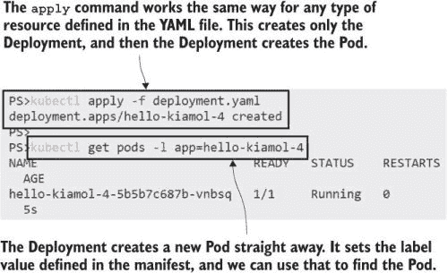

图 2.15 应用清单创建 Deployment，因为不存在匹配的资源。

随着应用程序复杂性的增长，我需要指定我想要多少个副本，应该应用什么 CPU 和内存限制，Kubernetes 如何检查应用程序是否健康，以及应用程序配置设置从何而来以及写入数据的位置——我可以通过添加 YAML 来完成所有这些。

## 2.4 在 Pod 中处理应用程序

Pods 和 Deployments 存在是为了让你的应用程序运行，但所有真正的工作都在容器中发生。你的容器运行时可能不会直接给你访问容器的能力——托管 Kubernetes 集群不会给你 Docker 或 containerd 的控制权——但你仍然可以使用 kubectl 在 Pods 中与容器一起工作。Kubernetes 命令行让你可以在容器中运行命令、查看应用程序日志和复制文件。

现在试试看 你可以使用 kubectl 在容器内运行命令，并连接一个终端会话，这样你就可以像连接到远程机器一样连接到 Pod 的容器。

```
# check the internal IP address of the first Pod we ran: 
kubectl get pod hello-kiamol -o custom-columns=NAME:metadata.name,POD_IP:status.podIP

# run an interactive shell command in the Pod:
kubectl exec -it hello-kiamol -- sh

# inside the Pod, check the IP address:
hostname -i

# and test the web app:
wget -O - http://localhost | head -n 4

# leave the shell:
exit
```

我的输出显示在图 2.16 中，你可以看到容器环境中的 IP 地址是由 Kubernetes 设置的，运行在容器中的 Web 服务器可以通过 localhost 地址访问。

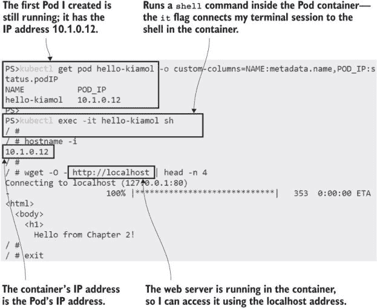

图 2.16 你可以使用 kubectl 在 Pod 容器内运行命令，包括交互式 shell。

在 Pod 容器内运行交互式 shell 是一种有用的方式，可以看到对该 Pod 的世界观。你可以读取文件内容以检查配置设置是否正确应用，运行 DNS 查询以验证服务是否按预期解析，以及 ping 端点以测试网络。这些都是很好的故障排除技术，但对于持续管理，一个更简单的选项是读取应用程序日志，而 kubectl 有一个专门的命令专门用于此。

现在尝试一下 Kubernetes 从容器运行时获取应用程序日志。你可以使用 kubectl 读取日志，如果你有权访问容器运行时，你可以验证它们与容器日志相同。

```
# print the latest container logs from Kubernetes:
kubectl logs --tail=2 hello-kiamol

# and compare the actual container logs--if you’re using Docker:
docker container logs --tail=2 $(docker container ls -q --filter label=io.kubernetes.container.name=hello-kiamol)
```

你可以从图 2.17 中看到我的输出，Kubernetes 正是按照容器运行时接收到的日志条目原样转发日志。

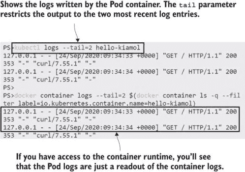

图 2.17 Kubernetes 从容器中读取日志，因此你不需要访问容器运行时。

所有 Pods 都提供相同的功能，无论它们是如何创建的。由控制器管理的 Pods 具有随机名称，因此你不会直接引用它们。相反，你可以通过控制器或标签来访问它们。

现在尝试一下 你可以在不知道 Pod 名称的情况下运行由 Deployment 管理的 Pods 中的命令，并且可以查看所有匹配标签选择器的 Pods 的日志。

```
# make a call to the web app inside the container for the 
# Pod we created from the Deployment YAML file: 
kubectl exec deploy/hello-kiamol-4 -- sh -c 'wget -O - http://localhost > /dev/null'

# and check that Pod’s logs:
kubectl logs --tail=1 -l app=hello-kiamol-4
```

图 2.18 显示了在 Pod 容器内运行的命令，这会导致应用程序写入日志条目。我们在 Pod 日志中看到了这一点。

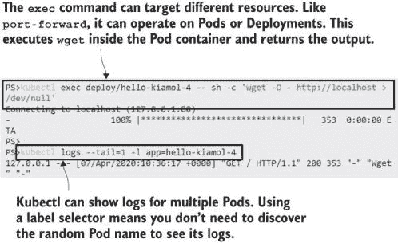

图 2.18 你可以使用 kubectl 与 Pods 一起工作，而无需知道 Pod 的名称。

在生产环境中，你可以收集所有 Pods 的日志并发送到中央存储系统，但在到达那里之前，这是一种有用且简单的方法来读取应用程序日志。在那个练习中，你也看到了访问由控制器管理的 Pods 的不同方式。Kubectl 允许你在大多数命令中提供标签选择器，并且一些命令——如`exec`——可以针对不同的目标运行。

你可能最常与 Pods 一起使用的功能是与文件系统交互。Kubectl 允许你在本地机器和 Pods 中的容器之间复制文件。

现在尝试一下 在你的机器上创建一个临时目录，并将文件从 Pod 容器复制到该目录中。

```
# create the local directory:
mkdir -p /tmp/kiamol/ch02

# copy the web page from the Pod:
kubectl cp hello-kiamol:/usr/share/nginx/html/index.html /tmp/kiamol/ch02/index.html

# check the local file contents:
cat /tmp/kiamol/ch02/index.html
```

在图 2.19 中，你可以看到 kubectl 将文件从 Pod 容器复制到我的本地机器。这适用于你的 Kubernetes 集群是本地运行还是远程服务器，并且它是双向的，因此你可以使用相同的命令将本地文件复制到 Pod。这可能是一种有用——如果有些不正规——的方法来绕过应用程序问题。

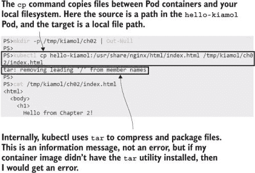

图 2.19 在 Pod 容器和本地机器之间复制文件对于故障排除很有用。

这就是本章我们将要涵盖的所有内容，但在我们继续之前，我们需要删除我们正在运行的 Pods，这比你想象的要复杂一些。

## 2.5 理解 Kubernetes 资源管理

你可以使用 kubectl 轻松地删除 Kubernetes 资源，但资源可能不会保持删除状态。如果你使用控制器创建了一个资源，那么管理该资源就是控制器的职责。它拥有资源生命周期，并且不期望任何外部干扰。如果你删除了一个受管理的资源，那么它的控制器将创建一个替代品。

现在尝试一下 使用 kubectl 的`delete`命令删除所有 Pods 并验证它们是否真的被删除了。

```
# list all running Pods:
kubectl get pods

# delete all Pods:
kubectl delete pods --all

# check again:
kubectl get pods
```

你可以在图 20.20 中看到我的输出。这是你预期的结果吗？

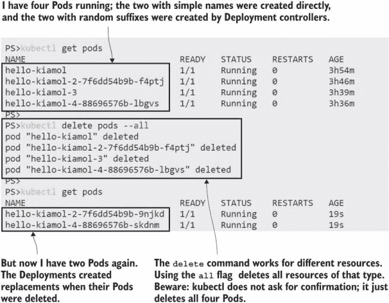

图 2.20 控制器拥有自己的资源。如果其他东西删除了它们，控制器会重新创建。

其中有两个 Pod 是通过`run`命令和 YAML Pod 规范直接创建的。它们没有控制器来管理它们，所以当你删除它们时，它们会保持删除状态。另外两个是由 Deployments 创建的，当你删除 Pod 时，Deployment 控制器仍然存在。它们看到没有 Pod 匹配它们的标签选择器，所以它们会创建新的 Pods。

当你知道这一点时，这似乎很明显，但这是一个可能会在你与 Kubernetes 共度的每一天中不断出现的陷阱。如果你想删除由控制器管理的资源，你需要删除控制器。当控制器被删除时，它们会清理自己的资源，所以删除 Deployment 就像是一个级联删除，也会删除所有 Deployment 的 Pods。

现在尝试一下 检查你正在运行的 Deployments，然后删除它们并确认剩余的 Pods 已经被删除。

```
# view Deployments:
kubectl get deploy

# delete all Deployments:
kubectl delete deploy --all

# view Pods:
kubectl get pods

# check all resources:
kubectl get all
```

图 2.21 显示了我的输出。我足够快地看到了 Pods 正在被移除，所以它们显示在终止状态。几秒钟后，Pods 和 Deployment 都被移除了，所以我唯一运行的资源就是 Kubernetes API 服务器本身。

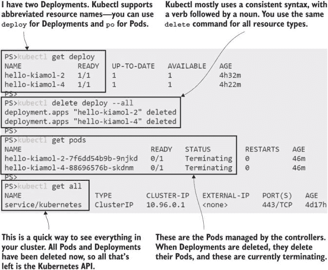

图 2.21 删除控制器会引发级联效应，控制器会删除其所有资源。

现在你的 Kubernetes 集群没有运行任何应用程序，它已经回到了原始状态。

我们在本章中涵盖了大量的内容。你对 Kubernetes 如何使用 Pods 和 Deployments 管理容器有了很好的理解，对 YAML 规范也有了一定的了解，并且通过使用 kubectl 与 Kubernetes API 交互积累了丰富的经验。我们逐步构建了核心概念，但你可能已经有一个相当清晰的认识，那就是 Kubernetes 是一个复杂的系统。如果你有时间去完成下面的实验，那将无疑有助于巩固你所学的知识。

## 2.6 实验

这是你的第一个实验；这是一个需要你自己完成的挑战。目标是编写一个 Kubernetes YAML 规范，用于在 Pod 中运行应用程序，然后测试应用程序以确保它按预期运行。以下是一些帮助你开始的提示：

+   在 ch02/lab 文件夹中，有一个名为 pod.yaml 的文件，你可以尝试运行。它运行应用程序，但定义的是 Pod 而不是 Deployment。

+   应用程序容器运行一个监听 80 端口的网站。

+   当你转发流量到该端口时，Web 应用程序会响应运行在其上的机器的主机名。

+   那个主机名实际上是 Pod 的名称，你可以使用 kubectl 来验证。

如果你觉得这有点棘手，我有一个在 GitHub 上的示例解决方案，你可以作为参考使用：[`github.com/sixeyed/kiamol/blob/master/ch02/lab/README.md`](https://github.com/sixeyed/kiamol/blob/master/ch02/lab/README.md)。
