# 3 通过服务在网络中连接 Pod

Pods 是运行在 Kubernetes 中的应用程序的基本构建块。大多数应用程序都分布在多个组件上，你可以在 Kubernetes 中使用每个组件的 Pod 来模拟这些组件。例如，你可能有一个网站 Pod 和一个 API Pod，或者你可能在一个微服务架构中有数十个 Pod。它们都需要进行通信，Kubernetes 支持标准的网络协议，TCP 和 UDP。这两个协议都使用 IP 地址来路由流量，但是当 Pod 被替换时，IP 地址会发生变化，因此 Kubernetes 提供了一个带有*服务*的网络地址发现机制。

服务是灵活的资源，支持在 Pod 之间、从集群外部到 Pod 以及从 Pod 到外部系统之间路由流量。在本章中，你将了解 Kubernetes 提供的所有不同服务配置，以粘合系统，并了解它们是如何为你的应用程序透明工作的。

## 3.1 Kubernetes 如何路由网络流量

在上一章中，你了解了关于 Pod 的两个重要事情：Pod 是一个由 Kubernetes 分配 IP 地址的虚拟环境，Pod 是可丢弃的资源，其生命周期由另一个资源控制。如果一个 Pod 想要与另一个 Pod 通信，它可以使用 IP 地址。然而，这有两个问题：首先，如果 Pod 被替换，IP 地址会发生变化，其次，没有简单的方法可以找到 Pod 的 IP 地址——它只能通过 Kubernetes API 来发现。

现在试试看 如果你部署了两个 Pod，你可以从另一个 Podping 它，但首先你需要找到它的 IP 地址。

```
# start up your lab environment--run Docker Desktop if it's not running--
# and switch to this chapter’s directory in your copy of the source code:
cd ch03

# create two Deployments, which each run one Pod:
kubectl apply -f sleep/sleep1.yaml -f sleep/sleep2.yaml

# wait for the Pod to be ready:
kubectl wait --for=condition=Ready pod -l app=sleep-2

# check the IP address of the second Pod:
kubectl get pod -l app=sleep-2 --output jsonpath='{.items[0].status.podIP}'

# use that address to ping the second Pod from the first:
kubectl exec deploy/sleep-1 -- ping -c 2 $(kubectl get pod -l app=sleep-2 --output jsonpath='{.items[0].status.podIP}')
```

我的输出显示在图 3.1 中。容器内的 ping 操作正常，第一个 Pod 能够成功到达第二个 Pod，但我不得不使用 kubectl 找到 IP 地址并将其传递给`ping`命令。

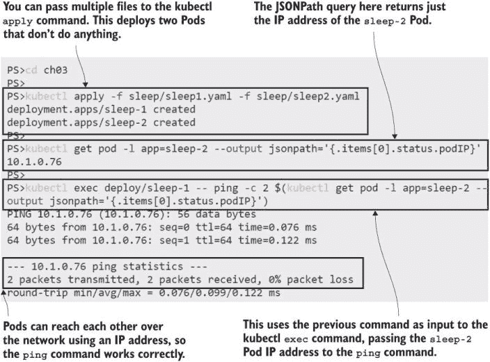

图 3.1 使用 IP 地址的 Pod 网络——你只能从 Kubernetes API 中找到地址。

Kubernetes 中的虚拟网络跨越整个集群，因此即使 Pod 在不同的节点上运行，它们也可以通过 IP 地址进行通信。这个例子在单个节点的 K3s 集群和 100 个节点的 AKS 集群上以相同的方式工作。这是一个有用的练习，可以帮助你看到 Kubernetes 不做任何特殊的网络魔法；它只是使用了你的应用程序已经使用的标准协议。你通常不会这样做，因为 IP 地址是特定于一个 Pod 的，当 Pod 被替换时，替换的 Pod 将有一个新的 IP 地址。

现在试试看 这些 Pod 由 Deployment 控制器管理。如果你删除了第二个 Pod，其控制器将启动一个新的 IP 地址的替换 Pod。

```
# check the current Pod’s IP address:
kubectl get pod -l app=sleep-2 --output jsonpath='{.items[0].status.podIP}'

# delete the Pod so the Deployment replaces it:
kubectl delete pods -l app=sleep-2

# check the IP address of the replacement Pod:
kubectl get pod -l app=sleep-2 --output jsonpath='{.items[0].status.podIP}'
```

在图 3.2 中，我的输出显示替换后的 Pod 有一个不同的 IP 地址，如果我尝试 ping 旧地址，命令会失败。

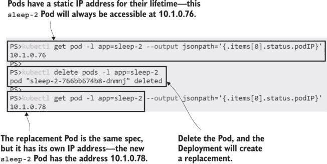

图 3.2 Pod 的 IP 地址不是其规范的一部分；替换后的 Pod 有一个新的地址。

需要为可能变化的资源提供永久地址的问题是一个老问题——互联网使用 DNS（域名系统）解决了这个问题，将友好名称映射到 IP 地址，Kubernetes 也使用了相同的系统。Kubernetes 集群内置了一个 DNS 服务器，它将服务名称映射到 IP 地址。图 3.3 展示了 Pod 到 Pod 通信的域名查找过程。

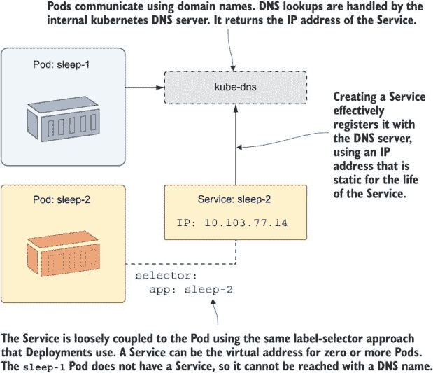

图 3.3 显示服务允许 Pod 使用固定域名进行通信。

这种类型的服务是对 Pod 及其网络地址的抽象，就像 Deployment 是对 Pod 及其容器的抽象一样。服务有自己的 IP 地址，它是静态的。当消费者向该地址发起网络请求时，Kubernetes 将其路由到 Pod 的实际 IP 地址。服务与其 Pod 之间的连接是通过标签选择器设置的，就像 Deployment 与 Pod 之间的连接一样。

列表 3.1 展示了服务的最小 YAML 规范，使用 app 标签来识别网络流量的最终目标 Pod。

列表 3.1 sleep2-service.yaml，最简单的服务定义

```
apiVersion: v1    # Services use the core v1 API.
kind: Service

metadata:
  name: sleep-2   # The name of a Service is used as the DNS domain name.

# The specification requires a selector and a list of ports.
spec:
  selector:
    app: sleep-2  # Matches all Pods with an app label set to sleep-2.
  ports:
    - port: 80    # Listens on port 80 and sends to port 80 on the Pod 
```

此服务定义与之前练习中运行的一个 Deployment 兼容。当您部署它时，Kubernetes 创建一个名为 sleep-2 的 DNS 条目，将流量路由到由 sleep-2 Deployment 创建的 Pod。其他 Pod 可以使用服务名称作为域名向该 Pod 发送流量。

现在试试看。您可以使用 YAML 文件和常规的 kubectl `apply` 命令部署一个服务。部署服务后，验证网络流量是否被路由到 Pod。

```
# deploy the Service defined in listing 3.1:
kubectl apply -f sleep/sleep2-service.yaml

# show the basic details of the Service:
kubectl get svc sleep-2

# run a ping command to check connectivity--this will fail:
kubectl exec deploy/sleep-1 -- ping -c 1 sleep-2
```

我的输出显示在图 3.4 中，您可以看到名称解析工作正常，尽管 `ping` 命令没有按预期工作，因为 ping 使用的是 Kubernetes 服务不支持的网络协议。


图 3.4 部署服务创建了一个 DNS 条目，为服务名称提供了一个固定的 IP 地址。

这就是 Kubernetes 中服务发现背后的基本概念：部署一个服务资源，并使用服务的名称作为组件通信的域名。

不同的服务类型支持不同的网络模式，但您以相同的方式与它们一起工作。接下来，我们将更详细地研究 Pod 到 Pod 的网络，通过一个简单分布式应用的示例来展示。

## 3.2 在 Pod 之间路由流量

Kubernetes 中服务的默认类型称为 ClusterIP。它创建一个集群范围内的 IP 地址，任何节点上的 Pod 都可以访问。该 IP 地址仅在集群内部有效，因此 ClusterIP 服务仅适用于 Pod 之间的通信。这正是分布式系统所需要的，其中某些组件是内部的，不应该在集群外部访问。我们将使用一个简单的网站来演示这一点，该网站使用内部 API 组件。

现在尝试一下 运行两个 Deployment，一个用于 Web 应用，一个用于 API。此应用尚未定义任何服务，并且它将无法正常工作，因为网站找不到 API。

```
# run the website and API as separate Deployments: 
kubectl apply -f numbers/api.yaml -f numbers/web.yaml

# wait for the Pod to be ready:
kubectl wait --for=condition=Ready pod -l app=numbers-web

# forward a port to the web app:
kubectl port-forward deploy/numbers-web 8080:80

# browse to the site at http://localhost:8080 and click the Go button
# --you'll see an error message

# exit the port forward:
ctrl-c
```

您可以从我在图 3.5 中显示的输出中看到，应用失败，显示 API 不可用的消息。

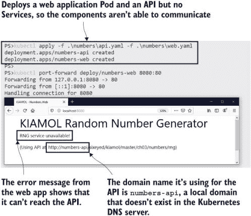

图 3.5 Web 应用运行但无法正常工作，因为对 API 的网络调用失败。

错误页面还显示了网站期望找到 API 的域名——http://numbers-api。这并不是一个完全限定的域名（如[blog.sixeyed.com](http://blog.sixeyed.com)）；这是一个应由本地网络解析的地址，但 Kubernetes 中的 DNS 服务器无法解析它，因为没有名为`numbers-api`的服务。列表 3.2 中的规范显示了一个具有正确名称的 Service 和一个匹配 API Pod 的标签选择器。

列表 3.2 api-service.yaml，随机数 API 的服务

```
apiVersion: v1
kind: Service

metadata:
  name: numbers-api     # The Service uses the domain name numbers-api.

spec:
  ports:
    - port: 80
  selector:
    app: numbers-api    #  Traffic is routed to Pods with this label.
  type: ClusterIP       #  This Service is available only to other Pods.
```

此服务与列表 3.1 中的类似，只是名称已更改，并且明确指出了 ClusterIP 服务类型。这可以省略，因为它是默认的服务类型，但我认为包含它可以使规范更清晰。部署服务将路由 Web Pod 和 API Pod 之间的流量，修复应用而无需更改部署或 Pod。

现在尝试一下 为 API 创建一个服务，以便域名查找工作，并将流量从 Web Pod 发送到 API Pod。

```
# deploy the Service from listing 3.2:
kubectl apply -f numbers/api-service.yaml

# check the Service details:
kubectl get svc numbers-api

# forward a port to the web app:
kubectl port-forward deploy/numbers-web 8080:80

# browse to the site at http://localhost:8080 and click the Go button

# exit the port forward:
ctrl-c
```

我在图 3.6 中显示的输出显示了应用正常工作，网站显示由 API 生成的随机数。

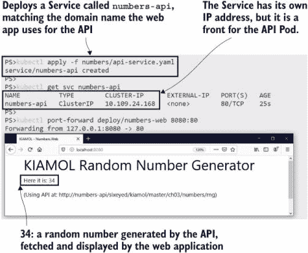

图 3.6 部署服务修复了 Web 应用和 API 之间的断链。

在服务、部署和 Pod 之外，这里的重要教训是您的 YAML 规范描述了您的整个应用程序在 Kubernetes 中——那就是所有组件及其之间的网络。Kubernetes 不会对您的应用程序架构做出假设；您需要在 YAML 中指定它。这个简单的 Web 应用需要定义三个 Kubernetes 资源才能在当前状态下工作——两个 Deployment 和一个 Service，但所有这些移动部件的优势是提高了弹性。

现在尝试一下 API Pod 由 Deployment 控制器管理，因此您可以删除 Pod，并将创建一个替换品。替换品也符合 API Service 中的标签选择器，因此流量被路由到新的 Pod，应用继续工作。

```
# check the name and IP address of the API Pod:
kubectl get pod -l app=numbers-api -o custom-columns=NAME:metadata.name,POD_IP:status.podIP

# delete that Pod:
kubectl delete pod -l app=numbers-api

# check the replacement Pod:
kubectl get pod -l app=numbers-api -o custom-columns=NAME:metadata.name,POD_IP:status.podIP 

# forward a port to the web app:
kubectl port-forward deploy/numbers-web 8080:80

# browse to the site at http://localhost:8080 and click the Go button

# exit the port forward:
ctrl-c
```

图 3.7 显示 Deployment 控制器创建了一个替换 Pod。它是相同的 API Pod 规范，但在一个新的 Pod 中运行，具有新的 IP 地址。不过，API 服务的 IP 地址没有改变，Web Pod 可以在相同的网络地址上到达新的 API Pod。

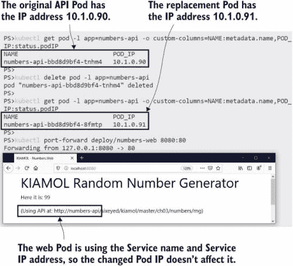

图 3.7 服务将 Web Pod 与 API Pod 隔离开来，因此 API Pod 是否更改无关紧要。

在这些练习中，我们手动删除 Pods 以触发控制器创建替换，但在 Kubernetes 应用程序的正常生命周期中，Pod 替换一直在发生。每次你更新应用程序的任何组件——添加功能、修复错误或发布依赖项的更新——你都在替换 Pods。任何节点宕机时，其 Pods 都会在其他节点上替换。服务抽象层保持应用程序通过这些替换进行通信。

这个演示应用程序还不完整，因为它还没有配置好以接收来自集群外部的流量并将其发送到 Web Pod。我们到目前为止已经使用了端口转发，但这实际上是一种调试技巧。真正的解决方案是为 Web Pod 也部署一个服务。

## 3.3 将外部流量路由到 Pods

你有几种方法可以配置 Kubernetes 以监听进入集群的流量并将其转发到 Pod。我们将从一种简单灵活的方法开始，这对于从本地开发到生产的一切都适用。这是一种称为 LoadBalancer 的服务类型，它解决了将流量引导到可能运行在不同节点上的 Pod 的问题；图 3.8 显示了其外观。

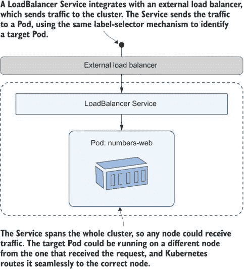

图 3.8 LoadBalancer 服务将来自任何节点的外部流量路由到匹配的 Pod。

这看起来像是一个棘手的问题，特别是因为你可能有多个匹配服务标签选择器的 Pod，因此集群需要选择一个节点来发送流量，然后在该节点上选择一个 Pod。所有这些复杂性都由 Kubernetes 处理——这就是世界级的编排——所以你只需要部署一个 LoadBalancer 服务。列表 3.3 显示了 Web 应用程序的服务规范。

列表 3.3 web-service.yaml，一个用于外部流量的 LoadBalancer 服务

```
apiVersion: v1
kind: Service
metadata:
  name: numbers-web
spec:
  ports:
    - port: 8080          # The port the Service listens on
      targetPort: 80      # The port the traffic is sent to on the Pod
  selector:
    app: numbers-web
  type: LoadBalancer      # This Service is available for external traffic.
```

此服务监听 8080 端口并将流量发送到端口 80 的 Web Pod。当你部署它时，你将能够使用 Web 应用程序而无需在 kubectl 中设置端口转发，但如何到达应用程序的确切细节将取决于你如何运行 Kubernetes。

现在尝试一下 部署服务，然后使用 kubectl 找到服务的地址。

```
# deploy the LoadBalancer Service for the website--if your firewall checks 
# that you want to allow traffic, then it is OK to say yes:
kubectl apply -f numbers/web-service.yaml

# check the details of the Service:
kubectl get svc numbers-web

# use formatting to get the app URL from the EXTERNAL-IP field:
kubectl get svc numbers-web -o jsonpath='http://{.status.loadBalancer.ingress[0].*}:8080'
```

图 3.9 显示了我在 Docker Desktop Kubernetes 集群上运行练习的输出，我可以浏览到地址为 http://localhost:8080 的网站。

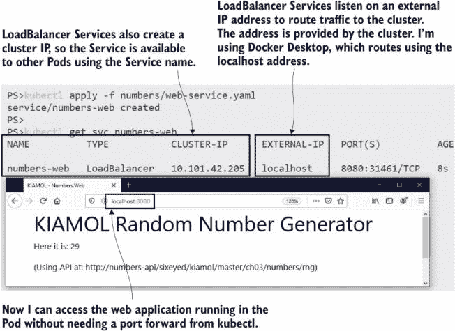

图 3.9 Kubernetes 从其运行的平台上请求 LoadBalancer 服务的 IP 地址。

使用 K3s 或云中的托管 Kubernetes 集群时，输出会有所不同，其中服务部署为负载均衡器创建一个专用的外部 IP 地址。图 3.10 显示了使用同一 YAML 规范在 Linux VM 上的 K3s 集群执行相同练习的输出（这里网站位于 http://172.28.132.127:8080）。

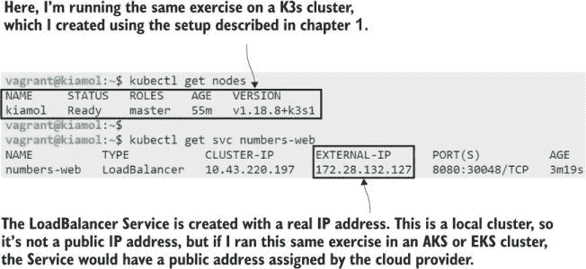

图 3.10 不同 Kubernetes 平台为 LoadBalancer 服务使用不同的地址。

同样的应用清单为什么结果会不同呢？我在第一章提到过，你可以以不同的方式部署 Kubernetes，*它们都是相同的 Kubernetes*（我的强调），但这并不完全正确。Kubernetes 包含了许多扩展点，各个发行版在实现某些功能时都有一定的灵活性。LoadBalancer 服务就是一个很好的例子，其实现方式因发行版的目标而异。

+   Docker Desktop 是一个本地开发环境。它运行在单个机器上，并与网络栈集成，因此 LoadBalancer 服务在 localhost 地址上可用。每个 LoadBalancer 服务都会发布到 localhost，因此如果你部署了多个负载均衡器，你需要使用不同的端口。

+   K3s 支持使用自定义组件设置路由表，从而支持 LoadBalancer 服务。每个 LoadBalancer 服务都会发布到你的机器（或虚拟机）的 IP 地址，因此你可以通过 localhost 或网络上的远程机器访问服务。与 Docker Desktop 类似，你需要为每个负载均衡器使用不同的端口。

+   类似于 AKS 和 EKS 这样的云 Kubernetes 平台是高度可用的多节点集群。部署 Kubernetes LoadBalancer 服务会在你的云中创建一个实际的负载均衡器，它覆盖了集群中的所有节点——云负载均衡器将传入的流量发送到集群中的一个节点，然后 Kubernetes 将其路由到 Pod。每个 LoadBalancer 服务都会分配一个不同的 IP 地址，并且它是一个公网地址，可以从互联网访问。

在其他 Kubernetes 功能中，我们还会看到这种模式，即各个发行版提供了不同的资源，有不同的目标。最终，YAML 清单是相同的，最终结果也是一致的，但 Kubernetes 允许发行版在实现过程中有所差异。

在标准 Kubernetes 的世界中，你还可以使用另一种 Service 类型来监听进入集群的网络流量并将其导向 Pod——即 NodePort。NodePort 服务不需要外部负载均衡器——集群中的每个节点都会监听服务中指定的端口，并将流量发送到 Pod 的目标端口。图 3.11 展示了其工作原理。

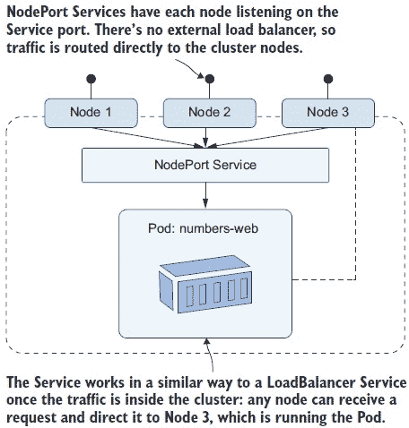

图 3.11 NodePort 服务也会将外部流量路由到 Pod，但它们不需要负载均衡器。

NodePort 服务没有 LoadBalancer 服务的灵活性，因为每个服务都需要不同的端口，你的节点需要是公开可访问的，而且你无法在多节点集群中实现负载均衡。NodePort 服务在各个发行版中的支持级别也不同，因此在 K3s 和 Docker Desktop 中可以按预期工作，但在 Kind 中则不太理想。列表 3.4 展示了一个 NodePort 规范以供参考。

列表 3.4 web-service-nodePort.yaml，一个 NodePort 服务规范

```
apiVersion: v1
kind: Service
metadata:
  name: numbers-web-node
spec:
  ports:
    - port: 8080          # The port on which the Service is available to
                          # other Pods
      targetPort: 80      # The port on which the traffic is sent to on 
                          # the Pod
      nodePort: 30080     # The port on which the Service is available
                          # externally
  selector:
  app: numbers-web
  type: NodePort          # This Service is available on node IP addresses.
```

没有部署此 NodePort 服务的练习（尽管 YAML 文件在章节文件夹中，如果您想尝试的话）。这部分原因是因为它不是在每种发行版上以相同的方式工作，所以这一节将结束于许多需要尝试才能理解的 if 分支。但更重要的是——您通常不会在生产环境中使用 NodePort，并且最好让您的配置文件在不同环境中尽可能一致。坚持使用 LoadBalancer 服务意味着您从开发到生产都有相同的规范，这意味着需要维护和同步的 YAML 文件更少。

我们将通过深入了解服务在底层是如何工作的来结束本章，但在那之前，我们将探讨您可以使用服务的一种更多方式，即从 Pod 与集群外部的组件进行通信。

## 3.4 在 Kubernetes 外部路由流量

您几乎可以在 Kubernetes 中运行任何服务器软件，但这并不意味着您应该这样做。例如，数据库等存储组件通常是运行在 Kubernetes 外部的典型候选者，尤其是如果您正在云中部署，并且可以使用托管数据库服务。或者，您可能正在数据中心运行，需要与不会迁移到 Kubernetes 的现有系统集成。无论您使用什么架构，您仍然可以使用 Kubernetes 服务进行域名解析，以访问集群外部的组件。

实现这一点的第一种方法是使用 ExternalName 服务，它就像一个从一个域名到另一个域名的别名。ExternalName 服务允许您在应用程序 Pod 中使用本地名称，当 Pod 进行查找请求时，Kubernetes 中的 DNS 服务器将本地名称解析为完全限定的外部名称。图 3.12 展示了它是如何工作的，一个 Pod 使用本地名称，该名称解析为外部系统地址。

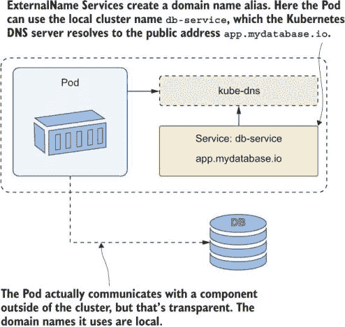

图 3.12 使用 ExternalName 服务允许您使用本地集群地址访问远程组件。

本章的演示应用程序预期使用本地 API 生成随机数，但只需部署一个 ExternalName 服务，就可以切换到从 GitHub 上的文本文件中读取静态数字。

现在尝试一下：您不能在 Kubernetes 的每个版本中都将服务从一种类型切换到另一种类型，因此您在部署 ExternalName 服务之前需要删除 API 的原始 ClusterIP 服务。

```
# delete the current API Service:
kubectl delete svc numbers-api

# deploy a new ExternalName Service:
kubectl apply -f numbers-services/api-service-externalName.yaml

# check the Service configuration:
kubectl get svc numbers-api

# refresh the website in your browser and test with the Go button
```

我的结果如图 3.13 所示。您可以看到应用程序以相同的方式工作，并且它使用相同的 API URL。但是，如果您刷新页面，您会发现它总是返回相同的数字，因为它不再使用随机数 API。

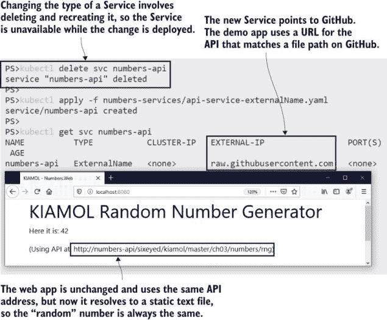

图 3.13 ExternalName 服务可以用作重定向，将请求发送到集群外部。

ExternalName 服务可以是一种有用的方式来处理你无法在应用配置中绕过的环境差异。也许你有一个应用组件，它使用硬编码的字符串作为数据库服务器的名称。在开发环境中，你可以创建一个带有预期域名的 ClusterIP 服务，该服务解析到在 Pod 中运行的测试数据库；在生产环境中，你可以使用一个解析到数据库服务器真实域名的 ExternalName 服务。列表 3.5 显示了 API 外部名称的 YAML 规范。

列表 3.5 api-service-externalName.yaml，一个 ExternalName 服务

```
apiVersion: v1
kind: Service
metadata:
  name: numbers-api   # The local domain name of the Service in the cluster
spec:
  type: ExternalName
  externalName: raw.githubusercontent.com   # The domain to resolve
```

Kubernetes 使用 DNS 的一个标准功能——规范名称（CNAMEs）来实现 ExternalName 服务。当 Web Pod 对`numbers-api`域名进行 DNS 查找时，Kubernetes DNS 服务器返回 CNAME，即 raw.githubusercontent.com。然后 DNS 解析继续使用节点上配置的 DNS 服务器，因此它会连接到互联网以找到 GitHub 服务器的 IP 地址。

现在尝试一下，服务是集群范围内的 Kubernetes Pod 网络的一部分，所以任何 Pod 都可以使用服务。本章第一个练习中的 sleep Pods 在容器镜像中有一个`DNS` `lookup`命令，你可以使用它来检查 API 服务的解析。

```
# run the DNS lookup tool to resolve the Service name:
kubectl exec deploy/sleep-1 -- sh -c 'nslookup numbers-api | tail -n 5'
```

当你尝试这样做时，你可能会得到一些看起来像错误的混乱结果，因为 Nslookup 工具返回了大量的信息，并且每次运行时顺序都不相同。不过，你想要的数据确实在里面。我重复执行了几次命令，以获得图 3.14 中看到的适合打印的输出。

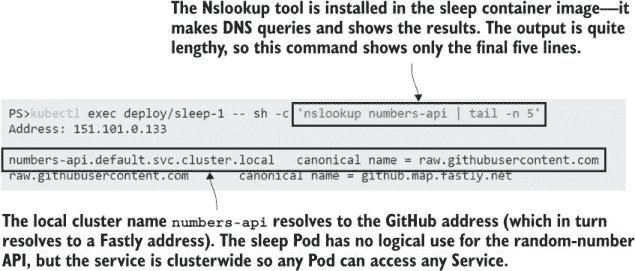

图 3.14 在 Kubernetes 中，应用默认不是隔离的，所以任何 Pod 都可以为任何服务进行查找。

关于 ExternalName 服务，有一件重要的事情需要理解，你可以从这个练习中看到：它们最终只是给你的应用提供一个地址来使用，但它们实际上并没有改变应用发出的请求。这对于像数据库这样的组件来说是可以的，因为它们通过 TCP 进行通信，但对于 HTTP 服务来说就不那么简单了。HTTP 请求在头字段中包含目标主机名，这不会与 ExternalName 响应的实际域名匹配，所以客户端调用可能会失败。本章中的随机数应用有一些绕过这个问题的代码，手动设置主机头，但这种方法最适合非 HTTP 服务。

在集群中路由本地域名到外部系统还有一个其他选项。它不能修复 HTTP 头问题，但当你想要将流量路由到 IP 地址而不是域名时，它允许你使用与 ExternalName 服务类似的方法。这些是*无头服务*，定义为 ClusterIP 服务类型，但没有标签选择器，因此它们永远不会匹配任何 Pod。相反，服务通过一个*端点*资源来部署，该资源明确列出服务应解析的 IP 地址。

列表 3.6 显示了一个端点具有单个 IP 地址的无头服务。它还展示了 YAML 的新用法，通过三个短横线分隔定义了多个资源。

列表 3.6 api-service-headless.yaml，一个具有显式地址的服务

```
apiVersion: v1
kind: Service
metadata:
  name: numbers-api
spec:
  type: ClusterIP      # No selector field makes this a headless Service.
  ports:
    - port: 80
---
kind: Endpoints        # The endpoint is a separate resource.
apiVersion: v1
metadata:
  name: numbers-api
subsets: 
  - addresses:         # It has a static list of IP addresses . . . 
      - ip: 192.168.123.234
    ports:
      - port: 80       # and the ports they listen on.
```

该端点规范中的 IP 地址是一个假的，但 Kubernetes 不会验证该地址是否可达，因此这段代码将无错误地部署。

现在尝试一下 替换外部名称服务为这个无头服务。这将导致应用失败，因为 API 域名现在解析到一个不可访问的 IP 地址。

```
# remove the existing Service:
kubectl delete svc numbers-api

# deploy the headless Service:
kubectl apply -f numbers-services/api-service-headless.yaml

# check the Service:
kubectl get svc numbers-api

# check the endpoint: 
kubectl get endpoints numbers-api

# verify the DNS lookup:
kubectl exec deploy/sleep-1 -- sh -c 'nslookup numbers-api | grep "^[^*]"'

# browse to the app--it will fail when you try to get a number
```

我在图 3.15 中显示的输出确认了 Kubernetes 会愉快地让你部署一个会破坏你应用的服务变更。域名解析了内部集群 IP 地址，但任何对该地址的网络调用都会失败，因为它们被路由到端点中实际存在的 IP 地址。

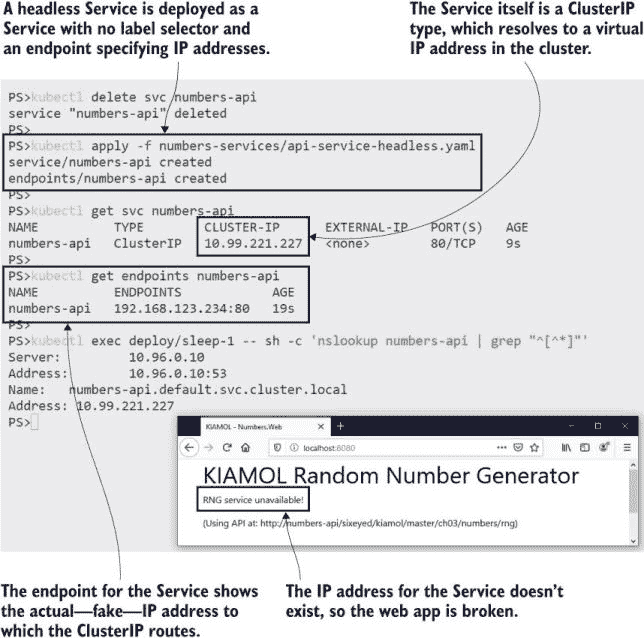

图 3.15 服务配置错误可能会破坏你的应用，即使没有部署应用变更。

该练习的输出引发了一些有趣的问题：为什么 DNS 查找返回的是集群 IP 地址而不是端点地址？为什么域名以.default.svc.cluster.local 结尾？你不需要网络工程背景就可以使用 Kubernetes 服务，但如果你理解服务解析的实际工作方式，这将有助于你追踪问题——这正是我们结束本章的方式。

## 3.5 理解 Kubernetes 服务解析

Kubernetes 通过使用服务（Services），这些服务建立在成熟的网络技术之上，支持所有应用可能需要的网络配置。应用组件在 Pod 中运行，并使用标准传输协议和 DNS 名称进行发现来与其他 Pod 进行通信。你不需要任何特殊的代码或库；你的应用在 Kubernetes 中的工作方式与你在物理服务器或虚拟机上部署它们时相同。

在本章中，我们已经涵盖了所有服务类型及其典型用例，因此现在你对可以使用的设计模式有了很好的理解。如果你觉得这里有很多细节，请放心，大多数时候你将部署集群 IP 服务，这需要很少的配置。它们大多无缝工作，但深入理解堆栈是有用的。图 3.16 显示了下一级别的细节。

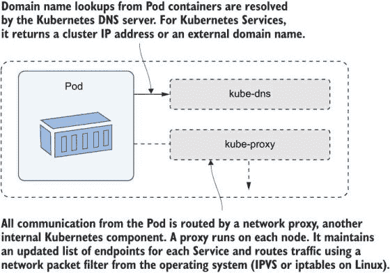

图 3.16 显示 Kubernetes 运行 DNS 服务器和代理，并使用标准网络工具。

关键要点是 ClusterIP 是一个虚拟 IP 地址，它不在网络上存在。Pod 通过节点上运行的 kube-proxy 访问网络，它使用数据包过滤将虚拟 IP 发送到实际端点。Kubernetes 服务只要存在就保持它们的 IP 地址，服务可以独立于应用程序的任何其他部分存在。服务有一个控制器，每当 Pod 发生变化时都会更新端点列表，因此客户端始终使用静态虚拟 IP 地址，kube-proxy 始终有最新的端点列表。

现在尝试一下 您可以看到当 Pod 发生变化时，通过列出 Pod 变化之间的服务端点，Kubernetes 如何立即更新端点列表。端点使用与服务相同的名称，您可以使用 kubectl 查看端点详情。

```
# show the endpoints for the sleep-2 Service:
kubectl get endpoints sleep-2

# delete the Pod:
kubectl delete pods -l app=sleep-2

# check the endpoint is updated with the IP of the replacement Pod:
kubectl get endpoints sleep-2

# delete the whole Deployment:
kubectl delete deploy sleep-2

# check the endpoint still exists, with no IP addresses:
kubectl get endpoints sleep-2
```

您可以在图 3.17 中看到我的输出，这是对第一个问题的回答——Kubernetes DNS 返回集群 IP 地址而不是端点，因为端点地址会变化。

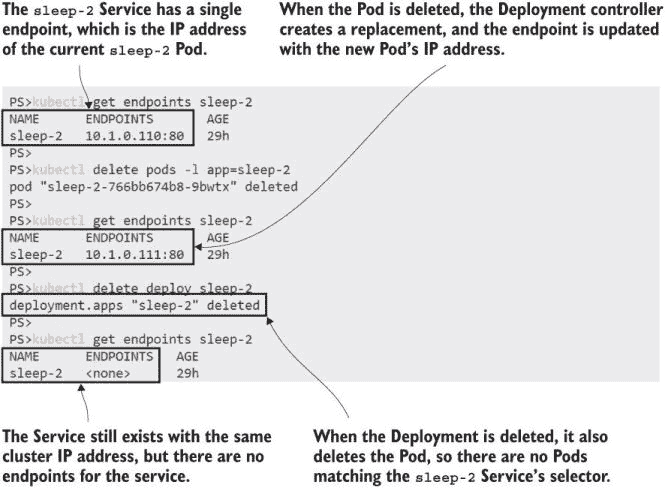

图 3.17 服务的集群 IP 地址不会改变，但端点列表始终在更新。

使用静态虚拟 IP 意味着客户端可以无限期地缓存 DNS 查找响应（许多应用程序错误地将其作为性能节省），并且无论随着时间的推移发生多少 Pod 替换，该 IP 地址都将继续工作。关于域名后缀的第二个问题需要通过侧向思考来回答，即查看 Kubernetes 的*命名空间*。

每个 Kubernetes 资源都存在于一个命名空间内，这是一个您可以使用它来分组其他资源的资源。命名空间是逻辑上划分 Kubernetes 集群的一种方式——您可以为每个产品创建一个命名空间，为每个团队创建一个，或者使用一个共享的命名空间。我们暂时不会使用命名空间，但我在这里介绍它们，因为它们在 DNS 解析中扮演着一定的角色。图 3.18 显示了命名空间如何进入服务名称。

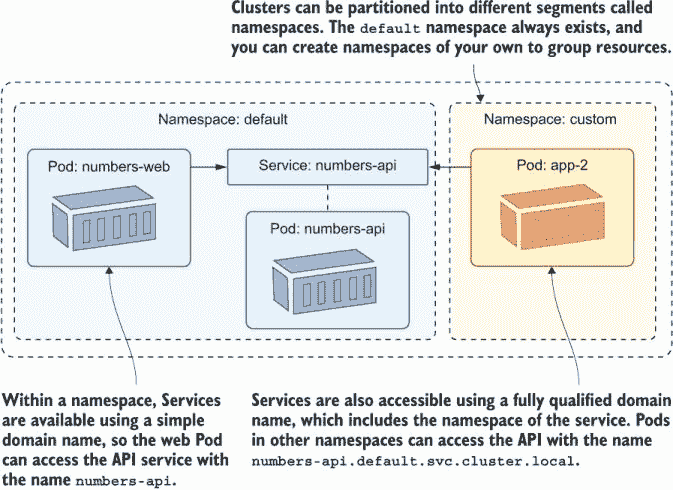

图 3.18 命名空间逻辑上划分了一个集群，但服务可以在命名空间之间访问。

您的集群中已经有了几个命名空间——我们迄今为止部署的所有资源都已在`default`命名空间中创建（这是默认的；这就是为什么我们不需要在我们的 YAML 文件中指定命名空间）。内部 Kubernetes 组件，如 DNS 服务器和 Kubernetes API，也在`kube-system`命名空间中的 Pod 中运行。

现在尝试一下 Kubectl 具有命名空间感知能力——您可以使用命名空间标志来处理默认命名空间之外的资源。

```
# check the Services in the default namespace:
kubectl get svc --namespace default

# check Services in the system namespace:
kubectl get svc -n kube-system

# try a DNS lookup to a fully qualified Service name:
kubectl exec deploy/sleep-1 -- sh -c 'nslookup numbers-api.default.svc.cluster.local | grep "^[^*]"'

# and for a Service in the system namespace:
kubectl exec deploy/sleep-1 -- sh -c 'nslookup kube-dns.kube-system.svc.cluster.local | grep "^[^*]"'
```

我在图 3.19 中展示的输出回答了第二个问题——服务的本地域名只是服务名称，但这是对包括 Kubernetes 命名空间在内的完全限定域名的一个别名。

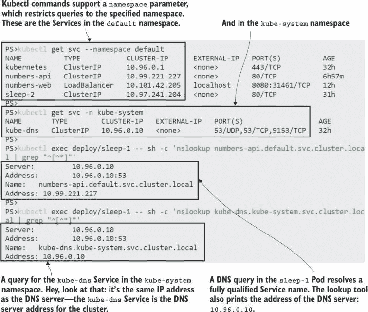

图 3.19 您可以使用相同的 kubectl 命令查看不同命名空间中的资源。

在您的 Kubernetes 之旅早期了解命名空间很重要，仅因为这样可以帮助您看到核心 Kubernetes 功能也是作为 Kubernetes 应用程序运行的，但除非您明确设置命名空间，否则您在 kubectl 中看不到它们。命名空间是一种强大的方式，可以将您的集群细分以增加利用率，同时不牺牲安全性，我们将在第十一章中再次讨论它们。

目前我们已经完成了命名空间和服务的操作。在本章中，您了解到每个 Pod 都有自己的 IP 地址，Pod 通信最终使用该地址通过标准的 TCP 和 UDP 协议。尽管如此，您永远不会直接使用 Pod IP 地址——您总是创建一个服务资源，Kubernetes 使用该资源通过 DNS 提供服务发现。服务支持多种网络模式，不同的服务类型配置 Pod 之间的网络流量、从外部世界进入 Pod 的网络流量以及从 Pod 到外部世界的网络流量。您还了解到服务有自己的生命周期，独立于 Pod 和部署，因此在继续之前，我们最后要做的就是清理。

现在尝试一下 删除部署也会删除其所有 Pod，但服务没有级联删除。它们是独立的对象，需要单独删除。

```
# delete Deployments:
kubectl delete deploy --all 

# and Services:
kubectl delete svc --all 

# check what’s running:
kubectl get all
```

现在您的集群又清空了，尽管如此，如图 3.20 所示，您在使用一些 kubectl 命令时需要小心。

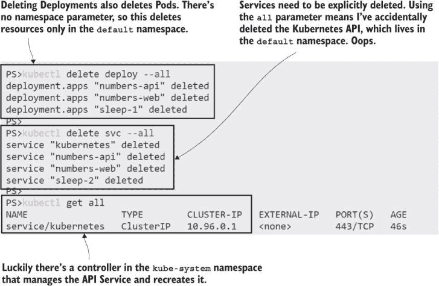

图 3.20 您需要明确删除您创建的任何服务，但要注意`all`参数。

## 3.6 实验室

这个实验将让您练习创建服务，但也会让您思考标签和选择器，这些都是 Kubernetes 的强大功能。目标是部署随机数字应用程序的更新版本的服务，该版本已经进行了用户界面改造。以下是您的提示：

+   本章的实验文件夹中有一个`deployments.yaml`文件。使用该文件通过 kubectl 部署应用程序。

+   检查 Pods——有运行着两个版本的 Web 应用程序。

+   编写一个服务，使 API 可以通过域名`numbers-api`供其他 Pod 使用。

+   编写一个服务，使网站的第 2 版可以在外部端口 8088 上使用。

+   您需要仔细查看 Pod 标签才能得到正确的结果。

这个实验是本章练习的扩展，如果您想检查我的解决方案，可以在 GitHub 上找到该书的存储库：[`github.com/sixeyed/kiamol/blob/master/ch03/lab/README.md`](https://github.com/sixeyed/kiamol/blob/master/ch03/lab/README.md)。
