# 4 配置应用程序的 ConfigMaps 和 Secrets

在容器中运行应用程序的一个巨大优势是消除了环境之间的差距。部署过程通过所有测试环境直至生产环境推广相同的容器镜像，因此每个部署都使用与先前环境完全相同的二进制文件集。你将再也不必担心生产部署失败，因为服务器缺少在测试服务器上手动安装但忘记记录的依赖项。当然，环境之间仍然存在差异，你通过将配置设置注入容器来提供这种差异。

Kubernetes 支持使用两种资源类型进行配置注入：ConfigMaps 和 Secrets。这两种类型都可以以任何合理的格式存储数据，并且这些数据在集群中独立于其他资源存在。Pod 可以定义访问 ConfigMaps 和 Secrets 中的数据，以及如何展示这些数据的不同选项。在本章中，你将学习所有管理 Kubernetes 中配置的方法，这些方法足够灵活，可以满足任何应用程序的需求。

## 4.1 Kubernetes 如何向应用程序提供配置

你可以像创建其他 Kubernetes 资源一样创建 ConfigMap 和 Secret 对象——使用 kubectl，无论是通过 `create` 命令还是通过应用 YAML 规范。与其它资源不同，它们不执行任何操作；它们只是用于存储少量数据的存储单元。这些存储单元可以被加载到 Pod 中，成为容器环境的一部分，因此容器中的应用程序可以读取这些数据。在我们接触到这些对象之前，我们将看看提供配置设置的 simplest 方法：使用环境变量。

现在尝试一下 环境变量是 Linux 和 Windows 的核心操作系统功能，它们可以在机器级别设置，因此任何应用程序都可以读取它们。它们被广泛使用，所有容器都有一些，这些由容器内的操作系统和 Kubernetes 设置。确保你的 Kubernetes 实验室正在运行。

```
# switch to the exercise directory for this chapter:
cd ch04 

# deploy a Pod using the sleep image with no extra configuration:
kubectl apply -f sleep/sleep.yaml

# wait for the Pod to be ready:
kubectl wait --for=condition=Ready pod -l app=sleep

# check some of the environment variables in the Pod container:
kubectl exec deploy/sleep -- printenv HOSTNAME KIAMOL_CHAPTER
```

你可以从图 4.1 中我的输出中看到，容器中存在 hostname 变量，并由 Kubernetes 填充，但自定义的 Kiamol 变量不存在。

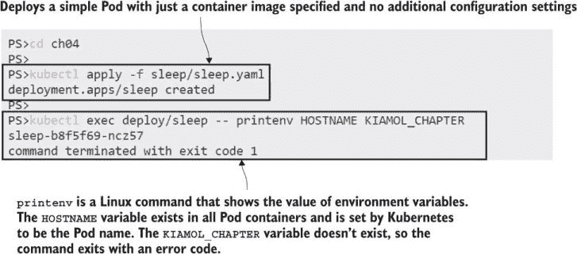

图 4.1 所有 Pod 容器都由 Kubernetes 和容器操作系统设置了一些环境变量。

在这个练习中，应用程序只是 Linux 的 `printenv` 工具，但对于任何应用程序，原理都是相同的。许多技术栈使用环境变量作为基本的配置系统。在 Kubernetes 中提供这些设置的 simplest 方法是在 Pod 规范中添加环境变量。列表 4.1 显示了 sleep 部署的更新 Pod 规范，其中添加了 Kiamol 环境变量。

列表 4.1 sleep-with-env.yaml，一个包含环境变量的 Pod 规范

```
spec:
  containers:
    - name: sleep
      image: kiamol/ch03-sleep
      env:                     # Sets environment variables
      - name: KIAMOL_CHAPTER   # Defines the name of the variable to create
        value: "04"            # Defines the value to set for the variable
```

环境变量在 Pod 的整个生命周期中是静态的；在 Pod 运行期间无法更新任何值。如果您需要做出配置更改，您需要使用替换 Pod 来执行更新。您应该习惯于这样的想法：部署不仅仅用于新功能发布；您还会使用它们进行配置更改和软件补丁，并且您必须设计应用程序以处理频繁的 Pod 替换。

现在试试看 使用列表 4.1 中的新 Pod 规范更新 sleep 部署，添加一个在 Pod 容器内部可见的环境变量。

```
# update the Deployment:
kubectl apply -f sleep/sleep-with-env.yaml

# check the same environment variables in the new Pod:
kubectl exec deploy/sleep -- printenv HOSTNAME KIAMOL_CHAPTER
```

我在图 4.2 中的输出显示了结果——一个新的容器，其中设置了 Kiamol 环境变量，在一个新的 Pod 中运行。

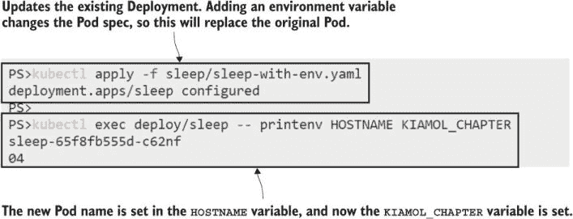

图 4.2 向 Pod 规范中添加环境变量使值在 Pod 容器中可用。

之前练习的重要之处在于新应用程序使用的是相同的 Docker 镜像；这是一个具有所有相同二进制文件的应用程序——只是在部署之间配置设置发生了变化。在 Pod 规范中直接设置环境值对于简单的设置来说是可以的，但真实的应用程序通常有更复杂的配置需求，这就是您使用 ConfigMaps 的时候。

ConfigMap 只是一个存储可以加载到 Pod 中的数据的资源。数据可以是一组键值对、一段文本或甚至是二进制文件。您可以使用键值对来加载带有环境变量的 Pods，使用文本来加载任何类型的配置文件——JSON、XML、YAML、TOML、INI——以及使用二进制文件来加载许可证密钥。一个 Pod 可以使用多个 ConfigMaps，每个 ConfigMap 也可以被多个 Pods 使用。图 4.3 展示了一些这些选项。

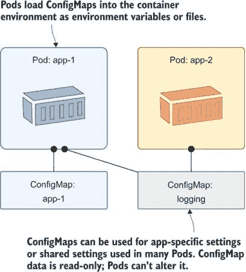

图 4.3 ConfigMaps 是独立的资源，可以附加到零个或多个 Pod 上。

我们将坚持使用简单的 sleep 部署来展示创建和使用 ConfigMaps 的基本原理。列表 4.2 显示了更新后的 Pod 规范的环境部分，它使用在 YAML 中定义的一个环境变量，以及从 ConfigMap 中加载的第二个变量。

列表 4.2 sleep-with-configMap-env.yaml，将 ConfigMap 加载到 Pod 中

```
  env:                      # The environment section of the container spec
  - name: KIAMOL_CHAPTER
    value: "04"             # This is the variable value.
  - name: KIAMOL_SECTION
    valueFrom:
      configMapKeyRef:              # This value comes from a ConfigMap.
        name: sleep-config-literal  # Names the ConfigMap
        key: kiamol.section         # Names the data item to load
```

如果在 Pod 规范中引用了 ConfigMap，则在部署 Pod 之前，ConfigMap 必须存在。此规范期望找到一个名为 `sleep-config-literal` 的 ConfigMap，其中包含数据中的键值对，并且创建它的最简单方法是通过将键和值传递给 kubectl 命令。

现在试试看 通过在命令中指定数据来创建一个 ConfigMap，然后检查数据并将更新的 sleep 应用程序部署以使用 ConfigMap。

```
# create a ConfigMap with data from the command line:
kubectl create configmap sleep-config-literal --from-literal=kiamol.section='4.1'

# check the ConfigMap details:
kubectl get cm sleep-config-literal

# show the friendly description of the ConfigMap:
kubectl describe cm sleep-config-literal

# deploy the updated Pod spec from listing 4.2:
kubectl apply -f sleep/sleep-with-configMap-env.yaml

# check the Kiamol environment variables:
kubectl exec deploy/sleep -- sh -c 'printenv | grep "^KIAMOL"'
```

在这本书中，我们不会过多使用 kubectl `describe` 命令，因为输出通常是冗长的，可能会占用整章的内容，但它确实是一个值得实验的东西。描述服务和 Pod 可以以可读的格式提供大量有用的信息。您可以在图 4.4 中看到我的输出，其中包括从描述 ConfigMap 中显示的键值数据。

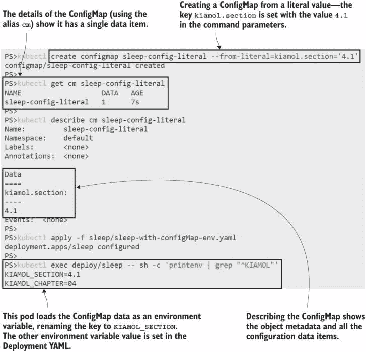

图 4.4 Pods 可以从 ConfigMaps 中加载单个数据项并重命名键。

从字面值创建 ConfigMaps 对于单个设置来说是可以的，但如果你有很多配置数据，这会很快变得繁琐。除了在命令行上指定字面值之外，Kubernetes 还允许你从文件中加载 ConfigMaps。

## 4.2 在 ConfigMaps 中存储和使用配置文件

创建和使用 ConfigMaps 的选项在许多 Kubernetes 版本中已经演变，因此现在它们几乎支持你所能想到的每一种配置变体。这些 sleep Pod 练习是展示这些变分的良好方式，但它们有点无聊，所以我们将在转向更有趣的内容之前再进行一次练习。列表 4.3 显示了一个环境文件——一个包含键值对的文本文件，可以加载以创建一个包含多个数据项的 ConfigMap。

列表 4.3 ch04.env，环境变量文件

```
# Environment files use a new line for each variable.
KIAMOL_CHAPTER=ch04
KIAMOL_SECTION=ch04-4.1
KIAMOL_EXERCISE=try it now
```

环境文件是分组多个设置的有用方式，Kubernetes 明确支持将它们加载到 ConfigMaps 中，并在 Pod 容器中将所有设置作为环境变量公开。

现在试试看 创建一个新的 ConfigMap，它由列表 4.3 中的环境文件填充，然后部署 sleep 应用程序的更新以使用新设置。

```
# load an environment variable into a new ConfigMap:
kubectl create configmap sleep-config-env-file --from-env-file=sleep/ch04.env

# check the details of the ConfigMap:
kubectl get cm sleep-config-env-file

# update the Pod to use the new ConfigMap:
kubectl apply -f sleep/sleep-with-configMap-env-file.yaml

# check the values in the container:
kubectl exec deploy/sleep -- sh -c 'printenv | grep "^KIAMOL"'
```

我的输出，如图 4.5 所示，显示 `printenv` 命令正在读取所有环境变量并显示具有 Kiamol 名称的变量，但可能不是你预期的结果。

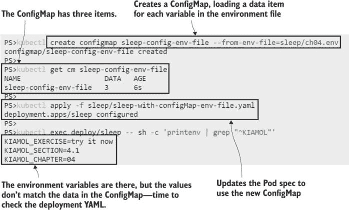

图 4.5 ConfigMap 可以有多个数据项，Pod 可以加载它们全部。

这个练习向你展示了如何从文件中创建 ConfigMap。它还展示了 Kubernetes 在应用环境变量方面有优先级规则。你刚刚部署的 Pod 规范，如列表 4.4 所示，从 ConfigMap 中加载了所有环境变量，但它还指定了一些具有相同键的显式环境值。

列表 4.4 sleep-with-configMap-env-file.yaml，Pod 中的多个 ConfigMaps

```
  env:                             # The existing environment section
  - name: KIAMOL_CHAPTER
    value: "04"
  - name: KIAMOL_SECTION
    valueFrom:
      configMapKeyRef:              
        name: sleep-config-literal
        key: kiamol.section
  envFrom:                         # envFrom loads multiple variables
  - configMapRef:                  # from a ConfigMap
      name: sleep-config-env-file
```

因此，在 Pod 规范中使用 `env` 定义的环境变量会覆盖 `envFrom` 中定义的具有重复键的值。记住这一点很有用，即你可以通过在 Pod 规范中显式设置它们来覆盖容器镜像或 ConfigMaps 中设置的任何环境变量——这是一种快速更改配置设置的方法，当你正在追踪问题时。

环境变量得到了很好的支持，但它们只能带你走这么远，并且大多数应用程序平台更喜欢一种更结构化的方法。在本章的其余练习中，我们将使用一个支持配置源层次结构的 Web 应用程序。默认设置打包在 Docker 镜像中的一个 JSON 文件中，应用程序在运行时会查找其他位置的 JSON 文件，这些文件包含覆盖默认设置的设置，并且所有 JSON 设置都可以用环境变量覆盖。列表 4.5 显示了我们将要使用的第一个部署的 Pod 规范。

列表 4.5 todo-web.yaml，一个带有配置设置的 Web 应用

```
spec:
  containers:
  - name: web
    image: kiamol/ch04-todo-list
    env:
    - name: Logging__LogLevel__Default
      value: Warning
```

这次的运行将使用镜像中 JSON 配置文件的默认设置，除了默认的日志级别，它被设置为环境变量。

现在试试看 运行应用而不进行任何额外配置，并检查其行为。

```
# deploy the app with a Service to access it:
kubectl apply -f todo-list/todo-web.yaml

# wait for the Pod to be ready:
kubectl wait --for=condition=Ready pod -l app=todo-web

# get the address of the app:
kubectl get svc todo-web -o jsonpath='http://{.status.loadBalancer.ingress[0].*}:8080'

# browse to the app and have a play around
# then try browsing to /config

# check the application logs:
kubectl logs -l app=todo-web
```

演示应用是一个简单的待办事项列表（对《一个月午餐时间学 Docker》的读者来说可能会感到令人沮丧的熟悉）。在其当前设置中，它允许你添加和查看项目，但还应该有一个 `/config` 页面，我们可以在非生产环境中使用它来查看所有配置设置。如图 4.6 所示，该页面为空，应用记录了一个警告，表明有人尝试访问它。

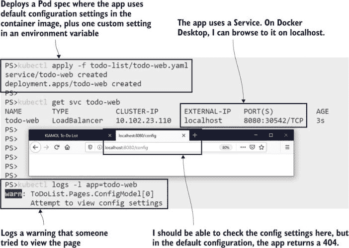

图 4.6 应用基本工作，但我们还需要设置额外的配置值。

这里使用的配置层次结构是一个非常常见的做法。如果你不熟悉它，电子书的附录 C 中的章节“容器中的应用配置管理”来自《一个月午餐时间学 Docker》，它对此进行了详细解释。这个例子是一个使用 JSON 的 .NET Core 应用，但你也会看到在 Java Spring 应用、Node.js、Go、Python 等多种文件格式中使用的类似配置系统。在 Kubernetes 中，你可以使用相同的所有应用配置方法。

+   默认应用设置已经嵌入到容器镜像中。这可能只是适用于每个环境的设置，或者可能是一个完整的配置选项集，因此无需任何额外设置，应用就可以在开发模式下运行（这对开发者来说很有帮助，他们可以用简单的 Docker `run` 命令快速启动应用）。

+   每个环境的实际设置都存储在 ConfigMap 中，并显示在容器文件系统中。Kubernetes 将配置数据作为已知位置的一个文件呈现，应用会检查并合并来自默认文件的内容。

+   需要调整的任何设置都可以作为 Deployment 的 Pod 规范中的环境变量应用。

列表 4.6 显示了待办事项应用的开发配置的 YAML 规范。它包含一个 JSON 文件的全部内容，应用将与此容器镜像中的默认 JSON 配置文件合并，并设置一个使配置页面可见的选项。

列表 4.6 todo-web-config-dev.yaml，一个 ConfigMap 规范

```
apiVersion: v1
kind: ConfigMap                  # ConfigMap is the resource type.
metadata:
  name: todo-web-config-dev      # Names the ConfigMap.
data:
  config.json: |-                # The data key is the filename.
    {                            # The file contents can be any format.
      "ConfigController": {
        "Enabled" : true
      }
    }
```

你可以将任何类型的文本配置文件嵌入到 YAML 规范中，只要你注意空格的使用。我更喜欢这种方法，因为它意味着你可以一致地使用 kubectl `apply` 命令来部署应用的所有部分。如果我想直接加载 JSON 文件，我需要使用 kubectl `create` 命令来配置资源，并使用 `apply` 命令来处理其他所有内容。

列表 4.6 中的 ConfigMap 定义只包含一个设置，但它以应用的本地配置格式存储。当我们部署更新的 Pod 规范时，该设置将被应用，并且配置页面将可见。

现在试试看 新的 Pod 规范引用了 ConfigMap，因此需要先通过应用 YAML 创建它，然后我们更新待办事项应用的 Deployment。

```
# create the JSON ConfigMap:
kubectl apply -f todo-list/configMaps/todo-web-config-dev.yaml

# update the app to use the ConfigMap:
kubectl apply -f todo-list/todo-web-dev.yaml

# refresh your web browser at the /config page for your Service 
```

你可以在图 4.7 中看到我的输出。现在配置页面正确加载了，因此新的 Deployment 配置正在合并 ConfigMap 中的设置以覆盖镜像中的默认设置，这阻止了对该页面的访问。

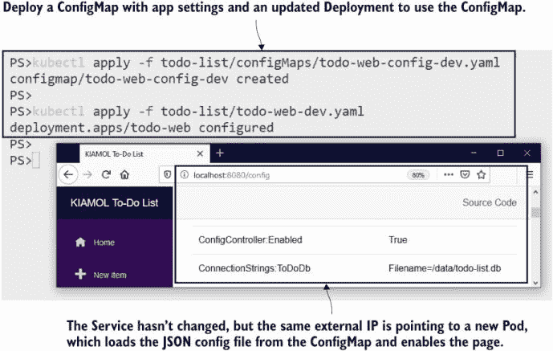

图 4.7 将 ConfigMap 数据加载到容器文件系统中，其中应用加载配置文件

这种方法需要两件事：你的应用需要能够合并 ConfigMap 数据，你的 Pod 规范需要将数据从 ConfigMap 加载到容器文件系统中的预期文件路径。我们将在下一节中看到它是如何工作的。

## 4.3 从 ConfigMap 中暴露配置数据

将配置项加载到环境变量中的替代方法是将其作为容器目录内的文件呈现。容器文件系统是一个虚拟结构，由容器镜像和其他源构建。Kubernetes 可以使用 ConfigMap 作为文件系统源——它们作为目录挂载，每个数据项对应一个文件。图 4.8 显示了你刚刚部署的设置，其中 ConfigMap 中的数据项以文件的形式呈现。

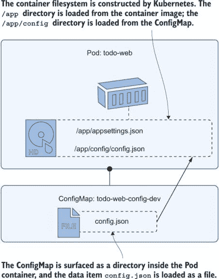

图 4.8 ConfigMap 可以作为容器文件系统中的目录加载。

Kubernetes 通过 Pod 规范的两个功能管理这种奇怪的魔法：*卷*，它使 ConfigMap 的内容可用于 Pod，以及 *卷挂载*，它将 ConfigMap 卷的内容加载到 Pod 容器中的指定路径。列表 4.7 显示了你之前练习中部署的卷和挂载。

列表 4.7 todo-web-dev.yaml，将 ConfigMap 作为卷挂载加载

```
spec:
  containers:
    - name: web
      image: kiamol/ch04-todo-list 
      volumeMounts:                  # Mounts a volume into the container
        - name: config               # Names the volume
          mountPath: "/app/config"   # Directory path to mount the volume
          readOnly: true             # Flags the volume as read-only

  volumes:                          # Volumes are defined at the Pod level.
    - name: config                  # Name matches the volume mount.
      configMap:                    # Volume source is a ConfigMap.
        name: todo-web-config-dev   # ConfigMap name
```

这里要认识到的重要事情是，ConfigMap 被当作一个目录处理，包含多个数据项，每个数据项在容器文件系统中都成为文件。在这个例子中，应用从 `/app/appsettings.json` 中的文件加载其默认设置，然后它寻找 `/app/config/config.json` 中的文件，该文件可以包含覆盖默认设置的设置。`/app/config` 目录在容器镜像中不存在；它是由 Kubernetes 创建并填充的。

现在试试看 容器文件系统对应用来说表现为一个单一的存储单元，但它是由镜像和 ConfigMap 构建的。这些源有不同的行为。

```
# show the default config file:
kubectl exec deploy/todo-web -- sh -c 'ls -l /app/app*.json'

# show the config file in the volume mount:
kubectl exec deploy/todo-web -- sh -c 'ls -l /app/config/*.json'

# check it really is read-only:
kubectl exec deploy/todo-web -- sh -c 'echo ch04 >> /app/config/config.json'
```

我的输出，如图 4.9 所示，显示应用预期的位置存在 JSON 配置文件，但 ConfigMap 文件由 Kubernetes 管理，并以只读文件的形式交付。

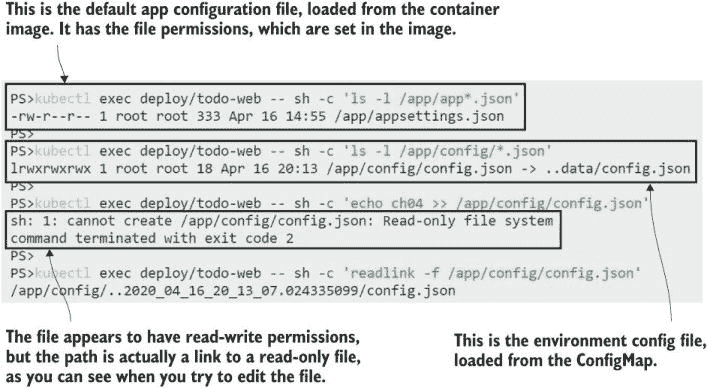

图 4.9 容器文件系统是由 Kubernetes 从镜像和 ConfigMap 构建的。

将 ConfigMap 作为目录加载是灵活的，你可以用它来支持不同的应用程序配置方法。如果你的配置分散在多个文件中，你可以将它们全部存储在一个 ConfigMap 中，并将它们全部加载到容器中。列表 4.8 展示了更新待办 ConfigMap 的数据项，其中包含两个 JSON 文件，分别用于应用程序行为和日志记录的设置。

列表 4.8 todo-web-config-dev-with-logging.yaml，一个包含两个文件的 ConfigMap

```
data:
  config.json: |-                     # The original app config file
    {
      "ConfigController": {
        "Enabled" : true
      }
    }
  logging.json: |-                    # A second JSON file, which will be
    {                                 # surfaced in the volume mount
      "Logging": {
        "LogLevel": {
          "ToDoList.Pages" : "Debug"
        }
      }
    }
```

当你部署一个正在使用的 ConfigMap 的更新时会发生什么？Kubernetes 将更新后的文件传递到容器中，但接下来发生什么取决于应用程序。一些应用程序在启动时将配置文件加载到内存中，然后忽略配置目录中的任何更改，因此更改 ConfigMap 不会实际更改应用程序配置，直到 Pod 被替换。这个应用程序更加周到——它会监视配置目录并重新加载任何文件更改，因此部署到 ConfigMap 的更新将更新应用程序配置。

现在试试看 使用列表 4.9 中的 ConfigMap 更新应用程序配置。这将提高日志级别，因此相同的 Pod 现在将开始写入更多的日志条目。

```
# check the current app logs:
kubectl logs -l app=todo-web

# deploy the updated ConfigMap:
kubectl apply -f todo-list/configMaps/todo-web-config-dev-with-logging.yaml

# wait for the config change to make it to the Pod:
sleep 120

# check the new setting:
kubectl exec deploy/todo-web -- sh -c 'ls -l /app/config/*.json'

# load a few pages from the site at your Service IP address

# check the logs again:
kubectl logs -l app=todo-web
```

你可以在图 4.10 中看到我的输出。这里的 sleep 是为了给 Kubernetes API 时间将新的配置文件滚动到 Pod；几分钟之后，新的配置被加载，应用程序以增强的日志记录方式运行。

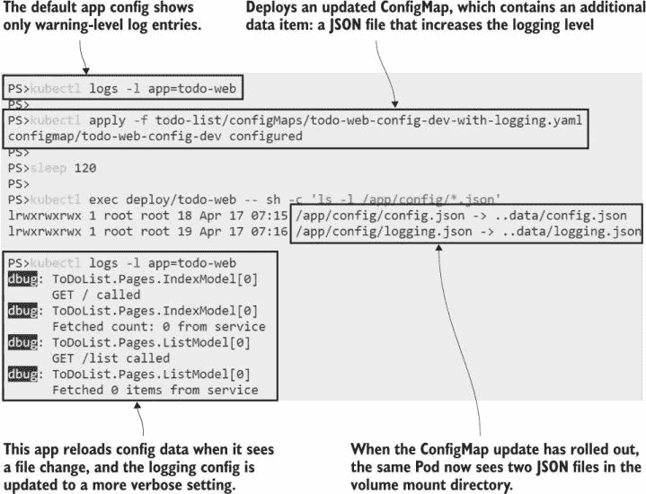

图 4.10 ConfigMap 数据被缓存，因此更新需要几分钟才能到达 Pod。

卷是一个强大的选项，用于加载配置文件，特别是对于这种对更改做出反应并实时更新设置的应用程序。在不重启应用程序的情况下提高日志级别，有助于追踪问题。然而，你需要小心配置，因为卷挂载不一定按你预期的样子工作。如果卷的挂载路径已经在容器镜像中存在，那么 ConfigMap 目录将覆盖它，替换所有内容，这可能导致你的应用程序以令人兴奋的方式失败。列表 4.9 展示了一个例子。

列表 4.9 todo-web-dev-broken.yaml，一个配置错误的 Pod 规范

```
spec:
  containers:
    - name: web
      image: kiamol/ch04-todo-list   
      volumeMounts:
        - name: config                  # Mounts the ConfigMap volume
          mountPath: "/app"             # Overwrites the directory
```

这是一个损坏的 Pod 规范，其中 ConfigMap 被加载到 `/app` 目录而不是 `/app/config` 目录。作者可能本意是想合并这两个目录，将 JSON 配置文件添加到现有的应用程序目录中。然而，它将会清除应用程序的二进制文件。

现在试试看 列表 4.9 中的 Pod 规范移除了所有应用程序的二进制文件，所以替换后的 Pod 不会启动。看看接下来会发生什么。

```
# deploy the badly configured Pod:
kubectl apply -f todo-list/todo-web-dev-broken.yaml

# browse back to the app and see how it looks

# check the app logs:
kubectl logs -l app=todo-web

# and check the Pod status:
kubectl get pods -l app=todo-web
```

这里得到的结果很有趣：部署破坏了应用，但应用仍在继续工作。这是 Kubernetes 在为你留意。应用更改创建了一个新的 Pod，但该 Pod 中的容器立即因为错误而退出，因为它试图加载的二进制文件不再存在于应用目录中。Kubernetes 重启容器几次以给它一个机会，但它一直失败。尝试了三次后，Kubernetes 休息一下，如图 4.11 所示。

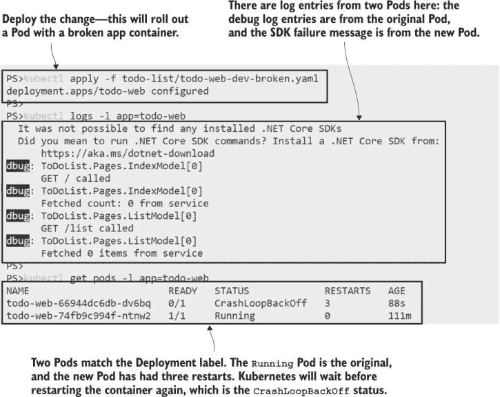

图 4.11 如果更新的部署失败，则原始 Pod 不会被替换。

现在我们有两个 Pod，但 Kubernetes 不会删除旧的 Pod，直到替换的 Pod 成功运行，但在这个情况下永远不会发生，因为我们破坏了容器设置。旧的 Pod 没有被删除，仍然愉快地处理请求；新的 Pod 处于失败状态，但 Kubernetes 定期重启容器，希望它可能已经修复了自己。这是一个需要注意的情况：`apply` 命令似乎工作正常，应用仍在继续工作，但它没有使用你应用的模式。

我们现在将修复它，并展示在容器文件系统中暴露 ConfigMaps 的最后一个选项。你可以选择性地将数据项加载到目标目录中，而不是将每个数据项作为自己的文件加载。列表 4.10 显示了更新的 Pod 规范。挂载路径已经修复，但卷被设置为仅传递一个项目。

列表 4.10 todo-web-dev-no-logging.yaml，挂载单个 ConfigMap 项目

```
spec:
  containers:
    - name: web
      image: kiamol/ch04-todo-list
      volumeMounts:
        - name: config                # Mounts the ConfigMap volume
          mountPath: "/app/config"    # to the correct direcory
          readOnly: true
  volumes:
    - name: config
      configMap:
        name: todo-web-config-dev     # Loads the ConfigMap volume
        items:                        # Specifies the data items to load
        - key: config.json            # Loads the config.json item
          path: config.json           # Surfaces it as the file config.json
```

这个规范使用相同的 ConfigMap，因此它只是对部署的更新。这将是一个级联更新：它将创建一个新的 Pod，该 Pod 将正确启动，然后 Kubernetes 将删除两个之前的 Pod。

现在尝试一下：部署列表 4.10 中的规范，该规范将更新卷挂载以修复应用，但同时也忽略了 ConfigMap 中的日志 JSON 文件。

```
# apply the change:
kubectl apply -f todo-list/todo-web-dev-no-logging.yaml

# list the config folder contents:
kubectl exec deploy/todo-web -- sh -c 'ls /app/config'

# now browse to a few pages on the app

# check the logs:
kubectl logs -l app=todo-web

# and check the Pods:
kubectl get pods -l app=todo-web
```

图 4.12 展示了我的输出。应用再次工作，但它只看到一个配置文件，因此增强的日志设置没有得到应用。

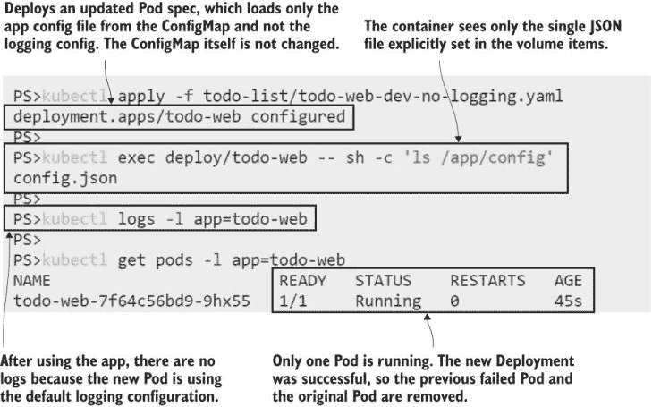

图 4.12 卷可以将 ConfigMap 中的选定项目暴露到挂载目录中。

ConfigMaps 支持广泛的配置系统。在环境变量和卷挂载之间，你应该能够在 ConfigMaps 中存储应用设置，并以应用期望的方式应用它们。配置规范与应用规范之间的分离也支持不同的发布工作流程，允许不同的团队拥有流程的不同部分。然而，你不应该使用 ConfigMaps 来存储任何敏感数据——它们实际上是没有任何额外安全语义的文本文件的包装器。对于需要保持安全性的配置数据，Kubernetes 提供了 Secrets。

## 4.4 使用 Secrets 配置敏感数据

Secrets 是一种独立的资源类型，但它们具有与 ConfigMaps 相似的 API。您以相同的方式与它们交互，但由于它们旨在存储敏感信息，Kubernetes 以不同的方式管理它们。主要区别都围绕着最小化暴露。Secrets 仅发送给需要使用它们的节点，并且存储在内存中而不是磁盘上；Kubernetes 还支持对 Secrets 进行传输和静止加密。

尽管 Secrets 并非总是加密的。任何可以访问您集群中 Secret 对象的用户都可以读取未加密的值。有一个混淆层：Kubernetes 可以使用 Base64 编码读取和写入 Secret 数据，这并不是真正的安全功能，但可以防止秘密意外暴露给在您身后窥视的人。

现在尝试一下 您可以从字面值创建 Secrets，通过将键和数据传递给 kubectl 命令。检索到的数据是 Base64 编码的。

```
# FOR WINDOWS USERS--this script adds a Base64 command to your session: 
. .\base64.ps1

# now create a secret from a plain text literal:
kubectl create secret generic sleep-secret-literal --from-literal=secret=shh...

# show the friendly details of the Secret:
kubectl describe secret sleep-secret-literal

# retrieve the encoded Secret value:
kubectl get secret sleep-secret-literal -o jsonpath='{.data.secret}'

# and decode the data:
kubectl get secret sleep-secret-literal -o jsonpath='{.data.secret}' | base64 -d
```

您可以从图 4.13 的输出中看到，Kubernetes 对待 Secrets 和 ConfigMaps 的方式不同。数据值在 kubectl `describe`命令中不会显示，只有项目键的名称，并且当您实际获取数据时，它会以编码的形式显示，因此您需要将其传递到解码器中才能读取。

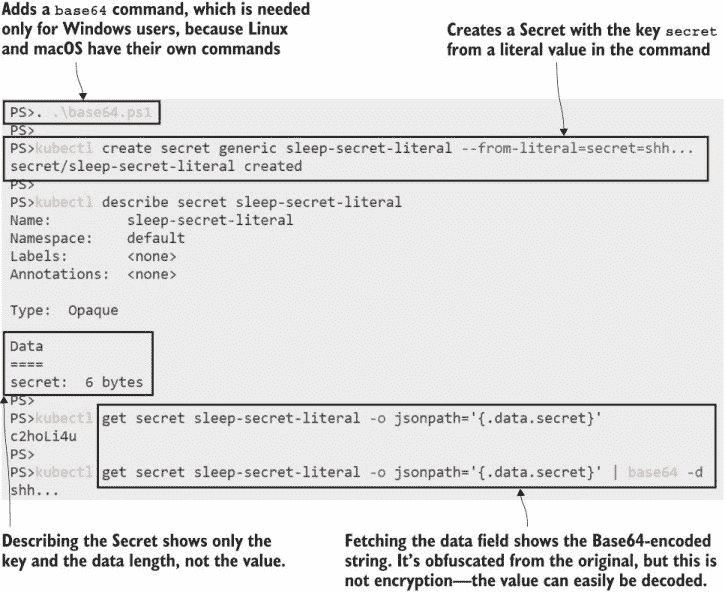

图 4.13 显示，Secrets 与 ConfigMaps 具有相似的 API，但 Kubernetes 试图避免意外暴露。

当 Secrets 在 Pod 容器内部暴露时，这种预防措施不适用。容器环境看到的是原始的纯文本数据。列表 4.11 显示了返回到 sleep 应用程序，配置为将新的 Secret 作为环境变量加载。

列表 4.11 sleep-with-secret.yaml，一个加载 Secret 的 Pod 规范

```
spec:
  containers:
    - name: sleep
      image: kiamol/ch03-sleep
      env:                                # Environment variables
      - name: KIAMOL_SECRET               # Variable name in the container
        valueFrom:                        # loaded from an external source
          secretKeyRef:                   # which is a Secret
            name: sleep-secret-literal    # Names the Secret
            key: secret                   # Key of the Secret data item
```

消费 Secrets 的规范几乎与 ConfigMaps 相同——一个命名环境变量可以从 Secret 中的命名项中加载。此 Pod 规范以原始形式将 Secret 项传递到容器中。

现在尝试一下 运行一个简单的 sleep Pod，它使用 Secret 作为环境变量。

```
# update the sleep Deployment:
kubectl apply -f sleep/sleep-with-secret.yaml

# check the environment variable in the Pod:
kubectl exec deploy/sleep -- printenv KIAMOL_SECRET
```

图 4.14 展示了输出结果。在这种情况下，Pod 仅使用了一个 Secret，但 Secrets 和 ConfigMaps 可以在同一个 Pod 规范中混合使用，填充环境变量或文件或两者兼而有之。

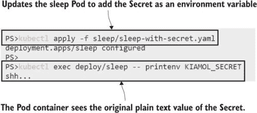

图 4.14 显示，加载到 Pod 中的 Secrets 不是 Base64 编码的。

您应该小心将 Secrets 加载到环境变量中。保护敏感数据的关键在于最小化其暴露。环境变量可以从 Pod 容器中的任何进程中读取，并且一些应用程序平台在遇到关键错误时会记录所有环境变量的值。另一种选择是将 Secrets 作为文件暴露出来，如果应用程序支持的话，这为您提供了使用文件权限来保护访问权限的选项。

为了结束本章，我们将以不同的配置运行待办事项应用程序，其中它使用单独的数据库来存储项目，在它自己的 Pod 中运行。数据库服务器是 Postgres，使用 Docker Hub 上的官方镜像，它从环境中的配置值读取登录凭证。列表 4.12 显示了创建数据库密码作为秘密的 YAML 规范。

列表 4.12 -todo-db-secret-test.yaml，数据库用户的秘密

```
apiVersion: v1
kind: Secret                            # Secret is the resource type.
metadata:
  name: todo-db-secret-test             # Names the Secret
type: Opaque                            # Opaque secrets are for text data.
stringData:                             # stringData is for plain text.
  POSTGRES_PASSWORD: "kiamol-2*2*"      # The secret key and value.
```

此方法在`stringData`字段中以纯文本形式声明密码，当创建秘密时，该密码会被编码为 Base64。使用 YAML 文件作为秘密会带来一个棘手的问题：它提供了一个非常好的一致部署方法，但代价是所有敏感数据都可见于源代码控制。

在生产场景中，你会将真实数据从 YAML 文件中移除，使用占位符代替，并在部署过程中进行一些额外的处理——例如，从 GitHub 秘密中注入数据到占位符。无论你采取哪种方法，请记住，一旦秘密存在于 Kubernetes 中，任何有权访问的人都可以轻松地读取其值。

现在试试看：从列表 4.12 中的清单创建一个秘密，并检查数据。

```
# deploy the Secret:
kubectl apply -f todo-list/secrets/todo-db-secret-test.yaml

# check the data is encoded:
kubectl get secret todo-db-secret-test -o                  
   jsonpath='{.data.POSTGRES_PASSWORD}'

# see what annotations are stored:
kubectl get secret todo-db-secret-test -o 
   jsonpath='{.metadata.annotations}'
```

你可以在图 4.15 中看到字符串被编码为 Base64。结果与如果规范使用了正常的数据字段并在 YAML 中直接以 Base64 设置密码值是相同的。

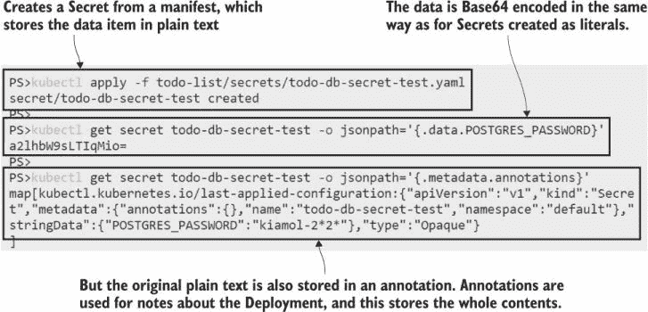

图 4.15 从字符串数据创建的秘密被编码，但原始数据也存储在对象中。

要将此秘密作为 Postgres 密码使用，镜像为我们提供了几个选项。我们可以将值加载到名为`POSTGRES_PASSWORD`的环境变量中——这不是最佳选择——或者我们可以将其加载到文件中，并通过设置`POSTGRES_PASSWORD_FILE`环境变量告诉 Postgres 在哪里加载该文件。使用文件意味着我们可以在卷级别控制访问权限，这就是代码列表 4.13 中数据库的配置方式。

列表 4.13 todo-db-test.yaml，一个从秘密挂载卷的 Pod 规范

```
spec:
  containers:
    - name: db
      image: postgres:11.6-alpine
      env:
      - name: POSTGRES_PASSWORD_FILE       # Sets the path to the file
        value: /secrets/postgres_password
      volumeMounts:                        # Mounts a Secret volume
        - name: secret                     # Names the volume
          mountPath: "/secrets"            
  volumes:
    - name: secret
      secret:                             # Volume loaded from a Secret 
        secretName: todo-db-secret-test   # Secret name
        defaultMode: 0400                 # Permissions to set for files
        items:                            # Optionally names the data items 
        - key: POSTGRES_PASSWORD  
          path: postgres_password
```

当此 Pod 部署时，Kubernetes 将秘密项的值加载到路径为/secrets/postgres_password 的文件中。该文件将设置为 0400 权限，这意味着它只能被容器用户读取，不能被任何其他用户读取。为 Postgres 设置环境变量，以便从该文件加载密码，该密码 Postgres 用户可以访问，因此数据库将使用从秘密设置的凭据启动。

现在试试看：部署数据库 Pod，并验证数据库是否正确启动。

```
# deploy the YAML from listing 4.13
kubectl apply -f todo-list/todo-db-test.yaml

# check the database logs:
kubectl logs -l app=todo-db --tail 1

# verify the password file permissions:
kubectl exec deploy/todo-db -- sh -c 'ls -l $(readlink -f /secrets/postgres_password)'
```

图 4.16 显示了数据库正在启动并等待连接——表明它已正确配置——并且最终输出验证了文件权限已设置为预期。

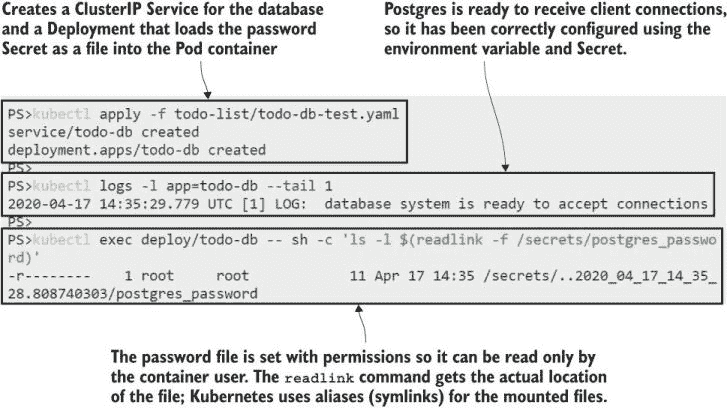

图 4.16 如果应用程序支持，配置设置可以通过从秘密中填充的文件读取。

剩下的只是以测试配置运行应用程序本身，因此它连接到 Postgres 数据库而不是使用本地数据库文件进行存储。为此需要更多的 YAML，以创建 ConfigMap、Secret、Deployment 和服务，但这些都是我们已经介绍过的功能，所以我们直接部署。

现在尝试一下 运行待办事项应用程序，使其使用 Postgres 数据库进行存储。

```
# the ConfigMap configures the app to use Postgres:
kubectl apply -f todo-list/configMaps/todo-web-config-test.yaml

# the Secret contains the credentials to connect to Postgres:
kubectl apply -f todo-list/secrets/todo-web-secret-test.yaml

# the Deployment Pod spec uses the ConfigMap and Secret:
kubectl apply -f todo-list/todo-web-test.yaml

# check the database credentials are set in the app:
kubectl exec deploy/todo-web-test -- cat /app/secrets/secrets.json

# browse to the app and add some items
```

我的结果如图 4.17 所示，其中 Secret JSON 文件的纯文本内容显示在 Web Pod 容器内。

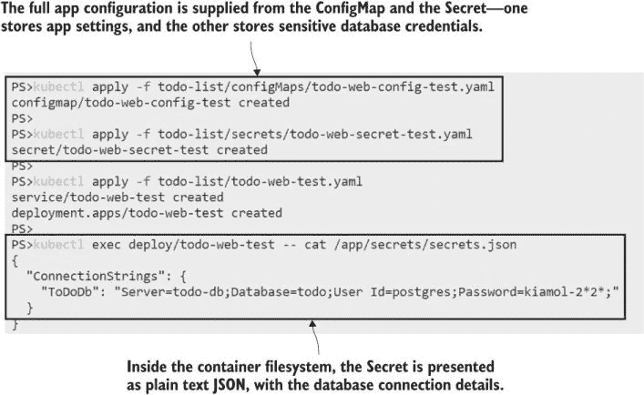

图 4.17 将应用程序配置加载到 Pod 中，并将 ConfigMaps 和 Secrets 作为 JSON 文件暴露出来

现在当您在应用程序中添加待办事项时，它们将存储在 Postgres 数据库中，因此存储与应用程序运行时分离。您可以删除 Web Pod；其控制器将启动具有相同配置的替换 Pod，该 Pod 连接到相同的数据库 Pod，因此原始 Web Pod 的所有数据仍然可用。

这是对 Kubernetes 中配置选项的相当详尽的审视。原则相当简单——将 ConfigMaps 或 Secrets 加载到环境变量或文件中——但是有很多变体。您需要很好地理解这些细微差别，以便以一致的方式管理应用程序配置，即使您的应用程序都具有不同的配置模型。

## 4.5 在 Kubernetes 中管理应用程序配置

Kubernetes 为您提供了使用适合您组织的任何工作流程来管理应用程序配置的工具。核心要求是您的应用程序从环境中读取配置设置，理想情况下具有文件和环境变量的层次结构。然后您可以使用 ConfigMaps 和 Secrets 来支持您的部署过程。在设计时，您需要考虑两个因素：您是否需要应用程序响应实时配置更新，以及您将如何管理 Secrets？

如果对于您来说，无需替换 Pod 的实时更新很重要，那么您的选择有限。您不能使用环境变量进行设置，因为对那些变量的任何更改都会导致 Pod 替换。您可以使用卷挂载并从文件中加载配置更改，但您需要通过更新现有的 ConfigMap 或 Secret 对象来部署更改。您不能更改卷以指向新的配置对象，因为这同样属于 Pod 替换。

更新相同配置对象的一种替代方案是在对象名称中包含某种版本控制方案，每次部署一个新对象，并将应用的部署更新为引用新对象。您将失去实时更新，但可以获得配置更改的审计跟踪，并且可以轻松地恢复到以前的设置。图 4.18 显示了这些选项。

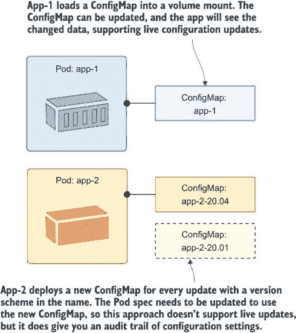

图 4.18 您可以选择自己的配置管理方法，由 Kubernetes 支持。

另一个问题是如何管理敏感数据。大型组织可能拥有专门的配置管理团队，负责部署配置文件的过程。这与对 ConfigMaps 和 Secrets 的版本化方法非常吻合，配置管理团队在部署之前从字面值或受控文件中部署新对象。

另一个选择是完全自动化的部署，其中 ConfigMaps 和 Secrets 从源控制中的 YAML 模板创建。YAML 文件包含占位符而不是敏感数据，在应用之前，部署过程将它们替换为从安全存储（如 Azure KeyVault）中的实际值。图 4.19 比较了这些选项。

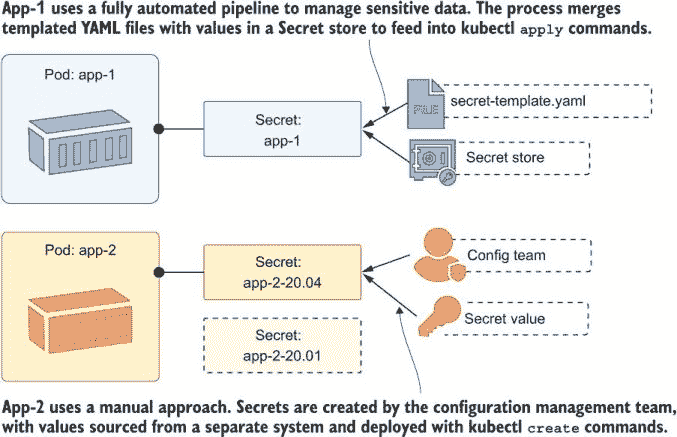

图 4.19 在部署中可以自动化管理密钥，或者由一个独立的团队严格控制。

你可以使用适合你团队和应用程序堆栈的任何方法，记住目标是从平台加载所有配置设置，因此相同的容器镜像在所有环境中部署。

是时候清理你的集群了。如果你已经跟随所有的练习（当然你做到了！），你将有一二十个资源需要移除。我将介绍一些 kubectl 的有用功能来帮助你清理所有内容。

现在试试看 kubectl `delete` 命令可以读取 YAML 文件并删除文件中定义的资源。如果你在目录中有多个 YAML 文件，你可以使用目录名作为`delete`（或`apply`）的参数，它将运行所有文件。

```
# delete all the resources in all the files in all the directories:
kubectl delete -f sleep/
kubectl delete -f todo-list/
kubectl delete -f todo-list/configMaps/
kubectl delete -f todo-list/secrets/
```

## 4.6 实验室

如果你被 Kubernetes 提供的配置应用选项搞得晕头转向，这个实验室将帮助你。在实践中，你的应用将有自己的配置管理想法，你需要根据你的应用期望的配置方式来建模你的 Kubernetes 部署。这就是在这个实验室中一个简单的名为 Adminer 的应用需要做的事情。让我们开始吧：

+   Adminer，一个用于管理 SQL 数据库的 Web UI，当你在调试数据库问题时，在 Kubernetes 中运行它可能是一个方便的工具。

+   首先，部署`ch04/lab/postgres`文件夹中的 YAML 文件，然后部署`ch04/lab/adminer.yaml`文件以在基本状态下运行 Adminer。

+   找到你的 Adminer 服务的公网 IP，并浏览到端口 8082。请注意，你需要指定一个数据库服务器，并且 UI 设计卡在 20 世纪 90 年代。你可以通过使用`postgres`作为数据库名称、用户名和密码来确认与 Postgres 的连接。

+   你的任务是创建并使用一些配置对象在 Adminer 部署中，以便数据库服务器名称默认为实验室的 Postgres 服务，并且 UI 使用名为`price`的更美观的设计。

+   你可以在名为`ADMINER_DEFAULT_SERVER`的环境变量中设置默认数据库服务器。让我们称这些为敏感数据，因此它们应该使用密钥。

+   UI 设计设置在环境变量`ADMINER_DESIGN`中；这不是敏感信息，所以使用 ConfigMap 就足够好了。

这需要一点调查和对如何展示配置设置的思考，因此这对于实际应用程序的配置来说是一个好的实践。我的解决方案已发布在 GitHub 上，供您检查您的方案：[`github.com/sixeyed/kiamol/blob/master/ch04/lab/README.md`](https://github.com/sixeyed/kiamol/blob/master/ch04/lab/README.md).
