# 5 使用卷、挂载和声明存储数据

在集群环境中访问数据很困难。移动计算资源是容易的部分——Kubernetes API 始终与节点保持联系，如果一个节点停止响应，那么 Kubernetes 可以假设它已离线，并在其他节点上启动所有 Pod 的替代品。但如果 Pod 中的应用程序在节点上存储了数据，那么在另一个节点上启动的替代品将无法访问这些数据，如果这些数据包含一个客户尚未完成的大订单，那将令人失望。你真的需要集群级别的存储，这样 Pod 就可以从任何节点访问相同的数据。

Kubernetes 没有内置的集群级存储，因为没有一种解决方案适用于所有场景。应用程序有不同的存储需求，而可以运行 Kubernetes 的平台有不同的存储能力。数据始终是访问速度和持久性之间的平衡，Kubernetes 通过允许你定义集群提供的不同存储类别以及为你的应用程序请求特定的存储类别来支持这一点。在本章中，你将学习如何处理不同类型的存储以及 Kubernetes 如何抽象存储实现细节。

## 5.1 Kubernetes 如何构建容器文件系统

Pod 中的容器由 Kubernetes 使用多个来源构建其文件系统。容器镜像提供文件系统的初始内容，每个容器都有一个可写存储层，它使用该层来写入新文件或更新镜像中的任何文件。（Docker 镜像为只读，因此当容器从镜像更新文件时，它实际上是在更新其自己的可写层中的文件副本。）图 5.1 显示了在 Pod 内部的外观。

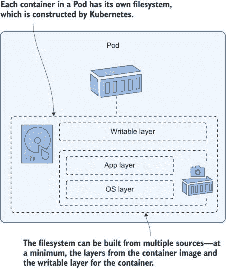

图 5.1 容器并不知道，但它们的文件系统是一个虚拟结构，由 Kubernetes 构建。

在容器中运行的应用程序只看到一个它有读写访问的单个文件系统，所有这些层细节都被隐藏起来。这对于将应用程序迁移到 Kubernetes 来说很好，因为它们不需要更改就可以在 Pod 中运行。但如果你应用程序确实写入数据，你需要了解它们如何使用存储，并设计你的 Pod 以支持它们的需求。否则，你的应用程序看起来似乎运行良好，但当你遇到任何意外情况时（如 Pod 使用新的容器重启），你将面临数据丢失的风险。

现在试试看 如果容器中的应用程序崩溃并退出，Pod 将启动一个替代品。新的容器将使用容器镜像的文件系统和一个新的可写层开始，并且前一个容器在其可写层中写入的任何数据都将消失。

```
# switch to this chapter’s exercise directory:
cd ch05

# deploy a sleep Pod:
kubectl apply -f sleep/sleep.yaml

# write a file inside the container:
kubectl exec deploy/sleep -- sh -c 'echo ch05 > /file.txt; ls /*.txt'

# check the container ID:
kubectl get pod -l app=sleep -o jsonpath='{.items[0].status.containerStatuses[0].containerID}'
# kill all processes in the container, causing a Pod restart:
kubectl exec -it deploy/sleep -- killall5

# check the replacment container ID:
kubectl get pod -l app=sleep -o jsonpath='{.items[0].status.containerStatuses[0].containerID}'

# look for the file you wrote--it won’t be there:
kubectl exec deploy/sleep -- ls /*.txt
```

记住这个练习中的两个重要事项：Pod 容器的文件系统具有容器的生命周期，而不是 Pod 的生命周期，当 Kubernetes 提到 Pod 重启时，它实际上是指替换容器。如果你的应用程序在容器内部愉快地写入数据，这些数据不会在 Pod 级别存储——如果 Pod 使用新的容器重启，所有数据都会丢失。图 5.2 中的我的输出显示了这一点。

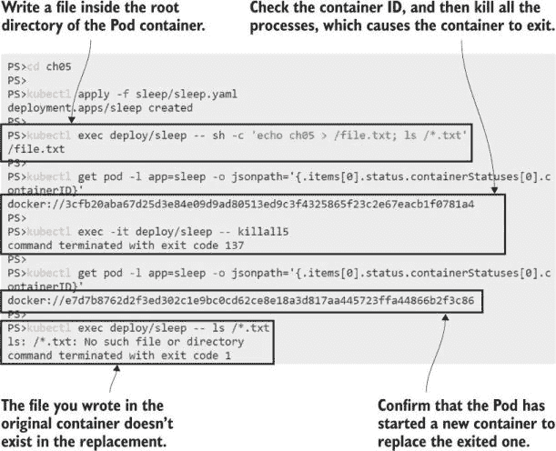

图 5.2 可写层具有容器的生命周期，而不是 Pod 的生命周期。

我们已经知道 Kubernetes 可以从其他来源构建容器文件系统——我们在第四章中介绍了 ConfigMaps 和 Secrets 到文件系统目录的映射。那个机制是在 Pod 级别定义一个卷，使另一个存储源可用，然后将其挂载到容器文件系统中的指定路径。ConfigMaps 和 Secrets 是只读存储单元，但 Kubernetes 支持许多其他可写类型的卷。图 5.3 显示了如何设计一个 Pod，该 Pod 使用卷存储在重启之间持久化的数据，甚至可能在整个集群中可访问。

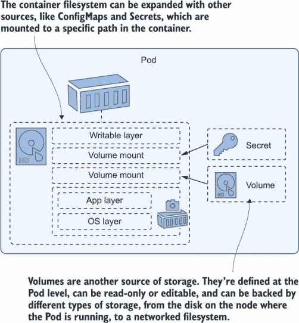

图 5.3 虚拟文件系统可以从引用外部存储单元的卷构建。

我们将在本章后面讨论集群范围内的卷，但到目前为止，我们将从一个更简单的卷类型开始，这种类型在许多场景中仍然很有用。列表 5.1 展示了使用一种称为`EmptyDir`的卷类型的 Pod 规范，它只是一个空目录，但它存储在 Pod 级别而不是容器级别。它被挂载为卷进入容器，因此作为一个目录可见，但它不是镜像或容器层之一。

列表 5.1 sleep-with-emptyDir.yaml，一个简单的卷规范

```
spec:
  containers:
    - name: sleep
      image: kiamol/ch03-sleep
      volumeMounts:
       - name: data                 # Mounts a volume called data
          mountPath: /data          # into the /data directory
  volumes:
    - name: data                    # This is the data volume spec,
      emptyDir: {}                  # which is the EmptyDir type.
```

一个空目录听起来像是你可以想象的最无用的存储部分，但实际上它有很多用途，因为它具有与 Pod 相同的生命周期。存储在`EmptyDir`卷中的任何数据在重启之间都保留在 Pod 中，因此替换容器可以访问其前任写入的数据。

现在尝试一下：使用列表 5.1 中的规范更新 sleep 部署，添加一个`EmptyDir`卷。现在你可以写入数据并杀死容器，替换容器可以读取这些数据。

```
# update the sleep Pod to use an EmptyDir volume:
kubectl apply -f sleep/sleep-with-emptyDir.yaml

# list the contents of the volume mount:
kubectl exec deploy/sleep -- ls /data

# create a file in the empty directory:
kubectl exec deploy/sleep -- sh -c 'echo ch05 > /data/file.txt; ls /data'

# check the container ID:
kubectl get pod -l app=sleep -o jsonpath='{.items[0].status.containerStatuses[0].containerID}'

# kill the container processes:
kubectl exec deploy/sleep -- killall5

# check replacement container ID:
kubectl get pod -l app=sleep -o jsonpath='{.items[0].status.containerStatuses[0].containerID}'

# read the file in the volume:
kubectl exec deploy/sleep -- cat /data/file.txt
```

你可以在图 5.4 中看到我的输出。容器只看到文件系统中的一个目录，但它指向的是 Pod 的一部分存储单元。

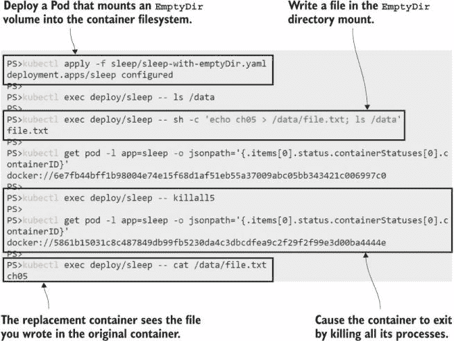

图 5.4 像空目录这样基本的东西仍然很有用，因为它可以被容器共享。

你可以使用`EmptyDir`卷为任何使用文件系统进行临时存储的应用程序——也许你的应用程序调用一个 API，该 API 需要几秒钟才能响应，而响应在很长时间内都是有效的。应用程序可能会将 API 响应保存在本地文件中，因为从磁盘读取比重复调用 API 更快。`EmptyDir`卷是本地缓存的合理来源，因为如果应用程序崩溃，替换的容器仍然会有缓存的文件，并仍然从速度提升中受益。

`EmptyDir`卷仅与 Pod 的生命周期共享，所以如果 Pod 被替换，则新的 Pod 将以一个空目录开始。如果你想让数据在 Pod 之间持久化，那么你可以挂载其他类型的卷，这些卷有自己的生命周期。

## 5.2 在节点上使用卷和挂载存储数据

这就是为什么与数据打交道比与计算打交道更复杂，因为我们需要考虑数据是否会绑定到特定的节点——这意味着任何替换的 Pod 都需要在该节点上运行才能看到数据，或者数据是否具有集群级别的访问权限，Pod 可以在任何节点上运行。Kubernetes 支持许多变体，但你需要知道你想要什么以及你的集群支持什么，并为 Pod 指定这些。

最简单的存储选项是使用映射到节点上目录的卷，因此当容器写入卷挂载时，数据实际上存储在节点磁盘上的一个已知目录中。我们将通过运行一个使用`EmptyDir`卷进行缓存数据的真实应用程序来演示这一点，了解其局限性，然后将其升级为使用节点级存储。

现在试试这个运行一个使用代理组件来提高性能的 Web 应用程序。Web 应用程序在一个带有内部 Service 的 Pod 中运行，代理在另一个 Pod 中运行，该 Pod 在 LoadBalancer Service 上公开。

```
# deploy the Pi application:
kubectl apply -f pi/v1/ 

# wait for the web Pod to be ready:
kubectl wait --for=condition=Ready pod -l app=pi-web

# find the app URL from your LoadBalancer:
kubectl get svc pi-proxy -o jsonpath='http://{.status.loadBalancer.ingress[0].*}:8080/?dp=30000'

# browse to the URL, wait for the response then refresh the page

# check the cache in the proxy
kubectl exec deploy/pi-proxy -- ls -l /data/nginx/cache
```

这是对 Web 应用程序的一种常见配置，其中代理通过直接从其本地缓存提供响应来提高性能，这也有助于减少 Web 应用程序的负载。你可以在图 5.5 中看到我的输出。第一次 Pi 计算响应时间超过一秒，而刷新几乎是瞬间的，因为它是从代理那里来的，不需要计算。

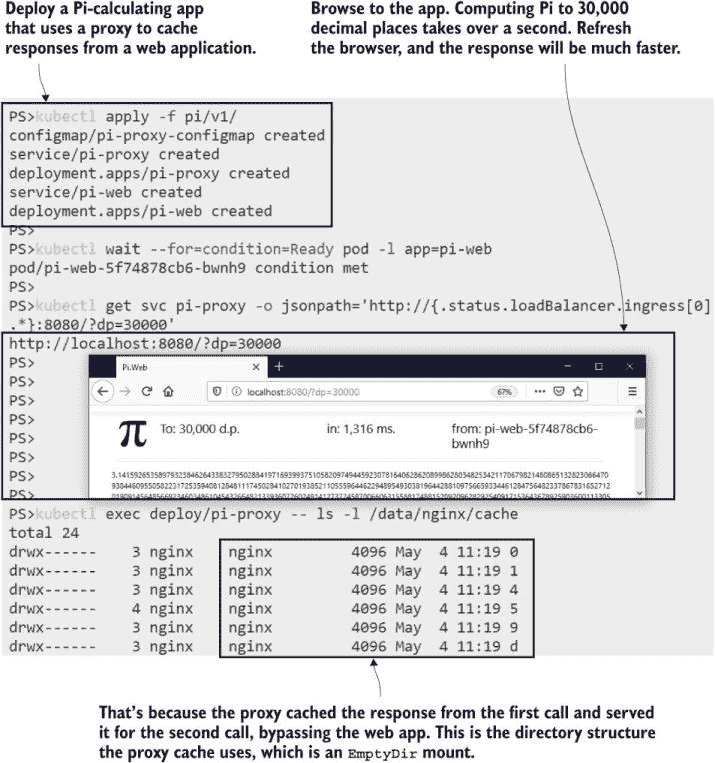

图 5.5 在`EmptyDir`卷中缓存文件意味着缓存在 Pod 重启时仍然存在。

对于这种应用程序，`EmptyDir`卷可能是一个合理的方法，因为存储在卷中的数据不是关键的。如果 Pod 重启，则缓存会保留，新的代理容器可以提供由前一个容器缓存的响应。如果 Pod 被替换，则缓存会丢失。替换的 Pod 以一个空的缓存目录开始，但缓存不是必需的——应用程序仍然可以正确运行；只是它开始时速度较慢，直到缓存再次被填满。

现在尝试一下。移除代理 Pod。由于它由部署控制器管理，因此将被替换。替换过程从一个新的 `EmptyDir` 卷开始，对于此应用程序而言，这意味着一个空的代理缓存，因此请求将直接发送到 Web Pod。

```
# delete the proxy Pod: 
kubectl delete pod -l app=pi-proxy

# check the cache directory of the replacement Pod:
kubectl exec deploy/pi-proxy -- ls -l /data/nginx/cache

# refresh your browser at the Pi app URL
```

我的输出显示在图 5.6 中。结果是相同的，但我不得不等待另一秒钟，因为 Web 应用程序需要时间来计算，因为替换代理 Pod 是没有缓存启动的。

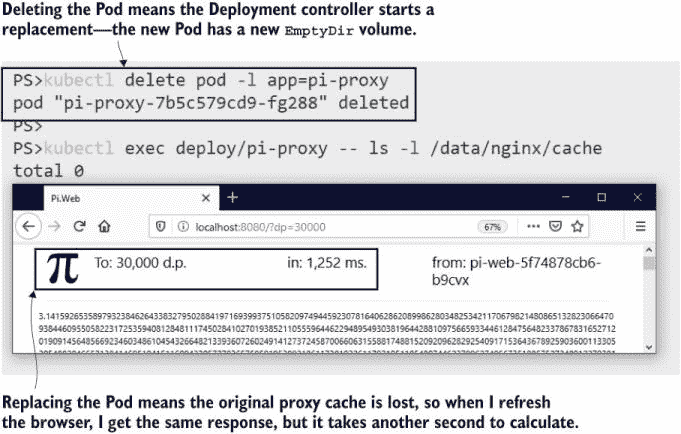

图 5.6 一个新的 Pod 以一个新的空目录开始。

下一个耐用级别来自于使用映射到节点磁盘上目录的卷，Kubernetes 称之为 `HostPath` 卷。`HostPath` 作为 Pod 中的卷指定，并以通常的方式挂载到容器文件系统。当容器将数据写入挂载目录时，实际上是在节点磁盘上写入。图 5.7 显示了节点、Pod 和卷之间的关系。

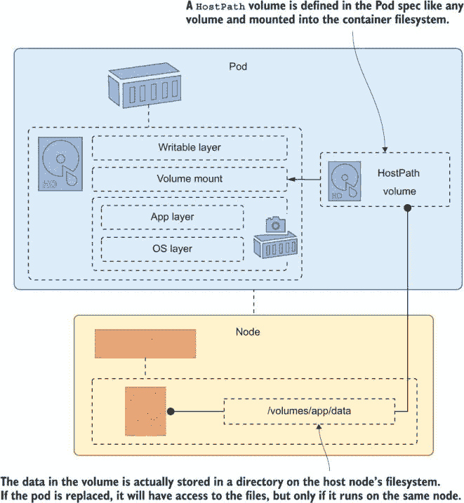

图 5.7 `HostPath` 卷在 Pod 替换之间保持数据，但前提是 Pods 使用同一节点。

`HostPath` 卷可能很有用，但你需要了解它们的限制。数据实际上存储在节点上，就是这样。Kubernetes 不会神奇地将这些数据复制到集群中的所有其他节点。列表 5.2 显示了一个更新后的 Web 代理 Pod 规范，它使用 `HostPath` 卷而不是 `EmptyDir`。当代理容器将缓存文件写入 `/data/nginx/cache` 时，它们实际上会被存储在节点上的 `/volumes/nginx/cache`。

列表 5.2 nginx-with-hostPath.yaml，挂载 `HostPath` 卷

```
spec:               # This is an abridged Pod spec;  
  containers:       # the full spec also contains a configMap volume mount. 
   - image: nginx:1.17-alpine
     name: nginx
     ports:
        - containerPort: 80
     volumeMounts:  
        - name: cache-volume
          mountPath: /data/nginx/cache    # The proxy cache path  
  volumes:
    - name: cache-volume
      hostPath:                           # Using a directory on the node
        path: /volumes/nginx/cache        # The volume path on the node 
        type: DirectoryOrCreate           # creates a path if it doesn’t exist
```

此方法将数据的耐用性扩展到 Pod 生命周期之外，到节点磁盘的生命周期，前提是替换 Pod 总是在同一节点上运行。在单节点实验室集群中将会是这样，因为只有一个节点。替换 Pod 启动时会加载 `HostPath` 卷，如果它包含来自先前 Pod 的缓存数据，则新的代理可以立即开始提供缓存数据。

现在尝试一下。更新代理部署以使用列表 5.2 中的 Pod 规范，然后使用应用程序并删除 Pod。替换 Pod 使用现有的缓存响应。

```
# update the proxy Pod to use a HostPath volume:
kubectl apply -f pi/nginx-with-hostPath.yaml

# list the contents of the cache directory:
kubectl exec deploy/pi-proxy -- ls -l /data/nginx/cache

# browse to the app URL

# delete the proxy Pod:
kubectl delete pod -l app=pi-proxy

# check the cache directory in the replacement Pod:
kubectl exec deploy/pi-proxy -- ls -l /data/nginx/cache

# refresh your browser
```

我的输出显示在图 5.8 中。初始请求响应时间不到一秒，但刷新几乎是瞬间的，因为新的 Pod 继承了存储在节点上的旧 Pod 的缓存响应。

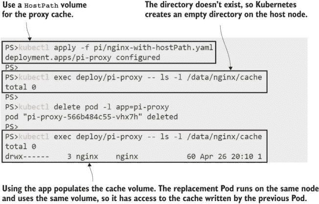

图 5.8 在单节点集群中，Pod 总是在同一节点上运行，因此它们都可以使用 `HostPath`。

`HostPath` 卷的明显问题是它们在具有多个节点的集群中没有意义，这在简单的实验室环境之外的大多数集群中都是如此。你可以在 Pod 规范中包含一个要求，说明 Pod 应始终在同一个节点上运行，以确保它去到数据所在的地方，但这样做会限制你解决方案的弹性——如果节点离线，则 Pod 不会运行，你将丢失你的应用程序。

一个不那么明显的问题是，这种方法提出了一种很好的安全漏洞。Kubernetes 并没有限制节点上哪些目录可用于 `HostPath` 卷。列表 5.3 中显示的 Pod 规范是完全有效的，这使得节点的整个文件系统都可以供 Pod 容器访问。

列表 5.3 sleep-with-hostPath.yaml，一个具有对节点磁盘完全访问权限的 Pod

```
spec:
  containers:
    - name: sleep
      image: kiamol/ch03-sleep
      volumeMounts:
        - name: node-root
          mountPath: /node-root
  volumes:
    - name: node-root
      hostPath:
        path: /                  # The root of the node’s filesystem
        type: Directory          # path needs to exist.
```

现在，任何有权从该规范创建 Pod 的人都可以访问 Pod 运行的节点上的整个文件系统。你可能想使用这样的卷挂载作为快速读取主机上多个路径的方法，但如果你的应用程序被入侵，攻击者可以在容器中执行命令，那么他们也可以访问节点的磁盘。

现在试试 Run 一个 Pod，从列表 5.3 中显示的 YAML 文件开始，然后在 Pod 容器中运行一些命令来探索节点的文件系统。

```
# run a Pod with a volume mount to the host:
kubectl apply -f sleep/sleep-with-hostPath.yaml

# check the log files inside the container:
kubectl exec deploy/sleep -- ls -l /var/log

# check the logs on the node using the volume:
kubectl exec deploy/sleep -- ls -l /node-root/var/log

# check the container user:
kubectl exec deploy/sleep -- whoami
```

如图 5.9 所示，Pod 容器可以看到节点上的日志文件，在这种情况下包括 Kubernetes 日志。这相对无害，但这个容器以 root 用户身份运行，这映射到节点上的 root 用户，因此容器对文件系统有完全的访问权限。

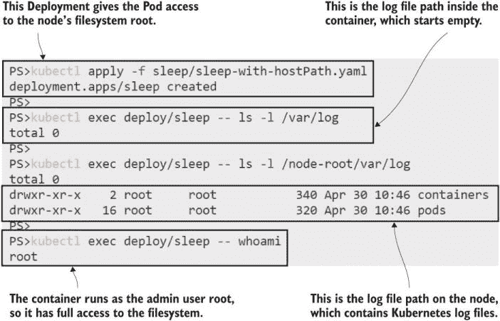

图 5.9 危险！挂载 `HostPath` 可以让你完全访问节点上的数据。

如果这一切听起来像是一个糟糕的想法，请记住 Kubernetes 是一个具有广泛功能的平台，可以满足许多应用程序的需求。你可能有一个需要访问其运行节点上的特定文件路径的旧应用程序，`HostPath` 卷让你可以做到这一点。在这种情况下，你可以采取更安全的做法，使用一个可以访问节点上某个路径的卷，通过声明卷挂载的子路径来限制容器可以看到的内容。列表 5.4 展示了这一点。

列表 5.4 sleep-with-hostPath-subPath.yaml，使用子路径限制挂载

```
spec:
  containers:
    - name: sleep
      image: kiamol/ch03-sleep
      volumeMounts:
        - name: node-root                 # Name of the volume to mount
          mountPath: /pod-logs            # Target path for the container
          subPath: var/log/pods           # Source path within the volume
        - name: node-root
          mountPath: /container-logs
          subPath: var/log/containers
  volumes:
    - name: node-root
      hostPath:
        path: /
        type: Directory
```

在这里，卷仍然定义在节点的根路径上，但访问它的唯一方式是通过容器中的卷挂载，这些挂载被限制在定义的子路径中。在卷规范和挂载规范之间，你在构建和映射容器文件系统方面有很多灵活性。

现在试试 Update sleep Pod，使其容器的卷挂载限制在列表 5.4 中定义的子路径，并检查文件内容。

```
# update the Pod spec:
kubectl apply -f sleep/sleep-with-hostPath-subPath.yaml

# check the Pod logs on the node:
kubectl exec deploy/sleep -- sh -c 'ls /pod-logs | grep _pi-'

# check the container logs:
kubectl exec deploy/sleep -- sh -c 'ls /container-logs | grep nginx'
```

在这个练习中，除了通过挂载到日志目录之外，没有其他方法可以探索节点的文件系统。如图 5.10 所示，容器只能访问子路径中的文件。

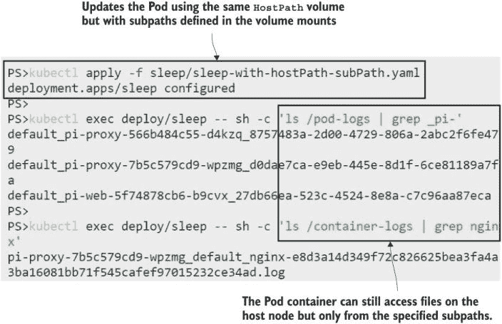

图 5.10 限制对子路径卷的访问可以限制容器可以执行的操作。

`HostPath` 卷是开始使用有状态应用程序的好方法；它们易于使用，并且在任何集群上工作方式相同。在现实世界的应用程序中，它们也很有用，但仅当您的应用程序使用状态进行临时存储时。对于永久存储，我们需要转向任何集群中的节点都可以访问的卷。

## 5.3 使用持久卷和卷声明存储集群级数据

Kubernetes 集群就像一个资源池：它有多个节点，每个节点都提供一些 CPU 和内存容量供集群使用，Kubernetes 使用这些资源来运行您的应用程序。存储只是 Kubernetes 向您的应用程序提供的另一种资源，但它只能提供集群级存储，如果节点可以连接到分布式存储系统。图 5.11 展示了如果卷使用分布式存储，Pod 可以如何访问来自任何节点的卷。


图 5.11 分布式存储使您的 Pod 能够访问来自任何节点的数据，但它需要平台支持。

Kubernetes 支持许多由分布式存储系统支持的卷类型：AKS 集群可以使用 Azure Files 或 Azure Disk，EKS 集群可以使用弹性块存储，在数据中心，您可以使用简单的网络文件系统 (NFS) 共享，或者使用 GlusterFS 这样的网络文件系统。所有这些系统都有不同的配置要求，您可以在 Pod 的卷规范中指定它们。这样做会使您的应用程序规范与一种存储实现紧密耦合，而 Kubernetes 提供了一种更灵活的方法。

Pods 是计算层的抽象，而 Services 是网络层的抽象。在存储层，抽象是 PersistentVolumes (PV) 和 PersistentVolumeClaims。PersistentVolume 是一个 Kubernetes 对象，它定义了一个可用的存储部分。集群管理员可以创建一组 PersistentVolumes，每个 PersistentVolume 都包含底层存储系统的卷规范。列表 5.5 展示了一个使用 NFS 存储的 PersistentVolume 规范。

列表 5.5 persistentVolume-nfs.yaml，由 NFS 挂载支持的卷

```
apiVersion: v1
kind: PersistentVolume
metadata:
  name: pv01                  # A generic storage unit with a generic name

spec:
  capacity:
    storage: 50Mi             # The amount of storage the PV offers
  accessModes:                # How the volume can be accessed by Pods
    - ReadWriteOnce           # It can only be used by one Pod.    

  nfs:                                # This PV is backed by NFS.  
    server: nfs.my.network            # Domain name of the NFS server
    path: "/kubernetes-volumes"       # Path to the NFS share
```

您无法在您的实验室环境中部署该规范，除非您恰好有一个名为 `nfs.my.network` 的域和名为 `kubernetes-volumes` 的共享的网络文件服务器。您可以在任何平台上运行 Kubernetes，因此对于接下来的练习，我们将使用一个在任何地方都可以工作的本地卷。（如果我在练习中使用 Azure Files，它们只能在 AKS 集群上工作，因为 EKS、Docker Desktop 和其他 Kubernetes 发行版没有配置 Azure 卷类型。）

现在尝试一下：创建一个使用本地存储的 PV。PV 是集群范围的，但卷是本地化的，仅存在于一个节点上，因此我们需要确保 PV 与存储所在节点的节点相关联。我们将使用标签来完成这项工作。

```
# apply a custom label to the first node in your cluster: 
kubectl label node $(kubectl get nodes -o jsonpath='{.items[0].metadata.name}') kiamol=ch05

# check the nodes with a label selector:
kubectl get nodes -l kiamol=ch05

# deploy a PV that uses a local volume on the labeled node:
kubectl apply -f todo-list/persistentVolume.yaml

# check the PV:
kubectl get pv
```

我的输出显示在图 5.12 中。节点标签化是必要的，仅因为我没有使用分布式存储系统；你通常会指定可从任何节点访问的 NFS 或 Azure Disk 卷配置。本地卷仅存在于一个节点上，PV 使用标签来识别该节点。

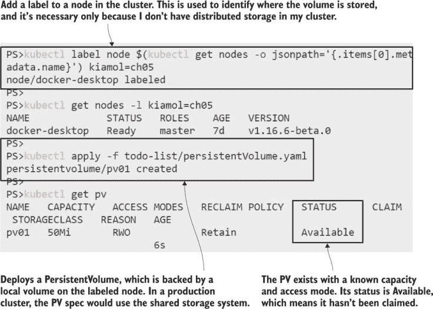

图 5.12 如果你没有分布式存储，你可以通过将 PV 锁定到本地卷来作弊。

现在 PV 作为已知功能集（包括大小和访问模式）的可用存储单元存在于集群中。Pod 无法直接使用该 PV；相反，它们需要使用 PersistentVolumeClaim (PVC) 来声明它。PVC 是 Pod 使用的存储抽象，它只为应用程序请求一些存储。PVC 由 Kubernetes 匹配到 PV，并将底层的卷细节留给 PV。列表 5.6 显示了对一些存储的声明，它将被匹配到我们创建的 PV。

列表 5.6 postgres-persistentVolumeClaim.yaml，一个与 PV 匹配的 PVC

```
apiVersion: v1
kind: PersistentVolumeClaim
metadata:
  name: postgres-pvc          # The claim will be used by a specific app.
spec:
  accessModes:                # The required access mode
    - ReadWriteOnce
  resources:
    requests:
      storage: 40Mi           # The amount of storage requested
  storageClassName: ""        # A blank class means a PV needs to exist.
```

PVC 规范包括访问模式、存储量和存储类别。如果没有指定存储类别，Kubernetes 会尝试找到一个与声明中要求相匹配的现有 PV。如果找到匹配项，则 PVC 将绑定到 PV——存在一对一的链接，因此一旦 PV 被声明，它就不再可用于其他 PVC。

现在尝试一下：从列表 5.6 中部署 PVC。其需求由我们在上一练习中创建的 PV 满足，因此声明将绑定到该卷。

```
# create a PVC that will bind to the PV:
kubectl apply -f todo-list/postgres-persistentVolumeClaim.yaml

# check PVCs:
kubectl get pvc

# check PVs:
kubectl get pv
```

我的输出显示在图 5.13 中，你可以看到一对一的绑定：PVC 绑定到卷上，PV 通过声明绑定。

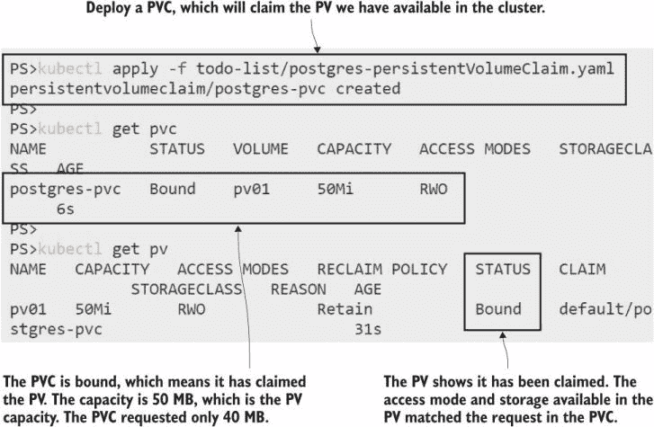

图 5.13 PV 是集群中的存储单元；你使用 PVC 为你的应用程序声明它们。

这是一个静态配置方法，其中 PV 需要被明确创建，以便 Kubernetes 可以绑定到它。如果你在创建 PVC 时没有匹配的 PV，声明仍然会被创建，但它不可用。它将留在系统中，等待创建一个满足其要求的 PV。

现在尝试一下：你的集群中的 PV 已经绑定到一个声明上，因此不能再使用。创建另一个将保持未绑定的 PVC。

```
# create a PVC that doesn’t match any available PVs:
kubectl apply -f todo-list/postgres-persistentVolumeClaim-too-big.yaml

# check claims:
kubectl get pvc
```

在图 5.14 中，你可以看到新的 PVC 处于挂起状态。它将保持这种状态，直到集群中出现至少 100 MB 容量的 PV，这是声明中的存储请求。

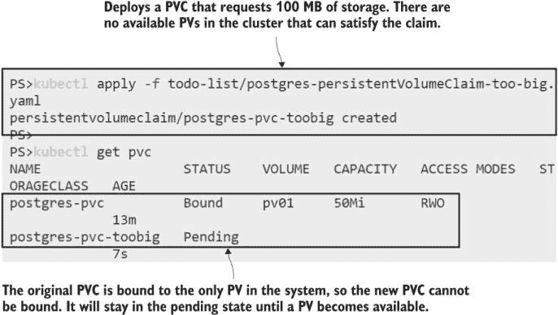

图 5.14 在静态配置下，PVC 将无法使用，直到有可以绑定到的 PV。

在 Pod 可以使用 PVC 之前，必须将其绑定。如果你部署了一个引用未绑定 PVC 的 Pod，该 Pod 将保持在挂起状态，直到 PVC 被绑定，因此你的应用程序将无法运行，直到它获得所需的存储。我们创建的第一个 PVC 已经被绑定，因此它可以被使用，但只能由一个 Pod 使用。声明的访问模式是 ReadWriteOnce，这意味着卷是可写的，但只能由一个 Pod 挂载。列表 5.7 显示了一个用于存储的 PVC 的简化 Postgres 数据库 Pod 规范。

列表 5.7 todo-db.yaml，一个消耗 PVC 的 Pod 规范

```
spec:
  containers:
    - name: db
      image: postgres:11.6-alpine
      volumeMounts:
        - name: data                           
          mountPath: /var/lib/postgresql/data   
  volumes:
    - name: data
      persistentVolumeClaim:             # Volume uses a PVC
        claimName: postgres-pvc          # PVC to use
```

现在我们已经拥有了部署使用卷的 Postgres 数据库 Pod 所需的所有组件，这个卷可能由分布式存储支持，也可能不是。应用程序设计者拥有 Pod 规范和 PVC，并不关心 PV——这取决于 Kubernetes 集群的基础设施，可能由不同的团队管理。在我们的实验室环境中，我们拥有所有这些。我们需要再走一步：在卷期望使用的节点上创建目录路径。

现在试试看 你可能无法登录到真实 Kubernetes 集群的节点，所以我们将通过运行一个 sleep Pod 来作弊，该 Pod 将节点根目录挂载到 `HostPath`，并使用挂载来创建目录。

```
# run the sleep Pod, which has access to the node’s disk:
kubectl apply -f sleep/sleep-with-hostPath.yaml

# wait for the Pod to be ready:
kubectl wait --for=condition=Ready pod -l app=sleep

# create the directory path on the node, which the PV expects:
kubectl exec deploy/sleep -- mkdir -p /node-root/volumes/pv01
```

图 5.15 显示了运行具有 root 权限的 sleep Pod，因此它可以在节点上创建目录，尽管我无法直接访问节点。

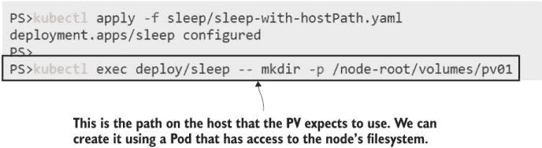

图 5.15 在这个例子中，`HostPath` 是访问节点上 PV 源的另一种方式。

现在一切准备就绪，可以运行带有持久存储的待办事项列表应用程序。通常，你不需要走这么多步骤，因为你将了解你的集群提供的功能。然而，我不知道你的集群能做什么，所以这些练习适用于任何集群，并且它们是所有存储资源的有用介绍。图 5.16 显示了我们迄今为止部署的内容，以及我们即将部署的数据库。

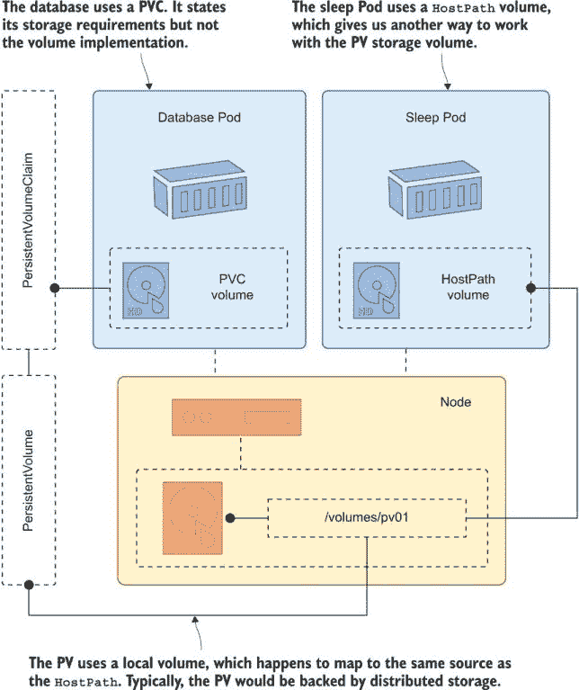

图 5.16 将 PV 和 `HostPath` 映射到相同的存储位置——稍微复杂一点

让我们运行数据库。当创建 Postgres 容器时，它将卷挂载到 Pod 中，该卷由 PVC 支持。这个新的数据库容器连接到一个空卷，因此当它启动时，它将初始化数据库，创建预写日志（WAL），这是主要的数据文件。Postgres Pod 并不知道，但 PVC 由节点上的本地卷支持，我们在那里也运行了一个 sleep Pod，我们可以用它来查看 Postgres 文件。

现在试试看 部署数据库，给它一些时间来初始化数据文件，然后使用 sleep Pod 检查卷中写入的内容。

```
# deploy the database:
kubectl apply -f todo-list/postgres/

# wait for Postgres to initialize:
sleep 30

# check the database logs: 
kubectl logs -l app=todo-db --tail 1

# check the data files in the volume:
kubectl exec deploy/sleep -- sh -c 'ls -l /node-root/volumes/pv01 | grep wal'
```

图 5.17 中的输出显示数据库服务器正确启动并等待连接，已经将所有数据文件写入卷。

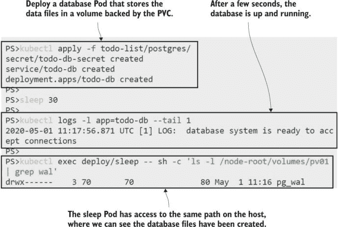

图 5.17 数据库容器写入本地数据路径，但实际上这是一个 PVC 的挂载点。

最后要做的就是运行应用，测试它，并确认如果数据库 Pod 被替换，数据仍然存在。

现在试试吧 运行待办事项应用的 Web Pod，它连接到 Postgres 数据库。

```
# deploy the web app components:
kubectl apply -f todo-list/web/

# wait for the web Pod:
kubectl wait --for=condition=Ready pod -l app=todo-web

# get the app URL from the Service:
kubectl get svc todo-web -o jsonpath='http://{.status.loadBalancer.ingress[0].*}:8081/new'

# browse to the app, and add a new item 
# delete the database Pod:
kubectl delete pod -l app=todo-db
# check the contents of the volume on the node:
kubectl exec deploy/sleep -- ls -l /node-root/volumes/pv01/pg_wal

# check that your item is still in the to-do list
```

您可以在图 5.18 中看到，我的待办事项应用正在显示一些数据，您只需相信我的话，这些数据已经被添加到第一个数据库 Pod 中，并从第二个数据库 Pod 中重新加载。

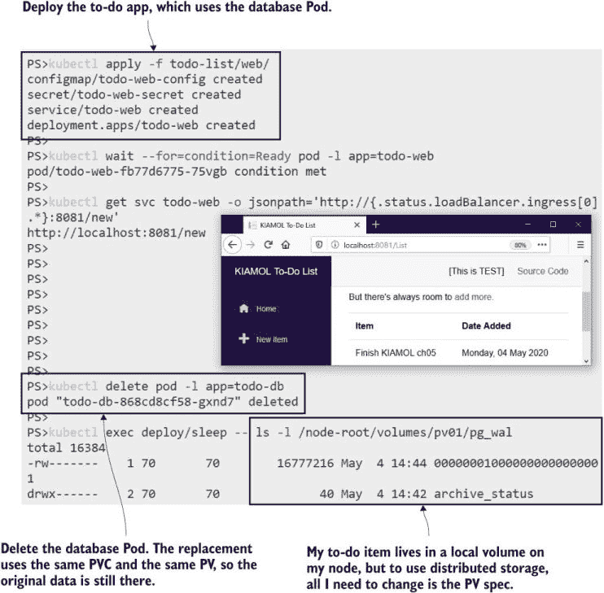

图 5.18 存储抽象意味着数据库只需挂载 PVC 即可获得持久存储。

现在我们有一个很好地解耦的应用，其中包含一个可以独立于数据库更新和扩展的 Web Pod，以及一个使用 Pod 生命周期外持久存储的数据库 Pod。这个练习使用了本地卷作为持久数据的后端存储，但您需要为生产部署做的唯一改变是将 PV 中的卷规范替换为集群支持的分布式卷。

您是否应该在 Kubernetes 中运行关系型数据库是我们将在本章末尾解决的问题，但在我们这样做之前，我们将看看真正的存储问题：让集群根据抽象的存储类动态配置卷。

## 5.4 动态卷配置和存储类

到目前为止，我们使用了一个静态配置工作流程。我们明确创建了 PV，然后创建了 PVC，Kubernetes 将其绑定到 PV 上。这对所有 Kubernetes 集群都适用，可能在那些对存储访问严格控制的组织中是首选的工作流程，但大多数 Kubernetes 平台支持一个更简单的替代方案，即动态配置。

在动态配置工作流程中，您只需创建 PVC，而支持它的 PV 将在集群中按需创建。集群可以配置多个存储类，这些存储类反映了提供的不同卷功能以及一个默认存储类。PVC 可以指定它们想要的存储类名称，或者如果它们想使用默认类，则可以在声明规范中省略存储类字段，如列表 5.8 所示。

列表 5.8 postgres-persistentVolumeClaim-dynamic.yaml，动态 PVC

```
apiVersion: v1
kind: PersistentVolumeClaim
metadata:
  name: postgres-pvc-dynamic
spec:
  accessModes:
    - ReadWriteOnce
  resources:
    requests:
      storage: 100Mi      
      # There is no storageClassName field, so this uses the default class.
```

您可以将此 PVC 部署到您的集群中，而无需创建 PV——但我不能告诉您会发生什么，因为这取决于您的集群配置。如果您的 Kubernetes 平台支持使用默认存储类的动态配置，那么您将看到会创建一个 PV 并将其绑定到声明上，并且该 PV 将使用集群为默认设置的任何卷类型。

现在试试吧 部署一个 PVC，看看它是否是动态配置的。

```
# deploy the PVC from listing 5.8:
kubectl apply -f todo-list/postgres-persistentVolumeClaim-dynamic.yaml

# check claims and volumes:
kubectl get pvc
kubectl get pv

# delete the claim:
kubectl delete pvc postgres-pvc-dynamic

# check volumes again:
kubectl get pv
```

当你运行这个练习时会发生什么？Docker Desktop 使用默认存储类中的 `HostPath` 卷来动态预配 PV；AKS 使用 Azure Files；K3s 使用 `HostPath`，但与 Docker Desktop 的配置不同，这意味着你不会看到 PV，因为它仅在创建使用 PVC 的 Pod 时创建。图 5.19 展示了我在 Docker Desktop 上的输出。PV 被创建并绑定到 PVC 上，当 PVC 被删除时，PV 也会被删除。

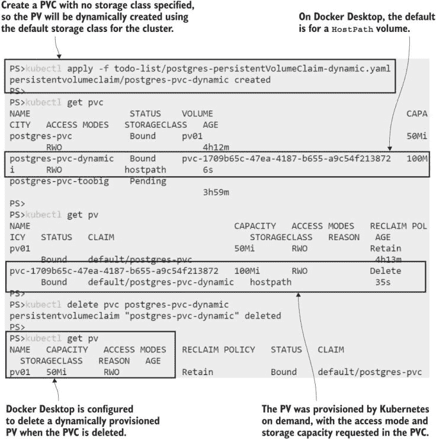

图 5.19 Docker Desktop 对默认存储类有一套行为；其他平台不同。

存储类提供了很多灵活性。你将它们作为标准的 Kubernetes 资源创建，并在规范中，你通过以下三个字段定义存储类的工作方式：

+   `provisioner`——按需创建 PV 的组件。不同的平台有不同的 provisioner，例如，默认 AKS 存储类中的 provisioner 集成了 Azure Files 以创建新的文件共享。

+   `reclaimPolicy`——定义在删除请求时对动态创建的卷进行什么操作。底层卷也可以被删除，或者可以保留。

+   `volumeBindingMode`——确定 PV 是否在 PVC 创建时立即创建，或者直到创建一个使用 PVC 的 Pod。

结合这些属性，你可以将你的集群中的存储类选项组合起来，这样应用程序就可以请求它们需要的属性——从快速本地存储到高可用集群存储——而无需指定卷或卷类型的确切细节。我无法给你一个我可以确信将在你的集群上工作的存储类 YAML，因为集群并不都有相同的 provisioner 可用。相反，我们将通过克隆你的默认类来创建一个新的存储类。

现在尝试一下 获取默认存储类并将其克隆包含一些棘手的细节，所以我将这些步骤封装在一个脚本中。如果你好奇，你可以检查脚本内容，但之后你可能需要躺下休息一下。

```
# list the storage classes in the cluster:
kubectl get storageclass

# clone the default on Windows:
Set-ExecutionPolicy Bypass -Scope Process -Force; ./cloneDefaultStorageClass.ps1

# OR on Mac/Linux:
chmod +x cloneDefaultStorageClass.sh && ./cloneDefaultStorageClass.sh

# list storage classes:
kubectl get sc
```

你从列出存储类中看到的输出显示了你的集群配置了什么。在运行脚本后，你应该有一个名为 `kiamol` 的新类，它与默认存储类有相同的设置。我在 Docker Desktop 上的输出如图 5.20 所示。

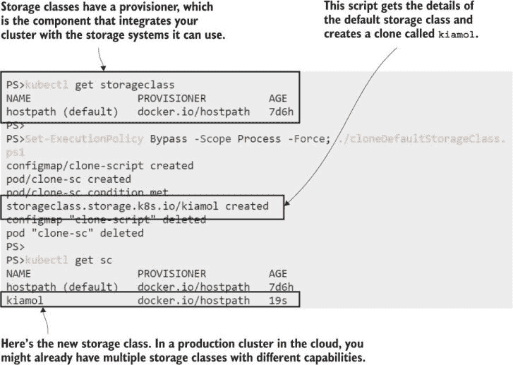

图 5.20 将默认存储类克隆以创建一个可在 PVC 规范中使用的自定义类

现在你已经有一个自定义存储类，你的应用程序可以在 PVC 中请求它。这是一种更直观、更灵活的存储管理方式，尤其是在动态预配简单快捷的云平台上。列表 5.9 展示了一个请求新存储类的 PVC 规范。

列表 5.9 postgres-persistentVolumeClaim-storageClass.yaml

```
spec:
  accessModes:
    - ReadWriteOnce
  storageClassName: kiamol      # The storage class is the abstraction.
  resources:
    requests:
      storage: 100Mi
```

生产集群中的存储类将具有更有意义的名称，但我们现在在集群中都有一个具有相同名称的存储类，因此我们可以更新 Postgres 数据库以使用该显式类。

现在试试这个：创建新的 PVC，并更新数据库 Pod 规范以使用它。

```
# create a new PVC using the custom storage class:
kubectl apply -f storageClass/postgres-persistentVolumeClaim-storageClass.yaml

# update the database to use the new PVC:
kubectl apply -f storageClass/todo-db.yaml

# check the storage:
kubectl get pvc
kubectl get pv

# check the Pods:
kubectl get pods -l app=todo-db

# refresh the list in your to-do app
```

这个练习将数据库 Pod 切换到使用新的动态预配的 PVC，如图 5.21 所示。新的 PVC 由一个新的卷支持，因此它将开始为空，你将丢失之前的数据。之前的卷仍然存在，因此你可以为数据库 Pod 部署另一个更新，将其回滚到旧 PVC，并查看你的条目。

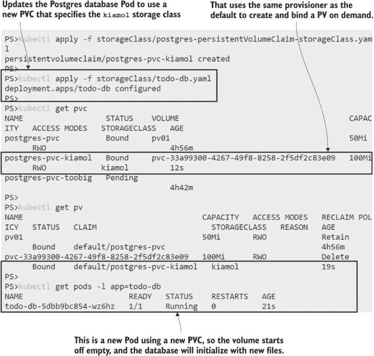

图 5.21 使用存储类极大地简化了你的应用规范；你只需在 PVC 中命名该类。

## 5.5 理解 Kubernetes 中的存储选择

所以这就是 Kubernetes 中的存储。在你的常规工作中，你将为你的 Pods 定义 PersistentVolumeClaims 并指定你需要的尺寸和存储类，这可能是一个自定义值，如 FastLocal 或 Replicated。我们在这章中走了一段很长的路，因为了解当你声明存储时实际上会发生什么，涉及哪些其他资源，以及如何配置它们，这是很重要的。

我们还介绍了卷类型，这是一个你需要更多研究的领域，以了解你的 Kubernetes 平台上可用的选项以及它们提供的功能。如果你在云环境中，你应该有多集群存储选项的奢侈，但记住存储成本，快速存储成本很高。你需要理解你可以使用一个配置为保留底层卷的快速存储类来创建一个 PVC，这意味着即使你删除了你的部署，你仍然需要为存储付费。

这就引出了一个大问题：你是否应该使用 Kubernetes 来运行像数据库这样的有状态应用？功能都在那里，可以为你提供高度可用的、复制的存储（如果你的平台提供的话），但这并不意味着你应该急忙退役你的 Oracle 环境，并用在 Kubernetes 中运行的 MySQL 来替换它。管理数据会给你的 Kubernetes 应用程序增加很多复杂性，运行有状态的应用程序只是问题的一部分。你需要考虑数据备份、快照和回滚，如果你在云中运行，一个托管数据库服务可能会为你提供这些功能。但是，将整个堆栈定义在 Kubernetes 清单中是非常诱人的，而且一些现代数据库服务器被设计为在容器平台上运行；TiDB 和 CockroachDB 是值得考虑的选项。

现在我们继续到实验室之前，只剩下整理你的实验室集群了。

现在试试这个：删除本章中使用的所有对象。你可以忽略你得到的任何错误，因为当你运行这个时，并不是所有的对象都会存在。

```
# delete deployments, PVCs, PVs, and Services:
kubectl delete -f pi/v1 -f sleep/ -f storageClass/ -f todo-list/web -f todo-list/postgres -f todo-list/

# delete the custom storage class:
kubectl delete sc kiamol
```

## 5.6 实验

这些实验室旨在让你在现实世界的 Kubernetes 问题中获得一些经验，所以我不会要求你复制练习来克隆默认的存储类。相反，我们有一个新的待办事项应用部署，它有几个问题。我们在 Web Pod 前使用代理来提高性能，并在 Web Pod 内部使用本地数据库文件，因为这只是开发部署。我们需要在代理层和 Web 层配置一些持久化存储，这样你就可以删除 Pods 和部署，数据仍然会持续存在。

+   首先，部署 `ch05/lab/todo-list` 文件夹中的应用清单；这会创建代理和 Web 组件的服务和部署。

+   找到 LoadBalancer 的 URL，并尝试使用该应用。你会发现它没有响应，你需要深入查看日志来找出问题所在。

+   你的任务是配置代理缓存文件和 Web Pod 中数据库文件的持久化存储。你应该能够从日志条目和 Pod 规范中找到挂载目标。

+   当应用运行时，你应该能够添加一些数据，删除所有你的 Pods，刷新浏览器，并看到你的数据仍然在那里。

+   你可以使用你喜欢的任何卷类型或存储类。这是一个很好的机会来探索你的平台提供了什么。

我的解决方案通常在 GitHub 上，你可以检查是否需要：[`github.com/sixeyed/kiamol/blob/master/ch05/lab/README.md`](https://github.com/sixeyed/kiamol/blob/master/ch05/lab/README.md)。
