# 6 使用控制器在多个 Pod 上扩展应用

扩展应用的基本想法很简单：运行更多的 Pod。Kubernetes 将网络和存储从计算层抽象出来，这样你就可以运行许多 Pod，它们是相同应用的副本，并将它们仅插入到相同的抽象中。Kubernetes 将这些 Pod 称为副本，在多节点集群中，它们将分布到许多节点上。这为你提供了所有扩展的好处：更大的处理负载的能力和故障情况下的高可用性——所有这些都在一个可以在几秒钟内扩展和缩减的平台中。

Kubernetes 还提供了一些替代的扩展选项来满足不同的应用需求，我们将在本章中逐一介绍。你将最常使用的是 Deployment 控制器，它实际上是简单的，但我们也将在其他方面花费时间，这样你就能了解如何在你的集群中扩展不同类型的应用。

## 6.1 Kubernetes 如何运行大规模应用

Pod 是 Kubernetes 中的计算单元，你在第二章中了解到你通常不会直接运行 Pod；相反，你定义另一个资源来为你管理它们。这个资源是一个控制器，我们自从那时起就一直在使用 Deployment 控制器。控制器规范包括一个 Pod 模板，它使用该模板来创建和替换 Pod。它可以使用相同的模板来创建 Pod 的多个副本。

Deployments 可能是你在 Kubernetes 中最常用的资源，你已经对它们有很多经验了。现在，是时候深入挖掘一下，了解 Deployments 实际上并不直接管理 Pods——这是由另一个称为 ReplicaSet 的资源完成的。图 6.1 显示了 Deployment、ReplicaSet 和 Pods 之间的关系。

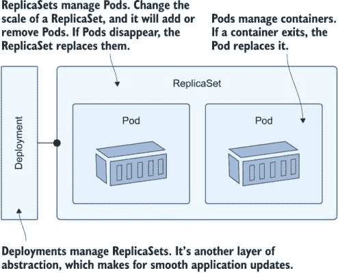

图 6.1 每个软件问题都可以通过添加另一层抽象来解决。

在大多数情况下，你会使用 Deployment 来描述你的应用；Deployment 是一个控制器，它管理 ReplicaSet，而 ReplicaSet 是一个控制器，它管理 Pods。你可以直接创建 ReplicaSet 而不是使用 Deployment，我们将在前几个练习中这样做，只是为了看看扩展是如何工作的。ReplicaSet 的 YAML 几乎与 Deployment 相同；它需要一个选择器来找到它拥有的资源，以及一个 Pod 模板来创建资源。列表 6.1 显示了简化的规范。

列表 6.1 whoami.yaml，一个没有 Deployment 的 ReplicaSet

```
apiVersion: apps/v1
kind: ReplicaSet          # The spec is almost identical to a Deployment.
metadata:
  name: whoami-web
spec:
  replicas: 1
  selector:               # The selector for the ReplicaSet to find its Pods
    matchLabels:
      app: whoami-web
  template:               # The usual Pod spec follows.
```

与我们之前使用的 Deployment 定义相比，这个规范中唯一不同的是对象类型 ReplicaSet 和`replicas`字段，它说明了要运行多少个 Pod。这个规范使用单个副本，这意味着 Kubernetes 将运行一个 Pod。

现在试试看 部署 ReplicaSet，以及一个使用与 ReplicaSet 相同标签选择器的 LoadBalancer 服务，将流量发送到 Pods。

```
# switch to this chapter's exercises:
cd ch06

# deploy the ReplicaSet and Service:
kubectl apply -f whoami/

# check the resource:
kubectl get replicaset whoami-web

# make an HTTP GET call to the Service:
curl $(kubectl get svc whoami-web -o jsonpath='http://{.status.loadBalancer.ingress[0].*}:8088')

# delete all the Pods:
kubectl delete pods -l app=whoami-web

# repeat the HTTP call:
curl $(kubectl get svc whoami-web -o jsonpath='http://{.status.loadBalancer.ingress[0].*}:8088')

# show the detail about the ReplicaSet:
kubectl describe rs whoami-web
```

你可以在图 6.2 中看到我的输出。这里没有新的内容；ReplicaSet 拥有一个 Pod，当你删除该 Pod 时，ReplicaSet 会替换它。我在最后的命令中移除了`kubectl describe`的输出，但如果你运行它，你会看到它以一系列事件结束，其中 ReplicaSet 记录了它是如何创建 Pod 的活动日志。

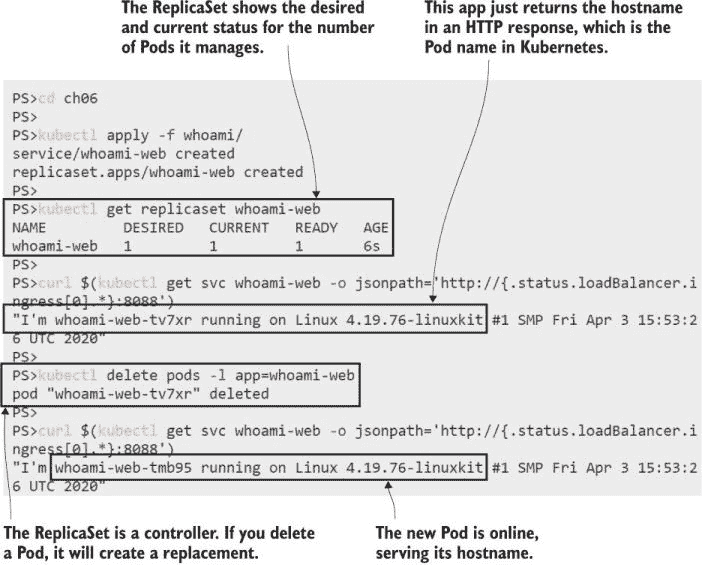

图 6.2 使用 ReplicaSet 就像使用 Deployment 一样：它创建和管理 Pod。

ReplicaSet 替换已删除的 Pod，因为它不断运行一个控制循环，检查它拥有的对象数量是否与它应有的副本数量相匹配。当你扩展你的应用程序时，你使用相同的机制——你更新 ReplicaSet 规范以设置新的副本数量，然后控制循环看到它需要更多，并从相同的 Pod 模板中创建它们。

现在尝试一下 扩展应用程序，通过部署一个更新的 ReplicaSet 定义，指定三个副本。

```
# deploy the update:
kubectl apply -f whoami/update/whoami-replicas-3.yaml

#check Pods:
kubectl get pods -l app=whoami-web

# delete all the Pods:
kubectl delete pods -l app=whoami-web

# check again:
kubectl get pods -l app=whoami-web

# repeat this HTTP call a few times:
curl $(kubectl get svc whoami-web -o jsonpath='http://{.status.loadBalancer.ingress[0].*}:8088')
```

我在图 6.3 中展示的输出引发了一些问题：Kubernetes 是如何如此快速地扩展应用的，以及 HTTP 响应是如何从不同的 Pod 中产生的？

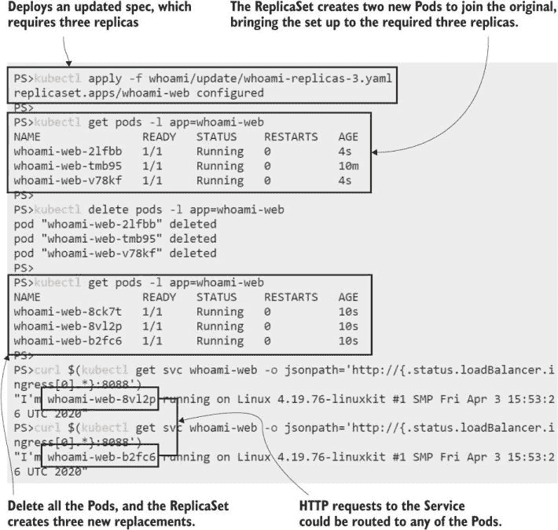

图 6.3 扩展 ReplicaSet 很快，在扩展规模时，Service 可以分配请求到多个 Pod。

第一个问题很简单回答：这是一个单节点集群，所以每个 Pod 都会运行在同一个节点上，而这个节点已经拉取了应用的 Docker 镜像。当你在一个生产集群中扩展时，新 Pod 可能会被调度到没有本地镜像的节点上，它们在运行 Pod 之前需要拉取镜像。你可以扩展的速度受限于你可以拉取镜像的速度，这就是为什么你需要投入时间来优化你的镜像。

至于我们如何向同一个 Kubernetes Service 发起 HTTP 请求并从不同的 Pod 获取响应，这完全归因于 Service 和 Pod 之间的松散耦合。当你扩展 ReplicaSet 时，突然出现了多个匹配 Service 标签选择器的 Pod，当这种情况发生时，Kubernetes 会在 Pod 之间负载均衡请求。图 6.4 展示了相同的标签选择器如何维护 ReplicaSet 和 Pod 之间以及 Service 和 Pod 之间的关系。

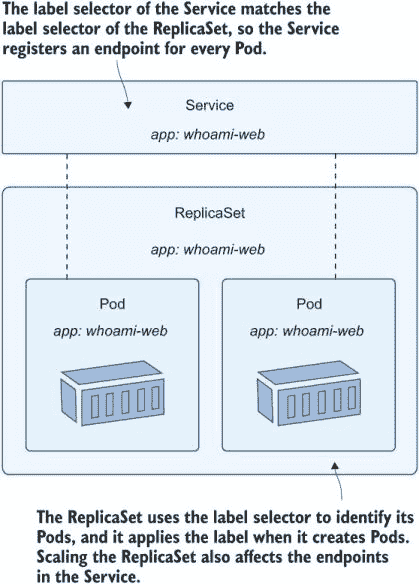

图 6.4 与 ReplicaSet 具有相同标签选择器的 Service 将使用其所有 Pod。

网络和计算之间的抽象使得在 Kubernetes 中扩展变得如此容易。你现在可能感到一种温暖的喜悦——突然间，所有的复杂性开始变得有序，你看到了资源分离是如何成为一些非常强大功能的推动力的。这是扩展的核心：你需要运行多少 Pod 就运行多少，它们都位于一个 Service 后面。当消费者访问 Service 时，Kubernetes 会在 Pod 之间分配负载。

负载均衡是 Kubernetes 中所有服务类型的一个功能。我们在这些练习中部署了一个 LoadBalancer 服务，它接收集群中的流量并将其发送到 Pod。它还创建了一个 ClusterIP 供其他 Pod 使用，当 Pod 在集群内部通信时，它们也受益于负载均衡。

现在试试看：部署一个新的 Pod，并使用它通过 ClusterIP 调用内部的 who-am-I 服务，Kubernetes 会根据服务名称解析这个 ClusterIP。

```
# run a sleep Pod:
kubectl apply -f sleep.yaml

# check the details of the who-am-I Service:
kubectl get svc whoami-web

# run a DNS lookup for the Service in the sleep Pod:
kubectl exec deploy/sleep -- sh -c 'nslookup whoami-web | grep "^[^*]"'

# make some HTTP calls:
kubectl exec deploy/sleep -- sh -c 'for i in 1 2 3; do curl -w \\n -s http://whoami-web:8088; done;'
```

如图 6.5 所示，Pod 消耗内部服务的行为与外部消费者相同，请求在 Pod 之间进行负载均衡。当你运行这个练习时，你可能看到请求被完全均匀地分配，或者你可能看到一些 Pod 响应多次，这取决于网络的不可预测性。

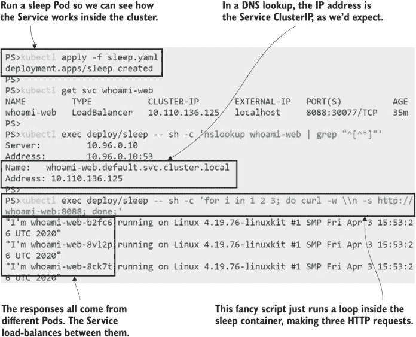

图 6.5 集群内部的世界：Pod 到 Pod 的网络也受益于服务负载均衡。

在第三章中，我们介绍了服务以及 ClusterIP 地址是如何从 Pod 的 IP 地址抽象出来的，所以当一个 Pod 被替换时，应用程序仍然可以通过相同的服务地址访问。现在你看到服务可以在许多 Pod 之间进行抽象，并且路由流量到任何节点上的 Pod 的网络层也可以在多个 Pod 之间进行负载均衡。

## 6.2 使用 Deployment 和 ReplicaSet 进行负载扩展

ReplicaSet 使得扩展你的应用变得极其简单：你只需通过在规范中更改副本的数量，就能在几秒钟内进行扩展或缩减。这对于运行在小巧、精简容器中的无状态组件来说非常完美，这也是为什么为 Kubernetes 构建的应用程序通常使用分布式架构，将功能分解成许多部分，这些部分可以单独更新和扩展。

Deployment 在 ReplicaSet 之上添加了一个有用的管理层。现在我们知道了它们是如何工作的，我们就不会再直接使用 ReplicaSet 了——Deployment 应该是定义应用程序的首选。我们不会在第九章中探索 Deployment 的所有功能，直到我们讨论应用程序的升级和回滚，但了解额外的抽象能给你带来什么是有用的。图 6.6 展示了这一点。

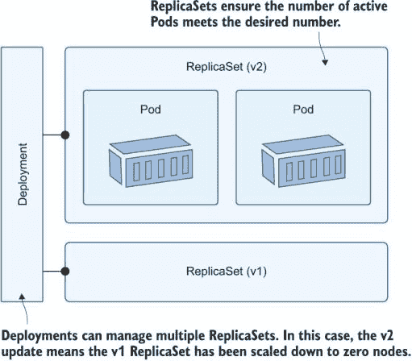

图 6.6 显示，零是期望副本的有效数量；Deployment 将旧的 ReplicaSet 缩放到零。

Deployment 是 ReplicaSet 的控制器，为了实现大规模运行，你需要在 Deployment 规范中包含相同的`replicas`字段，并将其传递给 ReplicaSet。列表 6.2 显示了 Pi 网络应用程序的缩写 YAML，它明确设置了两个副本。

列表 6.2 web.yaml，一个运行多个副本的 Deployment

```
apiVersion: apps/v1
kind: Deployment
metadata:
  name: pi-web
spec:
  replicas: 2            # The replicas field is optional; it defaults to 1.
selector:
  matchLabels:
    app: pi-web
  template:              # The Pod spec follows.
```

部署的标签选择器需要与 Pod 模板中定义的标签匹配，这些标签用于表达从 Pod 到 ReplicaSet 再到 Deployment 的所有权链。当你扩展 Deployment 时，它会更新现有的 ReplicaSet 以设置新的副本数量，但如果你在 Deployment 中更改 Pod 规范，它会替换 ReplicaSet 并将之前的副本数降至零。这使得 Deployment 在管理更新和处理任何问题时拥有很大的控制权。

现在尝试一下：为 Pi 网络应用程序创建一个 Deployment 和 Service，并进行一些更新以查看如何管理 ReplicaSet。

```
# deploy the Pi app:
kubectl apply -f pi/web/

# check the ReplicaSet:
kubectl get rs -l app=pi-web

# scale up to more replicas:
kubectl apply -f pi/web/update/web-replicas-3.yaml

# check the RS:
kubectl get rs -l app=pi-web

# deploy a changed Pod spec with enhanced logging:
kubectl apply -f pi/web/update/web-logging-level.yaml

# check ReplicaSets again:
kubectl get rs -l app=pi-web
```

这个练习表明 ReplicaSet 仍然是扩展机制：当你增加或减少 Deployment 中的副本数量时，它只是更新 ReplicaSet。Deployment 是，嗯，部署机制，它通过多个 ReplicaSet 管理应用程序更新。我的输出，如图 6.7 所示，显示了 Deployment 在完全缩减旧的副本之前等待新的 ReplicaSet 完全运行。

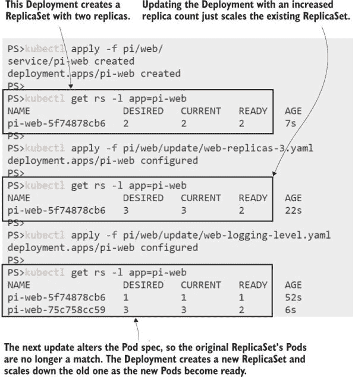

图 6.7 展示了 Deployment 如何管理 ReplicaSet 以在更新期间保持所需数量的 Pod。

你可以使用 kubectl `scale` 命令作为扩展控制器的快捷方式。你应该谨慎使用它，因为它是一种命令式的工作方式，而使用声明式的 YAML 文件会更好，这样你的应用程序在生产中的状态总是与源控制中存储的规范完全匹配。但如果你的应用程序性能不佳，自动部署需要 90 秒，那么这是一个快速扩展的方法——只要记得更新 YAML 文件。

现在尝试一下：使用 kubectl 直接扩展 Pi 应用程序，然后看看在再次进行完整部署时 ReplicaSet 会发生什么。

```
# we need to scale the Pi app fast:
kubectl scale --replicas=4 deploy/pi-web

# check which ReplicaSet makes the change:
kubectl get rs -l app=pi-web

# now we can revert back to the original logging level:
kubectl apply -f pi/web/update/web-replicas-3.yaml

# but that will undo the scale we set manually:
kubectl get rs -l app=pi-web

# check the Pods:
kubectl get pods -l app=pi-web
```

当你应用更新的 YAML 文件时，你会看到两件事：应用程序的副本数缩减到三个，Deployment 通过将新的 ReplicaSet 的 Pod 数量缩减到零并恢复旧的 ReplicaSet 到三个 Pod 来实现这一点。图 6.8 展示了更新后的 Deployment 导致创建了三个新的 Pod。

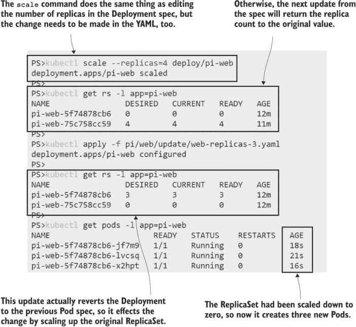

图 6.8 展示了 Deployment 了解其 ReplicaSet 的规范，并且可以通过扩展旧的 ReplicaSet 来回滚。

Deployment 更新覆盖了手动缩放级别并不令人惊讶；YAML 定义是期望状态，如果两者不同，Kubernetes 不会尝试保留当前规范中的任何部分。更令人惊讶的是，Deployment 重新使用了旧的 ReplicaSet 而不是创建一个新的，但这是一种更高效的工作方式，这要归功于更多的标签。

从 Deployment 创建的 Pod 有一个看起来随机的生成名称，但实际上并非如此。Pod 名称包含 Deployment 的 Pod 规范中的模板哈希，因此如果你对规范进行更改，它与之前的 Deployment 匹配，那么它将具有与缩小的 ReplicaSet 相同的模板哈希，Deployment 可以找到该 ReplicaSet 并将其再次扩展以实施更改。Pod 模板哈希存储在标签中。

现在尝试一下：检查 Pi Pods 和 ReplicaSets 的标签以查看模板哈希。

```
# list ReplicaSets with labels:
kubectl get rs -l app=pi-web  --show-labels

# list Pods with labels:
kubectl get po -l app=pi-web  --show-labels
```

图 6.9 显示模板哈希包含在对象名称中，但这只是为了方便——Kubernetes 使用标签进行管理。

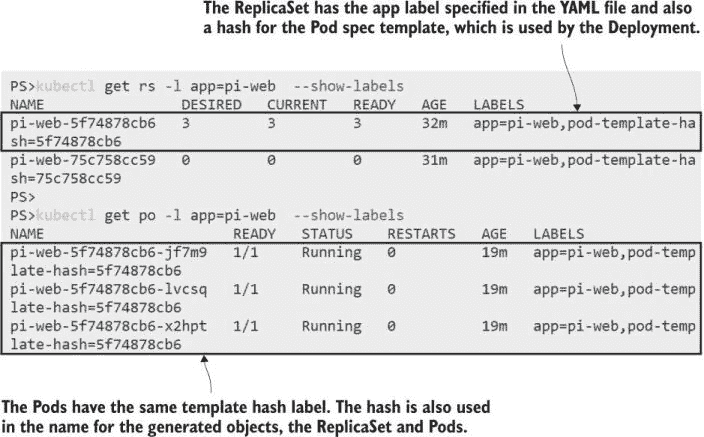

图 6.9 Kubernetes 生成的对象名称不仅仅是随机的——它们包括模板哈希。

了解部署与其 Pods 之间的内部关系将有助于你理解变更是如何分阶段实施的，并在你看到许多 ReplicaSet 具有零期望 Pod 计数时消除任何混淆。但 Pod 中的计算层与 Service 中的网络层之间的交互方式是相同的。

在一个典型的分布式应用中，你将为每个组件有不同的扩展需求，并且你会使用 Service 在它们之间实现多层的负载均衡。我们迄今为止部署的 Pi 应用只有一个 ClusterIP Service——它不是一个面向公众的组件。公众组件是一个代理（实际上，它是一个反向代理，因为它处理传入流量而不是传出流量），它使用一个 LoadBalancer Service。我们可以以规模运行 Web 组件和代理，并从客户端到代理 Pod 以及从代理到应用 Pod 实现负载均衡。

现在尝试一下：创建一个运行两个副本的代理 Deployment，以及一个 Service 和 ConfigMap，以设置与 Pi 网络应用的集成。

```
# deploy the proxy resources:
kubectl apply -f pi/proxy/ 

# get the URL to the proxied app:
kubectl get svc whoami-web -o jsonpath='http://{.status.loadBalancer.ingress[0].*}:8080/?dp=10000'

# browse to the app, and try a few different values for 'dp' in the URL
```

如果你打开浏览器中的开发者工具并查看网络请求，你可以找到代理发送的响应头。这些包括代理服务器的主机名——实际上是 Pod 名称——以及网页本身包含生成响应的 Web 应用 Pod 的名称。我的输出，如图 6.10 所示，显示了一个来自代理缓存的响应。

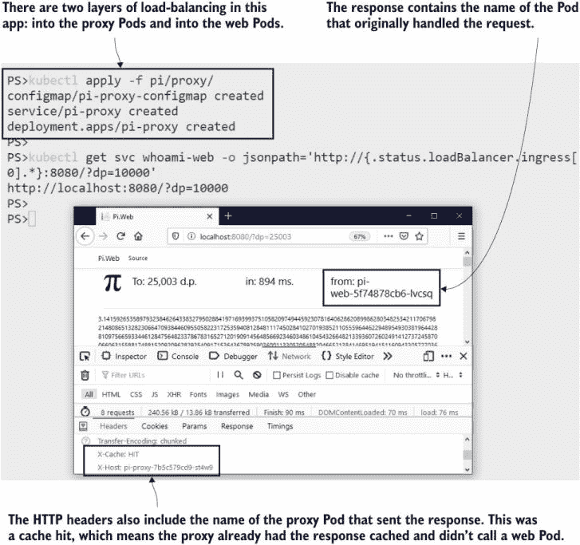

图 6.10 Pi 响应包括发送它们的 Pod 名称，因此你可以看到负载均衡的工作情况。

此配置很简单，这使得它易于扩展。代理的 Pod 规范使用两个卷：一个 ConfigMap 用于加载代理配置文件，一个`EmptyDir`用于存储缓存的响应。ConfigMap 是只读的，因此一个 ConfigMap 可以被所有代理 Pod 共享。`EmptyDir`卷是可写的，但它们对 Pod 是唯一的，因此每个代理都得到自己的卷来用于缓存文件。图 6.11 显示了设置。

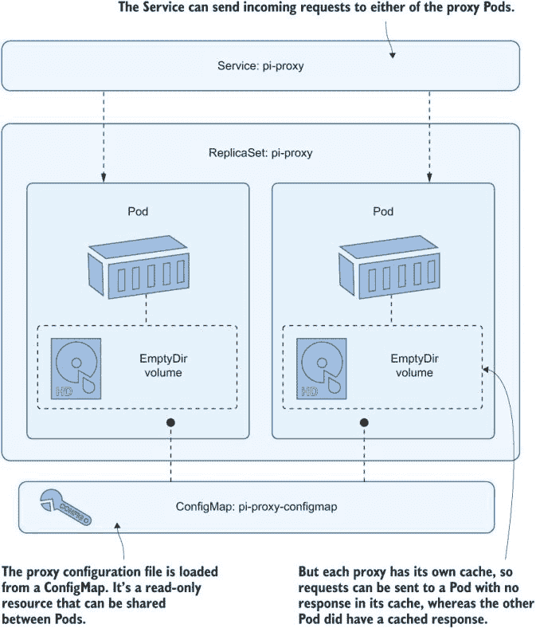

图 6.11 在规模上运行 Pods——某些类型的卷可以共享，而其他类型的卷则是 Pod 独有的。

这种架构会带来一个问题，如果你请求 Pi 的高精度数字并不断刷新浏览器，你会看到这个问题。第一个请求会慢，因为它是由网络应用程序计算的；后续的响应会快，因为它们来自代理缓存，但很快你的请求就会转到没有该响应的缓存的不同代理 Pod，所以页面会再次加载缓慢。

如果使用共享存储来修复这个问题，那么每个代理 Pod 都可以访问相同的缓存会很好。这样做将把我们带回到我们在第五章中认为已经留下的分布式存储的棘手领域，但让我们先从一个简单的方法开始，看看它能带我们走到哪里。

现在尝试一下：部署一个更新到代理规范，它使用 `HostPath` 卷来存储缓存文件，而不是 `EmptyDir`。同一节点上的多个 Pod 将使用相同的卷，这意味着它们将共享代理缓存。

```
# deploy the updated spec:
kubectl apply -f pi/proxy/update/nginx-hostPath.yaml

# check the Pods--the new spec adds a third replica:
kubectl get po -l app=pi-proxy

# browse back to the Pi app, and refresh it a few times

# check the proxy logs:
kubectl logs -l app=pi-proxy --tail 1 
```

现在，你应该能够随心所欲地刷新，而且无论你被引导到哪个代理 Pod，响应总是来自缓存。图 6.12 显示了所有我的代理 Pods 正在响应请求，这些请求通过 Service 在它们之间共享。

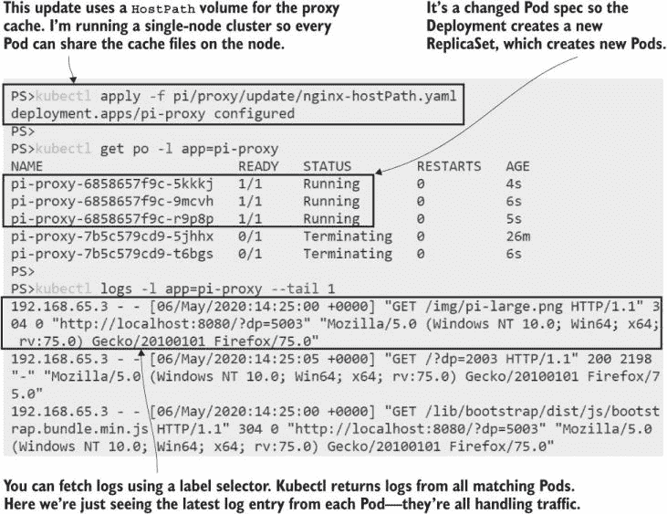

图 6.12 在规模上，你可以使用 kubectl 和标签选择器查看所有 Pod 的日志。

对于大多数有状态的应用程序，这种方法是不可行的。写入数据的应用程序往往假设它们对文件有独占访问权，如果相同应用程序的另一个实例尝试使用相同的文件位置，你可能会得到意外但令人失望的结果——比如应用程序崩溃或数据损坏。我使用的反向代理是 Nginx；在这里它非常宽容，并且愿意与其他实例共享其缓存目录。

如果你的应用需要扩展和存储，你可以选择使用不同类型的控制器。在本章的剩余部分，我们将探讨 DaemonSet；最后一种类型是 StatefulSet，它很快就会变得复杂，我们将在第八章中详细讨论，那时它将占据大部分章节。DaemonSet 和 StatefulSet 都是 Pod 控制器，尽管你使用它们的频率会比 Deployments 低得多，但你仍需要了解你可以用它们做什么，因为它们可以启用一些强大的模式。

## 6.3 使用 DaemonSet 实现高可用性扩展

DaemonSet 的名字来源于 Linux 守护进程，它通常是一个在后台以单个实例持续运行的系统进程（在 Windows 世界中相当于 Windows 服务）。在 Kubernetes 中，DaemonSet 在集群的每个节点上运行一个 Pod 的单个副本，或者如果你在规范中添加了一个选择器，它可以在节点的一个子集上运行。

守护集在基础设施级别的关注点中很常见，您可能希望从每个节点获取信息并将其发送到中央收集器。每个节点上运行一个 Pod，仅获取该节点的数据。您不需要担心任何资源冲突，因为节点上只有一个 Pod。我们将在本书的后面使用守护集从 Pod 收集日志以及关于节点活动的指标。

当您想要高可用性而不需要每个节点上许多副本的负载要求时，您也可以在自己的设计中使用它们。反向代理是一个很好的例子：单个 Nginx Pod 可以处理成千上万的并发连接，因此您不一定需要很多，但您可能想确保每个节点上都有一个运行，以便本地 Pod 可以在流量到达的地方响应。列表 6.3 显示了守护集的缩写 YAML——它看起来与其他控制器很相似，但没有副本数量。

列表 6.3 nginx-ds.yaml，代理组件的守护集

```
apiVersion: apps/v1
kind: DaemonSet
metadata:
  name: pi-proxy
spec:
  selector:
    matchLabels:      # DaemonSets use the same label selector mechanism.
      app: pi-proxy   # Finds the Pods that the set owns
template:
  metadata:
    labels:
      app: pi-proxy   # Labels applied to the Pods must match the selector.
spec:
# Pod spec follows
```

此代理的规范仍然使用`HostPath`卷。这意味着每个 Pod 都将有自己的代理缓存，因此我们无法从共享缓存中获得最佳性能。这种方法适用于其他比 Nginx 更挑剔的有状态应用程序，因为没有多个实例使用相同的数据文件的问题。

现在尝试手动删除。您不能从一种控制器类型转换为另一种类型，但我们可以在不破坏应用程序的情况下将更改从部署更改为守护集。

```
# deploy the DaemonSet:
kubectl apply -f pi/proxy/daemonset/nginx-ds.yaml

# check the endpoints used in the proxy service:
kubectl get endpoints pi-proxy

# delete the Deployment:
kubectl delete deploy pi-proxy

# check the DaemonSet:
kubectl get daemonset pi-proxy

# check the Pods:
kubectl get po -l app=pi-proxy

# refresh your latest Pi calculation on the browser
```

图 6.13 显示了我的输出。在删除部署之前创建守护集意味着始终有 Pod 可用以接收来自服务的请求。如果首先删除部署，则应用程序将不可用，直到守护集启动。如果您检查 HTTP 响应头，您也应该看到您的请求来自代理缓存，因为新的守护集 Pod 使用与部署 Pod 相同的`HostPath`卷。

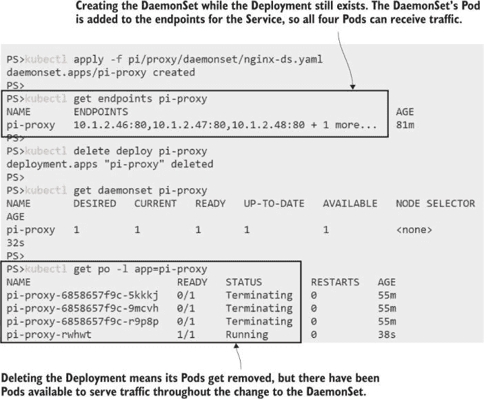

图 6.13 在进行重大更改时，您需要规划部署的顺序以保持您的应用程序在线。

我正在使用单节点集群，因此我的守护集运行一个 Pod；如果有更多节点，我将在每个节点上有一个 Pod。控制循环监视加入集群的节点，任何新节点都会在加入后立即调度启动一个副本 Pod。控制器还监视 Pod 状态，如果 Pod 被删除，则会启动一个替换。

现在尝试手动删除代理 Pod。守护集将启动一个替换。

```
# check the status of the DaemonSet:
kubectl get ds pi-proxy

# delete its Pod:
kubectl delete po -l app=pi-proxy

# check the Pods:
kubectl get po -l app=pi-proxy
```

当 Pod 正在被删除时，如果您刷新浏览器，您会看到它不会响应，直到守护集启动了一个替换。这是因为您正在使用单节点实验室集群。服务只向正在运行的 Pod 发送流量，所以在多节点环境中，请求会发送到仍然有健康 Pod 的节点。图 6.14 显示了我的输出。

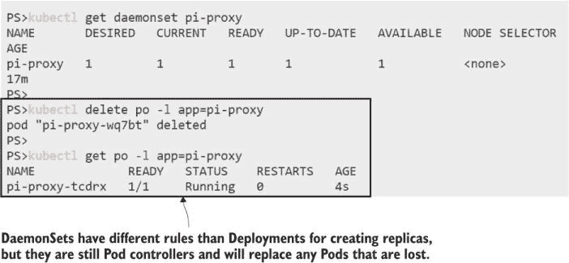

图 6.14 守护集监控节点和 Pod，以确保始终满足所需的副本数量。

需要使用 DaemonSet 的情况通常比仅仅想在每个节点上运行 Pod 要复杂一些。在这个代理示例中，你的生产集群可能只有一小部分节点可以接收来自互联网的流量，因此你只想在这些节点上运行代理 Pod。你可以通过标签来实现这一点，添加任何你想要的任意标签来识别你的节点，然后在 Pod 规范中选择该标签。列表 6.4 使用 `nodeSelector` 字段展示了这一点。

列表 6.4 nginx-ds-nodeSelector.yaml，具有节点选择的 DaemonSet

```
# This is the Pod spec within the template field of the DaemonSet.
spec:
  containers:
    # ...
  volumes:
    # ...
  nodeSelector:       # Pods will run only on certain nodes.
    kiamol: ch06      # Selected with the label kiamol=ch06
```

DaemonSet 控制器不仅监视节点加入集群，它还会查看所有节点，以查看它们是否与 Pod 规范中的要求匹配。当你部署这个更改时，你是在告诉 DaemonSet 只在设置了标签 `kiamol` 为 `ch06` 值的节点上运行。在你的集群中将没有匹配的节点，因此 DaemonSet 将缩放到零。

现在尝试一下 更新 DaemonSet 以包括列表 6.4 中的节点选择器。现在没有节点符合要求，因此现有的 Pod 将被删除。然后标记一个节点，将调度一个新的 Pod。

```
# update the DaemonSet spec:
kubectl apply -f pi/proxy/daemonset/nginx-ds-nodeSelector.yaml

# check the DS:
pi-proxy

# check the Pods:
kubectl get po -l app=pi-proxy

# now label a node in your cluster so it matches the selector:
kubectl label node $(kubectl get nodes -o jsonpath='{.items[0].metadata.name}') kiamol=ch06 --overwrite

# check the Pods again:
kubectl get ds pi-proxy
```

你可以在图 6.15 中看到 DaemonSet 的控制循环正在起作用。当应用节点选择器时，没有节点符合选择器，因此 DaemonSet 的期望副本计数降至零。现有的 Pod 对于期望计数来说过多，因此它被删除。然后，当节点被标记时，有一个匹配选择器的节点，因此期望计数增加到一，因此创建一个新的 Pod。

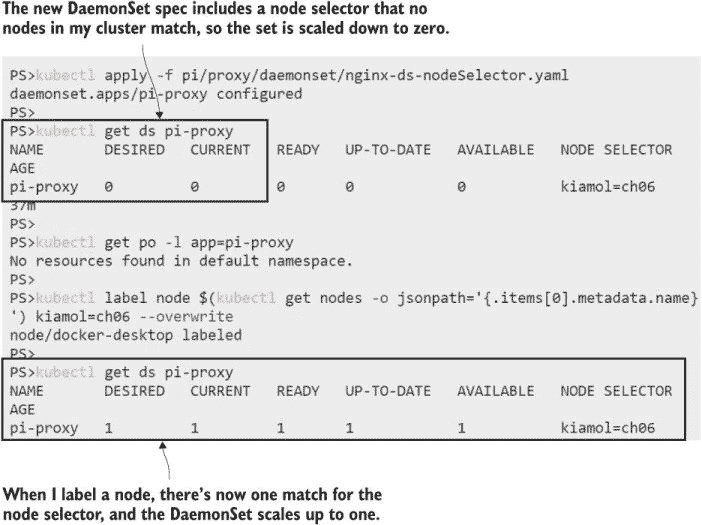

图 6.15 DaemonSet 监视节点及其标签，以及当前的 Pod 状态。

DaemonSet 与 ReplicaSet 有不同的控制循环，因为它们的逻辑需要监视节点活动以及 Pod 数量，但本质上，它们都是管理 Pod 的控制器。所有控制器都负责其管理对象的生命周期，但链接可能会断开。我们将在下一个练习中使用 DaemonSet 来展示如何使 Pod 从其控制器中解放出来。

现在尝试一下 Kubectl 的 `delete` 命令有一个 `cascade` 选项，你可以使用它来删除控制器而不删除其管理对象。这样做会在后面留下孤儿 Pod，如果它们与之前所有者的匹配，则可以被另一个控制器收养。

```
# delete the DaemonSet, but leave the Pod alone: 
kubectl delete ds pi-proxy --cascade=false

# check the Pod:
kubectl get po -l app=pi-proxy

# recreate the DS:
kubectl apply -f pi/proxy/daemonset/nginx-ds-nodeSelector.yaml

# check the DS and Pod:
kubectl get ds pi-proxy

kubectl get po -l app=pi-proxy

# delete the DS again, without the cascade option:
kubectl delete ds pi-proxy

# check the Pods:
kubectl get po -l app=pi-proxy
```

图 6.16 显示了相同的 Pod 在 DaemonSet 被删除和重新创建后仍然存活。新的 DaemonSet 需要单个 Pod，现有的 Pod 与其模板匹配，因此它成为 Pod 的管理者。当这个 DaemonSet 被删除时，Pod 也会被删除。

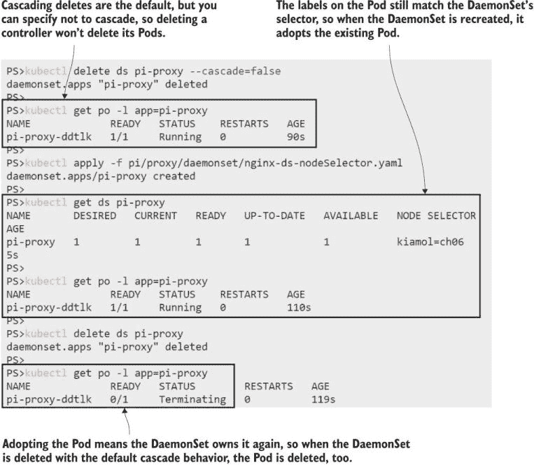

图 6.16 孤儿 Pod 已经失去了其控制器，因此它们不再是高可用集的一部分。

禁止级联删除是那些你很少会使用但当你需要时会非常高兴知道的功能之一。在这种情况下，你可能对现有的所有 Pod 都感到满意，但节点上即将有一些维护任务。与其在处理节点时让 DaemonSet 添加和删除 Pod，你可以在维护完成后删除它并重新启用它。

我们在这里使用的 DaemonSets 示例是关于高可用性的，但它仅限于某些类型的应用程序——你想要多个实例，并且可以接受每个实例都有自己的独立数据存储。其他需要高可用性的应用程序可能需要在实例之间同步数据，对于这些应用程序，你可以使用 StatefulSets。不过，现在不要跳到第八章，因为在第七章中你将学习一些有助于有状态应用程序的巧妙模式。

StatefulSets、DaemonSets、ReplicaSets 和 Deployments 是您用来建模应用程序的工具，它们应该为您提供足够的灵活性，在 Kubernetes 中运行几乎任何东西。我们将以快速查看 Kubernetes 实际上如何管理拥有其他对象的对象来结束本章，然后我们将回顾我们在本书第一部分的进展情况。

## 6.4 理解 Kubernetes 中的对象所有权

控制器使用标签选择器来查找它们管理的对象，而对象本身则在元数据字段中保留其所有者的记录。当你删除一个控制器时，它管理的对象仍然存在，但不会持续太久。Kubernetes 运行一个垃圾收集器进程，寻找所有者已被删除的对象，并将它们也删除。对象所有权可以模拟一个层次结构：Pods 属于 ReplicaSets，而 ReplicaSets 属于 Deployments。

现在试试看。查看所有 Pod 和 ReplicaSets 的元数据字段中的所有者引用。

```
# check which objects own the Pods:
kubectl get po -o custom-columns=NAME:'{.metadata.name}',
OWNER:'{.metadata.ownerReferences[0].name}',OWNER_KIND:'{.metadata.ownerReferences[0].kind}'

# check which objects own the ReplicaSets:
kubectl get rs -o custom-columns=NAME:'{.metadata.name}',
OWNER:'{.metadata.ownerReferences[0].name}',OWNER_KIND:'{.metadata.ownerReferences[0].kind}'
```

图 6.17 显示了我的输出，其中所有 Pod 都由某个其他对象拥有，而除了一个之外的所有 ReplicaSets 都由一个 Deployment 拥有。

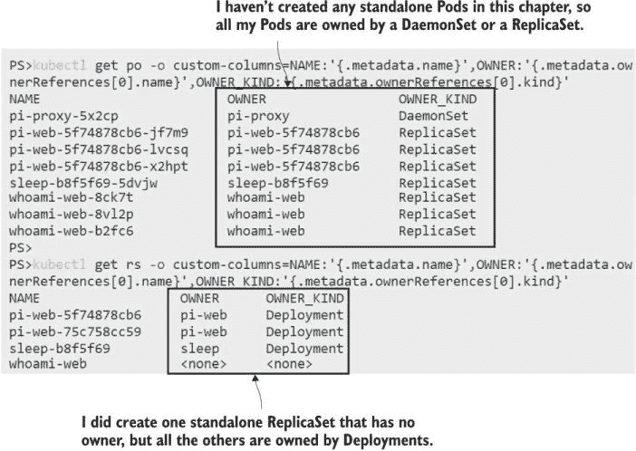

图 6.17 对象知道它们的拥有者是谁——你可以在对象元数据中找到这一点。

Kubernetes 在管理关系方面做得很好，但你需要记住，控制器仅使用标签选择器跟踪其依赖项，所以如果你篡改标签，可能会破坏这种关系。默认的删除行为是大多数时候你想要的，但你可以使用 kubectl 停止级联删除，只删除控制器——这会从依赖项的元数据中删除所有者引用，因此它们不会被垃圾收集器选中。

我们将结束对最新版本的 Pi 应用程序架构的探讨，该应用程序在本章中已部署。图 6.18 展示了它的全部辉煌。

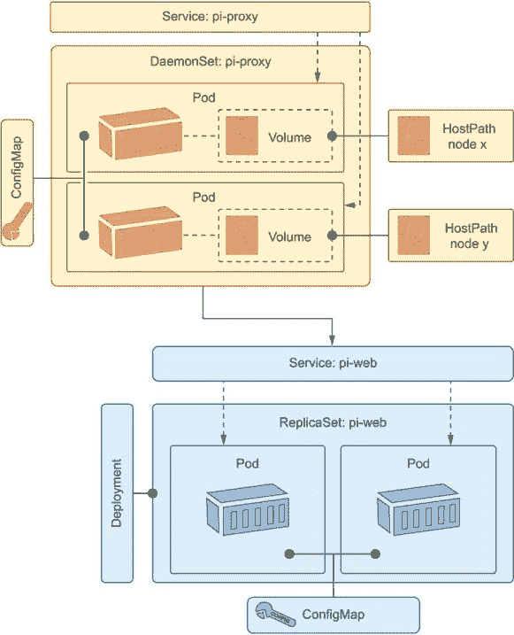

图 6.18 Pi 应用程序：无需注释——图表应该非常清晰。

*相当多*的事情在这个图中正在进行：它是一个简单的应用程序，但由于它使用了大量的 Kubernetes 功能来实现高可用性、可扩展性和灵活性，所以部署很复杂。到现在你应该对所有的这些 Kubernetes 资源都很熟悉，你应该了解它们是如何配合在一起以及何时使用它们。大约 150 行的 YAML 定义了应用程序，但那些 YAML 文件就是你需要在你的笔记本电脑上或在云中的 50 节点集群上运行此应用程序所需的所有内容。当新成员加入项目时，如果他们有扎实的 Kubernetes 经验——或者如果他们已经阅读了这本书的前六章——他们可以立即开始工作。

第一部分就到这里。如果你这周不得不延长午餐时间，我感到很抱歉，但现在你已经掌握了 Kubernetes 的所有基础知识，其中包含了最佳实践。我们只需要在你尝试实验室之前整理一下。

现在试试吧！本章所有顶级对象都应用了`kiamol`标签。现在你了解了级联删除，你会知道当你删除所有这些对象时，它们的依赖项也会被删除。

```
# remove all the controllers and Services:
kubectl delete all -l kiamol=ch06
```

## 6.5 实验室

过去几年中，Kubernetes 发生了很大变化。本章中我们使用的控制器是推荐的，但过去有过替代方案。在这个实验室中，你的任务是取一个使用一些较旧方法的 app 规范，并将其更新为使用你学到的控制器。

+   首先，在`ch06/lab/numbers`目录下部署应用程序——它是第三章中的随机数应用程序，但配置很奇怪。而且它坏了。

+   你需要更新 Web 组件以使用支持高负载的控制器。我们希望在生产中运行数十个这样的实例。

+   API 也需要更新。它需要复制以实现高可用性，但应用程序使用连接到服务器的硬件随机数生成器，一次只能由一个 Pod 使用。具有正确硬件的节点具有标签`rng=hw`（你需要在你的集群中模拟这一点）。

+   这不是一个干净的升级，所以你需要规划你的部署以确保 Web 应用没有停机时间。

听起来很可怕，但你不必觉得这太糟糕。我的解决方案在 GitHub 上供你检查：[`github.com/sixeyed/kiamol/blob/master/ch06/lab/README.md`](https://github.com/sixeyed/kiamol/blob/master/ch06/lab/README.md)。
