# 7 使用多容器 Pod 扩展应用程序

我们在第二章中遇到了 Pod，当时你了解到你可以在一个 Pod 中运行多个容器，但你实际上并没有这样做。在本章中，你将了解它是如何工作的，并理解它所支持的模式。这是本书这一部分更高级主题中的第一个，但它不是一个复杂的话题——只是需要所有来自前几章的背景知识。从概念上讲，它相当简单：一个 Pod 运行多个容器，通常是你的应用程序容器和一些辅助容器。正是这些助手的功能使得这个特性如此有趣。

Pod 中的容器共享相同的虚拟环境，因此当一个容器执行操作时，其他容器可以看到并对此做出反应。它们甚至可以在原始容器不知情的情况下修改预期的操作。这种行为允许您将应用程序建模为非常简单的容器——它只专注于自己的工作，并且有助手负责将应用程序与其他组件以及 Kubernetes 平台集成。这是为所有应用程序添加一致的管理 API 的绝佳方式，无论是新应用程序还是遗留应用程序。

## 7.1 Pod 中容器如何通信

Pod 是一个虚拟环境，为一个或多个容器创建共享的网络和文件系统空间。容器是隔离的单元；它们有自己的进程和环境变量，并且可以使用不同技术栈的不同镜像。Pod 是一个单一单元，因此当它被分配到节点上运行时，所有 Pod 容器都在同一节点上运行。您可以有一个运行 Python 的容器和另一个运行 Java 的容器，但不能在同一个 Pod 中运行一些 Linux 和一些 Windows 容器（目前还不行），因为 Linux 容器需要在 Linux 节点上运行，而 Windows 容器需要在 Windows 节点上运行。

Pod 中的容器共享网络，因此每个容器都有相同的 IP 地址——Pod 的 IP 地址。多个容器可以接收外部流量，但它们需要监听不同的端口，Pod 内的容器可以使用 localhost 地址进行通信。每个容器都有自己的文件系统，但它可以从 Pod 挂载卷，因此容器可以通过共享相同的挂载来交换信息。图 7.1 展示了包含两个容器的 Pod 布局。

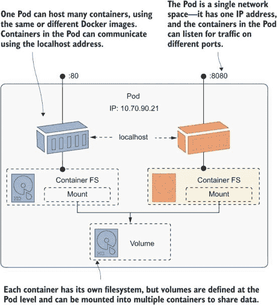

图 7.1 Pod 是许多容器的共享网络和存储环境。

那就是我们现在需要的所有理论，随着我们进入本章，你将对仅使用共享网络和磁盘就能做到的一些智能事情感到惊讶。我们将从本节的一些简单练习开始，以探索 Pod 环境。列表 7.1 显示了 Deployment 的多容器 Pod 规范。定义了两个容器，它们恰好使用相同的镜像，并且它们都挂载了一个在 Pod 中定义的 `EmptyDir` 卷。

列表 7.1 sleep-with-file-reader.yaml，一个简单的多容器 Pod 规范

```
spec:
  containers:                     # The containers field is an array.
    - name: sleep
      image: kiamol/ch03-sleep   
      volumeMounts:
        - name: data
          mountPath: /data-rw     # Mounts a volume as writable
    - name: file-reader           # Containers need different names. 
      image: kiamol/ch03-sleep    # But containers can use the same or
                                  # different images.
      volumeMounts:
        - name: data
          mountPath: /data-ro
          readOnly: true          # Mounts the same volume as read-only
  volumes:
    - name: data                  # Volumes can be mounted by many containers.
        emptyDir: {}              
```

这是一个运行两个容器的单个 Pod 规范。当你部署它时，你会看到在处理多容器 Pod 时有一些工作方式上的差异。

现在试试看：部署列表 7.1，并运行一个包含两个容器的 Pod。

```
# switch to the chapter folder:
cd ch07

# deploy the Pod spec:
kubectl apply -f sleep/sleep-with-file-reader.yaml

# get the detailed Pod information:
kubectl get pod -l app=sleep -o wide

# show the container names:
kubectl get pod -l app=sleep -o jsonpath='{.items[0].status.containerStatuses[*].name}'

# check the Pod logs--this will fail:
kubectl logs -l app=sleep
```

我在图 7.2 中显示的输出表明，Pod 有两个容器，具有单个 IP 地址，它们都在同一个节点上运行。你可以将 Pod 作为一个单一单元查看其详细信息，但你不能在 Pod 级别打印日志；你需要指定一个容器来获取日志。

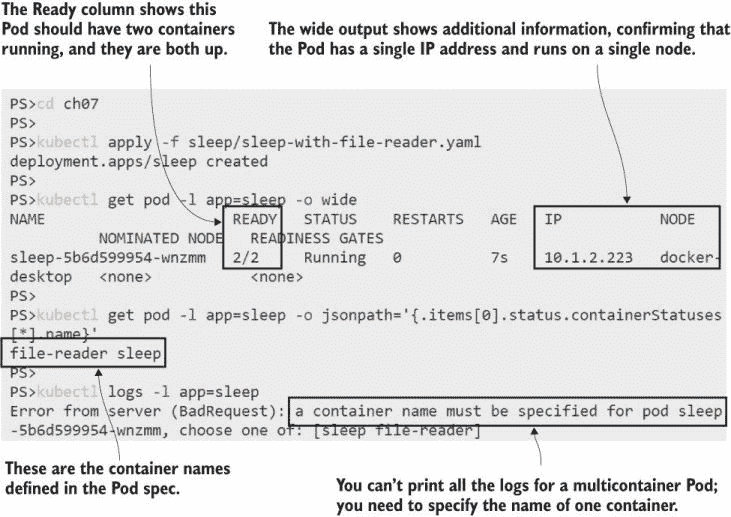

图 7.2：你总是将 Pod 作为一个单一单元来工作，除非你需要指定一个容器。

在那个练习中，两个容器都使用了 sleep 镜像，所以它们没有做任何事情，但容器仍然在运行，Pod 保持可用以供工作。这两个容器都挂载了 Pod 的`EmptyDir`卷，所以这是文件系统的共享部分，你可以在两个容器中使用它。

现在试试看：一个容器将卷挂载为可读写，另一个容器挂载为只读。你可以在一个容器中写入文件，并在另一个容器中读取它们。

```
# write a file to the shared volume using one container:
kubectl exec deploy/sleep -c sleep -- sh -c 'echo ${HOSTNAME} > /data-rw/hostname.txt'

# read the file using the same container:
kubectl exec deploy/sleep -c sleep -- cat /data-rw/hostname.txt

# read the file using the other container:
kubectl exec deploy/sleep -c file-reader -- cat /data-ro/hostname.txt

# try to add to the file to the read-only container--this will fail:
kubectl exec deploy/sleep -c file-reader -- sh -c 'echo more >> /data-ro/hostname.txt'
```

当你运行这个练习时，你会看到第一个容器可以将数据写入共享卷，第二个容器可以读取它，但它本身不能写入数据。这是因为在这个 Pod 规范中，卷挂载被定义为第二个容器的只读。这不是一个通用的 Pod 限制；如果需要，挂载可以被定义为多个容器的可写。图 7.3 显示了我的输出。

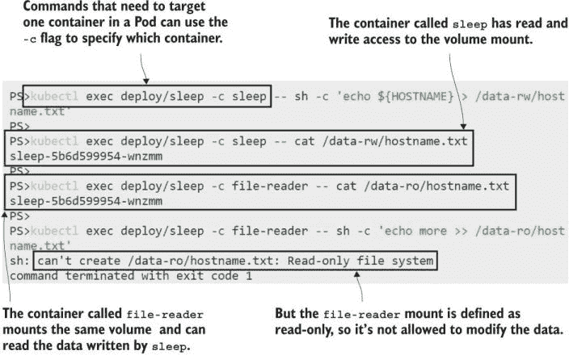

图 7.3：容器可以将相同的 Pod 卷挂载以共享数据，但具有不同的访问级别。

一个古老的空目录卷在这里再次显示了它的价值；它是一个所有 Pod 容器都可以访问的简单便笺。卷在 Pod 级别定义，在容器级别挂载，这意味着你可以使用任何类型的卷或 PVC，并将其提供给许多容器使用。将卷定义与卷挂载解耦还允许选择性共享，因此一个容器可能能够看到 Secrets，而其他容器则不能。

另一个共享空间是网络，容器可以在不同的端口上监听并提供独立的功能块。如果你的应用容器正在做一些后台工作但没有任何功能来报告进度，这很有用。同一个 Pod 中的另一个容器可以提供一个 REST API，报告应用容器正在做什么。

列表 7.2 显示了此过程的简化版本。这是对 sleep 部署的更新，用新的容器规范替换了文件共享容器，该规范运行一个简单的 HTTP 服务器。

列表 7.2 sleep-with-server.yaml，在第二个容器中运行 Web 服务器

```
spec:
  containers:
    - name: sleep
      image: kiamol/ch03-sleep   # The same container spec as listing 7.1
    - name: server
      image: kiamol/ch03-sleep   # The second container is different.
      command: ['sh', '-c', "while true; do echo -e 'HTTP/1.1 ..."]
      ports:
        - containerPort: 8080    # Including the port just documents
                                 # which port the application uses.
```

现在，Pod 将运行原始应用程序容器——sleep 容器，它实际上并没有做什么——和一个服务器容器，该服务器容器在端口 8080 上提供了一个 HTTP 端点。这两个容器共享相同的网络空间，因此 sleep 容器可以使用 localhost 地址访问服务器。

现在尝试一下 使用 7.2 列表中的文件更新 sleep 部署，并确认服务器容器可访问。

```
# deploy the update:
kubectl apply -f sleep/sleep-with-server.yaml

# check the Pod status:
kubectl get pods -l app=sleep

# list the container names in the new Pod:
kubectl get pod -l app=sleep -o jsonpath='{.items[0].status.containerStatuses[*].name}'

# make a network call between the containers:
kubectl exec deploy/sleep -c sleep -- wget -q -O - localhost:8080

# check the server container logs:
kubectl logs -l app=sleep -c server
```

您可以在图 7.4 中看到我的输出。尽管这些是独立的容器，但在网络层面上，它们就像在同一台机器上运行的不同进程一样工作，使用本地地址进行通信。

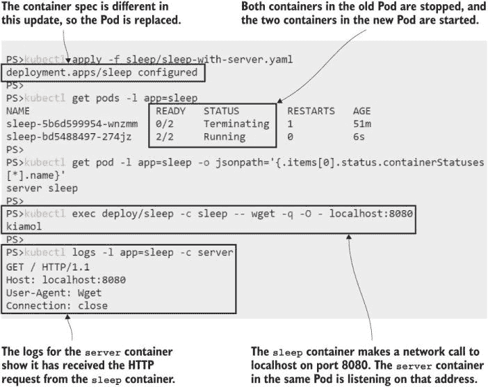

图 7.4 显示，同一 Pod 中的容器之间的网络通信是通过 localhost 进行的。

网络共享不仅限于 Pod 内部。Pod 在集群上有一个 IP 地址，如果 Pod 中的任何容器正在监听端口，则其他 Pod 可以访问它们。您可以为特定端口上的 Pod 创建一个服务，将流量路由到该 Pod，并且监听该端口的任何容器都将接收到请求。

现在尝试一下 使用 kubectl 命令公开 Pod 端口——这是一种不编写 YAML 即可快速创建服务的方法，然后测试 HTTP 服务器是否可以从外部访问。

```
# create a Service targeting the server container port:
kubectl expose -f sleep/sleep-with-server.yaml --type LoadBalancer --port 8020 --target-port 8080

# get the URL for your service:
kubectl get svc sleep -o jsonpath='http://{.status.loadBalancer.ingress[0].*}:8020'
# open the URL in your browser

# check the server container logs:
kubectl logs -l app=sleep -c server
```

图 7.5 显示了我的输出。从外部世界来看，这只是流向服务的网络流量，该服务被路由到 Pod。Pod 正在运行多个容器，但这是对消费者隐藏的细节。

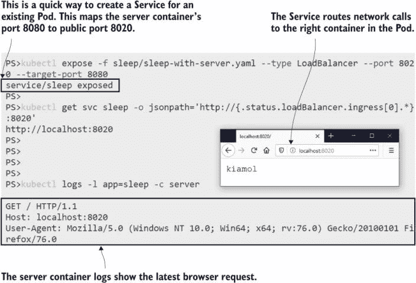

图 7.5 显示，服务可以将网络请求路由到任何已发布端口的 Pod 容器。

您应该已经感受到了在 Pod 中运行多个容器的强大之处，在接下来的章节中，我们将将这些想法应用于实际场景。不过，有一件事需要强调：Pod 不是虚拟机的替代品，所以不要以为您可以在一个 Pod 中运行应用程序的所有组件。您可能会倾向于将应用程序建模为那样，即一个运行在同一个 Pod 中的 Web 服务器容器和一个 API 容器——不要这样做。Pod 是一个单一单元，应该用于您的应用程序的单个组件。可以使用额外的容器来支持应用程序容器，但您不应该在同一个 Pod 中运行不同的应用程序。这样做会破坏您独立更新、扩展和管理这些组件的能力。

## 7.2 使用初始化容器设置应用程序

到目前为止，我们已经运行了包含多个容器的 Pod，其中所有容器都并行运行：它们同时启动，Pod 只有在所有容器都准备好后才被认为是就绪的。您会听到这被称为*边车模式*，这强化了额外容器（边车）作为应用程序容器（摩托车）的辅助角色的想法。当您需要容器在应用程序容器之前运行以设置环境的一部分时，Kubernetes 还支持另一种模式。这被称为*初始化容器*。

初始化容器的工作方式与边车容器不同。你可以为 Pod 定义多个初始化容器，并且它们按顺序运行，顺序与 Pod 规范中编写的顺序相同。每个初始化容器在下一个开始之前都需要成功完成，并且所有初始化容器都必须成功完成，Pod 容器才能启动。图 7.6 显示了具有初始化容器的 Pod 的启动顺序。

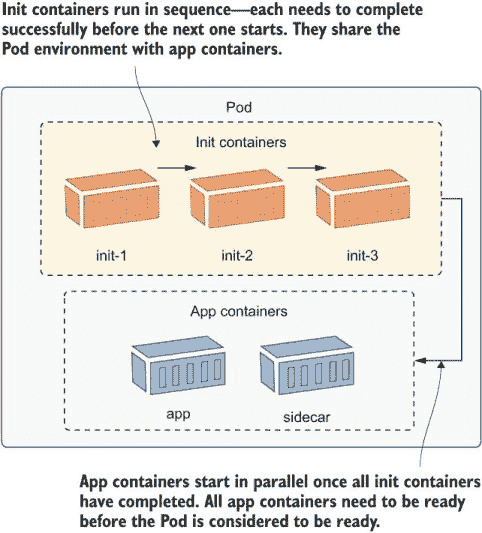

图 7.6 初始化容器对于启动任务很有用，可以为应用程序容器准备 Pod。

所有容器都可以访问 Pod 中定义的卷，因此主要用例是初始化容器写入为应用程序容器准备环境的数据。列表 7.3 展示了从上一个练习中 sleep Pod 的 HTTP 服务器的简单扩展。初始化容器运行并生成一个 HTML 文件，它将该文件写入 `EmptyDir` 卷的挂载点。服务器容器通过发送该文件的内容来响应 HTTP 请求。

列表 7.3 sleep-with-html-server.yaml，Pod 规范中的初始化容器

```
spec:                              # Pod spec in the Deployment template
  initContainers:                  # Init containers have their own array,
    - name: init-html              # and they run in sequence.
      image: kiamol/ch03-sleep
      command: ['sh', '-c', "echo '<!DOCTYPE html...' > /data/index.html"]
      volumeMounts:
     - name: data
       mountPath: /data            # Init containers can mount Pod volumes.
```

这个例子使用与初始化容器相同的 sleep 镜像，但它可以是任何镜像。你可能会使用初始化容器通过安装 Git 命令行工具来设置应用程序环境，并将存储库克隆到共享文件系统中。应用程序容器可以访问这些文件，而无需你在应用程序镜像中设置 Git 客户端。

现在尝试一下：部署列表 7.3 中的更新，看看初始化容器是如何工作的。

```
# apply the updated spec with the init container:
kubectl apply -f sleep/sleep-with-html-server.yaml

# check the Pod containers:
kubectl get pod -l app=sleep -o 
   jsonpath='{.items[0].status.containerStatuses[*].name}'

# check the init containers:
kubectl get pod -l app=sleep -o 
   jsonpath='{.items[0].status.initContainerStatuses[*].name}'

# check logs from the init container--there are none:
kubectl logs -l app=sleep -c init-html

# check that the file is available in the sidecar:
kubectl exec deploy/sleep -c server -- ls -l /data-ro
```

你将从这次练习中学到一些东西。应用程序容器只有在初始化容器成功完成后才会运行，因此你的应用程序可以安全地假设初始化容器准备的环境。在这种情况下，HTML 文件在服务器容器启动之前肯定存在。初始化容器是 Pod 规范的另一个部分，但某些管理功能与应用程序容器的工作方式相同——即使初始化容器已经退出，你也可以读取其日志。我的输出显示在图 7.7 中。

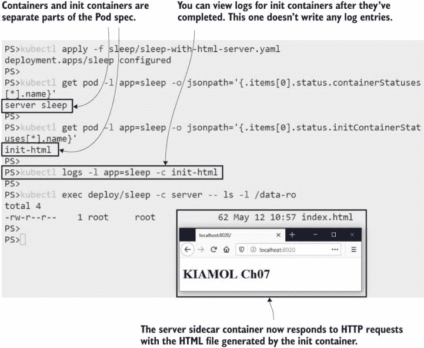

图 7.7 初始化容器对于为应用程序和边车容器准备 Pod 环境很有用。

尽管如此，这仍然不是一个非常贴近现实世界的例子，所以让我们做一些更好的事情。我们在第四章中介绍了应用程序配置，并看到了如何使用环境变量、ConfigMaps 和 Secrets 来构建配置设置的层次结构。如果你的应用程序支持这一点，那真是太好了，但许多较老的应用程序没有这种灵活性；它们期望在某个地方找到一个单独的配置文件，并且不会在其他地方寻找。让我们看看这样的应用程序。

现在尝试一下 本章有一个新的演示应用程序，因为如果我看着 Pi 感到无聊，那么你肯定也是。这个程序并没有更多乐趣，但至少它是不同的。它每隔几秒将时间戳写入日志文件。它有一个旧式的配置框架，因此我们无法使用我们迄今为止学到的任何配置技术。

```
# run the app, which uses a single config file:
kubectl apply -f timecheck/timecheck.yaml

# check the container logs--there won’t be any:
kubectl logs -l app=timecheck

# check the log file inside the container:
kubectl exec deploy/timecheck -- cat /logs/timecheck.log

# check the config setup:
kubectl exec deploy/timecheck -- cat /config/appsettings.json
```

你可以在图 7.8 中看到我的输出。有限的配置框架并不是这个应用程序在容器平台中不是好公民的唯一原因——Pod 中也没有日志——但我们可以通过 Pod 中的额外容器来解决所有问题。

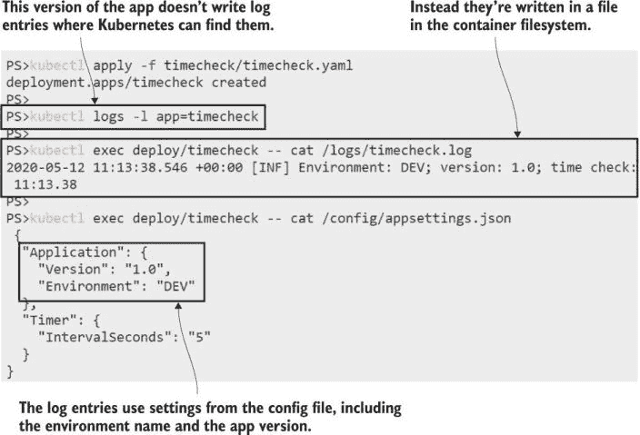

图 7.8 使用单个配置源的老旧应用程序无法从配置层次结构中受益。

初始化容器是一个完美的工具，可以将这个应用程序调整为我们为所有应用程序想要使用的配置方法。我们可以将设置存储在 ConfigMaps、Secrets 和环境变量中，并使用初始化容器从所有不同的输入中读取，合并内容，并将输出写入应用程序使用的单个文件位置。列表 7.4 显示了 Pod 规范中的初始化容器。

列表 7.4 timecheck-with-config.yaml，一个写入配置的初始化容器

```
spec:
  initContainers:
    - name: init-config
      image: kiamol/ch03-sleep    # This image has the jq tool.
      command: ['sh', '-c', "cat /config-in/appsettings.json | jq
        --arg APP_ENV \"$APP_ENVIRONMENT\" '.Application.Environment=$APP_ENV' > /config-out/appsettings.json"]  
      env:
        - name: APP_ENVIRONMENT   # All containers have their own environment
          value: TEST             # variables--they're not shared in the Pod.
      volumeMounts:
        - name: config-map        # Mounts a ConfigMap volume to read  
          mountPath: /config-in   
        - name: config-dir
          mountPath: /config-out  # Mounts an EmptyDir volume to write to
```

在我们更新部署之前，有一些需要注意的事项：

+   初始化容器使用 jq 工具，而应用程序不需要这个工具。容器使用不同的镜像，每个镜像都只包含运行该步骤所需的工具。

+   初始化容器中的命令从`ConfigMap`卷挂载读取，合并环境变量值，并将输出写入到`EmptyDir`卷挂载。

+   应用程序容器将`EmptyDir`卷挂载到需要配置文件的路径。由初始化容器生成的文件隐藏了应用程序镜像中的默认配置。

+   容器不共享环境变量。设置是为初始化容器指定的；应用程序容器看不到这些设置。

+   容器映射它们需要的卷。两个容器都挂载了`EmptyDir`卷，它们共享这个卷，但只有初始化容器挂载了`ConfigMap`。

当我们应用这个更新时，应用程序的行为将根据`ConfigMap`和环境变量而改变，即使应用程序容器不使用它们作为配置源。

现在尝试一下 使用列表 7.4 更新 timecheck 应用程序，以便应用程序容器从多个源进行配置。

```
# apply the ConfigMap and the new Deployment spec:
kubectl apply -f timecheck/timecheck-configMap.yaml -f timecheck/timecheck-with-config.yaml

# wait for the containers to start:
kubectl wait --for=condition=ContainersReady pod -l app=timecheck,version=v2

# check the log file in the new app container:
kubectl exec deploy/timecheck -- cat /logs/timecheck.log

# see the config file built by the init container:
kubectl exec deploy/timecheck -- cat /config/appsettings.json
```

当你运行这个程序时，你会看到应用程序与新的配置一起工作，应用程序容器规范中唯一的变化是配置目录是从`EmptyDir`卷挂载的。我的输出显示在图 7.9 中。

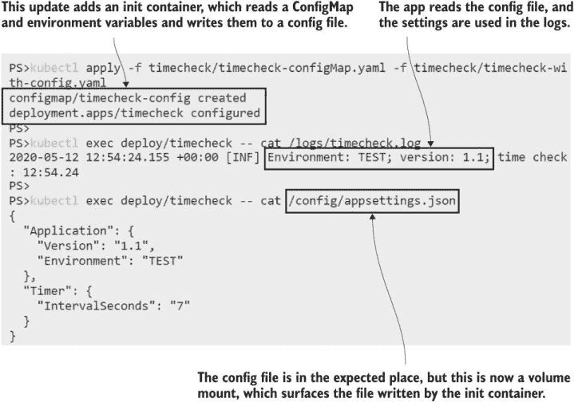

图 7.9 初始化容器可以在不更改应用程序代码或 Docker 镜像的情况下改变应用程序的行为。

这种方法之所以有效，是因为配置文件是从一个专用目录加载的。请记住，如果已经存在，卷挂载会覆盖镜像中的目录。如果应用程序从与应用程序二进制文件相同的目录加载配置文件，你就无法这样做，因为`EmptyDir`挂载会覆盖整个应用程序文件夹。在这种情况下，你需要在应用程序容器启动时添加一个额外的步骤，将配置文件从挂载复制到应用程序目录中。

将标准配置方法应用于非标准应用程序是 init 容器的一个很好的用途，但较老的应用程序仍然不会在现代平台上很好地运行，这就是边车容器可以提供帮助的地方。

## 7.3 使用适配器容器应用一致性

将应用程序迁移到 Kubernetes 是一个很好的机会，可以在所有应用程序之间添加一层一致性，这样你就可以使用相同的工具以相同的方式部署和管理它们，无论应用程序做什么，使用什么技术栈，或者何时开发。我的同事 Docker Captain Sune Keller 曾经谈到他们在 Alm Brand 使用的服务酒店([`bit.ly/376rBcF`](https://bit.ly/376rBcF))概念。他们的容器平台为“客户”（如高可用性和安全性）提供了一系列保证，前提是他们遵守规则（如从平台拉取配置并将其日志写入平台）。

并非所有应用程序都知道规则，并且有些规则无法由平台从外部应用，但边车容器与应用程序容器并行运行，因此它们处于有利的地位。你可以将它们用作*适配器*，这些适配器理解应用程序工作的一些方面，并将其适应平台希望它工作的方式。日志是一个经典的例子。

每个应用程序都会将一些输出写入日志条目——或者应该这样做；否则，它将完全无法管理，你应该拒绝与之合作。现代应用程序平台，如 Node.js 和.NET Core，会将输出写入标准输出流，这是 Docker 获取容器日志和 Kubernetes 获取 Pod 日志的地方。较老的应用程序对日志有不同的看法，它们可能将日志写入文件或其他永远不会作为容器日志出现的目标，因此你永远不会看到任何 Pod 日志（请参阅电子书的附录 D 以了解更多关于 Docker 中的日志信息）。这就是 timecheck 应用程序所做的事情，我们可以通过一个非常简单的边车容器来修复它。其规范出现在列表 7.5 中。

列表 7.5 timecheck-with-logging.yaml，使用边车容器公开日志

```
containers:
  - name: timecheck
    image: kiamol/ch07-timecheck
    volumeMounts:                   
      - name: logs-dir               # The app container writes the log file
        mountPath: /logs             # to an EmptyDir volume mount.
      # Abbreviated--the full spec also includes the config mount.
  - name: logger
    image: kiamol/ch03-sleep         # The sidecar just watches the log file.
    command: ['sh', '-c', 'tail -f /logs-ro/timecheck.log']
    volumeMounts:
      - name: logs-dir
        mountPath: /logs-ro          # Uses the same volume as the app 
        readOnly: true
```

边车所做的只是挂载日志卷（使用`EmptyDir`！）并使用标准的 Linux `tail`命令从日志文件中读取。`-f`选项意味着命令将跟踪文件；实际上，它只是坐着并监视新的写入，当文件中写入任何行时，它们会被回显到标准输出。它是一个中继器，将应用程序的实际日志实现适配到 Kubernetes 的期望。

现在尝试一下 应用列表 7.5 中的更新，并检查应用程序日志是否可用。

```
# add the sidecar logging container:
kubectl apply -f timecheck/timecheck-with-logging.yaml

# wait for the containers to start:
kubectl wait --for=condition=ContainersReady pod -l app=timecheck,version=v3

# check the Pods:
kubectl get pods -l app=timecheck

# check the containers in the Pod:
kubectl get pod -l app=timecheck -o jsonpath='{.items[0].status.containerStatuses[*].name}'

# now you can see the app logs in the Pod:
kubectl logs -l app=timecheck -c logger
```

这里有一些低效之处，因为应用程序容器将日志写入文件，然后日志容器再次读取它们。这将产生一小段时间延迟，并且可能浪费大量磁盘空间，但在下一个应用程序更新中，Pod 将被替换，并且所有在卷中使用的空间都将被回收。好处是，这个 Pod 现在表现得像其他所有 Pod 一样，使应用程序日志可用于 Kubernetes，而无需对应用程序本身进行任何更改，如图 7.10 所示。

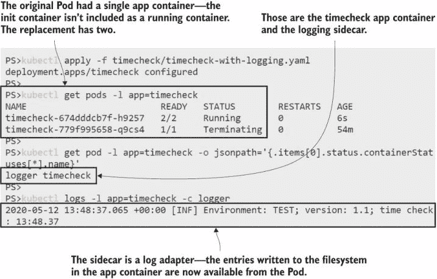

图 7.10 适配器为 Pods 带来一层一致性，使旧应用程序表现得像新应用程序。

从平台接收配置并将日志写入平台是任何应用程序的基本操作，但随着平台的成熟，你会有更多对标准行为的期望。你希望能够测试容器内的应用程序是否健康，并且你希望能够从应用程序中提取指标以了解它在做什么以及它工作得多努力。

边车也能在这方面提供帮助，要么通过运行定制的容器，这些容器提供针对应用程序的信息，要么通过拥有标准的健康和指标容器镜像，你可以将这些镜像应用到所有的 Pod 规范中。我们将使用 timecheck 应用程序来完成练习，并添加使其成为 Kubernetes 良好公民的功能。不过，我们将使用一些额外的静态 HTTP 服务器容器来作弊，这些容器可以在列表 7.6 中看到。

列表 7.6 timecheck-good-citizen.yaml，更多边车以扩展应用程序

```
containers:            # The previous app and logging containers are the same.
  - name: timecheck
 # ...
  - name: logger
 # ...

  - name: healthz                # A new sidecar that exposes a healthcheck API
    image: kiamol/ch03-sleep     # This is just a static response.
    command: ['sh', '-c', "while true; do echo -e 'HTTP/1.1 200 OK\nContent-Type:
    application/json\nContent-Length: 17\n\n{\"status\": \"OK\"}' | nc -l -p 8080; done"]                 
    ports:
      - containerPort: 8080      # Available at port 8080 in the Pod

  - name: metrics                # Another sidecar, which adds a metrics API
    image: kiamol/ch03-sleep     # The content is static again.
    command: ['sh', '-c', "while true; do echo -e 'HTTP/1.1 200 OK\nContent-Type:
    text/plain\nContent-Length:
    104\n\n# HELP timechecks_total The total number timechecks.\n# 
    TYPE timechecks_total counter\ntimechecks_total 6' | nc -l -p 8081; done"]
    ports:
      - containerPort: 8081      # The content is avaialable on a different
                                 # port.
```

完整的 YAML 文件还包括一个 ClusterIP 服务，该服务在端口 8080 上发布健康端点，在端口 8081 上发布指标端点。在生产集群中，这些端口将由其他组件用于收集监控统计信息。部署是之前版本的扩展，因此应用程序使用初始化容器进行配置，并带有新的边车容器以及日志边车。

现在试试看：部署更新，并检查应用程序的健康和性能新管理端点。

```
# apply the update:
kubectl apply -f timecheck/timecheck-good-citizen.yaml

# wait for all the containers to be ready:
kubectl wait --for=condition=ContainersReady pod -l app=timecheck,version=v4

# check the running containers:
kubectl get pod -l app=timecheck -o jsonpath='{.items[0].status.containerStatuses[*].name}'

# use the sleep container to check the timecheck app health:
kubectl exec deploy/sleep -c sleep -- wget -q -O - http://timecheck:8080

# check its metrics:
kubectl exec deploy/sleep -c sleep -- wget -q -O - http://timecheck:8081
```

当你运行练习时，你会看到一切按预期工作，如图 7.11 所示。你也可能看到更新没有你习惯的那么快，新的 Pod 启动时间更长，旧的 Pod 终止时间更长。额外的启动时间是初始化容器、应用程序容器和所有边车都需要准备好的时间——所有这些都需要在新的 Pod 被认为是准备好之前完成。额外的终止时间是因为被替换的 Pod 也包含多个容器，每个容器都会给容器进程关闭一个宽限期。

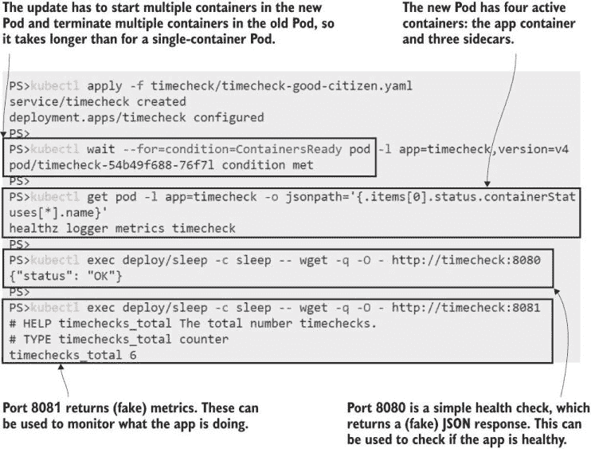

图 7.11 多个适配器边车为应用程序提供了一个一致的管理 API。

运行所有这些作为适配器的边车容器会有一些开销。你已经看到这增加了部署时间，但它也增加了应用程序的持续计算需求——甚至只是跟踪日志文件和提供简单 HTTP 响应的基本边车，也都消耗内存和计算周期。但是，如果你想要将没有这些功能的现有应用程序迁移到 Kubernetes，那么让所有应用程序以相同的方式运行是一种可接受的方法，如图 7.12 所示。

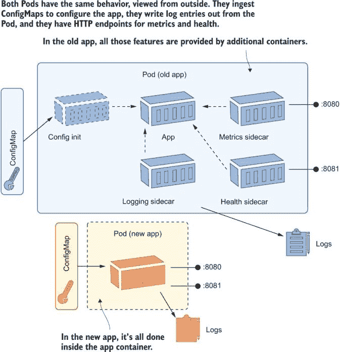

图 7.12 一致的管理 API 使得与 Pod 一起工作变得容易——无论 API 如何在 Pod 内部提供。

在上一个练习中，我们使用了一个闲置的旧 sleep Pod 来调用 timecheck 应用程序的新 HTTP 端点。记住，Kubernetes 有一个扁平的网络模型，其中 Pod 可以通过 Service 向任何其他 Pod 发送流量。你可能想要对你的应用程序中的网络通信有更多的控制，你同样可以通过运行一个管理出站流量的代理容器来实现这一点。

## 7.4 使用代理容器抽象连接

代理模式让你可以控制和简化应用程序的出站连接：你的应用程序向 localhost 地址发起网络请求，这些请求被代理捕获并执行。在几种情况下，你可以使用一个通用的代理容器，或者一个特定于你的应用程序组件的代理容器。图 7.13 显示了几个例子。代理中的逻辑可能是为了提高性能、增加可靠性或安全性。

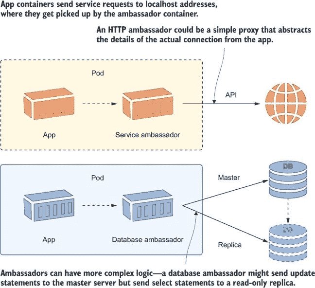

图 7.13 代理模式具有很大的潜力，从简化应用程序逻辑到提高性能。

从应用程序中接管网络控制是非常强大的。代理容器可以进行服务发现、负载均衡、重试，甚至在不加密的通道上添加加密层。你可能听说过服务网格架构，使用像 Linkerd 和 Istio 这样的技术——它们都是通过代理边车容器在代理模式的不同变体中实现的。

我们在这里不会使用服务网格架构，因为这会让我们远远超出午餐时间，进入夜晚，但我们将通过一个简化的例子来了解它能够做什么。起点是我们之前使用的随机数应用程序。有一个 Web 应用程序在一个 Pod 中运行，它消费另一个 Pod 中运行的 API。API 是 Web 应用程序使用的唯一组件，因此理想情况下，我们应该限制对任何其他地址的网络调用，但在初始部署中并没有这样做。

现在尝试一下 运行随机数应用程序，并验证 Web 应用程序容器是否可以使用任何网络地址。

```
# deploy the app and Services:
kubectl apply -f numbers/

# find the URL for your app:
kubectl get svc numbers-web -o jsonpath='http://{.status.loadBalancer.ingress[0].*}:8090'

# browse and get yourself a nice random number

# check that the web app has access to other endpoints:
kubectl exec deploy/numbers-web -c web -- wget -q -O - http://timecheck:8080
```

Web Pod 可以使用 ClusterIP 服务和域名`numbers-api`来访问 API，但它也可以访问任何其他地址，这可能是公共互联网上的 URL 或另一个 ClusterIP 服务。图 7.14 显示应用程序可以读取 timecheck 应用程序的健康端点——这应该是一个私有端点，并且可能暴露对某些人有用的信息。

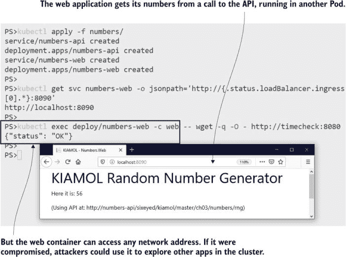

图 7.14 Kubernetes 对 Pod 容器发出的连接没有任何默认限制。

除了使用代理侧边车之外，您还有许多选项可以限制网络访问，但大使模式附带一些额外的功能，使其值得考虑。列表 7.7 显示了 Web 应用程序规范的更新，使用简单的代理容器作为大使。

列表 7.7 web-with-proxy.yaml，使用代理作为大使

```
containers:
  - name: web
    image: kiamol/ch03-numbers-web 
    env:
      - name: http_proxy                 # Sets the container to use the proxy
        value: http://localhost:1080     # so traffic goes to the ambassador
      - name: RngApi__Url
        value: http://localhost/api      # Uses a localhost address for the API
  - name: proxy
    image: kiamol/ch07-simple-proxy      # This is a basic HTTP proxy.
      env:
        - name: Proxy__Port              # Routes network requests from the app
          value: "1080"                  # using the configured URI mapping
        - name: Proxy__Request__UriMap__Source
          value: http://localhost/api
        - name: Proxy__Request__UriMap__Target
          value: http://numbers-api/sixeyed/kiamol/master/ch03/numbers/rng
```

此示例展示了大使模式的要点：应用程序容器使用 localhost 地址来消费任何服务，并且配置为将所有网络调用通过代理容器路由。代理是一个自定义应用程序，它记录网络调用，将 localhost 地址映射到实际地址，并阻止任何未列在映射中的地址。所有这些功能都成为 Pod 中的功能，但对应用程序容器来说是透明的。

现在尝试一下 更新随机数应用程序，并确认网络现在已锁定。

```
# apply the update from listing 7.5:
kubectl apply -f numbers/update/web-with-proxy.yaml

# refresh your browser, and get a new number

# check the proxy container logs:
kubectl logs -l app=numbers-web -c proxy

# try to read the health of the timecheck app:
kubectl exec deploy/numbers-web -c web -- wget -q -O - http://timecheck:8080

# check proxy logs again:
kubectl logs -l app=numbers-web -c proxy
```

现在，Web 应用程序与 API 的解耦程度更高，因为它甚至不知道 API 的 URL——这是在大使中设置的，可以独立于应用程序进行配置。Web 应用程序也被限制为使用单个地址进行出站请求，并且所有这些调用都由代理记录，如图 7.15 所示。

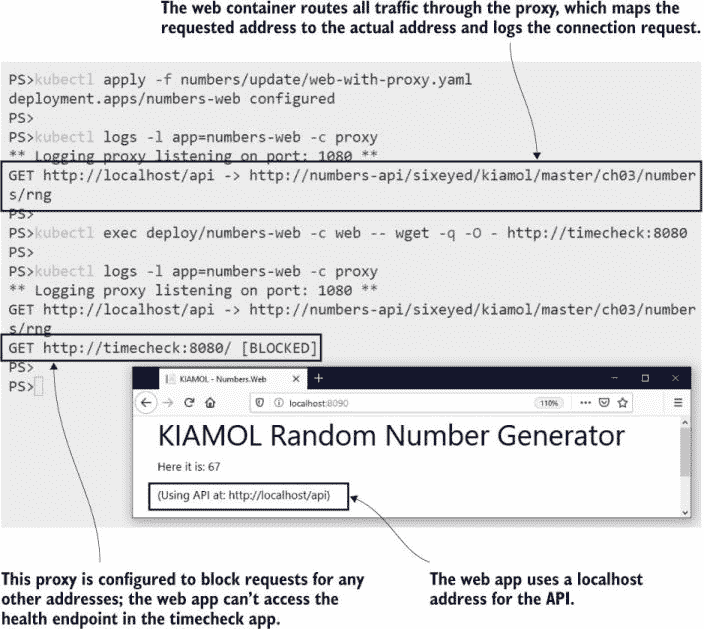

图 7.15 所有网络访问都通过大使进行，它可以实现自己的访问规则。

此 Web 应用程序的大使代理 HTTP 调用在 Pod 外部，但大使模式比这更广泛。它在传输层连接到网络，因此它可以处理任何类型的流量。数据库大使可以做出一些明智的选择，例如将查询发送到只读数据库副本，并仅使用主数据库进行写入。这将提高性能和可扩展性，同时将复杂逻辑排除在应用程序之外。

我们将通过更仔细地研究将 Pod 作为许多容器的共享环境意味着什么来结束本章。

## 7.5 理解 Pod 环境

Pod 是一个或多个容器的边界，就像容器是一个或多个进程的边界一样。Pod 创建虚拟化层而不增加开销，因此它们灵活且高效。这种灵活性的代价是——就像往常一样——复杂性，并且您需要了解一些与多容器 Pod 一起工作的细微差别。

需要理解的主要一点是，即使 Pod 内部运行了大量的容器，Pod 仍然是单个计算单元。只有当 Pod 中的所有容器都准备好时，Pod 才会准备好，并且服务只会将流量发送到准备好的 Pod。添加侧边容器和初始化容器增加了您应用程序的故障模式。

现在尝试一下 如果初始化容器失败，您可能会破坏您的应用程序。对数字应用程序的此更新将不会成功，因为初始化容器配置错误。

```
# apply the update:
kubectl apply -f numbers/update/web-v2-broken-init-container.yaml

# check the new Pod:
kubectl get po -l app=numbers-web,version=v2

# check the logs for the new init container:
kubectl logs -l app=numbers-web,version=v2 -c init-version

# check the status of the Deployment:
kubectl get deploy numbers-web

# check the status of the ReplicaSets:
kubectl get rs -l app=numbers-web
```

您可以在这次练习中看到，失败的初始化容器有效地阻止了应用程序的更新。新的 Pod 永远不会进入运行状态，并且不会从服务接收流量。部署永远不会缩小旧的 ReplicaSet，因为新的一个没有达到所需的可用性级别，但部署的基本细节看起来像更新已经成功，如图 7.16 所示。

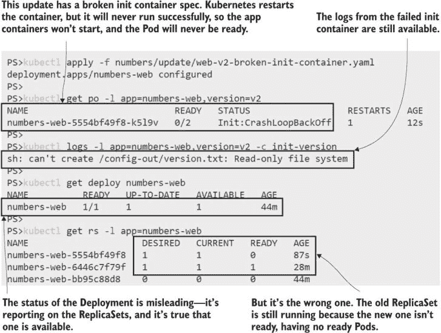

图 7.16 向您的 Pod 规范添加更多容器为 Pod 失败提供了更多机会

如果启动时侧边容器失败，同样会出现这种情况——Pod 没有所有容器都在运行，所以 Pod 本身还没有准备好。您设置的任何部署检查都需要扩展到多容器 Pod，以确保所有初始化容器运行完成，并且所有 Pod 容器都在运行。您还需要注意以下重启条件：

+   如果替换了具有初始化容器的 Pod，则新 Pod 将再次运行所有初始化容器。您必须确保您的初始化逻辑可以重复运行。

+   如果您将 Pod 的初始化容器镜像（s）的更改部署，则 Pod 将重新启动。初始化容器将再次执行，应用程序容器被替换。

+   如果您将 Pod 规范更改部署到应用程序容器镜像（s），则应用程序容器将被替换，但初始化容器不会再次执行。

+   如果应用程序容器退出，则 Pod 会重新创建它。直到容器被替换，Pod 才是完整运行的，并且不会接收服务流量。

Pod 是一个单一的计算环境，但是当您在该环境中添加多个移动部件时，您需要测试所有故障场景，并确保您的应用程序按预期运行。

我们还没有涵盖 Pod 环境的最后一部分：计算层。Pod 容器有一个共享的网络，并且可以共享文件系统的一部分，但它们不能访问彼此的进程——容器边界仍然提供计算隔离。这是默认行为，但在某些情况下，您可能希望您的侧边容器可以访问应用程序容器的进程，无论是为了进程间通信还是让侧边容器可以获取有关应用程序进程的指标。

您可以通过 Pod 规范中的简单设置启用此访问：`shareProcessNamespace:` `true`。这意味着 Pod 中的每个容器都共享相同的计算空间，并且可以看到彼此的进程。

现在试试看 部署对睡眠 Pod 的更新，以便容器使用共享的计算空间并可以访问彼此的进程。

```
# check the processes in the current container:
kubectl exec deploy/sleep -c sleep -- ps

# apply the update:
kubectl apply -f sleep/sleep-with-server-shared.yaml

# wait for the new containers:
kubectl wait --for=condition=ContainersReady pod -l app=sleep,version=shared

# check the processes again:
kubectl exec deploy/sleep -c sleep -- ps
```

您可以在图 7.17 中看到我的输出。睡眠容器可以看到所有服务器容器的进程，并且它可以愉快地杀死它们所有，并使 Pod 处于混乱状态。

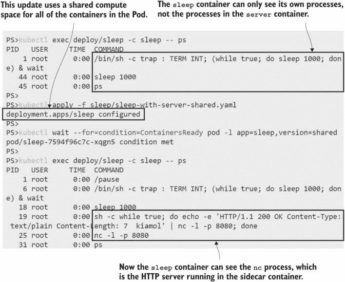

图 7.17 您可以配置一个 Pod，使所有容器都可以看到所有进程 - 请谨慎使用。

这就是多容器 Pod 的全部内容。您在本章中看到，您可以使用初始化容器为您的应用程序容器准备环境，并运行边车容器以向您的应用程序添加功能，而无需更改应用程序代码或 Docker 镜像。使用多个容器有一些注意事项，但这是一个您将经常使用的模式来扩展您的应用程序。只需记住，Pod 应该是一个逻辑组件：我不想看到您仅仅因为可以这样做就在一个 Pod 中运行 Nginx、WordPress 和 MySQL。现在让我们整理一下，为实验做好准备。

现在试试看 移除与本章标签匹配的所有内容。

```
kubectl delete all -l kiamol=ch07
```

## 7.6 实验

现在回到这个实验的 Pi 应用程序。Docker 镜像 `kiamol/ch05-pi` 实际上可以用不同的方式使用，要将它作为 Web 应用程序运行，您需要覆盖容器规范中的启动命令。我们在前几章的 YAML 文件中已经这样做过了，但现在我们被要求使用一种标准的设置 Pod 的方法。以下是要求和一些提示：

+   应用程序容器需要使用所有 Pod 在我们平台上使用的标准启动命令。它应该运行 `/init/startup.sh`。

+   Pod 应该使用端口 80 用于应用程序容器。

+   Pod 还应发布端口 8080 以供 HTTP 服务器使用，该服务器返回应用程序的版本号，

+   应用程序容器镜像不包含启动脚本，因此您需要使用可以创建该脚本并将其设置为可执行文件以供应用程序容器运行的东西。

+   应用程序没有在端口 8080（或任何其他地方）发布版本 API，因此您需要一些可以提供该功能的东西（它可以是任何静态文本）。

起始点是 `ch07/lab/pi` 中的 YAML 文件，目前该文件已损坏。您需要调查应用程序在前几章中的运行情况，并应用本章学到的技术。您有多种方法可以解决这个问题，您可以在通常的位置找到我的示例解决方案：[`github.com/sixeyed/kiamol/blob/master/ch07/lab/README.md`](https://github.com/sixeyed/kiamol/blob/master/ch07/lab/README.md)。
