# 8 使用状态集（StatefulSets）和作业（Jobs）运行数据密集型应用程序

“数据密集型”不是一个非常科学的术语，但本章是关于运行一类不仅具有状态性，而且对如何使用状态有较高要求的程序。数据库是这类程序的一个例子。它们需要在多个实例上运行以实现高可用性，每个实例需要一个本地数据存储以实现快速访问，而这些独立的数据存储需要保持同步。数据有其自己的可用性要求，并且你需要定期运行备份以防止永久性故障或损坏。其他数据密集型应用程序，如消息队列和分布式缓存，也有类似的要求。

你可以在 Kubernetes 中运行这类应用程序，但你需要围绕一个固有的冲突进行设计：Kubernetes 是一个动态环境，而数据密集型应用程序通常期望在一个稳定的环境中运行。期望在已知网络地址找到对等体的集群应用程序在 ReplicaSet 中不会运行良好，而期望从磁盘驱动器读取的备份作业与 PersistentVolumeClaims 也不会很好地工作。如果你的应用程序有严格的数据要求，你需要以不同的方式建模你的应用程序，我们将在本章中介绍如何使用一些更高级的控制器：状态集（StatefulSets）、作业（Jobs）和定时作业（CronJobs）来做到这一点。

## 8.1 Kubernetes 如何使用状态集（StatefulSets）来建模稳定性

状态集（StatefulSet）是一种具有可预测管理功能的 Pod 控制器：它允许你在稳定的框架内以规模运行应用程序。当你部署 ReplicaSet 时，它会创建具有随机名称的 Pod，这些 Pod 在域名系统（DNS）中无法单独寻址，并且并行启动它们。当你部署状态集（StatefulSet）时，它会创建具有可预测名称的 Pod，这些 Pod 可以通过 DNS 单独访问，并且按顺序启动；第一个 Pod 需要启动并运行，第二个 Pod 才能创建。

集群应用程序是状态集（StatefulSet）的绝佳候选者。通常，它们设计有一个主实例和一个或多个辅助实例，这使它们具有高可用性。你可能能够扩展辅助实例，但它们都需要达到主实例并使用它来同步它们自己的数据。你不能用 Deployment 来建模，因为在 ReplicaSet 中，没有方法可以识别单个 Pod 作为主实例，因此你最终会得到奇怪且不可预测的条件，有多个主实例或没有主实例。

图 8.1 展示了这样一个例子，它可以用来运行我们在前几章中用于待办事项应用程序的 Postgres 数据库，但它使用状态集（StatefulSet）来实现数据复制和高可用性。

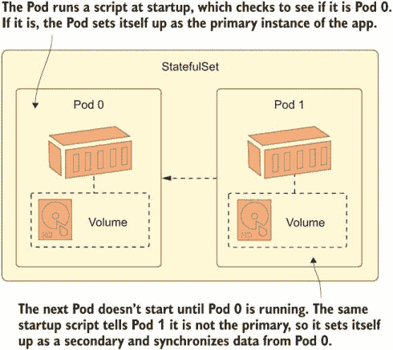

图 8.1 在状态集中，每个 Pod 都可以拥有从第一个 Pod 复制的自己的数据副本。

这个设置相当复杂，我们将分几个部分逐步进行，以便你了解一个工作状态集的所有组件是如何组合在一起的。这是一个不仅对数据库有用的模式——许多旧应用都是为静态运行时环境设计的，并假设了稳定性，而这种稳定性在 Kubernetes 中并不成立。StatefulSets 允许你模拟这种稳定性，如果你的目标是迁移现有的应用到 Kubernetes，那么它们可能是你在旅途中早期就会使用的东西。

让我们从简单的 StatefulSet 开始，它展示了基础知识。列表 8.1 显示，StatefulSets 几乎与其他 Pod 控制器具有相同的规范，只是它们还需要包含一个服务的名称。

列表 8.1 todo-db.yaml，一个简单的 StatefulSet

```
apiVersion: apps/v1
kind: StatefulSet
metadata:
  name: todo-db
spec:
  selector:            # StatefulSets use the same selector mechanism.
    matchLabels:
      app: todo-db
  serviceName: todo-db      # StatefulSets must be linked to a Service. 
  replicas: 2
  template:
    # pod spec...
```

当你部署这个 YAML 文件时，你会得到一个运行两个 Postgres Pod 的 StatefulSet，但不要过于兴奋——它们只是两个由同一个控制器管理的独立数据库服务器。要使两个 Pod 成为复制的数据库集群，还需要做更多的工作，我们将在接下来的几节中实现这一点。

现在尝试一下 从列表 8.1 中部署 StatefulSet，并观察它创建的 Pod 与由 ReplicaSet 管理的 Pod 的比较。

```
# switch to the chapter's source:
cd ch08

# deploy the StatefulSet, Service, and a Secret for the Postgres
# password:
kubectl apply -f todo-list/db/

# check the StatefulSet:
kubectl get statefulset todo-db

# check the Pods:
kubectl get pods -l app=todo-db

# find the hostname of Pod 0:
kubectl exec pod/todo-db-0 -- hostname

# check the logs of Pod 1:
kubectl logs todo-db-1 --tail 1
```

从图 8.2 中你可以看到，StatefulSet 的工作方式与 ReplicaSet 或 DaemonSet 非常不同。Pod 有一个可预测的名称，即 StatefulSet 名称后跟 Pod 的索引，因此你可以使用 Pod 的名称来管理它们，而无需使用标签选择器。

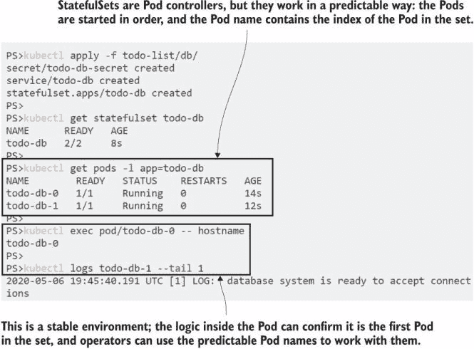

图 8.2 StatefulSet 可以为集群应用创建环境，但应用需要自行配置。

Pod 仍然由控制器管理，但比 ReplicaSet 更可预测。Pod 按顺序从零到 n 创建；如果你缩小集合，控制器将按相反的顺序删除它们，从 n 开始向下工作。如果你删除一个 Pod，控制器将创建一个替换。它将具有与原始 Pod 相同的名称和配置，但将是一个新的 Pod。

现在尝试一下 删除 StatefulSet 的 Pod 0，并观察 Pod 0 是否会再次出现。

```
# check the internal ID of Pod 0:
kubectl get pod todo-db-0 -o jsonpath='{.metadata.uid}'

# delete the Pod:
kubectl delete pod todo-db-0

# check Pods:
kubectl get pods -l app=todo-db

# check that the new Pod is a new Pod:
kubectl get pod todo-db-0 -o jsonpath='{.metadata.uid}'
```

你可以从图 8.3 中看到，StatefulSet 为应用提供了一个稳定的环境。Pod 0 被一个相同的 Pod 0 替换，但这不会触发整个新集；原始的 Pod 1 仍然存在。排序仅应用于创建和扩展，不应用于替换缺失的 Pod。

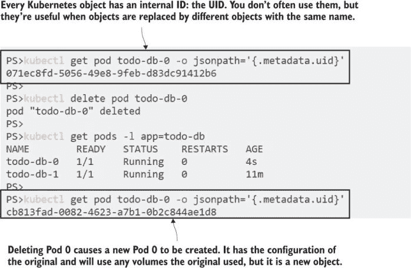

图 8.3 StatefulSets 正确替换了缺失的副本。

StatefulSet 只是建模稳定环境的第一步。你可以为每个 Pod 获取 DNS 名称，将 StatefulSet 连接到服务，这意味着你可以配置 Pod 通过与其他已知地址的副本一起工作来自行初始化。

## 8.2 在 StatefulSets 中使用 init 容器引导 Pod

Kubernetes API 由其他对象组成对象：状态集定义中的 Pod 模板与你在 Deployment 模板和裸 Pod 定义中使用的对象类型相同。这意味着所有 Pod 功能都可用于状态集，尽管 Pod 本身是以不同的方式管理的。我们在第七章中学习了初始化容器，它们是解决集群应用程序中经常需要的复杂初始化步骤的完美工具。

列表 8.2 显示了 Postgres 部署更新的第一个初始化容器。在这个 Pod 规范中，多个初始化容器按顺序运行，因为 Pod 也是按顺序启动的，所以你可以保证 Pod 1 中的第一个初始化容器不会在 Pod 0 完全初始化和准备好之前运行。

列表 8.2 todo-db.yaml，带有初始化的复制 Postgres 设置

```
initContainers:
  - name: wait-service
    image: kiamol/ch03-sleep
    envFrom:                       # env file for sharing between containers
      - configMapRef:
        name: todo-db-env
    command: ['/scripts/wait-service.sh']
    volumeMounts:
      - name: scripts              # Volume loads scripts from ConfigMap.
        mountPath: "/scripts"
```

在这个初始化容器中运行的脚本有两个功能：如果它在 Pod 0 中运行，它只是打印一条日志以确认这是数据库主节点，然后容器退出；如果它在任何其他 Pod 中运行，它会对主节点进行 DNS 查找调用，以确保在继续之前它是可访问的。下一个初始化容器将启动复制过程，因此这个容器确保一切就绪。

这个例子中的确切步骤是针对 Postgres 的，但对于许多集群和复制应用程序（如 MySQL、Elasticsearch、RabbitMQ 和 NATS）的模式是相同的。图 8.4 显示了如何使用状态集中的初始化容器来模拟该模式。

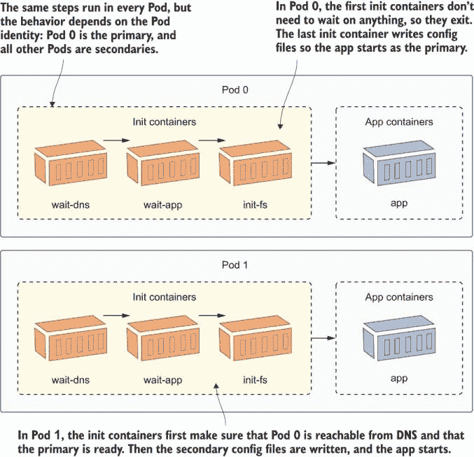

图 8.4 状态集的稳定环境为你提供了初始化时可以使用的保证。

你通过在规范中标识一个服务来为状态集中的单个 Pod 定义 DNS 名称，但它需要是特殊配置的无头服务。列表 8.3 显示了数据库服务如何配置没有 ClusterIP 地址以及具有 Pod 选择器。

列表 8.3 todo-db-service.yaml，状态集的无头服务

```
apiVersion: v1
kind: Service
metadata:
  name: todo-db
spec:
  selector:
    app: todo-db      # The Pod selector matches the StatefulSet.
  clusterIP: None     # The service will not get its own IP address.
  ports:
    # ports follow
```

没有 ClusterIP 的服务在集群中仍然可以作为 DNS 条目使用，但它不使用固定的 IP 地址作为服务。没有虚拟 IP 是通过网络层路由到实际目的地的。相反，服务的 DNS 条目为状态集中的每个 Pod 返回一个 IP 地址，并且每个 Pod 还额外获得自己的 DNS 条目。

现在尝试一下 我们已经部署了无头服务，因此我们可以使用 sleep Deployment 来查询 DNS 以查看状态集与典型 ClusterIP 服务相比如何。

```
# show the Service details:
kubectl get svc todo-db

# run a sleep Pod to use for network lookups:
kubectl apply -f sleep/sleep.yaml

# run a DNS query for the Service name:
kubectl exec deploy/sleep -- sh -c 'nslookup todo-db | grep "^[^*]"'

# run a DNS lookup for Pod 0:
kubectl exec deploy/sleep -- sh -c 'nslookup todo-db-0.todo-db.default.svc.cluster.local | grep "^[^*]"'
```

在这个练习中，你会发现对该服务的 DNS 查找返回了两个 IP 地址，这些是内部 Pod IP。Pod 本身在`pod-name.service-name`的格式下有自己的 DNS 条目，带有常规的集群域名后缀。图 8.5 显示了我的输出。

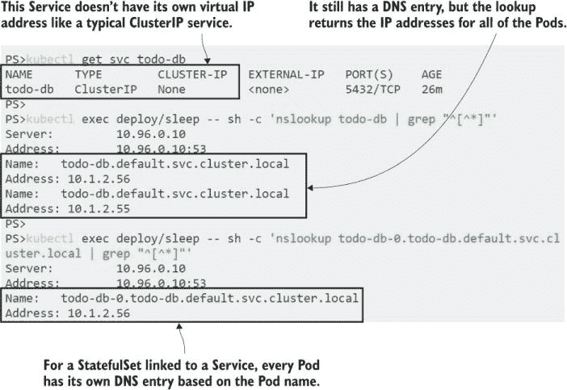

图 8.5 状态集为每个 Pod 提供自己的 DNS 条目，因此它们可以单独寻址。

可预测的启动顺序和可单独寻址的 Pod 是初始化 StatefulSet 中集群应用的基石。不同应用之间的细节可能会有很大差异，但总体上，Pod 的启动逻辑可能如下：如果我是 Pod 0，那么我是主节点，所以我将执行所有主节点的设置工作；否则，我是辅助节点，所以我将给主节点一些时间来设置，检查一切是否正常工作，然后使用 Pod 0 的地址进行同步。

Postgres 的实际设置相当复杂，所以在这里我将跳过它。它使用 ConfigMap 中的脚本在初始化容器中设置主节点和辅助节点。我在 StatefulSet 的规范中使用了我们在书中已经介绍过的各种技术，这值得探索，但脚本的细节都是特定于 Postgres 的。

现在尝试一下：更新数据库以使其成为复制设置。ConfigMap 中有配置文件和启动脚本，StatefulSet 被更新以在初始化容器中使用它们。

```
# deploy the replicated StatefulSet setup:
kubectl apply -f todo-list/db/replicated/

# wait for the Pods to spin up
kubectl wait --for=condition=Ready pod -l app=todo-db

# check the logs of Pod 0--the primary:
kubectl logs todo-db-0 --tail 1

# and of Pod 1--the secondary:
kubectl logs todo-db-1 --tail 2
```

Postgres 使用主动-被动模型进行复制，因此主节点用于数据库的读取和写入，辅助节点从主节点同步数据，并且可以被客户端使用，但仅限于读访问。图 8.6 展示了初始化容器如何识别每个 Pod 的角色并初始化它们。

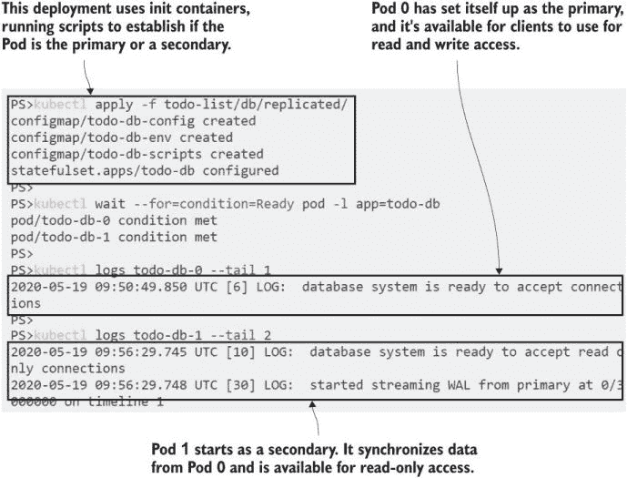

图 8.6 显示 Pod 是副本，但它们可以有不同的行为，使用初始化容器来选择角色。

初始化此类复制应用的大部分复杂性在于对工作流程的建模，这是特定于应用的。这里的初始化容器脚本使用`pg_isready`工具来验证主节点是否准备好接收连接，并使用`pb_basebackup`工具来启动复制。这些实现细节被抽象化，以便系统管理员管理。他们可以通过扩展 StatefulSet 来添加更多副本，就像使用任何其他复制控制器一样。

现在尝试一下：扩展数据库以添加另一个副本，并确认新的 Pod 也以辅助节点的方式启动。

```
# add another replica:
kubectl scale --replicas=3 statefulset/todo-db

# wait for Pod 2 to spin up
kubectl wait --for=condition=Ready pod -l app=todo-db

# check that the new Pod sets itself up as another secondary:
kubectl logs todo-db-2 --tail 2
```

我不会称这为一个企业级的生产设置，但这是一个很好的起点，真正的 Postgres 专家可以在这里接管。你现在有一个功能齐全的、具有主节点和两个辅助节点的复制 Postgres 数据库集群——Postgres 称它们为*备用节点*。如图 8.7 所示，所有备用节点都以相同的方式启动，从主节点同步数据，并且它们都可以被客户端用于只读访问。

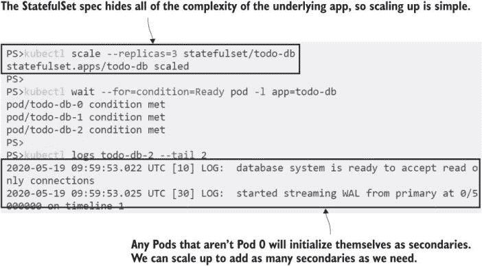

图 8.7 使用可单独寻址的 Pod 意味着辅助节点总能找到主节点。

这里缺少一个明显的部分——实际的数据存储。我们设置的配置并不是真正可用的，因为它没有存储卷，所以每个数据库容器都在自己的可写层中写入数据，而不是在持久卷中。StatefulSets 有一种定义卷需求的好方法：你可以在规范中包含一组持久卷声明（PVC）模板。

## 8.3 使用卷声明模板请求存储

卷是标准 Pod 规范的一部分，你可以将 ConfigMaps 和 Secrets 加载到 Pod 中以供 StatefulSet 使用。你甚至可以包括一个 PVC 并将其挂载到应用程序容器中，但这会给所有 Pod 提供共享的卷。这对于只读配置设置来说是可以的，你希望每个 Pod 都有相同的数据，但如果挂载标准 PVC 用于数据存储，那么每个 Pod 都会尝试写入相同的卷。

你实际上希望每个 Pod 都有自己的 PVC，Kubernetes 通过 spec 中的 `volumeClaimTemplates` 字段为 StatefulSet 提供了这一点。卷声明模板可以包括存储类以及容量和访问模式要求。当你使用卷声明模板部署 StatefulSet 时，它会为每个 Pod 创建一个 PVC，并且它们是链接的，所以如果 Pod 0 被替换，新的 Pod 0 将连接到之前 Pod 0 使用的 PVC。

列表 8.4 显示了一个简单的 sleep 规范，它使用了卷声明模板。正如我们在第五章中学到的，不同的 Kubernetes 平台提供不同的存储类，我无法确定你的集群提供什么。这个规范省略了存储类，这意味着卷将使用你的集群的默认存储类动态配置。

列表 8.4 sleep-with-pvc.yaml，一个带有卷声明模板的 StatefulSet

```
spec:
  selector:     
    # pod selector...
  serviceName:  
    # headless service name...
  replicas: 2
  template:     
    # pod template...

  volumeClaimTemplates:      
    - metadata:
        name: data          # The name to use for volume mounts in the Pod
      spec:                 # This is a standard PVC spec.
        accessModes: 
          - ReadWriteOnce
        resources:
          requests:
            storage: 5Mi
```

我们将使用这个练习来查看在简单环境中 StatefulSet 中的卷声明模板是如何工作的，然后再将其作为数据库集群的存储层添加。

现在尝试一下 从列表 8.4 中部署 StatefulSet，并探索它创建的 PVC。

```
# deploy the StatefulSet with volume claim templates:
kubectl apply -f sleep/sleep-with-pvc.yaml

# check that the PVCs are created:
kubectl get pvc

# write some data to the PVC mount in Pod 0:
kubectl exec sleep-with-pvc-0 -- sh -c 'echo Pod 0 > /data/pod.txt'

# confirm Pod 0 can read the data:
kubectl exec sleep-with-pvc-0 -- cat /data/pod.txt

# confirm Pod 1 can’t--this will fail:
kubectl exec sleep-with-pvc-1 -- cat /data/pod.txt
```

你会看到集合中的每个 Pod 都会动态创建一个 PVC，这反过来又使用默认存储类（或者如果我在规范中包含了一个，则是请求的存储类）创建一个 PersistentVolume。所有 PVC 都有相同的配置，并且它们使用与 StatefulSet 中的 Pod 相同的稳定方法：它们有一个可预测的名称，正如你在图 8.8 中看到的，每个 Pod 都有自己的 PVC，这为副本提供了独立的存储。

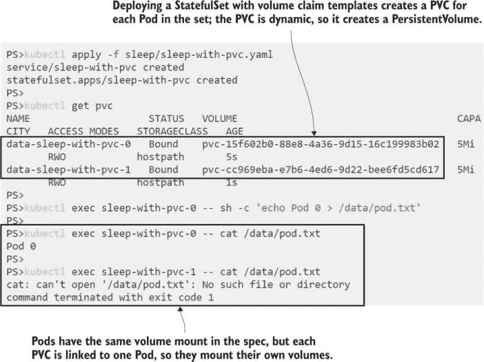

图 8.8 卷声明模板在 StatefulSet 中动态为 Pods 创建存储。

当 Pod 被替换时，Pod 和其 PVC 之间的链接被保留，这正是 StatefulSet 能够运行数据密集型应用程序的真正原因。当你推出应用程序的更新时，新的 Pod 0 将连接到之前 Pod 0 的 PVC，新的应用程序容器将能够访问与被替换的应用程序容器完全相同的状态。

现在尝试一下 通过移除 Pod 0 触发 Pod 替换。它将被另一个 Pod 0 替换，该 Pod 0 将连接到相同的 PVC。

```
# delete the Pod:
kubectl delete pod sleep-with-pvc-0

# check that the replacement gets created:
kubectl get pods -l app=sleep-with-pvc

# check that the new Pod 0 can see the old data:
kubectl exec sleep-with-pvc-0 -- cat /data/pod.txt
```

这个简单的例子使这一点变得清晰——你可以在图 8.9 中看到新的 Pod 0 可以访问原始 Pod 的所有数据。在生产集群中，你会指定一个使用任何节点都可以访问的卷类型的存储类，这样替换的 Pod 就可以在任何节点上运行，应用程序容器仍然可以挂载 PVC。

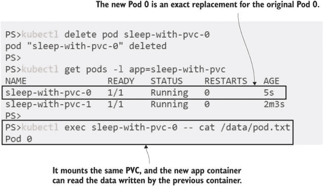

图 8.9 StatefulSet 的稳定性延伸到保留 Pod 替换之间的 PVC 链接。

卷声明模板是我们需要添加到 Postgres 部署中的最后一部分，以模拟一个完全可靠的数据库。StatefulSets 旨在为您的应用程序提供一个稳定的环境，因此它们在更新方面不如其他控制器灵活——您不能更新现有的 StatefulSet 并做出基本更改，例如添加卷声明。您需要确保您的设计满足 StatefulSet 的应用程序要求，因为在重大变化期间很难维护服务水平。

现在试试看 我们将更新 Postgres 部署，但首先我们需要删除现有的 StatefulSet。

```
# apply the update with volume claim templates--this will fail:
kubectl apply -f todo-list/db/replicated/update/todo-db-pvc.yaml 

# delete the existing set:
kubectl delete statefulset todo-db

# create a new one with volume claims:
kubectl apply -f todo-list/db/replicated/update/todo-db-pvc.yaml

# check the volume claims:
kubectl get pvc -l app=todo-db  
```

当你运行这个练习时，你应该清楚地看到 StatefulSet 如何保持顺序，并在启动下一个 Pod 之前等待每个 Pod 运行。从我的输出中，你可以看到 PVCs 也是按顺序为每个 Pod 创建的，如图 8.10 所示。

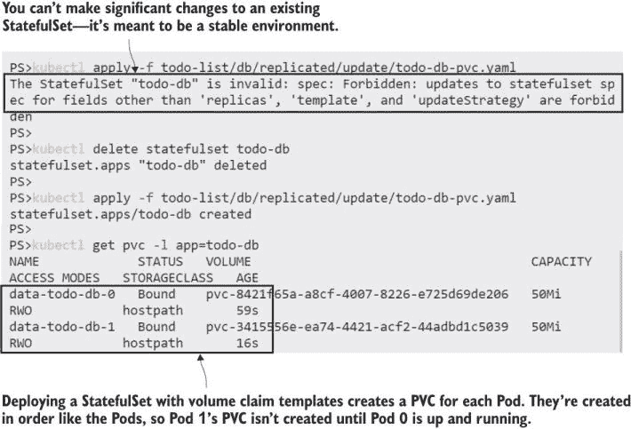

图 8.10 PVCs 被创建并分配给 Postgres Pods。

感觉我们已经在 StatefulSets 上花费了很长时间，但这是一个你应该很好地理解的课题，这样当有人要求你将他们的数据库迁移到 Kubernetes（他们会的）时，你不会感到惊讶。StatefulSets 附带了很多复杂性，你大部分时间都不会使用它们。但如果你正在寻找将现有应用程序迁移到 Kubernetes，StatefulSets 可能是能够在同一平台上运行所有内容或必须保留几个 VM 来运行一个或两个应用程序之间的区别。

我们将用一项练习来结束本节，以展示我们集群数据库的力量。Postgres 从主副本复制所有数据，并且可以被客户端用于只读访问。如果我们的事务列表应用出现了严重的生产问题，导致它丢失数据，我们可以选择切换到只读模式并使用副本来调查问题。这样可以在最小功能的情况下安全地运行应用程序，这绝对比将其关闭要好。

现在试试看 运行待办事项 Web 应用并输入一些条目。在默认配置中，它连接到 StatefulSet 的 Pod 0 中的 Postgres 主副本。然后我们将切换应用程序配置以将其置于只读模式。这使得它连接到 Pod 1 中的只读 Postgres 备用副本，该副本已复制了 Pod 0 的所有数据。

```
# deploy the web app:
kubectl apply -f todo-list/web/

# get the URL for the app:
kubectl get svc todo-web -o jsonpath='http://{.status.loadBalancer.ingress[0].*}:8081/new'

# browse and add a new item

# switch to read-only mode, using the database secondary:
kubectl apply -f todo-list/web/update/todo-web-readonly.yaml

# refresh the app--the /new page is read-only;
# browse to /list and you'll see your original data

# check that there are no clients using the primary in Pod 0:
kubectl exec -it todo-db-0 -- sh -c "psql -U postgres
 -t -c 'SELECT datname, query FROM pg_stat_activity WHERE datid > 0'"

# check that the web app really is using the secondary in Pod 1:
kubectl exec -it todo-db-1 -- sh -c "psql -U postgres
 -t -c 'SELECT datname, query FROM pg_stat_activity WHERE datid > 0'"
```

您可以在图 8.11 中看到我的输出，其中包含一些小截图，展示了应用程序在只读模式下运行，但仍能访问所有数据。

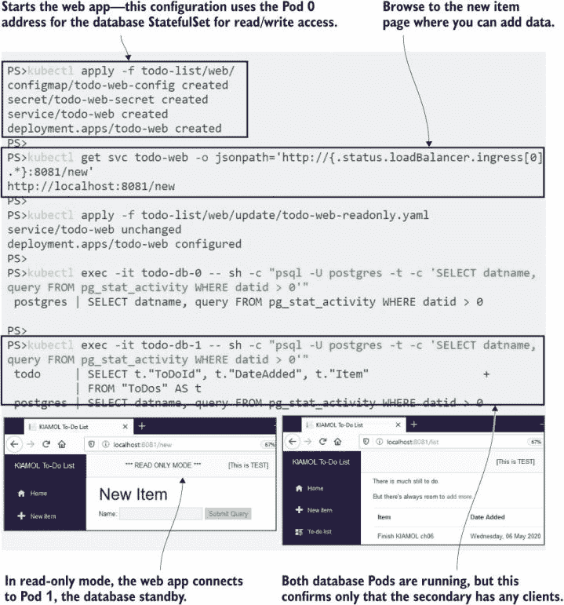

图 8.11 如果存在数据问题，将应用程序切换到只读模式是一个有用的选项

Postgres 自 1996 年以来一直作为 SQL 数据库引擎存在——它比 Kubernetes 早了近 25 年。使用 StatefulSet，你可以创建一个适合 Postgres 和其他类似集群应用的应用环境，提供稳定的网络、存储和初始化，在容器动态世界中。

## 8.4 使用作业和 CronJobs 运行维护任务

数据密集型应用需要与计算对齐的复制数据存储，并且通常还需要对存储层进行一些独立的管理。数据备份和校验非常适合另一种类型的 Pod 控制器：作业。Kubernetes 作业通过 Pod 规范定义，并以批处理作业的方式运行 Pod，确保其运行至完成。

作业不仅仅适用于有状态的应用；它们是解决任何批处理问题的标准方法，在这些情况下，你可以将所有调度、监控和重试逻辑交给集群。你可以在 Pod 中运行任何容器镜像作为作业，但应该启动一个结束进程；否则，你的作业将永远运行。列表 8.5 展示了运行 Pi 应用程序的批处理模式的作业规范。

列表 8.5 pi-job.yaml，一个简单的计算π的作业

```
apiVersion: batch/v1
kind: Job                           # Job is the object type.
metadata:
  name: pi-job
spec:
  template:
    spec:                           # The standard Pod spec
      containers:
        - name: pi                  # The container should run and exit.
          image: kiamol/ch05-pi     
          command: ["dotnet", "Pi.Web.dll", "-m", "console", "-dp", "50"]
      restartPolicy: Never          # If the container fails, replace the Pod.
```

作业模板包含一个标准的 Pod 规范，并添加了一个必需的`restartPolicy`字段。该字段控制作业在失败时的行为。你可以选择在运行失败时让 Kubernetes 使用新容器重启相同的 Pod，或者始终创建一个替换 Pod，可能是在不同的节点上。在作业的正常运行中，如果 Pod 成功完成，作业和 Pod 将被保留，以便容器日志可用。

现在尝试运行 Pi 作业，并检查 Pod 的输出。

```
# deploy the Job:
kubectl apply -f pi/pi-job.yaml

# check the logs for the Pod:
kubectl logs -l job-name=pi-job

# check the status of the Job:
kubectl get job pi-job
```

作业会给它们创建的 Pod 添加自己的标签。`job-name`标签始终被添加，这样你就可以从作业导航到 Pod。我在图 8.12 中的输出显示，作业已经成功完成一次，计算结果可在日志中找到。


图 8.12 作业创建 Pod，确保它们完成，然后将其留在集群中。

拥有不同的计算π的选项总是很有用，但这只是一个简单的例子。你可以在 Pod 规范中使用任何容器镜像，因此你可以使用作业运行任何类型的批处理过程。你可能有一组需要执行相同工作的输入项；你可以为整个集合创建一个作业，它为每个项目创建一个 Pod，Kubernetes 将工作分布在整个集群中。作业规范通过以下两个可选字段支持这一点：

+   `completions`——指定作业应运行多少次。如果你的作业正在处理工作队列，那么应用容器需要理解如何获取下一个要处理的项目。作业本身只确保运行与所需完成次数相等的 Pod 数量。

+   `parallelism`——指定对于具有多个完成设置的作业，并行运行多少个 Pod。此设置允许您调整作业的运行速度，同时平衡集群的计算需求。

本章最后一个 Pi 示例：一个新作业规格，它并行运行多个 Pod，每个 Pod 计算到随机位数的π。此规格使用初始化容器生成要使用的位数，应用程序容器使用共享`EmptyDir`挂载读取该输入。这是一个很好的方法，因为应用程序容器不需要修改就可以在并行环境中工作。您可以使用初始化容器从队列中获取工作项，这样应用程序本身就不需要知道队列的存在。

现在试试看：运行一个使用并行处理并展示来自同一规格的多个 Pod 可以处理不同工作负载的替代 Pi 作业。

```
# deploy the new Job:
kubectl apply -f pi/pi-job-random.yaml

# check the Pod status:
kubectl get pods -l job-name=pi-job-random

# check the Job status:
kubectl get job pi-job-random

# list the Pod output:
kubectl logs -l job-name=pi-job-random
```

这个练习可能需要一段时间才能运行，具体取决于您的硬件和生成的位数数量。您将看到所有 Pod 并行运行，各自进行计算。最终输出将是三组π，可能精确到数千位。我已经将我的结果简化，如图 8.13 所示。

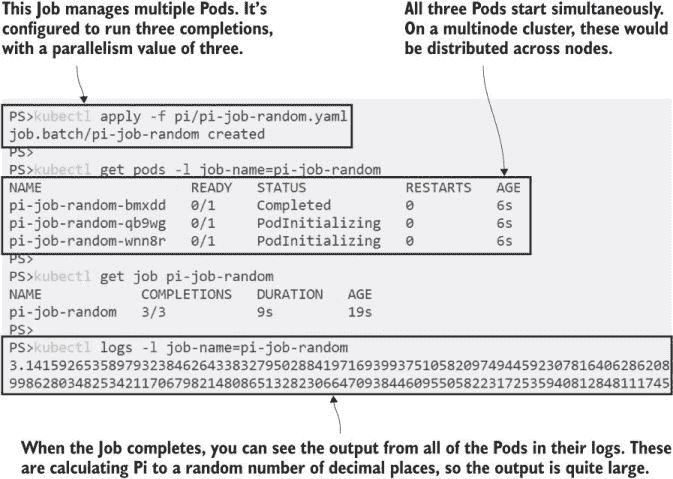

图 8.13 作业可以运行来自同一规格的多个 Pod，每个 Pod 处理不同的工作负载。

作业是您口袋里的一大法宝。它们非常适合任何计算密集型或 I/O 密集型任务，您希望确保一个进程完成，但不介意何时完成。您甚至可以从自己的应用程序提交作业——运行在 Kubernetes 中的 Web 应用程序可以访问 Kubernetes API 服务器，并创建作业来为用户运行工作。

作业的真正力量在于它们在集群的上下文中运行，因此它们可以使用集群的所有资源。回到 Postgres 示例，我们可以在作业中运行数据库备份过程，并且运行的 Pod 可以根据需要访问 StatefulSet 中的 Pod 或 PVC。这解决了这些数据密集型应用程序的培育方面，但这些作业需要定期运行，这就是 CronJob 的作用。CronJob 是一个作业控制器，它按固定的时间表创建作业。图 8.14 显示了工作流程。

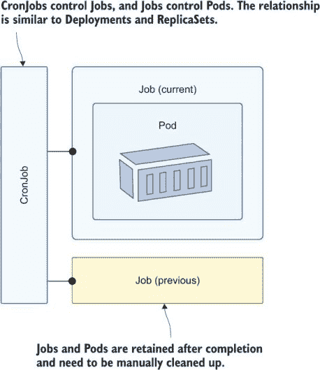

图 8.14 CronJobs 是作业 Pod 的最终所有者，因此可以通过级联删除删除所有内容。

CronJob 规格包括作业规格，因此您可以在 CronJob 中执行任何在作业中可以执行的操作，包括并行运行多个完成。作业运行的计划使用 Linux Cron 格式，允许您表达从简单的“每分钟”或“每天”计划到更复杂的“每周日早上 4 点和 6 点”等复杂计划。列表 8.6 显示了运行数据库备份的 CronJob 规格的一部分。

列表 8.6 todo-db-backup-cronjob.yaml，数据库备份的 CronJob

```
apiVersion: batch/v1beta1
kind: CronJob
metadata:
  name: todo-db-backup
spec:
  schedule: "*/2 * * * *"          # Creates a Job every 2 minutes
  concurrencyPolicy: Forbid        # Prevents overlap so a new Job won’t be
  jobTemplate:                     # created if the previous one is running
    spec:
      # job template...
```

完整规范使用 Postgres Docker 镜像，并包含一个运行 `pg_dump` 备份工具的命令。Pod 从与 StatefulSet 使用相同的 ConfigMaps 和 Secrets 加载环境变量和密码，因此在配置文件中没有重复。它还使用自己的 PVC 作为写入备份文件的存储位置。

现在尝试一下：根据列表 8.6 中的规范创建一个 CronJob，每两分钟运行一次数据库备份作业。

```
# deploy the CronJob and target PVC for backup files:
kubectl apply -f todo-list/db/backup/

# wait for the Job to run--this is a good time to make tea:
sleep 150

# check the CronJob status:
kubectl get cronjob todo-db-backup

# now run a sleep Pod that mounts the backup PVC:
kubectl apply -f sleep/sleep-with-db-backup-mount.yaml

# check if the CronJob Pod created the backup:
kubectl exec deploy/sleep -- ls -l /backup
```

CronJob 设置为每两分钟运行一次，所以在这次练习中你需要给它一些时间来启动。按照计划，CronJob 创建一个作业，该作业创建一个 Pod，并运行 `backup` 命令。作业确保 Pod 成功完成。你可以通过在另一个 Pod 中挂载相同的 PVC 来确认备份文件已写入。你可以在图 8.15 中看到所有操作都正确无误。

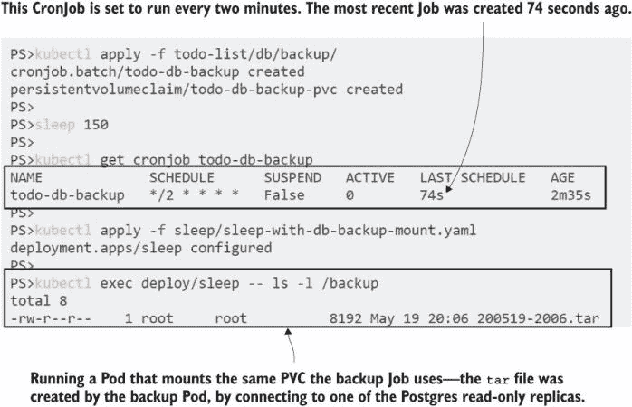

图 8.15 CronJobs 运行 Pods，这些 Pods 可以访问其他 Kubernetes 对象。这个示例连接到一个数据库 Pod。

CronJobs 不会自动清理 Pods 和 Jobs。生存时间 (TTL) 控制器负责这项工作，但它是一个 alpha 级别的功能，在许多 Kubernetes 平台上不可用。如果没有它，当你确定不再需要它们时，你需要手动删除子对象。你还可以将 CronJobs 移动到挂起状态，这意味着对象规范仍然存在于集群中，但直到 CronJob 再次激活，它不会运行。

现在尝试一下：挂起 CronJob，使其不再创建备份作业，然后探索 CronJob 及其作业的状态。

```
# update the CronJob, and set it to suspend:
kubectl apply -f todo-list/db/backup/update/todo-db-backup-cronjob-suspend.yaml

# check the CronJob:
kubectl get cronjob todo-db-backup

# find the Jobs owned by the CronJob:
kubectl get jobs -o jsonpath="{.items[?(@.metadata.ownerReferences[0]
.name=='todo-db-backup')].metadata.name}"
```

如果你探索对象层次结构，你会看到 CronJobs 不遵循标准的控制器模型，没有使用标签选择器来识别它拥有的作业。你可以在 CronJob 的作业模板中添加自己的标签，但如果你不这样做，你需要识别所有所有者引用为 CronJob 的作业，如图 8.16 所示。

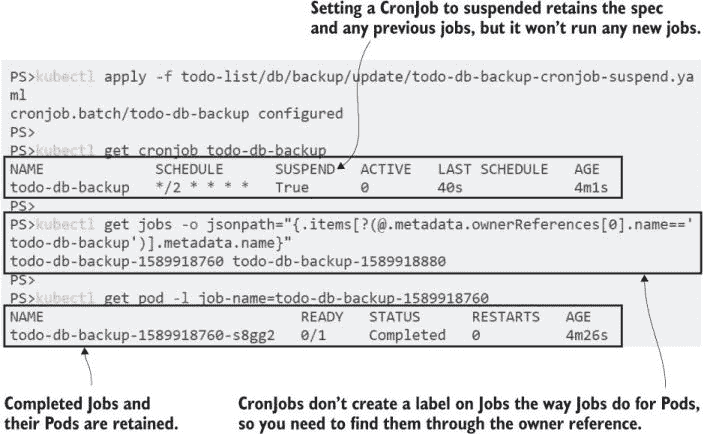

图 8.16 CronJobs 不使用标签选择器来建模所有权，因为它们不跟踪作业。

当你开始更多地使用 Jobs 和 CronJobs 时，你会发现规范的简单性掩盖了过程中的某些复杂性，并呈现了一些有趣的故障模式。Kubernetes 尽力确保你的批处理作业在你想要的时候启动并运行到完成，这意味着你的容器需要具有弹性。完成作业可能意味着重启一个带有新容器的 Pod 或者在新的节点上替换 Pod，而对于 CronJobs，如果过程持续时间超过计划间隔，则可能运行多个 Pod。你的容器逻辑需要允许所有这些场景。

现在你已经知道如何在 Kubernetes 中运行数据密集型应用了，使用 StatefulSets 来建模稳定的运行时环境并初始化应用，以及使用 CronJobs 来处理数据备份和其他定期维护工作。我们将思考这是否真的是一个好主意来结束本章。

## 8.5 选择状态化应用的平台

Kubernetes 的伟大承诺是它为你提供了一个单一的平台，可以在任何基础设施上运行所有应用程序。想象一下，你可以在一小块 YAML 中模拟任何应用程序的所有方面，使用一些 kubectl 命令部署它，并知道它将在任何集群中以相同的方式运行，利用平台提供的所有扩展功能，这非常吸引人。但是数据是宝贵的，通常不可替代，所以在你决定 Kubernetes 是运行数据密集型应用程序的地方之前，你需要仔细思考。

图 8.17 显示了我们在本章中构建的完整设置，以在 Kubernetes 中运行几乎生产级别的 SQL 数据库。只需看看所有移动部件——你真的想管理所有这些吗？而且你需要投入多少时间来测试这个设置与你的数据大小：验证副本是否正确同步，验证备份可以恢复，运行混沌实验以确保失败以你期望的方式处理？

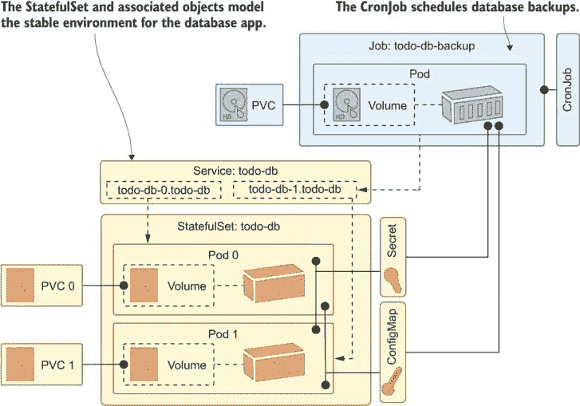

图 8.17 哎呀！而且这是一个简化版本，没有显示卷或初始化容器。

将其与云中的托管数据库进行比较。Azure、AWS 和 GCP 都为 Postgres、MySQL 和 SQL Server 提供托管服务，以及他们自己的定制云规模数据库。云服务提供商负责扩展和高可用性，包括备份到云存储和更高级的选项，如威胁检测。另一种架构只是使用 Kubernetes 进行计算，并连接到托管云服务以处理数据和通信。

哪个选项更好？嗯，我白天是一名顾问，我知道唯一真正的答案是：“这取决于。”如果你在云中运行，那么我认为你需要一个非常充分的理由*不*在生产中使用托管服务，因为数据至关重要。在非生产环境中，通常在 Kubernetes 中运行等效服务是有意义的，这样你就可以在开发和测试环境中以较低的成本和易于部署的方式运行容器化的数据库和消息队列，并在生产中切换到托管版本。Kubernetes 通过所有 Pod 和服务配置选项使这种切换变得非常简单。

在数据中心，情况略有不同。如果你已经在自己的基础设施上运行 Kubernetes，那么你承担了大量的管理工作，这可能意味着最大化集群的利用率并将它们用于一切。如果你选择这样做，Kubernetes 为你提供了将数据密集型应用程序迁移到集群并使用所需可用性和扩展级别的工具。只是不要低估达到这一目标复杂性。

我们现在已经完成了 StatefulSets 和 Jobs，所以在进入实验室之前我们可以进行清理。

现在试试看 所有顶层对象都被标记了，所以我们可以通过级联删除移除所有内容。

```
# delete all the owning objects:
kubectl delete all -l kiamol=ch08

# delete the PVCs
kubectl delete pvc -l kiamol=ch08
```

## 8.6 实验室

那么，你还有多少午餐时间可以用来做这个实验？你能从头开始构建一个 MySQL 数据库，包括备份吗？可能不行，但别担心——这个实验并没有那么复杂。目标只是让你获得一些使用 StatefulSets 和 PVCs 的工作经验，所以我们将会使用一个更简单的应用程序。你将在 StatefulSet 中运行 Nginx 网络服务器，其中每个 Pod 将日志文件写入自己的 PVC，然后你将运行一个作业来打印每个 Pod 日志文件的大小。基本组件已经为你准备好了，所以这主要是应用章节中的一些技术。

+   起始点是 `ch08/lab/nginx` 中的 Nginx 规范，它运行一个 Pod 将日志写入一个 `EmptyDir` 卷。

+   Pod 规范需要迁移到 StatefulSet 定义，该定义配置为运行三个 Pod，并为每个 Pod 提供单独的存储。

+   当你的 StatefulSet 运行正常时，你应该能够调用你的 Service 并看到 Pod 中正在写入的日志文件。

+   然后，你可以在文件 `disk-calc-job.yaml` 中完成作业规范，添加卷挂载，以便它可以从 Nginx Pods 中读取日志文件。

实际情况并没有看起来那么糟糕，这会让你开始思考存储和作业。我的解决方案在 GitHub 上，你可以像往常一样在以下位置查看：[`github.com/sixeyed/kiamol/blob/master/ch08/lab/README.md`](https://github.com/sixeyed/kiamol/blob/master/ch08/lab/README.md)。
