# 9 使用滚动更新和回滚管理应用发布

你将更频繁地更新现有应用，而不是部署新的东西。容器化应用从它们使用的基镜像中继承了多个发布周期；Docker Hub 上的操作系统、平台 SDK 和运行时官方镜像通常每月都有一个新版本。你应该有一个流程来重建你的镜像并在依赖项更新时发布更新，因为这些依赖项可能包含关键的安全补丁。这个过程的关键是能够安全地推出更新，并在更新出错时提供暂停和回滚更新的选项。Kubernetes 为 Deployments、DaemonSets 和 StatefulSets 提供了这些场景的解决方案。

单一更新方法并不适用于所有类型的应用，因此 Kubernetes 为控制器提供了不同的更新策略，并提供了调整策略工作方式的选项。我们将在本章中探讨所有这些选项。如果你因为对 6000 字关于应用更新的内容不感兴趣而考虑跳过这一部分，我建议你坚持下来。更新是导致应用停机时间最长的原因，但如果你理解 Kubernetes 提供的工具，你可以显著降低风险。而且，我会尽力在这个过程中加入一些兴奋的元素。

## 9.1 Kubernetes 如何管理滚动更新

我们将从部署（Deployments）开始——实际上，你已经进行了很多部署更新。每次我们对现有的部署进行更改（我们每章都会做 10 次这样的操作），Kubernetes 都会通过一个*滚动更新*来实现。在滚动更新中，部署会创建一个新的副本集（ReplicaSet），并将其扩展到所需的副本数量，同时将之前的副本集缩小到零副本。图 9.1 显示了正在进行的更新。

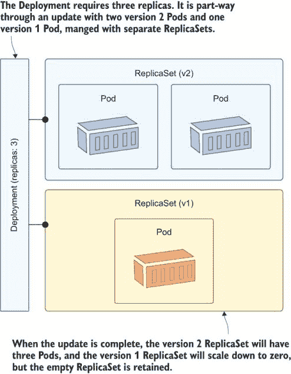

图 9.1 部署控制多个副本集，以便它们可以管理滚动更新。

滚动更新不是由对部署的每一次更改触发的，而只是由对 Pod 规范的更改触发的。如果你做出的是部署可以用当前副本集管理的更改，比如更新副本数量，那么这个更改将不会通过滚动更新来完成。

现在尝试一下：部署一个具有两个副本的简单应用，然后更新它以增加规模，看看副本集是如何被管理的。

```
# change to the exercise directory:
cd ch09

# deploy a simple web app:
kubectl apply -f vweb/

# check the ReplicaSets:
kubectl get rs -l app=vweb

# now increase the scale:
kubectl apply -f vweb/update/vweb-v1-scale.yaml

# check the ReplicaSets:
kubectl get rs -l app=vweb

# check the deployment history:
kubectl rollout history deploy/vweb
```

`kubectl rollout`命令有选项可以查看和管理滚动更新。你可以从图 9.2 中的我的输出中看到，在这个练习中只有一个滚动更新，那就是创建副本集的初始部署。规模更新只更改了现有的副本集，所以没有第二次滚动更新。

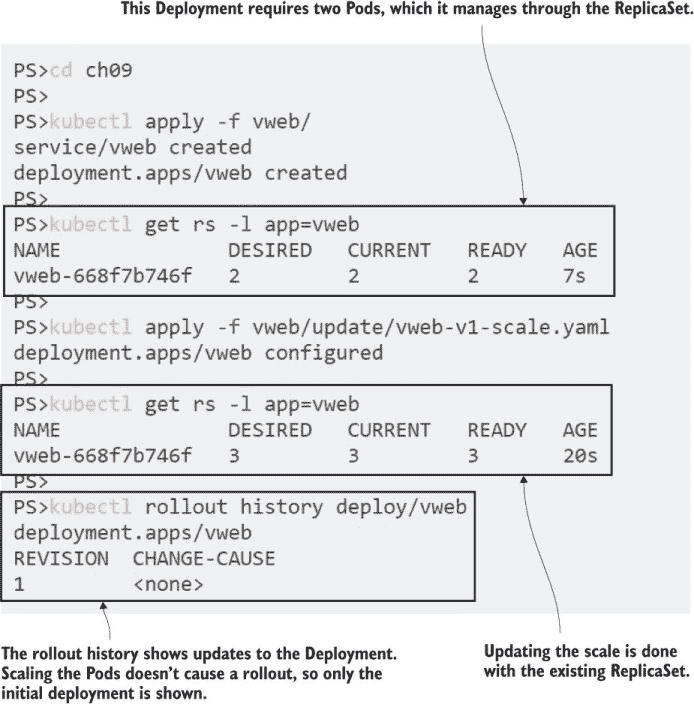

图 9.2 部署通过滚动更新管理更改，但仅当 Pod 规范更改时。

您的应用程序持续更新将集中在部署运行更新版本容器镜像的新 Pods 上。您应该通过更新 YAML 规范来管理这一点，但 kubectl 提供了使用`set`命令的快速替代方案。使用此命令是更新现有 Deployment 的强制方式，您应该将其视为与`scale`命令相同——这是一个有用的技巧，可以帮助您摆脱困境，但需要随后更新 YAML 文件。

现在尝试一下：使用 kubectl 更新 Deployment 的镜像版本。这是一个对 Pod 规范的更改，因此将触发一个新的滚动发布。

```
# update the image for the web app:
kubectl set image deployment/vweb web=kiamol/ch09-vweb:v2

# check the ReplicaSets again:
kubectl get rs -l app=vweb

# check the rollouts:
kubectl rollout history deploy/vweb
```

kubectl 的`set`命令更改现有对象的规范。您可以使用它来更改 Pod 的镜像或环境变量或服务的选择器。它是应用新 YAML 规范的快捷方式，但它是以相同的方式实现的。在这个练习中，更改导致了一个滚动，创建了一个新的 ReplicaSet 来运行新的 Pod 规范，而旧的 ReplicaSet 被缩放到零。您可以在图 9.3 中看到这一点。

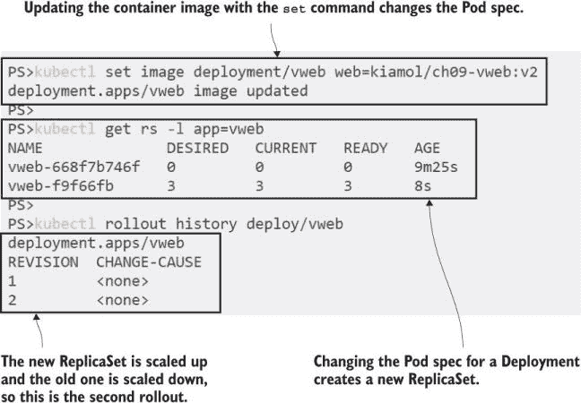

图 9.3 强制更新会经过相同的滚动过程，但现在您的 YAML 已经不同步。

Kubernetes 使用与其他 Pod 控制器（如 DaemonSets 和 StatefulSets）相同的滚动概念。它们是 API 的一个奇怪部分，因为它们不直接映射到对象（您不使用“rollout”类型创建资源），但它们是与您的发布一起工作的重要管理工具。您可以使用滚动来跟踪发布历史并回滚到以前的发布。

## 9.2 使用滚动和回滚更新 Deployment

如果您再次查看图 9.3，您会看到滚动历史记录非常不实用。每个滚动都记录了一个修订号，但没有其他信息。不清楚是什么导致了更改或哪个 ReplicaSet 与哪个修订号相关。为 Pod 添加版本号（或 Git 提交 ID）作为标签是个好主意，然后 Deployment 也会将此标签添加到 ReplicaSet 中，这使得跟踪更新更容易。

现在尝试一下：应用对 Deployment 的更新，它使用相同的 Docker 镜像，但更改了 Pod 的版本标签。这是一个对 Pod 规范的更改，因此将创建一个新的滚动发布。

```
# apply the change using the record flag:
kubectl apply -f vweb/update/vweb-v11.yaml --record

# check the ReplicaSets and their labels:
kubectl get rs -l app=vweb --show-labels

# check the current rollout status:
kubectl rollout status deploy/vweb

# check the rollout history:
kubectl rollout history deploy/vweb

# show the rollout revision for the ReplicaSets:
kubectl get rs -l app=vweb -o=custom-columns=NAME:.metadata.name,
REPLICAS:.status.replicas,REVISION:.metadata.annotations.deployment\.kubernetes\.io/revision
```

我的输出出现在图 9.4 中。添加`record`标志将 kubectl 命令作为细节保存到滚动中，如果您的 YAML 文件有标识名称，这可能很有帮助。通常它们不会有，因为您将部署整个文件夹，所以 Pod 规范中的版本号标签是一个有用的补充。然而，然后您需要一些尴尬的 JSONPath 来找到滚动修订版和 ReplicaSet 之间的链接。

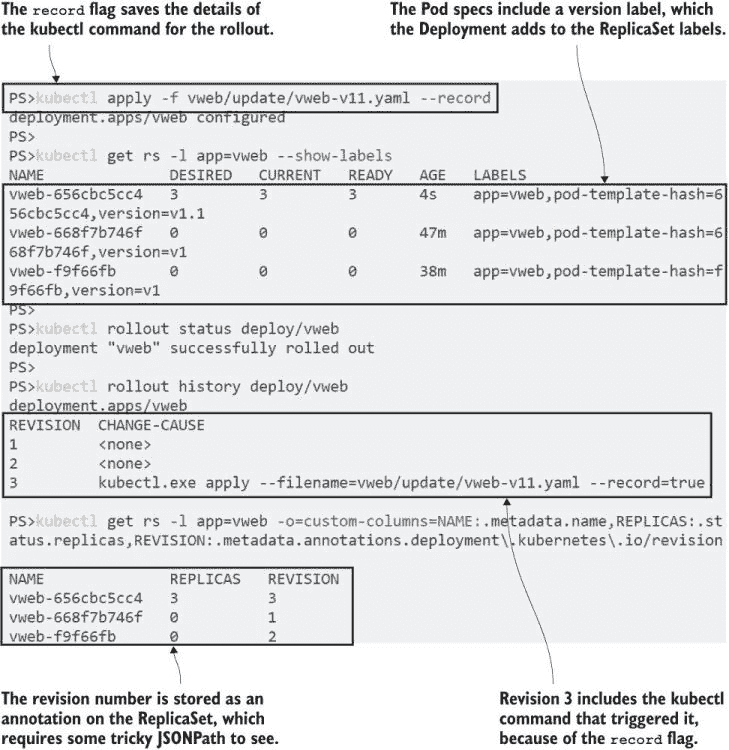

图 9.4 Kubernetes 使用标签来存储关键信息，额外的详细信息存储在注释中。

随着你的 Kubernetes 成熟度提高，你将希望有一个标准的标签集，你将包括在所有对象规范中。标签和选择器是核心功能，你将经常使用它们来查找和管理对象。应用程序名称、组件名称和版本是良好的起始标签，但区分你为方便而包含的标签和 Kubernetes 用于映射对象关系的标签很重要。

列表 9.1 显示了在之前练习中的 Pod 标签和 Deployment 的选择器。`app`标签用于选择器，Deployment 使用它来找到其 Pod。Pod 还包含一个`version`标签以方便我们使用，但它不是选择器的一部分。如果它是，那么 Deployment 就会与一个版本相关联，因为你一旦创建了 Deployment 就不能更改选择器。

列表 9.1 vweb-v11.yaml，一个在 Pod 规范中包含额外标签的 Deployment

```
spec:
  replicas: 3
  selector:
    matchLabels:
      app: vweb           # The app name is used as the selector.
  template:
    metadata:
      labels:
        app: vweb
        version: v1.1     # The Pod spec also includes a version label.
```

你需要提前仔细规划选择器，但你应该将你需要的所有标签添加到 Pod 规范中，以便使更新可管理。Deployments 保留多个 ReplicaSets（默认为 10 个），名称中的 Pod 模板哈希值使得它们在经过几次更新后仍然难以直接操作。让我们看看我们部署的应用实际上做了什么，然后看看另一个 rollout 中的 ReplicaSets。

现在试试看。向 web 服务发起 HTTP 调用以查看响应，然后开始另一个更新并再次检查响应。

```
# we’ll use the app URL a lot, so save it to a local file:
kubectl get svc vweb -o jsonpath='http://{.status.loadBalancer.ingress[0].*}:8090/v.txt' > url.txt

# then use the contents of the file to make an HTTP request:
curl $(cat url.txt)

# deploy the v2 update:
kubectl apply -f vweb/update/vweb-v2.yaml --record

# check the response again:
curl $(cat url.txt)

# check the ReplicaSet details:
kubectl get rs -l app=vweb --show-labels
```

在这个练习中，你会发现 ReplicaSets 不是容易管理的对象，这就是标准化标签发挥作用的地方。通过检查具有所有所需副本的 ReplicaSet 的标签，你可以轻松地看到哪个版本的 app 是活动的——如图 9.5 所示——但标签只是文本字段，所以你需要处理保障来确保它们的可靠性。

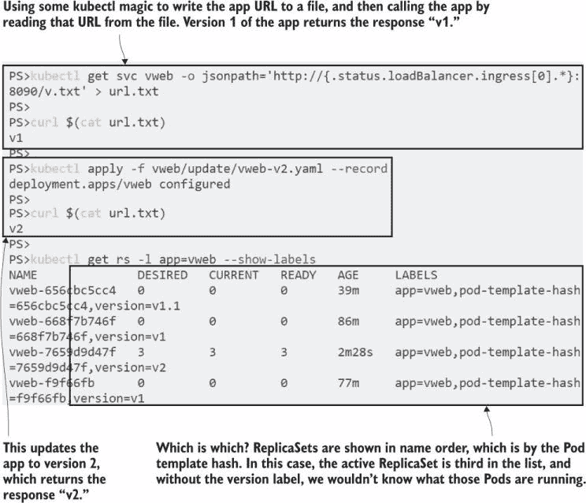

图 9.5 Kubernetes 为你管理 rollouts，但如果你添加标签以便了解情况，那就更有帮助了。

Rollouts 确实有助于抽象出 ReplicaSets 的细节，但它们的主要用途是管理发布。我们已经从 kubectl 中看到了 rollout 历史，你也可以运行命令来暂停正在进行的 rollout 或将部署回滚到早期版本。一个简单的命令会回滚到上一个部署，但如果你想要回滚到特定版本，你需要使用一些 JSONPath 技巧来找到你想要的修订版本。我们现在将展示这一点，并使用 kubectl 的一个非常实用的功能，它会在实际执行命令之前告诉你命令执行的结果。

现在试试看。检查 rollout 历史并尝试将应用回滚到 v1 版本。

```
# look at the revisions:
kubectl rollout history deploy/vweb

# list ReplicaSets with their revisions:
kubectl get rs -l app=vweb -o=custom-columns=NAME:.metadata.name,
    REPLICAS:.status.replicas,VERSION:.metadata.labels.version,
    REVISION:.metadata.annotations.deployment\.kubernetes\.io/revision

# see what would happen with a rollback:
kubectl rollout undo deploy/vweb --dry-run

# then start a rollback to revision 2:
kubectl rollout undo deploy/vweb --to-revision=2

# check the app--this should surprise you:
curl $(cat url.txt)
```

如果你在看到图 9.6 中显示的最终输出时感到困惑，请举手（这是本章的精彩部分）。我的手举起来了，我早就知道会发生什么。这就是为什么你需要一个一致的发布流程，最好是完全自动化的，因为一旦你开始混合方法，你就会得到令人困惑的结果。我回滚到了修订版 2，根据 ReplicaSets 上的标签，这应该会回滚到应用程序的 v1 版本。但修订版 2 实际上是来自第 9.1 节中的`kubectl` `set` `image`练习，所以容器镜像版本是 v2，但 ReplicaSet 标签是 v1。

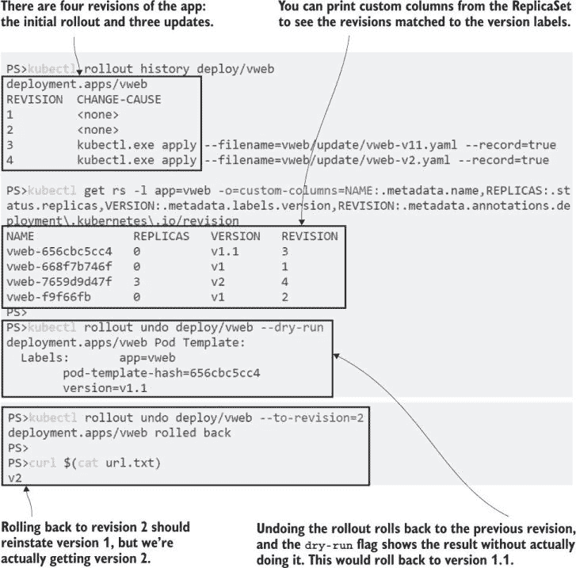

图 9.6 标签是关键管理功能，但它们是由人类设置的，因此是易出错的。

你会发现发布流程的移动部分相当简单：部署创建和重用 ReplicaSets，根据需要对其进行扩展和缩减，而 ReplicaSets 的更改则记录为滚动更新。Kubernetes 让你能够控制滚动策略中的关键因素，但在我们继续之前，我们将看看也涉及配置更改的发布，因为这增加了另一个复杂因素。

在第四章中，我谈到了更新 ConfigMaps 和 Secrets 内容的不同方法，你做出的选择会影响你干净回滚的能力。第一种方法是说配置是可变的，因此发布可能包括 ConfigMap 更改，这是对现有 ConfigMap 对象的更新。但如果你发布的**仅**是配置更改，那么你将没有滚动更新的记录，也没有回滚的选项。

现在试试这个：移除现有的 Deployment，以便我们有干净的历史记录，然后部署一个使用 ConfigMap 的新版本，看看当你更新相同的 ConfigMap 时会发生什么。

```
# remove the existing app:
kubectl delete deploy vweb

# deploy a new version that stores content in config:
kubectl apply -f vweb/update/vweb-v3-with-configMap.yaml --record

# check the response:
curl $(cat url.txt)

# update the ConfigMap, and wait for the change to propagate:
kubectl apply -f vweb/update/vweb-configMap-v31.yaml --record
sleep 120

# check the app again:
curl $(cat url.txt)

# check the rollout history:
kubectl rollout history deploy/vweb
```

正如你在图 9.7 中看到的，ConfigMap 的更新改变了应用程序的行为，但这不是对 Deployment 的更改，因此如果配置更改导致问题，就没有可回滚的修订版。

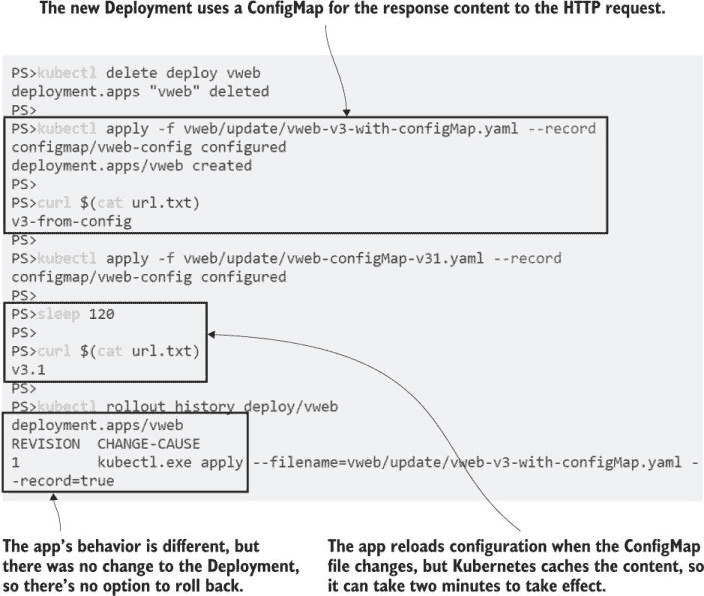

图 9.7 配置更新可能会改变应用程序的行为，但不会记录滚动更新。

这是热重载方法，如果你的应用程序支持它，这种方法工作得很好，因为仅配置更改不需要滚动更新。现有的 Pods 和容器继续运行，因此没有服务中断的风险。代价是失去了回滚选项，你必须决定这是否比热重载更重要。

你的另一种选择是将所有 ConfigMaps 和 Secrets 视为不可变的，因此在对象名称中包含一些版本控制方案，一旦创建配置对象就不再更新。相反，你创建一个新的配置对象并使用新名称发布，同时与更新 Deployment 一起发布，该 Deployment 引用新的配置对象。

现在试试这个：部署一个具有不可变配置的应用程序新版本，这样你可以比较发布流程。

```
# remove the old Deployment:
kubectl delete deploy vweb

# create a new Deployment using an immutable config:
kubectl apply -f vweb/update/vweb-v4-with-configMap.yaml --record

# check the output:
curl $(cat url.txt)

# release a new ConfigMap and updated Deployment:
kubectl apply -f vweb/update/vweb-v41-with-configMap.yaml --record

# check the output again:
curl $(cat url.txt)

# the update is a full rollout:
kubectl rollout history deploy/vweb

# so you can rollback:
kubectl rollout undo deploy/vweb
curl $(cat url.txt)
```

图 9.8 显示了我的输出，其中配置更新伴随着部署更新，这保留了滚动发布的历史并启用了回滚。

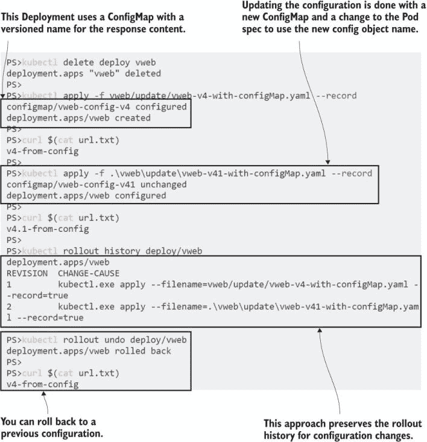

图 9.8 不可变配置保留了滚动发布历史，但这意味着每次配置更改都需要进行滚动发布。

Kubernetes 实际上并不关心你采取哪种方法，你的选择将部分取决于你组织中谁拥有配置。如果项目团队也拥有部署和配置，那么你可能更喜欢可变配置对象以简化发布过程和管理对象的数量。如果有一个独立的团队负责配置，那么不可变的方法会更好，因为他们可以在发布之前部署新的配置对象。你的应用程序规模也会影响这个决定：在高规模下，你可能更喜欢减少应用程序部署的数量并依赖于可变配置。

这个决策会产生文化影响，因为它决定了人们如何看待应用程序的发布——是日常事件，没什么大不了的，还是稍微有些可怕的事情，应尽可能避免。在容器世界中，发布应该是简单的事件，一旦需要，你就可以以最少的仪式进行。测试和调整你的发布策略将大大增强你的信心。

## 9.3 配置 Deployments 的滚动更新

部署支持两种更新策略：RollingUpdate 是默认的，也是我们迄今为止使用的策略，另一种是 Recreate。你知道滚动更新的工作原理——通过缩小旧的 ReplicaSet 同时扩大新的 ReplicaSet，这提供了服务连续性和在更长时期内分阶段更新能力。重构策略则不提供这些。它仍然使用 ReplicaSets 来实现更改，但在扩大替代 ReplicaSet 之前，它会将前一个集合缩小到零。列表 9.2 显示了在部署规范中使用重构策略。这只是一个设置，但它有重大影响。

列表 9.2 vweb-recreate-v2.yaml，使用重构更新策略的部署

```
apiVersion: apps/v1
kind: Deployment
metadata:
  name: vweb
spec:
  replicas: 3
  strategy:                       # This is the update strategy.
    type: Recreate                # Recreate is the alternative to the
                                  # default strategy, RollingUpdate.
  # selector & Pod spec follow
```

当你部署它时，你会看到它只是一个普通的带有 Deployment、ReplicaSet 和一些 Pod 的应用程序。如果你查看 Deployment 的详细信息，你会看到它使用重构更新策略，但只有在部署更新时才会有影响。

现在尝试一下 部署列表 9.2 中的应用程序，并探索对象。这就像一个普通的 Deployment。

```
# delete the existing app:
kubectl delete deploy vweb

# deploy with the Recreate strategy:
kubectl apply -f vweb-strategies/vweb-recreate-v2.yaml

# check the ReplicaSets:
kubectl get rs -l app=vweb

# test the app:
curl $(cat url.txt)

# look at the details of the Deployment:
kubectl describe deploy vweb
```

如图 9.9 所示，这是一个相同的老式 Web 应用程序的新部署，使用容器镜像的版本 2。有三个 Pod，它们都在运行，应用程序按预期工作——到目前为止一切顺利。


图 9.9 重构更新策略在发布更新之前不会影响行为。

然而，这种配置是危险的，你应该只在你的应用程序的不同版本无法共存时使用——例如数据库模式更新，你需要确保只有应用程序的一个版本连接到数据库。即使在那种情况下，你也有更好的选择，但如果你的场景确实需要这种方法，那么在上线之前确保测试所有更新会更好。如果你部署了一个新的 Pod 失败的更新，你直到所有的旧 Pod 都被终止了才会知道，你的应用程序将完全不可用。

现在尝试一下，Web 应用程序的版本 3 已经准备好部署。它已经损坏，正如你将在应用程序离线时看到的那样，因为没有任何 Pod 在运行。

```
# deploy the updated Pod spec:
kubectl apply -f vweb-strategies/vweb-recreate-v3.yaml

# check the status, with a time limit for updates:
kubectl rollout status deploy/vweb --timeout=2s

# check the ReplicaSets:
kubectl get rs -l app=vweb

# check the Pods:
kubectl get pods -l app=vweb

# test the app-this will fail:
curl $(cat url.txt)
```

你会在这个练习中看到，Kubernetes 会愉快地将你的应用程序离线，因为这就是你请求的。重新创建策略使用更新的 Pod 模板创建一个新的 ReplicaSet，然后将之前的 ReplicaSet 缩小到零，并将新的 ReplicaSet 扩展到三个。新的镜像已损坏，所以新的 Pod 失败，没有东西可以响应请求，正如你在图 9.10 中看到的那样。

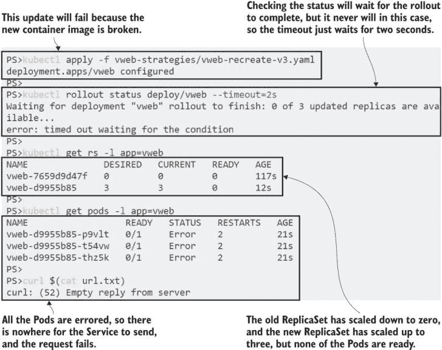

图 9.10 重新创建策略如果新的 Pod 规范损坏，会愉快地关闭你的应用程序。

现在你已经看到了，你可能应该尝试忘记重新创建策略。在某些情况下，它可能看起来很有吸引力，但当你这样做时，你仍然应该考虑其他选项，即使这意味着再次审视你的架构。你应用程序的大规模关闭将导致停机时间，而且可能比你计划的停机时间更长。

滚动更新是默认的，因为它们可以防止停机时间，但即使在这种情况下，默认行为也非常激进。对于生产发布，你可能需要调整一些设置，以设置发布的速度和监控方式。作为滚动更新规范的一部分，你可以添加选项来控制新的 ReplicaSet 的扩展速度和旧的 ReplicaSet 的缩减速度，使用以下两个值：

+   `maxUnavailable` 是缩小旧 ReplicaSet 的加速器。它定义了在更新期间相对于期望的 Pod 数量，可以有多少个 Pod 不可用。你可以将其视为在旧 ReplicaSet 中终止 Pod 的批量大小。在一个包含 10 个 Pod 的 Deployment 中，将此设置为 30% 意味着将有三个 Pod 立即终止。

+   `maxSurge` 是扩展新 ReplicaSet 的加速器。它定义了在期望的副本数量之上可以存在多少额外的 Pod，就像在新的 ReplicaSet 中创建 Pod 的批量大小。在一个包含 10 个 Pod 的 Deployment 中，将此设置为 40% 将创建四个新的 Pod。

简单明了，但是这两个设置在滚动发布过程中都会使用，因此会产生一种摇摆效应。新的 ReplicaSet 会扩展，直到 Pod 数量达到所需的副本数量加上 `maxSurge` 值，然后 Deployment 会等待旧 Pods 被移除。旧的 ReplicaSet 会缩小到所需的数量减去 `maxUnavailable` 数量，然后 Deployment 会等待新 Pods 达到就绪状态。您不能将这两个值都设置为 0，因为这意味着没有任何变化。图 9.11 展示了如何组合这些设置，以优先选择创建后删除、删除后创建或删除并创建的新发布方法。

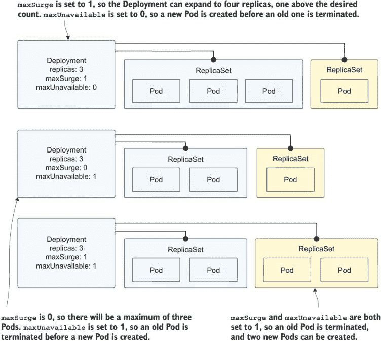

图 9.11 展示了使用不同的发布选项进行中的部署更新。

如果您在集群中有额外的计算能力，您可以调整这些设置以加快发布速度。您还可以在您的缩放设置之上创建额外的 Pods，但如果新版本有问题，这会更危险。较慢的发布更保守：它使用的计算资源更少，给您更多机会发现任何问题，但会减少发布期间应用程序的整体容量。让我们先看看这些设置如何，首先通过保守的发布方式修复我们损坏的应用程序。

现在尝试一下，将镜像回滚到工作版本 2，在滚动更新策略中使用 `maxSurge=1` 和 `maxUnavailable=0`。

```
# update the Deployment to use rolling updates and the v2 image:
kubectl apply -f vweb-strategies/vweb-rollingUpdate-v2.yaml

# check the Pods for the app:
kubectl get po -l app=vweb

# check the rollout status:
kubectl rollout status deploy/vweb

# check the ReplicaSets:
kubectl get rs -l app=vweb

# test the app:
curl $(cat url.txt)
```

在这个练习中，新的部署规范将 Pod 镜像版本改回 2，并且也将更新策略更改为滚动更新。您可以在图 9.12 中看到，策略更改首先进行，然后按照新的策略进行 Pod 更新，每次创建一个新 Pod。

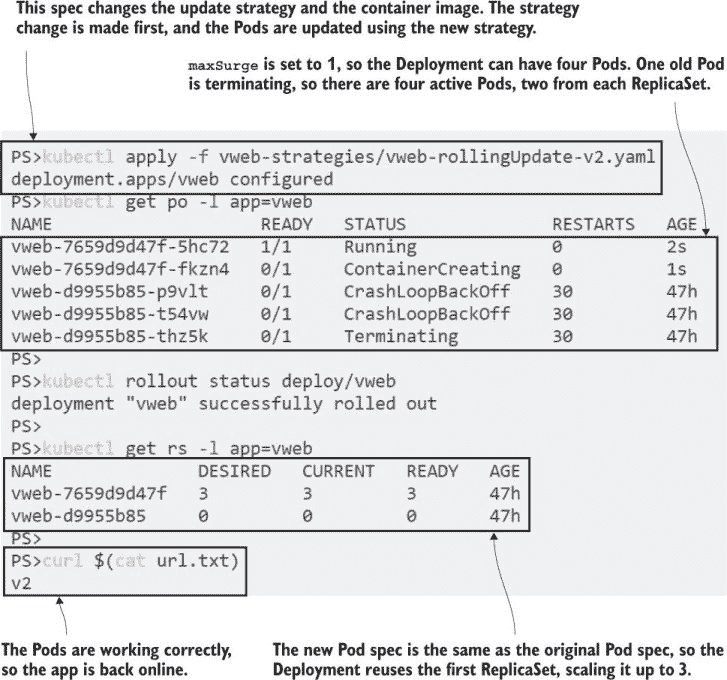

图 9.12 部署更新将使用与新的规范匹配的现有 ReplicaSet。

您需要快速工作才能在前一个练习中看到发布过程，因为这个简单的应用程序启动很快，一旦一个新 Pod 运行，发布就会继续，另一个新 Pod 开始运行。您可以通过 Deployment 规范中的以下两个字段来控制发布的速度：

+   `minReadySeconds` 添加了一个延迟，让 Deployment 等待以确保新 Pods 稳定。它指定了 Pod 在没有容器崩溃的情况下应该运行多少秒才被认为是成功的。默认值为零，这就是为什么在滚动发布期间新 Pods 会快速创建。

+   `progressDeadlineSeconds` 指定了 Deployment 更新在被视为失败之前可以运行的时间。默认值为 600 秒，所以如果一个更新在 10 分钟内没有完成，它会被标记为没有进展。

监控发布所需的时间听起来很有用，但截至 Kubernetes 1.19，超过截止时间实际上并不会影响发布——它只是在 Deployment 上设置一个标志。Kubernetes 没有自动回滚失败发布的特性，但当这个特性出现时，它将由这个标志触发。等待并检查 Pod 的失败容器是一个相当直接的工具，但比完全没有检查要好，您应该考虑在所有 Deployment 中指定 `minReadySeconds`。

这些安全措施对于添加到您的部署中很有用，但它们实际上对我们的 Web 应用并没有太大的帮助，因为新的 Pod 总是会失败。我们可以通过滚动更新使这个部署安全并保持应用在线。下一个版本 3 的更新将 `maxUnavailable` 和 `maxSurge` 都设置为 1。这样做与默认值（每个 25%）的效果相同，但在规范中使用确切值更清晰，并且在小规模部署中，Pod 数量比百分比更容易处理。

现在试试部署版本 3 的更新再次。它仍然会失败，但通过使用滚动更新策略，它不会使应用离线。

```
# update to the failing container image:
kubectl apply -f vweb-strategies/vweb-rollingUpdate-v3.yaml

# check the Pods:
kubectl get po -l app=vweb

# check the rollout:
kubectl rollout status deploy/vweb

# see the scale in the ReplicaSets:
kubectl get rs -l app=vweb

# test the app:
curl $(cat url.txt)
```

当您运行这个练习时，您会看到更新永远不会完成，Deployment 会卡在两个具有两个所需 Pod 数量的 ReplicaSet 上，如图 9.13 所示。旧的 ReplicaSet 不会进一步缩放，因为 Deployment 已经将 `maxUnavailable` 设置为 1；它已经缩放了 1，并且没有新的 Pods 准备就绪以继续发布。新的 ReplicaSet 不会再缩放，因为 `maxSurge` 设置为 1，并且部署的 Pod 总数已经达到。

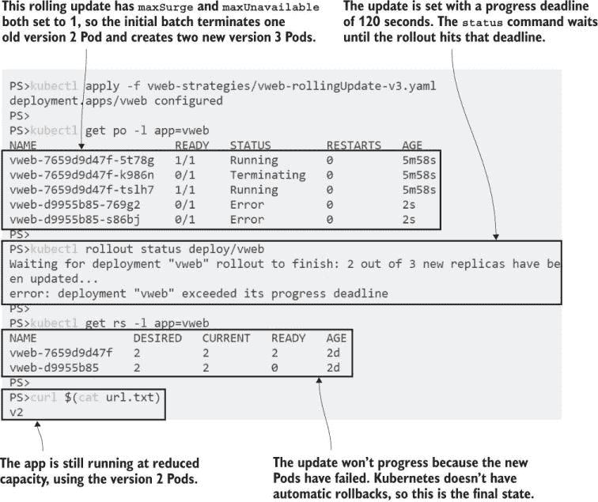

图 9.13 失败的更新不会自动回滚或暂停；它们只是继续尝试。

如果您过几分钟再检查新的 Pods，您会看到它们处于 `CrashLoopBackoff` 状态。Kubernetes 通过创建替换容器来不断重启失败的 Pods，但在每次重启之间添加一个暂停，这样就不会使节点的 CPU 过载。这个暂停就是回退时间，它会呈指数增长——第一次重启为 10 秒，然后是 20 秒，然后是 40 秒，最多可达 5 分钟。这些版本 3 的 Pods 永远不会成功重启，但 Kubernetes 会继续尝试。

Deployments 是您最常用的控制器，花时间研究更新策略和定时设置以确保您理解对您的应用的影响是值得的。DaemonSets 和 StatefulSets 也具有滚动更新功能，由于它们管理 Pods 的方式不同，因此它们在发布方面也有不同的方法。

## 9.4 在 DaemonSets 和 StatefulSets 中的滚动更新

DaemonSet 和 StatefulSet 有两种更新策略可供选择。默认是滚动更新，我们将在本节中探讨。另一种是 OnDelete，用于需要严格控制每个 Pod 更新时间的情况。你部署更新，控制器监视 Pod，但它不会终止任何现有的 Pod。它等待其他进程删除它们，然后使用新规范中的 Pod 替换它们。

当你考虑这些控制器的用例时，这并不像听起来那么毫无意义。你可能有一个 StatefulSet，其中每个 Pod 在删除之前都需要将数据刷新到磁盘上，你可以有一个自动化的过程来完成这个任务。你可能有一个 DaemonSet，其中每个 Pod 都需要从硬件组件断开连接，以便下一个 Pod 可以使用。这些是罕见的情况，但 OnDelete 策略让你可以控制 Pod 何时被删除，同时仍然让 Kubernetes 自动创建替换。

在本节中，我们将重点关注滚动更新，为此我们将部署待办事项列表应用的一个版本，该版本在 StatefulSet 中运行数据库，在 Deployment 中运行 Web 应用，并在 DaemonSet 中运行 Web 应用的反向代理。

现在尝试一下 待办事项应用运行在六个 Pod 上，所以首先清除现有的应用以腾出空间。然后部署应用，并测试它是否正确运行。

```
# remove all of this chapter’s apps:
kubectl delete all -l kiamol=ch09

# deploy the to-do app, database, and proxy:
kubectl apply -f todo-list/db/ -f todo-list/web/ -f todo-list/proxy/

# get the app URL:
kubectl get svc todo-proxy -o jsonpath='http://{.status.loadBalancer.ingress[0].*}:8091'

# browse to the app, add an item, and check that it’s in the list
```

这只是为了设置更新。现在你应该有一个可以添加项目并查看列表的工作应用。我的输出显示在图 9.14 中。

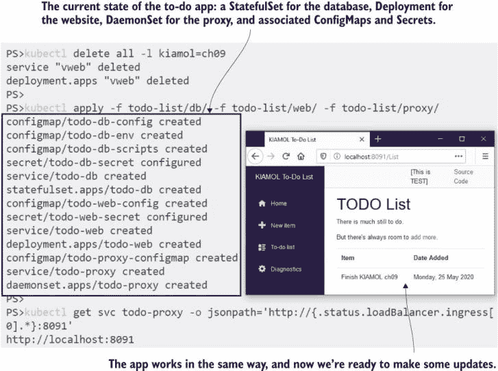

图 9.14 使用各种控制器运行待办事项应用

第一次更新是针对 DaemonSet 的，我们将推出 Nginx 代理镜像的新版本。DaemonSet 在集群的所有（或某些）节点上运行单个 Pod，并且在使用滚动更新时，没有激增选项。在更新期间，节点永远不会同时运行两个 Pod，因此这始终是先删除后删除的策略。你可以添加`maxUnavailable`设置来控制并行更新的节点数量，但如果你关闭多个 Pod，你将运行在降低的容量下，直到替换的 Pod 就绪。

我们将使用`maxUnavailable`设置为 1 和`minReadySeconds`设置为 90 来更新代理。在单节点实验室集群中，延迟不会有任何影响——只有一个 Pod 在一个节点上需要替换。在更大的集群中，这意味着一次替换一个 Pod，并在 Pod 证明其稳定后等待 90 秒，然后再进行下一个。

现在尝试一下 开始 DaemonSet 的滚动更新。在单节点集群中，在替换 Pod 启动期间将发生短暂的停机。

```
# deploy the DaemonSet update:
kubectl apply -f todo-list/proxy/update/nginx-rollingUpdate.yaml

# watch the Pod update:
kubectl get po -l app=todo-proxy --watch

# Press ctrl-c when the update completes
```

kubectl 中的 `watch` 标志用于监控更改——它持续查看一个对象，并在状态改变时打印更新行。在这个练习中，你会看到在创建新 Pod 之前终止了旧 Pod，这意味着在新的 Pod 启动期间应用程序会有停机时间。图 9.15 显示我在发布过程中有一个秒的停机时间。

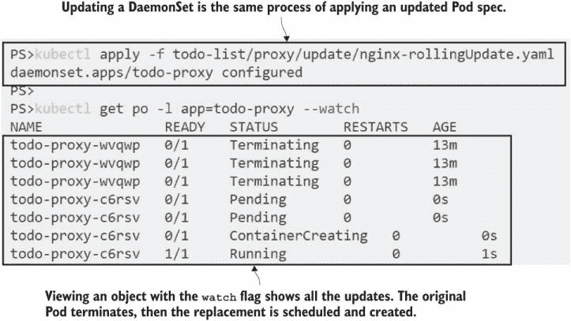

图 9.15：在创建替换 Pod 之前删除现有 Pod 以更新 DaemonSets。

多节点集群不会有任何停机时间，因为 Service 只将流量发送到已准备好的 Pods，并且每次只更新一个 Pod，所以其他 Pods 总是可用的。不过，你的容量会减少，如果你通过更高的 `maxUnavailable` 设置加快滚动更新，这意味着随着更多 Pods 并行更新，容量减少得更多。这是你为 DaemonSets 唯一可用的设置，所以这是一个简单的选择：手动通过删除 Pods 控制更新，或者让 Kubernetes 通过并行指定数量的 Pods 来滚动更新。

StatefulSets 更有趣，尽管它们只有一个选项来配置滚动更新。Pods 由 StatefulSet 按顺序管理，这也适用于更新——滚动更新从集合中的最后一个 Pod 向前进行到第一个。这对于 Pod 0 是主节点的集群应用程序特别有用，因为它首先在辅助节点上验证更新。

StatefulSets 没有设置 `maxSurge` 或 `maxUnavailable`。更新总是逐个 Pod 进行。你的配置选项是使用 `partition` 设置来定义总共应该更新多少个 Pods。此设置定义了滚动更新停止的截止点，这对于执行有阶段性的状态应用程序的滚动更新很有用。如果你在集合中有五个副本，并且你的规范包括 partition=3，那么只有 Pod 4 和 Pod 3 将被更新；Pod 0、1 和 2 将继续运行之前的规范。

现在试试这个：将分区更新部署到 StatefulSet 中的数据库镜像，更新在 Pod 1 后停止，这样 Pod 0 就不会更新。

```
# deploy the update:
kubectl apply -f todo-list/db/update/todo-db-rollingUpdate-partition.yaml

# check the rollout status:
kubectl rollout status statefulset/todo-db

# list the Pods, showing the image name and start time:
kubectl get pods -l app=todo-db -o=custom-columns=NAME:.metadata.name,
IMAGE:.spec.containers[0].image,START_TIME:.status.startTime

# switch the web app to read-only mode, so it uses the secondary
# database:
kubectl apply -f todo-list/web/update/todo-web-readonly.yaml

# test the app--the data is there, but now it’s read-only
```

这个练习是一个分区更新，它滚动推出 Postgres 容器镜像的新版本，但只更新到辅助 Pods，在这个例子中是一个 Pod，如图 9.16 所示。当你以只读模式使用应用程序时，你会看到它连接到更新的辅助节点，该节点仍然包含来自上一个 Pod 的复制数据。

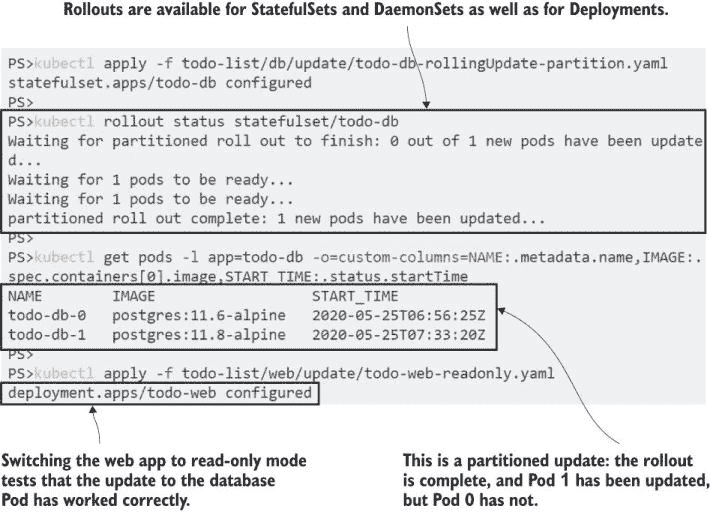

图 9.16：对 StatefulSets 进行分区更新，允许更新辅助节点并保持主节点不变。

即使该集中的 Pod 运行的是不同的规范，这次滚动更新也已完成。对于在 StatefulSet 中的数据密集型应用程序，你可能有一套验证作业需要在每个更新的 Pod 上运行，你才会满意地继续滚动更新，分区更新允许你这样做。你可以通过运行具有递减分区值的连续更新来手动控制发布的节奏，直到在最终的更新中完全移除分区，以完成集合。

现在尝试一下 部署更新到数据库主节点。这个规范与之前的练习相同，但去除了分区设置。

```
# apply the update:
kubectl apply -f todo-list/db/update/todo-db-rollingUpdate.yaml

# check its progress:
kubectl rollout status statefulset/todo-db

# Pods should now all have the same spec:
kubectl get pods -l app=todo-db -o=custom-columns=NAME:.metadata.name,IMAGE:.spec.containers[0].image,START
_TIME:.status.startTime

# reset the web app back to read-write mode:
kubectl apply -f todo-list/web/todo-web.yaml

# test that the app works and is connected to the updated primary Pod
```

你可以在图 9.17 中看到我的输出，其中完整更新已完成，主节点正在使用与辅助节点相同的更新版 Postgres。如果你之前进行过复制数据库的更新，你会知道这已经非常简单了——当然，除非你使用的是托管数据库服务。

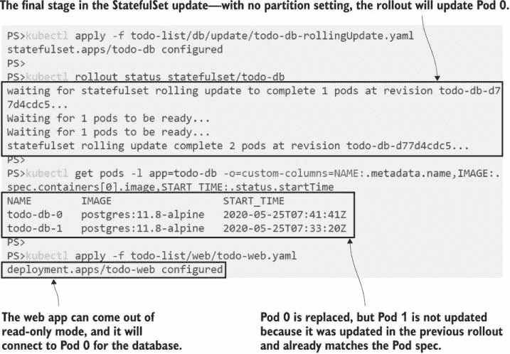

图 9.17 完成有状态集的滚动更新，更新未分区

滚动更新是 Deployments、DaemonSets 和 StatefulSets 的默认设置，并且它们都以大致相同的方式工作：逐渐用运行新规范的新 Pod 替换运行旧规范的老 Pod。实际的细节不同，因为控制器以不同的方式工作，有不同的目标，但它们对你的应用程序提出了相同的要求：当多个版本同时运行时，应用程序需要正确工作。这并不总是可能的，并且有几种不同的方法可以在 Kubernetes 中部署应用程序更新。

## 9.5 理解发布策略

以 Web 应用程序为例。滚动更新很棒，因为它允许每个 Pod 在处理完所有客户端请求后优雅地关闭，并且滚动更新可以快或保守，取决于你的喜好。滚动更新的实际方面很简单，但你也要考虑用户体验（UX）方面。

应用程序更新可能会改变 UX——不同的设计、新功能或更新的工作流程。如果用户在滚动更新期间看到新版本，然后刷新并发现自己回到了旧版本，因为请求是由运行应用程序不同版本的 Pod 服务的，那么这样的变化对用户来说会很奇怪。

处理这些问题的策略超出了你控制器中的滚动更新规范。你可以在你的 Web 应用程序中设置 cookie，将客户端与特定的 UX 关联起来，然后使用更高级的流量路由系统来确保用户始终看到新版本。当我们第十五章介绍这一点时，你会看到它引入了更多的动态部分。对于这种方法过于复杂或无法解决同时运行多个版本的问题的情况，你可以通过蓝绿部署自行管理发布。

蓝绿部署是一个简单的概念：你同时部署了应用程序的旧版本和新版本，但只有一个版本是活跃的。你可以切换一个开关来选择哪个版本是活跃的。在 Kubernetes 中，你可以通过更新服务的标签选择器来实现，如图 9.18 所示，将流量发送到不同部署中的 Pods。

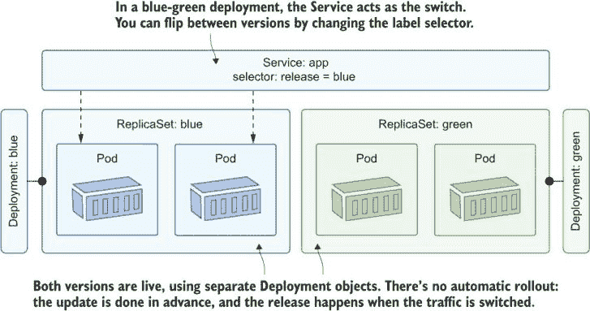

图 9.18 你在蓝绿部署中运行应用程序的多个版本，但只有一个版本是活跃的。

你需要在你的集群中拥有运行应用程序两个完整副本的能力。如果它是 Web 或 API 组件，那么新版本应该使用最少的内存和 CPU，因为它没有收到任何流量。你通过更新服务的标签选择器在版本之间切换，因此更新几乎是瞬时的，因为所有 Pods 都在运行并准备好接收流量。你可以轻松地来回切换，因此你可以回滚有问题的发布版本，而无需等待 ReplicaSets 进行扩展和缩减。

蓝绿部署比滚动更新更复杂，但正因为如此，它们更简单。对于有大规模部署历史记录的组织来说，蓝绿部署可能更适合迁移到 Kubernetes，但它们是一种计算密集型方法，需要多个步骤，并且不会保留应用程序的部署历史。你应该将滚动更新作为首选的部署策略，但蓝绿部署在你获得信心时是一个很好的过渡步骤。

目前关于滚动更新的内容就到这里，但当我们讨论到生产准备、网络入口和监控等主题时，我们还会回到这些概念。在我们进入实验室之前，现在我们需要整理一下集群。

现在试试看 移除本章创建的所有对象。

```
kubectl delete all -l kiamol=ch09
kubectl delete cm -l kiamol=ch09
kubectl delete pvc -l kiamol=ch09
```

## 9.6 实验室

我们在上一节学习了蓝绿部署的理论，现在在实验室中，你将让它成为现实。完成这个实验室将帮助你清楚地了解选择器如何将 Pods 与其他对象相关联，并为你提供使用滚动更新的替代方案的经验。

+   起始点是 Web 应用程序的版本 1，你可以从`lab/v1`文件夹中部署它。

+   你需要为应用程序的版本 2 创建一个蓝绿部署。规范将与版本 1 规范类似，但使用`:v2`容器镜像。

+   当你部署更新时，你应该能够通过更改服务来在版本 1 和版本 2 之间切换，而不需要对 Pods 进行任何更新。

这是在复制 YAML 文件并尝试确定你需要更改哪些字段时的良好实践。你可以在 GitHub 上找到我的解决方案：[`github.com/sixeyed/kiamol/blob/master/ch09/lab/README.md`](https://github.com/sixeyed/kiamol/blob/master/ch09/lab/README.md)。
