# 10 使用 Helm 打包和管理应用

尽管 Kubernetes 功能强大，但它并不能自行解决所有问题；存在一个庞大的生态系统来填补这些空白。其中之一就是打包和分发应用，而 Helm 就是解决方案。您可以使用 Helm 将一组 Kubernetes YAML 文件组合成一个工件，并在公共或私有仓库中共享。任何有权访问仓库的人都可以使用单个 Helm 命令安装应用。该命令可能部署一系列相关的 Kubernetes 资源，包括 ConfigMaps、Deployments 和 Services，您可以在安装过程中自定义配置。

人们以不同的方式使用 Helm。有些团队仅使用 Helm 从公共仓库安装和管理第三方应用。其他团队则使用 Helm 为自己的应用打包和发布到私有仓库。在本章中，您将学习如何做这两件事，并带着自己对 Helm 如何适应您组织的想法离开。您不需要学习 Helm 就能有效地使用 Kubernetes，但它被广泛使用，因此您应该熟悉它。该项目由云原生计算基金会（CNCF）管理——与托管 Kubernetes 的同一基金会——这是一个可靠成熟度和长期性的指标。

## 10.1 Helm 为 Kubernetes 增加的功能

Kubernetes 应用在设计时以 YAML 文件的形式进行建模，在运行时使用标签集进行管理。Kubernetes 中没有“应用”的原生概念，这显然将一组相关资源分组在一起，这也是 Helm 解决的问题之一。它是一个与仓库服务器交互以查找和下载应用包的命令行工具，并且与您的 Kubernetes 集群一起安装和管理应用。

Helm 是另一层抽象，这次是在应用层面。当您使用 Helm 安装应用时，它会在您的 Kubernetes 集群中创建一组资源——它们是标准的 Kubernetes 资源。Helm 打包格式扩展了 Kubernetes YAML 文件，因此 Helm 包实际上是一组 Kubernetes 清单，附带一些元数据存储在一起。我们将首先使用 Helm 部署前几章中的一个示例应用，但在此之前，我们需要安装 Helm。

现在就试试吧！Helm 是一个跨平台工具，可在 Windows、macOS 和 Linux 上运行。您可以在以下链接中找到最新的安装说明：[`helm.sh/docs/intro/install`](https://helm.sh/docs/intro/install)。本练习假设您已经安装了包管理器，如 Homebrew 或 Chocolatey。如果没有，您需要参考 Helm 网站上的完整安装说明。

```
# on Windows, using Chocolatey:
choco install -y kubernetes-helm

# on Mac, using Homebrew:
brew install helm

# on Linux, using the Helm install script:
curl https://raw.githubusercontent.com/helm/helm/master/scripts/get-helm-3 | bash

# check that Helm is working:
helm version
```

本练习中的安装步骤可能无法在您的系统上工作，在这种情况下，您需要在这里停止并前往 Helm 安装文档。在您安装 Helm 并看到 `version` 命令的成功输出，如第 10.1 图所示之前，我们无法继续前进。

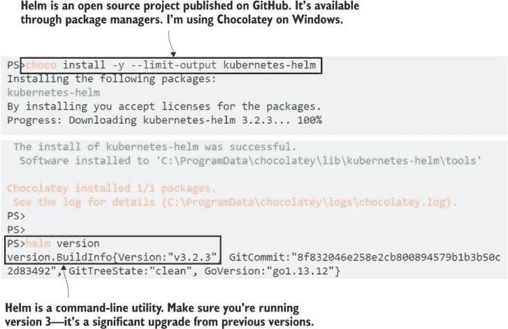

图 10.1 安装 Helm 有很多选项；使用软件包管理器是最简单的。

Helm 是一个客户端工具。Helm 的早期版本需要在你的 Kubernetes 集群中部署一个服务器组件，但在 Helm 3 的主要更新中，这一点已经改变。Helm CLI 使用与 kubectl 相同的连接信息来连接到你的 Kubernetes 集群，因此你不需要任何额外的配置来安装应用程序。然而，你需要配置一个软件包仓库。Helm 仓库类似于 Docker Hub 这样的容器镜像仓库，但服务器发布了一个所有可用包的索引；Helm 缓存了你仓库索引的本地副本，你可以使用它来搜索包。

现在试试吧 添加书籍的 Helm 仓库，同步它，并搜索一个应用程序。

```
# add a repository, using a local name to refer to a remote server:
helm repo add kiamol https://kiamol.net

# update the local repository cache:
helm repo update

# search for an app in the repo cache:
helm search repo vweb --versions
```

Kiamol 仓库是一个公共服务器，你可以在这个练习中看到有两个版本的名为 vweb 的包。我的输出显示在图 10.2 中。

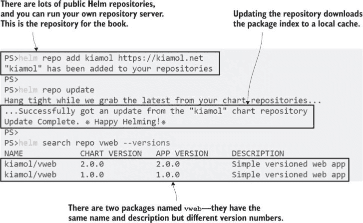

图 10.2 同步 Kiamol Helm 仓库的本地副本并搜索包

你已经对 Helm 有了一定的感觉，但现在需要一些理论知识，这样我们才能在继续前进之前使用正确的概念和它们的正确名称。在 Helm 中，一个应用程序包被称为 *chart*；chart 可以在本地开发和部署，或者发布到 *repository*。当你安装一个 chart 时，这被称为 *release*；每个 release 都有一个名称，你可以在你的集群中安装同一 chart 的多个实例，作为独立的、命名的 release。

Charts 包含 Kubernetes YAML 清单，清单通常包含参数化值，以便用户可以使用不同的配置设置安装相同的 chart——运行的副本数量或应用程序日志级别可以是参数值。每个 chart 也包含一组默认值，可以使用命令行进行检查。图 10.3 显示了 Helm chart 的文件结构。

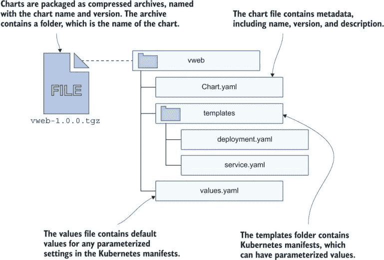

图 10.3 Helm chart 包含应用程序的所有 Kubernetes YAML，以及一些元数据。

vweb charts 包包含我们在第九章中用来演示更新和回滚的简单 Web 应用程序。每个 chart 包含一个 Service 和 Deployment 的规范，以及一些参数化值和默认设置。你可以在安装 chart 之前使用 Helm 命令行检查所有可用的值，然后在安装 release 时使用自定义值覆盖默认值。

现在试试吧 检查 vweb chart 的第 1 版中可用的值，然后使用自定义值安装一个 release。

```
# inspect the default values stored in the chart:
helm show values kiamol/vweb --version 1.0.0

# install the chart, overriding the default values:
helm install --set servicePort=8010 --set replicaCount=1 ch10-vweb kiamol/vweb --version 1.0.0

# check the releases you have installed:
helm ls
```

在这个练习中，你可以看到 chart 为 Service 端口和 Deployment 中的副本数量提供了默认值。我的输出显示在图 10.4 中。你使用 `helm install` 命令中的 `set` 参数来指定你自己的值，当安装完成后，你就可以在 Kubernetes 中运行一个应用程序，而无需使用 kubectl，也无需直接使用 YAML 清单。

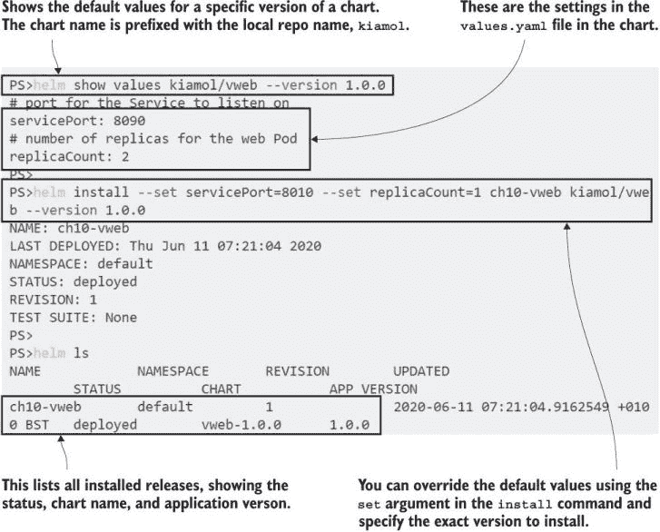

图 10.4 使用 Helm 安装应用程序——这会创建 Kubernetes 资源，而不使用 kubectl。

Helm 提供了一套用于处理仓库和图表以及安装、更新和回滚发布的功能，但它并不打算用于应用程序的持续管理。Helm 命令行不是 kubectl 的替代品——您需要一起使用它们。现在发布已安装，您可以像往常一样处理 Kubernetes 资源，如果您需要修改设置，也可以返回 Helm。

现在试试吧 检查 Helm 部署的资源，然后返回 Helm 以扩展 Deployment 并检查应用程序是否正常工作。

```
# show the details of the Deployment:
kubectl get deploy -l app.kubernetes.io/instance=ch10-vweb --show-labels

# update the release to increase the replica count:
helm upgrade --set servicePort=8010 --set replicaCount=3 ch10-vweb kiamol/vweb --version 1.0.0

# check the ReplicaSet:
kubectl get rs -l app.kubernetes.io/instance=ch10-vweb

# get the URL for the app:
kubectl get svc ch10-vweb -o jsonpath='http://{.status.loadBalancer.ingress[0].*}:8010'

# browse to the app URL
```

让我们看看那个练习中的几个要点。首先，标签比您迄今为止看到的标准的“应用程序”和“版本”标签要详细得多。这是因为这是一个公共仓库上的公共图表，所以我使用了 Kubernetes 配置最佳实践指南中推荐的标准标签名称——这是我的选择，而不是 Helm 的要求。其次，Helm 的 `upgrade` 命令再次指定了服务端口，尽管我只想修改副本计数。这是因为 Helm 使用默认值，除非您指定它们，所以如果端口没有包含在 `upgrade` 命令中，它将被更改为默认值。您可以在图 10.5 中看到我的输出。

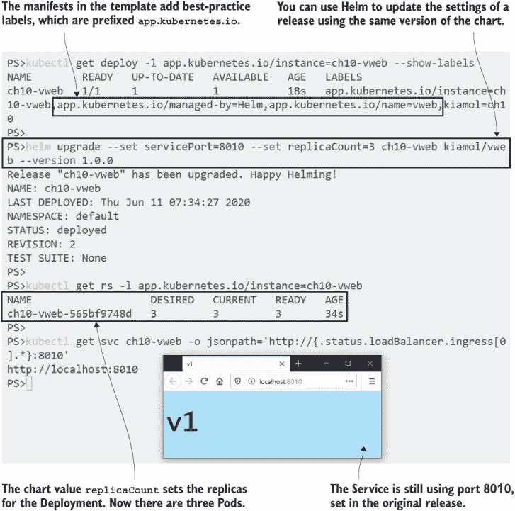

图 10.5 您不使用 Helm 来管理应用程序，但您可以使用它来更新配置。

这是 Helm 工作流程的消费端。您可以从 Helm 命令行搜索应用程序仓库，发现应用程序可用的配置值，然后安装和升级应用程序。它是为在 Kubernetes 中运行而构建的应用程序的包管理工具。在下一节中，您将学习如何打包和发布自己的应用程序，这是工作流程的生产端。

## 10.2 使用 Helm 打包自己的应用程序

Helm 图表是包含 Kubernetes 清单的文件夹或压缩存档。您可以通过将应用程序清单、识别您想要参数化的任何值，并用模板变量替换实际值来创建自己的图表。列表 10.1 显示了模板化的 Deployment 规范的开始，它使用 Helm 设置的资源名称和标签值。

列表 10.1  web-ping-deployment.yaml，一个模板化的 Kubernetes 清单

```
apiVersion: apps/v1
kind: Deployment                   # This much is standard Kubernetes YAML.

metadata:
  name: {{ .Release.Name }}              # Contains the name of the release
  labels:
    kiamol: {{ .Values.kiamolChapter }}  # Contains the “kiamolChapter”
                                         # value
```

双大括号语法用于模板化值——从开头的 `{{` 到结尾的 `}}` 在安装时会被替换，Helm 将处理后的 YAML 发送到 Kubernetes。可以使用多个源作为输入来替换模板化值。列表 10.1 中的片段使用发布对象获取发布名称，并使用值对象获取名为 `kiamolChapter` 的参数值。发布对象由 `install` 或 `upgrade` 命令提供的信息填充，值对象则从图表的默认值和用户覆盖的任何设置中填充。模板还可以访问有关图表的静态详细信息以及有关 Kubernetes 集群功能的运行时详细信息。

Helm 对图表中的文件结构非常讲究。你可以使用 `helm` `create` 命令来生成新图表的样板结构。顶级是一个文件夹，其名称必须与你要使用的图表名称匹配，并且该文件夹必须至少包含以下三项：

+   一个 `Chart.yaml` 文件，用于指定图表元数据，包括名称和版本

+   一个 `values.yaml` 文件，用于设置参数的默认值

+   包含模板化 Kubernetes 清单的 `templates` 文件夹

列表 10.1 来自本章源文件中 `web-ping/templates` 文件夹下的 `web-ping-deployment.yaml` 文件。`web-ping` 文件夹包含创建有效图表所需的所有文件，Helm 可以验证图表内容，并从图表文件夹安装发布。

现在就试试 当你开发图表时，你不需要将它们打包成 zip 归档；你可以直接使用图表文件夹。

```
# switch to this chapter’s source:
cd ch10

# validate the chart contents:
helm lint web-ping

# install a release from the chart folder:
helm install wp1 web-ping/

# check the installed releases:
helm ls
```

`lint` 命令仅用于处理本地图表，但 `install` 命令对本地图表和存储在仓库中的图表都是相同的。本地图表可以是文件夹或压缩归档，你将在本练习中看到，从本地图表安装发布与从仓库安装具有相同的体验。我在图 10.6 中的输出显示，我现在安装了两个发布：一个是来自 vweb 图表的，另一个来自 web-ping 图表。

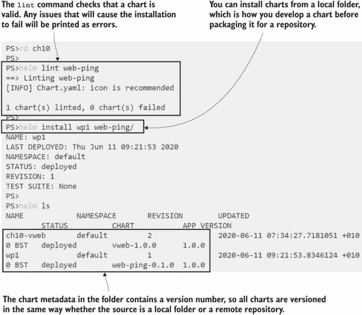

图 10.6 从本地文件夹安装和升级允许你快速迭代图表开发。

web-ping 应用程序是一个基本的实用程序，通过定期向域名发送 HTTP 请求来检查网站是否正常运行。目前，你有一个 Pod 正在运行，每 30 秒向我的博客发送请求。我的博客运行在 Kubernetes 上，所以我确信它能够处理这些请求。该应用程序使用环境变量来配置要使用的 URL 和调度间隔，这些变量在 Helm 的清单中进行了模板化。列表 10.2 显示了带有模板化变量的 Pod 规范。

列表 10.2 web-ping-deployment.yaml，模板化容器环境

```
spec:
  containers:
    - name: app
      image: kiamol/ch10-web-ping
      env:
        - name: TARGET
          value: {{ .Values.targetUrl }}
        - name: INTERVAL
          value: {{ .Values.pingIntervalMilliseconds | quote }}
```

Helm 提供了一套丰富的模板函数，您可以使用它们来操作在 YAML 中设置的值。列表 10.2 中的`quote`函数如果提供的值没有引号，则将其包裹在引号中。您可以在模板中包含循环和分支逻辑，计算字符串和数字，甚至查询 Kubernetes API 以从其他对象中获取详细信息。我们不会深入探讨这些细节，但重要的是要记住，Helm 让您生成复杂的模板，几乎可以完成任何事情。

您需要仔细思考需要模板化的规范部分。Helm 相对于标准清单部署的一个主要好处是您可以从单个图表运行同一应用程序的多个实例。您不能使用 kubectl 这样做，因为清单包含需要唯一的资源名称。如果您多次部署相同的 YAML 集合，Kubernetes 将仅更新相同的资源。如果您模板化规范中所有唯一的部分——如资源名称和标签选择器——则可以使用 Helm 运行同一应用程序的多个副本。

现在尝试一下：部署 web-ping 应用程序的第二个版本，使用相同的图表文件夹，但指定一个不同的 URL 进行 ping。

```
# check the available settings for the chart:
helm show values web-ping/

# install a new release named wp2, using a different target:
helm install --set targetUrl=kiamol.net wp2 web-ping/

# wait a minute or so for the pings to fire, then check the logs:
kubectl logs -l app=web-ping --tail 1
```

在这个练习中，您会看到我需要对我的博客进行一些优化——它大约需要 500 毫秒返回，而 Kiamol 网站只需要 100 毫秒。更重要的是，您可以看到应用程序的两个实例正在运行：两个 Deployment 管理着具有不同容器规范的两组 Pod。我的输出显示在图 10.7 中。

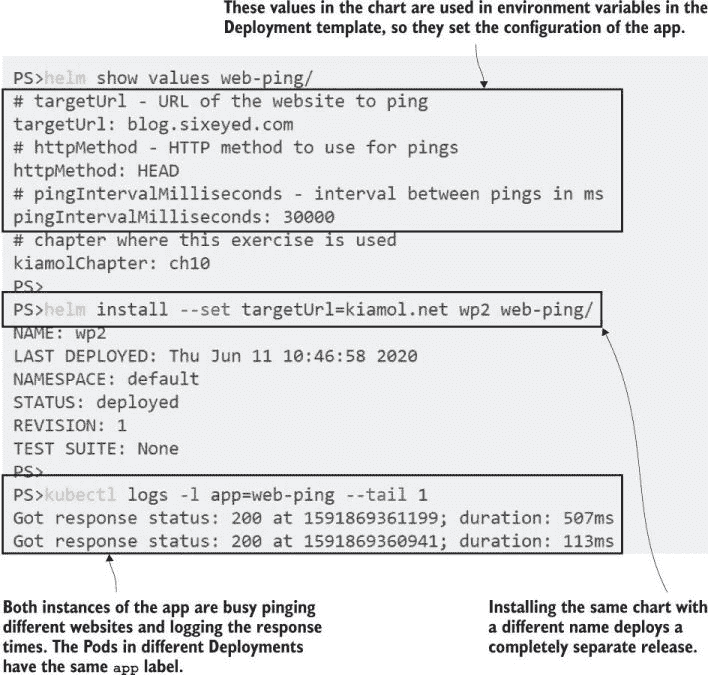

图 10.7 您不能使用纯清单安装应用程序的多个实例，但可以使用 Helm。

现在应该很清楚，Helm 的安装和管理应用程序的工作流程与 kubectl 的工作流程不同，但您还需要理解这两者是不兼容的。您不能通过在图表的模板文件夹中运行`kubectl apply`来部署应用程序，因为模板变量不是有效的 YAML，该命令会失败。如果您采用 Helm，您需要在为每个环境使用 Helm，这可能会减慢开发人员的工作流程，或者使用纯 Kubernetes 清单进行开发并使用 Helm 处理其他环境之间做出选择，这意味着您将拥有多个 YAML 副本。

记住，Helm 不仅关乎安装，同样关乎分布和发现。Helm 带来的额外摩擦是能够将复杂的应用简化为几个变量并在存储库中共享的代价。存储库实际上只是一个索引文件，其中包含可以存储在任何网络服务器上的图表版本列表（Kiamol 存储库使用 GitHub 页面，您可以在[`kiamol.net/index.yaml`](https://kiamol.net/index.yaml)中查看全部内容）。

您可以使用任何服务器技术来托管您的存储库，但在此节的其余部分，我们将使用一个名为 ChartMuseum 的专用存储库服务器，这是一个流行的开源选项。您可以在自己的组织中运行 ChartMuseum 作为私有 Helm 存储库，并且它很容易设置，因为您可以使用 Helm 图表来安装它。

现在尝试一下 ChartMuseum 图表位于官方 Helm 存储库中，通常称为“stable”。添加该存储库，您就可以在本地运行自己的存储库。

```
# add the official Helm repository:
helm repo add stable https://kubernetes-charts.storage.googleapis.com

# install ChartMuseum--the repo flag fetches details from

# the repository so you don’t need to update your local cache:
helm install --set service.type=LoadBalancer --set service.externalPort=8008
             --set env.open.DISABLE_API=false repo stable/chartmuseum --version 2.13.0 --wait

# get the URL for your local ChartMuseum app:
kubectl get svc repo-chartmuseum -o jsonpath='http://{.status.loadBalancer.ingress[0].*}:8008'

# add it as a repository called local:
helm repo add local $(kubectl get svc repo-chartmuseum -o jsonpath='http://{.status.loadBalancer.ingress[0].*}:8008')
```

现在，您已经在 Helm 中注册了三个存储库：Kiamol 存储库、稳定版 Kubernetes 存储库（这是一个精选的图表集，类似于 Docker Hub 中的官方镜像），以及您自己的本地存储库。您可以在图 10.8 中看到我的输出，它被缩减以减少 Helm `install`命令的输出。

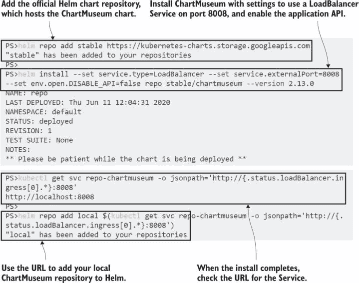

图 10.8 运行自己的 Helm 存储库就像从 Helm 存储库安装一个图表一样简单。

图表在发布到存储库之前需要打包，发布通常是一个三阶段的过程：将图表打包成 zip 归档，将归档上传到服务器，并更新存储库索引以添加新的图表。ChartMuseum 为您处理最后一步，因此您只需打包和上传图表，存储库索引就会自动更新。

现在尝试一下 使用 Helm 为图表创建 zip 归档，并使用`curl`将其上传到您的 ChartMuseum 存储库。检查存储库——您会看到您的图表已被索引。

```
# package the local chart:
helm package web-ping

# *on Windows 10* remove the PowerShell alias to use the real curl:
Remove-Item Alias:curl -ErrorAction Ignore

# upload the chart zip archive to ChartMuseum:
curl --data-binary "@web-ping-0.1.0.tgz" $(kubectl get svc repo-chartmuseum
     -o jsonpath='http://{.status.loadBalancer.ingress[0].*}:8008/api/charts')

# check that ChartMuseum has updated its index:
curl $(kubectl get svc repo-chartmuseum -o jsonpath='http://{.status
.loadBalancer.ingress[0].*}:8008/index.yaml')
```

Helm 使用压缩归档来简化图表的分发，文件非常小——它们包含 Kubernetes 清单、元数据和值，但不包含任何大型二进制文件。图表中的 Pod 规范指定了要使用的容器镜像，但镜像本身不是图表的一部分——在安装发布时，它们从 Docker Hub 或您自己的镜像仓库中拉取。您可以在图 10.9 中看到，当您上传图表时，ChartMuseum 会生成存储库索引，并添加新的图表详细信息。

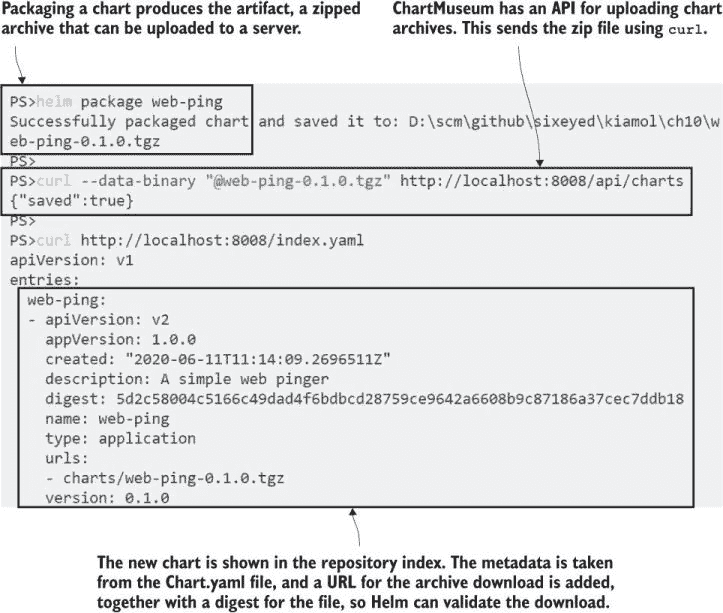

图 10.9 您可以将 ChartMuseum 作为私有存储库运行，以便在团队之间轻松共享图表。

您可以使用 ChartMuseum 或其他组织内的存储库服务器来共享内部应用程序，或者在将发布候选版本发布到公共存储库之前，将图表作为持续集成过程的一部分进行推送。您拥有的本地存储库仅在您的实验室环境中运行，但它使用负载均衡器服务进行发布，因此任何具有网络访问权限的人都可以从它安装 web-ping 应用程序。

现在尝试一下 安装 web-ping 应用程序的另一个版本，这次使用您本地存储库中的图表，并提供一个值文件而不是在`install`命令中指定每个设置。

```
# update your repository cache:
helm repo update

# verify that Helm can find your chart:
helm search repo web-ping

# check the local values file:
cat web-ping-values.yaml

# install from the repository using the values file:
helm install -f web-ping-values.yaml wp3 local/web-ping

# list all the Pods running the web-ping apps:
kubectl get pod -l app=web-ping -o custom-columns='NAME:.metadata.name,ENV:.spec.containers[0].env[*].value'
```

在这个练习中，你看到了另一种使用自定义设置安装 Helm 发布的方法——使用本地值文件。这是一个好习惯，因为你可以将不同环境的设置存储在不同的文件中，并降低在设置未提供时更新回默认值的危险。我的输出如图 10.10 所示。

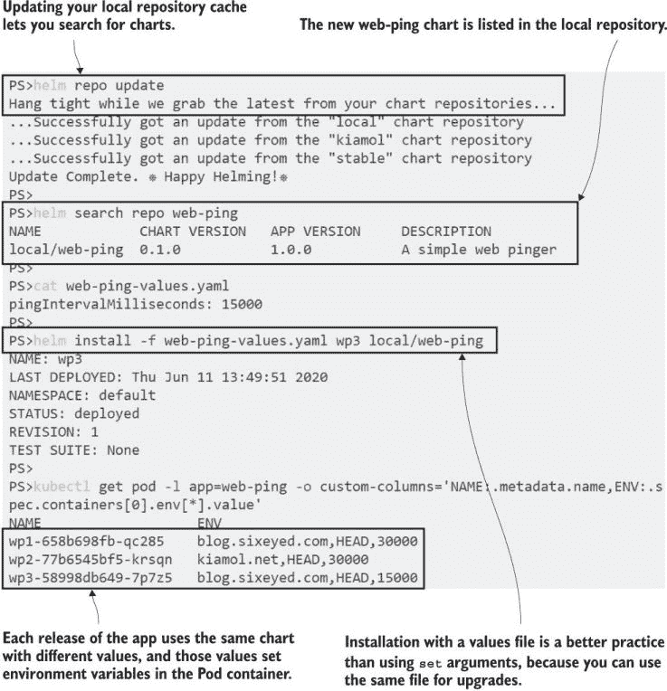

图 10.10 从本地仓库安装图表与从任何远程仓库安装相同。

你在之前的练习中也看到了，你可以不指定版本从仓库安装一个图表。这不是一个好的做法，因为它会安装最新版本，这是一个移动的目标。最好总是明确地声明图表版本。Helm 要求你使用语义版本，这样图表消费者就知道他们即将升级的包是 beta 版本还是它有破坏性更改。

你可以用图表做比我在这里要介绍的内容多得多的工作。它们可以包括测试，这些是安装后运行的 Kubernetes 作业规范，用于验证部署；它们可以有钩子，这让你可以在安装工作流程的特定点运行作业；并且它们可以带有签名并附带来源签名。在下一节中，我将介绍你在编写模板时使用的一个更多功能，这是一个重要的功能——构建依赖于其他图表的图表。

## 10.3 在图表中建模依赖关系

Helm 让你设计你的应用程序，使其在不同的环境中都能工作，这为依赖关系提出了一个有趣的问题。在某些环境中可能需要依赖关系，而在其他环境中则不需要。也许你有一个真正需要缓存反向代理来提高性能的 Web 应用程序。在某些环境中，你可能希望与应用程序一起部署代理，而在其他环境中，你可能已经有一个共享代理，所以你只想部署 Web 应用程序本身。Helm 通过条件依赖支持这些情况。

列表 10.3 显示了自第五章以来我们一直在使用的 Pi Web 应用程序的图表规范。它有两个依赖项——一个来自 Kiamol 仓库，另一个来自本地文件系统——并且它们是独立的图表。

列表 10.3 chart.yaml，一个包含可选依赖项的图表

```
apiVersion: v2      # The version of the Helm spec
name: pi            # Chart name
version: 0.1.0      # Chart version
dependencies:       # Other charts this chart is dependent on
  - name: vweb
    version: 2.0.0
    repository: https://kiamol.net   # A dependency from a repository
    condition: vweb.enabled          # Installed only if required
  - name: proxy
    version: 0.1.0
    repository: file://../proxy      # A dependency from a local folder
    condition: proxy.enabled         # Installed only if required
```

当你建模依赖关系时，你需要保持你的图表灵活。*父图表*（在这个例子中是 Pi 应用程序）可能需要*子图表*（代理和 vweb 图表），但子图表本身需要是独立的。你应该在子图表中对 Kubernetes 规范进行模板化，使其具有通用性。如果它是仅在一个应用程序中有用的东西，那么它应该是该应用程序图表的一部分，而不是子图表。

我的代理是通用的；它只是一个缓存反向代理，可以使用任何 HTTP 服务器作为内容源。图表使用模板化值来指定要代理的服务器名称，因此尽管它主要用于 Pi 应用程序，但它也可以用来代理任何 Kubernetes 服务。我们可以通过安装一个代理现有集群中应用程序的发布来验证这一点。

现在尝试一下 安装代理图，单独使用它作为我们在本章早期安装的 vweb 应用程序的反向代理。

```
# install a release from the local chart folder:
helm install --set upstreamToProxy=ch10-vweb:8010 vweb-proxy proxy/

# get the URL for the new proxy service:
kubectl get svc vweb-proxy-proxy -o jsonpath='http://{.status.loadBalancer.ingress[0].*}:8080'

# browse to the URL
```

在那个练习中的代理图完全独立于 Pi 应用程序；它被用来代理我从 Kiamol 仓库部署的 Helm 网络应用程序。您可以在图 10.11 中看到，它作为一个缓存代理为任何 HTTP 服务器工作。

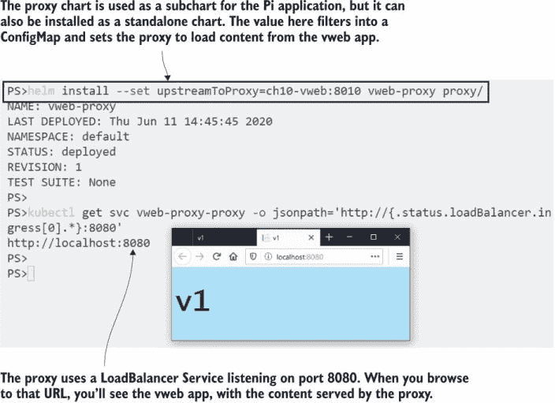

图 10.11 代理子图被构建成可以作为图表本身使用——它可以代理任何应用程序。

要将代理作为依赖项使用，您需要在父图表中的依赖项列表中添加它，使其成为一个子图。然后您可以在父图表中指定子图设置的值，通过在设置名称前加上依赖项名称——代理图中的 `upstreamToProxy` 设置在 Pi 图表中引用为 `proxy.upstreamToProxy`。列表 10.4 显示了 Pi 应用的默认值文件，其中包括应用程序本身的设置和代理依赖项的设置。

列表 10.4 values.yaml，Pi 图表的默认设置

```
replicaCount: 2               # Number of app Pods to run
serviceType: LoadBalancer     # Type of the Pi Service

proxy:                        # Settings for the reverse proxy  
  enabled: false              # Whether to deploy the proxy
  upstreamToProxy: "{{ .Release.Name }}-web"      # Server to proxy
  servicePort: 8030           # Port of the proxy Service  
  replicaCount: 2             # Number of proxy Pods to run
```

这些值部署应用程序本身而不使用代理，使用 LoadBalancer 服务为 Pi Pods 设置。`proxy.enabled` 设置被指定为 Pi 图表中代理依赖项的条件，因此除非安装设置覆盖默认值，否则整个子图将被跳过。完整的值文件还将 `vweb.enabled` 值设置为 false——那个依赖项仅用于演示子图可以从存储库中获取，因此默认情况下也不部署该图表。

这里有一个额外的细节需要指出。Pi 应用的服务名称在图表中是使用发布名称模板化的。这对于启用同一图表的多个安装很重要，但它增加了代理子图默认值的复杂性。要代理的服务器名称需要与 Pi 服务名称匹配，因此值文件使用与服务名称相同的模板化值，这将代理与同一发布中的服务链接起来。

在您安装或打包图表之前，图表需要其依赖项可用，您使用 Helm 命令行来完成此操作。构建依赖项将它们填充到图表的 charts 文件夹中，无论是从存储库下载存档还是将本地文件夹打包成存档。

现在尝试一下 构建 Pi 图表的依赖项，它下载远程图表，打包本地图表，并将它们添加到图表文件夹中。

```
# build dependencies:
helm dependency build pi

# check that the dependencies have been downloaded:
ls ./pi/charts
```

图 10.12 展示了为什么版本控制对于 Helm 图表来说如此重要。图表包使用图表元数据中的版本号进行版本控制。父图表与其依赖项一起打包，并指定版本。如果我没有更新代理图表的版本号，我的 Pi 图表将不同步，因为 Pi 包中代理图表的版本 0.1.0 与最新版本 0.1.0 不同。您应该将 Helm 图表视为不可变的，并且始终通过发布新包版本来发布更改。

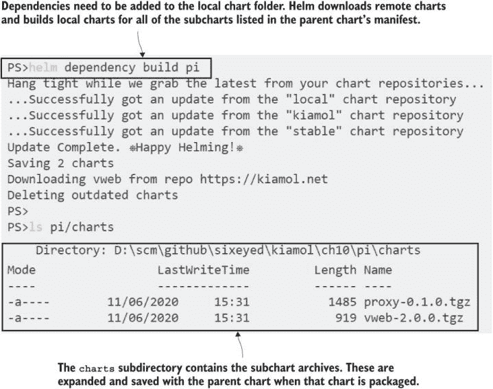

图 10.12 Helm 将依赖项打包到父图表中，并作为一个包进行分发。

这种条件依赖的原则是您如何管理一个更复杂的应用程序，例如第八章中的待办事项应用。Postgres 数据库部署将是一个子图表，用户可以选择在需要使用外部数据库的环境中完全跳过。或者，您甚至可以有多个条件依赖，允许用户为开发环境部署简单的 Postgres 部署，在测试环境中使用高度可用的 StatefulSet，并在生产环境中连接到管理的 Postgres 服务。

Pi 应用程序比这简单，我们可以选择是否单独部署它或与代理一起部署。此图表使用模板值来设置 Pi 服务的类型，但可以在模板中通过将其设置为 LoadBalancer（如果未部署代理）或 ClusterIP（如果已部署代理）来计算它。

现在尝试一下 部署启用代理子图表的 Pi 应用程序。使用 Helm 的 `dry-run` 功能检查默认部署，然后使用自定义设置进行实际安装。

```
# print the YAML Helm would deploy with default values:
helm install pi1 ./pi --dry-run

# install with custom settings to add the proxy:
helm install --set serviceType=ClusterIP --set proxy.enabled=true pi2 ./pi

# get the URL for the proxied app:
kubectl get svc pi2-proxy -o jsonpath='http://{.status.loadBalancer.ingress[0].*}:8030'

# browse to it
```

您将在这次练习中看到 `dry-run` 标志非常有用：它将值应用到模板中，并输出它将安装的资源的所有 YAML，而不部署任何内容。然后在实际安装中，设置一些标志将部署一个与主图表集成的附加图表，因此应用程序作为一个单一单元运行。我的 Pi 计算结果出现在图 10.13 中。

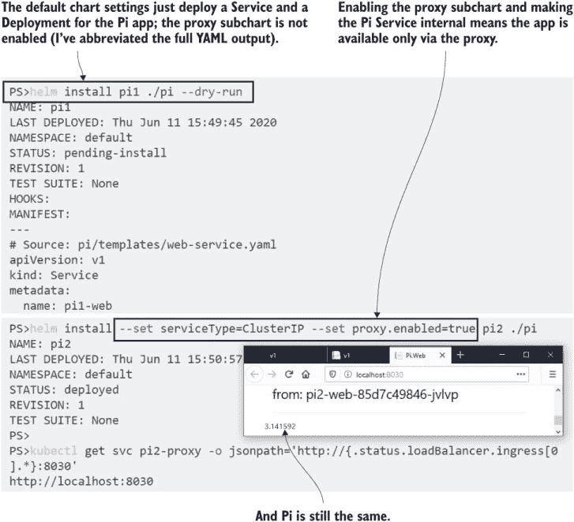

图 10.13 通过覆盖默认设置安装带有可选子图表的图表

在本章中，我没有为 Helm 提供足够的空间，因为您需要深入了解 Helm 的复杂性，只有当您对 Helm 进行大量投资并计划广泛使用它时。如果您是这样的人，您会发现 Helm 具有强大的功能来支持您。以下是一个例子：您可以从 ConfigMap 模板的内容生成哈希，并将其用作 Deployment 模板中的标签，这样每次配置更改时，Deployment 标签也会更改，升级配置会触发 Pod 回滚。

这很酷，但并不是适合每个人，所以在下一节中，我们将回到一个简单的演示应用，看看 Helm 如何简化升级和回滚过程。

## 10.4 升级和回滚 Helm 发布

使用 Helm 升级应用程序并没有什么特别之处；它只是将更新的规范发送到 Kubernetes，Kubernetes 会以通常的方式推出更改。如果你想要配置推出的具体细节，你仍然需要在图表中的 YAML 文件中进行，使用我们在第九章中探讨的设置。Helm 带给升级的是对所有类型资源的一致方法以及轻松回滚到先前版本的能力。

Helm 还为你带来的一项其他优势是，通过在集群中部署额外的实例，你可以安全地尝试新版本。我开始本章时，在我的集群中部署了 vweb 应用程序的 1.0.0 版本，它仍在愉快地运行。现在 2.0.0 版本已经可用，但在升级正在运行的应用程序之前，我可以用 Helm 安装一个单独的发布版本来测试新功能。

现在尝试一下。检查原始的 vweb 发布版本是否仍然存在，然后安装一个版本 2 的发布版本，并指定设置以保持应用程序私有。

```
# list all releases:
helm ls -q

# check the values for the new chart version:
helm show values kiamol/vweb --version 2.0.0

# deploy a new release using an internal Service type:
helm install --set servicePort=8020 --set replicaCount=1
             --set serviceType=ClusterIP ch10-vweb-v2 kiamol/vweb --version 2.0.0

# use a port-forward so you can test the app:
kubectl port-forward svc/ch10-vweb-v2 8020:8020

# browse to localhost:8020, then exit the port-forward with Ctrl-C or
# Cmd-C
```

这个练习使用图表支持的参数安装应用程序，而不使其公开可用，使用 ClusterIP 服务类型和 `port-forward`，这样应用程序就只能对当前用户可访问。原始应用程序没有改变，我有机会在目标集群中对新的 Deployment 进行烟测试。图 10.14 显示了新版本正在运行。

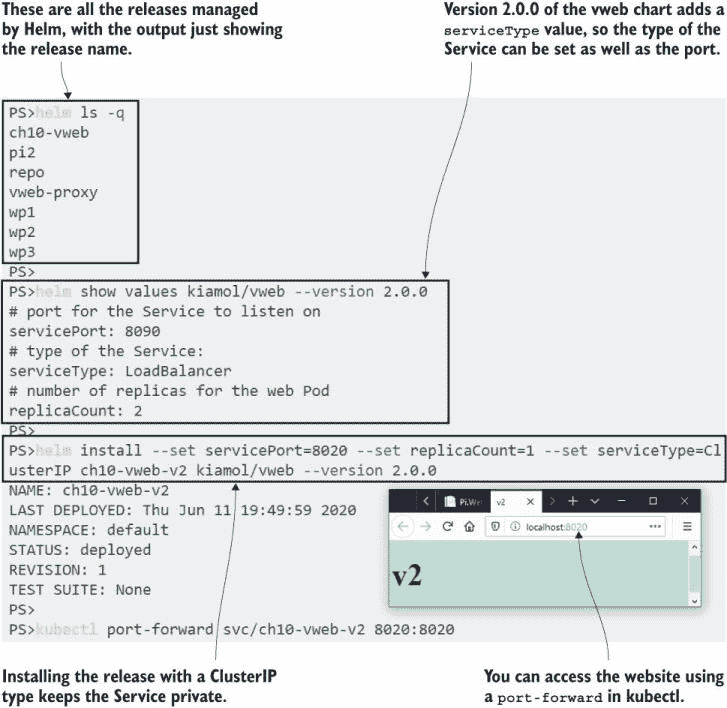

图 10.14 部署服务的图表通常允许你设置类型，因此你可以保持它们私有。

现在，我很高兴 2.0.0 版本运行良好，我可以用 Helm 的 `upgrade` 命令升级我的实际发布版本。我想确保我使用与上一个发布中设置相同的值进行部署，并且 Helm 有功能可以显示当前值并在升级中重用自定义值。

现在尝试一下。删除临时的版本 2 发布版本，并将版本 1 发布版本升级到版本 2 图表，重用当前发布上设置的相同值。

```
# remove the test release:
helm uninstall ch10-vweb-v2

# check the values used in the current version 1 release:
helm get values ch10-vweb

# upgrade to version 2 using the same values--this will fail:
helm upgrade --reuse-values --atomic ch10-vweb kiamol/vweb --version 2.0.0
```

哎呀。这是一个特别棘手的问题，需要一些追踪才能理解。`reuse-values` 标志告诉 Helm 在新版本上重用为当前发布设置的 所有值，但 2.0.0 版本的图表还包括另一个值，即 Service 的类型，因为在当前发布中它不存在，所以没有设置。最终结果是 Service 类型为空，默认为 Kubernetes 中的 ClusterIP，更新失败是因为它与现有的 Service 规范冲突。你可以在图 10.15 的输出中看到这一点。

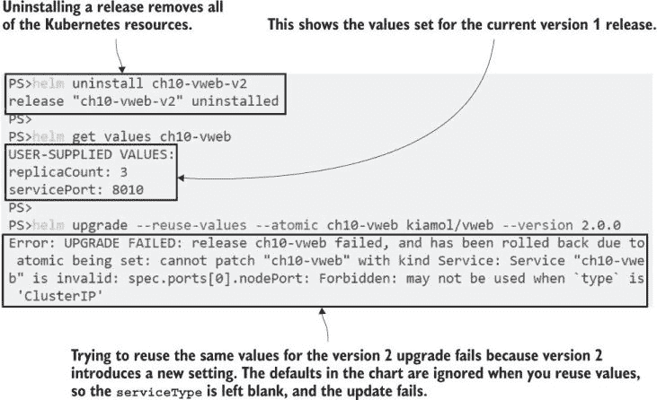

图 10.15 一个无效的升级失败，Helm 可以自动回滚到上一个版本。

这种类型的问题正是 Helm 抽象层真正有帮助的地方。你可以在标准的 kubectl 部署中遇到同样的问题，但如果某个资源更新失败，你需要检查所有其他资源并手动回滚它们。Helm 通过`atomic`标志自动执行此操作。它等待所有资源更新完成，如果其中任何一个失败，它将回滚其他所有资源到之前的状态。检查发布的历史，你可以看到 Helm 已自动回滚到版本 1.0.0。

现在试试回滚。回想一下第九章中提到的 Kubernetes 在滚动更新历史方面提供的信息不多——将这一点与 Helm 提供的信息进行比较。

```
# show the history of the vweb release:
helm history ch10-vweb
```

那个命令本身就是一个练习，因为你在标准的 Kubernetes 滚动更新历史中得不到这么多的信息。图 10.16 显示了发布的所有四个版本：第一次安装、一次成功的升级、一次失败的升级和自动回滚。

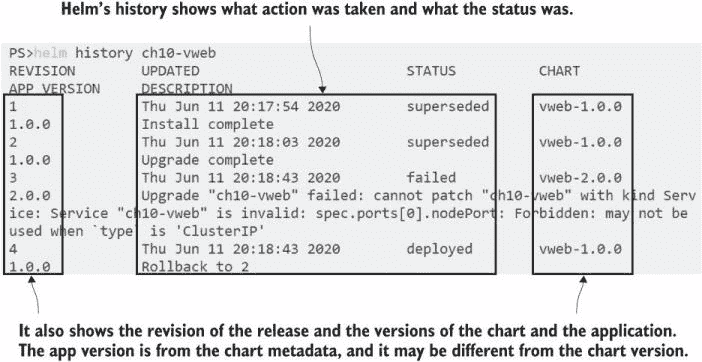

图 10.16 发布历史清楚地将应用程序和图表版本链接到修订版。

为了修复失败的更新，我可以手动设置`upgrade`命令中的所有值，或者使用具有当前部署相同设置的值文件。我没有那个值文件，但我可以将`get values`命令的输出保存到文件中，并在升级时使用它，这样我就有了所有之前的设置，以及任何新设置的图表中的默认值。

现在试试升级到版本 2，这次将当前版本 1 的值保存到文件中，并在`upgrade`命令中使用它。

```
# save the values of the current release to a YAML file:
helm get values ch10-vweb -o yaml > vweb-values.yaml

# upgrade to version 2 using the values file and the atomic flag:
helm upgrade -f vweb-values.yaml --atomic ch10-vweb kiamol/vweb
--version 2.0.0

# check the Service and ReplicaSet configuration:
kubectl get svc,rs -l app.kubernetes.io/instance=ch10-vweb
```

这次升级成功，所以原子回滚没有启动。升级实际上是通过 Deployment 实现的，它以常规方式扩展了替换 ReplicaSet 并缩减了当前 ReplicaSet。图 10.17 显示了在之前版本中设置的配置值已保留，Service 正在 8010 端口监听，并且有三个 Pod 正在运行。

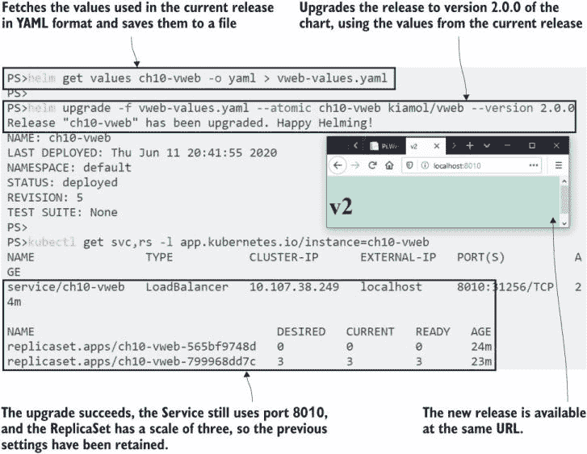

图 10.17 通过将发布设置导出到文件并再次使用它们来实现升级成功。

剩下的就是尝试回滚，它在语法上与 kubectl 中的回滚类似，但 Helm 使跟踪你想要使用的修订版变得容易得多。你已经看到了图 10.16 中显示的有意义的发布历史，你也可以使用 Helm 来检查特定修订版设置的值。如果我想将 Web 应用程序回滚到版本 1.0.0，但保留我在修订版 2 中设置的值，我首先可以检查那些值。

现在试试回滚到第二个修订版，即应用程序的 1.0.0 版本升级到使用三个副本。

```
# confirm the values used in revision 2:
helm get values ch10-vweb --revision 2

# roll back to that revision:
helm rollback ch10-vweb 2

# check the latest two revisions:
helm history ch10-vweb --max 2 -o yaml
```

你可以在图 10.18 中看到我的输出，回滚成功，历史显示最新修订版是 6，实际上是一个回滚到修订版 2。

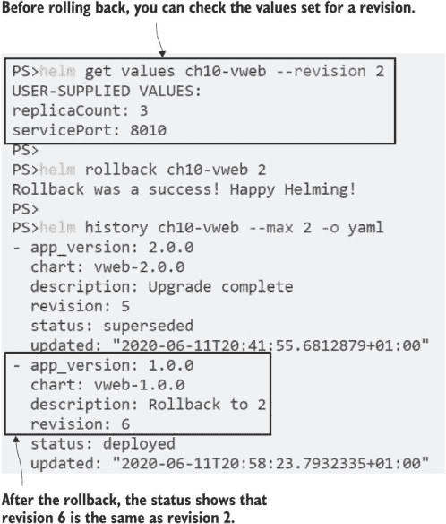

图 10.18 Helm 使检查你正在回滚到的确切内容变得容易。

这个示例的简单性有助于集中精力在升级和回滚工作流程上，并突出一些怪癖，但它隐藏了 Helm 在重大升级中的强大功能。Helm 发布是一个应用程序的抽象，应用程序的不同版本可能以不同的方式建模。一个图表可能在早期版本中使用 ReplicationController，然后改为 ReplicaSet，然后是 Deployment；只要用户界面部分保持不变，内部工作就变成了实现细节。

## 10.5 理解 Helm 的适用位置

Helm 为 Kubernetes 增加了大量价值，但它具有侵略性——一旦您模板化您的清单，就无法回头。团队中的每个人都必须切换到 Helm，或者您必须承诺拥有多套清单：开发团队的纯 Kubernetes 和其他所有环境的 Helm。您真的不希望两套清单不同步，但同样，即使不添加 Helm，Kubernetes 本身也足够学习。

Helm 是否适合您在很大程度上取决于您打包的应用程序类型以及您团队的工作方式。如果您的应用程序由 50+ 个微服务组成，那么开发团队可能只处理整个应用程序的一个子集，以原生方式或使用 Docker 和 Docker Compose 运行，而另一个团队负责完整的 Kubernetes 部署。在这种情况下，转向 Helm 将减少摩擦而不是增加摩擦，将数百个 YAML 文件集中到可管理的图表中。

其他一些表明 Helm 是一个好的选择包括一个完全自动化的持续部署流程——这可以通过 Helm 更容易地构建——使用相同的图表版本和自定义值文件运行测试环境，以及在部署过程中运行验证作业。当您发现自己需要模板化 Kubernetes 清单——您迟早会这样做——Helm 给您提供了一个标准方法，这比编写和维护自己的工具要好。

本章关于 Helm 的内容就到这里，因此在进入实验室之前，需要整理集群。

现在试试看 本章中所有内容都是使用 Helm 部署的，因此我们可以使用 Helm 来卸载它们。

```
# uninstall all the releases:
helm uninstall $(helm ls -q)
```

## 10.6 实验室

又回到了实验室的待办事项应用。您将从一个工作集的 Kubernetes 清单中提取并打包成 Helm 图表。不用担心——这并不是第八章中包含 StatefulSets 和备份作业的完整应用程序；这是一个更简单的版本。以下是目标：

+   以 `lab/todo-list` 文件夹中的清单作为起点（YAML 中有关于需要模板化的提示）。

+   创建 Helm 图表结构。

+   模板化资源名称和其他需要模板化的值，以便应用程序可以作为多个发布运行。

+   添加配置设置的参数以支持以不同环境运行应用程序。

+   当使用默认值安装时，您的图表应运行为测试配置。

+   当使用`lab/dev-values.yaml`值文件安装时，您的图表应运行为开发配置。

如果您打算使用 Helm，您真的应该为这个实验室腾出时间，因为它包含了您在 Helm 中打包应用程序时需要完成的精确任务集。我的解决方案在 GitHub 上，您可以在通常的位置检查：[`github.com/sixeyed/kiamol/blob/master/ch10/lab/README.md`](https://github.com/sixeyed/kiamol/blob/master/ch10/lab/README.md).

开心领导！
