# 11 应用程序开发-开发者工作流程和 CI/CD

这是关于现实世界中 Kubernetes 的最后一章，重点是开发和交付在 Kubernetes 上运行的软件的实用性。无论你自认为是开发者还是你在运维方面与开发者合作，转向容器化都会影响你的工作方式、使用的工具，以及从代码更改到在开发和测试环境中看到运行所需的时间和精力。在本章中，我们将探讨 Kubernetes 如何影响**内部循环**——本地机器上的开发者工作流程——以及**外部循环**——将更改推送到测试和生产环境的 CI/CD 工作流程。

你在组织中使用 Kubernetes 的方式将与你在这本书中迄今为止使用的方式大不相同，因为你将使用共享资源，如集群和镜像注册库。在本章中，我们将探讨交付工作流程时，我们还将涵盖许多小细节，这些细节可能会在你向现实世界转变时让你感到困惑——比如使用私有注册库和在共享集群上保持隔离。本章的主要重点是帮助你理解在以 Docker 为中心的工作流程和类似于在 Kubernetes 上运行的 Platform-as-a-Service（PaaS）之间进行选择。

## 11.1 Docker 开发者工作流程

开发者热爱 Docker。它连续两年在 Stack Overflow 的年度调查中被选为最受欢迎的平台和第二受欢迎的平台。Docker 使开发者工作流程的一些部分变得极其简单，但代价是：Docker 工件成为项目的核心，这对内部循环有影响。你可以在本地环境中使用与生产环境相同的技术运行应用程序，但前提是你接受不同的工作方式。如果你不熟悉使用容器构建应用程序，电子书的附录 A 详细介绍了这一点；它是来自《Learn Docker in a Month of Lunches》（Manning，2020）的章节“从源代码打包应用程序到 Docker 镜像”。

在本节中，我们将逐步介绍开发工作流程，其中在每个环境中都使用 Docker 和 Kubernetes，并且开发者拥有自己的专用集群。如果你想跟随练习，需要确保 Docker 正在运行。如果你的实验室环境是 Docker Desktop 或 K3s，那么你已经准备好了。我们将首先关注开发者入职——加入新项目并尽可能快速地熟悉情况。

现在就试试吧！本章提供了一个全新的演示应用程序——一个简单的公告板，你可以在这里发布即将发生的事件的详细信息。它是用 Node.js 编写的，但你不需要安装 Node.js 就可以使用 Docker 工作流程启动运行。

```
# switch to this chapter’s folder in the source code:
cd ch11

# build the app:
docker-compose -f bulletin-board/docker-compose.yml build

# run the app:
docker-compose -f bulletin-board/docker-compose.yml up -d

# check the running  containers:
docker ps

# browse to the app at http://localhost:8010/
```

这只是作为开发者开始新项目的一种最简单的方式。你唯一需要安装的软件是 Docker，然后你获取代码的副本，就可以开始了。你可以看到图 11.1 中的我的输出。我没有在我的机器上安装 Node.js，而且你是否有 Node.js 以及它的版本无关紧要；你的结果将会相同。

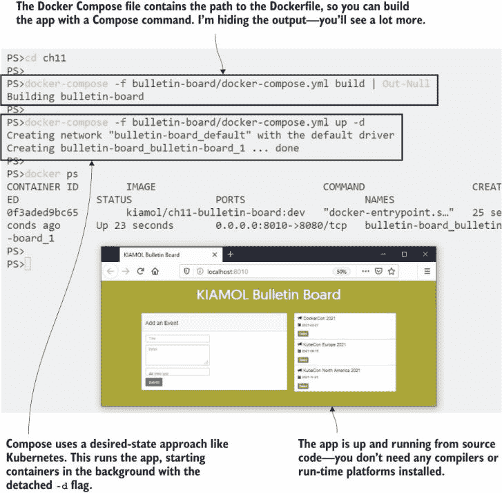

图 11.1 使用 Docker 和 Compose 进行开发者入职非常简单——如果没有问题的话。

在魔法背后是两件事：一个 Dockerfile，其中包含构建和打包 Node.js 组件的所有步骤，以及一个 Docker Compose 文件，它指定了所有组件及其 Dockerfile 的路径。在这个应用程序中只有一个组件，但可能有十几个——使用不同的技术——工作流程将是相同的。但这种方式并不是我们在生产环境中运行应用程序的方式，因此如果我们想使用相同的技术堆栈，我们可以切换到在本地运行应用程序在 Kubernetes 中，只需使用 Docker 进行构建。

现在尝试一下 简单的 Kubernetes 清单，用于使用本地镜像运行应用程序，位于源文件夹中。删除应用程序的 Compose 版本，并将其部署到 Kubernetes 中。

```
# stop the app in Compose:
docker-compose -f bulletin-board/docker-compose.yml down

# deploy in Kubernetes:
kubectl apply -f bulletin-board/kubernetes/

# get the new URL:
kubectl get svc bulletin-board -o jsonpath='http://{.status.loadBalancer.ingress[0].*}:8011'

# browse
```

尽管我们现在有三个容器工件需要处理：Dockerfile、Compose 文件和 Kubernetes 清单，但此工作流程仍然相当简单。我拥有自己的 Kubernetes 集群，因此我可以以生产环境中的方式运行应用程序。图 11.2 中的输出显示，这是同一个应用程序，使用相同的本地镜像，在前一个练习中使用 Docker Compose 构建。

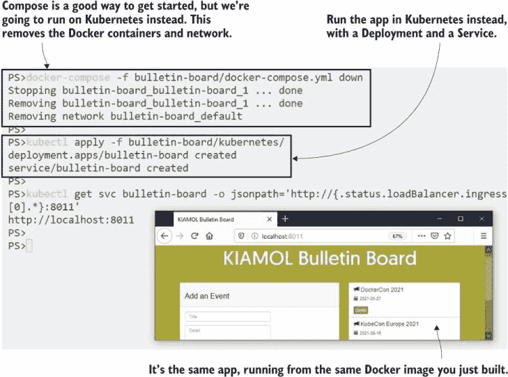

图 11.2 你可以使用 Compose 混合 Docker 和 Kubernetes，以在 Pods 中运行构建的镜像。

Kubernetes 愿意使用你使用 Docker 创建或拉取的本地镜像，但你必须遵循一些规则，关于它是否使用本地镜像或从仓库中拉取。如果镜像名称中没有显式的标签（并使用默认的 `:latest` 标签），那么 Kubernetes 将始终尝试首先拉取镜像。否则，如果节点上的镜像缓存中存在本地镜像，Kubernetes 将使用本地镜像。你可以通过指定镜像拉取策略来覆盖这些规则。列表 11.1 显示了公告板应用程序的 Pod 规范，其中包含一个显式的策略。

列表 11.1 bb-deployment.yaml，指定镜像拉取策略

```
spec:                         # This is the Pod spec within the Deployment.
  containers:
    - name: bulletin-board
      image: kiamol/ch11-bulletin-board:dev 
      imagePullPolicy: IfNotPresent   # Prefer the local image if it exists
```

这类细节可能会成为开发者工作流程中的一个大障碍。Pod 规范可能被配置为优先使用仓库镜像，然后你可以尽可能多地重建你自己的本地镜像，但永远不会看到任何变化，因为 Kubernetes 总是使用远程镜像。在镜像版本方面也存在类似的复杂性，因为可以使用具有相同名称和标签的另一个版本替换镜像。这并不符合 Kubernetes 所需状态的方法，因为如果你部署了一个更新，Pod 规范没有变化，即使镜像内容已经改变，也不会发生任何事情。

回到我们的演示应用程序。您在项目中的第一个任务是向事件列表添加更多细节，这对您来说是一个简单的代码更改。测试您的更改更具挑战性，因为您可以通过重复 Docker Compose 命令来重新构建镜像，但如果您重复 kubectl 命令来部署更改，您会发现没有任何事情发生。如果您对容器感兴趣，您可以做一些调查来了解问题并删除 Pod 以强制替换，但如果您不感兴趣，那么您的工作流程已经中断了。

现在试试看您实际上不需要进行代码更改——新文件中包含了更改。只需替换代码文件并重新构建镜像，然后删除 Pod 以查看在替换 Pod 中运行的新应用程序版本。

```
# remove the original code file:
rm bulletin-board/src/backend/events.js

# replace it with an updated version:
cp bulletin-board/src/backend/events-update.js bulletin-board/src/backend/events.js

# rebuild the image using Compose:
docker-compose -f bulletin-board/docker-compose.yml build

# try to redeploy using kubectl:
kubectl apply -f bulletin-board/kubernetes/

# delete the existing Pod to recreate it:
kubectl delete pod -l app=bulletin-board
```

您可以在图 11.3 中看到我的输出。更新的应用程序在屏幕截图上运行，但只有在 Pod 被手动删除并由 Deployment 控制器重新创建后，使用最新的镜像版本，才运行。

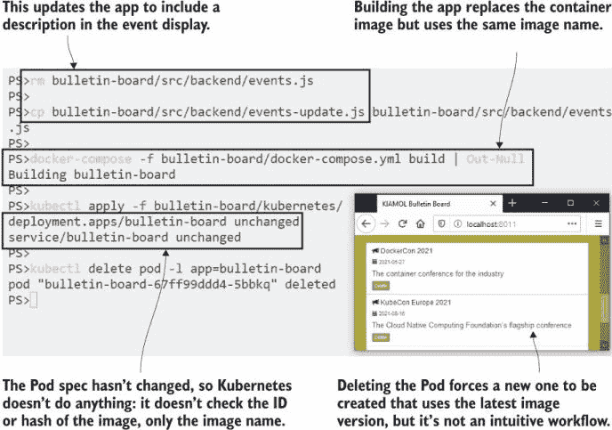

图 11.3 Docker 镜像是可以更改的，但重命名镜像不会在 Kubernetes 中触发更新。

如果您选择以 Docker 为中心的工作流程，那么这只是开发团队将遇到并减缓、挫败感的工作流程中的复杂问题之一（调试和实时应用程序更新将是他们接下来会遇到的问题）。容器技术不是容易学习的话题，您需要投入一些专门的时间来理解其原理，并且并非每个团队中的每个人都会愿意进行这种投资。

另一种选择是将所有容器技术集中在一个团队中，该团队提供一个 CI/CD 管道，开发团队可以将其连接到以部署他们的应用程序。该管道负责打包容器镜像并将其部署到集群中，因此开发团队不需要将 Docker 和 Kubernetes 引入自己的工作。

## 11.2 Kubernetes-as-a-Service 开发工作流程

在 Kubernetes 之上运行的平台即服务（PaaS）体验对于许多组织来说是一个有吸引力的选择。您可以运行一个集群来处理所有测试环境，该集群还托管 CI/CD 服务以处理容器运行中的繁琐细节。所有 Docker 工件都从开发工作流程中移除，因此开发者可以直接在组件上工作，在他们的机器上运行 Node.js 和其他所有他们需要的软件，并且他们不使用本地容器。

此方法将容器移动到外层循环——当开发人员向源代码控制推送更改时，这会触发构建，创建容器镜像，将它们推送到注册表，并将新版本部署到集群中的测试环境中。您将获得在容器平台运行的所有好处，而无需承受容器给开发带来的摩擦。图 11.4 显示了使用一组技术选项时的样子。

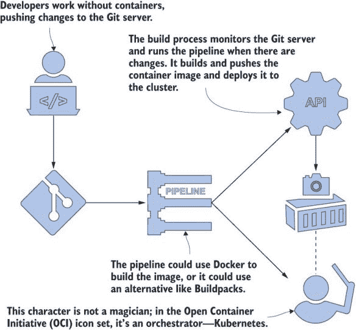

图 11.4 在外层循环中使用容器让开发者专注于代码。

这种方法的承诺是，您可以在不影响开发工作流程或不需要每个团队成员都掌握 Docker 和 Compose 技能的情况下在 Kubernetes 上运行您的应用程序。它可以在开发团队专注于小型组件而另一个团队将这些组件组装成工作系统的组织中很好地工作，因为只有组装团队需要容器技能。您还可以完全删除 Docker，如果您的集群使用不同的容器运行时，这很有用。但是，如果您想在没有 Docker 的情况下构建容器镜像，则需要用许多其他组件来替换它。您最终将拥有更多的复杂性，但这些复杂性将集中在交付管道而不是项目中。

我们将在本章中通过一个示例来展示这一点，但为了管理复杂性，我们将分阶段进行，首先从构建服务的内部视角开始。为了简化，我们将运行自己的 Git 服务器，这样我们就可以从我们的实验室集群中推送更改并触发构建。

现在尝试一下 Gogs 是一个简单但强大的 Git 服务器，它作为 Docker Hub 上的镜像发布。这是在您的组织中运行私有 Git 服务器或快速启动备份（如果您的在线服务离线）的好方法。在您的集群中运行 Gogs 以推送书籍源代码的本地副本。

```
# deploy the Git server:
kubectl apply -f infrastructure/gogs.yaml

# wait for it to spin up:
kubectl wait --for=condition=ContainersReady pod -l app=gogs

# add your local Git server to the book’s repository--
# this grabs the URL from the Service to use as the target:
git remote add gogs $(kubectl get svc gogs -o jsonpath=
'http://{.status.loadBalancer.ingress[0].*}:3000/kiamol/kiamol.git')

# push the code to your server--authenticate with 
# username kiamol and password kiamol 
git push gogs

# find the server URL:
kubectl get svc gogs -o jsonpath='http://{.status.loadBalancer.ingress[0].*}:3000'

# browse and sign in with the same kiamol credentials
```

图 11.5 显示了我的输出。您不需要运行自己的 Git 服务器来完成此工作流程；使用 GitHub 或任何其他源代码控制系统也可以以相同的方式工作，但这样做可以创建一个易于复制的环境——本章的 Gogs 设置已预配置了用户账户，因此您可以快速启动并运行。

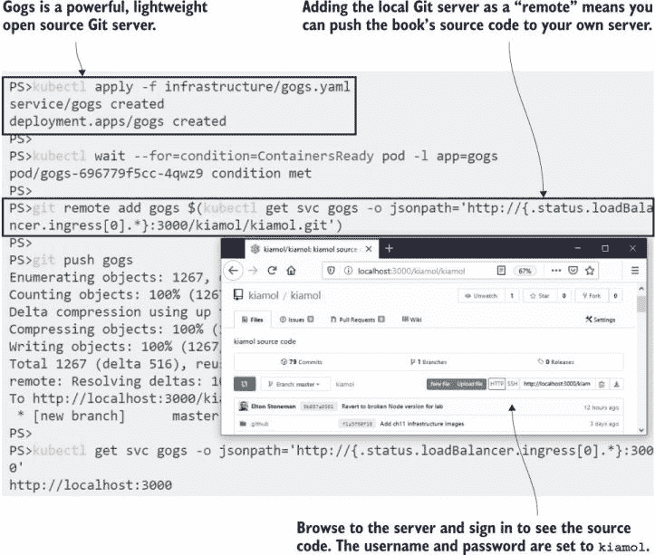

图 11.5 使用 Gogs 在 Kubernetes 中运行自己的 Git 服务器非常简单。

现在我们有一个本地源代码服务器，我们可以将其与其他组件连接起来。接下来是一个可以构建容器镜像的系统。为了使其可移植，以便在任何集群上运行，我们需要一个不需要 Docker 的东西，因为集群可能使用不同的容器运行时。我们有几种选择，但其中之一是 BuildKit，这是 Docker 团队的一个开源项目。BuildKit 最初是作为 Docker Engine 内部镜像构建组件的替代品，它具有可插拔的架构，因此您可以使用或不需要 Dockerfile 来构建镜像。您可以将 BuildKit 作为服务器运行，这样工具链中的其他组件就可以使用它来构建镜像。

现在尝试一下 在集群内部运行 BuildKit 作为服务器，并确认它拥有构建容器镜像所需的所有工具。

```
# deploy BuildKit:
kubectl apply -f infrastructure/buildkitd.yaml

# wait for it to spin up:
kubectl wait --for=condition=ContainersReady pod -l app=buildkitd

# verify that Git and BuildKit are available:
kubectl exec deploy/buildkitd -- sh -c 'git version && buildctl --version'

# check that Docker isn’t installed--this command will fail:
kubectl exec deploy/buildkitd -- sh -c 'docker version'
```

您可以在图 11.6 中看到我的输出，其中 BuildKit Pod 从一个安装了 BuildKit 和 Git 客户端但未安装 Docker 的镜像中运行。重要的是要认识到 BuildKit 是完全独立的——它不会连接到 Kubernetes 中的容器运行时来构建镜像；所有这些都将发生在 Pod 内部。

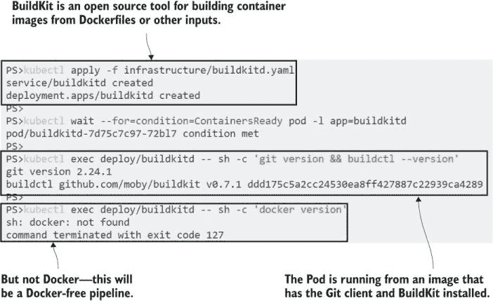

图 11.6 BuildKit 作为容器镜像运行——构建服务，无需 Docker

在我们可以看到完整的 PaaS 工作流程之前，我们还需要设置一些其他组件，但现在我们已经有了足够的组件来了解构建部分是如何工作的。我们在这里的目标是采用无 Docker 的方法，因此我们将忽略上一节中使用的 Dockerfile，并直接从源代码构建应用程序到容器镜像中。如何做到这一点？通过使用一个名为 Buildpacks 的 CNCF 项目，这是一个 Heroku 领先的技术，用于推动他们的 PaaS 产品。

Buildpacks 使用与多阶段 Dockerfile 相同的概念：在容器内运行构建工具来编译应用程序，然后在具有应用程序运行时的另一个容器镜像上打包编译后的应用程序。你可以使用一个名为 Pack 的工具来完成这项工作，你需要在应用程序的源代码上运行它。Pack 会确定你使用的语言，将其与 Buildpack 匹配，然后将你的应用程序打包成一个镜像——无需 Dockerfile。目前 Pack 只能在 Docker 上运行，但我们没有使用 Docker，因此我们可以使用一个替代方案来将 Buildpacks 与 BuildKit 集成。

现在试试看 我们将进入构建过程，手动运行一个我们将在本章后面自动化的构建。连接到 BuildKit Pod，从你的本地 Git 服务器拉取书籍的代码，并使用 Buildpacks 而不是 Dockerfile 来构建它。

```
# connect to a session on the BuildKit Pod:
kubectl exec -it deploy/buildkitd -- sh

# clone the source code from your Gogs server:
cd ~
git clone http://gogs:3000/kiamol/kiamol.git

# switch to the app directory:
cd kiamol/ch11/bulletin-board/

# build the app using BuildKit; the options tell BuildKit
# to use Buildpacks instead of a Dockerfile as input and to 
# produce an image as the output:
buildctl build --frontend=gateway.v0  --opt source=kiamol/buildkit-buildpacks
               --local context=src --output type=image,name=kiamol/ch11-bulletin-board:buildkit

# leave the session when the build completes
exit
```

这个练习需要一段时间才能运行，但请密切关注 BuildKit 的输出，你将看到正在发生的事情——首先，它下载提供 Buildpacks 集成的组件，然后运行并发现这是一个 Node.js 应用程序；它将应用程序打包成一个压缩归档，然后将归档导出到一个已安装 Node.js 运行时的容器镜像中。我的输出如图 11.7 所示。

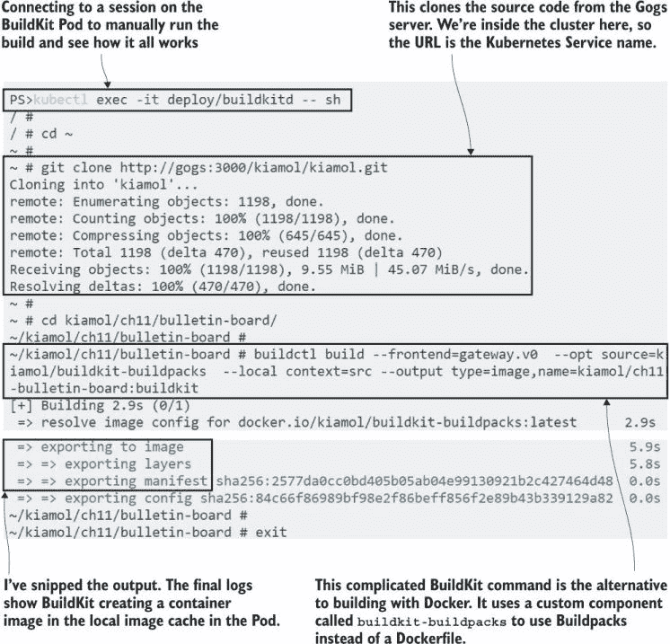

图 11.7 无 Docker 和 Dockerfile 构建容器镜像增加了许多复杂性。

你不能在 BuildKit Pod 上从这个镜像运行容器，因为它没有配置容器运行时，但 BuildKit 在构建后能够将镜像推送到注册表，这就是我们在完整工作流程中要做的。到目前为止，我们已经看到可以在没有 Dockerfile 或 Docker 的情况下构建和打包应用程序以在容器中运行，这相当令人印象深刻，但这也带来了一定的代价。

最大的问题是构建过程的复杂性和所有组件的成熟度。BuildKit 是一个稳定的工具，但它并没有像标准的 Docker 构建引擎那样被广泛使用。Buildpacks 是一种有希望的方法，但由于对 Docker 的依赖，它们在云中管理的 Kubernetes 集群等无 Docker 环境中工作得并不好。我们用来连接它们的组件是由 BuildKit 项目维护者 Tõnis Tiigi 编写的工具。这实际上只是一个将 Buildpacks 插入 BuildKit 的概念证明；它足够好，可以演示工作流程，但它不是你想要用于生产应用程序构建的东西。

有其他选择。GitLab 是一个将 Git 服务器与使用 Buildpacks 的构建管道结合在一起的产品，而 Jenkins X 是 Kubernetes 的原生构建服务器。它们本身是复杂的产品，你需要意识到，如果你想从你的开发者工作流程中移除 Docker，你将在构建过程中以更多的复杂性为代价。你将在本章结束时能够决定结果是否值得。接下来，我们将看看如何在 Kubernetes 中隔离工作负载，以便单个集群可以运行你的交付管道和所有测试环境。

## 11.3 使用上下文和命名空间隔离工作负载

在第三章中，我介绍了 Kubernetes 的命名空间——并且很快转到了其他内容。你需要了解它们才能理解 Kubernetes 为服务使用的完全限定 DNS 名称，但你不需要使用它们，直到你开始划分你的集群。命名空间是一种分组机制——每个 Kubernetes 对象都属于一个命名空间——你可以使用多个命名空间从一个真实集群中创建虚拟集群。

命名空间非常灵活，组织以不同的方式使用它们。你可能在生产集群中使用它们来划分不同的产品，或者划分非生产集群以适应不同的环境——集成测试、系统测试和用户测试。你甚至可能有一个开发集群，其中每个开发者都有自己的命名空间，这样他们就不需要运行自己的集群。命名空间是一个边界，你可以在这里应用安全和资源限制，因此它们支持所有这些场景。在我们的 CI/CD 部署中，我们将使用一个专用的命名空间，但我们将从简单的流程开始。

现在尝试一下 Kubectl 是命名空间感知的。你可以显式创建一个命名空间，然后使用`namespace`标志部署和查询资源——这将创建一个简单的 sleep Deployment。

```
# create a new namespace:
kubectl create namespace kiamol-ch11-test

# deploy a sleep Pod in the new namespace:
kubectl apply -f sleep.yaml --namespace kiamol-ch11-test

# list sleep Pods--this won’t return anything:
kubectl get pods -l app=sleep

# now list the Pods in the namespace:
kubectl get pods -l app=sleep -n kiamol-ch11-test
```

我的输出显示在图 11.8 中，你可以看到命名空间是资源元数据的一个基本组成部分。你需要明确指定命名空间才能在 kubectl 中使用对象。我们之所以在前 10 章中避免这样做，唯一的原因是每个集群都有一个名为`default`的命名空间，如果你没有指定命名空间，就会使用这个命名空间，而且我们到目前为止一直在那里创建和使用一切。

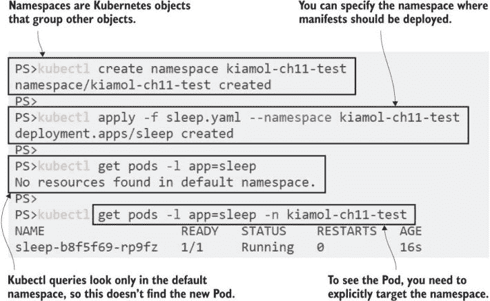

图 11.8 命名空间隔离工作负载——你可以使用它们来表示不同的环境。

命名空间内的对象是隔离的，因此你可以在不同的命名空间中部署具有相同对象名称的相同应用程序。资源不能看到其他命名空间中的资源。Kubernetes 的网络是扁平的，所以不同命名空间中的 Pod 可以通过服务进行通信，但控制器只在其自己的命名空间中查找 Pod。命名空间也是普通的 Kubernetes 资源。列表 11.2 显示了 YAML 中的命名空间规范，以及使用新命名空间的其他 sleep Deployment 的元数据。

列表 11.2 sleep-uat.yaml，一个创建并针对命名空间的清单

```
apiVersion: v1
kind: Namespace      # Namespace specs need only a name.
metadata:
  name: kiamol-ch11-uat
---
apiVersion: apps/v1
kind: Deployment
metadata:                       # The target namespace is part of the 
  name: sleep                   # object metadata. The namespace needs
  namespace: kiamol-ch11-uat    # to exist, or the deployment fails.    

   # The Pod spec follows.
```

该 YAML 文件中的 Deployment 和 Pod 规范使用与你在上一个练习中部署的对象相同的名称，但由于控制器设置为使用不同的命名空间，它创建的所有对象也将位于该命名空间中。当你部署此清单时，你会看到创建的新对象而不会出现任何命名冲突。

现在尝试一下：从列表 11.2 中的 YAML 创建一个新的 `UAT` 命名空间和部署。控制器使用相同的名称，并且你可以使用 kubectl 在命名空间之间查看对象。删除命名空间将删除其所有资源。

```
# create the namespace and Deployment:
kubectl apply -f sleep-uat.yaml

# list the sleep Deployments in all namespaces:
kubectl get deploy -l app=sleep --all-namespaces

# delete the new UAT namespace:
kubectl delete namespace kiamol-ch11-uat

# list Deployments again:
kubectl get deploy -l app=sleep --all-namespaces
```

你可以在图 11.9 中看到我的输出。原始的 sleep 部署在 YAML 文件中没有指定命名空间，我们通过在 kubectl 命令中指定它，在 `kiamol-ch11-test` 命名空间中创建了它。第二个 sleep 部署在 YAML 中指定了 `kiamol-ch11-uat` 命名空间，因此它在那里创建，无需使用 kubectl 命名空间标志。

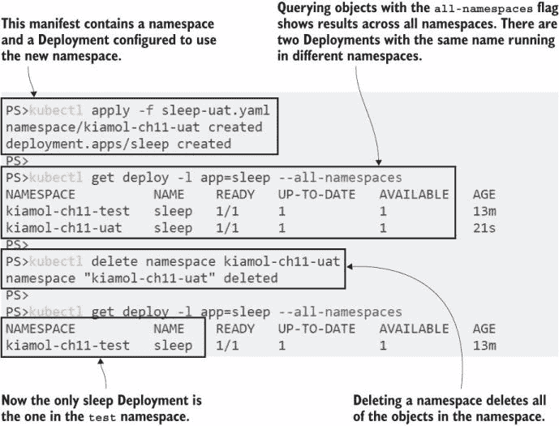

图 11.9 命名空间是管理对象组的有用抽象

在共享集群环境中，你可能经常使用不同的命名空间——在自己的开发命名空间中部署应用程序，然后在测试命名空间中查看日志。使用 kubectl 标志在它们之间切换既耗时又容易出错，而 kubectl 提供了一种更简单的方法，即 *上下文*。上下文定义了 Kubernetes 集群的连接细节，并设置在 kubectl 命令中使用的默认命名空间。你的实验环境已经设置了一个上下文，你可以修改它以切换命名空间。

现在尝试一下：显示你的配置上下文，并将当前上下文更新为将默认命名空间设置为测试命名空间。

```
# list all contexts:
kubectl config get-contexts

# update the default namespace for the current context:
kubectl config set-context --current --namespace=kiamol-ch11-test

# list the Pods in the default namespace:
kubectl get pods
```

你可以在图 11.10 中看到，为上下文设置命名空间将设置所有 kubectl 命令的默认命名空间。任何未指定命名空间的查询以及任何 YAML 中未指定命名空间的 `create` 命令现在都将使用测试命名空间。你可以创建多个上下文，所有这些上下文都使用相同的集群但不同的命名空间，并且可以使用 kubectl 的 `use-context` 命令在它们之间切换。

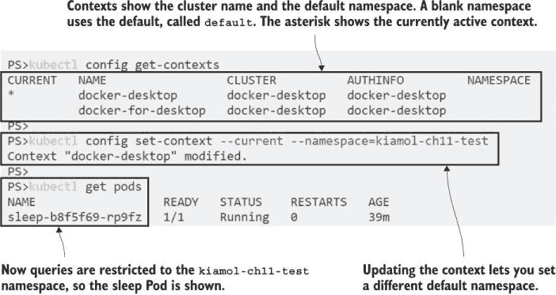

图 11.10 上下文是切换命名空间和集群的简单方法。

上下文的另一个重要用途是切换集群。当你设置 Docker Desktop 或 K3s 时，它们会为你的本地集群创建一个上下文——所有细节都存储在配置文件中，该文件存储在你家目录中的 `.kube` 目录中。托管 Kubernetes 服务通常具有将集群添加到配置文件的功能，因此你可以从本地机器上与远程集群一起工作。远程 API 服务器将使用 TLS 加密，你的 kubectl 配置将使用客户端证书来识别你作为用户。你可以通过查看配置来查看这些安全细节。

现在尝试一下 将上下文重置为使用默认命名空间，然后打印客户端配置的详细信息。

```
# setting the namespace to blank resets the default:
kubectl config set-context --current --namespace=

# printing out the config file shows your cluster connection:
kubectl config view
```

图 11.11 展示了我的输出，使用 TLS 证书通过本地连接到我的 Docker Desktop 集群进行验证——这些证书在 kubectl 中没有显示。 

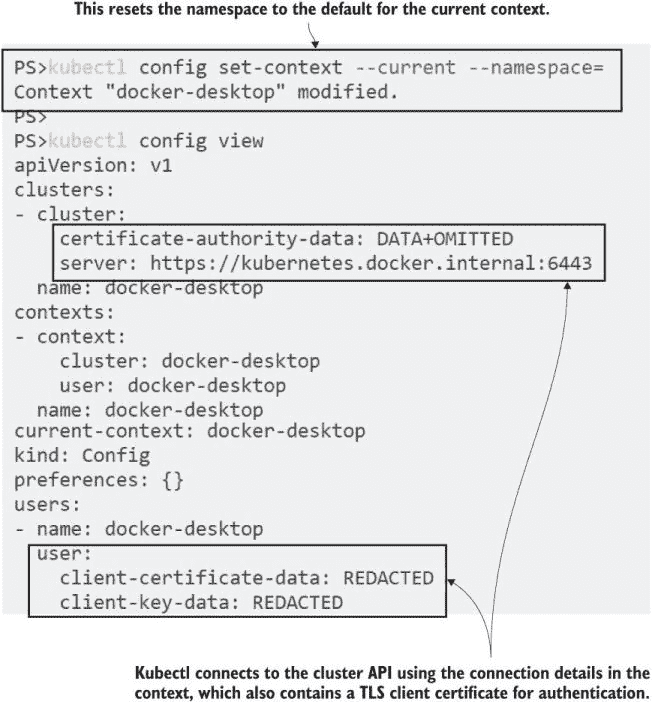

图 11.11 上下文包含集群的连接细节，这些细节可能是本地或远程的。

Kubectl 还可以使用令牌与 Kubernetes API 服务器进行身份验证，Pod 被提供了一个令牌，它们可以使用这个令牌作为 Secret，因此运行在 Kubernetes 中的应用程序可以连接到 Kubernetes API 来查询或部署对象。这是我们想要达到的下一个目标：我们将在 Pod 中运行一个构建服务器，当 Git 中的源代码发生变化时触发构建，使用 BuildKit 构建镜像，并将其部署到测试命名空间中的 Kubernetes。

## 11.4 在 Kubernetes 中不使用 Docker 的持续交付

实际上，我们还没有完全到达那里，因为构建过程需要将镜像推送到注册库，以便 Kubernetes 可以将其拉取以运行 Pod 容器。真实集群有多个节点，每个节点都需要能够访问镜像注册库。到目前为止这很容易，因为我们使用了 Docker Hub 上的公共镜像，但在您自己的构建中，您首先需要将镜像推送到私有仓库。Kubernetes 通过在特殊类型的 Secret 对象中存储注册库凭证来支持拉取私有镜像。

您需要在一个镜像仓库上设置一个账户，以便跟随本节内容——Docker Hub 是可以的，或者您可以在云上使用 Azure 容器注册库 (ACR) 或 Amazon 弹性容器注册库 (ECR) 创建一个私有注册库。如果您在云中运行集群，使用该云的注册库来减少下载时间是有意义的，但所有注册库都使用与 Docker Hub 相同的 API，因此它们可以互换。

现在尝试一下 创建一个密钥来存储注册库凭证。为了便于跟随，有一个脚本来收集凭证到本地变量中。不用担心——脚本不会将您的凭证发送给我。...

```
# collect the details--on Windows: 
. .\set-registry-variables.ps1

# OR on Linux/Mac:
. ./set-registry-variables.sh

# create the Secret using the details from the script:
kubectl create secret docker-registry registry-creds 
    --docker-server=$REGISTRY_SERVER
    --docker-username=$REGISTRY_USER
    --docker-password=$REGISTRY_PASSWORD

# show the Secret details:
kubectl get secret registry-creds
```

我的输出如图 11.12 所示。我使用的是 Docker Hub，它允许您创建临时访问令牌，您可以使用它与账户密码相同的方式使用。当我完成这一章时，我会撤销访问令牌——这是 Hub 中一个很好的安全特性。

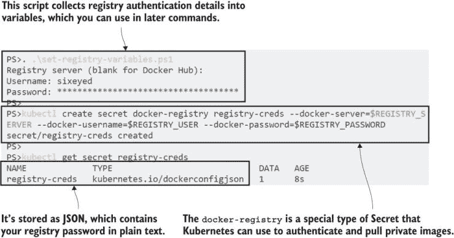

图 11.12 您的组织可能使用一个私有镜像仓库——您需要一个密钥来验证。

好的，现在我们准备好了。我们有一个无 Docker 的构建服务器在 BuildKit Pod 中运行，一个本地的 Git 服务器，我们可以用它快速迭代构建过程，还有一个存储在集群中的注册表 Secret。我们可以使用所有这些组件与自动化服务器一起运行构建管道，我们将使用 Jenkins 来完成这项工作。Jenkins 作为构建服务器有着悠久的传统，并且非常受欢迎，但你不需要成为 Jenkins 大师就能设置这个构建，因为我已经在一个自定义的 Docker Hub 镜像中配置好了它。

本章的 Jenkins 镜像已安装了 BuildKit 和 kubectl 命令行，Pod 已设置好以在正确位置暴露凭证。你在之前的练习中创建的注册表 Secret 已挂载到 Pod 容器中，因此 BuildKit 可以使用它来在推送镜像时认证到注册表。Kubectl 配置为使用 Kubernetes 在另一个 Secret 中提供的令牌连接到集群中的本地 API 服务器。部署 Jenkins 服务器，并检查一切是否配置正确。

现在试试吧，Jenkins 可以从 Kubernetes Secrets 中获取所有需要的资源，使用容器镜像中的启动脚本。首先部署 Jenkins 并确认它能够连接到 Kubernetes。

```
# deploy Jenkins:
kubectl apply -f infrastructure/jenkins.yaml

# wait for the Pod to spin up:
kubectl wait --for=condition=ContainersReady pod -l app=jenkins

# check that kubectl can connect to the cluster:
kubectl exec deploy/jenkins -- sh -c 'kubectl version --short'

# check that the registry Secret is mounted:
kubectl exec deploy/jenkins -- sh -c 'ls -l /root/.docker'
```

在这个练习中，你会看到 kubectl 报告你自己的 Kubernetes 实验室集群的版本——这确认了 Jenkins Pod 容器已正确设置以认证到 Kubernetes，因此它可以在运行它的同一集群中部署应用程序。我的输出显示在图 11.13 中。

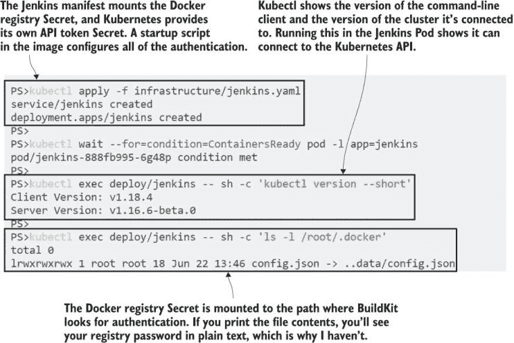

图 11.13 Jenkins 运行管道，因此它需要 Kubernetes 和注册表的认证详情。

现在一切准备就绪，Jenkins 可以从 Gogs Git 服务器获取应用程序代码，连接到 BuildKit 服务器使用 Buildpacks 构建容器镜像并将其推送到注册表，并将最新应用程序版本部署到测试命名空间。这项工作已经通过 Jenkins 管道设置好了，但管道步骤只是使用应用程序文件夹中的简单构建脚本。列表 11.3 显示了构建阶段，它打包并推送镜像。

列表 11.3 build.sh，使用 BuildKit 的构建脚本

```
buildctl --addr tcp://buildkitd:1234 \    # The command runs on Jenkins,
  build \                                 # but it uses the BuildKit server.
  --frontend=gateway.v0 \
  --opt source=kiamol/buildkit-buildpacks \    # Uses Buildpacks as input
  --local context=src \
  --output type=image,name=${REGISTRY_SERVER}/${REGISTRY_USER}/bulletin-board:
${BUILD_NUMBER}-kiamol,push=true  # Pushes the output to the registry
```

该脚本是对 11.2 节中当你假装自己是构建服务器时运行的更简单的 BuildKit 命令的扩展。`buildctl`命令使用与 Buildpacks 相同的集成组件，因此这里没有 Dockerfile。这个命令在 Jenkins Pod 内部运行，因此指定了 BuildKit 服务器的地址，该服务运行在名为`buildkitd`的单独 Pod 后面。这里也没有 Docker。镜像名称中的变量都是由 Jenkins 设置的，但它们都是标准环境变量，因此在构建脚本中没有对 Jenkins 的依赖。

当管道的这一阶段完成时，镜像将被构建并推送到注册表。下一阶段是部署更新后的应用程序，这在一个单独的脚本中，如列表 11.4 所示。您不需要自己运行它——所有这些都在 Jenkins 管道中。

列表 11.4 run.sh，使用 Helm 的部署脚本

```
helm upgrade --install  --atomic \    # Upgrades or installs the release
  --set registryServer=${REGISTRY_SERVER}, \    # Sets the values for the
        registryUser=${REGISTRY_USER}, \        # image tag, referencing  
        imageBuildNumber=${BUILD_NUMBER} \      # the new image version
  --namespace kiamol-ch11-test \      # Deploys to the test namespace
  bulletin-board \
  helm/bulletin-board 
```

部署使用 Helm 和一个具有镜像名称部分值的图表。它们来自构建阶段使用的相同变量，这些变量是从 Docker 注册表 Secret 和 Jenkins 中的构建号编译而来的。在我的情况下，第一次构建将镜像推送到 Docker Hub，命名为`sixeyed/bulletin-board:1-kiamol`，并使用该镜像安装 Helm 发布。要在您的集群中运行构建并将其推送到您的注册表，您只需登录到 Jenkins 并启用构建——管道本身已经设置好了。

现在尝试一下，Jenkins 正在运行并已配置，但管道作业尚未启用。登录以启用作业，您将看到管道执行并将应用程序部署到集群中。

```
# get the URL for Jenkins:
kubectl get svc jenkins -o jsonpath='http://{.status.loadBalancer.ingress[0].*}:8080/job/kiamol'

# browse and login with username kiamol and password kiamol; 
# if Jenkins is still setting itself up you’ll see a wait screen

# click enable for the Kiamol job and wait . . .

# when the pipeline completes, check the deployment:
kubectl get pods -n kiamol-ch11-test -l app.kubernetes.io/name=bulletin-board
 -o=custom-columns=NAME:.metadata.name,IMAGE:.spec.containers[0].image
# find the URL of the test app:
kubectl get svc -n kiamol-ch11-test bulletin-board
 -o jsonpath='http://{.status.loadBalancer.ingress[0].*}:8012'

# browse
```

构建应该很快，因为它使用的是已经为第 11.2 节中的 Buildpack 构建缓存的相同 BuildKit 服务器。当构建完成后，您可以通过测试命名空间中 Helm 部署的应用程序进行浏览，并看到应用程序正在运行——我的应用程序如图 11.14 所示。

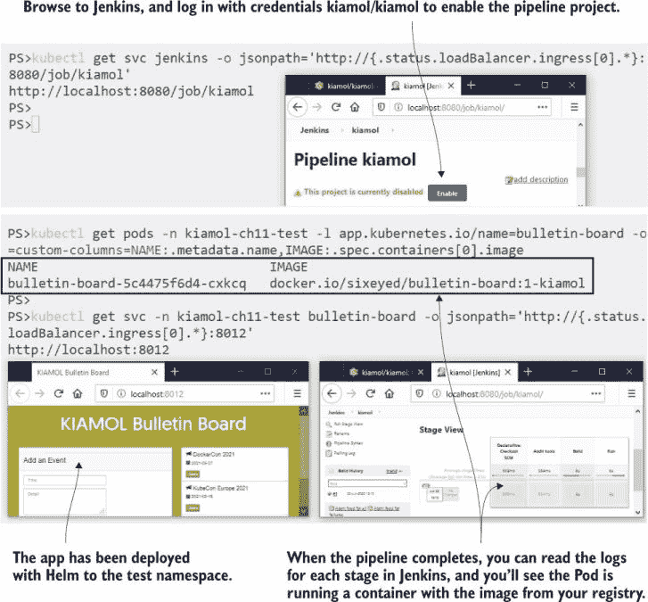

图 11.14 管道执行中的情况，构建并部署到 Kubernetes，无需 Docker 或 Dockerfile

到目前为止一切顺利。我们扮演运维角色，因此我们理解这个应用程序交付过程中的所有动态部分——我们将拥有 Jenkinsfile 中的管道和 Helm 图表中的应用程序规范。其中有很多小的繁琐细节，比如模板化的镜像名称和在 Deployment YAML 中的镜像拉取 Secret，但从开发者的角度来看，这些都已隐藏。

开发者的观点是，您可以使用本地环境对应用程序进行工作，推送更改，并在测试 URL 上看到它们正在运行，无需担心中间发生的事情。我们现在可以看到这个工作流程。您之前对应用程序进行了更改，以添加事件描述到网站，要部署该更改，您只需将更改推送到您的本地 Git 服务器并等待 Jenkins 构建完成。

现在尝试一下，将您的代码更改推送到您的 Gogs 服务器；Jenkins 将在一分钟内看到更改并启动新的构建。这将向您的注册表推送新的镜像版本，并更新 Helm 发布以使用该版本。

```
# add your code change, and push it to Git:
git add bulletin-board/src/backend/events.js
git commit -m 'Add event descriptions'
git push gogs

# browse back to Jenkins, and wait for the new build to finish

# check that the application Pod is using the new image version:
kubectl get pods -n kiamol-ch11-test -l app.kubernetes.io/name=bulletin-board
 -o=custom-columns=NAME:.metadata.name,IMAGE:.spec.containers[0].image

# browse back to the app
```

这是将`git` `push` PaaS 工作流程应用于 Kubernetes 的示例。我们在这里处理的是一个简单的应用程序，但对于具有许多组件的大型系统，方法是一样的：共享命名空间可以是多个不同团队推送的所有最新版本的部署目标。图 11.15 显示了从代码推送触发的 Kubernetes 中的应用程序更新，无需开发者使用 Docker、Kubernetes 或 Helm。

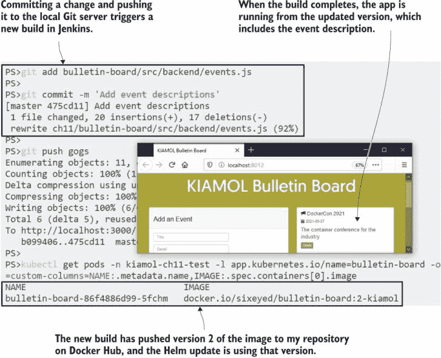

图 11.15：这是你自己的 Kubernetes 集群上的 PaaS——很多复杂性对开发者来说是隐藏的。

当然，PaaS 方法和 Docker 方法并不是相互排斥的。如果你的集群运行在 Docker 上，你可以利用基于 Docker 的应用的更简单的构建过程，但仍然支持在同一集群中为其他应用提供无 Docker 的 PaaS 方法。每种方法都有其优点和缺点，我们将在最后探讨如何在它们之间做出选择。

## 11.5 评估 Kubernetes 上的开发者工作流程

在本章中，我们探讨了光谱两端的开发者工作流程，从完全拥抱容器并希望在每个环境中将其置于核心位置的团队，到那些不想在开发过程中增加任何仪式、希望保持本地工作并让所有容器部分都由 CI/CD 管道处理的团队。中间还有很多地方，可能性很大，你将构建一个适合你组织、你的应用程序架构和你的 Kubernetes 平台的方法。

这个决定与文化的关联程度不亚于与技术。你希望每个团队都提升容器知识水平，还是希望将这种知识集中在服务团队中，让开发团队专注于交付软件？虽然我很希望看到每个桌子上都有一本《一个月午餐学会 Docker》和《一个月午餐学会 Kubernetes》，但提升容器技能确实需要相当大的承诺。以下是我在保持 Docker 和 Kubernetes 在你的项目中可见性时看到的主要优势：

+   PaaS 方法复杂且定制化——你将连接许多不同成熟度和支持结构的技术。

+   Docker 方法很灵活——你可以在 Dockerfile 中添加任何所需的依赖和设置，而 PaaS 方法则更为具体，因此它们可能不适合每个应用。

+   PaaS 技术没有你在微调 Docker 镜像时可以获得的优化；Docker 工作流程中的公告板镜像为 95 MB，而 Buildpacks 版本为 1 GB——这为安全提供了更小的表面区域。

+   对学习 Docker 和 Kubernetes 的承诺是有回报的，因为它们是可移植的技能——开发者可以轻松地使用标准工具集在不同项目之间移动。

+   团队不必使用完整的容器栈；他们可以在不同阶段选择退出——一些开发者可能只使用 Docker 来运行容器，而其他人可能使用 Docker Compose 和 Kubernetes。

+   分布式知识有助于形成更好的协作文化——集中的服务团队可能会因为只有他们能够玩所有有趣的技术而受到怨恨。

最终，这是一个由你的组织和团队做出的决定，并且从当前工作流程迁移到期望工作流程的痛苦需要被考虑。在我的咨询工作中，我经常在开发和运维角色之间保持平衡，我倾向于务实。当我积极开发时，我使用原生工具（我通常使用 Visual Studio 在.NET 项目中工作），但在推送任何更改之前，我会在本地运行 CI 流程，使用 Docker Compose 构建容器镜像，然后在本地 Kubernetes 集群中启动一切。这不会适合每个场景，但我发现这是开发速度和信心之间的良好平衡，即我的更改将在下一个环境中以相同的方式工作。

这就是开发工作流程的全部内容，因此在我们继续之前，我们可以整理一下集群。留下你的构建组件运行（Gogs、BuildKit 和 Jenkins）——你将在实验室中需要它们。

现在试试看 移除公告板部署。

```
# uninstall the Helm release from the pipeline:
helm -n kiamol-ch11-test uninstall bulletin-board

# delete the manual deployment:
kubectl delete all -l app=bulletin-board
```

## 11.6 实验室

这个实验室有点棘手，所以我提前道歉——但我希望你能看到，使用自定义工具集走 PaaS 路径是有风险的。本章的公告板应用使用了非常旧的 Node 运行时版本，版本号为 10.5.0，在实验室中，需要将其更新到更近的版本。实验室有一个新的源代码文件夹，使用 Node 10.6.0，你的任务是设置一个管道来构建这个版本，然后找出它失败的原因并修复它。以下是一些提示，因为目标不是让你学习 Jenkins，而是看看如何调试失败的管道：

+   首先，从 Jenkins 主页创建一个新项目：选择复制现有作业的选项，并复制`kiamol`作业；你可以将新作业命名为任何你喜欢的。

+   在“管道”选项卡中的新作业配置中，将管道文件的路径更改为新的源代码文件夹：`ch11/lab/bulletin-board/Jenkinsfile`。

+   构建作业，并查看日志以找出它失败的原因。

+   你需要在实验室源文件夹中做出更改，并将其推送到 Gogs 以修复构建。

我的示例解决方案在 GitHub 上，有一些 Jenkins 设置的截图来帮助你：[`github.com/sixeyed/kiamol/blob/master/ch11/lab/README.md`](https://github.com/sixeyed/kiamol/blob/master/ch11/lab/README.md)。
