# 12 激活自我修复的应用程序

Kubernetes 通过计算和网络层的抽象来对应用程序进行建模。这些抽象允许 Kubernetes 控制网络流量和容器生命周期，因此它可以在应用程序的部分失败时采取纠正措施。如果你在规范中有足够的细节，集群可以找到并修复临时问题，并保持应用程序在线。这些是自我修复的应用程序，它们可以应对任何短暂的问题，而无需人工引导。在本章中，你将学习如何在自己的应用程序中实现这一点，使用容器探测来测试健康状态，并施加资源限制，以防止应用程序消耗过多的计算资源。

Kubernetes 的自我修复能力是有限的，你将在本章中了解到这些限制。我们将主要探讨如何在不进行手动管理的情况下保持应用程序的运行，但也会再次讨论应用程序的更新。更新是最可能导致停机的原因，我们将探讨 Helm 的一些附加功能，这些功能可以在更新周期中保持应用程序的健康状态。

## 12.1 使用就绪性探测将流量路由到健康的 Pod

Kubernetes 知道你的 Pod 容器是否正在运行，但它不知道容器内的应用程序是否健康。每个应用程序都会有自己的“健康”定义——它可能是对 HTTP 请求的 200 OK 响应——Kubernetes 提供了一个通用的机制来测试健康状态，即使用*容器探测*。Docker 镜像可以配置健康检查，但 Kubernetes 会忽略它们，转而使用自己的探测。探测在 Pod 规范中定义，并按照固定的时间表执行，测试应用程序的某些方面，并返回一个指示器，表示应用程序是否仍然健康。

如果探测响应表明容器不健康，Kubernetes 将采取行动，而它采取的行动取决于探测的类型。*就绪性探测*在网络层面上采取行动，管理监听网络请求的组件的路由。如果 Pod 容器不健康，Pod 将被从就绪状态中移除，并从服务中移除的活跃 Pod 列表中删除。图 12.1 显示了对于具有多个副本的部署，一个 Pod 不健康时的样子。

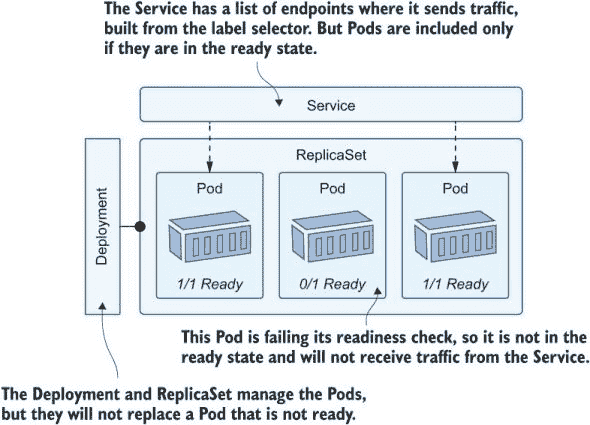

图 12.1 服务端点的列表排除了尚未准备好接收流量的 Pod。

就绪性探测是管理临时负载问题的绝佳方式。一些 Pod 可能会过载，对每个请求都返回 503 状态码。如果就绪性探测检查 200 响应，并且这些 Pod 返回 503，它们将被从服务中移除，并停止接收请求。Kubernetes 在探测失败后会继续运行探测，所以如果过载的 Pod 在休息期间有机会恢复，探测将再次成功，Pod 将被重新纳入服务。

我们在这本书中使用的随机数生成器有几个特性，我们可以使用它们来了解它是如何工作的。API 可以在达到一定数量的请求后失败的模式下运行，并且它有一个 HTTP 端点，返回它是否健康或处于失败状态。我们将首先在没有就绪探测的情况下运行它，以便我们可以理解这个问题。

现在试试看：运行具有多个副本的 API，并看看当应用程序在没有容器探测的情况下失败时会发生什么。

```
# switch to the chapter’s directory:
cd ch12

# deploy the random-number API:
kubectl apply -f numbers/

# wait for it to be ready:
kubectl wait --for=condition=ContainersReady pod -l app=numbers-api

# check that the Pod is registered as Service endpoints:
kubectl get endpoints numbers-api

# save the URL for the API in a text file:
kubectl get svc numbers-api -o jsonpath='http://{.status.loadBalancer.ingress[0].*}:8013' > api-url.txt

# call the API--after returning, this app server is now unhealthy:
curl "$(cat api-url.txt)/rng"

# test the health endpoints to check:
curl "$(cat api-url.txt)/healthz"; curl "$(cat api-url.txt)/healthz"

# confirm the Pods used by the service:
kubectl get endpoints numbers-api
```

你会从这次练习中看到，即使其中一个 Pod 不健康并且总是返回 500 错误响应，服务仍然将其保留在其端点列表中。我的输出图 12.2 显示了请求前后端点列表中的两个 IP 地址，这导致一个实例变得不健康。

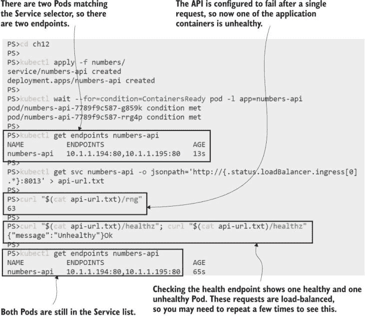

图 12.2 应用程序容器可能不健康，但 Pod 仍然处于就绪状态。

这是因为 Kubernetes 不知道其中一个 Pod 不健康。Pod 容器中的应用程序仍在运行，Kubernetes 不知道有一个健康端点它可以用来检查应用程序是否运行正确。您可以通过 Pod 容器规范中的就绪探测提供该信息。列表 12.1 显示了 API 规范的更新，其中包含健康检查。

列表 12.1 api-with-readiness.yaml，API 容器的就绪探测

```
spec:             # This is the Pod spec in the Deployment.
  containers:
    - image: kiamol/ch03-numbers-api
      readinessProbe:        # Probes are set at the container level.
        httpGet:
          path: /healthz     # This is an HTTP GET, using the health URL.
          port: 80       
        periodSeconds: 5     # The probe fires every five seconds.
```

Kubernetes 支持不同类型的容器探测。这个使用 HTTP GET 操作，非常适合 Web 应用程序和 API。探测告诉 Kubernetes 每五秒测试一次`/healthz`端点；如果响应的 HTTP 状态码在 200 到 399 之间，则探测成功；如果返回任何其他状态码，则探测失败。当随机数 API 不健康时，它会返回 500 状态码，因此我们可以看到就绪探测的实际操作。

现在试试看：部署更新后的规范，并验证失败的应用程序的 Pod 是否已从服务中移除。

```
# deploy the updated spec from listing 12.1:
kubectl apply -f numbers/update/api-with-readiness.yaml

# wait for the replacement Pods:
kubectl wait --for=condition=ContainersReady pod -l app=numbers-api,version=v2

# check the endpoints:
kubectl get endpoints numbers-api

# trigger an application container to become unhealthy:
curl "$(cat api-url.txt)/rng"

# wait for the readiness probe to take effect:
sleep 10

# check the endpoints again:
kubectl get endpoints numbers-api
```

如图 12.3 所示，就绪探测检测到一个 Pod 不健康，因为对 HTTP 请求的响应返回了 500。该 Pod 的 IP 地址已从服务端点列表中移除，因此它将不再接收任何流量。

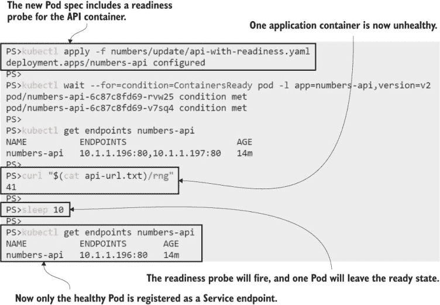

图 12.3 失败的就绪探测将 Pod 从就绪状态移除，从而从服务中移除。

这个应用程序也是一个很好的例子，说明了就绪探测本身可能很危险。随机数 API 中的逻辑意味着一旦它失败，它就会一直失败，因此不健康的 Pod 将一直被排除在服务之外，应用程序将低于预期容量运行。当探测失败时，部署不会替换离开就绪状态的 Pod，所以我们只剩下两个 Pod 在运行，但只有一个在接收流量。如果另一个 Pod 也失败，情况会变得更糟。

现在试试看：服务列表中只有一个 Pod。你将发起一个请求，那个 Pod 也会变得不健康，因此两个 Pod 都会从服务中移除。

```
# check the Service endpoints:
kubectl get endpoints numbers-api

# call the API, triggering it to go unhealthy:
curl "$(cat api-url.txt)/rng"

# wait for the readiness probe to fire:
sleep 10

# check the endpoints again:
kubectl get endpoints numbers-api

# check the Pod status:
kubectl get pods -l app=numbers-api

# we could reset the API... but there are no Pods ready to 
# receive traffic so this will fail:
curl "$(cat api-url.txt)/reset"
```

现在我们陷入了困境——两个 Pod 都失败了就绪性探测，Kubernetes 已经将它们都从服务端点列表中移除。这导致服务没有端点，因此应用程序离线，如图 12.4 所示。现在的情况是，任何尝试使用 API 的客户端都会得到连接失败，而不是 HTTP 错误状态码，这对于尝试使用特殊管理 URL 重置应用程序的管理员来说也是如此。

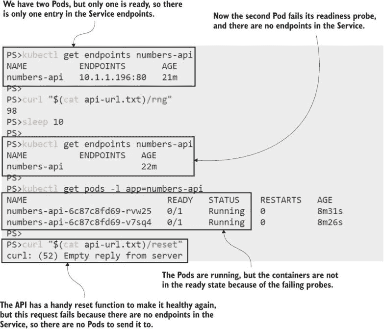

图 12.4 探测器本应帮助应用程序，但它们可以移除服务中的所有 Pod。

如果你认为，“这不是一个自我修复的应用程序”，你完全正确，但请记住，应用程序已经处于失败状态。没有就绪性探测，应用程序仍然无法工作，但有就绪性探测，它被保护免受传入请求，直到它恢复并能够处理它们。你需要了解你应用程序的故障模式，以便知道探测失败时会发生什么，以及应用程序是否可能自行恢复。

随机数 API 永远不会再次变得健康，但我们可以通过重启 Pod 来修复失败状态。如果你在容器规范中包含另一个健康检查：一个**存活性探测**，Kubernetes 会为你完成这项工作。

## 12.2 使用存活性探测重启不健康的 Pod

存活性探测使用与就绪性探测相同的健康检查机制——测试配置可能在你的 Pod 规范中是相同的——但失败探测的动作是不同的。存活性探测在计算级别采取行动，如果 Pod 变得不健康，则会重启 Pod。重启是 Kubernetes 用新的容器替换 Pod 容器；Pod 本身不会被替换；它将继续在相同的节点上运行，但使用新的容器。

列表 12.2 显示了一个随机数 API 的存活性探测。这个探测使用相同的 HTTP GET 动作来运行探测，但它有一些额外的配置。重启 Pod 比将其从服务中移除更具侵入性，额外的设置有助于确保只有在真正需要时才会发生。

列表 12.2 api-with-readiness-and-liveness.yaml，添加存活性探测

```
livenessProbe:
  httpGet:                 # HTTP GET actions can be used in liveness and
    path: /healthz         # readiness probes--they use the same spec.
    port: 80
  periodSeconds: 10        
  initialDelaySeconds: 10  # Wait 10 seconds before running the first probe.
  failureThreshold: 2      # Allow two probes to fail before taking action.
```

这是对 Pod 规范的更改，因此应用更新将创建新的替换 Pod，这些 Pod 一开始就是健康的。这次，当 Pod 在应用程序失败后变得不健康，它将因为就绪性探测而被从服务中移除。它将因为存活性探测而被重启，然后 Pod 将被重新添加到服务中。

现在试试看：更新 API，并验证存活性和就绪性检查的组合是否使应用程序保持健康。

```
# update the Pod spec from listing 12.2:
kubectl apply -f numbers/update/api-with-readiness-and-liveness.yaml

# wait for the new Pods:
kubectl wait --for=condition=ContainersReady pod -l app=numbers-api,version=v3

# check the Pod status:
kubectl get pods -l app=numbers-api -o wide

# check the Servivce endpoints:
kubectl get endpoints numbers-api  # two

# cause one application to become unhealthy:
curl "$(cat api-url.txt)/rng"

# wait for the probes to fire, and check the Pods again:
sleep 20
kubectl get pods -l app=numbers-api
```

在这个练习中，你看到存活性探测在应用失败时重启 Pod。重启是一个新的 Pod 容器，但 Pod 环境是相同的——它有相同的 IP 地址，如果容器在 Pod 中挂载了一个 `EmptyDir` 卷，它将能够访问前一个容器写入的文件。你可以在图 12.5 中看到，重启后两个 Pods 都在运行并就绪，所以 Kubernetes 修复了故障并恢复了应用。

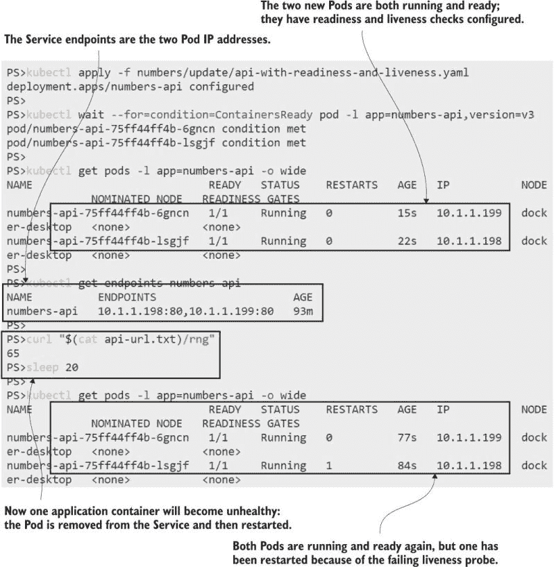

图 12.5 就绪性探测和存活性探测结合帮助保持应用在线。

如果应用在没有健康序列的情况下持续失败，重启并不是一个永久的解决方案，因为 Kubernetes 不会无限期地重启一个失败的 Pod。对于短暂的问题，如果应用能在替换容器中成功重启，那么这种方法效果很好。探测也是保持应用在升级期间健康的有用工具，因为滚动更新只有在新的 Pods 进入就绪状态时才会进行，所以如果就绪探测失败，这将暂停滚动更新。

我们将通过待办事项列表应用来展示这一点，其中包括对 Web 应用 Pod 和数据库的存活性和就绪性检查。Web 探测使用我们之前已经看到的相同的 HTTP GET 动作，但数据库没有我们可以使用的 HTTP 端点。相反，规范使用了 Kubernetes 支持的其他类型的探测动作——TCP 套接字动作，它检查端口是否打开并正在监听传入流量，以及 exec 动作，它在容器内运行命令。列表 12.3 展示了探测设置。

列表 12.3 todo-db.yaml，使用 TCP 和命令探测

```
spec:             
  containers:
    - image: postgres:11.6-alpine
      # full spec includes environment config
      readinessProbe:
        tcpSocket:           # The readiness probe tests the
          port: 5432         # database is listening on the port.
        periodSeconds: 5
      livenessProbe:         # The liveness probe runs a Postgres tool,
        exec:                # which confirms the database is running.
          command: ["pg_isready", "-h", "localhost"]
        periodSeconds: 10
        initialDelaySeconds: 10
```

当你部署这段代码时，你会看到应用以同样的方式工作，但现在它已经能够抵御 Web 和数据库组件的短暂故障。

现在尝试一下 运行带有新自我修复规范的待办事项列表应用。

```
# deploy the web and database:
kubectl apply -f todo-list/db/ -f todo-list/web/

# wait for the app to be ready:
kubectl wait --for=condition=ContainersReady pod -l app=todo-web

# get the URL for the service:
kubectl get svc todo-web -o jsonpath='http://{.status.loadBalancer.ingress[0].*}:8081'

# browse to the app, and add a new item
```

这里没有新的内容，正如你在图 12.6 的输出中看到的那样。但是，数据库探测意味着 Postgres 不会收到任何流量，直到数据库就绪。如果 Postgres 服务器失败，那么数据库 Pod 将会被重启，替换容器将使用 Pod 中的 `EmptyDir` 卷中的相同数据文件。

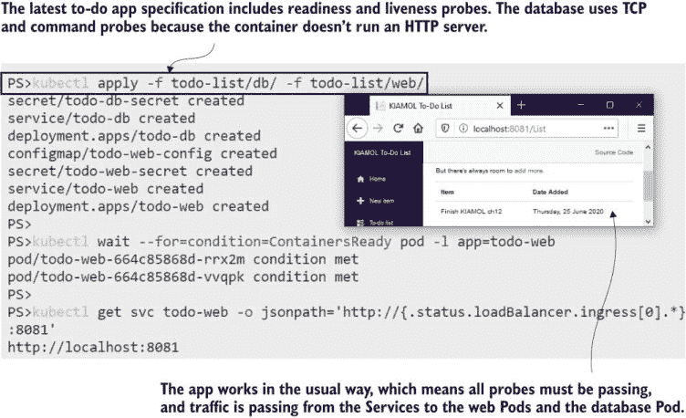

图 12.6 探测正在触发并返回健康响应，因此应用以通常的方式工作。

如果更新出错，容器探针也可以使应用程序继续运行。待办事项应用程序有一个新的数据库规范，它升级了 Postgres 的版本，但它也覆盖了容器命令，使其休眠而不是启动 Postgres。这是一个经典的调试遗留错误：有人想以正确的配置启动 Pod，但不运行应用程序，以便他们可以在容器内运行 shell 来检查环境，但他们没有撤销他们的更改。如果 Pod 没有任何探针，更新将成功并使应用程序崩溃。`sleep`命令使 Pod 容器继续运行，但没有为网站使用的数据库服务器。探针阻止这种情况发生，并保持应用程序可用。

现在试试看：部署这个错误的更新，并验证新 Pod 中的失败探针阻止了原始 Pod 被移除。

```
# apply the update:
kubectl apply -f todo-list/db/update/todo-db-bad-command.yaml

# watch the Pod status changing:
kubectl get pods -l app=todo-db --watch

# refresh the app to check that it still works
# ctrl-c or cmd-c to exit the Kubectl watch
```

您可以在图 12.7 中看到我的输出。替换数据库 Pod 已创建，但它从未进入就绪状态，因为就绪探针检查端口 5342 是否有监听进程，但没有。Pod 也会不断重启，因为存活探针运行一个命令来检查 Postgres 是否准备好接收客户端连接。当新的 Pod 持续失败时，旧的 Pod 会继续运行，应用程序也会继续工作。

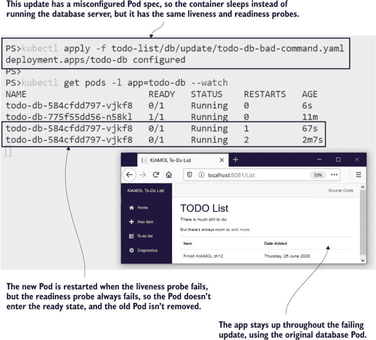

图 12.7 滚动更新等待新的 Pod 就绪，因此探针可以防止更新失败。

如果你让这个应用程序再运行大约五分钟，然后再次检查 Pod 状态，你会看到新的 Pod 进入 CrashLoopBackOff 状态。这就是 Kubernetes 如何保护集群免受在持续失败的应用程序上浪费计算资源的影响：它在 Pod 重启之间添加了一个时间延迟，并且每次重启延迟都会增加。如果你看到一个 Pod 处于 CrashLoopBackOff 状态，通常意味着应用程序已经无法修复。

待办事项应用程序现在的情况与我们在第九章首次看到滚动更新失败的情况相同。部署正在管理两个 ReplicaSet，其目标是当新的 ReplicaSet 达到容量时，立即将旧的 ReplicaSet 缩放到零。但新的 ReplicaSet 永远不会达到容量，因为新 Pod 中的探针不断失败。部署会保持这种状态，希望它最终能够完成滚动更新。Kubernetes 没有自动回滚选项，但 Helm 有，你可以扩展你的 Helm 图表以支持健康的升级。

## 12.3 使用 Helm 安全部署升级

一点点的 Helm 就能走得很远。你在第十章学习了基础知识，你不需要深入研究模板函数和依赖管理，就可以很好地利用 Helm 进行安全的应用程序升级。Helm 支持原子安装和升级，如果失败会自动回滚，它还有一个你可以挂钩的部署生命周期，可以在安装前后运行验证作业。

本章的源文件夹包含多个用于待办事项应用的 Helm 图表，代表不同的版本（通常每个发布都会有一个随时间演变的单个 Helm 图表）。版本 1 的图表使用我们在第 12.2 节中使用的相同的存活性和就绪性检查来部署应用程序；唯一的区别是数据库使用 PersistentVolumeClaim，因此数据在升级之间得到保留。我们将首先清理之前的练习并安装 Helm 版本。

现在试试这个 使用相同的 Pod 规范运行待办应用程序，但使用 Helm 图表部署。

```
# remove all existing apps from the chapter:
kubectl delete all -l kiamol=ch12

# install the Helm release:
helm install --atomic todo-list todo-list/helm/v1/todo-list/

# browse to the app, and add a new item
```

应用程序的版本 1 现在通过 Helm 运行，这里没有新内容，除了图表中包含一个位于 templates 文件夹中的 NOTES.txt 文件，该文件显示安装后看到的帮助文本。我的输出如图 12.8 所示。我没有包含应用程序的截图，所以你只能相信我浏览并添加了一条“完成第十二章”的条目。

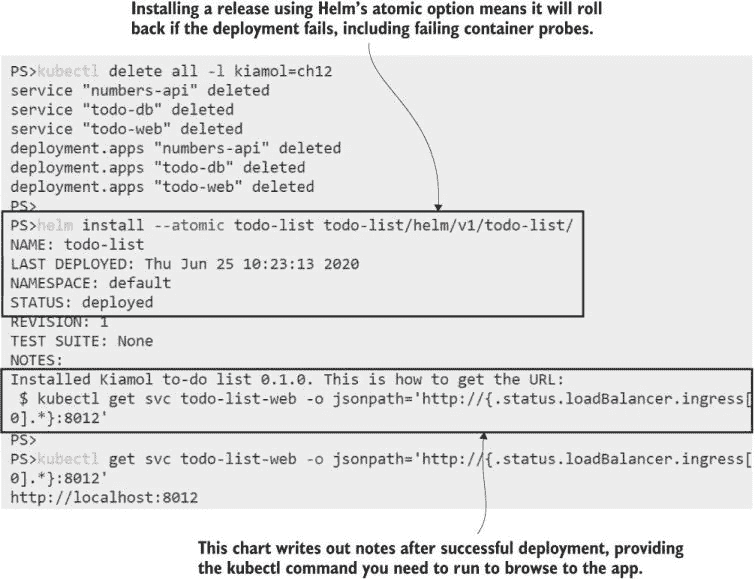

图 12.8 使用 Helm 安装应用时等待容器探测处于健康状态。

Helm 图表的版本 2 尝试与我们在第 12.2 节中看到的相同的数据库镜像升级，包括 Postgres 容器命令中的配置错误。当你使用 Helm 部署它时，在底层发生相同的事情：Kubernetes 更新 Deployment，添加一个新的 ReplicaSet，但该 ReplicaSet 永远不会达到容量，因为 Pod 的就绪性探测失败。但是 Helm 检查滚出的状态，如果在特定时间段内没有成功，它会自动回滚。

现在试试这个 使用 Helm 升级待办应用程序发布。升级失败，因为 Pod 规范配置错误，Helm 进行了回滚。

```
# list the current Pod status and container image:
kubectl get pods -l app=todo-list-db
 -o=custom-columns=NAME:.metadata.name,STATUS:.status.phase,IMAGE:.spec.containers[0].image

# upgrade the release with Helm--this will fail:
helm upgrade --atomic --timeout 30s todo-list todo-list/helm/v2/todo-list/

# list the Pods again:
kubectl get pods -l app=todo-list-db
 -o=custom-columns=NAME:.metadata.name,STATUS:.status.phase,IMAGE:.spec.containers[0].image

# browse back to the app, and refresh the list
```

如果你在这项练习中多次检查 Pod 列表，你会看到回滚发生，如图 12.9 所示。最初，有一个运行 Postgres 11.6 的 Pod 在运行，然后一个新的运行 11.8 的 Pod 加入，但那是失败的容器探测 Pod。Pod 在 Helm 超时期间没有就绪，因此升级被回滚，新的 Pod 被移除；它不会像 kubectl update 那样不断重启并触发 CrashLoopBackOff。

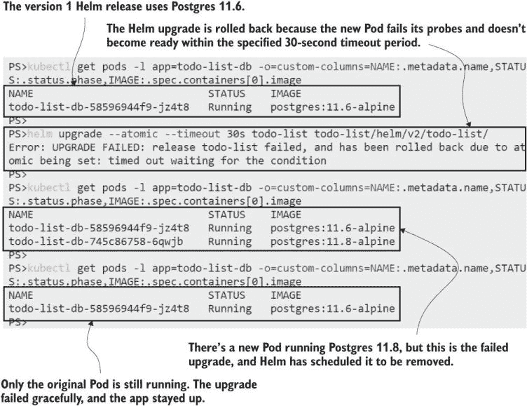

图 12.9 升级失败，因为新的 Pod 没有变为就绪状态，Helm 进行了回滚。

在版本 2 的升级失败期间，待办事项应用程序一直在线，没有中断或容量减少。下一个版本通过移除 Pod 规范中的错误容器命令来修复升级，并且它还添加了一个用于 Kubernetes Job 的额外模板，你可以使用 Helm 作为部署测试运行它。测试是按需运行的，而不是作为安装的一部分，因此它们非常适合烟雾测试——这是你运行以确认成功发布是否正常工作的自动化测试套件。列表 12.4 显示了待办数据库的测试。

列表 12.4 todo-db-test-job.yaml，一个作为 Helm 测试运行的 Kubernetes Job

```
apiVersion: batch/v1
kind: Job                   # This is a standard Job spec.
metadata:
  # metadata includes name and labels
  annotations:
    "helm.sh/hook": test    # Tells Helm the Job can be run in the test
spec:                       # suite for the release 
  completions: 1
  backoffLimit: 0           # The Job should run once and not retry.
  template:
    spec:                   # The container spec runs a SQL query.
      containers:
        - image: postgres:11.8-alpine 
          command: ["psql", "-c", "SELECT COUNT(*) FROM \"public\".\"ToDos\""]
```

我们在第八章遇到了乔布斯，赫尔姆对其进行了很好的利用。工作规范包括对它们应该成功运行多少次的期望，赫尔姆正是利用这一点来评估测试是否成功。版本 3 的升级应该成功，当它完成时，你可以运行测试工作，该工作运行一个 SQL 语句以确认待办数据库是可访问的。

现在试试看 升级到版本 3 的图表，它修复了 Postgres 更新。然后使用赫尔姆运行测试，并检查作业 Pod 的日志。

```
# run the upgrade:
helm upgrade --atomic --timeout 30s todo-list todo-list/helm/v3/todo-list/

# list the database Pods and images:
kubectl get pods -l app=todo-list-db -o=custom-columns=NAME:.metadata.name,STATUS:.status.phase,IMAGE:.spec.containers[0].image,IP:.status.podIPs[].ip

# check the database Service endpoints:
kubectl get endpoints todo-list-db

# now run the test Job with Helm:
helm test todo-list

# check the output:
kubectl logs -l job-name=todo-list-db-test
```

我在图 12.10 中剪裁了我的输出，但细节都在那里——升级是成功的，但`upgrade`命令中没有测试。现在数据库正在使用升级后的 Postgres 版本，当测试运行时，作业连接到数据库并确认数据仍然存在。

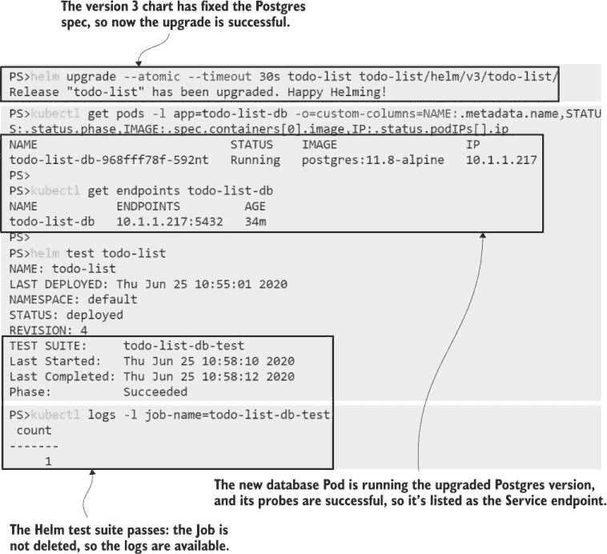

图 12.10 使用赫尔姆按需运行测试套件，让你可以在任何时间进行应用烟雾测试。

赫尔姆为你管理工作。它不会清理已完成的工作，所以如果你需要，你可以检查 Pod 状态和日志，但当你重复测试命令时，它会替换它们，这样你就可以按需重新运行测试套件。工作还有另一个用途，通过在升级前运行它们，以确保升级的安全性，你可以检查当前发布版本是否处于有效状态，可以升级。

如果你的应用支持多个版本，但只有增量升级，这个功能特别有用，因为版本 1.1 需要升级到版本 1.2，然后才能升级到版本 2。这个逻辑可能涉及查询不同服务的 API 版本或数据库的模式版本，赫尔姆可以在一个具有访问所有其他与应用程序 Pod 共享相同 ConfigMaps 和 Secrets 的 Kubernetes 对象的作业中运行所有这些。列表 12.5 显示了待办赫尔姆图表的版本 4 中的预升级测试。

列表 12.5 todo-db-check-job.yaml，一个在赫尔姆升级前运行的工作

```
apiVersion: batch/v1
kind: Job                         # The standard Job spec again
metadata:
  # metadata has name and labels
  annotations:
    "helm.sh/hook": pre-upgrade   # This runs before an upgrade and
    "helm.sh/hook-weight": "10"   # tells Helm the order in which to create
spec:                             # the object after the ConfigMap
  template:                       # that the Job requires
    spec:
      restartPolicy: Never
      containers:
        - image: postgres:11.8-alpine
          # env includes secrets
          command: ["/scripts/check-postgres-version.sh"]
          volumeMounts:
            - name: scripts           # Mounts the ConfigMap volume
              mountPath: "/scripts"
```

预升级检查有两个模板：一个是作业规范，另一个是包含作业中要运行的脚本的 ConfigMap。你使用注解来控制作业需要在赫尔姆生命周期中的哪个位置运行，而这个作业只会为升级运行，不会作为新安装的一部分运行。权重注解确保在作业之前创建 ConfigMap。生命周期和权重让你可以在赫尔姆中模拟复杂的验证步骤，但这个很简单——它升级数据库镜像，但只有当发布版本当前运行的是 11.6 时。

现在试试看 从版本 3 到版本 4 的升级是无效的，因为版本 3 已经升级了 Postgres 版本。运行升级以验证它不会被部署。

```
# run the upgrade to version 4--this will fail:
helm upgrade --atomic --timeout 30s todo-list todo-list/helm/v4/todo-list/

# list the Jobs:
kubectl get jobs --show-labels

# print the output of the pre-upgrade Job:
kubectl logs -l job-name=todo-list-db-check

# confirm that the database Pod is unchanged:
kubectl get pods -l app=todo-list-db
 -o=custom-columns=NAME:.metadata.name,STATUS:.status.phase,IMAGE:.spec.containers[0].image
```

在这个练习中，您将看到 Helm 有效地阻止了升级，因为预升级钩子运行并且作业失败。所有这些都会记录在发布的记录中，这将显示最新的升级失败，并且发布被回滚到最后一个良好版本。我的输出显示在图 12.11 中，在整个更新过程中，应用程序仍然可用。

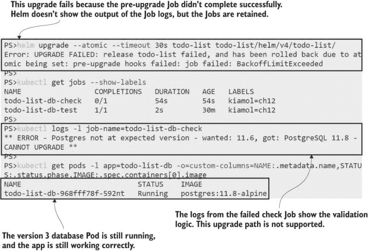

图 12.11 Helm 图表中预升级作业让您可以验证发布是否适合升级。

了解 Helm 在保持应用程序健康方面的作用是很好的，因为预升级验证和自动回滚有助于保持应用程序升级的自愈能力。Helm 不是这一点的先决条件，但如果您不使用 Helm，您应该考虑在您的部署管道中使用 kubectl 实现这些功能。

在本章中，我们还将涵盖应用程序健康的一个其他方面——管理您的 Pod 容器可用的计算资源。

## 12.4 使用资源限制保护应用程序和节点

容器是您的应用程序进程的虚拟化环境。Kubernetes 构建这个环境，您知道 Kubernetes 创建容器文件系统并设置网络。容器环境还包括内存和 CPU，这些也可以由 Kubernetes 管理，但默认情况下，它们不是。这意味着 Pod 容器可以访问它们所在节点上的所有内存和 CPU，这有两个原因：应用程序可能会耗尽内存并崩溃，或者它们可能会耗尽节点的资源，导致其他应用程序无法运行。

您可以在 Pod 规范中限制容器可用的资源，并且这些限制就像容器探测一样——您真的不应该在没有它们的情况下进入生产环境。具有内存泄漏的应用程序可以非常快地破坏您的集群，而引起 CPU 峰值是一个很好的、简单的攻击向量。在本节中，您将学习如何指定您的 Pods 以防止这种情况发生，我们将从一个对内存有大量需求的新应用程序开始。

现在尝试一下 清除上一个练习，并运行新应用程序——它除了分配内存和记录分配了多少内存之外，什么都不做。这个 Pod 运行时没有任何容器限制。

```
# remove the Helm release to free up resources:
helm uninstall todo-list

# print how much memory your nodes have:
kubectl get nodes -o jsonpath='{.items[].status.allocatable.memory}'

# deploy the memory-allocating app:
kubectl apply -f memory-allocator/

# wait a few minutes, and then see how much memory it has allocated:
kubectl logs -l app=memory-allocator --tail 1
```

内存分配器应用程序每五秒钟会占用大约 10 MB 的内存，并且它会一直进行下去，直到耗尽您实验室集群中的所有内存。您可以从图 12.12 中的我的输出中看到，我的 Docker Desktop 节点可以访问大约 25 GB 的内存，当我截图时，分配器应用程序已经占用了大约 1.5 GB。

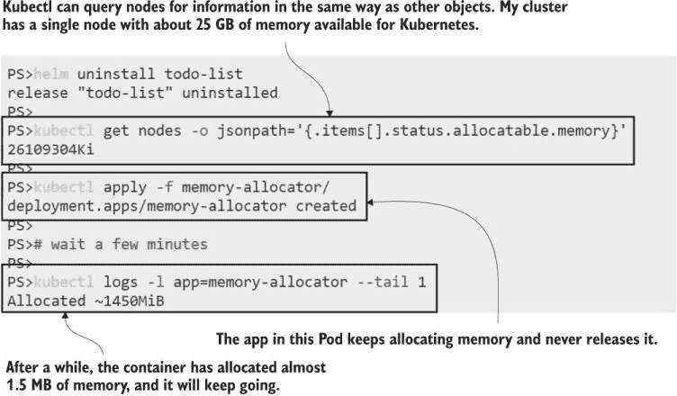

图 12.12 不要在生产环境中运行此应用程序——它只是不断分配内存，直到用完为止。

只要应用程序在运行，它就会继续分配内存，所以我们需要尽快行动，以免我的机器崩溃，我丢失了本章的编辑。列表 12.6 显示了一个更新的 Pod 规范，其中包括资源限制，将应用程序限制在 50 MB 的内存。

列表 12.6 memory-allocator-with-limit.yaml，向容器添加内存限制

```
spec:                       # The Pod spec in the Deployment
  containers:
    - image: kiamol/ch12-memory-allocator
      resources:
        limits:             # Resource limits constrain the compute power
          memory: 50Mi      # for the container; this limits RAM to 50 MB.
```

资源是在容器级别指定的，但这是一个新的 Pod 规范，因此当你部署更新时，你会得到一个新的 Pod。替换将从零内存分配开始，并且它将每五秒再次分配 10 MB。现在，然而，它将在 50 MB 处达到限制，Kubernetes 将采取行动。

现在尝试一下：使用第 12.6 节中定义的资源限制部署内存分配器应用的更新。你应该会看到 Pod 已重启，但这仅在你运行的 Linux 主机未启用交换内存的情况下。K3s 没有这种设置（除非你使用 Vagrant 虚拟机设置），所以你不会看到 Docker Desktop 或云 Kubernetes 服务相同的输出结果。

```
# appy the update:
kubectl apply -f memory-allocator/update/memory-allocator-with-limit.yaml

# wait for the app to allocate a chunk of memory:
sleep 20

# print the application logs:
kubectl logs -l app=memory-allocator --tail 1

# watch the status of the Pod:
kubectl get pods -l app=memory-allocator --watch 
```

在这个练习中，你会看到 Kubernetes 强制执行内存限制：当应用尝试分配超过 50 MB 的内存时，容器将被替换，你可以看到 Pod 进入 OOMKilled 状态。超过限制会导致 Pod 重启，因此这具有与失败的存活探针相同的缺点——如果替换容器持续失败，Pod 重启将越来越长，因为 Kubernetes 应用了 CrashLoopBackOff，如图 12.13 所示。

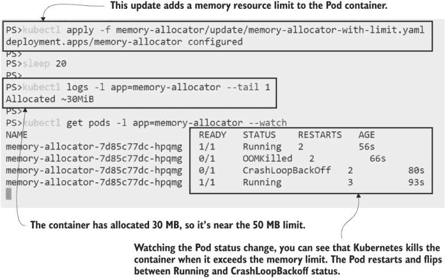

图 12.13 内存限制是硬限制——如果容器超过它们，它将被杀死，Pod 将重启。

应用资源约束的难点在于确定应该设置什么限制。你需要进行一些性能测试，看看你的应用能够处理多少资源——请注意，如果应用平台看到大量可用内存，它们可能会占用比实际需要的更多资源。你应该对你的初始发布慷慨一些，然后根据从监控中获得的更多反馈来降低限制。

你还可以通过指定命名空间的最大配额来应用资源限制。这种方法对于使用命名空间来划分集群以供不同团队或环境使用的共享集群特别有用；你可以对命名空间可以使用的总资源量实施限制。列表 12.7 显示了 ResourceQuota 对象的规范，它将命名空间 `kiamol-ch12-memory` 中可用的总内存限制为 150 MB。

列表 12.7 02-memory-quota.yaml，为命名空间设置内存配额

```
apiVersion: v1
kind: ResourceQuota                  # The ResourceQuota is applied
metadata:                            # at the specified namespace.
  name: memory-quota
  namespace: kiamol-ch12-memory
spec:
  hard:                              # Quotas can include CPU and memory.
    limits.memory: 150Mi             
```

容器限制是反应性的，因此当内存限制被超过时，Pod 将会重启。由于资源配额是主动性的，如果它们指定的限制超过了配额中可用的资源，则不会创建 Pod。如果已存在配额，则每个 Pod 规范都需要包含一个资源部分，以便 Kubernetes 可以比较规范所需与当前命名空间中可用的资源。以下是一个更新的内存分配器规范示例，其中 Pod 指定了一个大于配额的限制。

现在尝试一下：在具有资源配额的命名空间中部署内存分配器的新版本。

```
# delete the existing app:
kubectl delete deploy memory-allocator

# deploy namespace, quota, and new Deployment:
kubectl apply -f memory-allocator/namespace-with-quota/

# print the staus of the ReplicaSet:
kubectl get replicaset -n kiamol-ch12-memory 

# show the events in the ReplicaSet:
kubectl describe replicaset -n kiamol-ch12-memory 
```

你会从 ReplicaSet 的输出中看到，它有 0 个 Pod，而期望的总数是 1。它不能创建 Pod，因为它会超出命名空间配额，如图 12.14 所示。控制器会不断尝试创建 Pod，但除非有足够的配额可用，例如其他 Pod 终止，但在这个案例中没有，所以它需要更新配额。

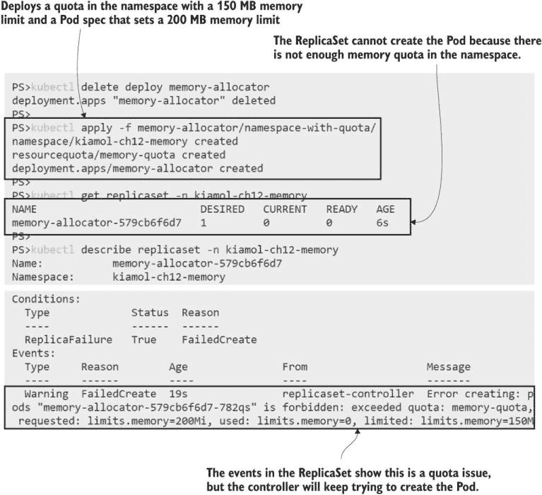

图 12.14 硬限制配额会阻止 Pod 创建，如果它们会超过配额。

Kubernetes 也可以将 CPU 限制应用于容器和配额，但它们的工作方式略有不同。具有 CPU 限制的容器以固定的处理能力运行，并且它们可以使用尽可能多的 CPU——如果达到限制，它们不会被替换。你可以将容器限制为 CPU 核心的一半，并且它可以以 100%的 CPU 运行，而节点上的所有其他核心都保持空闲，可供其他容器使用。计算π是一个计算密集型操作，我们可以看到在书中之前使用的π应用程序上应用 CPU 限制的效果。

现在试试看 运行带有和不带有 CPU 限制的π应用程序，并比较其性能。

```
# show the total CPU available to the nodes:
kubectl get nodes -o jsonpath='{.items[].status.allocatable.cpu}'

# deploy Pi without any CPU limits:
kubectl apply -f pi/

# get the URL for the app:
kubectl get svc pi-web -o jsonpath='http://{.status.loadBalancer.ingress[0].*}:8012/?dp=50000'

# browse to the URL, and see how long the calculation takes

# now update the Pod spec with a CPU limit:
kubectl apply -f pi/update/web-with-cpu-limit.yaml

# refresh the Pi app, and see how long the calculation takes
```

我的输出显示在图 12.15 中。你的时间将根据你的节点上可用的 CPU 量而有所不同。我的有八个核心，在没有限制的情况下，应用程序可以在 3.4 秒内持续计算π到 50000 位小数。更新后，应用程序容器限制为四分之一核心，同样的计算需要 14.4 秒。

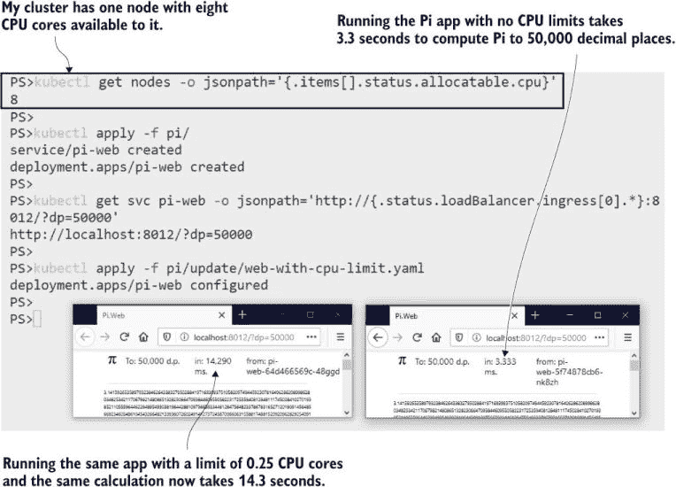

图 12.15 略微眯起眼睛，你会看到限制 CPU 对计算速度有影响。

Kubernetes 使用固定单位定义 CPU 限制，其中一代表单个核心。你可以使用倍数来给你的应用程序容器提供对多个核心的访问，或者将单个核心分成“毫核心”，其中一毫核心是核心的一千分之一。列表 12.8 显示了之前练习中应用于π容器的 CPU 限制，其中 250 毫核心是四分之一核心。

列表 12.8 web-with-cpu-limit.yaml

```
spec:
  containers:
    - image: kiamol/ch05-pi
      command: ["dotnet", "Pi.Web.dll", "-m", "web"]
      resources:
        limits:
             cpu: 250m    # 250 millicores limits the container to 0.25 cores.
```

我一次关注一个资源，这样你可以清楚地看到影响，但通常你应该包括 CPU 和内存限制，这样你的应用程序就不会激增并使集群饿死。资源规范还可以包括一个请求部分，它声明容器预期将使用多少 CPU 和内存。这有助于 Kubernetes 决定哪个节点应该运行 Pod，我们将在第十八章的调度部分进一步介绍它。

我们将以一个额外的练习结束本章，以展示如何将 CPU 限制应用于命名空间的配额，以及当配额超出时意味着什么。π应用程序的新规范尝试在具有最大 500 毫核心配额的命名空间中运行具有 300 毫核心 CPU 限制的两个副本。

现在试试看 在其自己的命名空间中运行更新的π应用程序，该命名空间已应用 CPU 配额。

```
# remove the existing app:
kubectl delete deploy pi-web

# deploy the namespace, quota, and new app spec:
kubectl apply -f pi/namespace-with-quota/

# print the ReplicaSet status:
kubectl get replicaset -n kiamol-ch12-cpu

# list the endpoints for the Service:
kubectl get endpoints pi-web -n kiamol-ch12-cpu

# show the events for the ReplicaSet:
kubectl describe replicaset -n kiamol-ch12-cpu
```

在这个练习中，你可以看到配额适用于命名空间中的所有 Pod。ReplicaSet 正在运行一个 Pod 而不是两个，因为第一个 Pod 分配了 300 m CPU，这仅剩下 200 m 的配额——不足以让第二个 Pod 运行。图 12.16 显示了 ReplicaSet 事件中的失败原因。Pi 应用程序仍在运行，但容量不足，因为没有足够的 CPU 可用。

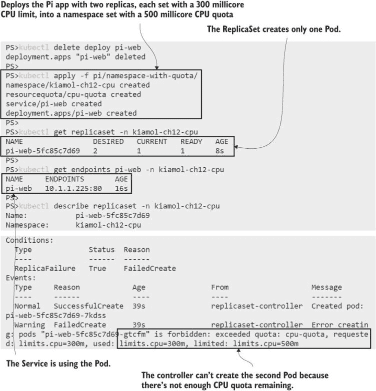

图 12.16 配额中强制执行硬 CPU 限制以阻止对象超过总限制。

配额主要是为了保护你的集群，而不是应用程序本身，但它们是确保所有 Pod 规范都有限制指定的好方法。如果你没有使用命名空间来划分你的集群，你仍然可以将具有大 CPU 和内存限制的配额应用到默认命名空间，以确保 Pod 规范包含自己的限制。

资源限制、容器探测和原子升级都有助于在正常故障条件下保持应用程序的运行。这些应该在你的生产路线图中，但你也需要意识到 Kubernetes 无法修复所有类型的故障。

## 12.5 理解自愈应用程序的限制

Kubernetes 将 Pod 分配给一个节点，它将在该节点上运行。除非节点离线，否则 Pod 不会被替换，因此我们在这章中看到的所有修复机制都是通过重启 Pod——替换应用程序容器来工作的。你需要确保你的应用程序可以容忍这一点，尤其是在第七章中我们讨论的多容器场景中，因为当 Pod 重启时，初始化容器会再次执行，而边车会被替换。

对于大多数具有暂时性故障的场景，Pod 的重启是可行的，但重复的故障最终会导致 CrashLoopBackOff 状态，这可能导致应用程序离线。Kubernetes 不提供任何配置选项来指定允许的重启次数或退避时间，并且它不支持在另一个节点上用新的 Pod 替换失败的 Pod。这些功能已被请求，但直到它们实现，你精心配置的自愈应用程序仍然有可能所有 Pod 都处于退避状态，且服务中没有端点。

那个边缘情况通常是由于配置不当的规范或应用程序的致命问题导致的，这些问题需要比 Kubernetes 自己能够处理的干预更多。对于典型的故障状态，容器探测和资源限制的组合可以大大帮助应用程序独立平稳运行。

那就是关于自愈应用程序的所有内容，因此我们可以整理集群，为实验室做准备。

现在尝试一下 移除本章中的对象。

```
# delete namespaces:
kubectl delete ns -l kiamol=ch12
kubectl delete all -l kiamol=ch12

# delete all the leftover objects:
kubectl delete secret,configmap,pvc -l kiamol=ch12
```

## 12.6 实验室

在这个实验室中，我有一个很好的小容量规划练习。目标是把您的集群分成三个环境来运行 Pi 应用：开发（dev）、测试（test）和用户验收测试（UAT）。UAT 应限制在节点总 CPU 的 50%，而开发和测试各占 25%。您的 Pi 部署应设置限制，以便在每个环境中至少运行四个副本，然后您需要验证在 UAT 中可以扩展到多大。

+   首先在实验室文件夹中部署命名空间和服务。

+   然后计算您节点的 CPU 容量，并将资源配额部署到每个命名空间以限制 CPU（您需要编写配额规范）。

+   将 web.yaml 中的部署规范更新，以包括一个 CPU 限制，允许每个命名空间运行四个副本。

+   当一切运行正常时，将 UAT 部署扩展到八个副本，并尝试找出为什么它们不能全部运行。

这是一个很好的练习，可以帮助您了解 CPU 资源是如何共享的，并练习与多个命名空间一起工作。我的解决方案在 GitHub 上供您检查：[`github.com/sixeyed/kiamol/blob/master/ch12/lab/README.md`](https://github.com/sixeyed/kiamol/blob/master/ch12/lab/README.md)。
