# 13 使用 Fluentd 和 Elasticsearch 集中化日志

应用程序会产生大量的日志，这些日志往往并不很有用。当你将应用程序扩展到集群中多个运行的 Pod 时，使用标准的 Kubernetes 工具管理这些日志会变得困难。组织通常会部署自己的日志框架，该框架使用收集和转发模型来读取容器日志并将它们发送到中央存储，以便进行索引、过滤和搜索。在本章中，你将学习如何使用这个领域中最流行的技术：Fluentd 和 Elasticsearch。Fluentd 是收集组件，它与 Kubernetes 有一些很好的集成；Elasticsearch 是存储组件，它可以在集群中的 Pod 中运行，也可以作为外部服务运行。

在我们开始之前，你应该注意几个要点。第一个是，这个模型假设你的应用程序日志被写入容器的标准输出流，这样 Kubernetes 就可以找到它们。我们在第七章中讨论了这一点，包括直接写入标准输出或使用日志边车来中继日志的示例应用程序。第二个是，Kubernetes 中的日志模型与 Docker 非常不同。电子书附录 D 展示了如何使用 Fluentd 与 Docker 一起使用，但与 Kubernetes 一起，我们将采取不同的方法。

## 13.1 Kubernetes 如何存储日志条目

Kubernetes 对日志管理采用了一种非常简单的处理方法：它从容器运行时收集日志条目，并将它们作为文件存储在运行容器的节点上。如果你想要进行更高级的操作，那么你需要部署自己的日志管理系统，幸运的是，你有一个世界级的容器平台可以运行它。日志系统的各个组件从节点收集日志，将它们转发到集中存储，并提供一个用户界面用于搜索和过滤。图 13.1 展示了本章我们将使用的技术。

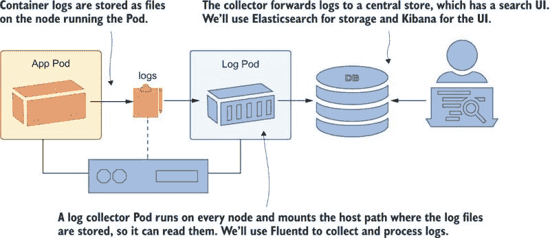

图 13.1 Kubernetes 中的日志使用 Fluentd 这样的收集器从节点读取日志文件。

节点以容器提供的原始形式存储日志条目，使用包含命名空间、Pod 和容器名称的文件名。标准的命名系统使得日志收集器很容易添加元数据到日志条目中，以识别来源，并且因为收集器本身作为一个 Pod 运行，它可以查询 Kubernetes API 服务器以获取更多详细信息。Fluentd 添加 Pod 标签和镜像标签作为额外的元数据，你可以使用这些元数据来过滤或搜索日志。

部署日志收集器很简单。我们将首先探索节点上的原始日志文件，看看我们正在处理什么。所有这些的前提是从容器中提取应用程序日志，无论应用程序是否直接写入这些日志，或者你是否使用边车容器。首先，以几种不同的配置部署第七章中的 timecheck 应用程序，以生成一些日志。

现在试试看 使用不同的命名空间运行 timecheck 应用程序，然后检查日志以查看你如何使用 kubectl 本地处理它们。

```
# switch to the chapter’s folder:
cd ch13

# deploy the timecheck app in development and test namespaces:
kubectl apply -f timecheck/

# wait for the development namespace to spin up:
kubectl wait --for=condition=ContainersReady pod -l app=timecheck -n kiamol-ch13-dev

# check the logs:
kubectl logs -l app=timecheck --all-containers -n kiamol-ch13-dev --tail 1

# wait for the test namespace to spin up:
kubectl wait --for=condition=ContainersReady pod -l app=timecheck -n kiamol-ch13-test

# check those logs:
kubectl logs -l app=timecheck --all-containers -n kiamol-ch13-test --tail 1
```

从这个练习中，你会看到在现实集群环境中，直接处理容器日志是困难的，正如我在图 13.2 中的输出所示。你必须一次使用一个命名空间，你不能识别记录消息的 Pod，你只能通过日志条目数量或时间段进行过滤。

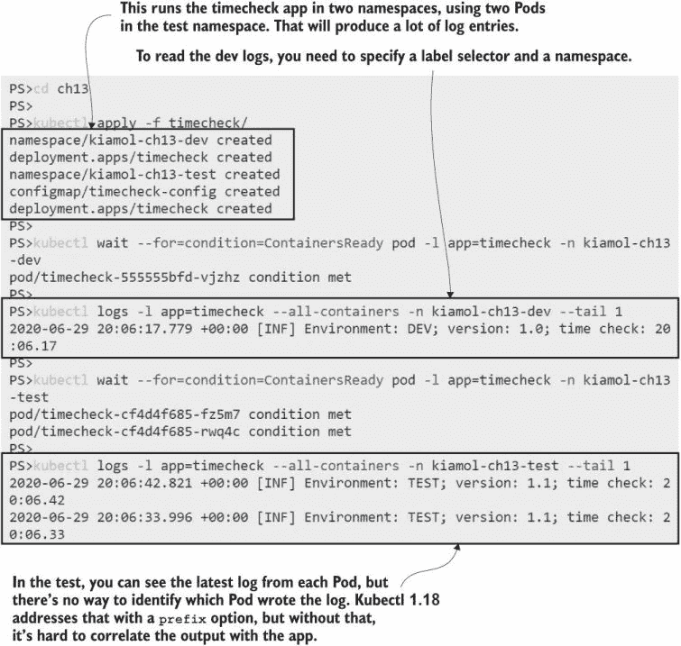

图 13.2 Kubectl 对于快速检查日志来说很棒，但在许多命名空间中有许多 Pods 时会更困难。

Kubectl 是读取日志最简单的选项，但最终日志条目来自每个节点上的文件，这意味着你有其他选项来处理日志。本章的源代码包括一个简单的 sleep 部署，它将节点上的日志路径挂载为 `HostPath` 卷，你可以使用它来探索日志文件，即使你没有直接访问节点。

现在试试看 运行一个挂载主机日志目录的 Pod，并使用挂载来探索文件。

```
# run the Deployment:
kubectl apply -f sleep.yaml

# connect to a session in the Pod container:
kubectl exec -it deploy/sleep -- sh

# browse to the host log mount:
cd /var/log/containers/

# list the timecheck log files:
ls timecheck*kiamol-ch13*_logger* 

# view the contents of the dev log file:
cat $(ls timecheck*kiamol-ch13-dev_logger*) | tail -n 1

# exit from the session:
exit
```

每个 Pod 容器都有一个日志输出的文件。timecheck 应用程序使用一个名为 `logger` 的边车容器来中继应用程序容器的日志，你可以在图 13.3 中看到 Kubernetes 用于日志文件的标准命名约定：`pod-name _namespace_container-name-container-id.log.` 文件名包含足够的数据来识别日志的来源，文件内容是容器运行时的原始 JSON 日志输出。

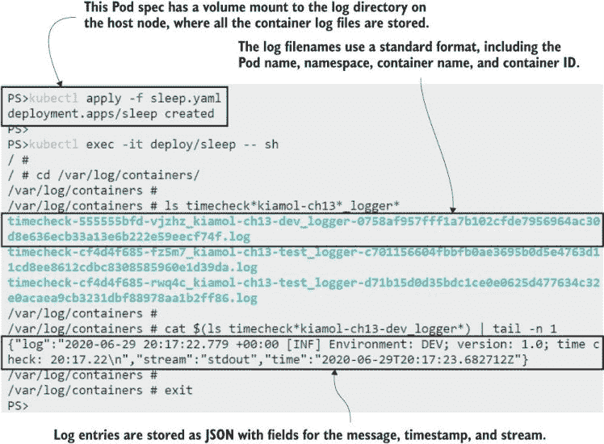

图 13.3 对于一个现代平台来说，Kubernetes 对日志存储的方法有点过时。

Pod 重启后，日志文件会被保留，但大多数 Kubernetes 实现都包括在节点上运行的日志轮转系统——在 Kubernetes 之外，以防止日志占用所有磁盘空间。收集并将日志转发到中央存储库可以让你保存更长时间，并将日志存储集中在一个地方——这也适用于核心 Kubernetes 组件的日志。Kubernetes DNS 服务器、API 服务器和网络代理都作为 Pods 运行，你可以像处理应用程序日志一样查看和收集它们的日志。

现在试试看 并非每个 Kubernetes 节点都运行相同的核心组件，但你可以使用 sleep Pod 来查看你的节点上运行哪些常见组件。

```
# connect to a session in the Pod:
kubectl exec -it deploy/sleep -- sh

# browse to the host path volume:
cd /var/log/containers/
# the network proxy runs on every node:
cat $(ls kube-proxy*) | tail -n 1

# if your cluster uses Core DNS, you’ll see logs here:
cat $(ls coredns*) | tail -n 1

# if your node is running the API server, you’ll see these logs:
cat $(ls kube-apiserver*) | tail -n 1

# leave the session:
exit
```

根据你的实验室集群的设置，你可能从那个练习中得到不同的输出。网络代理 Pod 在每个节点上运行，所以你应该能看到这些日志，但只有当你的集群使用 CoreDNS（这是默认的 DNS 插件）时，你才会看到 DNS 日志，只有当你的节点运行 API 服务器时，你才会看到 API 服务器日志。我的 Docker Desktop 输出显示在图 13.4 中；如果你看到不同的内容，你可以运行 `ls` `*.log` 来查看你节点上的所有 Pod 日志文件。

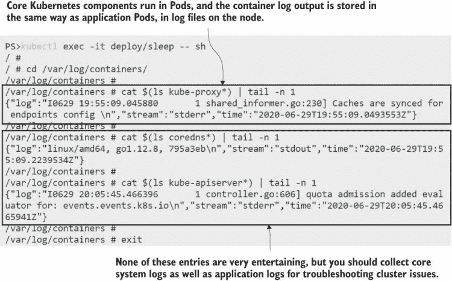

图 13.4 从节点收集和转发日志也将包括所有系统 Pod 的日志。

现在您知道了 Kubernetes 如何处理和存储容器日志，您可以看到集中式日志系统如何使故障排除变得如此简单。在每个节点上运行一个收集器，从日志文件中抓取条目并转发它们。在本章的其余部分，您将学习如何使用 EFK 堆栈实现它：Elasticsearch、Fluentd 和 Kibana。

## 13.2 使用 Fluentd 收集节点日志

Fluentd 是一个 CNCF 项目，因此它有一个坚实的后盾，是一个成熟且流行的产品。存在其他日志收集组件，但 Fluentd 是一个好的选择，因为它有一个强大的处理管道来操纵和过滤日志条目，以及一个可插拔的架构，因此它可以转发日志到不同的存储系统。它还有两个变体：完整的 Fluentd 速度快且效率高，有超过 1,000 个插件，但我们将使用最小化的替代品，称为 Fluent Bit。

Fluent Bit 最初被开发为一个用于嵌入式应用程序（如物联网设备）的轻量级 Fluentd 版本，但它具有在完整的 Kubernetes 集群中进行日志聚合所需的所有功能。每个节点都会运行一个日志收集器，因此保持该组件的影响很小是有意义的，Fluent Bit 可以在几十兆内存中愉快地运行。Kubernetes 中的 Fluent Bit 架构很简单：一个 DaemonSet 在每台节点上运行一个收集器 Pod，它使用`HostPath`卷挂载来访问日志文件，就像我们在 sleep 示例中所使用的那样。Fluent Bit 支持不同的输出，因此我们将从简单开始，只在 Fluent Bit Pod 的控制台中记录日志。

现在尝试一下：部署 Fluent Bit，配置为读取 timecheck 日志文件并将它们写入 Fluent Bit 容器的标准输出流。

```
# deploy the DaemonSet and ConfigMap:
kubectl apply -f fluentbit/

# wait for Fluent Bit to start up:
kubectl wait --for=condition=ContainersReady pod -l app=fluent-bit -n kiamol-ch13-logging

# check the logs of the Fluent Bit Pod:
kubectl logs  -l app=fluent-bit -n kiamol-ch13-logging --tail 2
```

我的输出显示在图 13.5 中，您可以看到 timecheck 容器在 Fluent Bit 容器中暴露的日志。创建日志条目的 Pod 位于不同的命名空间中，但 Fluent Bit 从节点的文件中读取它们。内容是原始 JSON 加上一个更精确的时间戳，这是 Fluent Bit 添加到每个日志条目的。

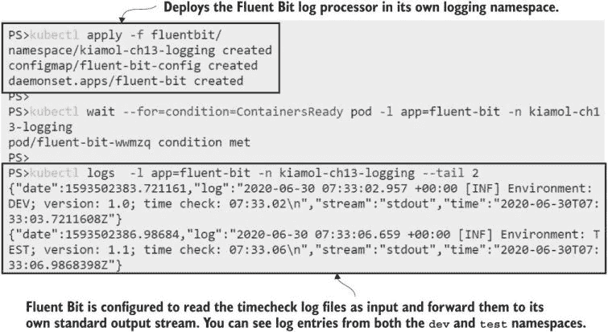


Fluent Bit 的 DaemonSet 规范中没有您之前没有见过的内容。我使用一个单独的命名空间进行日志记录，因为您通常希望它作为一个由集群上运行的所有应用程序使用的共享服务运行，而命名空间是隔离所有对象的好方法。运行 Fluent Bit Pods 很简单——复杂性在于配置日志处理管道，我们需要深入研究以充分利用日志模型。图 13.6 显示了管道的阶段以及如何使用它们。

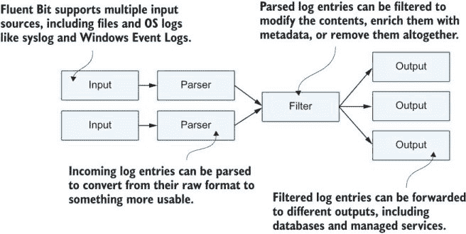


我们目前运行的是一个简单的配置，包含三个阶段：*输入*阶段读取日志文件，*解析*阶段分解 JSON 日志条目，*输出*阶段将每个日志作为单独的行写入 Fluent Bit 容器中的标准输出流。JSON 解析器对所有容器日志都是标准的，并不很有趣，所以我们将在列表 13.1 中关注输入和输出配置。

列表 13.1 fluentbit-config.yaml，一个简单的 Fluent Bit 管道

```
[INPUT]
    Name              tail         # Reads from the end of a file
    Tag               kube.*       # Uses a prefix for the tag
    Path              /var/log/containers/timecheck*.log
    Parser            docker       # Parses the JSON container logs
    Refresh_Interval  10        # Sets the frequency to check the file list

[OUTPUT]
    Name            stdout         # Writes to standard out
    Format          json_lines     # Formats each log as a line
    Match           kube.*         # Writes logs with a kube tag prefix
```

Fluent Bit 使用*标签*来识别日志条目的来源。标签在输入阶段添加，可以用来将日志路由到其他阶段。在这个配置中，日志文件名用作标签，前面加上`kube`前缀。匹配规则将所有`kube`标签条目路由到输出阶段，因此每个日志都会打印出来，但输入阶段只读取 timecheck 日志文件，所以您只能看到这些日志条目。

您真的不想过滤输入文件——这只是一个快速开始的方法，避免因日志条目过多而让您感到困扰。最好读取所有输入，然后根据标签路由日志，这样您就只存储您感兴趣的条目。Fluent Bit 内置了对 Kubernetes 的支持，有一个*过滤器*可以丰富日志条目，用元数据来识别创建它的 Pod。过滤器还可以配置为为每个日志构建一个包含命名空间和 Pod 名称的自定义标签；使用它，您可以修改管道，以便只有来自测试命名空间的日志写入标准输出。

现在尝试一下 更新 Fluent Bit ConfigMap 以使用 Kubernetes 过滤器，重启 DaemonSet 以应用配置更改，然后打印 timecheck 应用程序的最新日志以查看过滤器的作用。

```
# update the data pipeline configuration files:
kubectl apply -f fluentbit/update/fluentbit-config-match.yaml

# restart the DaemonSet so a new Pod gets the changed configuration:
kubectl rollout restart ds/fluent-bit -n kiamol-ch13-logging

# wait for the new logging Pod:
kubectl wait --for=condition=ContainersReady pod -l app=fluent-bit -n kiamol-ch13-logging

# print the last log entry:
kubectl logs  -l app=fluent-bit -n kiamol-ch13-logging --tail 1
```

您可以从图 13.7 中的我的输出中看到，通过 Fluent Bit 传输的数据量要多得多——日志条目是相同的，但它已经丰富了日志来源的详细信息。Kubernetes 过滤器从 API 服务器获取所有这些数据，这为您在分析日志以追踪问题时提供了真正需要的额外上下文。查看容器的图像哈希将让您能够完全确信地检查软件版本。

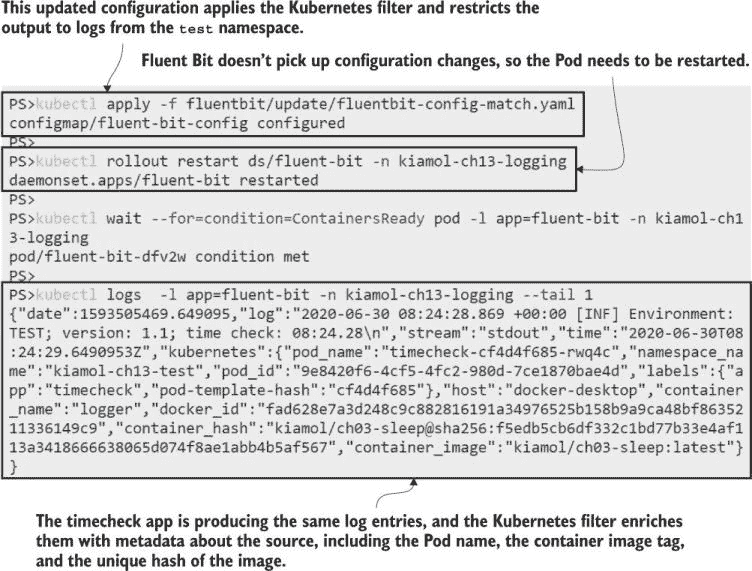

图 13.7 显示过滤器丰富了日志条目——单个日志消息现在有 14 个额外的元数据字段。

这个 Fluent Bit 的配置有点棘手。Kubernetes 过滤器默认情况下可以获取所有 Pod 元数据，但为路由构建自定义标签需要一些繁琐的正则表达式。所有这些都在您在之前的练习中部署的 ConfigMap 的配置文件中，但我不打算关注它，因为我真的很不喜欢正则表达式。而且也没有必要——设置是完全通用的，所以您可以将输入、过滤器和解析配置插入到自己的集群中，它将为您的应用程序工作而无需任何更改。

输出配置将不同，因为那是你配置目标的方式。在我们连接日志存储和搜索组件之前，我们将查看 Fluent Bit 的另一个特性——将日志条目路由到不同的输出。输入配置中的正则表达式为格式为`kube.namespace.container_name.pod_name`的条目设置了一个自定义标签，这可以用于匹配，根据它们的命名空间或 Pod 名称将日志路由到不同的地方。列表 13.2 显示了一个具有多个目的地的更新输出配置。

列表 13.2 fluentbit-config-match-multiple.yaml，路由到多个输出

```
[OUTPUT]
    Name       stdout                     # The standard out plugin will
    Format     json_lines                 # print only log entries where
    Match      kube.kiamol-ch13-test.*    # the namespace is test.

[OUTPUT]
    Name       counter                    # The counter prints a count of
    Match      kube.kiamol-ch13-dev.*     # logs from the dev namespace.
```

Fluent Bit 支持许多输出插件，从简单的 TCP 到 Postgres 和云服务如 Azure Log Analytics。我们迄今为止使用的是标准输出流，它只是将日志条目中继到控制台。计数器插件是一个简单的输出，仅显示已收集的日志条目数量。当你部署新的配置时，你将继续看到测试命名空间中的日志行，你还将看到来自开发命名空间的日志条目计数。

现在试试看 更新配置以使用多个输出，并从 Fluent Bit Pod 打印日志。

```
# update the configuration and restart Fluent Bit:
kubectl apply -f fluentbit/update/fluentbit-config-match-multiple.yaml

kubectl rollout restart ds/fluent-bit -n kiamol-ch13-logging

kubectl wait --for=condition=ContainersReady pod -l app=fluent-bit -n kiamol-ch13-logging

# print the last two log lines:
kubectl logs  -l app=fluent-bit -n kiamol-ch13-logging --tail 2
```

本练习中的计数器并不特别有用，但它存在是为了向你展示管道早期部分的复杂部分如何使管道后期的路由变得简单。图 13.8 显示了我对不同命名空间中的日志有不同的输出，并且我可以仅通过输出阶段的匹配规则来配置这一点。

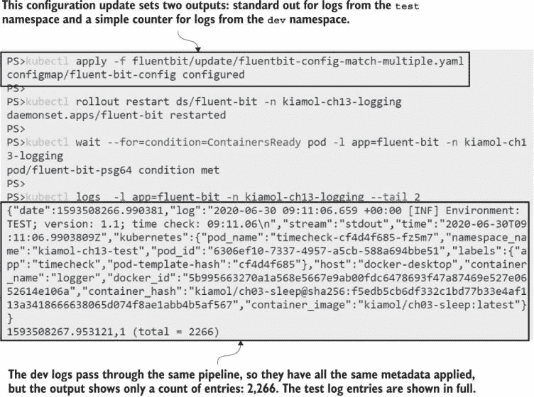

图 13.8 Fluent Bit 中的不同输出可以重塑数据——计数器仅显示计数。

应该很清楚，你可以在 Kubernetes 写入的简单日志文件之上添加一个复杂的日志系统。Fluent Bit 中的数据管道允许你丰富日志条目并将它们路由到不同的输出。如果你想要的输出不被 Fluent Bit 支持，那么你可以切换到父 Fluentd 项目，该项目拥有更多的插件（包括 MongoDB 和 AWS S3）——管道阶段和配置非常相似。我们将使用 Elasticsearch 进行存储，这对于高性能搜索来说非常完美，并且与 Fluent Bit 的集成也很简单。

## 13.3 将日志发送到 Elasticsearch

Elasticsearch 是一个生产级的开源数据库。它将项目作为*文档*存储在称为*索引*的集合中。它与关系型数据库的存储模型非常不同，因为它不支持索引中每个文档的固定模式——每个数据项都可以有自己的字段集。这对于集中式日志记录来说效果很好，因为来自不同系统的日志项将具有不同的字段。Elasticsearch 作为一个单一组件运行，具有 REST API 以插入和查询数据。一个名为 Kibana 的配套产品提供了一个非常实用的前端来查询 Elasticsearch。你可以在与 Fluent Bit 相同的共享日志命名空间中运行这两个组件。

现在尝试一下 部署 Elasticsearch 和 Kibana——日志系统的存储和前端组件。

```
# create the Elasticsearch deployment, and wait for the Pod:
kubectl apply -f elasticsearch/

kubectl wait --for=condition=ContainersReady pod -l app=elasticsearch -n kiamol-ch13-logging

# create the Kibana deployment, and wait for it to start:
kubectl apply -f kibana/

kubectl wait --for=condition=ContainersReady pod -l app=kibana -n kiamol-ch13-logging

# get the URL for Kibana:
kubectl get svc kibana -o jsonpath='http://{.status.loadBalancer.ingress[0].*}:5601' -n kiamol-ch13-logging
```

如图 13.9 所示，这种基本的 Elasticsearch 和 Kibana 部署使用每个服务一个 Pod。日志很重要，因此你希望在生产中为高可用性建模。Kibana 是一个无状态组件，因此你可以增加副本数量以提高可靠性。Elasticsearch 可以作为跨多个 Pod 的有状态集使用持久存储，或者你可以在云中使用托管 Elasticsearch 服务。当你运行 Kibana 时，你可以浏览到该 URL。我们将在下一个练习中使用它。

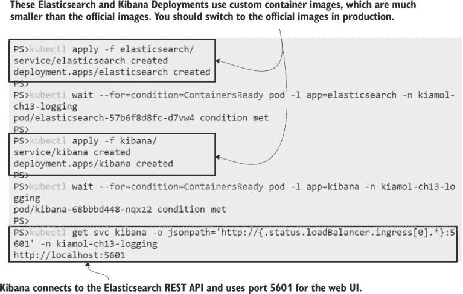

图 13.9 使用服务运行 Elasticsearch，以便 Kibana 和 Fluent Bit 可以使用 REST API。

Fluent Bit 有一个 Elasticsearch 输出插件，它使用 Elasticsearch REST API 为每个日志条目创建一个文档。该插件需要配置 Elasticsearch 服务器的域名，并且你可以选择指定应创建文档的索引。这允许你使用多个输出阶段将不同命名空间的日志条目隔离到不同的索引中。列表 13.3 将测试命名空间中的 Pod 和 Kubernetes 系统 Pod 的日志条目分开。

列表 13.3 fluentbit-config-elasticsearch.yaml，将日志存储在 Elasticsearch 索引中

```
[OUTPUT]
    Name       es                            # Logs from the test namespace
    Match      kube.kiamol-ch13-test.*       # are routed to Elasticsearch
    Host       elasticsearch                 # and created as documents in 
    Index      test                          # the "test" index.

[OUTPUT]
    Name       es                            # System logs are created in
    Match      kube.kube-system.*            # the "sys" index in the same
    Host       elasticsearch                 # Elasticsearch server.
    Index      sys
```

如果有不符合任何输出规则的日志条目，它们将被丢弃。当你部署此更新配置时，Kubernetes 系统日志和测试命名空间的日志将保存在 Elasticsearch 中，但开发命名空间的日志不会被保存。

现在尝试一下 更新 Fluent Bit 配置以将日志发送到 Elasticsearch，然后连接到 Kibana 并设置对测试索引的搜索。

```
# deploy the updated configuration from listing 13.3
kubectl apply -f fluentbit/update/fluentbit-config-elasticsearch.yaml

# update Fluent Bit, and wait for it to restart
kubectl rollout restart ds/fluent-bit -n kiamol-ch13-logging

kubectl wait --for=condition=ContainersReady pod -l app=fluent-bit -n kiamol-ch13-logging

# now browse to Kibana and set up the search:
# - click Discover on the left navigation panel 
# - create a new index pattern
# - enter "test" as the index pattern
# - in the next step, select @timestamp as the time filter field
# - click Create Index Pattern 
# - click Discover again on the left navigation panel to see the logs
```

此过程包含几个手动步骤，因为 Kibana 并不是一个易于自动化的产品。图 13.10 中的输出显示了正在创建的索引模式。当你完成这个练习后，你将拥有一个强大、快速且易于使用的搜索引擎，用于测试命名空间中所有容器的日志。Kibana 中的 Discover 选项卡会显示随时间存储的文档速率——这是处理日志的速率——你可以深入到每个文档中查看日志详情。

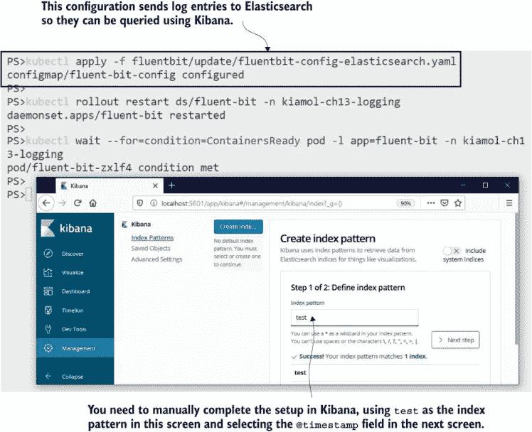

图 13.10 设置 Fluent Bit 将日志发送到 Elasticsearch，并设置 Kibana 搜索测试索引

Elasticsearch 和 Kibana 是成熟的技术，但如果你是新手，现在是一个很好的时候浏览一下 Kibana 的用户界面。你会在 Discover 页面的左侧看到一个字段列表，你可以使用它来过滤日志。这些字段包含所有 Kubernetes 元数据，因此你可以通过 Pod 名称、主机节点、容器镜像等进行过滤。你可以构建显示按应用程序划分的日志摘要统计信息的仪表板，这对于显示错误日志的突然激增非常有用。你还可以在所有文档中搜索特定值，这是一种在用户给你错误消息的 ID 时查找应用程序日志的好方法。

我不会在 Kibana 上花费太多时间，但一个额外的练习将展示拥有一个集中式日志系统是多么有用。我们将向测试命名空间部署一个新的应用程序，并且它的日志将自动被 Fluent Bit 捕获，并通过 Elasticsearch 流转，而无需对配置进行任何更改。当应用程序向用户显示错误时，我们可以在 Kibana 中轻松追踪。

现在尝试一下：部署我们之前使用过的随机数 API——第一次使用后崩溃的那个——以及一个缓存响应并几乎解决问题的代理。尝试 API，当您收到错误时，您可以在 Kibana 中搜索故障 ID。

```
# deploy the API and proxy:
kubectl apply -f numbers/

# wait for the app to start up:
kubectl wait --for=condition=ContainersReady pod -l app=numbers-api -n kiamol-ch13-test

# get the URL to use the API via the proxy:
kubectl get svc numbers-api-proxy -o jsonpath='http://{.status.loadBalancer.ingress[0].*}:8080/rng' -n kiamol-ch13-test

# browse to the API, wait 30 seconds, and refresh until you get an error
# browse to Kibana, and enter this query in the search bar:
# kubernetes.labels.app:numbers-api AND log:<failure-ID-from-the-API>
```

图 13.11 中的我的输出很小，但你可以看到发生了什么：我从 API 获取了一个故障 ID，并将其粘贴到 Kibana 的搜索栏中，它返回了一个单一匹配项。日志条目包含了我需要调查 Pod 所需的所有信息。Kibana 还有一个有用的选项，可以在匹配前后显示文档，我可以使用它来显示围绕故障日志的日志条目。

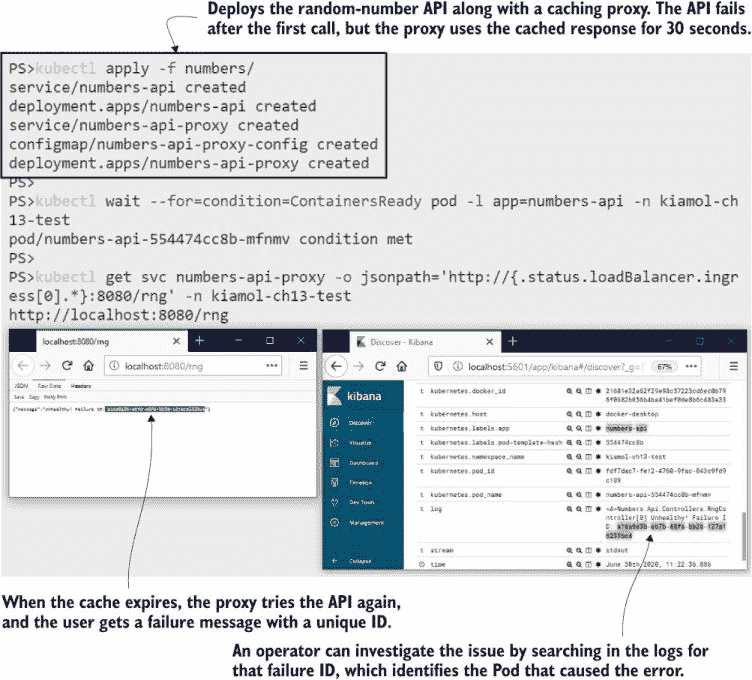

图 13.11 日志系统运行中的情况——从用户界面错误消息追踪故障

可搜索的集中式日志消除了许多故障排除的摩擦，额外的好处是这些组件都是开源的，因此您可以在每个环境中运行相同的日志堆栈。在开发、测试环境和生产环境中使用相同的诊断工具应该有助于产品团队了解有用的日志级别，并提高系统日志的质量。高质量的日志很重要，但在产品待办事项列表中很少排名很高，因此在某些应用程序中，您可能会遇到不太有用的日志。Fluent Bit 也有一些额外的功能可以帮助那里。

## 13.4 解析和过滤日志条目

理想的应用程序会生成具有条目严重性字段、写入输出的类名称以及事件类型和事件关键数据项 ID 的结构化日志数据。您可以使用这些字段的值在 Fluent Bit 管道中过滤消息，并且这些字段会在 Elasticsearch 中显示，以便您可以构建更精确的查询。大多数系统不会生成这样的日志——它们只是发出文本，但如果文本使用已知格式，那么 Fluent Bit 可以在通过管道时将其解析为字段。

随机数 API 是一个简单的例子。日志条目是看起来像这样的文本行：`<6>Microsoft.Hosting.Lifetime[0]` `Now` `listening` `on:` `http://[::]:80`。第一部分，在尖括号内，是消息的优先级，后面跟着类名和事件 ID（方括号内），然后是日志的实际内容。每个日志条目的格式都是相同的，因此 Fluent Bit 解析器可以将日志分割成单独的字段。你必须使用正则表达式来做这件事，列表 13.4 显示了我的最佳尝试，它只提取了优先级字段，并将其他所有内容留在消息字段中。

列表 13.4 fluentbit-config-parser.yaml，应用程序日志的自定义解析器

```
[PARSER]
    Name      dotnet-syslog            # Name of the parser
    Format    regex                    # Parses with a regular expression 
    Regex     ^\<(?<priority>[0-9]+)\>*(?<message>.*)$       # Yuck
```

当你部署此配置时，Fluent Bit 将提供一个名为 `dotnet-syslog` 的新自定义解析器可供使用，但它不会应用于任何日志。管道需要知道哪些日志条目应该使用自定义解析器，Fluent Bit 允许你通过在 Pods 中的注释来设置这一点。这些注释就像提示一样，告诉管道将命名解析器应用于来自此 Pod 的任何日志。列表 13.5 显示了随机数 API Pod 的解析器注释——就这么简单。

列表 13.5 api-with-parser.yaml，带有自定义 Fluent Bit 解析器的 Pod 规范

```
# This is the Pod template in the Deployment spec.
template:
  metadata:                        # Labels are used for selectors and 
    labels:                        # operations; annotations are often  
      app: numbers-api             # used for integration flags.
    annotations:
      fluentbit.io/parser: dotnet-syslog     # Uses the parser for Pod logs
```

解析器可以比我的自定义解析器更有效，Fluent Bit 团队在他们的文档中提供了一些示例解析器，包括一个用于 Nginx 的解析器。我正在使用 Nginx 作为随机数 API 的代理，在下一个练习中，我们将为每个组件添加解析器并带有注释，看看结构化日志如何在 Kibana 中实现更有针对性的搜索和过滤。

现在试试看 更新 Fluent Bit 配置以添加随机数应用和 Nginx 代理的解析器，然后更新这些部署以添加指定解析器的注释。尝试该应用，并检查 Kibana 中的日志。

```
# update the pipeline configuration:
kubectl apply -f fluentbit/update/fluentbit-config-parser.yaml

# restart Fluent Bit:
kubectl rollout restart ds/fluent-bit -n kiamol-ch13-logging
kubectl wait --for=condition=ContainersReady pod -l app=fluent-bit -n kiamol-ch13-logging

# update the app Deployments, adding parser annotations:
kubectl apply -f numbers/update/

# wait for the API to be ready:
kubectl wait --for=condition=ContainersReady pod -l app=numbers-api -n kiamol-ch13-test

# use the API again, and browse to Kibana to see the logs
```

你可以在图 13.12 中看到，解析器提升的字段可供 Kibana 过滤，而无需我构建自己的查询。在我的屏幕截图中，我已经过滤以显示具有优先级值为 4（这是一个警告级别）的日志条目来自一个 Pod。当你自己运行时，你也会看到你可以过滤 API 代理 Pod。日志条目包括 HTTP 请求路径和响应代码字段，所有这些都是从 Nginx 文本日志中解析出来的。

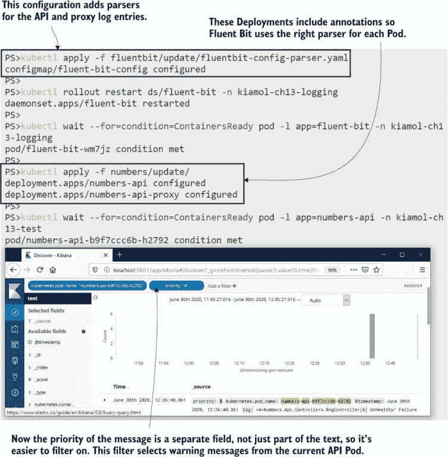

图 13.12 日志的解析字段被索引，因此过滤和搜索更快、更简单。

Fluent Bit 集中式日志系统的最后一个好处是：数据处理管道与应用程序独立，并且它是一个更好的应用过滤的地方。那个传说中的理想应用程序能够实时增加或减少日志级别，而无需重启应用程序。然而，您从第四章中知道，许多应用程序需要重启 Pod 才能获取最新的配置更改。当您正在处理实时问题时，这并不好，因为这意味着如果您需要提高日志级别，则需要重启受影响的应用程序。

Fluent Bit 本身不支持实时配置重载，但重启日志收集器 Pod 比重启应用 Pod 更少侵入性，Fluent Bit 会从上次停止的地方继续，所以您不会错过任何日志条目。采用这种方法，您可以在应用程序中以更详细的级别进行日志记录，并在 Fluent Bit 管道中进行过滤。列表 13.6 展示了一个过滤器，只有当优先级字段值为 2、3 或 4 时才包含来自随机数 API 的日志——它会过滤掉优先级较低的条目。

列表 13.6 fluentbit-config-grep.yaml，基于字段值过滤日志

```
[FILTER]
    Name     grep                       # grep is a search filter.
    Match    kube.kiamol-ch13-test.api.numbers-api*
    Regex    priority [234]             # Even I can manage this regular 
                                        # expression.
```

这里有一些正则表达式的处理，但您可以看到为什么将文本日志条目拆分成管道可以访问的字段很重要。`grep` 过滤器可以通过评估字段上的正则表达式来包含或排除日志。当您部署这个更新后的配置时，API 可以愉快地以级别 6 写入日志条目，但它们会被 Fluent Bit 丢弃，只有更重要的条目才会到达 Elasticsearch。

现在尝试一下：部署更新后的配置，以便只保存来自随机数 API 的高优先级日志。删除 API Pod，在 Kibana 中您将看不到任何启动日志条目，但它们仍然存在于 Pod 日志中。

```
# apply the grep filter from listing 13.6:
kubectl apply -f fluentbit/update/fluentbit-config-grep.yaml

kubectl rollout restart ds/fluent-bit -n kiamol-ch13-logging

# delete the old API pod so we get a fresh set of logs:
kubectl delete pods -n kiamol-ch13-test -l app=numbers-api

kubectl wait --for=condition=ContainersReady pod -l app=numbers-api -n kiamol-ch13-test

# use the API, and refresh until you see a failure

# print the logs from the Pod:
kubectl logs -n kiamol-ch13-test -l app=numbers-api

# now browse to Kibana, and filter to show the API Pod logs
```

这个练习展示了 Fluent Bit 如何有效地过滤日志，只将您关心的日志条目转发到目标输出。它还表明，低级别日志并没有消失——原始容器日志都可以通过 kubectl 查看。只是后续的日志处理阻止了它们进入 Elasticsearch。在实际的故障排除场景中，您可能能够使用 Kibana 识别导致问题的 Pod，然后使用 kubectl 进行深入调查，如图 13.13 所示。

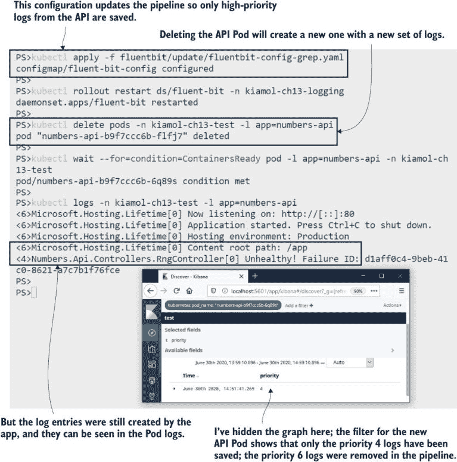

图 13.13 显示在 Fluent Bit 中过滤日志条目可以节省存储空间，并且您可以轻松更改过滤器。

除了我们在这些简单管道中提到的内容，Fluent Bit 还有很多其他功能：你可以修改日志内容，限制传入日志的速率，甚至可以运行由日志条目触发的自定义脚本。但我们已经涵盖了您可能需要的所有主要功能，最后我们将通过比较收集和转发日志模型与其他选项来结束讨论。

## 13.5 理解 Kubernetes 中的日志选项

Kubernetes 期望您的应用程序日志来自容器的标准输出流。它收集并存储这些流中的所有内容，这就是我们本章中讨论的日志模型的基础。这是一个通用且灵活的方法，我们使用的技术堆栈是可靠且性能良好的，但在过程中存在一些低效。图 13.14 显示了将日志从容器传输到可搜索存储中的一些问题。


图 13.14 目标是将应用程序日志放入 Elasticsearch，但到达那里需要许多步骤。

您可以使用更简单且组件更少的替代架构。您可以直接从应用程序代码将日志写入 Elasticsearch，或者在每个应用程序 Pod 中运行一个 sidecar，从应用程序使用的任何日志接收器读取并推送条目到 Elasticsearch。这将使您对存储的日志数据有更多的控制，而无需使用正则表达式来解析文本字符串。这样做会使您依赖于 Elasticsearch（或您使用的任何存储系统），但如果该系统提供了您所需的一切，这可能不是一个大问题。

对于在 Kubernetes 上运行的第一个应用程序，自定义日志框架可能很有吸引力，但随着您将更多工作负载移动到集群，它将限制您。要求应用程序直接将日志记录到 Elasticsearch 将不适合将日志写入操作系统日志的现有应用程序，并且您很快会发现您的日志 sidecar 不够灵活，需要为每个新应用程序进行调整。Fluentd/Fluent Bit 模型的优势在于它是一个有社区支持的标准方法；与编写和维护自己的日志收集和转发代码相比，调整正则表达式要容易得多。

这就是应用程序日志的全部内容，因此我们可以清理集群，为实验室做准备。

现在尝试一下 移除本章的命名空间和剩余的 Deployment。

```
kubectl delete ns -l kiamol=ch13
kubectl delete all -l kiamol=ch13
```

## 13.6 实验室

在这个实验室中，您将扮演一个操作员的角色，需要将一个新应用程序部署到使用本章中日志模型的集群中。您需要检查 Fluent Bit 配置以找到您应该为您的应用程序使用的命名空间，然后部署我们在书中之前使用过的简单版本化网站。以下是实验室的各个部分：

+   首先部署位于`lab/logging`文件夹中的日志组件。

+   将`vweb`文件夹中的应用程序部署到正确的命名空间，以便收集日志，并验证您是否能在 Kibana 中看到日志。

+   您将看到日志是纯文本，因此下一步是更新您的 Deployment 以使用正确的解析器。应用程序运行在 Nginx 上，Fluent Bit 配置中已经为您设置了一个 Nginx 解析器。

+   当你在 Kibana 中确认新的日志时，你会看到其中一些状态码为 304 的日志，这表示浏览器应使用其缓存的页面版本。这些日志并不有趣，因此最终任务是更新 Fluent Bit 配置以过滤掉它们。

这是一个非常贴近实际的任务，你需要掌握在 Kubernetes 中导航的所有基本技能来查找和更新所有相关部分。我的解决方案在 GitHub 的常规位置供你检查：[`github.com/sixeyed/kiamol/blob/master/ch13/lab/README.md`](https://github.com/sixeyed/kiamol/blob/master/ch13/lab/README.md).
