# 14 使用 Prometheus 监控应用程序和 Kubernetes

监控是日志记录的伴侣：你的监控系统会告诉你有什么问题，然后你可以深入日志以找出详细信息。像日志记录一样，你希望有一个集中式系统来收集和可视化所有应用组件的指标。在 Kubernetes 中进行监控的一种既定方法使用另一个 CNCF 项目：Prometheus，它是一个收集和存储指标的服务器应用程序。在本章中，你将学习如何在 Kubernetes 中部署一个共享的监控系统，该系统包含显示单个应用程序和整个集群健康状况的仪表板。

Prometheus 在许多平台上运行，但它特别适合 Kubernetes。你在具有访问 Kubernetes API 服务器的 Pod 中运行 Prometheus，然后 Prometheus 查询 API 以找到它需要监控的所有目标。当你部署新应用时，你不需要进行任何设置更改——Prometheus 会自动发现它们并开始收集指标。Kubernetes 应用程序也非常适合 Prometheus。你将在本章中看到如何充分利用边车模式，以便每个应用程序都可以向 Prometheus 提供一些指标，即使应用程序本身不是 Prometheus 准备好的。

## 14.1 Prometheus 如何监控 Kubernetes 工作负载

Prometheus 中的指标是完全通用的：你想要监控的每个组件都有一个 HTTP 端点，它返回对该组件重要的所有值。一个 Web 服务器包括它服务的请求数量的指标，而 Kubernetes 节点包括可用内存的指标。Prometheus 不关心指标中有什么；它只是存储组件返回的所有内容。对 Prometheus 来说重要的是它需要收集的目标列表。图 14.1 显示了在 Kubernetes 中它是如何使用 Prometheus 内置的服务发现来工作的。

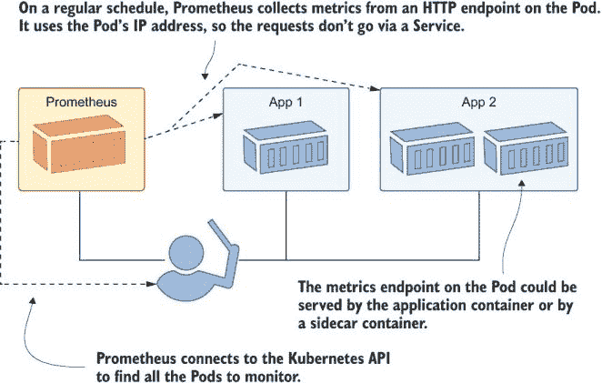

图 14.1 Prometheus 使用拉模型收集指标，自动查找目标。

本章的重点是让 Prometheus 与 Kubernetes 顺利配合，为你提供一个动态的监控系统，随着你的集群随着更多运行更多应用的节点而扩展时，它仍然可以正常工作。我不会过多地详细介绍如何将监控添加到你的应用程序中或你应该记录哪些指标——电子书附录 B 中的章节“使用容器化监控添加可观察性”来自《一个月午餐学 Docker》，它将提供这些额外的细节。

我们首先让 Prometheus 启动并运行。Prometheus 服务器是一个负责服务发现和指标收集及存储的单个组件，它有一个基本的 Web UI，你可以使用它来检查系统状态并运行简单的查询。

现在尝试一下：在专用的监控命名空间中部署 Prometheus，配置为在测试命名空间中查找应用（测试命名空间尚不存在）。

```
# switch to this chapter’s folder:
cd ch14

# create the Prometheus Deployment and ConfigMap:
kubectl apply -f prometheus/

# wait for Prometheus to start:
kubectl wait --for=condition=ContainersReady pod -l app=prometheus -n kiamol-ch14-monitoring

# get the URL for the web UI:
kubectl get svc prometheus -o jsonpath='http://{.status.loadBalancer.ingress[0].*}:9090' -n kiamol-ch14-monitoring

# browse to the UI, and look at the /targets page
```

Prometheus 将指标收集称为 *scraping*。当你浏览到 Prometheus UI 时，你会看到没有抓取目标，尽管有一个名为 `test-pods` 的类别，其中列出零个目标。图 14.2 显示了我的输出。`test-pods` 的名称来自你在 ConfigMap 中部署的 Prometheus 配置，Pod 会从中读取。

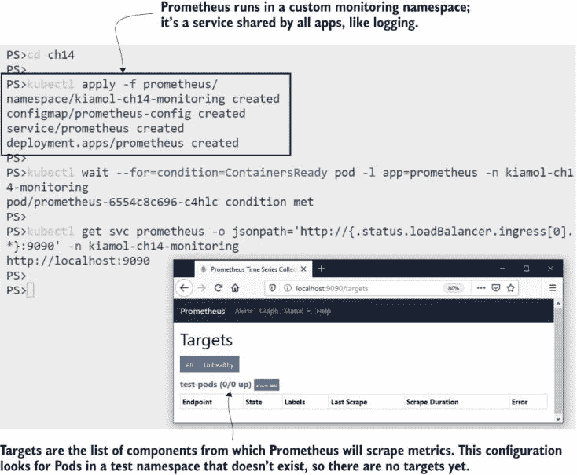

图 14.2 目前没有目标，但 Prometheus 会持续检查 Kubernetes API 中的新 Pods。

配置 Prometheus 在 Kubernetes 中查找目标是相当直接的，尽管一开始术语可能令人困惑。Prometheus 使用 *jobs* 来定义一组相关的目标以进行抓取，这些目标可能是应用程序的多个组件。抓取配置可以是一个静态域名列表，Prometheus 会轮询以抓取指标，或者它可以使用动态服务发现。列表 14.1 显示了 `test-pods` 作业配置的开始，它使用 Kubernetes API 进行服务发现。

列表 14.1 prometheus-config.yaml，带有 Kubernetes 的抓取配置

```
scrape_configs:                # This is the YAML inside the ConfigMap.
  - job_name: 'test-pods'      # Used for test apps
    kubernetes_sd_configs:     # Finds targets from the Kubernetes API
    - role: pod                # Searches for Pods
    relabel_configs:           # Applies these filtering rules
    - source_labels:          
        - __meta_kubernetes_namespace
      action: keep             # Includes Pods only where the namespace
      regex: kiamol-ch14-test  # is the test namespace for this chapter
```

需要解释的是 `relabel_configs` 部分。Prometheus 使用 *labels* 存储指标，这些是标识源系统和其他相关信息的键值对。你将在查询中使用标签来选择或聚合指标，你还可以在它们存储在 Prometheus 之前使用它们来过滤或修改指标。这是 *relabeling*，从概念上讲，它与 Fluent Bit 中的数据管道相似——这是你丢弃不需要的数据和重塑你想要的数据的机会。

正则表达式在 Prometheus 中也显得过于复杂，但通常不需要进行更改。你在重命名阶段设置的管道应该足够通用，以适用于所有应用程序。配置文件中的完整管道应用以下规则：

+   仅包括来自 `kiamol-ch14-test` 命名空间的 Pods。

+   将 Pod 名称用作 Prometheus `instance` 标签的值。

+   将 Pod 元数据中的应用程序标签用作 Prometheus `job` 标签的值。

+   在 Pod 元数据中使用可选的注释来配置抓取目标。

这种方法是由约定驱动的——只要你的应用程序按照规则建模，它们就会自动被识别为监控目标。Prometheus 使用规则来查找匹配的 Pods，并为每个目标，通过向 `/metrics` 路径发起 HTTP GET 请求来收集指标。Prometheus 需要知道使用哪个网络端口，因此 Pod 规范需要明确包含容器端口。这始终是一个好的做法，因为它有助于记录你的应用程序的设置。让我们将一个简单的应用程序部署到测试命名空间，看看 Prometheus 会如何处理它。

现在尝试一下：将 timecheck 应用程序部署到测试命名空间。规范与所有 Prometheus 抓取规则匹配，因此新的 Pod 应该会被找到并添加为抓取目标。

```
# create the test namespace and the timecheck Deployment:
kubectl apply -f timecheck/ 

# wait for the app to start:
kubectl wait --for=condition=ContainersReady pod -l app=timecheck -n kiamol-ch14-test

# refresh the target list in the Prometheus UI, and confirm the
# timecheck Pod is listed, then browse to the /graph page, select 
# timecheck_total from the dropdown list, and click Execute
```

我的输出如图 14.3 所示，我在其中打开了两个浏览器窗口，以便你可以看到应用程序部署时发生了什么。Prometheus 看到了 timecheck Pod 的创建，并且它在重命名阶段匹配了所有规则，因此它被添加为目标。Prometheus 配置设置为每 30 秒抓取一次目标。timecheck 应用程序有一个 `/metrics` 端点，它返回已写入的时间检查日志的数量。当我查询 Prometheus 中的该指标时，应用程序已写入 22 条日志条目。

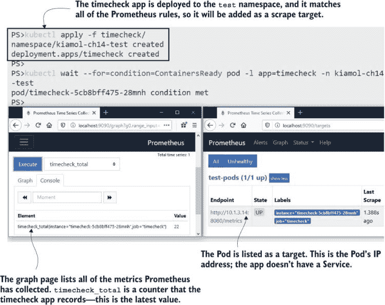

图 14.3 将应用程序部署到测试命名空间-Prometheus 发现它并开始收集指标。

在这里，你应该意识到两个重要的事情：应用程序本身需要提供指标，因为 Prometheus 只是一个收集器，并且这些指标代表应用程序一个实例的活动。timecheck 应用程序不是一个 Web 应用程序——它只是一个后台进程——因此没有 Service 将流量导向它。当 Prometheus 查询 Kubernetes API 时，它会获取 Pod IP 地址，并直接向 Pod 发送 HTTP 请求。你也可以配置 Prometheus 查询 Service，但那样你会得到一个跨越多个 Pod 的负载均衡器目标，而你希望 Prometheus 独立抓取每个 Pod。

你将使用 Prometheus 中的指标来驱动显示应用程序整体健康状况的仪表板，并且你可以跨所有 Pod 进行聚合以获取关键值。你还需要能够深入挖掘，以查看 Pod 之间是否存在差异。这将帮助你识别某些实例是否表现不佳，并将这些信息反馈到你的健康检查中。我们可以将 timecheck 应用程序扩展以查看在单个 Pod 级别收集的重要性。

现在尝试一下：向 timecheck 应用程序添加另一个副本。这是一个新的 Pod，它符合 Prometheus 规则，因此它将被发现并作为另一个抓取目标添加。

```
# scale the Deployment to add another Pod:
kubectl scale deploy/timecheck --replicas 2 -n kiamol-ch14-test

# wait for the new Pod to spin up:
kubectl wait --for=condition=ContainersReady pod -l app=timecheck -n kiamol-ch14-test

# back in Prometheus, check the target list, and in the graph page,
# execute queries for timecheck_total and dotnet_total_memory_bytes
```

在这个练习中，你会看到 Prometheus 找到了新的 Pod 并开始抓取它。两个 Pod 记录了相同的指标，并且 Pod 名称被设置为每个指标的标签。对 `timecheck_total` 指标的查询现在返回两个结果——每个 Pod 一个——你可以在图 14.4 中看到其中一个 Pod 做了比另一个 Pod 多得多的工作。

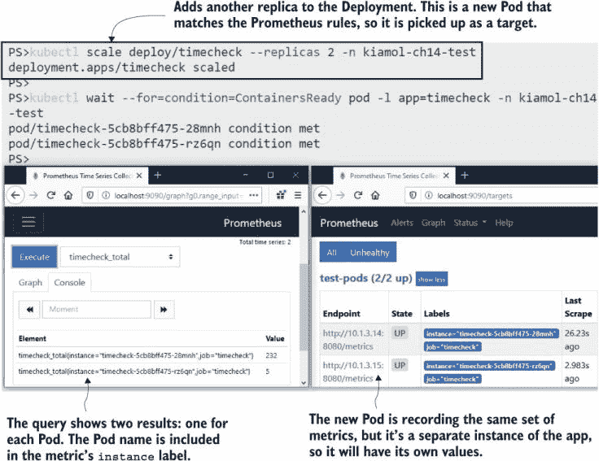

图 14.4 每个实例都会记录自己的指标，因此你需要从每个 Pod 收集。

timecheck 计数器是一个在应用程序代码中明确捕获的指标。大多数语言都有 Prometheus 客户端库，您可以将它集成到您的构建中。这些库允许您捕获特定于应用程序的详细信息，例如这些，并且它们还收集关于应用程序运行时的一般信息。这是一个 .NET 应用程序，Prometheus 客户端库记录运行时细节，如使用的内存和 CPU 数量以及正在运行的线程数。在下一节中，我们将运行一个分布式应用程序，其中每个组件都暴露 Prometheus 指标，我们将看到当应用程序仪表板包括运行时性能以及应用程序细节时是多么有用。

## 14.2 使用 Prometheus 客户端库构建的应用监控

电子书附录 B 介绍了如何向一个展示 NASA 天文每日照片（APOD）服务图片的应用添加指标。该应用的组件使用 Java、Go 和 Node.js 编写，并且每个组件都使用 Prometheus 客户端库来暴露运行时和应用指标。本章包括将应用部署到测试命名空间的 Kubernetes 清单，因此所有应用 Pod 都将被 Prometheus 发现。

现在试试看：将 APOD 应用部署到测试命名空间，并确认应用的三部分组件已添加为 Prometheus 目标。

```
# deploy the app:
kubectl apply -f apod/

# wait for the main component to start:
kubectl wait --for=condition=ContainersReady pod -l app=apod-api -n kiamol-ch14-test

# get the app URL:
kubectl get svc apod-web -o jsonpath='http://{.status.loadBalancer.ingress[0].*}:8014' -n kiamol-ch14-test

# browse to the app, and then refresh the Prometheus targets
```

您可以在图 14.5 中看到我的输出，其中展示了一幅名为 Lynds Dark Nebula 1251 的非常令人愉悦的图像。应用按预期工作，Prometheus 已经发现了所有新的 Pod。在部署应用后的 30 秒内，您应该看到所有新目标的状态都是“up”，这意味着 Prometheus 已经成功抓取了它们。

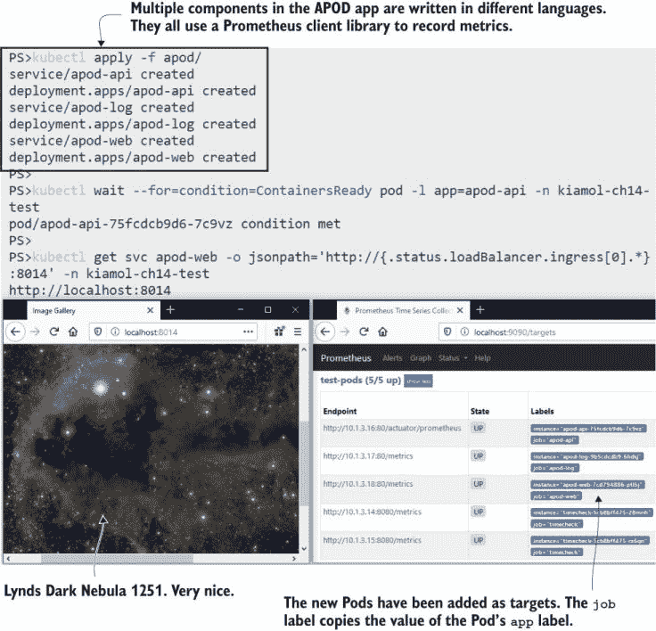

图 14.5 APOD 组件都有服务，但它们仍然在 Pod 级别被抓取。

在这个练习中，我有两个额外的重要事项要指出。首先，Pod 规范都包含一个容器端口，这表示应用程序容器正在监听端口 80，这也是 Prometheus 找到要抓取的目标的方式。实际上，用于 Web UI 的服务是在端口 8014 上监听的，但 Prometheus 直接连接到 Pod 端口。其次，API 目标没有使用标准的 `/metrics` 路径，因为 Java 客户端库使用不同的路径。我在 Pod 规范中使用了注解来指明正确的路径。

基于约定的发现方式非常棒，因为它减少了大量重复配置和错误的可能性，但并非每个应用都符合这些约定。我们在 Prometheus 中使用的重命名管道提供了一个很好的平衡。默认值适用于符合约定的任何应用，但不符合约定的应用可以通过注解覆盖默认值。列表 14.2 展示了如何配置覆盖以设置指标路径。

列表 14.2 prometheus-config.yaml，使用注解覆盖默认值

```
- source_labels:   # This is a relabel configuration in the test-pods job.

  - __meta_kubernetes_pod_annotationpresent_prometheus_io_path
  - __meta_kubernetes_pod_annotation_prometheus_io_path

regex: true;(.*)   # If the Pod has an annotation named prometheus.io/path . . .

target_label:  __metrics_path__  # sets the target path from the annotation.
```

这比看起来要简单得多。规则说明：如果 Pod 有一个名为 `prometheus.io/path` 的注解，则使用该注解的值作为指标路径。Prometheus 使用标签完成所有操作，因此每个 Pod 注解都成为名为 `meta_kubernetes_pod_annotation_<annotation-name>` 的标签，还有一个伴随的标签名为 `meta_kubernetes_pod_annotationpresent_<annotation-name>`，你可以用它来检查注解是否存在。任何使用自定义指标路径的应用程序都需要添加注解。列表 14.3 显示了 APOD API 的示例。

列表 14.3 api.yaml，API 规范中的路径注解

```
template:                 # This is the pod spec in the Deployment.
  metadata:
    labels:
      app: apod-api       # Used as the job label in Prometheus
    annotations:
      prometheus.io/path: "/actuator/prometheus"   # Sets the metrics path
```

复杂性集中在 Prometheus 配置中，并且为应用清单指定覆盖项非常简单。当你稍微熟悉一些后，重命名规则并不复杂，你通常遵循的是完全相同的模式。完整的 Prometheus 配置包括类似规则，用于应用覆盖指标端口和完全退出抓取。

当你在阅读这段内容时，Prometheus 一直在忙于抓取 timecheck 和 APOD 应用程序。查看 Prometheus UI 的“图形”页面，可以看到大约 200 个指标正在收集。UI 非常适合运行查询并快速查看结果，但你不能用它来构建一个在单个屏幕上显示应用程序所有关键指标的仪表板。为此，你可以使用 Grafana，这是容器生态系统中另一个开源项目，由 Prometheus 团队推荐。

现在试试看：部署 Grafana，使用 ConfigMaps 设置与 Prometheus 的连接，并包含 APOD 应用程序的仪表板。

```
# deploy Grafana in the monitoring namespace:
kubectl apply -f grafana/

# wait for it to start up:
kubectl wait --for=condition=ContainersReady pod -l app=grafana -n kiamol-ch14-monitoring

# get the URL for the dashboard:
kubectl get svc grafana -o jsonpath='http://{.status.loadBalancer.ingress[0].*}:3000/d/kb5nhJAZk' -n kiamol-ch14-monitoring

# browse to the URL; log in with username kiamol and password kiamol
```

图 14.6 中显示的仪表板虽小，但它能让你了解如何将原始指标转换为系统活动的信息视图。仪表板中的每个可视化都是由 Prometheus 查询驱动的，Grafana 在后台运行。每个组件都有一个行，这包括运行时指标——处理器和内存使用情况——以及应用程序指标——HTTP 请求和缓存使用情况。

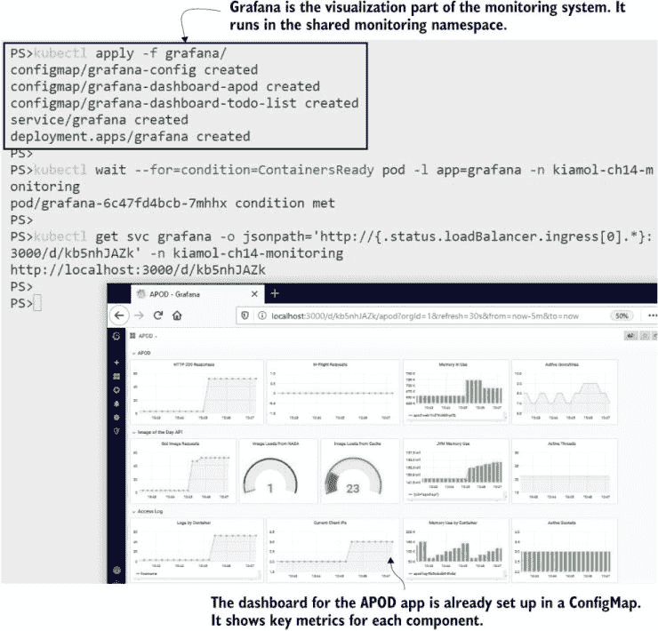

图 14.6 应用程序仪表板可以快速了解性能。所有图表都是由 Prometheus 指标驱动的。

这样的仪表板将是跨组织的共同努力。支持团队将设定他们需要查看的要求，应用开发和运维团队确保应用程序捕获数据，仪表板显示数据。就像我们在第十三章中查看的日志系统一样，这是一个由轻量级开源组件构建的解决方案，因此开发者可以在他们的笔记本电脑上运行与生产环境中相同的监控系统。这有助于开发中的性能测试和调试。

转向使用 Prometheus 的集中式监控将需要开发工作，但可以是一个逐步的过程，从基本的指标开始，随着团队提出更多要求，逐渐添加。我为本章的待办事项列表应用添加了 Prometheus 支持，大约需要 dozen 行代码。Grafana 中已经有一个简单的仪表板可以立即使用，所以当你部署应用时，你将能够看到仪表板的起点，该仪表板将随着未来的版本更新而改进。

现在试试看 运行带有指标启用的待办事项应用，并使用该应用生成一些指标。Grafana 中已经有一个仪表板可以用来可视化这些指标。

```
# deploy the app:
kubectl apply -f todo-list/

# wait for it to start:
kubectl wait --for=condition=ContainersReady pod -l app=todo-web -n kiamol-ch14-test

# browse to the app, and insert an item
# then run some load in with a script - on Windows:
.\loadgen.ps1

# OR on macOS/Linux:
chmod +x ./loadgen.sh && ./loadgen.sh

# get the URL for the new dashboard:
kubectl get svc grafana -o jsonpath='http://{.status.loadBalancer.ingress[0].*}:3000/d/Eh0VF3iGz' -n kiamol-ch14-monitoring

# browse to the dashboard
```

在那个仪表板上没有太多内容，但比完全没有仪表板要提供的信息多得多。它告诉你应用在容器内使用的 CPU 和内存量，任务创建的速率，以及 HTTP 请求的平均响应时间。你可以在图 14.7 中看到我的输出，我在那里添加了一些任务，并使用负载生成脚本来发送了一些流量。

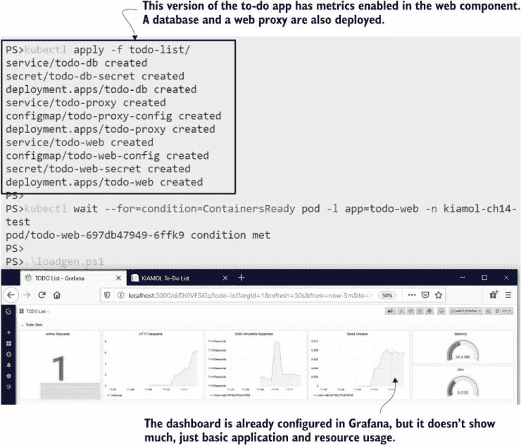

图 14.7 由 Prometheus 客户端库和几行代码驱动的简单仪表板

所有这些指标都来自待办事项应用的 Pod。在这个版本的应用中还有另外两个组件：用于存储的 Postgres 数据库和 Nginx 代理。这些组件都没有对 Prometheus 的原生支持，因此它们被排除在目标列表之外。否则，Prometheus 会不断尝试抓取指标并失败。知道某个组件不暴露指标并指定应该排除它的责任在于建模应用的人。列表 14.4 显示了如何通过简单的注解来完成这项工作。

列表 14.4 proxy.yaml，一个排除自身监控的 Pod 规范

```
  template:                # This is the Pod spec in the Deployment.
    metadata:
      labels:
        app: todo-proxy
      annotations:                      # Excludes the target in Prometheus
        prometheus.io/scrape: "false"   
```

组件不需要有 Prometheus 的原生支持并提供自己的指标端点，以便包含在你的监控系统中。Prometheus 有自己的生态系统——除了你可以用来向自己的应用程序添加指标的客户端库之外，还有一套导出器可以提取和发布第三方应用的指标。我们可以使用导出器来添加代理和数据库组件缺失的指标。

## 14.3 使用指标导出器监控第三方应用

大多数应用都以某种方式记录指标，但旧应用不会以 Prometheus 格式收集和暴露它们。导出器是独立的应用程序，了解目标应用如何进行监控，并能将这些指标转换为 Prometheus 格式。Kubernetes 提供了一种完美的方式，通过在每个应用实例旁边运行一个边车容器来运行导出器。这是我们第七章中提到的适配器模式。

Nginx 和 Postgres 都有可用的导出器，我们可以将其作为边车运行以改进待办事项应用程序的监控仪表板。Nginx 导出器从 Nginx 服务器上的状态页面读取数据并将其转换为 Prometheus 格式。请记住，Pod 中的所有容器都共享网络命名空间，因此导出器容器可以访问 localhost 地址上的 Nginx 容器。导出器在其自定义端口上提供了一个自己的 HTTP 端点用于指标，因此完整的 Pod 规范包括边车容器和一个注释来指定指标端口。列表 14.5 显示了关键部分。

列表 14.5 proxy-with-exporter.yaml，添加指标导出器容器

```
template:                 # Pod spec in the Deployment
    metadata:
      labels:
        app: todo-proxy
      annotations:                    # The exclusion annotation is gone.
        prometheus.io/port: "9113"    # Specifies the metrics port
    spec:
      containers:
        - name: nginx
          # ... nginx spec is unchanged

        - name: exporter              # The exporter is a sidecar.
          image: nginx/nginx-prometheus-exporter:0.8.0
          ports:
            - name: metrics
              containerPort: 9113     # Specifies the metrics port 
          args:                       # and loads metrics from Nginx
            - -nginx.scrape-uri=http://localhost/stub_status
```

刮擦排除已移除，因此当您部署此更新时，Prometheus 将在端口 9113 上抓取 Nginx Pod，那里有导出器正在监听。所有 Nginx 指标都将由 Prometheus 存储，并且 Grafana 仪表板可以更新以添加一行用于代理。我们不会在本章中详细介绍 Prometheus 查询语言（PromQL）或构建 Grafana 仪表板——仪表板可以从 JSON 文件中导入，并且有一个准备就绪的仪表板可供部署。

现在尝试一下 更新代理部署以添加导出器边车，并将更新的仪表板加载到 Grafana ConfigMap 中。

```
# add the proxy sidecar:
kubectl apply -f todo-list/update/proxy-with-exporter.yaml

# wait for it to spin up:
kubectl wait --for=condition=ContainersReady pod -l app=todo-proxy -n kiamol-ch14-test

# print the logs of the exporter:
kubectl logs -l app=todo-proxy -n kiamol-ch14-test -c exporter

# update the app dashboard: 
kubectl apply -f grafana/update/grafana-dashboard-todo-list-v2.yaml

# restart Grafana to load the new dashboard:
kubectl rollout restart deploy grafana -n kiamol-ch14-monitoring

# refresh the dashboard, and log in with kiamol/kiamol again
```

Nginx 导出器不提供大量信息，但基本细节都在那里。您可以在图 14.8 中看到我们获取了 HTTP 请求的数量以及 Nginx 处理连接请求的更低级别的分解。即使在这个简单的仪表板中，您也可以看到 Nginx 处理的流量与 Web 应用处理的流量之间的相关性，这表明代理没有缓存响应，并且对每个请求都调用 Web 应用。

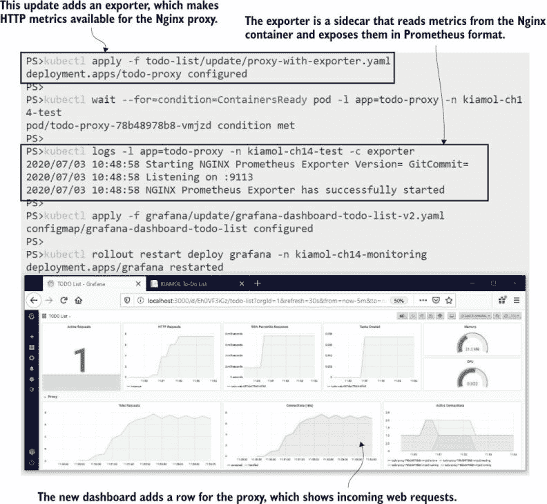

图 14.8 使用导出器收集代理指标为仪表板增加了另一个细节级别。

从 Nginx 获取更多信息的想法很好——比如响应中 HTTP 状态码的分解——但导出器只能传递来自源系统的信息，对于 Nginx 来说这并不多。其他导出器提供了更多的细节，但您需要集中仪表板以显示关键指标。超过十几项可视化后，仪表板会变得令人不知所措，而且如果它不能一眼看出有用的信息，那么它的工作效果就不太好了。

需要添加到待办事项仪表板的一个更多组件是：Postgres 数据库。Postgres 在数据库内部存储各种有用的信息，包括表和函数，导出器运行查询以提供其指标端点。Postgres 导出器的设置与我们在 Nginx 中看到的模式相同。在这种情况下，边车配置为通过 localhost 访问 Postgres，使用与 Postgres 容器用于管理员密码相同的 Kubernetes Secret。我们将对应用程序仪表板进行最终更新，以显示导出器中的关键数据库指标。

现在尝试一下 更新数据库部署规范，添加 Postgres 导出器作为侧车容器。然后更新待办事项列表仪表板，添加一行以显示数据库性能。

```
# add the exporter sidecar to Postgres:
kubectl apply -f todo-list/update/db-with-exporter.yaml

# wait for the new Pod to start:
kubectl wait --for=condition=ContainersReady pod -l app=todo-db -n kiamol-ch14-test

# print the logs from the exporter:
kubectl logs -l app=todo-db -n kiamol-ch14-test -c exporter

# update the dashboard and restart Grafana:
kubectl apply -f grafana/update/grafana-dashboard-todo-list-v3.yaml
kubectl rollout restart deploy grafana -n kiamol-ch14-monitoring
```

我在图 14.9 中放大并向下滚动，以便您可以看到新的可视化，但整个仪表板在全屏模式下观看非常愉快。单页显示有多少流量进入代理，应用程序工作有多努力，用户实际上在做什么，以及数据库内部发生了什么。您可以通过客户端库和导出器在您自己的应用程序中获得相同级别的详细程度，而这只需要几天的工作。

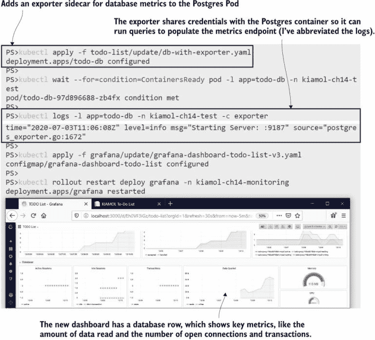

图 14.9 数据库导出器记录有关数据活动的指标，这些指标为仪表板增添了细节。

导出器用于向没有 Prometheus 支持的应用程序添加指标。如果您的目标是将一组现有应用程序迁移到 Kubernetes，那么您可能没有开发团队添加自定义指标的奢侈。对于这些应用程序，您可以使用 Prometheus 黑盒导出器，将某些监控优于无监控的方法推向极致。

黑盒导出器可以在侧车容器中运行，并向您的应用程序容器发送 TCP 或 HTTP 请求，同时提供一个基本的指标端点来表示应用程序是否正在运行。这种方法类似于在 Pod 规范中添加容器探针，但黑盒导出器仅用于信息目的。如果您觉得 Kubernetes 的自愈机制，如本书中使用的随机数 API，不适合应用程序，您可以通过运行仪表板来显示应用程序的状态。

现在尝试一下 部署随机数 API，使用黑盒导出器和最简单的 Grafana 仪表板。您可以通过重复使用 API 来破坏它，然后重置它使其再次工作，仪表板会跟踪状态。

```
# deploy the API to the test namespace:
kubectl apply -f numbers/

# add the new dashboard to Grafana:
kubectl apply -f grafana/update/numbers-api/

# get the URL for the API:
kubectl get svc numbers-api -o jsonpath='#app
 - http://{.status.loadBalancer.ingress[0].*}:8016/rng' -n kiamol-ch14-test

# use the API by visiting the /rng URL
# it will break after three calls; 
# then visit /reset to fix it

# get the dashboard URL, and load it in Grafana:
kubectl get svc grafana -o jsonpath='# dashboard
 - http://{.status.loadBalancer.ingress[0].*}:3000/d/Tb6isdMMk'
 -n kiamol-ch14-monitoring
```

随机数 API 没有 Prometheus 支持，但将黑盒导出器作为侧车容器运行可以提供对应用程序状态的基本洞察。图 14.10 显示了一个大部分为空的仪表板，但两个可视化显示了应用程序在健康和不健康状态之间切换时的历史趋势。

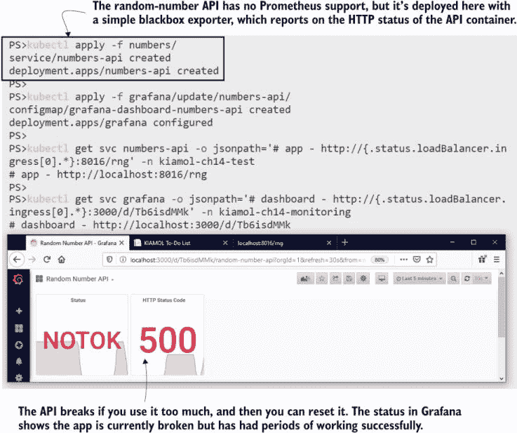

图 14.10 即使是一个简单的仪表板也是有用的。这显示了 API 的当前和历史状态。

随机数 API 的 Pod 规范与待办事项应用程序中的 Nginx 和 Postgres 类似：黑盒导出器配置为附加容器，并指定了指标暴露的端口。Pod 注解自定义了指标 URL 的路径，因此当 Prometheus 从侧车抓取指标时，它会调用黑盒导出器，该导出器会检查 API 是否对 HTTP 请求做出响应。

现在我们有三个不同应用的仪表板，它们的详细程度不同，因为应用程序组件与它们收集的数据不一致。但所有组件都有一个共同点：它们都在 Kubernetes 上的容器中运行。在下一节中，您将学习如何通过配置 Prometheus 从集群本身收集平台指标来获取更详细的级别。

## 14.4 监控容器和 Kubernetes 对象

Prometheus 与 Kubernetes 集成以进行服务发现，但它不会从 API 收集任何指标。您可以从两个额外的组件中获取有关 Kubernetes 对象和容器活动的指标：*cAdvisor*，一个谷歌开源项目，以及*kube-state-metrics*，它是 GitHub 上更广泛的 Kubernetes 组织的一部分。这两个组件都在集群中以容器的形式运行，但它们从不同的来源收集数据。cAdvisor 从容器运行时收集指标，因此它作为每个节点的 Pod 上的 DaemonSet 运行以报告该节点的容器。kube-state-metrics 查询 Kubernetes API，因此它可以在任何节点上作为具有单个副本的 Deployment 运行。

现在尝试一下：部署 cAdvisor 和 kube-state-metrics 的指标收集器，并更新 Prometheus 配置以将它们包括为抓取目标。

```
# deploy cAdvisor and kube-state-metrics:
kubectl apply -f kube/ 

# wait for cAdvisor to start:
kubectl wait --for=condition=ContainersReady pod -l app=cadvisor -n kube-system

# update the Prometheus config:
kubectl apply -f prometheus/update/prometheus-config-kube.yaml

# wait for the ConfigMap to update in the Pod:
sleep 30 

# use an HTTP POST to reload the Prometheus configuration:
curl -X POST $(kubectl get svc prometheus
 -o jsonpath='http://{.status.loadBalancer.ingress[0].*}:9090/-/reload' -n kiamol-ch14-monitoring)

# browse to the Prometheus UI--in the Graph page you’ll see
# metrics listed covering containers and Kubernetes objects
```

在这个练习中，您将看到 Prometheus 正在收集数千个新的指标。原始数据包括每个容器使用的计算资源以及每个 Pod 的状态。我的输出显示在图 14.11 中。当您运行此练习时，您可以在 Prometheus UI 中的“目标”页面检查以确认新的目标是正在被抓取的。Prometheus 不会自动重新加载配置，因此在此练习中，有一个延迟以给 Kubernetes 时间传播 ConfigMap 更新，而 `curl` 命令强制 Prometheus 重新加载配置。

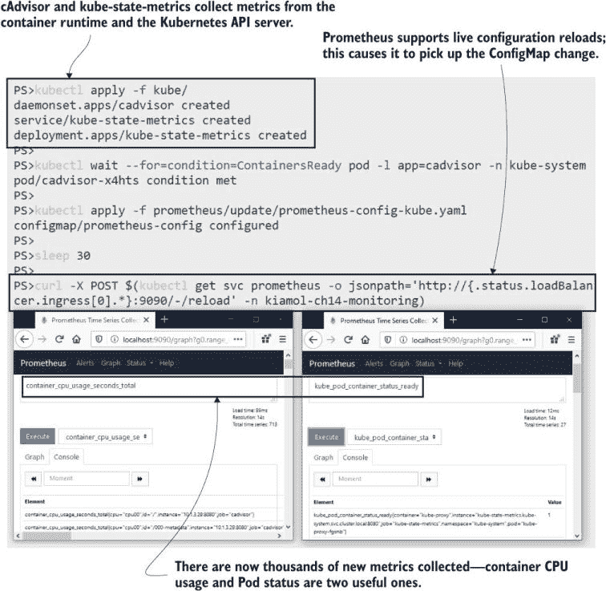

图 14.11 新指标显示集群和容器级别的活动。

您刚刚部署的更新后的 Prometheus 配置包括两个新的作业定义，如列表 14.6 所示。kube-state-metrics 使用服务的完整 DNS 名称指定为静态目标。单个 Pod 收集所有指标，因此这里没有负载均衡问题。cAdvisor 使用 Kubernetes 服务发现来找到每个 DaemonSet 中的每个 Pod，在多节点集群中每个节点将提供一个目标。

列表 14.6 prometheus-config-kube.yaml，Prometheus 中的新抓取目标

```
- job_name: 'kube-state-metrics'        # Kubernetes metrics use a 
  static_configs:                       # static configuration with DNS.
  - targets:
         - kube-state-metrics.kube-system.svc.cluster.local:8080
      - kube-state-metrics.kube-system.svc.cluster.local:8081

- job_name: 'cadvisor'                   # Container metrics use
  kubernetes_sd_configs:                 # Kubernetes service discovery
  - role: pod                            # to find all the DaemonSet
  relabel_configs:                       # Pods, by namespace and label.
    - source_labels: 
        - __meta_kubernetes_namespace
        - __meta_kubernetes_pod_labelpresent_app
        - __meta_kubernetes_pod_label_app
      action: keep
      regex: kube-system;true;cadvisor
```

现在我们面临与随机数仪表板相反的问题：新的指标中信息量过多，因此如果平台仪表板要发挥作用，它需要非常具有选择性。我已经准备了一个示例仪表板，这是一个很好的起点。它包括集群当前资源使用情况和所有可用的资源数量，以及按命名空间进行的一些高级分解和节点健康警告指标。

现在试试看 部署一个关键集群指标的仪表板，并更新 Grafana 以加载新的仪表板。

```
# create the dashboard ConfigMap and update Grafana:
kubectl apply -f grafana/update/kube/

# wait for Grafana to load:
kubectl wait --for=condition=ContainersReady pod -l app=grafana -n kiamol-ch14-monitoring

# get the URL for the new dashboard:
kubectl get svc grafana -o jsonpath='http://{.status.loadBalancer.ingress[0].*}:3000/d/oWe9aYxmk' -n kiamol-ch14-monitoring

# browse to the dashboard
```

这又是一个旨在大屏幕上的仪表板，所以图 14.12 中的截图并不能公正地展示它。当您运行练习时，您可以更仔细地检查它。最上面一行显示内存使用情况，中间一行显示 CPU 使用情况，最下面一行显示 Pod 容器的状态。

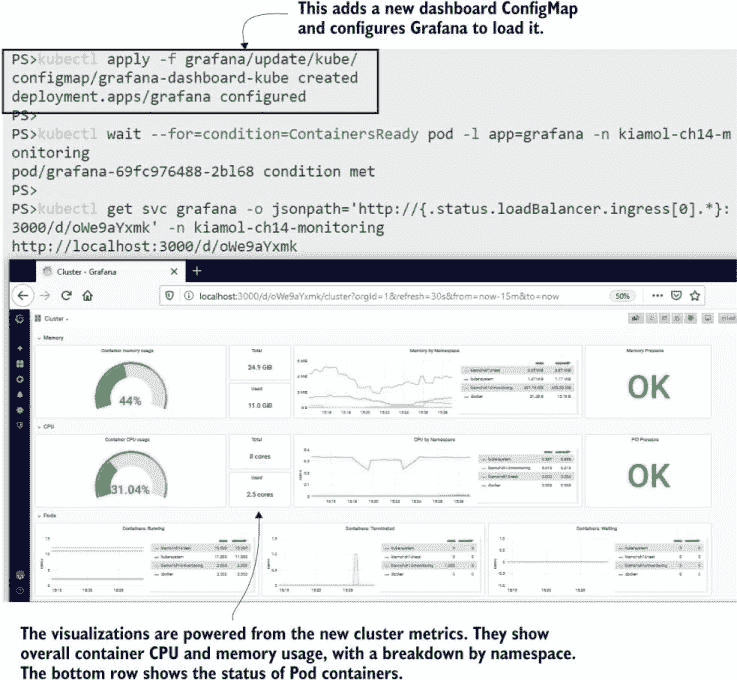

图 14.12 另一个小截图——在自己的集群中运行练习以查看全尺寸。

这样的平台仪表板相当底层——它实际上只是显示您的集群是否接近饱和点。驱动这个仪表板的查询将作为警报更有用，警告您资源使用是否失控。Kubernetes 有一些有用的压力指标。仪表板中显示了内存压力和进程压力值，以及磁盘压力指示器。这些值很重要，因为如果一个节点承受计算压力，它可能会终止 Pod 容器。这些将是很好的警报指标，因为如果您达到那个阶段，您可能需要叫人来帮助集群恢复健康。

平台指标还有另一个用途：为应用程序仪表板添加细节，其中应用程序本身没有提供足够详细的指标。平台仪表板显示了整个集群的计算资源使用情况汇总，但 cAdvisor 在容器级别收集它。kube-state-metrics 也是如此，您可以为特定的工作负载过滤指标，将平台信息添加到应用程序仪表板中。我们将在本章中做一个最终的仪表板更新，将平台细节添加到随机数应用程序中。

现在试试看 更新随机数 API 的仪表板以添加平台指标。这只是一个 Grafana 更新；应用程序本身或 Prometheus 没有发生变化。

```
# update the dashboard:
kubectl apply -f grafana/update/grafana-dashboard-numbers-api-v2.yaml

# restart Grafana so it reloads the dashboard:
kubectl rollout restart deploy grafana -n kiamol-ch14-monitoring

# wait for the new Pod to start:
kubectl wait --for=condition=ContainersReady pod -l app=grafana -n kiamol-ch14-monitoring

# browse back to the random-number API dashboard
```

如图 14.13 所示，仪表板仍然是基本的，但至少我们现在有一些细节可以帮助关联任何问题。如果 HTTP 状态码显示为 503，我们可以快速查看 CPU 是否也在激增。如果 Pod 标签包含应用程序版本（它们应该包含），我们可以确定哪个应用程序版本遇到了问题。

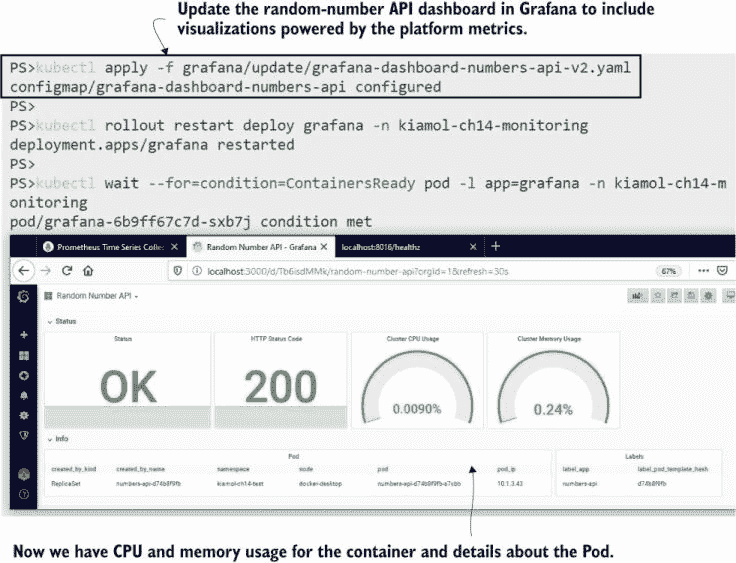

图 14.13 通过容器和 Pod 指标增强基本健康状态增加了相关性。

监控还有很多内容我没有在这里涵盖，但现在你已经对 Kubernetes 和 Prometheus 如何协同工作有了坚实的基础。你所缺少的主要是服务器级别的指标收集和配置警报。服务器指标提供如磁盘和网络使用等数据。你通过在节点上直接运行导出器来收集它们（使用 Linux 服务器的 Node Exporter 和 Windows 服务器的 Windows Exporter），并使用服务发现来将节点添加为抓取目标。Prometheus 有一个复杂的警报系统，它使用 PromQL 查询来定义警报规则。你配置警报，以便当规则被触发时，Prometheus 会发送电子邮件、创建 Slack 消息或通过 PagerDuty 发送通知。

我们将通过查看 Prometheus 在 Kubernetes 中的完整架构，并深入研究哪些部分需要定制工作以及努力的方向来结束本章。

## 14.5 理解你在监控上的投资

当你走出核心 Kubernetes 并进入生态系统时，你需要了解你所依赖的项目在五年后、一年后，或者在你所写的章节被印刷出来之前是否仍然存在。我在这本书中非常小心地只包括那些开源、使用广泛、有既定历史和治理模式的生态系统组件。图 14.14 中的监控架构使用的组件都符合这些标准。

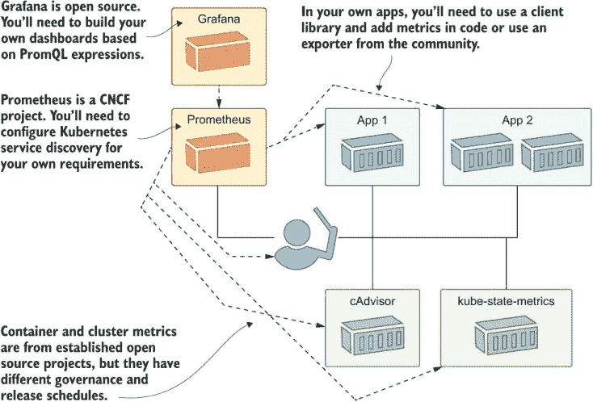

图 14.14 监控并非免费提供——它需要开发和依赖开源项目。

我提出这一点是因为向 Prometheus 的迁移将涉及开发工作。你需要记录你应用程序中的有趣指标，以便使你的仪表板真正有用。你应该对自己的投资有信心，因为 Prometheus 是监控容器化应用程序最受欢迎的工具，该项目是 CNCF 的第二批毕业项目——在 Kubernetes 本身之后。还有工作正在进行中，将 Prometheus 指标格式纳入一个开放标准（称为 OpenMetrics），这样其他工具就能读取以 Prometheus 格式公开的应用程序指标。

你包含在那些指标中的内容将取决于你应用程序的性质，但一个好的通用方法是从谷歌的站点可靠性工程实践指南中获取指导。通常，将四个“黄金信号”添加到你的应用程序指标中相当简单：延迟、流量、错误和饱和度。（电子书的附录 B 介绍了这些在 Prometheus 中的样子。）但真正的价值在于从用户体验的角度思考应用程序性能。一个显示你的数据库磁盘使用量高的图表并不能告诉你太多，但如果你能看到由于你的网站结账页面加载时间过长，导致高比例的用户无法完成购买，那么这一点就值得了解。

现在监控部分就到这里，我们可以清理集群，为实验室做准备。

现在尝试一下：删除本章的命名空间，以及系统命名空间中创建的对象。

```
kubectl delete ns -l kiamol=ch14
kubectl delete all -n kube-system -l kiamol=ch14
```

## 14.6 实验室

本章的另一个调查实验室。在实验室文件夹中，有一组用于稍微简单一些的 Prometheus 部署和 Elasticsearch 基础部署的清单。目标是让 Elasticsearch 将指标流到 Prometheus。以下是详细信息：

+   Elasticsearch 不提供自己的指标，因此你需要找到一个为你完成这一功能的组件。

+   Prometheus 的配置会告诉你需要使用哪个命名空间来部署 Elasticsearch 以及需要用于指标路径的注解。

+   你应该在 Elasticsearch Pod 规范中包含一个版本标签，这样 Prometheus 就会捕获它并将其添加到指标标签中。

你需要查阅 Prometheus 的文档来开始，这应该会指引你的方向。我的解决方案在 GitHub 上，你可以像往常一样在以下位置检查：[`github.com/sixeyed/kiamol/blob/master/ch14/lab/README.md`](https://github.com/sixeyed/kiamol/blob/master/ch14/lab/README.md)。
