# 15 使用入口管理入站流量

服务将网络流量引入 Kubernetes，你可以有多个具有不同公共 IP 地址的 LoadBalancer 服务，以便将你的 Web 应用程序提供给全世界。这样做会带来管理上的麻烦，因为这意味着为每个应用程序分配一个新的 IP 地址，并使用你的 DNS 提供商将地址映射到应用程序。将流量引导到正确的应用程序是一个路由问题，但你可以在 Kubernetes 内部管理它，使用*入口*。入口使用一组规则将域名和请求路径映射到应用程序，因此你可以为整个集群使用单个 IP 地址，并内部路由所有流量。

通过域名进行路由是一个老问题，通常使用*反向代理*来解决，Kubernetes 使用可插拔的入口架构。你定义路由规则作为标准资源，并部署你选择的反向代理来接收流量并执行规则。所有主要的反向代理都支持 Kubernetes，以及一种新的容器感知反向代理。它们都有不同的功能和操作模型，在本章中，你将了解到如何使用入口在集群中托管多个应用程序，其中最流行的是 Nginx 和 Traefik。

## 15.1 Kubernetes 如何使用入口路由流量

在这本书中，我们已经多次使用 Nginx 作为反向代理（据我统计有 17 次），但我们每次都是为单个应用程序使用它。在第六章中，我们有一个反向代理来缓存来自 Pi 应用程序的响应，在第十三章中，我们还有一个用于随机数 API 的反向代理。入口将反向代理移至中心角色，作为名为*入口控制器*的组件运行，但方法是一样的：代理从负载均衡器服务接收外部流量，并使用集群 IP 服务从应用程序获取内容。图 15.1 显示了架构。

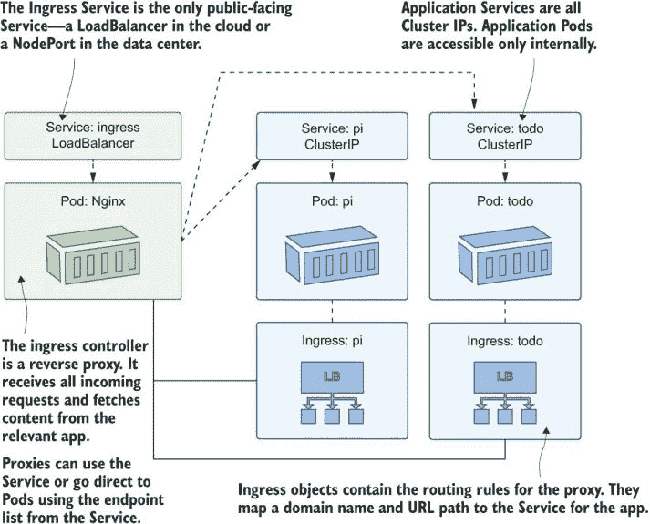

图 15.1 入口控制器是集群的入口点，根据入口规则路由流量。

在这个图中，重要的是入口控制器，它是一个可插拔的反向代理——它可以是 Nginx、HAProxy、Contour 和 Traefik 等十几种选项之一。入口对象以通用方式存储路由规则，控制器将这些规则输入到代理中。代理有不同的功能集，入口规范并不试图模拟每个可能的选择，因此控制器通过注解添加对这些功能的支持。你将在本章中了解到，路由和 HTTPS 支持的核心功能简单易用，但复杂性在于入口控制器部署及其附加功能。

我们将从运行第二章中提到的基本的 Hello, World 网页应用程序开始，将其作为一个内部组件，使用 ClusterIP 服务，并使用 Nginx 入口控制器来路由流量。

现在尝试一下 运行 Hello, World 应用程序，并确认它只能在集群内部或通过 kubectl 中的`port-forward`在外部访问。

```
# switch to this chapter’s folder:
cd ch15

# deploy the web app:
kubectl apply -f hello-kiamol/

# confirm the Service is internal to the cluster:
kubectl get svc hello-kiamol

# start a port-forward to the app:
kubectl port-forward svc/hello-kiamol 8015:80

# browse to http://localhost:8015
# then press Ctrl-C/Cmd-C to exit the port-forward
```

对于该应用程序的部署或服务规范没有新内容——没有特殊的标签或注解，没有你已经使用过的新字段。你可以在图 15.2 中看到服务没有外部 IP 地址，我只能在运行`port-forward`时访问应用程序。

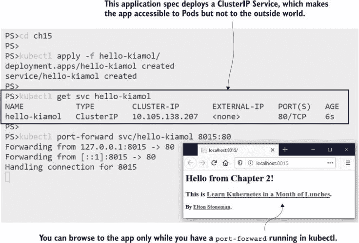

图 15.2 集群 IP 服务使应用程序在内部可用——它可以通过入口公开。

要使用入口规则使应用程序可用，我们需要一个入口控制器。控制器管理其他对象。你知道部署管理副本集，副本集管理 Pod。入口控制器略有不同；它们在标准 Pod 中运行并监视入口对象。当它们看到任何更改时，它们会更新代理中的规则。我们将从 Nginx 入口控制器开始，它是更广泛 Kubernetes 项目的一部分。控制器有一个生产就绪的 Helm 图表，但我使用了一个更简单的部署。即便如此，在清单中还有一些我们尚未覆盖的安全组件，但我现在不会详细介绍。（如果需要调查，YAML 中有注释。）

现在尝试一下 部署 Nginx 入口控制器。这使用服务中的标准 HTTP 和 HTTPS 端口，因此你需要在你的机器上开启 80 和 443 端口。

```
# create the Deployment and Service for the Nginx ingress controller:
kubectl apply -f ingress-nginx/

# confirm the service is publicly available:
kubectl get svc -n kiamol-ingress-nginx

# get the URL for the proxy:
kubectl get svc ingress-nginx-controller
 -o jsonpath='http://{.status.loadBalancer.ingress[0].*}' -n kiamol-ingress-nginx

# browse to the URL--you’ll get an error
```

当你运行这个练习时，当你浏览时你会看到一个 404 错误页面。这证明了服务正在接收流量并将其定向到入口控制器，但还没有任何路由规则，所以 Nginx 没有内容可以显示，并返回默认的未找到页面。我的输出显示在图 15.3 中，你可以看到服务正在使用标准的 HTTP 端口。

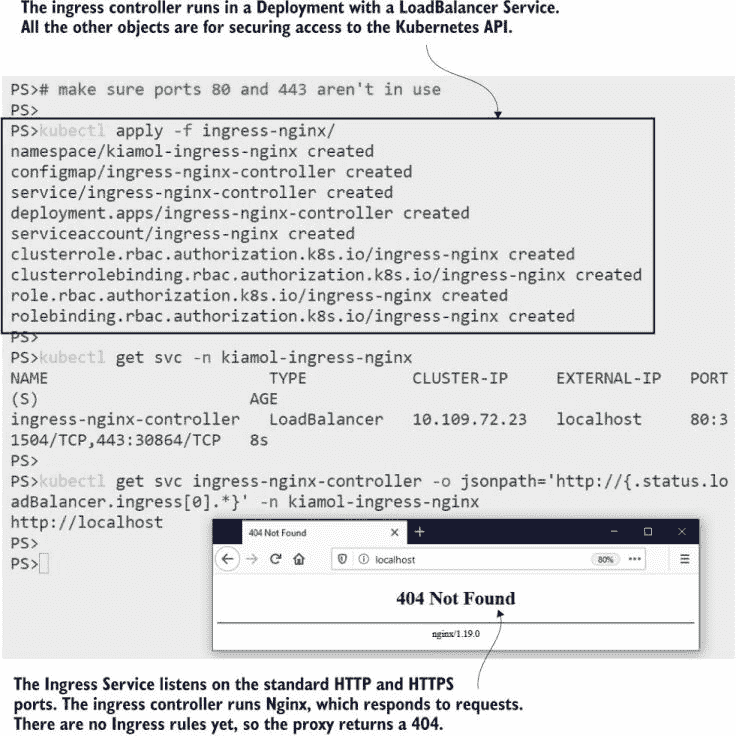

图 15.3 入口控制器接收传入的流量，但它们需要路由规则来知道如何处理它。

现在我们有一个运行的应用程序和一个入口控制器，我们只需要部署一个带有路由规则的入口对象，告诉控制器每个传入请求应使用哪个应用程序服务。列表 15.1 显示了入口对象的简单规则，它将把每个进入集群的请求路由到 Hello, World 应用程序。

列表 15.1 localhost.yaml，Hello, World 应用程序的路由规则

```
apiVersion: networking.k8s.io/v1beta1  # Beta API versions mean the spec
kind: Ingress                          # isn’t final and could change.
metadata:
  name: hello-kiamol
spec:
  rules:                                  
  - http:                              # Ingress is only for HTTP/S traffic
      paths:
      - path: /                        # Maps every incoming request
        backend:                       # to the hello-kiamol Service
          serviceName: hello-kiamol
          servicePort: 80
```

入口控制器正在监视新的和更改的入口对象，因此当你部署任何对象时，它将规则添加到 Nginx 配置中。在 Nginx 术语中，它将设置一个代理服务器，其中 hello-kiamol 服务是上游——内容的来源——并且它将为传入请求到根路径提供该内容。

现在尝试一下 创建发布 Hello, World 应用程序的入口规则。

```
# deploy the rule:
kubectl apply -f hello-kiamol/ingress/localhost.yaml

# confirm the Ingress object is created:
kubectl get ingress

# refresh your browser from the previous exercise
```

嗯，这很简单——在 Ingress 对象中将路径映射到应用的后端服务，控制器会处理其他所有事情。我在图 15.4 中的输出显示了本地地址，之前返回了 404 错误，现在返回了完整的 Hello, World 应用。

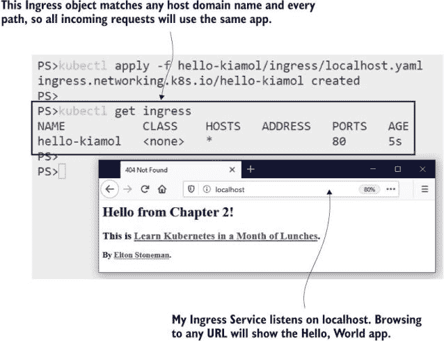

图 15.4 Ingress 对象规则将 Ingress 控制器链接到应用服务。

Ingress 通常是在集群中的集中式服务，如日志记录和监控。管理员团队可能会部署和管理 Ingress 控制器，而每个产品团队则拥有路由流量到其应用的 Ingress 对象。这个过程可能会产生冲突——Ingress 规则不必是唯一的，一个团队的更新可能会导致另一个团队的流量被重定向到其他应用。实际上这种情况不会发生，因为这些应用将托管在不同的域名上，并且 Ingress 规则将包括一个域名以限制其作用范围。

## 15.2 使用 Ingress 规则路由 HTTP 流量

Ingress 只适用于 Web 流量——HTTP 和 HTTPS 请求——因为它需要使用请求中指定的路由来匹配后端服务。HTTP 请求中的路由包含两部分：主机和路径。主机是域名，如 `www.manning.com`，路径是资源的位置，如 `/dotd` 是每日交易页面的位置。列表 15.2 显示了对 Hello, World Ingress 对象的更新，它使用特定的主机名。现在，只有当传入请求是为主机 `hello.kiamol.local` 时，路由规则才会生效。

列表 15.2 hello.kiamol.local.yaml，指定 Ingress 规则的主域名

```
spec:
  rules:
  - host: hello.kiamol.local            # Restricts the scope of the
    http:                               # rules to a specific domain
      paths:                           
      - path: /                         # All paths in that domain will
        backend:                        # be fetched from the same Service.
          serviceName: hello-kiamol
          servicePort: 80
```

当您部署此代码时，您将无法访问该应用，因为域名 `hello.kiamol.local` 不存在。Web 请求通常从公共 DNS 服务器查找域名的 IP 地址，但所有计算机也有它们自己的本地列表，即 *hosts 文件*。在下一个练习中，您将部署更新的 Ingress 对象并在您的本地 hosts 文件中注册域名——您需要在终端会话中拥有管理员权限。

现在尝试一下 编辑 hosts 文件是受限的。您需要在 Windows 的终端会话中使用“以管理员身份运行”选项，并且使用 `Set-ExecutionPolicy` 命令启用脚本。在 Linux 或 macOS 上，准备好输入您的管理员（sudo）密码。

```
# add domain to hosts--on Windows:
./add-to-hosts.ps1 hello.kiamol.local ingress-nginx

# OR on Linux/macOS:
chmod +x add-to-hosts.sh && ./add-to-hosts.sh hello.kiamol.local ingress-nginx

# update the Ingress object, adding the host name:
kubectl apply -f hello-kiamol/ingress/hello.kiamol.local.yaml

# confirm the update:
kubectl get ingress

# browse to http://hello.kiamol.local
```

在这个练习中，现有的 Ingress 对象被更新，因此仍然只有一个路由规则供 Ingress 控制器映射。现在这个规则被限制为显式的域名。您可以在图 15.5 中看到，对 `hello.kiamol.local` 的请求返回了应用，我还浏览到了本地的 Ingress 控制器，它返回了一个 404 错误，因为没有为 localhost 域设置规则。

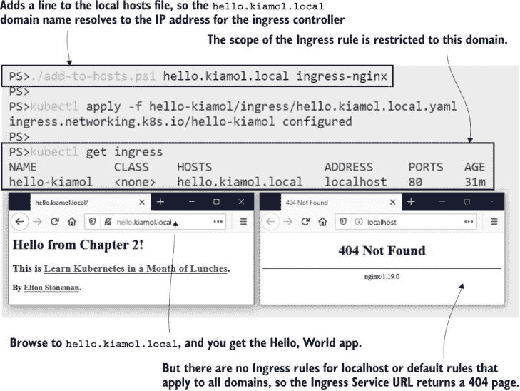

图 15.5 您可以使用 Ingress 规则通过域名发布应用，并通过编辑您的 hosts 文件在本地使用它们。

路由是基础设施级别的关注点，但就像我们在本书本节中看到的其他共享服务一样，它运行在轻量级容器中，这样你就可以在开发、测试和生产环境中使用完全相同的设置。这让你可以在你的非生产集群中运行多个应用程序，使用友好的域名，而无需使用不同的端口——ingress 控制器的 Service 使用每个应用程序的标准 HTTP 端口。

如果你想在实验室环境中运行具有不同域的多个应用程序，你需要调整你的主机文件。通常，所有域名都会解析到 127.0.0.1，这是你的机器的本地地址。组织可能在测试环境中运行自己的 DNS 服务器，因此任何人都可以从公司网络访问 `hello.kiamol.test`，并且它将解析到数据中心运行测试集群的 IP 地址。然后，在生产环境中，DNS 解析来自公共 DNS 服务，因此 `hello.kiamol.net` 解析到在云中运行的 Kubernetes 集群。

你可以在 Ingress 规则中组合主机名和路径，以向你的应用程序展示一组一致的地址，尽管你可能在后端使用不同的组件。你可能有一个 REST API 和一个网站在不同的 Pod 中运行，并且你可以使用 Ingress 规则使 API 在子域名（`api.rng.com`）或主域名上的路径（`rng.com/api`）上可用。列表 15.3 展示了来自第九章的简单版本化 Web 应用程序的 Ingress 规则，其中应用程序的两个版本都从一个域名中可用。

列表 15.3 vweb/ingress.yaml，带有主机名和路径的 Ingress 规则

```
apiVersion: networking.k8s.io/v1beta1 
kind: Ingress
metadata:
  name: vweb                             # Configures a specific feature
  annotations:                           # in Nginx 
    nginx.ingress.kubernetes.io/rewrite-target: /
spec:
  rules:
  - host: vweb.kiamol.local              # All rules apply to this domain.
    http:
      paths:
      - path: /                          # Requests to the root path are
        backend:                         # proxied from the version 2 app.
          serviceName: vweb-v2
          servicePort: 80
      - path: /v1                        # Requests to the /v1 path are
        backend:                         # proxied from the version 1 app.
          serviceName: vweb-v1
          servicePort: 80
```

路径建模增加了复杂性，因为你提供了一个虚假的 URL，它需要修改以匹配服务中的真实 URL。在这种情况下，ingress 控制器将响应对 `http://vweb.kiamol.local/v1` 的请求，并从 vweb-v1 服务获取内容。但是应用程序在 `/v1` 上没有任何内容，因此代理需要重写传入的 URL——这就是列表 15.3 中注释所做的工作。这是一个基本示例，它忽略了请求中的路径，并且始终使用后端的根路径。你不能使用 Ingress 规范表达 URL 重写，因此它需要从 ingress 控制器那里获得自定义支持。一个更现实的重写规则将使用正则表达式将请求的路径映射到目标路径。

我们将部署这个简单的版本以避免使用正则表达式，并查看 ingress 控制器如何使用路由规则来识别后端服务并修改请求路径。

现在尝试一下 部署一个新的应用程序，并使用新的 Ingress 规则，然后向你的主机文件中添加一个新的域名，以查看 ingress 控制器从同一域名服务多个应用程序。

```
# add the new domain name--on Windows:
./add-to-hosts.ps1 vweb.kiamol.local ingress-nginx

# OR on Linux/macOS:
./add-to-hosts.sh vweb.kiamol.local ingress-nginx

# deploy the app, Service, and Ingress:
kubectl apply -f vweb/

# confirm the Ingress domain:
kubectl get ingress

# browse to http://vweb.kiamol.local 
# and http://vweb.kiamol.local/v1
```

在图 15.6 中，你可以看到两个不同的应用在同一域名下可用，通过请求路径在不同的组件之间进行路由，这些组件是本练习中应用程序的不同版本。

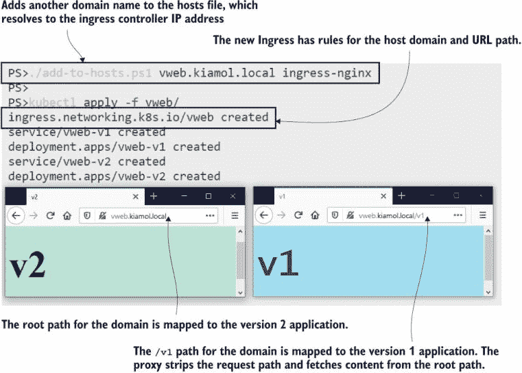

图 15.6 展示了主机名和路径上的 Ingress 路由，它在同一域名下呈现多个应用。

将路由规则映射是发布新应用到您的 Ingress 控制器的最复杂部分，但它确实给了您很多控制权。Ingress 规则是您应用的公共面孔，您可以使用它们来组合多个组件——或者限制对功能的访问。在本节中，我们看到了如果应用有用于容器探针的健康端点和用于 Prometheus 收集的度量端点，它们在 Kubernetes 中工作得更好，但那些不应该公开可用。您可以使用 Ingress 来控制这一点，使用精确路径映射，因此只有明确列出的路径才在集群外部可用。

列表 15.4 展示了待办事项应用的示例。由于这种方法的一个缺点是您需要指定要发布的每个路径，因此未指定的任何路径都将被阻止。

列表 15.4 ingress-exact.yaml，使用精确路径匹配来限制访问

```
rules:
  - host: todo.kiamol.local
    http:
      paths:
      - pathType: Exact          # Exact matching means only the /new
        path: /new               # path is matched--there are other 
        backend:                 # rules for the /list and root paths.
          serviceName: todo-web
          servicePort: 80
      - pathType: Prefix         # Prefix matching means any path that 
        path: /static            # starts with /static will be mapped,
        backend:                 # including subpaths like /static/app.css.
          serviceName: todo-web
          servicePort: 80
```

待办事项应用有几个不应该在集群外部可用的路径——以及 `/metrics`，还有一个列出所有应用程序配置的 `/config` 端点和诊断页面。这些路径都没有包含在新的 Ingress 规范中，并且我们可以看到当应用规则时，它们实际上被阻止了。PathType 字段是 Ingress 规范的后期添加，因此您的 Kubernetes 集群至少需要运行版本 1.18；否则，您将在本练习中遇到错误。

现在尝试一下：部署一个允许所有访问的 Ingress 规范的待办事项应用，然后使用精确路径匹配来更新它，并确认敏感路径不再可用。

```
# add a new domain for the app--on Windows:
./add-to-hosts.ps1 todo.kiamol.local ingress-nginx

# OR on Linux/macOS:
./add-to-hosts.sh todo.kiamol.local ingress-nginx

# deploy the app with an Ingress object that allows all paths:
kubectl apply -f todo-list/

# browse to http://todo.kiamol.local/metrics

# update the Ingress with exact paths:
kubectl apply -f todo-list/update/ingress-exact.yaml

# browse again--the app works, but metrics and diagnostics blocked
```

当您运行此练习时，您将看到当部署更新的 Ingress 规则时，所有敏感路径都被阻止。我的输出如图 15.7 所示。这不是一个完美的解决方案，但您可以将您的 Ingress 控制器扩展以显示友好的 404 错误页面，而不是 Nginx 的默认页面。（Docker 有一个很好的例子：尝试 [`www.docker.com/not-real-url`](https://www.docker.com/not-real-url)。）应用仍然显示诊断页面的菜单，因为这不是移除页面的应用设置；它发生在处理过程的更早阶段。

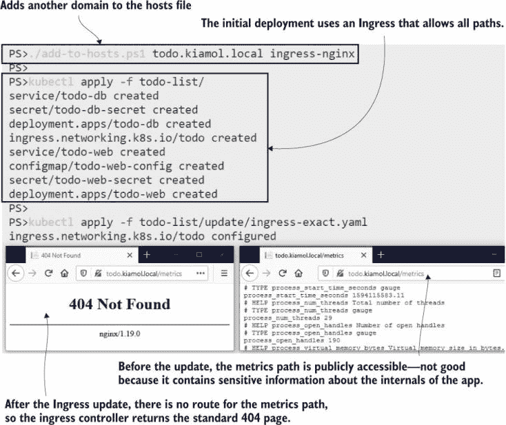

图 15.7 Ingress 规则中的精确路径匹配可用于阻止对功能的访问。

Ingress 规则和 Ingress 控制器之间的分离使得比较不同的代理实现并查看哪个提供了您满意的特性和可用性变得容易。但是，它也带来一个警告，因为没有一个严格的 Ingress 控制器规范，并且不是每个控制器都以相同的方式实现 Ingress 规则。一些控制器忽略了 PathType 字段，因此如果您依赖于它来构建具有精确路径的访问列表，您可能会发现如果切换到不同的 Ingress 控制器，您的网站将变成一个可以访问所有区域的网站。

Kubernetes 确实允许你运行多个入口控制器，在一个复杂的环境中，你可能需要这样做，为不同的应用提供不同的功能集。

## 15.3 比较入口控制器

入口控制器分为两类：反向代理，它们存在已久，在网络层工作，使用主机名获取内容；以及现代代理，它们具有平台意识，可以与其他服务集成（云控制器可以配置外部负载均衡器）。选择它们取决于功能集和你的技术偏好。如果你与 Nginx 或 HAProxy 有既定的关系，你可以在 Kubernetes 中继续使用它们。或者，如果你与 Nginx 或 HAProxy 有既定的关系，你可能很高兴尝试一个更轻量级、更现代的选项。

你的入口控制器成为你集群中所有应用的唯一公共入口点，所以它是集中处理常见问题的好地方。所有控制器都支持 SSL 终止，因此代理提供了安全层，你为所有应用都获得了 HTTPS。大多数控制器支持 Web 应用防火墙，因此你可以在代理层提供对 SQL 注入和其他常见攻击的保护。一些控制器具有特殊功能——我们之前已经使用 Nginx 作为缓存代理，你还可以在入口级别使用它进行缓存。

现在试试看：使用入口部署π应用，然后更新入口对象，使π应用利用入口控制器中的 Nginx 缓存。

```
# add the Pi app domain to the hosts file--Windows:
./add-to-hosts.ps1 pi.kiamol.local ingress-nginx

# OR Linux/macOS:
./add-to-hosts.sh pi.kiamol.local ingress-nginx

# deploy the app and a simple Ingress:
kubectl apply -f pi/

# browse to http://pi.kiamol.local?dp=30000 
# refresh and confirm the page load takes the same time

# deploy an update to the Ingress to use caching:
kubectl apply -f pi/update/ingress-with-cache.yaml

# browse to the 30K Pi calculation again--the first 
# load takes a few seconds, but now a refresh will be fast
```

在这个练习中，你会发现入口控制器是集群中的一个强大组件。你只需指定新的入口规则，就可以给你的应用添加缓存——无需更新应用本身，也无需管理新的组件。唯一的要求是，你的应用返回的 HTTP 响应包含正确的缓存头信息，这本来就应该做到。图 15.8 展示了我的输出，其中π的计算耗时 1.2 秒，但响应来自入口控制器的缓存，所以页面几乎瞬间就加载完成了。

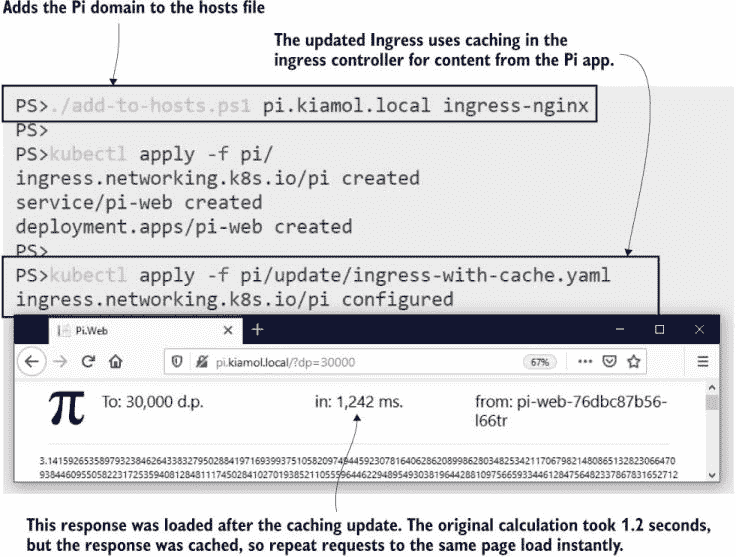

图 15.8 如果你的入口控制器支持响应缓存，那将是一个简单的性能提升。

并非每个入口控制器都提供响应缓存，所以这并不是入口规范的具体部分。任何自定义配置都是通过注解来应用的，控制器会捕获这些注解。列表 15.5 展示了你在上一个练习中应用的更新缓存设置的元数据。如果你熟悉 Nginx，你会认出这些是你在配置文件中通常设置的代理缓存设置。

列表 15.5 ingress-with-cache.yaml，使用入口控制器中的 Nginx 缓存

```
apiVersion: networking.k8s.io/v1beta1 
kind: Ingress
metadata:               # The ingress controller looks in annotations for
  name: pi              # custom configuration--this adds proxy caching.
  annotations:              
    nginx.ingress.kubernetes.io/proxy-buffering: "on" 
    nginx.ingress.kubernetes.io/configuration-snippet: |
      proxy_cache static-cache;
      proxy_cache_valid 10m;
```

Ingress 对象中的配置适用于其所有规则，但如果你需要为应用的不同部分提供不同的功能，你可以有多个 Ingress 规则。这对于需要从 ingress 控制器获得更多帮助以在扩展时正常工作的待办事项列表应用来说也是如此。如果服务有多个 Pod，ingress 控制器会使用负载均衡，但待办事项应用有一些跨站伪造保护，如果创建新项目的请求被发送到最初渲染新项目页面的不同应用容器，则会中断。许多应用都有这样的限制，代理使用*粘性会话*来解决这种限制。

粘性会话是 ingress 控制器将来自同一终端用户的请求发送到同一容器的机制，这对于组件不是无状态的旧应用来说通常是必需的。在可能的情况下应避免使用它，因为它限制了集群的负载均衡潜力，所以在待办事项列表应用中，我们希望将其限制在仅一个页面上。图 15.9 显示了我们将应用于应用不同部分的 Ingress 规则。

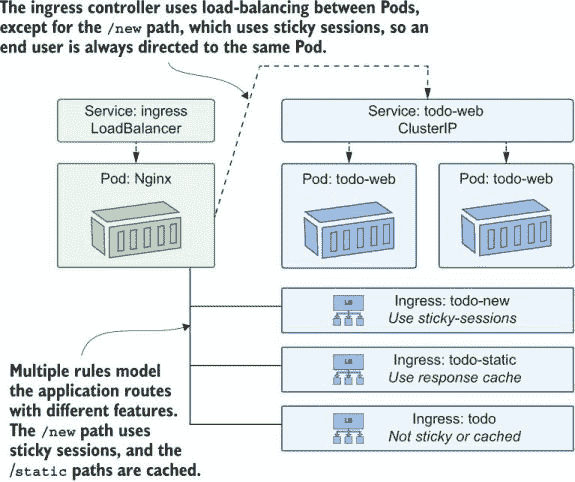

图 15.9 一个域可以使用多个 Ingress 规则进行映射，使用不同的代理功能。

我们现在可以将待办事项应用程序扩展以了解问题，然后应用更新的 Ingress 规则来修复它。

现在试试看 将待办事项应用程序扩展以确认在没有粘性会话的情况下它会崩溃，然后部署图 15.9 中的更新后的 Ingress 规则，并确认一切恢复正常。

```
# scale up--the controller load-balances between the Pods:
kubectl scale deploy/todo-web --replicas 3

# wait for the new Pods to start:
kubectl wait --for=condition=ContainersReady pod -l app=todo-web

# browse to http://todo.kiamol.local/new, and add an item
# this will fail and show a 400 error page

# print the application logs to see the issue:
kubectl logs -l app=todo-web --tail 1 --since 60s

# update Ingress to add sticky sessions:
kubectl apply -f todo-list/update/ingress-sticky.yaml

# browse again, and add a new item--this time it works
```

你可以在图 15.10 中看到我的输出，但除非你自己运行这个练习，否则你只能相信我的话，来确定哪个是“之前”的截图，哪个是“之后”的截图。增加应用副本的数量意味着来自 ingress 控制器的请求会被负载均衡，这会触发反伪造错误。应用粘性会话停止在新项目路径上的负载均衡，因此用户的请求总是被路由到同一个 Pod，伪造检查通过。

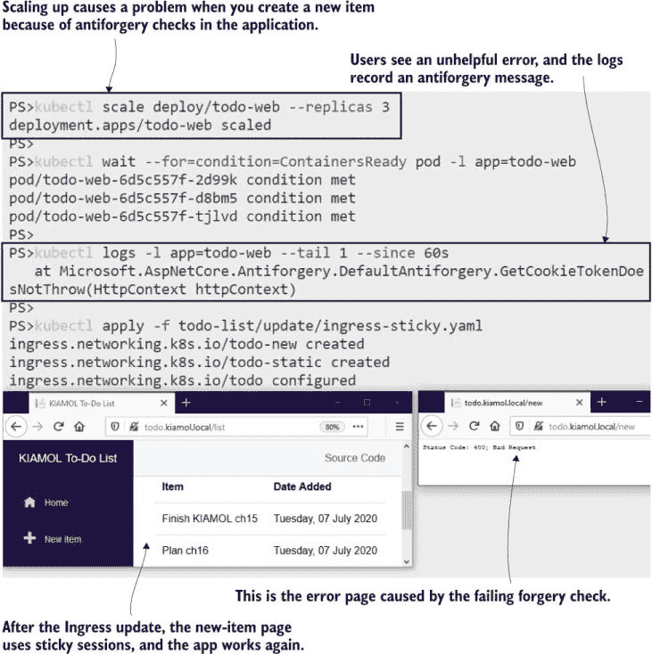

图 15.10 代理功能既可以解决问题，也可以提高性能。

待办事项应用的 Ingress 资源使用主机、路径和注解的组合来设置所有规则和要应用的功能。在幕后，控制器的任务是把这些规则转换成代理配置，在 Nginx 的情况下意味着编写一个配置文件。控制器有很多优化来最小化文件写入和配置重新加载的次数，但结果是，Nginx 配置文件非常复杂。如果你选择 Nginx ingress 控制器是因为你有 Nginx 经验，并且你愿意调试配置文件，那么你可能会遇到一个不愉快的惊喜。

现在试试看 Nginx 配置位于 ingress 控制器 Pod 中的文件中。在 Pod 中运行一个命令来检查文件的大小。

```
# run the wc command to see how many lines are in the file:
kubectl exec -n kiamol-ingress-nginx deploy/ingress-nginx-controller -- sh -c 'wc -l /etc/nginx/nginx.conf' 
```

图 15.11 显示我的 Nginx 配置文件中有多达 1,700 行。如果你运行 `cat` 而不是 `wc`，你会发现即使你熟悉 Nginx，内容也很奇怪。（控制器使用 Lua 脚本，因此可以在不重新加载配置的情况下更新端点。）

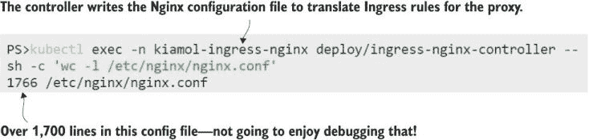

图 15.11 生成的 Nginx 配置文件并不是为了便于人类阅读的。

入口控制器拥有这种复杂性，但它是你解决方案的关键部分，你需要对你的代理的故障排除和调试方式感到满意。这时，你可能想要考虑一个平台感知的替代入口控制器，它不运行在复杂的配置文件中。我们将在本章中查看 Traefik——它是一个自 2015 年推出以来越来越受欢迎的开源代理。Traefik 理解容器，并从平台 API 构建其路由列表，原生支持 Docker 和 Kubernetes，因此它没有配置文件需要维护。

Kubernetes 支持在单个集群中运行多个入口控制器。它们将作为负载均衡器服务公开，因此在生产环境中，你可能为不同的入口控制器有不同的 IP 地址，你需要在 DNS 配置中将域名映射到入口。在我们的实验室环境中，我们将回到使用不同的端口。我们将首先部署 Traefik，为入口控制器服务使用自定义端口。

现在试试看：在集群中将 Traefik 部署为额外的入口控制器。

```
# create the Traefik Deployment, Service, and security resources: 
kubectl apply -f ingress-traefik/

# get the URL for the Traefik UI running in the ingress controller:
kubectl get svc ingress-traefik-controller -o jsonpath='http://{.status.loadBalancer.ingress[0].*}:8080' -n kiamol-ingress-traefik

# browse to the admin UI to see the routes Traefik has mapped
```

在那个练习中，你会看到 Traefik 有一个管理界面。它显示了代理正在使用的路由规则，并且随着流量的通过，它可以收集并显示性能指标。与 Nginx 配置文件相比，它要容易操作得多。图 15.12 展示了两个 *路由器*，这是 Traefik 管理的进入路由。如果你探索仪表板，你会看到那些不是入口路由；它们是 Traefik 自身仪表板的内部路由——Traefik 没有在集群中获取任何现有的入口规则。

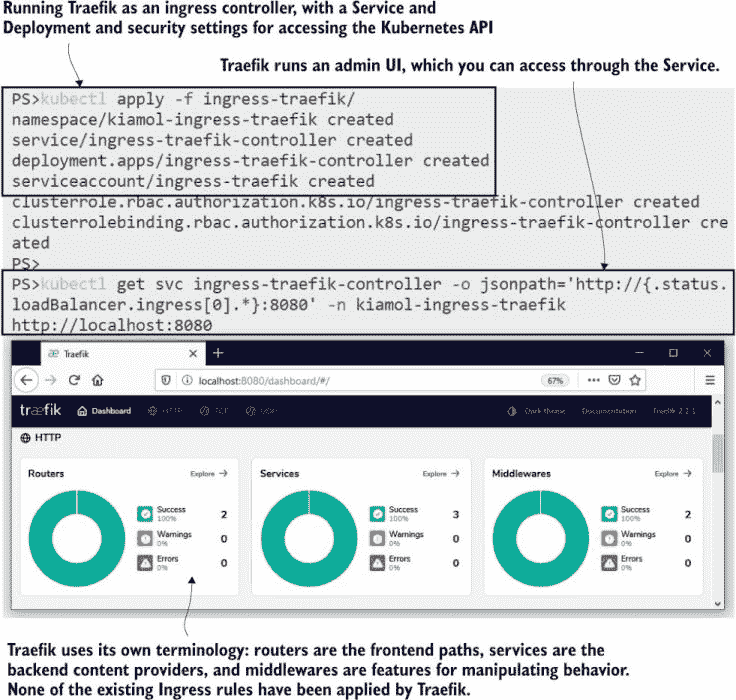

图 15.12 Traefik 是一个容器原生代理，它从平台构建路由规则，并有一个用户界面来显示它们。

为什么 Traefik 没有为待办事项列表或 Pi 应用程序构建一组路由规则？如果我们配置不同，它就会这样做，并且所有现有路由都将通过 Traefik 服务可用，但你不会使用多个入口控制器，因为它们最终会为进入请求而争斗。你运行多个控制器以提供不同的代理功能，你需要应用程序选择使用哪一个。你可以通过 *入口类* 来做到这一点，它与存储类有类似的概念。Traefik 已经部署了一个命名的入口类，并且只有请求该类的入口对象将通过 Traefik 路由。

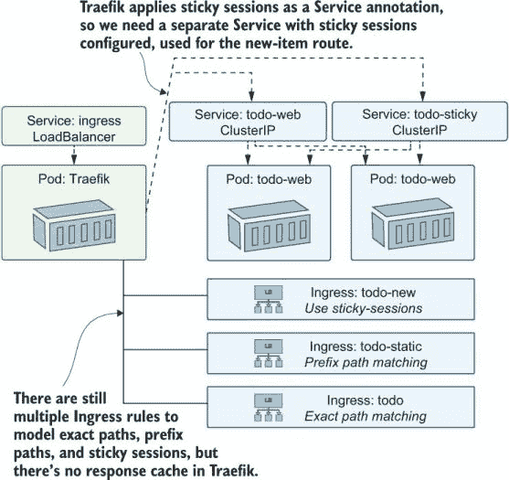

图 15.13 入口控制器的工作方式不同，你的路由模型需要相应地改变。

Ingress 类不是 Ingress 控制器之间唯一的区别，你可能需要为不同的代理对路由进行相当不同的建模。图 15.13 展示了在 Traefik 中 to-do 应用需要如何配置。在 Traefik 中没有响应缓存，所以我们不会为静态资源获得缓存，并且粘性会话是在服务级别配置的，因此我们需要为新的项目路由添加一个额外的服务。

该模型与图 15.9 中的 Nginx 路由有显著不同，所以如果你确实计划运行多个 Ingress 控制器，你需要认识到配置错误的高风险，因为团队可能会混淆不同的功能和方法。Traefik 使用 Ingress 资源上的注解来配置路由规则。列表 15.6 显示了新项目路径的规范，它选择 Traefik 作为 Ingress 类，并使用注解进行精确路径匹配，因为 Traefik 不支持 PathType 字段。

列表 15.6 ingress-traefik.yaml，选择带有 Traefik 注解的 Ingress 类

```
apiVersion: networking.k8s.io/v1beta1 
kind: Ingress
metadata:                               # Annotations select the Traefik 
  name: todo2-new                       # ingress class and apply exact
  annotations:                          # path matching.
    kubernetes.io/ingress.class: traefik
    traefik.ingress.kubernetes.io/router.pathmatcher: Path
spec:
  rules:
  - host: todo2.kiamol.local            # Uses a different host so the app 
    http:                               # stays avaialable through Nginx
      paths:
      - path: /new
        backend:
          serviceName: todo-web-sticky  # Uses the Service that has sticky
          servicePort: 80               # sessions configured for Traefik
```

我们将使用不同的主机名部署一套新的 Ingress 规则，这样我们就可以通过 Nginx 或 Traefik 将流量路由到同一组 to-do 列表 Pods。

现在尝试一下 通过 Traefik Ingress 控制器发布 to-do 应用，使用图 15.13 中建模的 Ingress 路由。

```
# add a new domain for the app--on Windows:
./add-to-hosts.ps1 todo2.kiamol.local ingress-traefik

# OR on Linux/macOS:
./add-to-hosts.sh todo2.kiamol.local ingress-traefik

# apply the new Ingress rules and sticky Service:
kubectl apply -f todo-list/update/ingress-traefik.yaml

# refresh the Traefik admin UI to confirm the new routes
# browse to http://todo2.kiamol.local:8015
```

Traefik 监视来自 Kubernetes API 服务器的事件，并自动刷新其路由列表。当你部署新的 Ingress 对象时，你将在 Traefik 仪表板中看到显示为路由器的路径，链接到后端服务。图 15.14 显示了部分路由列表，以及通过新 URL 可用的 to-do 应用。

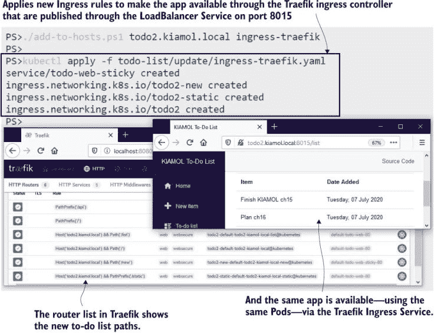

图 15.14 Ingress 控制器从不同的配置模型中实现相同的目标。

如果你正在评估 Ingress 控制器，你应该考虑建模你的应用程序路径的简便性，以及故障排除方法和代理的性能。在专用环境中双运行的控制器有助于这一点，因为你可以隔离其他因素，并使用相同的应用程序组件进行对比。一个更真实的应用程序将具有更复杂的 Ingress 规则，你将希望对控制器实现诸如速率限制、URL 重写和客户端 IP 访问列表等功能的实现感到舒适。

Ingress 的另一个主要功能是在不配置应用程序中的证书和安全设置的情况下通过 HTTPS 发布应用程序。这是 Ingress 控制器之间一致的一个领域，在下一节中，我们将通过 Traefik 和 Nginx 来看到这一点。

## 15.4 使用 Ingress 通过 HTTPS 保护你的应用

您的 Web 应用程序应通过 HTTPS 发布，但加密需要服务器证书，而证书是敏感数据项。将 HTTPS 作为入口关注点是一个好习惯，因为它集中管理证书。入口资源可以在 Kubernetes 机密（TLS 是传输层安全，HTTPS 的加密机制）中指定 TLS 证书。将 TLS 从应用团队移除意味着您可以有一个标准的方法来提供、保护和续订证书——您也不必花费时间解释为什么在容器镜像中打包证书是一个糟糕的想法。

所有入口控制器都支持从机密加载 TLS 证书，但 Traefik 使其更加简单。如果您想在开发和测试环境中使用 HTTPS 而不配置任何机密，Traefik 在运行时可以生成自己的自签名证书。您可以通过入口规则中的注解来配置它，以启用 TLS 和默认证书解析器。

现在尝试一下 使用 Traefik 生成的证书是测试您的应用程序通过 HTTPS 的快速方法。它通过在入口对象中启用更多注解来实现。

```
# update the Ingress to use Traefik’s own certifcate:
kubectl apply -f todo-list/update/ingress-traefik-certResolver.yaml

# browse to https://todo2.kiamol.local:9443
# you’ll see a warning in your browser
```

浏览器不喜欢自签名证书，因为任何人都可以创建它们——没有可验证的授权链。当您第一次浏览到该网站时，您会看到一个大的警告，告诉您它不安全，但您可以继续，待办事项应用将加载。如图 15.15 所示，该网站使用 HTTPS 加密，但有一个警告，让您知道它实际上并不安全。

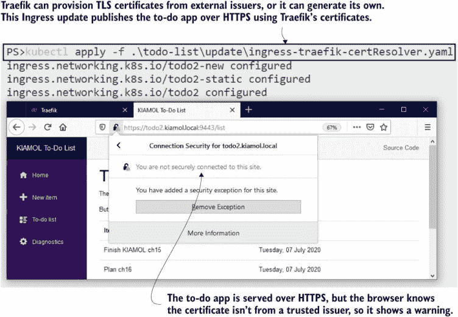

图 15.15 并非所有 HTTPS 都是安全的——自签名证书适用于开发和测试环境。

您的组织可能对证书有自己的看法。如果您能够控制提供过程，您可以拥有一个完全自动化的系统，其中您的集群从证书颁发机构（CA）获取短期证书，安装它们，并在需要时续订它们。Let’s Encrypt 是一个很好的选择：它通过一个易于自动化的过程颁发免费证书。Traefik 与 Let’s Encrypt 有原生集成；对于其他入口控制器，您可以使用开源的 cert-manager 工具（[`cert-manager.io`](https://cert-manager.io)），它是一个 CNCF 项目。

尽管如此，并非每个人都准备好自动化提供过程。一些颁发者要求人工下载证书文件，或者您的组织可能为非生产域从其自己的证书颁发机构创建证书文件。然后您需要将 TLS 证书和密钥文件作为机密在集群中部署。这种情况很常见，所以我们在下一个练习中会演示如何生成自己的证书。

现在尝试一下 运行一个生成自定义 TLS 证书的 Pod，并连接到 Pod 以将证书文件作为机密部署。Pod 规范配置为连接到其运行的 Kubernetes API 服务器。

```
# run the Pod--this generates a certificate when it starts:
kubectl apply -f ./cert-generator.yaml

# connect to the Pod:
kubectl exec -it deploy/cert-generator -- sh

# inside the Pod, confirm the certificate files have been created:
ls

# rename the certificate files--Kubernetes requires specific names:
mv server-cert.pem tls.crt
mv server-key.pem tls.key

# create and label a Secret from the certificate files:
kubectl create secret tls kiamol-cert --key=tls.key --cert=tls.crt
kubectl label secret/kiamol-cert kiamol=ch15

# exit the Pod:
exit

# back on the host, confirm the Secret is there:
kubectl get secret kiamol-cert --show-labels
```

该练习模拟了有人向您提供作为一对 PEM 文件的 TLS 证书的情况，您需要将其重命名并用作在 Kubernetes 中创建 TLS 机密的输入。证书生成全部使用名为 OpenSSL 的工具完成，将其在 Pod 内部运行的唯一原因是为了打包工具和脚本，使其易于使用。图 15.16 显示了我的输出，其中在集群中创建了一个机密，该机密可以被 Ingress 对象使用。

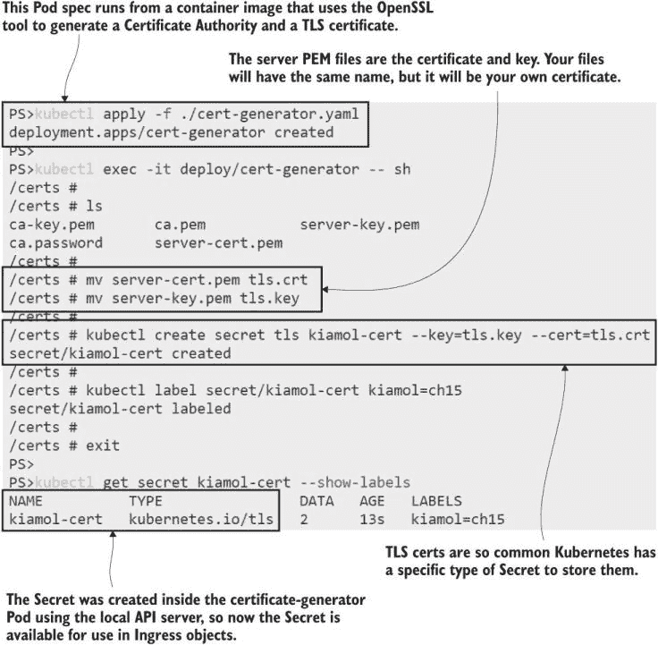

图 15.16 如果您从证书发行者那里收到 PEM 文件，您可以将它们创建为 TLS 机密。

使用入口控制器支持 HTTPS 很简单。您只需在 Ingress 规范中添加一个 TLS 部分，并声明要使用的 Secret 名称——这就完成了。列表 15.7 显示了 Traefik 入口的更新，它将新证书应用于`todo2.kiamol .local`主机。

列表 15.7 ingress-traefik-https.yaml，使用标准的 Ingress HTTPS 功能

```
spec:
  rules:
  - host: todo2.kiamol.local
    http:
      paths:
      - path: /new
        backend:
          serviceName: todo-web-sticky
          servicePort: 80
  tls:                              # The TLS section switches on HTTPS
   - secretName: kiamol-cert        # using the certificate in this Secret.
```

带有 Secret 名称的 TLS 字段就是您所需要的，并且它在所有入口控制器之间都是可移植的。当您部署更新的 Ingress 规则时，网站将通过 HTTPS 使用您的自定义证书提供服务。您仍然会从浏览器收到安全警告，因为证书颁发机构不受信任，但如果您的组织有自己的 CA，那么它将被您的机器和组织证书所信任。

现在试试看 更新待办事项列表中的 Ingress 对象，以使用 Traefik 入口控制器和您自己的 TLS 证书发布 HTTPS。

```
# apply the Ingress update:
kubectl apply -f todo-list/update/ingress-traefik-https.yaml

# browse to https://todo2.kiamol.local:9443
# there’s still a warning, but this time it’s because 
# the KIAMOL CA isn’t trusted
```

您可以在图 15.17 中看到我的输出。我在一个屏幕上打开了证书详情，以确认这是我的“kiamol”证书。我在第二个屏幕上接受了警告，现在待办事项列表的流量现在已通过自定义证书加密。生成证书的脚本将其设置为我们在本章中使用的所有`kiamol.local`域名，因此证书对该地址有效，但它不是来自受信任的发行者。

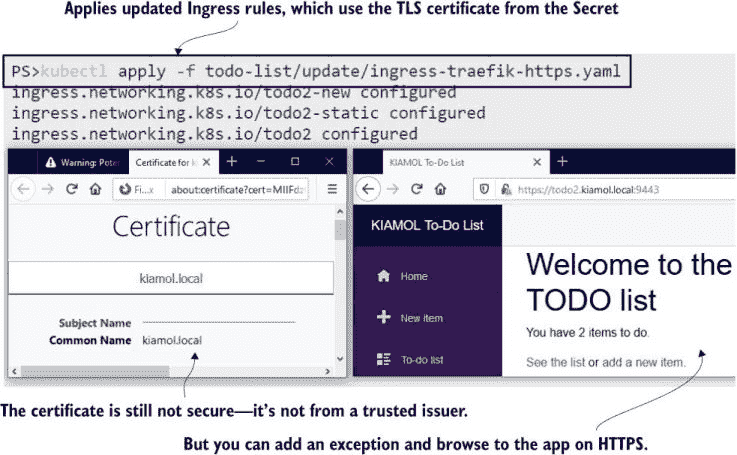

图 15.17 入口控制器可以从 Kubernetes 机密中应用 TLS 证书。如果证书来自受信任的发行者，则网站将是安全的

我们将切换回 Nginx 进行最后的练习——使用与 Nginx 入口控制器相同的证书，只是为了展示过程是相同的。更新的 Ingress 规范使用与之前 Nginx 部署相同的规则，但现在它们添加了与列表 15.7 相同的 Secret 名称的 TLS 字段。

现在试试看 更新待办事项的 Ingress 规则以 Nginx，以便应用程序可以通过标准端口 443（Nginx 入口控制器正在使用）使用 HTTPS 进行访问。

```
# update the Ingress resources:
kubectl apply -f todo-list/update/ingress-https.yaml

# browse to https://todo.kiamol.local
# accept the warnings to view the site

# confirm that the HTTP requests are redirected to HTTPS:
curl http://todo.kiamol.local
```

在我运行那个练习时，我作弊了，并将 Kiamol CA 添加到浏览器中信任的发行者列表中。你可以在图 15.18 中看到，该网站显示为安全，没有任何警告，这就是你看到组织自己的证书时的样子。你还可以看到入口控制器将 HTTP 请求重定向到 HTTPS——`curl`命令中的 308 重定向响应由 Nginx 处理。

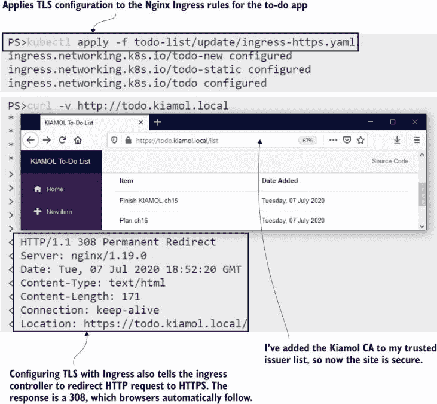

图 15.18 TLS 入口配置与 Nginx 入口控制器的工作方式相同。

Ingress 的 HTTPS 部分稳固且易于使用，在章节结束时留下一个积极的印象是很好的。但是，使用入口控制器具有很多复杂性，在某些情况下，你可能会花更多的时间来制定入口规则，而不是建模应用程序的部署。

## 15.5 理解入口和入口控制器

你几乎肯定会在你的集群中运行入口控制器，因为它集中管理域名路由，并将 TLS 证书管理从应用程序中移除。Kubernetes 模型使用一个通用的入口规范和一个可插拔的实现，非常灵活，但用户体验并不直观。入口规范仅记录最基本的路由细节，要使用代理的更高级功能，你需要添加配置注释的块。

这些注释是不可移植的，并且没有为入口控制器必须支持的功能提供接口规范。如果你想从 Nginx 迁移到 Traefik 或 HAProxy 或 Contour（一个在撰写本章的同一天被 CNCF 接受的开源项目），将会有一个迁移项目，你可能发现你需要的功能并不全部可用。Kubernetes 社区意识到入口的限制，并正在开发一个长期替代方案，称为*服务 API*，但截至 2021 年，这仍然处于早期阶段。

这并不是说应该避免使用入口——目前这是最佳选择，并且可能在未来许多年里都是生产环境的选择。评估不同的入口控制器，然后确定一个单一选项是值得的。Kubernetes 支持多个入口控制器，但如果使用不同的实现并需要管理具有不兼容功能集的入口规则集，麻烦就会真正开始。在本章中，我们探讨了 Nginx 和 Traefik，它们都是不错的选择，但还有许多其他选项，包括有支持合同的商业选项。

我们现在完成了入口，因此我们可以整理集群，为实验室做准备。

现在尝试一下 清除入口命名空间和应用程序资源。

```
kubectl delete ns,all,secret,ingress -l kiamol=ch15
```

## 15.6 实验室

这里有一个很好的实验室供你完成，遵循第十三章和第十四章的模式。你的任务是为每日天文图片应用程序构建入口规则。简单……

+   首先在`lab/ingress-nginx`文件夹中部署入口控制器。

+   入口控制器限制在单个命名空间中查找入口对象，因此您需要找出是哪一个，并将`lab/apod/`文件夹部署到那个命名空间。

+   网站应用应发布在 `www.apod.local`，API 则在 `api.apod .local`。

+   我们希望防止分布式拒绝服务攻击，因此您应该使用入口控制器中的速率限制功能来防止来自同一 IP 地址的过多请求。

+   入口控制器使用自定义类名，因此您还需要找到那个类名。

这部分内容涉及深入挖掘入口控制器配置以及控制器的文档——请注意，存在两个 Nginx 入口控制器。在本章中，我们使用了来自 Kubernetes 项目的那个，但 Nginx 项目也发布了一个替代版本。我的解决方案已经准备好供您检查：[`github.com/sixeyed/kiamol/blob/master/ch15/lab/README.md`](https://github.com/sixeyed/kiamol/blob/master/ch15/lab/README.md)。
