# 16 使用策略、上下文和准入控制确保应用程序安全

容器是围绕应用程序进程的轻量级包装。它们启动速度快，并且由于它们使用运行在其上的机器的操作系统内核，因此对应用程序的额外开销很小。这使得它们超级高效，但代价是强大的隔离性——容器可能会被破坏，一个被破坏的容器可能会为服务器以及运行在其上的所有其他容器提供不受限制的访问。Kubernetes 有许多功能来确保你的应用程序安全，但默认情况下，它们都没有启用。在本章中，你将学习如何使用 Kubernetes 中的安全控制，以及如何设置你的集群，以便这些控制对所有工作负载都是必需的。

在 Kubernetes 中确保应用程序安全是关于限制容器可以做什么，所以如果攻击者利用应用程序漏洞在容器中运行命令，他们无法超出该容器。我们可以通过限制对其他容器和 Kubernetes API 的网络访问，限制主机文件系统的挂载，以及限制容器可以使用操作系统功能来做到这一点。我们将介绍基本方法，但安全领域很大且在不断发展。本章甚至比其他章节更长——你即将学到很多东西，但这只是你通往安全 Kubernetes 环境的旅程的开始。

## 16.1 使用网络策略确保通信安全

限制网络访问是确保应用程序安全的最简单方法之一。Kubernetes 具有扁平的联网模型，其中每个 Pod 都可以通过其 IP 地址到达其他 Pod，并且服务在整个集群中都是可访问的。没有理由让 Pi 网络应用程序访问待办事项数据库，或者让 Hello, World 网络应用程序使用 Kubernetes API，但默认情况下，它们可以。你在第十五章中学习了如何使用 Ingress 资源来控制对 HTTP 路由的访问，但这仅适用于进入集群的外部流量。你还需要控制集群内的访问，为此，Kubernetes 提供了*网络策略*。

网络策略就像防火墙规则一样工作，在端口级别阻止到或从 Pod 的流量。规则是灵活的，并使用标签选择器来识别对象。你可以部署一个全面拒绝所有流量的策略来阻止所有 Pod 的出站流量，或者你可以部署一个策略，限制对 Pod 的指标端口的入站流量，以便只能从监控命名空间中的 Pod 访问。图 16.1 显示了这在集群中的样子。

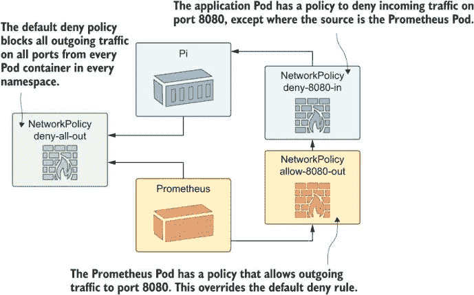

图 16.1 网络策略规则是细粒度的——你可以应用集群默认值，并通过 Pod 覆盖来应用。

NetworkPolicy 对象是独立的资源，这意味着它们可以被安全团队在应用程序之外建模，或者它们可以被产品团队构建。或者，当然，每个团队可能都认为其他团队已经覆盖了，应用在没有策略的情况下进入生产，这是一个问题。我们将部署一个没有策略就通过的 app，并查看它存在的问题。

现在试试 Deploy 天文图片每日一图（APOD）应用，并确认应用组件可以被任何 Pod 访问。

```
# switch to the chapter folder:
cd ch16

# deploy the APOD app:
kubectl apply -f apod/

# wait for it to be ready:
kubectl wait --for=condition=ContainersReady pod -l app=apod-web

# browse to the Service on port 8016 if you want to see today’s
# picture

# now run a sleep Pod:
kubectl apply -f sleep.yaml

# confirm that the sleep Pod can use the API:
kubectl exec  deploy/sleep -- curl -s http://apod-api/image

# read the metrics from the access log:
kubectl exec deploy/sleep -- sh -c 'curl -s http://apod-log/metrics | head -n 2'
```

你可以清楚地在这个练习中看到问题——整个集群都是开放的，所以从 sleep Pod，你可以访问 APOD API 和访问日志组件的指标。图 16.2 显示了我的输出。让我们明确一点，sleep Pod 没有什么特别之处；它只是演示问题的简单方式。集群中的任何容器都可以做同样的事情。

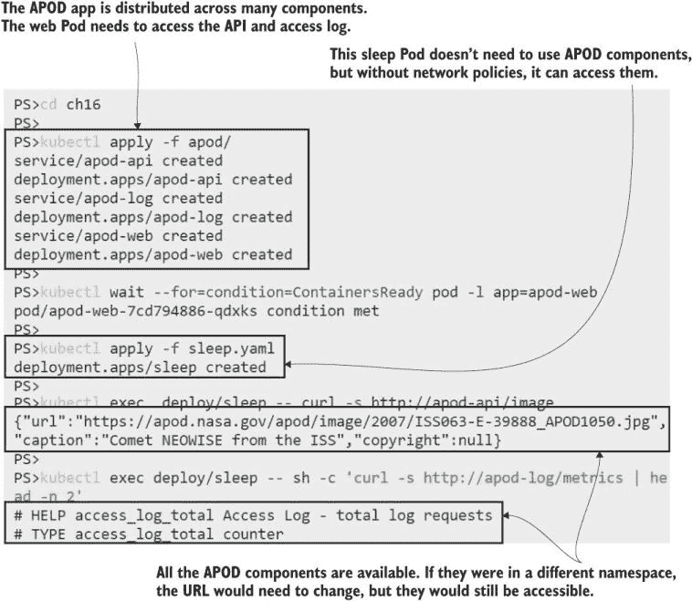

图 16.2 Kubernetes 平面网络模型的缺点是每个 Pod 都是可访问的。

Pods 应该被隔离，以便它们只接收需要访问它们的组件的流量，并且只向它们需要访问的组件发送流量。网络策略通过*入口规则*（不要与入口资源混淆）来模拟这一点，这些规则限制进入的流量，以及*出口规则*，这些规则限制出去的流量。在 APOD 应用中，唯一应该能够访问 API 的组件是 Web 应用。列表 16.1 显示了在 NetworkPolicy 对象中的入口规则。

列表 16.1 networkpolicy-api.yaml，通过标签限制对 Pod 的访问

```
apiVersion: networking.k8s.io/v1
kind: NetworkPolicy
metadata:
  name: apod-api
spec:
  podSelector:             # This is the Pod where the rule applies.
    matchLabels:
      app: apod-api       
  ingress:                 # Rules default to deny, so this rule
  - from:                  # denies all ingress except where the 
    - podSelector:         # source of the traffic is a Pod with 
        matchLabels:       # the apod-web label.
          app: apod-web
    ports:                 # This restriction is by port.
    - port: api            # The port is named in the API Pod spec.
```

NetworkPolicy 规范相当简单，规则可以在应用程序部署之前部署，这样 Pod 启动时就是安全的。入口和出口规则遵循相同的模式，并且两者都可以使用命名空间选择器和 Pod 选择器。你可以创建全局规则，然后在应用程序级别用更细粒度的规则覆盖它们。

网络策略的一个大问题——当你部署规则时，它们可能不会做任何事情。就像 Ingress 对象需要一个入口控制器来对其执行操作一样，NetworkPolicy 对象依赖于集群中的网络实现来强制执行它们。当你在这个下一个练习中部署这个策略时，你可能会失望地发现 APOD API 仍然没有限制为 Web 应用。

现在试试 Apply 网络策略，看看你的集群是否真的强制执行了它。

```
# create the policy:
kubectl apply -f apod/update/networkpolicy-api.yaml

# confirm it is there:
kubectl get networkpolicy

# try to access the API from the sleep Pod--this is not permitted 
# by the policy:
kubectl exec deploy/sleep -- curl http://apod-api/image
```

你可以在图 16.3 中看到 sleep Pod 可以访问 API——限制进入 Web Pods 的 NetworkPolicy 被完全忽略。我正在 Docker Desktop 上运行这个，但你在 K3s、AKS 或 EKS 的默认设置中也会得到相同的结果。

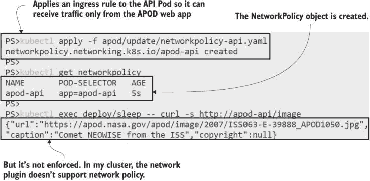

图 16.3 在你的 Kubernetes 集群中，网络设置可能不会强制执行网络策略。

Kubernetes 的网络层是可插拔的，并不是每个网络插件都支持 NetworkPolicy 的强制执行。标准集群部署中的简单网络没有支持，所以你可能会遇到这样一个棘手的情况：你可以部署所有的 NetworkPolicy 对象，但你不知道它们是否被强制执行，除非你测试它们。云平台在这里有不同的支持级别。当你创建 AKS 集群时，你可以指定网络策略选项；对于 EKS，你需要在创建集群后手动安装不同的网络插件。

对于跟随这些练习（以及我编写它们）的你来说，这都很令人沮丧，但对于在生产中使用 Kubernetes 的组织来说，这会导致一个更加危险的脱节。你应该在构建周期的早期就采用安全控制措施，以便在开发和测试环境中应用 NetworkPolicy 规则，以运行接近生产配置的应用。配置不当的网络策略可能会轻易破坏你的应用，但如果你在非生产环境中不强制执行策略，你可能不会知道这一点。

如果你想看到 NetworkPolicy 的实际应用，接下来的练习将创建一个使用 Calico 的自定义集群，Calico 是一个开源的网络插件，它强制执行策略。你需要安装 Docker 和 Kind 命令行才能完成这个练习。警告：**这个练习会改变 Docker 的 Linux 配置，并使你的原始集群无法使用**。Docker Desktop 用户可以通过点击 *重置 Kubernetes* 按钮来修复一切，而 Kind 用户可以将他们的旧集群替换为新的，但其他配置可能不那么幸运。跳过这些练习，只阅读我的输出是可以的；我们将在下一节切换回你的正常集群。

现在尝试一下 创建一个新的 Kind 集群，并部署一个自定义网络插件。

```
# install the Kind command line using instructions at 
# https://kind.sigs.k8s.io/docs/user/quick-start/

# create a new cluster with a custom Kind configuration:
kind create cluster --image kindest/node:v1.18.4 --name kiamol-ch16
 --config kind/kind-calico.yaml

# install the Calico network plugin:
kubectl apply -f kind/calico.yaml

# wait for Calico to spin up:
kubectl wait --for=condition=ContainersReady pod -l k8s-app=calico-node -n kube-system

# confirm your new cluster is ready:
kubectl get nodes
```

图 16.4 中的输出被简化了；你将在 Calico 部署中看到许多更多被创建的对象。最后，我有一个新的集群，它强制执行网络策略。不幸的是，了解你的集群是否使用了一个强制执行策略的网络插件，唯一的办法是设置一个你知道强制执行策略的网络插件。

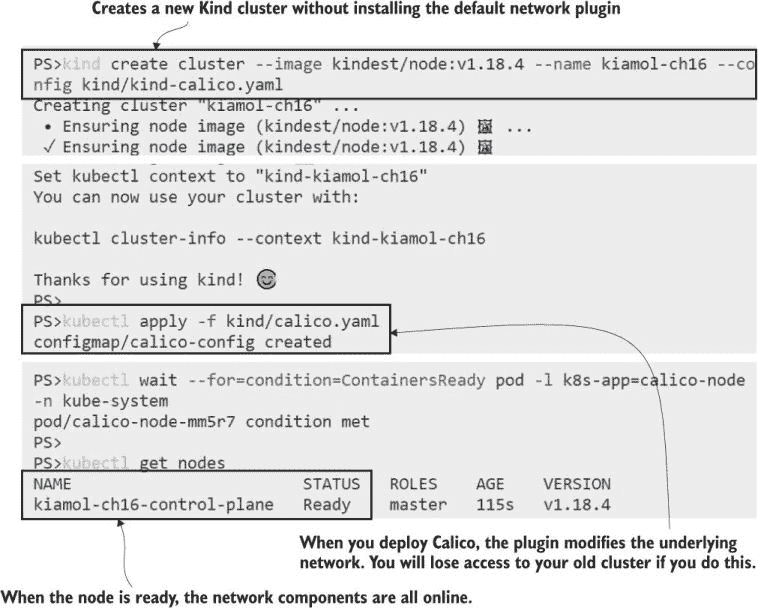

图 16.4 安装 Calico 为你提供了一个具有网络策略支持的集群——但代价是牺牲了你的其他集群。

现在我们可以再次尝试。这个集群是完全新的，没有任何服务在运行，但当然，Kubernetes 清单是可移植的，所以我们可以快速重新部署 APOD 应用并尝试它。（Kind 支持运行不同 Kubernetes 版本和不同配置的多个集群，因此它是测试环境的一个很好的选择，但它不如 Docker Desktop 或 K3s 对开发者友好）。

现在尝试一下 重复 APOD 和 sleep 部署，并确认网络策略阻止了未经授权的流量。

```
# deploy the APOD app to the new cluster:
kubectl apply -f apod/

# wait for it to spin up:
kubectl wait --for=condition=ContainersReady pod -l app=apod-web

# deploy the sleep Pod:
kubectl apply -f sleep.yaml

# confirm the sleep Pod has access to the APOD API:
kubectl exec deploy/sleep -- curl -s http://apod-api/image

# apply the network policy:
kubectl apply -f apod/update/networkpolicy-api.yaml

# confirm the sleep Pod can’t access the API:
kubectl exec deploy/sleep -- curl -s http://apod-api/image

# confirm the APOD web app still can:
kubectl exec deploy/apod-web -- wget -O- -q http://apod-api/image
```

图 16.5 显示了我们的第一次预期：只有 APOD 网络应用可以访问 API，当睡眠应用尝试连接时超时，因为网络插件阻止了流量。

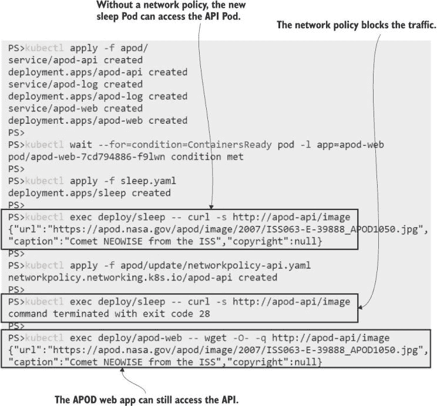

图 16.5 Calico 强制执行策略，因此只有来自 Web Pod 的流量被允许访问 API Pod。

网络策略是 Kubernetes 中的一个重要安全控制，对于习惯于防火墙和隔离网络的架构团队来说很有吸引力。但如果你选择采用它们，你需要了解策略在你的开发工作流程中的位置。如果工程师在没有强制执行的情况下运行自己的集群，而你只在管道的后期应用策略，你的环境配置非常不同，某些东西将会被破坏。

我在这里只介绍了 NetworkPolicy API 的基本细节，因为复杂性更多地在于集群配置而不是策略资源。如果你想进一步探索，有一个由 Google 的工程师 Ahmet Alp Balkan 发布的充满网络策略菜谱的 GitHub 仓库非常棒：[`github.com/ahmetb/kubernetes-network-policy-recipes`](https://github.com/ahmetb/kubernetes-network-policy-recipes)。

现在让我们清理新的集群，看看你的旧集群是否仍然工作。

现在试试看 移除 Calico 集群，看看旧集群是否仍然可访问。

```
# delete the new cluster:
kind delete cluster --name kiamol-ch16

# list your Kubernetes contexts:
kubectl config get-contexts

# switch back to your previous cluster:
kubectl config set-context <your_old_cluster_name>

# see if you can connect:
kubectl get nodes
```

你的前一个集群可能因为 Calico 所做的网络更改而无法访问，即使 Calico 现在没有运行。图 16.6 显示我即将在 Docker Desktop 中点击*重置 Kubernetes*按钮；如果你使用 Kind，你需要删除并重新创建你的原始集群，如果你使用其他东西并且它不起作用……我确实警告过你。

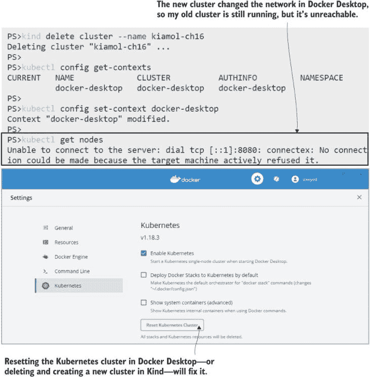

图 16.6 在容器中运行的 Calico 能够重新配置我的网络并破坏事物。

现在我们都恢复正常了（希望如此），我们可以继续进行保护容器本身，这样应用程序就不会有重新配置网络栈等特权。

## 16.2 使用安全上下文限制容器功能

容器安全实际上关于 Linux 安全以及容器用户的访问模型（Windows Server 容器有一个不同的用户模型，没有相同的问题）。Linux 容器通常以*root*超级管理员账户运行，除非你明确配置用户，容器内的 root 也是主机上的 root。如果一个攻击者能够从以 root 运行的容器中突破，那么他们现在就控制了你的服务器。这是一个所有容器运行时的问题，但 Kubernetes 又添加了一些它自己的问题。

在下一个练习中，你将使用基本的部署配置运行 Pi 网络应用。这个容器镜像是在微软的官方.NET Core 应用运行时镜像之上打包的。Pod 规范并非故意不安全，但你将看到默认设置并不令人鼓舞。

现在尝试一下：运行一个简单的应用程序，并检查默认的安全情况。

```
# deploy the app:
kubectl apply -f pi/

# wait for the container to start:
kubectl wait --for=condition=ContainersReady pod -l app=pi-web

# print the name of the user in the Pod container:
kubectl exec deploy/pi-web -- whoami 

# try to access the Kubernetes API server:
kubectl exec deploy/pi-web -- sh -c 'curl -k -s https://kubernetes.default | grep message'

# print the API access token:
kubectl exec deploy/pi-web -- cat /run/secrets/kubernetes.io/serviceaccount/token
```

这种行为令人担忧：应用程序以 root 身份运行，它有权访问 Kubernetes API 服务器，并且它甚至设置了一个令牌，以便它可以与 Kubernetes 进行身份验证。图 16.7 显示了所有这些操作。以 root 身份运行放大了攻击者可以在应用程序代码或运行时找到的任何漏洞。有权访问 Kubernetes API 意味着攻击者甚至不需要从容器中逃逸——他们可以使用令牌查询 API 并做些有趣的事情，比如获取 Secrets 的内容（取决于 Pod 的访问权限，你将在第十七章中了解这些内容）。

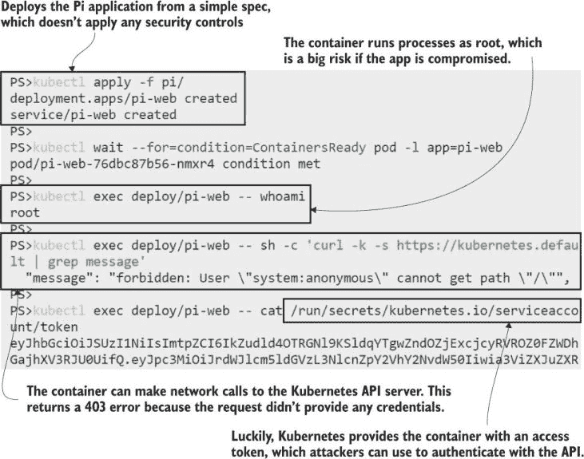

图 16.7 如果你听说过“默认安全”这个短语，那么它并不是针对 Kubernetes 说的。

Kubernetes 在 Pod 和容器级别提供了多个安全控制，但它们默认并未启用，因为它们可能会破坏你的应用程序。你可以以不同的用户身份运行容器，但有些应用程序只有在以 root 身份运行时才能工作。你可以降低 Linux 能力来限制容器能做什么，但这样一些应用程序功能可能会失败。这就是自动化测试发挥作用的地方，因为你可以不断加强应用程序的安全性，在每个阶段运行测试以确认一切仍然正常工作。

你将主要使用的是 SecurityContext 字段，它在 Pod 和容器级别应用安全策略。列表 16.2 展示了如何显式设置用户和 Linux 组（用户集合），因此 Pod 中的所有容器都以*unknown*用户身份运行，而不是 root 用户。

列表 16.2 deployment-podsecuritycontext.yaml，以特定用户运行

```
spec:                     # This is the Pod spec in the Deployment.
  securityContext:        # These controls apply to all Pod containers.
    runAsUser: 65534      # Runs as the “unknown” user
    runAsGroup: 3000      # Runs with a nonexistent group
```

这很简单，但离开 root 用户会有影响，Pi 规范需要一些更多的更改。应用程序在容器内部监听 80 端口，而 Linux 需要提升权限才能监听该端口。root 用户有权限，但新用户没有，所以应用程序将无法启动。需要在环境变量中进行一些额外的配置，将应用程序设置为监听 5001 端口，这对于新用户是有效的。这种细节你需要为每个应用程序或应用程序类别逐一解决，你将在应用程序停止工作时发现这些需求。

现在尝试一下：部署受保护 Pod 规范。这使用了一个非 root 用户和一个不受限制的端口，但服务中的端口映射隐藏了这一细节，对消费者来说是不可见的。

```
# add the nonroot SecurityContext:
kubectl apply -f pi/update/deployment-podsecuritycontext.yaml

# wait for the new Pod:
kubectl wait --for=condition=ContainersReady pod -l app=pi-web

# confirm the user:
kubectl exec deploy/pi-web -- whoami 

# list the API token files:
kubectl exec deploy/pi-web -- ls -l /run/secrets/kubernetes.io/serviceaccount/token

# print out the access token:
kubectl exec deploy/pi-web -- cat /run/secrets/kubernetes.io/serviceaccount/token
```

以非 root 用户身份运行可以解决应用程序利用风险升级为完全服务器接管的问题，但如图 16.8 所示，它并不能解决所有问题。Kubernetes API 令牌具有任何账户都可以读取的权限，因此攻击者仍然可以使用此设置中的 API。他们可以使用 API 做什么取决于你的集群是如何配置的——在 Kubernetes 的早期版本中，他们可以做任何事情。访问 API 服务器的身份与 Linux 用户不同，它可能在集群中拥有管理员权限，即使容器进程是以最低权限用户身份运行的。

Pod 规范中的一个选项阻止 Kubernetes 挂载访问令牌，你应该为每个实际上不需要使用 Kubernetes API 的应用程序包含此选项——这几乎将是一切，除了需要找到服务端点的工作负载，如入口控制器。这是一个安全的选项来设置，但下一级别的运行时控制需要更多的测试和评估。容器规范中的 SecurityContext 字段在 Pod 级别上提供了更细粒度的控制。列表 16.3 显示了适用于 Pi 应用程序的一组选项。

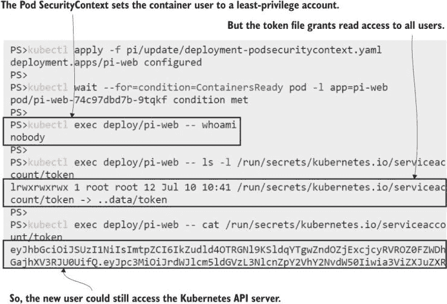

图 16.8 你需要对 Kubernetes 采取深入的安全方法；一个设置是不够的。

列表 16.3 deployment-no-serviceaccount-token.yaml，更严格的安全策略

```
spec:    
  automountServiceAccountToken: false      # Removes the API token
  securityContext:                         # Applies to all containers
    runAsUser: 65534
    runAsGroup: 3000
  containers:
    - image: kiamol/ch05-pi
      # ...
      securityContext:                     # Applies for this container 
        allowPrivilegeEscalation: false    # The context settings block
        capabilities:                      # the process from escalating to
          drop:                            # higher privileges and drops
            - all                          # all additional capabilities.
```

capabilities 字段允许您显式添加和删除 Linux 内核能力。此应用程序在没有能力的情况下也能愉快地运行，但其他应用程序可能需要添加一些能力。此应用程序不支持的一个功能是`readOnlyRootFilesystem`选项。如果你的应用程序可以与只读文件系统一起工作，这是一个非常有用的选项，因为它意味着攻击者无法写入文件，因此他们无法下载恶意脚本或二进制文件。你采取多远取决于你组织的安全配置文件。你可以强制要求所有应用程序都需要以非 root 用户身份运行，所有能力都被删除，并且具有只读文件系统，但这可能意味着你需要重写大多数应用程序。

一种实用方法是尽可能在容器级别保护现有的应用程序，并确保你围绕其他政策和流程有深入的安全措施。Pi 应用程序的最终规范并不完美安全，但与默认设置相比有了很大的改进——并且应用程序仍然可以工作。

现在试试看 更新 Pi 应用程序的最终安全配置。

```
# update to the Pod spec in listing 16.3:
kubectl apply -f pi/update/deployment-no-serviceaccount-token.yaml

# confirm the API token doesn’t exist:
kubectl exec deploy/pi-web -- cat /run/secrets/kubernetes.io/serviceaccount/token

# confirm that the API server is still accessible:
kubectl exec deploy/pi-web -- sh -c 'curl -k -s https://kubernetes.default | grep message'

# get the URL, and check that the app still works:
kubectl get svc pi-web -o jsonpath='http://{.status.loadBalancer.ingress[0].*}:8031'
```

如图 16.9 所示，应用程序仍然可以访问 Kubernetes API 服务器，但它没有访问令牌，因此攻击者需要做更多工作才能发送有效的 API 请求。应用一个 NetworkPolicy 来拒绝 API 服务器的入站访问将完全移除这个选项。

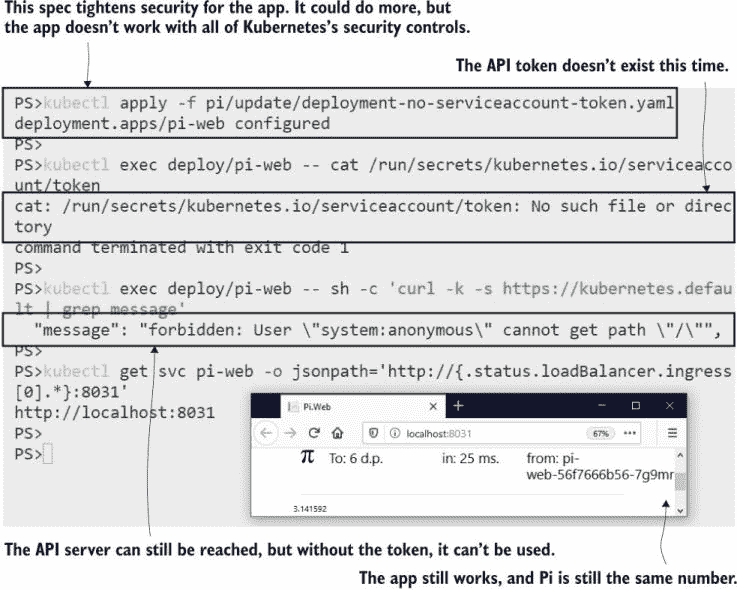

图 16.9 对于用户来说，安全的应用程序是一样的，但对于攻击者来说则乐趣大减。

您需要在您的应用程序中投资增加安全性，但如果您的应用程序平台范围相对较小，您可以构建通用的配置文件：您可能会发现所有您的 .NET 应用程序都可以以非 root 用户身份运行，但需要一个可写文件系统，而所有您的 Go 应用程序都可以使用只读文件系统运行，但需要添加一些 Linux 功能。那么，挑战就在于确保您的配置文件实际上被应用了，Kubernetes 有一个很好的功能来实现这一点：*准入控制*。

## 16.3 使用 webhook 阻止和修改工作负载

您在 Kubernetes 中创建的每个对象都会经过一个检查过程，以确定集群是否可以运行该对象。这个过程是准入控制，我们在第十二章中看到了准入控制器在工作，尝试部署一个请求比命名空间可用资源更多的 Pod 规范。ResourceQuota 准入控制器是一个内置控制器，它会阻止超出配额的工作负载运行，Kubernetes 有一个插件系统，因此您可以添加自己的准入控制规则。

两个其他控制器增加了这种可扩展性：ValidatingAdmissionWebhook，它类似于 ResourceQuota，允许或阻止对象创建，以及 MutatingAdmissionWebhook，它可以实际编辑对象规范，因此创建的对象与请求不同。这两个控制器以相同的方式工作：您创建一个配置对象，指定您想要控制的对象生命周期和应用于规则的 web 服务器的 URL。图 16.10 显示了这些组件是如何组合在一起的。

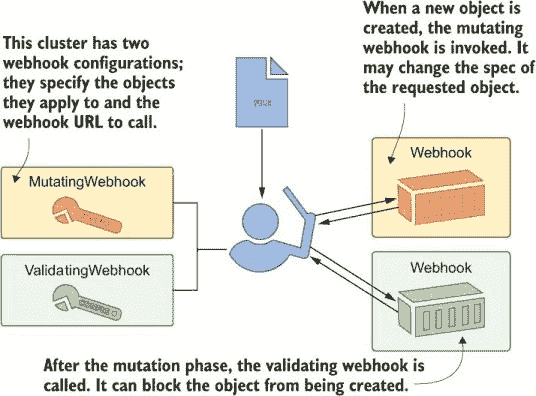

图 16.10 准入 webhook 允许在创建对象时应用您自己的规则。

准入 webhook 非常强大，因为 Kubernetes 会调用您自己的代码，该代码可以运行在任何您喜欢的语言中，并应用您需要的任何规则。在本节中，我们将应用一些我使用 Node.js 编写的 webhook。您不需要编辑任何代码，但您可以在列表 16.4 中看到代码并不特别复杂。

列表 16.4 validate.js，验证 webhook 的自定义逻辑

```
# the incoming request has the object spec--this checks to see
# if the service token mount property is set to false;
# if not, the response stops the object from being created:

if (object.spec.hasOwnProperty("automountServiceAccountToken")) {
    admissionResponse.allowed = 
   (object.spec.automountServiceAccountToken == false);
}
```

webhook 服务器可以在任何地方运行——集群内部或外部——但它们必须通过 HTTPS 提供服务。唯一的问题是如果您想在您的集群内部运行由您自己的证书颁发机构（CA）签名的 webhook，因为 webhook 配置需要一种信任 CA 的方式。这是一个常见的场景，所以我们将在这个练习中逐步解决这个复杂性。

现在尝试一下 首先创建一个证书并将 webhook 服务器部署以使用该证书。

```
# run the Pod to generate a certificate:
kubectl apply -f ./cert-generator.yaml

# when the container is ready, the certificate is done:
kubectl wait --for=condition=ContainersReady pod -l app=cert-generator

# the Pod has deployed the cert as a TLS Secret:
kubectl get secret -l kiamol=ch16

# deploy the webhook server, using the TLS Secret:
kubectl apply -f admission-webhook/

# print the CA certificate:
kubectl exec -it deploy/cert-generator -- cat ca.base64
```

那个练习中的最后一个命令会在您的屏幕上填充 Base64 编码的文本，您将在下一个练习中使用它（尽管不必担心记录下来；我们将自动化所有步骤）。现在您已经有了运行中的 webhook 服务器，由自定义 CA 签发的 TLS 证书进行保护。我的输出如图 16.11 所示。

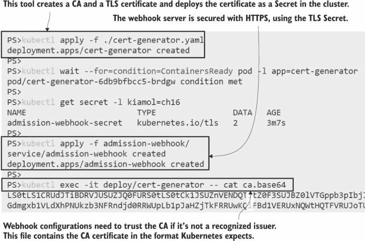


Node.js 应用正在运行，并有两个端点：一个验证 webhook，它检查所有 Pod 规范是否将 `automountServiceAccountToken` 字段设置为 false，以及一个变异 webhook，它应用一个带有 `runAsNonRoot` 标志的容器 SecurityContext。这两个策略旨在协同工作，以确保所有应用程序都有一个基本的安全级别。列表 16.5 显示了 ValidatingWebhookConfiguration 对象的规范。

列表 16.5 validatingWebhookConfiguration.yaml，应用 webhook

```
apiVersion: admissionregistration.k8s.io/v1beta1
kind: ValidatingWebhookConfiguration
metadata:
  name: servicetokenpolicy
webhooks:
  - name: servicetokenpolicy.kiamol.net
    rules:                                   # These are the object 
      - operations: [ "CREATE", "UPDATE" ]   # types and operations
        apiGroups: [""]                      # that invoke the 
        apiVersions: ["v1"]                  # webhook--all Pods.
        resources: ["pods"]
    clientConfig:
      service:
        name: admission-webhook         # The webhook Service to call
        namespace: default
        path: "/validate"               # URL for the webhook
      caBundle: {{ .Values.caBundle }}  # The CA certificate
```

Webhook 配置是灵活的：您可以设置操作类型和 webhook 操作的对象类型。您可以针对同一对象配置多个 webhook——验证 webhook 都会并行调用，并且任何一个都可以阻止操作。此 YAML 文件是我为这个配置对象使用的一个 Helm 图表的一部分，作为注入 CA 证书的简单方法。一个更高级的 Helm 图表将包括一个生成证书并部署 webhook 服务器以及配置的任务——但那样您就看不到它们是如何结合在一起的。

现在试试看：部署 webhook 配置，将生成器 Pod 作为值传递给本地 Helm 图表中的 CA 证书。然后尝试部署一个应用程序，该应用程序会违反策略。

```
# install the configuration object:
helm install validating-webhook admission-webhook/helm/validating-webhook/
 --set caBundle=$(kubectl exec -it deploy/cert-generator
 -- cat ca.base64)

# confirm it’s been created:
kubectl get validatingwebhookconfiguration

# try to deploy an app:
kubectl apply -f vweb/v1.yaml

# check the webhook logs:
kubectl logs -l app=admission-webhook --tail 3

# show the ReplicaSet status for the app:
kubectl get rs -l app=vweb-v1

# show the details:
kubectl describe rs -l app=vweb-v1
```

在这个练习中，您可以看到验证 webhook 的优势和局限性。webhook 在 Pod 级别操作，如果 Pod 不匹配服务令牌规则，它会阻止 Pod 的创建。但是，是 ReplicaSet 和 Deployment 尝试创建 Pod，它们不会被 admission 控制器阻止，所以您需要深入挖掘以找到应用程序为何无法运行的原因。我的输出显示在图 16.12 中，其中 `describe` 命令被简化以仅显示错误行。

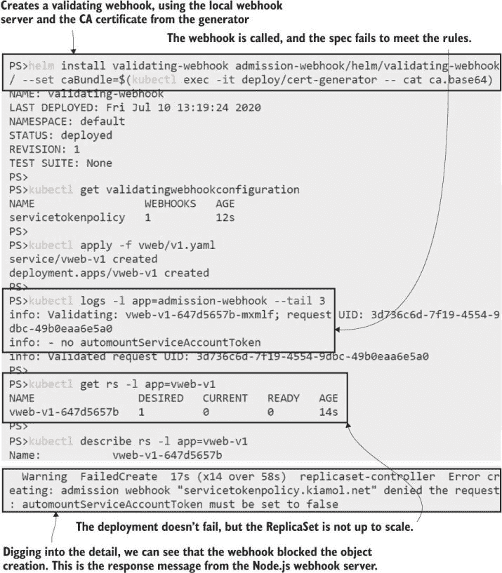

图 16.12 验证 webhook 可以阻止对象创建，无论是由用户还是控制器触发的。

您需要仔细思考您希望 webhook 作用的对象和操作。这种验证可以在 Deployment 级别进行，这将提供更好的用户体验，但它会错过直接创建或由其他类型的控制器创建的 Pods。在 webhook 响应中返回一个清晰的消息也很重要，这样用户就知道如何修复问题。ReplicaSet 将会不断尝试创建 Pod 并失败（在我写这段话的时候，我的集群已经尝试了 18 次），但失败信息告诉我该怎么做，而且这个问题很容易解决。

Admission webhook 的一个问题是它们的可发现性得分非常低。你可以使用 kubectl 来检查是否配置了任何验证 webhook，但这不会告诉你任何关于实际规则的信息，因此你需要将它们在集群外部进行文档化。当涉及到 mutating webhook 时，情况变得更加混乱，因为如果它们按预期工作，它们会向用户提供一个与尝试创建的对象不同的对象。在下一个练习中，你会看到一个有良好意图的 mutating webhook 可能会破坏应用。

现在试试看。使用相同的 webhook 服务器但不同的 URL 路径配置一个 mutating webhook。这个 webhook 为 Pod 规范添加安全设置。部署另一个应用，你会看到来自 webhook 的更改阻止了应用运行。

```
# deploy the webhook configuration:
helm install mutating-webhook admission-webhook/helm/mutating-webhook/
     --set caBundle=$(kubectl exec -it deploy/cert-generator -- cat ca.base64)

# confirm it’s been created:
kubectl get mutatingwebhookconfiguration

# deploy a new web app:
kubectl apply -f vweb/v2.yaml

# print the webhook server logs:
kubectl logs -l app=admission-webhook --tail 5

# show the status of the ReplicaSet:
kubectl get rs -l app=vweb-v2

# show the details:
kubectl describe pod -l app=vweb-v2
```

哎呀。mutating webhook 将一个带有`runAsNonRoot`字段设置为 true 的 SecurityContext 添加到 Pod 规范中。这个标志告诉 Kubernetes 不要在 Pod 中运行任何配置为以 root 身份运行的容器——这个应用就是这样，因为它基于官方的 Nginx 镜像，它确实使用了 root。正如你在图 16.13 中可以看到的，描述 Pod 会告诉你问题是什么，但它没有声明规范已经被修改。当用户再次检查他们的 YAML 文件并发现没有`runAsNonRoot`字段时，他们会非常困惑。

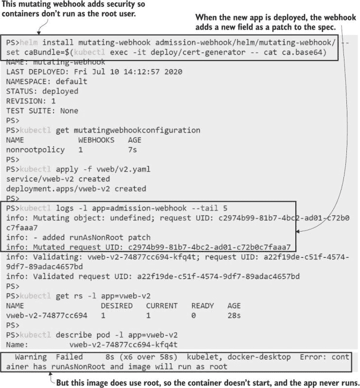

图 16.13 Mutating webhook 可能会导致应用失败，这些失败很难调试。

mutating webhook 内部的逻辑完全由你决定——你可能会意外地更改对象以设置一个无效的规范，它们将永远不会部署。为你的 webhook 配置设置一个更严格的对象选择器是个好主意。列表 16.5 适用于每个 Pod，但你也可以添加命名空间和标签选择器来缩小范围。这个 webhook 已经构建了合理的规则，如果 Pod 规范已经包含`runAsNonRoot`值，webhook 就会保持不变，这样应用就可以被建模为明确要求 root 用户。

Admission controller webhook 是一个有用的工具，你应该了解它，并且它让你可以做些很酷的事情。你可以使用 mutating webhook 向 Pod 添加 sidecar 容器，所以你可以使用标签来识别所有写入日志文件的应用，并让 webhook 自动将这些 Pod 添加一个日志 sidecar。Webhook 可能很危险，但你可以通过良好的测试和配置对象中的选择性规则来减轻这种风险，但它们始终是看不见的，因为逻辑隐藏在 webhook 服务器内部。

在下一节中，我们将探讨一种替代方法，它使用验证 webhook 作为底层，但将其包装在管理层中。*Open Policy Agent* (OPA)允许你在 Kubernetes 对象中定义你的规则，这些规则在集群中是可发现的，并且不需要自定义代码。

## 16.4 使用 Open Policy Agent 控制准入

OPA 是一种统一的方法来编写和实施策略。目标是提供一个标准语言来描述所有类型的策略，以及在不同平台上应用策略的集成。你可以描述数据访问策略并在 SQL 数据库中部署它们，你也可以描述 Kubernetes 对象的准入控制策略。OPA 是另一个 CNCF 项目，它为使用 OPA Gatekeeper 的自定义验证 webhook 提供了一个更干净的替代方案。

OPA Gatekeeper 有三个部分：你在你的集群中部署 Gatekeeper 组件，这些组件包括一个 webhook 服务器和一个通用的 ValidatingWebhookConfiguration；然后你创建一个 *约束模板*，它描述了准入控制策略；然后你基于模板创建一个具体的 *约束*。这是一个灵活的方法，你可以为策略“所有 Pod 必须具有预期的标签”构建一个模板，然后部署一个约束来指定在哪个命名空间中需要哪些标签。

我们将从移除我们添加的自定义 webhook 并部署 OPA Gatekeeper 开始，准备应用一些准入策略。

现在试试看 取消卸载 webhook 组件，并部署 Gatekeeper。

```
# remove the webhook configurations created with Helm:
helm uninstall mutating-webhook
helm uninstall validating-webhook

# remove the Node.js webhook server:
kubectl delete -f admission-webhook/

# deploy Gatekeeper:
kubectl apply -f opa/
```

我在图 16.14 中简化了我的输出——当你运行练习时，你会看到 OPA Gatekeeper 部署安装了许多更多的对象，包括我们尚未遇到的东西，称为 CustomResourceDefinitions（CRDs）。我们将在第二十章中详细讨论这些内容，当我们查看扩展 Kubernetes 时，但现在，了解 CRDs 允许你定义 Kubernetes 为你存储和管理的新类型对象就足够了。

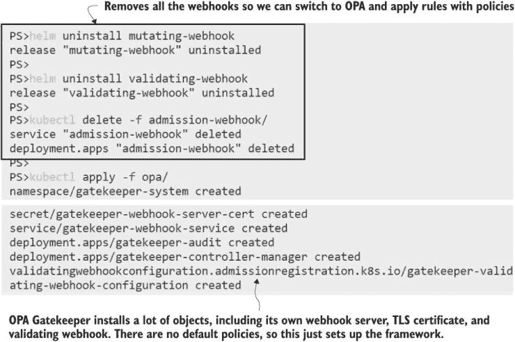

图 16.14 OPA Gatekeeper 负责处理运行 webhook 服务器的所有复杂部分。

Gatekeeper 使用 CRDs，因此你可以创建模板和约束作为普通的 Kubernetes 对象，这些对象在 YAML 中定义，并使用 kubectl 部署。模板包含在称为 Rego 的语言中定义的通用策略定义（发音为“ray-go”）。它是一种表达性语言，允许你评估某些输入对象的属性，以检查它们是否满足你的要求。这是一件需要学习的事情，但 Rego 有一些显著的优势：策略相对容易阅读，并且它们位于你的 YAML 文件中，因此它们不会隐藏在自定义 webhook 的代码中；并且有许多示例 Rego 策略来强制执行我们在本章中查看的规则。列表 16.6 显示了一个要求对象具有标签的 Rego 策略。

列表 16.6 requiredLabels-template.yaml，一个基本的 Rego 策略

```
# This fetches all the labels on the object and all the 
# required labels from the constraint; if required labels
# are missing, that’s a violation that blocks object creation.

violation[{"msg": msg, "details": {"missing_labels": missing}}] {
  provided := {label | input.review.object.metadata.labels[label]}
  required := {label | label := input.parameters.labels[_]}
  missing := required - provided
  count(missing) > 0
  msg := sprintf("you must provide labels: %v", [missing])
}
```

你使用 Gatekeeper 作为约束模板部署该策略，然后部署一个强制执行模板的约束对象。在这种情况下，名为 RequiredLabels 的模板使用参数来定义所需的标签。列表 16.7 显示了一个特定约束，要求所有 Pod 都必须有 `app` 和 `version` 标签。

列表 16.7 requiredLabels.yaml，来自 Gatekeeper 模板的一个约束

```
apiVersion: constraints.gatekeeper.sh/v1beta1
kind: RequiredLabels             # The API and Kind identify this as
metadata:                        # a Gatekeeper constraint from the 
  name: requiredlabels-app       # RequiredLabels template.
spec:
  match:
    kinds:
      - apiGroups: [""]
        kinds: ["Pod"]           # The constraint applies to all Pods.
  parameters:
    labels: ["app", "version"]   # Requires two labels to be set
```

这更容易阅读，你可以从同一个模板部署许多约束。OPA 方法让你能够构建一个标准的策略库，用户可以在他们的应用程序规范中应用，而无需深入研究 Rego。在下一个练习中，你将部署列表 16.7 中的约束，以及另一个要求所有 Deployments、Services 和 ConfigMaps 都具有`kiamol`标签的约束。然后你将尝试部署一个待办事项应用程序的版本，该版本将违反所有这些策略。

现在尝试一下：使用 Gatekeeper 部署所需的标签策略，并查看它们是如何应用的。

```
# create the constraint template first: 
kubectl apply -f opa/templates/requiredLabels-template.yaml

# then create the constraint:
kubectl apply -f opa/constraints/requiredLabels.yaml

# the to-do list spec doesn’t meet the policies:
kubectl apply -f todo-list/

# confirm the app isn’t deployed:
kubectl get all -l app=todo-web
```

你可以在图 16.15 中看到，这个用户体验是干净的——我们试图创建的对象没有所需的标签，因此它们被阻止，我们在 kubectl 的输出中看到了 Rego 策略的消息。

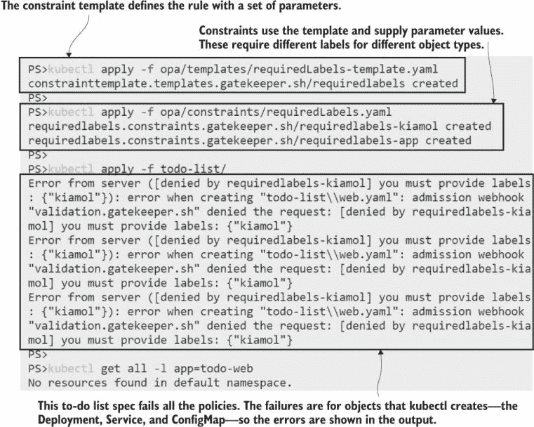

图 16.15 部署失败显示了 Rego 策略返回的清晰错误消息。

Gatekeeper 使用验证 webhook 来评估约束，当你在创建的对象中遇到失败时，这非常明显。当由控制器创建的对象失败验证时，这就不那么明显了，因为控制器本身可能没有问题。我们在 16.3 节中看到了这一点，因为 Gatekeeper 使用相同的验证机制，所以它也有同样的问题。如果你更新待办事项应用程序，使其部署满足标签要求，但 Pod 规范不满足，你将会看到这一点。

现在尝试一下：部署一个更新的待办事项列表规范，其中所有对象（除了 Pod）都有正确的标签。

```
# deploy the updated manifest:
kubectl apply -f todo-list/update/web-with-kiamol-labels.yaml

# show the status of the ReplicaSet:
kubectl get rs -l app=todo-web

# print the detail:
kubectl describe rs -l app=todo-web

# remove the to-do app in preparation for the next exercise:
kubectl delete -f todo-list/update/web-with-kiamol-labels.yaml
```

在这个练习中，你会发现招生政策是有效的，但你只有在深入查看失败的 ReplicaSet 的描述时，如图 16.16 所示，才会看到问题。这并不是一个很好的用户体验。你可以通过一个更复杂的政策来修复这个问题，该政策在部署级别应用并检查 Pod 模板中的标签——这可以通过约束模板的 Rego 扩展逻辑来实现。

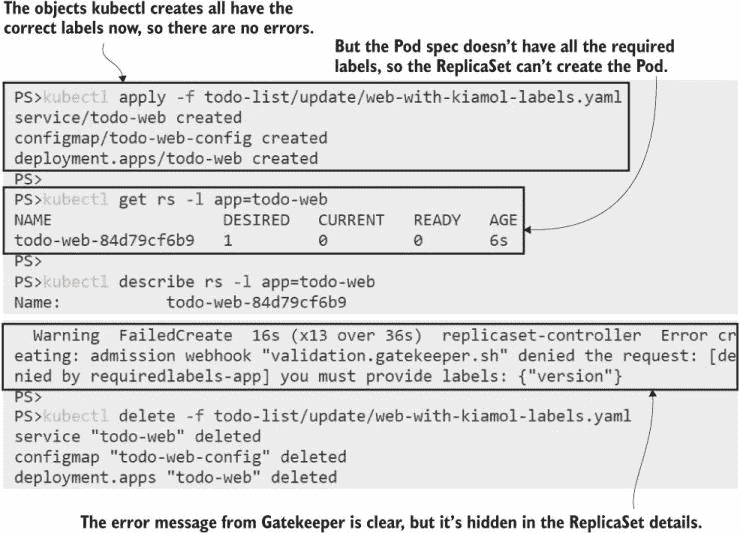

图 16.16 OPA Gatekeeper 提供了一个更好的流程，但它仍然是一个验证 webhook 的包装器。

我们将用以下一系列招生政策结束本节，这些政策涵盖了更多生产最佳实践，所有这些都有助于使你的应用程序更加安全：

+   所有 Pod 都必须定义容器探测。这是为了保持你的应用程序健康，但失败的健康检查也可能表明攻击的意外活动。

+   Pods 只能从批准的镜像仓库运行容器。将容器限制在一系列“黄金”仓库中，这些仓库包含受保护的生产镜像，确保恶意有效载荷无法部署。

+   所有容器都必须设置内存和 CPU 限制。这可以防止受损害的容器耗尽节点的计算资源，并使所有其他 Pod 饿死。

这些通用策略适用于几乎每个组织。您可以通过为每个应用程序的网络策略和每个 Pod 的安全上下文添加约束来扩展它们。正如您在本章中学到的，并非所有规则都是通用的，因此您可能需要选择性地应用这些约束。在下一个练习中，您将应用生产约束集到单个命名空间。

现在尝试一下 部署一组新的约束和一个待办事项应用程序版本，其中 Pod 规范大多数策略都失败了。

```
# create templates for the production constraints:
kubectl apply -f opa/templates/production/

# create the constraints:
kubectl apply -f opa/constraints/production/

# deploy the new to-do spec:
kubectl apply -f todo-list/production/

# confirm the Pods aren’t created:
kubectl get rs -n kiamol-ch16 -l app=todo-web

# show the error details:
kubectl describe rs -n kiamol-ch16 -l app=todo-web
```

图 16.17 显示 Pod 规范除了一个规则外都失败了——我的镜像仓库策略允许`kiamol`组织中的任何来自 Docker Hub 的镜像，因此待办事项应用程序的镜像有效。但没有版本标签，没有健康检查，没有资源限制，这个规范不适合生产。

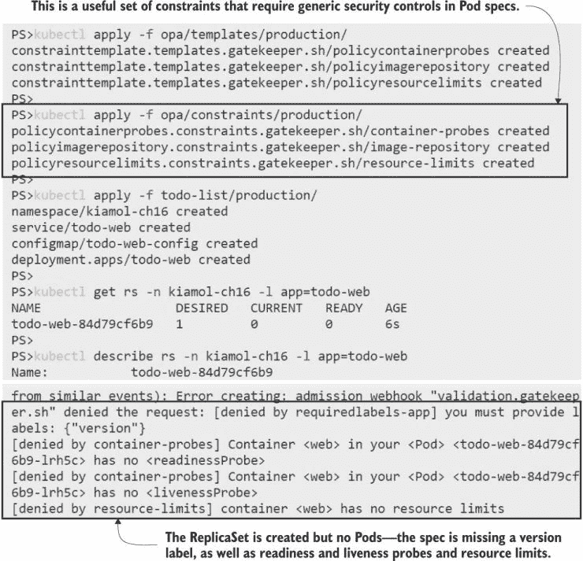

图 16.17 所有约束都已评估，您可以在 Rego 输出中看到完整的错误列表。

只为证明这些策略是可行的，OPA Gatekeeper 实际上会允许待办事项应用程序运行，您可以应用一个更新的规范，该规范符合所有生产规则。如果您比较生产文件夹和更新文件夹中的 YAML 文件，您会看到新规范只是向 Pod 模板添加了所需的字段；应用程序没有显著变化。

现在尝试一下 应用一个生产就绪版本的待办事项规范，并确认应用程序确实正在运行。

```
# this spec meets all production policies:
kubectl apply -f todo-list/production/update

# wait for the Pod to start:
kubectl wait --for=condition=ContainersReady pod -l app=todo-web -n kiamol-ch16

# confirm it’s running:
kubectl get pods -n kiamol-ch16 --show-labels

# get the URL for the app and browse:
kubectl get svc todo-web -n kiamol-ch16
 -o jsonpath='http://{.status.loadBalancer.ingress[0].*}:8019'
```

图 16.18 显示了应用程序在更新部署被 OPA Gatekeeper 允许后正在运行。

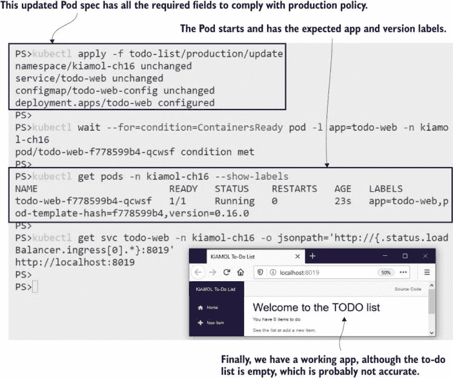

图 16.18 约束功能强大，但您需要确保应用程序实际上可以遵守。

Open Policy Agent 是应用准入控制比自定义验证 webhook 更干净的方法，我们查看的示例策略只是让您入门的一些简单想法。Gatekeeper 没有突变功能，但如果您有明确的案例来修改规范，您可以将它与您自己的 webhook 结合使用。您可以使用约束来确保每个 Pod 规范都包含一个应用程序配置文件标签，然后根据您的配置文件突变规范——将您的.NET Core 应用程序设置为以非 root 用户运行，并将所有 Go 应用程序切换到只读文件系统。

保护您的应用程序是关闭利用路径的过程，一个彻底的方法包括本章中涵盖的所有工具以及更多。我们将以查看一个安全的 Kubernetes 景观作为结束。

## 16.5 在 Kubernetes 中深入理解安全性

构建管道可能会被破坏，容器图像可能会被修改，容器可以以特权用户身份运行易受攻击的软件，并且能够访问 Kubernetes API 的攻击者甚至可以控制你的集群。直到应用程序被替换并且你可以确认在它的操作期间没有发生安全漏洞，你才知道你的应用程序是 100% 安全的。达到这个快乐的地方意味着在整个软件供应链中应用深度安全。本章重点介绍了运行时应用程序的安全性，但你应该在此之前开始扫描容器图像以查找已知漏洞。

安全扫描器会检查图像内部，识别二进制文件，并在 CVE（常见漏洞和暴露）数据库中进行检查。扫描结果会告诉你应用堆栈、依赖项或图像中的操作系统工具中是否存在已知的漏洞利用。商业扫描器与受管理的注册表集成（你可以使用与 Azure 容器注册表集成的 Aqua Security），或者你可以运行自己的（Harbor 是 CNCF 注册表项目，它支持开源扫描器 Clair 和 Trivy；Docker Desktop 与 Snyk 集成以进行本地扫描）。

你可以设置一个管道，只有当扫描结果为清白时，图像才会被推送到生产存储库。结合存储库准入策略，你可以有效地确保只有当图像安全时，容器才会运行。然而，在安全配置的容器中运行的图像仍然是一个目标，你应该使用一个工具来监控容器的异常活动，并可以生成警报或关闭可疑行为，以关注运行时安全性。Falco 是 CNCF 的运行时安全项目，Aqua 和 Sysdig（以及其他一些公司）提供了受支持的商业选项。

感到不知所措？你应该将 Kubernetes 的安全视为一个起点，这个起点是我在本章中介绍的技术。你可以首先采用安全上下文，然后是网络策略，当你清楚对你重要的规则时，再转向准入控制。基于角色的访问控制，我们在第十七章中介绍，是下一个阶段。如果你的组织有增强的安全要求，安全扫描和运行时监控是你可以采取的进一步步骤。但现在我不会给你更多的东西——让我们整理一下，为实验室做好准备。

现在尝试一下 删除我们创建的所有对象。

```
kubectl delete -f opa/constraints/ -f opa/templates/ -f opa/gatekeeper.yaml
kubectl delete all,ns,secret,networkpolicy -l kiamol=ch16
```

## 16.6 实验室

在本章的开头，我说过主机路径的卷挂载是一个潜在的攻击向量，但在练习中我们没有解决这个问题，所以我们在实验室中解决它。这是一个完美的准入控制场景，如果 Pod 使用挂载在主机上敏感路径的卷，它们应该被阻止。我们将使用 OPA Gatekeeper，我已经为你编写了 Rego，所以你只需要编写一个约束条件。

+   首先在实验室文件夹中部署 `gatekeeper.yaml`。

+   然后部署 `restrictedPaths-template.yaml` 中的约束模板——你需要查看规范以了解如何构建你的约束条件。

+   编写并部署一个使用模板并限制以下主机路径的约束：`/`、`/bin` 和 `/etc`。该约束应仅应用于带有标签 `kiamol=ch16-lab` 的 Pods。

+   在实验室文件夹中部署 `sleep.yaml`。你的约束应该阻止 Pod 的创建，因为它使用了受限的卷挂载。

这个问题相当直接，尽管你可能需要阅读有关匹配表达式的相关内容，这是 Gatekeeper 实现标签选择器的方式。我的解决方案已上传至 GitHub：[`github.com/sixeyed/kiamol/blob/master/ch16/lab/README.md`](https://github.com/sixeyed/kiamol/blob/master/ch16/lab/README.md)。
