# 17 使用基于角色的访问控制保护资源

您对您的实验室集群拥有完全控制权：您可以部署工作负载、读取机密，甚至如果您想看看它们返回得有多快，还可以删除控制平面组件。您不希望在生产集群中让任何人拥有如此大的权力，因为如果他们拥有完整的管理员控制权，那么这实际上就是他们的集群。他们的账户可能会被破坏，然后某个恶意方会删除您所有的应用程序，并将您的集群变成他们的个人比特币矿工。Kubernetes 通过基于角色的访问控制（RBAC）支持最小权限访问。在本章中，您将了解 RBAC 是如何工作的以及随之而来的限制访问的一些挑战。

RBAC 适用于使用 kubectl 进行工作的最终用户以及使用服务账户令牌通过 Kubernetes API 进行内部组件的访问。您需要为这些不同的用途采用不同的 RBAC 方法，我们将在本章中介绍，包括最佳实践。您还将了解 Kubernetes 如何获取外部用户的凭证，以及如果您没有外部身份验证系统，您如何管理集群内的最终用户。RBAC 是一个简单的模型，但有很多可移动的部分，因此很难跟踪谁可以做什么，所以我们将通过查看管理工具来结束本章。

## 17.1 Kubernetes 如何保护对资源的访问

RBAC 通过授予对资源执行操作的权限来工作。每种资源类型都可以被保护，因此您可以设置权限来获取 Pod 详情、列出服务以及删除机密。您将权限应用于一个主题，这可能是用户、系统账户或组，但您不会直接应用它们，因为这会创建一个难以管理的权限蔓延。您在角色中设置权限，并通过角色绑定将角色应用于一个或多个主题，如图 17.1 所示。

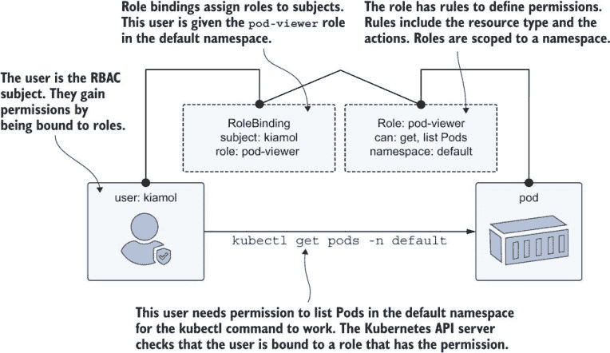

图 17.1 RBAC 是一种安全抽象；对象权限通过角色和绑定授予。

一些 Kubernetes 资源是特定于命名空间的，而有些是集群范围的，因此 RBAC 结构实际上有两套对象来描述和分配权限：Role 和 RoleBinding 对象在命名空间对象上工作，而 ClusterRole 和 ClusterRoleBinding 对象在整个集群上工作。从技术上讲，RBAC 是 Kubernetes 中的一个可选组件，但现在几乎在所有平台上都启用了它。您可以使用标准的 kubectl 命令来检查它是否已启用并查看一些默认的角色。

现在试试看。您可以通过打印它支持的 API 版本来检查您集群中的功能。Docker Desktop、K3s 以及所有云平台默认支持 RBAC。

```
# switch to this chapter’s folder:
cd ch17

# PowerShell doesn’t have a grep command; run this on Windows to add it:
. .\grep.ps1

# check that the API versions include RBAC:
kubectl api-versions | grep rbac

# show the admin cluster roles:
kubectl get clusterroles | grep admin 

# show the details of the cluster admin:
kubectl describe clusterrole cluster-admin
```

你可以在图 17.2 中看到许多内置的角色都是集群级别的。其中一个就是 cluster-admin，这就是你在你的实验室集群中的角色。它对所有资源上的所有操作（Kubernetes 称它们为*动词*）都有权限，这就是为什么你可以做任何你想做的事情。下一个最强大的角色是 admin，它在所有对象上几乎都有权限，但限制在单个命名空间内。

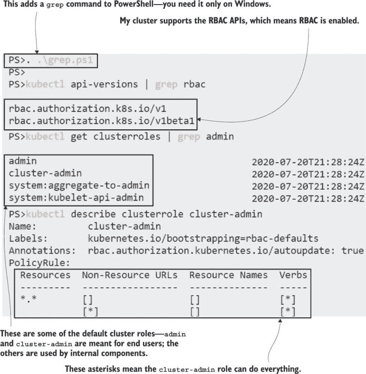

图 17.2 RBAC 为用户和服务账户提供了一组默认的角色和绑定。

这一切都很不错，但*谁*拥有 cluster-admin 角色？你不会用你的实验室的用户名和密码登录 kubectl，而且在 Kubernetes 中没有用户对象，所以 Kubernetes 是如何知道用户是谁的呢？Kubernetes 不验证最终用户；它依赖于外部身份提供者，并信任它们进行验证。在生产系统中，你的集群将被配置为使用你组织现有的身份验证系统——Active Directory (AD)、LDAP 和 OpenID Connect (OIDC)都是可行的选项。

云平台将 Kubernetes 与其自身的身份验证集成，因此 AKS 用户使用 Azure AD 账户进行身份验证。你可以配置自己的 OIDC 提供者，但设置相当复杂，所以在我们实验室集群中，我们将坚持使用证书。Kubernetes 可以为最终用户颁发客户端证书，你可以通过用户名来请求这些证书。当 Kubernetes API 服务器看到传入请求中的证书时，它会信任发行者（即自身）并接受用户是他们所说的那个人。我们将首先为将在集群中拥有有限访问权限的用户生成一个新的证书。

现在尝试一下 创建 Kubernetes 签名证书请求需要几个步骤，我已经在容器镜像中编写了脚本。从这个镜像中运行一个 Pod 来生成证书，然后将证书和密钥复制到你的本地机器上。

```
# run the certificate generator: 
kubectl apply -f user-cert-generator.yaml

# wait for the container to start:
kubectl wait --for=condition=ContainersReady pod user-cert-generator

# print the logs:
kubectl logs user-cert-generator --tail 3

# copy the files onto your local disk:
kubectl cp user-cert-generator:/certs/user.key user.key
kubectl cp user-cert-generator:/certs/user.crt user.crt
```

你会在第一个命令的输出中看到，练习创建了一些自己的角色和绑定。Pod 容器运行一个脚本，使用 kubectl 颁发客户端证书。这是一个特权操作，所以清单确保 Pod 有它需要的权限。步骤有点复杂，这就是为什么我把它们封装在一个容器镜像中——脚本`user-cert-generator/start.sh`执行工作，如果你想深入了解细节。我图 17.3 中的输出显示，证书和密钥文件在我的本地机器上，这就是我作为已验证用户访问集群所需的一切。

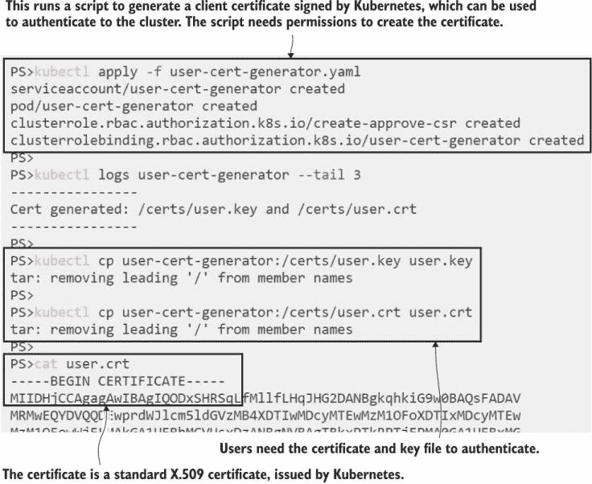

图 17.3 Kubernetes 可以为新的已验证用户颁发自己的客户端证书。

如果您对 OpenSSL 和证书感兴趣，您可以解码该证书文件，并看到通用名称是 reader@kiamol.net。Kubernetes 将其视为用户名称，这将是我们可以用来应用 RBAC 的主题。权限在 RBAC 中都是累加的，因此主题初始时没有权限，随着角色绑定的应用，最终将拥有所有角色权限的总和。RBAC 模型是仅授权的——您不能拒绝权限。权限的缺失等同于拒绝。我们可以使用新证书设置 kubectl 上下文，并确认用户初始时没有访问权限。

现在尝试一下：使用生成的证书作为凭据，在 kubectl 中创建一个新的上下文，并确认您可以使用它访问集群。

```
# set the credentials for a new context from the client certificate:
kubectl config set-credentials reader --client-key=./user.key 
--client-certificate=./user.crt --embed-certs=true

# set the cluster for the context:
kubectl config set-context reader --user=reader --cluster $(kubectl config view -o jsonpath='{.clusters[0].name}')

# try to deploy a Pod using the new context--
# if your cluster is configured with authentication
# this won’t work as the provider tries to authenticate:
kubectl apply -f sleep/ --context reader 

# impersonate the user to confirm their permissions:
kubectl get pods --as reader@kiamol.net
```

在 kubectl 中，一个上下文有两个部分：用户凭据和要连接的集群。在图 17.4 中，您可以看到用户配置了客户端证书，这些证书嵌入到 kubectl 配置文件中。如果您使用这样的客户端证书，您的配置文件是敏感的：如果有人获得了副本，他们就可以使用您的上下文中之一连接到您的集群。

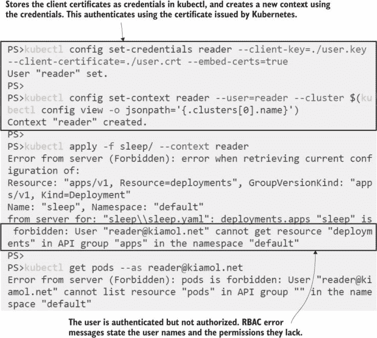

图 17.4 已认证但未授权——用户初始时没有 RBAC 角色。

练习中的最后一个命令使用模拟来确认新用户没有任何权限，但 Kubernetes 不存储用户。您可以在`as`参数中使用任何随机的字符串作为用户名，输出将告诉您它没有权限。Kubernetes 实际上寻找的是任何与请求中名称匹配的用户名称的角色绑定。如果没有绑定，则没有权限，因此操作被阻止，无论用户名是否存在于认证系统中。列表 17.1 显示了我们可以应用的角色绑定，以给新用户在默认命名空间中只读访问资源的权限。

列表 17.1 reader-view-default.yaml，使用角色绑定应用权限

```
apiVersion: rbac.authorization.k8s.io/v1
kind: RoleBinding
metadata:
  name: reader-view
  namespace: default                    # The scope of the binding
subjects:
- kind: User
  name: reader@kiamol.net               # The subject is the new user
  apiGroup: rbac.authorization.k8s.io
roleRef:
  kind: ClusterRole
  name: view                            # Gives them the view role for  
  apiGroup: rbac.authorization.k8s.io   # objects in the default namespace
```

这是一种开始使用 RBAC 的好方法——使用预定义的集群角色，并将它们绑定到指定命名空间的主题。随着我们进入本章，您将看到如何构建自定义角色，当您需要明确的访问权限时，它们非常棒，但规模扩大时管理起来会变得困难。角色绑定将主题从它们拥有的角色中抽象出来，因此您可以在不更改角色或对象的情况下更改访问权限。当您从列表 17.1 部署角色绑定时，新用户将能够查看默认命名空间中的资源。

现在尝试一下：应用一个角色绑定，并模拟新用户以确认他们只有对资源的只读访问权限。

```
# deploy a sleep Pod as your normal user:
kubectl apply -f sleep/

# deploy the role binding so the reader can view the Pod:
kubectl apply -f role-bindings/reader-view-default.yaml

# confirm the user sees Pods in the default namespace:
kubectl get pods --as reader@kiamol.net 

# confirm the user is blocked from the system namespace:
kubectl get pods -n kube-system --as reader@kiamol.net

# confirm the user can’t delete Pods--this will fail:
kubectl delete -f sleep/ --as reader@kiamol.net
```

您可以在图 17.5 中看到视图角色的实际应用——新用户可以列出 Pods，但仅限于默认命名空间。该角色没有删除对象的权限，因此读者用户可以看到 Pods 但不能删除它们。

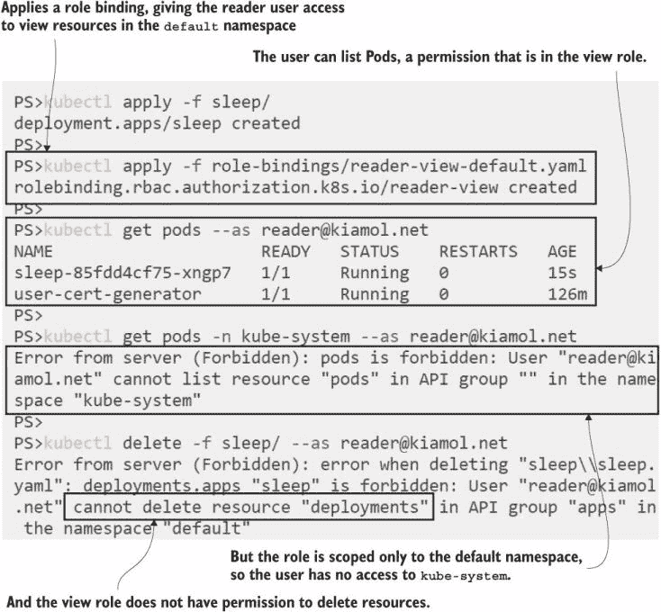

图 17.5 角色绑定的作用域仅限于一个命名空间。

用户和角色之间的脱节感觉有点奇怪，可能会导致问题。Kubernetes 与认证系统没有真正的集成，因此它不会验证用户名是否正确或组是否存在。对于最终用户而言，RBAC 中配置的完全是严格的授权。但你知道，从第十六章中你可以了解到，你还需要保护使用 Kubernetes API 的应用程序的集群内部安全，集群管理服务账户的认证和授权。

## 17.2 在集群内保护资源访问

每个命名空间都会自动创建一个默认服务账户，任何未指定服务账户的 Pod 都会使用默认账户。默认服务账户就像任何其他 RBAC 主体一样：它一开始没有任何权限，直到你添加一些，你将使用与最终用户主体相同的角色绑定和集群角色绑定来添加它们。服务账户之所以不同，是因为应用程序通常需要更有限的权限集，因此最佳实践是为每个组件创建一个专用的服务账户。

创建服务账户并设置角色和绑定会增加很多开销，但请记住，这并不是限制你应用程序模型中资源访问的问题。你可以在你的清单中包含 ConfigMaps 和 Secrets 以及你需要的任何其他内容，它们在运行时不会受到服务账户权限的影响。服务账户的 RBAC 仅关于保护使用 Kubernetes API 服务器的应用程序——比如 Prometheus，它会查询 API 以获取 Pod 列表。这种情况在你的标准商业应用程序中应该是很少见的，所以这个程序只是关于保护那些如果你为每个应用程序在同一个命名空间中使用默认服务账户会遇到问题的特殊情况。我们将从这个部分开始，创建一个新的命名空间来查看其默认服务账户。

现在试试看 创建一个新的命名空间，并检查其服务账户的权限——如果你使用 Docker Desktop，还需要修复其上的一个 bug。

```
# on Docker Desktop for Mac run this to fix the RBAC setup:
kubectl patch clusterrolebinding docker-for-desktop-binding --type=json
     --patch $'[{"op":"replace", "path":"/subjects/0/name", 
                 "value":"system:serviceaccounts:kube-system"}]'

# OR on Docker Desktop for Windows:
kubectl patch clusterrolebinding docker-for-desktop-binding 
--type=json --patch '[{\"op\":\"replace\",
                       \"path\":\"/subjects/0/
name\", \"value\":\"system:serviceaccounts:kube-system\"}]'

# create the new namespace:
kubectl apply -f namespace.yaml

# list service accounts:
kubectl get serviceaccounts -n kiamol-ch17

# check permissions for your own account:
kubectl auth can-i "*" "*"

# check permissions for the new service account:
kubectl auth can-i "*" "*" --as system:serviceaccount:kiamol-ch17:default

kubectl auth can-i get pods -n kiamol-ch17 --as system:serviceaccount:kiamol-ch17:default
```

`can-i` 命令是一个检查权限而不实际影响任何对象的有用方法。你可以在图 17.6 中看到，你可以将此命令与模拟和命名空间范围结合使用，以显示另一个主体的权限，这可以是用户或服务账户。

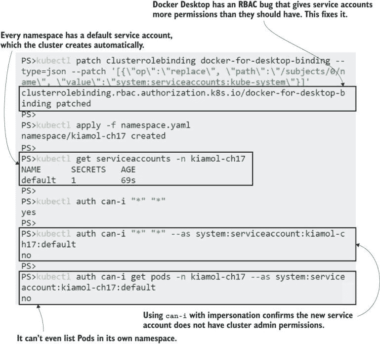

图 17.6 系统控制器确保每个命名空间都有一个默认服务账户。

你在练习中看到，新的服务账户从零权限开始，如果你为所有应用使用默认账户，麻烦就从此开始了。每个应用可能都需要一组权限——它们都被添加到默认账户中，很快这个账户就拥有了比所需更多的权力。如果使用该服务账户的任何应用被攻破，攻击者就会发现自己获得了一组额外的角色。第 17.1 节中的证书生成器就是一个很好的例子：它使用 Kubernetes API 发布客户端证书，这是一个特权操作。列表 17.2 展示了应用的服务账户使用的集群角色，以获取所需的权限。完整的清单还包含了一个集群角色绑定。

列表 17.2 user-cert-generator.yaml，用于证书生成的自定义集群角色

```
apiVersion: rbac.authorization.k8s.io/v1
kind: ClusterRole
metadata:
  name: create-approve-csr
rules:
- apiGroups: ["certificates.k8s.io"]        # Generating certificates
  resources: ["certificatesigningrequests"] # needs permission to create 
  verbs: ["create", "get", "list", "watch"] # a signing request.
- apiGroups: ["certificates.k8s.io"]
  resources: ["certificatesigningrequests/approval"]
  verbs: ["update"]                          # And to approve the request
- apiGroups:  ["certificates.k8s.io"]
  resources:  ["signers"]                    # Uses the cluster to sign
  resourceNames:  ["kubernetes.io/kube-apiserver-client"]
  verbs: ["approve"]
```

生成证书需要使用 API 服务器发行者创建签名请求并批准它们，如果我很懒，我可以基于这个应用不是公开可访问的、攻击面很小、没有其他应用使用该账户的论据，将这个角色绑定到默认的服务账户上。但是，当然，这是默认服务账户，Kubernetes 默认挂载账户令牌。如果有人在同一个命名空间中部署了一个有漏洞的 Web 应用，它将有权生成用户证书，攻击者就可以生成他们自己的凭证。相反，我创建了一个专门用于证书生成器的服务账户。

现在试试 Confirm that the custom service account for the certificate generator app has permission to create certificate-signing requests, but standard service accounts don’t have that permission.

```
# run a can-i check inside the certificate generator Pod:
kubectl exec user-cert-generator -- kubectl auth can-i create csr
 --all-namespaces

# use impersonation for the same check:
kubectl auth can-i create csr -A --as system:serviceaccount:default:user-cert-generator

# confirm the new service account doesn’t have the permission:
kubectl auth can-i create csr -A --as system:serviceaccount:kiamol-ch17:default
```

在这个练习中，你会发现只有证书生成器服务账户才有证书权限。实际上，账户只有这些权限，所以你不能用它来列出命名空间或删除持久卷声明或其他任何东西。你还在图 17.7 中看到，引用服务账户的语法与 Kubernetes 中的其他资源引用不同——`system:serviceaccount` 是前缀，后面跟着冒号分隔的命名空间和账户名称。

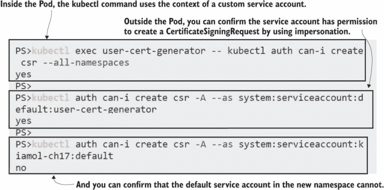

图 17.7 使用单独的服务账户为应用确保最小权限方法。

发布客户端证书不是典型应用的需求，但为每个使用 Kubernetes API 的应用创建单独的服务账户仍然是一个最佳实践。在本节中，我们还有两个示例来展示应用可能需要如何使用 API 以及如何保护它们。在 RBAC 中，你需要理解绑定的作用域，以确保你在正确的级别应用权限——通常是单个命名空间。第一个例子是一个简单的 Web 应用，它可以列出 Pods 并允许你删除它们。

现在试试 Run the Kube Explorer app，它通过 Web UI 列出 Pods。这个部署使用了一个自定义的服务账户和角色来管理权限。

```
# deploy the app and the RBAC rules:
kubectl apply -f kube-explorer/

# wait for the Pod:
kubectl wait --for=condition=ContainersReady pod -l app=kube-explorer

# get the URL for the app:
kubectl get svc kube-explorer -o jsonpath='http://{.status.loadBalancer.ingress[0].*}:8019' 

# browse to the app, and confirm you can view and delete
# Pods in the default namespace; then add ?ns=kube-system 
# to the URL, and you’ll see an error.
```

我的输出在图 17.8 中，你可以看到应用程序正在愉快地列出和删除默认命名空间中的 Pods。当你切换到不同的命名空间时，你会看到一个授权错误，这来自 Kubernetes API（它是一个 HTTP API，所以你实际上会收到一个 403 禁止响应）。应用程序使用挂载在 Pod 中的服务账户令牌进行身份验证，并且该账户只有默认命名空间的列出和删除 Pod 权限，没有其他命名空间的权限。

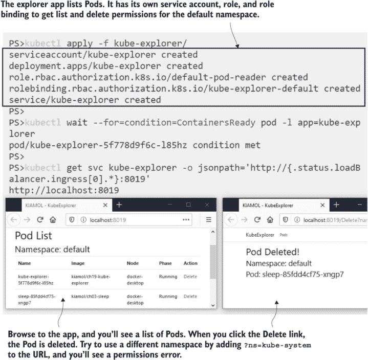

图 17.8 拥有自己的服务账户和足够权限完成其工作的应用程序

这样的小程序构建起来不费时，因为大多数语言都有 Kubernetes 库，该库通过使用默认路径中的令牌来处理身份验证。它们对于不需要 kubectl 访问权限且不需要学习 Kubernetes 的工作原理仅为了查看正在运行的内容的团队非常有用。此应用程序需要 RBAC 权限来列出 Pods、显示它们的详细信息以及删除它们。目前，这些权限在一个绑定到默认命名空间的角色中。为了使其他命名空间可用，我们需要添加更多角色和绑定。

列表 17.3 显示了授予在`kube-system`命名空间中获取和列出 Pod 权限的新规则。这里最重要的要点是，角色元数据中的命名空间不仅仅是角色创建的地方，也是角色应用的范围。此角色授予对`kube-system`命名空间中 Pods 的访问权限。

列表 17.3 rbac-with-kube-system.yaml，将角色应用于系统命名空间

```
apiVersion: rbac.authorization.k8s.io/v1
kind: Role
metadata:
  name: system-pod-reader
  namespace: kube-system        # Scoped to the system namespace
rules:
- apiGroups: [""]               # The API group of the object spec
  resources: ["pods"]           # Pods are in the core group, which
  verbs: ["get", "list"]        # is identified with an empty string.
```

将该角色添加到应用程序服务账户的绑定角色位于同一清单文件中，但我将其拆分为两个列表，以便分别检查它们并理解所有命名空间。角色的命名空间是权限的范围；角色绑定引用角色，并且它需要在同一命名空间中，但它也引用主体，这可以是在不同的命名空间中。在列表 17.4 中，角色绑定与角色一起在`kube-system`命名空间中创建。它们之间，它们提供了对该命名空间中 Pods 的访问权限。主体是应用程序的服务账户，它在`default`命名空间中。

列表 17.4 rbac-with-kube-system.yaml，将角色绑定到主体

```
apiVersion: rbac.authorization.k8s.io/v1
kind: RoleBinding
metadata:
  name: kube-explorer-system
  namespace: kube-system         # Needs to match the role
subjects:
- kind: ServiceAccount
  name: kube-explorer            # The subject can be in a
  namespace: default             # different namespace.
roleRef:
  apiGroup: rbac.authorization.k8s.io
  kind: Role
  name: system-pod-reader
```

当你遇到不适合标准集群角色的权限要求时，你可以看到事情是如何螺旋上升的。在这种情况下，不同命名空间的权限是不同的，所以你需要为每个命名空间设置一组角色和角色绑定。当你部署这些新规则时，应用程序将能够显示系统 Pods。访问规则在 API 调用时进行评估，所以应用程序或服务账户没有变化；新的权限立即生效。

现在试试它 向 Kube Explorer 应用程序添加系统 Pods 的访问规则。

```
# apply the new role and binding
kubectl apply -f kube-explorer/update/rbac-with-kube-system.yaml

# refresh the explorer app with the path /?ns=kube-system. 
# you can see the Pods now, but you can’t delete them.
```

如图 17.9 所示，管理许多角色和绑定所带来的回报是您可以构建非常细粒度的访问策略。此应用可以列出和删除默认命名空间中的 Pod，但它只能列出系统命名空间中的 Pod。其他应用不可能意外获得这些权限；它们需要指定 Kube Explorer 服务账户，并由有权使用该账户的人部署。


图 17.9 RBAC 规则在应用或删除绑定时立即生效。

本节最后一个示例展示了应用可能需要从不在 ConfigMap 或 Secret 中的集群获取一些配置数据。我们将再次使用待办事项应用。这个版本在主页上显示横幅消息，并从 Pod 运行的命名空间上的`kiamol`标签获取横幅内容。一个初始化容器使用服务账户令牌设置 kubectl，获取命名空间的标签值，并将其写入配置文件，然后应用容器拾取该文件。这不是一个非常现实的场景，但它展示了如何将集群中的数据注入到应用配置中。

现在试试看：部署新的待办事项应用，并确认横幅消息是否已从命名空间标签中填充。

```
# print the label value on the namespace:
kubectl get ns kiamol-ch17 --show-labels

# deploy the to-do list app:
kubectl apply -f todo-list/

# wait for the Pod to start:
kubectl wait --for=condition=ContainersReady pod -l app=todo-web -n kiamol-ch17

# print the logs of the init container:
kubectl logs -l app=todo-web -c configurator --tail 1 -n kiamol-ch17

# get the URL, and browse to the app:
kubectl get svc todo-web -n kiamol-ch17
 -o jsonpath='http://{.status.loadBalancer.ingress[0].*}:8020'
```

我的输出显示在图 17.10 中，您可以看到初始化容器已从命名空间中获取了元数据。应用容器不使用 Kubernetes API，但服务账户令牌被挂载到 Pod 中的所有容器上，因此应用可能被破坏，攻击者可能利用服务账户的上下文使用 Kubernetes API。

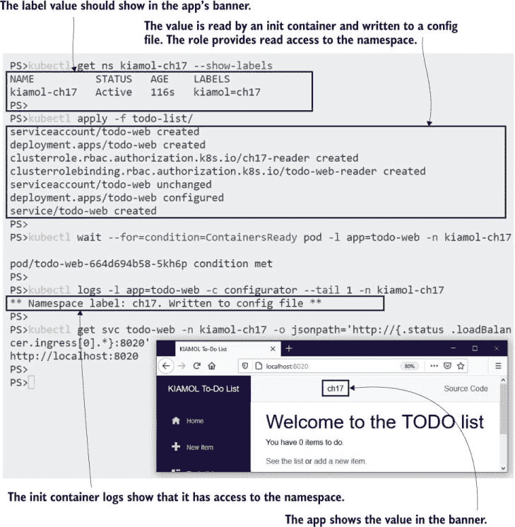

图 17.10 应用可能需要访问来自其他集群资源的配置数据。

如果攻击者从待办事项应用中获得了对 API 的访问权限，他们能做的事情并不多。该应用使用一个专用的服务账户，并且该账户只有一个权限：它可以获取命名空间`kiamol-ch17`的详细信息。列表 17.5 展示了角色和集群角色内部的规则如何限制对命名资源的权限。

列表 17.5 02-rbac.yaml，命名资源规则

```
apiVersion: rbac.authorization.k8s.io/v1
kind: ClusterRole
metadata:
  name: ch17-reader
rules:
- apiGroups: [""]                 # Namespace access requires a
  resources: ["namespaces"]       # ClusterRole; this grants 
  resourceNames: ["kiamol-ch17"]  # get access for one namespace.
  verbs: ["get"]
```

RBAC 的一个缺点是规则在应用之前需要资源存在，因此在这种情况下，命名空间和服务账户必须在创建角色和角色绑定之前存在。当您使用 kubectl 应用一个 manifest 文件夹时，它不会寻找依赖关系以正确顺序创建资源。它只是按照文件名顺序应用文件。这就是为什么列表 17.6 中的 RBAC manifest 被称为`02-rbac.yaml`，以确保它在服务账户和命名空间存在之后创建。

我们已经探讨了深入到特定应用的权限，但 RBAC 的另一个主要功能是将同一组规则应用于一组主体。我们将继续探讨这一点。

## 17.3 将角色绑定到用户组和服务账户

角色绑定和集群角色绑定可以应用于组，用户和服务帐户都可以属于组，尽管它们的工作方式不同。最终用户在 Kubernetes 外部进行身份验证，API 信任提供的用户名和组信息。用户可以是多个组的成员，组名和成员资格由身份验证系统管理。服务帐户的限制更多；它们始终属于两个组：集群中所有服务帐户的组，以及命名空间中所有服务帐户的组。

组是绑定的另一种主题，所以规范是相同的，只是你将角色或集群角色绑定到组而不是用户或服务帐户。Kubernetes 不验证组名，所以确保绑定中的组与身份验证系统设置的组相匹配的责任在你。证书可以包含组信息，因此我们可以为属于不同组的用户创建证书。

现在试试看 使用证书生成器创建更多经过身份验证的用户，这次在证书中设置组成员资格，为一个站点可靠性工程师（SRE）组和测试者组。

```
# create two users:
kubectl apply -f user-groups/

# confirm that the SRE can’t delete Pods:
kubectl exec sre-user -- kubectl auth can-i delete pods

# print the username and group in the certificate:
kubectl exec sre-user -- sh -c 'openssl x509 -text -noout -in /certs/user.crt | grep Subject:'

# confirm the test user can’t read Pod logs:
kubectl exec test-user -- kubectl auth can-i get pod/logs

# print this certificate’s details:
kubectl exec test-user -- sh -c 'openssl x509 -text -noout -in /certs/user.crt | grep Subject:'
```

现在你有了两个用户证书，其中用户属于代表他们团队的组：SRE 和测试者。集群中不存在任何用户名或组的绑定，所以用户目前什么都不能做。图 17.11 显示 Kubernetes 使用证书主题的标准字段——通用名是用户名，组织是组（多个组织可以映射到多个组）。

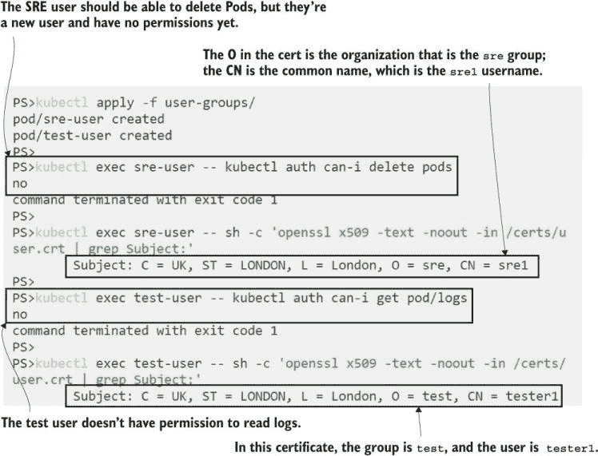

图 17.11 证书可以包含零个或多个组以及用户名。

我们确实希望 SRE 能够删除 Pods，我们也希望测试者能够读取 Pod 日志。我们可以在组级别应用绑定，以给团队中的所有用户相同的权限。然后我们将管理组成员资格的责任移交给身份验证系统。对于 SRE 来说，最简单的事情是让他们在整个集群中拥有查看角色，这样他们就可以帮助诊断问题，以及拥有他们团队管理的命名空间中的编辑角色。这些是内置的集群角色，所以我们只需要绑定，其中主题是 SRE 组。对于测试者，我们希望拥有列表 17.6 中非常受限的权限集。

列表 17.6 test-group.yaml，一个用于获取 Pod 详细信息和读取日志的角色

```
apiVersion: rbac.authorization.k8s.io/v1
kind: ClusterRole
metadata:
  name: logs-reader
rules:
- apiGroups: [""]
  resources: ["pods ", "pods/log"]  # Logs are a subresource of Pods
  verbs: ["get"]                    # that need explicit permissions.
```

列表 17.6 中的完整清单包括一个集群角色绑定，将此角色授予测试组，这实际上赋予了测试者查看任何 Pods 和查看其日志的权限，但不能列出 Pods 或对任何其他资源进行操作。某些资源有子资源，这些子资源是单独授权的，所以如果你有获取 Pods 的权限，除非你也有获取日志子资源的权限，否则你不能读取日志。当你为两个组应用绑定时，用户将拥有他们需要的权限。

现在尝试一下 通过将他们需要的角色绑定到他们所属的组来赋予新用户权力。

```
# apply the roles and bindings:
kubectl apply -f user-groups/bindings/

# confirm the SRE cannot delete in the default namespace:
kubectl exec sre-user -- kubectl auth can-i delete pods

# confirm they can delete in the ch17 namespace:
kubectl exec sre-user -- kubectl auth can-i delete pods -n kiamol-ch17

# confirm the tester can’t list Pods:
kubectl exec test-user -- kubectl get pods

# confirm the tester can read the logs for a known Pod:
kubectl exec test-user -- kubectl logs test-user --tail 1
```

您可以在图 17.12 中看到，这正如预期的那样工作：用户拥有所需的权限，但我们是在更高级别应用它们，将角色绑定到组。我们可以更改权限而无需修改用户或组。新用户可以到来，人们可以在团队之间移动，只要认证系统保持最新，Kubernetes 在 API 调用中看到当前的组成员关系即可，无需进行任何 RBAC 更改。

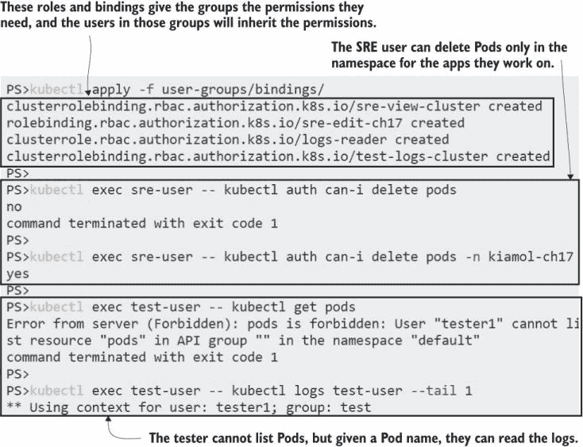

图 17.12 在组级别设置权限，为用户提供所需权限并具有易于管理的体验。

在配置了 Active Directory 的企业环境中或具有集成认证的云环境中，这一切都很正常。在较小规模的集群中，您可能希望在 Kubernetes 内管理认证，但像本节中那样生成证书实际上并不可行。该脚本创建的证书有效期为一年，并且组列表已嵌入到证书中，因此很难更改组成员关系。如果您想撤销访问权限，您需要轮换 Kubernetes 颁发者证书并向每个用户分发新证书。

一种常见的替代方法是误用服务账户，为每个最终用户创建一个服务账户，并使用 kubectl 分发令牌进行认证。这种方法无法扩展到数百个用户，但如果您没有外部认证系统，并且希望为数不多的用户提供对 Kubernetes 的安全访问，它是一个可行的选项。您需要对组采取稍微古怪的方法，因为您不能创建一个组并将服务账户添加到其中。相反，您需要将命名空间视为组，为每个您想要的组创建一个命名空间，并将所有服务账户放入该组。图 17.13 显示了设置。

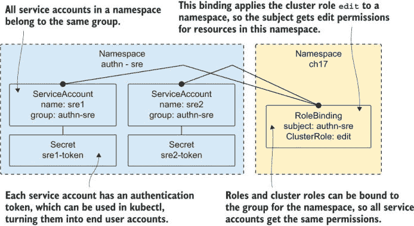

图 17.13 服务账户有令牌和组，因此它们可以像用户账户一样被误用。

服务账户作为用户账户工作，因为您可以在集群内管理它们，轻松地创建或删除它们，并通过删除令牌来撤销访问权限。我们可以使用服务账户重新创建我们的 SRE 和测试用户，使用单独的命名空间来表示这两个组，并将绑定应用于这些组。

现在尝试一下 为 SRE 和测试组创建命名空间，并为每个命名空间中的用户创建一个服务账户和令牌。

```
# create namespaces, service accounts, and tokens:
kubectl apply -f user-groups/service-accounts/

# apply bindings to the groups:
kubectl apply -f user-groups/service-accounts/role-bindings/

# confirm the SRE group has view access across the cluster:
kubectl get clusterrolebinding sre-sa-view-cluster
 -o custom-columns='ROLE:.roleRef.name,SUBJECT KIND:.subjects[0].kind,SUBJECT NAME:.subjects[0].name'
```

新的集群角色绑定适用于服务账户组，这是服务账户已被创建的命名空间。这些集群角色与用户证书集群角色的区别只是组名：`system:serviceaccounts:kiamol-authn-sre`用于 SRE，这是`kiamol-authn-sre`命名空间中所有服务账户的组，如图 17.14 所示。

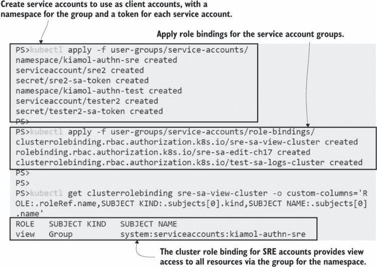

图 17.14 使用服务账户、令牌和命名空间伪造认证系统

服务账户使用 JSON Web Token (JWT)进行身份验证。此令牌预先填充在 Pod 卷中。令牌作为类型为`kubernetes.io/` `service-account-token`的 Secret 创建，Kubernetes 确保每个服务账户至少有一个令牌。您也可以创建自己的令牌，这使得分发、轮换和吊销令牌变得容易。这个过程很简单，因为 Kubernetes 实际上生成令牌；您只需创建一个正确类型的空 Secret，集群就会添加数据——您在之前的练习中已经做到了这一点，所以这些账户已经准备好使用。

Kubectl 支持多种不同的身份验证选项——我们已经看到的证书以及用户名和密码、第三方身份验证和 JWT。您可以通过设置使用服务账户令牌的凭据的新上下文来对集群进行身份验证。任何使用该上下文的 kubectl 命令都将作为服务账户运行，因此将应用服务账户组的权限。

现在试试看 创建一个新的上下文，用于 SRE 服务账户的 kubectl，并确认您能够访问集群。这将在使用您集群的任何身份验证系统时都有效。

```
# add a Base64 command if you’re using Windows:
. .\base64.ps1

# decode the Secret for the token, and save to a file:
kubectl get secret sre2-sa-token -n kiamol-authn-sre -o jsonpath='{.data.token}' | base64 -d > sa-token

# load new credentials into kubectl from the token file:
kubectl config set-credentials ch17-sre --token=$(cat sa-token)

# create a new context using the SRE credentials:
kubectl config set-context ch17-sre --user=ch17-sre --cluster $(kubectl config view -o jsonpath='{.clusters[0].name}')

# confirm you can delete Pods as the SRE account:
kubectl delete pods -n kiamol-ch17 -l app=todo-web --context ch17-sre
```

这个练习适用于所有集群，即使它们配置了第三方身份验证，因为它使用 Kubernetes 自己的服务账户身份验证。您可以在图 17.15 中看到，我可以以 SRE 服务账户的身份发出命令，并且该用户有权删除`kiamol-ch17`命名空间中的 Pod。

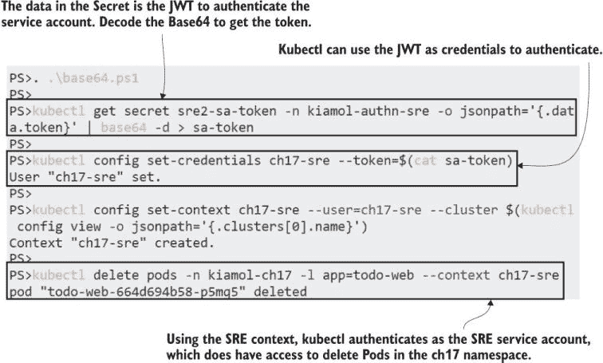

图 17.15 分发服务账户令牌使用户能够以该账户的身份进行身份验证。

如果您对 JWT 感兴趣，可以解码`sa-token`文件的内容（[`jwt.io`](https://jwt.io)上的在线工具会为您完成），您会看到 Kubernetes 是发行者，而主题是服务账户名称`system:serviceaccount:kiamol-authn-sre:sre2`。RBAC 权限是该服务账户的联合角色、服务账户命名空间中的组以及所有服务账户的组。在此提醒一点：在授予服务账户组角色时，请非常小心主题。很容易不小心通过省略主题中的命名空间将每个账户都变成集群管理员（这正是某些版本的 Docker Desktop 的问题；请参阅[`github.com/docker/for-mac/issues/4774`](https://github.com/docker/for-mac/issues/4774)的历史记录）。

现在我们管理集群内的身份验证，很容易通过删除特定用户的令牌来撤销其访问权限。他们从 kubectl 提供的令牌不再验证服务账户，因此他们会对每个操作收到未经授权的错误。

现在试试看 通过删除令牌来停止用户以 SRE 服务账户的身份进行身份验证。

```
# delete the access token:
kubectl delete secret sre2-sa-token -n kiamol-authn-sre

# wait for the token removal to reach controllers:
sleep 30

# now try to get Pods as the SRE account:
kubectl get pods --context ch17-sre
```

撤销访问权限很简单，如图 17.16 所示。轮换令牌需要更多一些过程；您可以创建一个新的令牌并发送给用户（安全地！），然后用户更新了上下文后删除旧令牌。更改组更复杂，因为您需要在组的命名空间中创建一个新的服务账户，创建并发送新的令牌，然后删除旧的服务账户。

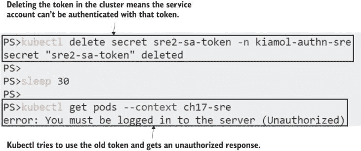

图 17.16 您可以通过删除令牌来移除访问权限，而不必删除服务账户。

对于用户的服务账户是一种简单的保护集群的方法，如果您能接受其局限性。这可能是一个合理的入门方式，但您应该了解您的路线图，这很可能会使用 OpenID Connect (OIDC) 进行身份验证并将您的 RBAC 规则绑定到 OIDC 用户名和组声明。

当您的身份验证系统已经配置好并且 RBAC 规则已经设置后，您仍然面临挑战。Kubernetes 没有一套很好的工具用于审计权限，所以在下文中，我们将探讨第三方选项以验证权限。

## 17.4 使用插件发现和审计权限

`kubectl can-i` 命令对于检查用户能否执行某个功能很有用，但这是您用于验证权限的唯一工具，而且它并没有真正深入到足够远。您通常希望从另一个角度来处理，询问谁可以执行某个功能或打印出访问权限矩阵，或者搜索 RBAC 主体并查看他们的角色。Kubectl 有一个插件系统来支持额外的命令，以及插件来满足所有这些不同的 RBAC 接近方式。

添加 kubectl 插件的最佳方式是使用 Krew，即插件管理器。您可以直接在您的机器上安装 Krew，但安装过程并不十分顺畅，您可能不希望在机器上安装插件（如果您这样做，安装文档在这里 [`krew.sigs.k8s.io/docs/user-guide/setup/install`](https://krew.sigs.k8s.io/docs/user-guide/setup/install)）。我已经准备了一个已经安装了 Krew 的容器镜像——您可以使用这个镜像以安全的方式尝试插件。我们将首先查看的是 `who-can`，它类似于 `can-i` 的逆操作。

现在试试看 启动 Krew Pod，并连接以安装和使用 `who-can` 插件。

```
# run a Pod with kubectl and Krew already installed:
kubectl apply -f rbac-tools/

# wait for the Pod:
kubectl wait --for=condition=ContainersReady pod -l app=rbac-tools

# connect to the container:
kubectl exec -it deploy/rbac-tools -- sh

# install the who-can plugin:
kubectl krew install who-can

# list who has access to the todo-list ConfigMap:
kubectl who-can get configmap todo-web-config
```

任何二进制文件都可以是 kubectl 插件，但 Krew 通过精选有用的插件简化了设置并增加了一些流程。（Krew 是 Kubernetes 特别兴趣小组项目。）插件在您的认证用户上下文中运行，因此您需要确保它们不会执行不应该做的事情。本练习中的 `who-can` 插件由 Aqua Security 发布，如图 17.17 所示，它通过遍历 RBAC 角色以找到匹配的权限，然后打印出具有这些角色绑定的主体。

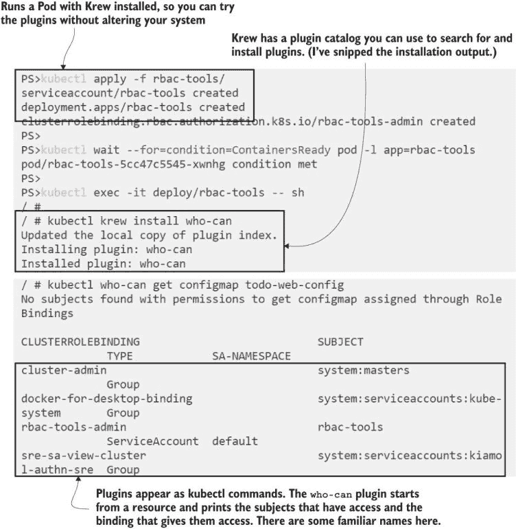

图 17.17 插件为 kubectl 添加了新功能：`who-can` 是 RBAC 查询的有用工具。

我们将查看另外两个插件，它们填补了 RBAC 审计的空白。下一个是 `access-matrix`，它在一个资源类型或特定资源上操作，并打印出该对象的全部访问规则，显示谁可以做什么。这是持续审计中最有用的工具，您可以在计划作业中运行，收集一系列访问矩阵，并确认没有设置意外的权限。

现在试试吧 安装 `access-matrix` 插件，并打印不同资源的矩阵。

```
# install the plugin:
kubectl krew install access-matrix

# print the matrix for Pods:
kubectl access-matrix for pods -n default

# the print the matrix for the to-do list ConfigMap:
kubectl access-matrix for configmap todo-web-config -n default
```

`access-matrix` 的默认输出会打印出漂亮的图标，如图 17.18 所示，但您可以在命令行中配置纯 ASCII 输出。我的输出被大量截断，因为完整的权限列表包括了所有控制器和其他系统组件。ConfigMap 的访问矩阵更容易管理，您可以看到在第 17.3 节中创建的 SRE 组具有列表权限，因此它们可以看到这个对象，但 `rbac-tools` 服务账户具有完全更新和删除权限。这是因为我在这个练习中偷懒，给了账户 `cluster-admin` 角色，而不是构建一个只包含插件所需权限的自定义角色。

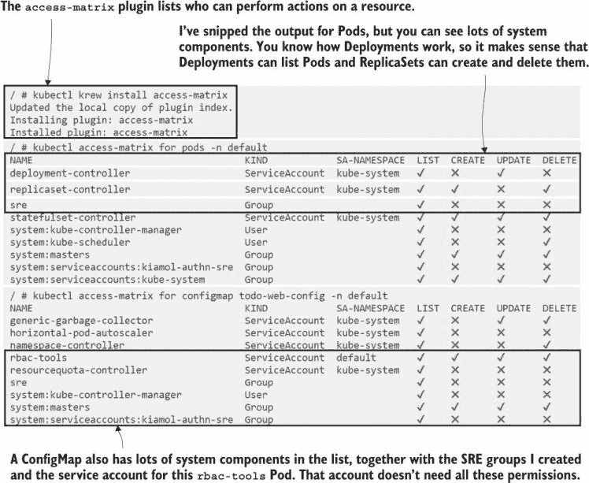

图 17.18 `access-matrix` 插件显示了谁可以使用不同的资源进行什么操作。

我们将要查看的最后一个插件是 `rbac-lookup`，它对于搜索 RBAC 实体非常有用。它会在用户、服务账户和组中找到匹配项，并显示绑定到实体的角色。这是一个从用户角度检查 RBAC 的好工具，当您想确认一个实体是否分配了正确的角色时。

现在试试吧 安装 `rbac-lookup` 插件，并搜索 SRE 和测试实体。

```
# install the plugin:
kubectl krew install rbac-lookup

# search for SRE:
kubectl rbac-lookup sre

# search for test:
kubectl rbac-lookup test
```

没有任何插件能为您提供一个用户及其所属所有组的综合权限，因为 Kubernetes 对组成员关系一无所知。RBAC 通过在用户展示其组列表时获取综合权限来工作，但在传入请求之外，用户和组之间没有联系。这与服务账户不同，因为它们始终属于已知的组——您可以在图 17.19 中看到 SRE 组。没有方法可以找到属于 SRE 用户组的用户，但您可以通过列出 `kiamol-authn-sre` 命名空间中的所有服务账户来查看属于服务账户组的成员。

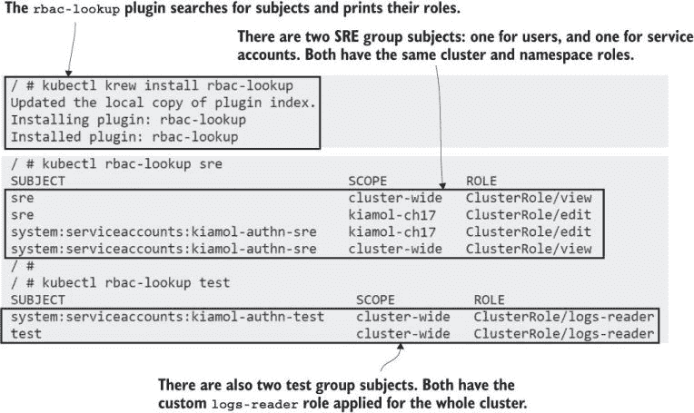

图 17.19 搜索 RBAC 实体并打印它们所绑定的角色

值得探索 Krew 目录以找到更多可以帮助您日常工作的插件。本节重点介绍了帮助 RBAC 的成熟插件；它们很受欢迎，并且存在很长时间，但还有许多其他宝藏等待发现。本章的实用工作到此结束。我们将完成对 RBAC 如何影响您的工作负载以及实施访问控制的指导的探讨。

## 17.5 规划您的 RBAC 策略

RBAC（基于角色的访问控制）为外部用户和集群中运行的应用程序提供了统一的方式来保护 Kubernetes。角色和绑定机制对这两种类型的主体都是相同的，但它们需要非常不同的方法。用户通过一个独立的、受信任的系统进行认证，该系统声明用户名和用户所属的组。这里的指导是，从预定义的集群角色——查看、编辑和管理——开始，并将它们应用于组。集群管理员角色应严格保护，并且仅在真正需要时使用，最好将其限制为自动化流程的服务账户。

考虑将命名空间用作安全边界，以便进一步限制范围。如果你的身份验证系统有分组信息，可以识别某人的团队及其在该团队中的职能，这可能足以将绑定映射到角色和产品命名空间。对集群范围内的角色保持警惕，因为它们可以用来获得提升的访问权限。如果用户可以在任何命名空间中读取机密信息，他们可能能够获取特权服务账户的 JWT 令牌，并获取该命名空间的管理员访问权限。

应谨慎使用服务账户，并且仅由需要访问 Kubernetes API 服务器的应用程序使用。你可以通过将默认服务账户的属性设置为禁用自动挂载令牌来禁用 Pod 中的令牌自动挂载，这样 Pod 永远不会看到令牌，除非它们主动请求它。记住，RBAC 并不是关于在部署时限制访问。Pod 不需要配置服务账户来使用作为卷挂载的 ConfigMap。你需要服务账户仅用于使用 Kubernetes API 的应用程序，在这些情况下，每个应用程序都应该有一个专门的服务账户，它仅具有足够的权限来完成应用程序所需的工作，最好是与命名资源相关联的权限。

应用 RBAC 并不是故事的结束。随着你的安全配置文件成熟，你将希望添加审计以确保策略不会被规避，并添加准入控制器以确保新应用程序具有所需的安全控制。我们在这里不会涉及这些内容；只需知道，保护你的集群是关于使用多种方法来获得深度安全。

好的，在你进入实验室之前，先清空集群。

现在试试看 移除本章的所有资源。

```
kubectl delete all,ns,rolebinding,clusterrolebinding,role,clusterrole,serviceaccount -l kiamol=ch17
```

## 17.6 实验室

你在 17.2 节中运行的 Kube Explorer 应用程序也可以显示服务账户，但它需要更多的权限才能做到这一点。实验室文件夹中有该应用程序的新一组清单，它赋予了它访问默认命名空间中 Pods 的权限。本实验室的任务是为该应用程序添加角色和绑定，以便它可以执行以下操作：

+   在`kiamol-ch17-lab`命名空间中显示和删除 Pods

+   在`default`命名空间中显示服务账户

+   在`kiamol-ch17-lab`命名空间中显示服务账户

仔细查看现有的 RBAC 规则是如何设置的——这应该会让这个过程变得简单。只需记住绑定中的命名空间如何影响作用域。我的解决方案可供您检查：[`github.com/sixeyed/kiamol/blob/master/ch17/lab/README.md`](https://github.com/sixeyed/kiamol/blob/master/ch17/lab/README.md).
